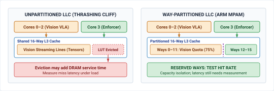
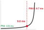

# Silicon Placement {#sec-placement}

::: {layout-narrow}
::: {.column-margin}

\chapterminitoc

:::

::: {.content-visible when-format="pdf"}
\noindent
{fig-alt="Isometric blueprint showing silicon placement: heterogeneous physical AI SoC with deliberative cognitive NPU cluster, 3D memory stacks, perimeter thermal dissipation fins, shared interconnect crossbar bus, isolated deterministic real-time MCU enclave, and Harvard crimson QoS isolation trench."}
:::

::: {.content-visible unless-format="pdf"}
{fig-alt="Isometric blueprint showing silicon placement: heterogeneous physical AI SoC with deliberative cognitive NPU cluster, 3D memory stacks, perimeter thermal dissipation fins, shared interconnect crossbar bus, isolated deterministic real-time MCU enclave, and Harvard crimson QoS isolation trench."}
:::

:::

## Purpose {.unnumbered .unlisted}

::: {.content-visible when-format="pdf"}
\begin{marginfigure}
\vspace{1em}
\resizebox{\linewidth}{!}{\mlphysicalstackfull{20}{100}{20}{20}{20}}
\end{marginfigure}
:::

_Why do the architectural boundaries drawn between brain and nervous system collapse the moment they share memory buses and power rails on the same die?_

Blocks in an architecture diagram can compete for the same memory bus, power supply, and cooling capacity. A burst of neural computation may delay a control task even when the tasks run on different processor cores. The delay is critical as the machine moves while the safety path waits for data or recovers from a power disturbance. Compute placement must therefore establish how much interference each shared resource permits and whether the remaining response time fits the physical deadline. Software privilege boundaries alone cannot answer that question. Measurements under contention can expose a failed isolation claim, while resource reservations or separate hardware can reduce the coupling that caused it. Those choices also consume space and power that the machine must supply. Placing the brain and nervous system on silicon is a co-design decision about workload interference, execution deadlines, and tolerance for delayed correction.



::: {.callout-learning-objectives}

- Inventory shared hardware resources used by learned proposal and safety enforcement paths
- Measure enforcement latency while competing workloads stress shared memory, power, and thermal resources
- Design tests that could disprove a claimed separation between proposal and enforcement
- Analyze how fluctuations in power supply (power transients) and heat distribution (thermal coupling) can affect the timing margins of safety-critical systems, leading to potential timing violations in real-time applications.
- Select isolation remedies using measured interference, resource availability, and the plant's response deadlines

:::

## The Silicon Substrate {#sec-placement-silicon-substrate}

Runtime safety filters, Control Barrier Functions, simplex architectures, and fail-operational fallback maneuvers can establish conditional invariance under plant, sensing, feasibility, and timing assumptions. One such assumption is that the computing machinery evaluates its quadratic program or projection filter strictly within its hard physical sampling deadline ($T_{\text{enforce}} \le 1.0\text{ ms}$). Where do these algorithms actually execute on the physical machine? On a software architecture diagram, the boundary between the Cognitive Deliberation Tier and the Deterministic Nervous System is cleanly drawn as a neat, dashed privilege boundary. On physical silicon, that boundary collapses onto a single shared die. Consider a modern heterogeneous System-on-Chip (SoC) governing an autonomous mobile robot or industrial bypass valve. A learned vision-language-action policy executes on the embedded GPU or neural accelerator, while a deterministic safety enforcer executes on an adjacent real-time microcontroller core. When the neural policy initiates an inference pass across a multi-billion parameter model, billions of transistors activate simultaneously. This massive, instantaneous current surge ($dI/dt$) induces an inductive and resistive voltage droop ($\Delta V = L \cdot dI/dt + IR$) across the chip's internal Power Distribution Network (PDN), risking clock instability and timing closure failures in adjacent real-time logic.[^fn-place-voltage-droop] Concurrently, dense tensor matrix multiplications saturate the shared LPDDR memory bus, streaming gigabytes of activation maps and evicting the safety enforcer's pinned sensor tables from the last-level cache.

[^fn-place-voltage-droop]: **Inductive Voltage Droop Mechanics**\index{Power Distribution Network!inductive voltage droop}\index{Inductive voltage droop!VLSI design}: In high-performance VLSI design, inductive voltage droop ($\Delta V = L \cdot dI/dt$) occurs across the parasitic inductance ($L$) of power distribution package pins and on-chip power grids when massive numbers of logic gates switch simultaneously. If the local rail voltage drops below the minimum operating threshold ($V_{\min}$), digital flip-flops suffer setup-time violations, metastabilities, or brownout resets that disrupt deterministic real-time execution.

When a real-time safety reflex reads a sensor buffer under a $1.0\text{ ms}$ control deadline, its requests can queue behind direct memory access traffic. The worked transaction-level example below shows how a subdeadline can fail under stated assumptions. The enforcer misses the modeled $120\,\mu\text{s}$ sensor-read-plus-compute subdeadline because the proposal workload occupies the shared memory controller. The full sensor-to-actuator deadline still needs separate measurement; the missed subdeadline shows that logical privilege alone does not establish the required timing separation.

::: {.column-margin .margin-pointer}
↰ **Prerequisite:** Hardware execution cadences and microcontroller timing loops were defined in @sec-nervous-cadences.
:::

This chapter addresses the physical foundation of the Part III execution pipeline, highlighted in @fig-13-locator. All preceding software contracts—the sensor timestamps of @sec-perception, the decaying spatial beliefs of @sec-memory, the expiring intent leases of @sec-intent, the continuous action chunks of @sec-planning, and the reflex enforcers of @sec-enforcement—rely on the bedrock assumption that software execution deadlines correspond to physical reality.

::: {#fig-13-locator fig-env="figure" fig-pos="htb" fig-cap="**Silicon placement architecture focus**: The four-tier physical AI systems architecture highlights the real-time safety tier, with silicon placement as this chapter's active focus. Read the highlighted box as the physical co-location boundary where cognitive bursts and hard real-time reflex loops land on one system-on-chip and then compete for memory controllers, interconnect crossbars, power rails, and thermal mass." fig-alt="Diagram titled Physical AI Systems Architecture Stack, drawn as four stacked tiers. Layer 4 is system governance and assurance at 0.1 to 1 hertz, holding boxes for shared autonomy, verification, safety cases, and frontier limits. Layer 3 is the brain, a cognitive deliberation tier at 1 to 50 hertz, holding five stages named ingestion, perception, memory, intent, and planner. A dashed proposal-permission privilege boundary separates it from layer 2, the nervous system, a real-time safety and timing tier at 1000 hertz. Layer 1 is the physical body and continuous plant. Layer 2 is shaded and its silicon placement and bus quality of service box is outlined; the badge reads Active Focus, Chapter 13, Silicon Placement."}
{width="100%"}
:::

This shared-silicon reality governs every domain of physical embodiment across all **Three Physical Machine Archetypes**\index{Three Physical Machine Archetypes}:

- In **Mobile Systems (Class 1)**, an autonomous chassis co-locates multi-camera vision-language-action navigation models [@brohan2023rt2] on an embedded GPU with $1000\text{ Hz}$ steer-by-wire and emergency braking reflexes on an adjacent real-time core. A memory bus stall during feature extraction delays an obstacle-avoidance brake command, allowing moving kinetic mass to breach safety stopping margins.
- In **Manipulators (Class 2)**, an articulated robot arm executes high-dimensional diffusion grasping policies ($20\text{--}50\text{ Hz}$) alongside high-gain $SE(3)$ kinematics and joint torque loops ($1000\text{ Hz}$). If an accelerator tensor burst evicts safety state tables from the shared last-level cache, the resulting microsecond bus jitter degrades feedback phase margins, exciting gearbox compliance, inducing motor torque ripple, or breaching ISO 10218 safety envelopes.
- In **Process and Energy Systems (Class 3)**, industrial chemical bypass valves and high-voltage grid battery inverters co-locate continuous thermodynamic optimization with hard real-time overpressure and power-stage shoot-through interlocks. A delayed safety interrupt allows manifold pressure to spike beyond structural burst limits or power transistors to enter catastrophic thermal runaway.

Following the end-to-end argument in system design [@saltzer1984end], memory protection and operating system process isolation do not by themselves establish operational independence. On a heterogeneous die,[^fn-place-system-chip] **operational independence**\index{Operational independence!definition} requires that proposal-side activity cannot push enforcement execution beyond its hard physical deadline, and that proposal-side crashes or thermal overruns cannot disable the nervous system's authority to refuse.

[^fn-place-system-chip]: **Heterogeneous System-on-Chip Architecture**\index{Heterogeneous system-on-chip!architecture}\index{System-on-Chip (SoC)!heterogeneous compute}: Heterogeneous SoCs integrate multiple distinct compute domains onto a single silicon substrate, combining high-throughput application processors and neural accelerators with deterministic real-time safety islands. Although memory management units isolate software address spaces across domains, hardware subcomponents continue to share power distribution networks, clock distribution trees, and DRAM controllers. Under peak cognitive burst workloads, uncoordinated resource contention across these shared physical structures can degrade real-time response times beyond critical physical deadlines.

Because these couplings are governed by physical solid-state phenomena rather than software abstractions, architectural claims of isolation must be treated as hypotheses to be falsified through rigorous measurement. Verifying a system requires four distinct engineering steps: building an exhaustive claimant inventory of every shared silicon resource; subjecting the proposal path to synthetic worst-case compute, memory, and bus contention while measuring the tail latency distribution of the enforcement path at $P_{99}$ and $P_{99.9}$; measuring thermal dissipation and voltage droop under sustained Joule heating; and recording a formal placement decision that bounds worst-case response times within physical safety margins.

Transforming logical software separation into verifiable physical isolation requires auditing and partitioning every shared hardware resource on the silicon die. We begin in @sec-placement-two-paths-one-die by analyzing the co-location of cognitive proposals and deterministic safety enforcement across heterogeneous execution engines, mapping their competing timing demands and isolation requirements. In @sec-placement-resource-contention, we quantify microarchitectural contention across interconnect crossbars, shared caches, and DRAM controllers, applying queuing models and arithmetic intensity to evaluate memory saturation. @Sec-placement-boundary-contract establishes the formal boundary contract, examining lock-free state exchange mailboxes and bounded fallback behaviors that prevent reader stalling. We then analyze thermal and electrical coupling in @sec-placement-thermal-timing-coupling, modeling Joule heating, clock throttling hysteresis, and power-rail collapse. @Sec-placement-testing-separation develops loaded adversarial test harnesses to empirically falsify claimed architectural independence. Finally, @sec-placement-isolation-decisions through @sec-placement-summary formulate the hierarchy of silicon isolation decisions, synthesize full-system hardware allocation budgets, review critical systems fallacies, and summarize the complete placement methodology.

## Two Paths on One Die {#sec-placement-two-paths-one-die}

Placement cannot defer to integration; the physical assignment of software functions to hardware execution engines determines separation. Consider a valve regulating high-pressure fluid flow in a chemical processing line, where a learned model adjusts the valve trim position to track a variable target flow rate while an enforcement filter prevents downstream pressure transients that would rupture the pipe. The machine partitions this control across two paths with conflicting requirements: the proposal path ingests downstream pressure histories, acoustic vibration signals, and temperature logs over a moving window of one hundred samples, running a learned neural policy at $20\text{ Hz}$ to calculate a recommended valve displacement. It operates under a soft deadline of $45\text{ ms}$, holds no direct hardware authority over the motor driver, and runs in an unprivileged user space. The enforcement path samples raw differential pressure transducers at $1000\text{ Hz}$, evaluates physical boundary constraints on pressure slew rates and cavitation limits, and generates electrical drive commands for the valve servo. It executes under a hard physical deadline of $1.0\text{ ms}$, requires an execution budget bounded at $400\,\mu\text{s}$ to leave sufficient margin for mechanical valve transit, and runs in a privileged real-time execution domain. Only the enforcement path holds memory-mapped input-output (MMIO)\index{Memory-mapped I/O} access to the pulse-width modulation (PWM) registers\index{Pulse-width modulation!registers} to command the valve motor.

::: {#dfn-placement-heterogeneous-silicon-partitioning .callout-definition title="Heterogeneous silicon partitioning"}

***Heterogeneous silicon partitioning***\index{Heterogeneous silicon partitioning!definition}\index{Silicon partitioning!definition} is the architectural allocation of stochastic, high-capacity cognitive workloads (perception, learned policy evaluation) and deterministic reflex loops (safety invariant checks, actuator commutation) across specialized execution domains isolated in hardware.

1.  **Significance**: Placing high-capacity neural deliberation and real-time safety enforcement on the same general-purpose operating system or compute engine creates catastrophic common-mode failures. Kernel thread preemption, dynamic memory allocation, and GPU warp scheduling inject multi-millisecond tail jitter that causes the safety reflex to miss physical control deadlines.
2.  **Distinction**: Unlike logical software process isolation (such as Linux containers or POSIX process priorities), silicon partitioning enforces isolation across independent hardware registers, tightly-coupled static memories (TCM), and dedicated peripheral buses.
3.  **Common pitfall**: Assuming multi-core CPU affinity provides true failure-domain separation. Cores that share on-chip L3 caches, DRAM memory controllers, phase-locked loop (PLL) clock trees, or power distribution rails remain vulnerable to cross-core interference, thermal throttling, and voltage droop brownouts.

:::

::: {.column-margin .margin-pointer}
↰ **Prerequisite:** The sub-millisecond execution deadline of the CBF-QP reflex enforcer was established in @sec-enforcement-minimal-intervention.
:::

Concrete performance numbers require mapping these functions onto physical silicon domains. In a heterogeneous dual-brain system-on-chip, such as the canonical dual-brain architecture introduced in @sec-nervous, proposal inference maps onto an unprivileged Linux Application Processor (MPU) or dedicated neural accelerator running with standard CPU core affinity,[^fn-place-core-pinning] which reduces migration overhead but remains vulnerable to PREEMPT_RT kernel scheduling jitter.[^fn-place-preempt-rt] State exchange between the paths maps onto a shared static memory mailbox[^fn-place-rpmsg-mailboxes] or ring buffer in dynamic random-access memory (DRAM)\index{DRAM}\index{Dynamic random-access memory|see{DRAM}}. Safety enforcement and sensor validation map onto a dedicated Real-Time Controller Subsystem (MCU) running bare-metal firmware or a deterministic real-time operating system protected by a hardware Memory Protection Unit.[^fn-place-memory-partitioning] Device input-output maps onto dedicated serial peripheral interface controllers, analog-to-digital converters, and timer channels directly wired to the MCU. Telemetry logging, network communications, and fault recording map onto the Linux MPU. Where shared-silicon interference and common-cause faults cannot be bounded for the application, a separately powered safety controller is one design option.[^fn-place-asild-lockstep] As detailed in @tbl-13-compute-allocation, extending the classical cyber foraging and edge-placement paradigms of pervasive computing [@satyanarayanan2001pervasive] to heterogeneous autonomous silicon, each compute domain on a modern physical AI platform exhibits distinct trade-offs across nominal clock rate, tail latency determinism, operating system isolation, and memory bus coupling.

| Compute Engine Domain                                       | Nominal Clock & Power                                    | Timing Behavior to Qualify                                          | OS & Privilege Isolation                                               | Memory & Interconnect Coupling                                                  | Target Workload Assignment                                                                               |
|:------------------------------------------------------------|:---------------------------------------------------------|:--------------------------------------------------------------------|:-----------------------------------------------------------------------|:--------------------------------------------------------------------------------|:---------------------------------------------------------------------------------------------------------|
| **Application Processor Subsystem (MPU)**                   | $1.0\text{--}2.2\text{ GHz}$, $2\text{--}10\text{ W}$    | Scheduler and memory tails depend on configuration                  | Rich OS (Linux / POSIX), Ring 3 user space vs. Ring 0 kernel           | Shared coherent L3 cache, virtual memory via MMU, unified DRAM                  | Telemetry logging, edge VLMs/VLAs, PyTorch, ROS2 policy evaluation ($10\text{--}50\text{ Hz}$)           |
| **GPU Tensor Core Engine**                                  | $0.8\text{--}1.3\text{ GHz}$, $10\text{--}40\text{ W}$   | Driver queue and memory contention require measurement              | Host driver queue, user-space runtime, unified virtual memory          | High-throughput LPDDR5/HBM, AXI bursts limited by beats and 4,096-byte boundary | High-throughput perception, multi-camera feature extraction, dense VLM inference                         |
| **Dedicated Neural Processing Unit** (NPU / Systolic Array) | $0.6\text{--}1.0\text{ GHz}$, $2\text{--}8\text{ W}$     | Graph cadence and DMA tail require measurement                      | Hardware mailbox, fixed-depth systolic pipeline, pinned memory buffers | Dedicated on-chip SRAM ($8\text{--}32\text{ MB}$), periodic DMA bursts to DRAM  | Learned policy evaluation, low-latency trajectory chunk generation ($20\text{--}100\text{ Hz}$)          |
| **Real-Time Controller Subsystem (MCU)**                    | $200\text{--}800\text{ MHz}$, $0.1\text{--}1.5\text{ W}$ | Bounded only with qualified clocks, memory, and interrupts          | RTOS (FreeRTOS / Zephyr) or Bare-Metal, MPU memory regions             | Tightly-Coupled Memory (TCM / SRAM), private peripheral bus, zero paging        | Deterministic safety invariants, $1\text{ kHz}$ CBF safety filters [@ames2019control], direct PWM timers |
| **Discrete Safety Microcontroller**                         | $200\text{--}400\text{ MHz}$, $0.2\text{--}1\text{ W}$   | Lockstep detects selected faults; response bound is device-specific | Bare-metal / AUTOSAR Classic, hardware Fault Collection Unit (FCCU)    | Isolated SRAM/Flash, independent external power rails, dedicated crystal        | Emergency mechanical clamping, hardware interlocks, supervisory watchdog trips                           |

: **Heterogeneous compute allocation and execution domain characteristics**: Illustrative placement options; clock, power, jitter, and fault-containment values require a named device and measured operating envelope. {#tbl-13-compute-allocation tbl-colwidths="[16,16,18,18,16,16]"}

In an analytical evaluation of the unloaded system, the computational budgets appear generous. In the enforcement path on the real-time MCU, reading four pressure sensors over a high-speed peripheral bus requires $40\,\mu\text{s}$, evaluating the constraint envelope and computing the actuator signal takes $80\,\mu\text{s}$, and writing the resulting register values to the motor controller timer takes $15\,\mu\text{s}$. The total unloaded execution demand is $135\,\mu\text{s}$. Against the $400\,\mu\text{s}$ computational deadline selected for the $1.0\text{ ms}$ physical cycle (which reserves $600\,\mu\text{s}$ for servo motor settling), the enforcement path exhibits an unloaded slack of $265\,\mu\text{s}$. In the proposal path on the Linux MPU, a policy requiring $3.2\text{ GFLOP}$ per step executes on an accelerator capable of $2.0\text{ TFLOPS}$ sustained throughput, yielding an inference time of $1.6\text{ ms}$. Adding $0.8\text{ ms}$ for tensor formatting and $0.1\text{ ms}$ to publish the proposal to the shared ring buffer, the proposal path requires $2.5\text{ ms}$ of computation per $50\text{ ms}$ cycle, leaving $47.5\text{ ms}$ of unloaded slack under the assumed sustained accelerator rate. Evaluated in isolation, both loops operate with comfortable margins.

::: {.column-margin}
{width="100%" fig-alt="Illustrative timing ladder; actual jitter depends on the device, workload, and measured interference envelope."}

*Candidate execution domains differ in their timing controls; measured tails determine placement.*
:::

Assigning tasks to separate processor cores does not create independent failure domains if the silicon infrastructure is shared.[^fn-std-cast-32a] While the real-time core executes instructions independently from the application processor, both cores rely on common hardware services:

- *Shared interrupt routing:* The Generic Interrupt Controller (GIC) routes peripheral and inter-processor notifications across a shared fabric, where a flood of Ethernet packet interrupts on the Linux MPU can delay the timer interrupt that triggers the $1000\text{ Hz}$ MCU safety loop.
- *Shared memory controllers:* Both paths access the same dynamic memory controller\index{Memory controller} and interconnect crossbar\index{Interconnect crossbar}, where large matrix tile loads generated by the neural accelerator saturate DRAM command queues, turning an expected $20\text{ ns}$ level-two cache refill on the real-time core into a $350\text{ ns}$ round-trip to main memory.[^fn-place-cache-coloring]
- *Shared clock trees:* The cores share phase-locked loops (PLLs) for clock generation, where dynamic voltage and frequency scaling (DVFS) transients on the application processor introduce clock jitter across adjacent real-time domains.
- *Shared power rails:* A single Power Distribution Network (PDN) delivers current to both domains, where switching surges from the neural accelerator drop the internal voltage rail, risking logic state corruption or brownout resets.
- *Shared reset domains:* A kernel panic on the Linux MPU that triggers a hardware watchdog\index{Watchdog timer!hardware} reset can pull down the shared peripheral bus or system interconnect, disabling PWM outputs and leaving the valve unpowered.

[^fn-std-cast-32a]: **Avionic Multicore Certification**\index{Multicore interference!FAA AC 20-193 / CAST-32A}\index{Worst-case execution time!multicore certification}: FAA Advisory Circular AC 20-193 and CAST-32A formalize multicore interference analysis for safety-critical avionics. The standard requires rigorous bounding of worst-case execution times by demonstrating that shared caches, interconnect crossbars, and memory controllers cannot cause critical tasks to overrun execution deadlines. Without hardware-enforced quality-of-service partitions or dedicated interconnect channels, cross-core memory traffic invalidates deterministic timing guarantees.

[^fn-place-preempt-rt]: **PREEMPT_RT**\index{Preempt RT!kernel latency}: A Linux real-time configuration reduces some scheduler latencies, but its tail depends on kernel, drivers, workload, and shared hardware. No portable sub-$50\,\mu\text{s}$ or bare-metal comparison follows without measurement.

[^fn-place-core-pinning]: **Core pinning and processor affinity**\index{Core pinning!CPU affinity}\index{Real-time scheduling!cache thrashing}: The operating system binding of an execution thread to an explicit physical CPU core using interfaces such as `pthread_setaffinity_np` or `taskset`. While core pinning prevents cross-core thread migration overhead, it does not guarantee real-time determinism if pinned cores share last-level caches (LLC), memory controllers, or internal interconnect crossbars with untrusted workloads.

[^fn-place-rpmsg-mailboxes]: **Inter-processor communication mailboxes and RPMsg**\index{Remote Processor Messaging (RPMsg)!mailbox}\index{Heterogeneous computing!IPC}: Hardware FIFO registers and interrupt lines that signal state transitions between asymmetric compute cores (such as an ARM Cortex-A application processor and Cortex-R/M microcontroller). The Remote Processor Messaging (RPMsg) protocol structures shared-memory ping-pong ring buffers (`vrings`) across these mailboxes, enabling lock-free state handoffs without requiring shared operating system primitives.

[^fn-place-memory-partitioning]: **Hardware memory protection and IOMMU domains**\index{Memory Protection Unit!spatial isolation}\index{IOMMU!DMA isolation}: Physical silicon structures that enforce spatial address isolation. While an on-chip Memory Protection Unit (MPU) confines CPU thread execution to bounded memory segments, an Input-Output Memory Management Unit (IOMMU) translates and polices direct memory access (DMA) requests from peripheral bus masters (such as PCIe neural accelerators or camera deserializers), physically preventing an untrusted device from corrupting safety state buffers.

[^fn-place-asild-lockstep]: **Dual-core lockstep**\index{Lockstep processor!fault detection}: Two cores can execute matching instruction streams while comparator logic detects selected divergences. Detection coverage, delay, shared-rail vulnerability, and diagnostic response depend on the device and application safety case; lockstep alone does not establish an ASIL D system.

[^fn-place-cache-coloring]: **Cache coloring and way partitioning**\index{Cache coloring!memory isolation}\index{ARM MPAM!cache partitioning}: Techniques that divide shared cache capacity among competing tasks. Software cache coloring partitions physical page allocations so that addresses from distinct processes map to non-overlapping cache sets, while hardware partitioning mechanisms (such as ARM Memory System Resource Partitioning and Monitoring, MPAM, or Intel Cache Allocation Technology, CAT) dynamically restrict the cache ways an untrusted neural accelerator can allocate, preventing line evictions in critical safety threads.

For the preceding $1.0\text{ ms}$ valve-loop case, compare three *constructed* placements under their stated loads. Shared application cores give an illustrative $P_{99.9}=2.8\text{ ms}$, missing the deadline. A same-die MPU/NPU plus real-time core has an observed loaded execution value of $380\,\mu\text{s}$ against the chosen $400\,\mu\text{s}$ compute allowance, but a modeled thermal clock reduction raises it to $540\,\mu\text{s}$. A separate MCU adds an assumed $150\,\mu\text{s}$ serial transfer to its $135\,\mu\text{s}$ unloaded execution. Each option still needs a measured sensor-to-valve response, fault response, and worst-case interference analysis; separate packages alone do not guarantee a one-tick safe transition.

::: {#chk-placement-asymmetric-multiprocessing .callout-checkpoint title="Asymmetric core allocation and shared silicon services"}

{fig-alt="Conceptual L3 cache partition: unpartitioned vision traffic may evict enforcer tables; reserving ways limits capacity eviction, while hit latency and DRAM contention still require measurement." width=100%}

Before partitioning workloads across processor cores, evaluate the hidden physical coupling paths that breach logical CPU boundaries:

- [ ] **Core pinning vs. silicon independence**: Can you explain why assigning a real-time thread to a dedicated CPU core via `pthread_setaffinity_np` fails to guarantee isolation if that core shares an L3 cache or memory controller with an accelerator?
- [ ] **Generic Interrupt Controller serialization**: Can you describe how high-frequency Ethernet or camera DMA interrupts on an application core can introduce latency jitter into real-time microcontroller interrupt service routines?
- [ ] **Cache line thrashing**: Can you quantify the latency penalty when an untrusted vision model evicts the real-time enforcer's lookup tables from a shared last-level cache into dynamic RAM?
- [ ] **DMA address protection**: Can you explain why an MCU MPU constrains CPU accesses while an IOMMU or bus firewall must constrain DMA masters that could overwrite safety state?

*Logical core affinity is not physical isolation; if two tasks share cache lines, interrupt controllers, or DRAM channels, they belong to the same failure domain.*
:::

## Contention for Shared Resources {#sec-placement-resource-contention}

Every shared physical resource has multiple claimants; a utilization metric that ignores concurrent competition is functionally meaningless. On a system-on-chip regulating a fluid pipeline, physical wires do not respect functional boundaries drawn on a software architecture diagram. The proposal path, the enforcement path, and the system infrastructure share the same silicon die, competing directly for the same memory controllers, crossbar switches, and power distribution rails. Digital claimants on the main memory bus include sensor DMA streams depositing pressure transducer readings and acoustic telemetry into DRAM, the neural accelerator fetching model weight matrices and intermediate activation tensors, the real-time core reading pipeline invariants and historic sensor buffers, actuator write buffers for PWM commands to the flow valve driver, cache controllers executing dirty line writebacks, and diagnostic logging processes writing state records to nonvolatile storage.

::: {.column-margin .margin-pointer}
↰ **Prerequisite:** Multi-camera direct memory access ingress traffic volumes were calculated in @sec-perception-cost-ingestion.
:::

In physical AI hardware design, **crossbar bus and DRAM bank contention**\index{Crossbar bus and DRAM bank contention!definition} is queuing delay when memory and DMA transactions share an interconnect and controller. One in-flight AXI4 transaction may finish before a newly arrived safety request; blocking by a whole model tile requires a specified repeated-grant or FIFO policy. Row-buffer scheduling can add delay, so the actual bound depends on transaction size, queue capacity, QoS semantics, bank mapping, and new arrivals.[^fn-place-dram-bandwidth]

[^fn-place-dram-bandwidth]: **DRAM bank conflicts**\index{DRAM!bank conflicts}: A different row in the same active bank may require precharge and activation before column service. Actual bank mapping, overlap, and scheduling determine the added delay; the three switches in the worked case are explicit assumptions.

Each claimant imposes a demand that can be derived from its transfer size per event and its event rate. In an analytical example of a flow-regulation controller sharing a single $64\text{-bit}$ LPDDR4 memory channel rated at $12.8\text{ GB/s}$ peak bandwidth, sensor direct memory access transfers a $64\text{ kB}$ buffer at $1000\text{ Hz}$, generating an average demand of $64.0\text{ MB/s}$. The learned proposal model executes an inference pass every $20\text{ ms}$ ($50\text{ Hz}$), streaming $60\text{ MB}$ of parameters and activation data for an average demand of $3.0\text{ GB/s}$. The enforcement path executes every $1.0\text{ ms}$ ($1000\text{ Hz}$), reading $4\text{ kB}$ of pipeline state and historical sensor logs, consuming $4.0\text{ MB/s}$ on average. Actuator writes require $1\text{ kB}$ per millisecond ($1.0\text{ MB/s}$), cache maintenance evictions contribute $128.0\text{ MB/s}$ in writebacks, and diagnostic telemetry logging transfers $32\text{ kB}$ records at $100\text{ Hz}$ ($3.2\text{ MB/s}$). Summing these rates gives an aggregate demand of $3.2002\text{ GB/s}$, which represents 25.0 percent of the channel capacity. An engineer who inspects only average utilization would conclude that three-quarters of the bus capacity remains available. But memory arbiters do not schedule average rates, they arbitrate discrete bursts, and two workloads with identical average throughput create distinct interference profiles if one streams continuously in small packets while the other arrives in long, saturating blocks.

**Arithmetic intensity**\index{Arithmetic intensity!definition}, defined as the ratio of arithmetic operations to memory bytes transferred [@williams2009roofline], indicates whether a computational routine is bounded by execution units or by memory bandwidth during steady-state execution. For a convolution or dense matrix multiplication on the proposal path, an arithmetic intensity of $120\text{ FLOP/byte}$ indicates that arithmetic units will be fully occupied once data resides in local cache or static memory. However, during the initial phase where weights are transferred from dynamic memory, the operational arithmetic intensity drops to zero. Physically, the accelerator ceases to be a computation engine and instead acts as a blunt, high-bandwidth direct memory access engine that aggressively saturates the shared memory bus. Arithmetic intensity reveals whether a workload can hide memory transfer latency behind arithmetic work in isolation, but it provides no information about queue contention, transfer priority, burst duration, or which request waits when two paths access the bus simultaneously. The same imbalance that governs a data center accelerator governs the memory channel on a robot, only with less headroom. @Fig-placement-memory-wall shows compute outrunning bandwidth roughly two to one across four generations, which is why an arithmetic-intensity argument decides placement more often than a raw throughput number does.

::: {#fig-placement-memory-wall fig-env="figure" fig-pos="htb" fig-cap="**Memory bandwidth deficit**: Peak compute and memory bandwidth for data center accelerators, normalized to the V100. Compute rises 18$\times$ against bandwidth's 8.9$\times$, and a placement decision works against that ratio because an on-robot budget cannot buy its way past a bandwidth limit. Selected vendor peak or up-to specifications are recorded with source links in the local `gpu_memory_wall.csv` (B200 dense FP16/BF16 and HBM bandwidth); the plotted ratios do not measure sustained or on-robot latency." fig-alt="Line chart of selected vendor peak or up-to specifications normalized to V100: B200 dense FP16/BF16 compute is about 18 times and HBM bandwidth about 8.9 times the V100 values. These are not measured on-robot rates."}

```{python}
#| echo: false
import pandas as pd
from mlsysim import viz

data = pd.read_csv("vol4/13_placement/data/gpu_memory_wall.csv")
base = data.iloc[0]
data["Compute"] = data["Peak_TFLOPS"] / base["Peak_TFLOPS"]
data["Bandwidth"] = data["Memory_Bandwidth_GBps"] / base["Memory_Bandwidth_GBps"]

fig, ax, COLORS, plt = viz.setup_plot(figsize=(7, 4.2))
labels = data["Accelerator"] + "\n" + data["Year"].astype(str)
ax.plot(labels, data["Compute"], marker="o", color=COLORS["RedLine"], linewidth=2, label="Peak compute")
ax.plot(labels, data["Bandwidth"], marker="s", color=COLORS["BlueLine"], linewidth=2, label="Memory bandwidth")

for col, colour in [("Compute", COLORS["RedLine"]), ("Bandwidth", COLORS["BlueLine"])]:
    ax.annotate(
        f'{data[col].iloc[-1]:.0f}x',
        xy=(len(data) - 1, data[col].iloc[-1]),
        xytext=(6, 0),
        textcoords="offset points",
        va="center",
        fontweight="bold",
        color=colour,
    )

ax.set_ylabel(f'Growth relative to {base["Accelerator"]} ({int(base["Year"])})')
ax.set_xlabel("NVIDIA data center accelerator")
ax.legend(loc="upper left", frameon=False)
ax.margins(x=0.12)
fig.tight_layout()
```

:::

::: {.column-margin}
{width="100%" fig-alt="S·P·A locator triad highlighting the central causal core."}

*The silicon substrate: co-locating Sense, Plan, and Act across shared heterogeneous System-on-Chip crossbars.*
:::

The latency experienced by the enforcement path depends on transaction arbitration and DRAM scheduling (@fig-13-soc-contention-droop a). In this constructed system, the accelerator moves weights in $262{,}144$-byte *tiles*, but a tile is not one AXI4 burst: [Arm’s AXI4 specification](https://documentation-service.arm.com/static/64256e84314e245d086bc88f) permits at most 256 beats per burst and forbids a burst from crossing a $4{,}096$-byte address boundary. Assume an aligned internal 128-bit AXI path with 16-byte beats, so each $4{,}096$-byte transaction uses 256 beats and a tile requires 64 transactions. The $64$-bit LPDDR channel width does not establish that internal AXI width. An in-flight transaction may be non-preemptible; whether the remaining 63 tile transactions block a later safety read depends on arbiter and controller policy, including whether priority/QoS bypass is implemented. Dynamic random-access memory also has bank row buffers. In the following *assumed* bank-switch model, a switch adds precharge $t_{\text{RP}}=14\text{ ns}$ and activation $t_{\text{RCD}}=14\text{ ns}$ before column service. These are scenario inputs, not measured values for a named device.

To visualize DRAM row buffers, imagine a records clerk working in front of a filing cabinet where **only one row per bank can be active at a time**. If an incoming request asks for a folder in that bank’s currently open drawer (a row-buffer hit), the clerk grabs it instantly ($t_{\text{CAS}} \approx 14\text{ ns}$). But if an urgent request asks for a folder inside a different, closed drawer (a bank conflict or row-buffer miss), the clerk cannot just reach in. They must first slide the open drawer completely shut and latch it (precharge, $t_{\text{RP}} \approx 14\text{ ns}$), pull the newly requested drawer open (activation, $t_{\text{RCD}} \approx 14\text{ ns}$), and only then extract the document.

Some DRAM controllers use **First-Ready First-Come-First-Served (FR-FCFS)**\index{FR-FCFS scheduling!definition} scheduling to favor ready row hits; that policy can reorder requests and must be measured or bounded separately. For the worked calculation, assume instead a FIFO queue that does not let a late safety transaction bypass already queued traffic, with no new arrivals during service. If the queued transactions induce three bank switches, their idealized queuing time is:
$$t_{\text{queue}} = \sum_{k \in \mathcal{Q}} \frac{B_k}{\text{BW}_{\text{peak}}} + N_{\text{conflicts}} (t_{\text{RP}} + t_{\text{RCD}})$$ {#eq-placement-dram-queuing}
In @eq-placement-dram-queuing, $\mathcal{Q}$ contains the transactions ahead of the safety read, $B_k$ is each transaction's byte count, and $\text{BW}_{\text{peak}}$ is an optimistic service-rate assumption. This equation is a FIFO scenario model, not a controller-independent worst-case bound; arbitration overhead, refresh, and further arrivals require separate allowance.

```{python}
#| label: calc-placement-axi-fifo-contention
#| echo: false
from mlsysim.core.units import Q_, microsecond
from mlsysim.physics.robotics import calc_axi_fifo_contention
from mlsysim.fmt import fmt_latency

class PlacementBus:
    result = calc_axi_fifo_contention(
        tile_bytes=256 * 1024,
        camera_bytes=64 * 1024,
        telemetry_bytes=32 * 1024,
        safety_read_bytes=64 * 1024,
        transaction_bytes=4 * 1024,
        bandwidth=Q_("12.8 GB/s"),
        bank_switches=3,
        bank_switch_time=Q_("28 ns"),
        compute_time=Q_("95 us"),
    )
    queue_us_str = fmt_latency(result["queue_fifo"], unit=microsecond, precision=3)
    read_us_str = fmt_latency(result["queue_fifo"] + result["own_read"], unit=microsecond, precision=3)
    total_us_str = fmt_latency(result["total_fifo"], unit=microsecond, precision=3)
    bypass_us_str = fmt_latency(result["total_priority_bypass"], unit=microsecond, precision=2)
```

Consider a separate $65{,}536$-byte diagnostic sensor-history transfer for a $1000\text{ Hz}$ controller with a $120\,\mu\text{s}$ read-plus-compute subdeadline. The per-tick $4{,}096$-byte state read used in the preceding *average-bandwidth* calculation is a different workload. In this diagnostic case, compute takes an assumed $95\,\mu\text{s}$ and an unloaded $65{,}536$-byte read takes at least $65{,}536/(12.8\times10^9)=5.120\,\mu\text{s}$ at ideal peak bandwidth, leaving $19.880\,\mu\text{s}$ of the subdeadline. Immediately before the read arrives, assume the controller can admit all 88 earlier transactions and its FIFO contains 64 aligned $4{,}096$-byte tile transactions, 16 camera transactions ($65{,}536\text{ bytes}$), and eight telemetry transactions ($32{,}768\text{ bytes}$): 88 transactions or $360{,}448\text{ bytes}$ total. Their ideal transfer time is $28.160\,\mu\text{s}$; three assumed bank switches add $0.084\,\mu\text{s}$. Thus $t_{\text{queue}} =$ `{python} PlacementBus.queue_us_str`, $t_{\text{sensor,loaded}} =$ `{python} PlacementBus.read_us_str`, and $t_{\text{exec,loaded}} =$ `{python} PlacementBus.total_us_str`, exceeding the $120\,\mu\text{s}$ subdeadline by $8.364\,\mu\text{s}$. If priority service bypasses every queued transaction after the single in-flight $4{,}096$-byte transaction, the same idealized model gives `{python} PlacementBus.bypass_us_str` total; actual bypass may be unavailable. Additional arrivals or controller overhead could make either path longer. A dedicated DMA route into a coherent MCU snapshot and a $131{,}072$-byte Tightly Coupled Memory (TCM) allocation for the $65{,}536$-byte buffer plus $8{,}192$-byte state table remove this DRAM read from the critical path only if transfer completion and coherence are validated. TCM access latency is per access, not per buffer. At an assumed 800 MHz and eight bytes per cycle, 8192 accesses take at least $10.24\,\mu\text{s}$, giving $105.24\,\mu\text{s}$ total and $14.76\,\mu\text{s}$ slack; at 200 MHz the $40.96\,\mu\text{s}$ read floor exceeds the subdeadline after $95\,\mu\text{s}$ compute.

::: {#psp-placement-memory-contention .callout-perspective title="The memory contention invariant"}
Average memory bandwidth cannot bound a deadline. Admission depends on bounded transaction sizes, queue policy, bank timing, and measured end-to-end response under the permitted load.
:::

::: {#chk-placement-dram-burst-queuing-delay .callout-checkpoint title="DRAM burst queuing and real-time control overrun"}

Before mapping hard real-time safety tasks and high-throughput neural workloads to a shared memory system, verify your understanding of DRAM burst queuing and bus arbitration:

- [ ] **Average bandwidth fallacy**: Can you explain why average memory bus bandwidth utilization can appear safely under-utilized while a hard real-time safety task experiences catastrophic deadline overruns on the same bus?
- [ ] **Scheduling policy**: Can you distinguish the worked FIFO queue from FR-FCFS row-hit reordering and an AXI QoS bypass?
- [ ] **Queuing delay sizing**: Can you reproduce $28.244\,\mu\text{s}$ of assumed FIFO delay from 88 aligned transactions and three bank switches, then test whether the resulting $128.364\,\mu\text{s}$ fits the $120\,\mu\text{s}$ subdeadline?
- [ ] **TCM SRAM isolation**: Can you evaluate why provisioning dedicated Tightly-Coupled Memory (TCM) SRAM eliminates bus-induced tail jitter more effectively than software thread priority or cache-pinning alone?
:::

Contention extends to the power distribution network, where claimants compete for charge rather than bandwidth (@fig-13-soc-contention-droop b). When the neural accelerator starts a matrix multiply across thousands of parallel multiply-accumulate units, its current draw spikes rapidly. Across a shared power distribution network with an effective loop inductance $L$ and equivalent series resistance $R$, an abrupt current transient $dI/dt$ with peak step $\Delta I$ induces an instantaneous rail droop $\Delta V_{\text{droop}}$ governed by:[^fn-math-rail-droop]
$$\Delta V_{\text{droop}} = L \frac{dI}{dt} + \Delta I \cdot R$$ {#eq-placement-voltage-droop}

[^fn-math-rail-droop]: **Inductive Power-Rail Droop Mechanics**\index{Power Distribution Network!inductive rail droop}\index{Voltage droop!transient response}: Rapid current transients ($dI/dt$) across the parasitic inductance of package balls, bond wires, and printed circuit board traces induce instantaneous supply voltage sags ($\Delta V = L \cdot dI/dt$). Because off-chip voltage regulator modules respond on microsecond timescales, nanosecond current spikes deplete local on-die decoupling capacitance. If the resulting droop breaches the minimum operating voltage threshold, logic cells experience setup-time timing violations or trigger uncommanded brownout resets.

**PDN voltage droop coupling**\index{PDN voltage droop coupling!definition} is the instantaneous electrical rail collapse induced across shared on-die power distribution networks. Across a shared power delivery network, when steep, high-amplitude current steps from parallel neural execution units suddenly deplete local decoupling capacitance, the operating voltage drops precipitously. This transient voltage sag stretches CMOS logic gate propagation delays, risking clock frequency degradation, flip-flop setup-time violations, or uncommanded brownout resets across co-located real-time cores.

On a nominal $0.85\text{ V}$ core supply, a sufficiently large droop could cross the minimum operating voltage of a co-located core; that threshold requires a device specification and rail measurement. The off-chip Voltage Regulator Module (VRM) operates with a control loop bandwidth that is several orders of magnitude too slow to counteract a nanosecond transient—it simply cannot push more current into the chip fast enough to catch the falling voltage. Therefore, first-stage charge delivery relies entirely on integrated on-die deep-trench decoupling capacitors (DTCs), which supply localized charge directly adjacent to switching logic blocks. If local capacitance is depleted before the current transient settles, supply voltage collapses.

```{python}
#| label: calc-placement-inductive-pdn-droop
#| echo: false
from mlsysim.core.units import ureg, nanosecond
from mlsysim.physics.robotics import (
    calc_voltage_droop,
    calc_inductive_voltage_droop,
    calc_alpha_power_gate_delay_stretch,
)
from mlsysim.fmt import (
    fmt_current,
    fmt_latency,
    fmt_percent,
    fmt_qty,
    fmt_resistance,
    fmt_voltage,
)

class InductivePDNVoltageDroop:
    v_core = 0.850 * ureg.volt
    l_pkg = 30.0 * ureg.picohenry
    r_pkg = 8.0 * ureg.milliohm
    delta_i = 6.0 * ureg.ampere
    t_rise = 2.0 * nanosecond
    di_dt = delta_i / t_rise

    v_ind = calc_inductive_voltage_droop(l_pkg, di_dt)
    v_res = calc_voltage_droop(delta_i, r_pkg)
    v_droop = v_ind + v_res
    v_drooped = v_core - v_droop

    v_th = 0.420 * ureg.volt
    alpha = 1.3
    res_stretch = calc_alpha_power_gate_delay_stretch(
        nominal_voltage=v_core,
        drooped_voltage=v_drooped,
        threshold_voltage=v_th,
        alpha=alpha,
    )
    delay_expansion_pct = res_stretch["delay_expansion_percent"]

    # ┌── 4. OUTPUT (Format & Export) ────────────────────────────────────────
    v_core_str = fmt_voltage(v_core, unit=ureg.volt, precision=2)
    v_core_3dec_str = fmt_voltage(v_core, unit=ureg.volt, precision=3)
    l_pkg_str = fmt_qty(l_pkg, unit=ureg.picohenry, precision=0)
    r_pkg_str = fmt_resistance(r_pkg, unit=ureg.milliohm, precision=0)
    delta_i_str = fmt_current(delta_i, unit=ureg.ampere, precision=0)
    t_rise_str = fmt_latency(t_rise, unit=nanosecond, precision=0)
    v_ind_mv_str = fmt_voltage(v_ind, unit=ureg.millivolt, precision=0)
    v_res_mv_str = fmt_voltage(v_res, unit=ureg.millivolt, precision=0)
    v_droop_mv_str = fmt_voltage(v_droop, unit=ureg.millivolt, precision=0)
    v_droop_v_str = fmt_voltage(v_droop, unit=ureg.volt, precision=3)
    v_drooped_str = fmt_voltage(v_drooped, unit=ureg.volt, precision=3)
    droop_pct_str = fmt_percent((v_droop / v_core).magnitude, precision=1, style="prose")
    delay_expansion_pct_str = fmt_percent(round(delay_expansion_pct) / 100, precision=0, style="prose")
```

To ground this physical vulnerability on silicon, consider an analytical heterogeneous SoC powering a systolic array neural accelerator and a real-time safety processor from a shared $V_{\text{core}} =$ `{python} InductivePDNVoltageDroop.v_core_str` power distribution network. The PDN package loop exhibits parasitic inductance $L =$ `{python} InductivePDNVoltageDroop.l_pkg_str` and equivalent series resistance $R =$ `{python} InductivePDNVoltageDroop.r_pkg_str`. When the neural accelerator starts a matrix multiply, its current demand surges by $\Delta I =$ `{python} InductivePDNVoltageDroop.delta_i_str` with rise time $t_r =$ `{python} InductivePDNVoltageDroop.t_rise_str` ($dI/dt = 3.0\text{ A/ns}$). Evaluating the electrical collapse via @eq-placement-voltage-droop yields inductive drop $\Delta V_{\text{ind}} = (30 \times 10^{-12}\text{ H}) \times (3.0 \times 10^9\text{ A/s}) = 0.090\text{ V} =$ `{python} InductivePDNVoltageDroop.v_ind_mv_str` and resistive drop $\Delta V_{\text{res}} = 6\text{ A} \times 0.008\,\Omega =$ `{python} InductivePDNVoltageDroop.v_res_mv_str`, producing a total rail droop of $\Delta V_{\text{droop}} =$ `{python} InductivePDNVoltageDroop.v_droop_mv_str` $=$ `{python} InductivePDNVoltageDroop.v_droop_v_str`. The drooped core voltage falls from `{python} InductivePDNVoltageDroop.v_core_3dec_str` to `{python} InductivePDNVoltageDroop.v_drooped_str`—an instantaneous `{python} InductivePDNVoltageDroop.droop_pct_str` voltage drop.

Under the stated alpha-power *gate* model ($V_{\text{th}}=0.42\text{ V}$, $\alpha=1.3$), the `{python} InductivePDNVoltageDroop.droop_pct_str` rail droop predicts a `{python} InductivePDNVoltageDroop.delay_expansion_pct_str` propagation-delay increase.[^fn-hw-alpha-power] This is not a measured thread-runtime expansion or proof that $V_{\min}$ was crossed. Whether it consumes a loop's slack, trips a watchdog, or affects a valve depends on the device threshold, circuit path, clock policy, and measured end-to-end response. A separate assumed $22\text{ A}$ step in $5\text{ ns}$ with the same $L$ and $R$ would instead give $132+176=308\text{ mV}$; the $138\text{ mV}$ result cannot stand in for that case.

[^fn-hw-alpha-power]: **Alpha-Power CMOS Delay Model**\index{Alpha-Power CMOS delay law}\index{Gate propagation delay!voltage headroom}: The illustrative model uses $t_{\text{prop}} \propto V/(V-V_{\text{th}})^\alpha$ with assumed $V_{\text{th}}=0.42\text{ V}$ and $\alpha=1.3$. Its gate-delay ratio does not directly determine software execution time, setup failure, or brownout behavior; those require device characterization.

::: {#psp-placement-inductive-power-rail-voltage-droop-timing .callout-perspective title="Power rail voltage droop and timing margins"}
**Engineering trade-off**: Under which measured rail threshold and timing margin would an accelerator current step threaten an adjacent enforcement core on a shared supply?

When thousands of multiply-accumulate units in a neural accelerator suddenly turn on, they demand a massive, instantaneous surge in current. Even though the overall power supply might be large enough, the tiny physical wires and package bumps connecting the silicon to the supply have microscopic amounts of resistance and inductance.

Because of this physical reality, the sudden rush of current causes the voltage supplied to the entire chip to briefly drop, a phenomenon known as **voltage droop**\index{Voltage droop}. If the voltage sags below the minimum operating level of the adjacent real-time core, the microscopic transistors inside that core cannot switch fast enough to meet their clock timings.

For the rigorous mathematical derivation of inductive rail droop and the alpha-power law governing gate delay stretch, see @sec-appendix-systems-droop.

**Systems insight**: The modeled gate-delay increase motivates rail and execution-time measurements. Decoupling, current-slew limits, separate power domains, or separate silicon are candidate remedies selected after checking the device threshold and physical deadline.
:::

::: {#fig-13-soc-contention-droop fig-env="figure" fig-pos="t" fig-cap="**Heterogeneous SoC interference**: (a) In the constructed FIFO example, 88 queued $4{,}096$-byte transactions delay a $65{,}536$-byte safety read and push read plus compute to $128.364\,\mu\text{s}$ against a $120\,\mu\text{s}$ subdeadline; priority bypass would change the result. (b) A separate assumed $6\text{ A}$ in $2\text{ ns}$ current step gives $138\text{ mV}$ PDN droop. The drawn $V_{\min}$ crossing is a conditional hazard, not established by that droop calculation." fig-alt="Two conditional interference paths: a FIFO transaction queue causes an illustrative 8.364-microsecond read-plus-compute overrun; a separate modeled current step causes 138-millivolt rail droop, while crossing the device voltage threshold requires measurement."}
{width="95%"}
:::

::: {#chk-placement-pdn-voltage-droop-gate-stretch .callout-checkpoint title="PDN voltage droop and propagation stretch"}

Before co-locating high-power matrix accelerators alongside real-time control logic, verify your understanding of transient power distribution droop and gate delay scaling:

- [ ] **Transient droop mechanics**: Can you distinguish between steady-state bulk power delivery and high-frequency $L \cdot dI/dt$ transient voltage droop on a shared power distribution network?
- [ ] **Rail droop sizing**: Can you compute the instantaneous voltage sag on a $0.85\text{ V}$ rail when a systolic array surge ($\Delta I = 6.0\text{ A}$ in $2.0\text{ ns}$) hits a PDN with $L = 30\text{ pH}$ and $R = 8.0\text{ m}\Omega$?
- [ ] **Alpha-power delay scaling**: Can you explain why an unmitigated voltage droop causes logic gate propagation delay to stretch nonlinearly according to the Sakurai-Newton alpha-power law rather than a simple linear scaling?
- [ ] **Hardware vs. privilege boundary**: Can you explain why software privilege rings (such as ARM TrustZone or hypervisors) are fundamentally incapable of preventing setup-time violations caused by adjacent accelerator current surges?
:::

Detecting these interactions requires dedicated hardware instrumentation, because software running on a core that has been stalled cannot record the duration of its own stall. Memory-controller performance counters log queue occupancy, bank conflicts, and per-master read and write transaction counts. Performance monitoring units on the real-time core record cache miss counts and stall cycles against an invariant free-running counter. On the electrical side, on-die analog-to-digital converters and fast comparator circuits record voltage excursions on internal rails, thermal diodes log junction temperature gradients across the floorplan, and power-management logs record dynamic frequency throttling states. When an uncommanded reset occurs, reset-cause registers distinguish a software watchdog expiration from an under-voltage brownout or a thermal emergency trip.

When contention is budgeted through measured burst times, queue structures, and power supply impedances rather than assumed from isolated benchmarks, the boundary between proposal and enforcement ceases to be a conceptual line on a block diagram. @Tbl-13-contention-channels summarizes these physical interference channels and their required hardware mitigations.

| Contention Channel                   | Physical Coupling Mechanism                                                               | Contention Trigger & Workload Dynamics                                                                         | Nominal vs. Contended Delay                                                       | Systems Failure Manifestation                                                                | Hardware Mitigation & Interceptor                                             |
|:-------------------------------------|:------------------------------------------------------------------------------------------|:---------------------------------------------------------------------------------------------------------------|:----------------------------------------------------------------------------------|:---------------------------------------------------------------------------------------------|:------------------------------------------------------------------------------|
| **DRAM Memory Bus & Controller**     | FIFO transaction queue and assumed bank switches                                          | $262{,}144$-byte weight tile split into 64 aligned $4{,}096$-byte AXI transactions                             | Constructed $65{,}536$-byte read: $5.120\rightarrow33.364\,\mu\text{s}$           | $128.364\,\mu\text{s}$ read plus compute exceeds $120\,\mu\text{s}$ subdeadline              | Validate QoS bypass, reserve channel, or use coherent local snapshot          |
| **Shared Last-Level Cache (L3)**     | Cache-capacity thrashing                                                                  | Streaming tensors can evict safety tables if cache is shared                                                   | Latency depends on cache, mapping, and DRAM configuration                         | Possible invariant-check stall; quantify under load                                          | Cache way partitioning, locking, or private TCM; validate remaining bus path  |
| **On-Chip Interconnect Crossbar**    | Arbiter head-of-line blocking                                                             | Concurrent camera DMA and diagnostic flushes                                                                   | Transaction latency is configuration dependent                                    | Possible dispatch delay or missed heartbeat                                                  | Segregated channels and measured priority routing                             |
| **Power Distribution Network (PDN)** | Inductive ($L\cdot dI/dt$) and resistive ($I\cdot R$) voltage droop                       | Assumed $6\text{ A}$ step in $2\text{ ns}$, $30\text{ pH}$ and $8\text{ m}\Omega$                              | Model: $90+48=138\text{ mV}$ droop, $0.712\text{ V}$ remaining                    | Gate-delay model predicts stretch; device $V_{\min}$ and runtime response unmeasured         | Measure rail and path; qualify decoupling and current-slew limits             |
| **Shared Thermal Package**           | Substrate heat diffusion through package spreader ($\theta_{\text{JA}} = 2.0\text{ K/W}$) | Sustained peak inference ($15\text{--}25\text{ W}$) driving junction past $T_{\text{trip}} = 95^\circ\text{C}$ | Assumed governor halves clock ($1.2\rightarrow0.6\text{ GHz}$); compute $2\times$ | Enforcement execution expands ($0.70\text{ ms} \rightarrow 1.40\text{ ms}$), deadline missed | Independent PLL domains, NPU thermal throttling caps, physical dual-die split |

: **Shared SoC resource contention channels and physical coupling mechanisms**: Breakdown of five physical interference vectors on unified silicon. Contention operates at microsecond and nanosecond timescales beneath operating system visibility, requiring architectural partitioning or dedicated hardware isolation to prevent cognitive bursts from violating reflex timing bounds. {#tbl-13-contention-channels tbl-colwidths="[16,16,18,18,16,16]"}

The interaction between two paths on one die cannot be left to uncoordinated arbitration. What crosses the physical boundary must be defined by explicit guarantees on production time, validity, and failure response.

## The Boundary Contract {#sec-placement-boundary-contract}

The boundary contract\index{Boundary contract} crosses between the proposal and enforcement paths, not an unqualified pointer into shared memory. Passing a raw memory address across the trust boundary couples the reader directly to the writer's internal memory layout, execution timing, and failure domain. If a vision-language model or deep neural policy running on an accelerator provides only a pointer to its private output buffer, the real-time core that regulates a gas valve has no mechanism to determine whether the writer is still modifying the buffer, has stalled mid-inference, or has encountered an unhandled fault. The boundary payload must therefore be an immutable, self-contained record. For a fluid flow regulator, this record contains the target mass flow rate command $\dot{m}_{\text{cmd}}$, a monotonically increasing sequence counter $k$, a generation timestamp $t_{\text{prod}}$ sampled from an invariant hardware timer, an expiration lease duration $\Delta t_{\text{valid}}$, and an integrity checksum calculated over the payload bytes. In a canonical heterogeneous dual-brain architecture (as formalized in the intent contract in @sec-nervous), this interface manifests as a packed struct exchanged across zero-copy shared SRAM mailboxes\index{Shared memory!SRAM mailboxes}, binding spatial target vectors, velocity/acceleration limits, epistemic model confidence $\gamma_{\text{conf}}$, and an IEEE 802.3 32-bit CRC checksum. The enforcement path reads the record as an isolated snapshot, evaluating its temporal freshness and physical validity before any value reaches the valve actuator.

::: {.column-margin .margin-pointer}
↰ **Prerequisite:** The byte-level intent lease schema and monotonic sequence IDs are defined in @sec-intent-lease.
:::

Preserving temporal isolation across a shared die requires eliminating blocking synchronization at the exchange interface. If the real-time enforcement loop acquires a lock held by the proposal generator, an inference stall can delay a physical decision. A $25\text{ ms}$ host stall must therefore leave the $1000\text{ Hz}$ enforcer running each tick: it may use the last validated chunk only while its lease and current state remain admissible, then transfer to its independently validated fallback. Allocation and logging on the enforcement path likewise need measured time bounds. The producer may stall or drop updates; it cannot backpressure the plant's enforcement cadence.

The enforcement reader needs one bounded snapshot attempt per tick, as in the single-slot mailbox of @sec-nervous. A separate, noncritical logging consumer may use a ring: with $50\text{ Hz}$ proposal production and an assumed $60\text{ ms}$ *logging-consumer* pause, $\lceil 50\times0.060\rceil+1=4$ slots preserve the three arrivals plus one publication slot if phase and write timing match the assumption. Overflow can overwrite the oldest audit sample while recording a gap. This ring neither preserves a proposal lease nor rescues a paused enforcement reader; the valve controller continues reading current sensor state and applying permission or fallback every $1\text{ ms}$.

Preventing the enforcement reader from observing a partially written or mixed-version record requires a lock-free publication protocol with memory barriers (@fig-13-lockfree-boundary-contract a).[^fn-hw-dmb-barriers] The writer and reader coordinate through a single shared sequence counter\index{Seqlock!sequence counter} $S$. Before modifying the payload buffer, the writer increments $S$ from an even value to an odd value, executes a store-release memory barrier\index{Memory barriers!store-release} to ensure that the updated sequence is visible to interconnect arbiters, writes the payload fields, executes a second store-release barrier, and increments $S$ to the next even integer. The enforcement reader reads $S$, storing the initial value $S_1$. If $S_1$ is odd ($S_1 \pmod 2 = 1$), the writer is actively modifying the buffer, and the reader rejects the slot without touching the payload. If $S_1$ is even, the reader executes a read memory barrier\index{Memory barriers!read barrier}, reads the payload fields, executes a second read memory barrier, and samples the counter a second time as $S_2$. The reader accepts the data if and only if $S_1 = S_2$. If $S_1 \neq S_2$, the writer updated or started modifying the record during the read operation, indicating that the data is torn\index{Seqlock!torn read}. Tracing the writer across all preemption points demonstrates why a mixed-version record cannot be exposed. If the writer halts before the first increment, the reader samples the previous even sequence and obtains the prior intact record. If the writer halts after setting $S$ odd or during payload writes, the reader observes an odd sequence on every subsequent cycle and rejects the buffer. If the writer halts after the final even increment, the reader receives the new, fully committed record. At no point can a stalled or preempted writer force the reader to consume inconsistent bytes.

[^fn-hw-dmb-barriers]: **Data Memory Barrier Semantics**\index{Memory barriers!data memory barrier (`DMB`)}\index{Out-of-order execution!memory consistency}: Out-of-order processor pipelines and non-blocking memory interconnects can reorder load and store transactions across distinct compute masters. Hardware data memory barriers (such as ARM `DMB ISH`) enforce explicit memory consistency by ensuring that preceding memory transactions commit before subsequent operations become visible across the inner-shareable domain. In lock-free state exchange mailboxes, these barriers prevent real-time readers from observing torn or stale payload structures.

::: {#psp-placement-asymmetric-decoupling .callout-perspective title="Lock-free asymmetric decoupling"}
Never share a blocking synchronization primitive across proposal and enforcement domains. One bounded mailbox attempt can reject an in-flight write without waiting; its execution bound must be measured on the chosen hardware.
:::

The architectural behavioral specification for hardware crossbar QoS arbitration and autonomous thermal supervision is formalized in @algo-hardware-crossbar-qos. Rather than an operating system software scheduler, this specification defines the cycle-by-cycle hardware arbitration logic and state-machine transitions executed directly by the on-chip interconnect switch fabric and the Power Management Controller (PMC).

```pseudocode
#| label: algo-hardware-crossbar-qos
#| pdf-line-number: true
#| pdf-right-comment: false
#| html-comment-delimiter: "▷"

\begin{algorithm}
\caption{Architectural behavioral specification for hardware crossbar QoS arbitration and thermal supervision}
\begin{algorithmic}
\Require Ingress transaction request $\text{req} = \{\text{master\_id}, \text{addr}, \text{burst\_len}, \text{qos\_tag}\}$, junction temperature $T_j$, credit token register $C_{\text{tokens}}$
\Ensure Interconnect channel grant signal $\text{grant}$, routed bus transaction $\text{txn}$, clock frequency control registers $f_{\text{target}}$
\Statex
\State \textbf{Hardware State Machine 1: Interconnect Crossbar Arbiter (Cycle Clock $\tau_{\text{clk}}$)}
\If{$\text{req}.\text{qos\_tag} = \text{QOS\_CRITICAL}$}
    \State Ingress transaction to high-priority FIFO: $Q_{\text{realtime}} \gets \text{req}$ \Comment{MCU safety transaction}
\Else
    \State Ingress transaction to best-effort FIFO: $Q_{\text{besteffort}} \gets \text{req}$ \Comment{accelerator or DMA burst}
\EndIf
\If{$\text{InterconnectIdle} = \mathbf{true}$ \textbf{and} $\Call{NotEmpty}{Q_{\text{realtime}}}$}
    \State $\text{txn} \gets \Call{Dequeue}{Q_{\text{realtime}}}$
    \State Route $\text{txn}$ to dedicated low-latency channel: $\Call{AssertGrant}{\text{channel} = \text{CH\_DIRECT}}$
\ElsIf{$\text{InterconnectIdle} = \mathbf{true}$ \textbf{and} $\Call{NotEmpty}{Q_{\text{besteffort}}}$}
    \State $\text{txn} \gets \Call{Dequeue}{Q_{\text{besteffort}}}$
    \If{$C_{\text{tokens}} \ge \text{txn}.\text{burst\_len}$}
        \State Deduct bandwidth credit: $C_{\text{tokens}} \gets C_{\text{tokens}} - \text{txn}.\text{burst\_len}$
        \State Route $\text{txn}$ to shared channel: $\Call{AssertGrant}{\text{channel} = \text{CH\_SHARED}}$
    \Else
        \State Deassert AXI ready signal: $\Call{DeassertReady}{\text{txn}.\text{master\_id}}$ \Comment{hardware backpressure}
    \EndIf
\EndIf
\Statex
\State \textbf{Hardware State Machine 2: Autonomous Thermal and Clock Governor (PMC)}
\If{$T_j \ge T_{\text{trip}}$}
    \State Scale cognitive PLL divider: $f_{\text{target}}(\text{DOMAIN\_NPU}) \gets f_{\text{npu\_nom}} / 2$ \Comment{hardware thermal throttling}
    \State Enforce hardware lock on safety PLL: $f_{\text{target}}(\text{DOMAIN\_MCU}) \gets f_{\text{nom}}$ \Comment{protect reflex clock}
    \State Assert status register: $\text{REG\_THERMAL\_STATUS} \gets \text{STATUS\_DEGRADED}$
\ElsIf{$T_j \le T_{\text{clear}}$}
    \State Restore cognitive PLL divider: $f_{\text{target}}(\text{DOMAIN\_NPU}) \gets f_{\text{npu\_nom}}$
    \State Clear status register: $\text{REG\_THERMAL\_STATUS} \gets \text{STATUS\_NOMINAL}$
\EndIf
\end{algorithmic}
\end{algorithm}
```

Each enforcement tick makes one bounded mailbox snapshot attempt. An odd or changed sequence rejects the snapshot; a consistent snapshot still needs checksum, age, and physical-limit checks before it is eligible for permission. A missing sequence is an audit gap, not by itself evidence that the current proposal is unsafe. If no admissible proposal remains, the MCU uses a separately validated hold or stop response matched to sensed pressure and actuator capability; a fixed valve ramp or ten-millisecond hold is only a candidate design until tested against the plant.

::: {#fig-13-lockfree-boundary-contract fig-env="figure" fig-pos="t" fig-cap="**Lock-free boundary contract**: (a) Inter-core lock-free state exchange architecture where an untrusted proposal writer and a real-time safety reader coordinate through a shared mailbox using atomic memory barriers and a monotonic sequence counter $S$. (b) Non-blocking validation decision flow where sampling sequence snapshots ($S_1, S_2$) rejects in-flight updates on one bounded attempt ($S_1 \text{ odd}$) or torn reads ($S_1 \neq S_2$) without acquiring locks or waiting on the writer." fig-alt="Lock-Free Seqlock Boundary Contract: (a) Shared mailbox architecture with monotonic sequence counter and payload coordinated via store-release and load-acquire memory barriers between proposal writer and safety reader; (b) Reader validation flow showing deterministic detection of odd and mismatched sequence snapshots to reject in-flight or torn snapshots; age, integrity, and permission checks still follow."}
{width="95%"}
:::

| Failure Class        | Reader Detection Condition                 | Physical Systems Fallback Action                                | Bounded Response                      |
|:---------------------|:-------------------------------------------|:----------------------------------------------------------------|:--------------------------------------|
| **Torn / In-Flight** | Odd $S_1$ or changed $S_2$                 | Reject current snapshot; use admissible prior chunk or fallback | One bounded attempt; measure duration |
| **Malformed**        | Checksum or configured command bound fails | Reject proposal; use independently checked fallback             | Measure check and response            |
| **Stale**            | Converted local age exceeds lease          | End tracking authority; enter feasible MCU fallback             | Deadline from plant budget            |
| **Missing**          | Sequence gap                               | Record audit gap; evaluate current record on its own merits     | One tick for flag                     |

: **Boundary contract failure classes and deterministic fallback matrix**: Systematic classification of exchange faults across the proposal-enforcement boundary. Fallback paths are selected without waiting on host recovery; their physical response remains conditional on the validated plant and actuator. {#tbl-13-boundary-fallbacks tbl-colwidths="[20,30,35,15]"}

The failure classes in @tbl-13-boundary-fallbacks keep a failed producer from forcing the enforcer to wait. It cannot by itself ensure physical containment: the independent sensor, compute, drive, and fallback paths still need bounded timing and plant validation.

### Windowed watchdog timers and execution liveness

Software memory boundaries and lock-free seqlocks protect against torn reads, but cannot guarantee that the safety enforcer code is alive and progressing through its intended operations. In embedded robotics and automotive controllers, supervisory hardware relies on watchdog timers to catch execution stalls. Yet standard countdown watchdogs introduce a treacherous architectural vulnerability.

A conventional watchdog timer (WDT)\index{Watchdog timer!conventional countdown} is serviced before a configured timeout; its device-specific expiration may reset the processor, while a separately wired supervisor can request drive inhibit. A timer feed proves only that the feed path ran. If a timer interrupt continues to service it after a control task stalls, the watchdog may miss the task failure. In *Bookout v. Toyota* (2013), [a plaintiff expert argued](https://www.safetyresearch.net/Library/BarrSlides_FINAL_SCRUBBED.pdf) that a timer-tick ISR serviced the watchdog while other tasks could die; this is a reported trial mechanism, not a finding that electronic faults caused unintended acceleration in every investigated vehicle.

To defeat this pathology, high-integrity physical AI architectures enforce **Windowed Watchdog Timers (WWDT)**\index{Windowed Watchdog Timer!hardware mechanics}\index{Watchdog timer!windowed}.[^fn-place-windowed-watchdog] A windowed watchdog rejects any refresh that occurs either too early or too late. The timer hardware defines a service window parameterized by a lower bound (the closed window, $T_{\text{lower}}$) and an upper bound (the open window, $T_{\text{upper}}$):

[^fn-place-windowed-watchdog]: **Windowed watchdog timers**\index{Watchdog timer!windowed service}\index{Hardware safety!WWDG}: An autonomous hardware timer that enforces both an upper and lower time bound on software refresh operations ("pets"). Unlike standard watchdogs that reset only on underflow, a windowed watchdog asserts a hardware system reset if serviced too early (which may indicate execution loop corruption or clock runaway) as well as if serviced too late (which may indicate task deadlock or starvation).

1. **Early-kick violation ($t_{\text{service}} < T_{\text{lower}}$)**: If software attempts to refresh the watchdog before the lower threshold has elapsed, the hardware immediately triggers a fault reset. An early kick can indicate that the software has bypassed required algorithmic stages, branched into a pathological short loop, or suffered execution speedup from clock corruption.
2. **Late-kick violation ($t_{\text{service}} > T_{\text{upper}}$)**: If the timer counts down past $T_{\text{upper}}$ without receiving a valid refresh, the counter underflows, asserting a hardware reset. A late kick can indicate that the enforcer was starved of compute cycles by interconnect contention, deadlocked on an unhandled exception, or delayed by excessive cache evictions.
3. **Valid service window ($T_{\text{lower}} \le t_{\text{service}} \le T_{\text{upper}}$)**: A refresh inside the window shows the feed path met its timing condition; task progress still needs a suitable challenge or independent supervision.

If the controller feeds once after each successful tick, the watchdog measures the interval *between feeds*. Let completion offset $c_n$ from tick $n$ start lie in $[c_{\min},c_{\max}]$, and bound tick-phase variation by $J_{\text{phase}}$. A conservative inter-feed envelope is
$$T_{\text{feed}}\in[T_{\text{period}}-(c_{\max}-c_{\min})-J_{\text{phase}},\;T_{\text{period}}+(c_{\max}-c_{\min})+J_{\text{phase}}].$$
Configure $T_{\text{lower}}$ and $T_{\text{upper}}$ around that *measured or justified* envelope, while keeping the late-trip response within the plant's separately derived fault budget. A one-tick execution time alone does not set a watchdog service interval.

Some designs add **challenge-response checkpointing**\index{Watchdog timer!challenge-response}: the feed depends on fresh sensor validation, permission evaluation, and output-state checks rather than a timer ISR alone. Its fault coverage depends on where the challenge is generated, who can compute or replay the response, and whether failed enforcer states can still execute the feed path. The scheme needs fault injection; a token by itself does not prove task progress.

However, establishing clean boundaries in memory, interconnect arbitration, and watchdog execution liveness solves only the logical and timing half of co-location. When the accelerator and the real-time processor share the same silicon die, the high power dissipated during dense matrix operations conducts directly through the substrate, elevating local junction temperatures and altering transistor switching speeds across adjacent cores.

::: {#chk-placement-lockfree-boundary-contract .callout-checkpoint title="Lock-free state exchange and boundary contracts"}

Before implementing shared-memory communication across the proposal-permission boundary, verify your understanding of lock-free seqlocks, buffer sizing, and watchdog contracts:

- [ ] **Seqlock protocol mechanics**: Can you trace how atomic store-release and load-acquire memory barriers coordinate state exchange through a monotonic sequence counter $S$ without blocking?
- [ ] **Torn read detection**: Can you explain why one bounded sequence check rejects an odd or changed record without relying on an unmeasured universal microsecond latency?
- [ ] **Ring buffer capacity sizing**: Can you size a four-slot audit ring for a 50 Hz producer and a 60 ms *logging* pause while explaining why the enforcement reader still runs every tick?
- [ ] **Windowed watchdog mechanics**: Can you derive why standard countdown watchdogs fail against infinite spin-loops, and how the open window $[T_{\text{lower}}, T_{\text{upper}}]$ catches both starved and runaway execution?
- [ ] **Deterministic fallback matrix**: Can you map the four boundary contract failure classes (malformed, stale, missing, torn) to their bounded physical actuation fallbacks?

:::

## Thermal and Timing Coupling {#sec-placement-thermal-timing-coupling}

Every watt dissipated on a silicon die flows into a single thermal domain. In co-located architectures, heat generation extends beyond the compute cores executing the proposal policy. Power dissipation divides across four coupled mechanisms, comprising dense matrix units performing neural inference, general-purpose cores executing the real-time enforcement loop, memory interface transceivers driving high-bandwidth external memory traffic, and parasitic losses inside integrated voltage regulators. While the enforcement loop consumes a predictable, low-power baseline, the proposal path exhibits large dynamic swings depending on batch dimensions and model activation patterns. The package heat spreader, thermal interface material, and protective enclosure present finite thermal conductivity to ambient air, causing heat from peak accelerator activity to raise the junction temperature across adjacent circuits on the die.

In physical AI systems engineering, **thermal clock throttling**\index{Thermal clock throttling!definition} is the automatic, hardware-enforced reduction of processor clock frequency triggered when sustained high-power cognitive inference elevates silicon junction temperature ($T_j$) past thermal trip thresholds ($T_{\text{trip}}$). To prevent damage to the die, the hardware abruptly cuts clock speed. This introduces a lingering, temperature-dependent slowdown (hysteresis) that inflates execution times even after the cognitive workload subsides, forcing co-located real-time safety loops to overrun their hard physical deadlines.

Device temperature differs from ambient room conditions. A machine operating in an industrial flow-control enclosure at an ambient temperature of $45.0\,^{\circ}\text{C}$ experiences an internal temperature rise governed by total power dissipation and the thermal resistance of the assembly. In a shared-SoC design, neural accelerators, application cores, and real-time processing clusters can share a thermal path. @Fig-13-jetson-orin shows an enclosed developer kit; its visible enclosure does not reveal the internal heat path or clock domains. Consider an analytical example where a shared system-on-chip is mounted on a conduction-cooled enclosure with an effective **junction-to-ambient thermal resistance**\index{Thermal resistance!junction-to-ambient} of $\theta_{\text{JA}} = 2.0\text{ K/W}$ and a **thermal time constant**\index{Thermal time constant} of $\tau_{\text{th}} = 8.0\text{ s}$. When the enforcement loop runs in isolation, drawing $P_{\text{enf}} = 1.5\text{ W}$ alongside baseline idle and memory power of $P_{\text{base}} = 2.5\text{ W}$, total dissipation is $4.0\text{ W}$, producing a steady-state temperature rise of $8.0\text{ K}$ and maintaining the junction at $53.0\,^{\circ}\text{C}$. When a high-rate vision-language-action policy begins continuous proposal inference, the accelerator draws an additional $P_{\text{prop}} = 16.0\text{ W}$, memory traffic adds $P_{\text{mem}} = 3.5\text{ W}$, and internal power regulator inefficiencies contribute $P_{\text{reg}} = 2.5\text{ W}$. Total power steps to $P_{\text{total}} = 26.0\text{ W}$. The steady-state junction temperature rises by $\Delta T = P_{\text{total}} \times \theta_{\text{JA}} = 26.0\text{ W} \times 2.0\text{ K/W} = 52.0\text{ K}$, elevating the silicon substrate to $T_j = 97.0\,^{\circ}\text{C}$.

::: {#fig-13-jetson-orin fig-env="figure" fig-pos="t" fig-cap="**Enclosed edge-compute kit**: The photograph shows a Jetson AGX Orin Developer Kit box and a closed, vented enclosure. The SoC, memory, cooling hardware, and clock domains are not visible; the thermal model in the text is a separate illustrative scenario. Photograph: [Auledas](https://commons.wikimedia.org/wiki/File:NVidia_Jetson_Orin_AGX.png), [CC BY 4.0](https://creativecommons.org/licenses/by/4.0/), via Wikimedia Commons; local copy re-encoded." fig-alt="Jetson AGX Orin Developer Kit retail box beside a closed gray enclosure with ventilation slots and external connectors. Internal components and cooling paths are not visible. Photograph by Auledas, CC BY 4.0; local copy re-encoded."}
{width="85%"}
:::

Thermal management controllers protect the die from structural degradation through automated clock throttling. When the internal temperature sensor registers a junction temperature crossing a hardware trip threshold $T_{\text{trip}} = 95.0\,^{\circ}\text{C}$, the clock distribution network forcibly reduces operating frequencies. In this analytical example, the real-time core cluster shifts from a nominal frequency of $f_{\text{nom}} = 1.20\text{ GHz}$ down to a throttled frequency of $f_{\text{throt}} = 600\text{ MHz}$. For an enforcement cycle requiring $N_{\text{cycles}} = 8.4 \times 10^5\text{ cycles}$ to parse telemetry, verify sequence records, compute pressure derivatives, and evaluate safety polygons, nominal execution time is $t_{\text{exec}} = 0.70\text{ ms}$. Within a $1000\text{ Hz}$ control period ($1.00\text{ ms}$ tick deadline), nominal execution leaves a timing margin of $0.30\text{ ms}$. Under the throttled state, execution time scales inversely with frequency, expanding to $t_{\text{exec,throt}} = 8.4 \times 10^5 / (600 \times 10^6\text{ s}^{-1}) = 1.40\text{ ms}$. The modeled execution path overruns its period by $0.40\text{ ms}$ (a 40 percent period overrun). A qualified independent fallback is needed before this path misses a required control update; the calculation alone does not establish how the machine responds.

Thermal throttling introduces **state-dependent hysteresis**\index{Hysteresis!state-dependent} that extends deadline violations long after the triggering load subsides. Hardware thermal managers do not restore nominal clock frequencies immediately when temperature drops below $T_{\text{trip}}$. To prevent the system from frantically toggling between fast and slow clocks as the temperature hovers near the trip line (thermal oscillation), the controller enforces a cooler clearance threshold, such as $T_{\text{clear}} = 85.0\,^{\circ}\text{C}$. This requires the junction to cool by a full $10.0\text{ K}$ before restoring the $1.20\text{ GHz}$ clock. After power returns to baseline, Newton's law of cooling governs substrate temperature recovery:
$$T_j(t) = T_{j,\text{target}} + (T_{j,\text{start}} - T_{j,\text{target}}) e^{-t/\tau_{\text{th}}}$$ {#eq-placement-cooling-recovery}
where $T_{j,\text{start}}$ is junction temperature when throttling begins, $T_{j,\text{target}}$ is the asymptotic equilibrium temperature under baseline power, and $\tau_{\text{th}}$ is the package thermal time constant.

In this analytical system, reaching $95^\circ\text{C}$ from $53^\circ\text{C}$ after the power step takes $8\ln[(97-53)/(97-95)]\approx24.73\text{ s}$ under the same first-order model. Once the supervisory system detects the deadline overrun and halts the VLA policy (dropping power to $P_{\text{base}} = 4.0\text{ W}$), the target equilibrium drops to $T_{j,\text{target}} = 45.0^\circ\text{C} + 4.0\text{ W} \times 2.0\text{ K/W} = 53.0^\circ\text{C}$. Under @eq-placement-cooling-recovery, the die cannot clear throttling until the junction cools from $T_{j,\text{start}} = 95.0^\circ\text{C}$ down to $T_{\text{clear}} = 85.0^\circ\text{C}$. Solving for the recovery duration yields the minimum clearance interval:
$$t_{\text{recov}} = \tau_{\text{th}} \ln\left( \frac{T_{j,\text{start}} - T_{j,\text{target}}}{T_{\text{clear}} - T_{j,\text{target}}} \right) = 8.0\text{ s} \cdot \ln\left(\frac{42.0}{32.0}\right) \approx 2.18\text{ s}$$
At $1000\text{ Hz}$, the modeled $2.175\text{ s}$ cooldown spans 2,175 scheduled ticks exposed to the throttled clock. It does not authorize 2,175 missed updates: a separately timed fallback or workload limit must be active once the $1.40\text{ ms}$ path cannot meet its $1.00\text{ ms}$ period.

::: {#psp-placement-thermal-mass-latency .callout-perspective title="Thermal mass as latency memory"}
Thermal mass acts as a low-pass filter on power, but a long-duration memory on execution timing: once a heavy cognitive workload trips thermal clock throttling, the real-time core remains trapped at degraded clock frequencies for multiple seconds after the cognitive workload has halted.
:::

::: {#chk-placement-thermal-throttling-hysteresis .callout-checkpoint title="Junction temperature and clock throttling"}

{fig-alt="Dynamic timing diagram of thermal clock throttling hysteresis. Left: Junction temperature cooling curve showing that after halting cognitive inference at t=0, cooling from 95°C to the 85°C clearance threshold takes 2.18 seconds. Right: Comparison of a 1 kHz control tick budget showing nominal execution finishing in 0.70 milliseconds with 0.30 milliseconds slack, versus throttled execution at 600 MHz expanding to 1.40 milliseconds, causing a 40 percent deadline overrun while 2,175 scheduled ticks are exposed during cooling; a separate fallback must carry control." width=100%}

Before relying on software thermal management for real-time safety guarantees, verify your understanding of junction temperature dynamics and clock throttling hysteresis:

- [ ] **Thermal mass latency memory**: Can you explain why physical thermal mass acts as a long-duration memory on real-time task execution latency even after the offending cognitive workload has been terminated?
- [ ] **Cooling recovery sizing**: Can you derive the clearance time $t_{\text{recov}}$ required for an SoC with thermal time constant $\tau_{\text{th}} = 8.0\text{ s}$ to cool from $T_{\text{trip}} = 95^\circ\text{C}$ to $T_{\text{clear}} = 85^\circ\text{C}$ under a $53^\circ\text{C}$ baseline equilibrium?
- [ ] **Governor hysteresis purpose**: Can you explain the purpose of temperature hysteresis ($T_{\text{trip}}$ vs. $T_{\text{clear}}$) in hardware thermal governors and describe how it prevents high-frequency clock oscillation?
- [ ] **Physical segregation decision**: What measured clock, power, and timing evidence would justify a shared die, and when would a separate controller be needed?
:::

Diagnosing execution-time expansion requires separating thermal degradation from **electrical power-rail coupling**\index{Power-rail coupling}. Both failure modes originate in heavy accelerator activity, but they operate on distinct physical timescales. Power-rail coupling manifests as instantaneous supply rail depressions across shared power distribution networks within microseconds of a parallel accelerator burst. If the supply voltage sags below minimum operating margins, logic gates lack the energy to switch states fast enough. This causes pipeline timing violations or triggers immediate **brownout resets**\index{Brownout reset}, where the processor abruptly reboots to prevent data corruption. Thermal coupling develops over hundreds of milliseconds to several seconds as heat diffuses through silicon and packaging. Correlating execution-time drift against high-frequency oscilloscope captures of core supply voltage $V_{\text{core}}(t)$ and low-frequency telemetry from on-die thermal diodes $T_j(t)$ isolates the root cause. A timing fault that tracks the envelope of temperature rather than instantaneous current transients confirms thermal throttling rather than rail collapse.

Relocating the proposal model to a physically separate processor or discrete companion accelerator eliminates on-die thermal interference, but it alters the timing and resource balance of the entire machine. Moving the neural workload off-chip replaces intra-die shared memory transfers with board-level serial buses such as PCIe or Ethernet. Squeezing wide data streams through serial links (SerDes bandwidth limits), packaging data into network frames, and waiting for congested buses to clear (jitter) collectively add hundreds of microseconds to several milliseconds of latency to proposal delivery. This physical transport delay increases the required validity window $\Delta t_{\text{valid}}$ defined in the causal boundary established in @sec-boundary-causal-boundary. Off-chip transceivers also increase board-level power consumption, shift heat dissipation toward peripheral power converters, and introduce new contention points on external memory buses. Partitioning computation to resolve a thermal deadline violation redistributes electrical, communication, and timing constraints, requiring the complete placement budget to be recalculated from physical measurements.

## Testing the Separation {#sec-placement-testing-separation}

An independence claim on shared silicon is a testable bound on enforcement latency and refusal availability across declared proposal workloads, chip temperatures, and modes. If contention delays a refusal past the physical deadline, the claimed operational separation fails.

::: {.column-margin .margin-pointer}
↳ **Downstream:** Adversarial microarchitectural contention tests inform the hardware fault injection suite in @sec-verification-fault-injection.
:::

The pass threshold for this experiment derives directly from physical dynamics. Consider a high-pressure gas regulation manifold where downstream pipe compliance and fluid compressibility dictate a hard physical deadline $t_{\text{deadline}} = 15.0\text{ ms}$ to initiate valve closure before line pressure breaches safe containment limits. Fixed sensing overhead consumes $t_{\text{sense}} = 3.5\text{ ms}$ for pressure transducer sampling, analog-to-digital conversion, and direct memory access ingest into local buffers. The assumed bounded output overhead is $t_{\text{act}} = 2.1\text{ ms}$: $1.6\text{ ms}$ for serial transmission\index{Serial bus transmission}, command cyclic redundancy checks\index{Cyclic redundancy check}, and coil energization, plus a measured-for-this-scenario $0.5\text{ ms}$ from coil current to first valve motion. Setting aside an instrumentation uncertainty margin $t_{\text{uncert}} = 0.4\text{ ms}$ to account for measurement jitter and timer resolution, the maximum duration permitted for enforcement computation is derived by subtraction in @eq-placement-falsification-threshold:
$$t_{\text{enf,max}} = t_{\text{deadline}} - t_{\text{sense}} - t_{\text{act}} - t_{\text{uncert}} = 15.0\text{ ms} - 3.5\text{ ms} - 2.1\text{ ms} - 0.4\text{ ms} = 9.0\text{ ms}$$ {#eq-placement-falsification-threshold}
This $9.0\text{ ms}$ boundary is the **falsification threshold**\index{Falsification threshold!definition}. If any enforcement cycle under test exceeds this value, the independence hypothesis is refuted.

::: {#dfn-placement-worst-case-execution-time .callout-definition title="Worst-case execution time"}

***Worst-case execution time***\index{Worst-case execution time!definition}\index{WCET!definition} is the formal upper bound on the physical wall-clock duration required for a computational task to execute to completion on a target hardware platform under all admissible inputs, architectural contention states, and operating conditions:
$$t_{\text{exec}} \le t_{\text{WCET}} \le t_{\text{deadline}}$$

1.  **Significance**: In cyber-physical control loops, correctness depends not only on the numerical validity of the output but also on the instant of its delivery; an optimal control command delivered after the hard physical deadline is functionally equivalent to a total system failure.
2.  **Distinction**: Unlike average execution time ($\bar{t}$) or high percentiles ($P_{99}$), which characterize throughput in soft real-time software, WCET is an absolute deterministic bound that must hold under concurrent memory-bus saturation, cache thrashing, and peripheral interrupt storms.
3.  **Common pitfall**: Relying on empirical execution profiling or benchmark averages to establish WCET on modern superscalar or out-of-order processors. Microarchitectural timing anomalies (where a local cache hit or branch prediction success paradoxically increases total execution time) mean empirical testing alone cannot prove the true global upper bound without formal static analysis and hardware contention bounds.

:::

Refuting an independence claim requires synthetic workloads engineered to induce worst-case resource contention\index{Resource contention!worst-case} rather than standard benchmarks that report average throughput.[^fn-math-wcet-anomalies] High average utilization schedules memory accesses evenly across clock cycles, making the system look safely underloaded, whereas actual physical interference peaks during synchronized bursts when multiple components demand the same wires at the exact same instant. The test framework must deliberately flood shared memory channels with unaligned direct memory access transfers, thrash shared cache capacity with dirty line writebacks from transformer weight tensors, trigger accelerator matrix multiplications that induce rapid supply rail voltage droops ($L \cdot di/dt$)\index{Voltage droop}, and stream peak-rate sensor telemetry while diagnostic logging writes to non-volatile flash storage. These stress profiles reproduce the transient contention that occurs when a proposal model initiates a large attention pass at the exact microsecond the flow enforcement loop reads pressure telemetry.

[^fn-math-wcet-anomalies]: **Microarchitectural Timing Anomalies**\index{Timing anomalies!worst-case execution time}\index{Worst-case execution time!timing anomalies}: In out-of-order and speculative processing architectures, a local performance improvement—such as a cache hit or accelerated branch evaluation—can alter instruction scheduling and resource contention, resulting in a net increase in global execution time. This counterintuitive behavior invalidates simple compositional worst-case execution time analysis. Safety verification needs a justified bound for the declared workload, arbitration, temperature, and fault envelope; measurements alone and a non-speculative core alone do not establish a hard end-to-end bound.

Instrumentation records enforcement entry after the sensor snapshot is coherent ($t_0$), permission completion ($t_1$), and command queue publication ($t_2$). These diagnose compute and dispatch, but $t_2$ is not valve closure. A drive-pin or coil-current edge ($t_3$) and measured valve-motion onset ($t_4$) complete the physical chain. In the separate $15.0\text{ ms}$ manifold scenario, compare measured $t_4$ minus physical pressure-event onset, including clock error and actuator response, against the declared closure-start deadline; the $9.0\text{ ms}$ computation allowance alone is insufficient.

Coupling mechanisms compound across physical, electrical, and logical domains, requiring a full factorial experimental matrix. The evaluation sweeps across cold junction conditions ($T_j = 35^\circ\text{C}$) and warm junction conditions ($T_j = 85^\circ\text{C}$), an idle proposal path versus a saturated proposal engine executing maximum-batch inference, diagnostic circular logging disabled versus streaming at full non-volatile memory bandwidth, and nominal tracking commands versus boundary-violating commands that trigger refusal routines. Testing refusal paths under full stress is mandatory because executing a safe clamping trajectory or entering emergency shutdown involves cold branch paths, non-cached error-handling code, and secondary bus transactions that never execute during steady-state flow regulation.

Consider a *constructed* $10^7$-invocation stress trace for the $15\text{ ms}$ manifold scenario. If bench probes are spaced $15\text{ ms}$ apart, the trace spans $150{,}000\text{ s}$, or $41\text{ h}\ 40\text{ min}$, before reset or setup time. This bench spacing is not the deployed sampling period and does not test worst-phase pressure-event response. The illustrative cold trace has $P_{50}=1.8\text{ ms}$, $P_{99}=2.4\text{ ms}$, and observed maximum $2.9\text{ ms}$; the warm, loaded trace has $P_{50}=4.6\text{ ms}$, $P_{99}=8.1\text{ ms}$, $P_{99.9}=9.7\text{ ms}$, and observed maximum $11.4\text{ ms}$. The loaded observations cross the $9.0\text{ ms}$ compute threshold and refute the claimed bound for this constructed test. A percentile describes this trace, not a confidence level or an always-valid bound; a real qualification must measure the complete pressure-event-to-valve-motion endpoint.

::: {.column-margin}
{width="100%" fig-alt="Hockey stick knee curve showing P99.9 tail latency breaching the 9.0-millisecond threshold under memory contention."}

*Under memory bus contention, P99.9 tail latency breaches the 9.0-millisecond threshold, refuting independence.*
:::

Completing millions of test cycles without a timing violation cannot prove absolute independence. It supports only that observed interference stayed below the threshold in the tested states. A report gives the latency distribution, observed maximum, sample count, duration, and unexercised conditions, including supply degradation, electromagnetic interference, and aging.[^fn-hw-silicon-aging]

[^fn-hw-silicon-aging]: **Silicon Substrate Aging and Timing Margins**\index{Silicon aging!timing margins}: Long-term substrate degradation mechanisms, such as Negative Bias Temperature Instability (NBTI) and Hot Carrier Injection (HCI), gradually increase transistor switching delays over years of operation. When coupled with transient supply-voltage droop under sudden multi-core current steps ($\frac{di}{dt}$), aged silicon experiences propagation delays that exceed design margins. In hard real-time systems, these physical timing degradations cause intermittent race conditions and missed scheduler deadlines that never manifest during clean bench qualification.

::: {#chk-placement-empirical-isolation-falsification .callout-checkpoint title="Empirical isolation stress testing and WCET bounds"}

Verify whether your timing qualification methodology actively falsifies independence claims under adversarial hardware workloads:

- [ ] **Synthetic microarchitectural contention**: Can you identify the specific stress patterns (e.g., streaming DMA bursts, pseudo-random cache thrashing, power-rail current steps) required to provoke worst-case bus blocking?
- [ ] **Average vs. tail latency fallacies**: Can you explain why proving that average memory bus utilization is below 25 percent provides zero guarantee against a multi-millisecond deadline overrun during coincident burst traffic?
- [ ] **Microarchitectural timing anomalies**: Can you describe how out-of-order execution pipelines and speculative execution can cause a cache hit to paradoxically increase overall worst-case execution time?
- [ ] **Predeclared falsification criteria**: Can you define the measured endpoint and threshold that would require a placement remedy, with relocation if shared-device controls cannot meet the bound?

*Nominal benchmarks cannot establish interference bounds. A loaded pass supports only the tested workload, environment, sample size, and fault conditions; untested conditions remain open.*
:::

::: {#ws-placement-1969-apollo11-radar-overload .callout-war-story title="Apollo 11 radar load and computer restarts (1969)"}
**Context**: On July 20, 1969, the Apollo 11 Lunar Module *Eagle* was executing its powered descent toward the lunar surface. The Apollo Guidance Computer (AGC)—a revolutionary $1.024\text{ MHz}$ core-rope memory processor—executed hard real-time guidance, navigation, and descent engine throttle loops under an asynchronous, priority-scheduled executive designed by Margaret Hamilton's team at MIT [@martin1969apollo11; @mindell2008digital].

**Mechanism**: During descent the rendezvous-radar switch was in `SLEW`, and the radar resolver produced counter activity that consumed computer time. The $800\text{ Hz}$ figure describes resolver excitation, not an interrupt rate. NASA’s [mission report, section 16](https://www.nasa.gov/wp-content/uploads/static/apollo50th/pdf/A11_MissionReport.pdf) describes up to 12,800 counter pulses per second, about 15 percent of AGC computer time at $11.7\,\mu\text{s}$ per pulse. Recurring jobs then accumulated and exhausted Executive work areas; the switch position alone does not establish that `AUTO` would have avoided every mismatch.

**Impact**: The overload produced 1201/1202 Executive alarms during descent. The primary account does not establish a missed descent-engine throttle deadline, an inevitable abort, or a crash.

**Response**: The AGC restarted and selectively resumed essential guidance and display work according to priority. The crew and mission control assessed the alarms while descent continued. This was a priority-based recovery from excess computer-time demand, not evidence of a particular memory-bus burst.

**Systems lesson**: A peripheral can consume execution capacity at the same moment guidance needs it. Modern placement tests should account for asynchronous peripheral load and verify that the critical path and its recovery behavior remain within their declared timing envelope.
:::

Ariane 5 Flight 501 [@lions1996ariane5] illustrates a different failure: an unprotected conversion of the SRI alignment variable BH (horizontal bias, related to horizontal velocity) from 64-bit floating point to 16-bit signed integer overflowed outside its assumed envelope. Both identical SRI units stopped; the active unit sent a diagnostic bit pattern over the data bus, which the on-board computer treated as flight data and commanded extreme nozzle deflection. The [inquiry report](https://www.mssl.ucl.ac.uk/www_plasma/missions/cluster/about_cluster/cluster1/ariane5rep.php) identifies a software specification and exception-handling failure, not a DRAM scheduling failure.

In contrast, Apollo 11’s Executive alarms and the Mars Pathfinder priority inversion (examined in @sec-nervous-deterministic-fieldbuses) illustrate distinct forms of real-time resource contention. Apollo 11 recovered by restarting and selectively resuming priority work; the episode does not identify a modern DRAM queue or prove an actuator deadline miss.

On modern safety silicon, placing high-throughput cognitive policies and hard real-time safety reflexes on a single die exposes the physical machine to the hardware analog of both pathologies. The following analytical scenario demonstrates how unexercised coupling paths breach physical boundaries on shared silicon. On the bench, the proposal path executed steady-state flow optimization while the enforcement loop processed nominal valve adjustments. In the field, an abrupt upstream pressure spike caused the enforcement monitor to trigger an emergency refusal and command rapid valve closure. Simultaneously, the policy engine detected an anomaly and initiated a high-priority diagnostic memory dump over the shared direct memory access bus. The diagnostic transfer saturated the memory arbiter for $8.9\text{ ms}$, expanding the refusal calculation time from its nominal $3.2\text{ ms}$ to $12.1\text{ ms}$. Because the bench test suite had evaluated refusal logic and diagnostic memory logging in isolation rather than in combination, the arbiter lockup went undetected until the delayed valve command allowed line pressure to rupture the downstream burst disc. The numbers here are illustrative; what is not illustrative is the structure, in which two subsystems that pass every test separately contend for one memory controller the moment they run together.

A failed interference test identifies where the assumed separation may collapse: cache, memory arbitration, thermal clocks, power, or output queues. Further instrumentation localizes the mechanism before the team reserves, partitions, or relocates the shared resource.

## Silicon Isolation Decisions {#sec-placement-isolation-decisions}

An empirical test that falsifies an independence claim—showing that two software tasks intended to run in isolation physically interfere—demonstrates that a boundary on an architectural diagram does not exist in the silicon. Resolving that failure requires an explicit engineering choice among four distinct interventions, comprising static reservation, spatial partitioning, workload reduction, and physical relocation to separate silicon. As structured in the decision framework (@tbl-13-replacement-decisions), each intervention trades specific performance margins and physical costs to restore predictable bounds to the nervous system.

| Remediation Strategy     | Target Coupling Layer                                            | Implementation Mechanism                                                                                           | Systems Engineering Trade-Off                                                                                    | Residual Vulnerability                                                                      | Physical Silicon Migration Trigger                                                                           |
|:-------------------------|:-----------------------------------------------------------------|:-------------------------------------------------------------------------------------------------------------------|:-----------------------------------------------------------------------------------------------------------------|:--------------------------------------------------------------------------------------------|:-------------------------------------------------------------------------------------------------------------|
| **Static Reservation**   | CPU execution time, OS scheduling preemption                     | Fixed-priority preemptive scheduling (`SCHED_FIFO`), static time-slot slicing (ARINC 653)                          | Idle capacity ($20\text{--}40\%$ throughput loss); unallocated cycles wasted during quiescent states             | Micro-architectural contention beneath OS visibility (shared L3, DRAM bank conflicts)       | Memory bus or cache stalls violate real-time deadlines despite $100\%$ CPU core allocation                   |
| **Spatial Partitioning** | Cache capacity thrashing, DRAM bus contention                    | Cache way-partitioning (ARM MPAM, Intel CAT), MPU/IOMMU domains, AXI QoS rate limiters                             | Structural fragmentation; reduced L3 working set for perception ($+15\text{--}30\text{ ns}$ DRAM access penalty) | Unpartitionable DRAM controller queues, row-buffer locality reordering, PDN voltage droop   | Matrix engine current steps ($\Delta I > 10\text{ A}$) trigger rail droop, or DRAM queue stalls exceed slack |
| **Workload Reduction**   | Memory throughput saturation, peak thermal power                 | Model quantization (INT8/FP8), context downsampling, reduced policy rate ($50\text{ Hz} \rightarrow 20\text{ Hz}$) | Degraded policy tracking fidelity; increased control phase lag near dynamic stability boundaries                 | Common clock distribution trees, shared Power Management Units (PMU), unified reset domains | Model accuracy drops below operational limits, or shared clock/reset faults propagate across domains         |
| **Physical Relocation**  | Shared power, clock, reset, or unbounded controller interference | Separate enforcer MCU with independently assessed power, clock, memory, and sensor/actuator path                   | More board area and an external communication budget                                                             | Harness, transceiver, and common-supply faults remain                                       | Choose when the shared die cannot provide evidence for required timing and fault containment                 |

: **Workload re-placement and isolation decision matrix**: Systematic evaluation of remediation pathways when empirical testing falsifies independence on shared silicon. Each tier trades distinct engineering currencies (throughput, capacity, latency, board footprint) to eliminate contention channels before escalating to physically segregated silicon. {#tbl-13-replacement-decisions tbl-colwidths="[16,16,18,18,16,16]"}

**Static reservation**\index{Static reservation} preserves the physical placement of workloads on the shared chip while allocating a guaranteed fraction of a shared resource to the critical path. Reservation assigns dedicated execution slots or fixed memory bus bandwidth to the nominal tracking loop. The cost of reservation is idle capacity. If the tracking loop requires $2.0\text{ ms}$ of memory arbiter access during every $10\text{ ms}$ control window to guarantee deadline compliance during fluid pressure transients, that 20 percent slice of memory bandwidth remains unavailable to the background model during steady-state operation, even when the valve position is stationary and no fluid correction is needed.

**Spatial partitioning**\index{Spatial partitioning} divides physical hardware structures so that workloads no longer compete for the same physical cells.[^fn-std-iso-placement] Cache way-partitioning, core pinning, and dedicated memory channels establish hardware barriers within a single die. The cost of partitioning is lost flexibility and structural fragmentation. Splitting an eight-megabyte shared cache into a six-megabyte partition for the policy model and a two-megabyte partition for flow safety logic prevents cache line evictions across the boundary. However, it permanently restricts the working set of the learned model, forcing higher DRAM access rates and increasing mean memory latency by tens of nanoseconds on every inference step.

[^fn-std-iso-placement]: **Automotive Freedom From Interference**\index{Freedom from interference!ISO 26262}\index{Automotive safety!FFI}: ISO 26262 Part 9 formalizes Freedom From Interference (FFI) as the absence of cascading faults between software elements with different safety integrity levels. In heterogeneous robotics SoCs, achieving FFI requires hardware-enforced spatial partitioning (memory protection units, IOMMU page tables) and temporal partitioning (fixed-priority bus arbitration, TDMA interconnects) to prevent unprivileged perception models from degrading safety-critical enforcement tasks.

::: {#psp-placement-substrate-failure-domain .callout-perspective title="Substrate failure domain invariant"}
Separate packages are an architectural choice when timing or fault containment cannot be evidenced on a shared device. Integrity targets require an application safety case, not a universal silicon count.
:::

**Workload reduction**\index{Workload reduction} resolves contention by shrinking the computational or memory footprint of the non-critical workload until its peak demand falls within the uncontended margins of the shared system. An engineer might downsample telemetry logging from $1000\text{ Hz}$ to $100\text{ Hz}$, quantize policy weights from sixteen-bit floating point to eight-bit integers to cut memory bus traffic in half, or lower the execution frequency of the flow optimization model. The cost of reduction is degraded functional authority. Lowering the update rate of the policy increases the phase lag of its control proposals, while weight quantization can degrade the accuracy of flow predictions near non-linear valve operating limits.

If reservations, partitioning, and workload reduction cannot establish the required response bound, physical relocation is a candidate remedy. An external controller adds transport and common-supply obligations, so its sensor and actuator path must be measured as a whole.

Electrical or thermal coupling may motivate relocation when the required rail and timing independence cannot be evidenced on the shared die. When high-performance neural compute cores draw transient currents of tens of amperes during complex inference bursts, localized voltage droop ($L \cdot di/dt$) on shared power rails can force the system-on-chip power management unit to throttle clock frequencies across the entire die. If that thermal or electrical throttling slows the nervous system's flow monitoring loop from $1000\text{ Hz}$ to $500\text{ Hz}$, the safety mechanism violates its control deadline through physical rail coupling rather than bus contention. Furthermore, sharing a single substrate couples the failure domains. If policy and enforcer share a reset or clock domain, a fault in that domain can halt both; a partitioned SoC may instead contain the fault, which must be shown by design and injection tests. A separate controller can reduce these common-cause paths if power, clock, reset, sensor, and actuator independence are designed and tested. The two SoC packages visible in @fig-13-fsd-board alone do not establish those properties. Tesla’s [2019 Hot Chips presentation](https://old.hotchips.org/hc31/HC31_2.3_Tesla_Hotchips_ppt_Final_0817.pdf) describes two SoCs and redundant supplies in its FSD computer, while clock, reset, and failover timing still need design evidence.

::: {#fig-13-fsd-board fig-env="figure" fig-pos="t" fig-cap="**Automotive domain-controller board**: The image identifies two SoC regions, nearby memory and power circuitry, and camera-interface hardware. Separate power, clock, reset, or failover behavior cannot be established from the visible board alone; those properties require schematics and fault tests. Photograph: [Votpuske](https://commons.wikimedia.org/wiki/File:Tesla_Full_Self-Driving_computer.jpg), [CC BY 4.0](https://creativecommons.org/licenses/by/4.0/) via Wikimedia Commons; local copy re-encoded." fig-alt="Photograph of an automotive controller board with two SoC regions, memory packages, power components, and camera connectors. Visible component placement does not establish independent supplies, clocks, reset paths, or lockstep failover."}
{width="85%"}
:::

Relocating a workload to separate silicon is rarely a localized modification. It triggers a cascade of placement and communication adjustments across the entire machine. In this *illustrative valve design*, moving the enforcement monitor off-chip replaces an assumed $0.2\,\mu\text{s}$ internal exchange with an assumed $1.5\text{ ms}$ one-way external transfer. Actual SPI, CAN, or Ethernet latency depends on payload, schedule, transceiver, and load; the full command and sensor paths must be measured.

This added transport latency consumes a substantial portion of the total reaction budget. For the same constructed design, a $10.0\text{ ms}$ response limit minus two assumed $1.5\text{ ms}$ transfers leaves $7.0\text{ ms}$ for sensing, computation, and valve response. The engineering team must then re-evaluate the placement of upstream sensor interfaces, deciding whether pressure transducers should wire directly to the safety microcontroller or remain on the primary board. Moving the sensor interface offloads the main chip and eliminates communication latency for the safety loop, but it simultaneously forces the learned policy model to receive its observation stream over the slower external link. Every re-placement decision propagates through the physical interconnects, shifting bottlenecks from on-die memory arbiters to board-level pin counts, wiring runs, and serial buses.

::: {#chk-placement-isolation-decision-ladder .callout-checkpoint title="Silicon isolation trade-offs and physical migration"}

Before deciding whether to host real-time safety and high-capacity AI on a single SoC, verify your understanding of silicon isolation trade-offs and physical migration costs:

- [ ] **Remediation hierarchy trade-offs**: Can you evaluate the systems engineering trade-offs between static reservation, spatial partitioning, workload reduction, and physical relocation?
- [ ] **Hardware unpartitionability**: Can you identify the specific microarchitectural structures beneath operating system visibility that render software-only partitioning ineffective under heavy AXI burst contention?
- [ ] **Physical migration penalties**: Can you recompute the constructed $10.0\text{ ms}$ response budget with two assumed $1.5\text{ ms}$ transfers and identify what needs hardware measurement?
- [ ] **Common-cause failure isolation**: When can a shared SoC provide measured fault-containment evidence, and when does the application require a separate controller?
:::

## Hardware Allocation {#sec-placement-hardware-allocation}

Every placement choice trades off communication latency and resource contention; engineering teams must avoid unwritten assumptions about boundary conditions. The **placement record**\index{Placement record!definition} formalizes this physical topology in the systems engineering notebook. Building upon the baseline schema, versioning rules, and provenance requirements established in @sec-nervous, this chapter introduces the specific descriptors required to capture on-die co-location and silicon contention.

The placement record combines a fixed-size topology header with a linked empirical test ledger. The illustrative `HeterogeneousPlacementRecord_t` header in @tbl-13-placement-record-schema binds ten fixed-width identifiers, configuration values, and observed timing fields; the digest at its end identifies the external evidence. The ledger holds inventories, distributions, sample counts, test conditions, mitigations, and open limits.

| Offset & Field Name                  | Type & Size         | Units & Topology               | Structural Invariant & Bound                                                           | Hardware Audit Substrate          |
|:-------------------------------------|:--------------------|:-------------------------------|:---------------------------------------------------------------------------------------|:----------------------------------|
| `0x00`: `execution_domain_id`        | `uint64_t` (8B)     | Core Enum                      | Must match declared topology                                                           | Memory Protection Unit (MPU)      |
| `0x08`: `privilege_and_ring`         | `uint64_t` (8B)     | Privilege Level                | Proposal $\le \text{EL0}$, Enforcer $\ge \text{EL1}/\text{Secure}$                     | ARM TrustZone / HSM               |
| `0x10`: `nominal_period_ns`          | `uint64_t` (8B)     | $\text{ns}$                    | $T_s \in [10^6, 5 \times 10^7]\text{ ns}$ ($1.0\text{ ms}$ enforcer)                   | Free-running monotonic timer      |
| `0x18`: `hard_deadline_ns`           | `uint64_t` (8B)     | $\text{ns}$                    | Example: $1.0\text{ ms}$ period less $0.2\text{ ms}$ reserved transit $=0.8\text{ ms}$ | Monotonic timer and output probe  |
| `0x20`: `unloaded_observed_max_ns`   | `uint64_t` (8B)     | $\text{ns}$                    | Example observed maximum $135{,}000\text{ ns}$                                         | Timestamped test ledger           |
| `0x28`: `loaded_observed_max_ns`     | `uint64_t` (8B)     | $\text{ns}$                    | Example observed maximum $380{,}000\text{ ns}$ under declared load                     | Timestamped test ledger           |
| `0x30`: `shared_axi_channel_qos`     | `uint64_t` (8B)     | Configured QoS                 | Example tags: MCU `0xF`, NPU `0x4`; verify controller semantics                        | Register capture and stress test  |
| `0x38`: `max_pdn_droop_thermal_trip` | `uint32_t[2]` (8B)  | $\text{mV}$ & $^\circ\text{C}$ | $\Delta V_{\text{droop}} \le 70\text{ mV}$, $T_{\text{trip}} \le 95.0^\circ\text{C}$   | On-die comparator & thermal diode |
| `0x40`: `hardware_mitigation_flags`  | `uint8_t[32]` (32B) | Bitfield                       | Active: TCM SRAM, MPAM, Isolated Rail                                                  | Register lock (`SYSCON_LOCK`)     |
| `0x60`: `test_ledger_sha256`         | `uint8_t[32]` (32B) | SHA-256                        | Digest of immutable external evidence ledger, including model and firmware hashes      | Verified ledger store             |

: **Fixed-size heterogeneous SoC placement header (`HeterogeneousPlacementRecord_t`)**: The $128$-byte header records configuration and observed test maxima; its digest links to a separate immutable ledger holding distributions, sample count, physical endpoints, provenance, and untested conditions. It does not by itself establish Freedom From Interference. {#tbl-13-placement-record-schema tbl-colwidths="[18,16,18,26,22]"}

As a separate $1\text{ kHz}$ placement-record example, an MCU may have a $0.8\text{ ms}$ computation deadline after reserving $0.2\text{ ms}$ for output and actuator transit. Example domain IDs are MPU, NPU, GPU, MCU, and lockstep controller. The illustrative header above records $135\,\mu\text{s}$ unloaded and $380\,\mu\text{s}$ largest observed in a declared synthetic load. Neither sample maximum is a proven WCET; the external ledger must specify the tested distribution and unexercised states. This case is distinct from the $120\,\mu\text{s}$ diagnostic subdeadline and the $15\text{ ms}$ manifold example.

The external ledger inventories memory channels, cache partitions, DMA engines, power rails, and their competing claimants. For each it records the arbitration configuration and measured interference. A constructed $45\rightarrow310\text{ ns}$ LPDDR read inflation would motivate testing a local TCM snapshot, but one access-latency observation does not by itself prove a loop deadline or mandate that remedy.

An interference measurement needs its operating state: model and firmware hashes, clock policy, enclosure and thermal interface, ambient and junction temperatures, power rail, arbitration settings, traffic generators, sampling rates, instrumentation, sample count, and test duration. The fixed-size header links to a separate immutable test ledger carrying those variable-length fields, latency distributions, observed maxima, and unexercised states. A chosen $10^7$ cycles at $1\text{ kHz}$ span $2\text{ h}\ 46\text{ min}\ 40\text{ s}$; that count alone does not establish confidence in a $P_{99.99}$ tail.

Every placement entry requires a predeclared falsification criterion written before the test executes. This criterion specifies the physical threshold that constitutes architectural failure, such as any measured valve command endpoint beyond the declared $0.80\text{ ms}$ limit during simultaneous neural accelerator bursts and DMA transfers\index{DMA}. The record logs the measured empirical distribution against this criterion, noting whether the tested claim was not falsified or was falsified. When interference violates the target budget and forces an engineering change, the record details the exact mitigation applied, such as enabling memory bus bandwidth throttling on the neural accelerator or moving the pressure sensor DMA buffer to an isolated Tightly Coupled Memory (TCM)\index{Tightly coupled memory} bank. The entry must also document the boundary conditions that were not exercised during the test run, such as operating states above $45^\circ\text{C}$ ambient temperature, multi-bit memory error injection, or simultaneous sensor transceiver fault states.

Documenting these boundaries during integration provides the foundation for safety analysis in later chapters. The placement record cannot be generated during the logical architecture design in @sec-enforcement, because logical block diagrams do not contain physical pin assignments, clock trees, or memory arbiter contention profiles. Instead, this record is handed forward directly to the verification and release workflows. @Sec-verification consumes the recorded arbitration points and shared power rails as the target map for hardware and software fault injection\index{Fault Injection}, deliberately corrupting shared structures to test whether fault propagation matches the predicted failure domains. @Sec-release incorporates the recorded loaded execution bounds and unexercised test limits into the formal safety case\index{Safety Case}, transforming empirical measurements into evidentiary arguments for operational deployment.

::: {.column-margin .margin-pointer}
↳ **Downstream:** Hardware placement safety cases provide evidentiary warrants for production deployment in @sec-release-safety-cases-claims.
:::

A placement record applies to its declared workload, temperature, supply, fault, and arbitration envelope. New operating conditions require additional evidence.

::: {#capstone-placement-humanoid-crucible .callout-perspective title="Torso thermal and power bus packaging"}
Silicon placement within a humanoid torso presents an unforgiving co-design problem across compute density, thermal dissipation, and electrical transient stability:

* **Enclosed Torso Thermal Packaging:** A humanoid torso may place cameras, neural compute, real-time control, and DC-DC power stages within one thermal enclosure. In an illustrative high-power design, sustained inference can raise junction temperature and cause clock derating. The cooling and balance trade-off depends on the actual module power, chassis geometry, and measured thermal path.
* **Transient Power Bus Coupling under Multi-Joint Lunges:** A shared motor-and-compute supply may sag during multi-axis current steps. The example $48\text{ V}$ bus and $150\text{ A/ms}$ slew are scenario inputs; whether a compute reset follows requires battery impedance, wiring inductance, hold-up energy, and undervoltage thresholds. Separate regulators or local hold-up are options to validate against the full maneuver.
* **Cross-Die Contention on Heterogeneous SoCs:** Shared LPDDR and cache can delay a balance controller when inference traffic is concurrent. Place time-critical state on a verified local path or separate controller if the shared-device interference bound cannot be met; neither topology is sufficient without tested power, clock, and sensor/actuator paths.
:::

## Fallacies and Pitfalls {#sec-placement-fallacies-pitfalls}

Placement determines the physical resources shared by complex proposal algorithms and critical enforcement routines. Traces of normal operation cannot prove these systems are truly independent when rare physical events—such as power voltage transients, clock faults, memory contention, or a stalled producer—stress those shared hardware pathways.

::: {.fallacy-pitfall}

**Fallacy**: *Logical privilege rings protect real-time enforcers from shared-rail electrical droop.*\index{Voltage droop!clock throttling}\index{Interference!shared power rail}

A gas-flow controller places a neural accelerator and a lockstep enforcement core on one SoC. An accelerator current burst ($di/dt$) depresses their shared power rail, causing the power-management circuitry to reduce the enforcer clock from $400.0\text{ MHz}$ to $200.0\text{ MHz}$ to prevent a complete brownout. The enforcement task exceeds its physical pressure-response deadline, despite its highest-priority software privileges. Access control prevents unauthorized memory writes, but it cannot preserve execution timing through the physical electrical transient. Placement qualification must test shared-rail interference and establish adequate capacitance decoupling, $di/dt$ slew limits, or physical supply separation so accelerator activity does not consume the enforcer's timing margin.

:::

::: {.fallacy-pitfall}

**Pitfall**: *Sharing Phase-Locked Loops or reset controllers across proposal and permission domains.*\index{Phase-locked loop!shared dependency}\index{Reset controller!isolation}

A propellant regulator uses one shared Phase-Locked Loop (PLL) and one reset controller for both the proposal and permission domains (@sec-brain-embodied). A thermal clock fault or a watchdog reset of the stalled policy cluster can therefore abruptly halt the critical enforcement domain as well. The nominal block diagram shows separate processors, but both depend on fragile silicon infrastructure that a single event can silently disable. Trace clock and reset trees through the physical implementation to ensure independent resources for continuous enforcement. The physical valve drivers also need a defined hardware transition to their passive return state (e.g., via pull-down resistors) when active PWM control becomes unavailable; restarting the policy processor cannot be the only recovery mechanism.

:::

::: {.fallacy-pitfall}

**Fallacy**: *Low average memory bus utilization guarantees bounded read latency for real-time safety tasks.*\index{Memory bandwidth!worst-case execution time}\index{Tightly coupled memory}

In a constructed metering example, 28 percent average bus use hides camera and logging bursts that coincide with enforcement reads. An assumed $840\,\mu\text{s}$ read tail in a $1.0\text{ ms}$ tick leaves only $160\,\mu\text{s}$ for all remaining work, so this configuration fails if compute and output need more. A coherent TCM snapshot may remove the shared-DRAM read, provided its DMA completion, capacity, and local transfer time are qualified. Average utilization alone cannot establish the deadline.

:::

::: {.fallacy-pitfall}

**Pitfall**: *Using blocking software mutexes across inter-processor communication boundaries with untrusted neural policies.*\index{Mutex!inter-processor blocking}\index{Wait-free data structures!sequence locks}

A gas-blending policy crashes halfway through publishing a $256\text{ byte}$ flow schedule to shared memory. If the physical enforcer must acquire a hardware mutex (or spinlock) held by that producer, the policy failure effectively freezes the enforcer indefinitely. A wait-free publication protocol (such as a sequence lock or seqlock)\index{Sequence lock (seqlock)} allows the consumer to identify an incomplete or "torn" data record and cleanly reject it without ever blocking, but its retry behavior must remain tightly temporally bounded. The safety controller must proceed with its defined fallback actuation instead of waiting for the crashed producer to finish or repair the record. The physical communication contract must specify timing behavior for interrupted publications as rigorously as it specifies the payload format.

:::

## Summary {#sec-placement-summary}

Heterogeneous SoC architectures\index{SoC architectures!heterogeneous} resolve the tension between deep learning throughput and real-time determinism by partitioning workloads across distinct fault domains, isolating untrusted neural proposal policies on Linux application processors (MPUs)\index{Microprocessor!Linux} from deterministic safety enforcers on bare-metal microcontrollers (MCUs)\index{Microcontroller!bare-metal}.

Physical isolation must be supported by measured bounds on memory queues, crossbar arbitration, power transients, and the actuator path. A placement result is an empirical claim scoped to the measured envelope. It does not establish that two software components are independent in an absolute sense. Instead, the placement record demonstrates that under an analytical stress workload executing at a specific ambient temperature, with fixed clock governance policies and documented fault domains, the shared physical substrates of the die did not cause the untrusted path to violate the timing constraints of the safety path. On a gas blending manifold regulating high-velocity flows at $25.0\text{ m/s}$, drawing the policy and the safety enforcer in separate boxes on an architectural diagram does not isolate them from a shared voltage regulator, a common memory crossbar, or the heat sink clamped across both processor clusters. If the matrix multiplication core executing the learned flow proposal draws peak current while all four memory channels service direct memory access transfers, the resulting voltage drop and thermal dissipation affect the enforcer core immediately. The boundaries drawn during system design exist on the silicon only when verified against these shared electrical, thermal, and architectural limits.

The placement record gathers five kinds of evidence: loaded enforcement latency and observed maximum for the declared test envelope; shared-resource queue and power headroom; common power, clock, reset, and memory failure paths; measured malformed-record and stalled-producer response; and explicitly untested conditions. For the constructed FIFO diagnostic example, read plus compute reaches $128.364\,\mu\text{s}$ against a $120\,\mu\text{s}$ subdeadline, while the assumed 800 MHz local snapshot path reaches $105.24\,\mu\text{s}$. Neither value transfers automatically to the separate manifold or placement-record cases. The ledger records the arbitration policy, clocks, sample count, and physical endpoint before any release claim.

With the completion of this placement analysis, the five architectural handoffs of Part III form a single measured machine. Data flow from sensor ingress to state estimation, from estimated state to policy proposal, from proposal to reflex enforcement, and from enforcement to valve actuation can no longer be treated as independent software modules communicating across idealized channels. The logical boundaries established across earlier chapters provide the structure needed to reason about authority and failure propagation, but physical reality governs their execution. A memory controller follows configured arbitration and row scheduling, which need not reflect software privilege, and an interrupt can arrive during either workload. When a valve controller commands a proportional solenoid to alter gas mixture ratios, the action is the culmination of a pipeline whose timing, power, and memory footprints have been measured together on one die.

::: {.callout-takeaways title="Heterogeneous silicon placement and memory contention"}
* **Logical Privilege Rings Do Not Isolate Shared Electrical Rails:** The worked $6\text{ A}$ in $2\text{ ns}$ current step gives $138\text{ mV}$ modeled droop. Device rail thresholds and execution response must be measured; access control does not remove electrical coupling.
* **Clock Distribution Networks and Reset Lines Are Common-Mode Vectors:** Sharing on-chip Phase-Locked Loops (PLLs) or reset controllers across proposal and permission domains allows an unhandled exception in an unverified policy engine to reset or glitch the real-time enforcer's register files.
* **Phase-Aligned Bus Collisions Threaten Real-Time Timing:** Average utilization cannot bound a queued read. The explicit 88-transaction FIFO scenario gives $128.364\,\mu\text{s}$ read plus compute against a $120\,\mu\text{s}$ subdeadline; test the actual arbiter and local snapshot path.
* **Untrusted Policy Engines Need Bounded Publication:** One sequence check rejects a torn mailbox snapshot without waiting; checksum, age, state, and fallback checks still require measured time bounds.
* **The Placement Deliverable Quintet:** Before deploying an architecture, five physical invariants must be measured under concurrent maximum load: loaded enforcement latency ($P_{99.99}$), shared-resource headroom, common-mode failure paths, detector fault coverage, and cataloged untested boundaries.
:::

Logical boundaries do not isolate shared rails or memory queues. The placement decision must preserve the independent permission path under the tested interference envelope and record where its timing evidence ends.

::: {.callout-chapter-connection title="From compute placement to supervisory intervention"}
With physical placement and bus contention quantified across the silicon substrate, **Part III (Running the Machine)** concludes having integrated the end-to-end runtime pipeline. **Part IV (Governing the Machine)** steps back from execution mechanics to confront the disciplines of justification, verification, and operational authority. @Sec-intervention opens this governance framework by addressing supervisory intervention: examining how the nervous system arbitrates authority between learned policies and human supervisors, executing bumpless, deterministic transfers that preserve plant stability and acceleration limits when physical reality diverges from the autonomous plan.
:::

```{=latex}
\part{key:vol4_governance}
```
