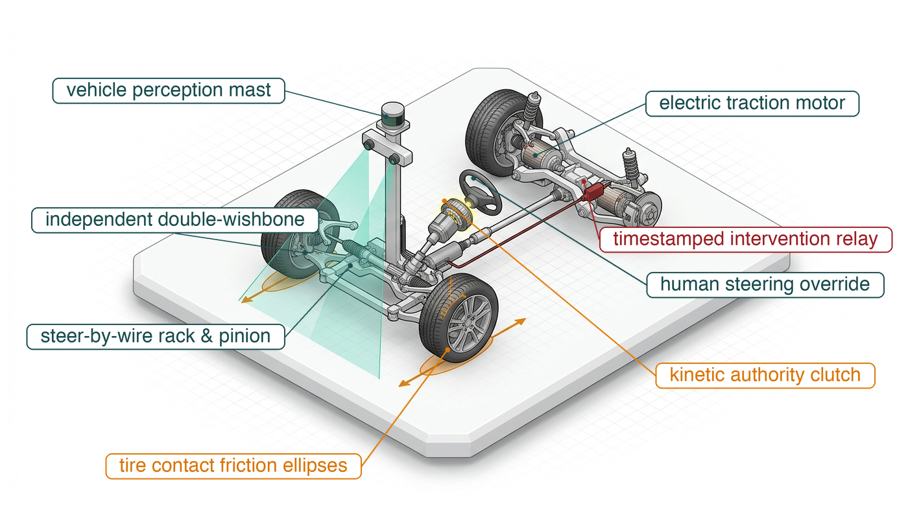
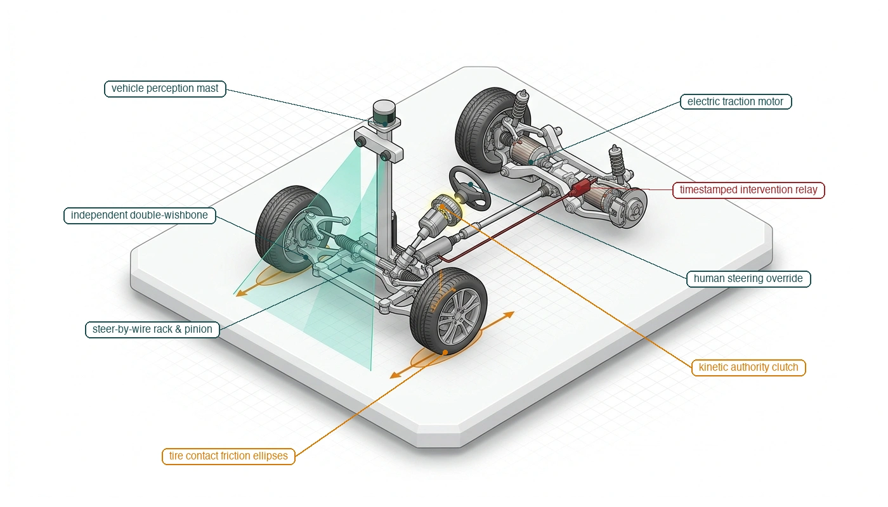
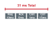
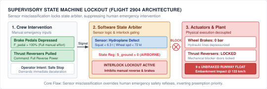

---
format:
  html:
    title: "Supervisory Intervention"
---

# Supervisory Intervention {#sec-intervention}

::: {layout-narrow}
::: {.column-margin}

\chapterminitoc

:::

::: {.content-visible when-format="pdf"}
\noindent
{fig-alt="Isometric vehicle steering blueprint with a perception mast, steering wheel, steer-by-wire rack, intervention relay, and tire contact patches. Arrows distinguish the operator request from the actuator path."}
:::

::: {.content-visible unless-format="pdf"}
{fig-alt="Isometric blueprint showing supervisory intervention on an autonomous vehicle steer-by-wire chassis: independent double-wishbone suspension, vehicle perception mast, steer-by-wire rack and pinion, human steering wheel override, glowing kinetic authority clutch, timestamped intervention relay, and tire contact friction ellipses."}
:::

:::

## Purpose {.unnumbered .unlisted}

::: {.content-visible when-format="pdf"}
\begin{marginfigure}
\resizebox{0.92\linewidth}{!}{\mlphysicalstackfull{20}{20}{20}{20}{20}}
\caption{The five-level machine stack within the governance envelope.}
\end{marginfigure}
:::

_When a human grabs the controls of a running machine, how do you transfer kinetic authority without causing the very collision you meant to prevent?_

When a human supervisor asserts control over an autonomous system, the takeover request reaches hardware already in motion under neural control. Naively blending human and automated commands without strict arbitration yields conflicting control inputs, while instantaneous switching risks severe mechanical shock or sudden loss of traction. A safe intervention architecture must explicitly designate kinetic authority, enforce bumpless command transfer, and verify that handovers preserve dynamic feasibility throughout the transition window.

Crucially, human cognitive reaction time and telemetry transmission latency consume the same physical stopping budget as algorithmic delay; an operator cannot serve as a zero-latency safety fallback. When supervisory heartbeats drop or handovers stall, the machine must independently engage deterministic fallbacks. Every intervention must be immutably recorded with microsecond timestamps to separate autonomous failures from operator recoveries. Within the governance envelope, supervisory intervention treats human input as an external proposal that must pass through the deterministic permission path before crossing the causal boundary.



::: {.callout-learning-objectives}

- Specify operator permissions that bind authorized actions to scope, deadlines, and authentication requirements
- Calculate the latest fallback time and takeover speed ceilings from reaction latency and remaining stopping clearance
- Design authority transfers that keep one actuator writer and preserve command continuity within physical limits
- Distinguish policy failure, authority transfer, and human recovery in timestamped authority records
- Evaluate whether an authority record can reconstruct command authority and physical outcomes after an incident

:::

## Shared Authority {#sec-intervention-shared-authority}

```{python}
#| label: calc-intervention-shared-authority-scene
#| echo: false
# ┌─────────────────────────────────────────────────────────────────────────────
# │ OPENING SCENE: A TWO-SECOND PAUSE AT AISLE SPEED
# ├─────────────────────────────────────────────────────────────────────────────
# │ Context: @sec-intervention-shared-authority, first paragraph.
# │
# │ Goal:    Show that an out-of-loop pause outruns the rack-end clear distance.
# │ Show:    Aisle speed, out-of-loop takeover delay, travel, clear distance.
# │ How:     WarehouseAisle scenario fields; travel = v * T_takeover.
# └─────────────────────────────────────────────────────────────────────────────
from mlsysim import *
from mlsysim.core.units import meter, second
from mlsysim.fmt import fmt_velocity, fmt_length, fmt_latency, check

RM = Embodied.MobileManipulator.WarehouseMobileManipulator
AISLE = Embodied.Scenario.WarehouseAisle

class InterventionSharedAuthorityScene:
    """Travel during an out-of-loop takeover pause at the aisle speed."""

    # ┌── 1. LOAD (Constants & Parameters) ─────────────────────────────────
    v = AISLE.v_aisle  # category: chosen
    t_pause = AISLE.t_takeover_out_of_loop  # category: illustrative
    d_clear = AISLE.d_clear  # category: illustrative

    # ┌── 2. EXECUTE (Compute) ─────────────────────────────────────────────
    travel = (v * t_pause).to(meter)

    # ┌── 3. GUARD (Invariants) ───────────────────────────────────────────
    check(abs(travel.magnitude - 2.6) < 1e-9, f"travel during the pause: {travel}")
    check(travel > 2 * d_clear, "The pause must carry the machine more than twice the clear distance.")

    # ┌── 4. OUTPUT (Formatting) ──────────────────────────────────────────
    v_str = fmt_velocity(v, unit=meter / second, precision=1)
    t_pause_str = fmt_latency(t_pause, unit=second, precision=0)
    travel_str = fmt_length(travel, unit=meter, precision=1)
    d_clear_str = fmt_length(d_clear, unit=meter, precision=2)
```

A human supervisor is often drawn as one arrow into the plant. When a pallet blocks an aisle, the warehouse mobile manipulator needs a remote assistant to take over, yet at its chosen `{python} InterventionSharedAuthorityScene.v_str` aisle speed a `{python} InterventionSharedAuthorityScene.t_pause_str` pause (illustrative; see the Reader Guide) before braking would carry it `{python} InterventionSharedAuthorityScene.travel_str`, more than twice its `{python} InterventionSharedAuthorityScene.d_clear_str` rack-end clear distance. An operator request reaches a machine that is already moving under an admitted command; it cannot erase momentum or make an actuator respond instantaneously. The arbiter, the permission path's source-selection step, must decide who may propose the next command, and the enforcer, its admission check, must admit or reject it; both run on the safety microcontroller (MCU). The plant must still have enough clearance to execute the chosen stop. An abrupt setpoint switch requests a torque step that the drives and the load must absorb. A delayed switch can exhaust stopping room even when both controllers are individually well behaved.

::: {.column-margin .margin-pointer}
↰ **Prerequisite:** The proposal boundary of @sec-boundary-machine-model, and the third law in @sec-boundary-bedrock-laws that it enforces, set the baseline for supervisory preemption.
:::

Bainbridge's classic *ironies of automation* [@bainbridge1983ironies] observe that an autonomous system tends to leave human operators responsible for the rarest, most complex edge cases while stripping them of the continuous manual engagement necessary to maintain situational awareness. When a remote assistant takes over the mobile manipulator in a blocked aisle, supervisory authority is effective only if it maps to an executable physical response bounded by actuator torque and thermal derating limits. Taking control of a machine already in motion forces the system to resolve two tightly coupled challenges simultaneously: discrete state arbitration without ambiguity in software, and continuous trajectory transition without mechanical shock in the plant. In discrete software, the architecture must prevent split-brain execution where the learned policy and the human operator issue concurrent, conflicting torque setpoints. In this chapter's $1\text{ kHz}$ controller, the independent enforcer revokes the policy's execution token, its right to have proposals admitted, and latches its last approved reference at commit, then remains the sole actuator writer during the subsequent blend. In continuous dynamics, the permission path must execute a bumpless transfer, blending between latched command endpoints, matching initial velocities, ramping each command within its rate ceiling, and checking measured plant limits during the transition.

Intervention events also reach the machine learning lifecycle. A rescued episode logged without its handover instant looks like an expert demonstration of the very near-failure states that made the rescue necessary. @Sec-data-intervention-recovery shows how corrective aggregation instead labels the learner's own states, which requires the intervention record to keep the trace from before the takeover. The forensic authority record therefore timestamps every authority transition on the safety microcontroller's clock. The commit instant marks the boundary between policy-owned failure evidence and human recovery.

The first design decision is operational. It fixes which named intervention may reach which physical channel, and how long the machine can wait for it.

## Human Authority Over Actuation {#sec-intervention-human-authority}

The remote assistant who clears a blocked aisle and the coworker who takes a mug from the gripper act on the same machine, and neither should hold the other's authority. Authority cannot attach to a generic human role or abstract supervision block. It must attach to specific named operations with explicit timing budgets, physical degrees of freedom, and deterministic preemption rules. Rather than granting an operator broad administrative authority, the permission path maintains an explicit **capability matrix**\index{Capability matrix}, a permissions table mapping individual operations (such as an emergency power cutoff, a velocity trim adjustment, a trajectory path veto, or manual drive of the base and arm) to authenticated roles, reflecting classic taxonomies of human supervisory control[^fn-std-sheridan-supervisory] [@sheridan1992telerobotics] and multi-level automation [@parasuraman2000model]. Each entry in this matrix defines the exact actuator channels the operation governs, the preemption tier it carries over the learned policy, and the maximum propagation latency permitted from physical input to actuator response.

[^fn-std-sheridan-supervisory]: **Supervisory Control Levels**\index{Supervisory Control Levels}: @sheridan1978human formulated a ten-level taxonomy of supervisory control, running from a human who performs the whole task without computer assistance to a computer that decides and acts while ignoring the human. A capability matrix draws such distinctions per operation rather than once for the whole machine.

Naming the operations separates **intervention**\index{Intervention} from **safety enforcement**\index{Safety enforcement}, two mechanisms that system architectures routinely conflate. Enforcement withholds permission from a candidate action proposed by a learned model, modifying, clamping, or rejecting the setpoint while leaving the machine under autonomous control. Intervention transfers authority away from the model to an external entity, terminating autonomous operation and giving the supervisor the right to propose, while every command still passes the permission path. An **enforcement filter**\index{Enforcement filter} sits in the fast control path to prevent the policy from demanding an over-current maneuver or violating a barrier certificate [@ames2019control] during nominal tracking, respecting the actuator thermal limits established in @sec-body-five-budgets and the kinodynamic feasibility boundaries from @sec-planning-kinodynamic-feasibility. An intervention mechanism strips the policy of its execution token when an operational boundary is breached or an operator demands control. A system equipped with enforcement but lacking intervention cannot be redirected when human intent changes or external conditions fall outside the policy design envelope. Conversely, a system equipped with intervention but lacking enforcement permits a lagging operator to drive the plant into structural failure during nominal manual operation.

```{python}
#| label: calc-intervention-coworker-handover
#| echo: false
# ┌─────────────────────────────────────────────────────────────────────────────
# │ COWORKER HANDOVER SPEED UNDER accept_item
# ├─────────────────────────────────────────────────────────────────────────────
# │ Context: @sec-intervention-human-authority, the capability example
# │          (veto_path and manual_drive for the remote assistant, accept_item
# │          for the coworker).
# │
# │ Goal:    Recall the handover cap that the enforcement record's handover
# │          entry holds (@sec-enforcement-telemetry owns it), and check that
# │          it sits under the force-limited contact ceiling.
# │ Show:    Chosen TCP handover speed and the ceiling F_h / sqrt(k_h m_eff).
# │ How:     WarehouseAisle contact fields and the machine's effective mass.
# └─────────────────────────────────────────────────────────────────────────────
from mlsysim import *
from mlsysim.core.units import meter, second, kilogram, newton
from mlsysim.fmt import fmt_velocity, check

RM = Embodied.MobileManipulator.WarehouseMobileManipulator
AISLE = Embodied.Scenario.WarehouseAisle

class InterventionCoworkerHandover:
    """Arm approach speed for the coworker's accept_item handover."""

    # ┌── 1. LOAD (Constants & Parameters) ─────────────────────────────────
    v_handover = AISLE.v_handover  # category: chosen
    k_hand = AISLE.k_contact_human  # category: illustrative
    f_criterion = AISLE.f_contact_criterion  # category: chosen
    m_eff = RM.arm_effective_contact_mass  # category: derived

    # ┌── 2. EXECUTE (Compute) ─────────────────────────────────────────────
    v_ceiling = (f_criterion / (k_hand * m_eff) ** 0.5).to(meter / second)

    # ┌── 3. GUARD (Invariants) ───────────────────────────────────────────
    check(abs(v_ceiling.magnitude - 0.1179) < 5e-5, f"handover speed ceiling: {v_ceiling}")
    check(abs(m_eff.to(kilogram).magnitude - 12.0) < 1e-9, f"arm effective contact mass: {m_eff}")
    check(v_handover < v_ceiling, "The chosen handover speed must sit under the force-limited ceiling.")

    # ┌── 4. OUTPUT (Formatting) ──────────────────────────────────────────
    v_handover_str = fmt_velocity(v_handover, unit=meter / second, precision=2)
    v_ceiling_str = fmt_velocity(v_ceiling, unit=meter / second, precision=3)
```

For example, the remote assistant who supervises the mobile manipulator may hold a signed **trajectory veto** capability for the base's planner channel: role `remote_assistant`, operation `veto_path`, channel `planner_proposal`, preemption tier above the learned planner but below the local enforcer, authenticated session and nonce, and a clearance-derived acknowledgment deadline. The enforcer responds to a valid veto with a checked local hold or stop. The same session carries a second entry, `manual_drive`, on the base-velocity and arm-joint channels, which becomes active only through a handover that commits within the clearance-derived deadline, and lapses with the manual lease of @sec-intervention-authority-transitions; every command it carries still passes the permission check. A wheel drive-torque packet from that credential is denied, because neither entry grants the base's wheel drive-torque channel. The coworker at the packing station holds a different entry, `accept_item`, which lets the coworker take from the gripper the mug the arm picked from the takeaway conveyor (@sec-intent, @sec-planning). That entry grants no motion authority. The item-handover channel of the enforcement record (@sec-enforcement-telemetry) caps the arm's approach to the coworker's hand at `{python} InterventionCoworkerHandover.v_handover_str`, under the `{python} InterventionCoworkerHandover.v_ceiling_str` contact ceiling, and no capability lifts that cap. Each capability entry binds actor, operation, channel, deadline, authentication, preemption tier, and fallback; a valid signature alone grants no motion authority.

When an operator attempts an intervention, human biology imposes a hard real-time latency budget before any physical corrective action can occur. Human response time is not a single point event, but a cascaded pipeline of physiological and mechanical stages. For an operator monitoring a machine's telemetry stream, the sensory recognition stage covers the time for light to strike the retina, travel through the visual pathway, and register as an optical anomaly. The situational assessment stage follows, in which the operator recognizes that the learned policy is drifting toward a hazard and selects an appropriate counter-action. Finally, the motor actuation stage covers the transmission of motor signals down the spinal cord, muscle recruitment in the hand, and the physical displacement of an override switch. Summing the durations of these sequential stages establishes the physiological **takeover reaction floor**\index{Takeover reaction floor}. Accounting for network transport and communication handshake latency $T_{\text{comm}}$, total supervisory takeover latency $T_{\Sigma}$ decomposes into:
$$T_{\Sigma} = T_{\text{sensory}} + T_{\text{cognitive}} + T_{\text{motor}} + T_{\text{comm}}$$ {#eq-intervention-reaction-floor}

During this reaction interval the machine keeps moving under the command it was last admitted, before the intervention signal reaches the arbiter, so adding the takeover latency $T_\Sigma$ to $\tau_{\text{delay}}$ in @eq-body-stopping-distance gives the distance a handover consumes. Because reaction travel grows with both the delay and the speed, a delay that fits at a crawl can consume the whole clearance at aisle speed.

::: {.column-margin .margin-pointer}
↰ **Prerequisite:** The stopping-distance equation whose pre-brake delay a takeover lengthens is derived in @sec-body-kinetic-momentum.
:::

```{python}
#| label: calc-intervention-operator-takeover-budget
#| echo: false
# ┌─────────────────────────────────────────────────────────────────────────────
# │ OPERATOR TAKEOVER AGAINST THE MACHINE'S STOPPING BUDGET
# ├─────────────────────────────────────────────────────────────────────────────
# │ Context: @sec-intervention-human-authority, the two takeover modes that
# │          follow @eq-intervention-reaction-floor, and the notebook
# │          "Takeover budget and clearance margin".
# │
# │ Goal:    Price an operator's takeover delay on the warehouse mobile
# │          manipulator at its aisle speed.
# │ Show:    Spare margin at 1.3 m/s; travel during an in-loop and an
# │          out-of-loop takeover; the stop with each delay added; the speed
# │          ceilings; the out-of-loop decomposition that sums to 2.0 s.
# │ How:     Finished stopping budget from the WarehouseAisle scenario (C2
# │          stop, all overheads); T_Sigma adds to tau_delay; ceilings by
# │          calc_max_permitted_velocity with a_eff = a_brake / 1.5.
# └─────────────────────────────────────────────────────────────────────────────
from mlsysim import *
from mlsysim.core.units import meter, second, millimeter, millisecond
from mlsysim.physics.robotics import calc_c2_stop_suffix, calc_max_permitted_velocity
from mlsysim.fmt import (
    fmt_velocity,
    fmt_length,
    fmt_latency,
    fmt_magnitude,
    fmt_multiple,
    fmt_display_math,
    check,
)

RM = Embodied.MobileManipulator.WarehouseMobileManipulator
AISLE = Embodied.Scenario.WarehouseAisle

class InterventionTakeoverBudget:
    """Operator takeover delay spent against the finished stopping budget."""

    # ┌── 1. LOAD (Constants & Parameters) ─────────────────────────────────
    v = AISLE.v_aisle  # category: chosen
    d_clear = AISLE.d_clear  # category: illustrative
    tau_delay = AISLE.tau_delay  # category: derived
    a_brake = AISLE.a_brake  # category: illustrative
    near_overhead = AISLE.delta_loc + AISLE.eps_track  # category: illustrative
    margin = AISLE.delta_margin  # category: chosen
    overhead = AISLE.fixed_overhead  # category: illustrative / chosen
    t_in = AISLE.t_takeover_in_loop  # category: illustrative
    t_ool = AISLE.t_takeover_out_of_loop  # category: illustrative
    # Scenario assumptions (this chapter only): the out-of-loop decomposition
    t_sensory = 300 * millisecond  # category: illustrative
    t_cognitive = 1200 * millisecond  # category: illustrative
    t_motor = 300 * millisecond  # category: illustrative
    t_comm = 200 * millisecond  # category: illustrative

    # ┌── 2. EXECUTE (Compute) ─────────────────────────────────────────────
    a_eff = a_brake / 1.5
    reaction = (v * tau_delay).to(millimeter)
    stop_c2 = calc_c2_stop_suffix(v, a_brake)["distance"].to(millimeter)
    budget = (reaction + stop_c2 + overhead).to(millimeter)
    spare = (d_clear - budget).to(millimeter)
    t_sum = (t_sensory + t_cognitive + t_motor + t_comm).to(millisecond)
    travel_in = (v * t_in).to(millimeter)
    travel_ool = (v * t_ool).to(millimeter)
    d_stop_in = (budget + travel_in).to(millimeter)
    d_stop_ool = (budget + travel_ool).to(millimeter)
    stop_ratio = (d_stop_ool / d_stop_in).to("").magnitude
    ceil_in = calc_max_permitted_velocity(d_clear, tau_delay + t_in, a_eff, near_overhead, margin).to(meter / second)
    ceil_ool = calc_max_permitted_velocity(d_clear, tau_delay + t_ool, a_eff, near_overhead, margin).to(meter / second)

    # ┌── 3. GUARD (Invariants) ───────────────────────────────────────────
    check(abs(spare.magnitude - 102.57) < 5e-3, f"spare margin at the aisle speed: {spare}")
    check(abs(t_sum.magnitude - t_ool.to(millisecond).magnitude) < 1e-9, "The four stages must sum to the out-of-loop takeover.")
    check(travel_in > spare, "Even the in-loop takeover must overrun the spare margin at the aisle speed.")
    check(travel_ool > 2 * d_clear, "The out-of-loop travel must exceed twice the clear distance.")
    check(abs(d_stop_in.magnitude - 1192.43) < 5e-3, f"stop with in-loop takeover: {d_stop_in}")
    check(abs(d_stop_ool.magnitude - 3597.43) < 5e-3, f"stop with out-of-loop takeover: {d_stop_ool}")
    check(abs(ceil_in.magnitude - 1.2249) < 5e-5, f"in-loop takeover ceiling: {ceil_in}")
    check(abs(ceil_ool.magnitude - 0.3986) < 5e-5, f"out-of-loop takeover ceiling: {ceil_ool}")
    check(abs(stop_ratio - 3.0) < 0.05, f"out-of-loop to in-loop stop ratio: {stop_ratio}")

    # ┌── 4. OUTPUT (Formatting) ──────────────────────────────────────────
    v_str = fmt_velocity(v, unit=meter / second, precision=1)
    d_clear_str = fmt_length(d_clear, unit=meter, precision=2)
    spare_str = fmt_length(spare, unit=millimeter, precision=1)
    t_in_str = fmt_latency(t_in, unit=millisecond, precision=0)
    t_ool_str = fmt_latency(t_ool, unit=second, precision=0)
    t_sensory_str = fmt_latency(t_sensory, unit=millisecond, precision=0)
    t_cognitive_str = fmt_latency(t_cognitive, unit=millisecond, precision=0, commas=True)
    t_motor_str = fmt_latency(t_motor, unit=millisecond, precision=0)
    t_comm_str = fmt_latency(t_comm, unit=millisecond, precision=0)
    travel_in_str = fmt_length(travel_in, unit=millimeter, precision=0)
    travel_ool_str = fmt_length(travel_ool, unit=meter, precision=2)
    d_stop_in_str = fmt_length(d_stop_in, unit=meter, precision=2)
    d_stop_ool_str = fmt_length(d_stop_ool, unit=meter, precision=2)
    stop_mult_str = fmt_multiple(stop_ratio, precision=1)
    ceil_in_str = fmt_velocity(ceil_in, unit=meter / second, precision=2)
    ceil_ool_str = fmt_velocity(ceil_ool, unit=meter / second, precision=2)

    reaction_value_str = fmt_magnitude(reaction, unit=millimeter, precision=2)
    stop_c2_value_str = fmt_magnitude(stop_c2, unit=millimeter, precision=2)
    overhead_value_str = fmt_magnitude(overhead, unit=millimeter, precision=0)
    travel_in_value_str = fmt_magnitude(travel_in, unit=millimeter, precision=0)
    travel_ool_value_str = fmt_magnitude(travel_ool, unit=millimeter, precision=0)
    d_stop_in_value_str = fmt_magnitude(d_stop_in, unit=millimeter, precision=2)
    d_stop_ool_value_str = fmt_magnitude(d_stop_ool, unit=millimeter, precision=2)

    haptic_display_math = fmt_display_math(
        rf"d_{{\text{{stop}},1}} = v\,\tau_{{\text{{delay}}}} + v\,T_{{\Sigma,1}} + \frac{{v^2}}{{2a_{{\text{{eff}}}}}} + \delta = "
        rf"{reaction_value_str} + {travel_in_value_str} + {stop_c2_value_str} + {overhead_value_str} = {d_stop_in_value_str}\text{{ mm}}"
    )
    ool_display_math = fmt_display_math(
        rf"d_{{\text{{stop}},2}} = v\,\tau_{{\text{{delay}}}} + v\,T_{{\Sigma,2}} + \frac{{v^2}}{{2a_{{\text{{eff}}}}}} + \delta = "
        rf"{reaction_value_str} + {travel_ool_value_str} + {stop_c2_value_str} + {overhead_value_str} = {d_stop_ool_value_str}\text{{ mm}}"
    )
```

The finished stopping budget of @sec-enforcement-stopping-envelopes (@tbl-enforcement-stopping-budget) shows what @eq-intervention-reaction-floor costs on the mobile manipulator. At the `{python} InterventionTakeoverBudget.v_str` aisle speed it leaves `{python} InterventionTakeoverBudget.spare_str` of the `{python} InterventionTakeoverBudget.d_clear_str` rack-end clear distance. A takeover delay adds to the machine's own pre-brake delay $\tau_{\text{delay}}$, and every millisecond of it becomes travel at the aisle speed:

1. **Mode 1: Direct Bilateral Teleoperation**: An in-loop assistant with a haptic channel and an active proprioceptive loop responds within an illustrative $T_{\Sigma,1} =$ `{python} InterventionTakeoverBudget.t_in_str`, bus transit included. The machine travels `{python} InterventionTakeoverBudget.travel_in_str` during that delay, already more than the spare margin, so at the aisle speed even with this takeover the machine's stop would end past the rack-end clear distance. Solving the budget for speed with $T_{\Sigma,1}$ added to $\tau_{\text{delay}}$ bounds the machine to `{python} InterventionTakeoverBudget.ceil_in_str`.
2. **Mode 2: Passive Out-of-the-Loop Supervisory Takeover**: When an assistant monitors the telemetry of several machines passively, sensory recognition consumes $T_{\text{sensory}} =$ `{python} InterventionTakeoverBudget.t_sensory_str`, cognitive situational assessment requires $T_{\text{cognitive}} =$ `{python} InterventionTakeoverBudget.t_cognitive_str`, motor switch actuation takes $T_{\text{motor}} =$ `{python} InterventionTakeoverBudget.t_motor_str`, and network transport and handshake protocol overhead adds $T_{\text{comm}} =$ `{python} InterventionTakeoverBudget.t_comm_str`. By @eq-intervention-reaction-floor, the takeover delay expands to $T_{\Sigma,2} =$ `{python} InterventionTakeoverBudget.t_ool_str`, during which the machine covers `{python} InterventionTakeoverBudget.travel_ool_str`, more than twice the clear distance, before any brake command. The same solution bounds the machine to `{python} InterventionTakeoverBudget.ceil_ool_str`.

In Mode 2 at the aisle speed, the machine would reach a static obstacle at the rack end at full speed, because contact occurs before braking ever begins. Human re-engagement latency therefore sets a ceiling on operating speed that no higher-gain actuator or brake pad can lift, and @sec-intervention-authority-transitions turns these two ceilings into the speeds at which the machine may request each kind of takeover.

::: {#nbk-intervention-operator-takeover-budget-spatial-clearance-margin .callout-notebook title="Takeover budget and clearance margin"}
**Concept**: The stopping distance during a human intervention adds every source of delay and distance before the machine comes to rest. On the mobile manipulator there are four terms:

1. **Machine blind travel**: The distance covered during the machine's own pre-brake delay ($v\,\tau_{\text{delay}}$), from @tbl-enforcement-stopping-budget.
2. **Takeover travel**: The distance covered while the operator perceives the obstacle, decides, acts, and the command crosses the network ($v\,T_{\Sigma}$).
3. **Resident stop**: The $C^2$ stop suffix of @sec-planning-behavior-seam, $v^2/(2a_{\text{eff}})$ with $a_{\text{eff}} = a_{\text{brake}}/1.5$.
4. **Fixed overheads**: $\delta = \delta_{\text{loc}} + \delta_{\text{margin}} + \epsilon_{\text{track}}$.

**Worked Comparison**: At the aisle speed $v =$ `{python} InterventionTakeoverBudget.v_str` against a rack-end clear distance of `{python} InterventionTakeoverBudget.d_clear_str`:

- **Direct Bilateral Teleoperation** ($T_{\Sigma,1} =$ `{python} InterventionTakeoverBudget.t_in_str`):
  `{python} InterventionTakeoverBudget.haptic_display_math`
- **Out-of-the-Loop Takeover** ($T_{\Sigma,2} =$ `{python} InterventionTakeoverBudget.t_ool_str`):
  `{python} InterventionTakeoverBudget.ool_display_math`

**Systems Insight**: Passive monitoring inflates the takeover delay from `{python} InterventionTakeoverBudget.t_in_str` to `{python} InterventionTakeoverBudget.t_ool_str` and grows the stop from `{python} InterventionTakeoverBudget.d_stop_in_str` to `{python} InterventionTakeoverBudget.d_stop_ool_str`, `{python} InterventionTakeoverBudget.stop_mult_str` longer. Neither fits the `{python} InterventionTakeoverBudget.d_clear_str` clear distance at the aisle speed, which is why the machine slows before it asks for either one. For the kinematic derivation of these stopping distances, see @sec-appendix-systems-stopping.
:::

The physical tension between human reaction latency and stopping distance extends across every mobile embodied system, from indoor warehouse manipulators to highway-speed autonomous vehicles (@fig-14-human-takeover-reaction-margin). Stopping distance decomposes into two fundamentally distinct kinematic regimes: linear reaction drift distance $d_{\mathrm{drift}} = v \cdot (T_{\Sigma} + \tau_{\mathrm{delay}})$ during which the machine travels unbraked under sensory, cognitive, and network delay, followed by quadratic kinetic dissipation $d_{\mathrm{brake}} = v^2 / (2 a_{\mathrm{eff}})$. Because reaction drift scales linearly with velocity while braking scales quadratically, an out-of-loop supervisor monitoring passively from a remote console ($T_{\Sigma} \approx 2.5\ \text{s}$) accumulates over 72 meters of blind drift at 100 km/h before the physical brake pads engage. When evaluated against a fixed forward visibility clearance ($d_{\mathrm{clear}} = 60\ \text{m}$), the remaining clearance margin $M = d_{\mathrm{clear}} - d_{\mathrm{stop}}$ defines a hard operational ceiling. Beyond critical velocity thresholds—ranging from 33.7 km/h for remote teleoperation to 78.3 km/h for an alert in-loop operator—the clearance margin becomes negative ($M < 0$), rendering high-speed collision physically inevitable regardless of braking force.

::: {#fig-14-human-takeover-reaction-margin fig-env="figure" fig-pos="htb" fig-cap="**Human supervisory takeover reaction budget versus stopping clearance margin**: Two-panel kinematic analysis across vehicle velocity under four supervisory engagement modes ($T_\\Sigma \\in [0.8, 1.5, 2.5, 4.0]\\ \\text{s}$) with 100 ms onboard bus delay and $a_{\\mathrm{eff}} = 6.0\\ \\text{m/s}^2$ braking. Left: Stopping distance decomposition into linear reaction drift and quadratic braking distance against urban (30 m), suburban (60 m), and highway (100 m) headways. Right: Remaining clearance margin $M = d_{\\mathrm{clear}} - d_{\\mathrm{stop}}$ under a 60 m forward sightline. Intercepts denote critical speed ceilings beyond which collision is physically inevitable before coming to rest." fig-alt="Two-panel chart showing human takeover reaction budget versus stopping margin for velocities 5 to 120 km/h. Left panel decomposes stopping distance into linear reaction drift and quadratic braking across four reaction modes from 0.8 seconds to 4.0 seconds, showing out-of-loop drift exceeding 70 meters at 100 km/h. Right panel plots remaining clearance margin given a 60 meter sightline, marking critical collision ceilings at 33.7 km/h for remote teleop, 45.4 km/h for out-of-loop, 60.1 km/h for alerted driver, and 78.3 km/h for direct in-loop."}

```{python}
#| label: fig-14-human-takeover-reaction-margin
#| echo: false
#| message: false
#| warning: false

import matplotlib as mpl

mpl.use("Agg")
import matplotlib.pyplot as plt
import numpy as np

# Publication styling
plt.rcParams["font.sans-serif"] = ["Helvetica", "Arial", "DejaVu Sans"]
plt.rcParams["axes.edgecolor"] = "#334155"
plt.rcParams["axes.linewidth"] = 1.0

fig, (ax1, ax2) = plt.subplots(1, 2, figsize=(15.0, 7.2), dpi=300, facecolor="#FFFFFF")
for ax in (ax1, ax2):
    ax.set_facecolor("#FFFFFF")
    ax.spines["top"].set_visible(False)
    ax.spines["right"].set_visible(False)
    ax.spines["left"].set_color("#334155")
    ax.spines["bottom"].set_color("#334155")
    ax.grid(True, linestyle="--", linewidth=0.6, alpha=0.5, color="#E2E8F0")
    ax.set_axisbelow(True)

# Physical parameters
v_kmh = np.linspace(5, 120, 300)
v_mps = v_kmh / 3.6
tau_delay = 0.10  # 100 ms onboard perception lease and brake bus delay
a_eff = 6.0  # effective emergency braking acceleration (m/s^2, ~0.61g)
delta_buf = 1.0  # physical safety buffer (m)
d_clear = 60.0  # clear line-of-sight / headway clearance (m)

modes = [
    {"name": r"Direct In-Loop: $T_\Sigma = 0.8\,\mathrm{s}$", "T": 0.8, "color": "#047857", "ls": "-"},
    {"name": r"Alerted Driver: $T_\Sigma = 1.5\,\mathrm{s}$", "T": 1.5, "color": "#1E3A8A", "ls": "-"},
    {"name": r"Out-of-Loop (NDRT): $T_\Sigma = 2.5\,\mathrm{s}$", "T": 2.5, "color": "#D97706", "ls": "-"},
    {"name": r"Remote Teleoperation: $T_\Sigma = 4.0\,\mathrm{s}$", "T": 4.0, "color": "#DC2626", "ls": "-"},
]

# --- Panel (a): Stopping Distance Breakdown ---
t_base = 2.5
d_react = v_mps * (t_base + tau_delay)
d_brake = (v_mps**2) / (2 * a_eff)
d_total_base = d_react + d_brake + delta_buf

ax1.fill_between(v_kmh, 0, d_react, color="#FEF3C7", alpha=0.65, label=r"Reaction Drift ($v \cdot [T_\Sigma + \tau]$)")
ax1.fill_between(v_kmh, d_react, d_total_base, color="#FEE2E2", alpha=0.65, label=r"Braking Distance ($v^2 / 2a_{\mathrm{eff}}$)")

for m in modes:
    d_tot = v_mps * (m["T"] + tau_delay) + (v_mps**2) / (2 * a_eff) + delta_buf
    ax1.plot(v_kmh, d_tot, color=m["color"], linewidth=2.3, linestyle=m["ls"], label=m["name"])

# Reference Headways / Sight Clearances
ax1.axhline(30, color="#94A3B8", linestyle=":", linewidth=1.2)
ax1.text(8, 32, "Urban Clear Sight (30 m)", fontsize=8.5, color="#64748B", fontweight="bold")
ax1.axhline(60, color="#94A3B8", linestyle=":", linewidth=1.2)
ax1.text(8, 62, "Suburban Headway (60 m)", fontsize=8.5, color="#64748B", fontweight="bold")
ax1.axhline(100, color="#94A3B8", linestyle=":", linewidth=1.2)
ax1.text(8, 102, "Highway Headway (100 m)", fontsize=8.5, color="#64748B", fontweight="bold")

ax1.set_xlim(5, 120)
ax1.set_ylim(0, 205)
ax1.set_xlabel(r"Vehicle Velocity $v$ (km/h)", fontsize=11, fontweight="bold", color="#1E293B")
ax1.set_ylabel("Total Stopping Distance (meters)", fontsize=11, fontweight="bold", color="#1E293B")
ax1.set_title(
    "(a) Stopping Distance Decomposition vs. Speed\nLinear Drift + Quadratic Braking", fontsize=12.0, fontweight="bold", pad=12, color="#1E293B"
)
ax1.legend(loc="upper left", fontsize=8.8, framealpha=0.92, edgecolor="#CBD5E1")

badge_box = dict(boxstyle="round,pad=0.35", facecolor="#FFFFFF", edgecolor="#CBD5E1", alpha=0.95, linewidth=0.8)
ax1.text(
    42,
    145,
    "Kinetic Reality:\nDrift scales linearly ($v \\cdot T_\\Sigma$);\nBraking scales quadratically ($v^2 / 2a$).\nAt 100 km/h, out-of-loop drift alone is >72 m!",
    fontsize=8.4,
    color="#1E293B",
    bbox=badge_box,
    va="center",
)

# --- Panel (b): Remaining Stopping Margin & Crash Horizon ---
ax2.axhspan(-120, 0, color="#FEE2E2", alpha=0.55, label=r"Inevitable Collision Zone ($M < 0$)")
ax2.axhline(0, color="#DC2626", linestyle="-", linewidth=1.6, alpha=0.85)

crit_speeds = {}
for m in modes:
    d_tot = v_mps * (m["T"] + tau_delay) + (v_mps**2) / (2 * a_eff) + delta_buf
    margin = d_clear - d_tot
    ax2.plot(v_kmh, margin, color=m["color"], linewidth=2.4, linestyle=m["ls"], label=m["name"])

    # Calculate critical speed where margin == 0
    A = 1.0 / (2.0 * a_eff)
    B = m["T"] + tau_delay
    C = delta_buf - d_clear
    v_crit_mps = (-B + np.sqrt(B**2 - 4 * A * C)) / (2 * A)
    v_crit_kmh = v_crit_mps * 3.6
    crit_speeds[m["T"]] = v_crit_kmh
    ax2.plot(v_crit_kmh, 0, marker="o", markersize=7.5, color=m["color"], zorder=5)

ax2.set_xlim(10, 120)
ax2.set_ylim(-100, 65)
ax2.set_xlabel(r"Vehicle Velocity $v$ (km/h)", fontsize=11, fontweight="bold", color="#1E293B")
ax2.set_ylabel(r"Remaining Clearance Margin $M = d_{\mathrm{clear}} - d_{\mathrm{stop}}$ (m)", fontsize=11, fontweight="bold", color="#1E293B")
ax2.set_title(
    r"(b) Clearance Margin & Collision Horizon" + "\n" + r"(Given $d_{\mathrm{clear}} = 60\,\mathrm{m}$ sightline)",
    fontsize=12.0,
    fontweight="bold",
    pad=12,
    color="#1E293B",
)
ax2.legend(loc="lower left", fontsize=8.8, framealpha=0.92, edgecolor="#CBD5E1")

summary_text = (
    "Takeover Speed Ceilings ($d_{\\mathrm{clear}} = 60\\,\\mathrm{m}$):\n"
    f"  • Direct In-Loop (0.8s):    {crit_speeds[0.8]:.1f} km/h\n"
    f"  • Alerted Driver (1.5s):   {crit_speeds[1.5]:.1f} km/h\n"
    f"  • Out-of-Loop NDRT (2.5s): {crit_speeds[2.5]:.1f} km/h\n"
    f"  • Remote Teleop (4.0s):    {crit_speeds[4.0]:.1f} km/h\n"
    "Beyond these ceilings, crash occurs before rest!"
)
ax2.text(
    88,
    38,
    summary_text,
    fontsize=8.3,
    color="#1E293B",
    bbox=badge_box,
    va="center",
    ha="center",
)

intercept_tags = [
    (crit_speeds[4.0], f"{crit_speeds[4.0]:.1f}", "#DC2626", -16),
    (crit_speeds[2.5], f"{crit_speeds[2.5]:.1f}", "#D97706", -16),
    (crit_speeds[1.5], f"{crit_speeds[1.5]:.1f}", "#1E3A8A", -16),
    (crit_speeds[0.8], f"{crit_speeds[0.8]:.1f} km/h", "#047857", -16),
]
for spd, txt, col, y_pos in intercept_tags:
    ax2.plot([spd, spd], [0, y_pos + 6], color=col, linestyle=":", linewidth=1.0)
    ax2.text(
        spd,
        y_pos,
        txt,
        fontsize=8.0,
        fontweight="bold",
        color=col,
        ha="center",
        va="center",
        bbox=dict(boxstyle="round,pad=0.2", facecolor="#FFFFFF", edgecolor=col, alpha=0.9, linewidth=0.6),
    )

ax2.text(
    80,
    -78,
    "Collision Horizon ($M < 0$):\nKinetic stopping distance exceeds sightline;\nimpact is physically inevitable regardless of brake force.",
    fontsize=8.3,
    color="#DC2626",
    bbox=dict(boxstyle="round,pad=0.35", facecolor="#FFFFFF", edgecolor="#DC2626", alpha=0.95, linewidth=0.8),
    va="center",
    ha="center",
)

plt.tight_layout()
plt.show()
plt.close()
```
:::

```{python}
#| label: calc-intervention-takeover-ladder
#| echo: false
# ┌─────────────────────────────────────────────────────────────────────────────
# │ TAKEOVER-MODE LADDER ON THE MOBILE MANIPULATOR
# ├─────────────────────────────────────────────────────────────────────────────
# │ Context: @tbl-14-teleop-stability and the paragraph that introduces it.
# │
# │ Goal:    Price each intervention mode's delay as a speed ceiling.
# │ Show:    Per mode, the selected delay, the added travel at the aisle
# │          speed, and the speed at which the finished budget still fits.
# │ How:     Each delay adds to tau_delay (WarehouseAisle scenario); ceilings
# │          by calc_max_permitted_velocity with a_eff = a_brake / 1.5.
# └─────────────────────────────────────────────────────────────────────────────
from mlsysim import *
from mlsysim.core.units import meter, second, millimeter, millisecond
from mlsysim.physics.robotics import calc_max_permitted_velocity
from mlsysim.fmt import fmt_length, fmt_latency, fmt_velocity, check

RM = Embodied.MobileManipulator.WarehouseMobileManipulator
AISLE = Embodied.Scenario.WarehouseAisle

def _ceiling(t):
    """Largest speed whose finished budget, with t added to tau_delay, fits d_clear."""
    return calc_max_permitted_velocity(
        AISLE.d_clear,
        AISLE.tau_delay + t,
        AISLE.a_brake / 1.5,
        AISLE.delta_loc + AISLE.eps_track,
        AISLE.delta_margin,
    ).to(meter / second)

class InterventionTakeoverLadder:
    """Speed ceiling for each intervention mode's selected delay."""

    # ┌── 1. LOAD (Constants & Parameters) ─────────────────────────────────
    v = AISLE.v_aisle  # category: chosen
    t_bilateral = AISLE.t_takeover_in_loop  # category: illustrative
    t_ool = AISLE.t_takeover_out_of_loop  # category: illustrative
    # Scenario assumptions (this chapter only)
    t_guidance = 450 * millisecond  # category: illustrative
    t_waypoint = 1150 * millisecond  # category: illustrative
    t_protective = 250 * millisecond  # category: illustrative (human plus device)

    # ┌── 2. EXECUTE (Compute) ─────────────────────────────────────────────
    ceil_bilateral = _ceiling(t_bilateral)
    ceil_guidance = _ceiling(t_guidance)
    ceil_waypoint = _ceiling(t_waypoint)
    ceil_ool = _ceiling(t_ool)
    ceil_protective = _ceiling(t_protective)
    travel_bilateral = (v * t_bilateral).to(millimeter)
    travel_guidance = (v * t_guidance).to(millimeter)
    travel_waypoint = (v * t_waypoint).to(millimeter)
    travel_ool = (v * t_ool).to(millimeter)
    travel_protective = (v * t_protective).to(millimeter)

    # ┌── 3. GUARD (Invariants) ───────────────────────────────────────────
    check(abs(ceil_bilateral.magnitude - 1.2249) < 5e-5, f"bilateral ceiling: {ceil_bilateral}")
    check(abs(ceil_ool.magnitude - 0.3986) < 5e-5, f"out-of-loop ceiling: {ceil_ool}")
    check(abs(ceil_guidance.magnitude - 0.9632) < 5e-5, f"guidance ceiling: {ceil_guidance}")
    check(abs(ceil_waypoint.magnitude - 0.6028) < 5e-5, f"waypoint ceiling: {ceil_waypoint}")
    check(abs(ceil_protective.magnitude - 1.1281) < 5e-5, f"protective-input ceiling: {ceil_protective}")
    check(max(ceil_bilateral, ceil_protective) < v, "No intervention mode fits at the aisle speed.")

    # ┌── 4. OUTPUT (Formatting) ──────────────────────────────────────────
    v_str = fmt_velocity(v, unit=meter / second, precision=1)
    t_bilateral_str = fmt_latency(t_bilateral, unit=millisecond, precision=0, commas=True)
    t_guidance_str = fmt_latency(t_guidance, unit=millisecond, precision=0, commas=True)
    t_waypoint_str = fmt_latency(t_waypoint, unit=millisecond, precision=0, commas=True)
    t_ool_str = fmt_latency(t_ool, unit=millisecond, precision=0, commas=True)
    t_protective_str = fmt_latency(t_protective, unit=millisecond, precision=0, commas=True)
    travel_bilateral_str = fmt_length(travel_bilateral, unit=millimeter, precision=0)
    travel_guidance_str = fmt_length(travel_guidance, unit=millimeter, precision=0)
    travel_waypoint_str = fmt_length(travel_waypoint, unit=millimeter, precision=0)
    travel_ool_str = fmt_length(travel_ool, unit=millimeter, precision=0)
    travel_protective_str = fmt_length(travel_protective, unit=millimeter, precision=0)
    ceil_bilateral_str = fmt_velocity(ceil_bilateral, unit=meter / second, precision=2)
    ceil_guidance_str = fmt_velocity(ceil_guidance, unit=meter / second, precision=2)
    ceil_waypoint_str = fmt_velocity(ceil_waypoint, unit=meter / second, precision=2)
    ceil_ool_str = fmt_velocity(ceil_ool, unit=meter / second, precision=2)
    ceil_protective_str = fmt_velocity(ceil_protective, unit=meter / second, precision=2)
```

@Tbl-14-teleop-stability extends the two takeover modes to the other ways a site might let a person intervene, each with an illustrative delay. Each row adds its delay to $\tau_{\text{delay}}$ and solves the finished stopping budget for the largest speed at which the machine still stops inside the rack-end clear distance. The ceiling falls from `{python} InterventionTakeoverLadder.ceil_bilateral_str` for direct bilateral teleoperation to `{python} InterventionTakeoverLadder.ceil_ool_str` for an out-of-loop takeover, and no mode fits at the `{python} InterventionTakeoverLadder.v_str` aisle speed. The last column names the local protection that must hold the machine safe while that delay runs.

| Intervention mode              |                                                              Selected total delay |                                 Added travel at aisle speed |                                             Speed ceiling | Local protection                 |
|:-------------------------------|----------------------------------------------------------------------------------:|------------------------------------------------------------:|----------------------------------------------------------:|:---------------------------------|
| Direct bilateral teleoperation |                             `{python} InterventionTakeoverLadder.t_bilateral_str` |  `{python} InterventionTakeoverLadder.travel_bilateral_str` |  `{python} InterventionTakeoverLadder.ceil_bilateral_str` | Qualified passivity/rate checks  |
| Continuous velocity guidance   |                              `{python} InterventionTakeoverLadder.t_guidance_str` |   `{python} InterventionTakeoverLadder.travel_guidance_str` |   `{python} InterventionTakeoverLadder.ceil_guidance_str` | Onboard velocity/clearance gate  |
| Supervisory waypoint dispatch  |                              `{python} InterventionTakeoverLadder.t_waypoint_str` |   `{python} InterventionTakeoverLadder.travel_waypoint_str` |   `{python} InterventionTakeoverLadder.ceil_waypoint_str` | Local obstacle veto and fallback |
| Out-of-loop takeover           |                                   `{python} InterventionTakeoverLadder.t_ool_str` |        `{python} InterventionTakeoverLadder.travel_ool_str` |        `{python} InterventionTakeoverLadder.ceil_ool_str` | Independent stop while waiting   |
| Physical protective input      | `{python} InterventionTakeoverLadder.t_protective_str` human-plus-device response | `{python} InterventionTakeoverLadder.travel_protective_str` | `{python} InterventionTakeoverLadder.ceil_protective_str` | Risk-assessed protective stop    |

: **Takeover delay and speed ceiling**: Each row adds its selected delay to the machine's pre-brake delay $\tau_{\text{delay}}$ and solves the finished stopping budget of @tbl-enforcement-stopping-budget for the largest speed that still stops inside the rack-end clear distance. {#tbl-14-teleop-stability tbl-colwidths="[25,17,16,18,24]"}

```{=latex}
\Needspace{0.62\textheight}
```

Human response is slow and prone to interruption; thus, manual authority cannot be an open-ended state. If an operator assumes control and subsequently experiences wireless packet loss, physical incapacitation, or cognitive distraction, the machine cannot remain adrift under stale manual setpoints. The architecture protects against operator dropouts by bounding manual authority with configured and validated temporal leases (countdown timers that expire without active, periodic renewal) and hardware **enabling devices**\index{Deadman switch}, which require continuous physical engagement to maintain actuation channels (@fig-14-teach-pendant). In a lease-based communication model, the delegation window is sized from the machine's communication and stopping budgets, as the mobile manipulator's manual lease in @sec-intervention-authority-transitions shows. The operator console must continuously stream authenticated keep-alive packets to renew the lease before the deadline expires. If a single lease window lapses without renewal, or if an operator releases a spring-loaded physical deadman switch on the controller, manual proposals are revoked at the qualified detection deadline, and the enforcer commands the plant-specific validated stop or hold of the fallback ladder (@sec-enforcement-fallback-ladder).[^fn-std-iso13849-takeover]

[^fn-std-iso13849-takeover]: **Three-Position Enabling Devices**\index{Three-position enabling devices}: The cited ABB operating manual documents a three-position enabling grip and a $250\text{ mm/s}$ manual-mode limit for that robot. Releasing or over-squeezing the grip is a request into the configured safety circuit, and the machine's risk assessment under ISO 13849-1 sets the required performance level and the stop the circuit selects.

::: {#fig-14-teach-pendant fig-env="figure" fig-pos="t" fig-cap="**Industrial teach pendant**: Front view of an ABB pendant showing the display, buttons, emergency-stop actuator, and cable. Its rear enabling grip, internal channel wiring, response time, and stop behavior are not visible here. The ABB manual documents a three-position grip and a 250 mm/s manual-mode limit for its specified configuration. Photograph by [Auledas](https://commons.wikimedia.org/wiki/File:Teach_Pendant_ABB.JPG), [CC BY-SA 4.0](https://creativecommons.org/licenses/by-sa/4.0/), via Wikimedia Commons; local copy is re-encoded." fig-alt="Front of an ABB industrial robot teach pendant with a display, keys, red emergency-stop actuator, and attached cable; rear enabling grip and safety wiring are not visible."}
{width="85%"}
:::

Even while an operator holds an active lease, the enforcer evaluates human setpoints against the same barrier certificates, current limits, and kinematic limits applied to the learned model. If an operator panics and commands a base turn that would tip the loaded tote rack, or requests a joint torque that would shear the gear teeth of the arm's actuator, the enforcer rejects the command. A human command therefore remains a proposal, and principle \ref{pri-vol4-proposal-permission} applies to it unchanged. Intervention transfers the right to propose away from the learned policy, while the right to admit stays with the permission path. What remains to design is how the right to propose changes hands, at which tick, and what the machine does when the handover stalls.

## Authority Transitions {#sec-intervention-authority-transitions}

Control ownership must be a discrete state, never an inference from a blended command. When an engineering team attempts to soften transitions by continuously averaging the control vectors of an autonomous policy and a human operator, the resulting command may represent neither intent. If the remote assistant steers the base left around a pallet while the learned planner steers right to pass it on the other side, a linear interpolation between the two commands holds the heading straight and drives the base into the pallet.[^fn-hw-fbw-override] To prevent this ambiguity, control authority over each actuator channel, such as the base drives or the arm joints, must resolve at every discrete time tick $t$ to a single, mutually exclusive state $S_t \in \{\text{Autonomous}, \text{Handover-Pending}, \text{Blend}, \text{Human-Manual}, \text{Fallback}, \text{Protective}\}$. A fallback state records the rung of the fallback ladder (@sec-enforcement-fallback-ladder) that the permission path is executing (hold, stop, or inhibit), and the protective state is entered only from an independent protective input or a qualified critical fault. The permission path evaluates arbitration logic, determines the active state, and commits that identity to the bus before dispatching setpoints to low-level motor controllers. At no point do two masters write the actuator. During `BLEND`, the enforcer alone owns the actuator channel and interpolates between a latched last-approved policy reference and a checked human target.

[^fn-hw-fbw-override]: **Fieldbus Write Exclusivity**\index{Fieldbus write exclusivity}: Authority arbitration requires hardware-enforced exclusivity across distributed fieldbuses. Dual-writing to CAN-FD or EtherCAT segments from autonomous and manual controllers induces non-deterministic actuator chatter and inverter current oscillations. A qualified arbiter and bus permissions must prevent two software sources from writing one actuator channel.

Each edge in @tbl-14-authority-state-matrix names its guard and deadline, its single actuator owner, and the fallback taken when the guard fails or an active lease lapses.

::: {.column-margin .margin-pointer}
↳ **Downstream:** These takeover transitions become the authority fault cases derived in @sec-verification-deriving-fault-list.
:::

| From → to                                           | Guard and deadline                                                                                      | Actuator owner / command                                                                                                  | Failure response                                    |
|:----------------------------------------------------|:--------------------------------------------------------------------------------------------------------|:--------------------------------------------------------------------------------------------------------------------------|:----------------------------------------------------|
| Autonomous → Handover-Pending                       | Policy requests supervision; deadline computed from clearance                                           | Enforcer admits policy proposals while feasible                                                                           | Validated fallback if deadline reached              |
| Autonomous or Handover-Pending → Blend              | Authenticated operator ACK, fresh state, feasible target and stopping reserve; commit on a control tick | At commit, revoke policy token, latch last approved command and checked manual target; **enforcer alone** writes actuator | Deny invalid target; use resident fallback          |
| Blend → Human-Manual                                | Profile completes and manual lease remains valid                                                        | Enforcer admits live human proposals within physical limits                                                               | Validated fallback on lease or enabling-device loss |
| Handover-Pending, Blend, or Human-Manual → Fallback | Timeout, stale lease, or invalid state                                                                  | The permission path executes the validated HOLD or STOP rung and records it                                               | Re-arm only after validated recovery procedure      |
| Any state → Protective                              | Independent protective input or qualified critical fault                                                | Safety circuit/controller selects plant-specific protective stop                                                          | Validated brake or hold, not torque removal alone   |

: **Authority state machine transition matrix**: Each row names the single actuator owner and the state-dependent fallback. The example uses a $1\text{ ms}$ arbiter tick. The `BLEND` state interpolates only latched, checked endpoints, under enforcer ownership. {#tbl-14-authority-state-matrix tbl-colwidths="[16,28,31,25]"}

Shifting authority between these discrete states requires a deterministic **four-phase handshake protocol**\index{Four-phase handshake protocol} (`Request` $\to$ `Acknowledge` $\to$ `Commit` $\to$ `Confirm`). Executed by the enforcer, this four-stage transaction enforces mutual exclusion, validates cryptographic freshness to ensure commands are not stale network echoes, and atomically shifts actuation authority between discrete holders across a synchronous tick boundary. The sequencing excludes split-brain command contention, where two masters attempt to drive the hardware in conflicting directions during the same compute cycle. In the first phase, the *Request* phase, one entity signals an intent to transfer control. This occurs either when an operator asserts an override through a physical input like a button press or console force exceeding a calibrated threshold, or when the autonomous policy detects that sensor confidence has degraded and requests human assumption of control. In the second phase, the *Acknowledge* phase, the enforcer inspects the target state prerequisites, verifying that sensor data is valid, communications are active, and the recipient is physically capable of receiving command authority. In the third phase, the *Commit* phase, the enforcer executes the state transition at a synchronous control tick boundary, revoking the policy's token on the committed channels, latching its last admitted endpoint and the checked human target, and assigning the enforcer sole actuator ownership throughout `BLEND`. In the final phase, the *Confirm* phase, the permission path broadcasts a state confirmation packet across the network and triggers physical feedback, such as haptic vibration or optical indicators, to tell the operator, channel by channel, whether blending or manual control is active; lost confirmation does not change the committed owner.

::: {.column-margin}
{width="100%" fig-alt="Sequence strip showing four-phase handshake timing over a 31-millisecond total budget."}

*The illustrative four-phase budget totals 31 ms; the enforcer owns the blend after commit.*
:::

Each phase in @tbl-14-handshake-protocol carries a budgeted bound, a guard and owner, and its failure handling. The transaction rejects spoofed override injections and routes interrupted handovers to the separately validated fallback path.

| Phase          | Budgeted bound | Guard and owner                                                                                 | Failure handling                                                              |
|:---------------|---------------:|:------------------------------------------------------------------------------------------------|:------------------------------------------------------------------------------|
| 1. Request     |          10 ms | Authenticated role and fresh, clock-converted nonce; no owner change                            | Reject invalid packet; keep current qualified mode                            |
| 2. Acknowledge |           5 ms | Check state, manual target, and full stop reserve                                               | Reject request; invoke fallback if current mode cannot continue               |
| 3. Commit      |      1 ms tick | Revoke policy token, latch both checked endpoints, assign **enforcer** sole actuator write path | No partial commit within the requested channel mask; fallback on failed guard |
| 4. Confirm     |          15 ms | Announce `BLEND`, then `MAN` only after profile and lease check                                 | Lost notice alarms operator but does not undo commit                          |

: **Four-phase handover timing**: The phase budgets sum to $10+5+1+15=31\text{ ms}$. Confirmation and physical blending are distinct from the atomic ownership commit. {#tbl-14-handshake-protocol tbl-colwidths="[12,17,42,29]"}

```{python}
#| label: calc-intervention-timeout-budget
#| echo: false
# ┌─────────────────────────────────────────────────────────────────────────────
# │ HANDOVER DEADLINE AND TAKEOVER SPEEDS ON THE MOBILE MANIPULATOR
# ├─────────────────────────────────────────────────────────────────────────────
# │ Context: @sec-intervention-authority-transitions, the T_latest paragraph and
# │          the takeover-speed paragraph that follows it.
# │
# │ Goal:    Spend the finished budget's spare margin as a handover deadline.
# │ Show:    T_latest at the aisle speed, its tick-rounded dispatch, the
# │          handshake that fits inside it, and the in-loop and out-of-loop
# │          takeover ceilings with the chosen slow-down and crawl speeds;
# │          T_latest again at the 1.2 m/s slow-down, where the in-loop
# │          takeover runs against it, and the time left after that takeover.
# │ How:     Ch14's T_latest formula with a_eff = a_brake / 1.5 (resident C2
# │          stop) and all three overheads, from the WarehouseAisle scenario;
# │          ceilings by calc_max_permitted_velocity with T_Sigma in tau_delay.
# └─────────────────────────────────────────────────────────────────────────────
from mlsysim import *
from mlsysim.core.units import meter, second, millimeter, millisecond
from mlsysim.physics.robotics import calc_max_permitted_velocity
from mlsysim.fmt import fmt_length, fmt_latency, fmt_velocity, check

RM = Embodied.MobileManipulator.WarehouseMobileManipulator
AISLE = Embodied.Scenario.WarehouseAisle

class InterventionTimeoutBudget:
    """Latest fallback dispatch after a handover request, and the speeds it forces."""

    # ┌── 1. LOAD (Constants & Parameters) ─────────────────────────────────
    v = AISLE.v_aisle  # category: chosen
    d_clear = AISLE.d_clear  # category: illustrative
    tau_delay = AISLE.tau_delay  # category: derived
    a_brake = AISLE.a_brake  # category: illustrative
    near_overhead = AISLE.delta_loc + AISLE.eps_track  # category: illustrative
    margin = AISLE.delta_margin  # category: chosen
    tick = AISLE.t_tick  # category: chosen
    t_in = AISLE.t_takeover_in_loop  # category: illustrative
    t_ool = AISLE.t_takeover_out_of_loop  # category: illustrative
    v_in = AISLE.v_takeover_in_loop  # category: chosen
    v_ool = AISLE.v_takeover_out_of_loop  # category: chosen
    # Scenario assumptions (this chapter only)
    # Four-phase budgets of tbl-14-handshake-protocol: request, acknowledge,
    # commit (one tick), confirm.
    t_request = 10 * millisecond  # category: illustrative
    t_acknowledge = 5 * millisecond  # category: illustrative
    t_confirm = 15 * millisecond  # category: illustrative
    config = 500 * millisecond  # category: chosen (configured protocol ceiling)
    manual_lease = 100 * millisecond  # category: chosen (loss-of-engagement lease)

    # ┌── 2. EXECUTE (Compute) ─────────────────────────────────────────────
    a_eff = a_brake / 1.5
    t_handshake = (t_request + t_acknowledge + tick + t_confirm).to(millisecond)
    t_latest = ((d_clear - near_overhead - margin - v**2 / (2 * a_eff)) / v - tau_delay).to(millisecond)
    spare = (v * t_latest).to(millimeter)
    # The same deadline at the slow-down before an in-loop takeover.
    t_latest_in = ((d_clear - near_overhead - margin - v_in**2 / (2 * a_eff)) / v_in - tau_delay).to(millisecond)
    spare_in = (v_in * t_latest_in).to(millimeter)
    left_in = (t_latest_in - t_in).to(millisecond)
    timeout = min(config.to(millisecond), t_latest)
    timeout_ticks = int(timeout.magnitude // tick.to(millisecond).magnitude)
    admitted = (timeout_ticks * tick).to(millisecond)
    ceil_in = calc_max_permitted_velocity(d_clear, tau_delay + t_in, a_eff, near_overhead, margin).to(meter / second)
    ceil_ool = calc_max_permitted_velocity(d_clear, tau_delay + t_ool, a_eff, near_overhead, margin).to(meter / second)

    # ┌── 3. GUARD (Invariants) ───────────────────────────────────────────
    check(abs(t_latest.magnitude - 78.9) < 5e-3, f"T_latest at the aisle speed: {t_latest}")
    check(abs(spare.magnitude - 102.57) < 5e-3, f"spare margin at the aisle speed: {spare}")
    check(abs(t_latest_in.magnitude - 174.73) < 5e-3, f"T_latest at the in-loop slow-down: {t_latest_in}")
    check(abs(spare_in.magnitude - 209.68) < 5e-3, f"spare margin at the in-loop slow-down: {spare_in}")
    check(abs(left_in.magnitude - 24.73) < 5e-3, f"T_latest left after the in-loop takeover: {left_in}")
    check(admitted.magnitude == 78, f"tick-rounded fallback dispatch: {admitted}")
    check(t_latest < config, "The clearance deadline must bind before the configured ceiling.")
    check(abs(t_handshake.magnitude - 31.0) < 1e-9, f"four-phase handshake: {t_handshake}")
    check(t_handshake < t_latest, "The four-phase handshake must fit inside T_latest.")
    check(t_in > t_latest, "An in-loop takeover must not fit at the aisle speed.")
    check(abs(ceil_in.magnitude - 1.2249) < 5e-5, f"in-loop takeover ceiling: {ceil_in}")
    check(abs(ceil_ool.magnitude - 0.3986) < 5e-5, f"out-of-loop takeover ceiling: {ceil_ool}")
    check(v_in < ceil_in < v, "The slow-down speed sits under the in-loop ceiling, below the aisle speed.")
    check(v_ool < ceil_ool, "The crawl sits under the out-of-loop ceiling.")

    # ┌── 4. OUTPUT (Formatting) ──────────────────────────────────────────
    v_str = fmt_velocity(v, unit=meter / second, precision=1)
    spare_str = fmt_length(spare, unit=millimeter, precision=1)
    t_latest_str = fmt_latency(t_latest, unit=millisecond, precision=1)
    admitted_str = fmt_latency(admitted, unit=millisecond, precision=0)
    tick_str = fmt_latency(tick, unit=millisecond, precision=0)
    config_str = fmt_latency(config, unit=millisecond, precision=0)
    manual_lease_str = fmt_latency(manual_lease, unit=millisecond, precision=0)
    t_handshake_str = fmt_latency(t_handshake, unit=millisecond, precision=0)
    t_in_str = fmt_latency(t_in, unit=millisecond, precision=0)
    t_ool_str = fmt_latency(t_ool, unit=second, precision=0)
    ceil_in_str = fmt_velocity(ceil_in, unit=meter / second, precision=2)
    ceil_ool_str = fmt_velocity(ceil_ool, unit=meter / second, precision=2)
    v_in_str = fmt_velocity(v_in, unit=meter / second, precision=1)
    v_ool_str = fmt_velocity(v_ool, unit=meter / second, precision=1)
    t_latest_in_str = fmt_latency(t_latest_in, unit=millisecond, precision=1)
    spare_in_str = fmt_length(spare_in, unit=millimeter, precision=1)
    left_in_str = fmt_latency(left_in, unit=millisecond, precision=1)
```

Because human attention is volatile, a handover request initiated by the autonomous policy cannot remain open indefinitely. If a machine encounters an operational design domain boundary at speed and requests intervention, an operator who is distracted, asleep, or incapacitated will fail to complete the handshake. The state machine enforces the earlier of a configured protocol ceiling and a clearance-derived latest fallback time. Take a static obstacle at clear distance $D_{\text{clear}}$, the case the stopping budget protects, with forward speed $v>0$, the resident stop's deceleration $a_{\text{eff}}>0$, fixed overheads $\delta_{\text{loc}}+\delta_{\text{margin}}+\epsilon_{\text{track}}$, and the machine's own pre-brake delay $\tau_{\text{delay}}$. Solving the stopping envelope of @eq-enforce-stopping-envelope for the delay a request may add then gives the latest time after the request at which fallback may be dispatched:
$$T_{\text{latest}} = \frac{D_{\text{clear}}-\delta_{\text{loc}}-\delta_{\text{margin}}-\epsilon_{\text{track}}-v^2/(2a_{\text{eff}})}{v}-\tau_{\text{delay}},\qquad T_{\text{timeout}}=\max\!\left(0,\min(T_{\text{config}},T_{\text{latest}})\right).$$ {#eq-intervention-latest-fallback}
The safety microcontroller dispatches fallback **no later than** the last permission tick before this deadline; a nonpositive $T_{\text{latest}}$ calls for immediate fallback and may mean stopping is already infeasible. On the mobile manipulator, a pallet left just past a rack end, which comes into view only at the clear distance, is such an obstacle, and the numerator is the rack-end clear distance less the finished stopping budget of @tbl-enforcement-stopping-budget without its blind travel ($v\,\tau_{\text{delay}}$), which the formula subtracts as time. $T_{\text{latest}}$ is therefore the budget's spare margin spent as time. If the policy requests a handover at the `{python} InterventionTimeoutBudget.v_str` aisle speed, the machine has `{python} InterventionTimeoutBudget.spare_str` to spare, so $T_{\text{latest}}=$ `{python} InterventionTimeoutBudget.t_latest_str`. On the `{python} InterventionTimeoutBudget.tick_str` permission tick, fallback begins by `{python} InterventionTimeoutBudget.admitted_str`, long before a `{python} InterventionTimeoutBudget.config_str` configured ceiling would expire. $T_{\text{latest}}$ is a state-dependent deadline; the configured ceiling alone is not a deployable safety rule.

The deadline decides which takeovers the machine may request at speed. The `{python} InterventionTimeoutBudget.t_handshake_str` four-phase handshake of @tbl-14-handshake-protocol fits inside it, so an authenticated commit can land before the fallback must begin. A person cannot respond that fast. The `{python} InterventionTimeoutBudget.t_in_str` in-loop takeover of @sec-intervention-human-authority needs a speed of `{python} InterventionTimeoutBudget.ceil_in_str` or less, so before it requests one the machine slows to a chosen `{python} InterventionTimeoutBudget.v_in_str`. There the budget leaves `{python} InterventionTimeoutBudget.spare_in_str`, @eq-intervention-latest-fallback gives $T_{\text{latest}}=$ `{python} InterventionTimeoutBudget.t_latest_in_str`, and the takeover commits with `{python} InterventionTimeoutBudget.left_in_str` in hand. The deadline at the slow-down, not the aisle-speed one, governs every in-loop takeover the machine requests. A `{python} InterventionTimeoutBudget.t_ool_str` out-of-loop takeover needs `{python} InterventionTimeoutBudget.ceil_ool_str` or less, so the machine requests one only at a chosen `{python} InterventionTimeoutBudget.v_ool_str` crawl or from standstill. The hidden pallet allows neither, so the machine answers it with its own stop and requests the out-of-loop takeover from standstill. The slowed approach and the crawl govern requests the machine can anticipate, and the remote assistant who routes it around an obstacle therefore takes over from one of those speeds or from a stop, never at aisle speed.

Once authority resides in $\text{Human-Manual}$, the machine must verify the engagement signal required by its delegated-control design. A teleoperation console might sense grip, gaze, or force, and the designer chooses among them by their measured coverage and false-loss rate. The manual lease\index{Manual lease} $T_{\text{lease,man}}$ of @sec-intervention-human-authority, a lease in the sense of @sec-nervous-cadences on the operator's input, is set here at a chosen `{python} InterventionTimeoutBudget.manual_lease_str`. After a lapse, the state machine blocks a return to $\text{Autonomous}$ or $\text{Human-Manual}$ until its specified reset conditions are met. Those conditions may require a full stop, fault review, and a new handshake.

When multiple control sources propose commands, the permission path resolves source selection through a fixed arbitration hierarchy [@brooks1986robust] evaluated each cycle, below the proposal boundary of @sec-boundary-machine-model. The independent enforcer admits, modifies, or rejects the selected candidate under its configured physical limits. In $\text{Human-Manual}$ with a live lease, the human proposal takes precedence over a learned proposal. In $\text{Autonomous}$, the learned policy may propose actions for admission. Fixed-state arbitration takes bounded work per tick in this design; it does not require live negotiation between the two proposers.

The runtime intervention interface joins the four-phase handshake to an arbiter with bounded timeouts and explicit fallback transitions (@fig-14-authority-handshake-fsm).

::: {#fig-14-authority-handshake-fsm fig-env="figure" fig-pos="t" fig-cap="**Authority handshake and owner states**: Request and acknowledgment precede atomic commit. At commit the policy token is revoked and the enforcer owns the blend between checked, latched endpoints; manual proposals begin only after profile completion with a live lease. Timeout invokes a separately validated fallback." fig-alt="Two-panel schematic of authority handover architecture. Panel (a) shows request, acknowledgment, commit to enforcer-owned blend, and confirmation. Panel (b) shows autonomous, pending, enforcer-owned blend, manual, and fallback states. Commit occurs before blend; timeout and lease expiry lead to fallback."}
{width="95%"}
:::

One writer makes authority unambiguous at each control tick, but an unblended switch may still request an abrupt command change. If the policy's last admitted torque on an arm joint differs from the operator's target, directly swapping those setpoints requests the whole difference as a step within one tick. The committed enforcer instead uses the latched endpoints to generate a checked transition profile with a reserved stopping margin (@sec-planning-continuous-trajectories).

::: {#chk-intervention-authority-transitions-and-timeout-bounds .callout-checkpoint title="Authority transition protocols and timeout bounding"}

Before designing handshake protocols for human-robot authority handoffs, verify your understanding of transition state machines and timeout dynamics:

- [ ] **Finite-state transition semantics**: Can you trace the deterministic progression among the Autonomous, Handover-Pending, Blend, Human-Manual, and Fallback states, and name the guard and the single actuator owner on each edge?
- [ ] **Kinematically bounded timeouts**: Can you calculate why the timeout window $T_{\text{timeout}}$ for an unacknowledged takeover request must be dynamically bounded by the remaining physical clearance distance rather than fixed as an arbitrary operating-system timer?
- [ ] **Asymmetric preemption hierarchy**: Can you explain why the qualified local protection path must meet its measured deadline, while restoring autonomous authority requires a fresh admission handshake?
- [ ] **Fallback on a lapsed handover**: Can you explain why a lapsed or unacknowledged handover goes to the validated stop rung rather than back to the degraded policy that requested it?

*If any transition paths permit unhandled timeouts or undefined intermediate states, the authority protocol is vulnerable to mode confusion and runaway actuation. Review this section before proceeding to smooth command blending.*
:::

## Transfer Without Discontinuity {#sec-intervention-bumpless-transfer}

At commit time $t_0$, the enforcer latches the last admitted policy command $\mathbf u_0$ and a checked human target $\mathbf u_1$. A direct switch would request $\Delta\mathbf u=\mathbf u_1-\mathbf u_0$ in one tick. Its ideal command derivative is discontinuous, but the actual plant filters the command through finite drive, brake, and mechanical dynamics. A large change may excite the arm's gearbox, exceed the drive wheels' available traction, or shift the tote on its rack. The transfer therefore checks both rate and full stopping clearance rather than assuming a software tick maps instantaneously into physical force (@sec-boundary-causal-boundary).

Eliminating this step discontinuity requires smoothly mixing the old and new commands across a finite time window $\tau_{\text{blend}}$, a technique known as **bumpless transfer**\index{Bumpless transfer}. A linear blend changes slope at its endpoints. For a fixed-endpoint change in commanded acceleration, a $C^2$ bumpless transfer ramp eases in and out, removing endpoint jumps in the command and its first two derivatives. A standard curve used for this is the quintic smoothstep.

::: {#dfn-intervention-c-bumpless-authority-transfer-ramp .callout-definition title="C² bumpless authority transfer ramp"}

***$C^2$ bumpless authority transfer ramp***\index{C2 bumpless transfer ramp@$C^2$ bumpless authority transfer ramp!definition}\index{Bumpless transfer!definition} is the enforcer-owned command profile between two checked, latched references $\mathbf u_0$ and $\mathbf u_1$, parameterized by a monotonic weighting function $\alpha(t) \in [0,1]$ with vanishing first and second boundary derivatives ($\dot{\alpha} = \ddot{\alpha} = 0$) over a finite blending window $\tau_{\text{blend}}$, ensuring continuity of commanded acceleration and bounded derivative jerk across authority handoffs.

1.  **Significance**: A setpoint step has an unbounded ideal derivative. A $C^2$ command profile removes that discontinuity; measured actuator tracking and plant limits still decide physical feasibility.
2.  **Distinction**: Unlike a linear interpolation ramp that exhibits derivative discontinuities at its endpoints, a $C^2$ quintic spline enforces vanishing first and second derivatives ($\dot{\alpha} = \ddot{\alpha} = 0$) at both entry and exit, making the commanded acceleration continuous with zero endpoint jerk for fixed endpoints.
3.  **Common pitfall**: Using $\tau_{\text{blend}} < 1.875 |\Delta \mathbf u|/j_{\text{allowable}}$ for a fixed acceleration-command change breaches the stated command-jerk limit (@sec-appendix-control-splines). Resonance, slip, and stopping distance require plant tests.

:::

```{python}
#| label: calc-intervention-blend-budget
#| echo: false
# ┌─────────────────────────────────────────────────────────────────────────────
# │ BUMPLESS TRANSFER ON THE MACHINE'S BASE AND ARM CHANNELS
# ├─────────────────────────────────────────────────────────────────────────────
# │ Context: @sec-intervention-bumpless-transfer (the smoothstep bound, the
# │          base stop example, the one-tick step), the tau_blend sentence of
# │          @sec-intervention-authority-log, and @tbl-14-authority-timing-contract.
# │
# │ Goal:    Size the enforcer's blend window on the mobile manipulator and
# │          price the stopping reserve a blend uses.
# │ Show:    Base at the in-loop takeover speed: a stop blended from cruise to
# │          a_brake under the resident stop's peak command jerk; window, blend
# │          and total distance, penalty against a step and against the
# │          resident stop. Reserve use: the largest growth, over the blend's
# │          ticks, of travel plus the resident stop from the blended state, at
# │          the in-loop speed and at the out-of-loop crawl, where the base
# │          window of @tbl-14-authority-timing-contract is sized. Arm: a
# │          joint-torque change under a torque-rate ceiling.
# │ How:     Fixed-endpoint smoothstep, peak slope 1.875
# │          (@sec-appendix-control-splines); resident stop by
# │          calc_c2_stop_suffix, whose acceleration -6 v u (1 - u) / T gives a
# │          peak jerk 6 v / T^2 at its endpoints; arm window by
# │          calc_quintic_blend_duration; windows rounded up to whole
# │          permission ticks (RM.permission_rate via AISLE.t_tick).
# │          InterventionAssistantSession compares the reserve use with the
# │          remainder left after each takeover.
# └─────────────────────────────────────────────────────────────────────────────
import math
from mlsysim import *
from mlsysim.core.units import meter, second, millimeter, millisecond, newton
from mlsysim.physics.robotics import calc_c2_stop_suffix, calc_quintic_blend_duration
from mlsysim.fmt import (
    fmt_velocity,
    fmt_acceleration,
    fmt_jerk,
    fmt_length,
    fmt_latency,
    fmt_torque,
    fmt_torque_rate,
    check,
)

RM = Embodied.MobileManipulator.WarehouseMobileManipulator
AISLE = Embodied.Scenario.WarehouseAisle

def blend_reserve_use(v_start, a, window, tick):
    """Largest growth, over a smoothstep blend's ticks, of travel plus the resident stop."""
    k_stop = (calc_c2_stop_suffix(v_start, a)["distance"] / v_start**2).to(second**2 / meter)
    n = math.ceil((window / tick).to("").magnitude - 1e-9)
    worst = 0.0
    for i in range(n + 1):
        u = min((i * tick / window).to("").magnitude, 1.0)
        # Integrals of alpha = 10 u^3 - 15 u^4 + 6 u^5 from 0 to u, once and twice.
        a1 = u**6 - 3 * u**5 + 2.5 * u**4
        a2 = u**7 / 7 - u**6 / 2 + u**5 / 2
        v = v_start - a * window * a1
        x = v_start * window * u - a * window**2 * a2
        worst = max(worst, (x + k_stop * (v**2 - v_start**2)).to(millimeter).magnitude)
    return worst * millimeter

class InterventionBlendBudget:
    """Fixed-endpoint smoothstep blends on the machine's base and arm."""

    # ┌── 1. LOAD (Constants & Parameters) ─────────────────────────────────
    v0 = AISLE.v_takeover_in_loop  # category: chosen (speed at which the in-loop takeover commits)
    v_crawl = AISLE.v_takeover_out_of_loop  # category: chosen (crawl for an out-of-loop takeover)
    a_target = AISLE.a_brake  # category: illustrative (canon a_brake per §3.2; the base's blended step)
    tick = AISLE.t_tick  # category: chosen (from RM.permission_rate)
    arm_torque_max = RM.arm.max_torque  # category: datasheet
    # Scenario assumptions (this chapter only): an arm-joint command change
    arm_delta = 15.0 * newton * meter  # category: illustrative
    arm_rate = 750.0 * newton * meter / second  # category: chosen (torque-command rate ceiling)

    # ┌── 2. EXECUTE (Compute) ─────────────────────────────────────────────
    stop_c2 = calc_c2_stop_suffix(v0, a_target)
    t_c2 = stop_c2["duration"].to(second)
    d_c2 = stop_c2["distance"].to(meter)
    # Resident stop's peak command jerk, at its endpoints (@sec-planning-behavior-seam).
    j_allowable = (6 * v0 / t_c2**2).to(meter / second**3)
    # Peak smoothstep slope 1.875 for fixed endpoints (@sec-appendix-control-splines).
    T = (1.875 * a_target / j_allowable).to(second)
    # The enforcer blends in whole permission ticks, so each window rounds up.
    T_ticks = math.ceil((T / tick).to("").magnitude - 1e-9)
    T_budget = (T_ticks * tick).to(millisecond)
    step_jerk = (a_target / tick).to(meter / second**3)
    # Integral alpha ds = 1/2; integral (1-s) alpha ds = 1/7.
    v1 = v0 - a_target * T / 2
    d_blend = (v0 * T - a_target * T**2 / 7).to(meter)
    d_after = (v1**2 / (2 * a_target)).to(meter)
    d_total = d_blend + d_after
    d_ideal = (v0**2 / (2 * a_target)).to(meter)
    d_penalty = d_total - d_ideal
    d_over_c2 = d_total - d_c2
    # Reserve a blend uses: at the in-loop speed, and at the crawl.
    excess_in = blend_reserve_use(v0, a_target, T, tick)
    stop_crawl = calc_c2_stop_suffix(v_crawl, a_target)
    j_crawl = (6 * v_crawl / stop_crawl["duration"].to(second) ** 2).to(meter / second**3)
    T_crawl = (1.875 * a_target / j_crawl).to(second)
    T_crawl_ticks = math.ceil((T_crawl / tick).to("").magnitude - 1e-9)
    T_crawl_budget = (T_crawl_ticks * tick).to(millisecond)
    excess_crawl = blend_reserve_use(v_crawl, a_target, T_crawl, tick)
    arm_blend = calc_quintic_blend_duration(arm_delta, arm_rate).to(millisecond)
    arm_ticks = math.ceil((arm_blend / tick).to("").magnitude - 1e-9)
    arm_budget = (arm_ticks * tick).to(millisecond)

    # ┌── 3. GUARD (Invariants) ───────────────────────────────────────────
    check(abs(j_allowable.magnitude - 8.8889) < 5e-5, f"resident-stop peak jerk at the takeover speed: {j_allowable}")
    check(
        abs(j_allowable.magnitude - (8 * a_target**2 / (3 * v0)).to(meter / second**3).magnitude) < 1e-9,
        "6 v / T^2 with T = 1.5 v / a must equal 8 a^2 / (3 v).",
    )
    check(abs(T.to(millisecond).magnitude - 421.875) < 1e-6, f"base blend window: {T}")
    check(T_budget.magnitude == 422, f"base blend in whole ticks: {T_budget}")
    check(abs(d_blend.to(millimeter).magnitude - 455.40) < 5e-3, f"distance during the blend: {d_blend}")
    check(abs(d_total.to(millimeter).magnitude - 606.77) < 5e-3, f"blended stop: {d_total}")
    check(abs(d_penalty.to(millimeter).magnitude - 246.77) < 5e-3, f"penalty against a step: {d_penalty}")
    check(abs(d_over_c2.to(millimeter).magnitude - 66.77) < 5e-3, f"blended stop beyond the resident stop: {d_over_c2}")
    check(d_over_c2.magnitude > 0, "A stop through the blend must be longer than the resident stop.")
    check(abs(excess_in.magnitude - 197.56) < 5e-3, f"reserve a blend uses at the takeover speed: {excess_in}")
    check(abs(j_crawl.magnitude - 35.5556) < 5e-5, f"resident-stop peak jerk at the crawl: {j_crawl}")
    check(abs(T_crawl.to(millisecond).magnitude - 105.46875) < 1e-6, f"base blend window at the crawl: {T_crawl}")
    check(T_crawl_budget.magnitude == 106, f"crawl blend in whole ticks: {T_crawl_budget}")
    check(abs(excess_crawl.magnitude - 12.35) < 5e-3, f"reserve a blend uses at the crawl: {excess_crawl}")
    check(abs(arm_blend.magnitude - 37.5) < 1e-9, f"arm blend window: {arm_blend}")
    check(arm_budget.magnitude == 38, f"arm blend in whole ticks: {arm_budget}")
    check(arm_delta < arm_torque_max, "The arm command change must sit inside the joint torque rating.")

    # ┌── 4. OUTPUT (Formatting) ──────────────────────────────────────────
    v0_str = fmt_velocity(v0, unit=meter / second, precision=1)
    delta_a_str = fmt_acceleration(a_target, unit=meter / second**2, precision=0)
    j_allowable_str = fmt_jerk(j_allowable, unit=meter / second**3, precision=2)
    T_str = fmt_latency(T, unit=millisecond, precision=2)
    T_budget_str = fmt_latency(T_budget, unit=millisecond, precision=0)
    tick_str = fmt_latency(tick, unit=millisecond, precision=0)
    step_jerk_str = fmt_jerk(step_jerk, unit=meter / second**3, precision=0, commas=True)
    v1_str = fmt_velocity(v1, unit=meter / second, precision=2)
    d_blend_str = fmt_length(d_blend, unit=millimeter, precision=1)
    d_after_str = fmt_length(d_after, unit=millimeter, precision=1)
    d_total_str = fmt_length(d_total, unit=millimeter, precision=1)
    d_ideal_str = fmt_length(d_ideal, unit=millimeter, precision=0)
    d_penalty_str = fmt_length(d_penalty, unit=millimeter, precision=1)
    d_c2_str = fmt_length(d_c2, unit=millimeter, precision=0)
    d_over_c2_str = fmt_length(d_over_c2, unit=millimeter, precision=1)
    excess_in_str = fmt_length(excess_in, unit=millimeter, precision=1)
    v_crawl_str = fmt_velocity(v_crawl, unit=meter / second, precision=1)
    j_crawl_str = fmt_jerk(j_crawl, unit=meter / second**3, precision=2)
    T_crawl_str = fmt_latency(T_crawl, unit=millisecond, precision=2)
    T_crawl_budget_str = fmt_latency(T_crawl_budget, unit=millisecond, precision=0)
    excess_crawl_str = fmt_length(excess_crawl, unit=millimeter, precision=1)
    arm_delta_str = fmt_torque(arm_delta, unit=newton * meter, precision=0)
    arm_rate_str = fmt_torque_rate(arm_rate, precision=0)
    arm_blend_str = fmt_latency(arm_blend, unit=millisecond, precision=1)
    arm_budget_str = fmt_latency(arm_budget, unit=millisecond, precision=0)
```

The enforcer blends with the quintic smoothstep, whose coefficients follow from requiring zero first and second derivatives at both ends of the window (@sec-appendix-control-splines). It is the same $C^2$ property the planner relies on at its seam, where no acceleration step appears at the switch (@sec-planning-behavior-seam); here the switch is between proposers rather than between trajectory segments. The appendix also derives the shortest window that keeps a fixed change in commanded acceleration within a chosen command-jerk limit $j_{\text{allowable}}$. The same bound applies to a torque command, so an illustrative `{python} InterventionBlendBudget.arm_delta_str` change in one of the arm's joint torques under a `{python} InterventionBlendBudget.arm_rate_str` rate ceiling takes at least `{python} InterventionBlendBudget.arm_blend_str`.

Increasing $\tau_{\text{blend}}$ reduces the profile's peak commanded jerk, but delays the full human target and can lengthen the stopping trajectory. Consider the remote assistant's takeover of the mobile manipulator's base, committed while the machine cruises at the $v =$ `{python} InterventionBlendBudget.v0_str` it slowed to before requesting it (@sec-intervention-authority-transitions), and suppose the assistant commands a stop at the scenario's braking deceleration, a fixed step of $|\Delta a| =$ `{python} InterventionBlendBudget.delta_a_str` from the latched cruise command. The enforcer holds the blend to $j_{\text{allowable}} =$ `{python} InterventionBlendBudget.j_allowable_str`, the peak jerk $6v/T_{\text{stop}}^2$ of the resident stop from the same speed (@sec-planning-behavior-seam), so the transfer loads the tote rack no more abruptly than the machine's own stop. The smoothstep bound then sets a minimum blending window of `{python} InterventionBlendBudget.T_str`. The smoothstep weight averages one half over the window, so the base would leave the blend at `{python} InterventionBlendBudget.v1_str` after traveling `{python} InterventionBlendBudget.d_blend_str`, and braking from there at the full target would take another `{python} InterventionBlendBudget.d_after_str`, for `{python} InterventionBlendBudget.d_total_str` to rest.

::: {.column-margin .margin-pointer}
↰ **Prerequisite:** Acceleration-bounded bumpless transfer profiles build upon the physical stopping constraints enforced in @sec-enforcement-stopping-envelopes.
:::

An instantaneous step takeover would stop in `{python} InterventionBlendBudget.d_ideal_str`, so bumpless blending imposes a spatial penalty of `{python} InterventionBlendBudget.d_penalty_str`.[^fn-math-trajectory-blend] The blended stop is also `{python} InterventionBlendBudget.d_over_c2_str` longer than the `{python} InterventionBlendBudget.d_c2_str` resident stop from the same speed. A blend therefore spends stopping reserve beyond the stop the budget holds. The enforcer admits each blended tick only while the resident stop from the resulting state still fits, and where no blend fits, the base receives the resident stop itself, the suffix the fallback ladder's stop rung executes (@sec-enforcement-fallback-ladder). Bypassing the blend window by applying the acceleration step within a single `{python} InterventionBlendBudget.tick_str` permission tick would instead request a command jerk of about `{python} InterventionBlendBudget.step_jerk_str` over that tick. The idealized step is only a comparison baseline.

[^fn-math-trajectory-blend]: **Bumpless Transfer Braking Penalty**\index{Bumpless transfer braking penalty}: The penalty belongs to the smoothstep profile, its fixed endpoints, and the stated acceleration step; another profile or endpoint pair gives a different penalty.

Command blending removes the chosen output discontinuity, but a standby human feedback controller can still accumulate integral error while disconnected from the plant. **Initial condition matching**\index{Initial condition matching} pre-biases that controller against the measured state before commit, avoiding an idle-integrator transient. It does not force the deliberate human target to equal the last policy command. The enforcer latches both endpoints, sizes the blend for their actual difference, and checks the resulting command and stopping reserve throughout transfer.

To verify a transfer, record the command profile, motor current, encoder motion, and chassis inertial response on a shared timebase with bounded alignment error. A step command has a derivative discontinuity in the ideal model; ringing, high jerk, and slip are possible *observations*, not inevitable waveforms. A fixed-endpoint quintic bounds the commanded rate, and @fig-14-bumpless-transfer-dynamics contrasts the two profiles schematically. The measured plant response establishes whether the handover met its physical limits.

::: {#fig-14-bumpless-transfer-dynamics fig-env="figure" fig-pos="t" fig-cap="**Step versus quintic command transfer**: A step and fixed-endpoint quintic blend are compared. Blue is the command; red is its ideal derivative, and gray ringing is schematic. The profile bounds the commanded rate for the assumed endpoints." fig-alt="Two panels compare a step command with a fixed-endpoint quintic command. The step has an ideal rate impulse and a schematic damped response; the quintic command has a bounded rate across its blend window. The plotted rate is not a measured actuator jerk."}
{width="95%"}
:::

The enforcer's $1\text{ kHz}$ loop gathers the four-phase handshake, integrator pre-biasing, and the $C^2$ quintic blend into one protocol on the safety microcontroller. Each tick it samples plant state, stopping reserve, protective inputs, and the authority lease. It commits an ownership change only on the qualified commit tick that follows a verified acknowledgment, blends only between latched endpoints and checks every blended candidate before dispatch, and falls back on a lapsed lease or a failed clearance check.

::: {.column-margin .margin-pointer}
↳ **Protocol:** The enforcer's cadence, memory and write invariants, and per-state execution steps are given in @sec-appendix-systems-authority-protocol.
:::

Once the blend completes and the remote assistant holds the arm in Human-Manual, driving it through a force-reflecting leader, the arm must respond either to the operator's motion or to the operator's force. **Impedance control** [@hogan1985impedance] renders a force from measured motion through the virtual spring-damper of \ref{psp-body-impedance-control} and suits backdrivable joints. **Admittance control** measures the operator's force at a wrist force-torque sensor and yields in motion under stiff position tracking, which suits the high-ratio drives whose reflected rotor inertia $N^2 J$ resists being moved by hand (@sec-body-actuator-limits). Either mode closes a loop through the operator, the mechanism, and the transport delay, and the stability of that loop depends on grip, gains, and delay, so each mode must be tested for passivity over its specified operating range. A passive teleoperator, meaning the leader, link, and arm taken together as seen from the operator's hand, never returns more energy to the operator than the operator put in. The enforcer keeps its clearance and torque limits whichever mode the leader uses.

Blending, pre-biasing, and compliant interaction all assume that the proposals they shape come from an operator entitled to control the arm, and a force measured at a sensor carries no credential of its own. If the permission path accepts a transfer request without validating identity, an unauthenticated command injection or a malfunctioning subsystem can seize authority and override the machine while it is in motion. The mechanisms that make an intervention smooth must therefore be paired with mechanisms that establish who is allowed to intervene.

## Authenticating an Intervention {#sec-intervention-authenticating-intervention}

The remote assistant's `veto_path` packet and a forged wheel drive-torque packet can reach the mobile manipulator over the same wireless link in the same control cycle. The permission path must keep the forger from seizing physical authority while still letting an authorized operator halt the machine before collision. These requirements conflict, so intervention operations are classified by the mechanical work they induce. Removing power or asserting a mechanical brake is physically distinct from injecting active motion commands, and the two actions do not warrant identical verification mechanisms. A protective stop is a braking or holding rung of the fallback ladder, not torque removal alone (@sec-enforcement-fallback-ladder). In contrast, injecting base velocity, wheel torque, or joint velocity setpoints introduces fresh mechanical power into the system. An unauthorized or corrupted motion command can accelerate a moving mass into an obstacle, whereas a trusted out-of-band protective input requests the plant-specific minimum-risk stop.

```{python}
#| label: calc-intervention-auth-budget
#| echo: false
# ┌─────────────────────────────────────────────────────────────────────────────
# │ AUTHENTICATION DEADLINE ON THE MOBILE MANIPULATOR
# ├─────────────────────────────────────────────────────────────────────────────
# │ Context: @sec-intervention-authenticating-intervention, the verification
# │          deadline, the two verifier timings, and the freshness window.
# │
# │ Goal:    Price signature verification against the finished budget's spare.
# │ Show:    T_auth,max = T_latest at the aisle speed; travel and overrun for a
# │          slow verifier; travel and leftover spare for a fast one; the
# │          displacement a replay at the edge of the freshness window carries.
# │ How:     Verification adds to tau_delay, so each millisecond is travel at
# │          the aisle speed against the spare of InterventionTimeoutBudget.
# └─────────────────────────────────────────────────────────────────────────────
from mlsysim import *
from mlsysim.core.units import meter, second, millimeter, millisecond
from mlsysim.fmt import fmt_length, fmt_latency, fmt_velocity, check

RM = Embodied.MobileManipulator.WarehouseMobileManipulator
AISLE = Embodied.Scenario.WarehouseAisle

class InterventionAuthBudget:
    """Signature verification as one more pre-brake delay on the machine."""

    # ┌── 1. LOAD (Constants & Parameters) ─────────────────────────────────
    v = AISLE.v_aisle  # category: chosen
    spare = InterventionTimeoutBudget.spare  # category: derived
    t_auth_max = InterventionTimeoutBudget.t_latest  # category: derived
    # Scenario assumptions (this chapter only): verifier timings
    t_auth_a = 180 * millisecond  # category: illustrative (a slow verifier)
    t_auth_b = 15 * millisecond  # category: illustrative (a fast verifier)
    tau_fresh = 100 * millisecond  # category: illustrative (freshness window)

    # ┌── 2. EXECUTE (Compute) ─────────────────────────────────────────────
    travel_a = (v * t_auth_a).to(millimeter)
    overrun_a = (travel_a - spare).to(millimeter)
    travel_b = (v * t_auth_b).to(millimeter)
    left_b = (spare - travel_b).to(millimeter)
    dx_fresh = (v * tau_fresh).to(millimeter)

    # ┌── 3. GUARD (Invariants) ───────────────────────────────────────────
    check(abs(t_auth_max.magnitude - 78.9) < 5e-3, f"verification deadline: {t_auth_max}")
    check(t_auth_a > t_auth_max, "The slow verifier must miss the deadline.")
    check(t_auth_b < t_auth_max, "The fast verifier must fit the deadline.")
    check(abs(overrun_a.magnitude - 131.43) < 5e-3, f"slow-verifier overrun: {overrun_a}")
    check(abs(left_b.magnitude - 83.07) < 5e-3, f"spare left by the fast verifier: {left_b}")
    check(dx_fresh > spare, "A replay at the freshness edge must exceed the spare.")

    # ┌── 4. OUTPUT (Formatting) ──────────────────────────────────────────
    v_str = fmt_velocity(v, unit=meter / second, precision=1)
    spare_str = fmt_length(spare, unit=millimeter, precision=1)
    t_auth_max_str = fmt_latency(t_auth_max, unit=millisecond, precision=1)
    t_auth_a_str = fmt_latency(t_auth_a, unit=millisecond, precision=0)
    t_auth_b_str = fmt_latency(t_auth_b, unit=millisecond, precision=0)
    tau_fresh_str = fmt_latency(tau_fresh, unit=millisecond, precision=0)
    travel_a_str = fmt_length(travel_a, unit=millimeter, precision=0)
    overrun_a_str = fmt_length(overrun_a, unit=millimeter, precision=1)
    travel_b_str = fmt_length(travel_b, unit=millimeter, precision=1)
    left_b_str = fmt_length(left_b, unit=millimeter, precision=1)
    dx_fresh_str = fmt_length(dx_fresh, unit=millimeter, precision=0)
```

Motion commands introduce active kinetic hazards; thus, the verification mechanism must meet both latency and freshness bounds from the kinematics of the maneuver. Verifying the signature and checking the replay window of a network motion or override command is one more delay before braking can begin. It adds to the actuator onset $T_{\text{act}}$, the bus delay $T_{\text{bus}}$, and the other terms of $\tau_{\text{delay}}$ (@eq-body-stopping-distance), so for a static obstacle at clear distance $D_{\text{clear}}$ and forward speed $v$ the maximum permissible verification latency $T_{\text{auth,max}}$ is the handover deadline itself, $T_{\text{latest}}$ of @eq-intervention-latest-fallback.

On the mobile manipulator at its `{python} InterventionAuthBudget.v_str` aisle speed, that bound is `{python} InterventionAuthBudget.t_auth_max_str`. Assume two illustrative verifiers on a microcontroller, one slow and one fast:

- **Verifier A (slow)**: Verification takes $t_{\text{auth,A}} =$ `{python} InterventionAuthBudget.t_auth_a_str`, more than the deadline. The machine travels `{python} InterventionAuthBudget.travel_a_str` while the signature is checked, `{python} InterventionAuthBudget.overrun_a_str` more than the spare, so its stop ends that far past the rack-end clear distance.
- **Verifier B (fast)**: Verification takes $t_{\text{auth,B}} =$ `{python} InterventionAuthBudget.t_auth_b_str`, well inside the deadline. The machine travels `{python} InterventionAuthBudget.travel_b_str` during the check and keeps `{python} InterventionAuthBudget.left_b_str` of the spare.

::: {.column-margin}
**CAN bus priority:** A transmitting CAN frame is non-preemptive. A higher-priority identifier wins only at the next arbitration opportunity; controller buffer policy and worst-case current-frame serialization must be included in the measured delivery bound. An independent protective input avoids this shared queue where the safety case requires it.
:::

Freshness requirements arise from the same kinematics. If an authentication window permits a timestamp drift or message age threshold of $\tau_{\text{fresh}} =$ `{python} InterventionAuthBudget.tau_fresh_str`, an authenticated packet replayed from the boundary of that window commands an action based on a base position displaced by $\Delta x = v\,\tau_{\text{fresh}} =$ `{python} InterventionAuthBudget.dx_fresh_str` at the aisle speed, more than the whole `{python} InterventionAuthBudget.spare_str` spare.

A trusted, independently wired protective input is evaluated by its safety circuit without waiting for a network signature, and its response is the stop or hold selected and validated for the plant. Remote motion or takeover packets follow the capability and authentication checks. A corrupted checksum, stale nonce, or failed signature on that network is rejected, logged, and handled as rule A4 of @sec-intervention-authority-log specifies; malformed traffic does not acquire the authority to command a brake. If valid command renewal is lost, the separately monitored lease expires and the enforcer invokes its validated fallback. This separation preserves an available local protective path while preventing arbitrary network noise from forcing an unsafe stop.

Authentication and transport delay also reach training. A training simulator that always supplies immediate human rescue can underprice risky states. If deployed intervention instead incurs authentication, transport, and actuation delay, a policy trained on that mismatch may visit states from which rescue is no longer feasible. The remedy is to model the qualified latency and fallback path in training and hardware-in-the-loop evaluation, retain failed learner-visited states, and test the actual clearance distribution.

::: {.column-margin .margin-pointer}
↰ **Prerequisite:** Microsecond override masking registers on real-time fieldbuses are implemented in @sec-nervous-actuation-authority.
:::

The authority inventory must include diagnostic, debug, bootloader, and wiring paths that can affect actuation. A production design may disable debug access, authenticate maintenance commands, protect boot updates, and enforce bus permissions according to its threat and fault model. The verification task is to show that each reachable actuator-write path is either gated by the permission authority or independently protected. The argument of this section covers remote packet injection over wireless links, replay on internal buses, and commands from a compromised application processor. Physical tampering lies outside it, and whether the safety case must answer tampering depends on the threat model, inspection access, and packaging.

Authentication establishes who is entitled to take over. It does not ensure that the handover leaves the machine under coherent control. When authority transfers while the base carries momentum and the arm's drives deliver torque, the policy, the operator, and the enforcer must agree on who holds each channel. Handover goes wrong when that agreement breaks.

## How Handover Goes Wrong {#sec-intervention-failure-modes}

A handover can fail while every component works. When an autonomous policy and a human operator share authority, it can fail through mode confusion\index{Mode confusion} and authority ambiguity\index{Authority!ambiguity}, where the machine assumes the human is managing an operational axis while the human assumes the machine retains jurisdiction. In multi-axis physical systems, authority is frequently decomposed across channels, and on the mobile manipulator it splits between the base and the arm. If the learned policy encounters an unmodeled surface reflection and quietly yields the arm to the remote assistant without releasing the base, an assistant who guides the arm may assume the base is holding still while the policy is still driving it toward the rack end. Conversely, if the assistant commands the base to stop, firmware that transfers only the base leaves the arm policy still reaching for the tote against the assistant's intent. In telemetry logs, this failure presents as disjointed control flags where authority bits toggle asynchronously across execution threads. At the human-machine interface, however, this state is undetected until kinematic error exceeds the physical clearance margin, because neither claimant receives an immediate, unambiguous signal of the other's partial withdrawal. Per-channel ownership permits such a partial transfer, so the protocol must make it explicit. Every request names the channels it covers in its channel mask, the state machine of @sec-intervention-authority-transitions commits owner states only for those channels, and the Confirm phase announces the owner of each channel to the operator, so a base that stays with the policy is shown as the policy's.

Even with defined authority transfer protocols, the human nervous system cannot match the response deadlines of moving mass. A remote assistant in direct control of the mobile manipulator answers within the `{python} InterventionTakeoverBudget.t_in_str` in-loop takeover of @sec-intervention-human-authority. When the same assistant supervises several machines passively while their policies run, situational awareness decays, and an unexpected handover request meets the `{python} InterventionTakeoverBudget.t_ool_str` out-of-loop takeover instead. As @sec-intervention-human-authority showed, a machine left at aisle speed covers more than twice the rack-end clear distance during this gap, before the assistant has perceived the obstacle, re-established spatial orientation, and applied input. Operator-facing cameras can track gaze direction and eye closure. They cannot measure comprehension of the scene geometry, so the growth in latency is detected only after the response deadline has passed.

At Tempe, vigilance decay met a disabled stop path (@sec-boundary-when-fails)\index{Tempe fatal collision!operator monitoring} [@ntsb2019uber]. In the Cruise incident, a vehicle that had stopped after striking a pedestrian began a pull-over and dragged her beneath it (@sec-enforcement-fallback-ladder) [@quinnemanuel2024cruise]. The first asks whether an operator-monitoring contract backed by an independent stop would have stopped the vehicle within the remaining clearance, and the second whether contact uncertainty should revoke motion authority until a validated hold is established.

When an intervention occurs while an actuator applies force, manual input and the enforcer can oppose each other. For example, the remote assistant driving the arm under `manual_drive` through a force-reflecting leader may command a joint toward the position limit at which the enforcer is holding it. The torque the assistant's command requests and the drive current holding that joint then act against each other on the same link. If the human-device loop has insufficient phase margin, repeated corrections may oscillate at a frequency set by the gains, delay, grip, and joint mechanics. The enforcer must retain the physical limit while the leader makes the opposing force and active mode legible to the assistant.

Uncoordinated handovers also corrupt the data drawn from fleet logs. If intervention segments enter behavioral cloning\index{Behavioral cloning} or diffusion training without intervention masking\index{Intervention masking}, which uses the logged commit instant to separate the policy's own states from the recovery, the policy learns emergency recovery as nominal behavior, and validation loss on trajectory chunks does not reveal the corruption.

::: {=latex}
\clearpage
:::

::: {#ws-intervention-when-automation-holds-authority-crew-cannot .callout-war-story title="Ground-contact interlocks on flight 2904"}

{fig-alt="Architectural block diagram of the supervisory state machine lockout on Lufthansa Flight 2904. The right landing gear contacts the wet runway before the left. Distinct strut and wheel-speed conditions delay spoilers, reversers, and wheel braking; the diagram separates these gates." width=100%}

**Context**: On Lufthansa Flight 2904 at Warsaw, the crew commanded deceleration that the aircraft's ground-contact logic did not grant, because each decelerating function carried its own precondition on sensed state [@bfu1994warsaw].

**Mechanism**: The right gear contacted the wet runway about nine seconds before the left. Spoiler deployment required both struts compressed **or** both wheel speeds above 72 knots; thrust reversers required both struts. Wheel brakes had a separate wheel-speed gate and alternate mode. Each precondition acted as a capability entry, granting a function only in a sensed state, and together they withheld the requested deceleration.

**Outcome and lesson**: Wheel braking began roughly four seconds after the left-gear contact, about thirteen seconds after the first right-gear contact. The aircraft overran the runway, leaving its end at 72 knots. A capability matrix that gates operations on operating preconditions must annunciate an unmet precondition to the person commanding, name the sensed state it waits on, and be tested against the states, such as one strut compressed on a wet runway, in which its preconditions disagree with the operator's intent.
:::

The arbiter of @sec-intervention-authority-transitions exists to prevent these failures, because the control architecture\index{Control architecture} cannot rely on implicit handoffs, human attentiveness, or ad hoc torque overrides. Showing afterward that it did requires a record kept at every tick, channel by channel. Deciding afterward whether a stop answered a genuine boundary violation, an invalid token, or noise on a safety line requires that per-tick record to survive power cycles and scheduling stalls.

## Trustworthy Operational Logs {#sec-intervention-trustworthy-logs}

A record supporting an argument months later has requirements that a debug log lacks. A debug log may be buffered in volatile user space and dropped under backpressure. If an asynchronous disk write drops three lines of trace data during an operating system stall, an engineer loses minor diagnostic context while the application continues running. Missing records weaken reconstruction across the causal boundary established in @sec-boundary-causal-boundary. When the arm strikes the tote rack, establishing whether the learned policy commanded an illegal torque, whether the enforcer failed to clamp it, or whether an operator intervened too late requires a bounded, integrity-checked record plus independent plant observations.[^fn-std-ptp-edr] A forensic log therefore does not exist to assist a developer with line-by-line code tracing. Its purpose is to preserve what was sampled, proposed, admitted, and dispatched. Motor current, encoder motion, and contact-force sensors provide separate physical observations; commands alone do not prove delivered force or collision cause.

[^fn-std-ptp-edr]: **Precision Time Protocol Logging**\index{Precision time protocol logging}: Unlike legacy event data recorders logging at coarse $10\text{ Hz}$ intervals, physical AI incident reconstruction demands sub-millisecond precision. A qualified PTP installation can align the named device clocks with a measured conversion-error bound. Event ordering requires the intervals around timestamps, sensor exposure and sampling, and actuator response not to overlap.

The chosen $1\text{ kHz}$ control design records a structured authority and action tuple each tick, with declared loss handling. The minimal **evidence tuple**\index{Evidence tuple} takes the form $\langle t_{\text{MCU}}, S_{\text{auth}}, \mathbf{x}_{\text{state}}, \mathbf{u}_{\text{prop}}, \mathbf{u}_{\text{enf}}, \mathbf{u}_{\text{act}}, \text{ID}_{\text{operator}}\rangle$, which records both sides of the proposal boundary (@sec-boundary-machine-model). In this structure, $t_{\text{MCU}}$ is the event time in nanoseconds on the safety microcontroller's clock, converted from any other clock with a recorded error bound, $S_{\text{auth}}$ records the active authority state indicating whether autonomous policy, manual override, or fault mitigation holds control, and $\text{ID}_{\text{operator}}$ identifies the authenticated source of any active intervention. The three action vectors map onto the action taps of @sec-data-action-label, with $\mathbf{u}_{\text{prop}}$ as the requested action $a_{\text{req}}$ and $\mathbf{u}_{\text{enf}}$ as the enforced command $a_{\text{enf}}$. The mapped command $a_{\text{cmd}}$ lies between them and needs no field of its own when the proposal already arrives in actuator coordinates. The field $\mathbf{u}_{\text{act}}$ is the command dispatched to the drives, and the measured response $a_{\text{meas}}$ comes from the plant observations in $\mathbf{x}_{\text{state}}$. Omitting one element can limit a particular causal question, so the record declares what each field actually measures. If the log records $\mathbf{u}_{\text{act}}$ without $\mathbf{u}_{\text{prop}}$, investigators lose the policy-command comparison. If $\mathbf{u}_{\text{enf}}$ is omitted, the log loses the proposed-versus-admitted comparison. Chained with integrity and clock-conversion metadata, these tuples form the forensic authority record that @sec-intervention-authority-log specifies.

Ordering these tuples requires physical timestamp integrity rather than software clock queries. Software timestamps derived from operating system calls inherit scheduling jitter, context-switch delays, and variable interrupt servicing latencies that can exceed $5\text{ ms}$ on loaded application processors. Over a $5\text{ ms}$ interval, an internal control loop running at $1\text{ kHz}$ executes five complete control cycles. If an operating system logs the arrival of a manual intervention command with a $5\text{ ms}$ delay, the record places the operator's command after the actuator response, inverting physical cause and effect. A hardware timestamp records a defined electrical event, such as frame ingress or a protective-input edge, after clock conversion with bounded error. Investigators can order command and detected contact only when their timestamp uncertainty, sampling windows, and sensor delays do not overlap.

Persisting full sensor streams and high-rate telemetry continuously to non-volatile storage exceeds both the bandwidth and the endurance limits of embedded hardware. The four cameras of a mobile-manipulator teleoperation session stream raw frames at the ingestion rate that @sec-data-teleop-costs sizes, a rate only a Gen4 NVMe drive sustains, so a pre-trigger and a post-trigger segment of those frames far exceed any microcontroller's memory. Raw frames do not belong in an MCU SRAM ring. The $1\text{ kHz}$ control tuple is a small fraction of that stream and can use a bounded small-memory ring. If full raw frames are required, provision a separate DRAM or storage tier sized to the measured stream budget, or retain selected or compressed frames with a declared loss of detail. At a trigger, seal the pre-trigger segment and continue writing post-trigger samples into a different allocated segment; freezing the sole ring would lose the promised post-event evidence. Frame records retain their native capture times, while control tuples retain their $1\text{ kHz}$ issue and sample times. Background persistence must not block the enforcer.

The pre-trigger window must capture the moment of policy divergence rather than merely the moment of physical takeover. When a learned policy commands an erroneous trajectory, human operators and external monitoring processes exhibit reaction latencies ranging from hundreds of milliseconds to multiple seconds before recognizing the deviation and asserting authority. If the ring buffer only recorded data from the instant an operator pulled an override switch, the telemetry would capture the rescue while omitting the anomalous commands that made the rescue necessary. Capturing a declared pre-trigger interval lets investigators inspect policy proposals and states before intervention; whether a proposal was unsafe needs the contemporaneous model, state estimate, and physical evidence. Without the pre-divergence history, evaluation cannot separate a necessary rescue from a premature interruption, and the learner-visited states that corrective relabeling needs are gone.

Integrity and retention can use a protected hash chain and independently tested power-loss storage. Within the Nervous System, logging routines batch evidence tuples into fixed blocks corresponding to $100\text{ ms}$ of execution. Each block is hashed using SHA-256, and its hash is concatenated with the hash of the preceding block to form an append-only cryptographic chain. With protected key and anchor custody, changing a committed block is detectable against the retained chain; loss before commit and compromised keys remain separate failure modes. One implementation periodically anchors root hashes in protected nonvolatile storage. A hash chain supplies neither persistence nor complete event capture, so the safety case tests key custody, which committed blocks survive power loss, how interrupted writes are marked, and where intervals are missing.

A retained, integrity-checked log can establish recorded authority and command values for its sampled intervals. It cannot say whether those values were permitted. That judgment needs the manifest the log is read against, which names who may hold each channel, under which conditions, and within which deadlines, and it needs the log's entries to carry the fields the manifest's rules refer to.

## The Authority Log {#sec-intervention-authority-log}

An investigator who asks, weeks after the blocked-aisle takeover, who was driving the base as it neared the rack end has only what the machine recorded. The authority record consumes two records from Part III. From the enforcement record of @sec-enforcement-telemetry it takes the rungs of the fallback ladder, so every fallback it logs names the rung the permission path executed. From the placement record of @sec-placement-hardware-allocation it takes the measured timing of the operator-input path. It adds two parts of its own. The static authority manifest, the capability matrix of @sec-intervention-human-authority in machine-checkable form, binds every actuator channel to its authorized actors, operational preconditions, preemption tiers, and transition deadlines, and it is loaded and verified before the actuator drivers energize. The per-tick **forensic authority record**\index{Forensic authority record} is a separate stream that records, for every tick, who held authority and what was proposed, admitted, and delivered, so that a tick without an entry reads as a gap, never as an implied pass; neither part substitutes for the other.

The static authority manifest specifies every permitted interaction as a hard contract between the physical platform and its potential operators. Each entry identifies a distinct physical authority domain through a hardware actuator mask, an authorized entity class (such as a local physical operator, a remote teleoperation console, an autonomous trajectory policy, or an emergency stop loop), and an integer **preemption tier**\index{Preemption tier}. An entity presenting a command vector must prove its authority through cryptographic role credentials verified by the permission path before its input can enter the actuation pipeline. A network operator's command arrives as an OPERATOR payload under the proposal header of @sec-nervous-cadences, carrying the operator's role, the requested channel mask, the command, a nonce, and a keyed tag. Alongside the credential, the entry specifies the mutual exclusion policy for the channel, the command rate ceiling $r$ (how rapidly a requested command may change), the active blending duration $\tau_{\text{blend}}$ enforcing a $C^2$ bumpless authority transfer ramp to maintain the kinodynamic feasibility bounds established in @sec-planning-kinodynamic-feasibility, and the terminal fallback state that the hardware enters if an active session is severed.

Each per-tick entry of the forensic authority record carries the event time on the safety microcontroller's clock, the actuator channels the decision applies to, the authority state (`AUTO`, `PEND`, `BLEND`, `MAN`, `FALLBACK` with its ladder rung, or `PROTECTIVE`, codes for the six states of @sec-intervention-authority-transitions), the authenticated operator role, the cause of any preemption, the blend factor of the enforcer-owned profile, the proposed, admitted, and delivered commands, the sampled plant state, and a keyed link to the preceding block of the log. The versioned static manifest supplies vector units, field order, the clock mapping and its error bound, credential rules, and hardware access controls.

::: {.column-margin .margin-pointer}
↳ **Byte layout:** The forensic authority record's fields, types, and offsets are given in @sec-appendix-systems-wire-authority.
:::

Mapping these entries to the mobile manipulator requires bounding four timing parameters against its limits: the operator reaction budget\index{Operator reaction budget} (the takeover latency $T_{\Sigma}$ of @eq-intervention-reaction-floor for the takeover mode in use), the **handshake protocol latency**\index{Handshake protocol latency} $T_{\text{handshake}}$, the manual lease $T_{\text{lease,man}}$, and the minimum blending window\index{Blending window} $\tau_{\text{blend}}$. @Tbl-14-authority-timing-contract states them for the machine's two command channels, the base and the arm, which one remote-assistant session commands together.

| Machine channel           | Command change and chosen rate ceiling                                                                                                                                                                                | Smoothstep window $\tau_{\text{blend}}\ge1.875\lvert\Delta u\rvert/r$, whole ticks | Human / protocol time                                                                                 | Fallback contract                                                                                                                                          |
|:--------------------------|:----------------------------------------------------------------------------------------------------------------------------------------------------------------------------------------------------------------------|-----------------------------------------------------------------------------------:|:------------------------------------------------------------------------------------------------------|:-----------------------------------------------------------------------------------------------------------------------------------------------------------|
| Base acceleration command | Crawl at `{python} InterventionBlendBudget.v_crawl_str` to braking at `{python} InterventionBlendBudget.delta_a_str`; $r=$ `{python} InterventionBlendBudget.j_crawl_str`, the resident stop's peak jerk at the crawl |                              `{python} InterventionBlendBudget.T_crawl_budget_str` | `{python} InterventionTimeoutBudget.t_ool_str` / `{python} InterventionTimeoutBudget.t_handshake_str` | `{python} InterventionTimeoutBudget.manual_lease_str` manual lease; `{python} InterventionTimeoutBudget.config_str` pending ceiling shortened by clearance |
| Arm joint torque command  | `{python} InterventionBlendBudget.arm_delta_str`; torque rate $r=$ `{python} InterventionBlendBudget.arm_rate_str`                                                                                                    |                                  `{python} InterventionBlendBudget.arm_budget_str` | `{python} InterventionTimeoutBudget.t_in_str` / `{python} InterventionTimeoutBudget.t_handshake_str`  | The same manual lease; its loss invokes the arm's validated stop                                                                                           |

: **Blending windows on the mobile manipulator**: One remote-assistant session commands both channels, and each window is rounded up to whole `{python} InterventionBlendBudget.tick_str` permission ticks. The rate ceiling $r$ bounds the derivative of each *command*. The base row is sized at the out-of-loop crawl, where its blend fits the stopping reserve; at the in-loop takeover speed no blended base command fits, and the base receives the resident stop. Every lease and pending deadline must fit the state-dependent stopping reserve. {#tbl-14-authority-timing-contract tbl-colwidths="[18,26,15,18,23]"}

```{python}
#| label: calc-intervention-assistant-session
#| echo: false
# ┌─────────────────────────────────────────────────────────────────────────────
# │ REMOTE ASSISTANT SESSION TIMING ON THE MOBILE MANIPULATOR
# ├─────────────────────────────────────────────────────────────────────────────
# │ Context: @sec-intervention-authority-log, the four timing parameters that
# │          follow @tbl-14-authority-timing-contract, and the A3 fault case.
# │
# │ Goal:    Bound an in-loop takeover and its manual lease at the slowed speed.
# │ Show:    Spare margin at 1.2 m/s, travel during the in-loop takeover, the
# │          remainder in mm and ms, and the travel the manual lease adds
# │          once the assistant holds MAN; T_latest at 1.2 m/s and at the
# │          aisle speed for the A3 rule.
# │          Ties to InterventionBlendBudget: the reserve a base blend uses
# │          exceeds the in-loop remainder, and fits the remainder left after
# │          an out-of-loop takeover at the crawl.
# │ How:     Finished stopping budget from the WarehouseAisle scenario (C2
# │          stop, all overheads). In MAN the manual lease takes the chunk
# │          lease's place in tau_delay, so it adds v * (lease - chunk lease).
# │          Handshake, manual lease, and T_latest come from
# │          InterventionTimeoutBudget.
# └─────────────────────────────────────────────────────────────────────────────
from mlsysim import *
from mlsysim.core.units import meter, second, millimeter, millisecond
from mlsysim.physics.robotics import calc_c2_stop_suffix
from mlsysim.fmt import fmt_length, fmt_latency, fmt_velocity, check

RM = Embodied.MobileManipulator.WarehouseMobileManipulator
AISLE = Embodied.Scenario.WarehouseAisle

class InterventionAssistantSession:
    """In-loop remote-assistant takeover on the machine after it slows down."""

    # ┌── 1. LOAD (Constants & Parameters) ─────────────────────────────────
    v_in = AISLE.v_takeover_in_loop  # category: chosen
    v_aisle = AISLE.v_aisle  # category: chosen
    d_clear = AISLE.d_clear  # category: illustrative
    tau_delay = AISLE.tau_delay  # category: derived
    a_brake = AISLE.a_brake  # category: illustrative
    overhead = AISLE.fixed_overhead  # category: illustrative / chosen
    t_react = AISLE.t_takeover_in_loop  # category: illustrative
    v_crawl = AISLE.v_takeover_out_of_loop  # category: chosen
    t_ool = AISLE.t_takeover_out_of_loop  # category: illustrative
    chunk_lease = AISLE.t_lease  # category: chosen
    # Chapter values set once in InterventionTimeoutBudget
    t_handshake = InterventionTimeoutBudget.t_handshake  # category: illustrative
    manual_lease = InterventionTimeoutBudget.manual_lease  # category: chosen
    t_latest = InterventionTimeoutBudget.t_latest  # category: derived
    t_latest_in = InterventionTimeoutBudget.t_latest_in  # category: derived

    # ┌── 2. EXECUTE (Compute) ─────────────────────────────────────────────
    budget_in = (v_in * tau_delay + calc_c2_stop_suffix(v_in, a_brake)["distance"] + overhead).to(millimeter)
    spare_in = (d_clear - budget_in).to(millimeter)
    travel_react = (v_in * t_react).to(millimeter)
    remainder = (spare_in - travel_react).to(millimeter)
    remainder_time = (remainder / v_in).to(millisecond)
    budget_crawl = (v_crawl * tau_delay + calc_c2_stop_suffix(v_crawl, a_brake)["distance"] + overhead).to(millimeter)
    remainder_crawl = (d_clear - budget_crawl - v_crawl * t_ool).to(millimeter)
    lease_excess = (manual_lease - chunk_lease).to(millisecond)
    lease_travel = (v_in * lease_excess).to(millimeter)
    budget_aisle = v_aisle * tau_delay + calc_c2_stop_suffix(v_aisle, a_brake)["distance"] + overhead
    t_latest_check = ((d_clear - budget_aisle) / v_aisle).to(millisecond)

    # ┌── 3. GUARD (Invariants) ───────────────────────────────────────────
    check(abs(spare_in.magnitude - 209.68) < 5e-3, f"spare margin at 1.2 m/s: {spare_in}")
    check(abs(travel_react.magnitude - 180.0) < 1e-9, f"in-loop takeover travel: {travel_react}")
    check(abs(remainder.magnitude - 29.68) < 5e-3, f"remainder after takeover: {remainder}")
    check(abs(remainder_time.magnitude - 24.73) < 5e-3, f"remainder as time: {remainder_time}")
    check(abs(lease_travel.magnitude - 48.0) < 1e-9, f"travel the manual lease adds in MAN: {lease_travel}")
    check(lease_travel < spare_in, "In MAN the manual lease must fit the spare at 1.2 m/s.")
    check(t_handshake < t_react, "The handshake is a share of the in-loop takeover delay.")
    check(abs(t_latest_check.magnitude - t_latest.magnitude) < 1e-9, "T_latest agrees with the timeout cell.")
    check(abs(t_latest.magnitude - 78.9) < 5e-3, f"T_latest at the aisle speed: {t_latest}")
    check(abs((t_latest_in - t_react - remainder_time).to(millisecond).magnitude) < 1e-9, "The remainder is T_latest at 1.2 m/s less the takeover.")
    check(abs(remainder_crawl.magnitude - 236.17) < 5e-3, f"remainder after an out-of-loop takeover at the crawl: {remainder_crawl}")
    # No base blend fits the in-loop remainder; the crawl blend fits its remainder.
    check(InterventionBlendBudget.v0 == v_in, "Both cells describe the same takeover speed.")
    check(InterventionBlendBudget.v_crawl == v_crawl, "Both cells describe the same crawl.")
    check(InterventionBlendBudget.excess_in > remainder, "A base blend at 1.2 m/s must overrun the remainder.")
    check(InterventionBlendBudget.excess_crawl < remainder_crawl, "The crawl blend must fit its remainder.")

    # ┌── 4. OUTPUT (Formatting) ──────────────────────────────────────────
    v_in_str = fmt_velocity(v_in, unit=meter / second, precision=1)
    t_react_str = fmt_latency(t_react, unit=millisecond, precision=0)
    t_handshake_str = fmt_latency(t_handshake, unit=millisecond, precision=0)
    manual_lease_str = fmt_latency(manual_lease, unit=millisecond, precision=0)
    spare_in_str = fmt_length(spare_in, unit=millimeter, precision=1)
    travel_react_str = fmt_length(travel_react, unit=millimeter, precision=0)
    remainder_str = fmt_length(remainder, unit=millimeter, precision=1)
    remainder_time_str = fmt_latency(remainder_time, unit=millisecond, precision=1)
    remainder_crawl_str = fmt_length(remainder_crawl, unit=millimeter, precision=1)
    chunk_lease_str = fmt_latency(chunk_lease, unit=millisecond, precision=0)
    lease_travel_str = fmt_length(lease_travel, unit=millimeter, precision=0)
    t_latest_str = fmt_latency(t_latest, unit=millisecond, precision=1)
    t_latest_in_str = fmt_latency(t_latest_in, unit=millisecond, precision=1)
    v_aisle_str = fmt_velocity(v_aisle, unit=meter / second, precision=1)
```

Consider the remote assistant's in-loop takeover of the mobile manipulator, requested after the machine has slowed to `{python} InterventionAssistantSession.v_in_str` and committed under the assistant's `manual_drive` entry. The operator reaction budget $T_{\Sigma}$ sets the maximum duration the permission path permits between issuing a takeover demand and detecting the assistant's first command; here it is the `{python} InterventionAssistantSession.t_react_str` in-loop takeover of @sec-intervention-human-authority, which already includes transport. The handshake latency $T_{\text{handshake}}$ defines the round-trip deadline for mutual authentication and state acknowledgment over the bus, budgeted at `{python} InterventionAssistantSession.t_handshake_str` per the four-phase protocol in @tbl-14-handshake-protocol; it is part of $T_{\Sigma}$, not an addition to it. The manual lease $T_{\text{lease,man}}$ of @sec-intervention-authority-transitions sets the longest silence tolerated from the assistant before the permission path declares a link failure and reverts to the fallback trajectory, here `{python} InterventionAssistantSession.manual_lease_str`. Finally, the blending window $\tau_{\text{blend}}$ governs the rate of authority transfer to prevent mechanical shock, and @tbl-14-authority-timing-contract gives it for each channel. The base's window depends on its speed, because the resident stop's peak jerk, which caps the blend under the smoothstep bound of @sec-intervention-bumpless-transfer, rises as speed falls; the table therefore sizes it at the `{python} InterventionBlendBudget.v_crawl_str` crawl.

The in-loop takeover leaves `{python} InterventionAssistantSession.remainder_str` of the rack-end clear distance at `{python} InterventionAssistantSession.v_in_str`, the `{python} InterventionAssistantSession.remainder_time_str` by which it beats $T_{\text{latest}}$ (@sec-intervention-authority-transitions). That remainder bounds the transfer itself. Any further delay before a stop could begin while authority is changing hands must fit inside the remainder, and the enforcer checks the resident stop against it at every tick of the transfer. No base blend passes that check at this speed. Blending the step to braking from `{python} InterventionAssistantSession.v_in_str` grows the travel plus the resident stop from the blended state by up to `{python} InterventionBlendBudget.excess_in_str`, far past the remainder, so in this session the base receives the resident stop and only the arm blends. After a `{python} InterventionTimeoutBudget.t_ool_str` out-of-loop takeover at the crawl, `{python} InterventionAssistantSession.remainder_crawl_str` remains, and the crawl's blend uses at most `{python} InterventionBlendBudget.excess_crawl_str` of it. Once the assistant holds `MAN`, the takeover delay is spent and the enforcer re-evaluates the budget each tick with the manual lease in the place of the `{python} InterventionAssistantSession.chunk_lease_str` chunk lease in $\tau_{\text{delay}}$. The `{python} InterventionAssistantSession.manual_lease_str` lease adds `{python} InterventionAssistantSession.lease_travel_str` of travel at this speed, which the `{python} InterventionAssistantSession.spare_in_str` spare covers.

Verification draws its test inputs from the static manifest and its evidence from the event schema. The manifest's `authority_claims` field hands @sec-verification-deriving-fault-list four authority rules by identifier, each of which becomes a hardware-in-the-loop fault case on the machine:

- **A1.** One enforcer path writes each actuator channel, even when a second bus master attempts to write a base-drive channel while the policy and the remote assistant both command.
- **A2.** No source bypasses an active higher-tier source or the independent permission check. A policy proposal during `MAN` is ignored, and an assistant command that opposes the enforcer's admitted limit is still checked.
- **A3.** An unacknowledged handover falls back by $T_{\text{timeout}}$ of @sec-intervention-authority-transitions, the earlier of the configured ceiling and the clearance-derived deadline of @eq-intervention-latest-fallback, which is `{python} InterventionAssistantSession.t_latest_in_str` at the `{python} InterventionAssistantSession.v_in_str` slow-down before an in-loop takeover and `{python} InterventionAssistantSession.t_latest_str` for a handover the policy requests at the `{python} InterventionAssistantSession.v_aisle_str` aisle speed.
- **A4.** A replayed `veto_path`, `manual_drive`, or `accept_item` packet, or one with a bad authentication tag, locks out the affected channel, leaves authority unchanged, and records the event.

When assembling the safety case for operational certification, @sec-release evaluates the authority record as the evidence for claim C6, the claim that authority transfers as these four rules specify. A safety assessment examines the stated authority constraints, implementation evidence, fault coverage, and tested operating envelope. The certification package pairs the static authority manifest with the plant measurements that @sec-intervention-bumpless-transfer requires of every transfer and with execution traces from the fault-injection campaign that show any gaps in the audit trail. The plant measurements are needed because a handover that is correct at the bus can still slide the base or shift the tote rack. The measured preemption latency in those traces is a percentile of the tested distribution rather than a bound (@sec-nervous-deterministic-fieldbuses).

::: {.column-margin .margin-pointer}
↳ **Downstream:** Forensic authority records provide evidentiary artifacts for the deployment safety cases in @sec-release-safety-cases-claims.
:::

## Fallacies and Pitfalls {#sec-intervention-fallacies-pitfalls}

Changing an authority register does not complete a safe handover\index{Handover!authority register}. The machine must preserve its stopping margin\index{Safety!stopping margin} and enforcement functions\index{Enforcement!transfer boundaries} through the transfer, while the resulting logs must distinguish intervention from expert recovery\index{Imitation learning!expert recovery}.

```{python}
#| label: calc-intervention-fixed-window-pitfall
#| echo: false
# ┌─────────────────────────────────────────────────────────────────────────────
# │ ONE FIXED ACKNOWLEDGMENT WINDOW AT TWO SPEEDS
# ├─────────────────────────────────────────────────────────────────────────────
# │ Context: @sec-intervention-fallacies-pitfalls, the fixed-timeout pitfall.
# │
# │ Goal:    Show that one configured window fits at the crawl and overruns at
# │          the aisle speed.
# │ Show:    Travel during the window and the overrun at 1.3 m/s; the spare
# │          and T_latest at the 0.3 m/s crawl.
# │ How:     Finished stopping budget (C2 stop, all overheads) at each speed,
# │          the window added to tau_delay.
# └─────────────────────────────────────────────────────────────────────────────
from mlsysim import *
from mlsysim.core.units import meter, second, millimeter, millisecond
from mlsysim.physics.robotics import calc_c2_stop_suffix
from mlsysim.fmt import fmt_length, fmt_latency, fmt_velocity, check

RM = Embodied.MobileManipulator.WarehouseMobileManipulator
AISLE = Embodied.Scenario.WarehouseAisle

class InterventionFixedWindowPitfall:
    """A configured acknowledgment window judged against the budget at two speeds."""

    # ┌── 1. LOAD (Constants & Parameters) ─────────────────────────────────
    v = AISLE.v_aisle  # category: chosen
    v_crawl = AISLE.v_takeover_out_of_loop  # category: chosen
    d_clear = AISLE.d_clear  # category: illustrative
    tau_delay = AISLE.tau_delay  # category: derived
    a_brake = AISLE.a_brake  # category: illustrative
    overhead = AISLE.fixed_overhead  # category: illustrative / chosen
    window = InterventionTimeoutBudget.config  # category: chosen

    # ┌── 2. EXECUTE (Compute) ─────────────────────────────────────────────
    def _budget(speed, tau, a, ovh):
        return (speed * tau + calc_c2_stop_suffix(speed, a)["distance"] + ovh).to(millimeter)

    budget = _budget(v, tau_delay, a_brake, overhead)
    travel = (v * window).to(millimeter)
    overrun = (budget + travel - d_clear).to(millimeter)
    spare_crawl = (d_clear - _budget(v_crawl, tau_delay, a_brake, overhead)).to(millimeter)
    t_latest_crawl = (spare_crawl / v_crawl).to(millisecond)

    # ┌── 3. GUARD (Invariants) ───────────────────────────────────────────
    check(abs(budget.magnitude - 997.43) < 5e-3, f"finished budget at the aisle speed: {budget}")
    check(overrun.magnitude > 0, "The window must overrun the clear distance at the aisle speed.")
    check(t_latest_crawl > window, "The same window must fit at the crawl.")

    # ┌── 4. OUTPUT (Formatting) ──────────────────────────────────────────
    v_str = fmt_velocity(v, unit=meter / second, precision=1)
    v_crawl_str = fmt_velocity(v_crawl, unit=meter / second, precision=1)
    window_str = fmt_latency(window, unit=millisecond, precision=0)
    travel_str = fmt_length(travel, unit=meter, precision=2)
    d_clear_str = fmt_length(d_clear, unit=meter, precision=2)
    overrun_str = fmt_length(overrun, unit=meter, precision=2)
    t_latest_crawl_str = fmt_latency(t_latest_crawl, unit=second, precision=1)
```

::: {.fallacy-pitfall}

**Pitfall**: *Treating human takeover timeout as a static time delay rather than a dynamic spatial stopping budget.*

The mobile manipulator requests a takeover at its `{python} InterventionFixedWindowPitfall.v_str` aisle speed under a configured `{python} InterventionFixedWindowPitfall.window_str` acknowledgment window\index{Handover!takeover request}. Waiting out the window before braking covers `{python} InterventionFixedWindowPitfall.travel_str`, and with the rest of the finished stopping budget the stop ends `{python} InterventionFixedWindowPitfall.overrun_str` past the `{python} InterventionFixedWindowPitfall.d_clear_str` rack-end clear distance. The same window fits at the `{python} InterventionFixedWindowPitfall.v_crawl_str` crawl, where the budget leaves `{python} InterventionFixedWindowPitfall.t_latest_crawl_str` before fallback must begin. A window that is safe in one state overruns in another, so handover timing must follow current speed, clearance, and credible deceleration, with autonomous fallback\index{Handover!autonomous fallback} beginning while the stop still fits.

:::

::: {.fallacy-pitfall}

**Fallacy**: *Human manual takeover should bypass automated safety barriers and grant unconstrained actuator authority.*

The remote assistant takes over the mobile manipulator's base to route it around a pallet, and the chosen path leads toward a rack upright. Switching to human control only changes who is sending the command; it does not change the physical realities of momentum, friction, or nearby obstacles. Within this architecture, the enforcer\index{Enforcement!manual override} must continue checking the manual proposal against the admissible motion set\index{Safety!admissible motion} and constrain it when a kinodynamically feasible alternative exists (building on the feasibility principles from @sec-planning-kinodynamic-feasibility). If the request cannot be admitted, the defined autonomous fallback still applies. Takeover lets the operator guide the task planning; it does not make force, clearance, and stopping limits optional at the joint actuator\index{Hardware!actuator boundary} boundary.

:::

```{python}
#| label: calc-intervention-verifier-flood-pitfall
#| echo: false
# ┌─────────────────────────────────────────────────────────────────────────────
# │ FORGED PACKETS QUEUED AHEAD OF A GENUINE VETO
# ├─────────────────────────────────────────────────────────────────────────────
# │ Context: @sec-intervention-fallacies-pitfalls, the verifier-flooding
# │          pitfall.
# │
# │ Goal:    Show that authentication alone leaves an availability hazard:
# │          forged packets that the verifier must reject still spend its time.
# │ Show:    The fast verifier's time per packet; the fewest forged packets
# │          queued ahead of a genuine veto that push its admission past
# │          T_latest at the aisle speed; the admission time they cause.
# │ How:     Serial verification on the permission processor, each packet
# │          taking t_auth,B of InterventionAuthBudget; the genuine veto
# │          finishes after (n + 1) verifications.
# └─────────────────────────────────────────────────────────────────────────────
import math
from mlsysim import *
from mlsysim.core.units import millisecond
from mlsysim.fmt import fmt_latency, fmt_count, check

class InterventionVerifierFloodPitfall:
    """Forged takeover packets that delay a genuine veto past T_latest."""

    # ┌── 1. LOAD (Constants & Parameters) ─────────────────────────────────
    t_verify = InterventionAuthBudget.t_auth_b  # category: derived
    t_latest = InterventionTimeoutBudget.t_latest  # category: derived

    # ┌── 2. EXECUTE (Compute) ─────────────────────────────────────────────
    # Fewest forged packets n with (n + 1) * t_verify > t_latest.
    n_forged = math.floor((t_latest / t_verify).to("").magnitude)
    t_admit = ((n_forged + 1) * t_verify).to(millisecond)

    # ┌── 3. GUARD (Invariants) ───────────────────────────────────────────
    check(n_forged == 5, f"forged packets that push the veto past T_latest: {n_forged}")
    check(abs(t_admit.magnitude - 90.0) < 1e-9, f"genuine veto admission time: {t_admit}")
    check(t_admit > t_latest, "The queued forgeries must push the veto past T_latest.")
    check(n_forged * t_verify <= t_latest, "One fewer forgery must still let the veto fit.")

    # ┌── 4. OUTPUT (Formatting) ──────────────────────────────────────────
    t_verify_str = fmt_latency(t_verify, unit=millisecond, precision=0)
    t_latest_str = fmt_latency(t_latest, unit=millisecond, precision=1)
    t_admit_str = fmt_latency(t_admit, unit=millisecond, precision=0)
    n_forged_str = fmt_count(n_forged)
```

::: {.fallacy-pitfall}

**Pitfall**: *Relying on cryptographic authentication without rate limiting the traffic that reaches the verifier.*

The mobile manipulator's safety microcontroller checks each remote takeover packet with the fast verifier of @sec-intervention-authenticating-intervention, at `{python} InterventionVerifierFloodPitfall.t_verify_str` per signature\index{Authentication!signature verification}. Verification rejects a forged packet only after spending that time on it. If a faulty or compromised node on the link\index{Network!availability} sends `manual_drive` packets that fail verification faster than the verifier retires them, as few as `{python} InterventionVerifierFloodPitfall.n_forged_str` of them queued ahead of the remote assistant's genuine `veto_path` delay its admission to `{python} InterventionVerifierFloodPitfall.t_admit_str`, past the `{python} InterventionVerifierFloodPitfall.t_latest_str` fallback deadline $T_{\text{latest}}$ at the aisle speed. The independently wired protective input does not wait in that queue, but every network command does. Authentication preserves command integrity while leaving an availability hazard. Mailbox filtering and per-source rate limiting\index{Network!rate limiting} must bound the traffic before it reaches the verifier, and qualification must test both command rejection and enforcement timing under the admitted load.

:::

::: {.fallacy-pitfall}

**Fallacy**: *Training directly on raw human intervention logs captures expert demonstrations.*

A learning pipeline treats every remote-assistant takeover of the mobile manipulator as an expert demonstration\index{Imitation learning!expert demonstration} and trains on the preceding action window. The logs combine genuine policy failures, cautious early interventions, and operator kinematic mistakes, while the control transition itself often includes jerky physical corrections, delayed neuromuscular responses, and hesitant corrections as the human orients to the scene. Cloning those segments can reproduce the unstable behavior that made recovery difficult rather than the recovery the team wants to teach. Dataset curation\index{Data!curation} must identify why intervention occurred, who held the authority register\index{Handover!authority register}, and which commands actually restored acceptable operation. Reviewed recovery trajectories can supply useful demonstrations, but neither an intervention timestamp nor full manual authority alone establishes that the recorded behavior is suitable for imitation.

:::

## Summary {#sec-intervention-summary}

```{python}
#| label: calc-intervention-summary-waiting
#| echo: false
# ┌─────────────────────────────────────────────────────────────────────────────
# │ WAITING BUDGET FOR THE SUMMARY AND TAKEAWAYS
# ├─────────────────────────────────────────────────────────────────────────────
# │ Context: @sec-intervention-summary (first paragraph) and the chapter
# │          takeaways ("Clearance governs waiting").
# │
# │ Goal:    Restate the machine's handover deadline and takeover speeds.
# │ Show:    Spare margin and T_latest at the aisle speed; T_latest at the
# │          slow-down; the chosen slow-down and crawl speeds; the
# │          out-of-loop ceiling.
# │ How:     Finished stopping budget (C2 stop, all overheads) from the
# │          WarehouseAisle scenario; ceilings by calc_max_permitted_velocity.
# └─────────────────────────────────────────────────────────────────────────────
from mlsysim import *
from mlsysim.core.units import meter, second, millimeter, millisecond
from mlsysim.physics.robotics import calc_c2_stop_suffix, calc_max_permitted_velocity
from mlsysim.fmt import fmt_length, fmt_latency, fmt_velocity, check

RM = Embodied.MobileManipulator.WarehouseMobileManipulator
AISLE = Embodied.Scenario.WarehouseAisle

class InterventionSummaryWaiting:
    """Spare stopping margin spent as waiting time, and the takeover speeds it forces."""

    # ┌── 1. LOAD (Constants & Parameters) ─────────────────────────────────
    v = AISLE.v_aisle  # category: chosen
    d_clear = AISLE.d_clear  # category: illustrative
    tau_delay = AISLE.tau_delay  # category: derived
    a_brake = AISLE.a_brake  # category: illustrative
    overhead = AISLE.fixed_overhead  # category: illustrative / chosen
    t_ool = AISLE.t_takeover_out_of_loop  # category: illustrative
    v_in = AISLE.v_takeover_in_loop  # category: chosen
    v_ool = AISLE.v_takeover_out_of_loop  # category: chosen
    t_latest_in = InterventionTimeoutBudget.t_latest_in  # category: derived

    # ┌── 2. EXECUTE (Compute) ─────────────────────────────────────────────
    budget = (v * tau_delay + calc_c2_stop_suffix(v, a_brake)["distance"] + overhead).to(millimeter)
    spare = (d_clear - budget).to(millimeter)
    t_latest = (spare / v).to(millisecond)
    ceil_ool = calc_max_permitted_velocity(
        d_clear,
        tau_delay + t_ool,
        a_brake / 1.5,
        AISLE.delta_loc + AISLE.eps_track,
        AISLE.delta_margin,
    ).to(meter / second)

    # ┌── 3. GUARD (Invariants) ───────────────────────────────────────────
    check(abs(spare.magnitude - 102.57) < 5e-3, f"spare margin at the aisle speed: {spare}")
    check(abs(t_latest.magnitude - 78.9) < 5e-3, f"T_latest at the aisle speed: {t_latest}")
    check(abs(ceil_ool.magnitude - 0.3986) < 5e-5, f"out-of-loop takeover ceiling: {ceil_ool}")
    check(v_ool < ceil_ool, "The chosen crawl must sit under the out-of-loop ceiling.")
    check(abs(t_latest_in.magnitude - 174.73) < 5e-3, f"T_latest at the in-loop slow-down: {t_latest_in}")

    # ┌── 4. OUTPUT (Formatting) ──────────────────────────────────────────
    v_str = fmt_velocity(v, unit=meter / second, precision=1)
    spare_str = fmt_length(spare, unit=millimeter, precision=1)
    t_latest_str = fmt_latency(t_latest, unit=millisecond, precision=1)
    v_in_str = fmt_velocity(v_in, unit=meter / second, precision=1)
    v_ool_str = fmt_velocity(v_ool, unit=meter / second, precision=1)
    t_ool_str = fmt_latency(t_ool, unit=second, precision=0)
    ceil_ool_str = fmt_velocity(ceil_ool, unit=meter / second, precision=2)
    t_latest_in_str = fmt_latency(t_latest_in, unit=millisecond, precision=1)
```

Human authority over an embodied physical AI system needs an engineered real-time contract that arbitrates takeover, revokes autonomous policy authority at commit, and selects a validated fallback\index{Minimal risk maneuvers} within the available physical budget. Supervisory intervention governs the transition between proposers while the independent enforcer checks the admitted command and executes the selected stop when a lease lapses. Network commands reach the enforcer only after capability and authentication checks, whose own cost makes rate limiting ahead of the verifier part of the design, while trusted protective wiring bypasses the network entirely. On the mobile manipulator at its `{python} InterventionSummaryWaiting.v_str` aisle speed, the finished stopping budget leaves `{python} InterventionSummaryWaiting.spare_str`, which buys `{python} InterventionSummaryWaiting.t_latest_str` of waiting before the machine must dispatch its own stop. The machine therefore slows to `{python} InterventionSummaryWaiting.v_in_str` before it requests an in-loop takeover, and to a `{python} InterventionSummaryWaiting.v_ool_str` crawl or a standstill before it requests an out-of-loop one.

Transferring control from an active policy takes time, because replacing an admitted policy setpoint with a different human target in one $1\text{ ms}$ cycle requests a torque step. The $C^2$ bumpless authority transfer ramp\index{C2 bumpless transfer ramp@$C^2$ bumpless authority transfer ramp} instead varies an authority parameter $\alpha(t)$ smoothly from zero to one between latched command endpoints. Its sampled implementation must respect command-rate limits and the stopping reserve of @sec-enforcement-stopping-envelopes.

On the mobile manipulator the enforcer blends the base only from the `{python} InterventionBlendBudget.v_crawl_str` crawl, over `{python} InterventionBlendBudget.T_crawl_budget_str`. At the `{python} InterventionBlendBudget.v0_str` in-loop takeover speed no blended base command fits the clearance that remains, so the base receives the resident stop while the arm blends over `{python} InterventionBlendBudget.arm_budget_str`. The enforcer admits each blended tick only with a validated stopping reserve and monitors the plant response.

The authority record makes each intervention reviewable. Its static manifest binds every actuator channel to its actors, tiers, and deadlines, and its per-tick entries log who held authority and what was proposed, admitted, and delivered, naming fallback rungs from the enforcement record and operator-path timing from the placement record. A logged commit marks the recorded boundary where autonomous policy authority was revoked, subject to the logger's clock and sampling limits, and hash chaining with protected keys can reveal later modification. Command and authority records support reconstruction only when paired with independent sensor, current, and contact evidence and their timing uncertainty.

For model training, the pre-commit interval is a **policy-owned** segment even when a human is deciding to intervene. Retain its learner-visited states, unsafe proposals, and authority flags as failure evidence and candidates for expert relabeling; exclude unsafe policy commands from expert imitation targets. The post-commit blend is enforcer-owned transition data. Only reviewed post-transfer human recovery states and actions that meet the task's validity criteria should become demonstrations.

::: {.callout-takeaways title="Supervisory intervention and bounded authority transfer"}
* **Clearance governs waiting:** At the aisle speed the machine's spare margin buys `{python} InterventionSummaryWaiting.t_latest_str`; at the `{python} InterventionSummaryWaiting.v_in_str` slow-down it buys the `{python} InterventionSummaryWaiting.t_latest_in_str` that governs every in-loop takeover. A `{python} InterventionSummaryWaiting.t_ool_str` out-of-loop takeover needs a speed below `{python} InterventionSummaryWaiting.ceil_ool_str`. Dispatch fallback by the earlier of the configuration ceiling and the state-dependent stopping deadline.
* **One actuator writer:** Commit revokes the policy's token on the committed channels and latches its last admitted command. The enforcer owns `BLEND` and checks human proposals against the same physical limits.
* **Smooth commands cost stopping distance:** A fixed-endpoint $C^2$ acceleration profile bounds commanded jerk. Its extra stopping distance must be reserved.
* **Distinct stop paths:** Trusted protective wiring invokes a risk-assessed plant response. Invalid network packets are rejected; lost valid renewal invokes the lease fallback.
* **Causal intervention data:** The logged commit separates the policy-owned states before takeover, which corrective relabeling needs (@sec-data-intervention-recovery), from the human recovery after it. Use only reviewed post-transfer recovery actions as imitation targets.
* **Authority becomes evidence:** The per-tick record counts a missing entry as a gap, never a pass. The manifest's four authority rules become the fault cases verification injects, and their passing records, with the authority record, are the evidence for release claim C6.
:::

A person's authority over the machine is granted on evidence and expires with it, as principle \ref{pri-vol4-evidence-bounds-authority} requires of every authority the machine honors. The credential and the committed handshake are the evidence that grants it; the manual lease is that evidence's age limit, and when the operator's input stops renewing it, the authority lapses to a fallback the permission path owns. A preemption tier does not survive the lapse, and the remote assistant who held the base before it holds no authority after it. Returning control to any proposer waits on the reset conditions the state machine specifies, and on fresh evidence.

::: {.callout-chapter-connection title="From authority revocation to physical verification"}
Does a clean authority log show that the authority rules hold? It does not, because no logged handover exercised the duplicate writer, the replayed packet, or the unacknowledged request that the rules exist to contain. @Sec-verification turns A1–A4 into fault cases beside the rack-end faults, injects each with the loaded base approaching the rack end, and times each response with instruments independent of the machine's own log, so that a handover fallback counts from its start at the drive rather than from the arbiter's record of it.
:::
