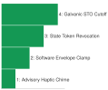
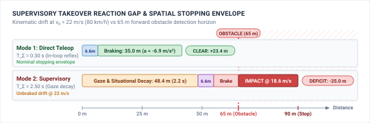
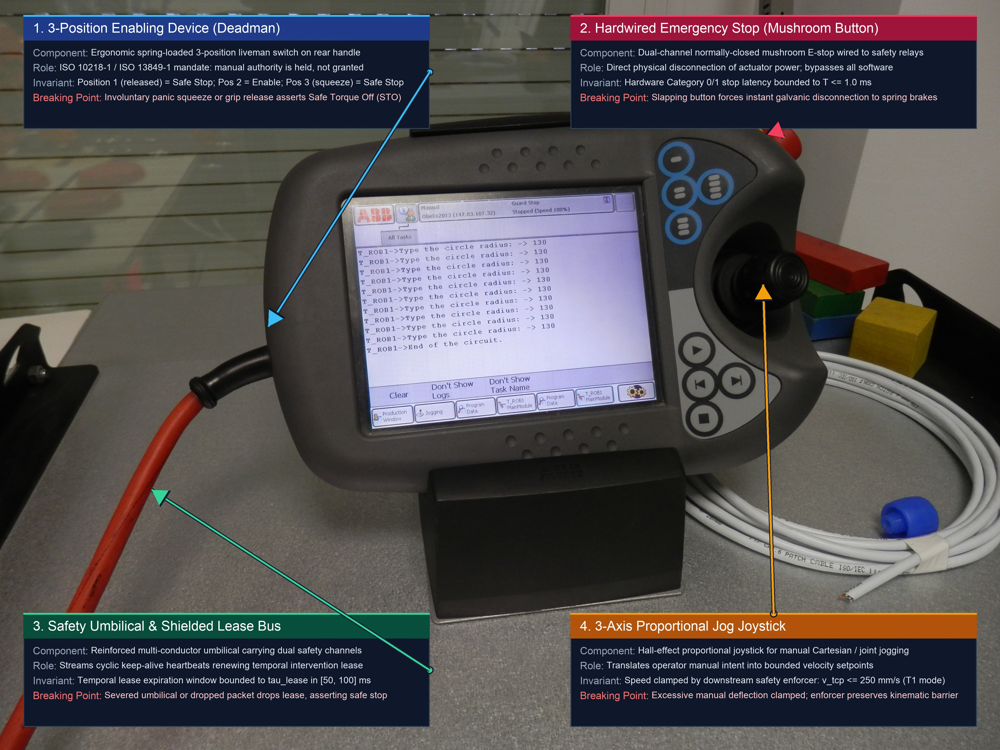

# Supervisory Intervention {#sec-intervention}

::: {layout-narrow}
::: {.column-margin}

\chapterminitoc

:::

::: {.content-visible when-format="pdf"}
\noindent
{fig-alt="Isometric blueprint showing supervisory intervention on an autonomous vehicle steer-by-wire chassis: independent double-wishbone suspension, vehicle perception mast, steer-by-wire rack and pinion, The human steering wheel override enables the driver to regain control in emergencies. The glowing kinetic authority clutch modulates power transfer between the steering system and the vehicle’s control architecture, ensuring responsive handling. The timestamped intervention relay records and triggers interventions based on real-time data, crucial for system reliability and safety., and tire contact friction ellipses."}
:::

::: {.content-visible unless-format="pdf"}
{fig-alt="Isometric blueprint showing supervisory intervention on an autonomous vehicle steer-by-wire chassis: independent double-wishbone suspension, vehicle perception mast, steer-by-wire rack and pinion, human steering wheel override, glowing kinetic authority clutch, timestamped intervention relay, and tire contact friction ellipses."}
:::

:::

## Purpose {.unnumbered .unlisted}

::: {.content-visible when-format="pdf"}
\begin{marginfigure}
\vspace{1em}
\resizebox{\linewidth}{!}{\mlphysicalstackfull{20}{20}{20}{20}{20}}
\end{marginfigure}
:::

_When a human grabs the controls of a running machine, how do you transfer kinetic authority without causing the very collision you meant to prevent?_

A request to take control reaches a machine already moving under another command. Combining commands without a defined handover can produce unintended motion. Abruptly switching between them can also impose a mechanical shock. Intervention must assign authority to specific operations, establish when the transfer takes effect, and preserve a feasible command throughout the transition. Human reaction time and communication delay consume the same clearance budget as automated computation, so an operator cannot serve as an assumed instantaneous fallback. The machine needs a defined response when a takeover request or acknowledgment arrives late. Recording the transfer matters as well, because a successful human rescue must not appear in the evidence as autonomous success. Supervisory intervention extends the contract among brain, nervous system, and body to a human authority whose commands remain subject to physical limits and execution deadlines.



::: {.callout-learning-objectives}

- Specify operator permissions that bind authorized actions to scope, deadlines, and authentication requirements
- Design authority transfers that preserve command continuity within the machine's physical limits
- Distinguish policy failure, authority transfer, and human recovery in timestamped intervention records
- Evaluate whether operational logs can reconstruct command authority and physical outcomes after an incident

:::

## Shared Authority {#sec-intervention-shared-authority}

In classical robotic safety diagrams, systems engineers routinely draw an icon of a human supervisor with a clean, unilateral control arrow directed toward the plant—treating human oversight as an unexamined, fail-safe backstop. The implicit assumption is simple: when an autonomous policy drifts or encounters an edge case, a human operator's ability to intervene is limited by physiological and cognitive reaction times, ranging from hundreds of milliseconds to several seconds. This delay can significantly impact the dynamics of the system, making it crucial to design controls that account for these human factors to prevent potential catastrophes. In the physical world, this assumption is an engineering fallacy. Even with perfect isolation across hardware memory and microsecond-precision reflexes, an autonomous machine does not operate in a vacuum; it functions in shared environments with human supervisors. An operator is not an external observer who can instantaneously alter the state of a continuous machine; an intervention is an injection of physical force, communication delay, and physiological latency into a plant already possessing significant kinetic energy, angular momentum, and electrical flux. When a human grabs the teach pendant of an industrial robot arm or turns the steering wheel of an autonomous transport vehicle, the machine must decide within a single control period which authority commands the actuators. If the control architecture executes an abrupt binary relay switch between the learned policy and the manual override, the resulting step change in commanded torque ($\Delta \tau$) demands instantaneous acceleration, producing infinite jerk ($\dddot{q} \to \infty$) and destructive mechanical shock ($\int F \, dt$). Gear teeth shear inside planetary reducers, structural resonances are excited in articulated linkages, tire traction limits diverge into uncontrollable skids, and human operators suffer cognitive disorientation and mode confusion. Conversely, if the machine hesitates or drops setpoints mid-stride, human physiological response time ($400\text{ ms}$ to $1200\text{ ms}$) leaves the chassis drifting blind across meters of unmonitored space before physical braking can even begin. How does an autonomous system govern the transfer of kinetic authority between human and machine without triggering the very collision or mechanical destruction the intervention was intended to avert?

::: {.column-margin .margin-pointer}
↰ **Prerequisite:** The dual-brain proposal-permission boundary establishes the baseline for supervisory preemption in @sec-boundary-dual-brain.
:::

::: {#fig-14-locator fig-env="figure" fig-pos="htb" fig-cap="**Shared Autonomy Architecture Focus**: The four-tier physical AI systems architecture highlights the system governance and assurance tier, with shared autonomy as this chapter's active focus. Read the highlighted box as the layer that decides who holds actuator authority at each instant, because concurrent human and machine commands produce split-brain execution and mechanical shock without a deterministic arbiter." fig-alt="Diagram titled Physical AI Systems Architecture Stack, drawn as four stacked tiers. Layer 4 is system governance and assurance at 0.1 to 1 hertz, holding boxes for shared autonomy, verification, safety cases, and frontier limits. Layer 3 is the brain, a cognitive deliberation tier at 1 to 50 hertz, holding five stages named ingestion, perception, memory, intent, and planner. A dashed proposal-permission privilege boundary separates it from layer 2, the nervous system, a real-time safety and timing tier at 1000 hertz. Layer 1 is the physical body and continuous plant. Layer 4 is outlined and its shared autonomy box is highlighted; the badge reads Active Focus, Chapter 14, Shared Autonomy."}
{width="100%"}
:::

This governance dilemma marks the entry into Part IV of this book. As illustrated in the architecture stack in @fig-14-locator, Shared Autonomy resides within Tier 4 (System Governance & Assurance). Operating at supervisory cadences of $0.1\text{ to }1\text{ Hz}$, governance sits at the apex of the physical AI stack, establishing the operational rules and privilege boundaries under which all lower tiers must execute. Yet supervisory decisions cannot remain abstract software policies; they must govern the continuous physical interaction between human operators and the machine across the entire stack:

- **The Brain (Tier 3):** where high-capacity neural networks, vision-language-action (VLA) foundation models, and deliberative planners generate continuous trajectory proposals at $1\text{ to }50\text{ Hz}$;[^fn-bridge-intervention-brain]
- **The Nervous System (Tier 2):** where hard real-time fieldbuses (EtherCAT, CAN-FD), hardware state arbiters, and deterministic safety enforcers execute at $1000\text{ Hz}$ to enforce timing and physical invariants;[^fn-bridge-intervention-nervous] and
- **The Body (Tier 1):** where motor inverters, winding thermal dissipation limits ($I^2R$ Joule heating), mechanical gearboxes, and payload inertia dictate the continuous laws of motion.[^fn-bridge-intervention-body]

[^fn-bridge-intervention-brain]: **Proposal-Permission Privilege Boundary**\index{Proposal-permission architecture!Tier 3}: As established in @sec-brain-embodied, Tier 3 neural planners and vision-language-action policies operate as unverified proposal generators. They emit candidate trajectory setpoints that must never bypass deterministic safety enforcement to command motor registers directly. Direct register dispatch from unverified models risks unconstrained current spikes, motor stator saturation, and uncontrollable plant runaway.

[^fn-bridge-intervention-nervous]: **Deterministic Nervous System Enforcement**\index{Nervous system!deterministic enforcement}: As detailed in @sec-nervous-multi-rate-bridge and @sec-enforcement-deterministic-gatekeeper, Tier 2 executes at a hard real-time cadence of $1000\text{ Hz}$. It hosts runtime barrier certificates, hardware watchdog interlocks, and fieldbus arbiters capable of atomically revoking model execution tokens within a single $1\text{ ms}$ control cycle. Deterministic token revocation guarantees that erratic model proposals are intercepted before mechanical gear trains or power inverters exceed safe thermal envelopes.

[^fn-bridge-intervention-body]: **Actuator Dynamics and Kinodynamic Limits**\index{Actuator dynamics!kinodynamic feasibility}: As analyzed in @sec-body-five-budgets and @sec-planning-kinodynamic-feasibility, instantaneous torque steps induce severe Joule heating ($I^2R$), magnetic stator saturation, and tooth impact wear in planetary gearboxes. Kinodynamic feasibility requires trajectory setpoints to observe strict acceleration, torque rate, and jerk limits. Violating these physical boundaries induces mechanical shock, gear tooth shearing, and irreversible inverter breakdown.

Bainbridge's classic *ironies of automation* [@bainbridge1983ironies] observe that an autonomous system tends to leave human operators responsible for the rarest, most complex edge cases while stripping them of the continuous manual engagement necessary to maintain situational awareness. When an operator intervenes to stabilize an oscillating $500\text{ kg}$ crane payload translating at $1.0\text{ m/s}$, supervisory authority is effective only if it maps to an executable physical response bounded by actuator torque and thermal derating limits. Taking control of a machine already in motion forces the system to resolve two tightly coupled challenges simultaneously: discrete state arbitration without ambiguity in the software domain, and continuous physical trajectory transition without mechanical shock in the continuous domain. In discrete software, the architecture must prevent split-brain execution where the learned policy and the human operator issue concurrent, conflicting torque setpoints. The state arbiter must atomically revoke the model's execution token, acknowledge the operator's override, and switch tracking multiplexers within a single control period of $1\text{ ms}$ on a $1000\text{ Hz}$ loop. In continuous dynamics, the nervous system must execute a **bumpless transfer**\index{Bumpless transfer}, blending reference trajectories in $SE(3)$, matching initial velocities, and ramping joint torques within strict jerk bounds so that the transition does not damage planetary gearboxes or exceed ISO 10218 / ISO/TS 15066 collaborative safety envelopes.

Beyond immediate real-time control, intervention events introduce a treacherous failure mode into the machine learning lifecycle. When an operator intervenes to steer a mobile robot away from a blind drop-off or steady a slipping robotic gripper, the telemetry recorder captures a sudden trajectory discontinuity. If the training data pipeline ingests these rescued episodes as nominal expert demonstrations without recording the exact millisecond of handover, imitation learning policies and offline reinforcement learning algorithms learn to reproduce the exact near-failure states that necessitated the rescue [@ross2011reduction; @zhao2023learning]. The policy optimizes toward the boundary where the human intervened because the subsequent manual recovery contains high task rewards. Preventing this policy corruption requires rigorous data hygiene: the logging pipeline must capture immutable, hardware-synchronized timestamps of authority transitions, mark the pre-intervention trajectory as a terminated failure, and isolate recovery maneuvers from nominal behavioral datasets.

To resolve this multi-tier dilemma, this chapter establishes the formal architecture of supervisory intervention across seven progressive sections. @Sec-intervention-human-authority formalizes human authority over actuation, replacing colloquial human-in-the-loop abstractions with an authenticated capability matrix and quantifying the physiological takeover reaction floor that dictates hard physical ceilings on operational velocity. @Sec-intervention-authority-transitions establishes discrete authority transitions, architecting the state machine and token-arbitration protocol that guarantees mutually exclusive actuator command across distributed fieldbuses. @Sec-intervention-bumpless-transfer formulates continuous bumpless transfer, deriving $\mathcal{C}^2$ impedance blending and jerk-bounded torque ramps to satisfy actuator kinodynamic limits. @Sec-intervention-authenticating-intervention establishes cryptographic authentication, session validation, and anti-replay protocols for remote intervention links subject to packet loss and transport jitter. @Sec-intervention-trustworthy-logs and @sec-intervention-authority-log construct tamper-evident, IEEE 1588 PTP-synchronized black-box logging architectures that enforce strict data hygiene to prevent policy corruption during post-incident training cycles. @Sec-intervention-failure-modes analyzes physical failure modes of handover, diagnosing pilot-induced oscillations, latency-induced limit cycles, and operator mode confusion. Finally, @sec-intervention-fallacies-pitfalls catalogs the recurring engineering fallacies that emerge when human oversight is misconstrued as an unconditional safety guarantee.

We begin in @sec-intervention-human-authority by establishing the capability matrix that governs human authority over physical actuation.

## Human Authority Over Actuation {#sec-intervention-human-authority}

System block diagrams often depict a human supervisor with an arrow pointing toward the plant, treating oversight as an unexamined safety backstop. In the physical world, drawing a person in the loop is not an authority model. Authority cannot attach to a generic human role or abstract supervision block. It must attach to specific named operations with explicit timing budgets, physical degrees of freedom, and deterministic preemption rules. Rather than granting an operator broad administrative authority, the nervous system maintains an explicit **capability matrix**\index{Capability matrix}---a strict digital permissions table mapping individual operations (such as an emergency power cutoff, a velocity trim adjustment, a trajectory path veto, or full manual steering) to authenticated roles, reflecting classic taxonomies of human supervisory control[^fn-std-sheridan-supervisory] [@sheridan1992telerobotics] and multi-level automation [@parasuraman2000model]. Each entry in this matrix defines the exact actuator channels the operation governs, the preemption priority it carries over the learned policy, and the maximum propagation latency permitted from physical input to actuator response.

[^fn-std-sheridan-supervisory]: **Supervisory Control Levels**\index{Supervisory Control Levels}: @sheridan1978human formulated the foundational ten-level taxonomy of supervisory control, demonstrating that human authority degrades into hazardous ambiguity without explicit decision boundaries and strict timing contracts. In standardized autonomous architectures (SAE J3016), supervisory authority is formalized through defined operational design domains and deterministic fallback windows. Failure to enforce these operational boundaries leaves the plant vulnerable to unmonitored trajectory drift during operator latency intervals.

Naming the operations separates **intervention**\index{Intervention} from **safety enforcement**\index{Safety enforcement}, two mechanisms that system architectures routinely conflate. Enforcement withholds permission from a candidate action proposed by a learned model, modifying, clamping, or rejecting the setpoint while leaving the machine under autonomous control. Intervention transfers authority away from the model to an external entity, terminating autonomous operation and placing actuation under direct supervisory command. An **enforcement filter**\index{Enforcement filter} sits in the fast control path to prevent the policy from demanding an over-current maneuver or violating a barrier certificate [@ames2019control] during nominal tracking, respecting the actuator thermal limits established in @sec-body-five-budgets and the kinodynamic feasibility boundaries from @sec-planning-continuous-trajectories. An intervention mechanism strips the policy of its execution token entirely---revoking its right to command the hardware---when an operational boundary is breached or an operator demands control. A system equipped with enforcement but lacking intervention cannot be redirected when human intent changes or external conditions fall outside the policy design envelope. Conversely, a system equipped with intervention but lacking enforcement permits a lagging operator to drive the plant into structural failure during nominal manual flight. A system with one mechanism and not the other is incomplete in a way no amount of the other fixes.

::: {.column-margin}
{width="100%" fig-alt="Vertical staircase ladder showing four tiers of supervisory escalation from advisory haptic chime to galvanic cutoff."}

*Authority escalates monotonically from advisory haptic feedback to galvanic torque cutoff.*
:::

When an operator attempts an intervention, human biology imposes a hard real-time latency budget before any physical corrective action can occur. Human response time is not a single point event, but a cascaded pipeline of physiological and mechanical stages. In an analytical breakdown of an operator monitoring a vehicle telemetry stream, the sensory recognition stage requires $150\text{ ms}$ to $300\text{ ms}$ for light to strike the retina, travel through the visual pathway, and register as an optical anomaly. The situational assessment stage, in which the operator recognizes that the learned policy is drifting toward a hazard and selects an appropriate counter-action, demands $500\text{ ms}$ to $1500\text{ ms}$. Finally, the motor actuation stage, covering the transmission of motor signals down the spinal cord, muscle recruitment in the hand, and the physical displacement of an override switch, consumes $200\text{ ms}$ to $400\text{ ms}$. Summing these sequential budgets establishes the physiological **takeover reaction floor**\index{Takeover reaction floor}. Accounting for network transport and communication handshake latency $T_{\text{comm}}$, total supervisory takeover latency $T_{\Sigma}$ decomposes into:
$$T_{\Sigma} = T_{\text{sensory}} + T_{\text{cognitive}} + T_{\text{motor}} + T_{\text{comm}}$$ {#eq-intervention-reaction-floor}

During this reaction interval, the machine coasts blind, traversing an unmonitored drift distance $d_{\text{drift}} = v_0 \cdot T_{\Sigma}$ under unchecked policy authority before the electrical intervention signal ever reaches the hardware arbiter. Once the operator engages physical braking, the vehicle requires an additional stopping distance governed by its maximum deceleration $a_{\text{max}}$. Integrating the constant velocity phase during human reaction with the uniform deceleration phase produces the minimum safe intervention distance:[^fn-math-intervention-distance]
$$d_{\text{stop}} = v_0 \cdot T_{\Sigma} + \frac{v_0^2}{2 a_{\text{max}}}$$ {#eq-intervention-stopping-distance}

[^fn-math-intervention-distance]: **Minimum Safe Intervention Distance**\index{Minimum safe intervention distance}: Total stopping distance $d_{\text{stop}}$ integrates the unmonitored spatial drift during human reaction latency ($v_0 T_{\Sigma}$) with the mechanical braking distance ($v_0^2 / (2a_{\text{max}})$). At an operational speed of $15\text{ m/s}$, a $2.0\text{ s}$ out-of-the-loop reaction delay consumes $30\text{ m}$ of clearance before friction brakes can even engage. Systems lacking adequate spatial clearance margins inevitably strike obstacles at full operating velocity.

The total distance for a human operator to detect an obstacle, actuate an override, and bring the plant to rest is dominated by neurological, muscular, and communication delays before the brakes engage. Because the reaction distance scales linearly with velocity while the deceleration distance scales quadratically, human intervention becomes physically incapable of averting close-range collisions as operational speed increases.

::: {.column-margin .margin-pointer}
↰ **Prerequisite:** Actuator torque limits and back-EMF dynamics governing safe handovers originate in @sec-body-actuator-limits.
:::

To see the direct physical consequences of @eq-intervention-reaction-floor and @eq-intervention-stopping-distance, consider a mobile robot traveling at forward velocity $v_0 = 5.0\text{ m/s}$ ($18.0\text{ km/h}$) toward an obstacle with an initial clearance $d_{\text{clearance}} = 10.0\text{ m}$, equipped with chassis braking capable of maximum deceleration $a_{\text{max}} = 2.5\text{ m/s}^2$. Once mechanical braking engages, the vehicle requires $d_{\text{brake}} = \frac{v_0^2}{2 a_{\text{max}}} = \frac{(5.0\text{ m/s})^2}{2 \times 2.5\text{ m/s}^2} = 5.00\text{ m}$ of deceleration runway regardless of intervention mode. However, the total stopping envelope diverges dramatically based on supervisory latency:

1. **Mode 1: Direct Bilateral Teleoperation**: Under continuous haptic teleoperation with an active proprioceptive loop, total closed-loop reaction and bus transit delay is bounded to $T_{\Sigma,1} = 150.0\text{ ms}$ ($0.15\text{ s}$). Free-running reaction drift is $d_{\text{drift},1} = v_0 \cdot T_{\Sigma,1} = (5.0\text{ m/s})(0.15\text{ s}) = 0.75\text{ m}$. Applying @eq-intervention-stopping-distance yields a total stopping distance of $d_{\text{stop},1} = 0.75\text{ m} + 5.00\text{ m} = 5.75\text{ m}$, safely halting the machine with a comfortable $4.25\text{ m}$ buffer remaining.
2. **Mode 2: Passive Out-of-the-Loop Supervisory Takeover**: When an operator monitors remote telemetry passively, sensory recognition consumes $T_{\text{sensory}} = 300.0\text{ ms}$, cognitive situational assessment requires $T_{\text{cognitive}} = 1200.0\text{ ms}$, motor switch actuation takes $T_{\text{motor}} = 300.0\text{ ms}$, and network transport and handshake protocol overhead adds $T_{\text{comm}} = 200.0\text{ ms}$. By @eq-intervention-reaction-floor, the cumulative reaction latency expands to $T_{\Sigma,2} = 2000.0\text{ ms} = 2.0\text{ s}$. During this cognitive re-engagement window, the unmonitored chassis covers $d_{\text{drift},2} = (5.0\text{ m/s})(2.00\text{ s}) = 10.00\text{ m}$. Total stopping distance under @eq-intervention-stopping-distance expands to $d_{\text{stop},2} = 10.00\text{ m} + 5.00\text{ m} = 15.00\text{ m}$—a spatial expansion ratio of $\frac{d_{\text{stop},2}}{d_{\text{stop},1}} = \frac{15.00\text{ m}}{5.75\text{ m}} \approx 2.61$ ($2.61\times$), while reaction drift alone expands by $\frac{10.00}{0.75} \approx 13.33\times$.

In Mode 2, the vehicle breaches the $10.0\text{ m}$ clearance boundary by $5.00\text{ m}$, striking the obstacle at the full initial velocity of $v_{\text{impact}} = 5.0\text{ m/s}$ because impact occurs before mechanical braking ever begins. For an out-of-the-loop supervisor in Mode 2 to avert collision within that same $10.0\text{ m}$ clearance given the $2.0\text{ s}$ reaction time, solving the quadratic kinematic constraint $d_{\text{clearance}} = v_{\max} T_{\Sigma} + \frac{v_{\max}^2}{2 a_{\max}}$ bounds the maximum allowable velocity to:
$$v_{\max} \approx 3.66\text{ m/s}\quad (13.2\text{ km/h})$$
This demonstrates that human re-engagement latency establishes a hard physical ceiling on operational velocity that cannot be circumvented by higher-gain actuators or emergency friction pads.

```{python}
#| label: calc-intervention-operator-takeover-budget
#| echo: false
# ┌─────────────────────────────────────────────────────────────────────────────
# │ OPERATOR TAKEOVER AND CLEARANCE BUDGET (LEGO): 'Operator Takeover' refers to a human operator's ability to regain control of a system in critical situations, while 'Clearance Budget' measures the spatial constraints a robotic system must navigate. 'LEGO' denotes modular robotic systems that can be reconfigured, illustrating these concepts tangibly.
# ├─────────────────────────────────────────────────────────────────────────────
# │ Context: This section discusses key concepts in physical AI systems, including:
# │ - Intervention: The act of altering a system's state or behavior.
# │ - Operator: The entity (human or machine) that controls the system.
# │ - Takeover: The process by which an operator assumes control over a system's actions. This concept is relevant in contexts like embedded control systems and reinforcement learning. For instance, in a robotic control system, an operator might adjust the system's actions in response to unexpected environmental changes, ensuring stability. Understanding takeover's implications on system latency and performance is crucial for effective operation in Physical AI systems.
# │ - Budget: 'Budget' in physical AI systems refers to the allocation of resources, such as time and computational power, for effective interventions. In machine learning, a limited budget restricts training time, resulting in a less accurate model. In embedded systems, insufficient computational resources can hinder real-time processing, affecting system responsiveness. In robotics, resource allocation impacts the safety and precision of actions, illustrating necessary trade-offs in design and implementation.
# │ - Spatial Clearance: The distance required for safe operation within an environment. For instance, in a robotic arm operating in a factory, spatial clearance is essential to prevent collisions with nearby workers or equipment. This distance depends on the robot's dynamics, the environment (e.g., static vs. dynamic obstacles), and metrics like speed and range of motion. Adequate spatial clearance enhances safety and optimizes system performance by ensuring reliable sensor and actuator operation.
# │ - 'Margin' is a safety buffer ensuring reliable operation under varying conditions. In the context of physical AI systems, this margin is the range of operational parameters—thermal limits, voltage ranges, and timing constraints—that a system can tolerate while maintaining performance. For instance, in control systems, stability margins (like gain and phase margins) are critical for ensuring that the system remains stable under perturbations. In machine learning, a robust model maintains performance across scenarios by managing uncertainty within its margin.
# │ Understanding the key components of physical AI systems—sensors, actuators, and computational units—and their interrelations is crucial. Sensors collect environmental data, actuators perform actions based on this data, and computational units process information for decision-making. Recognizing these relationships grounds effective system design.
# │ Goal: We define the 'stopping envelope' as the conditions under which a system can safely halt. This includes parameters like response time, distance, and energy dissipation, influenced by physical forces such as friction. Next, we will compare haptic feedback systems, which provide real-time tactile feedback to users, with out-of-loop takeover mechanisms, which allow human operators to intervene in automated processes. Evaluating these systems is essential for assessing their effectiveness in real-world applications, particularly regarding metrics like safety, reliability, and response time.
# │ Show:    'd_stop' is the stopping distance in haptic feedback scenarios, measured at 5.75 m during direct user interaction. In out-of-the-loop control, this stopping distance expands to 15.0 m. This threefold increase is primarily due to system latency, which delays feedback to the user, and reduced responsiveness in the control system. This increase is critical for safety margins in automated systems; inadequate stopping distances can lead to failures, especially with minimal human oversight.
# │ How:     The kinematic model describes motion under uniform acceleration. In this context, the equation v0 * t_reaction + v0^2 / (2 * a_max) calculates the distance an object travels during a reaction time (t_reaction) given its initial velocity (v0) and maximum acceleration (a_max). 'v0' is the initial velocity, 't_reaction' is the response time, and 'a_max' is the maximum deceleration. These variables are crucial for AI applications in motion prediction and control.
# └─────────────────────────────────────────────────────────────────────────────
from mlsysim import *
from mlsysim.core.units import *
from mlsysim.fmt import (
    fmt_velocity,
    fmt_acceleration,
    fmt_length,
    fmt_latency,
    fmt_time,
    fmt_multiple,
    fmt_display_math,
    check,
)

class InterventionTakeoverBudget:
    """Quantitative operator takeover and spatial clearance budget across intervention tiers."""

    # ┌── 1. LOAD (Constants & Parameters) ─────────────────────────────────
    v0 = 5.0 * (meter / second)
    a_max = 2.5 * (meter / (second**2))

    # Bilateral haptic teleoperation (tight proprioceptive loop)
    t_haptic = 150.0 * millisecond
    # Passive out-of-the-loop takeover (cognitive re-engagement delay)
    t_out_of_loop = 2000.0 * millisecond

    # ┌── 2. EXECUTE (Compute) ─────────────────────────────────────────────
    d_brake = ((v0**2) / (2 * a_max)).to(meter)

    d_drift_haptic = (v0 * t_haptic).to(meter)
    d_stop_haptic = calc_safe_stopping_distance(v0, t_haptic, a_max)

    d_drift_ool = (v0 * t_out_of_loop).to(meter)
    d_stop_ool = calc_safe_stopping_distance(v0, t_out_of_loop, a_max)

    drift_expansion_ratio = d_drift_ool / d_drift_haptic
    stop_expansion_ratio = d_stop_ool / d_stop_haptic

    # ┌── 3. GUARD (Invariants) ───────────────────────────────────────────
    check(abs(d_brake.magnitude - 5.0) < 0.01, f"Unexpected braking distance: {d_brake}")
    check(abs(d_drift_haptic.magnitude - 0.75) < 0.01, f"Unexpected haptic drift: {d_drift_haptic}")
    check(abs(d_stop_haptic.magnitude - 5.75) < 0.01, f"Unexpected haptic stop: {d_stop_haptic}")
    check(abs(d_drift_ool.magnitude - 10.0) < 0.01, f"Unexpected out-of-loop drift: {d_drift_ool}")
    check(abs(d_stop_ool.magnitude - 15.0) < 0.01, f"Unexpected out-of-loop stop: {d_stop_ool}")
    check(abs(drift_expansion_ratio.magnitude - 13.33) < 0.1, f"Unexpected drift expansion: {drift_expansion_ratio}")

    # ┌── 4. OUTPUT (Formatting) ──────────────────────────────────────────
    v0_str = fmt_velocity(v0, unit=meter / second, precision=0)
    a_max_str = fmt_acceleration(a_max, unit=meter / (second**2), precision=1)
    d_brake_str = fmt_length(d_brake, unit=meter, precision=0)

    t_haptic_str = fmt_latency(t_haptic, unit=millisecond, precision=0)
    d_drift_haptic_str = fmt_length(d_drift_haptic, unit=meter, precision=2)
    d_stop_haptic_str = fmt_length(d_stop_haptic, unit=meter, precision=2)

    t_out_of_loop_str = fmt_time(t_out_of_loop, 'millisecond', precision=0)
    d_drift_ool_str = fmt_length(d_drift_ool, unit=meter, precision=0)
    d_stop_ool_str = fmt_length(d_stop_ool, unit=meter, precision=0)
    stop_expansion_mult_str = fmt_multiple(round(stop_expansion_ratio.magnitude), precision=0)

    haptic_display_math = fmt_display_math(
        rf"d_{{\text{{stop,haptic}}}} = ({v0_str}) \times ({t_haptic_str}) + \frac{{({v0_str})^2}}{{2 \times ({a_max_str})}} = {d_drift_haptic_str} + {d_brake_str} = {d_stop_haptic_str}"
    )
    ool_display_math = fmt_display_math(
        rf"d_{{\text{{stop,ool}}}} = ({v0_str}) \times ({t_out_of_loop_str}) + \frac{{({v0_str})^2}}{{2 \times ({a_max_str})}} = {d_drift_ool_str} + {d_brake_str} = {d_stop_ool_str}"
    )
```

::: {#nbk-intervention-operator-takeover-budget-spatial-clearance-margin .callout-notebook title="Takeover budget and clearance margin"}
**Concept**: Calculating the total stopping distance during a human intervention requires adding up every source of delay before the machine comes to a complete halt across four distinct phases:

1. **Reaction Drift**: The distance the machine travels while the human perceives the obstacle and physically reacts ($v_0 \cdot T_{\text{reaction}}$).
2. **Handshake Drift**: The distance covered while the machine's internal software verifies the human's command ($v_0 \cdot T_{\text{handshake}}$).
3. **Actuator Blending**: The distance traveled while the machine executes the $C^2$ bumpless authority transfer ramp to safely smooth the transition from autonomous to manual control (@sec-planning-continuous-trajectories).
4. **Physical Braking**: The final distance required for the brakes to decelerate the mass to rest ($v_0^2 / (2 a_{\text{max}})$).

**Worked Comparison**: At nominal speed $v_0 =$ `{python} InterventionTakeoverBudget.v0_str` under maximum braking $a_{\text{max}} =$ `{python} InterventionTakeoverBudget.a_max_str` ($d_{\text{brake}} =$ `{python} InterventionTakeoverBudget.d_brake_str`):

- **Direct Bilateral Teleoperation** ($T_{\Sigma} =$ `{python} InterventionTakeoverBudget.t_haptic_str`):
  `{python} InterventionTakeoverBudget.haptic_display_math`
- **Out-of-the-Loop Takeover** ($T_{\Sigma} =$ `{python} InterventionTakeoverBudget.t_out_of_loop_str`):
  `{python} InterventionTakeoverBudget.ool_display_math`

**Systems Insight**: Passive monitoring inflates reaction delay from `{python} InterventionTakeoverBudget.t_haptic_str` to `{python} InterventionTakeoverBudget.t_out_of_loop_str`, expanding total stopping distance by `{python} InterventionTakeoverBudget.stop_expansion_mult_str` (from `{python} InterventionTakeoverBudget.d_stop_haptic_str` to `{python} InterventionTakeoverBudget.d_stop_ool_str`). When adding these up for an autonomous vehicle on a highway, the combined delays often consume nearly the entire safety margin. Even a fraction of a second drop in human attention can turn a safe stop into a collision. For the rigorous kinematic derivation of these stopping distances, see @sec-appendix-systems.
:::

::: {#chk-intervention-takeover-reaction-floor-stopping-envelope .callout-checkpoint title="Takeover reaction floor and clearance expansion"}

{fig-alt="2D spatial corridor comparing Mode 1 in-the-loop direct teleoperation against Mode 2 supervisory out-of-the-loop takeover at 22 meters per second. Mode 1 halts with a 23.4-meter safety margin before a 65-meter obstacle, whereas Mode 2's 2.5-second reaction delay produces a 55-meter unbraked drift that exhausts the stopping runway, resulting in a 17.5 meters per second collision." width=100%}

Consider an embodied mobile robot operating near physical obstacles with a human supervisor:

- [ ] **Reaction floor decomposition**: Can you explain why total supervisory takeover latency $T_{\Sigma}$ cannot be treated as a single uniform software timer, breaking it down into physiological sensory recognition, cognitive situational assessment, motor actuation, and digital transport stages?
- [ ] **Linear drift versus quadratic braking scaling**: Can you describe how the linear velocity scaling of reaction drift ($v_0 \cdot T_{\Sigma}$) interacts with the quadratic scaling of mechanical braking ($\frac{v_0^2}{2 a_{\text{max}}}$) as operating speed increases, and explain why out-of-the-loop human takeover becomes physically incapable of averting collisions at highway speeds regardless of brake clamping force?
- [ ] **Velocity ceilings enforced by supervisory latency**: Can you explain why human re-engagement latency ($T_{\Sigma} \ge 2.0\text{ s}$) enforces a hard mathematical ceiling on allowable autonomous operating velocity within bounded sensing horizons?
:::

::: {#psp-intervention-spatial-takeover-budget .callout-perspective title="The spatial takeover budget law"}
Handover is an allocation of physical distance, not digital clock cycles. If the spatial travel during human reaction time $v \cdot T_{\text{reaction}}$ plus the kinematic braking distance $\frac{v^2}{2 a_{\text{max}}}$ exceeds the sensing clearance margin, no software handshake or arbitration algorithm can avert collision. The handover deadline $T_{\text{timeout}}$ must be dynamically bounded by physical stopping distance, not fixed in configuration files. @Fig-intervention-stopping-distance sweeps that calculation across the operating envelope, and the three bands make the failure mode legible: the two latency terms scale linearly with velocity while braking scales with its square, so a handover margin that is comfortable in an urban corridor disappears at highway speed.
:::

::: {#fig-intervention-stopping-distance fig-env="figure" fig-pos="htb" fig-cap="**Spatial Takeover Budget**: Total stopping distance against vehicle velocity, decomposed into human reaction drift, protocol handshake and actuator blend, and physical braking. The reaction and handshake terms grow linearly with speed while braking grows quadratically, so the clearance a handover consumes is a distance budget rather than a latency budget." fig-alt="Stacked area chart of total stopping distance against vehicle velocity, split into human reaction drift, handshake and actuator blend, and physical braking. Total distance grows quadratically with velocity, reaching about one hundred forty meters at one hundred twenty kilometers per hour."}

```{python}
#| echo: false
import pandas as pd
import matplotlib.pyplot as plt
from mlsysim import viz

df = pd.read_csv("vol4/14_intervention/data/intervention_stopping_distance.csv")

fig, ax, COLORS, plt = viz.setup_plot(figsize=(8, 5))
ax.stackplot(
    df["Velocity_kmph"],
    df["Reaction_Drift_m"],
    df["Handshake_Drift_m"] + df["Blend_Drift_m"],
    df["Braking_Distance_m"],
    labels=["Human Reaction Drift (1.0s)", "Handshake & Actuator Blend", "Physical Braking (6.0 m/s²)"],
    colors=["#e74c3c", "#f39c12", "#3498db"],
    alpha=0.8,
)

ax.set_xlabel("Vehicle Velocity (km/h)", fontweight="bold")
ax.set_ylabel("Total Stopping Distance (m)", fontweight="bold")
ax.legend(loc="upper left")
ax.grid(True, linestyle="--", alpha=0.6)
ax.set_xlim(df["Velocity_kmph"].min(), df["Velocity_kmph"].max())
ax.set_ylim(0, df["Total_Distance_m"].max() * 1.1)

plt.tight_layout()
plt.show()
plt.close()
```

:::

Latency penalties scale with communication topology and operator cognitive engagement across intervention modalities in @tbl-14-teleop-stability. In high-bandwidth bilateral haptic teleoperation, proprioceptive reflexes and deterministic local buses bound closed-loop delay $T_{\Sigma}$ to under $185\text{ ms}$, preserving dynamic passivity such that the coupled human-machine system strictly dissipates energy rather than exciting unstable oscillatory modes. In contrast, remote supervisory dispatch and out-of-the-loop takeover inflate total reaction delay $T_{\Sigma}$ to upwards of $3700\text{ ms}$, expanding the stopping drift envelope $d_{\text{drift}}$ to $10.0\text{ m}$ (and total stopping distance to $15.00\text{ m}$) at nominal speed. Exceeding the plant's dynamic stability margin with communication or cognitive delays induces severe phase lag and pilot-induced oscillations, amplifying oscillatory motion and requiring local autonomous safety interceptors to clamp velocity and enforce barrier certificates.

| Control Modality & Operational Tier                                                         | Network & Transport Latency ($T_{\text{RTT}}$)                    | Neuromuscular & Cognitive Budget ($T_{\text{human}}$)                   | Total Closed-Loop Delay ($T_{\Sigma}$)                                           | Total Stopping Distance ($d_{\text{stop}}$ @ $5\text{ m/s}$)      | Dynamic Instability & Failure Mode                                                                | Hardware & Safety Interceptor                                                                            |
|:--------------------------------------------------------------------------------------------|:------------------------------------------------------------------|:------------------------------------------------------------------------|:---------------------------------------------------------------------------------|:------------------------------------------------------------------|:--------------------------------------------------------------------------------------------------|:---------------------------------------------------------------------------------------------------------|
| **Direct Bilateral Teleoperation** (Haptic / Force-Reflective) [@anderson1989bilateral]     | $\le 5\text{--}20\text{ ms}$ (Local deterministic bus / 5G URLLC) | $100\text{--}150\text{ ms}$ (Proprioceptive reflex & tactile feedback)  | $110\text{--}185\text{ ms}$ ($f_{\text{ctrl}} \ge 500\text{ Hz}$)                | $5.75\text{ m}$ ($0.75\text{ m}$ drift $+$ $5.0\text{ m}$ brake)  | Loss of passivity, pilot-induced oscillations (PIO), high-frequency haptic shudder                | Time-domain passivity observer (TDPO), scattering wave variables, motor current clamps                   |
| **Continuous Direct Velocity Guidance** (Rate-Assisted Steering / Joystick)                 | $30\text{--}80\text{ ms}$ (Private wireless / 5G SA edge slice)   | $250\text{--}450\text{ ms}$ (Active visual-manual tracking)             | $300\text{--}570\text{ ms}$ ($f_{\text{ctrl}} \approx 50\text{--}100\text{ Hz}$) | $7.25\text{ m}$ ($2.25\text{ m}$ drift $+$ $5.0\text{ m}$ brake)  | Phase lag instability, steering hunting limit cycles ($2\text{--}4\text{ Hz}$), lateral overshoot | Onboard velocity envelope limiter, control barrier certificates, deadman lease timeout ($100\text{ ms}$) |
| **Supervisory Waypoint & Corridor Dispatch** (Shared Autonomy / Path Veto) [@ahn2022saycan] | $100\text{--}250\text{ ms}$ (Public cellular / IP broker link)    | $600\text{--}1200\text{ ms}$ (Situational assessment & re-planning)     | $750\text{--}1550\text{ ms}$ ($f_{\text{ctrl}} \approx 5\text{--}10\text{ Hz}$)  | $10.75\text{ m}$ ($5.75\text{ m}$ drift $+$ $5.0\text{ m}$ brake) | Stale corridor execution, spatial collision during uplink delay, command starvation freeze        | Local receding-horizon obstacle veto, time-to-collision (TTC) governor, autonomous fallback              |
| **Out-of-the-Loop Takeover** (Passive Monitor / Autonomous Rescue)                          | $50\text{--}150\text{ ms}$ (Cabin bus / near-edge telemetry)      | $1500\text{--}3500\text{ ms}$ (Gaze re-engagement & cognitive recovery) | $1580\text{--}3710\text{ ms}$ ($f_{\text{ctrl}} \le 1\text{ Hz}$)                | $15.00\text{ m}$ ($10.0\text{ m}$ drift $+$ $5.0\text{ m}$ brake) | Unmonitored blind trajectory drift, panic over-correction, mechanical column lockup               | Monotonic Category 1 stop upon $T_{\text{timeout}}$ expiry, DMS gaze-decay alarm, torque rate limiter    |
| **Direct Hardware Emergency Stop** (Physical Switch / Safety Interlock)                     | $\le 1\text{ ms}$ (Hardwired dual-channel safety line)            | $150\text{--}300\text{ ms}$ (Reflexive palm slap / deadman release)     | $160\text{--}325\text{ ms}$ ($f_{\text{ctrl}} \ge 1000\text{ Hz}$)               | $6.25\text{ m}$ ($1.25\text{ m}$ drift $+$ $5.0\text{ m}$ brake)  | Infinite jerk shock, tire adhesion breakaway, mechanical driveline overload                       | Safe Torque Off (STO / SS1 ramp), dynamic friction braking, spring-applied holding brakes                |

: **Teleoperation Latency, Human Neuromuscular Delay, and Dynamic Control Stability Bounds**: Quantitative timing and stability budget across supervisory, teleoperated, and manual intervention modalities. Total closed-loop delay $T_{\Sigma} = T_{\text{RTT}} + T_{\text{human}} + T_{\text{act}}$ combines network transport, physiological response (sensory, cognitive, motor), and actuator mechanical rise time ($T_{\text{act}} \approx 10\text{--}60\text{ ms}$). Total stopping distance $d_{\text{stop}} = v_0 \cdot T_{\Sigma} + v_0^2 / (2 a_{\text{max}})$ is evaluated at nominal operational velocity $v_0 = 5.0\text{ m/s}$ ($18.0\text{ km/h}$) under maximum deceleration $a_{\text{max}} = 2.5\text{ m/s}^2$. As network and cognitive latencies grow, manual guidance loses dynamic passivity and induces pilot-induced oscillations, requiring local autonomous safety interceptors to enforce kinematic barrier certificates independently of remote operator input. {#tbl-14-teleop-stability tbl-colwidths="[14,14,14,16,14,14,14]"}

Human response is slow and prone to interruption; thus, manual authority cannot be an open-ended state.[^fn-inc-tempe-takeover] If an operator assumes control and subsequently experiences wireless packet loss, physical incapacitation, or cognitive distraction, the machine cannot remain adrift under stale manual setpoints. The architecture protects against operator dropouts by bounding manual authority with strict temporal leases—countdown timers that automatically expire without active, periodic renewal—and hardware **deadman switches**\index{Deadman switch}, which require continuous physical engagement to maintain actuation channels (@fig-14-teach-pendant). In a lease-based communication model, the vehicle nervous system issues a bounded delegation window of $50\text{ ms}$ to $100\text{ ms}$. The operator console must continuously stream authenticated keep-alive packets to renew the lease before the deadline expires. If a single lease window lapses without renewal, or if an operator releases a spring-loaded physical deadman switch on the controller, manual authority terminates immediately, commanding a deterministic safe stop that engages mechanical friction brakes and de-energizes motor inverters.[^fn-std-iso13849-takeover] Authority is not a persistent condition. It is a perishable resource that requires active, periodic renewal to survive.

[^fn-inc-tempe-takeover]: **NTSB Autonomous Vehicle Investigation HAR-19/03**\index{NTSB Report HAR-19/03}\index{Tempe fatal collision!investigation findings}: The National Transportation Safety Board investigation into the 2018 Tempe collision documented that the developmental automated driving system lacked situational awareness tracking for operator attentiveness and lacked a structured, unambiguous authority transfer protocol. The operating company's disabling of the factory autonomous emergency braking system—implemented to eliminate diagnostic bus interference—removed the independent safety backstop, demonstrating that intervention architectures must treat human operator availability as a dynamic, decaying state rather than an invariant assumption.

[^fn-std-iso13849-takeover]: **Three-Position Enabling Devices**\index{Three-position enabling devices}: International standards ISO 13849-1 (Performance Level e) and ISO 10218-1 mandate three-position enabling devices for manual robot teach operations. Releasing the switch to Position 1 or panicking with an over-squeeze to Position 3 de-energizes dual-channel safety contacts, asserting Safe Torque Off (STO) at the inverter level. This hardware design prevents involuntary operator muscle spasms from holding motion channels active during an emergency.

::: {#fig-14-teach-pendant fig-env="figure" fig-pos="t" fig-cap="**Teach Pendant Physical Intervention Hardware and Authority Mechanisms**: An industrial ABB teach pendant annotated across four physical authority subsystems: (1) 3-position ergonomic enabling device (deadman grip under ISO 10218-1/ISO 13849-1) where manual authority is held rather than granted and an involuntary panic squeeze or release asserts Safe Torque Off (STO), (2) hardwired mushroom Emergency Stop (E-stop) button directly opening dual-channel safety relays to drop actuator power within $\le 1.0\text{ ms}$ bypassing all software, (3) heavy-gauge safety umbilical maintaining a $50\text{--}100\text{ ms}$ keep-alive lease where a cable break or packet drop instantly engages spring brakes, and (4) 3-axis proportional jog joystick with speed clamped to $\le 250\text{ mm/s}$ by downstream safety enforcers." fig-alt="Annotated photographic plate of an ABB industrial robot teach pendant showing four crisp rectangular callout cards: (1) 3-Position Enabling Device (Deadman switch), (2) Hardwired Emergency Stop Mushroom Button, (3) Safety Umbilical and Shielded Lease Bus, and (4) 3-Axis Proportional Jog Joystick."}
{width="85%"}
:::

Even while an operator holds an active lease, human authority remains subordinate to the kinematic and dynamic limits enforced at the hardware boundary. A common engineering mistake assumes that an emergency manual override must bypass all downstream safety filters to guarantee direct, unmediated actuator control. Bypassing safety enforcement at the motor level creates severe mechanical failure modes. If an operator panics and commands a steering rate that induces vehicle rollover, or requests a joint torque that would physically shear the gear teeth of a robotic actuator, the low-level safety enforcer sitting at the hardware floor rejects the command. The enforcer evaluates human setpoints against the same control barrier certificates, current limits, and kinematic floor boundaries applied to the learned model. Human intervention transfers operational discretion away from the learned policy, but it cannot suspend the laws of physics or dismantle the hardware-enforced envelopes that preserve the physical integrity of the machine.

## Authority Transitions {#sec-intervention-authority-transitions}

Control authority must be a discrete state, never an inference or mathematical blend. When an engineering team attempts to soften transitions by continuously averaging the control vectors of an autonomous policy and a human operator, the resulting command represents neither intent. If a human steers left to avoid a ditch while a neural network policy steers right to follow a lane marker, a linear interpolation between the two commands directs the steering angle straight forward, driving the vehicle into the obstacle at full speed. This authority conflict was demonstrated in the Boeing 737 MAX MCAS failures [@jatr2019boeing], where automated stabilizer trim overrode pilot inputs based on a faulty sensor without explicit handover states.[^fn-hw-fbw-override] To prevent this ambiguity, control authority at every discrete time tick $t$ must resolve to a single, mutually exclusive state $S_t \in \{\text{Autonomous}, \text{Handover-Pending}, \text{Human-Manual}, \text{Degraded-Fallback}, \text{Emergency-Stop}\}$. The nervous system evaluates arbitration logic, determines the active state, and commits that identity to the bus before dispatching setpoints to low-level motor controllers. At no point does the system compute a weighted average of conflicting masters or leave ownership open to statistical interpretation.

[^fn-hw-fbw-override]: **Inter-Core Authority Multiplexing**\index{Inter-core authority multiplexing}: Authority arbitration requires hardware-enforced exclusivity across distributed fieldbuses. Dual-writing to CAN-FD or EtherCAT segments from autonomous and manual controllers induces non-deterministic actuator chatter and inverter current oscillations. Hardware bus transceivers must enforce strict master-slave multiplexing to eliminate split-brain torque commands before switching transients shear planetary gearboxes.

The complete state transition logic, guard preconditions, execution time bounds ($T_{\text{trans}}$), and bumpless actuator blending profiles governing this arbiter are formalized in @tbl-14-authority-state-matrix. Every edge in the state machine defines an unambiguous trigger condition, mutual exclusion enforcement across actuator channels, and a deterministic fallback path should an active communication lease lapse.

::: {.column-margin .margin-pointer}
↳ **Downstream:** Deterministic takeover state transitions furnish the core behavioral models tested in @sec-verification-fault-injection.
:::

| Source State ($S_{\text{src}}$) | Target State ($S_{\text{tgt}}$) | Transition Trigger & Guard Condition                                                                              | Latency Bound ($T_{\text{trans}}$ / WCET)              | Handshake & Arbitration Policy                                                 | Bumpless Transfer & Dynamic Profile                                                                        | Fallback & Fault Mitigation                                                                        |
|:--------------------------------|:--------------------------------|:------------------------------------------------------------------------------------------------------------------|:-------------------------------------------------------|:-------------------------------------------------------------------------------|:-----------------------------------------------------------------------------------------------------------|:---------------------------------------------------------------------------------------------------|
| **Autonomous**                  | **Human-Manual**                | Manual column torque $\lvert \tau_{\text{manual}} \rvert > 4.0\text{ Nm}$ or authenticated override button assert | $\le 1.0\text{ ms}$ (1 tick @ $1000\text{ Hz}$)        | Policy execution token atomically revoked; human granted exclusive write lock  | $\mathcal{C}^2$ quintic spline blend ($\tau_{\text{blend}} = 50\text{ ms}$); manual integrators pre-biased | Drop to **Degraded-Fallback** if manual keep-alive lease lapses ($> 100\text{ ms}$)                |
| **Autonomous**                  | **Handover-Pending**            | Perception confidence $\gamma < \gamma_{\text{min}}$, ODD geofence boundary, or non-critical sensor fault         | $\le 10.0\text{ ms}$ (Takeover broadcast frame)        | Policy maintains nominal trajectory holding while awaiting operator ACK        | Nominal tracking hold; velocity rate-clamping enabled; acoustic/visual alerts active                       | If unacknowledged within $T_{\text{timeout}} = 500\text{ ms}$, transition to **Degraded-Fallback** |
| **Handover-Pending**            | **Human-Manual**                | Operator capacitive grip confirmed AND valid cryptographic token received                                         | $\le 31.0\text{ ms}$ (4-phase protocol round-trip)     | Human granted exclusive channel authority; autonomous policy locked out of bus | $\mathcal{C}^2$ quintic spline blend ($\tau_{\text{blend}} = 94\text{ ms}$) over active actuator reference | Abort transfer on token signature failure; raise security alert to supervisor                      |
| **Handover-Pending**            | **Degraded-Fallback**           | Handover timer expired ($t > T_{\text{timeout}}$) with zero operator acknowledgment                               | $\le 1.0\text{ ms}$ (Timer interrupt dispatch)         | Autonomous policy and operator both locked out; nervous system asserts control | Deterministic Category 1 stop ($a_{\text{decel}} = -2.5\text{ m/s}^2$); stability assist engaged           | Monotonic safety lockout; upward transition prohibited until full standstill                       |
| **Human-Manual**                | **Degraded-Fallback**           | Deadman release ($> 100\text{ ms}$), DMS gaze loss ($> 2.0\text{ s}$), or link loss ($> 50\text{ ms}$)            | $\le 5.0\text{ ms}$ (Watchdog lease expiration)        | Human authority revoked; hardware multiplexer switches to fallback profile     | Controlled deceleration ramp to zero velocity; hazard flashers energized                                   | Vehicle brought to full stop; requires manual physical key-cycle to re-arm                         |
| **Any Active State**            | **Emergency-Stop**              | Hardwired E-stop line open, critical CBF breach ($h(\mathbf{x}) < 0$), or power rail fault                        | $\le 0.1\text{ ms}$ (Hardware interrupt / gate cutoff) | Unconditional hardware preemption; bypasses software bus and microcontrollers  | Safe Torque Off (STO) / mechanical spring holding brake actuation ($j \to \infty$)                         | Actuator drive de-energized; non-volatile freeze of pre-trigger evidence ring buffer               |

: **Authority State Machine Transition Matrix**: Deterministic transition matrix for the real-time nervous system arbiter across discrete authority states $S_t \in \{\text{Autonomous}, \text{Handover-Pending}, \text{Human-Manual}, \text{Degraded-Fallback}, \text{Emergency-Stop}\}$. Each entry defines the entry guard condition, Worst-Case Execution Time (WCET) or protocol latency bound $T_{\text{trans}}$, channel arbitration rule, bumpless actuator blending profile, and fault recovery path. All downward transitions toward higher safety containment operate under a strict monotonic constraint, preventing upward state re-engagement while the machine remains in motion. {#tbl-14-authority-state-matrix tbl-colwidths="[14,14,14,16,14,14,14]"}

Shifting authority between these discrete states requires a deterministic **four-phase handshake protocol**\index{Four-phase handshake protocol} (`Request` $\to$ `Acknowledge` $\to$ `Commit` $\to$ `Confirm`). Executed by the **real-time safety enforcer**\index{Safety enforcer!real-time}, this four-stage transaction guarantees mutual exclusion, validates cryptographic freshness to ensure commands are not stale network echoes, and atomically shifts actuation authority between discrete holders across a synchronous tick boundary. This strict sequencing prevents split-brain command contention, where two masters attempt to drive the hardware in conflicting directions during the same compute cycle. In the first phase, designated as the *Request* phase, one entity signals an intent to transfer control. This occurs either when an operator asserts an override through a physical input like a button press or steering torque exceeding a calibrated threshold, or when the autonomous policy detects that sensor confidence has degraded and requests human assumption of control. In the second phase, the *Acknowledge* phase, the safety enforcer inspects the target state prerequisites, verifying that sensor data is valid, communications are active, and the recipient is physically capable of receiving command authority. In the third phase, the *Commit* phase, the enforcer executes the state transition at a synchronous control tick boundary, mapping the target input source to the actuator queue and locking the relinquishing source out of the bus. In the final phase, the *Confirm* phase, the nervous system broadcasts a state confirmation packet across the network and triggers physical feedback, such as haptic vibration[^fn-bridge-haptic-authority] or optical indicators, to verify to the operator that the transfer of authority is complete.

::: {.column-margin}
{width="100%" fig-alt="Sequence strip showing four-phase handshake timing over a 31-millisecond total budget."}

*Four-phase synchronous handshake guarantees mutual exclusion across a thirty-one millisecond deadline.*
:::

[^fn-bridge-haptic-authority]: **Assistive Haptic Guidance vs. Authoritative Override**\index{Haptic feedback!authority boundaries}: Shared control architectures must strictly distinguish between assistive haptic cues (which apply informational torque within human muscular impedance limits) and authoritative mechanical overrides (which lock or redirect the column). Blurring this boundary causes operators to perceive advisory compliance forces as an autonomous takeover, inducing panic counter-steering that excites column resonance.

The protocol primitives, timing deadlines, cryptographic verification artifacts, and fallback actions for each stage of this four-phase sequence are specified in @tbl-14-handshake-protocol. This structured transaction rejects spoofed override injections and guarantees that interrupted handovers fail safely into deterministic holding states.

| Handshake Phase                   | Protocol Primitive & Direction                                    | Executing Entity                          | Timing Bound ($t_{\text{phase}}$)                         | Safety Invariant & Precondition                                                                                                                                         | Cryptographic & Telemetry Artifact                                                                                                                                                | Fault & Anomaly Mitigation                                                                  |
|:----------------------------------|:------------------------------------------------------------------|:------------------------------------------|:----------------------------------------------------------|:------------------------------------------------------------------------------------------------------------------------------------------------------------------------|:----------------------------------------------------------------------------------------------------------------------------------------------------------------------------------|:--------------------------------------------------------------------------------------------|
| **Phase 1: Request (Propose)**    | `REQ_TAKEOVER` (Operator $\to$ Enforcer or Policy $\to$ Operator) | Operator Console or Policy Planner        | $t_1 \le 10.0\text{ ms}$ (CAN-FD queue + tx)              | PTP timestamp freshness $\lvert \Delta t_{\text{PTP}} \rvert \le \tau_{\text{fresh}}$ ($50\text{ ms}$); entity authenticated in capability matrix                       | 64-bit IEEE 1588 timestamp $+$ 64-bit monotonic nonce $+$ AES-128-GMAC tag                                                                                                        | Reject stale/forged packet; latch bus error; increment intrusion counter                    |
| **Phase 2: Acknowledge (Verify)** | `ACK_TAKEOVER` (Enforcer $\to$ Operator & Arbiter)                | Real-Time Safety Enforcer MCU (Cortex-R5) | $t_2 \le 5.0\text{ ms}$ (Crypto check + check invariants) | Kinematic state $\mathbf{x}(t) \in \mathcal{S}_{\text{safe}}$; manual controller integrators pre-biased ($\mathbf{u}_{\text{human}} \approx \mathbf{u}_{\text{plant}}$) | Ephemeral 32-bit transfer token $+$ HMAC-SHA256 enforcer ticket                                                                                                                   | If plant outside safe envelope, reject request and command degraded holding mode            |
| **Phase 3: Commit (Switch)**      | `COMMIT_TRANSFER` (Enforcer $\to$ Actuator Inverters)             | Hardware Arbiter / Inverter Multiplexer   | $t_3 \le 1.0\text{ ms}$ (Synchronous tick boundary)       | Atomic register swap; mutually exclusive write lock; active authority weights $\sum \alpha_i = 1.0$                                                                     | Serialized evidence tuple $\langle t_{\text{PTP}}, S_{\text{auth}}, \mathbf{x}, \mathbf{u}_{\text{prop}}, \mathbf{u}_{\text{enf}}, \mathbf{u}_{\text{act}}\rangle$ to SRAM buffer | If PTP synchronization error $> 100\,\mu\text{s}$, abort switch and trigger Category 1 stop |
| **Phase 4: Confirm (Feedback)**   | `CONFIRM_ACTIVE` (Enforcer $\to$ HMI & Fleet Log)                 | Nervous System Bus & HMI Controller       | $t_4 \le 15.0\text{ ms}$ (HMI indicator + haptic pulse)   | Closed-loop telemetry echoes active authority state $S_{\text{auth}} = S_{\text{tgt}}$; manual keep-alive lease initialized ($100\text{ ms}$)                           | Chained SHA-256 log block root $+$ tactile haptic pattern dispatched to operator controls                                                                                         | If confirm packet lost, sound acoustic alert; operator lease watchdog active                |

: **Four-Phase Authority Handshake Protocol Timing and Verification Contract**: Real-time communication and verification specification governing the synchronous transfer of actuation authority. The protocol decomposes into four deterministic phases executed across the isolated safety enforcer microcontroller and distributed actuator motor drives. Cumulative protocol execution budget $T_{\text{handshake}} = t_1 + t_2 + t_3 + t_4 \le 31.0\text{ ms}$ guarantees deterministic preemption within two $50\text{ Hz}$ motion control intervals, while cryptographic freshness validation and atomic mailbox multiplexing eliminate split-brain command execution. {#tbl-14-handshake-protocol tbl-colwidths="[14,14,14,16,14,14,14]"}

Because human attention is volatile, a handover request initiated by the autonomous policy cannot remain open indefinitely. If a machine encounters an operational design domain boundary at speed and requests intervention, an operator who is distracted, asleep, or incapacitated will fail to complete the handshake. The state machine enforces an unacknowledged takeover deadline governed by a hard timeout $T_{\text{timeout}}$. As an analytical example, consider a machine operating on a $100\text{ Hz}$ control loop ($10\text{ ms}$ tick period) with a configured handover timeout $T_{\text{timeout}} = 500\text{ ms}$. If fifty consecutive control cycles elapse in the $\text{Handover-Pending}$ state without a valid acknowledge signal from the operator, the nervous system terminates the handshake. The state machine transitions immediately to $\text{Degraded-Fallback}$, executing an automated **Category 1 stop**\index{Category 1 stop} that brings the plant to rest under controlled deceleration while maintaining actuator power and stability augmentation.

Once authority resides in $\text{Human-Manual}$, the machine must continuously verify that an operator remains actively engaged. Passive occupancy is insufficient. The nervous system monitors engagement through physical sensor streams, including capacitive touch sensors in the steering wheel or control grips, optical gaze tracking directed at the operator, and continuous torque sensing on the steering column. If these sensors detect a loss of operator presence, such as hands leaving the controls for longer than a delegation lease of $100\text{ ms}$, the system initiates an automated fallback ladder. Fallback transitions operate under a strict monotonic constraint toward increasing safety containment. Authority falls from $\text{Human-Manual}$ to $\text{Degraded-Fallback}$, and the state machine locks out upward transitions back into $\text{Autonomous}$ or $\text{Human-Manual}$ while the machine remains in motion. Resuming normal operation requires bringing the plant to a full stop, clearing the fault log, and executing a complete handshake re-initialization sequence.

When multiple control sources generate commands simultaneously, the nervous system resolves contention through a fixed arbitration hierarchy [@brooks1986robust] evaluated every cycle, extending the proposal-permission architecture from @sec-brain-embodied. At the top of the hierarchy sits the low-level safety enforcer, which holds absolute authority to clamp, modify, or reject any command that violates kinematic boundaries, thermal thresholds, or control barrier certificates. Below the safety enforcer sits the human operator, whose manual setpoints unconditionally supersede learned policy proposals whenever the system is in $\text{Human-Manual}$ and an active lease is held. At the bottom of the hierarchy sits the learned policy, whose outputs execute only when the state is explicitly $\text{Autonomous}$ and the safety enforcer grants admission. This deterministic hierarchy guarantees that authority conflicts resolve in $O(1)$ time on the real-time controller, eliminating arbitration deadlock without relying on consensus heuristics or online negotiation between software layers.

As synthesized in @fig-14-authority-handshake-fsm, the complete runtime intervention interface integrates the four-phase synchronous handshake protocol pipeline with a discrete authority state arbiter enforcing deterministic timeouts and monotonic fallback guards.

::: {#fig-14-authority-handshake-fsm fig-env="figure" fig-pos="t" fig-cap="**Authority Handshake Protocol**: Authority transfers in four phases (request, acknowledge, atomic commit with $\mathcal{C}^2$ blending, and active manual control under a continuous deadman lease) synchronized with a discrete state arbiter where unacknowledged timeouts and lease expirations transition monotonically to a safe stop. Handover operates as an atomic transaction to eliminate authority ambiguity between operator and policy." fig-alt="Two-panel schematic of authority handover architecture. Panel (a) shows the Four-Phase Handshake Protocol pipeline across Request, Acknowledge, Commit and Blend, and Active Manual stages. Panel (b) shows the State Arbiter finite state machine with transitions between Autonomous, Handover Pending, Bumpless Blend, and Human Manual, with timeout, critical fault, and lease expiration paths routing deterministically to Degraded Fallback."}
{width="95%"}
:::

While a discrete state machine guarantees that authority is unambiguous at every control tick, instantaneous switching between independent controllers introduces a distinct physical challenge. If an autonomous policy is commanding $15.0\text{ Nm}$ of drive torque to accelerate up an incline at the exact millisecond the commit phase routes manual input to the motor controllers, and the operator's physical throttle is at rest, commanding $0.0\text{ Nm}$, the actuator experiences a step discontinuity in commanded torque. That sudden step produces mechanical jerk, driveline shock, and potential loss of surface traction. Defining discrete authority states is therefore only the first half of the intervention mechanism. The second half requires executing the switch across control boundaries without injecting discontinuous forces into the moving body, maintaining the kinodynamic feasibility established in @sec-planning-continuous-trajectories.

::: {.column-margin}
{width="100%" fig-alt="S·P·A locator triad highlighting the central causal core."}

*Supervisory arbitration: dynamic authority transitions across the physical proposal-permission boundary.*
:::

::: {#chk-intervention-authority-transitions-and-timeout-bounds .callout-checkpoint title="Authority transition protocols and timeout bounding"}

Before designing handshake protocols for human-robot authority handoffs, verify your understanding of transition state machines and timeout dynamics:

- [ ] **Finite-state transition semantics**: Can you trace the deterministic progression between Autonomous, Request, Blending, and Manual states, and explain why transition aborts must yield to a verified safe-stop envelope rather than reverting to a degraded policy?
- [ ] **Kinematically bounded timeouts**: Can you calculate why the timeout window $T_{\text{timeout}}$ for an unacknowledged takeover request must be dynamically bounded by the remaining physical clearance distance rather than fixed as an arbitrary operating-system timer?
- [ ] **Asymmetric preemption hierarchy**: Can you explain why safety supervisor preemption over learned policies must be instantaneous and non-blocking, whereas restoring autonomous authority after manual intervention requires an explicit, multi-cycle consensus handshake?
- [ ] **Fallback degradation trajectories**: Can you distinguish between active dynamic deceleration to a controlled stop and passive actuator de-energization under different mechanical impedance configurations?

*If any transition paths permit unhandled timeouts or undefined intermediate states, the authority protocol is vulnerable to mode confusion and runaway actuation. Review this section before proceeding to smooth command blending.*
:::

## Transfer Without Discontinuity {#sec-intervention-bumpless-transfer}

When authority transfers between controllers at time $t_0$, the learned policy outputs a command vector $\mathbf{u}_{\text{policy}}(t_0)$ while the incoming human input device provides $\mathbf{u}_{\text{human}}(t_0)$. Switching instantaneously between these independent command streams introduces a step discontinuity $\Delta \mathbf{u} = \mathbf{u}_{\text{human}}(t_0) - \mathbf{u}_{\text{policy}}(t_0)$. In a physical plant, applying a step change in commanded force or torque across zero elapsed time demands an infinite time derivative of force. On a wheeled chassis, this instantaneous torque gradient exceeds the shear limit of the tire contact patch, breaking adhesion and causing drive slip. In an articulated manipulator or robotic powertrain, that same step shock excites unmodeled structural resonances in the gearboxes and risks tooth damage on reduction drives. In a process fluid or steam power plant, an instantaneous valve closure induces high-pressure acoustic shock waves (hydraulic water hammer)\index{Hydraulic water hammer} that rupture pipeline fittings. A discrete software state transition within a single clock cycle cannot map directly to actuators under continuum mechanics, reflecting the causal boundary in @sec-boundary-causal-boundary.

Eliminating this step discontinuity requires smoothly mixing the old and new commands across a finite time window $\tau_{\text{blend}}$, a technique known as **bumpless transfer**\index{Bumpless transfer}. An engineer cannot draw a straight line between the two commands, as this creates sudden acceleration jumps at the transition's start and end, shaking the machine. To preserve mechanical smoothness, the transition must ease in and ease out. In control theory, this requires a **$\mathcal{C}^2$ bumpless transfer ramp**\index{C2 bumpless transfer ramp}, a mathematical curve that ensures both acceleration and jerk (the rate of change of acceleration) never jump abruptly. A standard curve used for this is the quintic spline (see @sec-appendix-control for the mathematical derivation).

::: {#dfn-intervention-c-bumpless-authority-transfer-ramp .callout-definition title="The C² bumpless authority transfer ramp"}

***$C^2$ bumpless authority transfer ramp***\index{C2 bumpless transfer ramp@$C^2$ bumpless authority transfer ramp!definition}\index{Bumpless transfer!definition} is an active control blending architecture that transitions actuator authority between two conflicting or distinct controllers $\mathbf{u}_1(t)$ and $\mathbf{u}_2(t)$ via a strictly monotonic, thrice-differentiable weighting profile $\alpha(t) \in [0, 1]$ across a finite transition window $\tau_{\text{blend}}$.

1.  **Significance**: An instantaneous step switch between independent command streams ($\Delta \mathbf{u} = \mathbf{u}_2 - \mathbf{u}_1$) demands infinite actuator jerk. Enforcing $C^2$ continuity prevents these destructive physical transients, guaranteeing that actuator acceleration and jerk satisfy the kinodynamic feasibility constraints established in @sec-planning-handoff.
2.  **Distinction**: Unlike a linear interpolation ramp that exhibits derivative discontinuities at its endpoints, a $C^2$ quintic spline enforces vanishing first and second derivatives ($\dot{\alpha} = \ddot{\alpha} = 0$) at both entry and exit, eliminating onset and settling jerk spikes.
3.  **Common pitfall**: Shortening the blending window below the physical jerk limit ($\tau_{\text{blend}} < \frac{1.875 |\Delta \mathbf{u}|}{j_{\text{allowable}}}$). Attempting to take over "instantly" excites drivetrain resonance and induces mechanical slip, actually increasing the true physical stopping distance.

:::

Actuator authority is blended using a normalized $\mathcal{C}^2$ quintic smoothstep weighting profile $\alpha(\hat{t}) = 6\hat{t}^5 - 15\hat{t}^4 + 10\hat{t}^3$ (where $\hat{t} = \frac{t - t_0}{\tau_{\text{blend}}}$). To ensure that peak actuator and chassis jerk does not exceed the maximum allowable structural or traction threshold $j_{\text{allowable}}$, the transition requires a minimum blending duration:[^fn-math-smoothstep-jerk]
$$\tau_{\text{blend},\min} = \frac{1.875 |\Delta \mathbf{u}|}{j_{\text{allowable}}}$$ {#eq-intervention-jerk-floor}
This bound establishes that no moving machine can transfer control authority faster than the command discrepancy ratio to its maximum allowable jerk.

[^fn-math-smoothstep-jerk]: **Smoothstep Jerk Bound**\index{Smoothstep jerk bound}: The peak derivative of the normalized $\mathcal{C}^2$ polynomial $\dot{\alpha}(\hat{t})$ occurs at midpoint $\hat{t} = 0.5$, evaluating to $\max |\dot{\alpha}(\hat{t})| = 1.875$. When command vector $\mathbf{u}(t)$ represents acceleration, induced jerk $\dot{\mathbf{u}}(t) = \frac{\Delta \mathbf{u}}{\tau_{\text{blend}}}\dot{\alpha}(\hat{t})$ peaks at $\frac{1.875 |\Delta \mathbf{u}|}{\tau_{\text{blend}}}$. Enforcing this bound prevents sudden torque transients from exciting structural resonant modes or breaking tire traction limits (derived in @sec-appendix-control-splines).

This latency-jerk trade-off governs every physical takeover. Increasing $\tau_{\text{blend}}$ reduces peak jerk and keeps driveline stress within safe margins, but it delays full human authority and lengthens the stopping trajectory. Consider an autonomous vehicle traveling at $v_0 = 10.0\text{ m/s}$ experiencing an emergency operator takeover. The human asserts full emergency braking ($a_{\text{tgt}} = -4.0\text{ m/s}^2$) while the autonomous policy was commanding steady cruising ($a_{\text{policy}} = 0.0\text{ m/s}^2$), yielding an acceleration step discrepancy $|\Delta a| = 4.0\text{ m/s}^2$. If chassis dynamics and tire traction constrain maximum allowable jerk to $j_{\text{allowable}} = 10.0\text{ m/s}^3$, blending actuator authority via the $\mathcal{C}^2$ quintic polynomial enforces a minimum blending window per @eq-intervention-jerk-floor of:
$$\tau_{\text{blend},\min} = \frac{1.875 \times 4.0\text{ m/s}^2}{10.0\text{ m/s}^3} = 0.750\text{ s}\quad (750\text{ ms})$$
Under mean blending deceleration $\bar{a}_{\text{blend}} = \frac{1}{2} a_{\text{tgt}} = -2.0\text{ m/s}^2$, vehicle velocity at the conclusion of the blend phase drops to $v_1 = v_0 + \bar{a}_{\text{blend}} \tau_{\text{blend}} = 10.0 - 1.50 = 8.50\text{ m/s}$, having traversed displacement $d_{\text{blend}} = v_0 \tau_{\text{blend}} + \frac{1}{2}\bar{a}_{\text{blend}}\tau_{\text{blend}}^2 = 7.50 - 0.5625 = 6.94\text{ m}$. Full deceleration from $v_1 = 8.50\text{ m/s}$ to rest subsequently requires $d_{\text{brake}} = \frac{v_1^2}{2 |a_{\text{tgt}}|} = \frac{72.25}{8.0} = 9.03\text{ m}$, yielding a total blended stopping distance of $d_{\text{stop,blended}} = 6.94\text{ m} + 9.03\text{ m} = 15.97\text{ m}$.

::: {.column-margin .margin-pointer}
↰ **Prerequisite:** Acceleration-bounded bumpless transfer profiles build upon the physical stopping constraints enforced in @sec-enforcement-stopping-envelopes.
:::

Compared to a theoretical instantaneous step takeover ($d_{\text{stop,step}} = \frac{v_0^2}{2 |a_{\text{tgt}}|} = \frac{100.0}{8.0} = 12.50\text{ m}$), bumpless blending imposes an apparent spatial stopping penalty of $\Delta d = 15.97\text{ m} - 12.50\text{ m} = 3.47\text{ m}$.[^fn-math-trajectory-blend] However, attempting to bypass this blend window by applying a step change in acceleration over a single $1.0\text{ ms}$ control cycle would demand an unphysical jerk of $j \approx 4000\text{ m/s}^3$. In the physical plant, this infinite jerk breaks tire adhesion, transitioning the tire contact patch into kinetic sliding friction ($\mu_{\text{kinetic}} < \mu_{\text{static}}$). Under locked-wheel sliding, achievable deceleration drops precipitously (e.g., from $4.0\text{ m/s}^2$ to $2.2\text{ m/s}^2$), causing the actual unblended stopping distance to expand beyond $22\text{ m}$ while destroying steerability.

[^fn-math-trajectory-blend]: **Bumpless Transfer Braking Penalty**\index{Bumpless transfer braking penalty}: Jerk-limited torque blending via $\mathcal{C}^2$ polynomial ramps increases total stopping distance by $\Delta d = \frac{1}{6} j_{\max} t_{\text{blend}}^3$. At high velocities, bounding jerk to prevent tire slip angle divergence extends the braking runway by several meters relative to an idealized step deceleration. Sizing spatial clearance envelopes without accounting for this kinematic penalty guarantees catastrophic collisions during emergency interventions.

::: {#psp-intervention-smoothstep-jerk-latency .callout-perspective title="The smoothstep jerk-latency invariant"}
Actuator continuity enforces a hard lower bound on takeover rate: $\tau_{\text{blend}} \ge \frac{1.875 |\Delta \mathbf{u}|}{j_{\text{allowable}}}$. Handover is an allocation of physical distance, not time; taking over without bumpless transfer creates worse driveline instability than the fault itself. Shortening the blending window below this physical floor does not grant the operator faster physical authority; it excites mechanical driveline resonances, triggers tire slip breakaway, or trips motor current limits, lengthening the actual physical stopping envelope.
:::

::: {#chk-intervention-c2-bumpless-blending-jerk-bound .callout-checkpoint title="Bumpless blending and transition stopping"}
Consider an embodied vehicle or robotic manipulator transferring authority under emergency conditions:

- [ ] **$\mathcal{C}^2$ continuity versus linear interpolation**: Can you explain why linear command interpolation is insufficient for mechanical actuators, and describe how enforcing vanishing first and second derivatives ($\dot{\alpha} = \ddot{\alpha} = 0$) at trajectory endpoints eliminates structural jerk spikes?
- [ ] **The jerk-latency trade-off**: Can you describe why lengthening the blending duration $\tau_{\text{blend}}$ preserves drivetrain integrity while simultaneously expanding physical stopping distance?
- [ ] **Physical failure of step overrides**: Can you distinguish between theoretical step-response stopping calculations and the physical reality of wheel slip breakaway, explaining why attempting an "instantaneous" software takeover actually lengthens total stopping distance?
:::

Dynamic command blending prevents discontinuities at the output of the arbitrator, but it leaves an internal discontinuity inside the human tracking loop. If the human input channel uses a feedback controller or an impedance filter that runs in the background while the policy holds authority, its integral error terms accumulate against a stationary setpoint or a disconnected plant state. When manual authority engages, this accumulated error discharges as an immediate command spike that violently overrides the smooth output blend. Preventing this transient requires **initial condition matching**\index{Initial condition matching},[^fn-hw-pwm-bumpless] wherein the internal states and integrators of the manual control loop are continuously pre-biased (running in a "shadow mode") to track the true plant state $\mathbf{x}(t)$ during autonomous operation. At the instant of takeover, the manual loop initializes with zero tracking error, ensuring that the feedforward and feedback components evaluate to the current plant equilibrium such that $\mathbf{u}_{\text{human}}(t_0) \approx \mathbf{u}_{\text{policy}}(t_0)$. Pre-biasing minimizes the command delta $|\Delta \mathbf{u}|$ before blending begins, reducing both the required blending duration and the resulting transition delay.

[^fn-hw-pwm-bumpless]: **Initial Condition Matching**\index{Initial condition matching}: Standby feedback controllers must continuously pre-bias their internal state integrators to match current plant dynamics. If a standby tracking loop accumulates integral error while idle, transferring authority dumps an instantaneous current transient into the motor inverters. This integrator windup produces violent mechanical lurch, triggering overcurrent trips and gearbox gear tooth damage.

### Admittance versus impedance control under neuromuscular resonance

Executing physical interventions requires choosing the interaction direction between the operator and the robotic hardware. In physical AI and haptic teleoperation [@hogan1985impedance], this distinction separates **impedance control** from **admittance control**:

1. **Impedance Control ($\text{motion} \to \text{force}$)**: The controller measures kinematic displacement or velocity ($\mathbf{x}, \dot{\mathbf{x}}$) and commands an interaction force or joint torque ($\boldsymbol{\tau}$):
   $$\boldsymbol{\tau} = \mathbf{K} (\mathbf{x}_{\text{des}} - \mathbf{x}) + \mathbf{D} (\dot{\mathbf{x}}_{\text{des}} - \dot{\mathbf{x}})$$
   Impedance control behaves like a virtual spring-damper. It is naturally suited for direct-drive or highly backdrivable mechanisms where the mechanical linkage can be moved by hand with minimal unmodeled friction.
2. **Admittance Control ($\text{force} \to \text{motion}$)**: The controller measures external interaction forces ($\mathbf{F}_{\text{ext}}$) exerted by the human (via a six-axis wrist force-torque sensor or steering column strain gauges) and calculates a compliant kinematic trajectory that the actuator tracks under stiff position control:
   $$\mathbf{M}_d \ddot{\mathbf{x}} + \mathbf{D}_d \dot{\mathbf{x}} + \mathbf{K}_d (\mathbf{x} - \mathbf{x}_0) = \mathbf{F}_{\text{ext}}$$
   Admittance control is essential for non-backdrivable, high-gear-ratio industrial robots (such as harmonic or cycloidal drives with large reflected rotor inertia $N^2 J$, as established in @sec-body-actuator-limits).

The critical vulnerability in physical human handover is that the human arm and neuromuscular system is not an idealized passive spring. The human limb exhibits an intrinsic second-order biomechanical resonance between $4\text{ Hz}$ and $8\text{ Hz}$. When an operator experiences startle or stress during an emergency takeover, co-contraction of agonist-antagonist arm muscles sharply increases human mechanical stiffness, shifting this natural frequency into direct alignment with the bandwidth of the robot's tracking filters.

If an autonomous system employs a high-stiffness impedance controller without admittance adaptation, the high-bandwidth motor current loop ($10\text{--}20\text{ kHz}$) reacts to human muscle stiffening as an external disturbance, applying opposing counter-torque. Because the human neuromuscular reflex delay spans $100\text{--}200\text{ ms}$, human reaction forces lag the motor torque. This phase lag transforms negative feedback into positive feedback, driving the human-robot interface into violent limit cycles and torque fighting. Resolving this instability requires **admittance compliance shaping** during handover: when the supervisor asserts manual force, the arbitrator must dynamically soften stiffness gains ($\mathbf{K}_d \to \mathbf{0}$) and inject virtual damping ($\mathbf{D}_d$) tuned specifically to dissipate energy within the $4\text{--}8\text{ Hz}$ resonance band, preserving passivity under Hogan's passivity theorem and guaranteeing physical stability during tactile takeover.

Verifying that a handover satisfies physical constraints requires measuring the acceleration derivative $j(t) = \frac{d^3 x}{dt^3}$ on the physical chassis using high-bandwidth inertial measurement units, matched against motor current telemetry and wheel encoders. In an unblended step handover, the telemetry displays immediate high-frequency ringing in motor torque, a sharp spike in chassis jerk that exceeds hundreds of $\text{m/s}^3$, and a transient divergence between wheel rotational speed and ground speed that marks tire micro-slip. In a $\mathcal{C}^2$ blended transition, motor torque follows a smooth sigmoid curve, chassis jerk stays strictly bounded below $j_{\text{allowable}}$, and wheel slip ratio\index{Wheel slip ratio} remains within the linear traction envelope. Handover is therefore budgeted as a physical maneuver with measurable costs in time, jerk, and displacement, rather than treated as a software event that completes in a single CPU cycle.

The physical waveforms comparing an unblended step handover against $\mathcal{C}^2$ quintic bumpless blending are illustrated in @fig-14-bumpless-transfer-dynamics.

::: {#fig-14-bumpless-transfer-dynamics fig-env="figure" fig-pos="t" fig-cap="**Bumpless Handover Dynamics**: The same $25\text{ N}\cdot\text{m}$ takeover applied two ways. Stepped, it excites $25\text{ Hz}$ drivetrain ringing and an unbounded jerk spike, breaking tire adhesion and expanding stopping distance. Blended over $750\text{ ms}$ with pre-biased integrators, $\mathcal{C}^2$ quintic smoothing bounds jerk below structural limits and preserves traction stability." fig-alt="Two-panel oscilloscope waveforms comparing unblended step handover and C^2 quintic bumpless blending. Panel (a) illustrates an unblended step transfer where a step discontinuity in commanded torque induces an infinite jerk spike and high-frequency drivetrain resonance ringing. Panel (b) illustrates C^2 quintic blending across transition window tau_blend, where torque transitions smoothly via an S-curve and jerk remains bounded within safe physical thresholds."}
{width="95%"}
:::

The complete algorithmic governor executing discrete four-phase state handshakes, integrator pre-biasing, and continuous $\mathcal{C}^2$ quintic spline blending on bare-metal microcontroller silicon is formalized below:

**Cadence & invariants:**

- *Execution Cadence:* Hard real-time periodic timer interrupt ($f = 1000\text{ Hz}$, period $T_{\text{loop}} = 1.0\text{ ms}$, hardware timing jitter $< 1.0\,\mu\text{s}$).
- *Memory Invariant:* Zero dynamic heap allocation (`malloc`/`free` strictly forbidden; all state variables, mailboxes, and circular log buffers statically pre-allocated in DTCM SRAM).
- *Hardware Authority:* Exclusive direct register write lock to motor inverter PWM compare registers (`TIMx_CCR` / `ePWM CMPA`), hydraulic proportional valve DACs, and Safe Torque Off (STO)\index{Safe torque off} hardware cutoffs.

**Execution protocol:**

1. **Phase 1: Emergency & preemption intercept:**
   - If hardwired E-stop line opens or critical barrier certificate is breached ($h(\mathbf{x}) < 0$): set $S_{\text{auth}} \leftarrow \text{ESTOP}$, de-energize gate drivers via Safe Torque Off (STO)\index{Safe torque off}—asserting a hardwired de-energization path that physically isolates motor inverter gates—and freeze the evidence ring buffer.
   - Else if $S_{\text{auth}} == \text{AUTONOMOUS}$:
     - If manual column torque $|\tau_{\text{meas}}| > 4.0\text{ Nm}$ or authenticated override button assert is received: pre-bias manual tracking loop integrators ($\hat{\mathbf{u}}_{\text{manual\_bias}} \leftarrow \mathbf{u}_{\text{policy}}(t)$), latch transition onset ($t_0 \leftarrow t_{\text{now}}$), compute discrepancy $\Delta \mathbf{u} = \|\mathbf{u}_{\text{human}} - \mathbf{u}_{\text{policy}}\|$, size the physical blending window $\tau_{\text{blend}} \leftarrow \max(50\text{ ms}, \frac{1.875 \|\Delta \mathbf{u}\|}{j_{\text{allowable}}})$, and transition to $S_{\text{auth}} \leftarrow \text{BUMPLESS\_BLEND}$.
     - Else if policy confidence $\gamma < \gamma_{\text{min}}$ or ODD geofence departure occurs: set $t_{\text{req}} \leftarrow t_{\text{now}}$, emit alert to operator, and transition to $S_{\text{auth}} \leftarrow \text{HANDOVER\_PENDING}$.
2. **Phase 2: Handover acknowledgment & timeout governor:**
   If $S_{\text{auth}} == \text{HANDOVER\_PENDING}$:

   - If capacitive grip confirmed and valid AES-128-GMAC operator packet received: pre-bias manual integrators, initialize $t_0 \leftarrow t_{\text{now}}$, and transition to $S_{\text{auth}} \leftarrow \text{BUMPLESS\_BLEND}$.
   - Else if $(t_{\text{now}} - t_{\text{req}}) > T_{\text{timeout}}$ (unacknowledged takeover): lock out upward transitions and transition to $S_{\text{auth}} \leftarrow \text{DEGRADED\_FALLBACK}$.
3. **Phase 3: Synchronous commit & $\mathcal{C}^2$ smoothstep blending:**
   If $S_{\text{auth}} == \text{BUMPLESS\_BLEND}$:

   - Normalized blend progress: $\hat{t} \leftarrow \min(1.0, \frac{t_{\text{now}} - t_0}{\tau_{\text{blend}}})$.
   - Quintic smoothstep weight: $\alpha(\hat{t}) \leftarrow 6\hat{t}^5 - 15\hat{t}^4 + 10\hat{t}^3$.
   - Blended actuator command: $\mathbf{u}_{\text{act}}(t) \leftarrow (1 - \alpha(\hat{t}))\mathbf{u}_{\text{policy}}(t) + \alpha(\hat{t})\mathbf{u}_{\text{human}}(t)$.
   - If $\hat{t} \ge 1.0$: revoke policy execution token atomically and transition to $S_{\text{auth}} \leftarrow \text{HUMAN\_MANUAL}$.
4. **Phase 4: Confirm & active lease watchdog:**
   If $S_{\text{auth}} == \text{HUMAN\_MANUAL}$:

   - Evaluate keep-alive lease freshness against watchdog expiration deadline: $\Delta t_{\text{lease}} \leftarrow t_{\text{now}} - t_{\text{lease\_human}}$.
   - If $\Delta t_{\text{lease}} > \tau_{\text{lease}}$ or enabling device (deadman switch)\index{Deadman switch} released: transition to $S_{\text{auth}} \leftarrow \text{DEGRADED\_FALLBACK}$.
   - Else: direct manual actuation $\mathbf{u}_{\text{act}}(t) \leftarrow \mathbf{u}_{\text{human}}(t)$.
5. **Phase 5: Fallback execution & immutable telemetry logging:**
   - If $S_{\text{auth}} == \text{DEGRADED\_FALLBACK}$: dispatch controlled deceleration profile ($a_{\text{decel}} = -2.5\text{ m/s}^2$) and maintain dynamic stability assist.
   - Enforce hardware current clamps and barrier certificate projection: $\mathbf{u}_{\text{act}} \leftarrow \text{CBF\_Project}(\mathbf{u}_{\text{act}}, \mathbf{x}_{\text{plant}})$.
   - Write $\mathbf{u}_{\text{act}}(t)$ directly to timer compare registers (`TIMx_CCR`), serialize $\mathcal{E}_t$ into pre-allocated DTCM SRAM ring buffers, and update chained SHA-256 HMAC digests.

Calculating blending filters and pre-biasing controller states assumes that the incoming signal originates from a verified, legitimate operator entitled to assume physical control. If the nervous system accepts a transfer request without validating identity, an unauthenticated command injection or a malfunctioning subsystem can seize authority and override the machine while it is in motion. The mechanisms that make an intervention smooth must therefore be paired with mechanisms that establish who is allowed to intervene.

## Authenticating an Intervention {#sec-intervention-authenticating-intervention}

Authenticating an intervention requires preventing an unauthorized entity from seizing physical authority while ensuring that an authorized operator can halt the machine before collision. These requirements conflict, necessitating classification of intervention operations by the mechanical work they induce. Removing power or asserting a mechanical brake is physically distinct from injecting active motion commands, and the two actions do not warrant identical verification mechanisms. Removing kinetic energy forces the machine toward a static equilibrium state governed by passive mechanics, where energy dissipates through friction and electrical contactors physically snap open via spring return to cut motor power. In contrast, injecting active steering angles, wheel torques, or joint velocity setpoints introduces fresh mechanical power into the system. An unauthorized or corrupted motion command can accelerate a moving mass into an obstacle, whereas an unauthorized emergency stop halts the machine where it stands.

Motion commands introduce active kinetic hazards; thus, the verification mechanism must meet both latency and freshness bounds from the kinematics of the maneuver. If an obstacle is detected at clearance $d_{\text{clearance}}$ while the platform travels at velocity $v_0$, and mechanical brakes apply deceleration $a_{\text{brake}}$ after mechanical buildup lag $t_{\text{mech}}$ and bus serialization delay $t_{\text{bus}}$, the maximum permissible latency for cryptographic signature verification and replay checking is bounded by:
$$T_{\text{auth,max}} = \frac{d_{\text{clearance}} - \frac{v_0^2}{2 a_{\text{brake}}}}{v_0} - t_{\text{mech}} - t_{\text{bus}}$$ {#eq-intervention-crypto-budget}

To see the physical consequences of @eq-intervention-crypto-budget, consider an autonomous transport robot ($m = 250\text{ kg}$) traveling at forward velocity $v_0 = 2.0\text{ m/s}$ toward an obstruction detected at initial clearance $d_{\text{clearance}} = 1.20\text{ m}$. When an emergency override command is broadcast, mechanical brakes apply constant deceleration $a_{\text{brake}} = 4.0\text{ m/s}^2$ once actuated, requiring mechanical braking distance $d_{\text{brake}} = \frac{v_0^2}{2 a_{\text{brake}}} = \frac{(2.0\text{ m/s})^2}{2 \times 4.0\text{ m/s}^2} = 0.50\text{ m}$. The displacement available before braking must commence is $d_{\text{margin}} = d_{\text{clearance}} - d_{\text{brake}} = 1.20\text{ m} - 0.50\text{ m} = 0.70\text{ m}$. At $v_0 = 2.0\text{ m/s}$, total elapsed time before braking must engage is $T_{\text{max}} = \frac{0.70\text{ m}}{2.0\text{ m/s}} = 350.0\text{ ms}$. If mechanical actuator lag and hydraulic buildup consume $t_{\text{mech}} = 160.0\text{ ms}$, and CAN-FD bus serialization consumes $t_{\text{bus}} = 40.0\text{ ms}$, @eq-intervention-crypto-budget yields a cryptographic verification deadline of:
$$T_{\text{auth,max}} = 350.0\text{ ms} - 160.0\text{ ms} - 40.0\text{ ms} = 150.0\text{ ms}$$

Evaluating candidate verification algorithms on an embedded Cortex-M4 microcontroller demonstrates how cryptographic selection directly governs collision outcomes:

- **Algorithm A (Asymmetric RSA-2048)**: Signature verification requires $t_{\text{auth,A}} = 180.0\text{ ms}$, exceeding the $150.0\text{ ms}$ budget. Total delay before braking commences expands to $T_{\text{total,A}} = 180.0 + 160.0 + 40.0 = 380.0\text{ ms}$ ($0.380\text{ s}$). The robot traverses $d_{\text{travel}} = (2.0\text{ m/s})(0.380\text{ s}) = 0.76\text{ m}$ before brakes actuate. The remaining runway to the obstacle is only $d_{\text{rem}} = 1.20\text{ m} - 0.76\text{ m} = 0.44\text{ m} < 0.50\text{ m}$. The machine collides with the obstacle at impact velocity:
  $$v_{\text{impact}} = \sqrt{v_0^2 - 2 a_{\text{brake}} d_{\text{rem}}} = \sqrt{(2.0)^2 - 2(4.0)(0.44)} = \sqrt{4.0 - 3.52} = \sqrt{0.48} \approx 0.693\text{ m/s}\quad (2.5\text{ km/h})$$
- **Algorithm B (Elliptic-Curve Ed25519)**: Signature verification completes in $t_{\text{auth,B}} = 15.0\text{ ms}$, well within the $150.0\text{ ms}$ budget. Total delay before braking is $T_{\text{total,B}} = 15.0 + 160.0 + 40.0 = 215.0\text{ ms}$ ($0.215\text{ s}$). Free-running displacement before braking is $d_{\text{travel}} = (2.0\text{ m/s})(0.215\text{ s}) = 0.43\text{ m}$, yielding a total stopping distance of $d_{\text{stop}} = 0.43\text{ m} + 0.50\text{ m} = 0.93\text{ m} < 1.20\text{ m}$. The robot halts safely, preserving a $27\text{ cm}$ clearance buffer.

::: {.column-margin}
**CAN bus priority:** In CAN controllers lacking transmit-abort registers, queued low-priority telemetry blocks emergency override frames. Modern IP (Bosch M_CAN) resolves this with transmit-buffer cancellation interrupts (`TXBCF`) and hardware priority queuing (`TXBAR`), ensuring high-priority safety frames preempt bulk telemetry within one bit-time to eliminate queue-induced delivery latency for emergency stop signals.
:::

Freshness requirements arise from the same kinematics. If an authentication window permits a timestamp drift or message age threshold of $\tau_{\text{fresh}} = 100\text{ ms}$, an authenticated packet replayed from the boundary of that window commands an action based on a chassis position displaced by $\Delta x = v \cdot \tau_{\text{fresh}} = (2.0\text{ m/s})(0.10\text{ s}) = 0.20\text{ m}$. In a precision navigation envelope, that spatial displacement turns a safe clearance margin into a physical collision.

Standard security protocols fail closed upon authentication failure, dropping invalid packets and maintaining the existing mode. In a physical machine, failing closed during an emergency intervention leaves an uncontrolled mass moving under the command of a failing or compromised policy. The emergency path must therefore **fail safe**\index{Fail safe} rather than fail closed. If an emergency stop signal arrives with a corrupted checksum, an expired sequence nonce, or a signature that fails cryptographic verification, the nervous system cannot discard the message and await a corrected retransmission. It must immediately de-energize the motor drives and assert mechanical holding brakes. The cost of this design is complete vulnerability to denial-of-service disruptions. An adversary broadcasting malformed packets across a wireless link, or electrical noise induced on an unshielded CAN bus wire, halts the machine and terminates operation. This trade is made explicitly, accepting a loss of operational availability to ensure that no legitimate stop signal is delayed by cryptographic negotiation while a machine is in motion.

::: {#chk-intervention-crypto-auth-latency-stopping-margin .callout-checkpoint title="Cryptographic verification and spatial margin"}
Consider an embedded real-time controller authenticating emergency intervention commands over a shared fieldbus:

- [ ] **Physical bounds on cryptographic deadlines**: Can you explain how kinematic clearance margins and mechanical actuator lag dictate hard real-time execution ceilings for cryptographic signature verification on moving platforms?
- [ ] **Fail-safe versus fail-closed under kinetic momentum**: Can you contrast standard cybersecurity fail-closed design (dropping unverified packets) with physical AI fail-safe requirements, explaining why an unverified emergency override must trip mechanical holding brakes rather than being silently ignored?
- [ ] **Signature strength versus execution latency**: Can you describe the architectural trade-off between cryptographic verification latency (e.g., asymmetric RSA versus elliptic-curve Ed25519 or symmetric GMAC) and physical stopping margins on embedded compute nodes?
:::

Designing intervention channels around unverified, zero-latency assumptions leads to systematic failures during policy training. Under interactive learning regimes such as dataset aggregation (@sec-training-synthesis-regimes), the training protocol inadvertently teaches the learned policy that aggressive drift toward physical boundaries carries no operational penalty. Because the neural network assumes an external rescue will always occur instantaneously before contact, and the training environment executes supervisory handovers without cryptographic signing or freshness validation, the policy learns to operate right at the margin of kinodynamic feasibility (@sec-planning-handoff). When that policy is deployed on physical hardware where intervention packets must pass through cryptographic verification, timestamp checks, and replay filters, the resulting latency adds $100\text{ ms}$ to $200\text{ ms}$ of unmodeled delay. During an actual field rescue, the supervisor initiates a takeover, but the authenticated command arrives after the machine has already traversed the clearance margin. This failure mode cannot be detected by monitoring offline training loss, which continues to decrease as the policy memorizes rescue trajectories. It is detected only by injecting realistic cryptographic latency into hardware-in-the-loop simulation, or it goes entirely undetected until the machine collides with an obstacle during a real-world intervention.

::: {.column-margin .margin-pointer}
↰ **Prerequisite:** Microsecond override masking registers on real-time fieldbuses are implemented in @sec-nervous-actuation-authority.
:::

Enforcing cryptographic authentication at the primary telemetry gateway is ineffective if unauthenticated communication channels bypass the nervous system. Every physical machine carries **shadow paths**\index{Shadow paths} that can alter actuator states without traversing the safety monitor. Diagnostic interfaces, such as unauthenticated CAN or Ethernet ports intended for maintenance calibration, frequently expose memory-mapped write commands directly to motor controllers. Microcontroller debug ports, including JTAG and serial-wire debug interfaces left active on production circuit boards, allow an external probe to write directly to pulse-width modulation registers, bypassing safety software entirely to assert full motor torque within microseconds. Bench testing fixtures spliced into actuator wiring looms can physically pull analog enable lines to high voltage logic levels, forcibly overriding software interlocks. In addition, microcontroller bootloaders that accept unauthenticated firmware updates over internal buses during power-on initialization can replace motor control logic entirely. Securing the machine requires identifying every physical path to actuation and either burning one-time programmable fuses to permanently disable hardware debug ports on production boards, or routing all internal bus traffic through a dedicated hardware root of trust.

::: {#psp-intervention-cryptographic-primitives-physical-constraints .callout-perspective title="Cryptographic primitives and physics"}
**Cryptographic primitives**: The mathematical formulation of cryptographic primitives, including public key signatures such as Ed25519, symmetric message authentication codes such as AES-GMAC, and key distribution hierarchies, is treated comprehensively in foundational security literature. Systems engineering for physical AI is responsible for mapping those primitives onto physical deadlines, managing the trade between latency and authority, and identifying the residual risks that cryptographic verification cannot address. The architecture presented here defends against remote packet injection over wireless links, replay attacks on internal buses, and unauthorized commands originating from compromised high-level application processors. Defending against physical hardware tampering within the chassis requires potting electronics in epoxy, integrating cryptographic co-processors into every individual motor stator, and encasing wiring looms in armored conduit.
:::

When an intervention occurs, whether triggered by a legitimate operator, an unauthenticated command injection, or electrical noise on a safety line, the nervous system must record the transition alongside the physical state of the plant. Diagnosing why an intervention occurred, establishing whether an emergency stop was caused by a genuine boundary violation or an invalid cryptographic token, and proving that the machine behaved correctly under handover deadlines requires an immutable record preserved across physical power cycles.

## Trustworthy Operational Logs {#sec-intervention-trustworthy-logs}

A record supporting an argument months later has requirements that a debug log lacks. In standard software development, logging is best-effort, buffered in volatile user space, dropped under backpressure during storage queue saturation, and formatted for human inspection during live debugging. If an asynchronous disk write drops three lines of trace data during an operating system stall, an engineer loses minor diagnostic context while the application continues running. A lossy log in a physical machine destroys the causal chain between command and physical consequence, breaching the causal boundary established in @sec-boundary-causal-boundary. When a moving manipulator strikes an assembly jig, establishing whether the learned policy commanded an illegal torque, whether the safety enforcer failed to clamp it, or whether an operator intervened too late requires a deterministic, legally defensible, and tamper-evident record.[^fn-std-ptp-edr] A **forensic operational log**\index{Forensic operational log} therefore does not exist to assist a developer with line-by-line code tracing. Its purpose is to preserve mathematical proof of what the machine perceived, what its subsystems decided, and what physical forces reached the actuators across every control cycle.

[^fn-std-ptp-edr]: **Precision Time Protocol Logging**\index{Precision time protocol logging}: Unlike legacy event data recorders logging at coarse $10\text{ Hz}$ intervals, physical AI incident reconstruction demands sub-millisecond precision. Hardware-timestamped IEEE 1588 Precision Time Protocol (PTP) synchronizes distributed fieldbus transceivers to within $\pm 1\,\mu\text{s}$, establishing unambiguous causal ordering across sensors, arbiters, and inverters. Lacking sub-microsecond synchronization, forensic analysis cannot determine whether an actuator command preceded or followed an external mechanical collision.

Reconstructing that causal chain requires every discrete control tick to produce a structured, immutable record of authority and action. The minimal **evidence tuple**\index{Evidence tuple} takes the form $\langle t_{\text{PTP}}, S_{\text{auth}}, \mathbf{x}_{\text{state}}, \mathbf{u}_{\text{prop}}, \mathbf{u}_{\text{enf}}, \mathbf{u}_{\text{act}}, \text{ID}_{\text{operator}}\rangle$, extending the proposal-permission architecture from @sec-brain-embodied. In this structure, $t_{\text{PTP}}$ provides a hardware-synchronized timestamp, $S_{\text{auth}}$ records the active authority state indicating whether autonomous policy, manual override, or fault mitigation holds control, and $\text{ID}_{\text{operator}}$ identifies the authenticated source of any active intervention. The kinematic state and action vectors ($\mathbf{x}_{\text{state}}$, $\mathbf{u}_{\text{prop}}$, $\mathbf{u}_{\text{enf}}$, $\mathbf{u}_{\text{act}}$) retain their established roles from the safety enforcer. Omitting any element of this tuple breaks post-incident analysis. If the log records $\mathbf{u}_{\text{act}}$ without $\mathbf{u}_{\text{prop}}$, investigators cannot determine whether an improper motion originated in a policy inference failure or in downstream actuator driver corruption. If $\mathbf{u}_{\text{enf}}$ is omitted, the log cannot prove whether the safety enforcer actively clamped a hazardous command or failed to evaluate its safety invariant within the control deadline.

A **forensic authority record**\index{Forensic authority record} is a statically verified, cryptographically signed, and tamper-evident ledger entry—synchronized via hardware timestamping (IEEE 1588 PTP)—that logs the discrete authority state $S_{\text{auth}}$, raw proposed action $\mathbf{u}_{\text{prop}}$, enforcer-modified action $\mathbf{u}_{\text{enf}}$, delivered actuator command $\mathbf{u}_{\text{act}}$, and operator identity across every control cycle to establish deterministic post-incident liability and isolate uncurated rescue trajectories from offline training sets.

Ordering these tuples requires physical timestamp integrity rather than software clock queries. Software timestamps derived from operating system calls inherit scheduling jitter, context-switch delays, and variable interrupt servicing latencies that can exceed $5\text{ ms}$ on loaded application processors. Over a $5\text{ ms}$ interval, a mobile base traveling at $2.0\text{ m/s}$ covers $10\text{ mm}$, and an internal control loop running at $1000\text{ Hz}$ executes five complete control cycles. If an operating system logs the arrival of a manual intervention command with a $5\text{ ms}$ delay, the record places the operator's command after the actuator response, inverting physical cause and effect. The nervous system relies on hardware-timestamped Precision Time Protocol (IEEE 1588 PTP) to guarantee causal ordering between operator input, bus transit, and motor current. By stamping Ethernet frames and CAN FD packets at the physical layer transceiver as bits cross the physical interface, the system bounds timestamp uncertainty to under $100\text{ ns}$. This sub-microsecond resolution ensures that if an operator asserts an emergency stop line while an actuator is in motion, the log proves definitively whether the bus delivered the stop command before or after the mechanism made contact with an obstacle.

Persisting full sensor streams and high-rate telemetry continuously to non-volatile storage exceeds both the bandwidth and the endurance limits of embedded hardware. Consider an analytical mobile platform equipped with four depth sensors generating $1280 \times 720$ 16-bit depth frames at $30\text{ Hz}$. Each camera produces approximately $55.3\text{ MB/s}$, totaling $221\text{ MB/s}$ across four sensors. Adding the control telemetry of the 128-byte evidence tuple recorded at $1000\text{ Hz}$ contributes another $128\text{ kB/s}$. In uncompressed form, writing this continuous stream directly to non-volatile flash storage would saturate storage controllers and exhaust solid-state write endurance within days. To retain complete forensic fidelity without storage exhaustion, the nervous system employs a dual-rate architecture centered on a high-frequency circular ring buffer allocated in fast volatile memory. Implemented as a statically allocated FIFO ring buffer in fast volatile SRAM, the machine records full plant state, policy proposals, enforcer evaluations, and raw sensor frames continuously at $100\text{ Hz}$ to $1000\text{ Hz}$, overwriting the oldest entries until triggered. When a triggering condition occurs (such as an operator takeover, an enforcer intervention, a cryptographic authentication failure, or a physical limit trip), the nervous system freezes the buffer. It commits a bounded window, such as $10\text{ s}$ of pre-trigger history and $10\text{ s}$ of post-trigger trajectory, to non-volatile flash while background telemetry continues logging summary metrics at $10\text{ Hz}$.

The pre-trigger window must capture the moment of policy divergence rather than merely the moment of physical takeover. When a learned policy commands an erroneous trajectory, human operators and external monitoring processes exhibit reaction latencies ranging from hundreds of milliseconds to multiple seconds before recognizing the deviation and asserting authority. If the ring buffer only recorded data from the instant an operator pulled an override switch, the telemetry would capture the rescue while omitting the anomalous commands that made the rescue necessary. Capturing the preceding $10\text{ s}$ of execution preserves the precise instant where $\mathbf{u}_{\text{prop}}$ diverged from the safe manifold or nominal distribution. As established in @sec-data, without the complete pre-divergence state history, evaluation pipelines cannot separate a necessary rescue from an unnecessary or premature human interruption. Losing that divergence window corrupts the statistical metrics used to validate policy safety cases and distorts the imitation data collected for offline model retraining.

Preserving this data against post-incident modification, power loss, or operating system compromise requires cryptographic append-only structures. Within the nervous system, logging routines batch evidence tuples into fixed blocks corresponding to $100\text{ ms}$ of execution. Each block is hashed using SHA-256, and its hash is concatenated with the hash of the preceding block to form an append-only cryptographic chain. By anchoring each block digest in the succeeding header, this cryptographic hash chain guarantees that modifying or deleting any single historical tuple invalidates the hash of its containing block and mathematically breaks the chain for all subsequent entries. To prevent an attacker or a compromised application processor from rewriting the log after an unauthorized command or collision, the nervous system periodically writes root hashes to write-once media or anchors them inside a secure enclave equipped with hardware monotonic counters. When a physical collision causes sudden power termination, the append-only structure ensures that all blocks committed prior to the power failure remain cryptographically verifiable, while partial writes occurring during voltage collapse are unambiguously detected and isolated.

A verifiable operational log guarantees that months after an incident, an engineering team can prove what authority state governed the machine, what values the policy proposed, and what forces the actuators applied at every millisecond of an operation. Yet possessing a mathematically sound record of authority does not prevent physical instability during the transition itself. When authority transfers while a mechanical body is carrying momentum and actuators are delivering active torque, the machine faces the immediate physical problem of coordinating two independent control sources. The central danger of an intervention is not that the log will fail to record the event, but that the handover itself will leave the machine in a state where neither the policy nor the operator has coherent control.

## How Handover Goes Wrong {#sec-intervention-failure-modes}

The most common handover failure is uncertainty over control. When an autonomous policy and a human operator share authority, system failures rarely arise from mechanical failures or software exceptions. They stem from mode confusion\index{Mode confusion} and authority ambiguity\index{Authority!ambiguity}, where the machine assumes the human is managing an operational axis while the human assumes the machine retains jurisdiction. In multi-axis physical systems, authority is frequently decomposed across degrees of freedom, separating lateral steering from longitudinal throttle and braking. If a learned policy encounters an unmodeled surface reflection and quietly yields lateral tracking without disengaging the longitudinal speed regulator, an operator who notices the lateral drift may grasp the wheel to steer while assuming the automated system will continue to brake for downstream traffic. Conversely, if the operator taps the brake pedal to initiate longitudinal deceleration, firmware that disconnects only the longitudinal controller leaves the lateral steering policy actively hunting for lane boundaries against the driver's intended exit trajectory. In telemetry logs, this failure presents as disjointed control flags where authority bits toggle asynchronously across execution threads. At the human-machine interface, however, this state is undetected until kinematic error exceeds the physical clearance margin, because neither claimant receives an immediate, unambiguous signal of the other's partial withdrawal.

Even with defined authority transfer protocols, the human nervous system cannot match the response deadlines of moving mass. An active human operator in direct physical control reacts to sudden tactile or visual hazards with a motor reflex latency of roughly $0.5\text{ s}$. When the same operator is placed in a passive supervisory role while a neural policy guides the platform, situational awareness decays. In an analytical scenario of an autonomous vehicle traveling at $30\text{ m/s}$ ($108\text{ km/h}$), nominal cruising for several minutes causes operator visual gaze to fixate away from the forward collision envelope, while cognitive readiness drops. When the onboard system encounters an unresolvable perceptual distribution shift and issues an emergency handover request, human reaction time inflates from $0.5\text{ s}$ to between $3.0\text{ s}$ and $5.0\text{ s}$. During this transition gap, a platform moving at $30\text{ m/s}$ covers $90\text{ m}$ to $150\text{ m}$ without coherent guidance. By the time the operator perceives the obstacle, re-establishes spatial orientation, and applies physical input, the available stopping distance has been entirely consumed. Cabin-facing infrared cameras can track pupil dilation and gaze direction at $60\text{ Hz}$, detecting eye closure or head rotation. They cannot measure cognitive comprehension of dynamic scene geometry, meaning this latency expansion is detected only after the response deadline has elapsed and impact occurs.

When an intervention occurs while mechanical actuators are delivering active force, software filters and human limbs can enter violent opposition. If an operator applies an abrupt $15\text{ N}\cdot\text{m}$ manual steering torque to swerve around a road hazard, a downstream safety enforcer executing a Control Barrier Function\index{Control barrier function}—enforcing the kinodynamic feasibility constraints established in @sec-planning-continuous-trajectories—or an acceleration rate limiter may classify the resulting lateral jerk as a dynamic rollover hazard. The enforcer calculates a minimal-intervention correction and commands the electric power steering motor to apply counter-torque. Because the human neuromuscular system acts as a mechanical spring-damper while the motor drive aggressively corrects errors by closing its current loop at $20\text{ kHz}$, the two opposing forces bounce off one another and excite the physical flexibility of the steering column. The mechanical assembly enters a high-frequency limit-cycle oscillation between $4\text{ Hz}$ and $8\text{ Hz}$. Rather than executing the evasive maneuver, the motor inverter rapidly hits its thermal and current saturation limits, the effective net steering angle drops to near zero, and the machine continues along its original collision trajectory. In the motor drive\index{Motor drive}, this condition is detected immediately by comparing the sign of the measured column torque against motor current feedback ($\tau_{\text{human}} \cdot \tau_{\text{motor}} < 0$). Yet without an explicit preemption contract in firmware that instantly zeroes motor torque or yields compliance upon manual threshold crossing, the control loop blindly fights the human operator until an electrical overload trips the drive or mechanical stops physically shear.

Uncoordinated handovers damage both physical interactions and learned models from fleet logs. When an intervention occurs, the telemetry stream contains several seconds of anomalous states where the automated policy drifted, followed by high-amplitude, high-jerk recovery actions executed by the human operator. If an automated data ingestion pipeline incorporates these raw telemetry logs into offline behavioral cloning\index{Behavioral cloning} or diffusion training datasets without explicit intervention masking\index{Intervention masking}, the training distribution is corrupted. The learned policy optimizes its weights against a dataset where nominal lane features are paired with aggressive, non-equilibrium steering inputs. In subsequent training epochs, the model associates ordinary highway geometry with emergency recovery dynamics, causing the next-generation policy to hallucinate abrupt steering steps in nominal operating conditions. This failure is undetected during training, as standard validation losses (such as mean squared error on trajectory chunks) show nominal numerical convergence. The dataset corruption is discovered only during deployment, when production machines execute sudden, uncommanded swerves on open paths.

::: {#fig-14-ntsb-telemetry fig-env="figure" fig-pos="t" fig-cap="**Disengagement Telemetry Analysis**: NTSB telemetry from the 2018 Tempe collision [@ntsb2019uber], showing detection at $5.6$ seconds, classification toggling that reset the tracking filters, automatic braking disabled in software, a braking decision at $1.3$ seconds, and operator steering under a second before impact with the brake pedal reached $0.7$ seconds after it. The trace is a handover failure as much as a perception one, since every mechanism that could have intervened was either disabled, delayed, or waiting on a supervisor whose attention had already decayed. Telemetry trace archived in statutory NTSB docket." fig-alt="NTSB Telemetry Playback of Autonomous Disengagement and Delayed Handover. Official National Transportation Safety Board (NTSB) data playback from the fatal March 2018 Uber automated test vehicle collision in Tempe, Arizona [@ntsb2019uber]. The telemetry trace illustrates the failure cascade of informal supervisory handover: the onboard perception system detected the obstacle 5.6 seconds prior to impact but repeatedly toggled its classification between vehicle, bicycle, and unknown, resetting tracking filters; autonomous emergency braking had been disabled in software to prevent false-positive braking jitter; the system determined that emergency braking was required only 1.3 seconds before impact; and decayed operator situational awareness delayed physical intervention until steering torque was applied less than a second before collision, with brake pedal application beginning 0.7 seconds after impact. Telemetry trace archived in statutory NTSB docket."}
{width="90%"}
:::

An autopsy of physical handover collisions reveals the compound failure when these mechanisms align in a single event (@fig-14-ntsb-telemetry). In an analytical reconstruction of a high-speed mobile platform approaching an unmapped stationary barrier, the timeline decomposes into four distinct phases. In Phase 1, the learned vision policy fails to segment the barrier under low-contrast illumination, maintaining nominal speed while the safety margin shrinks. In Phase 2, the onboard monitoring loop detects kinematic divergence $1.8\text{ s}$ before projected impact and issues an acoustic takeover alert, but passive supervisory gaze decay delays operator perception by $1.2\text{ s}$. In Phase 3, with only $0.6\text{ s}$ remaining, the operator applies emergency manual steering torque, but the active low-level stability enforcer clamps the rate of change and applies counter-torque to prevent chassis slip. The resulting $6\text{ Hz}$ torque fighting locks the steering assembly, preventing lateral evasion.[^fn-ctrl-steer-resonance] In Phase 4, the vehicle strikes the obstacle at $22\text{ m/s}$, shearing the front suspension and fracturing the steering gearbox drive pins. A parallel architectural breakdown\index{Architectural breakdown} occurred in the October 2023 San Francisco Cruise automated taxi incident [@quinnemanuel2024cruise]: after an initial collision launched a pedestrian into the vehicle's perimeter, the autonomous policy initiated a post-collision pull-over maneuver while remote human tele-assistants lacked immediate floorpan sensor visibility, dragging the victim an additional seven meters before authority was revoked. The failure occurred not because human supervision was nominally absent, but because the architecture lacked synchronized situational awareness, verifiable floorpan perception, and a unified contract governing how authority transfers under deadlines.[^fn-ctrl-takeover-invariants]

[^fn-ctrl-steer-resonance]: **Neuromuscular Resonance in Steer-by-Wire**\index{Neuromuscular resonance!steering systems}: The human upper limb behaves dynamically as a second-order spring-damper system with an intrinsic mechanical resonance between $4\text{ Hz}$ and $8\text{ Hz}$. When an electric power steering or steer-by-wire motor drive aggressively clamps high-frequency manual torque inputs without admittance adaptation, the phase lag between human neuromuscular impedance and the motor current loop excites this resonant mode. The resulting torque fighting drives the inverter into rapid current saturation, effectively locking the mechanical column against evasive steering.

[^fn-ctrl-takeover-invariants]: **Intervention Contract Invariants**\index{Intervention contracts!invariants}: A formal intervention contract requires bidirectional state consensus: autonomous fallback logic must never execute secondary recovery or pull-over maneuvers while proximity sensors indicate unverified obstructions. If an emergency takeover or collision event occurs, safety interlocks must hold actuators in a deterministic safe stop until an authenticated human supervisor issues an explicit reset. Bypassing this consensus allows post-collision recovery routines to resume traction, transforming survivable impacts into secondary kinetic trauma.

::: {#ws-intervention-when-automation-holds-authority-crew-cannot .callout-war-story title="Automation lockout on flight 2904"}

{fig-alt="Architectural block diagram of the supervisory state machine lockout on Lufthansa Flight 2904. An erroneous sensor estimate of weight-on-wheels due to hydroplaning causes the software state arbiter to classify the aircraft as airborne, triggering an interlock that blocks manual pilot brake pedal and thrust reverser commands, resulting in a 9-second unbraked float and a 133 km/h runway overrun." width=100%}

**Context**: Critical aerospace flight control systems under supervisory automation: the Boeing 737 MAX Flight Control Computer with Maneuvering Characteristics Augmentation System (MCAS) [@jatr2019boeing], and the Airbus A320 ground braking automation on Lufthansa Flight 2904 [@bfu1994warsaw].

**Mechanism**: In both architectures, software authority arbitration failed to yield control back to human operators during critical dynamic transitions. On the 737 MAX, MCAS relied on a single unvalidated Angle-of-Attack (AoA) sensor. When the sensor failed, MCAS repeatedly commanded nose-down stabilizer trim; manual pilot stick inputs did not disengage MCAS, and the system re-triggered five seconds after each manual trim adjustment, loading the stabilizer jackscrew until aerodynamic forces mechanically locked the controls. On the A320 in Warsaw, braking logic inhibited wheel brakes and thrust reversers until landing gear squat switches registered $\ge 6.3\text{ tons}$ or wheels spun up to $\ge 72\text{ knots}$. Due to hydroplaning on a waterlogged runway, the aircraft floated for nine seconds; the computer concluded the aircraft was still airborne, rejecting full manual brake-pedal application and locking thrust-reverser levers.

**Impact**: The 737 MAX suffered two catastrophic crashes (Lion Air 610 and Ethiopian 302) with 346 fatalities, leading to worldwide fleet groundings. The A320 overran the runway at $133\text{ km/h}$, impacting an embankment and resulting in two fatalities and severe aircraft destruction.

**Response**: Aviation authorities mandated redesigned authority handoff architectures: dual-sensor AoA cross-validation with automatic MCAS deactivation upon disagree, mechanical trim limits preventing control column lockup, and emergency manual braking overrides that bypass landing-gear squat interlocks.

**Systems lesson**: Automated lockout of human authority transforms single-point sensor errors into fatal kinetic catastrophes. When an automated policy overrides operator inputs without clear state annunciation, or when software interlocks refuse human emergency stopping commands based on flawed state estimates, the machine enters an irrecoverable authority deadlock. Arbitration layers must enforce deterministic preemption hierarchies, provide unambiguous mode annunciation, and ensure that emergency safety reflexes remain fail-safe and human-accessible regardless of software perception state.
:::

::: {#psp-intervention-invariant-priority .callout-perspective title="The invariant priority invariant"}
Manual takeover grants authority to select among safe physical trajectories, never authority to command the plant outside its physical survival envelope. Human inputs remain unprivileged proposals subject to deterministic barrier gating and kinematic floor limits.
:::

Preventing these concurrent failures requires an explicit, unambiguous mechanism that adjudicates command authority before physical signals reach the actuator stage. The control architecture\index{Control architecture} cannot rely on implicit handoffs, human attentiveness, or ad hoc torque overrides. It requires an immutable authority record that specifies exactly who holds permission over each physical axis, under what operational state conditions that permission transfers, and what strict temporal deadlines govern the release of mechanical control.

## The Authority Log {#sec-intervention-authority-log}

The engineering notebook established in @sec-nervous defines the base schema, hardware provenance records, cryptographic hashing, and monotonic versioning for all machine configurations. This chapter adds a single table to this manifest, the **forensic authority record**\index{Forensic authority record}. This entry does not serve as a high-level policy document outlining system behavior rules or as a runtime advisory flag providing real-time operational guidance. Instead, it functions as a forensic authority record that logs decisions made during system operation. It is the deterministic, statically verified configuration block loaded into the nervous system before actuator drivers energize, serving as the final gatekeeping step across the causal boundary defined in @sec-boundary-causal-boundary. It binds every physical actuator channel to an explicit matrix of authorized actors, operational preconditions, preemption priorities, and transition deadlines.

The structure of the authority record specifies every permitted interaction as a hard contract between the physical platform and its potential operators. Each entry identifies a distinct physical authority domain through a hardware actuator mask, an authorized entity class (such as a local physical operator, a remote teleoperation console, an autonomous trajectory policy, or an emergency stop loop), and an integer **preemption tier**\index{Preemption tier}. An entity presenting a command vector must prove its authority through cryptographic role credentials verified by the nervous system before its input can enter the actuation pipeline. Alongside the credential, the entry specifies the mutual exclusion policy for the channel, the maximum allowed command gradient (how rapidly requested torque can change to prevent physical jerking), the active blending duration $\tau_{\text{blend}}$ enforcing a $\mathcal{C}^2$ bumpless authority transfer ramp to maintain the kinodynamic feasibility bounds established in @sec-planning-kinodynamic-feasibility, and the terminal fallback state that the hardware enters if an active session is severed.

To formalize this verification and forensic contract across the hardware boundary, @tbl-14-authority-log-schema defines the abstract data schema for the forensic authority and takeover record. Every field is bound to an explicit physical SI unit, a real-time validation invariant, an independent hardware verification substrate, and a forensic verification purpose.

| Schema Field Identifier  | Binary Type & Layout           | Physical SI Units                                         | Verification & Range Invariant                                                                              | Hardware Audit Substrate                      | Forensic & Systems Purpose                        |
|:-------------------------|:-------------------------------|:----------------------------------------------------------|:------------------------------------------------------------------------------------------------------------|:----------------------------------------------|:--------------------------------------------------|
| `timestamp_ptp_ns`       | `uint64_t` ($8\text{ B}$)      | Nanoseconds ($\text{ns}$)                                 | Monotonic; $\lvert \Delta t_{\text{PTP}} \rvert \le 100\text{ ns}$                                          | Ethernet PHY / PTP hardware timer             | Causal ordering against external reference clock  |
| `actuator_channel_mask`  | `uint16_t` ($2\text{ B}$)      | Bitmask ($16\text{ channels}$)                            | $\sum \text{channel}_i \ge 1$; nonzero active mask                                                          | Hardware Memory Protection Unit (MPU)         | Binds command to physical motor inverters         |
| `authority_state`        | `uint8_t` ($1\text{ B}$)       | Enum ($0\text{--}5$)                                      | $S_{\text{auth}} \in \{\text{AUTO}, \text{PEND}, \text{BLEND}, \text{MAN}, \text{FALLBACK}, \text{ESTOP}\}$ | Enforcer State Arbiter Register               | Discrete mutually exclusive authority state       |
| `operator_role_id`       | `uint8_t` ($1\text{ B}$)       | Enum / Role ID                                            | Authenticated role $\in \text{CapabilityMatrix}$                                                            | Crypto Hardware Co-Processor                  | Proof of legitimate intervention role             |
| `preempt_trigger_code`   | `uint16_t` ($2\text{ B}$)      | Bitfield                                                  | Exact trigger (Torque, Timeout, Deadman, E-stop)                                                            | Nested Vectored Interrupt Controller (`NVIC`) | Deterministic cause of state transition           |
| `blend_factor_alpha`     | `float32_t` ($4\text{ B}$)     | Unitless $[0.0, 1.0]$                                     | $\alpha(\hat{t}) = 6\hat{t}^5 - 15\hat{t}^4 + 10\hat{t}^3 \in [0.0, 1.0]$                                   | Microcontroller FPU Blending Governor         | Continuous blending factor progress               |
| `policy_proposed_cmd`    | `float32_t[4]` ($16\text{ B}$) | $\text{N}\cdot\text{m}, \text{rad/s}, \text{m/s}^2$       | Unconstrained policy output $\mathbf{u}_{\text{prop}}$                                                      | Lock-Free Inter-Core SRAM Mailbox             | Autonomous model intent verification              |
| `enforcer_clamped_cmd`   | `float32_t[4]` ($16\text{ B}$) | $\text{N}\cdot\text{m}, \text{rad/s}, \text{m/s}^2$       | $h(\mathbf{x}, \mathbf{u}_{\text{enf}}) \ge 0$; barrier-projected                                           | Cortex-R5 Real-Time Safety Filter             | Proof of barrier filter intervention              |
| `actuator_delivered_cmd` | `float32_t[4]` ($16\text{ B}$) | $\text{N}\cdot\text{m}, \text{A}, \text{PWM \%}$          | Inverter commutation setpoint $\mathbf{u}_{\text{act}}$                                                     | PWM Timer Compare Registers (`TIMx_CCR`)      | Actual command dispatched to motor phases         |
| `measured_plant_state`   | `float32_t[4]` ($16\text{ B}$) | $\text{m/s}, \text{rad}, \text{A}, \text{N}\cdot\text{m}$ | Ground truth telemetry $\mathbf{x}_{\text{plant}}(t)$                                                       | Dual Optical Encoders & Shunt ADCs            | Physical dynamic response and slip tracking       |
| `prev_block_hmac_chain`  | `uint8_t[32]` ($32\text{ B}$)  | SHA-256 Digest                                            | $H_k = \text{HMAC-SHA256}(H_{k-1} \parallel \text{Payload}_k)$                                              | Secure Enclave Hardware Monotonic Root        | Cryptographic tamper-evidence across power cycles |

: **Abstract Data Schema for the Forensic Authority and Takeover Record (`ForensicAuthorityRecord_t`)**: Memory layout ($118\text{ bytes}$ packed, $128\text{ bytes}$ aligned), binary data types, physical SI units, validation invariants, hardware audit substrates, and forensic verification contracts. Statically allocated in DTCM SRAM and committed to write-once media upon preemption trigger. {#tbl-14-authority-log-schema tbl-colwidths="[18,16,16,22,14,14]"}

Mapping these entries to the physical dynamics of the machine requires bounding four timing parameters against platform limits across the three archetypes: the **operator reaction budget**\index{Operator reaction budget} $T_{\text{react}}$, the **handshake protocol latency**\index{Handshake protocol latency} $T_{\text{handshake}}$, the **timeout threshold**\index{Timeout threshold} $T_{\text{timeout}}$, and the minimum **blending window**\index{Blending window} $\tau_{\text{blend}}$. The formal kinematic and timing specifications for Mobile Systems, Manipulators, and Process/Energy Systems are detailed in @tbl-14-authority-timing-contract.

| Physical Machine Archetype                                | Actuator Channel & Inertia                                           | Max Allowable Jerk ($j_{\text{allowable}}$)                                | Operator Reaction Floor ($T_{\text{react}}$)             | Handshake Latency ($T_{\text{handshake}}$)       | Max Blending Window ($\tau_{\text{blend}}$)               | Timeout / Fallback Lease ($T_{\text{timeout}}$)                    |
|:----------------------------------------------------------|:---------------------------------------------------------------------|:---------------------------------------------------------------------------|:---------------------------------------------------------|:-------------------------------------------------|:----------------------------------------------------------|:-------------------------------------------------------------------|
| **Mobile System** (Autonomous Vehicle / Rover)            | Electric Power Steering & Traction Motors ($m = 2400\text{ kg}$)     | $12.0\text{ m/s}^3$ (Chassis) / $500\text{ N}\cdot\text{m/s}$ (Column)     | $1.0\text{ s}$ (Attentive) / $3.0\text{ s}$ (Gaze Decay) | $\le 20.0\text{ ms}$ (CAN-FD PTP)                | $94\text{ ms}$ ($\Delta \tau = 25\text{ N}\cdot\text{m}$) | $100\text{ ms}$ (Deadman lease) / $500\text{ ms}$ (ODD Timeout)    |
| **Manipulator** (6-DOF Cobot / Industrial Arm)            | Harmonic Drive Joint Actuators ($J = 0.45\text{ kg}\cdot\text{m}^2$) | $85.0\text{ rad/s}^3$ (Joint Jerk) / $750\text{ N}\cdot\text{m/s}$ (Joint) | $0.25\text{ s}$ (Direct Teach Pendant)                   | $\le 2.0\text{ ms}$ (EtherCAT Distributed Clock) | $38\text{ ms}$ ($\Delta \tau = 15\text{ N}\cdot\text{m}$) | $50\text{ ms}$ (Teach pendant 3-position deadman release)          |
| **Process / Energy System** (Hydro-Turbine / Steam Valve) | High-Pressure Hydraulic Proportional Valve ($P = 210\text{ bar}$)    | $15.0\text{ MPa/s}$ (Acoustic Water Hammer Limit)                          | $2.5\text{ s}$ (Supervisory SCADA Desk)                  | $\le 10.0\text{ ms}$ (Profinet IRT / TSN)        | $313\text{ ms}$ ($\Delta P = 2.5\text{ MPa}$)             | $1000\text{ ms}$ (Remote link loss before Category 1 safe venting) |

: **Authority Timing and Kinematic Verification Contracts Across the Three Archetypes**: Deterministic physical timing bounds, actuator jerk constraints, handshake execution budgets, and fallback timeout contracts mapped across Mobile Systems, Manipulators, and Process/Energy Systems. {#tbl-14-authority-timing-contract tbl-colwidths="[14,14,14,16,14,14,14]"}

Consider an analytical ground vehicle operating at $22\text{ m/s}$. The operator reaction budget $T_{\text{react}}$ sets the maximum duration the nervous system permits between issuing a takeover demand and detecting manual steering torque, budgeted at $T_{\text{react}} = 1.0\text{ s}$ for an attentive seated driver (derived from the supervisory timing bounds in @tbl-14-teleop-stability). The handshake latency $T_{\text{handshake}}$ defines the round-trip deadline for mutual authentication and state acknowledgment over the bus, budgeted at $T_{\text{handshake}} = 20\text{ ms}$ per the four-phase protocol in @tbl-14-handshake-protocol. The timeout threshold $T_{\text{timeout}}$ dictates the maximum communication silence tolerated from an overriding entity before the nervous system declares a link failure and reverts to the fallback trajectory (enforcing the watchdog lease and heartbeat patterns established in @sec-nervous-cadences). In this scenario, it is set to $T_{\text{timeout}} = 100\text{ ms}$ per the deadman lease in @tbl-14-authority-timing-contract. Finally, the blending window $\tau_{\text{blend}}$ governs the rate of authority transfer to prevent mechanical shock. For an electric power steering column with a maximum allowable jerk limit of $500\text{ N}\cdot\text{m/s}$, transitioning an automated $25\text{ N}\cdot\text{m}$ torque bias to zero requires an analytical blending duration of $\tau_{\text{blend}} \ge \frac{1.875 \times 25\text{ N}\cdot\text{m}}{500\text{ N}\cdot\text{m/s}} = 93.75\text{ ms} \approx 94\text{ ms}$.

These four timing parameters directly determine the spatial margin available to avoid hazards. At a velocity of $22\text{ m/s}$, the combined transition interval $T_{\text{react}} + T_{\text{handshake}} + \tau_{\text{blend}} = 1000\text{ ms} + 20\text{ ms} + 94\text{ ms} = 1114\text{ ms}$ consumes $24.51\text{ m}$ of travel before the human operator commands full physical steering authority. If the forward perception stack detects a stationary obstacle at a sensing horizon of $65\text{ m}$ and maximum emergency braking requires $35\text{ m}$, the total budget of $24.51\text{ m} + 35\text{ m} = 59.51\text{ m}$ leaves a clearance margin of $5.49\text{ m}$. Any unbudgeted jitter or dropped handshake packet consumes this remaining distance, turning an evasion into a collision.

This schema forms the foundation for automated verification. @Sec-verification uses the authority record to generate automated hardware-in-the-loop fault-injection suites that systematically probe every failure mode of the transition interface. The verification suite tests four deterministic invariants. First, no two entities may hold nonzero authority weights summing to more than $1.0$ on any shared axis. Second, no command vector from an entity on a lower preemption tier may reach an actuator while a higher-tier entity is authenticated and within its active session. Third, an unacknowledged handshake must trigger the deterministic fallback state precisely at $t = T_{\text{timeout}}$. Fourth, any cryptographic signature failure or bitfield corruption must immediately lock out the unauthenticated channel. By injecting synthetic fault conditions (such as dropping twenty consecutive CAN frames, simulating a frozen operator holding constant torque during a planned evasion, or replaying forged override packets), the test framework verifies that the nervous system maintains its physical safety boundaries without software deadlocks or torque contention, which would risk violating the actuator thermal and mechanical limits established in @sec-body-kinetic-momentum.

When assembling the safety case for operational certification, @sec-release evaluates the authority record as primary evidence for release. Regulators and safety assessors do not audit neural network weights or heuristic arbitration code; they evaluate the mathematical proof that the nervous system enforces the bounds specified in the record under all operating regimes. The certification package pairs the static authority ledger with empirical execution traces gathered from the fault-injection campaign, demonstrating that the maximum measured preemption latency $P_{99.99}$ never exceeds $T_{\text{handshake}} + \tau_{\text{blend}}$, and that every intervention leaves an unbroken, verifiable audit trail.

::: {.column-margin .margin-pointer}
↳ **Downstream:** Forensic intervention records provide evidentiary artifacts for the deployment safety cases in @sec-release-safety-cases-claims.
:::

A verified authority record guarantees that the machine resolves command contention deterministically in silicon and code. But verifying that the nervous system switches authority according to specification does not guarantee that the resulting physical vehicle dynamics remain stable under real-world tarmac friction, worn actuators, and split-second driver reflexes. A handover that executes flawlessly at the bus protocol level can still induce dynamic rollover or road departure if the physical machine and the human operator are pushed beyond their combined operational limits.

::: {#capstone-intervention-humanoid-crucible .callout-perspective title="Active compliance and fall arrest limits"}
Intervening on a failing humanoid robot reveals why industrial emergency stop paradigms can be physically destructive on an underactuated biped:

* **The Catastrophic Cost of "Coast Mode":** In conventional industrial workcells, an emergency stop triggers a Category 0 stop via Safe Torque Off (STO), immediately de-energizing motor windings. If an engineer hits an STO button on an upright $70\text{ kg}$ humanoid, all joints lose torque instantly. Gravity accelerates the unconstrained floating base downward, causing the robot to violently collapse. The head, torso, and limbs crash into the concrete floor at $>4\text{ m/s}$, shattering harmonic drive flexsplines, cracking sensor housings, and potentially crushing human bystanders nearby. For an upright bipedal machine, unpowered coasting is an active hazard rather than a safe state.
* **Active Compliant Fall Arrest:** A humanoid intervention system must execute a hierarchical, active safe-degradation strategy. When a human supervisor presses an emergency pause or when an autonomy watchdog trips, the real-time controller must keep inverters energized to command active impedance damping:
  $$\boldsymbol{\tau}_{\text{safe}} = -\mathbf{D}_{\text{virt}} \dot{\mathbf{q}} + \boldsymbol{\tau}_{\text{gravity}}(\mathbf{q})$$
  If dynamic balance is already lost, the nervous system must execute an automated **fall-arrest trajectory**—retracting arms to protect delicate wrist load cells, rotating the torso to take the impact across compliant rear backpack dampers, and actively modulating knee and hip damping to absorb the impact energy over tens of milliseconds rather than a microsecond collision impulse.

* **Bilateral Tele-Intervention and Force Reflection:** When a remote human operator intervenes to recover a stuck or stumbling humanoid, the teleoperation channel must communicate bilateral haptic force feedback. If the operator feels only visual feedback over a $100\text{ ms}$ video stream, the operator commands excessive corrective joint angles that violently exceed the robot's real-time Zero Moment Point (ZMP) stability envelope. Smooth authority handover requires rate-limited blending where the robot's autonomous low-level reflex controller retains continuous authority to reject any manual operator command that violates foot friction cones.
:::

::: {#chk-intervention-forensic-authority-logging-and-mpu-isolation .callout-checkpoint title="Forensic authority logging and hardware isolation"}

Before relying on operational logs for post-incident liability and safety verification, evaluate your implementation against hardware isolation and audit invariants:

- [ ] **Hardware MPU channel masking**: Can you explain why the authority bitmask (`actuator_channel_mask`) must be enforced by hardware Memory Protection Units to physically prevent unauthorized software tasks from writing to PWM registers?
- [ ] **Precision PTP hardware timestamping**: Can you describe how nanosecond-accurate Ethernet PHY hardware timestamping prevents causal ordering ambiguities between human intervention inputs and machine reflex activations?
- [ ] **Monotonic tamper-evident chaining**: Can you explain why authority event logs must use write-once non-volatile storage and cryptographic hash chaining (e.g., Merkle trees) to prevent post-incident forensic alteration across power resets?
- [ ] **Synchronized preemption tier validation**: Can you explain why higher-priority preemption tiers (e.g., Tier 0 hardware emergency stops) must execute through dedicated out-of-band signals rather than sharing serialized bus queues with lower-tier intent proposals?

*An unverified authority log creates the illusion of accountability while permitting silent fault masking. Review this section before examining recurring engineering fallacies.*
:::

## Fallacies and Pitfalls {#sec-intervention-fallacies-pitfalls}

Changing an authority register does not complete a safe handover\index{Handover!authority register}. The machine must preserve its stopping margin\index{Safety!stopping margin} and enforcement functions\index{Enforcement!transfer boundaries} through the transfer, while the resulting logs must distinguish intervention from expert recovery\index{Imitation learning!expert recovery}.

::: {.fallacy-pitfall}

**Pitfall**: *Treating human takeover timeout as a static time delay rather than a dynamic spatial stopping budget.*

A transport platform travels at $v = 15.0\text{ m/s}$ with $42.0\text{ m}$ of clearance when it requests human takeover\index{Handover!takeover request}. Waiting $2.00\text{ s}$ for an unresponsive operator consumes $30.0\text{ m}$ of physical runway, leaving only $12.0\text{ m}$. Under the example's braking conditions ($\mu = 0.70, a_{\text{brake}} = 6.87\text{ m/s}^2$), stopping still requires $d_{\text{stop}} = v^2 / (2 a_{\text{brake}}) = 16.38\text{ m}$. The fixed temporal timeout has silently eaten into the physical stopping budget. Handover timing must therefore follow current speed, spatial clearance, and available friction-limited deceleration, with autonomous fallback\index{Handover!autonomous fallback} beginning while stopping remains physically feasible. A fixed temporal acknowledgment window cannot establish a safe margin across different physical operating states.

:::

::: {.fallacy-pitfall}

**Fallacy**: *Human manual takeover should bypass automated safety barriers and grant unconstrained actuator authority.*

A delivery robot approaches a pedestrian, and its operator takes over steering to avoid the person. The chosen turn leads toward a glass partition only $2.5\text{ m}$ away. Switching to human control only changes who is sending the command; it does not change the physical realities of momentum, friction, or nearby obstacles. Within this architecture, the safety enforcer\index{Enforcement!manual override} must continue checking the manual proposal against the admissible motion set\index{Safety!admissible motion} and constrain it when a kinodynamically feasible alternative exists (building on the feasibility principles from @sec-planning-kinodynamic-feasibility). If the request cannot be admitted, the defined autonomous fallback still applies. Takeover lets the operator guide the task planning; it does not make force, clearance, and stopping limits optional at the joint actuator\index{Hardware!actuator boundary} boundary.

:::

::: {.fallacy-pitfall}

**Pitfall**: *Relying on software-level cryptographic authentication without hardware rate limiting on real-time fieldbuses.*

A manipulator verifies cryptographic message authentication codes (MACs)\index{Authentication!cryptographic MAC} on takeover frames, but a faulty fieldbus\index{Hardware!fieldbus} node floods the network at $8000\text{ frames/s}$. Because the processor must drop what it is doing to mathematically verify every incoming signature, interrupt handling and tag checks consume 50.8 percent of the real-time controller's CPU time. This overhead introduces scheduling jitter that delays the physical enforcement loop\index{Enforcement!loop jitter} even when forged commands are ultimately rejected. Authentication has protected command integrity while triggering an availability failure. Hardware mailbox filtering and rate limiting\index{Network!rate limiting} must bound the interrupt load that incoming traffic can impose before it reaches the critical execution path. Qualification must verify both rejection of unauthorized commands and continued enforcement under the admitted traffic load; passing the first test does not establish the second.

:::

::: {.fallacy-pitfall}

**Fallacy**: *Training directly on raw human intervention logs captures expert demonstrations.*

A learning pipeline treats every depot-tractor takeover as an expert demonstration\index{Imitation learning!expert demonstration} and trains on the preceding action window. The logs combine genuine policy failures, cautious early interventions, and operator kinematic mistakes, while the control transition itself often includes jerky physical corrections, delayed neuromuscular responses, and hesitant steering as the human orients to the scene. Cloning those segments can reproduce the unstable behavior that made recovery difficult rather than the recovery the team wants to teach. Dataset curation\index{Data!curation} must identify why intervention occurred, who held the authority register\index{Handover!authority register}, and which commands actually restored acceptable operation. Reviewed recovery trajectories can supply useful demonstrations, but neither an intervention timestamp nor full manual authority alone establishes that the recorded behavior is suitable for imitation.

:::

## Summary {#sec-intervention-summary}

Human authority over an embodied physical AI system cannot function as an informal fail-safe or an unmodeled override switch; it is an engineered real-time contract that arbitrates human takeover dynamics, atomically revokes autonomous policy authority, and deterministically executes minimal risk maneuvers\index{Minimal risk maneuvers} that bring the plant to a controlled standstill within strict physical budgets. While reflex enforcement in @sec-enforcement provides the barrier mechanisms that refuse unsafe model actions, supervisory intervention governs the complementary state transitions required to safely transfer kinetic control, blend actuator commands across physical jerk limits, and enforce monotonic fallback stops whenever human monitoring or communication leases lapse. When an operator touches a steering yoke, depresses an emergency pedal, or issues an override command, the nervous system must arbitrate that request within strict timing deadlines to prevent physical state divergence. Consider an analytical example of a vehicle traveling at $15.0\text{ m/s}$ ($54\text{ km/h}$). If the nervous system requires $200\text{ ms}$ of round-trip bus negotiation to authenticate an operator token and resolve authority conflicts, the vehicle travels $3.0\text{ m}$ along an unmanaged trajectory before the takeover begins. Treating intervention as an external exception rather than an explicit state transition in the nervous system converts the takeover mechanism itself into an unbudgeted failure mode.

Transferring control from an active policy is never instantaneous. If an actuator abruptly swaps a learned policy's torque command for a human operator's raw input within a single $1\text{ ms}$ control cycle, the sudden force discontinuity induces driveline shock, wheel slip, and structural vibration.

The C² bumpless authority transfer ramp\index{C² bumpless authority transfer ramp} requires continuous actuator blending, where an authority parameter $\alpha(t)$ transitions smoothly from zero to one along a trajectory governed by the physical plant's maximum jerk limits, satisfying the kinodynamic feasibility constraints established in @sec-planning-kinodynamic-feasibility.

In an analytical example of a $2000\text{ kg}$ vehicle chassis with an actuator rate limit of $35\text{ Nm/s}$ and a lateral jerk bound of $2.5\text{ m/s}^3$, blending the learned policy and the human override across a $150\text{ ms}$ window prevents the transient torque spike that would otherwise break tire traction. The nervous system enforces these plant dynamics throughout the handover, guaranteeing that neither the policy's residual momentum nor the human operator's sudden counter-steering forces the physical plant beyond its envelope of dynamic stability.

Every intervention event generates operational telemetry that directly governs both post-incident liability analysis and model retraining. Because an intervention marks the exact boundary where autonomous control was revoked, the resulting logs require cryptographic tamper-evidence\index{Cryptographic tamper-evidence} to guarantee that the record of who was in control cannot be mathematically altered. Hardware security modules\index{Hardware security modules} must sign the Authority Record at the bus level, writing timestamped hash chains to non-volatile storage to create an immutable log of arbitration decisions. In a post-incident forensic investigation, the absence of cryptographic integrity reduces engineering claims to unverified assertions. Signed telemetry provides the only empirical proof of whether a collision resulted from an unhandled model failure, a late enforcer trigger, or an erratic human override that forced an actuator into saturation.

For the machine learning training pipeline, raw intervention logs represent a severe hazard if ingested without causal filtering. Human operators do not intervene with the precision of optimal feedback controllers. During the $3.0\text{ s}$ to $5.0\text{ s}$ reaction window immediately preceding an intervention, human situational awareness decays, producing hesitation, inconsistent pedal taps, and erratic micro-steering inputs. Feeding these uncurated pre-takeover windows into an imitation learning pipeline corrupts the state-action distribution, training future model generations to replicate the very human instabilities that precipitated the failure. An automated data curation pipeline must apply causal truncation\index{Causal truncation}—programmatically slicing away the chaotic seconds before the human fully engaged—to discard the pre-intervention reaction window, isolating only the verified recovery trajectory where human authority reached full control and stabilized the physical state.

::: {.callout-takeaways title="Supervisory intervention and bumpless authority transfer"}
* **Spatial Clearance Allocation Over Digital Time:** Waiting $2.0\text{ s}$ for human operator acknowledgment at $15\text{ m/s}$ consumes $30\text{ m}$ of clearance. If remaining clearance to an obstacle is less than $d_{\text{wait}} + d_{\text{brake}}$, handover guarantees a collision; fallback braking must trigger dynamically based on spatial stopping budgets.
* **Unprivileged Manual Takeover and Invariant Priority:** Human operators panicking during emergencies can command inputs directly into obstacles. Operator inputs must be treated as unprivileged proposals ($u_{\text{human}}$) projected onto the admissible Control Barrier Function half-space (@sec-enforcement) to prevent structural collisions.
* **Bumpless Transfer Through Jerk-Bounded Blending:** Abruptly swapping control authority in a single $1.0\text{ ms}$ step causes torque step discontinuities that excite driveline resonance and break tire traction. The authority parameter $\alpha(t) \in [0, 1]$ must blend commands along a $\mathcal{C}^2$ polynomial with vanishing boundary derivatives to enforce plant kinodynamic jerk limits.
* **Monotonic Fallback to Minimal Risk Maneuvers:** When operator leases expire or handshakes time out ($T_{\text{timeout}} = 500\text{ ms}$), the arbiter monotonically transitions to degraded fallback, executing controlled deceleration stops ($a_{\text{decel}} = -2.5\text{ m/s}^2$) and locking out upward state recovery until the machine reaches full standstill.
* **Hardware Policing Against Fieldbus Denial-of-Service:** Cryptographic authentication consumes CPU cycles ($18.5\ \mu\text{s}$ per AES-GMAC frame). Flooding buses with spoofed takeover requests starves the $1000\text{ Hz}$ safety loop unless hardware CAN controllers drop unauthenticated frames before CPU interrupt assertion.
* **Causal Pre-Takeover Truncation for Retraining:** Ingesting raw telemetry from the $3\text{--}5\text{ s}$ window preceding human intervention teaches neural policies to imitate driver hesitation, micro-steering twitches, and erratic braking. Pipelines must truncate pre-takeover windows and train strictly on verified recovery trajectories ($\alpha = 1.0$).
:::

Supervisory handover is not an instantaneous discrete toggle; it is a physical dynamic transition governed by plant momentum, actuator bandwidth, and human reaction latency. Relying on an unmonitored human operator to catch a drifting autonomous policy without guaranteed spatial clearance or jerk-bounded authority blending invites catastrophic kinetic instability. Engineering trustworthy shared autonomy requires structuring intervention as a bounded, verifiable contract that enforces dynamic limits regardless of operator panic.

::: {.callout-chapter-connection title="From authority revocation to physical verification"}
A physical AI system cannot be certified safe until its authority boundaries and fallback mechanisms are systematically tested to failure. In @sec-verification, we transform these contractual guarantees into falsifiable fault-injection vectors: subjecting the integrated nervous system to formal verification and hardware-in-the-loop (HIL) validation under injected packet drops, bus flooding, and actuator saturation to prove that physical stability holds under extreme operational stress.
:::
