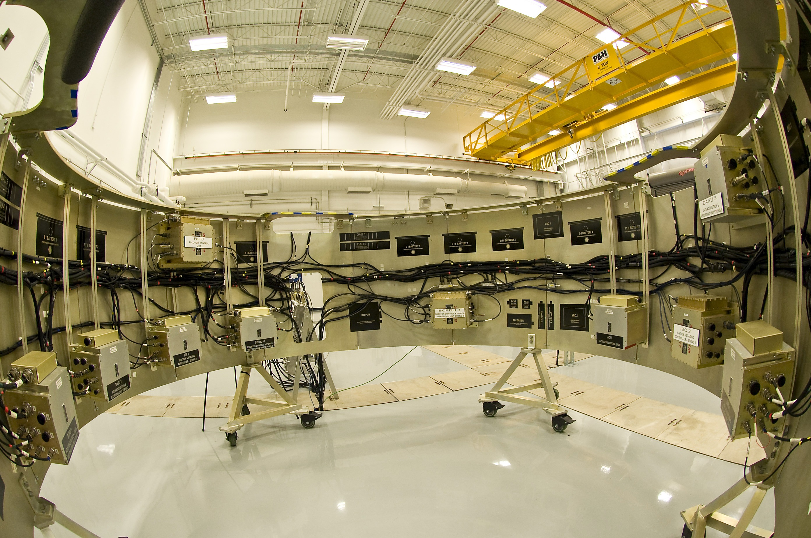

# Adversarial Verification {#sec-verification}

::: {layout-narrow}
::: {.column-margin}

\chapterminitoc

:::

::: {.content-visible when-format="pdf"}
\noindent
{fig-alt="Isometric blueprint showing adversarial cyber-physical verification: The verification process includes a four-tier qualification ladder: a virtual simulation crucible for testing algorithms, a processor-in-the-loop board for real-time testing, a hardware-in-the-loop dynamometer for testing physical components, and adversarial fault injection needles to introduce faults and assess robustness. Surveillance telemetry towers monitor system performance and collect data during tests."}
:::

::: {.content-visible unless-format="pdf"}
{fig-alt="Isometric blueprint showing adversarial cyber-physical verification: four-tier qualification ladder with virtual simulation crucible, processor-in-the-loop board, hardware-in-the-loop dynamometer, Harvard crimson adversarial fault injection needles, and surveillance telemetry towers."}
:::

:::

## Purpose {.unnumbered .unlisted}

::: {.content-visible when-format="pdf"}
\begin{marginfigure}
\vspace{1em}
\resizebox{\linewidth}{!}{\mlphysicalstackfull{20}{20}{20}{20}{20}}
\end{marginfigure}
:::

_Why is a robot that has operated for weeks without a single crash not evidence that the machine is safe?_

Weeks of successful operation establish behavior under encountered conditions but leave untested scenarios like sensor freezes or late plans. A machine may seem dependable if its operating environment has never challenged its safety assumptions. Verification in physical AI systems involves transforming assumptions into specific testable conditions, such as simulating sensor failures or unexpected environmental changes, which engineers can deliberately manipulate to observe the system's response and ensure safety. The fault list derives from the design's claims about freshness, timing, and physical response, not from generic stress tests. Each experiment must record whether the integrated machine detects the violation and contains its consequences within the stated envelope. Simulation can expose an inconsistent contract, while hardware tests reveal effects that the simulated plant omits. Neither supports claims beyond the conditions it represents. Whole-system verification connects the brain's assumptions, the nervous system's responses, and the body's measured behavior into evidence that can support, narrow, or reject an operating claim.

::: {.column-margin .margin-pointer}
↰ **Prerequisite:** Physical failure modes and measurement limits providing verification targets originate in @sec-body-measuring-limits.
:::



::: {.callout-learning-objectives}

- Define operating envelopes and acceptance criteria that make the machine's physical claims falsifiable
- Design fault-injection tests that challenge timing, data validity, and authority claims on physical hardware
- Evaluate which simulation and hardware tests support each claim and where their evidence ends
- Construct reproducible fault records linking injected conditions, detected violations, response times, and physical outcomes

:::

## Fault Injection {#sec-verification-fault-injection}

An incident-free operating log answers only the conditions it encountered. Three quiet weeks in a warehouse do not exercise a frozen level sensor, a brownout, or a bus occupied by DMA traffic. Whole-system verification therefore turns each safety claim into a deliberate fault and an observable physical outcome. The sampling cost of waiting for a rare event also grows: under a stipulated constant event rate, a tenfold rarer event takes ten times as many miles to observe on average (@fig-15-av-disengagement-trends). This is a sampling illustration, not a trend inferred from vehicle disengagement reports; a disengagement is not itself a crash or a uniform safety anomaly. Injected faults can expose the untested mechanism directly, with a test oracle and limits declared before the run.

::: {#fig-15-locator fig-env="figure" fig-pos="htb" fig-cap="**Verification architecture focus**: The four-tier physical AI systems architecture highlights the system governance and assurance tier, with verification as this chapter's active focus. Read the highlighted box as the qualification ladder that walks a safety claim from simulation through processor-in-the-loop and hardware-in-the-loop stages to in-situ trials, attacking one cyber-physical boundary at each rung." fig-alt="Diagram titled Physical AI Systems Architecture Stack, drawn as four stacked tiers. Layer 4 is system governance and assurance at 0.1 to 1 hertz, holding boxes for shared autonomy, verification, safety cases, and frontier limits. Layer 3 is the brain, a cognitive deliberation tier at 1 to 50 hertz, holding five stages named ingestion, perception, memory, intent, and planner. A dashed proposal-permission privilege boundary separates it from layer 2, the nervous system, a real-time safety and timing tier at 1000 hertz. Layer 1 is the physical body and continuous plant. Layer 4 is outlined and its verification box is highlighted; the badge reads Active Focus, Chapter 15, Verification."}
{width="100%"}
:::

::: {#fig-15-av-disengagement-trends fig-env="figure" fig-pos="htb" fig-cap="**Illustrative rare-event exposure**: For independent miles with a stipulated constant event rate $r$ per million miles, expected distance to the first event is $10^6/r$ miles. The constructed points show why passive observation becomes costly as the target event becomes rarer; they are not measured fleet disengagement or crash data." fig-alt="Log-scale constructed curve: event rates of one thousand, one hundred, ten, one, and one tenth per million miles correspond to expected first-event exposures of one thousand, ten thousand, one hundred thousand, one million, and ten million miles. No fleet measurements are plotted."}

```{python}
#| echo: false
import pandas as pd
import matplotlib.pyplot as plt
from mlsysim import viz

data = pd.read_csv("vol4/15_verification/data/rare_event_exposure.csv")
data["Expected_Miles"] = 1_000_000 / data["Events_per_Million_Miles"]

fig, ax, COLORS, plt = viz.setup_plot(figsize=(6, 4))
ax.plot(data["Events_per_Million_Miles"], data["Expected_Miles"], marker='o', linestyle='-', linewidth=2.5, color=COLORS["primary"], markersize=6)
ax.set_xscale("log")
ax.set_yscale("log")

ax.set_xlabel("Stipulated events per million miles", fontsize=11)
ax.set_ylabel("Expected miles to first event", fontsize=11)
ax.grid(True, linestyle='--', alpha=0.5)

ax.spines['top'].set_visible(False)
ax.spines['right'].set_visible(False)

plt.tight_layout()
plt.show()
plt.close()
```

:::

As located in the architecture stack in @fig-15-locator, whole-system verification is the second pillar of Tier 4 (System Governance & Assurance). Operating at supervisory timescales, verification provides the empirical evidence required to justify or reject operational release claims. Its duty is not to evaluate isolated model accuracy benchmarks or unit-test isolated software components, but to assess how the assembled cyber-physical machine behaves when stressed across all tier boundaries:

- **The Brain (Tier 3):** evaluating whether cognitive perception models, semantic memory lookups, and neural trajectory planners degrade predictably under corrupted sensor feeds, frame drops, and execution latency spikes;[^fn-bridge-verification-brain]
- **The Nervous System (Tier 2):** verifying whether fieldbuses, watchdogs, and independent enforcers detect contract violations and start validated fallback within deadlines derived for the machine (a $1\text{ ms}$ enforcement tick in the worked architecture);[^fn-bridge-verification-nervous] and
- **The Body (Tier 1):** measuring whether physical actuators, motor drives, mechanical brakes, and pressure relief valves physically contain kinetic energy and mass without exceeding thermal derating or structural dissipation limits.[^fn-bridge-verification-body]

[^fn-bridge-verification-brain]: **Cognitive Trajectory Contracts**\index{Cognitive contracts!Tier 3 verification}: As developed in @sec-brain-embodied and @sec-planning-trajectory-contract, deliberative planners and neural policies operate under explicit assumptions of state freshness and kinematic feasibility. Verification challenges these assumptions with latency stalls and perceptual corruption. When an upstream decision expires, the independent enforcer must revoke its tracking authority and execute a state-matched fallback whose sensing, actuator, and clearance assumptions have been tested.

[^fn-bridge-verification-nervous]: **Watchdogs and Real-Time Seams**\index{Watchdog timer!Tier 2 verification}: As detailed in @sec-nervous-multi-rate-bridge and @sec-enforcement-fallback-ladder, Tier 2 safety enforcers and hardware watchdog interlocks provide deterministic fallback paths. Verification evaluates whether these enforcers trip predictably within their budgeted deadlines when upstream software hangs or fieldbuses stall. Any unhandled preemption delay in the safety monitor permits transient actuation commands to propagate, causing physical overshoots that breach mechanical yield limits.

[^fn-bridge-verification-body]: **Actuator Dynamics and Energy Dissipation**\index{Actuator dynamics!Tier 1 verification}: As analyzed in @sec-boundary-causal-boundary and @sec-body-five-budgets, physical safety outside the nominal operating envelope is delivered by mechanical energy dissipation, thermal margins, and structural compliance rather than by software optimization. When destructive kinetic or hydraulic energy exceeds these passive hardware absorption limits, structural deformation or component rupture occurs regardless of policy intent. Whole-system verification must therefore characterize physical containment boundaries directly on instrumented dynamometer and destructive testbeds.

Consider a flow regulator designed to keep a $100.0\text{ L}$ buffer tank below a $95.0\text{ L}$ overflow weir. Under nominal conditions, liquid enters at $40.0\text{ L/min}$, an ultrasound sensor reports level, and an electric actuator adjusts the discharge valve at $50\text{ Hz}$. Routine operation near $80.0\text{ L}$ says little about a combined inlet surge and stale observation. Suppose an upstream switch raises inlet flow to $80.0\text{ L/min}$ while discharge remains at $40.0\text{ L/min}$, and a bus conflict adds $140\text{ ms}$ to a $10\text{ ms}$ sensing delay. The net $40.0\text{ L/min}$ fill rate adds only $0.10\text{ L}$ during those $150\text{ ms}$; from $90.0\text{ L}$, continued net filling would take $7.5\text{ s}$ to reach the weir. The test must therefore inject a sustained response delay or a failed valve to challenge overflow containment. Rapid valve closure is a separate pressure-surge hypothesis: a $12\text{ bar}$ water-hammer claim would require a measured or modeled wave speed, pipe geometry, and closure profile. The two hazards lead to different fault injections and physical oracles.

::: {.column-margin .margin-pointer}
↰ **Prerequisite:** Zero-failure trial sizing and the exposure wall are derived in @sec-evaluation-trial-limits.
:::

Converting such failure modes into verification evidence requires structured methods designed to challenge specific system properties. Five essential ingredients turn a physical run into a test result that can support a safety case:

1. **A bounded claim:** stating the exact invariant the machine must maintain (e.g., maintaining liquid volume below $95.0\text{ L}$ and transient line pressure below $6.0\text{ bar}$);
2. **Defined test conditions:** specifying the initial state space, fluid viscosity, ambient temperature, and supply pressure range;
3. **A precommitted oracle\index{Testing!Oracle}:** an automated evaluator that inspects recorded telemetry against the claim without human intervention or post-hoc adjustments;
4. **A stated sampling and injection procedure:** deliberately driving the machine toward its performance limits and injecting faults into sensors, buses, and actuators; and
5. **Provenance\index{Provenance}:** the complete metadata record of model weights, calibration tables, sensor serial numbers, and raw bus logs permitting independent reproduction.

The overflow and pressure-surge hypotheses require separate envelopes, injection points, and pass conditions. The first decision is where nominal regulation must yield to an independent containment response.

## The Operating Envelope {#sec-verification-operating-envelope}

The **operating envelope**\index{Operating envelope!definition} is the target ODD (@sec-evaluation-what-measured) extended inward to the machine's own conditions: compute load, supply voltage, bus jitter, thermal state, and operator response time. The sets nest: the ODD contains the declared ODD, which contains the target ODD, and the operating envelope pairs the target ODD with the machine's internal conditions. Defining this envelope requires precise numerical boundaries for an automated test framework to drive the system deterministically across each constraint. For a fluid regulation system, this means specifying not merely a nominal liquid level, but the exact allowable ranges for fluid temperature, kinematic viscosity, supply line pressure fluctuations, ambient temperature, acoustic transducer signal-to-noise ratios, CAN bus arbitration jitter, CPU thermal throttling states, supply rail voltage droop, and the maximum permissible time before an operator acknowledges an alert.

An operating envelope is distinct from the larger **survival envelope**\index{Survival envelope!definition} that encompasses it. Inside the operating envelope, the learned policy and primary tracking controllers fully regulate the physical process, maintaining closed-loop tracking within tight tolerances. When external disturbances, sensor failures, or compute stalls push the system across the boundary of the operating envelope, nominal regulation is conceded. At that threshold, the machine enters the survival envelope, where the primary objective shifts entirely to bringing the physical body to a bounded, safe state before structural limits are breached. In the flow regulator, the survival envelope defines the broader region of volume, pressure, and temperature within which emergency shutoff valves and mechanical relief mechanisms can successfully vent pressure and arrest inflow before a pipe ruptures or fluid overflows secondary containment. Beyond the boundary of the survival envelope lies catastrophic physical failure, where stored energy or incoming mass exceeds the mechanical dissipation capacity of the hardware. This boundary between control and survival manifests directly in destructive vehicle crash qualification (@fig-15-crash-test-instrumentation; see also @sec-boundary-causal-boundary): while nominal autonomous policies operate strictly within the dynamic control envelope, catastrophic perception or planning failures push the machine across the boundary into the survival envelope, where structural crumple zones and deterministic passive or pyrotechnic enforcers must physically dissipate kinetic energy before passenger compartment survival limits are breached.

::: {#fig-15-crash-test-instrumentation fig-env="figure" fig-pos="t" fig-cap="**Crashworthiness test after loss of nominal control**: Post-test side view of a 2018 Honda Odyssey after NHTSA NCAP moving-deformable-barrier test 10132 ([NHTSA record](https://www-nrd.nhtsa.dot.gov/database/VSR/SearchMedia.aspx?database=v&tstno=10132&mediatype=p&p_tstno=10132); [photo provenance](https://commons.wikimedia.org/wiki/File:V10132P008.jpg)). Its side structure is deformed; contrasting targets and test fixtures remain attached. The image illustrates a passive crashworthiness test, but does not establish the sensors' roles, measurement resolution, or this chapter's control-response times. Photo: NHTSA/MGA." fig-alt="Post-test side view of a 2018 Honda Odyssey with crushed left-side doors, deployed side-curtain airbags, contrasting measurement targets, and visible yellow test fixtures. The placard identifies test 10132. The photo alone does not identify the instruments or their sampling rates."}
{width="85%"}
:::

Defining the boundary of the operating envelope requires deriving physical limits from first principles rather than asserting convenient software timeouts. Consider a pumped chemical buffer reservoir with an overflow weir at $V_{\text{max}} = 95.0\text{ L}$ and a nominal operating target of $V_0 = 80.0\text{ L}$. Under an upstream valve failure disturbance, the inlet flow rate surges from nominal $40.0\text{ L/min}$ to $Q_{\text{in}} = 1.50\text{ L/s}$ ($90.0\text{ L/min}$), while a downstream pump trips, reducing discharge to $Q_{\text{out}} = 0.10\text{ L/s}$ ($6.0\text{ L/min}$), yielding a net liquid accumulation rate of $dV/dt = Q_{\text{in}} - Q_{\text{out}} = 1.40\text{ L/s}$. Conservation of volume dictates that when the liquid crosses an initial trigger threshold $V(t_0) = 88.0\text{ L}$, the remaining volume margin is $\Delta V = V_{\text{max}} - V(t_0) = 95.0\text{ L} - 88.0\text{ L} = 7.00\text{ L}$. The total physical time-to-breach before containment loss is governed by @eq-verification-time-to-breach:
$$t_{\text{breach}} = \frac{V_{\text{max}} - V(t)}{Q_{\text{in}} - Q_{\text{out}}}$$ {#eq-verification-time-to-breach}
which yields $t_{\text{breach}} = \frac{7.00\text{ L}}{1.40\text{ L/s}} = 5.00\text{ s}$.

Every delay in the independent emergency path consumes part of that five-second budget. Assume a validated upper bound of $t_{\text{detect}}=80+20+100+10=210\text{ ms}$ for level acquisition, bus delivery, filtering, and MCU safety evaluation. Assume the isolation valve seats within $t_{\text{valve}}=1.20\text{ s}$ and cuts the modeled inflow then. The direct protective path therefore seats it by $t_{\text{stop}}=0.21+1.20=1.41\text{ s}$ after the $88.0\text{ L}$ trigger; under the stipulated constant $1.40\text{ L/s}$ net inflow, volume reaches $88+1.40(1.41)=89.974\text{ L}$. A separate $0.30\text{ s}$ pressure-settling assumption may matter to a pressure oracle, but it does not add volume after a valve that has stopped this inflow. The learned policy may continue to propose nominal valve settings; its inference latency has no authority to delay this MCU trip.

For contrast, deliberately route the protective trip through a stalled neural path in a **failed architecture**. A $3.60\text{ s}$ stall before the same detection and valve delays would seat the valve at $3.60+0.21+1.20=5.01\text{ s}$, after the five-second breach time. The constant-flow model predicts $88+1.40(5.01)=95.014\text{ L}$, or $14\text{ mL}$ beyond the weir. This is precisely the dependency the independent MCU path must eliminate. With a separately reserved $1.00\text{ s}$ buffer, a conservative direct-trip threshold follows from the validated delay bounds:
$$V_{\text{trip}} \le V_{\text{max}} - (Q_{\text{in}} - Q_{\text{out}}) \bigl(t_{\text{detect}} + t_{\text{valve}} + t_{\text{buffer}}\bigr)$$ {#eq-verification-trip-threshold}
Using @eq-verification-trip-threshold for the stated envelope gives $V_{\text{trip}}\le95.00-1.40(0.21+1.20+1.00)=91.626\text{ L}$. The chosen $88.0\text{ L}$ threshold is below this ceiling. A measured $P_{99.9}$ compute latency can inform a risk analysis, but it cannot substitute for a justified bound on this protective path. The level threshold and valve seating claim also depend on the flow envelope, level-estimate error, and actual isolation effectiveness.

::: {#chk-verification-reaction-budget-under-inlet-surge-and-sensing-latency .callout-checkpoint title="Inlet surge reaction and sensing latency"}
Consider an embodied fluid regulation or chemical containment plant operating under boundary disturbances:

- [ ] **Protective reaction budget**: Can you sum the independently bounded detection and valve-seat delays and calculate the resulting volume at the $88.0\text{ L}$ trigger?
- [ ] **Inference independence**: Can you explain why a $3.60\text{ s}$ neural stall causes overflow only in the deliberately failed design that routes isolation through inference?
- [ ] **Trip threshold**: Can you derive the threshold from bounded net inflow, detection, valve travel, and a declared reserve rather than treating a percentile as a hard deadline?
:::

Tabulating separate minimum and maximum values for individual variables fails to capture the true operating boundary because physical and computational dimensions are coupled. In isolation, an inlet pressure of $6.0\text{ bar}$, a fluid viscosity of $45.0\text{ mPa}\cdot\text{s}$, a valve slew rate of $30.0\text{ deg/s}$, and an observation age of $120\text{ ms}$ might each fall within their respective single-variable ranges. When these conditions coincide, the higher viscosity increases fluid shear across the valve spool, slowing mechanical travel below the nominal slew rate. Simultaneously, the elevated inlet pressure accelerates volume accumulation, while the $120\text{ ms}$ observation age hides the initial pressure surge from the policy. The physical state crosses into the survival envelope long before any single parameter exceeds its isolated maximum. The true operating boundary is an interconnected hypersurface in state, parameter, and latency space—a multidimensional boundary where temperature, pressure, and timing all physically affect one another. A valid verification suite must probe this combined surface rather than checking isolated scalar limits.

To prevent envelope boundaries from deteriorating into optimistic assumptions, every defined parameter must specify its physical units, its measurement provenance, its calibrated uncertainty, and a designated subsystem engineer who remains accountable for its validity. A boundary stated as a maximum pressure of $8.0\text{ bar}$ is incomplete without recording whether that limit derives from hydrostatic burst testing of the flanged joints, finite-element pipe stress models, or pump stall characteristics. The boundary specification must also record the measurement uncertainty of the sensors used during characterization, such as $\pm 0.15\text{ bar}$ at $P_{99}$. When system components change, such as swapping an elastomeric seal or upgrading a CAN transceiver, the designated owner must formally re-evaluate whether the physical boundary has shifted.

Verification of the operating envelope requires a disciplined sampling strategy that deliberately attacks the boundary surface. Testing nominal interior points, where the tank sits at $80.0\text{ L}$, ambient temperature is $21.0^\circ\text{C}$, and sensing latency is $12\text{ ms}$, demonstrates only that the machine functions under ideal conditions. To generate rigorous verification evidence, the test framework must place test points directly on, immediately inside, and immediately outside each consequential boundary. Evaluating points just inside the boundary verifies that the policy maintains closed-loop stability\index{Closed-loop stability} under maximum permissible stress. Evaluating points on the boundary confirms that safety margins do not collapse under nominal sensor noise. Evaluating points just outside the boundary confirms that safety enforcers intervene predictably, taking authority from the learned policy and bringing the system to a safe halt within the survival envelope before containment is lost.

::: {#psp-verification-hardware-falsification .callout-perspective title="The hardware falsification principle"}
If a safety property cannot be deterministically falsified by injecting a physical or electrical fault\index{Fault injection!hardware} on target hardware, the property is an unverified assumption rather than an engineering invariant.
:::

Formally documenting the operating and survival boundaries converts the design claims of the preceding chapters into concrete targets for fault injection\index{Fault injection}. When every physical constraint, latency budget, and environmental limit is stated as a verifiable number, the safety engineer knows precisely what conditions the machine must withstand, what thresholds must trigger protective intervention\index{Protective intervention}, and what dynamic claims must be subjected to deliberate failure.

## Deriving the Fault List {#sec-verification-deriving-fault-list}

The initial fault list derives from inverting design records across the architecture. @Sec-data through @sec-evaluation supply the properties of the learned policy, including training distribution bounds, state-action assumptions, and inference latency ceilings. @Sec-perception through @sec-placement provide interface and execution properties, such as bus bandwidth allocations, serialization overheads, observation freshness guarantees, and state estimation bounds. @Sec-intervention supplies the properties of the authority-transfer mechanism, specifically the maximum latency to disconnect a failing policy and the independent override authority of the safety enforcer. Inverting these records systematically generates an initial candidate set for verification. If an analytical model of a flow control loop records that the learned policy produces a valid valve command every $20\text{ ms}$ under all flow rates between $0.10\text{ m}^3\text{/s}$ and $2.50\text{ m}^3\text{/s}$, the verification suite inverts that claim by injecting stalled command streams, delayed observations, and out-of-range sensor readings to test whether the downstream nervous system detects the violation within its budget.

Every recorded design property becomes a testable fault only when structured as a five-element chain comprising the negated condition, the physical injection point, the expected detector, the bounded response, and an observable pass condition. In a high-pressure fluid delivery system, consider a flow meter that publishes volumetric discharge rates across a Controller Area Network (CAN) fieldbus with an analytical latency bound of $5.0\text{ ms}$. The negated property injects an artificial transport delay of $25\text{ ms}$ at the network interface buffer. The expected detector is the stale-frame monitor in the safety enforcer, the required response is a transition to a recirculating bypass within $10\text{ ms}$, and the observable pass condition is that fluid pressure at the manifold remains below $6.0\text{ bar}$ at $P_{99}$. When any element of this chain cannot be defined or observed, the system contains a **verification gap**\index{Verification gap!definition}. A verification gap indicates that the claim cannot be falsified by test. Such gaps cannot be ignored; they require dedicated hardware instrumentation, a narrower operational claim, or a redesign of the execution path.

This inversion process must challenge data provenance, simulation validity, and offline evaluation assumptions with physical runtime packets. Distribution shift and misleading optimization metrics are system faults even when every communication frame arrives without corruption. If a learned policy was trained on hydrodynamic simulations that assumed a constant fluid viscosity of $1.0\times 10^{-3}\text{ Pa}\cdot\text{s}$, cooling the fluid to increase viscosity to $3.5\times 10^{-3}\text{ Pa}\cdot\text{s}$ alters the pump head curve and introduces cavitation noise. Inverting the evaluation claim requires injecting these unmodeled fluid dynamics, simulated sensor bias, and synthetic data perturbations where a high nominal reward hides high-frequency actuator jitter. Because software and physical mechanics remain coupled across the system boundary (@sec-boundary-causal-boundary), a physical AI system fails when valid, uncorrupted commands drive the physical body into an unstable mechanical regime because training assumptions were violated.

At the structural boundaries established across @sec-perception through @sec-placement, the fault generator inverts each inter-module contract at its physical point of handoff. These tests negate observation freshness, state validity, intent lifetime, planning deadlines, enforcement independence, and resource allocations. If a trajectory planner issues an actuation profile with an intent lifetime of $100\text{ ms}$, the test environment injects an otherwise valid actuation frame at $125\text{ ms}$ to confirm that the actuator interface rejects it as expired. If the safety enforcer claims execution independence from the primary policy computer, the test saturates the shared memory bus with maximum DMA traffic (simulating a runaway background process hogging memory bandwidth) to confirm that the enforcer still meets its $1.0\text{ ms}$ control deadline. Conversely, fault injection must remain disciplined, because bus starvation, clock skew, and supply voltage fluctuations should be injected only where the design explicitly claims tolerance. Testing arbitrary failure modes from a generic menu invents requirements that the machine was never specified to meet, diverting engineering effort away from validating actual architectural contracts.

The structural limit of record inversion is absolute. Inverting recorded properties produces only the faults that the design team already modeled, which is precisely the set of behaviors that will not surprise the creators of the machine. The completeness of an inverted fault list is bounded by the completeness of the original design claims. If the engineering records never documented how an electric motorized valve behaves when ambient temperatures freeze the mechanical seals, no record exists to invert, and the failure mode will not appear in the verification suite. Inversion guarantees that every documented claim is tested, but it remains blind to unstated assumptions, overlooked physical hazards, and unmodeled failure dependencies.

Overcoming this limitation requires a second, independent source that works forward from the physical machine rather than backward from design documents. This forward analysis enumerates what the physical body, the power distribution network, the fluid dynamics, and the operating environment can do regardless of what the software believes. Physical pipes experience destructive shockwaves when rapid valve closure abruptly halts fluid momentum, a phenomenon known as **water hammer**\index{Water hammer!definition}; mechanical valve seats accumulate particulate deposits that prevent full seating, elastomeric seals wear under repeated pressure cycling, and pump vibration induces harmonic resonance in downstream sensor brackets. These physical phenomena originate in mechanics, materials science, and fluid dynamics, operating entirely outside the digital abstractions of the nervous system—a reality formalized in Leveson's **Systems-Theoretic Accident Model and Processes (STAMP)**\index{Systems-Theoretic Accident Model and Processes!definition} framework[^fn-std-stpa-leveson] [@leveson2011engineering].

For example, start with the physical hazard of a valve that cannot seat while the tank fills. The unsafe control action is continued inlet pumping after the $88\text{ L}$ trip. Inject a seat obstruction or motor stall on the rig, observe valve position and motor current independently of the commanded close bit, and require the MCU to isolate the upstream pump or use a separately validated containment path. The precommitted pass condition is measured volume below $95\text{ L}$ throughout the declared flow and sensor-error envelope; an unmeasured valve position makes the trial unobservable for the seating claim. This forward chain yields an injection and oracle even if the original software requirements omitted seat obstruction.

::: {.column-margin}
{width="100%" fig-alt="Vertical ladder showing fault injection climbing from SRAM bit-flips up to physical dyno shaft jamming."}

*Fault injection climbs from software bit-flips to physical dyno shaft jamming.*
:::

[^fn-std-stpa-leveson]: **STAMP/STPA Hazard Analysis**\index{Systems-Theoretic Process Analysis!emergent hazards}: Developed at MIT by Nancy Leveson, STAMP treats system safety as a dynamic control problem rather than a component reliability failure. In autonomous physical AI, emergent hazards arise at hardware-software seams where asynchronous bus latency or filter lag invalidates low-level stability guarantees. A rigorous verification campaign must therefore inject boundary stress across these seams to verify that safety interlocks trip before dynamic envelope limits are breached.

Working forward from the physical hardware exposes entire fault classes that no software property record implies. These include total clock loss, supply rail brownouts where digital logic levels blur unpredictably between $0.8\text{ V}$ and $2.0\text{ V}$, electromagnetic interference from high-current pump contactors coupling into analog pressure lines, floating high-impedance output pins subject to stray electromagnetic coupling during power-on reset transitions, corrupted non-volatile configuration memory, and shared reset lines that accidentally bridge independent domains. If an emergency pressure-relief circuit and a learned policy accelerator share a single power management integrated circuit, an undervoltage transient on the accelerator can reset the safety circuit, disabling the relief mechanism at the exact moment the policy loses control. No software record contains this failure mode because each software module assumes its underlying power rail is an ideal, independent DC voltage source.

Physical forward analysis also challenges the common-cause independence claims established in @sec-nervous and @sec-placement. Two control paths that appear isolated in an architectural diagram often share a single physical vulnerability. A primary flow sensor and a redundant pressure switch may route their wiring through a single conduit exposed to mechanical abrasion, or share a common analog reference voltage within a multi-channel converter, or rely on identical timer silicon vulnerable to the same manufacturer errata. If an electromagnetic transient induces simultaneous parasitic PNPN latch-up conditions across both channels, treating them as statistically independent failures invalidates the entire safety argument. **Common-cause analysis**\index{Common-cause analysis!definition} traces physical routing, power paths, and shared clock trees to ensure that no single physical event can disable both the operational policy and the intervention mechanism simultaneously.

The physical source must also encompass operator error modes and foreseeable misuse from @sec-intervention, treating human interaction as an operational hazard of the machine. Field operators force bypass switches during maintenance, misconfigure manual throttling valves upstream of automated manifolds, disconnect telemetry cables to silence acoustic alarms, and request setpoint changes that exceed the thermal dissipation capacity of pump motors. When an operator commands an instantaneous step increase in flow from $0.20\text{ m}^3\text{/s}$ to $2.00\text{ m}^3\text{/s}$, the verification framework must verify that the nervous system clamps the command to a safe acceleration rate, preventing cavitation and hydraulic shock while maintaining closed-loop stability.

Working forward from the physical machine adds representative fault classes to the record-derived list in @tbl-15-fault-classification. Completeness still requires a separate hazard-analysis argument for the specified plant and operating envelope.

The fault list must also test the four authority rules that @sec-intervention-authority-log hands over (A1–A4). One enforcer path writes each actuator channel; no source bypasses an active higher tier or the permission check; an unacknowledged handover falls back by the earlier of a configured ceiling and the clearance-derived deadline; and invalid authentication locks out the channel. Each rule becomes a row of @tbl-15-fault-classification, tested with the machine in the state that makes intervention urgent. A policy driving a motorized valve at full speed builds up mechanical momentum and electrical back-EMF that actively resist rapid deceleration. In an analytical test scenario where a valve actuator rotates at $90^\circ\text{/s}$, the fault injection framework triggers an unrecoverable policy fault and measures whether the safety enforcer de-energizes the motor driver within $4.0\text{ ms}$, engages the mechanical brake, and halts flow before line pressure exceeds the pipe burst threshold of $10.0\text{ bar}$. The intervention mechanism is not an unassailable arbiter; it is a physical subsystem whose claims of speed, independence, and override capability must be deliberately attacked, measured, and falsified before the assembled machine can be judged ready for structured qualification.

| Failure Domain & Fault Mode                   | Physical Mechanism & Injection Point                                                                                             | Target Manifestation & Causal Impact                                                            | Detection Primitive & Latency Budget                                                                   | Enforced Safe Response & Bounded Recovery                                                | Observable Pass Criterion                                                                                                             |
|:----------------------------------------------|:---------------------------------------------------------------------------------------------------------------------------------|:------------------------------------------------------------------------------------------------|:-------------------------------------------------------------------------------------------------------|:-----------------------------------------------------------------------------------------|:--------------------------------------------------------------------------------------------------------------------------------------|
| **Sensor Corruption & Signal Bias**           | Piezoelectric transducer drift, stuck-at-zero ADC register, injected via DAC inline interceptor                                  | Stale or unphysical state estimate $\hat{\mathbf{x}}(t)$; policy commands erroneous slew rate   | $\chi^2$ innovation / plausibility monitor ($\Delta t_{\text{det}} \le 20\text{ ms}$)                  | Isolate faulty sensor channel; switch to dead-reckoning or secondary estimator           | Process state remains inside survival envelope: $P(t) \le P_{\text{max}} + \Delta P_{\text{margin}}$                                  |
| **Bus Contention & Frame Loss**               | Babbling-idiot CAN transceiver, real-time Ethernet queue overflow, injected via CAN disturbance node                             | Missing observation frames; heartbeat starvation; outdated plan execution                       | Cyclic redundancy check (CRC) & frame arrival watchdog ($\Delta t_{\text{det}} \le 10\text{ ms}$)      | Reject expired proposal; freeze actuator to zero-torque safe hold or clamp valve         | End-to-end reaction time $t_{\text{react}} \le t_{\text{budget}}$; zero unhandled bus exceptions                                      |
| **Power Brownout & Voltage Droop**            | Motor contactor inrush transient, LDO rail sag ($V_{\text{core}} < 0.85\text{ V}$), injected via programmable DC load            | Indeterminate logic states; corrupted SRAM registers; asynchronous MCU reset                    | Hardware Undervoltage-Lockout (UVLO) monitor ($\Delta t_{\text{det}} \le 15\,\mu\text{s}$)             | Hardware crowbar circuit fires; de-energize gate drivers; assert fail-safe spring return | Logic pins never float in undefined state; secondary relief valve seats within $50\text{ ms}$                                         |
| **Actuator Jam & Mechanical Stall**           | Particulate contamination in valve, bearing seizure under shock load, injected via hydraulic brake clamp                         | Locked rotor; severe back-EMF collapse; rapid stator winding heating ($I^2 R$)                  | Motor phase overcurrent & Hall-effect velocity stall monitor ($\Delta t_{\text{det}} \le 5\text{ ms}$) | De-energize H-bridge power stage; engage electromechanical brake; route bypass           | Stator temperature $T_{\text{coil}} < 180^\circ\text{C}$ (Class H insulation limit); line pressure relieved before burst disc rupture |
| **Watchdog Panic & Priority Inversion**       | DMA bus-master lockup on GPU, deadlock in high-priority RTOS task, injected via bus stall emulator                               | Interrupted control loop cadence; un-serviced safety heartbeat; hung NPU                        | Independent windowed hardware watchdog timer ($\Delta t_{\text{det}} \le 2.0\text{ ms}$)               | Assert Non-Maskable Interrupt (NMI); hardwired authority transfer to safety MCU          | Takeover completed in $\le 4.0\text{ ms}$; zero command bleed-through from hung processor                                             |
| **Authority Transfer (A1): Duplicate Writer** | Second bus master writes an actuator channel (duplicate fieldbus identifier or DMA write) while policy and operator both command | Two writers on one channel; the delivered command is no longer the admitted one                 | Bus or DMA write permissions; per-tick forensic authority record                                       | Reject the foreign write; the enforcer path remains the only writer                      | Write rejected; every forensic record in the window shows one writer                                                                  |
| **Authority Transfer (A2): Tier Bypass**      | Policy proposal injected while `MAN` is active; operator command that opposes the enforcer's admitted limit                      | A lower tier displaces an active higher tier, or an operator command skips the permission check | Arbiter tier check; permission check applied to every source                                           | Ignore the policy proposal; clamp or refuse the operator command like any proposal       | Arbiter ignores the proposal; the permission check still runs on the operator's command                                               |
| **Authority Transfer (A3): Handover Timeout** | Operator input frozen during `PEND`; acknowledgment frames dropped                                                               | The machine waits on a handover that no one completes                                           | Handover deadline timer in the arbiter                                                                 | Start the validated fallback                                                             | Fallback starts by $T_{\text{timeout}}=\max(0,\min(T_{\text{config}},T_{\text{latest}}))$                                             |
| **Authority Transfer (A4): Authentication**   | Replayed captured operator command; command carrying a bad tag                                                                   | An unauthenticated source gains authority                                                       | Tag and freshness check on operator commands                                                           | Lock out the channel; leave authority unchanged                                          | Channel locked, authority unchanged, event recorded                                                                                   |

: **Representative hardware and cyber-physical fault classes**: Physical and logical failure modes mapped to injection points, detector, response, and observable pass criteria, including the four authority fault cases (A1–A4) that @sec-intervention-authority-log hands over; the table does not establish exhaustive coverage for a specific machine. {#tbl-15-fault-classification tbl-colwidths="[16,18,18,16,16,16]"}

### Compound faults {#sec-verification-compound-faults .unnumbered}

Each row of @tbl-15-fault-classification injects one disturbance, yet a machine in operation rarely meets one at a time. Combining rows at random would multiply the list without finding the combinations that matter, so coupled disturbances are enumerated from shared causes instead. The test ledger of the placement record (@sec-placement-hardware-allocation) names every resource that the permission path shares with the learned workloads, and each shared rail, clock, or bus becomes one compound fault, injected at the cause rather than at its symptoms. A droop on a shared rail can slow the enforcer, freeze a sensor at a plausible value, and reset the logger in the same interval. A burst on a shared bus ages observations while it delays the permission path's own reads and the heartbeat that would reveal the delay. A fault in a shared clock skews the timestamps of every record that crosses the proposal boundary at once, so freshness checks pass on data that is already old. The oracle for a compound fault therefore checks the protective response against its deadline and also checks that the evidence needed to judge that response survived the same cause; the pitfalls in @sec-verification-fallacies-pitfalls show both failing together. A shared cause that the ledger does not name cannot be enumerated this way, which is why the forward analysis of the physical machine remains a separate source of faults.

## The Qualification Ladder {#sec-verification-qualification-ladder}

Subjecting an assembled machine to an inventory of faults requires choosing an execution environment for each test. Each evaluation environment exercises a different subset of the physical and computational causal loop that connects sensor inputs, inference pipelines, communication buses, actuator drives, plant dynamics, and environmental feedback. Qualification environments do not form a strict hierarchy. Because each mode closes, breaks, or substitutes different physical and computational causal links, higher rungs cannot completely subsume lower ones. Instead, they establish distinct categories of evidence while remaining blind to others.

::: {#dfn-verification-four-stage-qualification-ladder .callout-definition title="Four-stage qualification ladder"}

***Four-stage qualification ladder***\index{Four-stage qualification ladder!definition}\index{Qualification ladder!definition} is the structured progression of cyber-physical evaluation environments—Software-in-the-Loop (SIL), Processor-in-the-Loop (PIL), Hardware-in-the-Loop (HIL), and In-Situ Physical Fault Rigs—that systematically closes, breaks, or substitutes specific arcs in the causal loop to balance combinatorial test throughput against physical and temporal execution fidelity.

1.  **Significance**: No single test environment can validate a physical AI system. Software simulators allow massive combinatorial sweeps ($>10^8\text{ cycles/day}$) but omit target silicon bus contention and material wear; physical rigs expose authentic mechanics and electrical transients but cannot execute destructive fault sweeps at scale.
2.  **Distinction**: Unlike a cumulative testing staircase where higher rungs subsume lower ones, each qualification rung exercises complementary, non-overlapping causal mechanisms while remaining blind to others.
3.  **Common pitfall**: Assuming that passing extensive Software-in-the-Loop (SIL) simulation implies safety on embedded hardware. SIL abstracts away microcontroller clock drift, DMA bus lockups, interrupt jitter, and power supply voltage sag.

:::

Offline trace replay feeds recorded sensor data into the computational pipeline, evaluating how the software responds to historical operational sequences. Because the input signals come from physical sensors operating in real environments, replay preserves the true noise profiles, quantization anomalies, and electrical transients of operational hardware, such as the high-frequency ripple from a turbine flowmeter operating at $1000\text{ Hz}$. Replay verifies whether the software produces deterministic outputs, meets internal latency deadlines, and handles historical edge cases without crashing. Yet replay leaves the feedback loop broken. The recorded inputs are frozen in time, completely decoupled from the commands the policy emits under test. If an updated policy alters a valve opening command at an analytical test offset of $t = 50\text{ ms}$, the replay log continues to supply the pressure measurements that resulted from the original historical command. Replay establishes algorithmic reproducibility and computation time under real input distributions, but it cannot establish closed-loop dynamic stability or evaluate how the physical plant responds when the policy diverges from the recorded path.

Software-in-the-loop (SIL)\index{Software-in-the-loop} simulation restores the closed feedback loop by substituting mathematical models for the physical plant, actuators, sensors, and environmental dynamics on high-performance workstation or cloud clusters. Within this synthetic environment, the simulation clock is decoupled from physical wall-clock time—meaning a ten-minute physical process can be computed in seconds—allowing an engineering team to execute massive parallel parameter sweeps exceeding $10^8\text{ cycles/day}$. SIL enables dense adversarial testing across millions of operating conditions, systematically sweeping line pressures from $1.0\text{ bar}$ to $25.0\text{ bar}$, injecting tensor bit-flips in neural network weight matrices, or commanding instantaneous fluid flow steps without risking physical hardware destruction. SIL can expose failures of the integrated control logic, estimation filters, and enforcers at sampled model states and disturbances; a stability claim over a continuous region needs a separate proof or justified analysis. However, this evidence's validity is strictly bounded by the fidelity of the underlying numerical ODE or PDE models. If the simulator models a hydraulic valve as a pure first-order lag with a fixed time constant of $30\text{ ms}$, it omits messy physical phenomena such as fluid-induced hydrodynamic torque, dynamic seal friction hysteresis, actuator torque limits, and cavitation-induced vibration. Furthermore, running software on a workstation host abstracts away the harsh realities of embedded target silicon, such as physical clock drift, direct memory access contention, cache thrashing, and dynamic thermal throttling. Passing simulation trajectories supports behavior under the chosen numerical model and sampled conditions; it neither proves the controller correct for all model states nor validates the plant model.

Processor-in-the-loop (PIL)\index{Processor-in-the-loop} evaluation closes the architectural gap between host compilation and embedded execution by cross-compiling the neural policy and safety control algorithms for the target Instruction Set Architecture (ISA)—such as ARM Cortex-A/M cores or RISC-V microcontrollers—and executing the resulting binary on actual target silicon or cycle-accurate core emulators. The target processor is interfaced to a host-simulated plant via high-speed co-simulation links (such as JTAG, background debug interfaces, or cycle-synchronized shared memory). PIL verification directly validates compiler optimization levels (`-O3` versus `-Os`), target vector acceleration libraries (such as ARM Helium or CMSIS-NN), fixed-point and quantized tensor scaling artifacts (e.g., int8 versus float32 truncation error), stack memory headroom, register spills, and worst-case execution time (WCET) bounds. PIL exposes subtle software faults that never appear in host SIL, such as compiler-induced register aliasing, unaligned memory access faults, and arithmetic overflow in fixed-point state estimators. Nevertheless, PIL operates across a synthetic peripheral boundary: it simulates external buses and timers, remaining blind to physical transceiver electrical contention, bus voltage droop, SerDes bandwidth limits, electromagnetic interference, and dynamic actuator back-EMF.

Hardware-in-the-loop (HIL)\index{Hardware-in-the-loop} bench testing mounts the physical target computing hardware (the two-processor implementation from @sec-nervous-silicon-partitioning), communication fieldbuses, power supplies, and actuator drive stages onto an instrumented laboratory stand, interfacing them in hard real-time to high-bandwidth field-programmable gate array (FPGA) plant emulators and dynamic dynamometer testbeds. This mode subjects the real target electronics to physical electrical loads and authentic temporal bus jitter. HIL testing exposes real-world bus arbitration delays across physical CAN and Ethernet transceivers, microcontroller interrupt preemption latencies, DMA bus lockups, and the thermal derating of motor driver power stages delivering $10\text{ A}$ under continuous load.

::: {.column-margin}
{width="100%" fig-alt="S·P·A locator triad highlighting the central causal core."}

*Closed-loop falsification: stress-testing the integrated S·P·A pipeline against microarchitectural and physical faults.*
:::

By coupling the actuator drive to a high-bandwidth four-quadrant regenerative dynamometer ($f > 1\text{ kHz}$), HIL benches dynamically synthesize mechanical counter-torques. This setup simulates aerodynamics and friction reversals, and injects sudden joint stalls and high-rate load steps to measure physical back-EMF collapse, inverter Joule heating ($I^2R$), gearbox compliance and backlash, stator delays, and gate-driver switching spikes. HIL establishes that the embedded control software executes reliably on actual silicon, that clock drift between distributed microcontrollers remains within budgeted bounds, and that physical safety switches disconnect actuator power within the required ISO 10218 / ISO/TS 15066 safety envelopes, such as a $4.0\text{ ms}$ deadline following an overpressure trigger. The limitation of the HIL bench lies in its synthesized plant boundary: an FPGA model or mechanical dynamometer cannot reproduce microscopic material fatigue, fluid viscosity degradation under chemical shear, seal wear, or destructive structural burst limits.

In-situ physical fault rigs\index{In-situ physical fault rigs} and shadow deployments evaluate the fully assembled physical machine—complete with production mechanics, hydraulic conduits, wiring harnesses, and primary sensors—operating under authentic operational stresses. Physical fault rigs operate within reinforced laboratory containment cells equipped with dedicated destructive actuators, including pyrotechnic valve jammers, pneumatic line clamps, and magnetic brake clamps that physically seize rotating shafts or obstruct high-pressure fluid lines. In-situ testing captures the full unmodeled complexity of physical reality: nonlinear Coulomb friction reversals, spatial kinematics in $\mathrm{SE}(3)$, turbulent fluid cavitation noise, structural resonant vibrations, and thermal runaway. Alongside destructive rigs, shadow operation deploys the fully assembled software and computing hardware into the field alongside an incumbent controller, processing live sensor telemetry from an operating industrial plant without exerting physical control over the actuators. Shadow deployment establishes that the perception and control stack operates reliably under true production workloads without software exceptions or false-positive fault declarations. Yet shadow testing cannot establish the physical consequences of the commands it generates. Because the shadow policy commands are intercepted and discarded at the actuator fieldbus boundary while the legacy controller drives the plant, the plant dynamics reflect the legacy controller actions rather than the candidate policy. If the candidate policy issues an unstable valve trajectory that would induce severe water hammer, the shadow log records only the mathematical command, while the physical pipe remains protected by the legacy controller.

Each qualification mode alters or severs different arcs in the causal loop, making it dangerous to treat these rungs as a cumulative staircase. A live shadow deployment cannot intentionally command a valve to slam shut against a $15.0\text{ bar}$ head to measure the resulting pressure surge, because doing so would destroy the production facility. Conversely, a software simulator cannot reveal a race condition in physical CAN transceiver silicon, and a hardware bench cannot execute the tens of millions of randomized parameter variations required to establish statistical confidence in edge-case handling. High-assurance qualification relies on treating these four modes as complementary evidence scopes, directing each fault injection test to the specific environment capable of exercising the relevant causal mechanisms (@fig-15-qualification-ladder, @tbl-15-qualification-ladder).

::: {#fig-15-qualification-ladder fig-env="figure" fig-pos="t" fig-cap="**Four-stage qualification ladder**: Four rungs trading throughput for fidelity, from roughly $10^6$ software-only runs a day at zero hardware realism down to a handful of in-situ physical fault injections at full realism. The ladder is not a progression toward accuracy but a sequence of different blind spots, because each stage establishes evidence only within its own causal loop and stays blind to every mechanism outside it." fig-alt="Four-stage qualification ladder schematic charting throughput (runs per day, logarithmic from 10^6 down to 10^0) against hardware fidelity (0 to 100 percent). Four semantic stages descending along the Pareto trade-off: Software-in-the-Loop (SIL, cloud cluster, high throughput), Processor-in-the-Loop (PIL, target silicon), Hardware-in-the-Loop (HIL, dyno testbed), and In-Situ (physical fault rig, field plant). Attribution: Original textbook graphic, CC BY 4.0."}
{width="95%"}
:::

| Qualification Rung & Substrate                                     | Causal Loop Realism (Compute, Bus, Actuator, Plant)                                                                                                          | Fault Injection Mechanism & Scope                                                          | Throughput & Sample Scaling                                                                          | Physical & Temporal Fidelity                                                              | Primary Test Oracle & Evidentiary Limit                                                                                                                                                  |
|:-------------------------------------------------------------------|:-------------------------------------------------------------------------------------------------------------------------------------------------------------|:-------------------------------------------------------------------------------------------|:-----------------------------------------------------------------------------------------------------|:------------------------------------------------------------------------------------------|:-----------------------------------------------------------------------------------------------------------------------------------------------------------------------------------------|
| **Software-in-the-Loop (SIL)** (Host Workstation / Cloud Cluster)  | **Compute:** Synthetic / Host x86; **Bus:** Idealized zero-copy buffer; **Actuator:** Linear / saturation model; **Plant:** Numerical ODE/PDE solver         | Tensor bit-flips, synthetic sensor dropout, hydrodynamic parameter sweeps ($\mu, \rho, T$) | $10^3\text{--}10^5\times$ real-time parallel sweeps ($>10^8\text{ cycles/day}$)                      | High mathematical flexibility; zero target silicon, bus timing, or electrical realism     | **Oracle:** Mathematical assertion corridors and state invariants. **Limit:** Cannot validate target execution timing or unmodeled physical dynamics.                                    |
| **Processor-in-the-Loop (PIL)** (Target SoC / MCU Core Emulation)  | **Compute:** Real target silicon (ARM/RISC-V); **Bus:** Simulated bus interconnect; **Actuator:** Emulated command register; **Plant:** Real-time host model | Instruction cache evictions, register corruption via JTAG/BIST, interrupt jitter injection | $0.1\text{--}1.0\times$ real-time; bound by cross-platform synchronization                           | Instruction-set and compiler accurate; abstracts analog bus lines and actuator back-EMF   | **Oracle:** Target register state and WCET execution bounds. **Limit:** Ignores physical transceiver bus contention, voltage droop, and thermal rise.                                    |
| **Hardware-in-the-Loop (HIL)** (Target ECUs + Real-Time Plant Rig) | **Compute:** Production ECU / NPU; **Bus:** Real physical CAN/Ethernet; **Actuator:** Real motor drives / dyno; **Plant:** Hard real-time FPGA plant rig     | Pin break/short, CAN frame stuffing / babbling idiot, supply rail droop, load steps        | $1.0\times$ strict real-time ($24\text{ h/day}$ wall-clock limit)                                    | High electrical, timing, and protocol fidelity; bounded by FPGA plant model accuracy      | **Oracle:** Protocol CRC, bus deadline monitors, and interlock timings. **Limit:** Cannot execute destructive physical overload or simulate micro-cavitation wear.                       |
| **Physical Fault Rig & Shadow** (Dynamometer Cell / Field Plant)   | **Compute:** Production ECU / NPU; **Bus:** Production harness & sensors; **Actuator:** Real physical mechanisms; **Plant:** Real fluid / mechanical body    | Pyrotechnic valve jammers, magnetic brake stall, thermal heating, transducer bias drift    | $1.0\times$ wall-clock; constrained by mechanical wear and thermal reset ($<10^3\text{ cycles/day}$) | Full authentic physics (Coulomb friction, acoustic wave shock, thermal dissipation, wear) | **Oracle:** Independent physical containment instrumentation and yield transducers. **Limit:** High financial cost per trial; destructive tests cannot scale to statistical tail bounds. |

: **The four-stage qualification ladder across cyber-physical boundaries**: Systematic decomposition of qualification environments across computing substrates, exercised causal-loop elements, fault injection primitives, execution throughput, physical and temporal fidelity, and definitive test oracle mechanisms. {#tbl-15-qualification-ladder tbl-colwidths="[16,22,16,14,16,16]"}

To prevent false confidence, every reported verification result must explicitly state which elements of the causal loop were physically real, which were simulated, which were replayed from static logs, which were bypassed, and which remained unobserved. An analytical engineering claim that an intervention mechanism halted an overpressure event within $12\text{ ms}$ means nothing without specifying whether the pressure signal was generated by a differential equation, transmitted over a physical analog current loop, or replayed from a digital buffer. Specifying this causal mapping exposes the assumptions underlying each test, ensuring that unmodeled physics or artificial boundary conditions do not disguise latent hazards.

::: {.column-margin .margin-pointer}
↰ **Prerequisite:** Microarchitectural stress patterns build directly on the memory contention benchmarks from @sec-placement-resource-contention.
:::

The fidelity boundary of a given test environment defines the exact threshold where synthetic models, emulated buses, or replayed sensor traces sever the continuous bidirectional energy and information exchange between compute and mechanics (@sec-boundary-causal-boundary).

To quantify this reality gap, consider the divergence between rigid-body physics simulation and physical hardware when an articulated joint encounters unmodeled Coulomb friction and actuator lag (\ref{nbk-verification-coulomb-friction-reality-gap}).[^fn-math-stiction-deadband]

[^fn-math-stiction-deadband]: **Actuator Stiction Deadband**\index{Actuator!stiction deadband}: Under the stated first-order torque model and constant breakaway threshold, the joint remains still until $t_{\text{dead}} = \tau_{\text{lag}} \ln\left(\frac{\tau_{\text{cmd}}}{\tau_{\text{cmd}} - \tau_c}\right)$. This delay can reduce phase margin in a high-gain feedback loop; chattering or overshoot requires the loop gains, integral action, and load dynamics to be specified and tested.

```{python}
#| label: calc-verify-coulomb-stiction-deadband
#| echo: false
import math
from mlsysim.core.units import ureg, millisecond, kilogram, meter, second
from mlsysim.physics.robotics import calc_coulomb_stiction_deadband
from mlsysim.fmt import fmt, fmt_int, fmt_multiple, fmt_latency

class CoulombStictionDeadband:
    tau_cmd = 6.0 * (ureg.newton * meter)
    tau_c = 4.5 * (ureg.newton * meter)
    tau_lag = 5.0 * millisecond
    inertia = 0.050 * (kilogram * (meter**2))

    t_dead = calc_coulomb_stiction_deadband(
        commanded_torque=tau_cmd,
        coulomb_friction_torque=tau_c,
        stator_electrical_lag=tau_lag,
    )
    alpha_sim = (tau_cmd / inertia).to(ureg.radian / (second**2))
    tau_net_real = tau_cmd - tau_c
    alpha_real = (tau_net_real / inertia).to(ureg.radian / (second**2))

    t_eval = 50.0 * millisecond
    theta_sim = 0.5 * alpha_sim.magnitude * (t_eval.to(second).magnitude ** 2)
    t_active_real = (t_eval - t_dead).to(second).magnitude
    # Integrate the stated exponential torque ramp after breakaway, with
    # zero velocity and displacement at t_dead. Friction is constant here.
    lag_s = tau_lag.to(second).magnitude
    dead_s = t_dead.to(second).magnitude
    eval_s = t_eval.to(second).magnitude
    decay_dead = math.exp(-dead_s / lag_s)
    decay_eval = math.exp(-eval_s / lag_s)
    theta_real = 0.5 * alpha_real.magnitude * t_active_real**2 + tau_cmd.magnitude * lag_s / inertia.magnitude * (
        lag_s * (decay_dead - decay_eval) - decay_dead * t_active_real
    )
    delta_theta = abs(theta_sim - theta_real)

    theta_sim_deg = math.degrees(theta_sim)
    theta_real_deg = math.degrees(theta_real)
    delta_theta_deg = math.degrees(delta_theta)

    # ┌── 4. OUTPUT (Format & Export) ────────────────────────────────────────
    t_dead_ms_str = fmt_latency(t_dead, unit=millisecond, precision=2)
    alpha_sim_str = fmt_int(round(alpha_sim.magnitude))
    alpha_real_str = fmt_int(round(alpha_real.magnitude))
    accel_ratio_mult_str = fmt_multiple(round((alpha_sim / alpha_real).to_base_units().magnitude))

    t_active_ms_str = fmt_latency(t_active_real * 1000.0 * millisecond, unit=millisecond, precision=2)
    theta_sim_str = fmt(theta_sim, precision=4)
    theta_real_str = fmt(theta_real, precision=4)
    delta_theta_str = fmt(delta_theta, precision=4)

    theta_sim_deg_str = fmt(theta_sim_deg, precision=3)
    theta_real_deg_str = fmt(theta_real_deg, precision=3)
    delta_theta_deg_str = fmt(delta_theta_deg, precision=3)
```

::: {#nbk-verification-coulomb-friction-reality-gap .callout-notebook title="Coulomb friction and stator lag reality gap"}
Consider a short-window manipulator example comparing an idealized SIL actuator with a physical joint. The calculation neglects viscous damping in both paths over $50\text{ ms}$, assumes a constant $4.50\text{ N}\cdot\text{m}$ breakaway/Coulomb threshold on hardware, and models applied torque as $\tau(t)=6.00(1-e^{-t/0.005})\text{ N}\cdot\text{m}$. The $5.00\text{ ms}$ lag is a stipulated effective model, not a sum of independently proven electrical and sampling time constants. Both paths start at rest with inertia $J=0.050\text{ kg}\cdot\text{m}^2$.

**Problem**: How does the combination of unmodeled Coulomb breakaway friction ($\tau_c$) and stator lag ($\tau_{\text{lag}}$) introduce dead-time latency and trajectory tracking divergence between simulation and physical hardware?

**Math**:

1. In simulation, with zero Coulomb threshold, the full torque accelerates the inertia at $t = 0^+$, yielding $\ddot{\theta}_{\text{sim}}(0^+) = \frac{\tau_{\text{cmd}}}{J} = \frac{6.00\text{ N}\cdot\text{m}}{0.050\text{ kg}\cdot\text{m}^2} =$ `{python} CoulombStictionDeadband.alpha_sim_str` $\text{rad/s}^2$. On physical hardware, motion is impossible until electromagnetic torque overcomes $\tau_c$. Once torque reaches the commanded $6.00\text{ N}\cdot\text{m}$, net accelerating torque is reduced by Coulomb friction to $\tau_{\text{net}} = \tau_{\text{cmd}} - \tau_c = 1.50\text{ N}\cdot\text{m}$, yielding steady acceleration of $\ddot{\theta}_{\text{real}} = \frac{1.50}{0.050} =$ `{python} CoulombStictionDeadband.alpha_real_str` $\text{rad/s}^2$—a fourfold reduction (`{python} CoulombStictionDeadband.accel_ratio_mult_str`) from simulation.
2. Motion initiates only when electromagnetic torque overcomes static stiction ($\tau_c$). With first-order torque buildup $\tau(t) = \tau_{\text{cmd}}(1 - e^{-t/\tau_{\text{lag}}})$, solving $\tau(t_{\text{dead}}) = \tau_c$ yields the exact deadband duration:
$$t_{\text{dead}} = \tau_{\text{lag}} \ln\left(\frac{\tau_{\text{cmd}}}{\tau_{\text{cmd}} - \tau_c}\right)$$ {#eq-verification-coulomb-deadtime}
Evaluating @eq-verification-coulomb-deadtime gives $t_{\text{dead}} = 5.00\text{ ms} \times \ln\left(\frac{6.00}{6.00 - 4.50}\right) = 5.00\text{ ms} \times \ln(4.0) \approx$ `{python} CoulombStictionDeadband.t_dead_ms_str`. During these initial `{python} CoulombStictionDeadband.t_dead_ms_str`, the real joint remains stationary ($\theta_{\text{real}} = 0$), whereas the simulation claims the joint has already reached $\theta_{\text{sim}}(t_{\text{dead}}) \approx \frac{1}{2} \ddot{\theta}_{\text{sim}} t_{\text{dead}}^2 \approx 2.88 \times 10^{-3}\text{ rad}$ ($0.165^\circ$).
3. At $t=50.0\text{ ms}$, the idealized path reaches $\theta_{\text{sim}}=\tfrac12(120)(0.050)^2=$ `{python} CoulombStictionDeadband.theta_sim_str` $\text{rad}$ (`{python} CoulombStictionDeadband.theta_sim_deg_str`$^\circ$). The physical path starts at $t_{\text{dead}}=$ `{python} CoulombStictionDeadband.t_dead_ms_str`, then accelerates according to $\ddot\theta(t)=[6(1-e^{-t/0.005})-4.5]/0.050$, not immediately at its final $30\text{ rad/s}^2$. Integrating this acceleration twice with zero position and velocity at breakaway gives $\theta_{\text{real}}(50\text{ ms})=$ `{python} CoulombStictionDeadband.theta_real_str` $\text{rad}$ (`{python} CoulombStictionDeadband.theta_real_deg_str`$^\circ$), a gap of `{python} CoulombStictionDeadband.delta_theta_str` $\text{rad}$ (`{python} CoulombStictionDeadband.delta_theta_deg_str`$^\circ$). The constant-$30\text{ rad/s}^2$ shortcut would overstate physical displacement because torque is still rising.

**Result**: Simulation predicts `{python} CoulombStictionDeadband.theta_sim_deg_str`$^\circ$ displacement at $50\text{ ms}$, while the real joint reaches only `{python} CoulombStictionDeadband.theta_real_deg_str`$^\circ$ after a `{python} CoulombStictionDeadband.t_dead_ms_str` stiction deadband, creating an unmodeled `{python} CoulombStictionDeadband.delta_theta_deg_str`$^\circ$ sim-to-real divergence.

**Systems insight**: The SIL test misses the initial no-motion interval and overpredicts position at $50\text{ ms}$. If the deployed controller also has integral feedback that accumulates error through the deadband without anti-windup, breakaway may produce additional overshoot. That separate controller behavior must be modeled and measured; the open-loop torque calculation alone does not establish it.
:::

::: {#chk-verification-sim-to-real-reality-gap-dynamics .callout-checkpoint title="Sim-to-real reality gap and actuation lag"}

{fig-alt="Idealized and physical joint response under a stipulated 6 newton-meter torque step. The idealized path starts immediately and reaches about 8.6 degrees at 50 milliseconds. The physical path has a 6.93-millisecond breakaway delay, then follows the exponential torque ramp and reaches about 1.267 degrees; the modeled gap is about 7.327 degrees. Overshoot would require additional feedback-controller assumptions." width=100%}

Consider a robotic manipulator or articulated chassis transitioning from physics simulation to physical hardware:

- [ ] **Non-linear friction and dead-time latency**: Can you explain why omitting Coulomb breakaway friction in rigid-body simulation creates an unmodeled physical dead-time $t_{\text{dead}}$ during actuator torque buildup?
- [ ] **Sim-to-real spatial divergence**: Can you describe how actuator stator lag and friction thresholds combine to induce tracking divergence between simulation and physical hardware, even when identical torque setpoints are applied?
- [ ] **Controller-dependent overshoot**: What integral-feedback and anti-windup assumptions would be needed before the modeled deadband could predict breakaway overshoot?
:::

Once the test environment is defined and its causal boundaries are accounted for, the qualification process requires concrete mechanisms to evaluate whether the machine behavior during a fault injection constitutes a pass or a failure.

## Fault Oracles and Acceptance {#sec-verification-oracles-acceptance}

When a fault is injected into a running machine, the system will inevitably react, producing telemetry transients, actuator motions, and acoustic emissions. Without a pre-established oracle, a test is merely an anecdote. Engineers are left to subjectively evaluate time-series plots post-run, deciding if the machine survived based on catastrophic symptoms—whether Joule heating\index{Joule heating!component failure} melted a phase wire, a component burst, or a controller threw an unhandled exception. An **oracle**\index{Oracle!definition} is the mathematical predicate that evaluates a test execution and returns a binary verdict of pass or fail, defined in full before the execution begins.

In physical AI systems, evaluating whether a machine satisfied its safety claims requires moving beyond static scalar bounds to continuous temporal specifications. Physical systems do not fail at single isolated instants; they fail through dynamic transients over time. To express and verify these dynamic properties rigorously, verification engineering uses **Signal Temporal Logic (STL)**\index{Signal Temporal Logic!definition}. By combining simple physical constraints (like keeping pressure below a limit) with logical combinations (AND, OR, NOT) and strict time windows, STL can formally state that a condition must "always" hold during a specified interval, must "eventually" happen within a deadline, or must persist "until" another event occurs (for formal syntax, see @sec-appendix-ml-stl).

Crucially, STL equips verification with **quantitative robustness semantics**\index{Quantitative robustness semantics!definition}. Instead of a simple pass/fail flag, robustness is a continuous numerical score measuring *how far* the system remained from violating its safety margins.[^fn-math-stl-robustness]

[^fn-math-stl-robustness]: **Quantitative Robustness Semantics**\index{Quantitative robustness semantics!intuition}: Each predicate has a signed margin in its own physical unit: pressure may use bar, clearance meters, and jerk meters per second cubed. A negative margin falsifies that predicate. A minimum across unlike units is meaningless; a combined dimensionless STL score requires each margin to be divided by a predeclared positive scale of the same unit. The record retains raw margins and scales so a pass or failure remains physically interpretable.

Consider a high-pressure manifold regulating coolant flow at $10.0\text{ bar}$ with a nominal throughput of $5.0\text{ L/s}$. When a downstream valve jams under a $15.0\text{ bar}$ head, the physical safety requirement might state that line pressure must never exceed a $16.5\text{ bar}$ containment limit, and whenever a disturbance occurs, the bypass flow must exceed $3.5\text{ L/s}$ within $45\text{ ms}$. If an injected fault causes the peak pressure to reach $17.2\text{ bar}$, the robustness score evaluates to $-0.7\text{ bar}$ (the difference between the limit and the peak), immediately quantifying the failure severity without manual inspection.

Quantitative semantics transforms whole-system verification from unguided random testing into **temporal logic falsification as adversarial optimization**\index{Temporal logic falsification!definition}. Because neural policies operate in high-dimensional state spaces—governed by SE(3) kinematics\index{SE(3) kinematics!dynamics} and gearbox compliance\index{Gearbox compliance!dynamics}—uniform random sampling requires an intractable number of trials to find rare failures. Instead, automated falsification engines actively search for the worst-case physical disturbances—such as sensor noise, voltage drops, and friction—that drive the robustness score as low as possible.

Falsification engines employ global black-box optimization algorithms (such as covariance matrix adaptation evolution strategies or Bayesian optimization) to navigate messy, discontinuous cyber-physical landscapes. In simulation environments that support it, they can even use exact gradients computed directly through the physics models and neural network layers to steer the system toward failure faster. When the engine successfully drives the robustness score below zero, it produces a concrete counterexample trajectory, exposing the exact combination of disturbances and delays that breaks the machine.

Beyond black-box falsification, formal neural network verification methods—exemplified by the Reluplex SMT solver [@katz2017reluplex] and abstract interpretation frameworks—attempt to formally prove that piecewise linear networks satisfy state-space safety invariants (e.g., proving that for all states in an admissible set $\mathcal{X}$, the network output never intersects an unsafe control domain $\mathcal{U}_{\text{unsafe}}$ defined by the machine-specific hazard assessment, actuator torque limits\index{Actuator torque limits!safety bounds}, and applicable industrial robot requirements such as ISO 10218 / ISO/TS 15066\index{ISO 10218!safety envelope}). Formal SMT solvers face NP-complete complexity due to exponential state-space expansion with network depth and scale poorly beyond small feedforward networks or closed-loop dynamics. Consequently, physical AI verification cannot rely on formal proof alone; it must combine formal bounds with automated temporal logic falsification, empirical hardware fault injection, and out-of-band runtime enforcement.

Alongside the pass and fail criteria, automated verification requires an **invalid-test rule**\index{Invalid-test rule!definition} that identifies when an experimental run must be discarded rather than scored. A test run is invalid whenever the execution environment fails to deliver the specified fault conditions or violates the required operational preconditions. If an upstream supply pump cavitates before the planned fault injection timestamp, lowering the baseline manifold pressure to $6.0\text{ bar}$ instead of the required $10.0\text{ bar} \pm 0.2\text{ bar}$, the test did not evaluate the safety envelope under high-head conditions. Similarly, if an injection framework injecting corrupted CAN frames suffers an internal queue overflow and drops the fault packet before it reaches the transceiver, the system under test was never subjected to the disturbance. Scoring an unexercised run as a pass manufactures false confidence, while scoring it as a failure penalizes the machine for an error in the test fixture. The invalid-test rule codifies the boundary conditions, rejecting the run and resetting the test sequence whenever preconditions fail.

Precommitment is the engineering discipline that separates verifiable evidence from post-hoc storytelling. When an assembled machine undergoes physical or electrical fault injection, the resulting behavior is almost always noisy, complex, and surprising. If acceptance criteria are negotiated post-observation, engineers rationalize anomalies. An unexpected pressure oscillation of $17.5\text{ bar}$ is explained away as an acceptable structural surge, or a $60\text{ ms}$ reaction delay is excused because the system eventually brought the flow back to steady state without tripping the mechanical burst disc. Post-hoc evaluation converts safety verification into a negotiation, where the definition of success drifts to match whatever the machine happened to do.

Precommitment fixes the STL predicates, physical units and any normalization scales, response-time bounds, and invalidation triggers before the first injection. The evaluator retains a signed margin for each predicate and returns PASS only if every required margin and timing bound passes. If pressure exceeds its limit by $0.1\text{ bar}$ or response misses its deadline by $2\text{ ms}$, the record states which measured predicate failed; the trace and follow-up analysis determine whether control margin, actuator lag, derating, or a diagnostic delay caused it.

Establishing precommitted oracles and quantitative temporal logic boundaries transforms fault injection from a qualitative demonstration into a quantitative measurement of system margins. Yet the validity of that measurement remains entirely dependent on whether the injected disturbances and the monitored reactions interact through real physical dynamics or through mathematical approximations. Defining the exact boundaries of a valid test and the criteria for success prepares the engineering team to confront the physical machine itself, where synthetic models give way to the unyielding mechanics of real hardware.

::: {#chk-verification-temporal-logic-oracles-and-falsification .callout-checkpoint title="Temporal logic oracles and test precommitment"}

Before executing automated falsification against physical AI policies, verify your understanding of temporal logic specifications and test validity criteria:

- [ ] **Quantitative robustness interpretation**: Can you explain how Signal Temporal Logic replaces binary pass/fail assertions with a signed distance metric, and how a negative score quantifies physical failure depth?
- [ ] **Adversarial optimization of disturbance trajectories**: Can you describe how black-box optimizers leverage quantitative robustness scores to discover worst-case combinations of latency, noise, and friction?
- [ ] **Test invalidation vs. failure criteria**: Can you distinguish between an execution that falsifies a safety invariant and an invalid trial where testbed preconditions or fault injection mechanisms failed?
:::

## Fault Injection on Hardware {#sec-verification-hardware-fault-injection}

A fault injected in simulation tests the simulator's response. When a disturbance is synthesized inside a mathematical model, the software reacts against the numerical assumptions that the modeler wrote down. Digital simulations assume ideal clock synchronization, perfectly isolated memory addresses, deterministic context switches, and linear communication delays across shared interconnects. In the physical machine, faults do not execute inside isolated functions. They propagate across physical silicon, where memory access contention on a shared system bus, clock drift between asynchronous microcontrollers, direct memory access stalls, and voltage drops across inductive actuator drivers dictate whether an intervention executes in time. Fault injection must occur directly on target hardware during production handoff, driving disturbances through physical transceivers, timers, shared buses, and the hardware enforcement path, while an independent containment rig protects the test facility.

**In-situ fault injection**\index{In-situ fault injection!definition} is the deliberate, deterministic introduction of physical, electrical, and computational disturbances (including sensor register latches, clock drift, bus contention,[^fn-hw-seu-radiation] supply brownouts, and actuator load stalls) directly into target production silicon and mechanics while operating under authentic electrical, thermal, and dynamic loads.

Hardware-in-the-loop (HIL)\index{Hardware-in-the-loop} facilities can bridge part of this reality gap by connecting representative control hardware through physical harnesses and power distribution to a real-time plant simulator and fault-injection interfaces. The photographed ring (@fig-15-hil-avionics-testbed) shows hardware placement and cabling; its timing and fault-injection capability must be established from a facility specification or test record.

::: {#fig-15-hil-avionics-testbed fig-env="figure" fig-pos="t" fig-cap="**Avionics integration ring**: The photograph shows a circular assembly of labeled electronic boxes and cable harnesses in a laboratory. The visible hardware motivates tests of electrical and timing behavior, but the image alone does not establish loop rate, fallback deadline, or fault-injection capability. Source: NASA Marshall Space Flight Center." fig-alt="Wide laboratory photograph of a circular avionics assembly on wheeled supports. Labeled electronic boxes and cable bundles are mounted around the ring; a yellow overhead crane is visible. No timing or fault-response measurement is shown."}
{width="85%"}
:::

::: {#psp-verification-testbed-instrumentation-architecture .callout-perspective title="Testbed instrumentation architecture"}
Physical testbed verification requires dedicated bench instrumentation engineered to intercept, corrupt, and observe signals without altering circuit impedance or timing characteristics. A fully instrumented physical AI verification testbed integrates five specialized hardware subsystems:

1. **High-Bandwidth Digital Storage Oscilloscopes (DSOs) and Logic Analyzers:** Synchronized across common $10\text{ MHz}$ reference clocks to capture microsecond-level transitions across SPI, CAN, and gate-driver PWM lines.
2. **Inline Breakout Injection Boxes:** Equipped with solid-state Field-Effect Transistor (FET) switches capable of sub-microsecond pin-level open-circuit disconnections, short-to-ground (simulating a chassis ground fault), and short-to-power (simulating cross-rail short circuits).
3. **Programmable Fieldbus Disturbance Nodes:** Dedicated microcontrollers capable of injecting bit-level CAN frame stuffing, cyclic redundancy check (CRC) corruptions, and unthrottled babbling-idiot message floods (where a malfunctioning node continuously transmits unthrottled frames, choking the network).
4. **Precision Programmable DC Power Supplies and Electronic Loads:** Capable of synthesizing fast supply rail droops ($V_{\text{core}} < 0.85\text{ V}$), ground bounce (momentary reference plane potential shifts), and peak current surges during rotor startup under dynamic motor loading.
5. **External Truth Transducers:** Laser Doppler vibrometers, optical shaft encoders, and high-speed photogrammetric cameras wired to isolated digitizers, recording ground-truth physical motion independent of the embedded controllers under test.
:::

Consider a **separate, sealed, liquid-filled** $0.10\text{ m}^3$ manifold upstream of the vented buffer tank. Under the illustrative rigid-volume model, bulk modulus $K=1.6\times10^9\text{ Pa}$, density $\rho=1000\text{ kg/m}^3$, and a $0.50\text{ kg/s}$ flow imbalance give $\dot p=K\dot m/(\rho V)=80\text{ bar/s}$. A $0.8\text{ bar}$ pressure allowance is consumed in $10\text{ ms}$ if that rate persists. Neither a valve-stem displacement nor the vented tank alone establishes this pressure rise. The hardware test holds an ADC value stale while preserving its original acquisition timestamp, then measures detector assertion and pressure on independent instruments. A measured $P_{99}$ detection time of $4\text{ ms}$ is distributional evidence; a containment claim needs a justified bound over the declared manifold, bus-load, and actuator envelope.

Testing the heterogeneous Dual-Brain architecture\index{Dual-Brain architecture} (@sec-brain-embodied) demands physical fault injection directly at their inter-processor boundary:

- **Stale Observation Injection:** An inline FPGA interceptor latches an ADC register or suppresses CAN frame updates while preserving the original hardware timestamp. This evaluates whether the MCU's temporal freshness monitor detects the frozen observation within its $\Delta t_{\text{det}} \le 4.0\text{ ms}$ budget before stale state estimates degrade actuator commands.
- **Acoustic Transducer Resonance Spoofing:** An ultrasonic acoustic emitter targets the micro-machined resonant frequency ($20\text{--}35\text{ kHz}$) of MEMS gyroscopes. The acoustic pressure waves excite physical oscillations in the micro-silicon capacitive combs, overriding Coriolis deflection and saturating the analog front-end. The IMU reports false zero-rotation or rails at maximum angular velocity. The test verifies that the sensor fusion estimator detects cross-modal discrepancy against wheel odometry or optical flow within its $10\text{ ms}$ budget, rejecting the corrupted IMU channel before attitude control destabilizes.
- **Sub-7nm Accelerator Soft Error (SEU) Injection:** Direct register injection or scan-chain tools flip bits in the neural accelerator's activation SRAM or weight caches, replicating single-event upsets caused by atmospheric cosmic neutron strikes in sub-$7\text{ nm}$ FinFET and Gate-All-Around (GAA) silicon.[^fn-hw-seu-radiation] A single bit flip in a float16 exponent converts a minor path correction into a catastrophic full-scale torque setpoint. The test verifies that the downstream Layer 2 safety shield intercepts and clamps the uncommanded torque impulse within a single $1.0\text{ ms}$ control period before motor stator current can stress mechanical gear teeth.
- **Late Plan Injection:** The injection testbed delays neural trajectory proposals across the MPU-to-MCU shared memory bridge. If a proposal scheduled for execution at $t = 100\text{ ms}$ arrives at $t = 106\text{ ms}$, the test verifies that the MCU's deterministic scheduler instantly refuses the late submission, clamps the actuator to a precommitted safe hold position, and transitions the loop to deterministic fallback before physical vessel margins expire.
- **Expired Intent Lease Revocation:** The test framework suppresses a renewal packet. At the illustrative $t=20.0\text{ ms}$ expiry in @fig-15-hardware-fault-injection, the MCU revokes policy proposal authority and runs its resident, previously admitted fallback; the separate stale-sensor detector asserts at $24.0\text{ ms}$ and the drive override is confirmed at $26.0\text{ ms}$. The test measures each event on its own wire and clock.
- **Duplicate Writer Injection (A1):** A second bus master writes an actuator channel, either as a frame under the enforcer's fieldbus identifier or as a DMA write to the drive's command register, while the policy and an operator both command. The test verifies that bus or DMA write permissions reject the write and that every forensic record in the window names one writer.
- **Tier Bypass Injection (A2):** The testbed submits a policy proposal while `MAN` is active, and separately an operator command that opposes the enforcer's admitted limit. The test verifies that the arbiter ignores the proposal and that the permission check still clamps or refuses the operator's command.
- **Handover Stall Injection (A3):** The testbed freezes operator input during `PEND` and drops the acknowledgment frames. The test verifies that the validated fallback starts no later than the $T_{\text{timeout}}$ of @sec-intervention-authority-transitions, timed at the drive rather than in the arbiter's log.
- **Replay and Forgery Injection (A4):** The testbed replays a captured operator command and sends another with a corrupted authentication tag. The test verifies that the channel locks out, that authority does not change, and that the event enters the forensic record.

Recording the resulting state trajectory, the detector identity, the exact refusal timestamp, and the time required to restore the bounded state requires instrumentation that is electrically and logically independent of the machine under test. If the test engineer relies on the onboard logging daemon to measure reaction times, the measurement is corrupted by the very failure it attempts to capture, because a faulted CPU or a saturated bus delays log serialization.[^fn-hw-trace-instrumentation] Furthermore, independent measurement prevents the acceptance of false passes where the machine survived for reasons absent from the safety claim. The Apollo 11 landing alarms, whose restarts resumed only the essential jobs (@sec-placement-testing-separation), show a different overload path. An even simpler failure mode on modern test benches occurs when an injected overpressure fault triggers an unmonitored thermal breaker or an auxiliary ground loop that drops power to the valve drive coil. The valve springs shut mechanically, keeping pressure inside the containment bound, while the software enforcer has actually deadlocked in a priority inversion. An automated oracle that only inspects downstream pressure registers a pass, manufacturing false confidence from an unverified hardware artifact. The test framework must verify that the enforcer path in the safety claim executed the corrective action.

[^fn-hw-trace-instrumentation]: **Non-Intrusive Hardware Tracing**\index{Hardware tracing!CoreSight ETM}: Non-intrusive tracing utilizes dedicated silicon hardware debug blocks (such as ARM CoreSight Embedded Trace Macrocell) and external FPGA bus sniffers that snoop internal bus transactions without stealing CPU execution cycles. By buffering execution traces in dedicated high-speed SRAM decoupled from the system memory bus, hardware analyzers capture cycle-accurate fault-reaction timestamps without perturbing real-time thread schedules. Relying on software logging daemons introduces Heisenberg observer effects, where logging overhead masks the exact race conditions under test.

[^fn-hw-seu-radiation]: **Silent Data Corruption from Single-Event Upsets**\index{Single-Event Upset!accelerator soft errors}\index{Single-Event Upset!multi-bit upsets}\index{Error-correcting code!SECDED}: High-density neural accelerators manufactured on sub-$7\text{ nm}$ FinFET processes have critical node charges ($Q_{\text{crit}}$) so low that atmospheric neutron strikes and alpha particles flip register bits. In legacy planar CMOS, single-bit upsets (SBUs) were effectively mitigated by Single-Error Correction Double-Error Detection (SECDED) Hamming codes. However, as physical cell pitch contracts below $30\text{ nm}$ in sub-$7\text{ nm}$ FinFET and GAA architectures, a single ionizing particle strike deposits a charge cloud spanning multiple adjacent bit cells, producing **Multi-Bit Upsets (MBUs)**. When two or more bits within the same code word flip simultaneously, standard SECDED ECC either detects an uncorrectable fault and halts execution or suffers silent bit aliasing. In consumer-grade accelerators lacking physical bit interleaving (spreading logically adjacent code word bits across physically separated memory columns) and dual-core lockstep (DCLS) logic with temporal staggering, soft errors silently corrupt policy tensors without triggering hardware exceptions. In-situ fault injection frameworks must inject transient single-bit and multi-bit flips directly into accelerator memory spaces to verify that downstream kinematic shields detect uncommanded torque jumps before mechanical yield occurs.

::: {#fig-15-hardware-fault-injection fig-env="figure" fig-pos="t" fig-cap="**Illustrative fault-injection timeline**: At 20 ms, lease expiry revokes policy proposal permission and the MCU enters its resident fallback. A separate stale-sensor fault asserts a diagnostic NMI at 24 ms; the drive override is confirmed at 26 ms, two milliseconds later. Thus fault-to-detection is 4 ms, NMI-to-drive confirmation is 2 ms, and fault-to-bounded state is 23 ms at 43 ms. The 16.2-bar pressure peak under a 16.5-bar scenario limit is a constructed acceptance trace pending plant and sensor validation." fig-alt="Five-track constructed timeline. ADC freezes and intent lease expires at 20 milliseconds; proposal permission is revoked then and MCU fallback starts. Stale-sensor NMI asserts at 24 milliseconds, drive override is checked at 26, and an illustrative pressure trace peaks at 16.2 bar before reaching bounded state at 43 milliseconds, ahead of a 45-millisecond test deadline. The pressure trace is not a measured guarantee."}
{width="95%"}
:::

::: {#ws-verification-toyota-unintended-acceleration-limits-task-blind .callout-war-story title="Testing a task-blind watchdog hypothesis"}
**Context**: The task-blind watchdog hypothesis from the Toyota unintended-acceleration litigation [@barr2013toyota], told in @sec-nervous-hardware-isolation, names a failure that a liveness signal can miss.

**Mechanism to test**: The test vector kills the control task while leaving the timer interrupt active, then measures throttle and watchdog outputs on instruments independent of the controller. Because the hypothesis is attributed rather than established, the result speaks for the design on the bench, not for the historical vehicle.

**Oracle**: A running watchdog is insufficient evidence if the safety claim requires timely task-specific control. Record whether the throttle returns to a validated state and whether the brake response meets the vehicle's tested limit. The result depends on the implemented monitor and plant; initial brake application overcame full engine torque in the vehicle tests of the [NHTSA/NASA investigation](https://www.nhtsa.gov/sites/nhtsa.dot.gov/files/nhtsa-ua_report.pdf).

**Systems lesson**: Inject the failure mode that the liveness signal might miss, then measure the response. Memory protection, independent supervision, and brake-override designs are options whose coverage must be demonstrated for the target vehicle; no universal hardware gate-driver cutoff mandate follows from this case.
:::

::: {#psp-verification-watchdog-liveness .callout-perspective title="The watchdog liveness invariant"}
A watchdog fed by a timer tick shows that its feed path ran, not that every critical task met its deadline. A qualified design identifies the task progress and physical response signals needed for its fault model and tests those signals under task death and stalled-output injections.
:::

The intervention mechanism must be subjected to fault injection under the exact operational conditions that make intervention necessary. A safety enforcer that takes over cleanly when the system sits idle on a test bench provides no evidence of safety in production. During an operational crisis, the learned policy is typically running at maximum computational throughput, memory buses are saturated with high-resolution sensory streams, direct memory access channels are transferring frame buffers, and the actuator is experiencing maximum hydrodynamic load. The test framework injects faults under the declared thermal and electrical load envelope and measures both lease-expiry revocation and the separate diagnostic-to-drive response. In @fig-15-hardware-fault-injection, the constructed diagnostic-to-drive interval is $2.0\text{ ms}$; a measured $P_{99}$ alone would not establish a hard response bound. If the intervention path shares an internal bus arbiter with the neural accelerator, the hardware takeover can stall behind an un-preemptible burst transfer. A machine whose safety case assumes instantaneous takeover will fail in the field if that takeover was only ever verified on a quiet bus.

::: {.column-margin .margin-pointer}
↳ **Downstream:** Hardware-in-the-loop stress results furnish the evidentiary warrants for safety cases in @sec-release-safety-cases-claims.
:::

The complete deterministic protocol for conducting automated hardware-in-the-loop fault injection, verifying real-time detection invariants, and evaluating quantitative Signal Temporal Logic robustness on target silicon is formalized below:

**Substrate & Invariants:**

- *Execution Substrate:* Hard real-time FPGA plant rig and testbed orchestrator ($f = 1000\text{ Hz}$, hardware timestamping jitter $< 500\text{ ns}$).
- *Memory Invariant:* Pre-allocated static DMA buffers in host test orchestrator; zero runtime dynamic heap allocation on safety MCU.
- *Safety Interlock Authority:* Independent optical/laser truth sensors wired to hardware crowbar relays capable of cutting target actuator power within $2.0\text{ ms}$ upon physical envelope breach.

*Execution protocol:*

1. **Pre-Execution Invariant & Envelope Precondition Audit (Stage 1):**
   Sample baseline environmental sensors via $\mathcal{I}_{\text{truth}}$ (temperature, rail voltage, and fluid pressure). Compare each measurement with its declared same-unit tolerance; do not take one norm across kelvin, volts, and pascals. If any precondition fails, log `ERR_PRECONDITION_OUT_OF_SPEC`, set $\text{Verdict} \leftarrow \text{INVALID\_PRECONDITION}$, and abort.

2. **Baseline Closed-Loop Synchronization & Steady-State Arming (Stage 2):**
   Arm FPGA plant simulator and power up target Dual-Brain system-on-chip (SoC); initiate periodic control loop ($1000\text{ Hz}$). Establish synchronized reference clock across logic analyzer, FPGA plant, and truth digitizers via $10\text{ MHz}$ PXI clock. Allow physical plant state $\mathbf{x}(t)$ to stabilize in nominal operating envelope for $t_{\text{settle}} = 2.000\text{ s}$. If baseline tracking error $\|e_{\text{track}}\| > \epsilon_{\text{nom}}$, assert `ERR_BENCH_INSTABILITY`, set $\text{Verdict} \leftarrow \text{INVALID\_PRECONDITION}$, and abort.

3. **Deterministic In-Situ Fault Injection Trigger (Stage 3):**
   At monotonic test epoch $t_{\text{inject}}$, hardware test orchestrator asserts trigger line to inline injection rig:

   - *Sensor Latency/Bias:* FPGA interceptor latches ADC register or holds stale CAN payload while preserving valid hardware timestamp.
   - *Acoustic Sensor Resonance:* Ultrasonic transducer pulses resonant acoustic frequency ($25\text{ kHz}$) directly at MEMS IMU die.
   - *Accelerator Single-Event Upset:* Scan-chain fixture injects pseudo-random bit flip into neural accelerator activation SRAM.
   - *Bus Contention / Frame Stuffing:* Fieldbus disturbance node floods CAN bus with dominant identifier bits (98 percent bus load).
   - *Power Rail Droop:* Programmable electronic load pulls $V_{\text{core}}$ down from $1.10\text{ V}$ to $0.82\text{ V}$ for $\Delta t_{\text{duration}} = 5.0\text{ ms}$.
   - *Actuator Mechanical Stall:* 4-quadrant dynamometer applies step counter-torque $\tau_{\text{stall}} = 3.5 \times \tau_{\text{rated}}$.
   Record injection timestamp $t_{\text{fault\_start}} \leftarrow t_{\text{now}}$ in nanoseconds on the reference clock.

4. **Real-Time Safety Enforcer Response & Takeover Audit (Stage 4):**
   Monitor target MCU safety enforcer pins, CAN bus telemetry, and gate-driver PWM lines via isolated logic analyzer:

   - Detect assertion of Non-Maskable Interrupt (NMI) / diagnostic flag: $t_{\text{det}} \leftarrow t_{\text{now}} \implies \Delta t_{\text{det}} = t_{\text{det}} - t_{\text{fault\_start}}$.
   - Detect hardware multiplexer preemption of motor driver: $t_{\text{takeover}} \leftarrow t_{\text{now}} \implies \Delta t_{\text{takeover}} = t_{\text{takeover}} - t_{\text{fault\_start}}$.
   - Detect physical plant transition to safe bounded regime: $t_{\text{bounded}} \leftarrow t_{\text{now}} \implies \Delta t_{\text{bounded}} = t_{\text{bounded}} - t_{\text{fault\_start}}$.
   If external containment rig trips due to structural envelope breach: hardware crowbar cuts actuator power; assert `ERR_PHYSICAL_BREACH`.

5. **Quantitative STL Robustness Evaluation & Ledger Serialization (Stage 5):**
   Ingest truth trajectory $\mathbf{x}_{\text{obs}}(t)$ from independent instrumentation over the declared trial window. If required truth frames are missing, set $\text{Verdict} \leftarrow \text{UNOBSERVABLE\_TELEMETRY}$ and retain the partial trace. For an observable trial, compute each precommitted predicate's signed margin in its own unit (see @sec-appendix-ml-stl).
   Return PASS only when every required margin is nonnegative and both measured fault-to-detection and fault-to-drive-takeover times satisfy their declared bounds; otherwise return FAIL. A dimensionless aggregate may be computed only after predeclared per-predicate normalization. Link the fixed `FaultExecutionRecord_t` header to the variable-length evidence bundle by digest, sign the header under the specified custody scheme, and retain both.

Testing distributed loops exposes clock-conversion risk even when each processor meets its local schedule. Consider an MPU and an MCU with stipulated oscillator limits of $\pm100$ and $\pm50\text{ ppm}$. Assume an additional $50\text{ ppm}$ thermal contribution is independently bounded and not already included in those specifications. The worst relative rate in this constructed case is $200\text{ ppm}=200\,\mu\text{s/s}$. A $500\,\mu\text{s}$ clock-phase allowance would be consumed by drift alone after $2.50\text{ s}$ without resynchronization. A healthy $100\text{ ms}$ sync period limits that drift contribution to $20\,\mu\text{s}$; network and conversion error must be budgeted separately.

Suppose good sync frames occur at $t=0$ and $t=400\text{ ms}$, while the three scheduled frames at $100$, $200$, and $300\text{ ms}$ are dropped. The blackout lasts four sync periods. The bounded drift contribution is $200\,\mu\text{s/s}\times0.40\text{ s}=80\,\mu\text{s}$. If the observed synchronization jitter has standard deviation $\sigma_{\text{jitter}}=15\,\mu\text{s}$, adding one sigma produces only the illustrative value
$$\Delta t_{\text{one-sigma scenario}}=80\,\mu\text{s}+15\,\mu\text{s}=95\,\mu\text{s}$$ {#eq-verification-clock-drift}
The one-sigma scenario in @eq-verification-clock-drift is not a peak or hard bound: a separate justified jitter envelope and clock-conversion test are needed for a deterministic deadline. A fifth missed period gives $100\,\mu\text{s}$ of drift alone, before jitter. If a caliper controller requires front/rear command alignment within $100\,\mu\text{s}$, the timebase could consume most of that command-timing budget in this scenario. Whether command skew becomes actuation skew, asymmetric force, or yaw requires measured drive and hydraulic response, lever arms, braking forces, and vehicle yaw inertia. Clock phase error by itself does not establish a spin.

::: {#chk-verification-hil-clock-drift-and-sensor-jitter-budget .callout-checkpoint title="HIL clock drift and sensor jitter budget"}

{fig-alt="Constructed clock-budget diagram. Three missed 100-millisecond sync frames leave 400 milliseconds between good frames. An assumed 200-ppm relative drift contributes 80 microseconds; adding one observed 15-microsecond jitter standard deviation gives a 95-microsecond illustrative phase-error scenario, not a hard peak. A separate panel marks a 100-microsecond command-alignment target. Physical caliper-force or yaw response is not derived from clock error alone." width=100%}

Before qualifying physical hardware on hardware-in-the-loop testbeds, verify your understanding of clock drift accumulation, network jitter, and timing synchrony:

- [ ] **Distributed clock drift accumulation**: Can you explain why independent crystal oscillators subject to thermal gradients diverge linearly over time, and how an unmitigated skew rate consumes state estimation phase margins?
- [ ] **Network packet drop**: Can you describe the mechanism by which network congestion or adversarial packet flooding transforms periodic PTP synchronization into an open-loop drift window?
- [ ] **Clock-to-actuator bridge**: What measured scheduling, valve or caliper response, force, and inertia evidence would be needed before a timebase discrepancy could support a physical yaw claim?
:::

## The Fault Manifest {#sec-verification-fault-manifest}

The **fault record**\index{Fault record!definition} links a small fixed header to a retained evidence bundle by digest, and it consumes the records that tell verification what to attack. The authority record of @sec-intervention-authority-log supplies claims A1–A4 as fault cases; the omission log of the policy manifest (@sec-training-policy-manifest) and the coverage-gap catalog of the evaluation record (@sec-evaluation-logs) name the conditions the learned proposer was never shown; the contracts of @sec-perception through @sec-placement supply the properties the fault list inverts; and the test ledger of the placement record (@sec-placement-hardware-allocation) supplies the shared causes behind compound faults. Together the header and bundle identify the claim, operating point, injection, hardware and software builds, raw trace, detector, response timing, physical outcome, and anomalies. For flow-regulator claim C-04, a record could specify a $24\text{ V}$ valve-driver override for $120\text{ ms}$ at $350\text{ kPa}$ and $45^\circ\text{C}$, with firmware 3.4.1 on board B. Its bundle would name the pressure-gradient detector, measured $1.8\text{ ms}$ response, peak pressure below $380\text{ kPa}$, and observed thermal, breaker, and bus status. @Tbl-15-verification-manifest-schema defines the fixed portion; the variable trace stays in the bundle.

The verdicts must remain distinct. A measured containment violation is `FAIL`. A breaker that prevents the requested injection makes the trial `INVALID`; lost truth frames make it `UNOBSERVABLE`, with the partial trace retained, and neither is dropped from coverage. An unmeasured field is marked unavailable, never zero, and neither `INVALID` nor `UNOBSERVABLE` ever counts as `PASS`.

::: {.content-visible when-format="pdf"}
\Needspace{28\baselineskip}
:::

| Fixed-header field      | Packed bytes | Purpose and interpretation                                                                                                                                                       |
|:------------------------|-------------:|:---------------------------------------------------------------------------------------------------------------------------------------------------------------------------------|
| `manifest_id`           |            8 | Unique trial identifier in the versioned ledger.                                                                                                                                 |
| `claim_ref_id`          |            4 | Index of the precommitted physical claim and its units.                                                                                                                          |
| `envelope_point`        |           16 | Four declared `float32` values for this flow-regulator example: pressure (Pa), temperature (K), viscosity (Pa·s), speed (m/s); another plant needs a versioned field definition. |
| `fault_injection_mode`  |            2 | Injected fault class.                                                                                                                                                            |
| `fault_magnitude`       |            4 | `float32` amplitude; its unit is fixed by the fault-class manifest.                                                                                                              |
| `injection_target_node` |            2 | Hardware boundary receiving the injection.                                                                                                                                       |
| `stl_spec_hash`         |           32 | Digest of the immutable predicate and oracle configuration.                                                                                                                      |
| `measured_t_det`        |            4 | Nanoseconds from fault trigger to detector assertion.                                                                                                                            |
| `measured_t_takeover`   |            4 | Nanoseconds from fault trigger to measured gate takeover; subtract detection time for the post-detection interval.                                                               |
| `stl_robustness_rho`    |            4 | One `float32` raw signed margin for `claim_ref_id`, in that claim's declared unit. Other predicate margins remain in the bundle.                                                 |
| `verdict_status`        |            1 | PASS, FAIL, INVALID, or UNOBSERVABLE.                                                                                                                                            |
| `evidence_bundle_hash`  |           32 | Digest of the separately retained trial evidence bundle.                                                                                                                         |
| `provenance_sig`        |           64 | Signature over canonical header fields excluding this signature, including the bundle digest; algorithm and key ID are in the versioned manifest.                                |

: **Fixed fault-record header**: The thirteen fields total 177 bytes packed in this illustrative layout. The linked evidence bundle carries fault duration, hardware and software build identifiers, raw trace references and clock domains, detector identity, every physical-margin value and scale, measured physical outcome, secondary anomalies, and partial traces for non-pass verdicts. The header and bundle together form the reproducible record; neither alone proves an unmeasured physical effect. {#tbl-15-verification-manifest-schema tbl-colwidths="[24,12,64]"}

For a trial aborted before injection, detector time, takeover time, and robustness margin are unavailable rather than zero. This illustrative wire format stores `0xFFFFFFFF` in an unavailable `uint32` time slot and a canonical quiet NaN in an unavailable `float32` margin slot; the signed evidence bundle records a validity flag for each measured field and why it is absent. The oracle checks those flags and the verdict before doing arithmetic, and excludes unavailable slots from pass counts and latency or margin statistics. The versioned manifest fixes the NaN bit pattern and byte order so hashing remains reproducible.

Reporting verification progress as a single aggregate percentage obscures critical engineering vulnerabilities. A safety case cannot rely on a summary metric stating that a machine survived 98 percent of five thousand fault trials if all five thousand injections were conducted at room temperature on a quiescent memory bus. Coverage must instead be reported across separate operational dimensions, including functional safety requirements, physical envelope boundaries, physical and logical injection sites, timing tails, hardware build revisions, and multi-fault combinations. For a flow regulator, boundary coverage tracks whether faults were injected at maximum fluid viscosity, minimum back-pressure, and maximum pump ripple. Timing tail coverage isolates injections targeting the $P_{99}$ scheduling latency of the nervous system and peak direct memory access utilization. A machine achieves acceptable verification not when an average coverage index exceeds an arbitrary threshold, but when the minimum coverage across every individual dimension satisfies the requirements of the safety case.[^fn-std-iso-injection]

[^fn-std-iso-injection]: **Scope of assurance standards**\index{ISO 26262!Hardware Fault Injection}: ISO 26262-5 addresses road-vehicle electrical and electronic hardware. Its single-point and latent fault metrics concern the architecture and its allocated safety goals; they are not this chapter's single aggregate $C_{\text{diag}}$. Fault injection is one way to test diagnostic assumptions, alongside analysis and other evidence. ANSI/UL 4600 frames an autonomous-vehicle safety case from multiple kinds of evidence. Neither standard makes a fixed number of these illustrative HIL trials sufficient for release.

Interpreting repeated trials requires distinguishing between deterministic execution and stochastic sampling. Repeating the exact same deterministic fault script five hundred times on a digital test bench yields no more information than running it once. If initial conditions, processor register states, clock dividers, and input sequences are fixed, identical deterministic software executes the identical branch sequence every time. Repetition adds evidentiary value only when sampling physical and computational distributions that exhibit stochastic variance. In a physical flow loop, repeated trials sample turbulent velocity fluctuations, asynchronous interrupt arrivals, bus arbitration contention, and phase jitter between the high-frequency sensor clock and the policy inference cycle. In these stochastic regimes, repetition measures the spread and tail of the response-time distribution rather than re-confirming a deterministic path.

::: {.column-margin .margin-pointer}
⇄ **Contrast:** Simulated fault injection contrasts with real-time fieldbus bus-off recovery dynamics in @sec-nervous-deterministic-fieldbuses.
:::

```{python}
#| label: calc-verify-injected-population-trials
#| echo: false
# ┌─────────────────────────────────────────────────────────────────────────────
# │ ZERO-MISS INJECTION COUNTS FOR A SAMPLED FAULT POPULATION (LEGO)
# ├─────────────────────────────────────────────────────────────────────────────
# │ Context: fault-manifest section and @nbk-verification-hardware-fault-injection-coverage-mean-time.
# │ Show: Zero-miss injections needed to put a one-sided upper limit on the miss probability.
# │ How: n = ceil(ln(1 - C) / ln(1 - p)), the zero-failure sizing of @sec-evaluation-trial-limits.
# └─────────────────────────────────────────────────────────────────────────────
from mlsysim.physics.robotics import calc_zero_failure_sample_size
from mlsysim.fmt import fmt_percent, fmt_int, check

class InjectedPopulationTrials:
    """Zero-miss injection counts for a declared fault population."""

    # ┌── 1. LOAD (Constants & Parameters) ─────────────────────────────────
    confidence = 0.95
    p_miss_1 = 0.01  # target upper limit on miss probability
    p_miss_2 = 0.001  # tighter target upper limit

    # ┌── 2. EXECUTE (Compute) ─────────────────────────────────────────────
    n_1 = calc_zero_failure_sample_size(1.0 - p_miss_1, confidence=confidence)
    n_2 = calc_zero_failure_sample_size(1.0 - p_miss_2, confidence=confidence)

    # ┌── 3. GUARD (Assertions) ────────────────────────────────────────────
    check(n_1 == 299, "Unexpected zero-miss count for a 1 percent limit")
    check(n_2 == 2995, "Unexpected zero-miss count for a 0.1 percent limit")

    # ┌── 4. OUTPUT (Format & Export) ────────────────────────────────────────
    confidence_pct_str = fmt_percent(confidence, precision=0)
    p_miss_1_pct_str = fmt_percent(p_miss_1, precision=0)
    p_miss_2_pct_str = fmt_percent(p_miss_2, precision=1)
    n_1_str = fmt_int(n_1, commas=True)
    n_2_str = fmt_int(n_2, commas=True)
```

When $n$ independent Bernoulli trials sampled from the declared fault distribution have zero missed mitigations, the result sets a one-sided upper confidence limit on the miss probability for that distribution. The count is the zero-failure sizing of @sec-evaluation-trial-limits, applied to an injected fault population rather than to runs of a policy. At `{python} InjectedPopulationTrials.confidence_pct_str` percent confidence, a `{python} InjectedPopulationTrials.p_miss_1_pct_str` percent limit requires `{python} InjectedPopulationTrials.n_1_str` zero-miss injections and a `{python} InjectedPopulationTrials.p_miss_2_pct_str` percent limit requires `{python} InjectedPopulationTrials.n_2_str`. These are limits on the sampled fault population, not proof that every fault mode is covered. To infer a FIT-weighted hardware coverage, injections must represent the raw-fault weights $\lambda_i$ or use a justified stratified weighting and per-stratum analysis.[^fn-math-zero-failure]

[^fn-math-zero-failure]: **Trial sampling and aging**\index{Zero-failure testing!independence}: The binomial count assumes independent, identically distributed Bernoulli outcomes under the declared injection distribution; it does not require Poisson event arrivals. Repeated heating, wear, or contact changes can break independence and require a state-stratified test design.

The bound applies only when the injection outcomes meet the declared independence and sampling assumptions. Repeated solenoid injections can heat a coil ($I^2R$)\index{Joule heating!fault coupling}, change resistance, and couple later trials to earlier ones. A campaign at steady laminar flow and $20^\circ\text{C}$ cannot establish a limit for cavitation or a $-10^\circ\text{C}$ cold start. A zero-miss count is a confidence limit under its test distribution, not a per-tick safety guarantee.

::: {#nbk-verification-hardware-fault-injection-coverage-mean-time .callout-notebook title="Fault coverage under declared assumptions"}
**Scenario:** Assume component fault rates sum to $\lambda_{\text{raw}}=9{,}800\text{ FIT}$, where one FIT is one fault per $10^9$ operating hours. The four illustrative contributions are sensors $1{,}500$, compute $1{,}000$, transceivers and power management $2{,}500$, and gate drivers $4{,}800\text{ FIT}$. Let $C_{\text{diag}}$ be the fraction of these faults whose hazardous effect is successfully mitigated, weighted by the applicable fault rates. If the simplified partition is valid,
$$\lambda_{\text{unmitigated}}=\lambda_{\text{raw}}(1-C_{\text{diag}}).$$
A stipulated $100\text{ FIT}$ target needs $C_{\text{diag}}\ge1-100/9800=98.9796\%$; a $10\text{ FIT}$ target needs $C_{\text{diag}}\ge99.8980\%$. These are engineering requirements for the assumed fault model, not measured coverage or thresholds assigned by a safety-integrity label.

For a fault population sampled in proportion to its $\lambda_i$ weights, zero missed mitigations in `{python} InjectedPopulationTrials.n_1_str` independent injections puts the one-sided `{python} InjectedPopulationTrials.confidence_pct_str` percent miss-probability limit at `{python} InjectedPopulationTrials.p_miss_1_pct_str` percent; `{python} InjectedPopulationTrials.n_2_str` are needed for `{python} InjectedPopulationTrials.p_miss_2_pct_str` percent. Uniform injections across unequal-rate components estimate a different distribution unless outcomes are weighted and each stratum has adequate evidence. The counting result does not itself verify fault rates, common-cause failures, detector latency, or physical containment. A test must record which mode was injected, whether it was detected, and whether the plant actually reached its allowed state.
:::

Operating hours cannot close what the injections leave open. A zero-event test cannot reach the hazard rates a release claim needs (the exposure wall of @sec-evaluation-trial-limits), so the fault record carries what was never injected as prominently as what passed. It lists every parameter combination omitted because of bench limits, sensor bandwidth, or destructive-test cost, and an untested region therefore cannot reach the safety case of @sec-release as a verified margin.

::: {#chk-verification-fault-manifest-and-statistical-bounds .callout-checkpoint title="Fault manifests and statistical qualification limits"}

Before using fault-injection campaigns as qualification evidence, verify your understanding of fault manifests and zero-miss injection counts:

- [ ] **Fault manifest evidence chain**: Can you trace a claim, injected disturbance, detector response, plant outcome, and raw evidence bundle through the signed record?
- [ ] **Zero-miss confidence limit**: Why do `{python} InjectedPopulationTrials.n_1_str` representative independent injections with no misses give a `{python} InjectedPopulationTrials.confidence_pct_str` percent upper miss-probability limit of `{python} InjectedPopulationTrials.p_miss_1_pct_str` percent for that injection population, without proving universal diagnostic coverage?
:::

::: {#capstone-verification-humanoid-crucible .callout-perspective title="Gantry tether and dynamic HIL testing"}
Validating a bipedal humanoid under destructive hardware faults requires specialized physical verification infrastructure:

* **Fall-risk test:** On a bipedal platform walking at an assumed $1.5\text{ m/s}$, an encoder dropout or missed fieldbus packet could invalidate balance estimation. The fault may cause a fall depending on phase, remaining sensing, and controller response. A safety case needs those conditions tested while protecting people and equipment.
* **Instrumented support:** A gantry or tether can limit test damage if its detection, travel, force, and attachment limits are independently measured. A proposed $15\text{ ms}$ catch response is an acceptance target for a specified rig, not a property of gantries in general; tether loading can also change the gait being measured.
* **Compound injection:** One constructed campaign might combine $50\ \mu\text{s}$ fieldbus jitter, $10\text{ V}$ droop on a $48\text{ V}$ rail, and a $100\text{ ms}$ intent stall. Its oracle would measure whether the configured supervisor starts a feasible holding or capture response within the declared clearance and current limits, and retain the trace when it does not.
:::

## Fallacies and Pitfalls {#sec-verification-fallacies-pitfalls}

A machine can pass isolated fault tests and still fail when shared physical resources—such as power distribution buses, which distribute electrical power to various components, and high-speed SerDes communication channels, which facilitate rapid data transfer—couple the faults or disable their detectors. These components significantly impact system reliability and fault detection. Useful compound tests track these dependencies and preserve enough galvanically or logically independent instrumentation to establish the sequence of events.\index{Fault coupling!shared resources}

::: {.fallacy-pitfall}

**Fallacy**: *Independent local watchdog timers guarantee end-to-end physical deadline compliance.*

A proportional flow regulator must arrest a pressure spike within $250.0\text{ ms}$. Its sensing, inference, and valve actuation stages each pass their local watchdog limits, but their execution delays combine with fieldbus queuing jitter to reach $75.0\text{ ms} + 115.0\text{ ms} + 38.0\text{ ms} + 45.0\text{ ms} = 273.0\text{ ms}$. No individual timeout detects the excess because the unbudgeted handoff delay occurs between the local checks. Verification must trace the complete sensing-to-actuation interval\index{Deadlines!end-to-end} under coincident load and include communication jitter in the budget. Local watchdogs remain useful, but their bounds support an end-to-end claim only when the composition, including every handoff and buffer delay, fits the physical response envelope.

:::

::: {.fallacy-pitfall}

**Pitfall**: *Allowing diagnostic logging and high-throughput telemetry to share fieldbuses with real-time safety loops.*

A platform shares a single EtherCAT fieldbus among sensing, actuation, enforcement, and evidence logging. A diagnostic memory dump raises bus utilization to 98 percent, inducing network transmission jitter that delays both the $\mathrm{SE}(3)$ kinematic commands and the telemetry needed to judge their physical effect. The same bandwidth contention\index{Fieldbus!contention} also delays safety heartbeats and the logs that would explain a failure. Testing each stream separately misses this common dependency. Critical traffic requires bounded service through validated time-sensitive networking (TSN) scheduling and hardware priority, or separate physical channels, while diagnostic traffic must remain within its assigned budget. Compound-load testing must confirm that logging cannot prevent either the safety response or the observation of that response.

:::

::: {.fallacy-pitfall}

**Pitfall**: *Relying on software anomaly detectors that share electrical power or failure modes with monitored actuators.*

A power rail brownout freezes a Coriolis flow meter at a plausible $4.2\text{ kg/s}$ reading while a downstream valve blockage physically reduces actual flow to $0.8\text{ kg/s}$. The ADC packets remain well formed and the value stays within nominal limits, so the anomaly detector relying on that signal does not recognize the blockage. An isolated blockage test would not reveal this common-cause failure\index{Failure modes!common-cause} if the meter's power remained healthy. Verification must examine whether one fault can disable the evidence needed to detect another. Galvanically isolated sensing and explicit checks for specified stuck-signal behavior must support the response, rather than assuming a plausible measurement is a functioning measurement.

:::

::: {.fallacy-pitfall}

**Fallacy**: *Treating an unobservable test outcome where diagnostic loggers dropped packets as evidence of safety.*

During a compound-fault test, bus contention drops logger packets and a watchdog reset erases the volatile SRAM trace. The machine does not strike a physical hard stop, but the team can no longer reconstruct its peak impact forces, its $\mathrm{SE}(3)$ trajectory\index{Kinematics!SE(3) trajectory}, or its response timing. That observation cannot establish compliance with ISO 10218 safety envelopes\index{Safety!ISO 10218} that were not empirically measured. The trial must remain inconclusive for those claims, with the recording failure treated as an instrumentation defect. Before repeating the test, the team must make the required evidence path survive the injected electrical conditions. A visually favorable outcome cannot substitute for the quantitative measurements specified by the safety acceptance criteria.

:::

## Summary {#sec-verification-summary}

A flow regulator that holds $4.0\text{ MPa}$ for three shifts has shown that its nominal loop worked under those encountered conditions. To test its containment claim, the team must also jam the relief valve, delay pressure observations, and measure whether the independent trip seats the isolation valve before the stated vessel limit. Each test links a design claim, injection, detector, response, and measured plant outcome. Passing one condition narrows uncertainty; it does not prove every combination of faults and aging states safe.

The nominal operating envelope and the separately declared survival envelope give these tests meaning. Crossing the nominal boundary can be a **valid** survival test if the injected state, instrumentation, and acceptance oracle remain inside the test plan. A trial becomes `INVALID` when the injector or preconditions fail; it becomes `UNOBSERVABLE` when required truth data are lost. A valid failure beyond the nominal envelope can expose an inadequate fallback or passive containment limit. These verdicts preserve evidence that a simple pass percentage would hide.

Simulation can sample many cavitation and timing scenarios but cannot establish unmodeled seal wear or electrical response. A physical test samples those effects under its particular hardware and environmental conditions. Zero-miss injections bound a miss probability only for their declared fault distribution; zero-event operating hours bound an incident rate only under the declared exposure model. Neither substitutes for measured actuator response and an independently admitted fallback.

::: {.column-margin .margin-pointer}
↳ **Downstream:** Untested operational regimes identified during falsification feed the epistemic boundary analysis in @sec-frontier-epistemic-limits.
:::

::: {.callout-takeaways title="Hardware-in-the-loop verification and fault injection"}
* **Trace the complete response:** Precommit the fault, detector, deadline, physical oracle, and evidence path. A local watchdog pass does not establish the end-to-end limit.
* **Challenge shared resources:** Coincident bus, power, and sensing faults can disable both a protective response and its witness.
* **Keep verdicts distinct:** A valid violation is a failure; broken preconditions are `INVALID`; lost required telemetry is `UNOBSERVABLE`.
* **State the evidence population:** Report tested operating and survival conditions, fault weights, timing tails, builds, and gaps. A zero-event count is a conditional confidence limit.
* **Carry the record forward:** The versioned fault record supplies one part of the release safety case, alongside analysis, architecture, and field evidence.
:::

::: {.callout-chapter-connection title="From hardware-in-the-loop to deployment release"}
The versioned fault record generated by verification provides the essential empirical foundation for release certification in @sec-release. Rather than relying on ungrounded statistical optimism, @sec-release consumes these auditable fault-injection traces, timing margins, and quantified coverage gaps to construct formal Claim-Argument-Evidence safety cases: sealing neural network weights, FPGA bitstreams, and safety invariants under a hardware Root of Trust before granting operational authority.
:::
