# Adversarial Verification {#sec-verification}

::: {layout-narrow}
::: {.column-margin}

\chapterminitoc

:::

::: {.content-visible when-format="pdf"}
\noindent
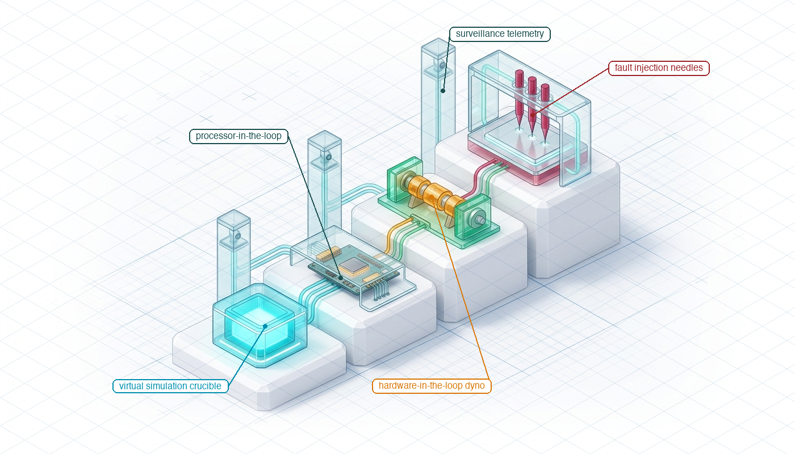{fig-alt="Isometric blueprint showing adversarial cyber-physical verification: The verification process includes a four-tier qualification ladder: a virtual simulation crucible for testing algorithms, a processor-in-the-loop board for real-time testing, a hardware-in-the-loop dynamometer for testing physical components, and adversarial fault injection needles to introduce faults and assess robustness. Surveillance telemetry towers monitor system performance and collect data during tests."}
:::

::: {.content-visible unless-format="pdf"}
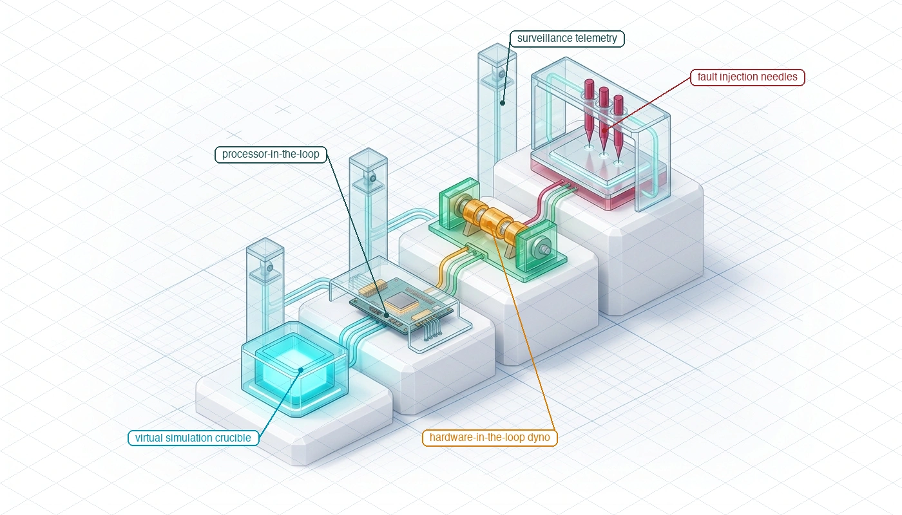{fig-alt="Isometric blueprint showing adversarial cyber-physical verification: four-tier qualification ladder with virtual simulation crucible, processor-in-the-loop board, hardware-in-the-loop dynamometer, Harvard crimson adversarial fault injection needles, and surveillance telemetry towers."}
:::

:::

## Purpose {.unnumbered .unlisted}

::: {.content-visible when-format="pdf"}
\begin{marginfigure}
\vspace{1em}
\resizebox{\linewidth}{!}{\mlphysicalstackfull{20}{20}{20}{20}{20}}
\end{marginfigure}
:::

_Why is a robot that has operated for weeks without a single crash not evidence that the machine is safe?_

Weeks of successful operation establish behavior under encountered conditions but leave untested scenarios like sensor freezes or late plans. A machine may seem dependable if its operating environment has never challenged its safety assumptions. Verification in physical AI systems involves transforming assumptions into specific testable conditions, such as simulating sensor failures or unexpected environmental changes, which engineers can deliberately manipulate to observe the system's response and ensure safety. The fault list derives from the design's claims about freshness, timing, and physical response, not from generic stress tests. Each experiment must record whether the integrated machine detects the violation and contains its consequences within the stated envelope. Simulation can expose an inconsistent contract, while hardware tests reveal effects that the simulated plant omits. Neither supports claims beyond the conditions it represents. Whole-system verification connects the brain's assumptions, the nervous system's responses, and the body's measured behavior into evidence that can support, narrow, or reject an operating claim.

::: {.column-margin .margin-pointer}
↰ **Prerequisite:** Physical failure modes and measurement limits providing verification targets originate in @sec-body-measuring-limits.
:::



::: {.callout-learning-objectives}

- Define operating envelopes and acceptance criteria that make the machine's physical claims falsifiable
- Design fault-injection tests that challenge timing, data validity, and authority claims on physical hardware
- Evaluate which simulation and hardware tests support each claim and where their evidence ends
- Construct reproducible fault records linking injected conditions, detected violations, response times, and physical outcomes

:::

## Fault Injection {#sec-verification-fault-injection}

In autonomous systems engineering, few illusions are more dangerous than an incident-free operational log. An automated guided vehicle that has operated in a logistics warehouse for three weeks without an emergency stop, or a fleet of autonomous test vehicles that has accumulated one hundred thousand highway kilometers without a disengagement, provides a comforting sense of reliability. In safety-critical physical AI, elapsed operating time without incident does not prove machine safety; it merely indicates that the operating environment has not yet challenged the latent, unverified assumptions underlying safety. Whole-system verification cannot assume that supervisory contracts, barrier certificates, and fallback state machines function as intended merely because they are in firmware. If ambient temperatures remained between $20.0^\circ\text{C}$ and $24.0^\circ\text{C}$, supply rail voltages never drooped, optical camera lenses were never blinded by low-angle winter glare, and memory buses never suffered direct memory access (DMA) contention, the operational record reveals nothing about how the machine behaves when those assumptions fail. Testing under nominal operational distributions ($D_0$) shows steep diminishing returns. As autonomous systems mature, observing rare safety-critical edge cases under natural conditions demands an exponential expansion of operating exposure. This empirical barrier is illustrated by multi-year disengagement trends in @fig-15-av-disengagement-trends: as software improves, each safety-relevant anomaly requires an order of magnitude more operational mileage to observe. Whole-system verification cannot be a passive vigil waiting for rare physical failures to occur by chance; it must be an active, adversarial engineering campaign that systematically injects computational, electrical, and physical faults to falsify cyber-physical contracts before the machine is entrusted to the wild.

::: {#fig-15-locator fig-env="figure" fig-pos="htb" fig-cap="**Verification Architecture Focus**: The four-tier physical AI systems architecture highlights the system governance and assurance tier, with verification as this chapter's active focus. Read the highlighted box as the qualification ladder that walks a safety claim from simulation through processor-in-the-loop and hardware-in-the-loop stages to in-situ trials, attacking one cyber-physical boundary at each rung." fig-alt="Diagram titled Physical AI Systems Architecture Stack, drawn as four stacked tiers. Layer 4 is system governance and assurance at 0.1 to 1 hertz, holding boxes for shared autonomy, verification, safety cases, and frontier limits. Layer 3 is the brain, a cognitive deliberation tier at 1 to 50 hertz, holding five stages named ingestion, perception, memory, intent, and planner. A dashed proposal-permission privilege boundary separates it from layer 2, the nervous system, a real-time safety and timing tier at 1000 hertz. Layer 1 is the physical body and continuous plant. Layer 4 is outlined and its verification box is highlighted; the badge reads Active Focus, Chapter 15, Verification."}
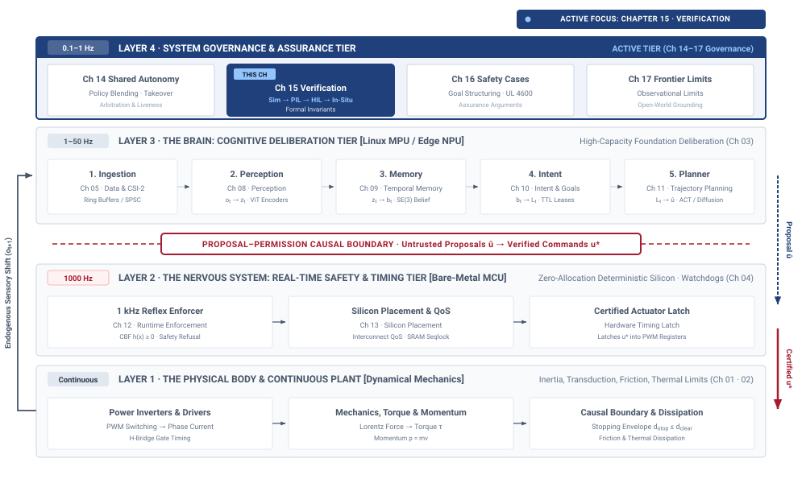{width="100%"}
:::

::: {#fig-15-av-disengagement-trends fig-env="figure" fig-pos="htb" fig-cap="**Nominal Testing Disengagement Scaling**: Reported miles per disengagement by year, rising from about one thousand in 2015 to sixty thousand in 2021. Improvement makes verification harder rather than easier, because each safety-relevant event now requires an order of magnitude more operating miles to observe." fig-alt="Line chart with shaded area showing reported miles per disengagement rising from about one thousand in 2015 to sixty thousand in 2021, with the steepest climb after 2019."}

```{python}
#| echo: false
import pandas as pd
import matplotlib.pyplot as plt
import matplotlib.ticker as ticker
from mlsysim import viz

data = pd.read_csv("vol4/15_verification/data/av_disengagement_trends.csv")

fig, ax, COLORS, plt = viz.setup_plot(figsize=(6, 4))
ax.plot(data["Year"], data["Miles_per_Disengagement"], marker='o', linestyle='-', linewidth=2.5, color='#2c3e50', markersize=6)
ax.fill_between(data["Year"], data["Miles_per_Disengagement"], alpha=0.15, color='#2c3e50')

ax.set_xlabel("Reporting Year", fontsize=11)
ax.set_ylabel("Miles per Disengagement", fontsize=11)
ax.grid(True, linestyle='--', alpha=0.5)

ax.yaxis.set_major_formatter(ticker.FuncFormatter(lambda x, p: format(int(x), ',')))

ax.spines['top'].set_visible(False)
ax.spines['right'].set_visible(False)

plt.tight_layout()
plt.show()
plt.close()
```

:::

As located in the architecture stack in @fig-15-locator, whole-system verification is the second pillar of Tier 4 (System Governance & Assurance). Operating at supervisory timescales, verification provides the empirical evidence required to justify or reject operational release claims. Its duty is not to evaluate isolated model accuracy benchmarks or unit-test isolated software components, but to assess how the assembled cyber-physical machine behaves when stressed across all tier boundaries:

- **The Brain (Tier 3):** evaluating whether cognitive perception models, semantic memory lookups, and neural trajectory planners degrade predictably under corrupted sensor feeds, frame drops, and execution latency spikes;[^fn-bridge-verification-brain]
- **The Nervous System (Tier 2):** verifying whether real-time fieldbuses, watchdog timers, and deterministic safety enforcers detect contract violations and execute deterministic fallback transitions within hard real-time deadlines ($1\text{ ms}$);[^fn-bridge-verification-nervous] and
- **The Body (Tier 1):** measuring whether physical actuators, motor drives, mechanical brakes, and pressure relief valves physically contain kinetic energy and mass without exceeding thermal derating or structural dissipation limits.[^fn-bridge-verification-body]

[^fn-bridge-verification-brain]: **Cognitive Trajectory Contracts**\index{Cognitive contracts!Tier 3 verification}: As developed in @sec-brain-embodied and @sec-planning-trajectory-contract, deliberative planners and neural policies operate under explicit assumptions of state freshness and kinematic feasibility. Verification must systematically challenge these assumptions by injecting deliberate latency stalls and perceptual corruptions into target execution pipelines. When upstream execution times overrun allocated decision windows, the underlying continuous plant coasts open-loop across its dynamic stopping distance without closed-loop guidance.

[^fn-bridge-verification-nervous]: **Watchdogs and Real-Time Seams**\index{Watchdog timer!Tier 2 verification}: As detailed in @sec-nervous-multi-rate-bridge and @sec-enforcement-fallback-ladder, Tier 2 safety enforcers and hardware watchdog interlocks provide deterministic fallback paths. Verification evaluates whether these enforcers trip predictably within their budgeted deadlines when upstream software hangs or fieldbuses stall. Any unhandled preemption delay in the safety monitor permits transient actuation commands to propagate, causing physical overshoots that breach mechanical yield limits.

[^fn-bridge-verification-body]: **Actuator Dynamics and Energy Dissipation**\index{Actuator dynamics!Tier 1 verification}: As analyzed in @sec-boundary-causal-boundary and @sec-body-five-budgets, physical safety outside the nominal operating envelope is delivered by mechanical energy dissipation, thermal margins, and structural compliance rather than by software optimization. When destructive kinetic or hydraulic energy exceeds these passive hardware absorption limits, structural deformation or component rupture occurs regardless of policy intent. Whole-system verification must therefore characterize physical containment boundaries directly on instrumented dynamometer and destructive testbeds.

Consider a flow regulator designed to maintain liquid in a $100.0\text{ L}$ chemical buffer tank below an overflow weir at $95.0\text{ L}$. Under nominal conditions, liquid enters at $40.0\text{ L/min}$, an ultrasound sensor reports liquid height with $10\text{ ms}$ bus latency, and an electric actuator adjusts the discharge valve at $50\text{ Hz}$. In routine operation, the liquid hovers at $80.0\text{ L}$, well clear of the boundary. The machine appears dependable because disturbances never exceed $\pm 5.0\text{ L/min}$, and the discharge valve operates within its linear flow regime between 30 percent and 50 percent open. Now introduce an unobserved disturbance: an upstream valve switch causes supply pressure to surge, driving inlet flow to $80.0\text{ L/min}$. Simultaneously, a memory bus conflict on the controller board delays the ultrasound reading by $140\text{ ms}$, bringing total sensing latency to $150\text{ ms}$. With a net fill rate of $40.0\text{ L/min}$ ($0.67\text{ L/s}$), the tank accumulates volume rapidly. Because the policy receives delayed level data, it underestimates the rate of rise near $90.0\text{ L}$ and commands the discharge valve late. When the stale reading finally updates, the policy outputs a maximum-rate slew command that slams the valve open, inducing a severe hydraulic water-hammer pressure transient of $12.0\text{ bar}$ that cracks the downstream pipe coupling. The liquid breaches the $95.0\text{ L}$ weir, triggering an emergency float switch that cuts pump power, but the structural damage to the pipe fitting is detected by no runtime sensor at all until fluid pools on the floor.

::: {.column-margin .margin-pointer}
↰ **Prerequisite:** Non-asymptotic Clopper-Pearson statistical confidence intervals are formulated in @sec-evaluation-closed-loop-survival.
:::

Converting such failure modes into verification evidence requires structured methods designed to challenge specific system properties. Five essential ingredients turn a physical run into a test result that can support a safety case:

1. **A bounded claim:** stating the exact invariant the machine must maintain (e.g., maintaining liquid volume below $95.0\text{ L}$ and transient line pressure below $6.0\text{ bar}$);
2. **Defined test conditions:** specifying the initial state space, fluid viscosity, ambient temperature, and supply pressure range;
3. **A precommitted oracle\index{Testing!Oracle}:** an automated evaluator that inspects recorded telemetry against the claim without human intervention or post-hoc adjustments;
4. **A stated sampling and injection procedure:** deliberately driving the machine toward its performance limits and injecting faults into sensors, buses, and actuators; and
5. **Provenance\index{Provenance}:** the complete metadata record of model weights, calibration tables, sensor serial numbers, and raw bus logs permitting independent reproduction.

To establish this verification discipline across the cyber-physical stack, this chapter unfolds through seven sequential investigations. In @sec-verification-operating-envelope, we formalize the multidimensional operating envelope across coupled physical, computational, and environmental dimensions, distinguishing it from the destructive survival envelope where safety depends on passive mechanical dissipation. Next, @sec-verification-deriving-fault-list applies systems-theoretic hazard analysis to derive an exhaustive, falsifiable fault list targeting every cyber-physical seam. In @sec-verification-qualification-ladder, we navigate the four-stage qualification ladder, advancing from software-in-the-loop and processor-in-the-loop emulation to hardware-in-the-loop dynamometers and in-situ physical testbeds. In @sec-verification-oracles-acceptance, we construct precommitted, automated fault oracles using Signal Temporal Logic with quantitative robustness semantics to eliminate retrospective evaluation bias. From there, @sec-verification-hardware-fault-injection details the specialized instrumentation required to inject electrical, communication, and mechanical faults directly onto running embedded hardware. In @sec-verification-fault-manifest, we bind the resulting empirical traces into an immutable, cryptographically signed fault manifest that ties physical measurements to top-level safety claims. Finally, @sec-verification-fallacies-pitfalls exposes the critical systems fallacies of unbudgeted latency accumulation, shared telemetry channels, and unobservable test outcomes.

We begin in @sec-verification-operating-envelope by formalizing the operating envelope across coupled physical, computational, and environmental dimensions.

## The Operating Envelope {#sec-verification-operating-envelope}

The **operating envelope**\index{Operating envelope!definition} defines the complete set of simultaneous physical states, environmental disturbances, sensing conditions, execution latencies, compute loads, electrical supply variations, and operator response times under which the machine is claimed to satisfy its performance specifications. Defining this envelope requires precise numerical boundaries for an automated test framework to drive the system deterministically across each constraint. For a fluid regulation system, this means specifying not merely a nominal liquid level, but the exact allowable ranges for fluid temperature, kinematic viscosity, supply line pressure fluctuations, ambient temperature, acoustic transducer signal-to-noise ratios, CAN bus arbitration jitter, CPU thermal throttling states, supply rail voltage droop, and the maximum permissible time before an operator acknowledges an alert.

An operating envelope is distinct from the larger **survival envelope**\index{Survival envelope!definition} that encompasses it. Inside the operating envelope, the learned policy and primary tracking controllers fully regulate the physical process, maintaining closed-loop tracking within tight tolerances. When external disturbances, sensor failures, or compute stalls push the system across the boundary of the operating envelope, nominal regulation is conceded. At that threshold, the machine enters the survival envelope, where the primary objective shifts entirely to bringing the physical body to a bounded, safe state before structural limits are breached. In the flow regulator, the survival envelope defines the broader region of volume, pressure, and temperature within which emergency shutoff valves and mechanical relief mechanisms can successfully vent pressure and arrest inflow before a pipe ruptures or fluid overflows secondary containment. Beyond the boundary of the survival envelope lies catastrophic physical failure, where stored energy or incoming mass exceeds the mechanical dissipation capacity of the hardware. This boundary between control and survival manifests directly in destructive vehicle crash qualification (@fig-15-crash-test-instrumentation; see also @sec-boundary-causal-boundary): while nominal autonomous policies operate strictly within the dynamic control envelope, catastrophic perception or planning failures push the machine across the boundary into the survival envelope, where structural crumple zones and deterministic passive or pyrotechnic enforcers must physically dissipate kinetic energy before passenger compartment survival limits are breached.

::: {#fig-15-crash-test-instrumentation fig-env="figure" fig-pos="t" fig-cap="**Survival Envelope Impact Testing**: A full-scale side-impact qualification test, with photogrammetric fiducials tracking deformation at microsecond resolution and umbilical harnesses routing accelerometer, deflection, and load-cell telemetry off the vehicle. The test measures what happens after software has stopped mattering, since past the operating envelope safety is delivered by mechanical dissipation and passive enforcers rather than by any optimization the policy could still perform." fig-alt="Physical Survival Envelope Verification and Impact Instrumentation. Full-scale vehicle crashworthiness and dynamic boundary qualification under controlled laboratory impact conditions (55.28 km/h 90-degree Moving Deformable Barrier side-impact test, NHTSA NCAP Test No. 10132). High-contrast photogrammetric optical targets (yellow-and-black circular fiducials) affixed along the vehicle B-pillar, door frames, and rocker panels enable microsecond-resolution spatial deformation tracking via high-speed photometric cameras. Heavy yellow sensor umbilical harnesses emerging through the forward pillar route raw high-rate telemetry from internal Anthropomorphic Test Device (ATD) accelerometers, chest deflection potentiometers, and structural load cells to isolated digitizers. When an unmodeled disturbance or policy failure pushes the machine past its operating envelope, physical safety is no longer governed by software optimization, but by the mechanical dissipation capacity and deterministic passive/pyrotechnic enforcers within the survival envelope. Attribution: U.S. National Highway Traffic Safety Administration (NHTSA), Public Domain."}
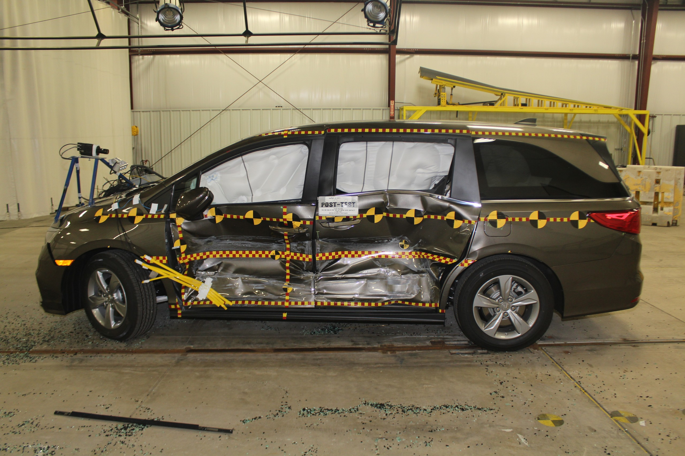{width="85%"}
:::

Defining the boundary of the operating envelope requires deriving physical limits from first principles rather than asserting convenient software timeouts. Consider a pumped chemical buffer reservoir with an overflow weir at $V_{\text{max}} = 95.0\text{ L}$ and a nominal operating target of $V_0 = 80.0\text{ L}$. Under an upstream valve failure disturbance, the inlet flow rate surges from nominal $40.0\text{ L/min}$ to $Q_{\text{in}} = 1.50\text{ L/s}$ ($90.0\text{ L/min}$), while a downstream pump trips, reducing discharge to $Q_{\text{out}} = 0.10\text{ L/s}$ ($6.0\text{ L/min}$), yielding a net liquid accumulation rate of $dV/dt = Q_{\text{in}} - Q_{\text{out}} = 1.40\text{ L/s}$. Conservation of volume dictates that when the liquid crosses an initial trigger threshold $V(t_0) = 88.0\text{ L}$, the remaining volume margin is $\Delta V = V_{\text{max}} - V(t_0) = 95.0\text{ L} - 88.0\text{ L} = 7.00\text{ L}$. The total physical time-to-breach before containment loss is governed by @eq-verification-time-to-breach:
$$t_{\text{breach}} = \frac{V_{\text{max}} - V(t)}{Q_{\text{in}} - Q_{\text{out}}}$$ {#eq-verification-time-to-breach}
which yields $t_{\text{breach}} = \frac{7.00\text{ L}}{1.40\text{ L/s}} = 5.00\text{ s}$.

Every source of delay in the machine consumes a fraction of this five-second budget. Liquid height is measured by an ultrasonic level sensor that incurs measurement integration delay $t_{\text{acq}} = 80\text{ ms}$, CAN-FD bus transmission jitter $t_{\text{bus}} = 20\text{ ms}$, temporal noise filtering $t_{\text{filter}} = 100\text{ ms}$, and safety enforcer evaluation $t_{\text{enforce}} = 10\text{ ms}$ (total fixed sensor and enforcer path $t_{\text{fixed}} = 210\text{ ms} = 0.21\text{ s}$). The physical containment mechanism is an emergency isolation gate valve requiring mechanical travel time $t_{\text{valve}} = 1.20\text{ s}$ to seat against line pressure, followed by acoustic pressure surge settling of $t_{\text{acoustic}} = 0.30\text{ s}$ ($t_{\text{mech}} = 1.50\text{ s}$). Summing these fixed delays establishes an irreducible hardware reaction floor of $t_{\text{floor}} = t_{\text{fixed}} + t_{\text{mech}} = 0.21\text{ s} + 1.50\text{ s} = 1.71\text{ s}$. The remaining timing margin available for deliberative neural policy execution evaluates to $\Delta t_{\text{margin}} = t_{\text{breach}} - t_{\text{floor}} = 5.00\text{ s} - 1.71\text{ s} = 3.29\text{ s}$.

If memory bus contention on the neural accelerator stalls policy inference by an unbudgeted $\Delta t_{\text{stall}} = 3.60\text{ s}$, the total time from initial threshold crossing to complete valve seating expands to $t_{\text{total}} = t_{\text{floor}} + \Delta t_{\text{stall}} = 1.71\text{ s} + 3.60\text{ s} = 5.31\text{ s}$. During this $5.31\text{ s}$ interval, the volume accumulated is $\Delta V_{\text{accum}} = (1.40\text{ L/s})(5.31\text{ s}) = 7.434\text{ L}$, producing a final volume of $V_{\text{final}} = 88.00\text{ L} + 7.434\text{ L} = 95.434\text{ L}$. Because $V_{\text{final}} > V_{\text{max}} = 95.00\text{ L}$, fluid breaches the containment weir, spilling $V_{\text{spill}} = 95.434\text{ L} - 95.000\text{ L} = 0.434\text{ L}$ ($434\text{ mL}$). To guarantee physical containment with a safety time buffer $t_{\text{buffer}} = 1.00\text{ s}$ under worst-case compute and communication latency $t_{\text{compute}} \le 0.50\text{ s}$ ($P_{99.9}$), the maximum permissible trip threshold volume follows from:
$$V_{\text{trip}} \le V_{\text{max}} - (Q_{\text{in}} - Q_{\text{out}}) \cdot (t_{\text{floor}} + t_{\text{compute}} + t_{\text{buffer}})$$ {#eq-verification-trip-threshold}
Evaluating @eq-verification-trip-threshold with allocated duration $t_{\text{alloc}} = 1.71\text{ s} + 0.50\text{ s} + 1.00\text{ s} = 3.21\text{ s}$ and $\Delta V_{\text{alloc}} = (1.40\text{ L/s})(3.21\text{ s}) = 4.494\text{ L}$ yields $V_{\text{trip}} \le 95.00\text{ L} - 4.494\text{ L} \approx 90.50\text{ L}$. Software timeouts in isolation cannot prevent physical overflow; the operating envelope is an inviolable kinematic budget where every millisecond of sensory filtering, compute contention, and mechanical inertia directly consumes physical clearance margin.

::: {#chk-verification-reaction-budget-under-inlet-surge-and-sensing-latency .callout-checkpoint title="Inlet surge reaction and sensing latency"}
Consider an embodied fluid regulation or chemical containment plant operating under boundary disturbances:

- [ ] **Physical reaction budget decomposition**: Can you explain how sensory integration delay, bus serialization, safety enforcer evaluation, and mechanical valve seating combine into an irreducible hardware reaction floor $t_{\text{floor}}$?
- [ ] **Deliberative inference latency margins**: Can you describe how unbudgeted memory bus contention on a neural accelerator consumes the remaining physical margin between $t_{\text{floor}}$ and $t_{\text{breach}}$, transforming an algorithmic stall into an uncontained physical overflow?
- [ ] **Dynamic trip thresholds**: Can you explain why safety-critical containment trip points must be derived dynamically from net accumulation rates and worst-case tail latencies rather than fixed as static high-water marks?
:::

Tabulating separate minimum and maximum values for individual variables fails to capture the true operating boundary because physical and computational dimensions are coupled. In isolation, an inlet pressure of $6.0\text{ bar}$, a fluid viscosity of $45.0\text{ mPa}\cdot\text{s}$, a valve slew rate of $30.0\text{ deg/s}$, and an observation age of $120\text{ ms}$ might each fall within their respective single-variable ranges. When these conditions coincide, the higher viscosity increases fluid shear across the valve spool, slowing mechanical travel below the nominal slew rate. Simultaneously, the elevated inlet pressure accelerates volume accumulation, while the $120\text{ ms}$ observation age hides the initial pressure surge from the policy. The physical state crosses into the survival envelope long before any single parameter exceeds its isolated maximum. The true operating boundary is an interconnected hypersurface in state, parameter, and latency space—a multidimensional boundary where temperature, pressure, and timing all physically affect one another. A valid verification suite must probe this combined surface rather than checking isolated scalar limits.

To prevent envelope boundaries from deteriorating into optimistic assumptions, every defined parameter must specify its physical units, its measurement provenance, its calibrated uncertainty, and a designated subsystem engineer who remains accountable for its validity. A boundary stated as a maximum pressure of $8.0\text{ bar}$ is incomplete without recording whether that limit derives from hydrostatic burst testing of the flanged joints, finite-element pipe stress models, or pump stall characteristics. The boundary specification must also record the measurement uncertainty of the sensors used during characterization, such as $\pm 0.15\text{ bar}$ at $P_{99}$. When system components change, such as swapping an elastomeric seal or upgrading a CAN transceiver, the designated owner must formally re-evaluate whether the physical boundary has shifted.

Verification of the operating envelope requires a disciplined sampling strategy that deliberately attacks the boundary surface. Testing nominal interior points, where the tank sits at $80.0\text{ L}$, ambient temperature is $21.0^\circ\text{C}$, and sensing latency is $12\text{ ms}$, demonstrates only that the machine functions under ideal conditions. To generate rigorous verification evidence, the test framework must place test points directly on, immediately inside, and immediately outside each consequential boundary. Evaluating points just inside the boundary verifies that the policy maintains closed-loop stability\index{Closed-loop stability} under maximum permissible stress. Evaluating points on the boundary confirms that safety margins do not collapse under nominal sensor noise. Evaluating points just outside the boundary confirms that safety enforcers intervene predictably, taking authority from the learned policy and bringing the system to a safe halt within the survival envelope before containment is lost.

::: {#psp-verification-hardware-falsification .callout-perspective title="The hardware falsification principle"}
If a safety property cannot be deterministically falsified by injecting a physical or electrical fault\index{Fault injection!hardware} on target hardware, the property is an unverified assumption rather than an engineering invariant.
:::

Formally documenting the operating and survival boundaries converts the design claims of the preceding chapters into concrete targets for fault injection\index{Fault injection}. When every physical constraint, latency budget, and environmental limit is stated as a verifiable number, the safety engineer knows precisely what conditions the machine must withstand, what thresholds must trigger protective intervention\index{Protective intervention}, and what dynamic claims must be subjected to deliberate failure.

## Deriving the Fault List {#sec-verification-deriving-fault-list}

The initial fault list derives from inverting design records across the architecture. @Sec-data through @sec-evaluation supply the properties of the learned policy, including training distribution bounds, state-action assumptions, and inference latency ceilings. @Sec-perception through @sec-placement provide interface and execution properties, such as bus bandwidth allocations, serialization overheads, observation freshness guarantees, and state estimation bounds. @Sec-intervention supplies the properties of the authority-transfer mechanism, specifically the maximum latency to disconnect a failing policy and the independent override authority of the safety enforcer. Inverting these records systematically generates an initial candidate set for verification. If an analytical model of a flow control loop records that the learned policy produces a valid valve command every $20\text{ ms}$ under all flow rates between $0.10\text{ m}^3\text{/s}$ and $2.50\text{ m}^3\text{/s}$, the verification suite inverts that claim by injecting stalled command streams, delayed observations, and out-of-range sensor readings to test whether the downstream nervous system detects the violation within its budget.

Every recorded design property becomes a testable fault only when structured as a five-element chain comprising the negated condition, the physical injection point, the expected detector, the bounded response, and an observable pass condition. In a high-pressure fluid delivery system, consider a flow meter that publishes volumetric discharge rates across a Controller Area Network (CAN) fieldbus with an analytical latency bound of $5.0\text{ ms}$. The negated property injects an artificial transport delay of $25\text{ ms}$ at the network interface buffer. The expected detector is the stale-frame monitor in the safety enforcer, the required response is a transition to a recirculating bypass within $10\text{ ms}$, and the observable pass condition is that fluid pressure at the manifold remains below $6.0\text{ bar}$ at $P_{99}$. When any element of this chain cannot be defined or observed, the system contains a **verification gap**\index{Verification gap!definition}. A verification gap indicates that the claim cannot be falsified by test. Such gaps cannot be ignored; they require dedicated hardware instrumentation, a narrower operational claim, or a redesign of the execution path.

This inversion process must challenge data provenance, simulation validity, and offline evaluation assumptions with physical runtime packets. Distribution shift and misleading optimization metrics are system faults even when every communication frame arrives without corruption. If a learned policy was trained on hydrodynamic simulations that assumed a constant fluid viscosity of $1.0\times 10^{-3}\text{ Pa}\cdot\text{s}$, cooling the fluid to increase viscosity to $3.5\times 10^{-3}\text{ Pa}\cdot\text{s}$ alters the pump head curve and introduces cavitation noise. Inverting the evaluation claim requires injecting these unmodeled fluid dynamics, simulated sensor bias, and synthetic data perturbations where a high nominal reward hides high-frequency actuator jitter. Because software and physical mechanics remain coupled across the system boundary (@sec-boundary-causal-boundary), a physical AI system fails when valid, uncorrupted commands drive the physical body into an unstable mechanical regime because training assumptions were violated.

At the structural boundaries established across @sec-perception through @sec-placement, the fault generator inverts each inter-module contract at its physical point of handoff. These tests negate observation freshness, state validity, intent lifetime, planning deadlines, enforcement independence, and resource allocations. If a trajectory planner issues an actuation profile with an intent lifetime of $100\text{ ms}$, the test environment injects an otherwise valid actuation frame at $125\text{ ms}$ to confirm that the actuator interface rejects it as expired. If the safety enforcer claims execution independence from the primary policy computer, the test saturates the shared memory bus with maximum DMA traffic (simulating a runaway background process hogging memory bandwidth) to confirm that the enforcer still meets its $1.0\text{ ms}$ control deadline. Conversely, fault injection must remain disciplined, because bus starvation, clock skew, and supply voltage fluctuations should be injected only where the design explicitly claims tolerance. Testing arbitrary failure modes from a generic menu invents requirements that the machine was never specified to meet, diverting engineering effort away from validating actual architectural contracts.

The structural limit of record inversion is absolute. Inverting recorded properties produces only the faults that the design team already modeled, which is precisely the set of behaviors that will not surprise the creators of the machine. The completeness of an inverted fault list is bounded by the completeness of the original design claims. If the engineering records never documented how an electric motorized valve behaves when ambient temperatures freeze the mechanical seals, no record exists to invert, and the failure mode will not appear in the verification suite. Inversion guarantees that every documented claim is tested, but it remains blind to unstated assumptions, overlooked physical hazards, and unmodeled failure dependencies.

Overcoming this limitation requires a second, independent source that works forward from the physical machine rather than backward from design documents. This forward analysis enumerates what the physical body, the power distribution network, the fluid dynamics, and the operating environment can do regardless of what the software believes. Physical pipes experience destructive shockwaves when rapid valve closure abruptly halts fluid momentum, a phenomenon known as **water hammer**\index{Water hammer!definition}; mechanical valve seats accumulate particulate deposits that prevent full seating, elastomeric seals wear under repeated pressure cycling, and pump vibration induces harmonic resonance in downstream sensor brackets. These physical phenomena originate in mechanics, materials science, and fluid dynamics, operating entirely outside the digital abstractions of the nervous system—a reality formalized in Leveson's **Systems-Theoretic Accident Model and Processes (STAMP)**\index{Systems-Theoretic Accident Model and Processes!definition} framework[^fn-std-stpa-leveson] [@leveson2011engineering].

::: {.column-margin}
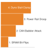{width="100%" fig-alt="Vertical ladder showing fault injection climbing from SRAM bit-flips up to physical dyno shaft jamming."}

*Fault injection climbs from software bit-flips to physical dyno shaft jamming.*
:::

[^fn-std-stpa-leveson]: **STAMP/STPA Hazard Analysis**\index{Systems-Theoretic Process Analysis!emergent hazards}: Developed at MIT by Nancy Leveson, STAMP treats system safety as a dynamic control problem rather than a component reliability failure. In autonomous physical AI, emergent hazards arise at hardware-software seams where asynchronous bus latency or filter lag invalidates low-level stability guarantees. A rigorous verification campaign must therefore inject boundary stress across these seams to verify that safety interlocks trip before dynamic envelope limits are breached.

Working forward from the physical hardware exposes entire fault classes that no software property record implies. These include total clock loss, supply rail brownouts where digital logic levels blur unpredictably between $0.8\text{ V}$ and $2.0\text{ V}$, electromagnetic interference from high-current pump contactors coupling into analog pressure lines, floating high-impedance output pins subject to stray electromagnetic coupling during power-on reset transitions, corrupted non-volatile configuration memory, and shared reset lines that accidentally bridge independent domains. If an emergency pressure-relief circuit and a learned policy accelerator share a single power management integrated circuit, an undervoltage transient on the accelerator can reset the safety circuit, disabling the relief mechanism at the exact moment the policy loses control. No software record contains this failure mode because each software module assumes its underlying power rail is an ideal, independent DC voltage source.

Physical forward analysis also challenges the common-cause independence claims established in @sec-nervous and @sec-placement. Two control paths that appear isolated in an architectural diagram often share a single physical vulnerability. A primary flow sensor and a redundant pressure switch may route their wiring through a single conduit exposed to mechanical abrasion, or share a common analog reference voltage within a multi-channel converter, or rely on identical timer silicon vulnerable to the same manufacturer errata. If an electromagnetic transient induces simultaneous parasitic PNPN latch-up conditions across both channels, treating them as statistically independent failures invalidates the entire safety argument. **Common-cause analysis**\index{Common-cause analysis!definition} traces physical routing, power paths, and shared clock trees to ensure that no single physical event can disable both the operational policy and the intervention mechanism simultaneously.

The physical source must also encompass operator error modes and foreseeable misuse from @sec-intervention, treating human interaction as an operational hazard of the machine. Field operators force bypass switches during maintenance, misconfigure manual throttling valves upstream of automated manifolds, disconnect telemetry cables to silence acoustic alarms, and request setpoint changes that exceed the thermal dissipation capacity of pump motors. When an operator commands an instantaneous step increase in flow from $0.20\text{ m}^3\text{/s}$ to $2.00\text{ m}^3\text{/s}$, the verification framework must verify that the nervous system clamps the command to a safe acceleration rate, preventing cavitation and hydraulic shock while maintaining closed-loop stability.

Finally, the fault inventory must directly challenge the authority-transfer claims established in @sec-intervention. A policy driving a motorized valve at full speed builds up mechanical momentum and electrical back-EMF that actively resist rapid deceleration. In an analytical test scenario where a valve actuator rotates at $90^\circ\text{/s}$, the fault injection framework triggers an unrecoverable policy fault and measures whether the safety enforcer de-energizes the motor driver within $4.0\text{ ms}$, engages the mechanical brake, and halts flow before line pressure exceeds the pipe burst threshold of $10.0\text{ bar}$. The intervention mechanism is not an unassailable arbiter; it is a physical subsystem whose claims of speed, independence, and override capability must be deliberately attacked, measured, and falsified before the assembled machine can be judged ready for structured qualification.

Working forward from the physical machine establishes the exhaustive cross-layer fault taxonomy detailed in @tbl-15-fault-classification.

| Failure Domain & Fault Mode             | Physical Mechanism & Injection Point                                                                                  | Target Manifestation & Causal Impact                                                          | Detection Primitive & Latency Budget                                                                   | Enforced Safe Response & Bounded Recovery                                                | Observable Pass Criterion                                                                                                             |
|:----------------------------------------|:----------------------------------------------------------------------------------------------------------------------|:----------------------------------------------------------------------------------------------|:-------------------------------------------------------------------------------------------------------|:-----------------------------------------------------------------------------------------|:--------------------------------------------------------------------------------------------------------------------------------------|
| **Sensor Corruption & Signal Bias**     | Piezoelectric transducer drift, stuck-at-zero ADC register, injected via DAC inline interceptor                       | Stale or unphysical state estimate $\hat{\mathbf{x}}(t)$; policy commands erroneous slew rate | $\chi^2$ innovation / plausibility monitor ($\Delta t_{\text{det}} \le 20\text{ ms}$)                  | Isolate faulty sensor channel; switch to dead-reckoning or secondary estimator           | Process state remains inside survival envelope: $P(t) \le P_{\text{max}} + \Delta P_{\text{margin}}$                                  |
| **Bus Contention & Frame Loss**         | Babbling-idiot CAN transceiver, real-time Ethernet queue overflow, injected via CAN disturbance node                  | Missing observation frames; heartbeat starvation; outdated plan execution                     | Cyclic redundancy check (CRC) & frame arrival watchdog ($\Delta t_{\text{det}} \le 10\text{ ms}$)      | Reject expired proposal; freeze actuator to zero-torque safe hold or clamp valve         | End-to-end reaction time $t_{\text{react}} \le t_{\text{budget}}$; zero unhandled bus exceptions                                      |
| **Power Brownout & Voltage Droop**      | Motor contactor inrush transient, LDO rail sag ($V_{\text{core}} < 0.85\text{ V}$), injected via programmable DC load | Indeterminate logic states; corrupted SRAM registers; asynchronous MCU reset                  | Hardware Undervoltage-Lockout (UVLO) monitor ($\Delta t_{\text{det}} \le 15\,\mu\text{s}$)             | Hardware crowbar circuit fires; de-energize gate drivers; assert fail-safe spring return | Logic pins never float in undefined state; secondary relief valve seats within $50\text{ ms}$                                         |
| **Actuator Jam & Mechanical Stall**     | Particulate contamination in valve, bearing seizure under shock load, injected via hydraulic brake clamp              | Locked rotor; severe back-EMF collapse; rapid stator winding heating ($I^2 R$)                | Motor phase overcurrent & Hall-effect velocity stall monitor ($\Delta t_{\text{det}} \le 5\text{ ms}$) | De-energize H-bridge power stage; engage electromechanical brake; route bypass           | Stator temperature $T_{\text{coil}} < 180^\circ\text{C}$ (Class H insulation limit); line pressure relieved before burst disc rupture |
| **Watchdog Panic & Priority Inversion** | DMA bus-master lockup on GPU, deadlock in high-priority RTOS task, injected via bus stall emulator                    | Interrupted control loop cadence; un-serviced safety heartbeat; hung NPU                      | Independent windowed hardware watchdog timer ($\Delta t_{\text{det}} \le 2.0\text{ ms}$)               | Assert Non-Maskable Interrupt (NMI); hardwired authority transfer to safety MCU          | Takeover completed in $\le 4.0\text{ ms}$; zero command bleed-through from hung processor                                             |

: **Exhaustive Cross-Layer Hardware and Cyber-Physical Fault Classification Matrix**: Structural mapping of physical and logical failure modes across injection mechanisms, target system manifestations, hardware and software detection primitives, enforced safety recovery responses, and unambiguous empirical pass criteria. {#tbl-15-fault-classification tbl-colwidths="[16,18,18,16,16,16]"}

## The Qualification Ladder {#sec-verification-qualification-ladder}

Subjecting an assembled machine to an inventory of faults requires choosing an execution environment for each test. Each evaluation environment exercises a different subset of the physical and computational causal loop that connects sensor inputs, inference pipelines, communication buses, actuator drives, plant dynamics, and environmental feedback. Qualification environments do not form a strict hierarchy; higher rungs do not subsume lower ones. Each mode closes, breaks, or substitutes specific causal links, establishing distinct categories of evidence while remaining blind to others.

::: {#dfn-verification-four-stage-qualification-ladder .callout-definition title="The four-stage qualification ladder"}

***Four-stage qualification ladder***\index{Four-stage qualification ladder!definition}\index{Qualification ladder!definition} is the structured progression of cyber-physical evaluation environments—Software-in-the-Loop (SIL), Processor-in-the-Loop (PIL), Hardware-in-the-Loop (HIL), and In-Situ Physical Fault Rigs—that systematically closes, breaks, or substitutes specific arcs in the causal loop to balance combinatorial test throughput against physical and temporal execution fidelity.

1.  **Significance**: No single test environment can validate a physical AI system. Software simulators allow massive combinatorial sweeps ($>10^8\text{ cycles/day}$) but omit target silicon bus contention and material wear; physical rigs expose authentic mechanics and electrical transients but cannot execute destructive fault sweeps at scale.
2.  **Distinction**: Unlike a cumulative testing staircase where higher rungs subsume lower ones, each qualification rung exercises complementary, non-overlapping causal mechanisms while remaining blind to others.
3.  **Common pitfall**: Assuming that passing extensive Software-in-the-Loop (SIL) simulation implies safety on embedded hardware. SIL abstracts away microcontroller clock drift, DMA bus lockups, interrupt jitter, and power supply voltage sag.

:::

Offline trace replay feeds recorded sensor data into the computational pipeline, evaluating how the software responds to historical operational sequences. Because the input signals come from physical sensors operating in real environments, replay preserves the true noise profiles, quantization anomalies, and electrical transients of operational hardware, such as the high-frequency ripple from a turbine flowmeter operating at $1000\text{ Hz}$. Replay verifies whether the software produces deterministic outputs, meets internal latency deadlines, and handles historical edge cases without crashing. Yet replay leaves the feedback loop broken. The recorded inputs are frozen in time, completely decoupled from the commands the policy emits under test. If an updated policy alters a valve opening command at an analytical test offset of $t = 50\text{ ms}$, the replay log continues to supply the pressure measurements that resulted from the original historical command. Replay establishes algorithmic reproducibility and computation time under real input distributions, but it cannot establish closed-loop dynamic stability or evaluate how the physical plant responds when the policy diverges from the recorded path.

Software-in-the-loop (SIL)\index{Software-in-the-loop} simulation restores the closed feedback loop by substituting mathematical models for the physical plant, actuators, sensors, and environmental dynamics on high-performance workstation or cloud clusters. Within this synthetic environment, the simulation clock is decoupled from physical wall-clock time—meaning a ten-minute physical process can be computed in seconds—allowing an engineering team to execute massive parallel parameter sweeps exceeding $10^8\text{ cycles/day}$. SIL enables dense adversarial testing across millions of operating conditions, systematically sweeping line pressures from $1.0\text{ bar}$ to $25.0\text{ bar}$, injecting tensor bit-flips in neural network weight matrices, or commanding instantaneous fluid flow steps without risking physical hardware destruction. SIL establishes that the integrated control logic, state estimation filters, and safety enforcers achieve mathematical stability across an expansive parameter space. However, this evidence's validity is strictly bounded by the fidelity of the underlying numerical ODE or PDE models. If the simulator models a hydraulic valve as a pure first-order lag with a fixed time constant of $30\text{ ms}$, it omits messy physical phenomena such as fluid-induced hydrodynamic torque, dynamic seal friction hysteresis, actuator torque limits, and cavitation-induced vibration. Furthermore, running software on a workstation host abstracts away the harsh realities of embedded target silicon, such as physical clock drift, direct memory access contention, cache thrashing, and dynamic thermal throttling. Simulation proves the mathematical correctness of the control algorithm against an idealized model, but it cannot prove that the model matches physical reality.

Processor-in-the-loop (PIL)\index{Processor-in-the-loop} evaluation closes the architectural gap between host compilation and embedded execution by cross-compiling the neural policy and safety control algorithms for the target Instruction Set Architecture (ISA)—such as ARM Cortex-A/M cores or RISC-V microcontrollers—and executing the resulting binary on actual target silicon or cycle-accurate core emulators. The target processor is interfaced to a host-simulated plant via high-speed co-simulation links (such as JTAG, background debug interfaces, or cycle-synchronized shared memory). PIL verification directly validates compiler optimization levels (`-O3` versus `-Os`), target vector acceleration libraries (such as ARM Helium or CMSIS-NN), fixed-point and quantized tensor scaling artifacts (e.g., int8 versus float32 truncation error), stack memory headroom, register spills, and worst-case execution time (WCET) bounds. PIL exposes subtle software faults that never appear in host SIL, such as compiler-induced register aliasing, unaligned memory access faults, and arithmetic overflow in fixed-point state estimators. Nevertheless, PIL operates across a synthetic peripheral boundary: it simulates external buses and timers, remaining blind to physical transceiver electrical contention, bus voltage droop, SerDes bandwidth limits, electromagnetic interference, and dynamic actuator back-EMF.

Hardware-in-the-loop (HIL)\index{Hardware-in-the-loop} bench testing mounts the physical target computing hardware (the proposal-permission Dual-Brain architecture from @sec-brain-embodied), communication fieldbuses, power supplies, and actuator drive stages onto an instrumented laboratory stand, interfacing them in hard real-time to high-bandwidth field-programmable gate array (FPGA) plant emulators and dynamic dynamometer testbeds. This mode subjects the real target electronics to physical electrical loads and authentic temporal bus jitter. HIL testing exposes real-world bus arbitration delays across physical CAN and Ethernet transceivers, microcontroller interrupt preemption latencies, DMA bus lockups, and the thermal derating of motor driver power stages delivering $10\text{ A}$ under continuous load.

::: {.column-margin}
{width="100%" fig-alt="S·P·A locator triad highlighting the central causal core."}

*Closed-loop falsification: stress-testing the integrated S·P·A pipeline against microarchitectural and physical faults.*
:::

By coupling the actuator drive to a high-bandwidth four-quadrant regenerative dynamometer ($f > 1\text{ kHz}$), HIL benches dynamically synthesize mechanical counter-torques. This setup simulates aerodynamics and friction reversals, and injects sudden joint stalls and high-rate load steps to measure physical back-EMF collapse, inverter Joule heating ($I^2R$), gearbox compliance and backlash, stator delays, and gate-driver switching spikes. HIL establishes that the embedded control software executes reliably on actual silicon, that clock drift between distributed microcontrollers remains within budgeted bounds, and that physical safety switches disconnect actuator power within the required ISO 10218 / ISO/TS 15066 safety envelopes, such as a $4.0\text{ ms}$ deadline following an overpressure trigger. The limitation of the HIL bench lies in its synthesized plant boundary: an FPGA model or mechanical dynamometer cannot reproduce microscopic material fatigue, fluid viscosity degradation under chemical shear, seal wear, or destructive structural burst limits.

In-situ physical fault rigs\index{In-situ physical fault rigs} and shadow deployments evaluate the fully assembled physical machine—complete with production mechanics, hydraulic conduits, wiring harnesses, and primary sensors—operating under authentic operational stresses. Physical fault rigs operate within reinforced laboratory containment cells equipped with dedicated destructive actuators, including pyrotechnic valve jammers, pneumatic line clamps, and magnetic brake clamps that physically seize rotating shafts or obstruct high-pressure fluid lines. In-situ testing captures the full unmodeled complexity of physical reality: nonlinear Coulomb friction reversals, spatial kinematics in $\mathrm{SE}(3)$, turbulent fluid cavitation noise, structural resonant vibrations, and thermal runaway. Alongside destructive rigs, shadow operation deploys the fully assembled software and computing hardware into the field alongside an incumbent controller, processing live sensor telemetry from an operating industrial plant without exerting physical control over the actuators. Shadow deployment establishes that the perception and control stack operates reliably under true production workloads without software exceptions or false-positive fault declarations. Yet shadow testing cannot establish the physical consequences of the commands it generates. Because the shadow policy commands are intercepted and discarded at the actuator fieldbus boundary while the legacy controller drives the plant, the plant dynamics reflect the legacy controller actions rather than the candidate policy. If the candidate policy issues an unstable valve trajectory that would induce severe water hammer, the shadow log records only the mathematical command, while the physical pipe remains protected by the legacy controller.

Each qualification mode alters or severs different arcs in the causal loop, making it dangerous to treat these rungs as a cumulative staircase. A live shadow deployment cannot intentionally command a valve to slam shut against a $15.0\text{ bar}$ head to measure the resulting pressure surge, because doing so would destroy the production facility. Conversely, a software simulator cannot reveal a race condition in physical CAN transceiver silicon, and a hardware bench cannot execute the tens of millions of randomized parameter variations required to establish statistical confidence in edge-case handling. High-assurance qualification relies on treating these four modes as complementary evidence scopes, directing each fault injection test to the specific environment capable of exercising the relevant causal mechanisms (@fig-15-qualification-ladder, @tbl-15-qualification-ladder).

::: {#fig-15-qualification-ladder fig-env="figure" fig-pos="t" fig-cap="**Four-Stage Qualification Ladder**: Four rungs trading throughput for fidelity, from roughly $10^6$ software-only runs a day at zero hardware realism down to a handful of in-situ physical fault injections at full realism. The ladder is not a progression toward accuracy but a sequence of different blind spots, because each stage establishes evidence only within its own causal loop and stays blind to every mechanism outside it." fig-alt="Four-stage qualification ladder schematic charting throughput (runs per day, logarithmic from 10^6 down to 10^0) against hardware fidelity (0 to 100 percent). Four semantic stages descending along the Pareto trade-off: Software-in-the-Loop (SIL, cloud cluster, high throughput), Processor-in-the-Loop (PIL, target silicon), Hardware-in-the-Loop (HIL, dyno testbed), and In-Situ (physical fault rig, field plant). Attribution: Original textbook graphic, CC BY 4.0."}
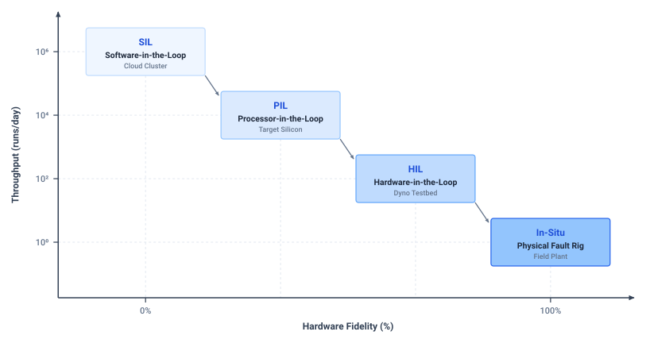{width="95%"}
:::

| Qualification Rung & Substrate                                     | Causal Loop Realism (Compute, Bus, Actuator, Plant)                                                                                                          | Fault Injection Mechanism & Scope                                                          | Throughput & Sample Scaling                                                                          | Physical & Temporal Fidelity                                                              | Primary Test Oracle & Evidentiary Limit                                                                                                                                                  |
|:-------------------------------------------------------------------|:-------------------------------------------------------------------------------------------------------------------------------------------------------------|:-------------------------------------------------------------------------------------------|:-----------------------------------------------------------------------------------------------------|:------------------------------------------------------------------------------------------|:-----------------------------------------------------------------------------------------------------------------------------------------------------------------------------------------|
| **Software-in-the-Loop (SIL)** (Host Workstation / Cloud Cluster)  | **Compute:** Synthetic / Host x86; **Bus:** Idealized zero-copy buffer; **Actuator:** Linear / saturation model; **Plant:** Numerical ODE/PDE solver         | Tensor bit-flips, synthetic sensor dropout, hydrodynamic parameter sweeps ($\mu, \rho, T$) | $10^3\text{--}10^5\times$ real-time parallel sweeps ($>10^8\text{ cycles/day}$)                      | High mathematical flexibility; zero target silicon, bus timing, or electrical realism     | **Oracle:** Mathematical assertion corridors and state invariants. **Limit:** Cannot validate target execution timing or unmodeled physical dynamics.                                    |
| **Processor-in-the-Loop (PIL)** (Target SoC / MCU Core Emulation)  | **Compute:** Real target silicon (ARM/RISC-V); **Bus:** Simulated bus interconnect; **Actuator:** Emulated command register; **Plant:** Real-time host model | Instruction cache evictions, register corruption via JTAG/BIST, interrupt jitter injection | $0.1\text{--}1.0\times$ real-time; bound by cross-platform synchronization                           | Instruction-set and compiler accurate; abstracts analog bus lines and actuator back-EMF   | **Oracle:** Target register state and WCET execution bounds. **Limit:** Ignores physical transceiver bus contention, voltage droop, and thermal rise.                                    |
| **Hardware-in-the-Loop (HIL)** (Target ECUs + Real-Time Plant Rig) | **Compute:** Production ECU / NPU; **Bus:** Real physical CAN/Ethernet; **Actuator:** Real motor drives / dyno; **Plant:** Hard real-time FPGA plant rig     | Pin break/short, CAN frame stuffing / babbling idiot, supply rail droop, load steps        | $1.0\times$ strict real-time ($24\text{ h/day}$ wall-clock limit)                                    | High electrical, timing, and protocol fidelity; bounded by FPGA plant model accuracy      | **Oracle:** Protocol CRC, bus deadline monitors, and interlock timings. **Limit:** Cannot execute destructive physical overload or simulate micro-cavitation wear.                       |
| **Physical Fault Rig & Shadow** (Dynamometer Cell / Field Plant)   | **Compute:** Production ECU / NPU; **Bus:** Production harness & sensors; **Actuator:** Real physical mechanisms; **Plant:** Real fluid / mechanical body    | Pyrotechnic valve jammers, magnetic brake stall, thermal heating, transducer bias drift    | $1.0\times$ wall-clock; constrained by mechanical wear and thermal reset ($<10^3\text{ cycles/day}$) | Full authentic physics (Coulomb friction, acoustic wave shock, thermal dissipation, wear) | **Oracle:** Independent physical containment instrumentation and yield transducers. **Limit:** High financial cost per trial; destructive tests cannot scale to statistical tail bounds. |

: **The Four-Stage Qualification Ladder across Cyber-Physical Boundaries**: Systematic decomposition of qualification environments across computing substrates, exercised causal-loop elements, fault injection primitives, execution throughput, physical and temporal fidelity, and definitive test oracle mechanisms. {#tbl-15-qualification-ladder tbl-colwidths="[16,22,16,14,16,16]"}

To prevent false confidence, every reported verification result must explicitly state which elements of the causal loop were physically real, which were simulated, which were replayed from static logs, which were bypassed, and which remained unobserved. An analytical engineering claim that an intervention mechanism halted an overpressure event within $12\text{ ms}$ means nothing without specifying whether the pressure signal was generated by a differential equation, transmitted over a physical analog current loop, or replayed from a digital buffer. Specifying this causal mapping exposes the assumptions underlying each test, ensuring that unmodeled physics or artificial boundary conditions do not disguise latent hazards.

::: {.column-margin .margin-pointer}
↰ **Prerequisite:** Microarchitectural stress patterns build directly on the memory contention benchmarks from @sec-placement-resource-contention.
:::

The fidelity boundary of a given test environment defines the exact threshold where synthetic models, emulated buses, or replayed sensor traces sever the continuous bidirectional energy and information exchange between compute and mechanics (@sec-boundary-causal-boundary).

To quantify this reality gap, consider the divergence between rigid-body physics simulation and physical hardware when an articulated joint encounters unmodeled Coulomb friction and actuator lag (\ref{exmp-verification-coulomb-friction-reality-gap}).[^fn-math-stiction-deadband]

[^fn-math-stiction-deadband]: **Actuator Stiction Deadband**\index{Actuator!stiction deadband}: Motor winding inductance and discrete current-loop update intervals prevent commanded torque from rising instantaneously. Before applied torque overcomes static breakaway friction ($\tau_c$), the joint remains mechanically immobilized for deadband duration $t_{\text{dead}} = \tau_{\text{lag}} \ln\left(\frac{\tau_{\text{cmd}}}{\tau_{\text{cmd}} - \tau_c}\right)$. This unmodeled phase lag erodes phase margin in high-gain feedback loops, triggering destructive limit-cycle chattering across contact boundaries.

```{python}
#| label: calc-verify-coulomb-stiction-deadband
#| echo: false
import math
from mlsysim.core.units import ureg, millisecond, kilogram, meter, second
from mlsysim.physics.robotics import calc_coulomb_stiction_deadband
from mlsysim.fmt import fmt, fmt_int, fmt_multiple, fmt_latency

class CoulombStictionDeadband:
    tau_cmd = 6.0 * (ureg.newton * meter)
    tau_c = 4.5 * (ureg.newton * meter)
    tau_lag = 5.0 * millisecond
    inertia = 0.050 * (kilogram * (meter**2))

    t_dead = calc_coulomb_stiction_deadband(
        commanded_torque=tau_cmd,
        coulomb_friction_torque=tau_c,
        stator_electrical_lag=tau_lag,
    )
    alpha_sim = (tau_cmd / inertia).to(ureg.radian / (second**2))
    tau_net_real = tau_cmd - tau_c
    alpha_real = (tau_net_real / inertia).to(ureg.radian / (second**2))

    t_eval = 50.0 * millisecond
    theta_sim = 0.5 * alpha_sim.magnitude * (t_eval.to(second).magnitude ** 2)
    t_active_real = (t_eval - t_dead).to(second).magnitude
    theta_real = 0.5 * alpha_real.magnitude * (t_active_real**2)
    delta_theta = abs(theta_sim - theta_real)

    theta_sim_deg = math.degrees(theta_sim)
    theta_real_deg = math.degrees(theta_real)
    delta_theta_deg = math.degrees(delta_theta)

    # ┌── 4. OUTPUT (Format & Export) ────────────────────────────────────────
    t_dead_ms_str = fmt_latency(t_dead, unit=millisecond, precision=2)
    alpha_sim_str = fmt_int(round(alpha_sim.magnitude))
    alpha_real_str = fmt_int(round(alpha_real.magnitude))
    accel_ratio_mult_str = fmt_multiple(round((alpha_sim / alpha_real).to_base_units().magnitude))

    t_active_ms_str = fmt_latency(t_active_real * 1000.0 * millisecond, unit=millisecond, precision=2)
    theta_sim_str = fmt(theta_sim, precision=4)
    theta_real_str = fmt(theta_real, precision=4)
    delta_theta_str = fmt(delta_theta, precision=4)

    theta_sim_deg_str = fmt(theta_sim_deg, precision=3)
    theta_real_deg_str = fmt(theta_real_deg, precision=3)
    delta_theta_deg_str = fmt_int(round(delta_theta_deg))
```

::: {#exmp-verification-coulomb-friction-reality-gap .callout-example title="Coulomb friction and stator lag reality gap"}
Consider a robotic manipulator arm trained in a rigid-body physics simulator (SIL) assuming an idealized joint actuator with linear viscous damping $b_{\text{sim}} = 0.10\text{ N}\cdot\text{s/rad}$ and zero static or Coulomb friction ($\tau_{\text{Coulomb}} = 0$). On physical hardware (HIL and in-situ test rig), the joint's cycloidal drive exhibits Coulomb breakaway friction $\tau_c = 4.50\text{ N}\cdot\text{m}$. Furthermore, the motor power stage exhibits an unmodeled stator electrical time constant $T_e = 3.50\text{ ms}$ and an inverter current-loop sampling delay of $1.50\text{ ms}$, producing an effective first-order torque buildup lag $\tau_{\text{lag}} = 5.00\text{ ms}$ such that applied torque follows $\tau(t) = \tau_{\text{cmd}}(1 - e^{-t/\tau_{\text{lag}}})$. When the policy commands a step torque $\tau_{\text{cmd}} = 6.00\text{ N}\cdot\text{m}$ to accelerate a load inertia $J = 0.050\text{ kg}\cdot\text{m}^2$ from rest ($\dot{\theta}(0) = 0$), dynamics diverge across three stages:

1. In simulation, with zero Coulomb threshold, the full torque accelerates the inertia at $t = 0^+$, yielding $\ddot{\theta}_{\text{sim}}(0^+) = \frac{\tau_{\text{cmd}}}{J} = \frac{6.00\text{ N}\cdot\text{m}}{0.050\text{ kg}\cdot\text{m}^2} =$ `{python} CoulombStictionDeadband.alpha_sim_str` $\text{rad/s}^2$. On physical hardware, motion is impossible until electromagnetic torque overcomes $\tau_c$. Once torque reaches the commanded $6.00\text{ N}\cdot\text{m}$, net accelerating torque is reduced by Coulomb friction to $\tau_{\text{net}} = \tau_{\text{cmd}} - \tau_c = 1.50\text{ N}\cdot\text{m}$, yielding steady acceleration of $\ddot{\theta}_{\text{real}} = \frac{1.50}{0.050} =$ `{python} CoulombStictionDeadband.alpha_real_str` $\text{rad/s}^2$—a fourfold reduction (`{python} CoulombStictionDeadband.accel_ratio_mult_str`) from simulation.
2. Motion initiates only when electromagnetic torque overcomes static stiction ($\tau_c$). With first-order torque buildup $\tau(t) = \tau_{\text{cmd}}(1 - e^{-t/\tau_{\text{lag}}})$, solving $\tau(t_{\text{dead}}) = \tau_c$ yields the exact deadband duration:
$$t_{\text{dead}} = \tau_{\text{lag}} \ln\left(\frac{\tau_{\text{cmd}}}{\tau_{\text{cmd}} - \tau_c}\right)$$ {#eq-verification-coulomb-deadtime}
Evaluating @eq-verification-coulomb-deadtime gives $t_{\text{dead}} = 5.00\text{ ms} \times \ln\left(\frac{6.00}{6.00 - 4.50}\right) = 5.00\text{ ms} \times \ln(4.0) \approx$ `{python} CoulombStictionDeadband.t_dead_ms_str`. During these initial `{python} CoulombStictionDeadband.t_dead_ms_str`, the real joint remains stationary ($\theta_{\text{real}} = 0$), whereas the simulation claims the joint has already reached $\theta_{\text{sim}}(t_{\text{dead}}) \approx \frac{1}{2} \ddot{\theta}_{\text{sim}} t_{\text{dead}}^2 \approx 2.88 \times 10^{-3}\text{ rad}$ ($0.165^\circ$).
3. At $t = 50.0\text{ ms}$ ($0.050\text{ s}$), the simulated trajectory reaches $\theta_{\text{sim}} \approx \frac{1}{2}(120.00)(0.050)^2 \approx$ `{python} CoulombStictionDeadband.theta_sim_str` $\text{rad}$ (`{python} CoulombStictionDeadband.theta_sim_deg_str`$^\circ$). On physical hardware, motion only occurs over the active duration $t' = t - t_{\text{dead}} = 50.0\text{ ms} - 6.93\text{ ms} =$ `{python} CoulombStictionDeadband.t_active_ms_str`, reaching $\theta_{\text{real}} \approx \frac{1}{2}(30.00)(0.04307\text{ s})^2 \approx$ `{python} CoulombStictionDeadband.theta_real_str` $\text{rad}$ (`{python} CoulombStictionDeadband.theta_real_deg_str`$^\circ$). The spatial tracking divergence between simulation and physical hardware is $\Delta \theta(t) = |\theta_{\text{sim}}(t) - \theta_{\text{real}}(t)|$, which evaluates at $50.0\text{ ms}$ to $\Delta \theta = |0.1500\text{ rad} - 0.0278\text{ rad}| =$ `{python} CoulombStictionDeadband.delta_theta_str` $\text{rad}$ (`{python} CoulombStictionDeadband.delta_theta_deg_str`$^\circ$).

A policy evaluated solely in SIL observes prompt motion and low tracking error, prompting its internal integrator to remain dormant. On physical hardware, the `{python} CoulombStictionDeadband.t_dead_ms_str` stick deadband causes integrator windup, followed by sudden breakaway and high-velocity overshoot that invalidates simulated safety claims.
:::

::: {#chk-verification-sim-to-real-reality-gap-dynamics .callout-checkpoint title="Sim-to-real reality gap and actuation lag"}

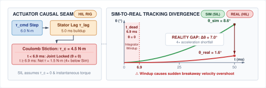{fig-alt="2D schematic illustrating the sim-to-real reality gap in actuator dynamics. The left panel diagrams the physical actuator causal seam: a 6.0 N·m step command passes through a 5.0 ms stator inductance buildup lag before encountering a 4.5 N·m Coulomb stiction threshold. The right panel plots joint position over 50 ms, contrasting idealized simulation against physical hardware. In simulation, motion begins immediately at t=0 and reaches 8.6 degrees at 120 rad/s². On real hardware, stiction enforces a 6.9 ms deadband where the joint remains completely stationary at zero degrees while the policy integrator winds up. After breakaway, net accelerating torque is reduced to 1.5 N·m, reaching only 1.6 degrees at 50 ms. This produces a 7.0 degree tracking divergence that precipitates violent breakaway velocity overshoot." width=100%}

Consider a robotic manipulator or articulated chassis transitioning from physics simulation to physical hardware:

- [ ] **Non-linear friction and dead-time latency**: Can you explain why omitting Coulomb breakaway friction in rigid-body simulation creates an unmodeled physical dead-time $t_{\text{dead}}$ during actuator torque buildup?
- [ ] **Sim-to-real spatial divergence**: Can you describe how actuator stator lag and friction thresholds combine to induce tracking divergence between simulation and physical hardware, even when identical torque setpoints are applied?
- [ ] **Integrator windup and overshoot**: Can you explain why a policy that passes all position overshoot invariants in simulation can experience violent breakaway and catastrophic overshoot on physical hardware?
:::

Once the test environment is defined and its causal boundaries are accounted for, the qualification process requires concrete mechanisms to evaluate whether the machine behavior during a fault injection constitutes a pass or a failure.

## Fault Oracles and Acceptance {#sec-verification-oracles-acceptance}

When a fault is injected into a running machine, the system will inevitably react, producing telemetry transients, actuator motions, and acoustic emissions. Without an unambiguous, pre-established oracle to evaluate those reactions, a test is merely an anecdote; engineers are left to evaluate the result by looking at time-series plots after the run, deciding whether the machine survived based on whether Joule heating\index{Joule heating!component failure} melted a phase wire, a component burst, or a controller threw an unhandled exception. An **oracle**\index{Oracle!definition} is the mathematical predicate that evaluates a test execution and returns a binary verdict of pass or fail, defined in full before the execution begins.

In physical AI systems, evaluating whether a machine satisfied its safety claims requires moving beyond static scalar bounds to continuous temporal specifications. Physical systems do not fail at single isolated instants; they fail through dynamic transients over time. To express and verify these dynamic properties rigorously, verification engineering uses **Signal Temporal Logic (STL)**\index{Signal Temporal Logic!definition}. By combining simple physical constraints (like keeping pressure below a limit) with logical combinations (AND, OR, NOT) and strict time windows, STL can formally state that a condition must "always" hold during a specified interval, must "eventually" happen within a deadline, or must persist "until" another event occurs (for formal syntax, see @sec-appendix-ml).

Crucially, STL equips verification with **quantitative robustness semantics**\index{Quantitative robustness semantics!definition}. Instead of a simple pass/fail flag, robustness is a continuous numerical score measuring *how far* the system remained from violating its safety margins.[^fn-math-stl-robustness]

[^fn-math-stl-robustness]: **Quantitative Robustness Semantics**\index{Quantitative robustness semantics!intuition}: Quantitative semantics maps temporal satisfaction to a signed real scalar representing clearance from the closest constraint boundary. A positive score measures the remaining physical safety margin, a negative score quantifies the depth of envelope violation, and zero denotes operation on the threshold of failure. In multi-property specifications, robustness composes via pointwise minimums across conjunctions, ensuring that whole-system evaluation tracks the most vulnerable physical invariant. In embodied robotic systems, this metric simultaneously tracks spatial clearance, velocity limits, and kinodynamic jerk bounds ($j_{\text{peak}} \le j_{\text{allowable}}$) to guarantee that smooth motion invariants are not breached during aggressive emergency interventions.

Consider a high-pressure manifold regulating coolant flow at $10.0\text{ bar}$ with a nominal throughput of $5.0\text{ L/s}$. When a downstream valve jams under a $15.0\text{ bar}$ head, the physical safety requirement might state that line pressure must never exceed a $16.5\text{ bar}$ containment limit, and whenever a disturbance occurs, the bypass flow must exceed $3.5\text{ L/s}$ within $45\text{ ms}$. If an injected fault causes the peak pressure to reach $17.2\text{ bar}$, the robustness score evaluates to $-0.7\text{ bar}$ (the difference between the limit and the peak), immediately quantifying the failure severity without manual inspection.

Quantitative semantics transforms whole-system verification from unguided random testing into **temporal logic falsification as adversarial optimization**\index{Temporal logic falsification!definition}. Because neural policies operate in high-dimensional state spaces—governed by SE(3) kinematics\index{SE(3) kinematics!dynamics} and gearbox compliance\index{Gearbox compliance!dynamics}—uniform random sampling requires an intractable number of trials to find rare failures. Instead, automated falsification engines actively search for the worst-case physical disturbances—such as sensor noise, voltage drops, and friction—that drive the robustness score as low as possible.

Falsification engines employ global black-box optimization algorithms (such as covariance matrix adaptation evolution strategies or Bayesian optimization) to navigate messy, discontinuous cyber-physical landscapes. In simulation environments that support it, they can even use exact gradients computed directly through the physics models and neural network layers to steer the system toward failure faster. When the engine successfully drives the robustness score below zero, it produces a concrete counterexample trajectory, exposing the exact combination of disturbances and delays that breaks the machine.

Beyond black-box falsification, formal neural network verification methods—exemplified by the Reluplex SMT solver [@katz2017reluplex] and abstract interpretation frameworks—attempt to formally prove that piecewise linear networks satisfy state-space safety invariants (e.g., proving that for all states in an admissible set $\mathcal{X}$, the network output never intersects an unsafe control domain $\mathcal{U}_{\text{unsafe}}$ bounded by ISO 10218 / ISO/TS 15066 safety envelopes\index{ISO 10218!safety envelope} and actuator torque limits\index{Actuator torque limits!safety bounds}). Formal SMT solvers face NP-complete complexity due to exponential state-space expansion with network depth and scale poorly beyond small feedforward networks or closed-loop dynamics. Consequently, physical AI verification cannot rely on formal proof alone; it must combine formal bounds with automated temporal logic falsification, empirical hardware fault injection, and out-of-band runtime enforcement.

Alongside the pass and fail criteria, automated verification requires an **invalid-test rule**\index{Invalid-test rule!definition} that identifies when an experimental run must be discarded rather than scored. A test run is invalid whenever the execution environment fails to deliver the specified fault conditions or violates the required operational preconditions. If an upstream supply pump cavitates before the planned fault injection timestamp, lowering the baseline manifold pressure to $6.0\text{ bar}$ instead of the required $10.0\text{ bar} \pm 0.2\text{ bar}$, the test did not evaluate the safety envelope under high-head conditions. Similarly, if an injection framework injecting corrupted CAN frames suffers an internal queue overflow and drops the fault packet before it reaches the transceiver, the system under test was never subjected to the disturbance. Scoring an unexercised run as a pass manufactures false confidence, while scoring it as a failure penalizes the machine for an error in the test fixture. The invalid-test rule codifies the boundary conditions, rejecting the run and resetting the test sequence whenever preconditions fail.

Precommitment is the engineering discipline that separates verifiable evidence from post-hoc storytelling. When an assembled machine undergoes physical or electrical fault injection, the resulting behavior is almost always noisy, complex, and surprising. If acceptance criteria are negotiated post-observation, engineers rationalize anomalies. An unexpected pressure oscillation of $17.5\text{ bar}$ is explained away as an acceptable structural surge, or a $60\text{ ms}$ reaction delay is excused because the system eventually brought the flow back to steady state without tripping the mechanical burst disc. Post-hoc evaluation converts safety verification into a negotiation, where the definition of success drifts to match whatever the machine happened to do.

Precommitment demands that the STL specification, the robustness evaluation logic, the response-time bounds, and the invalidation triggers are compiled into immutable test code before the first injection run is scheduled. When the test executes, the automated evaluation framework samples the instrumentation, computes the overall robustness score, and outputs a deterministic verdict without human intervention. If the machine breaches the precommitted state boundary by $0.1\text{ bar}$ or exceeds the response deadline by $2\text{ ms}$, the run is recorded as a failure, pointing directly to an inadequate control margin, unmodeled stator delays\index{Stator delay!control margin}, thermal derating\index{Thermal derating!diagnostics}, or a slow diagnostic filter hampered by SerDes bandwidth\index{SerDes bandwidth!diagnostics} limits and bus jitter\index{Bus jitter!diagnostics}.

Establishing precommitted oracles and quantitative temporal logic boundaries transforms fault injection from a qualitative demonstration into a quantitative measurement of system margins. Yet the validity of that measurement remains entirely dependent on whether the injected disturbances and the monitored reactions interact through real physical dynamics or through mathematical approximations. Defining the exact boundaries of a valid test and the criteria for success prepares the engineering team to confront the physical machine itself, where synthetic models give way to the unyielding mechanics of real hardware.

::: {#chk-verification-temporal-logic-oracles-and-falsification .callout-checkpoint title="Temporal logic oracles and test precommitment"}
- [ ] **Quantitative robustness interpretation**: Can you explain how Signal Temporal Logic replaces binary pass/fail assertions with a signed distance metric, and how a negative score quantifies physical failure depth?
- [ ] **Adversarial optimization of disturbance trajectories**: Can you describe how black-box optimizers leverage quantitative robustness scores to discover worst-case combinations of latency, noise, and friction?
- [ ] **Test invalidation versus failure criteria**: Can you distinguish between an execution that falsifies a safety invariant and an invalid trial where testbed preconditions or fault injection mechanisms failed?
:::

## Fault Injection on Hardware {#sec-verification-hardware-fault-injection}

A fault injected in simulation tests the simulator's response. When a disturbance is synthesized inside a mathematical model, the software reacts against the numerical assumptions that the modeler wrote down. Digital simulations assume ideal clock synchronization, perfectly isolated memory addresses, deterministic context switches, and linear communication delays across shared interconnects. In the physical machine, faults do not execute inside isolated functions. They propagate across physical silicon, where memory access contention on a shared system bus, clock drift between asynchronous microcontrollers, direct memory access stalls, and voltage drops across inductive actuator drivers dictate whether an intervention executes in time. Fault injection must occur directly on target hardware during production handoff, driving disturbances through physical transceivers, timers, shared buses, and the hardware enforcement path, while an independent containment rig protects the test facility.

**In-situ fault injection**\index{In-situ fault injection!definition} is the deliberate, deterministic introduction of physical, electrical, and computational disturbances (including sensor register latches, clock drift, bus contention,[^fn-hw-seu-radiation] supply brownouts, and actuator load stalls) directly into target production silicon and mechanics while operating under authentic electrical, thermal, and dynamic loads.

Full-scale hardware-in-the-loop (HIL)\index{Hardware-in-the-loop} test facilities (@fig-15-hil-avionics-testbed) bridge this reality gap by mounting production Electronic Control Units (ECUs) and actuator drivers in their authentic physical flight geometry, connecting real line-replaceable units through physical wiring harnesses, power distribution channels, and breakout interfaces to real-time fault-injection racks.

::: {#fig-15-hil-avionics-testbed fig-env="figure" fig-pos="t" fig-cap="**Avionics Hardware-in-the-Loop Testbed and In-Situ Fault Injection**: Production line-replaceable units mounted around a full-scale flight-geometry ring at NASA Marshall, annotated across four qualification subsystems: (1) structural avionics ring matching authentic chassis wire lengths and ground plane impedance, (2) production Actuator Control Units (ACUs) running 1--10 kHz servo loops subject to 1.0 ms fallback deadlines under hydraulic stalls, (3) heavy-gauge DC power and fieldbus wire harness subject to inductive switching droops $\Delta V = L (dI/dt)$, and (4) real-time fault injection breakout interface introducing deterministic bit-flips, bus contention, and pin disconnects directly into physical silicon. (Attribution: NASA Marshall Space Flight Center, Public Domain)." fig-alt="Annotated photographic plate of the NASA Marshall full-scale HIL avionics test ring showing four crisp rectangular callout cards: (1) Flight-Geometry Structural Avionics Ring, (2) Production Actuator Control Units, (3) Heavy-Gauge Power and Fieldbus Wire Harness, and (4) Real-Time Fault Injection Breakout Interface."}
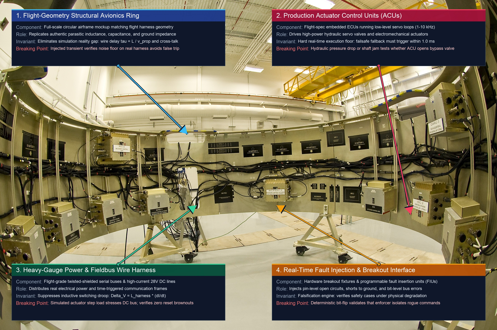{width="85%"}
:::

::: {#psp-verification-testbed-instrumentation-architecture .callout-perspective title="Testbed instrumentation architecture"}
Physical testbed verification requires dedicated bench instrumentation engineered to intercept, corrupt, and observe signals without altering circuit impedance or timing characteristics. A fully instrumented physical AI verification testbed integrates five specialized hardware subsystems:

1. **High-Bandwidth Digital Storage Oscilloscopes (DSOs) and Logic Analyzers:** Synchronized across common $10\text{ MHz}$ reference clocks to capture microsecond-level transitions across SPI, CAN, and gate-driver PWM lines.
2. **Inline Breakout Injection Boxes:** Equipped with solid-state Field-Effect Transistor (FET) switches capable of sub-microsecond pin-level open-circuit disconnections, short-to-ground (simulating a chassis ground fault), and short-to-power (simulating cross-rail short circuits).
3. **Programmable Fieldbus Disturbance Nodes:** Dedicated microcontrollers capable of injecting bit-level CAN frame stuffing, cyclic redundancy check (CRC) corruptions, and unthrottled babbling-idiot message floods (where a malfunctioning node continuously transmits unthrottled frames, choking the network).
4. **Precision Programmable DC Power Supplies and Electronic Loads:** Capable of synthesizing fast supply rail droops ($V_{\text{core}} < 0.85\text{ V}$), ground bounce (momentary reference plane potential shifts), and peak current surges during rotor startup under dynamic motor loading.
5. **External Truth Transducers:** Laser Doppler vibrometers, optical shaft encoders, and high-speed photogrammetric cameras wired to isolated digitizers, recording ground-truth physical motion independent of the embedded controllers under test.
:::

Consider the high-pressure fluid regulation loop from @sec-verification-operating-envelope, where an electric control valve regulates a mass flow rate of $4.2\text{ kg/s}$ across a differential pressure of $15.0\text{ bar}$ into the $0.10\text{ m}^3$ ($100.0\text{ L}$) buffer tank. In this analytical example, with an effective fluid bulk modulus of $1.6\times 10^9\text{ Pa}$, if the valve stem shifts unexpectedly by $2.0\text{ mm}$ (inducing a mass flow imbalance of $0.50\text{ kg/s}$), downstream pressure rises at an analytical rate of $80.0\text{ bar/s}$, which consumes the entire $0.8\text{ bar}$ allowable transient margin in exactly $10\text{ ms}$. In a digital simulator, verifying that the nervous system catches this excursion requires only checking an assertion statement. On production silicon, verifying the response requires injecting the disturbance into the physical sensor interface. When the test fixture injects a stale observation by holding the analog-to-digital converter (ADC) output constant while maintaining the original acquisition timestamp, the test evaluates whether the freshness detector on the real-time safety microcontroller (MCU) identifies the stall within its budgeted $P_{99}$ latency of $4.0\text{ ms}$. If the detector relies on a software timer that shares an interrupt line with a busy network interface, the arrival of background telemetry can delay the interrupt handler by $8\text{ ms}$, allowing the stale state estimate to persist until the pressure breaches the physical containment boundary.

Testing the heterogeneous Dual-Brain architecture\index{Dual-Brain architecture} (@sec-brain-embodied) demands physical fault injection directly at their inter-processor boundary:

- **Stale Observation Injection:** An inline FPGA interceptor latches an ADC register or suppresses CAN frame updates while preserving the original hardware timestamp. This evaluates whether the MCU's temporal freshness monitor detects the frozen observation within its $\Delta t_{\text{det}} \le 4.0\text{ ms}$ budget before stale state estimates degrade actuator commands.
- **Acoustic Transducer Resonance Spoofing:** An ultrasonic acoustic emitter targets the micro-machined resonant frequency ($20\text{--}35\text{ kHz}$) of MEMS gyroscopes. The acoustic pressure waves excite physical oscillations in the micro-silicon capacitive combs, overriding Coriolis deflection and saturating the analog front-end. The IMU reports false zero-rotation or rails at maximum angular velocity. The test verifies that the sensor fusion estimator detects cross-modal discrepancy against wheel odometry or optical flow within its $10\text{ ms}$ budget, rejecting the corrupted IMU channel before attitude control destabilizes.
- **Sub-7nm Accelerator Soft Error (SEU) Injection:** Direct register injection or scan-chain tools flip bits in the neural accelerator's activation SRAM or weight caches, replicating single-event upsets caused by atmospheric cosmic neutron strikes in sub-$7\text{ nm}$ FinFET and Gate-All-Around (GAA) silicon.[^fn-hw-seu-radiation] A single bit flip in a float16 exponent converts a minor path correction into a catastrophic full-scale torque setpoint. The test verifies that the downstream Layer 2 safety shield intercepts and clamps the uncommanded torque impulse within a single $1.0\text{ ms}$ control period before motor stator current can stress mechanical gear teeth.
- **Late Plan Injection:** The injection testbed delays neural trajectory proposals across the MPU-to-MCU shared memory bridge. If a proposal scheduled for execution at $t = 100\text{ ms}$ arrives at $t = 106\text{ ms}$, the test verifies that the MCU's deterministic scheduler instantly refuses the late submission, clamps the actuator to a precommitted safe hold position, and transitions the loop to deterministic fallback before physical vessel margins expire.
- **Expired Intent Lease Revocation:** The test framework deliberately suppresses the cryptographic lease renewal packet transmitted by the Linux MPU. The verification oracle confirms that the MCU hardware gate revokes proposal authority on the exact clock cycle of lease expiry ($t = 20.0\text{ ms}$ in @fig-15-hardware-fault-injection), immediately dropping un-leased commands even if their setpoints appear numerically plausible and smooth.

Recording the resulting state trajectory, the detector identity, the exact refusal timestamp, and the time required to restore the bounded state requires instrumentation that is electrically and logically independent of the machine under test. If the test engineer relies on the onboard logging daemon to measure reaction times, the measurement is corrupted by the very failure it attempts to capture, because a faulted CPU or a saturated bus delays log serialization.[^fn-hw-trace-instrumentation] Furthermore, independent measurement prevents the acceptance of false passes where the machine survived for reasons absent from the safety claim. A documented example occurred during ground qualification testing of the Apollo guidance computer, where simulated testing failed to uncover an asynchronous memory-bus stealing flaw caused by the rendezvous radar interface; in flight, the hardware stole 15 percent of all memory cycles, triggering the famous 1202 and 1201 alarm conditions.[^fn-inc-apollo-1202] An even simpler failure mode on modern test benches occurs when an injected overpressure fault triggers an unmonitored thermal breaker or an auxiliary ground loop that drops power to the valve drive coil. The valve springs shut mechanically, keeping pressure inside the containment bound, while the software enforcer has actually deadlocked in a priority inversion.[^fn-inc-toyota-ua] An automated oracle that only inspects downstream pressure registers a pass, manufacturing false confidence from an unverified hardware artifact. The test framework must verify that the enforcer path in the safety claim executed the corrective action.

[^fn-hw-trace-instrumentation]: **Non-Intrusive Hardware Tracing**\index{Hardware tracing!CoreSight ETM}: Non-intrusive tracing utilizes dedicated silicon hardware debug blocks (such as ARM CoreSight Embedded Trace Macrocell) and external FPGA bus sniffers that snoop internal bus transactions without stealing CPU execution cycles. By buffering execution traces in dedicated high-speed SRAM decoupled from the system memory bus, hardware analyzers capture cycle-accurate fault-reaction timestamps without perturbing real-time thread schedules. Relying on software logging daemons introduces Heisenberg observer effects, where logging overhead masks the exact race conditions under test.

[^fn-hw-seu-radiation]: **Silent Data Corruption from Single-Event Upsets**\index{Single-Event Upset!accelerator soft errors}\index{Single-Event Upset!multi-bit upsets}\index{Error-correcting code!SECDED}: High-density neural accelerators manufactured on sub-$7\text{ nm}$ FinFET processes have critical node charges ($Q_{\text{crit}}$) so low that atmospheric neutron strikes and alpha particles flip register bits. In legacy planar CMOS, single-bit upsets (SBUs) were effectively mitigated by Single-Error Correction Double-Error Detection (SECDED) Hamming codes. However, as physical cell pitch contracts below $30\text{ nm}$ in sub-$7\text{ nm}$ FinFET and GAA architectures, a single ionizing particle strike deposits a charge cloud spanning multiple adjacent bit cells, producing **Multi-Bit Upsets (MBUs)**. When two or more bits within the same code word flip simultaneously, standard SECDED ECC either detects an uncorrectable fault and halts execution or suffers silent bit aliasing. In consumer-grade accelerators lacking physical bit interleaving (spreading logically adjacent code word bits across physically separated memory columns) and dual-core lockstep (DCLS) logic with temporal staggering, soft errors silently corrupt policy tensors without triggering hardware exceptions. In-situ fault injection frameworks must inject transient single-bit and multi-bit flips directly into accelerator memory spaces to verify that downstream kinematic shields detect uncommanded torque jumps before mechanical yield occurs.

[^fn-inc-apollo-1202]: **Apollo 11 AGC Executive Priority**\index{Apollo 11!AGC 1202 alarm}: Designed by Margaret Hamilton's software engineering team at MIT, the Apollo Guidance Computer deployed an asynchronous, priority-scheduled executive that dropped low-priority display cycles to protect vital navigation loops. The rendezvous radar interface stole memory cycles directly through hardware counter registers without CPU instruction execution, masking the bus contention during ground simulation. Without deterministic priority shedding, thread execution jitter would have delayed descent-engine throttling past physical stability limits.

[^fn-inc-toyota-ua]: **Toyota Unintended Acceleration Architecture Flaw**\index{Unintended Acceleration!watchdog refresh}: Forensic analysis in *Bookout v. Toyota* (2013) revealed unbounded stack growth and a critical architectural flaw: the hardware watchdog timer was refreshed by an asynchronous operating system monitor task that continued executing after the primary throttle control task had died. Because the supervisor only evaluated CPU liveness rather than control loop invariants, wide-open throttle commands persisted without reset. The failure demonstrates why safety watchdogs must monitor task-specific execution deadlines rather than generic kernel heartbeats.

::: {#fig-15-hardware-fault-injection fig-env="figure" fig-pos="t" fig-cap="**Hardware Fault Injection Timeline**: A cryptographic intent lease expiry and simultaneous latched sensor register fault injected at $20.0\text{ ms}$, stale-observation detection $4.0\text{ ms}$ later at $24.0\text{ ms}$, and hardware preemption of the gate drivers $2.0\text{ ms}$ after that at $26.0\text{ ms}$, arresting manifold pressure at $16.2\text{ bar}$ under a $16.5\text{ bar}$ limit. The trace is the containment argument in measured form, since every interval in it was budgeted in advance and the margin that survives is what the budget bought." fig-alt="Real-Time Hardware Fault Injection and Deterministic Intervention Timeline. Multi-channel timing schematic capturing fault containment across five channels: ADC Sensor, Intent Lease, Safety NMI, Gate Mux, and Manifold Pressure. At 20 ms, a sensor stall and intent lease expiration are injected. At 24 ms, the MCU diagnostic monitor detects the stale observation and asserts NMI. At 26 ms, the hardware multiplexer preempts gate drivers to safety mode. Downstream manifold pressure surges but is safely arrested at 16.2 bar, remaining strictly within the 16.5 bar containment limit, and reaches a safe state at 43 ms before the 45 ms deadline. Attribution: Original textbook graphic, CC BY 4.0."}
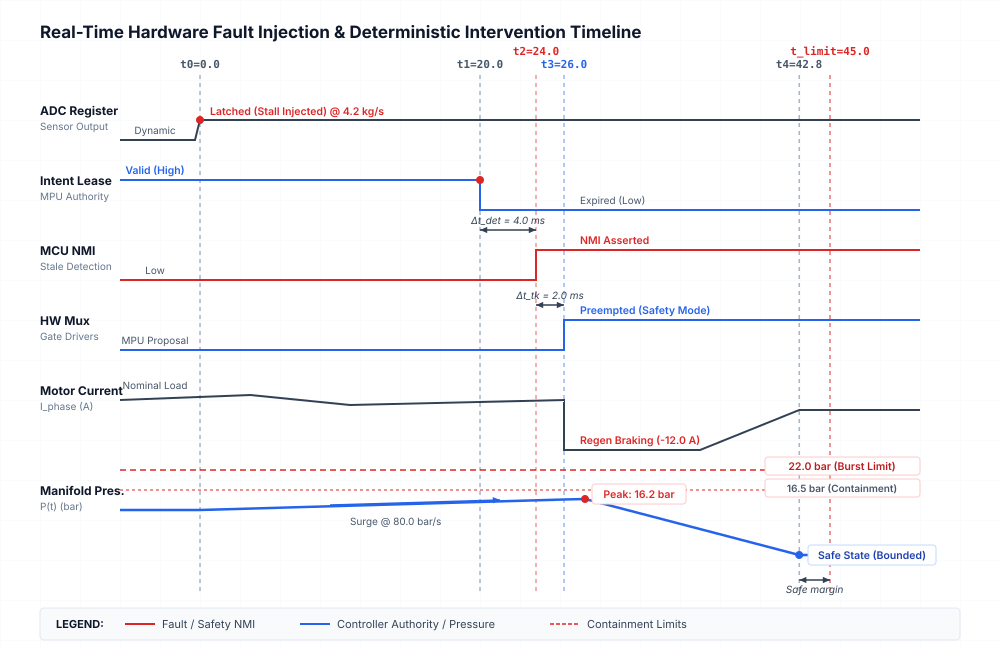{width="95%"}
:::

::: {#ws-verification-toyota-unintended-acceleration-limits-task-blind .callout-war-story title="Toyota unintended acceleration (2005)"}
**Context**: Toyota Electronic Throttle Control System (ETCS-i), running on a 32-bit microcontroller without task-isolated memory spaces. It governed the throttle valve position without a mechanical linkage to the driver's pedal.

**Mechanism**: According to expert testimony in *Bookout v. Toyota*, the system suffered memory corruption from stack overflow and unprotected shared variables, crashing the specific software task that governed the throttle angle. Crucially, the hardware watchdog timer\index{Watchdog timer} was serviced by a background OS tick rather than verifying that the critical throttle task had met its deadline. The watchdog never reset the system because the background task kept running [@barr2013toyota].

**Impact**: Vehicles accelerated to wide-open throttle uncommanded. Because the software torque demand was electromechanically coupled to the throttle butterfly valve without a mechanical override, pumping or standing on the mechanical brake pedal was insufficient to overcome full engine torque, resulting in catastrophic high-speed collisions.

**Response**: Modern cyber-physical architectures enforce strict spatial memory isolation (MMUs) and decouple safety reflexes onto entirely independent real-time microcontrollers (the "Dual-Brain" architecture). Hardware brake-override logic is now mandated to sever power stage gate drivers physically.

**Systems lesson**: A software watchdog that monitors overall CPU liveness rather than individual task invariants is a fatal architectural illusion for physical AI. An ML policy or control task can die, leaving heavy actuators locked at maximum destructive power, while the OS watchdog continues reporting nominal health.
:::

::: {#psp-verification-watchdog-liveness .callout-perspective title="The watchdog liveness invariant"}
A software watchdog timer that monitors only overall CPU execution verifies merely that silicon has electrical power; safety requires independent windowed watchdogs that verify the deterministic execution cadence and invariant assertions of every individual critical task.
:::

The intervention mechanism must be subjected to fault injection under the exact operational conditions that make intervention necessary. A safety enforcer that takes over cleanly when the system sits idle on a test bench provides no evidence of safety in production. During an operational crisis, the learned policy is typically running at maximum computational throughput, memory buses are saturated with high-resolution sensory streams, direct memory access channels are transferring frame buffers, and the actuator is experiencing maximum hydrodynamic load. The test framework must inject faults while the processor is under peak thermal and electrical stress, verifying that the hardware multiplexer can preempt the proposal path, flush the command buffers, and assert control over the valve driver within the $P_{99}$ deadline of $2.0\text{ ms}$ (@fig-15-hardware-fault-injection). If the intervention path shares an internal bus arbiter with the neural accelerator, the hardware takeover can stall behind an un-preemptible burst transfer. A machine whose safety case assumes instantaneous takeover will fail in the field if that takeover was only ever verified on a quiet bus.

::: {.column-margin .margin-pointer}
↳ **Downstream:** Hardware-in-the-loop stress results furnish the evidentiary warrants for safety cases in @sec-release-safety-cases-claims.
:::

The complete deterministic protocol for conducting automated hardware-in-the-loop fault injection, verifying real-time detection invariants, and evaluating quantitative Signal Temporal Logic robustness on target silicon is formalized below:

**Substrate & Invariants:**

- *Execution Substrate:* Hard real-time FPGA plant rig and testbed orchestrator ($f = 1000\text{ Hz}$, hardware timestamping jitter $< 500\text{ ns}$).
- *Memory Invariant:* Pre-allocated static DMA buffers in host test orchestrator; zero runtime dynamic heap allocation on safety MCU.
- *Safety Interlock Authority:* Independent optical/laser truth sensors wired to hardware crowbar relays capable of cutting target actuator power within $2.0\text{ ms}$ upon physical envelope breach.

*Execution protocol:*

1. **Pre-Execution Invariant & Envelope Precondition Audit (Stage 1):**
   Sample baseline environmental sensors via $\mathcal{I}_{\text{truth}}$ (ambient temperature $T_{\text{amb}}$, supply rail voltage $V_{\text{bus}}$, baseline fluid pressure $P_0$). Verify environmental vector matches declared operating point: $\|\mathbf{w}_{\text{meas}} - \mathbf{w}_{\text{env}}\| \le \boldsymbol{\epsilon}_{\text{env}}$. If preconditions are violated, log `ERR_PRECONDITION_OUT_OF_SPEC`, set $\text{Verdict} \leftarrow \text{INVALID\_PRECONDITION}$, and abort.

2. **Baseline Closed-Loop Synchronization & Steady-State Arming (Stage 2):**
   Arm FPGA plant simulator and power up target Dual-Brain system-on-chip (SoC); initiate periodic control loop ($1000\text{ Hz}$). Establish synchronized reference clock across logic analyzer, FPGA plant, and truth digitizers via $10\text{ MHz}$ PXI clock. Allow physical plant state $\mathbf{x}(t)$ to stabilize in nominal operating envelope for $t_{\text{settle}} = 2.000\text{ s}$. If baseline tracking error $\|e_{\text{track}}\| > \epsilon_{\text{nom}}$, assert `ERR_BENCH_INSTABILITY`, set $\text{Verdict} \leftarrow \text{INVALID\_PRECONDITION}$, and abort.

3. **Deterministic In-Situ Fault Injection Trigger (Stage 3):**
   At monotonic test epoch $t_{\text{inject}}$, hardware test orchestrator asserts trigger line to inline injection rig:

   - *Sensor Latency/Bias:* FPGA interceptor latches ADC register or holds stale CAN payload while preserving valid hardware timestamp.
   - *Acoustic Sensor Resonance:* Ultrasonic transducer pulses resonant acoustic frequency ($25\text{ kHz}$) directly at MEMS IMU die.
   - *Accelerator Single-Event Upset:* Scan-chain fixture injects pseudo-random bit flip into neural accelerator activation SRAM.
   - *Bus Contention / Frame Stuffing:* Fieldbus disturbance node floods CAN bus with dominant identifier bits (98 percent bus load).
   - *Power Rail Droop:* Programmable electronic load pulls $V_{\text{core}}$ down from $1.10\text{ V}$ to $0.82\text{ V}$ for $\Delta t_{\text{duration}} = 5.0\text{ ms}$.
   - *Actuator Mechanical Stall:* 4-quadrant dynamometer applies step counter-torque $\tau_{\text{stall}} = 3.5 \times \tau_{\text{rated}}$.
   Record microsecond injection timestamp $t_{\text{fault\_start}} \leftarrow t_{\text{now}}$.

4. **Real-Time Safety Enforcer Response & Takeover Audit (Stage 4):**
   Monitor target MCU safety enforcer pins, CAN bus telemetry, and gate-driver PWM lines via isolated logic analyzer:

   - Detect assertion of Non-Maskable Interrupt (NMI) / diagnostic flag: $t_{\text{det}} \leftarrow t_{\text{now}} \implies \Delta t_{\text{det}} = t_{\text{det}} - t_{\text{fault\_start}}$.
   - Detect hardware multiplexer preemption of motor driver: $t_{\text{takeover}} \leftarrow t_{\text{now}} \implies \Delta t_{\text{takeover}} = t_{\text{takeover}} - t_{\text{fault\_start}}$.
   - Detect physical plant transition to safe bounded regime: $t_{\text{bounded}} \leftarrow t_{\text{now}} \implies \Delta t_{\text{bounded}} = t_{\text{bounded}} - t_{\text{fault\_start}}$.
   If external containment rig trips due to structural envelope breach: hardware crowbar cuts actuator power; assert `ERR_PHYSICAL_BREACH`.

5. **Quantitative STL Robustness Evaluation & Ledger Serialization (Stage 5):**
   Ingest continuous truth trajectory $\mathbf{x}_{\text{obs}}(t)$ from independent instrumentation $\mathcal{I}_{\text{truth}}$ over $t \in [0, T_{\text{trial}}]$. Check telemetry integrity; if truth frames were dropped or DMA buffers overflowed, set $\text{Verdict} \leftarrow \text{UNOBSERVABLE\_TELEMETRY}$, serialize partial trace, and return. Compute the quantitative robustness score based on the observed trajectory (see @sec-appendix-ml).
   If the quantitative robustness score $\rho > 0$ and measured latencies satisfy both $\Delta t_{\text{det}} \le \tau_{\text{det\_max}}$ and $\Delta t_{\text{takeover}} \le \tau_{\text{takeover\_max}}$, set $\text{Verdict} \leftarrow \text{PASS}$; else set $\text{Verdict} \leftarrow \text{FAIL}$. Assemble immutable `FaultExecutionRecord_t` record, sign with Ed25519 hardware key, append to engineering notebook, and return.

Testing distributed cyber-physical loops also exposes subtle temporal vulnerabilities that cannot be captured by static functional tests. In a distributed Dual-Brain architecture, perception and high-level trajectory planning execute on a Linux MPU, while a dedicated ARM Cortex-R5F safety microcontroller runs a $1.0\text{ kHz}$ safety enforcer loop ($T_{\text{loop}} = 1.00\text{ ms}$). Because each computing unit operates from an independent local crystal oscillator—with tolerances of $\pm 50\text{ ppm}$ ($\pm 50\,\mu\text{s/s}$) for the MCU and $\pm 100\text{ ppm}$ for the MPU—chassis thermal gradients ($\Delta f_{\text{therm}} = 50\text{ ppm}$) create a combined worst-case relative clock drift rate:
$$\delta_{\text{skew}} = 50\text{ ppm} + 100\text{ ppm} + 50\text{ ppm} = 200\text{ ppm} = 200\,\mu\text{s/s} = 0.200\text{ ms/s}$$
If the safety enforcer tolerates a maximum observation phase error $\Delta t_{\text{phase,max}} = 500\,\mu\text{s}$ before state extrapolation induces false emergency interventions, free-running unassisted operation exhausts this timing margin in:
$$T_{\text{drift}} = \frac{\Delta t_{\text{phase,max}}}{\delta_{\text{skew}}} = \frac{500\,\mu\text{s}}{200\,\mu\text{s/s}} = 2.50\text{ s}$$
Under nominal conditions, periodic IEEE 1588 Precision Time Protocol (PTP) synchronization packets across TSN Ethernet at $T_{\text{sync}} = 100\text{ ms}$ ($10\text{ Hz}$) limit inter-frame drift to $\Delta t_{\text{drift,inter}} = \delta_{\text{skew}} \cdot T_{\text{sync}} = 20.0\,\mu\text{s}$. Adding network queuing jitter $\sigma_{\text{jitter}} = 15.0\,\mu\text{s}$ yields a nominal inter-sync phase error $\Delta t_{\text{sync,max}} = 35.0\,\mu\text{s} \ll 500\,\mu\text{s}$ ($14.3\times$ safety factor).

During adversarial HIL fault injection, however, a babbling-idiot fault node on the Ethernet bus floods the switch, causing the MPU to drop three consecutive PTP sync frames. The unsynchronized blackout duration extends across four sync periods ($\Delta T_{\text{blackout}} = 4 \times 100\text{ ms} = 400\text{ ms}$). Combining the blackout drift with baseline network jitter defines the peak clock drift invariant in @eq-verification-clock-drift:
$$\Delta t_{\text{peak}} = \delta_{\text{skew}} \cdot \Delta T_{\text{blackout}} + \sigma_{\text{jitter}} = (200\,\mu\text{s/s} \times 0.40\text{ s}) + 15.0\,\mu\text{s} = 95.0\,\mu\text{s}$$ {#eq-verification-clock-drift}
When an emergency stop requires front and rear electro-hydraulic brake calipers to actuate synchronously within a maximum differential delay of $\Delta t_{\text{caliper}} = 100.0\,\mu\text{s}$, @eq-verification-clock-drift reveals that peak drift consumes 95 percent of the allowable synchrony budget, leaving only $5.0\,\mu\text{s}$ of margin. An additional single dropped frame ($\Delta T_{\text{blackout}} = 500\text{ ms} \implies \Delta t_{\text{peak}} = 115\,\mu\text{s}$) or a $10\,\mu\text{s}$ interrupt latency tail will exceed the caliper alignment threshold, triggering asynchronous braking and inducing an uncommanded yaw moment that destabilizes vehicle dynamics.

::: {#chk-verification-hil-clock-drift-and-sensor-jitter-budget .callout-checkpoint title="HIL clock drift and sensor jitter budget"}

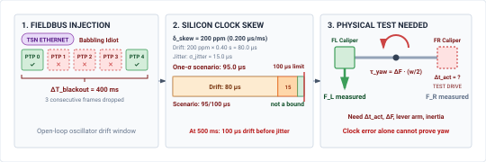{fig-alt="Three-stage 2D schematic demonstrating how fieldbus fault injection causes physical vehicle yaw destabilization through clock drift. Sub-card 1 illustrates a babbling-idiot fault node flooding the TSN Ethernet bus, dropping three consecutive PTP synchronization frames and creating a 400 ms blackout window. Sub-card 2 diagrams the silicon clock skew budget: local crystal oscillators drifting at 200 ppm accumulate 80.0 microseconds of drift, plus 15.0 microseconds of network jitter, totaling 95.0 microseconds of peak skew. This consumes 95% of the 100 microsecond caliper synchrony deadline, leaving only 5 microseconds of margin. Sub-card 3 shows the physical consequence on vehicle braking calipers: the front-left caliper clamps on schedule with maximum force, while the front-right caliper lags by 95 microseconds with zero braking force. The resulting asymmetric differential force produces an uncommanded vehicle yaw moment that causes dangerous vehicle spin." width=100%}

- [ ] **Distributed clock drift accumulation**: Can you explain why independent crystal oscillators subject to thermal gradients diverge linearly over time, and how an unmitigated skew rate consumes state estimation phase margins?
- [ ] **Network packet drop and timing blackouts**: Can you describe the mechanism by which network congestion or adversarial packet flooding transforms periodic PTP synchronization into an open-loop drift window?
- [ ] **Asymmetric mechanical consequences of timing skew**: Can you distinguish between a purely digital timestamp discrepancy and its physical manifestation when multiple high-bandwidth actuators must clamp simultaneously?
:::

## The Fault Manifest {#sec-verification-fault-manifest}

The engineering notebook tracks components, software artifacts, and execution traces under the provenance and versioning rules established in @sec-nervous-handoffs-matrix. The notebook requires a data structure that binds every injected fault to the claim it challenges. The **fault record**\index{Fault record!definition} records nine mandatory fields for each experimental trial, comprising the safety claim under attack, the precise operating envelope point, the injected fault magnitude and duration, the target hardware and software build versions, the raw sensor and bus telemetry trace, the primary detector that caught the anomaly, the measured intervention response time, the final physical outcome, and any secondary hardware anomalies. In an active flow regulator, for instance, a complete entry records that safety claim C-04 (containment under upstream supply surge) was attacked at an operating envelope point of $350\text{ kPa}$ inlet pressure and $45^\circ\text{C}$ fluid temperature. The fault was an analytical step command forcing a $24\text{ V}$ override on the valve driver for $120\text{ ms}$, applied to controller firmware revision 3.4.1 running on board revision B. The primary detector was an independent pressure-gradient monitor, the response took $1.8\text{ ms}$, the physical outcome was containment maintained below $380\text{ kPa}$, and no thermal derating\index{Thermal derating}, breaker trips, or bus retries occurred.

A verification log that records only passes and failures incentivizes discarding corrupted experiments, biasing the resulting evidence. An injected communication fault on the controller bus that corrupts the logging daemon or causes an external digitizer to drop frames renders the experiment unobservable. If an auxiliary ground-fault breaker cuts bench power before the safety enforcer can evaluate the flow boundary, the experiment is invalid. Treating an unobservable or invalid run as a failed test misidentifies bench artifacts as machine defects, while treating it as an absent trial silently discards the conditions under which telemetry failed. The notebook therefore segregates invalid trials, unobservable trials, and valid executions into distinct categories. Every trial that fails to yield complete telemetry is logged as unobservable alongside the raw partial buffer, ensuring that missing telemetry cannot artificially inflate apparent test coverage. The binary memory layout and invariant contracts governing this data structure are formalized in @tbl-15-verification-manifest-schema.

| Schema Field Identifier | Binary Type & Memory Layout                    | Physical SI Units                                                  | Structural Invariant & Verification Scope                                                                                 | Hardware Audit Substrate & Injection Site     | Deterministic Invalidation & Trip Trigger                                                                                |
|:------------------------|:-----------------------------------------------|:-------------------------------------------------------------------|:--------------------------------------------------------------------------------------------------------------------------|:----------------------------------------------|:-------------------------------------------------------------------------------------------------------------------------|
| `manifest_id`           | `uint64_t` (8 bytes)                           | dimensionless                                                      | Unique monotonic 64-bit trial identifier                                                                                  | Test orchestrator static RAM                  | Zero value or duplicate identifier in ledger                                                                             |
| `claim_ref_id`          | `uint32_t` (4 bytes)                           | dimensionless                                                      | Traceable safety claim index (e.g., C-04)                                                                                 | Engineering notebook record pointer           | Unmapped claim index in requirements graph                                                                               |
| `envelope_point`        | `struct { float32_t p, T, mu, v; }` (16 bytes) | $\text{Pa}, \text{K}, \text{Pa}\cdot\text{s}, \text{m/s}$          | Declared physical operating point                                                                                         | Independent environmental sensors             | $\lVert \mathbf{w}_{\text{meas}} - \mathbf{w}_{\text{env}} \rVert > \boldsymbol{\epsilon}_{\text{env}}$ before injection |
| `fault_injection_mode`  | `enum uint16_t` (2 bytes)                      | dimensionless                                                      | Fault class (SENSOR_BIAS, BUS_FLOOD, DROOP, STALL)                                                                        | Inline breakout switch / CAN disturbance node | Unrecognized fault mode code                                                                                             |
| `fault_magnitude`       | `float32_t` (4 bytes)                          | $\text{V}, \text{bar}, \text{ms}, \text{N}\cdot\text{m}$           | Calibrated disturbance amplitude                                                                                          | Programmable DC load / dynamometer            | Injection actuator output saturation                                                                                     |
| `injection_target_node` | `enum uint16_t` (2 bytes)                      | dimensionless                                                      | Target hardware boundary (MPU_SHM, MCU_SPI, PWM)                                                                          | Pin breakout connector / crossbar tap         | High-impedance disconnected harness pin                                                                                  |
| `stl_spec_hash`         | `uint8_t[32]` (32 bytes)                       | dimensionless                                                      | SHA-256 digest of immutable STL formula $\phi$                                                                            | Precommitted test oracle binary               | Hash mismatch with test manifest registry                                                                                |
| `measured_t_det`        | `uint32_t` (4 bytes)                           | $\mu\text{s}$ ($10^{-6}\text{ s}$)                                 | Latency from fault trigger to enforcer NMI                                                                                | Isolated 10 MHz logic analyzer channel        | $\Delta t_{\text{det}} > \tau_{\text{det\_max}}$ (triggers fail verdict)                                                 |
| `measured_t_takeover`   | `uint32_t` (4 bytes)                           | $\mu\text{s}$ ($10^{-6}\text{ s}$)                                 | Latency from NMI to gate-driver override                                                                                  | Current probe / gate voltage digitizer        | $\Delta t_{\text{takeover}} > \tau_{\text{takeover\_max}}$ (triggers fail)                                               |
| `stl_robustness_rho`    | `float32_t` (4 bytes)                          | physical margin ($\text{bar}, \text{m/s}, \text{m/s}^3, \text{N}$) | Continuous robustness $\rho$ (tracks limits, including jerk $j_{\text{peak}} \le j_{\text{allowable}}$; @sec-appendix-ml) | Independent optical/laser truth sensors       | score $< 0$ (falsifies safety claim)                                                                                     |
| `verdict_status`        | `enum uint8_t` (1 byte)                        | dimensionless                                                      | Trial outcome (PASS, FAIL, INVALID, UNOBSERVABLE)                                                                         | Automated post-trial evaluator                | Missing truth packets $\to$ UNOBSERVABLE                                                                                 |
| `provenance_sig`        | `uint8_t[64]` (64 bytes)                       | dimensionless                                                      | Ed25519 signature of complete trial binary                                                                                | Cryptographic hardware security module (HSM)  | Signature verification failure on ingestion                                                                              |

: **Abstract Data Schema for the Verification Test Manifest and Fault Execution Record (`FaultExecutionRecord_t`)**: Specification contract layout ($145\text{ bytes}$ packed total), binary data types, physical SI units, verification invariants, hardware audit substrates, and deterministic invalidation triggers governing automated HIL fault injection logging. {#tbl-15-verification-manifest-schema tbl-colwidths="[16,16,16,20,16,16]"}

Reporting verification progress as a single aggregate percentage obscures critical engineering vulnerabilities. A safety case cannot rely on a summary metric stating that a machine survived 98 percent of five thousand fault trials if all five thousand injections were conducted at room temperature on a quiescent memory bus. Coverage must instead be reported across separate operational dimensions, including functional safety requirements, physical envelope boundaries, physical and logical injection sites, timing tails, hardware build revisions, and multi-fault combinations. For a flow regulator, boundary coverage tracks whether faults were injected at maximum fluid viscosity, minimum back-pressure, and maximum pump ripple. Timing tail coverage isolates injections targeting the $P_{99}$ scheduling latency of the nervous system and peak direct memory access utilization. A machine achieves acceptable verification not when an average coverage index exceeds an arbitrary threshold, but when the minimum coverage across every individual dimension satisfies the requirements of the safety case.[^fn-std-iso-injection]

[^fn-std-iso-injection]: **Safety Standard Hardware Fault Metrics**\index{ISO 26262!Hardware Fault Injection}: ANSI/UL 4600 mandates goal-based safety cases linking claims to traceable evidence rather than raw operational hours. Similarly, ISO 26262-5 mandates hardware fault injection to verify ASIL D diagnostic coverage, requiring a Single-Point Fault Metric $\ge 99\text{ percent}$ and Latent Fault Metric $\ge 90\text{ percent}$. Failing to empirically prove these metrics on target silicon leaves latent single-point electronic faults unmitigated, permitting corrupted PWM signals to induce uncommanded actuator motion in production.

Interpreting repeated trials requires distinguishing between deterministic execution and stochastic sampling. Repeating the exact same deterministic fault script five hundred times on a digital test bench yields no more information than running it once. If initial conditions, processor register states, clock dividers, and input sequences are fixed, identical deterministic software executes the identical branch sequence every time. Repetition adds evidentiary value only when sampling physical and computational distributions that exhibit stochastic variance. In a physical flow loop, repeated trials sample turbulent velocity fluctuations, asynchronous interrupt arrivals, bus arbitration contention, and phase jitter between the high-frequency sensor clock and the policy inference cycle. In these stochastic regimes, repetition measures the spread and tail of the response-time distribution rather than re-confirming a deterministic path.

::: {.column-margin .margin-pointer}
⇄ **Contrast:** Simulated fault injection contrasts with real-time fieldbus bus-off recovery dynamics in @sec-nervous-deterministic-fieldbuses.
:::

When a stochastic trial runs $n$ consecutive times without a single safety violation, the count of zero-failure trials bounds the maximum underlying failure probability for that specific test distribution.[^fn-math-clopper-exact] Specifically, the required number of trials $N_{\text{trials}}$ under diagnostic coverage $C_{\text{diag}}$ and significance level $\alpha$ satisfies the zero-failure napkin formula in @eq-verification-zero-failure-bound:[^fn-math-zero-failure]
$$N_{\text{trials}} \approx \frac{-\ln(\alpha)}{1 - C_{\text{diag}}}$$ {#eq-verification-zero-failure-bound}
For 95 percent confidence ($\alpha = 0.05 \implies -\ln(\alpha) \approx 3.0$) and a 99 percent diagnostic coverage target ($C_{\text{diag}} = 0.99$), @eq-verification-zero-failure-bound yields $N_{\text{trials}} \approx 3.0 / 0.01 = 300$ independent, zero-failure trials (the exact binomial calculation yields 299 trials).

[^fn-math-clopper-exact]: **Clopper-Pearson Exact Confidence Intervals**\index{Clopper-Pearson Interval}: For zero failures in $n$ independent Bernoulli trials, the exact upper Clopper-Pearson bound at confidence level $1 - \alpha$ is $p_{\text{upper}} = 1 - \alpha^{1/n}$. Unlike Gaussian approximations (which collapse to zero width at $k = 0$), the Clopper-Pearson bound correctly accounts for sampling uncertainty in extreme-reliability regimes.

[^fn-math-zero-failure]: **Zero-Failure Poisson Assumptions**\index{Zero-failure testing!Poisson memoryless assumption}: The $- \ln(\alpha) / N$ bound strictly assumes a memoryless Poisson arrival process where successive trials are independent and identically distributed. In physical testbeds, repetitive mechanical stress, contact surface degradation, and actuator thermal accumulation violate independence across consecutive test cycles. Ignoring these non-stationary aging dynamics causes zero-failure campaigns to underestimate actual physical failure rates in late-lifecycle production.

The statistical validity of this one-sided binomial bound depends entirely on two physical assumptions, namely trial independence and operational representativeness. Independence requires that the outcome of trial $k$ has no effect on trial $k+1$. If repeated fault injections cause Joule heating ($I^2R$)\index{Joule heating!fault coupling} in a valve solenoid coil, increasing coil resistance and slowing valve actuation across successive tests, the trials are coupled by a hidden thermal state, and the binomial formula is invalid. Representativeness requires that the test conditions accurately reflect the true operational environment. Running 299 successful fault injections under steady, laminar flow at $20^\circ\text{C}$ proves that the failure probability is below 1 percent at 95 percent confidence only for laminar flow at $20^\circ\text{C}$. It provides zero empirical or mathematical basis for claiming safety during turbulent flow, severe cavitation, or cold-start operations at $-10^\circ\text{C}$.

::: {#nbk-verification-hardware-fault-injection-coverage-mean-time .callout-notebook title="Fault injection coverage and MTBUF bounds"}
**Scenario**: An autonomous physical AI system operates with a cumulative raw hardware component failure rate $\lambda_{\text{raw}}$ across its perception sensors, communication transceivers, microcontrollers, and inverter gate drivers. To achieve a target Mean Time Between Unmitigated Faults ($\text{MTBUF}$)\index{Mean time between unmitigated faults!MTBUF} of $10^7\text{ hours}$ (equivalent to an unmitigated failure rate $\lambda_{\text{unmitigated}} \le 10^{-7}\text{ h}^{-1} = 100\text{ FIT}$), Hardware-in-the-Loop (HIL) fault injection must empirically prove diagnostic coverage $C_{\text{diag}}$.

Connecting raw hardware failure to unmitigated system risk follows clean napkin math:
$$\text{MTBUF} = \frac{1}{\lambda_{\text{raw}} (1 - C_{\text{diag}})}, \qquad N_{\text{trials}} \approx \frac{-\ln(\alpha)}{1 - C_{\text{diag}}}$$

1. **Cumulative Raw Hardware Failure Rate:** Summing nominal component failure rates across cameras and LiDAR ($1{,}500\text{ FIT}$), dual-brain SoCs ($1{,}000\text{ FIT}$), bus transceivers and PMICs ($2{,}500\text{ FIT}$), and inverter gate drivers ($4{,}800\text{ FIT}$) gives a total raw failure rate $\lambda_{\text{raw}} \approx 9{,}800\text{ FIT}$ ($9.8 \times 10^{-6}\text{ faults/h}$, or one raw hardware fault per $\approx 102{,}000\text{ hours}$).
2. **Required Diagnostic Coverage:** Bounding catastrophic unmitigated failures below $10^{-7}\text{ h}^{-1}$ requires mitigating 99 percent of raw hardware faults: $C_{\text{diag}} \ge 1 - 10^{-7} / (9.8 \times 10^{-6}) \approx 99.0\%$.
3. **Required Statistical Zero-Failure HIL Test Count:** At 95 percent confidence ($\alpha = 0.05 \implies -\ln(\alpha) \approx 3.0$), verifying $99.0\%$ diagnostic coverage demands:
$$N_{\text{trials}} \approx \frac{3.0}{1 - 0.990} = 300\text{ consecutive zero-failure injection trials}$$
Escalating safety integrity to ASIL D ($C_{\text{diag}} \ge 99.9\%$) shrinks the unmitigated fault budget tenfold ($1 - C_{\text{diag}} = 0.001$), scaling the requirement to $N_{\text{trials}} \approx 3.0 / 0.001 = 3{,}000$ zero-failure HIL injection trials. Rather than reciting intermediate arithmetic line by line, @tbl-15-statistical-testing-bounds details the comprehensive numerical walkthrough of test exposure and physical fleet hours across safety integrity levels.

**Archetype coverage comparison**:

- *Mobile System (Autonomous Ground Transport):* Total raw rate $\lambda_{\text{raw}} = 1.2 \times 10^{-5}\text{ h}^{-1}$; targeting ASIL D unmitigated rate ($10^{-8}\text{ h}^{-1}$) requires $C_{\text{diag}} \ge 99.917\%$, demanding $\approx 3{,}600$ zero-failure HIL brake/steer brownout injections.
- *Manipulator (6-DoF Articulated Arm):* Raw joint inverter rate $\lambda_{\text{raw}} = 6.0 \times 10^{-6}\text{ h}^{-1}$; targeting SIL 3 ($10^{-7}\text{ h}^{-1}$) under ISO 10218 / ISO/TS 15066 safety envelopes\index{ISO 10218!safety envelope} requires $C_{\text{diag}} \ge 98.333\%$, requiring $\approx 180$ zero-failure joint-stall brake clamp trials.
- *Process System (High-Pressure Flow Regulator):* Raw transducer/valve rate $\lambda_{\text{raw}} = 8.5 \times 10^{-6}\text{ h}^{-1}$; targeting $10^{-7}\text{ h}^{-1}$ requires $C_{\text{diag}} \ge 98.824\%$, demanding $\approx 255$ zero-failure cavitation/stale-pressure injection trials.
:::

When target reliability requirements scale from advisory levels to life-critical integrity levels, the sample size required by binomial and exponential tail bounds becomes physically impossible to achieve through black-box operational exposure alone. This fundamental limitation—formalized by @butler1993infeasibility as the **Butler & Finelli Infeasibility Bound**\index{Butler \& Finelli infeasibility bound!qualification exposure}—dictates that certifying ultra-high cyber-physical reliability (e.g., $10^{-9}$ catastrophic failures per hour) through unperturbed operational exposure alone is physically impossible due to astronomical time requirements (e.g., $>3.0 \times 10^9\text{ hours}$ of continuous zero-failure testing).

As quantified in @tbl-15-statistical-testing-bounds, certifying an avionics DAL A or ISO 26262 ASIL D catastrophic failure rate of $10^{-9}\text{ h}^{-1}$ at 95 percent confidence requires over $3.0 \times 10^9\text{ hours}$ (more than 342,000 years) of continuous, zero-failure physical operation. Even a distributed fleet of 100 dedicated test vehicles operating continuously 24 hours a day would require over 3,400 years to establish this statistical claim. Consequently, physical AI systems cannot be validated solely by accumulating millions of unperturbed operational fleet miles; safety assurance must instead be established through deterministic fault injection, layered runtime invariant enforcement, and formal architectural partitioning.

::: {.column-margin}
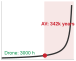{width="100%" fig-alt="Knee curve illustrating Butler and Finelli testing exposure wall scaling from hours to cosmic timescales."}

*Certifying life-critical reliability through operational exposure hits an astronomical time barrier.*
:::

| Target Safety Integrity Level & Standard                              | Target Failure Rate ($\lambda$, $\text{h}^{-1}$)              | Permissible Per-Cycle Failure Prob. ($p$ at $100\text{ Hz}$) | Zero-Failure Test Hours ($T$, $C=0.95$) | Single-Unit Physical Exposure Time                    | 100-Unit Fleet Exposure Duration                  | Required Verification Strategy (Butler & Finelli Implication)                                                                                                                          |
|:----------------------------------------------------------------------|:--------------------------------------------------------------|:-------------------------------------------------------------|:----------------------------------------|:------------------------------------------------------|:--------------------------------------------------|:---------------------------------------------------------------------------------------------------------------------------------------------------------------------------------------|
| **Consumer Robotics / Advisory AI** (Unregulated / Soft Safe State)   | $10^{-3}\text{ h}^{-1}$ (1 failure / $10^3\text{ h}$)         | $p \approx 2.78 \times 10^{-9}$                              | $3.0 \times 10^3\text{ h}$              | $3,000\text{ h}$ (125 days continuous)                | $30\text{ h}$ (< 1 week)                          | **Black-Box Testing Feasible:** Direct operational sampling and nominal trace replay sufficient to validate empirical claims.                                                          |
| **Industrial Automation (SIL 2 / PL d)** (IEC 61508 / ISO 13849)      | $10^{-6}\text{ h}^{-1}$ (1 failure / $10^6\text{ h}$)         | $p \approx 2.78 \times 10^{-12}$                             | $3.0 \times 10^6\text{ h}$              | $3.0 \times 10^6\text{ h}$ (342 years continuous)     | $3.4\text{ years}$ (at 24/7 continuous operation) | **Hybrid Verification:** Statistical sampling paired with accelerated fault injection and HIL parameter stress sweeps.                                                                 |
| **Automotive Safety (ASIL D / SIL 3)** (ISO 26262 / IEC 61508)        | $10^{-8}\text{ h}^{-1}$ (10 FIT, 1 failure / $10^8\text{ h}$) | $p \approx 2.78 \times 10^{-14}$                             | $3.0 \times 10^8\text{ h}$              | $3.0 \times 10^8\text{ h}$ (34,200 years continuous)  | $342\text{ years}$ (100 vehicles 24/7)            | **Architectural Containment Mandatory:** Formal invariant synthesis, hardware interlocks, and systematic fault injection; fleet testing cannot prove safety.                           |
| **Life-Critical Avionics (DAL A / SIL 4)** (DO-178C / FAA AC 20-115D) | $10^{-9}\text{ h}^{-1}$ (1 failure / $10^9\text{ h}$)         | $p \approx 2.78 \times 10^{-15}$                             | $3.0 \times 10^9\text{ h}$              | $3.0 \times 10^9\text{ h}$ (342,465 years continuous) | $3,425\text{ years}$ (100 units 24/7 continuous)  | **Mathematical Impossibility of Black-Box Test:** Safety *cannot* be established by fleet exposure. Provenance, formal methods, and isolated intervention are mathematically required. |

: **Statistical Confidence vs. Physical Testing Exposure Bounds across Safety Integrity Levels**: Quantification of required zero-failure test exposure ($T = -\ln(1-C)/\lambda$ at $C=0.95$ confidence) and physical operational fleet hours per Butler & Finelli [@butler1993infeasibility], demonstrating the mathematical infeasibility of certifying life-critical cyber-physical systems through black-box operational burn-in alone. {#tbl-15-statistical-testing-bounds tbl-colwidths="[18,12,12,12,14,12,20]"}

A defensible safety case requires that untested operational envelopes, unobservable test results, and unsupported probability claims be presented with the exact same visual and structural prominence as successful verifications. Hiding an untested envelope boundary or an unverified hardware permutation in an appendix manufactures a false impression of completeness. The fault record must explicitly list every parameter combination where fault injection was omitted due to test bench limitations, sensor bandwidth constraints, or destructive hardware limits. Documenting what was never tested prevents unverified operational zones from silently masquerading as verified safety margins when the record is transferred to the safety case in @sec-release. Furthermore, every isolated entry in the record documents the response of the machine to a single, localized disturbance. In physical operation, however, disturbances rarely occur in strict isolation, and verifying how a machine responds to an individual fault leaves open the question of how it behaves when multiple coupled physical disturbances (e.g., stator delays\index{Stator delay}, gearbox compliance\index{Gearbox compliance}, and bus jitter\index{Bus jitter}) strike the system at the same time.

::: {#chk-verification-fault-manifest-and-statistical-bounds .callout-checkpoint title="Fault manifests and statistical qualification limits"}
- [ ] **Immutable fault manifest audit trail**: Can you explain why safety claims require a cryptographically signed schema linking injected disturbance parameters, enforcer reaction timestamps, and truth digitizer logs?
- [ ] **Zero-failure statistical testing limits**: Can you derive the number of independent, zero-failure HIL trials required to certify a 99 percent diagnostic coverage target at 95 percent confidence?
- [ ] **Butler and Finelli infeasibility barrier**: Can you explain why life-critical reliability targets of $10^{-9}$ failures per hour cannot be established by unperturbed operational fleet mileage alone?
:::

::: {#capstone-verification-humanoid-crucible .callout-perspective title="Gantry tether and dynamic HIL testing"}
Validating a bipedal humanoid under destructive hardware faults requires specialized physical verification infrastructure:

* **The Catch-22 of Dynamic Humanoid Verification:** On a fixed arm or wheeled rover, injecting motor overcurrent faults, sensor dropouts, or communication jitter causes the machine to stop or veer off path safely on a test stand. On a bipedal humanoid walking at $1.5\text{ m/s}$, injecting a simulated joint encoder failure or fieldbus packet drop instantly destabilizes floating-base balance, inducing an unmitigated fall that destroys thousands of dollars of cycloidal gearboxes and carbon-fiber limbs. Teams cannot verify fall mitigation routines without risking the robot, yet cannot deploy the robot without verifying those routines.
* **Passive-Relief Overhead Gantry Testbeds:** Solving this requires instrumented Hardware-in-the-Loop (HIL) gantry rigs equipped with motorized, low-inertia overhead tethers. The gantry tracks the robot's planar position with high-speed linear motors, keeping zero tension on the tether during nominal gait cycles (transparent gravity mode). When a fault injector corrupts an EtherCAT packet or drops a camera frame, the gantry detects free-fall acceleration within $15\text{ ms}$ and engages hydraulic or electromagnetic arresters to catch the falling robot before foot or torso impact.
* **Whole-Body Invariant Fuzzing:** The verification suite must inject compound faults across both physical and software domains simultaneously: synthetic $50\ \mu\text{s}$ fieldbus clock jitter on the EtherCAT ring, transient $10\text{ V}$ bus droop on the $48\text{ V}$ power rail, and synthetic $100\text{ ms}$ stalls on the VLM intent pipeline. The acceptance oracle verifies that the low-level 1 kHz real-time supervisor cleanly transitions into active impedance holding or a capture step without tripping overcurrent limits or dropping communications across intact limb nodes.
:::

## Fallacies and Pitfalls {#sec-verification-fallacies-pitfalls}

A machine can pass isolated fault tests and still fail when shared physical resources—such as power distribution buses, which distribute electrical power to various components, and high-speed SerDes communication channels, which facilitate rapid data transfer—couple the faults or disable their detectors. These components significantly impact system reliability and fault detection. Useful compound tests track these dependencies and preserve enough galvanically or logically independent instrumentation to establish the sequence of events.\index{Fault coupling!shared resources}

::: {.fallacy-pitfall}

**Fallacy**: *Independent local watchdog timers guarantee end-to-end physical deadline compliance.*

A proportional flow regulator must arrest a pressure spike within $250.0\text{ ms}$. Its sensing, inference, and valve actuation stages each pass their local watchdog limits, but their execution delays combine with fieldbus queuing jitter to reach $75.0\text{ ms} + 115.0\text{ ms} + 38.0\text{ ms} + 45.0\text{ ms} = 273.0\text{ ms}$. No individual timeout detects the excess because the unbudgeted handoff delay occurs between the local checks. Verification must trace the complete sensing-to-actuation interval\index{Deadlines!end-to-end} under coincident load and include communication jitter in the budget. Local watchdogs remain useful, but their bounds support an end-to-end claim only when the composition, including every handoff and buffer delay, fits the physical response envelope.

:::

::: {.fallacy-pitfall}

**Pitfall**: *Allowing diagnostic logging and high-throughput telemetry to share fieldbuses with real-time safety loops.*

A platform shares a single EtherCAT fieldbus among sensing, actuation, enforcement, and evidence logging. A diagnostic memory dump raises bus utilization to 98 percent, inducing network transmission jitter that delays both the $\mathrm{SE}(3)$ kinematic commands and the telemetry needed to judge their physical effect. The same bandwidth contention\index{Fieldbus!contention} also delays safety heartbeats and the logs that would explain a failure. Testing each stream separately misses this common dependency. Critical traffic requires bounded service through validated time-sensitive networking (TSN) scheduling and hardware priority, or separate physical channels, while diagnostic traffic must remain within its assigned budget. Compound-load testing must confirm that logging cannot prevent either the safety response or the observation of that response.

:::

::: {.fallacy-pitfall}

**Pitfall**: *Relying on software anomaly detectors that share electrical power or failure modes with monitored actuators.*

A power rail brownout freezes a Coriolis flow meter at a plausible $4.2\text{ kg/s}$ reading while a downstream valve blockage physically reduces actual flow to $0.8\text{ kg/s}$. The ADC packets remain well formed and the value stays within nominal limits, so the anomaly detector relying on that signal does not recognize the blockage. An isolated blockage test would not reveal this common-cause failure\index{Failure modes!common-cause} if the meter's power remained healthy. Verification must examine whether one fault can disable the evidence needed to detect another. Galvanically isolated sensing and explicit checks for specified stuck-signal behavior must support the response, rather than assuming a plausible measurement is a functioning measurement.

:::

::: {.fallacy-pitfall}

**Fallacy**: *Treating an unobservable test outcome where diagnostic loggers dropped packets as evidence of safety.*

During a compound-fault test, bus contention drops logger packets and a watchdog reset erases the volatile SRAM trace. The machine does not strike a physical hard stop, but the team can no longer reconstruct its peak impact forces, its $\mathrm{SE}(3)$ trajectory\index{Kinematics!SE(3) trajectory}, or its response timing. That observation cannot establish compliance with ISO 10218 safety envelopes\index{Safety!ISO 10218} that were not empirically measured. The trial must remain inconclusive for those claims, with the recording failure treated as an instrumentation defect. Before repeating the test, the team must make the required evidence path survive the injected electrical conditions. A visually favorable outcome cannot substitute for the quantitative measurements specified by the safety acceptance criteria.

:::

## Summary {#sec-verification-summary}

Verification in physical AI replaces fragile confidence from nominal demonstrations with structured empirical evidence from hardware-in-the-loop (HIL) testing and statistical falsification. Rather than relying on aggregate survival metrics, rigorous verification demands multidimensional coverage across non-deterministic failure distributions, physical envelope boundaries, and worst-case timing tails to prove that **safety invariants**\index{Safety invariants} hold when subsystems fail. In an analytical example of an industrial flow regulator, allowing an observer to watch an automated control loop maintain line pressure at $4.0\text{ MPa}$ across three uninterrupted operating shifts proves only that the nominal trajectory did not encounter an unhandled disturbance. It does not establish what happens when a proportional relief valve jams at 15 percent travel during a sudden pump surge, or whether the pressure transducer's degraded bandwidth—reporting pressure changes too slowly to the controller—violates the intervention deadline. A demonstration produces psychological confidence that decays with the first unexpected transient; verification produces evidence—an auditable record of bounded claims tested against deliberate physical and computational stress. Downstream systems and safety cases receive this concrete evidence rather than subjective confidence.

The operating envelope defines the physical boundary within which safety claims are made, evaluated, and reproduced (@sec-boundary-causal-boundary). Outside this envelope, physical dynamics deviate from the models used during design, turning test results into uninterpretable noise. Inside it, every parameter boundary corresponds to a specific physical constraint, such as an inlet fluid velocity ceiling of $6.0\text{ m/s}$ or an ambient temperature limit of $65.0^\circ\text{C}$. When a stress-test injects an upstream pressure surge of $1.5\text{ MPa/s}$ into the regulator, the test is meaningful only because the design explicitly claimed stability across pressure derivatives up to $2.0\text{ MPa/s}$. If a test exposes a pressure overshoot exceeding the $5.0\text{ MPa}$ structural vessel limit while operating within this boundary, the failure is reproducible and falsifies the design claim. If an identical pressure overshoot occurs only after the fluid velocity exceeds $9.0\text{ m/s}$, the failure indicates that the test apparatus breached the operating envelope, measuring chaotic physical forces that the controller was never designed or budgeted to reject.

Verification derives its structure from the properties established across the preceding design stages. Every contract stated in the pipeline becomes an explicit fault waiting to be injected into the assembled machine. For the flow regulator, the design claims from earlier chapters dictate a strict chain of traceability. A sensor calibration claim from the perception pipeline becomes an injected drift fault of $0.2\text{ MPa}$, testing whether the diagnostic estimator detects the discrepancy before flow estimation errors propagate to the policy. A policy latency claim of $115\text{ ms}$ at the 99th percentile ($P_{99}$) becomes an injected inference jitter fault—artificially delaying the neural network's output—verifying that the proposal-permission architecture from @sec-brain-embodied detects the schedule overrun and executes an immediate fallback trajectory. An actuator authority claim becomes an injected valve slew saturation fault, confirming that the mechanical intervention mechanism isolates the line within the $250\text{ ms}$ physical vessel budget. Each verification vector links five distinct elements in an unbroken chain, connecting the original design property, the injected disturbance, the runtime detector, the nervous system response, and the final measured physical state.

Every qualification mode operates under explicit evidentiary limits. Hardware-in-the-loop (HIL) simulation\index{Hardware-in-the-loop} permits dense sampling of rare boundary crossings, running thousands of synthetic cavitation transients\index{Cavitation} without wearing out physical seals, but it remains blind to unmodeled hydrodynamic turbulence\index{Hydrodynamic turbulence} and bus transceiver heating\index{Thermal Management!bus transceiver heating}. Physical dynamometer testing\index{Dynamometer Testing} captures true thermal dissipation\index{Thermal Management!dissipation}, electromagnetic interference (EMI)\index{Electromagnetic interference}, and mechanical backlash\index{Mechanical backlash}, but it cannot safely execute destructive overpressurization tests to failure across hundreds of consecutive runs. Treating a simulated pass as proof of physical compliance confuses the fidelity of a model with physical reality. Conversely, treating a physical test under a single ambient condition as a universal guarantee ignores environmental coupling. Any operating condition, input distribution, or hardware degradation state that has not been subjected to deliberate fault injection remains an open claim rather than an established property.

::: {.column-margin .margin-pointer}
↳ **Downstream:** Untested operational regimes identified during falsification feed the epistemic boundary analysis in @sec-frontier-epistemic-limits.
:::

::: {.callout-takeaways title="Hardware-in-the-loop verification and fault injection"}
* **Demonstrations Build Psychological Confidence; Verification Generates Auditable Evidence:** Watching a machine run without failure proves only that nominal conditions held. Verification requires deliberate physical fault injection across boundary envelopes to prove that safety invariants hold when subsystems fail.
* **Local Watchdogs Cannot Prevent Additive Timing Failure:** If sensor ($75\text{ ms}$), GPU inference ($115\text{ ms}$), valve actuator ($38\text{ ms}$), and bus serialization ($45\text{ ms}$) all operate within local limits, their sum ($273\text{ ms}$) breaches the physical vessel limit ($250\text{ ms}$). Safety verification must track end-to-end distributed deadline accumulation.
* **Compound Fault Vectors Must Trace Shared Physical Resources:** Testing single faults in isolation misses catastrophic interactions. Electrical voltage ripples can freeze digital register outputs at nominal values, disabling the exact software anomaly detector needed to catch a concurrent mechanical valve jam.
* **Unobservable Test Outcomes Yield Zero Evidentiary Value:** If testbed data loggers drop packets or watchdog resets wipe diagnostic trace RAM during a fault transient, the run is an invalid test, never evidence that the machine survived the fault.
* **The Versioned Fault Record is the Sole Prerequisite for Release:** The output of verification is an immutable fault record cataloging verified passes, hard failures, invalid runs, and explicit coverage gaps handed directly to the release assurance safety case.
:::

A demonstration proves only that an autonomous system can execute its task when every sensor is clean, every packet arrives on time, and every mechanical bearing is new. In physical AI, true verification begins when sensors are blinded, communication links are flooded, and actuators hit their thermal saturation limits. If an architecture cannot survive deliberate hardware-in-the-loop falsification, its safety claims are an illusion of empirical convenience.

::: {.callout-chapter-connection title="From hardware-in-the-loop to deployment release"}
The versioned fault record generated by verification provides the essential empirical foundation for release certification in @sec-release. Rather than relying on ungrounded statistical optimism, @sec-release consumes these auditable fault-injection traces, timing margins, and quantified coverage gaps to construct formal Claim-Argument-Evidence safety cases: sealing neural network weights, FPGA bitstreams, and safety invariants under a hardware Root of Trust before granting operational authority.
:::
