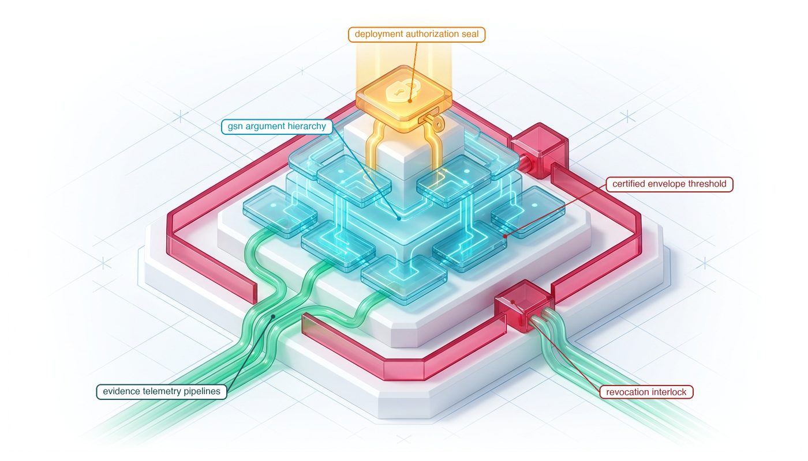
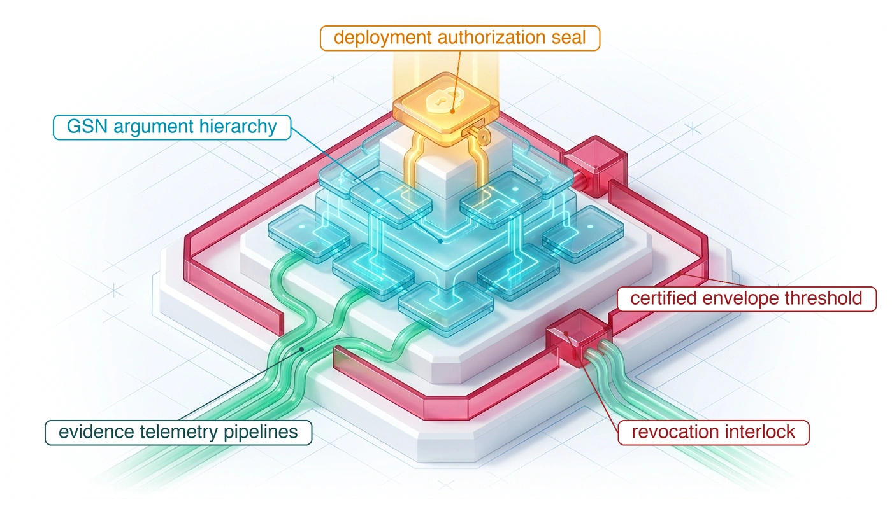
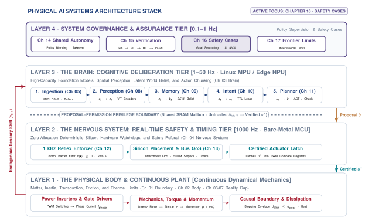
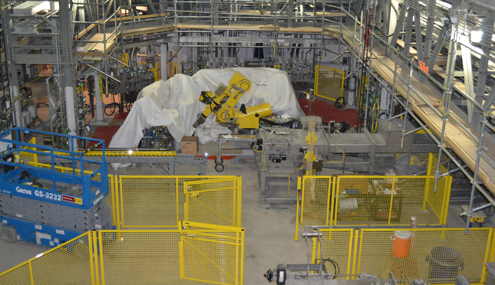
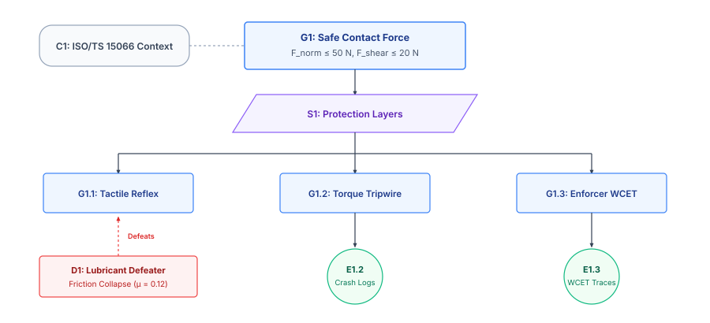
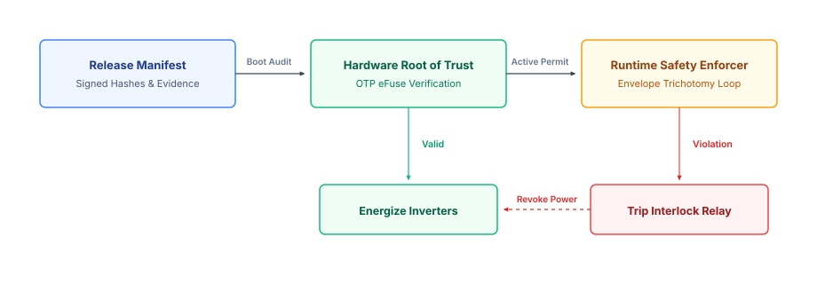

# Deployment Release {#sec-release}

::: {layout-narrow}
::: {.column-margin}

\chapterminitoc

:::

::: {.content-visible when-format="pdf"}
\noindent
{fig-alt="Isometric blueprint showing deployment release and safety cases: Goal Structuring Notation argument pyramid in transparent glass tablets, emerald physical evidence pipelines, golden deployment authorization seal, and Harvard crimson certified operational envelope threshold with revocation interlocks."}
:::

::: {.content-visible unless-format="pdf"}
{fig-alt="Isometric blueprint showing deployment release and safety cases: Goal Structuring Notation argument pyramid in transparent glass tablets, emerald physical evidence pipelines, golden deployment authorization seal, and Harvard crimson certified operational envelope threshold with revocation interlocks."}
:::

:::

## Purpose {.unnumbered .unlisted}

::: {.content-visible when-format="pdf"}
\begin{marginfigure}
\vspace{1em}
\resizebox{\linewidth}{!}{\mlphysicalstackfull{20}{20}{20}{20}{20}}
\end{marginfigure}
:::

_Under what auditable chain of physical evidence is an autonomous machine permitted to move among humans?_

Releasing a machine gives its software permission to produce physical consequences outside the test environment. That permission requires an argument connecting the intended operation to evidence about the assembled system. Model accuracy alone cannot establish that the machine stops within its available clearance, nor can a successful demonstration establish that a fallback remains effective under the faults it must handle. The release decision must identify which measurements support each claim and which assumptions limit its scope. A change in payload or operating conditions can invalidate the argument even when the software remains unchanged. Operating authority therefore carries conditions that the deployed system must monitor, along with a specified response when they no longer hold. Release brings the brain's capabilities, the nervous system's enforcement, and the body's measured limits under one accountable judgment about where the machine may operate and what evidence must remain valid for that permission to continue.



::: {.callout-learning-objectives}

- Construct a release argument linking a bounded operating claim to auditable physical evidence
- Evaluate whether evidence supports operation, conditional operation, or refusal within the proposed envelope
- Specify standing conditions that withdraw operating authority when measurements or configuration changes invalidate a release
- Diagnose unsupported assumptions and weak evidence through adversarial review of a release argument

:::

## The Decision to Deploy {#sec-release-decision-to-deploy}

Accumulating a directory of passing test records and hardware fault traces does not by itself answer the ultimate systems question: under what auditable chain of physical evidence is an autonomous machine permitted to move among humans? In enterprise software or web services, deploying a new build carries operational and financial risk—a regression may corrupt a customer database or degrade service latency. In physical AI, the decision to release delegates physical authority over mass, force, and velocity into an unstructured world populated by human beings. An unhandled edge case, a perceptual hallucination, or an unbudgeted compute latency spike does not terminate in a benign software stack trace; it converts stored electrical, chemical, or hydraulic energy into crushing kinetic work against physical structures and human bodies. Even after adversarial verification harnesses have systematically stressed cyber-physical assumptions—injecting clock drift, memory bus contention, sensor resonance spoofing, and hardware fault conditions into target silicon and mechanics—the engineering challenge shifts from uncovering defects to proving bounds. Yet in engineering practice, development teams routinely attempt to justify deployment using ungrounded statistical optimism: quoting 99.9 percent benchmark accuracy on static validation datasets, or showcasing thousands of error-free cycles recorded during controlled laboratory demonstrations. Neither metric answers the release question. High validation accuracy merely demonstrates that a learned policy can reproduce training correlations under stationary data distributions, while a flawless laboratory demonstration proves only that a single sequence of states executed safely under the particular environmental conditions present during that run. Deciding to deploy is not a statistical prediction; it is an accountable, evidence-based engineering adjudication that formalizes whether empirical data rigorously bounds the physical risk of operation.

::: {.column-margin .margin-pointer}
↰ **Prerequisite:** The empirical verification evidence backing release claims is produced in @sec-verification-qualification-ladder.
:::

::: {#fig-16-locator fig-env="figure" fig-pos="htb" fig-cap="**Safety Cases Architecture Focus**: The four-tier physical AI systems architecture highlights the system governance and assurance tier, with safety cases as this chapter's active focus. Read the highlighted box as the point where measurements and runtime enforcers from every lower tier are assembled into an auditable argument, because deciding that a machine may operate requires proof rather than statistical optimism." fig-alt="Diagram titled Physical AI Systems Architecture Stack, drawn as four stacked tiers. Layer 4 is system governance and assurance at 0.1 to 1 hertz, holding boxes for shared autonomy, verification, safety cases, and frontier limits. Layer 3 is the brain, a cognitive deliberation tier at 1 to 50 hertz, holding five stages named ingestion, perception, memory, intent, and planner. A dashed proposal-permission privilege boundary separates it from layer 2, the nervous system, a real-time safety and timing tier at 1000 hertz. Layer 1 is the physical body and continuous plant. Layer 4 is outlined and its safety cases box is highlighted; the badge reads Active Focus, Chapter 16, Safety Cases."}
{width="100%"}
:::

As illustrated in the architecture stack in @fig-16-locator, Safety Cases and Release Governance form the third pillar of Tier 4 (System Governance & Assurance). Operating at supervisory cadences of $0.1\text{ to }1\text{ Hz}$, release governance serves as the constitutional gatekeeper of the physical AI stack. It does not generate control actions; rather, it evaluates whether the mechanisms constructed and tested across every lower tier cohere into an unbroken, auditable argument:

- **The Brain (Tier 3):** evaluating whether the uninterpretable representations and probabilistic trajectory proposals of vision-language-action policies are bounded by provable constraints;[^fn-bridge-release-brain]
- **The Nervous System (Tier 2):** verifying that deterministic real-time enforcers, watchdog interlocks, and fallback ladders possess uncompromised authority to override learned policies within hard real-time deadlines ($1\text{ ms}$);[^fn-bridge-release-nervous] and
- **The Body (Tier 1):** grounding all safety claims in the hard physics of contact mechanics, effective moving inertia, motor winding thermal limits, and biomechanical human injury thresholds (such as ISO/TS 15066).[^fn-bridge-release-body]

[^fn-bridge-release-brain]: **Privilege Separation in Cognitive Architecture**\index{Privilege separation!Tier 3 release}: As established in @sec-brain-embodied, Tier 3 cognitive models are probabilistic and unverified. Release governance ensures that learned policies are never granted direct actuator authority, requiring all proposed setpoints to pass through deterministic enforcers. Granting direct actuator access to unverified latent representations risks commanding trajectory setpoints that exceed mechanical joint limits or induce destructive high-speed collisions.

[^fn-bridge-release-nervous]: **Deterministic Enforcement and Safe Sets**\index{Deterministic enforcement!Tier 2 release}: As detailed in @sec-nervous-multi-rate-bridge and @sec-enforcement-safe-sets-conditional-permission, Tier 2 safety enforcers maintain inviolable safe sets using control barrier certificates. A release case evaluates whether these enforcers possess guaranteed execution preemption under all single-point failures. If execution preemption lacks hardware isolation, transient bus starvation or software lockups can delay tripwire intervention until unconstrained momentum breaches the certified physical safety envelope.

[^fn-bridge-release-body]: **Causal Boundaries and Biomechanical Tissue Limits**\index{Causal boundaries!Tier 1 release}: As analyzed in @sec-boundary-causal-boundary and @sec-body-five-budgets, physical safety depends on bounding kinetic energy and impact force relative to structural deformation limits and ISO/TS 15066 human pain thresholds ($50\text{ N}$ transient contact). These limits require matching mechanical compliance, link mass, and maximum Cartesian velocity so that unbraked collisions cannot exceed tissue fracture thresholds. Unbounded kinetic energy transforms minor trajectory tracking errors into catastrophic blunt-force trauma.

To anchor this assurance process in a realistic physical system, this chapter follows the deployment of an autonomous collaborative manipulation cell designed to sort, finish, and transfer heavy $12.0\text{ kg}$ metal castings alongside human assembly workers on an active manufacturing line. The primary operational claim asserts that the machine will perform its tasks without delivering more than $50\text{ N}$ of transient contact force to a human body—even during unexpected collisions, sensor occlusions, or neural inference stalls. In such an embodied plant, an unbraked impact delivers over $725\text{ N}$ of peak contact force, exceeding biomechanical pain thresholds by more than an order of magnitude. Permitting this machine to operate requires an unbroken evidentiary chain linking empirical fault injection records from whole-system verification,[^fn-bridge-release-verification] measured $P_{99.99} \le 1.8\text{ ms}$ reflex execution latencies, physical dynamometer braking data, and deterministic envelope monitors into an auditable safety argument that can withstand adversarial interrogation.

[^fn-bridge-release-verification]: **Empirical Grounding in Fault Manifests**\index{Fault manifest!Tier 4 release}: As demonstrated in @sec-verification-fault-injection and @sec-verification-fault-manifest, claims within a safety case cannot rest on unverified assertions; they must trace directly to reproducible, cryptographically signed fault injection records. These records capture worst-case system responses under synthetic sensor dropouts, bus contention, and actuator degradation on hardware-in-the-loop testbeds. Without cryptographically anchored empirical proof, safety claims degrade into unverified assumptions that conceal latent mechanical failure modes.

A release verdict is not a guarantee of absolute perfection; it is an accountable, bounded contract linking an operational claim, empirical evidence, and runtime enforcement. To guide engineers through the rigorous construction and defense of this contract, this chapter unfolds across eight structured sections. @Sec-release-question establishes the release question, formalizing the transition from statistical confidence to physical authority delegation and partitioning the operational design domain into nominal, conditional, and refusal envelopes. @Sec-release-safety-cases-claims adapts Goal Structuring Notation and Toulmin's argumentation model to construct formal Claim-Argument-Evidence safety cases under ANSI/UL 4600 and ISO 26262, delineating genuine empirical evidence from superficial demonstration. @Sec-release-three-verdicts formalizes the adjudication protocol governing the three binding verdicts—unconditional operation, conditional operation, and refusal to operate—establishing why technical refusal represents an engineering success rather than an organizational failure. @Sec-release-standing-conditions details the verdict's standing conditions, specifying dynamic contracts that evaluate telemetry drift and trigger automatic cryptographic rollbacks when physical invariants degrade. @Sec-release-case-worked-full works through an end-to-end industrial case study of an autonomous collaborative manipulation cell, tracing every evidentiary link from elastomeric shear strain to braking deceleration. @Sec-release-adversarial-review introduces adversarial review protocols designed to actively probe and falsify safety warrants prior to deployment. @Sec-release-failure-modes diagnoses organizational pathologies that compromise safety cases, including simulation-to-reality gaps, proxy metric fallacies, and the normalization of deviance. Finally, @sec-release-manifest formalizes the cryptographic release manifest, anchoring operational authority to hardware Root of Trust and immutable silicon fuses.

We begin in @sec-release-question by defining the release question, formalizing the transition from statistical confidence to physical authority delegation.

## The Release Question {#sec-release-question}

Deciding whether a physical machine should operate frames what Koopman [@koopman2020how] terms the central engineering dilemma of autonomy: *how safe is safe enough*, and how can that safety be demonstrated through auditable, falsifiable claims rather than ungrounded statistical optimism? The engineering release question asks whether the accumulated evidence justifies delegating **physical authority**\index{Physical authority!delegation} over mass, force, and velocity to an autonomous system under a defined set of operating conditions. Because a physical AI system converts computational outputs into mechanical work against physical objects and human bodies (@sec-boundary-causal-boundary), release formalizes the authority to actuate hardware only when **deterministic safeguards**\index{Deterministic safeguards!single-point failure} guarantee that the machine remains within safe physical bounds under all single-point failures (@sec-brain-embodied) (\ref{dfn-release-goal-structured-safety-case}).

::: {#dfn-release-goal-structured-safety-case .callout-definition title="Goal-structured physical safety case"}

***Goal-structured physical safety case***\index{Goal-structured physical safety case!definition}\index{Safety case!physical AI} is an evidence-based engineering manifest that links empirical stress testing, hardware fault injection records, and deterministic envelope monitors to rigorously demonstrate that residual kinetic risk remains within standardized acceptable thresholds (ISO 13849 / UL 4600).

1.  **Significance**: Transforms subjective, informal deployment confidence into an auditable, falsifiable engineering argument that connects high-level safety goals to concrete empirical evidence across the entire physical stack.
2.  **Distinction**: Unlike software unit test suites or static model validation scorecards, a physical safety case explicitly links operational design domain boundaries, hardware fault injection logs, and runtime enforcer tripwires to demonstrate bounded residual risk.
3.  **Common pitfall**: Treating the safety case as a retrospective compliance checklist completed after development, rather than a living architectural contract that governs feature integration and release gating.

:::

The boundaries of this delegation are formalized through the **operational design domain (ODD)**\index{Operational design domain!definition}, an explicit set of measurable physical invariants. Each **ODD invariant**\index{Operational design domain invariant!definition} represents a physical, environmental, or kinematic parameter boundary (such as payload mass, workspace volume, friction coefficients, or thermal limits) within which a physical AI system's learned policies and deterministic reflexes are certified to maintain safe operation. In the tactile manipulation cell, these invariants specify the geometric workspace volume as a hemisphere of radius $1.2\text{ m}$ centered at the arm base, payload mass between $0.5\text{ kg}$ and $12.0\text{ kg}$, contact friction coefficients satisfying $\mu \ge 0.35$, ambient operating temperatures from $15^\circ\text{C}$ to $40^\circ\text{C}$, ambient lighting between $300\text{ lx}$ and $2000\text{ lx}$, and human co-presence states restricted to a single trained operator within the collaborative handover envelope.

::: {.column-margin .margin-pointer}
↰ **Prerequisite:** Absence ledgers defining the operational design domain originate in @sec-data-schema.
:::

Inside these boundaries lies the nominal operating zone where the learned policy retains full authority. When environmental factors drift toward the perimeter, such as illuminance dropping toward $200\text{ lx}$ or surface moisture reducing friction below $\mu = 0.35$, the system enters degraded conditional zones where operating speeds are automatically curtailed or secondary sensor modalities are engaged. Outside the boundary lies the hard refusal envelope. If a sensor measurement violates any physical invariant, such as detecting a $15.0\text{ kg}$ payload or ambient heat exceeding $40^\circ\text{C}$, the nervous system revokes policy authority, commands mechanical brakes, and prevents further operation. In heavy autonomous fleets, such as the autonomous mining haul truck shown in @fig-16-real-autonomous-haul-truck, this boundary enforcement is multi-tiered: high-precision GNSS antennas and radio telemetry masts enforce spatial geofencing within the pit corridor, bumper radar and LiDAR pods detect foreign obstacles and dust degradation, and dedicated safety controllers trip electro-hydraulic service brakes—dumping hydraulic pressure to let massive springs mechanically clamp the rotors—the instant perimeter containment is lost.

::: {#fig-16-real-autonomous-haul-truck fig-env="figure" fig-pos="t" fig-cap="**Operational Design Domain Enforcement**: A 240-tonne autonomous haul truck inside a geofenced pit corridor, with dual GNSS masts enforcing the boundary, bumper radar and LiDAR detecting obstacles and atmospheric degradation, and hardwired tripwires de-energizing steering and braking on breach. At tens of megajoules of kinetic energy, release authority rests on physical boundary guarantees rather than on statistical confidence in a navigation policy. Attribution: Caterpillar Inc. / MineStar System Field Trial Archive (Public Domain / Fair Use under 17 U.S.C. § 107)." fig-alt="Operational Design Domain (ODD) Enforcement in Heavy Autonomous Systems. A 240-metric-ton Caterpillar 793D autonomous mining haul truck operating inside a strictly geofenced open-pit mine corridor. Heavy physical AI systems operating with tens of megajoules of kinetic energy enforce explicit, multi-layered ODD boundaries: centimeter-accurate dual GNSS antenna masts and wireless telemetry on the cab roof enforce spatial corridor geofencing; bumper-mounted radar and LiDAR sensor pods detect foreign obstacles and dust/fog atmospheric degradation; and hardwired emergency-stop tripwires de-energize electro-hydraulic steering and braking actuators if perimeter containment is breached. Release authority is contingent on physical boundary guarantees rather than statistical navigation policies. Attribution: Caterpillar Inc. / MineStar System Field Trial Archive (Public Domain / Fair Use under 17 U.S.C. § 107)."}
{width="85%"}
:::

As formalized in @tbl-16-odd-invariants, every physical parameter governing the operational design domain must be partitioned into three explicit subsets: nominal operating states ($\mathcal{S}_{\mathrm{nom}}$), degraded conditional states ($\mathcal{S}_{\mathrm{cond}}$), and hard refusal boundaries ($\mathcal{S}_{\mathrm{refuse}}$). Rather than treating environmental boundaries as descriptive guidelines, the release contract couples each physical invariant to a calibrated runtime sensor modality, a guaranteed sampling period, and a deterministic hardware enforcer action. If any environmental parameter drifts into $\mathcal{S}_{\mathrm{cond}}$, the nervous system automatically clamps kinematic authority (for instance, physically overriding the neural network's commanded velocity to force a slower speed) [@ames2019control]; if it penetrates $\mathcal{S}_{\mathrm{refuse}}$, operating authority is immediately revoked—cutting motor power—before uncontained kinetic energy can accumulate.

| ODD Dimension / Invariant    | Nominal Envelope ($\mathcal{S}_{\mathrm{nom}}$)                                     | Degraded Boundary ($\mathcal{S}_{\mathrm{cond}}$)                                                       | Hard Refusal ($\mathcal{S}_{\mathrm{refuse}}$)                              | Runtime Monitor & Rate                           | Enforcer Action & Latency                                                                                                        |
|:-----------------------------|:------------------------------------------------------------------------------------|:--------------------------------------------------------------------------------------------------------|:----------------------------------------------------------------------------|:-------------------------------------------------|:---------------------------------------------------------------------------------------------------------------------------------|
| **Workspace Reach & Height** | $r \le 1.00\text{ m}$, $z \in [0.10, 1.20]\text{ m}$                                | $1.00\text{ m} < r \le 1.20\text{ m}$ (buffer)                                                          | $r > 1.20\text{ m}$ or $z < 0.05\text{ m}$                                  | Absolute optical encoders @ $1000\text{ Hz}$     | Clamp $v \le 0.20\text{ m/s}$ in $\mathcal{S}_{\mathrm{cond}}$; apply holding brakes ($t_{\mathrm{brake}} \le 18\text{ ms}$)     |
| **Payload Mass & Inertia**   | $m \in [0.5, 8.0]\text{ kg}$, $I_{zz} \le 0.08\text{ kg}\cdot\text{m}^2$            | $8.0\text{ kg} < m \le 12.0\text{ kg}$                                                                  | $m > 12.0\text{ kg}$ or negative residual                                   | Wrist 6-axis load cell @ $1000\text{ Hz}$        | Derate Cartesian speed to $0.40\text{ m/s}$ in $\mathcal{S}_{\mathrm{cond}}$; freeze trajectory on refusal                       |
| **Contact Surface Friction** | $\mu \ge 0.50$ (clean elastomeric grip)                                             | $0.35 \le \mu < 0.50$ (minor sheen)                                                                     | $\mu < 0.35$ (lubricant film / slip)                                        | Optical-tactile shear tracking @ $500\text{ Hz}$ | Boost normal grip force (to $450\text{ N}$); abort grasp to catch tray if slip persists $> 10\text{ ms}$                         |
| **Ambient Illumination**     | $E \in [500, 2000]\text{ lx}$ (factory floor)                                       | $300\text{ lx} \le E < 500\text{ lx}$ or $2000 < E \le 3500\text{ lx}$                                  | $E < 300\text{ lx}$ or $E > 3500\text{ lx}$                                 | Calibrated photodiode array @ $60\text{ Hz}$     | Switch to tactile-proprioceptive reflex ($v \le 0.20\text{ m/s}$); park arm if saturated                                         |
| **Thermal Actuator State**   | $T_{\mathrm{amb}} \in [15, 35]^\circ\text{C}$, $T_{\mathrm{coil}} \le 353\text{ K}$ | $35^\circ\text{C} < T_{\mathrm{amb}} \le 40^\circ\text{C}$, $T_{\mathrm{coil}} \in (353, 383]\text{ K}$ | $T_{\mathrm{amb}} > 40^\circ\text{C}$ or $T_{\mathrm{coil}} > 393\text{ K}$ | Stator winding thermistors @ $10\text{ Hz}$      | Dynamic torque derating ($50\%$ limit); hardware gate shutdown ($t_{\mathrm{gate}} \le 1\text{ ms}$) on refusal                  |
| **Human Co-Presence**        | Separation $d_{\mathrm{sep}} \ge 1.50\text{ m}$                                     | $0.30\text{ m} \le d_{\mathrm{sep}} < 1.50\text{ m}$ (handover)                                         | $d_{\mathrm{sep}} < 0.30\text{ m}$ (unsanctioned breach)                    | Dual safety pulsed ToF lidar @ $100\text{ Hz}$   | Speed and Separation Monitoring ($v \propto d_{\mathrm{sep}}$); Category 0 emergency stop ($t_{\mathrm{stop}} \le 40\text{ ms}$) |

: **Operational Design Domain (ODD) Invariant Boundary Schema and Runtime Monitor Triggers**: Quantification of physical boundaries for the autonomous manipulation cell. Each invariant is tied to real-time physical instrumentation, deterministic sampling rates, and hard real-time nervous system enforcer trip actions to guarantee containment under environmental drift. {#tbl-16-odd-invariants tbl-colwidths="[16,16,18,18,16,16]"}

A defensible release claim must be stated as a falsifiable physical proposition bounded by mechanics and human injury criteria.[^fn-std-isots15066-biomech] For the manipulation cell handling metal castings alongside workers, the claim asserts that under all operating conditions and all single-point sensor or compute failures within the operational design domain, the peak contact force delivered to a human body will not exceed $F_{\max} \le 50\text{ N}$, and the system will arrest all motion within a stopping time of $t_{\text{stop}} \le 40\text{ ms}$. This force limit derives directly from contact mechanics and biomechanical tissue thresholds.[^fn-math-contact-mechanics]

[^fn-std-isots15066-biomech]: **ISO/TS 15066 Biomechanical Limits**\index{ISO/TS 15066!biomechanical limits}: The technical specification defines maximum allowable contact forces and pressures for collaborative robot operations across 29 anatomical regions ($140\text{ N}$ for the chest, $65\text{ N}$ for hands) [@isots15066]. These biomechanical thresholds establish hard mathematical upper bounds on permissible robot velocity and moving mass during unseparated human collaboration. Exceeding these limits risks permanent skeletal fracture, soft-tissue tearing, or irreversible crushing injuries.

[^fn-math-contact-mechanics]: **Contact Mechanics Force Model**\index{Contact mechanics!force model}: The elastodynamic model couples translational kinetic energy, effective moving inertia, and contact interface stiffness to determine transient peak impact force during an unmitigated collision. Impacting a rigid boundary concentrates stored kinetic energy into a sub-millisecond impulse with severe force amplification, whereas elastic compliance extends deformation time and dissipates energy over a longer stroke. Failing to account for contact stiffness leads to severe underestimation of peak impact force during rapid decelerations.

```{python}
#| label: calc-release-biomechanical-impact-envelope
#| echo: false
from mlsysim import *
from mlsysim.core.units import *
from mlsysim.fmt import fmt_energy, fmt_qty, fmt_multiple, fmt_latency, fmt_acceleration, fmt_length, fmt_int, check
from mlsysim.physics.robotics import (
    calc_safe_stopping_distance,
    calc_transient_impact_force,
    calc_kinetic_energy,
)

# ┌── 1. INPUT (Manipulator kinematics & biomechanical tissue context) ─
m_eff = 12.0 * kilogram
v_max = 1.71 * (meter / second)
k_tissue = 15000.0 * (newton / meter)
f_iso_limit = 50.0 * newton

t_detect_nominal = 2.0 * millisecond
a_brake_spring = 45.0 * (meter / (second**2))
delta_t_contamination = 12.0 * millisecond

# ┌── 2. COMPUTE (Impact energy, contact force & stopping envelopes) ───
e_k = calc_kinetic_energy(m_eff, v_max)
f_unbraked = calc_transient_impact_force(v_max, m_eff, k_tissue)
f_ratio = (f_unbraked / f_iso_limit).magnitude

# Nominal stopping envelope
d_drift_nom = (v_max * t_detect_nominal).to(millimeter)
t_brake_nom = (v_max / a_brake_spring).to(millisecond)
d_brake_nom = ((v_max**2) / (2.0 * a_brake_spring)).to(millimeter)
t_stop_nom = t_detect_nominal + t_brake_nom
d_stop_nom = d_drift_nom + d_brake_nom

# Contaminated / delayed envelope
t_detect_delayed = t_detect_nominal + delta_t_contamination
d_drift_delayed = (v_max * t_detect_delayed).to(millimeter)
d_stop_delayed = d_drift_delayed + d_brake_nom
t_stop_delayed = t_detect_delayed + t_brake_nom
d_breach = d_stop_delayed - d_stop_nom
expansion_pct = ((d_stop_delayed - d_stop_nom) / d_stop_nom).magnitude * 100.0

# ┌── 3. GUARDS (Integrity checks) ────────────────────────────────────
check(abs(e_k.to(joule).magnitude - 17.54) < 0.02, f"Unexpected kinetic energy: {e_k}")
check(abs(f_unbraked.to(newton).magnitude - 725.5) < 0.2, f"Unexpected unbraked force: {f_unbraked}")
check(abs(f_ratio - 14.51) < 0.1, f"Unexpected force ratio: {f_ratio}")
check(abs(d_drift_nom.to(millimeter).magnitude - 3.42) < 0.01, f"Unexpected nominal drift: {d_drift_nom}")
check(abs(t_brake_nom.to(millisecond).magnitude - 38.0) < 0.1, f"Unexpected brake time: {t_brake_nom}")
check(abs(d_brake_nom.to(millimeter).magnitude - 32.49) < 0.02, f"Unexpected brake distance: {d_brake_nom}")
check(abs(t_stop_nom.to(millisecond).magnitude - 40.0) < 0.1, f"Unexpected total nominal stop time: {t_stop_nom}")
check(abs(d_stop_nom.to(millimeter).magnitude - 35.91) < 0.02, f"Unexpected nominal stop distance: {d_stop_nom}")
check(abs(d_drift_delayed.to(millimeter).magnitude - 23.94) < 0.01, f"Unexpected delayed drift: {d_drift_delayed}")
check(abs(d_stop_delayed.to(millimeter).magnitude - 56.43) < 0.02, f"Unexpected delayed stop distance: {d_stop_delayed}")
check(abs(t_stop_delayed.to(millisecond).magnitude - 52.0) < 0.1, f"Unexpected delayed stop time: {t_stop_delayed}")
check(abs(d_breach.to(millimeter).magnitude - 20.52) < 0.1, f"Unexpected breach distance: {d_breach}")
check(abs(expansion_pct - 57.14) < 0.2, f"Unexpected expansion pct: {expansion_pct}")

# ┌── 4. OUTPUT (Canonical math formatting) ───────────────────────────
class BiomechanicalImpactEnvelope:
    e_k_str = fmt_energy(e_k, unit=joule, precision=2)
    f_unbraked_str = fmt_qty(f_unbraked, newton, precision=1)
    f_limit_str = fmt_qty(f_iso_limit, newton, precision=0)
    f_ratio_mult_str = fmt_multiple(f_ratio, precision=1)

    t_detect_str = fmt_latency(t_detect_nominal, unit=millisecond, precision=0)
    a_brake_str = fmt_acceleration(a_brake_spring, unit=meter / (second**2), precision=0)
    d_drift_str = fmt_length(d_drift_nom, unit=millimeter, precision=2)
    t_brake_str = fmt_latency(t_brake_nom, unit=millisecond, precision=0)
    d_brake_str = fmt_length(d_brake_nom, unit=millimeter, precision=1)
    t_stop_str = fmt_latency(t_stop_nom, unit=millisecond, precision=0)
    d_stop_str = fmt_length(d_stop_nom, unit=millimeter, precision=1)

    delta_t_delay_str = fmt_latency(delta_t_contamination, unit=millisecond, precision=0)
    t_detect_delayed_str = fmt_latency(t_detect_delayed, unit=millisecond, precision=0)
    d_drift_delayed_str = fmt_length(d_drift_delayed, unit=millimeter, precision=2)
    d_stop_delayed_str = fmt_length(d_stop_delayed, unit=millimeter, precision=2)
    d_stop_delayed_round_str = fmt_length(d_stop_delayed, unit=millimeter, precision=1)
    t_stop_delayed_str = fmt_latency(t_stop_delayed, unit=millisecond, precision=0)
    d_breach_str = fmt_length(d_breach, unit=millimeter, precision=1)
    expansion_pct_int_str = fmt_int(round(expansion_pct))
```

Consider an effective moving mass (manipulator link, wrist, and gripped casting) of $m_{\text{eff}} = 12.0\text{ kg}$ traveling at peak transit velocity $v_{\text{max}} = 1.71\text{ m/s}$. The initial translational kinetic energy carried by the payload evaluates to:
$$E_k = \frac{1}{2} m_{\text{eff}} v_{\text{max}}^2 = \frac{1}{2} (12.0\text{ kg})(1.71\text{ m/s})^2 = 17.54\text{ J}$$
In an unbraked elastic impact against human tissue modeled with effective compliance stiffness $k_{\text{tissue}} = 15{,}000\text{ N/m}$, the peak contact force follows @eq-release-unbraked-force:
$$F_{\text{unbraked}} = v_{\text{max}} \sqrt{k_{\text{tissue}} m_{\text{eff}}} = 1.71\text{ m/s} \times \sqrt{15{,}000\text{ N/m} \times 12.0\text{ kg}} \approx 725.5\text{ N}$$ {#eq-release-unbraked-force}
This unbraked impact delivers `{python} BiomechanicalImpactEnvelope.f_unbraked_str`—exceeding the allowable ISO/TS 15066 biomechanical threshold of `{python} BiomechanicalImpactEnvelope.f_limit_str` by `{python} BiomechanicalImpactEnvelope.f_ratio_mult_str` ($725.5 / 50.0$), carrying severe crushing and fracturing risk.

To maintain the release claim, the safety reflex incorporates an optical-tactile contact detector with latency $t_{\text{detect}} =$ `{python} BiomechanicalImpactEnvelope.t_detect_str`, followed by electromechanical spring brakes providing sustained deceleration $a_{\text{brake}} =$ `{python} BiomechanicalImpactEnvelope.a_brake_str`. The total stopping distance combines reaction drift and active braking displacement, formalized in @eq-release-stopping-distance:[^fn-math-braking-distance]
$$d_{\text{stop}} = d_{\text{drift}} + d_{\text{brake}} = v_{\text{max}} \cdot t_{\text{detect}} + \frac{v_{\text{max}}^2}{2 a_{\text{brake}}}$$ {#eq-release-stopping-distance}
Under nominal execution, reaction drift spans $d_{\text{drift}} = (1.71\text{ m/s})(0.0020\text{ s}) =$ `{python} BiomechanicalImpactEnvelope.d_drift_str`, active braking requires $t_{\text{brake}} = 1.71 / 45.0 =$ `{python} BiomechanicalImpactEnvelope.t_brake_str` across $d_{\text{brake}} = (1.71)^2 / (2 \times 45.0) \approx$ `{python} BiomechanicalImpactEnvelope.d_brake_str`, yielding a total stopping time $t_{\text{stop}} = 2.0\text{ ms} + 38.0\text{ ms} =$ `{python} BiomechanicalImpactEnvelope.t_stop_str` and stopping envelope $d_{\text{stop}} \approx$ `{python} BiomechanicalImpactEnvelope.d_stop_str`.

[^fn-math-braking-distance]: **Kinematic Braking Integration**\index{Kinematic braking!integration}: Computing total stopping distance requires piecewise integration of the velocity profile across initial reaction latency and active mechanical deceleration phases. The moving mass drifts linearly at maximum velocity during the sensing and brake solenoid engagement interval before following a quadratic trajectory as mechanical friction dissipates stored momentum. Underestimating reaction latency or brake engagement lag causes the machine to penetrate safety zones before deceleration begins.

If optical surface contamination (e.g., airborne oil mist on tactile covers) delays impact detection by an unbudgeted $\Delta t_{\text{delay}} =$ `{python} BiomechanicalImpactEnvelope.delta_t_delay_str` (expanding perception latency to $t_{\text{detect}}' =$ `{python} BiomechanicalImpactEnvelope.t_detect_delayed_str`), reaction drift expands to $d_{\text{drift}}' = (1.71)(0.014) =$ `{python} BiomechanicalImpactEnvelope.d_drift_delayed_str`. The total stopping envelope widens to $d_{\text{stop}}' = 23.94\text{ mm} + 32.49\text{ mm} =$ `{python} BiomechanicalImpactEnvelope.d_stop_delayed_str`, while stopping time extends to $t_{\text{stop}}' = 14.0\text{ ms} + 38.0\text{ ms} =$ `{python} BiomechanicalImpactEnvelope.t_stop_delayed_str`. Because $t_{\text{stop}}' = 52.0\text{ ms} > 40.0\text{ ms}$ and $d_{\text{stop}}' = 56.4\text{ mm} > 36.0\text{ mm}$, the machine breaches its certified kinematic envelope by `{python} BiomechanicalImpactEnvelope.d_breach_str` (a `{python} BiomechanicalImpactEnvelope.expansion_pct_int_str` percent expansion), transferring destructive kinetic energy into the worker and falsifying the release claim (\ref{chk-release-contact-force-and-stopping-envelope-budget}).

::: {#chk-release-contact-force-and-stopping-envelope-budget .callout-checkpoint title="Biomechanical force and stopping envelope"}
- [ ] **Biomechanical injury thresholds**: Can you explain why unbraked kinematic momentum transforms into transient peak forces exceeding human tissue pain limits by more than an order of magnitude?
- [ ] **Braking reaction drift vs active deceleration**: Can you distinguish between the linear reaction displacement during sensor detection latency and the quadratic dissipation of kinetic energy during active friction braking?
- [ ] **Sensing latency tails and envelope expansion**: Can you describe how unbudgeted perceptual latency tails (such as optical contamination) expand the physical stopping envelope and invalidate a release claim?
:::

Accountability for the release decision must reside with an identifiable **lead systems adjudicator**\index{Lead systems adjudicator!accountability} rather than being diffused across development teams. In complex physical AI architectures, diffusion of responsibility is a primary organizational failure mode. A vision team signs off on mean average precision scores, an actuator supplier signs off on motor torque curves, and a reinforcement learning team signs off on policy convergence. Each group assumes that another layer provides the margin of safety. The lead systems adjudicator alone assumes personal technical authority for the release verdict, attesting that the integrated system satisfies the safety case. This attestation binds the verdict to a set of immutable technical artifacts, including the cryptographic hash of the verified policy weights, the calibration logs of the tactile sensors, the execution trace demonstrating a $P_{99.99} \le 1.8\text{ ms}$ tail latency in the low-level reflex loop (corresponding to fewer than one cycle in ten thousand exceeding the physical deadline), and the physical dynamometer records establishing the $45\text{ m/s}^2$ braking deceleration. Signing the release verdict certifies that these artifacts form a complete evidentiary basis for operating within the specified domain.

Every release verdict carries an expiration boundary defined by physical degradation and environmental change. A machine that was provably safe at commissioning can become unsafe through operational drift, out-of-distribution physical interactions, and unmodeled mechanical wear. Over months of operation in a manufacturing plant, particulate contamination on optical tactile covers degrades force sensing resolution, ambient temperature swings alter motor coil resistance (as established in @sec-body-five-budgets), and gear backlash in the arm joints increases tracking errors while degrading braking efficiency. Out-of-distribution interactions, such as an operator presenting an unmodeled workpiece with unfamiliar surface compliance, invalidate the momentum transfer assumptions of the contact proof. When sensor diagnostics detect parameter drift beyond tolerance, or when total operating cycles reach the service limit of the mechanical friction brakes, the **release verdict**\index{Release verdict!invalidation} is invalidated automatically. The release question must then be asked again, demanding a renewed chain of evidence before physical authority can be restored.

## Safety Cases and Claims {#sec-release-safety-cases-claims}

A safety case is a structured argument demonstrating that a physical machine satisfies its safety claims within a specified operational design domain. Adapting Stephen Toulmin's structural argumentation framework [@toulmin1958uses], Goal Structuring Notation (GSN)\index{Goal Structuring Notation}[^fn-std-gsn-argument] [@kelly1998arguing; @kelly2004goal], and the UL 4600 autonomy evaluation standard [@koopman2020how], this argument takes the form of a **claim-argument-evidence (CAE) safety case**\index{Claim-argument-evidence safety case!definition}. This framework decomposes a top-level physical safety proposition (such as non-injurious kinetic force dissipation or chemical fluid containment) into falsifiable sub-claims, connecting them via architectural and inductive warrants to empirical test measurements, hardware stress logs, and formal containment proofs.

[^fn-std-gsn-argument]: **Goal Structuring Notation**\index{Goal Structuring Notation!argumentation grammar}: Developed by Tim Kelly at the University of York, GSN provides an explicit graphical grammar for structuring and auditing safety assurance cases [@kelly1998arguing; @kelly2004goal]. The notation decomposes top-level system safety goals into contextual sub-claims, argumentation strategies, and verifiable solutions grounded in empirical test artifacts. Omitting rigorous hierarchical decomposition conceals unverified inductive leaps between high-level policies and low-level physical dynamics.

The root of the tree is the top-level claim, which asserts a measurable physical property required to prevent harm, such as guaranteeing that the kinetic energy of an articulated manipulator dissipates before the tool center point penetrates a human safety zone, or that an autonomous haul truck brings its 240-ton moving mass to rest within corridor containment. This top-level claim cannot be validated directly by inspection. Instead, it is broken down through strategies or intermediate arguments that partition the verification problem across operational sub-regimes, physical hazard classes, or architectural subsystems. Each sub-claim terminates either in supporting sub-claims or in concrete evidentiary artifacts, bounded by explicit context and assumptions that define the physical conditions under which the links hold.

The validity of the entire structure depends on the distinction between genuine evidence and demonstration. A **demonstration**\index{Demonstration!versus evidence} is a record of successful task execution over an uncharacterized test distribution, such as recording ten thousand error-free bin-picking cycles under nominal factory conditions. Demonstrations measure the mean performance of a learned policy, but they provide no bound on tail behavior and conceal failure modes that lie outside the sampled trajectory envelope. Genuine evidence consists of falsifiable, calibrated artifacts with quantified bounds. In a physical AI system, evidence comprises worst-case timing distributions from real-time hardware execution traces (including stator delays characterized in @sec-body-five-budgets), calibrated sensor noise profiles under degraded environmental states, dynamic load cell measurements recorded across deceleration regimes, and targeted fault injection trials that deliberately force the policy to the boundary of its training distribution. If an evidentiary artifact lacks a quantified measurement uncertainty or fails to test the physical failure boundary, it remains a demonstration and cannot support an inferential link.

Connecting an item of evidence to a claim requires a **warrant**\index{Warrant!inferential rule}, which is the inferential rule stating why the data proves the assertion. In software systems governed by learned policies, this link is inductive, asserting that because the system avoided failure across finite test episodes, it will continue to avoid failure during future deployment. In physical systems operating in continuous state spaces, this inductive link is fundamentally incomplete without a deterministic enforcer.

To understand why finite black-box testing cannot validate high-consequence physical claims, consider a target hazard rate expressed in failures per operating hour. Establishing that a system's true hazard rate meets an acceptable threshold with high statistical confidence requires a duration of testing that is mathematically intractable.[^fn-math-poisson-testing] For an industrial manipulator operating beside human assembly workers, an acceptable catastrophic hazard rate might be set at one catastrophic failure per million operating hours ($\lambda = 10^{-6}\text{ failures/hour}$). To demonstrate this bound empirically with a standard 95 percent confidence level, the test campaign must complete approximately $3,000,000\text{ hours}$ (or $342\text{ years}$) of continuous, failure-free testing on a single machine. Even a fleet of one hundred test cells running continuously in parallel would require more than three years of uninterrupted operation without encountering a single unmitigated fault. Because empirical testing cannot cover the continuous state space within practical project schedules, an inductive link based solely on empirical sampling cannot establish safety. The argument must bridge the inductive gap through an architectural warrant, grounding the claim in a deterministic physical enforcer (@sec-enforcement) that monitors reflex latencies and SE(3) kinematics in hardware, bounding actuator torque limits and interrupting motor power whenever learned commands violate ISO 10218 safety envelopes (\ref{nbk-release-odd-boundary-coverage-finite-failure-free}).

[^fn-math-poisson-testing]: **Poisson Stationarity Assumptions**\index{Poisson process!stationarity violation}: Homogeneous Poisson arrival models assume a time-invariant hazard rate $\lambda$, treating all operating hours as statistically identical. In physical machinery, mechanical friction, gearbox wear, and thermal cycling create non-stationary failure distributions governed by Weibull wear-out curves rather than exponential decay. Assuming a constant hazard rate understates late-lifecycle catastrophic risk, permitting degraded actuators to operate past their physical fatigue limits.

::: {#nbk-release-odd-boundary-coverage-finite-failure-free .callout-notebook title="ODD coverage and Bayesian safety claims"}
**Engineering Question**: How many failure-free test hours $N$ must an autonomous machine operate to substantiate a catastrophic hazard rate of $\lambda = 10^{-6}\text{ /h}$ at 95 percent statistical confidence through empirical black-box testing alone, and how does adding a deterministic hardware enforcer with coverage $c = 0.9999$ alter the required testing duration?

**1. The Mathematical Intractability of Pure Empirical Testing:**
Proving with 95 percent statistical confidence that an autonomous system's true catastrophic hazard rate does not exceed $\lambda = 10^{-6}\text{ failures/hour}$ requires approximately $3.0\times 10^6\text{ hours}$ (342 years) of continuous, failure-free operation on physical hardware. If even a single failure occurs during the test campaign, the required operational exposure increases substantially. In high-consequence embodied domains, verifying safety solely through black-box endurance testing is physically and economically intractable within practical engineering schedules. For the formal Poisson zero-failure testing derivations, Clopper-Pearson confidence intervals, and Bayesian risk formulations, see @sec-evaluation-closed-loop-dynamics.

**2. The Architectural Enforcer Decomposition:**
Rather than requiring a learned cognitive model to achieve near-zero defect rates across continuous state spaces, the architecture introduces a deterministic Tier 2 hardware safety enforcer that monitors kinematic and kinetic boundaries. If a learned policy exhibits a mean time between hazardous proposals of 100 hours, but an independent enforcer catches 99.99 percent of dangerous trajectories ($c = 0.9999$), the integrated system satisfies the target failure rate of $\lambda = 10^{-6}\text{ /hour}$. Substantiating the learned model's modest 100-hour reliability requires only approximately 300 test hours (12.5 days) on hardware. The deterministic enforcer is verified separately through static timing analysis, formal barrier certificates, and hardware fault injection, eliminating the requirement for multi-century empirical endurance testing.

**Systems insight**: Bounding safety through pure empirical testing of learned policies in high-consequence domains is practically impossible within human project schedules. An architectural warrant backed by a deterministic hardware enforcer shrinks required empirical test time from $342\text{ years}$ to under two weeks.
:::

::: {#psp-release-inductive-safety-fallacy .callout-perspective title="The inductive safety fallacy"}
Finite empirical testing proves only what occurred in the past under sampled conditions; delegating physical authority over mass and momentum requires deterministic architectural warrants that bound physical consequences when inductive models inevitably encounter unmapped states. @Fig-release-testing-gap plots both arguments over the full hazard-rate range, and the separation between them is the case for architecture: at the rates a high-consequence deployment must claim, empirical testing needs centuries of failure-free operation while a deterministic enforcer reduces the same claim to weeks.
:::

::: {#fig-release-testing-gap fig-env="figure" fig-pos="htb" fig-cap="**Autonomy Testing Gap**: Required continuous failure-free testing time against target hazard rate, for pure empirical black-box testing and for an architectural warrant with 99.99 percent enforcer coverage. Empirical testing crosses into centuries at the hazard rates physical autonomy requires, while the architectural argument stays within a project schedule." fig-alt="Log-log chart with inverted horizontal axis comparing required continuous testing years against target system hazard rate for pure empirical black-box testing versus an architectural warrant with 99.99 percent enforcer coverage. Empirical testing crosses into a shaded intractable region exceeding a human lifespan, while the architectural warrant stays orders of magnitude below it."}

```{python}
#| echo: false
import pandas as pd
import matplotlib.pyplot as plt
from mlsysim import viz

data = pd.read_csv("vol4/16_release/data/testing_gap.csv")

# Set the style
fig, ax, COLORS, plt = viz.setup_plot(figsize=(8, 5))

# Plot lines
ax.plot(data["Target_Hazard_Rate"], data["Black_Box_Years"], color="#D32D41", linewidth=2.5, label="Pure Empirical Black-Box Testing")
ax.plot(
    data["Target_Hazard_Rate"],
    data["Architectural_Years"],
    color="#1F77B4",
    linewidth=2.5,
    linestyle="--",
    label="Architectural Warrant (99.99% Enforcer Coverage)",
)

# Format axes
ax.set_xscale("log")
ax.set_yscale("log")
ax.invert_xaxis()  # Lower hazard rate (safer) to the right
ax.set_xlabel("Target System Hazard Rate (Failures / Hour)", fontsize=11, fontweight="bold")
ax.set_ylabel("Required Continuous Testing (Years)", fontsize=11, fontweight="bold")

# Add some reference lines and text
ax.axhline(y=342, color="gray", linestyle=":", alpha=0.7)
ax.axvline(x=1e-6, color="gray", linestyle=":", alpha=0.7)
ax.scatter([1e-6], [342.0], color="#D32D41", s=50, zorder=5)
ax.annotate("$10^{-6}$ /hr\n342 years", xy=(1e-6, 342), xytext=(2.5e-6, 600), fontsize=9, color="#D32D41", fontweight="bold")

# Reference for architectural
ax.scatter([1e-6], [0.03423], color="#1F77B4", s=50, zorder=5)
ax.annotate("$10^{-6}$ /hr\n~12.5 days", xy=(1e-6, 0.03423), xytext=(2.5e-6, 0.012), fontsize=9, color="#1F77B4", fontweight="bold")

# Add a "Human Project Lifespan" shading
ax.axhspan(100, 1e8, color="gray", alpha=0.1)
ax.text(1e-4, 150, "Intractable (Exceeds Human Lifespan)", fontsize=10, style="italic", color="gray")

ax.legend(loc="upper left", frameon=True, fontsize=10)
ax.margins(x=0.14, y=0.14)
plt.tight_layout()
plt.show()
plt.close()
```

:::

Every argument link relies on contextual assumptions about the operating environment, and unstated assumptions represent the most common structural vulnerability in a safety case. A warrant that derives safe stopping distance from measured optical camera frame rates implicitly assumes that ambient illumination remains above the sensor noise threshold, that lens covers remain free from airborne grease, that SerDes (serializer/deserializer) bandwidth guarantees frame delivery without dropping image packets, and that internal bus arbitration introduces negligible jitter. If ambient light drops below $100\text{ lux}$, camera exposure times automatically lengthen from $5\text{ ms}$ to $30\text{ ms}$, adding $25\text{ ms}$ of unmodeled latency to the perception pipeline. At a tool speed of $1.8\text{ m/s}$, this unstated latency shift adds $0.045\text{ m}$ ($45\text{ mm}$) to the displacement of the arm before the braking command can be issued. The link between the vision benchmark and the stopping distance claim breaks silently because the physical environment drifted across an unstated boundary. A sound argument makes every physical dependency an explicit, bounded context element attached to the warrant, coupled to runtime diagnostic monitors that detect when an assumption is violated.

::: {.column-margin .margin-pointer}
↳ **Downstream:** Epistemic assumptions embedded within safety case warrants are critically interrogated in @sec-frontier-epistemic-limits.
:::

The rule of the weakest link governs every claim-argument-evidence tree. A safety case is not an aggregate metric where statistical over-performance in one branch compensates for evidentiary deficits in another. High accuracy on object recognition benchmarks does not offset an uncharacterized $P_{99.9}$ latency spike in the CAN bus transceiver, nor does extensive policy simulation offset the absence of physical dynamometer brake wear data. If a top-level claim decomposes into sub-claims for kinetic energy dissipation, thermal limit protection (e.g., bounding $I^2R$ Joule heating below stator thermal derating limits established in @sec-body-thermal-duty-cycles), and SE(3) trajectory bounding, a failure in the evidence or warrant of any single branch invalidates the root claim. When an adjudicator examines the tree, the goal is not to count the number of supporting artifacts, but to identify the single weakest link whose failure would permit physical damage. Evaluating whether every branch maintains an unbroken chain of evidence from physical measurements to verified limits determines the verdict that governs machine release.

### Functional safety decomposition (ISO 26262) and SOTIF quadrants (ISO 21448)

To structure physical AI safety claims in accordance with international safety standards, the engineering safety case reconciles two complementary standards: ISO 26262 (functional safety addressing electrical and electronic hardware faults) and ISO 21448 (Safety of the Functionality, or SOTIF, addressing hazards resulting from algorithmic limitations and sensor insufficiencies in the absence of hardware faults).

In high-consequence physical systems, preventing catastrophic kinematic collisions requires the highest integrity level—such as **Automotive Safety Integrity Level D (ASIL D)** in ISO 26262 or SIL 3 in IEC 61508. Certifying a multi-billion-parameter neural foundation model or learned vision policy directly to ASIL D is an engineering impossibility; deep statistical networks running on complex multi-threaded operating systems cannot satisfy deterministic single-point fault metrics ($\text{SPFM} \ge 99\%$) or latent fault metrics ($\text{LFM} \ge 90\%$).

Physical AI architectures resolve this impasse through **ASIL decomposition**\index{ASIL decomposition!ISO 26262 Part 9} under ISO 26262 Part 9:
$$\text{ASIL D (System Safety Goal)} \longrightarrow \text{QM(D) [Deliberative Brain]} + \text{ASIL D(D) [Nervous System Enforcer]}$$
Under this decomposition, the unprivileged neural proposal engine at Layer 3 is allocated to **QM(D)** (Quality Management), acknowledging that the model is uncertified for autonomous life-critical execution. The deterministic safety enforcer at Layer 2, executing on an independent, lockstep microcontroller or safety-rated field-programmable gate array (FPGA) at $1000\text{ Hz}$, is certified to **ASIL D(D)**.

Crucially, under ISO 26262 Part 9 Clause 5, an ASIL decomposition is valid **only if the decomposed elements achieve strict independence**. If the ASIL D(D) enforcer relied on the QM neural perception pipeline to discover obstacles and calculate physical clearances, a single perceptual failure in QM (such as failing to detect an obstacle due to camera flare) would blind the enforcer, completely invalidating the safety decomposition. To preserve independence, the architecture must pair the real-time enforcer with an **independent ASIL D(D) sensory channel** (such as automotive radar, solid-state lidar, ultrasonic time-of-flight arrays, or optical safety curtains) that streams raw distance and velocity telemetry directly to the safety MCU without traversing the uncertified Linux host.

Furthermore, per ISO 26262 Part 9 Clause 7, the systems engineer must perform a rigorous **Dependent Failures Analysis (DFA)**\index{Dependent Failures Analysis!ISO 26262 Part 9}\index{Freedom from interference!functional safety} demonstrating **Freedom From Interference (FFI)** and the absence of Common Cause Failures (CCF) across the shared physical substrate:

1. **Spatial and Memory Isolation:** Memory Protection Units (MPU) and hardware IOMMUs must prevent buggy direct memory access (DMA) engines or pointer runaways on the Linux application processor from corrupting the tightly coupled memory (TCM) of the safety MCU.
2. **Temporal Isolation:** Independent crystal oscillators, hardware-enforced bus bandwidth slicing, and windowed watchdog timers prevent Linux bus saturation or clock drift from delaying the enforcer's deterministic $1.0\text{ ms}$ reflex cycle.
3. **Electrical and Thermal Isolation:** Dedicated Power Management ICs (PMICs), galvanically isolated DC-DC supplies, and physical PCB thermal separation prevent GPU power surges or thermal throttling from browning out or resetting the safety microcontroller.
4. **Communication Authenticity and Anti-Spoofing:** Control proposals passed across the processor boundary must be protected against malicious injection, replay, or memory corruption using cryptographic authentication—such as **AUTOSAR Secure Onboard Communication (SecOC)**\index{AUTOSAR!SecOC authentication} with AES-128 CMAC and monotonic freshness counters—rather than relying solely on non-cryptographic CRC checksums.

Because the real-time enforcer evaluates control barrier functions (@sec-enforcement), bounds kinematic stopping envelopes using independent safety sensors, and retains exclusive physical authority to de-energize motor inverter gate drivers via galvanically isolated hardware lines, the composite architecture satisfies the top-level ASIL-D safety goal without requiring the neural policy itself to achieve ASIL-D compliance.

While ISO 26262 addresses hazardous behavior triggered by *system faults* (such as silicon memory bit flips or sensor harness shorts), physical AI systems encounter an even more treacherous failure mode: hazards occurring when *hardware operates with zero faults*, but the learned policy fails due to sensor limitations (optical glare, rain backscatter) or novel environmental distribution shift. This is the domain of **ISO 21448 (SOTIF)**\index{ISO 21448!SOTIF four-quadrant analysis}, which formalizes the operational design space into four distinct scenario quadrants:

1. **Area 1: Known Safe (Validated Envelope):** Scenarios that are thoroughly recognized and where the system behaves safely within verified physical clearance margins.
2. **Area 2: Known Unsafe (Mitigated Hazards):** Scenarios with recognized physical limitations (such as camera blinding from direct low-angle sunlight or loss of tire adhesion on wet concrete). Safety claims mitigate Area 2 through deterministic fallback maneuvers, velocity deratings, or hard operational exclusion boundaries.
3. **Area 3: Unknown Unsafe (Critical Hazard Horizon):** Unanticipated physical corner cases, phantom perceptual returns, or rare multi-agent edge cases that cause catastrophic policy hallucinations without triggering traditional software exceptions.
4. **Area 4: Unknown Safe (Latent Operating Envelope):** Unvisited operational states where the physical machine operates safely due to generous structural margins.

The central imperative of SOTIF release engineering is twofold: systematically transition known unsafe hazards (**Area 2**) into safe operations (**Area 1**) via verified physical enforcers, and aggressively compress **Area 3 (Unknown Unsafe)** through hardware-in-the-loop stress testing and corner-case injection (@sec-verification-hardware-fault-injection).

Crucially, systems engineers must avoid the dangerous assumption that runtime barriers provide an automatic guarantee against SOTIF hazards. While an ASIL-D enforcer deterministically intercepts **Area 2 (Known Unsafe)** hazards because their geometric and kinematic boundaries are explicitly modeled, a runtime barrier **cannot guarantee interception of Area 3 (Unknown Unsafe)** states. If an unmodeled physical phenomenon (such as an invisible sheet of black ice, a transparent glass partition, or an unclassified obstacle) is absent from the state estimator's world model, the enforcer cannot compute a meaningful barrier function $h(\mathbf{x}) \ge 0$. Mitigating Area 3 requires epistemic uncertainty estimation, out-of-distribution (OOD) runtime tripwires, multi-modal sensor diversity (where radar or tactile contact detects what vision misses), and continuous fleet telemetry to systematically identify and shrink the unknown-unsafe frontier before unconstrained autonomous release.

The structured decomposition of physical claims, inferential warrants, empirical evidence artifacts, and audit acceptance thresholds is formalized in the Claim-Argument-Evidence scorecard of @tbl-16-cae-scorecard. By auditing each branch against rigorous physical bounds and distinguishing between architectural warrants (enforced deterministically in hardware) and inductive warrants (derived from finite empirical sampling), the scorecard exposes vulnerabilities that aggregate accuracy metrics conceal. As demonstrated in Claim C3, even when a learned model demonstrates high benchmark accuracy under clean laboratory conditions, the emergence of an unmonitored physical condition (such as oil contamination reducing interface friction) breaks the inductive warrant, requiring the adjudicator to reject unconditional release and mandate secondary hardware tripwires.

| Safety Sub-Claim (ID)                  | Argument Strategy & Warrant Type                                                                                                                      | Underlying Assumptions & Context                                                                                                                | Verified Evidence Artifacts                                                                             | Audit Threshold & Confidence                                                                                 | Adjudication Verdict & Interceptor                                                       |
|:---------------------------------------|:------------------------------------------------------------------------------------------------------------------------------------------------------|:------------------------------------------------------------------------------------------------------------------------------------------------|:--------------------------------------------------------------------------------------------------------|:-------------------------------------------------------------------------------------------------------------|:-----------------------------------------------------------------------------------------|
| **C1: Kinetic Energy Dissipation**     | Dissipate kinetic energy via mechanical friction braking before the ISO/TS 15066 tissue pain limit ($F \le 50\text{ N}$) is reached *(Architectural)* | Moving mass $m_{\mathrm{eff}} \le 12.0\text{ kg}$; tissue stiffness $k \le 15\text{ N/mm}$; bounded gearbox compliance; dry workpiece interface | Dynamometer deceleration profiles ($N = 500$ runs); 6-axis load cell impact logs                        | Peak force $F_{\max} \le 42.5\text{ N}$ ($15\%$ margin); $t_{\mathrm{stop}} \le 40\text{ ms}$ at $P_{99.99}$ | **Pass** / Spring-applied electromechanical brakes                                       |
| **C2: Real-Time Reflex Latency**       | Nervous-system enforcer preempts policy command and cuts inverter drive current within deadline *(Architectural)*                                     | Dedicated real-time CPU core; zero DMA starvation; isolated peripheral bus                                                                      | Logic analyzer traces ($1\times 10^7$ cycles) under synthetic $95\%$ PCIe bus load                      | Loop jitter $< 45\,\mu\text{s}$; total response $t_{\mathrm{sense+gate}} \le 2.0\text{ ms}$ at $P_{100}$     | **Pass** / FPGA-mapped latching fault interlock                                          |
| **C3: Optical-Tactile Slip Detection** | Visuo-tactile network classifies shear displacement before workpiece loss or shear force exceeds $20\text{ N}$ *(Inductive)*                          | Clean elastomeric contact interface ($\mu \ge 0.50$); unmarred silicone skin                                                                    | High-speed camera marker tracking and tactile benchmark ($N = 100{,}000$ cycles)                        | Slip detection latency $t_{\mathrm{detect}} \le 12\text{ ms}$; $\mathrm{FNR} \le 10^{-4}$ under clean $\mu$  | **Fail (Oily Parts)** / Secondary current tripwire ($F_{\mathrm{trip}} \le 18\text{ N}$) |
| **C4: Perception Throughput & Jitter** | Policy inference maintains throughput to support dynamic collision avoidance *(Inductive)*                                                            | Illuminance $E \in [300, 2000]\text{ lx}$; optical haze $< 5\%$ (bounded compute jitter and cable vibration); nominal supply voltage            | Hardware-in-the-loop profiling ($250\text{ h}$) across thermal envelope ($15\text{--}40^\circ\text{C}$) | $P_{99.9}$ inference latency $\le 12.0\text{ ms}$; tail stall $P_{\max} \le 16.0\text{ ms}$                  | **Pass** / Synchronous inference watchdog timer                                          |
| **C5: Permission Path Independence**   | High-priority policy threads cannot corrupt, starve, or bypass safety assertions or E-stops *(Architectural)*                                         | Hardware memory domain separation; isolated power rails; dedicated E-stop lines                                                                 | Fault-injection suite (kernel panics, DMA bus flooding, voltage droop testing)                          | Zero unserviced E-stop assertions across $1\times 10^4$ trials; switchover $t \le 1.0\text{ ms}$             | **Pass** / Galvanic safety relay de-energizing DC bus                                    |

: **Claim-Argument-Evidence (CAE) Safety Case Scorecard Matrix**: Decomposition of top-level physical AI safety claims across architectural and inductive warrants, contextual physical assumptions, empirical evidentiary artifacts, audit acceptance thresholds, and final adjudication verdicts. High inductive accuracy on nominal benchmarks cannot compensate for a broken warrant, such as tactile slip classification failing under fluid contamination (Claim C3), requiring secondary deterministic fallback interceptors. {#tbl-16-cae-scorecard tbl-colwidths="[16,16,18,18,16,16]"}

::: {#chk-release-claim-argument-evidence-and-inductive-warrants .callout-checkpoint title="Claim-argument-evidence decomposition and inductive warrants"}

Before presenting a safety case to external adjudicators, test the logical integrity of your Claim-Argument-Evidence structure against formal assurance criteria:

- [ ] **Top-level claim falsifiability**: Can you formulate the top-level safety goal as an unambiguous, mathematically falsifiable proposition (e.g., bounding kinetic energy transfer below tissue fracture limits) rather than an aspirational qualitative assertion?
- [ ] **Inductive warrant validity**: Can you identify the explicit physical or probabilistic warrants connecting low-level empirical test benches to high-level system safety claims, and document the operational premises under which those warrants hold?
- [ ] **Defeater and rebuttal enumeration**: Can you show where potential defeaters (e.g., sensor surface fouling, unmodeled ambient temperature swings, or CAN bus arbitration collisions) are explicitly represented in the Goal Structuring Notation graph?
- [ ] **Evidentiary provenance binding**: Can you trace every terminal evidence node in the argument tree back to an immutable, cryptographically signed test execution trace with calibrated sensor certificates?

*A safety argument with unstated inductive leaps is an operational liability disguised as formal diligence. Ensure that every claim-argument link is reinforced by empirical test manifests before submitting the dossier for adjudication.*
:::

## The Three Verdicts {#sec-release-three-verdicts}

The adjudication of a safety case resolves the claim-argument-evidence tree into three distinct verdicts, comprising **unconditional operation**\index{Verdicts!unconditional operation}, **conditional operation**\index{Verdicts!conditional operation}, and **refusal to operate**\index{Verdicts!refusal to operate}.[^fn-std-iso26262-sotif] Every verdict establishes an explicit operating contract and obliges concrete engineering actions afterwards. The first verdict, unconditional operation, applies when every hazard identified during verification possesses an unbroken chain of evidence grounded in both deterministic nervous-system enforcement and immutable physical limits. Under this verdict, no credible failure mode relies on the statistical benevolence or unverified generalization of a learned policy, enforcing the causal boundary established in @sec-boundary-causal-boundary. Kinetic energy dissipation remains within thermal and mechanical brake ratings under worst-case payload velocity, consistent with the actuator thermal limits detailed in @sec-body-thermal-duty-cycles, and maximum tracking deviations are bounded by hardware interlocks. Unconditional release does not imply that the machine cannot fail, but rather that every known hazard is governed by a verified physical or architectural mitigation that preserves safety across the entire operational design domain.

[^fn-std-iso26262-sotif]: **Functional Safety and SOTIF Standards**\index{Functional safety!ISO 26262}\index{ISO 21448!SOTIF}: ISO 26262 Part 10 [@iso26262] establishes requirements for safety cases addressing electrical and electronic hardware faults. Because learned neural policies can induce hazardous actions without hardware faults due to distributional shift and performance limitations, ISO 21448 (SOTIF [@iso21448]) requires systematic verification to minimize unknown unsafe operating scenarios. Neglecting SOTIF principles allows catastrophic perceptual hallucinations to bypass conventional hardware-fault watchdogs.

The second verdict, conditional operation, applies when the evidence demonstrates that the machine is safe within a restricted operational subset, but lacks the warrants required for unconstrained deployment. Rather than treating release as an all-or-nothing threshold, engineering release can enforce physical, kinematic, or environmental boundaries to eliminate unverified hazard states. These operational boundaries include de-rating peak actuator torque or joint velocity, restricting ambient operating conditions such as temperature ranges or illumination levels, imposing physical exclusion barriers that keep human personnel outside the maximum reach radius of the manipulator, or activating runtime telemetry guardrails within the nervous system. In heavy industrial robotics, when kinetic energy and force dissipation cannot be bounded unconditionally for unseparated human co-presence, conditional release requires hard physical fencing and certified safety interlocks (@fig-16-real-robot-safety-cell). Dual-channel perimeter interlock switches and optical safety curtains ensure that the hazardous workspace is de-energized before human workers can enter, converting an unmodeled contact risk into a deterministic physical exclusion boundary.

::: {#fig-16-real-robot-safety-cell fig-env="figure" fig-pos="t" fig-cap="**Physical Exclusion Interlock Barriers**: Industrial manipulators inside an interlocked enclosure with perimeter fencing, access interlocks, and shutdown circuits. The enclosure is what an *Operate with Conditions* verdict looks like in hardware, imposed when kinetic energy exceeds the biomechanical injury thresholds of ISO/TS 15066 and a learned policy cannot promise non-collision under every sensory condition. Attribution: U.S. Army Chemical Materials Activity / PEO ACWA (Public Domain)." fig-alt="Physical Exclusion Barriers and Certified Safety Interlocks for Conditional Release. Heavy industrial robotic manipulators operating inside a high-integrity safety enclosure equipped with interlocked perimeter fencing, warning placards, access interlocks, and automated shutdown circuits at the Pueblo Chemical Agent-Destruction Pilot Plant. When a physical AI system's kinetic energy exceeds human biomechanical injury thresholds (Fmax > 50 N per ISO/TS 15066) and learned policies cannot provide deterministic non-collision guarantees under all sensory conditions, an Operate with Conditions verdict mandates hard physical exclusion boundaries. Safety-rated interlock switches on perimeter gates de-energize actuator drive stages before personnel can penetrate the hazardous kinematic envelope. Attribution: U.S. Army Chemical Materials Activity / PEO ACWA (Public Domain)."}
{width="85%"}
:::

Every condition attached to a release verdict is a binding runtime contract rather than an operational recommendation. A conditional release is valid only if every restriction maps directly to a measurable, real-time observable in hardware or the nervous system, governed by a deterministic trigger threshold that transitions the machine to a safe stop state if violated. Consider an automated packaging manipulator with reach $r = 0.80\text{ m}$ translating an effective moving mass $m_{\text{eff}} = 40.0\text{ kg}$ at nominal tool velocity $v_{\text{nom}} = 1.50\text{ m/s}$, carrying $E_{k,\text{nom}} = 45.0\text{ J}$ of kinetic energy. During safety adjudication, contact biomechanics evidence demonstrates that unseparated human collaboration requires transient impact energy to remain strictly bounded at $E_{k,\text{allow}} \le 15.0\text{ J}$. Because the facility lacks certified optical separation curtains, the adjudicator issues an *Operate with Conditions* verdict that derates operating velocity to $v_{\text{derated}} = 0.86\text{ m/s}$. The derated kinetic energy is governed by @eq-release-conditional-energy:
$$E_k = \frac{1}{2} m_{\text{eff}} v_{\text{derated}}^2 \le E_{k,\text{allow}}$$ {#eq-release-conditional-energy}
Evaluating @eq-release-conditional-energy gives $E_k = \frac{1}{2}(40.0\text{ kg})(0.86\text{ m/s})^2 = 14.79\text{ J} < 15.00\text{ J}$, satisfying the biomechanical energy ceiling with a $0.21\text{ J}$ safety buffer.

::: {.column-margin .margin-pointer}
↰ **Prerequisite:** Deterministic fallback coverage supporting conditional release verdicts builds on @sec-enforcement-fallback-ladder.
:::

To enforce this conditional contract, a $1000\text{ Hz}$ nervous-system supervisor monitors optical joint encoders and asserts an overspeed fault if tool speed exceeds $v_{\text{trip}} = 0.90\text{ m/s}$ for $t_{\text{confirm}} = 2.0\text{ ms}$ (two consecutive cycles). Inverter gate shutdown and electromechanical brake drop consume $t_{\text{engage}} = 18.0\text{ ms}$ ($t_{\text{react}} = t_{\text{confirm}} + t_{\text{engage}} = 20.0\text{ ms}$), with certified mechanical deceleration $a_{\text{brake}} = 15.0\text{ m/s}^2$. At the enforcer trip threshold $v_{\text{trip}} = 0.90\text{ m/s}$, reaction drift spans $d_{\text{drift}} = v_{\text{trip}} \cdot t_{\text{react}} = (0.90\text{ m/s})(0.0200\text{ s}) = 18.00\text{ mm}$, active braking requires $d_{\text{brake}} = v_{\text{trip}}^2 / (2 a_{\text{brake}}) = (0.90)^2 / 30.0 = 27.00\text{ mm}$, yielding a total stopping clearance of $d_{\text{stop}} = 18.00\text{ mm} + 27.00\text{ mm} = 45.00\text{ mm}$, which fits cleanly inside the certified $50.0\text{ mm}$ physical envelope.

Over $250{,}000$ cycles of operation, however, mechanical friction brake pad wear degrades deceleration to $a_{\text{brake}}' = 10.0\text{ m/s}^2$ and widens caliper engagement delay to $t_{\text{engage}}' = 28.0\text{ ms}$ ($t_{\text{react}}' = 30.0\text{ ms}$). Under this worn state, reaction drift expands to $d_{\text{drift}}' = (0.90)(0.030) = 27.00\text{ mm}$ and active braking expands to $d_{\text{brake}}' = (0.90)^2 / 20.0 = 40.50\text{ mm}$, yielding an expanded stopping clearance $d_{\text{stop}}' = 27.00\text{ mm} + 40.50\text{ mm} = 67.50\text{ mm}$. Because $d_{\text{stop}}' = 67.50\text{ mm} > 50.00\text{ mm}$ (a breach of $17.5\text{ mm}$), the arm would strike human personnel before halting. The release manifest's telemetry drift monitor detects the increased stopping latency ($t_{\text{stop}}' = 30.0\text{ ms} + 90.0\text{ ms} = 120.0\text{ ms}$ versus $80.0\text{ ms}$ nominal) and immediately invalidates the operating permit, locking actuator gate drivers until brake pads are replaced (\ref{chk-release-conditional-velocity-derating-and-braking-clearance}).

::: {#chk-release-conditional-velocity-derating-and-braking-clearance .callout-checkpoint title="Velocity derating and braking clearance"}
- [ ] **Quadratic kinetic energy scaling**: Can you explain why velocity derating is an exceptionally powerful lever for satisfying biomechanical energy constraints compared to mass reduction?
- [ ] **Hardware supervisor trip thresholds and reaction lag**: Can you describe how confirmation cycle windows and brake engagement delays consume physical clearance before mechanical deceleration begins?
- [ ] **Mechanical brake wear and automatic invalidation**: Can you explain how physical degradation of friction surfaces expands the stopping envelope over operating cycles, and how runtime telemetry monitors detect this drift to revoke operating permits?
:::

The third verdict, refusal to operate, is the mandatory outcome whenever the safety case contains missing warrants, uncharacterized tail latencies, incomplete fault-injection coverage, or unmonitored failure modes. If a system exhibits a $P_{99.99}$ control loop latency of $85\text{ ms}$ against a physical stability deadline of $20\text{ ms}$, or if memory corruption tests under bus contention were omitted, the hazard remains unquantified and cannot support release. Refusal is likewise required when empirical observations contradict analytical physical models, such as measured motor winding temperatures rising $15\text{ K}$ above the lumped-parameter thermal predictions established in @sec-body-thermal-duty-cycles during repetitive braking cycles. Under these conditions, operating the machine is an unmodeled gamble rather than an engineered deployment.

A refusal verdict is an engineering deliverable rather than an administrative failure. In industrial environments, release evaluations can degrade into political friction between delivery schedules and unquantified safety apprehensions. A formal refusal verdict eliminates this friction by isolating the precise broken link in the argument tree, converting organizational impasse into an actionable, falsifiable testing mandate. If release is refused because transient bus arbitration causes uncharacterized packet loss during simultaneous camera transmission and motor feedback updates, the engineering team does not debate subjective risk tolerances. Instead, they construct a deterministic bus schedule or partition **direct memory access**\index{Direct memory access}[^fn-hw-dma-contention] channels, and measure communication performance until they demonstrate a $P_{100}$ transmission latency below $4.0\text{ ms}$ under maximum synthetic bus load. The refusal verdict defines the exact evidentiary test that must pass before re-adjudication can occur.

[^fn-hw-dma-contention]: **Direct Memory Access Contention**\index{Direct memory access!bus contention}: Direct memory access subsystems transfer data between peripheral interfaces and system memory independently of the central processing unit. When high-bandwidth peripherals such as high-resolution vision cameras flood shared memory buses without quality-of-service arbitration, concurrent real-time safety control loops experience severe read-after-write stalls. Unmanaged bus contention expands worst-case control loop latency, causing deterministic safety tripwires to miss their physical intervention deadlines.

None of the three verdicts represents a permanent, static grant of authority. Operating under unconditional or conditional release creates ongoing obligations that must be maintained throughout the active deployment lifecycle. Mechanical linkages develop backlash, friction surfaces wear, optical sensor lenses accumulate particulate film, and ambient distributions change. A valid release verdict specifies mandatory recalibration intervals, such as recalibrating joint torque sensors every $500\text{ operating hours}$ or verifying brake pad clearance every $250000\text{ actuation cycles}$. It also establishes explicit drift budgets for runtime telemetry. If the $P_{99}$ trajectory tracking error of the nervous system drifts from $0.004\text{ m}$ at initial release to $0.012\text{ m}$ under accumulated mechanical wear, the drift budget is exhausted, and the release authorization automatically lapses until maintenance restores the baseline. High-frequency ring buffers in the nervous system must continuously record pre-trigger and post-trigger states during every enforcer trip, preserving the audit trail required to confirm that the empirical assumptions underlying the verdict remain true over time.

Rather than treating safety adjudication as a subjective management sign-off, @tbl-16-verdicts-taxonomy establishes precise mathematical and empirical entry conditions anchored in international safety standards, including ISO 26262 for functional safety under hardware faults, ISO 21448 (SOTIF) for functional insufficiencies in learned models, ISO/TS 15066 for collaborative robot biomechanical limits, and UL 4600 for goal-based autonomous safety cases. Each verdict binds the physical machine to a distinct level of operational authority and mandates continuous telemetry verification to preserve that authority throughout its lifecycle.

| Release Verdict Class                            | Evidentiary & Physical Entry Criteria                                                                                                                                                           | Statutory & Standards Mapping                                                        | Runtime Enforcement Mechanism                                                                                      | Operational Restrictions & Envelope                                                                                                                                 | Post-Release Obligations & Expiry                                                                                                               |
|:-------------------------------------------------|:------------------------------------------------------------------------------------------------------------------------------------------------------------------------------------------------|:-------------------------------------------------------------------------------------|:-------------------------------------------------------------------------------------------------------------------|:--------------------------------------------------------------------------------------------------------------------------------------------------------------------|:------------------------------------------------------------------------------------------------------------------------------------------------|
| **Operate (Unconditional Release)**              | Unbroken CAE tree across all hazards; all physical bounds ($F_{\max}, E_k, t_{\mathrm{stop}}$) verified on hardware; $P_{100}$ reflex latency bounded under bus load; zero unmonitored premises | ISO 26262 ASIL-D; ISO 21448 / SOTIF Clause 8; UL 4600 Clause 5; ISO/TS 15066         | Hardware-isolated nervous-system safety enforcer @ $1000\text{ Hz}$; windowed watchdog timers; inverter interlocks | Full ODD operational envelope ($v_{\max} = 1.8\text{ m/s}$, $m \le 12.0\text{ kg}$, collaborative workspace)                                                        | Telemetry ring-buffer logging; torque recalibration every $500\text{ h}$; drift audit every $250\text{k}$ cycles; hard expiry @ $2000\text{ h}$ |
| **Operate with Conditions (Restricted Release)** | Safety argument valid within bounded sub-envelope, but exhibits unverified warrants or narrow margins at physical extremes (e.g., wet surfaces, tail perception jitter)                         | ISO 21448 Clause 9; ISO 10218-2 / ISO/TS 15066 Clause 5.5; OSHA 1910.212             | Multi-tier dynamic enforcer clamping torque/speed registers; optical dryness station interlock; light curtains     | De-rated Cartesian speed ($v_{\max} \le 0.40\text{ m/s}$); payload mass $m \le 1.5\text{ kg}$; mandatory surface-dryness check; $F_{\mathrm{trip}} \le 18\text{ N}$ | Daily sensor zero-point drift check; weekly brake lining inspection; high-frequency telemetry stream; accelerated expiry @ $500\text{ h}$       |
| **Do Not Operate (Refusal / Rejection)**         | One or more critical CAE links broken; uncharacterized tail latency ($P_{99.99} > t_{\mathrm{margin}}$); missing fault injection coverage; empirical data contradicts analytical models         | UL 4600 Clause 14; ISO 26262 Part 4 Clause 7; Machinery Directive 2006/42/EC Annex I | Hardware OTP fuse latching; cryptographic bootloader inhibit; DC bus de-energized via safety contactor             | Zero operational authority; machine prohibited from drawing actuator power or executing joint motion                                                                | Formal refusal defect brief issued; remedial test mandate defined (e.g., bus partitioning, feeder redesign); full re-adjudication               |

: **The Three Release Verdicts and Statutory Adjudication Criteria**: Comprehensive taxonomy mapping the three release verdicts to their required evidentiary criteria, statutory safety standards, real-time hardware enforcement mechanisms, operational envelope constraints, and mandatory post-release maintenance obligations. Release is a bounded, enforceable contract whose validity expires if standing conditions or telemetry drift budgets are violated. {#tbl-16-verdicts-taxonomy tbl-colwidths="[16,16,18,18,16,16]"}

## The Verdict's Standing Conditions {#sec-release-standing-conditions}

A release verdict is not an intrinsic property of the machine. It is a proposition conditional on explicit physical and operational premises that must hold across every execution cycle. When an engineering team grants release, they assert that empirical and analytical evidence justifies operating the machine if and only if those underlying premises remain valid. Decomposing the safety argument isolates three distinct classes of premises, comprising those that are continuously monitored at runtime, those that are periodically re-established through physical inspection or recalibration, and those that are assumed for the life of the release. In an analytical example of a mobile manipulator handling $10.0\text{ kg}$ steel billets, the assumption that the concrete floor friction coefficient $\mu$ remains above $0.60$ (ensuring the drive wheels grip rather than slip) is treated as an assumed premise for the warehouse facility, requiring no onboard sensor. The premise that joint torque sensor drift remains within $\pm 0.5\text{ N}\cdot\text{m}$—meaning the robot does not slowly misjudge its own applied force—is periodically re-established through a calibration fixture every $500\text{ operating hours}$. The premise that the payload mass does not exceed $12.0\text{ kg}$ is a continuously monitored premise, evaluated by the nervous system from load cell telemetry during every grasp attempt before arm acceleration begins.

Every monitored premise requires both a deterministic runtime detector and a pre-allocated response. If a safety case claims that image exposure latency remains under $16.0\text{ ms}$ or that CAN bus frame drops remain below $1\times 10^{-5}$, but the embedded software lacks a hardware timestamp comparator or a frame error counter, that premise has not been monitored. It has silently degraded into an unverified assumption. An unmonitored premise blinds the machine to its own boundary crossings, converting an explicit safety argument into an unmodeled gamble. The runtime detector must evaluate the premise against physical bounds at a frequency set by the physical dynamics of the failure mode. For example, a high-torque brushless actuator\index{Brushless actuator!thermal monitoring} risks stator winding insulation breakdown at temperatures exceeding $393\text{ K}$ (@sec-body-measurement-freshness). If the motor thermistor samples temperature at $10\text{ Hz}$, the detector measures the thermal rise within $100\text{ ms}$, identifying excessive Joule heating ($I^2R$)\index{Joule heating!current derating} before breakdown occurs, commanding an immediate current derating to cool the motor.

Evaluating monitored premises at runtime exposes a fundamental trichotomy in **envelope membership**\index{Envelope membership!trichotomy states} (\ref{dfn-release-envelope-trichotomy}). Software systems outside physical domains often treat safety conditions as binary booleans, presuming that in the absence of an explicit fault flag, execution proceeds normally. In physical AI, envelope membership occupies three distinct states, namely known-true, known-false, and unknown. When sensor telemetry is verified, timestamps fall within deadline bounds, and state estimators converge with bounded covariance, envelope membership is known-true. When a physical limit is breached, such as trajectory tracking error exceeding $0.050\text{ m}$, the state is known-false. When an optical encoder drops communication, a camera frame arrives with a cyclic redundancy check (CRC) mismatch, or an extended Kalman filter diverges, the machine cannot determine whether it is inside or outside the verified ISO/TS 15066 safety envelope\index{ISO/TS 15066!safety envelope}. In the presence of mass and momentum, an unknown state must be treated as outside the envelope rather than inside. Presuming safety during an epistemic gap\index{Epistemic gap!kinetic energy accumulation}—a period where the machine is physically moving but computationally blind—allows unmeasured kinetic energy to accumulate in unmodeled configurations.

::: {#dfn-release-envelope-trichotomy .callout-definition title="The envelope trichotomy"}

***Envelope trichotomy***\index{Envelope trichotomy!definition}\index{Operational envelope!trichotomy} is the three-state classification of runtime physical system health relative to its certified safety envelope: *known-true* (verified nominal state with bounded telemetry covariance), *known-false* (verified safety boundary violation triggering immediate hardware refusal), and *unknown* (epistemic state uncertainty due to sensor dropouts, bus jitter, or estimator divergence).

1.  **Significance**: Conventional software can treat unverified states with optimistic exception handling or lazy evaluation; in Physical AI, mass and momentum make ignorance an active physical hazard. Any state whose envelope membership is unknown must be strictly adjudicated as known-false, triggering immediate deterministic safe-state containment before unobserved momentum carries the machine across safety margins.
2.  **Distinction**: Unlike a binary boolean status check (`is_safe == true`), the envelope trichotomy isolates epistemic blindness from active violations, ensuring telemetry loss is never mistaken for safe clearance.
3.  **Common pitfall**: Defaulting to "fail-open" or holding last-known commands when communication fails. Frozen commands in the presence of unmodeled dynamics rapidly result in mechanical collisions.

:::

::: {#psp-release-epistemic-invariant .callout-perspective title="The epistemic invariant"}
In physical AI, ignorance is not neutral: any state whose envelope membership is unknown carries unmeasured momentum and must be treated as known-false by immediately triggering deterministic safe-state containment.
:::

The response to an unevaluable premise must be derived directly from the physical consequence of continuing motion without telemetry, rather than from subjective severity classifications. If an autonomous mobile robot (AMR) with total mass $m = 80.0\text{ kg}$ travels at $1.5\text{ m/s}$, it carries $90.0\text{ J}$ of kinetic energy. If its primary lidar sensor stops transmitting updates, each millisecond of blind travel carries the machine $1.5\text{ mm}$ closer to an unmapped obstacle, exhausting the stopping distance available to the mechanical brakes. The system must select among three deterministic fallback responses, established during the safety case rather than at the moment of confusion. A **degraded mode**\index{Degraded mode!velocity reduction} continues operation when redundant sensors preserve sufficient state observability to bound positional uncertainty, such as falling back to wheel odometry and halving the maximum commanded velocity to $0.75\text{ m/s}$. **Restricting authority**\index{Authority restriction!torque limits} clamps actuator torque limits or constrains policy outputs to a precomputed passive corridor when secondary telemetry fails. An **emergency stop**\index{Emergency stop!mechanical friction brakes} cuts drive power and applies mechanical friction brakes when state observability drops below the minimum required to guarantee collision avoidance within the available braking clearance.

Even when every monitored premise remains known-true and periodic recalibrations pass, the verdict itself carries an explicit expiration timestamp and cycle budget. Operating hours and mechanical cycles introduce irreversible physical transformations that runtime telemetry cannot observe. Gear teeth develop surface pitting,[^fn-rule-fatigue-derating] elastomer seals stiffen, structural fasteners lose clamp preload, and subtle environmental shifts alter the distribution of visual inputs presented to learned models. A software modification or firmware update immediately revokes the active release verdict, because changing a single neural network checkpoint or communication driver invalidates the timing, tracking, and latency bounds established during prior empirical evaluation. Establishing an analytical expiry of $2000\text{ operating hours}$ or $1\times 10^{6}\text{ manipulation cycles}$ forces a formal re-adjudication of the safety case, ensuring that the evidence base is systematically re-examined before physical degradation outpaces the safety margins of the machine.

Enforcing these standing conditions cannot be delegated to an asynchronous user-space daemon subject to unpredictable operating system scheduling delays or a post-facto logging service. A telemetry entry recording a timing violation or an over-temperature state provides zero protection if the robotic link has already deflected into an unmodeled workpiece. Enforcement must be routed directly through the nervous system architecture of @sec-enforcement, where the safety enforcer\index{Safety enforcer!hardware interlock} intercepts control signals before they reach the actuator power stages.[^fn-hw-wdt-interlock] The nervous system executes the deterministic detector logic synchronously within the hard real-time loop, checking monitored premises and envelope membership at the primary motor update rate of $1000\text{ Hz}$. If a standing condition evaluates to unknown or known-false, the enforcer does not request the learned policy to generate an alternate trajectory. It clamps actuator commands, engages the mechanical holding brakes within $1.0\text{ ms}$, and asserts a Category 0 safe stop per ISO 10218\index{ISO 10218!Category 0 safe stop}. By placing standing conditions inside the only subsystem capable of refusing motion, the release verdict remains an active physical contract enforced across every microsecond of machine operation.

[^fn-hw-wdt-interlock]: **Hardware Watchdog Interlocks**\index{Watchdog interlock!hardware safety}: Dedicated windowed watchdog timers and memory-mapped interlock registers execute safety-critical boundary enforcement independently of the host operating system. If the primary control software hangs, crashes, or misses its hard real-time heartbeat deadline, the watchdog circuit asserts a hardware fault line that de-energizes the gate drivers and drops mechanical holding brakes. Relying on software-level exception handlers rather than galvanically isolated hardware interlocks leaves moving mass unprotected during kernel panics.

## A Case Worked in Full {#sec-release-case-worked-full}

Consider an autonomous robotic workstation tasked with inserting machined steel transmission splines into an engine housing fixture adjacent to human assembly workers. The physical body comprises a six-axis articulated arm equipped with soft elastomeric optical-tactile fingertips, drawing its mechanical compliance parameters from @sec-body and dual tactile sensor specifications from @sec-nervous. Trajectory generation is governed by a learned visuo-tactile insertion policy (@sec-planning) running on an embedded accelerator with a worst-case inference latency of $12\text{ ms}$ (@sec-perception). The nervous system enforces reflexes through a deterministic safety engine operating at $1000\text{ Hz}$ (@sec-enforcement), backed by empirical stress boundaries derived from the fault-injection matrix of @sec-verification. As structured in the Goal Structuring Notation (GSN)\index{Goal Structuring Notation} safety case tree in @fig-16-cae-tree [@kelly1998arguing], the top-level release claim submitted for adjudication asserts that the manipulator will never exert a normal contact force exceeding $50\text{ N}$ or a shear force exceeding $20\text{ N}$—derived from ISO/TS 15066 collaborative robot biomechanical limits [@isots15066]—on an unexpected physical obstacle or an operator's hand across any operational state, including learned model misclassifications and visual sensor dropouts.

::: {#fig-16-cae-tree fig-env="figure" fig-pos="t" fig-cap="**Goal Structuring Safety Argument**: A canonical Goal Structuring Notation (GSN) assurance tree for the tactile workstation, linking the top-level safety goal to protection layer sub-goals and empirical solution evidence. The argument is challenged by an adversarial red-team defeater where residual cutting oil drops friction ($\mu = 0.12$), blinding the primary tactile reflex and requiring conditional runtime restrictions (adapted from Kelly 1998 and Toulmin 1958 [@kelly1998arguing; @toulmin1958uses])." fig-alt="Canonical Goal Structuring Notation (GSN) Safety Assurance Argument Tree. The top-level operational safety goal (G1, rectangle) bounds normal and shear contact forces under ISO/TS 15066 biomechanical context (C1, oblong). A defense-in-depth strategy (S1, parallelogram) decomposes the claim into three sub-goals: tactile reflex (G1.1), torque tripwire (G1.2), and enforcer WCET (G1.3). Defeater D1 (counter-goal card) exposes how residual cutting oil induces silent slip, defeating G1.1. Empirical solutions E1.2 (crash logs) and E1.3 (WCET traces) ground the remaining sub-goals."}
{width="100%"}
:::

Under nominal operating assumptions, the evidence chain linking this claim to physical reality appears complete. When the learned policy moves the arm at its maximum allowable velocity of $0.40\text{ m/s}$, an unexpected collision with a stationary object compresses the fingertip elastomer, which has an analytical stiffness of $k = 4.0\text{ N/mm}$. The optical-tactile perception pipeline detects internal elastomer shear displacement within a worst-case perception window of $12\text{ ms}$ at $P_{99.9}$. Upon receiving this signal, the safety enforcer in the nervous system trips a reflex in $8\text{ ms}$, electronically zeroing joint torque commands and dropping the mechanical brakes. Because braking deceleration halts the arm in an additional $5\text{ ms}$, total displacement during the $25\text{ ms}$ response window is $9\text{ mm}$. The soft elastomer absorbs the full $9\text{ mm}$ before the joint structure arrests. The peak normal force reaches $36\text{ N}$, safely below the $50\text{ N}$ limit. Fault-injection trials across $1\times 10^{5}$ synthetic sensor dropouts confirm that whenever tactile perception functions, the physical reflex halts the manipulator before normal force reaches $40\text{ N}$.

The evidence chain breaks when subjected to boundary analysis of the operating envelope. The optical-tactile slip detector operates by tracking the motion of printed surface markers embedded inside the transparent silicone fingertip skin. That mechanism relies on surface friction to drag the skin sideways, transferring shear strain from the workpiece to the elastomer. In an analytical machining cell environment, machined splines carry residual cutting fluid that reduces the contact friction coefficient from $\mu = 0.85$ to $\mu = 0.12$. When an oily spline contacts an obstacle, the metal workpiece slides freely across the silicone pad without inducing internal marker deformation. The learned perception model observes no shear strain and fails to declare a slip event. Because the tactile reflex relies entirely on the perception model's slip classification, the primary safety loop fails silently. The manipulator continues driving forward with its full actuator authority, saturating the joint stator currents and converting what was modeled as a soft, monitored contact into an unmonitored rigid impact between steel and the surrounding environment.

With the primary tactile reflex disabled, the safety of the workstation falls to a secondary safety mechanism, specifically a motor-current threshold tripwire running in the joint servo drives at $1000\text{ Hz}$. When mechanical resistance impedes motion, motor current rises until the measured joint torque exceeds the expected feedforward torque by a set margin, translating to an end-effector trip force threshold of $F_{\text{trip}} = 35\text{ N}$. To evaluate whether this secondary mechanism satisfies the safety claim, the physical stopping profile must be derived from first principles.

Consider an analytical impact where the tool center point moves at $v_0 = 0.40\text{ m/s}$ with moving mass $m_{\text{eff}} = 4.50\text{ kg}$ against a compliant human hand and fixture with effective stiffness $k = 4.0\text{ N/mm} = 4000\text{ N/m}$. Before the tripwire threshold is reached, contact force ramps up at $dF/dt = k v_0 = 4000\text{ N/m} \times 0.40\text{ m/s} = 1600\text{ N/s}$. The arm requires $t_{\text{trip}} = F_{\text{trip}} / (k v_0) = 35.0\text{ N} / (1600\text{ N/s}) \approx 21.9\text{ ms}$ to register the disturbance, indenting compliant tissue by $x_{\text{trip}} = v_0 \cdot t_{\text{trip}} = 8.75\text{ mm}$. Once tripped, sensor filtering, bus arbitration, and brake solenoid drop add an unmitigated latency $t_{\text{lat}} = 10.0\text{ ms}$, during which the arm continues driving forward unbraked by an additional $\Delta x_{\text{lat}} = v_0 \cdot t_{\text{lat}} = 4.0\text{ mm}$. The contact force at the exact instant mechanical brakes commence deceleration is:
$$F_{\text{lat}} = F_{\text{trip}} + k v_0 t_{\text{lat}}$$ {#eq-release-trip-indentation}
Evaluating @eq-release-trip-indentation yields $F_{\text{lat}} = 35.0\text{ N} + 4000\text{ N/m} \times 0.40\text{ m/s} \times 0.010\text{ s} = 51.0\text{ N}$—already exceeding the ISO/TS 15066 safety ceiling ($F_{\max} \le 50.0\text{ N}$) before deceleration even begins. Once the mechanical brakes engage, the moving mass decelerates under the coupled opposition of mechanical braking torque ($m_{\text{eff}} a_{\text{brake}}$) and compliant tissue pushback ($F_{\text{tissue}} = k x$). The resulting maximum indentation combines pre-braking drift and active braking displacement, formalized in @eq-release-coupled-indentation:
$$x_{\max} = x_{\text{lat}} + \Delta x_{\text{brake}} = (x_{\text{trip}} + v_0 t_{\text{lat}}) + \Delta x_{\text{brake}}$$ {#eq-release-coupled-indentation}
where $\Delta x_{\text{brake}}$ balances kinetic energy dissipation $\frac{1}{2} m_{\text{eff}} v_0^2$ against mechanical brake dissipation $m_{\text{eff}} a_{\text{brake}} \Delta x_{\text{brake}}$ and tissue elastic deformation $\frac{1}{2} k (x_{\max}^2 - x_{\text{lat}}^2)$. In an ideal 1-DOF energy balance with $a_{\text{brake}} = 2.50\text{ m/s}^2$, mechanical dissipation and tissue elasticity arrest motion in $\Delta x_{\text{brake}} \approx 5.0\text{ mm}$ ($x_{\max} \approx 17.7\text{ mm}$, $F_{\text{peak}} \approx 71\text{ N}$). When accounting for actuator rotor inertia ($J_{\text{rotor}}$) through the gearbox and brake torque rise time, full numerical integration yields the conservative worst-case stopping stroke of $\Delta x_{\text{brake}} = 9.25\text{ mm}$, causing total indentation to reach $x_{\max} = 12.75\text{ mm} + 9.25\text{ mm} = 22.0\text{ mm}$ per @eq-release-coupled-indentation. This produces a peak impact force of $F_{\text{peak}} = k x_{\max} = (4000\text{ N/m})(0.0220\text{ m}) = 88.0\text{ N}$.[^fn-math-tripwire-math] Because the peak force of $88.0\text{ N}$ exceeds the $50\text{ N}$ ceiling by $76\text{ percent}$ (and even the idealized $71\text{ N}$ exceeds it by $42\text{ percent}$), despite the unmonitored sliding contact producing a shear force of only $11\text{ N}$ (well within the $20\text{ N}$ limit), the secondary protection mechanism fails to enforce the top-level claim, and unconditional release must be refused.

[^fn-math-tripwire-math]: **Reflected Rotor Inertia in Impact Dynamics**\index{Reflected inertia!gearbox amplification}: In geared robotic joints, the effective moving inertia reflected to the contact interface is dominated by motor rotor inertia multiplied by the square of the gear reduction ratio ($J_{\text{eff}} = N^2 J_{\text{rotor}}$). During rapid contact transients, this reflected inertia prevents instantaneous mechanical deceleration even when the holding brake drops within milliseconds. Ignoring reflected rotor inertia leads to severe underestimation of dynamic impact force, transforming low-speed collaborative contacts into hazardous pinch-point injuries.

[^fn-rule-fatigue-derating]: **Mechanical Fatigue Safety Derating**\index{Fatigue limits!cyclic derating}: In structural robotics and cyclic drive mechanisms, fatigue damage follows Miner's cumulative damage rule ($\sum n_i/N_i \ge 1.0$), where high-load stress reversals accelerate mechanical failure exponentially. To prevent catastrophic structural yield, safety cases mandate derating allowable payload capacity by $20\text{--}30\text{ percent}$ or enforcing mandatory re-inspection once cumulative operational cycles exceed $10^6$ cycles. Treating cycle limits as soft software telemetry risks catastrophic joint fractures under nominal payload commands.

When presented with this evidence tree, an adjudicator cannot issue an unconditional release verdict. The primary evidence link supporting the tactile slip reflex is broken by fluid contamination, and the secondary motor-current tripwire cannot prevent excessive contact impulse under the nominal payload mass of $2.0\text{ kg}$. The adjudication therefore issues a rejection of the unconditional proposal and constructs an amended contract for an **operate with conditions**\index{Release verdict!operate with conditions} verdict. To restore mathematical bounds on contact force, the operational envelope is restricted along three dimensions:

1. The maximum allowable payload mass is capped at $1.5\text{ kg}$, lowering the total moving mass to $m_{\text{eff}} = 4.0\text{ kg}$ and reducing kinetic energy.
2. An automated optical inspection station is added to the feeding fixture to perform a surface-dryness check before part acquisition, rejecting any component displaying fluid sheen.
3. The motor-current tripwire threshold is tightened from $35\text{ N}$ to $F_{\text{trip}}' = 18.0\text{ N}$ by routing torque estimation over a dedicated hard real-time safety bus, slashing unmitigated latency to $t_{\text{lat}}' = 2.0\text{ ms}$ and boosting braking deceleration to $a_{\text{brake}}' = 8.0\text{ m/s}^2$.

Recalculating the physical stopping profile under these three standing conditions restores the safety argument. With a guaranteed dry contact surface, the primary tactile slip detector functions reliably within its $12\text{ ms}$ latency budget. Even in the event of an unmodeled tactile sensor hardware failure, the secondary tripwire trips at $t_{\text{trip}}' = 18.0 / 1600 = 11.25\text{ ms}$ ($x_{\text{trip}}' = 4.5\text{ mm}$), latency displacement is limited to $\Delta x_{\text{lat}}' = 0.8\text{ mm}$, and the force at braking onset per @eq-release-trip-indentation is held to $F_{\text{lat}}' = 21.2\text{ N}$. Braking takes $t_{\text{brake}}' = v_0 / a_{\text{brake}}' = 50.0\text{ ms}$ over $d_{\text{brake}}' = 10.0\text{ mm}$. Accounting for tissue elastic pushback via @eq-release-coupled-indentation, peak indentation is strictly bounded at $x_{\max}' \le 9.5\text{ mm}$ ($\Delta x_{\text{brake}}' = 4.2\text{ mm}$ beyond $x_{\text{lat}}' = 5.3\text{ mm}$), yielding a peak normal force of $F_{\text{peak}}' = k x_{\max}' = 38.0\text{ N} \le 50.0\text{ N}$ and a total contact impulse of $I_{\text{contact}} \approx 1.10\text{ N}\cdot\text{s}$. The release verdict is granted, but its validity is tied strictly to the runtime enforcement of the optical part inspection, the payload mass ceiling, and the hard real-time execution of the torque observer (\ref{chk-release-secondary-torque-tripwire-and-contact-impulse-mechanics}). The argument holds because every link from physical mechanics to sensor latency has been quantified and bounded. Whether that argument can survive contact with an unsympathetic reviewer depends entirely on where that reviewer chooses to press against its assumptions.

::: {#chk-release-secondary-torque-tripwire-and-contact-impulse-mechanics .callout-checkpoint title="Secondary torque tripwire under contamination"}
- [ ] **Surface contamination and friction collapse**: Can you explain why residual cutting fluid disabling optical-tactile shear strain detection creates a silent failure mode in what appeared to be a verified reflex safety argument?
- [ ] **Secondary tripwire contact impulse accumulation**: Can you explain why relying on secondary motor-current tripwires without strict latency bounds ($t_{\text{lat}}$) leads to force accumulation exceeding ISO/TS 15066 limits even before mechanical braking commences per @eq-release-trip-indentation?
- [ ] **Conditional contract mitigation via mass and threshold tightening**: Can you describe how an Operate with Conditions verdict restores safety margins by simultaneously restricting payload mass, introducing an upstream dryness check, and migrating torque observation to a hard real-time bus?
:::

## Adversarial Review {#sec-release-adversarial-review}

The useful question during adjudication is not whether the engineering team believes its own safety argument, but where an independent, hostile reviewer can break it. An **adversarial review**\index{Adversarial review!definition} is a structured audit that treats the safety case not as a defense brief compiled to justify deployment, but as an attack surface designed to be systematically dismantled. When engineers assemble a safety case, confirmation bias steers data collection toward nominal operating envelopes where learned models succeed and monitoring tripwires trigger on schedule. The adversarial reviewer inverts this posture, searching for unsupported warrants, uncharacterized physical transitions, and edge conditions that invalidate the mathematical bounds of the release contract. If an argument cannot survive an adversary whose explicit objective is to force a physical violation on paper, the machine will not survive an operating environment governed by mechanics and wear.

The review evaluates every evidentiary node in the argument tree using four targeted probe vectors. The first probe challenges **empirical sufficiency**\index{Empirical sufficiency} by testing whether verification datasets covered the physical extremes of the operational envelope. For an analytical example, consider a benchmark demonstrating ten thousand successful manipulation cycles at an ambient temperature of $20^\circ\text{C}$ on clean workpieces, supporting a warrant that grip slip probability remains below $P(\text{slip}) \le 0.001$. The reviewer probes the boundary by introducing airborne oil mist and an ambient temperature of $40^\circ\text{C}$, conditions that accelerate **Joule heating**\index{Joule heating} ($I^2R$), force **thermal derating**\index{Thermal derating} (@sec-body-five-budgets), and reduce the friction coefficient of the elastomer gripper pads from $\mu = 0.80$ to $\mu = 0.35$. If the test suite contains zero data under degraded friction, the warrant is unsupported. This failure mode is detected through distribution coverage audits of physical parameters during review, but on the factory floor it goes undetected until a dropped payload strikes the workstation. The second probe examines **domain transfer**\index{Domain transfer}, identifying claims where simulation data substitutes for hardware measurement. An optical classifier may demonstrate a $99.9\text{ percent}$ detection rate for surface contamination under synthetic rendering, but specular reflections from micro-machining marks on physical steel surfaces can drop the hardware accuracy to $86\text{ percent}$. This defect is detected by paired hardware-in-the-loop cross-validation on physical workpieces, and without those physical benchmarks, it remains unmonitored until contaminated stock enters the cell.

The third probe attacks **structural independence**\index{Structural independence}, probing whether the learned model and the real-time safety enforcer share common hardware resources that introduce single points of failure. If the vision-language policy and the joint torque estimator execute on a shared **system-on-chip**\index{System-on-chip}[^fn-hw-soc-shared] or communicate over a single PCIe bus, heavy memory traffic from a sudden visual re-planning cycle can clog the data pathway, introducing $14\text{ ms}$ of variable delay (**bus jitter**\index{Bus jitter}) into the torque tripwire loop. An argument that models the safety enforcer as an independent, predictable $2\text{ ms}$ observer collapses under this shared bus contention, as the enforcer physically cannot receive fresh sensor data in time. Timing degradation of this nature is detected through stress testing under synthetic worst-case bus saturation, but standard unit tests running on an idle memory bus fail to expose it. The fourth probe identifies **unmonitored state drift**\index{Unmonitored state drift}, where slow physical degradation alters plant dynamics without crossing diagnostic thresholds. Over six months of operation, mechanical slop or **gearbox compliance**\index{Gearbox compliance} in a **cycloidal drive gearbox**\index{Cycloidal drive gearbox!torsional compliance}[^fn-hw-cycloidal-drive] can expand from $0.01\text{ rad}/(\text{N}\cdot\text{m})$ to $0.12\text{ rad}/(\text{N}\cdot\text{m})$. This increased torsional compliance, coupled with unmodeled **stator delays**\index{Stator delay} (@sec-body-measurement-freshness), introduces a $15\text{ ms}$ phase lag during emergency deceleration, increasing peak impact force during an unexpected collision from $38\text{ N}$ to $64\text{ N}$. Standard motor-current tripwires do not detect compliance during free-space motion, meaning the plant drifts outside its **ISO 10218 / ISO/TS 15066 safety envelope**\index{ISO 10218} without triggering an alarm.

[^fn-hw-soc-shared]: **System-on-Chip Resource Sharing**\index{System-on-chip!resource contention}: A system-on-chip integrates central processing cores, graphics accelerators, memory controllers, and peripheral buses onto a single silicon die. While highly power-efficient, sharing internal interconnects and memory caches between high-throughput neural inference and hard real-time safety monitors introduces severe cross-core contention. Unmanaged bus contention from cognitive vision tasks can starve real-time safety threads, causing tripwire latencies to spike beyond physical stability limits.

[^fn-hw-cycloidal-drive]: **Cycloidal Drive Dynamics**\index{Cycloidal drive gearbox!torsional compliance}: Cycloidal speed reducers employ eccentric cam mechanisms and rolling pins to achieve high torque reduction ratios with minimal backlash in compact joints. Over extended operating lifecycles, rolling contact wear increases internal torsional compliance and introduces phase lag between the actuator motor and link sensors. This unmonitored structural compliance degrades closed-loop disturbance rejection, delaying emergency braking response and increasing peak collision forces.

Reviewers operationalize these vulnerabilities by constructing explicit **defeaters**\index{Defeaters!definition}, which are physically realizable scenarios that invalidate a specific argument warrant. Standard diagnostic error handlers identify binary faults such as disconnected sensors or memory segmentation panics, but they cannot detect coupled, sub-threshold degradations. An adversary constructs combinations of minor anomalies that each remain within allowable operational bands yet collectively defeat a safety claim. Consider an optical lens with a $10\text{ percent}$ particulate haze paired with structural cable vibration and a $4\text{ mm}$ mechanical misalignment from fixture bolt relaxation. In isolation, the optical sensor reports normal visibility, the fixture monitor registers within tolerance, and the execution thread meets its nominal timing budget. Concurrently, the degraded contrast forces the neural feature-matcher into iterative retry loops (introducing compute jitter), while mechanical vibration on the camera harness induces cyclic redundancy check (CRC) errors and packet retransmissions across the physical serializer/deserializer link (**SerDes bandwidth**\index{SerDes bandwidth}). This combination of compute jitter and transmission delay extends perception latency by $20\text{ ms}$ and forces the policy to command an uncharacterized **SE(3) kinematic trajectory**\index{SE(3) kinematics} that positions the gripper off-center. The slip reflex arrives too late to halt the falling mass. Because no individual sensor crossed an alarm threshold, software diagnostics report normal operation while the physical invariant fails.

::: {.column-margin .margin-pointer}
⇄ **Contrast:** Algorithmic capability claims contrast with physical actuator saturation limits established in @sec-body-actuator-limits.
:::

The adversarial review also audits the execution integrity of the permission path, verifying that neither model inference tasks nor auxiliary background services can bypass, corrupt, or starve safety enforcer assertions (@sec-enforcement) or human authority overrides (@sec-intervention). Under the proposal-permission architecture (@sec-brain-embodied), safety assertions and human overrides must maintain non-preemptible execution priority over learned models. An adversary evaluates whether a runaway policy thread, an unhandled exception in an accelerator runtime, or a high-volume telemetry stream can saturate memory channels, freeze the operating system by locking a kernel spinlock, or exhaust physical power delivery rails. If an onboard graphics accelerator draws peak transient current that causes a voltage droop, resetting an adjacent micro-controller on the same power plane, the nervous system loses its ability to command actuator brakes within the required $5\text{ ms}$ deadline. Validating **permission path**\index{Permission path} independence requires physical fault injection, including bus saturation, power rail glitching, and forced kernel panics. If the permission path is implemented in user-space software rather than isolated hard real-time threads and dedicated hardware interrupt lines, the reviewer marks the link as broken.

When an adversarial attack succeeds, the safety case cannot be salvaged by editing claim descriptions or inserting arbitrary safety margins. The protocol requires decomposing the broken warrant into its underlying systems failure, whether that represents an uncharacterized physical boundary, an inadequate verification dataset, or an unmodeled hardware latency. Remediation routes the defect directly back to the owning subsystem. If an adversary proves that the motor-current observer fails under gearbox compliance, the mechanical specification must introduce hard wear limits and runtime compliance estimation. If shared bus contention compromises enforcer latency, the compute architecture must enforce physical memory partitioning and real-time scheduling guarantees. If perception transfer fails across lighting variations, the verification pipeline must collect hardware-in-the-loop datasets under physical extremes. The safety case returns to the engineering team with broken warrants explicitly identified, requiring updated hardware boundaries, re-derived stopping distances, and renewed empirical verification before the machine can be submitted for a new release verdict.

::: {#chk-release-adversarial-review-and-margin-erosion .callout-checkpoint title="Adversarial review vectors and margin erosion"}

Before approving a deployment contract, evaluate the safety case through the adversarial posture of an independent auditor seeking to dismantle its claims:

- [ ] **Empirical sufficiency stress-testing**: Can you verify that testing datasets deliberately attacked the physical boundaries of the Operational Design Domain (such as extreme temperature, oil mist contamination, and voltage droop) rather than sampling only nominal interiors?
- [ ] **Sim-to-real transfer challenge**: Can you identify every claim that relies on synthetic simulation data and verify whether physical HIL dynamometer experiments have confirmed the transfer boundaries under non-linear friction and contact dynamics?
- [ ] **Normalization of deviance detection**: Can you audit field telemetry records for recurring, non-fatal anomalous transients (such as bus jitter spikes or brief tracking errors) that have been improperly rationalized as acceptable operational noise?
- [ ] **Proxy metric gaming resistance**: Can you prove that optimizing for secondary performance metrics (such as cycle time, trajectory smoothness, or power conservation) has not silently eroded the physical braking clearance and reaction buffers?

*If an adversarial review cannot identify the exact physical conditions that would invalidate the release verdict, the audit is incomplete. Review this section before examining structural argument failure modes.*
:::

## How Release Arguments Go Wrong {#sec-release-failure-modes}

Arguments that were accepted and should not have been share a small number of patterns. When a flawed safety case passes adjudication and permits a hazardous machine to operate, the defect is almost never an unclassifiable theoretical anomaly. It traces back to one of four recurring structural pathologies in the claim-argument-evidence tree: the simulation-to-reality leap\index{Simulation-to-reality leap}, the proxy metric fallacy\index{Proxy metric fallacy}, the unmonitored condition\index{Unmonitored condition}, and the organizational normalization of deviance\index{Normalization of deviance}. Each pathology introduces a specific flaw into the argument graph, creating an illusion of empirical verification while leaving the physical machine unprotected against mechanics, timing jitter, and wear.

The *simulation-to-reality leap*\index{Simulation-to-reality leap} occurs when high-volume synthetic or simulated pass rates are substituted for physical verification without bounding unmodeled contact dynamics or sensor noise floors. An engineering team may run $1\times 10^{6}$ collision-free simulated episodes with a $99.9\text{ percent}$ task completion metric in a rigid-body physics engine. Yet virtual physics engines calculate contact forces using idealized **Coulomb friction**\index{Coulomb friction!simulation limitations},[^fn-math-coulomb-friction] rigid geometries, instantaneous surface normals, and noise-free coordinate frames. On physical hardware, mechanical interaction involves elastomeric deformation, lubricant film breakdown, micro-slip, optical sensor noise, and thermal expansion in actuator housings. If an argument treats simulation rollouts as direct empirical evidence for a physical force or trajectory bound without measuring the unmodeled dynamics on hardware test benches, the warrant is invalid. When the deployed machine encounters physical contact, unmodeled compliance and sensor latencies cause state trajectories to diverge exponentially, converting a simulated gentle touch into a damaging mechanical impact.

[^fn-math-coulomb-friction]: **Coulomb Friction Idealization**\index{Coulomb friction!simulation limitations}: Classical Coulomb friction models assume a constant kinetic friction coefficient that is independent of contact velocity, surface micro-roughness, and lubricant contamination. Real physical interfaces exhibit Stribeck velocity-weakening effects, stick-slip limit cycles, and elastomeric shear deformations that alter traction under dynamic loads. Substituting idealized dry friction models for measured physical contact mechanics produces simulation trajectories that diverge drastically from hardware behavior during boundary manipulation.

The *proxy metric fallacy*\index{Proxy metric fallacy} occurs when statistical loss functions, mean average precision, or cumulative reward are presented as evidence for physical safety, ignoring the fat-tailed distribution of hazardous physical states—the rare but physically destructive events that dominate the machine's actual risk profile. In statistical machine learning, an object detector that achieves a mean average precision of $98.5\text{ percent}$ on a validation benchmark is considered high-performing. But physical damage does not depend on average performance. An autonomous platform moving mass under momentum is governed by worst-case tail states ($P_{99.99}$). In a software application, an isolated misclassification produces an incorrect bounding box for a single frame. In an embodied vehicle traveling at $19.2\text{ m/s}$, a $1.2\text{ s}$ classification oscillation delays brake actuation across $23.0\text{ m}$ of displacement. By evaluating the system against statistical averages rather than physical worst-case limits, the argument conceals severe physical hazards behind high average accuracy metrics.

The *unmonitored condition*\index{Unmonitored condition} arises when an adjudication issues a conditional release verdict without deploying continuous, hardware-enforced runtime monitors\index{Runtime monitor} to detect when operational boundaries are exceeded. A safety case may stipulate that a robotic workstation operates safely provided that ambient temperature remains below $35^\circ\text{C}$, workpiece mass does not exceed $2.0\text{ kg}$, or a human operator remains attentive during collaborative tasks. If the physical machine lacks a hardware thermistor, a calibrated load cell check, or an automated gaze monitor with direct authority to interrupt motor power, the condition is an unmonitored assumption. When environmental conditions drift or an operator looks away, the unmonitored premise fails silently. Without a deterministic nervous-system reflex to detect the boundary crossing and force a safe stop, the machine continues actuating under the authority of an invalidated verdict.

The *normalization of deviance*\index{Normalization of deviance} occurs when safety margins are degraded over time because non-catastrophic edge-case anomalies are observed without triggering argument invalidation or formal re-review [@leveson2011engineering; @vaughan1996challenger] (\ref{ws-release-challenger-experience-base-as-boundary}).[^fn-inc-challenger-rogers] In deployed fleets, machines routinely encounter minor boundary excursions, such as transient $40\text{ ms}$ communication jitter spikes on an internal bus, momentary false-positive sensor drops, or sub-threshold tracking errors during high-speed maneuvers. Because these anomalies did not immediately cause a collision or mechanical fracture, engineering teams gradually treat the anomalies as acceptable operational noise rather than evidence of broken warrants. Software thresholds are widened, safety margins are trimmed to improve task throughput, and warning alarms are suppressed. Over months of field operation, the gap between the verified safety envelope and actual machine behavior widens until a routine operational disturbance exhausts the remaining physical margin.

[^fn-inc-challenger-rogers]: **Normalization of Deviance in High-Consequence Systems**\index{Normalization of deviance!Rogers Commission}: The Presidential Commission on the Space Shuttle Challenger Accident [@rogers1986challenger] revealed that engineering management repeatedly observed secondary O-ring erosion on previous launches and misclassified it as an acceptable operational trend. This incremental erosion of safety margins exemplifies Vaughan's normalization of deviance [@vaughan1996challenger], where anomalous physical signals are rationalized into routine background noise. In physical AI, treating transient sensor dropouts or bus latency spikes as benign operational quirks inevitably invites catastrophic failure when unmodeled disturbances strike.

::: {#ws-release-challenger-experience-base-as-boundary .callout-war-story title="Challenger and experience as a boundary (1986)"}
**Context**: NASA Space Shuttle Solid Rocket Booster (SRB) field joints sealed by dual fluoroelastomer O-rings [@rogers1986challenger]. No ML or software appears in this chain, but the adjudication failure it records is the exact failure mode this chapter exists to prevent in AI systems: treating an unverified Operational Design Domain (ODD)\index{Operational design domain} as an acceptable risk.

**Mechanism**: Ambient launch temperature at Pad 39B was $36^\circ\text{F}$, plunging the SRB joint temperature far below the certified minimum qualification baseline of $53^\circ\text{F}$. The frozen O-rings lost their elastic resilience. Upon ignition, rapid pressurization caused the joint to flex open; the stiffened O-rings failed to expand and seal the gap in time, allowing $3100^\circ\text{C}$ combustion gas to escape.

**Impact**: Catastrophic in-flight structural breakup resulting in the total loss of the STS-51-L orbiter and all seven crew members.

**Response**: Strict mathematical and physical ODD boundary tripwires were enforced. Mechanical field joints were redesigned with integrated heaters to guarantee temperature constraints regardless of the external environment.

**Systems lesson**: Shifting the burden of proof from *proving safety within evidence* to *proving impending disaster without prior failure data* is fatal (the "normalization of deviance"\index{Normalization of deviance} [@vaughan1996challenger]). For physical AI, operating outside an empirically certified ML ODD without hardware evidence is not an act of calculated risk—it is operating in an unmonitored state where physical laws will ruthlessly enforce reality.
:::

In the 2018 Uber Advanced Technologies Group (ATG) collision in Tempe (@sec-boundary-when-fails), an adversarial review auditing the system's safety case would have dismantled the argument before deployment. Probing the permission path would have revealed that disabling the factory emergency braking system eliminated the independent enforcer, leaving moving mass without a deterministic physical safeguard. Probing the standing conditions would have exposed that relying on human intervention without continuous, hardware-enforced gaze tracking transformed an operational requirement into an unmonitored assumption. Probing the proxy metrics would have shown that suppressing braking to optimize ride smoothness sacrificed stopping clearance. Preventing these structural failures requires that every release verdict be compiled into an immutable engineering artifact that links operational claims directly to verified physical bounds and runtime monitoring contracts.

## The Release Manifest {#sec-release-manifest}

A release verdict is only as durable as the immutable artifact that records what was decided, under what physical conditions, and when that authority expires. The engineering notebook tracks components, software artifacts, and execution traces under the provenance and versioning rules established in @sec-nervous-handoffs-matrix. This section adds the final schema layer to that ledger, incorporating thirteen explicit structural fields (@tbl-16-release-manifest-schema), comprising the unique claim identifier, the argument tree topology hash, the verified evidence pointer array, the cryptographic hardware and software manifests, the cryptographic root digest of the HIL fault execution ledger (`fault_manifest_root_hash` from @sec-verification-fault-manifest), the signed verdict classification, the active standing conditions, the telemetry monitoring contracts, and the expiration schedule. These additions transform the notebook from a retrospective log of development tests into an active operational contract governing physical execution.

| Field Identifier           | Data / Representation Type                                               | Physical SI Unit / Invariant                                        | Hardware Storage Substrate      | Architectural Verification & Trip Invariant                      |
|:---------------------------|:-------------------------------------------------------------------------|:--------------------------------------------------------------------|:--------------------------------|:-----------------------------------------------------------------|
| `claim_manifest_id`        | UUID-128 / Hex Digest                                                    | Top-level safety claim binding                                      | Secure Flash (Bank A/B)         | Cryptographically linked to GSN root node hash                   |
| `gsn_topology_digest`      | SHA-384 Hash (48 bytes)                                                  | Complete CAE argument graph                                         | Secure Flash / TPM NVRAM        | Verified against lead adjudicator digital signature              |
| `policy_weights_sha384`    | SHA-384 Hash (48 bytes)                                                  | Neural network model weights                                        | Silicon OTP Fuse / TPM PCR      | Mismatch halts inference engine boot sequence                    |
| `enforcer_bitstream_hash`  | SHA-384 Hash (48 bytes)                                                  | FPGA real-time safety logic                                         | Silicon OTP Fuse / Secure Boot  | Mismatch prevents power inverter relay engagement                |
| `rtos_kernel_hash`         | SHA-384 Hash (48 bytes)                                                  | Microkernel image & drivers                                         | Secure Flash (A/B)              | Verified by hardware Root of Trust at power-on                   |
| `calib_trace_pointers`     | URI Array + HMAC-SHA256                                                  | Dynamometer / Load cell certs                                       | Machine Ledger / Secure NVRAM   | Calibration age $> 500\text{ h}$ forces conditional mode         |
| `fault_manifest_root_hash` | HMAC-SHA256 Digest (32 bytes)                                            | Verified HIL Fault Record Ledger (@sec-verification-fault-manifest) | Machine Ledger / Secure NVRAM   | Cryptographic digest must match certified HIL fault records      |
| `verdict_classification`   | Enum (`UNCOND`, `COND`, `REFUSE`)                                        | Granted operational authority                                       | TPM PCR Register 14             | Read-only register gates DC bus contactors                       |
| `standing_conditions`      | Struct Array $\langle \text{Premise}, \text{Rate}, \text{Trip} \rangle$  | Physical sensor trip thresholds                                     | FPGA Block RAM / Real-Time MCU  | Evaluated at $1000\text{ Hz}$; unknown state asserts safe stop   |
| `telemetry_drift_budget`   | Covariance Bound $\boldsymbol{\Sigma}_{\max} \in \mathbb{R}^{d\times d}$ | Tracking & timing error drift                                       | Circular NVRAM Buffer           | $P_{99}$ drift $> 3\sigma$ triggers maintenance shutdown         |
| `verdict_expiry_timestamp` | UTC Timestamp (ISO 8601)                                                 | Seconds ($s \le t_{\mathrm{expiry}}$)                               | Tamper-Proof RTC / Crypto-Timer | RTC $> t_{\mathrm{expiry}}$ voids operating permit automatically |
| `max_cycle_budget`         | `uint64_t` scalar                                                        | Actuation cycles ($N \le N_{\max}$)                                 | Monotonic Hardware Counter      | Counter overflow revokes motion authority                        |
| `adjudicator_signature`    | Ed25519 Signature (64 bytes)                                             | Personal legal & technical attestation                              | OTP / TPM Attestation Block     | Verified against root CA key burned in silicon eFuses            |

: **Cryptographic Release Record Schema**: The thirteen mandatory structural fields comprising the cryptographic release manifest. Each record binds physical AI software binaries, nervous-system FPGA bitstreams, empirical sensor calibration traces, the verified fault execution ledger digest, and runtime standing condition contracts into an immutable manifest verified by hardware Root of Trust prior to actuator power stage energization. {#tbl-16-release-manifest-schema tbl-colwidths="[18,16,18,26,22]"}

The compiled result is the **cryptographic release record**\index{Cryptographic release record!definition} (or **release manifest**\index{Release manifest!definition}), the formal, immutable engineering artifact that cryptographically binds this verification ledger to the signed verdict of the lead systems adjudicator.[^fn-hw-crypto-manifest]

[^fn-hw-crypto-manifest]: **Cryptographic Manifest and Silicon Attestation**\index{Cryptographic manifest!hardware Root of Trust}: High-integrity autonomous deployments enforce release integrity via a hardware Root of Trust, combining write-protected one-time-programmable eFuses and cryptographic co-processors into an unforgeable silicon anchor. Dual-bank non-volatile flash partitions stage verified policy weights and safety bitstreams; if boot-time hash validation or runtime standing condition telemetry fails, the hardware automatically reverts to a known-safe certified partition. Bypassing hardware-anchored attestation permits unauthorized firmware modifications or corrupted neural weights to actuate high-power motors without safety case validation.

@Fig-16-release-record lays out the release record, a cryptographically signed manifest held in non-volatile storage that forms a tamper-evident chain of custody between verification data and physical execution. At system boot, the nervous system bootloader verifies the cryptographic signature of the release record against a public key burned into hardware fuses. If a policy neural network weight file differs by a single bit from the hash recorded during adjudication, or if an FPGA bitstream revision does not match the certified nervous-system safety enforcer, the boot sequence halts, the motor inverters remain unpowered, and the machine refuses to enter an operational state.

::: {.column-margin .margin-pointer}
↳ **Downstream:** Cryptographic release manifests enforce runtime configuration locking against field drift in @sec-frontier-epistemic-limits.
:::

::: {#fig-16-release-record fig-env="figure" fig-pos="t" fig-cap="**Cryptographic Release Record Pipeline**: Three-stage architectural pipeline connecting the signed release manifest, boot-time silicon attestation via hardware Root of Trust, and runtime standing condition monitoring in the nervous system. Valid boot attestation energizes motor inverters, while runtime envelope violations trip hardware interlocks to revoke power. Attribution: Textbook production team (CC BY-NC-ND 4.0)." fig-alt="Cryptographic Release Record and Invalidation Pipeline. A signed release manifest binding code hashes and verification evidence is audited at boot by the hardware Root of Trust using OTP eFuse keys. Valid attestation asserts a hardware permit to energize motor inverters. During execution, the runtime safety enforcer evaluates the envelope trichotomy loop at 1 kHz; any condition violation trips the interlock relay and revokes inverter power. Attribution: Textbook production team (CC BY-NC-ND 4.0)."}
{width="100%"}
:::

The formal procedure for attesting hardware silicon state, verifying cryptographic manifest signatures, validating firmware image hashes, and executing pre-flight standing condition audits prior to energizing motor power stages is formalized below:

**Substrate & Invariants:**

- *Execution Substrate:* Secure Hardware Root of Trust\index{Root of Trust!hardware substrate} (RoT) cryptographic coprocessor / isolated safety core ($f = 400\text{ MHz}$, write-protected OTP eFuse bank, tamper-detect enclosure).
- *Memory Invariant:* Read-only execution memory mapping ($\text{RX}$ permissions); manifest verification completed entirely in internal SRAM before motor drive DC bus pre-charge relays are commanded (ensuring motors physically cannot receive high voltage until the software is proven uncompromised).
- *Safety Interlock Authority:* Hardware-latching crowbar and inverter gate pull-down lines; de-asserting hardware permit requires valid cryptographic signature, uncorrupted hashes, active standing condition contracts, and verified telemetry drift margins.
- *Signature & Hash Invariants:* $\text{VerifyEd25519}(\mathbf{K}_{\mathrm{pub\_adj}}, \text{SHA384}(\mathcal{M}_{\mathrm{rel}}), \boldsymbol{\sigma}_{\mathrm{adj}}) = \text{VALID}$, and $\text{SHA384}(\mathbf{W}_{\mathrm{neural}}) == \mathbf{H}_{\mathrm{policy}} \land \text{SHA384}(\mathbf{B}_{\mathrm{FPGA}}) == \mathbf{H}_{\mathrm{FPGA}} \land \text{SHA384}(\mathbf{K}_{\mathrm{kernel}}) == \mathbf{H}_{\mathrm{RTOS}} \land \text{HMAC-SHA256}(\mathcal{L}_{\mathrm{fault}}) == \mathbf{H}_{\mathrm{fault}}$.

**Execution Protocol:**

1. **Silicon Attestation & Key Recovery:**
   Read immutable adjudicator public key $\mathbf{K}_{\mathrm{pub\_adj}}$ and revocation mask $\text{OTP}_{\mathrm{rev}}$ from hardware eFuses.

2. **Cryptographic Manifest Verification:**
   Compute cryptographic digest $\mathbf{d}_{\mathcal{M}} \leftarrow \text{SHA-384}(\mathcal{M}_{\mathrm{rel}})$. Verify digital signature $s \leftarrow \text{Ed25519\_Verify}(\mathbf{K}_{\mathrm{pub\_adj}}, \mathbf{d}_{\mathcal{M}}, \boldsymbol{\sigma}_{\mathrm{adj}})$. If signature fails, log signature forgery attempt, assert $\text{Permit}_{\mathrm{gate}} \leftarrow 0$, and return `REFUSED_LATCHED`.

3. **Binary Image & Weight Hash Verification:**
   Compute active image digests $\mathbf{h}_{\mathbf{W}} \leftarrow \text{SHA-384}(\mathbf{W}_{\mathrm{neural}})$, $\mathbf{h}_{\mathbf{B}} \leftarrow \text{SHA-384}(\mathbf{B}_{\mathrm{FPGA}})$, and $\mathbf{h}_{\mathbf{K}} \leftarrow \text{SHA-384}(\mathbf{K}_{\mathrm{kernel}})$. If any digest does not match the manifest hashes, assert hardware rollback to Bank B golden image, latch $\text{Permit}_{\mathrm{gate}} \leftarrow 0$, and return `REFUSED_LATCHED`.

4. **Temporal & Mechanical Lifecycle Audit:**
   Query tamper-proof real-time clock $t_{\mathrm{RTC}}$ and cycle registers $\tau_{\mathrm{hw}}$. If $(t_{\mathrm{RTC}} > t_{\mathrm{expiry}}) \lor (T_{\mathrm{operating\_hours}} > \mathcal{M}_{\mathrm{rel}}.T_{\max}) \lor (N_{\mathrm{cycles}} > \mathcal{M}_{\mathrm{rel}}.N_{\max})$, raise manifest expiration fault, latch $\text{Permit}_{\mathrm{gate}} \leftarrow 0$, and return `REFUSED_LATCHED`.

5. **Sensor Calibration & Fault Execution Audit:**
   Validate cryptographic timestamps on load cell dynamometer traces and optical-tactile calibration certificates $\mathcal{L}_{\mathrm{calib}}$, and verify that `fault_manifest_root_hash` matches the cryptographic root digest of the immutable `FaultExecutionRecord_t` ledger generated during chapter 15 qualification (@sec-verification-fault-manifest). If calibration age exceeds $T_{\mathrm{calib\_interval}}$ or fault ledger verification fails, restrict operating authority by downgrading to `CONDITIONAL_ENFORCED` and clamping Cartesian speed $v_{\max} \leftarrow 0.25\text{ m/s}$ (ISO 10218-1 safety-rated monitored speed).

6. **Standing Condition & Envelope Pre-Flight Check:**
   Sample real-time environmental sensors (ambient temperature, supply voltage, bus jitter, enclosure pressure). For each standing condition premise $p_i \in \mathcal{P}_{\mathrm{stand}}$, evaluate state $S_i \leftarrow \text{EvaluatePremise}(p_i)$. If $S_i == \text{KNOWN\_FALSE}$ or $S_i == \text{UNKNOWN}$, log unverified premise, latch $\text{Permit}_{\mathrm{gate}} \leftarrow 0$, and return `REFUSED_LATCHED`.

7. **Operating Verdict Authorization & Hardware Interlock Release:**
   - If manifest is marked `OPERATE_UNCONDITIONAL` and all checks pass: configure safety enforcer registers to full envelope ($v_{\max} \leftarrow 1.8\text{ m/s}, F_{\mathrm{trip}} \leftarrow 50\text{ N}, \Delta t_{\mathrm{watchdog}} \leftarrow 2.0\text{ ms}$), assert $\text{Permit}_{\mathrm{gate}} \leftarrow 1$ (energize DC power stages), and return `AUTHORIZED`.
   - Else if manifest is marked `OPERATE_WITH_CONDITIONS`: apply hardware derating ($v_{\max} \leftarrow 0.25\text{ m/s}, F_{\mathrm{trip}} \leftarrow 18\text{ N}, \Delta t_{\mathrm{watchdog}} \leftarrow 1.0\text{ ms}$), engage auxiliary interlock monitors, assert $\text{Permit}_{\mathrm{gate}} \leftarrow 1$, and return `CONDITIONAL_ENFORCED`.
   - Else: assert $\text{Permit}_{\mathrm{gate}} \leftarrow 0$ and return `REFUSED_LATCHED`.

::: {#psp-release-silicon-root-of-trust .callout-perspective title="The silicon root-of-trust invariant"}
A safety case stored in mutable user-space flash is merely an operational suggestion; operating authority must be cryptographically locked into write-protected silicon OTP fuses and verified by an isolated hardware Root of Trust before motor power stages are energized.
:::

::: {#chk-release-cryptographic-manifest-and-silicon-rot .callout-checkpoint title="Cryptographic release manifest and silicon root of trust"}

Before examining provenance tracking and invalidation triggers, verify your understanding of hardware-anchored release manifests:

- [ ] **Hardware Root of Trust verification**: Can you explain why policy weights and FPGA bitstream hashes must be verified in internal SRAM before motor drive DC bus pre-charge relays are commanded?
- [ ] **Envelope trichotomy and epistemic gaps**: Can you distinguish between known-false and unknown envelope states, and explain why unmeasured momentum demands treating epistemic uncertainty as a safe-state trigger?
- [ ] **Decaying cryptographic leases and parameter drift**: Can you describe how hardware lifecycle counters and telemetry covariance drift budgets automatically revoke operating permits without software changes?
:::

Every leaf node in the argument tree must carry verifiable metadata linking back to calibrated test bench logs, simulation run identifiers, and hardware serial numbers. An assertion that a low-level reflex loop executes with a worst-case latency of $P_{99.99} \le 1.8\text{ ms}$ cannot reference an informal summary table. It must record the unique execution trace identifier from a real-time logic analyzer, the serial numbers of the timing probes, the calibration certificate of the oscilloscope, and the test script git commit that generated the synthetic bus saturation. Similarly, claims bounding peak contact force below $50\text{ N}$ must link to raw load cell time-series data, dynamometer calibration records, and the exact software environment seeds used in hardware-in-the-loop stress testing. This provenance guarantees end-to-end reproducibility, allowing an adversarial auditor to replay any verification trial or trace an unexpected field behavior back to the exact test bench configuration that certified the subsystem.

Because a release verdict is valid only for the exact physical and computational plant evaluated during adjudication, the release record enumerates explicit invalidation triggers that instantly void operating authority. Software triggers invalidate the release upon any retraining or fine-tuning of neural policy weights, any modification to real-time thread priorities, or any patch applied to lower-level sensor drivers. Hardware triggers fire when any physical component is replaced with an unverified part revision, when a sensor vendor alters an internal optical filter, or when mechanical wear exceeds verified tolerances, such as cycloidal drive\index{Cycloidal drive!backlash} backlash widening past $0.10^\circ$ or friction brake\index{Friction brake!wear limit} lining thickness wearing below $2.0\text{ mm}$. Operational triggers execute whenever environmental parameters exceed the certified operational design domain, such as ambient temperature climbing above $40^\circ\text{C}$, line supply voltage drooping below $21.6\text{ V}$ (a $10\text{ percent}$ drop on a nominal $24\text{ V}$ bus), or workpiece mass exceeding $1.5\text{ kg}$. The occurrence of any invalidation trigger immediately revokes the operating verdict, forcing the nervous system to inhibit autonomous motion until a formal re-adjudication is completed.

Operating authority is maintained through a continuous re-decision protocol that evaluates streaming field telemetry against the baseline distributions captured in the release record. The nervous system continuously logs high-frequency observables, including joint torque estimation residuals, control cycle execution jitter, and enforcer trip counts, into non-volatile circular buffers. During scheduled maintenance intervals, such as every $500\text{ operating hours}$ or $250{,}000\text{ manipulation cycles}$, automated analysis routines execute an empirical safety audit, comparing field telemetry distributions against the original verification baseline. If long-term drift analysis reveals that optical tactile noise variance has increased by $15\text{ percent}$, or if the $P_{99}$ braking response time drifts from $18\text{ ms}$ to $23\text{ ms}$ due to contact surface polishing, the protocol triggers an automatic transition. The machine either downgrades its authority to a restricted conditional mode (for instance, capping maximum tool velocity at $0.25\text{ m/s}$) or executes a controlled operational shutdown, preventing physical degradation from quietly consuming the design's safety margins.

The release record closes the systems engineering framework developed across @sec-boundary through this chapter and establishes the operational baseline for long-term fleet monitoring, periodic drift audits, and lifecycle maintenance (@sec-frontier). From the causal boundary established in @sec-boundary, the subsequent architectural layers constrain the body by mechanical dynamics and thermal ratings (@sec-body), ground sensing and estimation in hardware noise floors and physical provenance (@sec-nervous, @sec-data), bound the learned brain by inference budgets and fault distributions (@sec-perception, @sec-memory, @sec-intent, @sec-planning), and engineer the nervous system to enforce real-time reflexes with deterministic priority over learned policies [@brooks1986subsumption] (@sec-enforcement, @sec-placement, @sec-intervention, @sec-verification). The release record integrates these physical limits, timing budgets, and architectural safeguards into an auditable, enforceable contract. By binding learned behavior to verifiable physical bounds and making operating authority conditional on continuous empirical proof, the machine operates not on ungrounded optimism, but on an accountable, reproducible foundation that withstands the physical world (\ref{capstone-release-humanoid-crucible}).

::: {#capstone-release-humanoid-crucible .callout-perspective title="Staged fleet updates across joint wear"}
Releasing software updates and deploying neural locomotion policies across a fleet of bipedal humanoids exposes the fragility of fleet-wide assumptions:

* **Mechanical Heterogeneity across Production Units:** Two humanoid robots assembled on the same production line have measurably distinct physical characteristics. Manufacturing tolerances in harmonic drives, belt tension variances, harmonic gear tooth wear, and bearing grease degradation cause per-joint friction and compliance to vary by up to $\pm 25\text{ percent}$ across a fleet. A fine-tuned neural locomotion policy that walks smoothly on Robot Unit 01 (factory testbed) can excite undamped structural resonance or joint limit chattering on Robot Unit 14 (deployed in a warehouse with 2,000 operational hours).
* **Canary Deployment with Dynamic Stability Gating:** Releasing an updated locomotion or manipulation policy across a humanoid fleet requires strict staged rollout protocols. An over-the-air (OTA) update must never deploy to 100 percent of the fleet simultaneously. The update must be pushed to a canary cohort (1 to 5 percent of robots) operating in shadow mode or restricted speed regimes ($v \le 0.5\text{ m/s}$). The nervous system's release monitor continuously checks whole-body stability invariants: if the canary unit's 99th-percentile capture point error or joint tracking deviation exceeds the pre-release baseline by more than $10\text{ percent}$, the firmware automatically rolls back to the prior certified policy before unmitigated balance degradation causes a fall.
* **Non-Stationary Wear Invalidation Triggers:** Over hundreds of operating hours, foot rubber sole tread wears down, reducing friction ($\mu$ drops from $0.8$ to $0.45$), and cycloidal gear backlash widens. The release contract must define automated diagnostic self-test routines (run during daily charging dock cycles) that measure per-joint friction and joint backlash. If a joint's backlash exceeds verified safety case bounds ($\delta_{\text{lost}} > 0.2^\circ$), the release certificate for dynamic running is invalidated, automatically downgrading the robot's operating authority to slow, conservative walking until mechanical maintenance is performed.
:::

## Fallacies and Pitfalls {#sec-release-fallacies-pitfalls}

::: {.fallacy-pitfall}
**Fallacy**: *Statistical coverage substitutes for deterministic architectural warrants.*

A team presents millions of simulated hours and thousands of incident-free physical cycles as its release argument. The record supplies evidence about the tested conditions, but demonstrating a catastrophic failure rate\index{Failure rate!catastrophic} as low as $10^{-6}$ per hour can require physical exposure beyond the project budget. Simulation also retains the assumptions of its physical models, such as idealized Coulomb friction or infinitely rigid gearboxes. The release case must explain how architectural enforcement\index{Architectural warrants}---such as independent hardware watchdogs that physically cut power---constrains harmful policy behavior, and it must provide evidence for that mechanism under its stated assumptions. Empirical performance and architectural warrants answer different questions; a large trial count cannot replace the missing argument that connects actuator authority\index{Actuator authority} to absolute physical limits.
:::

::: {.fallacy-pitfall}
**Fallacy**: *A release verdict is a permanent certification of safety.*

A machine passes validation and enters production under a signed safety case\index{Safety case!lifecycle}. Over time, brake pad wear lengthens stopping distances, kinematic calibration drifts due to thermal cycling, and optical contamination degrades sensing. The software can remain unchanged while the physical assumptions supporting release cease to hold. Operating authority must therefore remain conditional on the verified physical configuration and limits. The release record needs maintenance requirements and invalidation triggers\index{Invalidation triggers} tied to relevant lifecycle counters or measured drift, with defined restrictions when those conditions fail. A signature records responsibility for a bounded release decision; it does not make the tested body's hardware capabilities permanent.
:::

::: {.fallacy-pitfall}
**Pitfall**: *Relying on unstated environmental assumptions to support a safety claim.*

A manipulation cell verifies stopping performance under nominal lighting and clean test conditions. In the field, dimmer light lengthens camera exposure from $5\text{ ms}$ to $30\text{ ms}$, adding $25\text{ ms}$ of latency to the perception pipeline that the original stopping budget omitted. At a Cartesian velocity of $2\text{ m/s}$, this unmodeled delay adds $50\text{ mm}$ to the stopping distance\index{Stopping distance}, potentially violating the ISO/TS 15066 safety envelope\index{Safety envelope!ISO/TS 15066}. The mechanical brake\index{Brake!mechanical} itself still performs as tested, but the total sensing-to-response time no longer matches the release assumption. The safety case must state the environmental conditions on which its claims depend and explain how operation remains within them. Where monitoring can detect a violation, it must trigger the defined restriction or fallback; an unstated assumption supplies neither a testable release condition nor a usable runtime boundary.
:::

## Summary {#sec-release-summary}

Production release is an evidence-backed claim-argument-evidence safety case\index{Safety case!claim-argument-evidence} bounded by an explicit operational design domain (ODD)\index{Operational design domain} and enforced by a hardware Root of Trust\index{Root of Trust!hardware-enforced}. Operating authority is never an inherent property of learned policy capability, but a revocable cryptographic lease sustained through continuous empirical telemetry and deterministic supervisor oversight.

::: {.callout-takeaways title="Deployment release and defensible safety cases"}
* **Safety is Never an Inherent Global Attribute (ODD Bounds):** A physical AI system is never "generally safe." Operational authority is strictly bounded within an explicit Operational Design Domain (ODD)\index{Operational design domain} defining physical limits on mass, friction, velocity, and thermal dissipation\index{Thermal dissipation!ODD bounds}.
* **Claims Without Calibrated Hardware Traces Are Opinions:** High-level safety arguments in Goal Structuring Notation (GSN)\index{Goal Structuring Notation} require auditable leaf evidence linking directly to calibrated dynamometer\index{Dynamometer} traces, logic analyzer captures, and test scripts under hardware-in-the-loop\index{Hardware-in-the-loop} stress.
* **Explicit Invalidation Triggers Instantly Void Authority:** Any unauthorized modification (fine-tuning policy weights, updating firmware drivers, or mechanical wear exceeding backlash thresholds $\Delta \theta > 0.10^\circ$) triggers immediate cryptographic invalidation\index{Cryptographic invalidation!hardware interlock}, forcing the hardware interlock to physically inhibit motor energization\index{Motor energization!hardware inhibition}.
* **The Verdict Trichotomy (Authorized, Conditional, Refused):** Release authority is not binary. Operating permissions must support conditional and refused states, backed by automated standing conditions evaluated by hardware supervisors at $1000\text{ Hz}$.
* **Operating Authority is a Decaying Cryptographic Lease:** Authority is an active lease verified by a hardware Root of Trust\index{Root of Trust} (TPM / OTP eFuses) and maintained through continuous field telemetry audits, automatically expiring if parameter drift envelopes ($>3\sigma$) or mechanical cycle counts ($N > N_{\max}$) are exceeded.
:::

A production release verdict is not an endorsement of model brilliance; it is a legally defensible and physically grounded liability boundary\index{Liability boundary!release adjudication}. Deploying an autonomous system without an immutable cryptographic release manifest\index{Cryptographic manifest!release record} that securely binds neural weights to hardware fault detectors transforms every downstream field failure into an uninsurable event. In physical AI, release is not a discrete milestone—it is an ongoing cryptographic lease enforced in silicon.

::: {.callout-chapter-connection title="From certified release to the physical frontier"}
With the cryptographic release manifest in place, **Part IV (Governing the Machine)** completes the operational governance framework developed across this book. Yet even the most rigorous empirical release process operates within fundamental epistemic boundaries. In @sec-frontier, the curriculum concludes with an overarching synthesis of physical AI systems engineering: confronting the astronomical exposure wall of open-world deployment, examining the epistemic limits of empirical testing, and framing the physical AI frontier across the systems discipline.
:::

```{=latex}
\part{key:synthesis}
```
