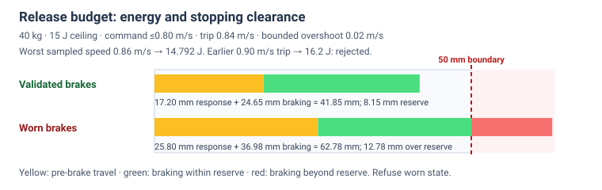
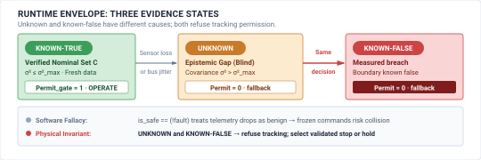

# Deployment Release {#sec-release}

::: {layout-narrow}
::: {.column-margin}

\chapterminitoc

:::

::: {.content-visible when-format="pdf"}
\noindent
{fig-alt="Isometric blueprint showing deployment release and safety cases: Goal Structuring Notation argument pyramid in transparent glass tablets, emerald physical evidence pipelines, golden deployment authorization seal, and Harvard crimson certified operational envelope threshold with revocation interlocks."}
:::

::: {.content-visible unless-format="pdf"}
{fig-alt="Isometric blueprint showing deployment release and safety cases: Goal Structuring Notation argument pyramid in transparent glass tablets, emerald physical evidence pipelines, golden deployment authorization seal, and Harvard crimson certified operational envelope threshold with revocation interlocks."}
:::

:::

## Purpose {.unnumbered .unlisted}

::: {.content-visible when-format="pdf"}
\begin{marginfigure}
\vspace{1em}
\resizebox{\linewidth}{!}{\mlphysicalstackfull{20}{20}{20}{20}{20}}
\end{marginfigure}
:::

_Under what auditable chain of physical evidence is an autonomous machine permitted to move among humans?_

Releasing a machine allows its software to produce physical consequences outside the test environment. That permission requires an argument connecting the intended operation to evidence about the assembled system. Model accuracy alone cannot ensure the machine stops within its clearance, nor can a demonstration confirm the fallback's effectiveness under required faults. The release decision must identify which measurements support each claim and which assumptions limit its scope. A change in payload or operating conditions can invalidate the argument even when the software remains unchanged. Operating authority carries conditions the deployed system must monitor and specify responses when they no longer hold. Release brings the brain's capabilities, the nervous system's enforcement, and the body's measured limits under one accountable judgment about where the machine may operate and what evidence must remain valid for that permission to continue.



::: {.callout-learning-objectives}

- Construct a release argument linking a bounded operating claim to auditable physical evidence
- Evaluate whether evidence supports operation, conditional operation, or refusal within the proposed envelope
- Specify standing conditions that withdraw operating authority when measurements or configuration changes invalidate a release
- Diagnose unsupported assumptions and weak evidence through adversarial review of a release argument

:::

## The Decision to Deploy {#sec-release-decision-to-deploy}

A directory of passing test records and hardware fault traces does not answer the ultimate systems question: under what auditable chain of physical evidence can an autonomous machine move among humans? In enterprise software or web services, deploying a new build carries operational and financial risk—a regression may corrupt a customer database or degrade service latency. In physical AI, the decision to release delegates physical authority over mass, force, and velocity into an unstructured world populated by human beings. An unhandled edge case, a perceptual hallucination, or an unbudgeted compute latency spike does not terminate in a benign software stack trace; it converts stored electrical, chemical, or hydraulic energy into crushing kinetic work against physical structures and human bodies. Even after adversarial verification harnesses have systematically stressed cyber-physical assumptions—injecting clock drift, memory bus contention, sensor resonance spoofing, and hardware fault conditions into target silicon and mechanics—the engineering challenge shifts from uncovering defects to proving bounds. Yet in engineering practice, development teams routinely attempt to justify deployment using ungrounded statistical optimism: quoting 99.9 percent benchmark accuracy on static validation datasets, or showcasing thousands of error-free cycles recorded during controlled laboratory demonstrations. Neither metric addresses the release question. High validation accuracy merely demonstrates that a learned policy can reproduce training correlations under stationary data distributions, while a flawless laboratory demonstration proves only that a single sequence of states executed safely under the particular environmental conditions present during that run. Deciding to deploy is not a statistical prediction; it is an evidence-based engineering adjudication that formalizes whether empirical data bounds the physical risk of operation.

::: {.column-margin .margin-pointer}
↰ **Prerequisite:** The empirical verification evidence backing release claims is produced in @sec-verification-qualification-ladder.
:::

::: {#fig-16-locator fig-env="figure" fig-pos="htb" fig-cap="**Safety cases architecture focus**: The four-tier physical AI systems architecture highlights the system governance and assurance tier, with safety cases as this chapter's active focus. Read the highlighted box as the point where measurements and runtime enforcers from every lower tier are assembled into an auditable argument, because deciding that a machine may operate requires proof rather than statistical optimism." fig-alt="Diagram titled Physical AI Systems Architecture Stack, drawn as four stacked tiers. Layer 4 is system governance and assurance at 0.1 to 1 hertz, holding boxes for shared autonomy, verification, safety cases, and frontier limits. Layer 3 is the brain, a cognitive deliberation tier at 1 to 50 hertz, holding five stages named ingestion, perception, memory, intent, and planner. A dashed proposal-permission privilege boundary separates it from layer 2, the nervous system, a real-time safety and timing tier at 1000 hertz. Layer 1 is the physical body and continuous plant. Layer 4 is outlined and its safety cases box is highlighted; the badge reads Active Focus, Chapter 16, Safety Cases."}
{width="100%" fig-alt="Diagram titled Physical AI Systems Architecture Stack, drawn as four stacked tiers. Layer 4 is system governance and assurance at 0.1 to 1 hertz, holding boxes for shared autonomy, verification, safety cases, and frontier limits. Layer 3 is the brain, a cognitive deliberation tier at 1 to 50 hertz, holding five stages named ingestion, perception, memory, intent, and planner. A dashed proposal-permission privilege boundary separates it from layer 2, the nervous system, a real-time safety and timing tier at 1000 hertz. Layer 1 is the physical body and continuous plant. Layer 4 is outlined and its safety cases box is highlighted; the badge reads Active Focus, Chapter 16, Safety Cases."}
:::

As illustrated in the architecture stack in @fig-16-locator, Safety Cases and Release Governance form the third pillar of Tier 4 (System Governance & Assurance). Operating at supervisory cadences of $0.1\text{ to }1\text{ Hz}$, release governance serves as the constitutional gatekeeper of the physical AI stack. It does not generate control actions; rather, it evaluates whether the mechanisms constructed and tested across every lower tier cohere into an unbroken, auditable argument:

- **The Brain (Tier 3):** evaluating whether the uninterpretable representations and probabilistic trajectory proposals of vision-language-action policies are bounded by provable constraints;[^fn-bridge-release-brain]
- **The Nervous System (Tier 2):** verifying that independent enforcers, watchdogs, and fallbacks can revoke learned-policy tracking within the deadlines derived for this plant; the worked $1\text{ ms}$ control period is distinct from full stopping response;[^fn-bridge-release-nervous] and
- **The Body (Tier 1):** grounding all safety claims in the hard physics of contact mechanics, effective moving inertia, motor winding thermal limits, and biomechanical human injury thresholds (such as ISO/TS 15066).[^fn-bridge-release-body]

[^fn-bridge-release-brain]: **Privilege Separation in Cognitive Architecture**\index{Privilege separation!Tier 3 release}: As established in @sec-brain-embodied, Tier 3 cognitive models are probabilistic and unverified. Release governance ensures that learned policies are never granted direct actuator authority, requiring all proposed setpoints to pass through deterministic enforcers. Granting direct actuator access to unverified latent representations risks commanding trajectory setpoints that exceed mechanical joint limits or induce destructive high-speed collisions.

[^fn-bridge-release-nervous]: **Enforcement and Safe Sets**\index{Deterministic enforcement!Tier 2 release}: As detailed in @sec-nervous-multi-rate-bridge and @sec-enforcement-safe-sets-conditional-permission, a sampled control barrier can constrain admitted commands under its model, state-estimation, input, and timing assumptions. The release case checks those assumptions and independent preemption under the claimed faults. Bus starvation or software lockups can otherwise consume the stopping margin.

[^fn-bridge-release-body]: **Causal Boundaries and Contact Criteria**\index{Causal boundaries!Tier 1 release}: As analyzed in @sec-boundary-causal-boundary and @sec-body-five-budgets, the contact assessment must name effective moving mass, geometry, stiffness, body region, pressure, and velocity. ISO/TS 15066 supplies body-region-dependent guidance; $50\text{ N}$ is the conservative criterion selected for this worked cell, not a universal transient-contact threshold.

The worked cell sorts and transfers metal castings beside assembly workers. Its proposed contact criterion is $50\text{ N}$ under a specified contact model; at $12.0\text{ kg}$ effective mass and $1.71\text{ m/s}$, the unbraked elastic model predicts about $725\text{ N}$. Release therefore depends on pre-contact clearance, measured brake capability, a bounded full response path, and fault evidence.[^fn-bridge-release-verification] A measured $P_{99.99}\le1.8\text{ ms}$ reflex latency is useful evidence, but a percentile alone cannot serve as the hard response bound.

[^fn-bridge-release-verification]: **Fault Evidence**\index{Fault manifest!Tier 4 release}: @Sec-verification-fault-injection and @sec-verification-fault-manifest describe signed, reproducible fault records. They document responses to injected conditions; a finite campaign does not by itself establish the worst possible response or coverage of untested fault modes.

A release verdict is a bounded, revocable judgment. The chapter builds that judgment from the ODD, a claim-argument-evidence tree, three signed verdicts, standing conditions, and a manifest whose invalid evidence withdraws permission.

## The Release Question {#sec-release-question}

The release question is whether evidence justifies a particular machine's motion in a defined operating domain. The argument names the physical bounds, specified fault set, and validated permission and fallback path. It can support a revocable grant of tracking authority while those conditions hold; it cannot infer protection against every possible fault from finite tests (\ref{dfn-release-goal-structured-safety-case}).

::: {#dfn-release-goal-structured-safety-case .callout-definition title="Claim-argument-evidence safety case"}

***Claim-argument-evidence safety case***\index{Claim-argument-evidence safety case!definition}\index{Safety case!physical AI} is the auditable, structured assurance argument for a specified physical machine, operating envelope, hazard criteria, and fault model, linking top-level safety claims to concrete empirical evidence through explicit engineering warrants.

1.  **Significance**: Transforms subjective, informal deployment confidence into an auditable, falsifiable engineering argument that connects high-level safety goals to concrete empirical evidence across the entire physical stack.
2.  **Distinction**: Unlike software unit test suites or static model validation scorecards, a physical safety case explicitly links operational design domain boundaries, hardware fault injection logs, and runtime enforcer tripwires to demonstrate bounded residual risk.
3.  **Common pitfall**: Treating the safety case as a retrospective compliance checklist completed after development, rather than a living architectural contract that governs feature integration and release gating.

:::

The **operational design domain (ODD)**\index{Operational design domain!definition} is the set of physical and environmental states covered by the release case. The worked cell permits a reach no greater than $1.2\text{ m}$ and height $0.10$–$1.20\text{ m}$, payload $0.5$–$12.0\text{ kg}$ within an inertia bound, measured contact friction $\mu\ge0.35$, ambient $15$–$40^\circ\text{C}$, illumination $200$–$3500\text{ lx}$, and a measured human separation of at least $0.30\text{ m}$. Parts of those ranges are conditional rather than nominal, as specified in @tbl-16-odd-invariants. Unknown measurements do not establish ODD membership.

::: {.column-margin .margin-pointer}
↰ **Prerequisite:** Absence ledgers defining the operational design domain originate in @sec-data-schema.
:::

Inside these boundaries the learned policy may propose actions across the nominal task envelope, but each action still requires independent permission. Conditional zones restrict that envelope; for example, the worked cell slows when illumination falls below $500\text{ lx}$ or measured friction falls below $\mu=0.50$. Unknown measurements and states outside the signed envelope refuse autonomous motion and invoke the separately validated, state-dependent stop. @Fig-16-real-autonomous-haul-truck illustrates the scale of machinery for which this distinction matters; the photograph alone does not establish its sensors or braking architecture.

::: {#fig-16-real-autonomous-haul-truck fig-env="figure" fig-pos="t" fig-cap="**Large-machine context**: A loaded Caterpillar 785C haul truck at the Kosse lignite mine illustrates the mass and clearance a release case may need to address. The photograph does not establish autonomous operation, sensing, or braking performance. Photo: Roy Luck, [Wikimedia Commons](https://commons.wikimedia.org/wiki/File:Caterpillar_haul_truck,_Luminant_Energy_Kosse_lignite_mine_(5556779421).jpg) ([CC BY 2.0](https://creativecommons.org/licenses/by/2.0/)); [original on Flickr](https://www.flickr.com/photos/royluck/5556779421/)." fig-alt="A large yellow Caterpillar 785C truck carries a heaped load of earth on an open mine road. Tall tires and a stairway beside the cab show its scale; dust trails from the rear. Its control mode and braking behavior are not visible."}
{width="85%" fig-alt="A large yellow Caterpillar 785C truck carries a heaped load of earth on an open mine road. Tall tires and a stairway beside the cab show its scale; dust trails from the rear. Its control mode and braking behavior are not visible."}
:::

As formalized in @tbl-16-odd-invariants, each monitored dimension is partitioned into nominal, conditional, and refusal states. The rows are an illustrative cell configuration; rates, trip response, and stop feasibility require validation on the assembled plant. A conditional state restricts admitted proposals. A refusal state withdraws tracking permission and selects a validated fallback; cutting torque alone can allow a moving load to coast.

\Needspace{28\baselineskip}

| ODD Dimension / Invariant    | Nominal Envelope ($\mathcal{S}_{\mathrm{nom}}$)                               | Degraded Boundary ($\mathcal{S}_{\mathrm{cond}}$)                                                               | Hard Refusal ($\mathcal{S}_{\mathrm{refuse}}$)                               | Runtime Monitor & Rate                 | Enforcer Action & Latency                                  |
|:-----------------------------|:------------------------------------------------------------------------------|:----------------------------------------------------------------------------------------------------------------|:-----------------------------------------------------------------------------|:---------------------------------------|:-----------------------------------------------------------|
| **Workspace Reach & Height** | $0\le r\le1.00\text{ m}$, $0.10\le z\le1.20\text{ m}$                         | $1.00<r\le1.20\text{ m}$ with nominal height                                                                    | $r<0$ or $r>1.20\text{ m}$; $z<0.10$ or $z>1.20\text{ m}$                    | Encoders, configured sample rate       | Restrict speed in buffer; refuse outside reach or height   |
| **Payload Mass & Inertia**   | $0.5\le m\le8.0\text{ kg}$, $0\le I_{zz}\le0.08\text{ kg m}^2$                | $8.0<m\le12.0\text{ kg}$ with $I_{zz}\le0.08\text{ kg m}^2$                                                     | Other mass or inertia; invalid load estimate                                 | Calibrated load estimate               | Derate for heavier payload; refuse invalid estimate        |
| **Contact Surface Friction** | Measured $\mu\ge0.50$                                                         | $0.35\le\mu<0.50$                                                                                               | $\mu<0.35$ or unverified surface                                             | Tactile shear and scheduled inspection | Restrict grasp; stop on loss of validated traction         |
| **Ambient Illumination**     | $500\le E\le2000\text{ lx}$                                                   | $200\le E<500$ or $2000<E\le3500\text{ lx}$                                                                     | $E<200$ or $E>3500\text{ lx}$                                                | Calibrated light sensor                | Restrict sensing-dependent tasks or refuse                 |
| **Thermal Actuator State**   | $15\le T_{\rm amb}\le35^\circ\text{C}$ and $0\le T_{\rm coil}\le353\text{ K}$ | $35<T_{\rm amb}\le40^\circ\text{C}$ or $353<T_{\rm coil}\le383\text{ K}$, and neither variable in refusal range | $T_{\rm amb}<15$ or $>40^\circ\text{C}$; $T_{\rm coil}<0$ or $>383\text{ K}$ | Thermistors and age checks             | Derate only in validated combined states; otherwise refuse |
| **Human Co-Presence**        | $d_{\rm sep}\ge1.50\text{ m}$                                                 | $0.30\le d_{\rm sep}<1.50\text{ m}$                                                                             | $d_{\rm sep}<0.30\text{ m}$ or invalid range                                 | Safety-rated separation sensing        | Restrict speed; command assessed protective stop           |

: **Operational design domain (ODD) boundary example**: Each listed dimension has disjoint nominal, conditional, and refusal intervals. Conditional operation requires every dimension to remain in a signed admissible interval; missing or invalid measurements refuse. Sensor rates and stopping response are plant validation obligations. {#tbl-16-odd-invariants tbl-colwidths="[16,16,18,18,16,16]"}

A defensible release claim states its plant, contact geometry, and fault set.[^fn-std-isots15066-biomech] The proposed cell uses a chosen $50\text{ N}$ peak-force criterion for an assessed contact case and a $40\text{ ms}$ stopping target under validated braking and response assumptions. The release argument must demonstrate which human contacts are excluded before impact, which detected contacts the model covers, and which single faults the independent fallback handles. A stop after contact does not by itself cap the first force peak.[^fn-math-contact-mechanics]

[^fn-std-isots15066-biomech]: **ISO/TS 15066 Biomechanical Limits**\index{ISO/TS 15066!biomechanical limits}: The specification gives body-region- and contact-type-dependent force and pressure data [@isots15066]. A site assessment must select the applicable body region, contact geometry, and measurement procedure. The $50\text{ N}$ figure here is a conservative case criterion, not a universal ISO/TS 15066 threshold or an injury boundary.

[^fn-math-contact-mechanics]: **Contact Mechanics Force Model**\index{Contact mechanics!force model}: The elastodynamic model couples translational kinetic energy, effective moving inertia, and contact interface stiffness to determine transient peak impact force during an unmitigated collision. Impacting a rigid boundary concentrates stored kinetic energy into a sub-millisecond impulse with severe force amplification, whereas elastic compliance extends deformation time and dissipates energy over a longer stroke. For the formal elastodynamic derivation and unilateral contact formulations, see @sec-appendix-control-contact.

```{python}
#| label: calc-release-biomechanical-impact-envelope
#| echo: false
from mlsysim import *
from mlsysim.core.units import *
from mlsysim.fmt import fmt_energy, fmt_qty, fmt_multiple, fmt_latency, fmt_acceleration, fmt_length, fmt_int, check
from mlsysim.physics.robotics import (
    calc_safe_stopping_distance,
    calc_transient_impact_force,
    calc_kinetic_energy,
)

# ┌── 1. INPUT (Manipulator kinematics & biomechanical tissue context) ─
m_eff = 12.0 * kg
v_max = 1.71 * meter / second
k_tissue = 15000.0 * newton / meter
f_iso_limit = 50.0 * newton

t_detect_nominal = 2.0 * millisecond
a_brake_spring = 45.0 * (meter / (second**2))
delta_t_contamination = 12.0 * millisecond

# ┌── 2. COMPUTE (Impact energy, contact force & stopping envelopes) ───
e_k = calc_kinetic_energy(m_eff, v_max)
f_unbraked = calc_transient_impact_force(v_max, m_eff, k_tissue)
f_ratio = (f_unbraked / f_iso_limit).magnitude

# Nominal stopping envelope
d_drift_nom = (v_max * t_detect_nominal).to(
    millimeter
)  # Nominal distance drift before braking, calculated as the product of maximum velocity and detection time.
t_brake_nom = (v_max / a_brake_spring).to(
    millisecond
)  # Nominal braking time, derived from maximum velocity divided by braking system acceleration, where 'a_brake_spring' is the effective deceleration.
d_brake_nom = ((v_max**2) / (2.0 * a_brake_spring)).to(
    millimeter
)  # Nominal braking distance, calculated using kinematic equations, representing the distance required to stop from maximum velocity under constant deceleration.
t_stop_nom = (
    t_detect_nominal + t_brake_nom
)  # Total stopping time, combining detection and braking times to understand the overall response time of the system.
d_stop_nom = (
    d_drift_nom + d_brake_nom
)  # Total stopping distance, the sum of drift and braking distances, illustrating the complete stopping envelope.

# Contaminated / delayed envelope
t_detect_delayed = t_detect_nominal + delta_t_contamination
d_drift_delayed = (v_max * t_detect_delayed).to(millimeter)
d_stop_delayed = d_drift_delayed + d_brake_nom
t_stop_delayed = t_detect_delayed + t_brake_nom
d_breach = d_stop_delayed - d_stop_nom
expansion_pct = ((d_stop_delayed - d_stop_nom) / d_stop_nom).magnitude * 100.0

# ┌── 3. GUARDS (Integrity checks) ────────────────────────────────────
check(abs(e_k.to(joule).magnitude - 17.54) < 0.02, f"Unexpected kinetic energy: {e_k}")
check(abs(f_unbraked.to(newton).magnitude - 725.5) < 0.2, f"Unexpected unbraked force: {f_unbraked}")
check(abs(f_ratio - 14.51) < 0.1, f"Unexpected force ratio: {f_ratio}")
check(abs(d_drift_nom.to(millimeter).magnitude - 3.42) < 0.01, f"Unexpected nominal drift: {d_drift_nom}")
check(abs(t_brake_nom.to(millisecond).magnitude - 38.0) < 0.1, f"Unexpected brake time: {t_brake_nom}")
check(abs(d_brake_nom.to(millimeter).magnitude - 32.49) < 0.02, f"Unexpected brake distance: {d_brake_nom}")
check(abs(t_stop_nom.to(millisecond).magnitude - 40.0) < 0.1, f"Unexpected total nominal stop time: {t_stop_nom}")
check(abs(d_stop_nom.to(millimeter).magnitude - 35.91) < 0.02, f"Unexpected nominal stop distance: {d_stop_nom}")
check(abs(d_drift_delayed.to(millimeter).magnitude - 23.94) < 0.01, f"Unexpected delayed drift: {d_drift_delayed}")
check(abs(d_stop_delayed.to(millimeter).magnitude - 56.43) < 0.02, f"Unexpected delayed stop distance: {d_stop_delayed}")
check(abs(t_stop_delayed.to(millisecond).magnitude - 52.0) < 0.1, f"Unexpected delayed stop time: {t_stop_delayed}")
check(abs(d_breach.to(millimeter).magnitude - 20.52) < 0.1, f"Unexpected breach distance: {d_breach}")
check(abs(expansion_pct - 57.14) < 0.2, f"Unexpected expansion pct: {expansion_pct}")

# ┌── 4. OUTPUT (Canonical math formatting) ───────────────────────────
class BiomechanicalImpactEnvelope:
    e_k_str = fmt_energy(e_k, unit=joule, precision=2)
    f_unbraked_str = fmt_qty(f_unbraked, newton, precision=1)
    f_limit_str = fmt_qty(f_iso_limit, newton, precision=0)
    f_ratio_mult_str = fmt_multiple(f_ratio, precision=1)

    t_detect_str = fmt_latency(t_detect_nominal, unit=millisecond, precision=0)
    a_brake_str = fmt_acceleration(a_brake_spring, unit=meter / (second**2), precision=0)
    d_drift_str = fmt_length(d_drift_nom, unit=millimeter, precision=2)
    t_brake_str = fmt_latency(t_brake_nom, unit=millisecond, precision=0)
    d_brake_str = fmt_length(d_brake_nom, unit=millimeter, precision=1)
    t_stop_str = fmt_latency(t_stop_nom, unit=millisecond, precision=0)
    d_stop_str = fmt_length(d_stop_nom, unit=millimeter, precision=1)

    delta_t_delay_str = fmt_latency(delta_t_contamination, unit=millisecond, precision=0)
    t_detect_delayed_str = fmt_latency(t_detect_delayed, unit=millisecond, precision=0)
    d_drift_delayed_str = fmt_length(d_drift_delayed, unit=millimeter, precision=2)
    d_stop_delayed_str = fmt_length(d_stop_delayed, unit=millimeter, precision=2)
    d_stop_delayed_round_str = fmt_length(d_stop_delayed, unit=millimeter, precision=1)
    t_stop_delayed_str = fmt_latency(t_stop_delayed, unit=millisecond, precision=0)
    d_breach_str = fmt_length(d_breach, unit=millimeter, precision=1)
    expansion_pct_int_str = fmt_int(round(expansion_pct))
```

Consider an effective moving mass (manipulator link, wrist, and gripped casting) of $m_{\text{eff}} = 12.0\text{ kg}$ traveling at peak transit velocity $v_{\text{max}} = 1.71\text{ m/s}$. The initial translational kinetic energy carried by the payload evaluates to:
$$E_k = \frac{1}{2} m_{\text{eff}} v_{\text{max}}^2 = \frac{1}{2} (12.0\text{ kg})(1.71\text{ m/s})^2 = 17.54\text{ J}$$
In an unbraked elastic impact against human tissue modeled with effective compliance stiffness $k_{\text{tissue}} = 15{,}000\text{ N/m}$, the peak contact force follows @eq-release-unbraked-force:
$$F_{\text{unbraked}} = v_{\text{max}} \sqrt{k_{\text{tissue}} m_{\text{eff}}} = 1.71\text{ m/s} \times \sqrt{15{,}000\text{ N/m} \times 12.0\text{ kg}} \approx 725.5\text{ N}$$ {#eq-release-unbraked-force}
This ideal elastic model predicts `{python} BiomechanicalImpactEnvelope.f_unbraked_str`, or `{python} BiomechanicalImpactEnvelope.f_ratio_mult_str` the worked case's selected `{python} BiomechanicalImpactEnvelope.f_limit_str` criterion. It establishes why this speed and mass cannot be admitted into an unseparated contact zone without a stronger, measured protection argument.

To maintain the release claim, the safety reflex incorporates an optical-tactile contact detector with latency $t_{\text{detect}} =$ `{python} BiomechanicalImpactEnvelope.t_detect_str`, followed by electromechanical spring brakes providing sustained deceleration $a_{\text{brake}} =$ `{python} BiomechanicalImpactEnvelope.a_brake_str`. The total stopping distance combines reaction drift and active braking displacement, formalized in @eq-release-stopping-distance:[^fn-math-braking-distance]
$$d_{\text{stop}} = d_{\text{drift}} + d_{\text{brake}} = v_{\text{max}} \cdot t_{\text{detect}} + \frac{v_{\text{max}}^2}{2 a_{\text{brake}}}$$ {#eq-release-stopping-distance}
Under nominal execution, reaction drift spans $d_{\text{drift}} = (1.71\text{ m/s})(0.0020\text{ s}) =$ `{python} BiomechanicalImpactEnvelope.d_drift_str`, active braking requires $t_{\text{brake}} = 1.71 / 45.0 =$ `{python} BiomechanicalImpactEnvelope.t_brake_str` across $d_{\text{brake}} = (1.71)^2 / (2 \times 45.0) \approx$ `{python} BiomechanicalImpactEnvelope.d_brake_str`, yielding a total stopping time $t_{\text{stop}} = 2.0\text{ ms} + 38.0\text{ ms} =$ `{python} BiomechanicalImpactEnvelope.t_stop_str` and stopping envelope $d_{\text{stop}} \approx$ `{python} BiomechanicalImpactEnvelope.d_stop_str`.

[^fn-math-braking-distance]: **Kinematic Braking Integration**\index{Kinematic braking!integration}: Computing total stopping distance requires piecewise integration of the velocity profile across initial reaction latency and active mechanical deceleration phases. The moving mass drifts linearly at maximum velocity during the sensing and brake solenoid engagement interval before following a quadratic trajectory as mechanical friction dissipates stored momentum. Underestimating reaction latency or brake engagement lag causes the machine to penetrate safety zones before deceleration begins.

If optical surface contamination (e.g., airborne oil mist on tactile covers) delays impact detection by an unbudgeted $\Delta t_{\text{delay}} =$ `{python} BiomechanicalImpactEnvelope.delta_t_delay_str` (expanding perception latency to $t_{\text{detect}}' =$ `{python} BiomechanicalImpactEnvelope.t_detect_delayed_str`), reaction drift expands to $d_{\text{drift}}' = (1.71)(0.014) =$ `{python} BiomechanicalImpactEnvelope.d_drift_delayed_str`. The total stopping envelope widens to $d_{\text{stop}}' = 23.94\text{ mm} + 32.49\text{ mm} =$ `{python} BiomechanicalImpactEnvelope.d_stop_delayed_str`, while stopping time extends to $t_{\text{stop}}' = 14.0\text{ ms} + 38.0\text{ ms} =$ `{python} BiomechanicalImpactEnvelope.t_stop_delayed_str`. Because $t_{\text{stop}}' = 52.0\text{ ms} > 40.0\text{ ms}$ and $d_{\text{stop}}' = 56.4\text{ mm} > 36.0\text{ mm}$, the modeled stop exceeds its assumed clearance budget by `{python} BiomechanicalImpactEnvelope.d_breach_str` (a `{python} BiomechanicalImpactEnvelope.expansion_pct_int_str` percent expansion). Contact depends on the actual obstacle geometry, but this result falsifies the proposed clearance warrant (\ref{chk-release-contact-force-and-stopping-envelope-budget}).

::: {#chk-release-contact-force-and-stopping-envelope-budget .callout-checkpoint title="Biomechanical force and stopping envelope"}

Before signing off on human-robot coexistence envelopes, verify your understanding of biomechanical impact forces, detection latency drift, and active braking clearance:

- [ ] **Biomechanical injury thresholds**: Can you explain why unbraked kinematic momentum transforms into transient peak forces exceeding human tissue pain limits by more than an order of magnitude?
- [ ] **Reaction drift vs. active braking**: Can you distinguish between the linear reaction displacement during sensor detection latency and the quadratic dissipation of kinetic energy during active friction braking?
- [ ] **Sensing latency tails**: Can you describe how unbudgeted perceptual latency tails (such as optical contamination) expand the physical stopping envelope and invalidate a release claim?
:::

Accountability for the release decision must reside with an identifiable **lead systems adjudicator**\index{Lead systems adjudicator!accountability} rather than being diffused across development teams. In complex physical AI architectures, diffusion of responsibility is a primary organizational failure mode. A vision team signs off on mean average precision scores, an actuator supplier signs off on motor torque curves, and a reinforcement learning team signs off on policy convergence. Each group assumes that another layer provides the margin of safety. The lead systems adjudicator alone assumes personal technical authority for the release verdict, attesting that the integrated system satisfies the safety case. This attestation binds the verdict to a set of immutable technical artifacts, including the cryptographic hash of the verified policy weights, the calibration logs of the tactile sensors, the measured $P_{99.99} \le 1.8\text{ ms}$ reflex tail together with a separately justified worst-response bound, and the physical dynamometer records establishing the $45\text{ m/s}^2$ braking deceleration. Signing records the adjudicator's bounded judgment about that evidence and the specified operating domain.

Every release verdict carries an expiration boundary defined by physical degradation and environmental change. A machine whose release case was accepted at commissioning can become unsafe through operational drift, out-of-distribution physical interactions, and unmodeled mechanical wear. Over months of operation in a manufacturing plant, particulate contamination on optical tactile covers degrades force sensing resolution, ambient temperature swings alter motor coil resistance (as established in @sec-body-five-budgets), and gear backlash in the arm joints increases tracking errors while degrading braking efficiency. Out-of-distribution interactions, such as an operator presenting an unmodeled workpiece with unfamiliar surface compliance, invalidate the momentum transfer assumptions of the contact proof. When sensor diagnostics detect parameter drift beyond tolerance, or when total operating cycles reach the service limit of the mechanical friction brakes, the **release verdict**\index{Release verdict!invalidation} is invalidated automatically. The release question must then be asked again, demanding a renewed chain of evidence before physical authority can be restored.

## Safety Cases and Claims {#sec-release-safety-cases-claims}

A safety case is a structured argument that a physical machine meets its safety claims within a specified operational design domain. Adapting Stephen Toulmin's structural argumentation framework [@toulmin1958uses], Goal Structuring Notation (GSN)\index{Goal Structuring Notation}[^fn-std-gsn-argument] [@kelly1998arguing; @kelly2004goal], and the UL 4600 autonomy evaluation standard [@koopman2020how], this argument takes the form of a **claim-argument-evidence (CAE) safety case**\index{Claim-argument-evidence safety case!definition}. This framework decomposes a top-level safety proposition (e.g., non-injurious kinetic force dissipation) into falsifiable sub-claims, linking them through architectural and inductive warrants to empirical measurements, hardware logs, and containment proofs.

[^fn-std-gsn-argument]: **Goal Structuring Notation**\index{Goal Structuring Notation!argumentation grammar}: Developed by Tim Kelly at the University of York, GSN provides an explicit graphical grammar for structuring and auditing safety assurance cases [@kelly1998arguing; @kelly2004goal]. The notation decomposes top-level system safety goals into contextual sub-claims, argumentation strategies, and verifiable solutions grounded in empirical test artifacts. Omitting rigorous hierarchical decomposition conceals unverified inductive leaps between high-level policies and low-level physical dynamics.

The root of the tree is the top-level claim, which asserts a measurable physical property required to prevent harm, such as guaranteeing that the kinetic energy of an articulated manipulator dissipates before the tool center point penetrates a human safety zone, or that an autonomous haul truck brings its 240-ton moving mass to rest within corridor containment. This top-level claim cannot be validated directly by inspection. Instead, it is broken down through strategies or intermediate arguments that partition the verification problem across operational sub-regimes, physical hazard classes, or architectural subsystems. Each sub-claim terminates either in supporting sub-claims or in concrete evidentiary artifacts, bounded by explicit context and assumptions that define the physical conditions under which the links hold.

::: {.column-margin}
{width="100%" fig-alt="S·P·A locator triad highlighting the central causal core."}

*Release assurance: structured safety cases bounding the complete operational envelope across Sense, Plan, and Act.*
:::

The structure's validity hinges on distinguishing genuine evidence from demonstration. A **demonstration**\index{Demonstration!versus evidence} is a record of successful task execution over an uncharacterized test distribution, such as recording ten thousand error-free bin-picking cycles under nominal factory conditions. Demonstrations measure mean performance but do not bound tail behavior or reveal failure modes outside the sampled trajectory. Genuine evidence consists of falsifiable, calibrated artifacts with quantified bounds. In a physical AI system, evidence comprises worst-case timing distributions from real-time hardware execution traces (including stator delays characterized in @sec-body-five-budgets), calibrated sensor noise profiles under degraded environmental states, dynamic load cell measurements recorded across deceleration regimes, and targeted fault injection trials that deliberately force the policy to the boundary of its training distribution. An evidentiary artifact lacking quantified uncertainty or failing to test the physical boundary remains a demonstration and cannot support an inferential link.

Connecting an item of evidence to a claim requires a **warrant**\index{Warrant!inferential rule}, which is the inferential rule stating why the data proves the assertion. In software systems governed by learned policies, this link is inductive, asserting that because the system avoided failure across finite test episodes, it will continue to avoid failure during future deployment. In physical systems operating in continuous state spaces, this inductive link is fundamentally incomplete without a deterministic enforcer.

Finite black-box testing cannot validate high-consequence physical claims, as illustrated by a target hazard rate in failures per operating hour. Establishing that a system's true hazard rate meets an acceptable threshold with high statistical confidence requires a duration of testing that is mathematically intractable.[^fn-math-poisson-testing] For an industrial manipulator operating beside human assembly workers, an acceptable catastrophic hazard rate might be set at one catastrophic failure per million operating hours ($\lambda = 10^{-6}\text{ failures/hour}$). To demonstrate this bound empirically with a standard 95 percent confidence level, the test campaign must complete approximately $3,000,000\text{ hours}$ (or $342\text{ years}$) of continuous, failure-free testing on a single machine. Even a fleet of one hundred test cells running continuously in parallel would require more than three years of uninterrupted operation without encountering a single unmitigated fault. Empirical testing cannot cover the continuous state space within practical schedules, making an inductive link based solely on sampling insufficient for establishing safety. The argument must bridge the inductive gap through an architectural warrant, grounding the claim in a deterministic physical enforcer (@sec-enforcement) that monitors reflex latencies and SE(3) kinematics in hardware, bounding actuator torque limits and interrupting motor power whenever learned commands violate ISO 10218 safety envelopes (\ref{nbk-release-odd-boundary-coverage-finite-failure-free}).

[^fn-math-poisson-testing]: **Poisson Stationarity Assumptions**\index{Poisson process!stationarity violation}: A homogeneous Poisson model assumes a constant hazard rate $\lambda$ over the stated exposure. Wear and thermal cycling can make that rate age- and load-dependent; a Weibull model is one possible alternative when supported by data. Applying a constant-rate estimate to later life without checking those conditions can understate risk.

::: {#nbk-release-odd-boundary-coverage-finite-failure-free .callout-notebook title="ODD coverage and Bayesian safety claims"}
**Engineering Question**: How many failure-free test hours $N$ must an autonomous machine operate to substantiate a catastrophic hazard rate of $\lambda = 10^{-6}\text{ /h}$ at 95 percent statistical confidence through empirical black-box testing alone, and how does adding a deterministic hardware enforcer with coverage $c = 0.9999$ alter the required testing duration?

**1. The Mathematical Intractability of Pure Empirical Testing:**
Proving with 95 percent statistical confidence that an autonomous system's true catastrophic hazard rate does not exceed $\lambda = 10^{-6}\text{ failures/hour}$ requires approximately $3.0\times 10^6\text{ hours}$ (342 years) of continuous, failure-free operation on physical hardware. If even a single failure occurs during the test campaign, the required operational exposure increases substantially. In high-consequence embodied domains, verifying safety solely through black-box endurance testing is physically and economically intractable within practical engineering schedules. For the formal Poisson zero-failure testing derivations, Clopper-Pearson confidence intervals, and Bayesian risk formulations, see @sec-evaluation-closed-loop-dynamics.

**2. Conditional Architectural Decomposition:**
Suppose hazardous *proposals* follow an assumed constant rate and an independent enforcer successfully contains $99.99\%$ of that proposal population. Then the residual rate from that path is $\lambda_{\rm proposal}(1-c)$; at a proposal rate of $0.01/\text{h}$ it equals $10^{-6}/\text{h}$. About 300 failure-free hours would put a one-sided 95 percent upper limit near $0.01/\text{h}$ for the proposal rate under a constant-rate exposure model. This does not measure $c$, detector coverage, common-cause failures, or hardware failures. Those need separate evidence and must enter the combined system claim.

**Systems insight**: Architectural containment can shift part of the evidence burden from rare observed system harms to separately testable proposal, detection, and fallback mechanisms. The plotted reduction is conditional on those mechanisms, not a release verdict from two weeks of testing.
:::

::: {#psp-release-inductive-safety-fallacy .callout-perspective title="The inductive safety fallacy"}
Finite testing constrains rates only for the sampled population and model. @Fig-release-testing-gap compares a black-box exposure calculation with a conditional proposal-rate calculation that assumes independently justified $99.99\%$ containment. The vertical separation shows how the evidence question changes; it does not prove that the enforcer attains that coverage.
:::

::: {#fig-release-testing-gap fig-env="figure" fig-pos="htb" fig-cap="**Constructed exposure comparison**: Red is one-sided 95 percent zero-event exposure for an assumed constant system hazard rate. Blue is exposure to bound the *policy's hazardous-proposal rate* if independent, representative evidence establishes 99.99 percent containment of those proposals. Hardware failures, ODD gaps, and common-cause faults are additional terms; the blue curve is not an observed release result." fig-alt="Log-log chart of assumed hazard target versus failure-free test years. The red black-box system exposure rises to about 342 years at one event per million hours. The dashed blue conditional proposal exposure is 0.034 years, about 12.5 days, at that point only if an independent enforcer has separately demonstrated 99.99 percent coverage of the relevant proposal population. Neither curve includes hardware or common-cause failures."}

```{python}
#| echo: false
import pandas as pd
import matplotlib.pyplot as plt
import math
from mlsysim import viz

data = pd.read_csv("vol4/16_release/data/testing_gap.csv")

# Constructed constant-rate exposure model; coverage is a scenario assumption.
fig, ax, COLORS, plt = viz.setup_plot(figsize=(8, 5))

# Plot lines
ax.plot(data["Target_Hazard_Rate"], data["Black_Box_Years"], color=COLORS["RedLine"], linewidth=2.5, label="Black-box system exposure")
ax.plot(
    data["Target_Hazard_Rate"],
    data["Conditional_Proposal_Years"],
    color=COLORS["BlueLine"],
    linewidth=2.5,
    linestyle="--",
    label="Proposal exposure, assumed containment",
)

# Format axes
ax.set_xscale("log")
ax.set_yscale("log")
ax.invert_xaxis()  # Lower hazard rate to the right
ax.set_xlabel("Target System Hazard Rate (Failures/Hour)", fontsize=11, fontweight="bold")
ax.set_ylabel("Failure-free exposure in rate model (years)", fontsize=11, fontweight="bold")

# Add some reference lines and text
reference_black_years = -math.log(0.05) / (1e-6 * 24 * 365)
reference_proposal_years = reference_black_years * (1 - 0.9999)
ax.axhline(y=reference_black_years, color="gray", linestyle=":", alpha=0.7)
ax.axvline(x=1e-6, color="gray", linestyle=":", alpha=0.7)
ax.scatter([1e-6], [reference_black_years], color=COLORS["RedLine"], s=50, zorder=5)
ax.annotate(
    "$10^{-6}$ /hr\n342 years", xy=(1e-6, reference_black_years), xytext=(2.5e-6, 600), fontsize=9, color=COLORS["RedLine"], fontweight="bold"
)

# Reference point under the assumed coverage model, not a measured release result.
ax.scatter([1e-6], [reference_proposal_years], color=COLORS["BlueLine"], s=50, zorder=5)
ax.annotate("Assumed coverage\n12.5 days", xy=(1e-6, reference_proposal_years), xytext=(2.5e-6, 0.12), fontsize=9, color=COLORS["BlueLine"])

# Add a "Human Project Lifespan" shading
ax.axhspan(100, 1e8, color="gray", alpha=0.1)
ax.text(1e-4, 1e5, "High exposure", fontsize=10, style="italic", color="gray")

ax.legend(loc="upper left", frameon=True, fontsize=10)
ax.margins(x=0.14, y=0.14)
plt.tight_layout()
plt.show()
plt.close()
```

:::

Every argument link relies on contextual assumptions, with unstated assumptions posing the greatest vulnerability in a safety case. A warrant that derives safe stopping distance from measured optical camera frame rates implicitly assumes that ambient illumination remains above the sensor noise threshold, that lens covers remain free from airborne grease, that SerDes (serializer/deserializer) delivery remains within its measured loss and delay budget, and that internal bus arbitration introduces negligible jitter. In a constructed low-light mode, camera exposure lengthens from $5\text{ ms}$ to $30\text{ ms}$, adding $25\text{ ms}$ of unmodeled latency to the perception pipeline. At a tool speed of $1.8\text{ m/s}$, this unstated latency shift adds $0.045\text{ m}$ ($45\text{ mm}$) to the displacement of the arm before the braking command can be issued. The link between the vision benchmark and the stopping distance claim breaks silently because the physical environment drifted across an unstated boundary. A sound argument explicitly defines every physical dependency as a bounded context element linked to runtime diagnostic monitors that detect assumption violations.

::: {.column-margin .margin-pointer}
↳ **Downstream:** Epistemic assumptions embedded within safety case warrants are critically interrogated in @sec-frontier-epistemic-limits.
:::

The weakest link governs every claim-argument-evidence tree. A safety case is not an aggregate metric where statistical over-performance in one branch compensates for evidentiary deficits in another. High accuracy on object recognition benchmarks does not offset an uncharacterized $P_{99.9}$ latency spike in the CAN bus transceiver, nor does extensive policy simulation offset the absence of physical dynamometer brake wear data. If a top-level claim decomposes into sub-claims for kinetic energy dissipation, thermal limit protection (e.g., bounding $I^2R$ Joule heating below stator thermal derating limits established in @sec-body-thermal-duty-cycles), and SE(3) trajectory bounding, a failure in the evidence or warrant of any single branch invalidates the root claim. When an adjudicator examines the tree, the goal is not to count the number of supporting artifacts, but to identify the single weakest link whose failure would permit physical damage. Evaluating whether every branch maintains an unbroken chain of evidence from physical measurements to verified limits determines the verdict that governs machine release.

### Match the safety argument to the machine

For this industrial manipulation cell, ISO 10218-1 and ISO 10218-2 frame the robot and integration assessment; ISO/TS 15066 informs the assessed collaborative-contact case [@isots15066]. The $50\text{ N}$ force ceiling in this example is a selected, site-specific design criterion, not a universal limit from that specification. The release argument must name the contacted body region, pressure, geometry, and measurement method before using a biomechanical value.

ISO 26262 and ISO 21448 address road-vehicle electrical/electronic safety and intended-function limitations, respectively [@iso26262; @iso21448]. Their fault-versus-performance distinction is useful here as an analogy, but neither supplies an ASIL D certificate for this factory cell. An independent permission path can bound learned proposals only where its sensor coverage, plant model, actuator authority, timing, and fallback are validated. A shared bus, power rail, or sensor can defeat that independence; fault analysis and stress tests must examine those paths. Unknown obstacles or contact mechanics absent from the safety model remain release exclusions or reasons for conservative separation, not automatically solved by a control barrier.

The Claim-Argument-Evidence scorecard in @tbl-16-cae-scorecard separates physical warrants from the evidence needed to support them. Claim C3 shows the decision: oil contamination can defeat the tactile branch, so nominal model accuracy cannot justify an unrestricted verdict.

\Needspace{24\baselineskip}

| Claim                       | Warrant and operating assumptions                                                                                        | Evidence needed                                                                                             | Adjudication                                            |
|:----------------------------|:-------------------------------------------------------------------------------------------------------------------------|:------------------------------------------------------------------------------------------------------------|:--------------------------------------------------------|
| C1. Contact and stopping    | Chosen $50\text{ N}$ criterion for specified contact geometry; bounded mass, speed, stiffness, and pre-contact clearance | Calibrated force traces and a justified full-response/deceleration bound, including worn brakes             | Conditional until the measured case covers the envelope |
| C2. Permission timing       | Independent detector, bus, drive, and brake path under defined contention and faults                                     | Logic-analyzer traces plus response analysis for untested states; percentile traces are supporting evidence | Refuse if the hard delay budget lacks a bound           |
| C3. Slip detection          | Dry contact and validated traction; oily material is a defeater                                                          | Paired clean/contaminated trials, false-negative estimate, and independent torque trip evidence             | Restrict to inspected dry parts or refuse               |
| C4. Perception              | Lighting, cable, compute, and age stay inside their measured envelope                                                    | Hardware profiling across declared conditions and a fallback for stale data                                 | Restrict the sensing-dependent task on degradation      |
| C5. Permission independence | Policy cannot bypass or starve the enforcer under the claimed faults                                                     | Fault injection for bus, DMA, rail, software, and supervisor paths                                          | Refuse if a common cause defeats permission             |

: **Claim-argument-evidence review for the worked cell**: These are proposed claims and evidence obligations, not certified results. A failed branch cannot be compensated by nominal model accuracy. {#tbl-16-cae-scorecard tbl-colwidths="[11,34,35,20]"}

::: {#chk-release-claim-argument-evidence-and-inductive-warrants .callout-checkpoint title="Claim-argument-evidence decomposition and inductive warrants"}

Before presenting a safety case to external adjudicators, test the logical integrity of your Claim-Argument-Evidence structure against formal assurance criteria:

- [ ] **Top-level claim falsifiability**: Can you formulate the top-level safety goal as an unambiguous, mathematically falsifiable proposition (e.g., bounding kinetic energy transfer below tissue fracture limits) rather than an aspirational qualitative assertion?
- [ ] **Inductive warrant validity**: Can you identify the explicit physical or probabilistic warrants connecting low-level empirical test benches to high-level system safety claims, and document the operational premises under which those warrants hold?
- [ ] **Defeater and rebuttal enumeration**: Can you show where potential defeaters (e.g., sensor surface fouling, unmodeled ambient temperature swings, or CAN bus arbitration collisions) are explicitly represented in the Goal Structuring Notation graph?
- [ ] **Evidentiary provenance binding**: Can you trace every terminal evidence node in the argument tree back to an immutable, cryptographically signed test execution trace with calibrated sensor certificates?

*A safety argument with unstated inductive leaps is an operational liability disguised as formal diligence. Ensure that every claim-argument link is reinforced by empirical test manifests before submitting the dossier for adjudication.*
:::

## The Three Verdicts {#sec-release-three-verdicts}

The adjudication of a safety case resolves the claim-argument-evidence tree into three distinct verdicts, comprising **unconditional operation**\index{Verdicts!unconditional operation}, **conditional operation**\index{Verdicts!conditional operation}, and **refusal to operate**\index{Verdicts!refusal to operate}.[^fn-std-iso26262-sotif] Each verdict establishes an explicit operating contract and mandates concrete engineering actions. The first verdict, unconditional operation, grants the full envelope named in a signed release case while its standing conditions remain true. Each hazard claim in that case needs evidence for the specified plant, load, operational design domain, and fault set, including independent permission checks where learned proposals can reach actuators (@sec-boundary-causal-boundary). Brake thermal capacity, stopping clearance, and tracking-error bounds must be qualified for that envelope (@sec-body-thermal-duty-cycles). The verdict does not eliminate residual or newly discovered hazards; it authorizes operation under the assessed claims and requires revocation when their premises fail.

[^fn-std-iso26262-sotif]: **Automotive Safety Analogy**\index{Functional safety!ISO 26262}\index{ISO 21448!SOTIF}: ISO 26262 Part 10 provides guidance for interpreting the road-vehicle functional-safety series [@iso26262]. ISO 21448 addresses hazards from insufficiencies of intended functions, including perception limitations, in road vehicles [@iso21448]. Their distinction between faults and performance limits helps frame this factory-cell argument; neither standard supplies this cell's release criteria or a certificate.

The second verdict, conditional operation, applies when the evidence demonstrates that the machine is safe within a restricted operational subset, but lacks the warrants required for unconstrained deployment. Rather than treating release as an all-or-nothing threshold, engineering release can enforce physical, kinematic, or environmental boundaries to eliminate unverified hazard states. These operational boundaries include de-rating peak actuator torque or joint velocity, restricting ambient operating conditions such as temperature ranges or illumination levels, imposing physical exclusion barriers that keep human personnel outside the maximum reach radius of the manipulator, or activating runtime telemetry guardrails within the nervous system. In heavy industrial robotics, when kinetic energy and force dissipation cannot be bounded unconditionally for unseparated human co-presence, a restricted case may require an assessed physical fence and validated access interlocks (@fig-16-real-robot-safety-cell). The access design must be tested so the protective stop completes before a person reaches the hazardous workspace, converting an unmodeled contact risk into a deterministic physical exclusion boundary.

::: {#fig-16-real-robot-safety-cell fig-env="figure" fig-pos="t" fig-cap="**Physical separation example**: A yellow industrial arm works behind yellow mesh fencing. Fencing can be one condition of a restricted release when a validated access interlock and stopping test support it; the photograph does not establish those functions or their timing. Source credit: U.S. Army Chemical Materials Activity / PEO ACWA." fig-alt="Yellow industrial robot arm and metal equipment inside a factory bay bounded by yellow mesh fence panels and gates. A blue lift is outside the foreground fence. Wiring, interlock rating, and stopping behavior are not visible."}
{width="85%" fig-alt="Yellow industrial robot arm and metal equipment inside a factory bay bounded by yellow mesh fence panels and gates. A blue lift is outside the foreground fence. Wiring, interlock rating, and stopping behavior are not visible."}
:::

Every condition attached to a release verdict is a binding contract. Consider an illustrative packaging arm with $m_{\text{eff}}=40.0\text{ kg}$ at an unrestricted speed of $1.50\text{ m/s}$, carrying $45.0\text{ J}$. The site assessment selects a $15.0\text{ J}$ energy ceiling for its contact case. An initial calculation considers $0.86\text{ m/s}$, close to the mathematical ceiling; the actual command and trip limits must be lower after accounting for sampled detection and speed growth. The energy calculation is:
$$E_k = \frac{1}{2} m_{\text{eff}} v_{\text{derated}}^2 \le E_{k,\text{allow}}$$ {#eq-release-conditional-energy}
Under @eq-release-conditional-energy, $0.86\text{ m/s}$ gives $E_k=\frac12(40.0)(0.86)^2=14.792\text{ J}$, only $0.208\text{ J}$ below the chosen ceiling. This is the maximum sampled-speed case, not the commanded speed.

::: {.column-margin .margin-pointer}
↰ **Prerequisite:** Deterministic fallback coverage supporting conditional release verdicts builds on @sec-enforcement-fallback-ladder.
:::

The absolute energy ceiling gives $v_{\rm safe}=\sqrt{2(15\text{ J})/(40\text{ kg})}=0.8660\text{ m/s}$. The prior $0.90\text{ m/s}$ trip would allow $16.2\text{ J}$ and is therefore rejected even though its nominal stopping distance is $18+27=45\text{ mm}$ inside the $50\text{ mm}$ clearance. For this illustrative corrected contract, the proposed speed is at most $0.80\text{ m/s}$ and the $1000\text{ Hz}$ independent monitor trips at $0.84\text{ m/s}$. A validated bound of $0.02\text{ m/s}$ on additional speed from sample phase, encoder error, confirmation, and drive response gives a worst sampled speed of $0.86\text{ m/s}$, or $14.792\text{ J}$. The assumed total pre-brake response remains $20\text{ ms}$ and validated minimum deceleration is $15\text{ m/s}^2$. Thus $d_{\rm drift}=0.86(0.020)=17.20\text{ mm}$, $d_{\rm brake}=0.86^2/(2\cdot15)=24.65\text{ mm}$, and $d_{\rm stop}=41.85\text{ mm}$, leaving $8.15\text{ mm}$ of the $50\text{ mm}$ clearance. These bounds require measurement on the assembled cell; a one-kilohertz sample rate alone establishes neither the speed overshoot nor the full response time.

If wear reduces the validated deceleration floor to $10.0\text{ m/s}^2$ and extends total pre-brake response to $30.0\text{ ms}$, the same $0.86\text{ m/s}$ worst sampled speed travels $25.80\text{ mm}$ before braking and $36.98\text{ mm}$ while braking, totaling $62.78\text{ mm}$. This exceeds the $50.0\text{ mm}$ reserve by $12.78\text{ mm}$; contact follows only if the obstacle lies at that boundary. The worn case must fail the release standing condition during scheduled brake inspection or a validated brake self-test, before the machine enters the shared workspace. The original $0.90\text{ m/s}$ test would have stopped in $67.5\text{ mm}$ with worn brakes, a useful diagnostic contrast but never an authorized contact-zone speed (\ref{chk-release-conditional-velocity-derating-and-braking-clearance}).

::: {#chk-release-conditional-velocity-derating-and-braking-clearance .callout-checkpoint title="Velocity derating and braking clearance"}

{fig-alt="Constructed 50-millimeter stopping budget at a worst sampled speed of 0.86 meters per second. With validated nominal brakes, 17.20 millimeters of response drift plus 24.65 millimeters of braking leave 8.15 millimeters. With worn brakes, 25.80 plus 36.98 millimeters exceed the reserve by 12.78 millimeters, so the standing condition refuses shared-space motion. An earlier 0.90-meter-per-second trip is rejected because it permits 16.2 joules against a 15-joule ceiling, even though its nominal stop is 45 millimeters." width=100%}

Before certifying shared-workspace operating speeds, verify your understanding of velocity derating, brake response latency, and mechanical wear degradation:

- [ ] **Quadratic kinetic energy scaling**: Can you explain why velocity derating is an exceptionally powerful lever for satisfying biomechanical energy constraints compared to mass reduction?
- [ ] **Supervisor trip thresholds**: Can you describe how confirmation cycle windows and brake engagement delays consume physical clearance before mechanical deceleration begins?
- [ ] **Brake wear degradation**: Can you explain how physical degradation of friction surfaces expands the stopping envelope over operating cycles, and how runtime telemetry monitors detect this drift to revoke operating permits?
:::

The third verdict, refusal to operate, is the mandatory outcome whenever the safety case contains missing warrants, uncharacterized tail latencies, incomplete fault-injection coverage, or unmonitored failure modes. If a system exhibits a $P_{99.99}$ control loop latency of $85\text{ ms}$ against a physical stability deadline of $20\text{ ms}$, or if memory corruption tests under bus contention were omitted, the hazard remains unquantified and cannot support release. Refusal is likewise required when empirical observations contradict analytical physical models, such as measured motor winding temperatures rising $15\text{ K}$ above the lumped-parameter thermal predictions established in @sec-body-thermal-duty-cycles during repetitive braking cycles. Under these conditions, operating the machine is an unmodeled gamble rather than an engineered deployment.

A refusal verdict is an engineering deliverable, not an administrative failure. In industrial environments, release evaluations can degrade into political friction between delivery schedules and unquantified safety apprehensions. A formal refusal verdict eliminates this friction by isolating the precise broken link in the argument tree, converting organizational impasse into an actionable, falsifiable testing mandate. If release is refused because transient bus arbitration causes uncharacterized packet loss during simultaneous camera transmission and motor feedback updates, the engineering team does not debate subjective risk tolerances. Instead, they construct a deterministic bus schedule or partition **direct memory access**\index{Direct memory access}[^fn-hw-dma-contention] channels, and measure communication performance until they demonstrate a $P_{100}$ transmission latency below $4.0\text{ ms}$ under maximum synthetic bus load. The refusal verdict defines the exact evidentiary test that must pass before re-adjudication can occur.

[^fn-hw-dma-contention]: **Direct Memory Access Contention**\index{Direct memory access!bus contention}: Direct memory access subsystems transfer data between peripheral interfaces and system memory independently of the central processing unit. When high-bandwidth peripherals such as high-resolution vision cameras flood shared memory buses without quality-of-service arbitration, concurrent real-time safety control loops experience severe read-after-write stalls. Unmanaged bus contention expands worst-case control loop latency, causing deterministic safety tripwires to miss their physical intervention deadlines.

None of the three verdicts represents a permanent, static grant of authority. Operating under unconditional or conditional release creates ongoing obligations that must be maintained throughout the active deployment lifecycle. Mechanical linkages develop backlash, friction surfaces wear, optical sensor lenses accumulate particulate film, and ambient distributions change. A valid release verdict specifies mandatory recalibration intervals, such as recalibrating joint torque sensors every $500\text{ operating hours}$ or verifying brake pad clearance every $250000\text{ actuation cycles}$. It also establishes explicit drift budgets for runtime telemetry. If the $P_{99}$ trajectory tracking error of the nervous system drifts from $0.004\text{ m}$ at initial release to $0.012\text{ m}$ under accumulated mechanical wear, the drift budget is exhausted, and the release authorization automatically lapses until maintenance restores the baseline. High-frequency ring buffers in the nervous system must continuously record pre-trigger and post-trigger states during every enforcer trip, preserving the audit trail required to confirm that the empirical assumptions underlying the verdict remain true over time.

The adjudicator signs one of the three decisions in @tbl-16-verdicts-taxonomy. The table concerns the industrial cell under ISO 10218 and the assessed collaborative-contact criteria informed by ISO/TS 15066. ISO 26262 and ISO 21448 provide road-vehicle analogies, not a statutory classification for this cell. A conditional verdict needs a separately evidenced restricted envelope; a known hole in the nominal argument cannot simply be relabeled as a safe restriction.

| Signed verdict | Evidence required                                                                                 | Permission and runtime limits                                                        | Expiry or refusal trigger                                       |
|:---------------|:--------------------------------------------------------------------------------------------------|:-------------------------------------------------------------------------------------|:----------------------------------------------------------------|
| `UNCOND`       | Full ODD claim, measured plant and timing bounds, independently validated permission and fallback | Policy proposes across full *signed* task envelope; every action passes the enforcer | Evidence, configuration, calibration, or standing premise fails |
| `COND`         | Restricted ODD claim and its own evidence, limits, and fault coverage                             | Policy proposes only within signed reduced limits; every action passes the enforcer  | Any restricted premise becomes false or unknown                 |
| `REFUSE`       | Missing, contradictory, expired, or unauthenticated critical evidence                             | No autonomous tracking permit; execute the assessed stop or hold                     | Re-adjudication with repaired evidence                          |

: **Three signed release verdicts for the worked industrial cell**: Full and restricted operation both retain independent per-action permission. Refusal is an actionable engineering result. {#tbl-16-verdicts-taxonomy tbl-colwidths="[14,32,32,22]"}

## The Verdict's Standing Conditions {#sec-release-standing-conditions}

A release verdict depends on physical premises with different observation schedules. A mobile manipulator carrying $10.0\text{ kg}$ steel billets may rely on $\mu\ge0.60$ floor friction, but a one-time assumption cannot cover spills or surface wear. The case needs a floor inspection schedule and a stop or exclusion rule after contamination, with any on-board traction monitor specified separately. A torque-sensor drift limit of $\pm0.5\text{ N}\cdot\text{m}$ can be re-established at a documented calibration interval; a $12.0\text{ kg}$ payload limit is checked before each lift. Each premise must remain valid at the cadence required by its physical failure mode.

Every monitored premise requires both a deterministic runtime detector and a pre-allocated response. If a safety case claims that image exposure latency remains under $16.0\text{ ms}$ or that CAN bus frame drops remain below $1\times 10^{-5}$, but the embedded software lacks a hardware timestamp comparator or a frame error counter, that premise has not been monitored. It has silently degraded into an unverified assumption. An unmonitored premise blinds the machine to its own boundary crossings, converting an explicit safety argument into an unmodeled gamble. The runtime detector must evaluate the premise against physical bounds at a frequency set by the physical dynamics of the failure mode. For example, a high-torque brushless actuator\index{Brushless actuator!thermal monitoring} risks stator winding insulation breakdown at temperatures exceeding $393\text{ K}$ (@sec-body-measurement-freshness). If the motor thermistor samples temperature at $10\text{ Hz}$, the detector measures the thermal rise within $100\text{ ms}$, identifying excessive Joule heating ($I^2R$)\index{Joule heating!current derating} before breakdown occurs, commanding an immediate current derating to cool the motor.

Evaluating monitored premises at runtime exposes a fundamental trichotomy in **envelope membership**\index{Envelope membership!trichotomy states} (\ref{dfn-release-envelope-trichotomy}). Software systems outside physical domains often treat safety conditions as binary booleans, presuming that in the absence of an explicit fault flag, execution proceeds normally. In physical AI, envelope membership occupies three distinct states, namely known-true, known-false, and unknown. When sensor telemetry is verified, timestamps fall within deadline bounds, and state estimators converge with bounded covariance, envelope membership is known-true. When a physical limit is breached, such as trajectory tracking error exceeding $0.050\text{ m}$, the state is known-false. When an optical encoder drops communication, a camera frame arrives with a cyclic redundancy check (CRC) mismatch, or an extended Kalman filter diverges, the machine cannot determine whether it is inside or outside the verified ISO/TS 15066 safety envelope\index{ISO/TS 15066!safety envelope}. In the presence of mass and momentum, an unknown state must be treated as outside the envelope rather than inside. Presuming safety during an epistemic gap\index{Epistemic gap!kinetic energy accumulation}—a period where the machine is physically moving but computationally blind—allows unmeasured kinetic energy to accumulate in unmodeled configurations.

::: {#dfn-release-envelope-trichotomy .callout-definition title="Envelope trichotomy"}

{fig-alt="Three evidence states: known true has validated fresh measurements, unknown has insufficient or stale measurements, and known false has a measured boundary breach. Unknown and known false remain distinct logged causes but both refuse tracking permission and select a validated stop or hold." width=100%}

***Envelope trichotomy***\index{Envelope trichotomy!definition}\index{Operational envelope!trichotomy} is the three-state epistemic classification of cyber-physical system health relative to its certified operating envelope: *known-true* (verified state with bounded telemetry covariance inside envelope bounds), *known-false* (verified boundary violation triggering deterministic hardware refusal), and *unknown* (epistemic state uncertainty due to sensor dropout, frame corruption, or estimator divergence).

1.  **Significance**: An unknown state is not evidence of a boundary breach, but neither supports continued tracking. The permission decision is refusal in both unknown and known-false states; the logged cause remains distinct and the response depends on the plant's validated stop or hold capability.
2.  **Distinction**: Unlike a binary boolean status check (`is_safe == true`), the envelope trichotomy isolates epistemic blindness from active violations, ensuring telemetry loss is never mistaken for safe clearance.
3.  **Common pitfall**: Defaulting to "fail-open" or holding last-known commands when communication fails. Frozen commands in the presence of unmodeled dynamics rapidly result in mechanical collisions.

:::

::: {#psp-release-epistemic-invariant .callout-perspective title="The epistemic invariant"}
An unknown state cannot justify a new tracking command. Revoke tracking permission and use the independently validated response appropriate to the measured plant state.
:::

The response to an unevaluable premise must be derived directly from the physical consequence of continuing motion without telemetry, rather than from subjective severity classifications. If an autonomous mobile robot (AMR) with total mass $m = 80.0\text{ kg}$ travels at $1.5\text{ m/s}$, it carries $90.0\text{ J}$ of kinetic energy. If its primary lidar sensor stops transmitting updates, each millisecond of blind travel carries the machine $1.5\text{ mm}$ closer to an unmapped obstacle, exhausting the stopping distance available to the mechanical brakes. The system must select among three deterministic fallback responses, established during the safety case rather than at the moment of confusion. A **degraded mode**\index{Degraded mode!velocity reduction} continues operation when redundant sensors preserve sufficient state observability to bound positional uncertainty, such as falling back to wheel odometry and halving the maximum commanded velocity to $0.75\text{ m/s}$. **Restricting authority**\index{Authority restriction!torque limits} clamps actuator torque limits or constrains policy outputs to a precomputed passive corridor when secondary telemetry fails. A **protective stop**\index{Emergency stop!mechanical friction brakes} uses the configured drive and brake sequence when observability is lost; its ability to stop within clearance depends on the current speed, response delay, and measured braking capability.

Even when every monitored premise remains known-true and periodic recalibrations pass, the verdict carries an expiration timestamp and cycle budget. Operating hours and mechanical cycles can change the plant in ways that runtime telemetry does not fully observe. Gear teeth may develop surface pitting,[^fn-rule-fatigue-derating] elastomer seals stiffen, and structural fasteners lose clamp preload. A software or firmware change requires a new signed case because it may invalidate prior timing, tracking, and response evidence. The load-specific fatigue data and inspection plan set the signed operating-hour and cycle limits; reaching either limit requires re-adjudication before further motion is permitted.

Standing conditions that affect motion need an enforcement path with a measured detection and response budget; post-event logging cannot supply that protection. In the architecture of @sec-enforcement, the independent enforcer\index{Safety enforcer!hardware interlock} checks proposals and monitored premises before issuing actuator permission.[^fn-hw-wdt-interlock] This worked cell uses a $1000\text{ Hz}$ control update, but its full sensor-to-brake response must be measured separately. When a premise is unknown or false, the enforcer revokes tracking and commands the state-appropriate validated stop. Torque inhibition alone can let a moving load coast; whether controlled braking or a holding brake is required follows the plant and hazard assessment. The signed release case must include that stop choice and its measured timing.

[^fn-hw-wdt-interlock]: **Hardware Watchdog Interlocks**\index{Watchdog interlock!hardware safety}: A watchdog can detect a missed configured heartbeat. In this illustrative design, an independently wired supervisor then requests the validated drive stop; the detector, wiring, drive, brake, and load response all enter the timing and fault analysis. A watchdog reset or torque inhibit by itself does not prove that moving mass stops.

## A Case Worked in Full {#sec-release-case-worked-full}

An autonomous workstation inserts machined steel splines near assembly workers. Its six-axis arm has compliant fingertips and a learned insertion policy. The proposed release goal in @fig-16-cae-tree uses this site's selected $50\text{ N}$ normal and $20\text{ N}$ shear criteria for an assessed contact geometry [@isots15066]. The claim must be bounded by payload, speed, contact location, sensor coverage, and faults; it cannot extend to every unexpected obstacle or every model error. The first review challenges whether either the tactile reflex or the motor-current trip can actually enforce the goal.

::: {#fig-16-cae-tree fig-env="figure" fig-pos="H" fig-cap="**Challenged safety-case draft**: The proposed contact-force goal branches to tactile, torque-trip, and timing claims. Lubricant defeats the tactile branch. The other two leaves still need calibrated contact-force and full-response evidence; generic crash logs or sampled loop times cannot close the goal (GSN structure adapted from [@kelly1998arguing; @toulmin1958uses])." fig-alt="Draft GSN tree: an assessed contact context points to a proposed 50-newton normal and 20-newton shear goal. Three protection-layer claims branch to tactile reflex, torque tripwire, and enforcer timing. A red lubricant defeater strikes the tactile branch. Amber question-mark evidence nodes ask for force data and timing data; a bottom label says the draft remains challenged."}
{width="100%" fig-alt="Draft GSN tree: an assessed contact context points to a proposed 50-newton normal and 20-newton shear goal. Three protection-layer claims branch to tactile reflex, torque tripwire, and enforcer timing. A red lubricant defeater strikes the tactile branch. Amber question-mark evidence nodes ask for force data and timing data; a bottom label says the draft remains challenged."}
:::

A clean, calibrated fingertip may detect surface shear and trigger the independent brake path. The nominal proposal assumes a $0.40\text{ m/s}$ approach, $4.0\text{ N/mm}$ effective contact stiffness, a tactile detection tail of $12\text{ ms}$, an $8\text{ ms}$ enforcer response, and a further $5\text{ ms}$ brake interval. These selected delays sum to $25\text{ ms}$, during which $0.40\text{ m/s}$ would traverse at most $10\text{ mm}$ without slowing. They do not establish a $36\text{ N}$ peak: force can rise during detection, and the response percentile is not a hard upper bound. Pre-contact clearance, a justified full-response limit, and calibrated force traces are required before the tactile branch can support release.

The tactile warrant breaks under a plausible contamination test. Surface markers in the elastomer report shear only when friction transfers workpiece motion into the skin. In the constructed oily-part case, friction falls from $\mu=0.85$ to $0.12$, so a slipping metal part may fail to deform those markers enough for the learned detector to respond. The policy can continue proposing forward motion, but it never owns the actuator: the independent current trip remains the next protection layer. The release review must measure whether that layer arrests motion before the specified force criterion is exceeded.

With the primary tactile reflex disabled, the safety of the workstation falls to a secondary safety mechanism, specifically a motor-current threshold tripwire running in the joint servo drives at $1000\text{ Hz}$. When mechanical resistance impedes motion, motor current rises until the measured joint torque exceeds the expected feedforward torque by a set margin, translating to an end-effector trip force threshold of $F_{\text{trip}} = 35\text{ N}$. To evaluate whether this secondary mechanism satisfies the safety claim, the physical stopping profile must be derived from first principles.

Consider an analytical impact where the tool center point moves at $v_0 = 0.40\text{ m/s}$ with moving mass $m_{\text{eff}} = 4.50\text{ kg}$ against a compliant human hand and fixture with effective stiffness $k = 4.0\text{ N/mm} = 4000\text{ N/m}$. Before the tripwire threshold is reached, contact force ramps up at $dF/dt = k v_0 = 4000\text{ N/m} \times 0.40\text{ m/s} = 1600\text{ N/s}$. The arm requires $t_{\text{trip}} = F_{\text{trip}} / (k v_0) = 35.0\text{ N} / (1600\text{ N/s}) \approx 21.9\text{ ms}$ to register the disturbance, indenting compliant tissue by $x_{\text{trip}} = v_0 \cdot t_{\text{trip}} = 8.75\text{ mm}$. Once tripped, sensor filtering, bus arbitration, and brake solenoid drop add an unmitigated latency $t_{\text{lat}} = 10.0\text{ ms}$, during which the arm continues driving forward unbraked by an additional $\Delta x_{\text{lat}} = v_0 \cdot t_{\text{lat}} = 4.0\text{ mm}$. The contact force at the exact instant mechanical brakes commence deceleration is:
$$F_{\text{lat}} = F_{\text{trip}} + k v_0 t_{\text{lat}}$$ {#eq-release-trip-indentation}
Evaluating @eq-release-trip-indentation gives $F_{\text{lat}}=35.0\text{ N}+4000\text{ N/m}\times0.40\text{ m/s}\times0.010\text{ s}=51.0\text{ N}$, already exceeding this cell's chosen $50.0\text{ N}$ criterion before deceleration. Once the brakes engage, both brake work and elastic contact oppose motion. The resulting indentation is:
$$x_{\max} = x_{\text{lat}} + \Delta x_{\text{brake}} = (x_{\text{trip}} + v_0 t_{\text{lat}}) + \Delta x_{\text{brake}}$$ {#eq-release-coupled-indentation}
In @eq-release-coupled-indentation, $\Delta x_{\text{brake}}$ balances the initial $\frac12 m_{\text{eff}}v_0^2$ against brake work $m_{\text{eff}}a_{\text{brake}}\Delta x_{\text{brake}}$ and added elastic energy $\frac12k(x_{\max}^2-x_{\text{lat}}^2)$. With $a_{\text{brake}}=2.50\text{ m/s}^2$, this ideal one-dimensional model gives $\Delta x_{\text{brake}}=4.985\text{ mm}$, $x_{\max}=17.735\text{ mm}$, and $F_{\text{peak}}=70.94\text{ N}$. Even that favorable model exceeds this case's chosen $50\text{ N}$ contact criterion by about $42\%$. Rotor inertia, torque rise, and geometry would require measured parameters and a separate dynamic trace. Unconditional release is refused on the favorable model alone.[^fn-math-tripwire-math]

[^fn-math-tripwire-math]: **Reflected Rotor Inertia in Impact Dynamics**\index{Reflected inertia!gearbox amplification}: A geared joint can reflect rotor inertia approximately as $N^2J_{\rm rotor}$ into the joint coordinate. Its contribution at the contact point also depends on linkage geometry and compliance. The ideal one-dimensional calculation excludes that contribution and brake torque rise; the release case needs measured or modeled bounds before treating its force result as a physical maximum.

[^fn-rule-fatigue-derating]: **Mechanical Fatigue Budget**\index{Fatigue limits!cyclic derating}: A cumulative-damage model such as Miner's rule ($\sum_i n_i/N_i$) can organize a measured load spectrum against component-specific fatigue data; it is an approximation, not a universal failure deadline. The assessed loads, uncertainty, inspection evidence, and stopping consequences determine any signed payload derating and cycle limit. An expired limit revokes the applicable release case rather than silently extending service.

An adjudicator cannot issue an unconditional release verdict based on this evidence tree. The primary evidence link supporting the tactile slip reflex is broken by fluid contamination, and the secondary motor-current tripwire cannot prevent excessive contact impulse under the nominal payload mass of $2.0\text{ kg}$. The adjudication therefore issues a rejection of the unconditional proposal and constructs an amended contract for an **operate with conditions**\index{Release verdict!operate with conditions} verdict. To restore mathematical bounds on contact force, the operational envelope is restricted along three dimensions:

1. The maximum allowable payload mass is capped at $1.5\text{ kg}$, lowering the total moving mass to $m_{\text{eff}} = 4.0\text{ kg}$ and reducing kinetic energy.
2. An automated optical inspection station is added to the feeding fixture to perform a surface-dryness check before part acquisition, rejecting any component displaying fluid sheen.
3. The motor-current tripwire threshold is tightened from $35\text{ N}$ to $F_{\text{trip}}' = 18.0\text{ N}$ by routing torque estimation over a dedicated hard real-time safety bus, slashing unmitigated latency to $t_{\text{lat}}' = 2.0\text{ ms}$ and boosting braking deceleration to $a_{\text{brake}}' = 8.0\text{ m/s}^2$.

The restricted case still needs measured evidence for its premises. Under the stated ideal one-dimensional model, the secondary tripwire reaches $18.0\text{ N}$ after $11.25\text{ ms}$ and $4.5\text{ mm}$ indentation. A bounded $2.0\text{ ms}$ delay adds $0.8\text{ mm}$, so force at brake onset is $21.2\text{ N}$. For $m_{\text{eff}}=4.0\text{ kg}$, $v_0=0.40\text{ m/s}$, $k=4000\text{ N/m}$, and available brake deceleration $8.0\text{ m/s}^2$, solve $0.32=m_{\text{eff}}a\,d+\frac{k}{2}[(0.0053+d)^2-0.0053^2]$ in SI units. The positive root is $d=5.055\text{ mm}$, giving $x_{\max}=10.355\text{ mm}$ and $F_{\text{peak}}=41.42\text{ N}$, below this case's $50\text{ N}$ criterion. The free-space brake distance $v_0^2/(2a)=10.0\text{ mm}$ is a different quantity; contact spring work shortens the idealized post-onset travel. A measured response bound, contact geometry, and independent pre-contact clearance must support the release; these calculations alone do not establish an all-contact guarantee (\ref{chk-release-secondary-torque-tripwire-and-contact-impulse-mechanics}).

::: {#chk-release-secondary-torque-tripwire-and-contact-impulse-mechanics .callout-checkpoint title="Secondary torque tripwire under contamination"}

Before approving a conditional release with secondary safety tripwires, verify your understanding of surface contamination, torque accumulation, and operational mitigation contracts:

- [ ] **Surface contamination and friction collapse**: Can you explain why residual cutting fluid disabling optical-tactile shear strain detection creates a silent failure mode in what appeared to be a verified reflex safety argument?
- [ ] **Secondary tripwire force accumulation**: Can you explain why a current trip without a full response bound can exceed this case's contact criterion before braking begins, as in @eq-release-trip-indentation?
- [ ] **Conditional contract mitigation**: Can you describe how an Operate with Conditions verdict restores safety margins by simultaneously restricting payload mass, introducing an upstream dryness check, and migrating torque observation to a hard real-time bus?
:::

## Adversarial Review {#sec-release-adversarial-review}

The key question during adjudication is not whether the engineering team believes its safety argument, but where an independent reviewer can break it. An **adversarial review**\index{Adversarial review!definition} is a structured audit that treats the safety case not as a defense brief compiled to justify deployment, but as an attack surface designed to be systematically dismantled. When engineers assemble a safety case, confirmation bias steers data collection toward nominal operating envelopes where learned models succeed and monitoring tripwires trigger on schedule. The adversarial reviewer inverts this posture, searching for unsupported warrants, uncharacterized physical transitions, and edge conditions that invalidate the mathematical bounds of the release contract. If an argument cannot withstand an adversary aiming to force a physical violation on paper, the machine will not survive in a mechanically governed environment.

The review evaluates every evidentiary node in the argument tree using four targeted probe vectors. The first probe challenges **empirical sufficiency**\index{Empirical sufficiency} by testing whether verification datasets covered the physical extremes of the operational envelope. For an analytical example, consider a benchmark demonstrating ten thousand successful manipulation cycles at an ambient temperature of $20^\circ\text{C}$ on clean workpieces, supporting a warrant that grip slip probability remains below $P(\text{slip}) \le 0.001$. The reviewer probes the boundary by introducing airborne oil mist and an ambient temperature of $40^\circ\text{C}$, conditions that accelerate **Joule heating**\index{Joule heating} ($I^2R$), force **thermal derating**\index{Thermal derating} (@sec-body-five-budgets), and reduce the friction coefficient of the elastomer gripper pads from $\mu = 0.80$ to $\mu = 0.35$. If the test suite contains zero data under degraded friction, the warrant is unsupported. This failure mode is detected through distribution coverage audits of physical parameters during review, but on the factory floor it goes undetected until a dropped payload strikes the workstation. The second probe examines **domain transfer**\index{Domain transfer}, identifying claims where simulation data substitutes for hardware measurement. An optical classifier may demonstrate a $99.9\text{ percent}$ detection rate for surface contamination under synthetic rendering, but specular reflections from micro-machining marks on physical steel surfaces can drop the hardware accuracy to $86\text{ percent}$. This defect is detected by paired hardware-in-the-loop cross-validation on physical workpieces, and without those physical benchmarks, it remains unmonitored until contaminated stock enters the cell.

The third probe attacks **structural independence**\index{Structural independence}, asking whether the learned model and safety enforcer share a resource whose contention could delay sensor delivery. For a constructed shared-bus case,[^fn-hw-soc-shared] a $14\text{ ms}$ delay would defeat a claimed $2\text{ ms}$ observation budget. Stress tests and timing analysis must establish the actual interference bound; idle-bus unit tests cannot do so. The fourth probe identifies **unmonitored state drift**\index{Unmonitored state drift}. Wear can change gearbox compliance\index{Gearbox compliance}[^fn-hw-cycloidal-drive] and the response between motor current and link motion. The reviewer therefore asks for paired wear-state braking and contact traces before accepting the $41.42\text{ N}$ restricted-case model above. A motor-current trip alone does not establish that the worn plant remains inside the case's measured force and stopping limits.

[^fn-hw-soc-shared]: **System-on-Chip Resource Sharing**\index{System-on-chip!resource contention}: A system-on-chip integrates central processing cores, graphics accelerators, memory controllers, and peripheral buses onto a single silicon die. While highly power-efficient, sharing internal interconnects and memory caches between high-throughput neural inference and hard real-time safety monitors introduces severe cross-core contention. Unmanaged bus contention from cognitive vision tasks can starve real-time safety threads, causing tripwire latencies to spike beyond physical stability limits.

[^fn-hw-cycloidal-drive]: **Cycloidal Drive Dynamics**\index{Cycloidal drive gearbox!torsional compliance}: Cycloidal speed reducers employ eccentric cam mechanisms and rolling pins to achieve high torque reduction ratios with minimal backlash in compact joints. Over extended operating lifecycles, rolling contact wear increases internal torsional compliance and introduces phase lag between the actuator motor and link sensors. This unmonitored structural compliance degrades closed-loop disturbance rejection, delaying emergency braking response and increasing peak collision forces.

Reviewers operationalize these vulnerabilities by constructing explicit **defeaters**\index{Defeaters!definition}, which are physically realizable scenarios that invalidate a specific argument warrant. Standard diagnostic error handlers identify binary faults like disconnected sensors or memory segmentation panics, but cannot detect coupled, sub-threshold degradations. An adversary constructs combinations of minor anomalies that each remain within allowable operational bands yet collectively defeat a safety claim. Consider an optical lens with a $10\text{ percent}$ particulate haze paired with structural cable vibration and a $4\text{ mm}$ mechanical misalignment from fixture bolt relaxation. In isolation, the optical sensor reports normal visibility, the fixture monitor registers within tolerance, and the execution thread meets its nominal timing budget. Concurrently, the degraded contrast forces the neural feature-matcher into iterative retry loops (introducing compute jitter), while mechanical vibration on the camera harness induces cyclic redundancy check (CRC) errors and packet retransmissions across the physical serializer/deserializer link (**SerDes bandwidth**\index{SerDes bandwidth}). This combination of compute jitter and transmission delay extends perception latency by $20\text{ ms}$ and forces the policy to command an uncharacterized **SE(3) kinematic trajectory**\index{SE(3) kinematics} that positions the gripper off-center. The slip reflex arrives too late to halt the falling mass. Because no individual sensor crossed an alarm threshold, software diagnostics report normal operation while the physical invariant fails.

::: {.column-margin .margin-pointer}
⇄ **Contrast:** Algorithmic capability claims contrast with physical actuator saturation limits established in @sec-body-actuator-limits.
:::

The adversarial review also audits the execution integrity of the permission path, verifying that neither model inference tasks nor auxiliary background services can bypass, corrupt, or starve safety enforcer assertions (@sec-enforcement) or human authority overrides (@sec-intervention). Under the proposal-permission architecture (@sec-brain-embodied), safety assertions and human overrides must maintain non-preemptible execution priority over learned models. An adversary evaluates whether a runaway policy thread, an unhandled exception in an accelerator runtime, or a high-volume telemetry stream can saturate memory channels, freeze the operating system by locking a kernel spinlock, or exhaust physical power delivery rails. If an onboard graphics accelerator draws peak transient current that causes a voltage droop, resetting an adjacent micro-controller on the same power plane, the nervous system loses its ability to command actuator brakes within the required $5\text{ ms}$ deadline. Validating **permission path**\index{Permission path} independence requires physical fault injection, including bus saturation, power rail glitching, and forced kernel panics. If the permission path is implemented in user-space software rather than isolated hard real-time threads and dedicated hardware interrupt lines, the reviewer marks the link as broken.

When an adversarial attack succeeds, the safety case cannot be salvaged by editing claim descriptions or inserting arbitrary safety margins. The protocol requires decomposing the broken warrant into its underlying systems failure, whether that represents an uncharacterized physical boundary, an inadequate verification dataset, or an unmodeled hardware latency. Remediation routes the defect directly back to the owning subsystem. If an adversary proves that the motor-current observer fails under gearbox compliance, the mechanical specification must introduce hard wear limits and runtime compliance estimation. If shared bus contention compromises enforcer latency, the compute architecture must enforce physical memory partitioning and real-time scheduling guarantees. If perception transfer fails across lighting variations, the verification pipeline must collect hardware-in-the-loop datasets under physical extremes. The safety case returns to the engineering team with broken warrants explicitly identified, requiring updated hardware boundaries, re-derived stopping distances, and renewed empirical verification before the machine can be submitted for a new release verdict.

::: {#chk-release-adversarial-review-and-margin-erosion .callout-checkpoint title="Adversarial review vectors and margin erosion"}

Before approving a deployment contract, evaluate the safety case through the adversarial posture of an independent auditor seeking to dismantle its claims:

- [ ] **Empirical sufficiency stress-testing**: Can you verify that testing datasets deliberately attacked the physical boundaries of the Operational Design Domain (such as extreme temperature, oil mist contamination, and voltage droop) rather than sampling only nominal interiors?
- [ ] **Sim-to-real transfer challenge**: Can you identify every claim that relies on synthetic simulation data and verify whether physical HIL dynamometer experiments have confirmed the transfer boundaries under non-linear friction and contact dynamics?
- [ ] **Normalization of deviance detection**: Can you audit field telemetry records for recurring, non-fatal anomalous transients (such as bus jitter spikes or brief tracking errors) that have been improperly rationalized as acceptable operational noise?
- [ ] **Proxy metric gaming resistance**: Can you prove that optimizing for secondary performance metrics (such as cycle time, trajectory smoothness, or power conservation) has not silently eroded the physical braking clearance and reaction buffers?

*If an adversarial review cannot identify the exact physical conditions that would invalidate the release verdict, the audit is incomplete. Review this section before examining structural argument failure modes.*
:::

## How Release Arguments Go Wrong {#sec-release-failure-modes}

Accepted arguments often follow a few flawed patterns. A flawed safety case that permits a hazardous machine to operate rarely stems from an unclassifiable anomaly. It traces back to one of four recurring structural pathologies in the claim-argument-evidence tree: the simulation-to-reality leap\index{Simulation-to-reality leap}, the proxy metric fallacy\index{Proxy metric fallacy}, the unmonitored condition\index{Unmonitored condition}, and the organizational normalization of deviance\index{Normalization of deviance}. Each pathology introduces a specific flaw into the argument graph, creating an illusion of empirical verification while leaving the physical machine unprotected against mechanics, timing jitter, and wear.

The *simulation-to-reality leap*\index{Simulation-to-reality leap} occurs when high-volume synthetic or simulated pass rates are substituted for physical verification without bounding unmodeled contact dynamics or sensor noise floors. An engineering team may run $1\times 10^{6}$ collision-free simulated episodes with a $99.9\text{ percent}$ task completion metric in a rigid-body physics engine. Yet virtual physics engines calculate contact forces using idealized **Coulomb friction**\index{Coulomb friction!simulation limitations},[^fn-math-coulomb-friction] rigid geometries, instantaneous surface normals, and noise-free coordinate frames. On physical hardware, mechanical interaction involves elastomeric deformation, lubricant film breakdown, micro-slip, optical sensor noise, and thermal expansion in actuator housings. If an argument treats simulation rollouts as direct empirical evidence for a physical force or trajectory bound without measuring the unmodeled dynamics on hardware test benches, the warrant is invalid. When the deployed machine encounters physical contact, unmodeled compliance and sensor latencies cause state trajectories to diverge exponentially, converting a simulated gentle touch into a damaging mechanical impact.

[^fn-math-coulomb-friction]: **Coulomb Friction Idealization**\index{Coulomb friction!simulation limitations}: Classical Coulomb friction models assume a constant kinetic friction coefficient that is independent of contact velocity, surface micro-roughness, and lubricant contamination. Real physical interfaces exhibit Stribeck velocity-weakening effects, stick-slip limit cycles, and elastomeric shear deformations that alter traction under dynamic loads. Substituting idealized dry friction models for measured physical contact mechanics produces simulation trajectories that diverge drastically from hardware behavior during boundary manipulation.

The *proxy metric fallacy*\index{Proxy metric fallacy} occurs when statistical loss functions, mean average precision, or cumulative reward are presented as evidence for physical safety without measuring the hazardous states and response path. An object detector can score well on a validation benchmark while missing a rare obstacle at the wrong time. Neither an average score nor a $P_{99.99}$ percentile establishes a worst-case physical bound. In a vehicle traveling at $19.2\text{ m/s}$, a $1.2\text{ s}$ delay before braking adds $23.0\text{ m}$ of travel if speed remains approximately constant. The release argument must test that causal path and its declared envelope.

The *unmonitored condition*\index{Unmonitored condition} arises when a conditional verdict depends on a premise that the deployed machine cannot establish at the required time. This cell, for example, must know whether ambient temperature and payload remain in the signed ranges of @tbl-16-odd-invariants. A collaborative task that relies on operator attention also needs an evidenced way to assess that reliance and a response when attention is unavailable; a particular gaze sensor or motor-power cutoff does not follow from the premise alone. Unknown or false standing conditions refuse tracking permission, and the independent path executes the assessed fallback within its validated response budget.

The *normalization of deviance*\index{Normalization of deviance} occurs when safety margins are degraded over time because non-catastrophic edge-case anomalies are observed without triggering argument invalidation or formal re-review [@leveson2011engineering; @vaughan1996challenger] (\ref{ws-release-challenger-experience-base-as-boundary}).[^fn-inc-challenger-rogers] In deployed fleets, machines routinely encounter minor boundary excursions, such as transient $40\text{ ms}$ communication jitter spikes on an internal bus, momentary false-positive sensor drops, or sub-threshold tracking errors during high-speed maneuvers. Because these anomalies did not immediately cause a collision or mechanical fracture, engineering teams gradually treat the anomalies as acceptable operational noise rather than evidence of broken warrants. Software thresholds are widened, safety margins are trimmed to improve task throughput, and warning alarms are suppressed. Over months of field operation, the gap between the verified safety envelope and actual machine behavior widens until a routine operational disturbance exhausts the remaining physical margin.

[^fn-inc-challenger-rogers]: **Normalization of Deviance in High-Consequence Systems**\index{Normalization of deviance!Rogers Commission}: The Presidential Commission on the Space Shuttle Challenger Accident [@rogers1986challenger] revealed that engineering management repeatedly observed secondary O-ring erosion on previous launches and misclassified it as an acceptable operational trend. This incremental erosion of safety margins exemplifies Vaughan's normalization of deviance [@vaughan1996challenger], where anomalous physical signals are rationalized into routine background noise. In physical AI, treating transient sensor dropouts or bus latency spikes as benign operational quirks inevitably invites catastrophic failure when unmodeled disturbances strike.

::: {#ws-release-challenger-experience-base-as-boundary .callout-war-story title="Challenger and experience as a boundary (1986)"}
**Context**: NASA Space Shuttle Solid Rocket Booster (SRB) field joints sealed by dual fluoroelastomer O-rings [@rogers1986challenger]. No ML or software appears in this chain, but the adjudication failure it records is the exact failure mode this chapter exists to prevent in AI systems: treating an unverified Operational Design Domain (ODD)\index{Operational design domain} as an acceptable risk.

**Mechanism**: Ambient launch temperature at Pad 39B was $36^\circ\text{F}$, plunging the SRB joint temperature far below the certified minimum qualification baseline of $53^\circ\text{F}$. The frozen O-rings lost their elastic resilience. Upon ignition, rapid pressurization caused the joint to flex open; the stiffened O-rings failed to expand and seal the gap in time, allowing $3100^\circ\text{C}$ combustion gas to escape.

**Impact**: Catastrophic in-flight structural breakup resulting in the total loss of the STS-51-L orbiter and all seven crew members.

**Response**: Strict mathematical and physical ODD boundary tripwires were enforced. Mechanical field joints were redesigned with integrated heaters to guarantee temperature constraints regardless of the external environment.

**Systems lesson**: Shifting the burden of proof from *proving safety within evidence* to *proving impending disaster without prior failure data* is fatal (the "normalization of deviance"\index{Normalization of deviance} [@vaughan1996challenger]). For physical AI, operating outside an empirically certified ML ODD without hardware evidence is not an act of calculated risk—it is operating in an unmonitored state where physical laws will ruthlessly enforce reality.
:::

The 2018 Uber Advanced Technologies Group (ATG) collision in Tempe (@sec-boundary-when-fails) shows why those premises need scrutiny. The factory Volvo forward-collision warning and automatic emergency braking were disabled during ADS operation over interference concerns. ATG's ADS suppressed emergency action for one second to reduce false positives and allow operator takeover, while oversight of operator attentiveness was inadequate [@ntsb2019uber]. A release review should have asked what would brake when neither the ADS nor the operator acted, and what evidence supported that takeover premise. An independently validated brake or engagement monitor is a possible counterfactual design response, not an NTSB finding that a particular gaze-to-actuator interlock was required. The release manifest must bind the chosen response and its tested physical limits.

## The Release Manifest {#sec-release-manifest}

A release verdict needs a signed artifact that records the decision, physical conditions, and expiration. @Tbl-16-release-manifest-schema gives a 13-field illustrative manifest. The signed GSN graph identifies its evidence leaves; `calib_trace_pointers` binds the calibration references, and `fault_manifest_root_hash` binds a canonical aggregate of the signed fault records from @sec-verification-fault-manifest. Evidence links must resolve to the reviewed record versions before permission is granted.

| Field Identifier           | Data / Representation Type                                              | Physical SI Unit / Invariant                                        | Hardware Storage Substrate        | Architectural Verification & Trip Invariant                                          |
|:---------------------------|:------------------------------------------------------------------------|:--------------------------------------------------------------------|:----------------------------------|:-------------------------------------------------------------------------------------|
| `claim_manifest_id`        | UUID-128 / Hex Digest                                                   | Top-level safety claim binding                                      | Secure Flash (Bank A/B)           | Cryptographically linked to GSN root node hash                                       |
| `gsn_topology_digest`      | SHA-384 Hash (48 bytes)                                                 | Complete CAE argument graph                                         | Secure Flash / TPM NVRAM          | Verified against lead adjudicator digital signature                                  |
| `policy_weights_sha384`    | SHA-384 Hash (48 bytes)                                                 | Neural network model weights                                        | Signed manifest in secure flash   | Mismatch refuses release                                                             |
| `enforcer_bitstream_hash`  | SHA-384 Hash (48 bytes)                                                 | FPGA real-time safety logic                                         | Signed manifest in secure flash   | Mismatch refuses release                                                             |
| `rtos_kernel_hash`         | SHA-384 Hash (48 bytes)                                                 | Microkernel image & drivers                                         | Secure Flash (A/B)                | Verified by hardware Root of Trust at power-on                                       |
| `calib_trace_pointers`     | Signed graph leaf references                                            | Dynamometer / load cell certificates                                | Signed manifest in secure flash   | Missing or stale evidence refuses unless separately signed restricted case covers it |
| `fault_manifest_root_hash` | SHA-256 digest of canonical signed-record ledger (32 bytes)             | Verified HIL fault record ledger (@sec-verification-fault-manifest) | Signed manifest in secure flash   | Missing, unauthenticated, or mismatched ledger refuses                               |
| `verdict_classification`   | Enum (`UNCOND`, `COND`, `REFUSE`)                                       | Granted operational envelope                                        | Signed manifest in secure flash   | Verified enum selects permitted envelope                                             |
| `standing_conditions`      | Struct Array $\langle \text{Premise}, \text{Rate}, \text{Trip} \rangle$ | Physical sensor trip thresholds                                     | FPGA Block RAM / Real-Time MCU    | Worked-cell $1000\text{ Hz}$ check; unknown requests assessed stop                   |
| `telemetry_drift_budget`   | Signed task-specific error limits and review triggers                   | Tracking and timing drift                                           | Signed manifest; trace in NVRAM   | Bound violation revokes; percentile trend prompts inspection                         |
| `verdict_expiry_timestamp` | UTC Timestamp (ISO 8601)                                                | Seconds ($s \le t_{\mathrm{expiry}}$)                               | Tamper-Proof RTC / Crypto-Timer   | RTC $> t_{\mathrm{expiry}}$ voids operating permit automatically                     |
| `lifecycle_budget`         | Signed hours/cycles pair                                                | $T\le T_{\max}$ and $N\le N_{\max}$                                 | Signed manifest; trusted counters | Exceeded or invalid counter refuses motion                                           |
| `adjudicator_signature`    | Key ID plus Ed25519 signature                                           | Technical approval of bounded claim                                 | Signed manifest in secure flash   | Verify under authorized, nonrevoked adjudicator key                                  |

: **Illustrative cryptographic release record schema**: Thirteen fields bind the reviewed images, evidence graph, fault-ledger root, verdict, standing limits, and lifecycle budget. A new signed version can supersede a record only after the current physical conditions are checked; the hardware root anchors keys rather than storing all mutable hashes. {#tbl-16-release-manifest-schema tbl-colwidths="[18,16,18,26,22]"}

The compiled result is the **cryptographic release record**\index{Cryptographic release record!definition} (or **release manifest**\index{Release manifest!definition}), the formal, immutable engineering artifact that cryptographically binds this verification ledger to the signed verdict of the lead systems adjudicator.[^fn-hw-crypto-manifest]

[^fn-hw-crypto-manifest]: **Cryptographic Manifest and Silicon Attestation**\index{Cryptographic manifest!hardware Root of Trust}: OTP/eFuse storage can anchor a verification key or its digest. Mutable signed manifests and image hashes reside in protected storage; TPM PCRs accumulate measured boot state rather than directly storing a verdict. On failed validation, revoke permission and execute the assessed stop. Bank B is only an eligible software fallback if it has its own valid signature, release case, and current physical standing conditions; restoring software cannot restore worn brakes.

@Fig-16-release-record places authentication and physical-standing checks before any operating permit. The hardware root anchors an authorized verification key, while protected storage carries the signed manifest and evidence references. A changed weight file, enforcer bitstream, or fault-ledger root refuses permission. Successful boot authentication is necessary but insufficient: current calibration, brake condition, ODD membership, and the signed verdict must also pass before the independent enforcer admits motion.

::: {.column-margin .margin-pointer}
↳ **Downstream:** Cryptographic release manifests enforce runtime configuration locking against field drift in @sec-frontier-architectural-synthesis.
:::

::: {#fig-16-release-record fig-env="figure" fig-pos="t" fig-cap="**Fail-closed release pipeline**: The signed verdict and evidence root pass key, image, and complete fault-ledger authentication, then current calibration, brake, and ODD checks. Either check can refuse permission. Only a valid signed full or separately signed restricted case reaches per-action enforcement. Attribution: Textbook production team (CC BY-NC-ND 4.0)." fig-alt="Left-to-right release path: signed case, authentication of key chain, images, and fault ledger, then physical standing checks. Failed authentication or a false or unknown premise leads to REFUSE, permit off, and assessed fallback. A valid case leads to UNCOND or COND with a signed envelope and independent check of each proposed action. A stale calibration needs a separately authenticated restricted case."}
{width="100%" fig-alt="Left-to-right release path: signed case, authentication of key chain, images, and fault ledger, then physical standing checks. Failed authentication or a false or unknown premise leads to REFUSE, permit off, and assessed fallback. A valid case leads to UNCOND or COND with a signed envelope and independent check of each proposed action. A stale calibration needs a separately authenticated restricted case."}
:::

The formal procedure for attesting hardware silicon state, verifying cryptographic manifest signatures, validating firmware image hashes, and executing pre-flight standing condition audits prior to energizing motor power stages is formalized below:

**Substrate and signed bytes:** The hardware root of trust anchors an authorized, revocable adjudicator verification-key chain. Protected storage holds the signed manifest and signed evidence graph. Serialize versioned manifest fields in a canonical byte order, including the adjudicator key ID but excluding the signature bytes; sign the SHA-384 digest of those bytes with Ed25519. This is Ed25519 over a digest message, not the distinct Ed25519ph scheme. Verify the key chain and revocation state before trusting the signature. The individually signed `FaultExecutionRecord_t` records from @sec-verification-fault-manifest are serialized in a declared order; the release producer computes SHA-256 over the complete canonical ledger and binds that digest as `fault_manifest_root_hash` in the signed manifest. The verifier checks each record signature, ordering, completeness, and root against the reviewed evidence index. A digest alone establishes neither record validity nor test adequacy.

**Fail-closed authorization protocol:** Begin with `Permit_gate = 0` and the physical plant in its assessed nonoperating state. All returned decisions use the signed enum `UNCOND`, `COND`, or `REFUSE`; an implementation may log a reason code separately.

1. Verify the adjudicator key chain and revocation status, canonical manifest signature, expiry, signed operating-hour and cycle budgets, and every active image digest. Any invalid, missing, or expired item returns `REFUSE`. A different software bank requires its own signed case and a new check of physical conditions.
2. Authenticate the complete fault ledger and calibration references against the signed graph. A missing ledger, bad record signature, or root mismatch returns `REFUSE`, even if the manifest says `UNCOND`. Stale calibration also returns `REFUSE` under the full case. It can support `COND` only when a *separately signed* restricted case explicitly covers that calibration state and all of its evidence and limits still validate.
3. Check the state-dependent standing conditions, including brake test, separation, timebase, and monitoring health. `KNOWN_FALSE` and `UNKNOWN` both return `REFUSE` while retaining distinct logged causes. Apply the approved stop or hold; torque removal alone is not a universal moving-load stop.
4. If every check passes and the signed verdict is `UNCOND`, load the signed full envelope and return `UNCOND`. If every restricted condition passes under a signed `COND` case, load its signed reduced envelope and return `COND`. A signed `REFUSE` case or any other state returns `REFUSE`. In both operating modes the learned policy only *proposes* actions; the independent enforcer checks each candidate and controls actuator permission. Force trip thresholds must include measured detection and response headroom below the contact criterion.

\Needspace{22\baselineskip}

| Signed case              | Evidence and standing checks                                                              | Restricted case covering stale calibration | Gate result                                       |
|:-------------------------|:------------------------------------------------------------------------------------------|:-------------------------------------------|:--------------------------------------------------|
| `UNCOND`                 | All valid and current                                                                     | Not needed                                 | Full *proposal* envelope under enforcer; `UNCOND` |
| `COND`                   | All restricted evidence valid and current                                                 | Included if calibration stale              | Signed restricted envelope under enforcer; `COND` |
| `UNCOND` or `COND`       | Fault-ledger root/signature mismatch, expiry, image mismatch, or unknown physical premise | Any                                        | Permit off; `REFUSE`                              |
| `UNCOND`                 | Calibration stale                                                                         | No                                         | Permit off; `REFUSE`                              |
| Separately signed `COND` | Only the named calibration is stale; restricted evidence and limits valid                 | Yes                                        | Restricted envelope; `COND`                       |
| `REFUSE`                 | Any                                                                                       | Any                                        | Permit off; `REFUSE`                              |

: **Release authorization truth table**: A restricted mode is a distinct authenticated claim, never an unsigned downgrade of the full case. {#tbl-16-release-authorization}

::: {#psp-release-silicon-root-of-trust .callout-perspective title="The silicon root-of-trust invariant"}
The gate outcomes in @tbl-16-release-authorization depend on an authenticated case and live standing checks. A hardware root of trust anchors authorized verification keys; the signed safety case and its changing evidence hashes live in protected storage. Operating permission requires validation of both the signature and the current physical standing conditions.
:::

::: {#chk-release-cryptographic-manifest-and-silicon-rot .callout-checkpoint title="Cryptographic release manifest and silicon root of trust"}

Before examining provenance tracking and invalidation triggers, verify your understanding of hardware-anchored release manifests:

- [ ] **Hardware Root of Trust verification**: Can you explain how the authorized key chain and image digests are checked before the drive is permitted to energize, and which protected memory the implementation uses?
- [ ] **Envelope trichotomy and epistemic gaps**: Can you distinguish between known-false and unknown envelope states, and explain why unmeasured momentum demands treating epistemic uncertainty as a safe-state trigger?
- [ ] **Decaying cryptographic leases**: Can you describe how hardware lifecycle counters and telemetry covariance drift budgets automatically revoke operating permits without software changes?
:::

Every evidence leaf needs an identifier for its raw trace, instrument, calibration, configuration, and test script. A $P_{99.99}\le1.8\text{ ms}$ measured tail must be labeled as a percentile; a hard response claim needs a separate justified bound. The chosen $50\text{ N}$ contact criterion needs load-cell time series for the specified body-region surrogate and geometry. Linked records let an auditor repeat the test and identify where the claim stops applying.

The release record names the configuration and physical limits for which its verdict applies. A changed policy weight file, real-time priority, driver, or unverified component revision requires a new case or an explicitly approved equivalent. For this illustrative cell, signed wear limits may include backlash below $0.10^\circ$ and brake lining thickness above $2.0\text{ mm}$; the actual limits need measured stopping and load evidence. Monitored ODD refusal conditions include ambient temperature above $40^\circ\text{C}$ and payload above $12.0\text{ kg}$, consistent with @tbl-16-odd-invariants. A voltage floor such as $21.6\text{ V}$ belongs in the signed standing conditions only if drive and brake response have been validated there. When a measured condition crosses a signed limit, the permission path revokes tracking at its specified detection and response time and commands the assessed fallback. Unmeasured conditions remain unknown and cannot establish a valid operating verdict.

Field telemetry records torque residuals, loop timing, and enforcer trips for drift review, while the permission path checks the signed live thresholds at the cadence the plant requires. Scheduled inspections may compare braking and tactile measurements with the release baseline. A measured increase in brake response beyond the signed clearance budget or stale calibration revokes the current verdict. Restricted motion is possible only if a separately signed `COND` case covers that physical state; otherwise the plant uses its assessed stop and awaits maintenance and re-adjudication. A percentile trend can prompt inspection but is not a substitute for a hard stopping bound.

The signed release record binds the reviewed configuration and evidence to the permitted envelope. Runtime monitors and scheduled inspections can revoke that permission as hardware wears; a software rollback alone cannot restore a changed plant (\ref{capstone-release-humanoid-crucible}).

::: {#capstone-release-humanoid-crucible .callout-perspective title="Staged fleet updates across joint wear"}
Releasing software updates and deploying neural locomotion policies across a fleet of bipedal humanoids exposes the fragility of fleet-wide assumptions:

* **Mechanical Heterogeneity across Production Units:** Joint friction, compliance, and backlash differ across units and change with use. A policy evaluated on the factory testbed cannot inherit the same release verdict on a worn warehouse unit without a unit-specific standing check and evidence that the shared limits still hold.
* **Canary Deployment with Dynamic Stability Gating:** A staged software update can expose a small, separately authorized cohort in shadow or restricted mode while collecting joint tracking and balance evidence. A worsening measured trend prompts inspection or revocation against signed limits; a percentile trend alone cannot establish a hard fall-prevention bound. Reverting the software requires its own valid signed case and a fresh check of the current plant.
* **Non-Stationary Wear Invalidation Triggers:** Scheduled diagnostics can measure sole friction and joint backlash against the unit's validated limits. If a wear limit is crossed, the dynamic-running permit is revoked. Slow walking is available only under a separately signed restricted case covering that measured state; otherwise the assessed stop remains in force until maintenance and re-adjudication.
:::

## Fallacies and Pitfalls {#sec-release-fallacies-pitfalls}

::: {.fallacy-pitfall}
**Fallacy**: *Statistical coverage substitutes for deterministic architectural warrants.*

A team presents millions of simulated hours and thousands of incident-free cycles as its release argument. The record supplies evidence about the tested conditions, but demonstrating a catastrophic failure rate\index{Failure rate!catastrophic} as low as $10^{-6}$ per hour can require physical exposure beyond the project budget. Simulation also retains the assumptions of its physical models, such as idealized Coulomb friction or infinitely rigid gearboxes. The release case must explain how architectural enforcement\index{Architectural warrants}---such as independent hardware watchdogs that physically cut power---constrains harmful policy behavior, and it must provide evidence for that mechanism under its stated assumptions. Empirical performance and architectural warrants answer different questions; a large trial count cannot replace the missing argument that connects actuator authority\index{Actuator authority} to absolute physical limits.
:::

::: {.fallacy-pitfall}
**Fallacy**: *A release verdict is a permanent certification of safety.*

A machine passes validation and enters production under a signed safety case\index{Safety case!lifecycle}. Over time, brake pad wear lengthens stopping distances, kinematic calibration drifts due to thermal cycling, and optical contamination degrades sensing. The software can remain unchanged while the physical assumptions supporting the release fail. Operating authority must therefore remain conditional on the verified physical configuration and limits. The release record needs maintenance requirements and invalidation triggers\index{Invalidation triggers} tied to relevant lifecycle counters or measured drift, with defined restrictions when those conditions fail. A signature records responsibility for a bounded release decision; it does not make the tested body's hardware capabilities permanent.
:::

::: {.fallacy-pitfall}
**Pitfall**: *Relying on unstated environmental assumptions to support a safety claim.*

A manipulation cell verifies stopping performance under nominal lighting and clean test conditions. In the field, dimmer light lengthens camera exposure from $5\text{ ms}$ to $30\text{ ms}$, adding $25\text{ ms}$ of latency to the perception pipeline that the original stopping budget omitted. At a Cartesian velocity of $2\text{ m/s}$, this unmodeled delay adds $50\text{ mm}$ to the stopping distance\index{Stopping distance}, potentially violating the ISO/TS 15066 safety envelope\index{Safety envelope!ISO/TS 15066}. The mechanical brake\index{Brake!mechanical} itself still performs as tested, but the total sensing-to-response time no longer matches the release assumption. The safety case must state the environmental conditions on which its claims depend and explain how operation remains within them. Where monitoring can detect a violation, it must trigger the defined restriction or fallback; an unstated assumption supplies neither a testable release condition nor a usable runtime boundary.
:::

## Summary {#sec-release-summary}

Production release binds a claim-argument-evidence case\index{Safety case!claim-argument-evidence} to a measured operational design domain\index{Operational design domain}, a signed configuration, and a permission path that can revoke motion. The signature establishes the authorized case; runtime checks determine whether its physical premises still hold.

::: {.callout-takeaways title="Deployment release and defensible safety cases"}
* **Bound the claim:** The ODD\index{Operational design domain} names mass, friction, speed, thermal state, and contact geometry for which evidence was gathered.
* **Bind evidence to the configuration:** The case needs calibrated traces and reproducible fault records, with a signed root that authenticates their reviewed versions.
* **Keep permission independent:** In both `UNCOND` and `COND`, the model proposes; the enforcer admits each action under the signed envelope and validated plant assumptions.
* **Fail closed:** Bad signatures, a failed fault-ledger root, expired evidence, or false or unknown standing conditions return `REFUSE`. A restricted mode needs its own signed case.
* **Retest wear:** Brake and traction assumptions need scheduled checks and signed thresholds. The $1000\text{ Hz}$ monitor and any statistical drift trigger in this chapter are design examples, not universal release rules.
:::

A release decision remains valid only while its evidence, configuration, and physical standing conditions remain valid. On invalidation, the permission path withdraws tracking and invokes the assessed fallback; a new signed case is required to resume.

::: {.callout-chapter-connection title="From certified release to the physical frontier"}
With the cryptographic release manifest in place, **Part IV (Governing the Machine)** completes the operational governance framework developed across this book. Yet even the most rigorous empirical release process operates within fundamental epistemic boundaries. In @sec-frontier, the conclusion returns to the question @sec-boundary asked and answers it with what the evidence supports, entering each premise the release could not close in a residual-claims register.
:::

```{=latex}
\part{key:synthesis}
```
