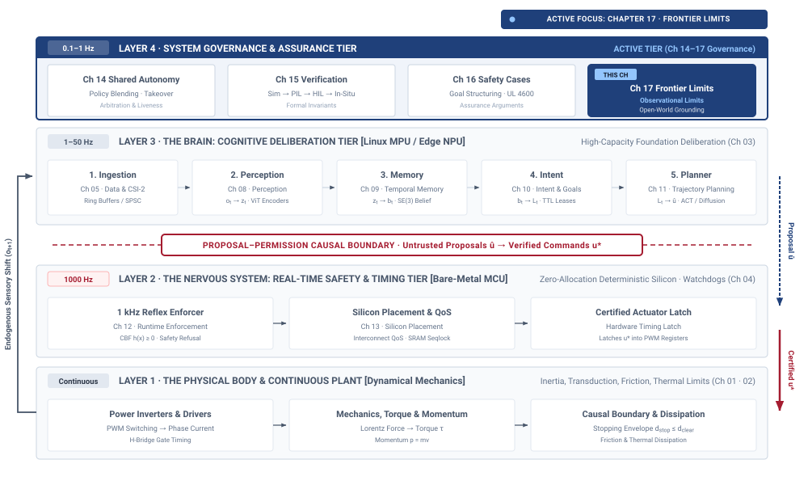
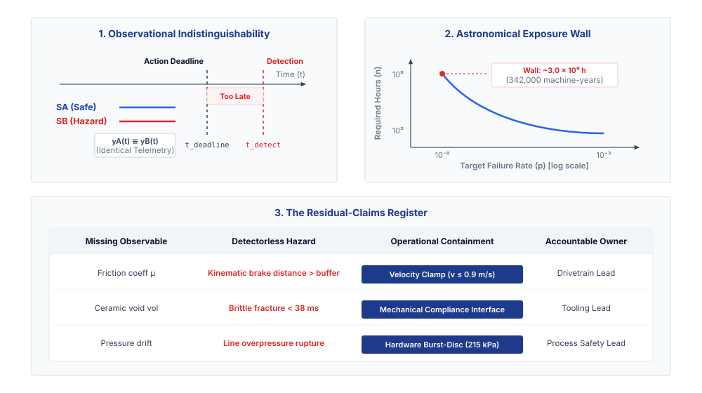
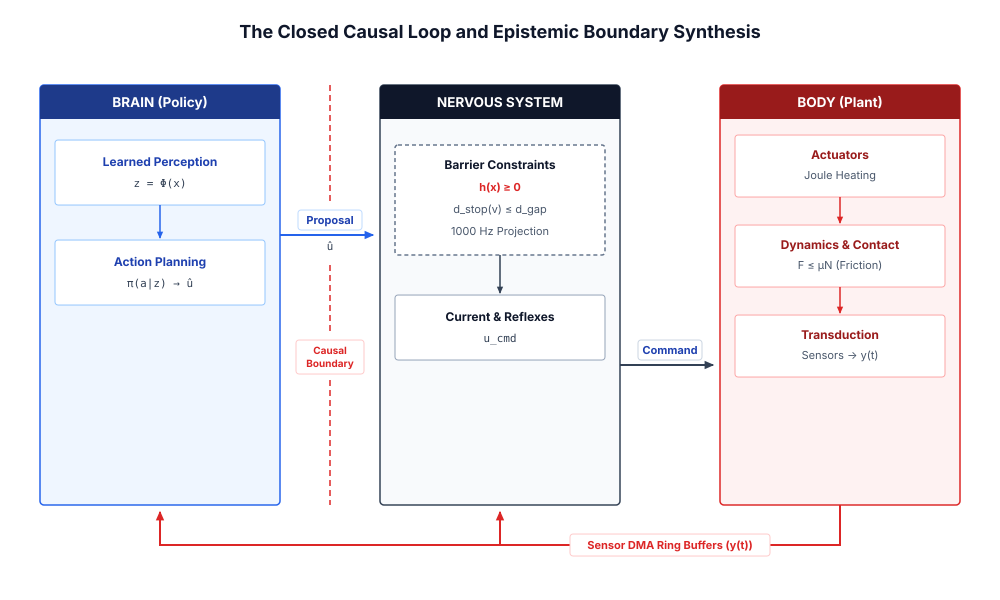

# The Epistemic Frontier {#sec-frontier}

::: {.column-margin}

\chapterminitoc

:::

::: {#fig-17-locator fig-env="figure" fig-pos="H" fig-cap="**Frontier Limits in the Physical AI Stack**: The four-tier physical AI systems architecture highlights the system governance and assurance tier, with frontier limits as this chapter's active focus. Read the highlighted box as the edge of the assurance argument, where cataloged failure modes outrun the runtime detectors built to catch them and architectural containment has to carry whatever risk remains." fig-alt="Diagram titled Physical AI Systems Architecture Stack, drawn as four stacked tiers. Layer 4 is system governance and assurance at 0.1 to 1 hertz, holding boxes for shared autonomy, verification, safety cases, and frontier limits. Layer 3 is the brain, a cognitive deliberation tier at 1 to 50 hertz, holding five stages named ingestion, perception, memory, intent, and planner. A dashed proposal-permission privilege boundary separates it from layer 2, the nervous system, a real-time safety and timing tier at 1000 hertz. Layer 1 is the physical body and continuous plant. Layer 4 is outlined and its frontier limits box is highlighted; the badge reads Active Focus, Chapter 17, Frontier Limits."}
{width="100%"}
:::

\begin{marginfigure}
\vspace{1em}
\resizebox{\linewidth}{!}{\mlphysicalstackfull{20}{20}{20}{20}{20}}
\end{marginfigure}

*What physical failure modes remain invisible to modern runtime detectors, and how must an engineer govern what evidence cannot settle?*

A complete engineering record can still depend on a physical condition that the machine cannot observe. A stopping claim may assume sufficient friction, while the available sensors cannot establish that assumption before every maneuver. More successful trials do not supply the missing measurement or show how the machine behaves outside the tested conditions. Such gaps require an explicit account of what remains unsupported and how that uncertainty limits operation. A runtime detector can support a safety argument only for failures it can reveal in time for an effective response. Where that evidence is unavailable, engineers must evaluate whether reduced speed or restricted access provides adequate containment, or whether operation should be withheld. These limits belong in the architecture and the release decision. The physical AI stack remains accountable only when claims about the brain, nervous system, and body stay within the reach of the evidence supporting them.



::: {.callout-learning-objectives}

- Assess which safety claims exceed the evidence available for a specific physical machine
- Evaluate whether a detector can identify a hazard before effective intervention becomes impossible
- Define operational restrictions and closure tests for unsupported claims in the engineering record
- Apply physical budgets, information age, authority separation, and evidence requirements to an unfamiliar machine

:::

## Epistemic Limits {#sec-frontier-17-1}

A released robot (one formally authorized for deployment) approaches a patch of floor whose friction its sensors cannot establish before braking. The stopping calculation may be correct, the controller on time, and the release record complete, yet a necessary premise remains uncertain. This returns us to the book's opening problem of justifying when a learned proposal may become physical action. The intervening architecture gives us a way to measure the body, qualify the policy, control execution, and connect evidence to permission. It also exposes where that permission depends on facts the machine cannot observe. The frontier-limits component in @fig-17-locator belongs to governance because those gaps constrain decisions across every layer. An authorization for a particular hardware and software revision, within a defined envelope and duration such as $2000\text{ h}$, remains conditional on its supporting premises. The final task is to distinguish what the method establishes from what it must leave open.

::: {#dfn-frontier-embodied-latency-scaling-law .callout-definition title="The embodied latency scaling law"}

***Embodied latency scaling law***\index{Embodied latency scaling law!definition}\index{Scaling law!embodied latency} is the physical constraint dictating that scaling neural parameter count yields diminishing operational returns unless inference latency decreases proportionally, because computational delay consumes the mechanical reaction time constant of the physical plant.

:::

Consider three machines, each possessing an apparently complete safety record whose line items close without a single arithmetic deficit. The first is a mobile transport platform moving at $1.5\text{ m/s}$, whose stopping distance claim of $0.49\text{ m}$ assumes an available tire-to-floor friction coefficient of $\mu \ge 0.60$. If unmonitored liquid on the concrete floor reduces that coefficient to $\mu = 0.15$, the kinematic braking distance derived from friction limits quadruples from $0.19\text{ m}$ to $0.76\text{ m}$. Combined with the $0.30\text{ m}$ traversed during a $200\text{ ms}$ perception and actuation latency, the total stopping distance\index{Stopping distance} expands to $1.06\text{ m}$, breaching the $0.80\text{ m}$ clearance buffer\index{Clearance buffer} before the vehicle halts. The second is an articulated manipulator commanded to limit contact force to $40\text{ N}$ during workpiece assembly, where the force-limiting guarantee assumes structural stiffness\index{Structural stiffness} and material integrity across the end-effector mount. If fatigue micro-cracking introduces unmodeled compliance\index{Compliance!mechanical} into the mount, mechanical deflection stores strain energy\index{Strain energy} under load and releases it abruptly during surface transitions, delivering an unmeasured $120\text{ N}$ transient peak to the workpiece while the joint torque sensors register nominal values. The third is a chemical flow regulator maintaining downstream line pressure below $200\text{ kPa}$, whose control loop assumes an undrifted diaphragm pressure transducer. If chemical deposition on the diaphragm induces a steady calibration drift of $0.5\text{ kPa/h}$, the nervous system throttles the valve against a phantom pressure spike or opens it into an actual overpressure state of $240\text{ kPa}$, unaware that its reference sensor has drifted from physical ground truth.

These failures connect the body's limits, the runtime's observations, and the scope of a release claim. The timing budgets closed, the reflexes passed the selected fault tests, actuator temperature remained below the $80\,^{\circ}\text{C}$ winding limit, and the enforcer ran at $1000\text{ Hz}$. None of those results supplied continuous evidence for the missing premise. Ashby's Law of Requisite Variety\index{Law of Requisite Variety!Ashby} [@ashby1956introduction] links effective regulation to the regulator's capacity to respond to relevant disturbances. Here, friction loss, structural change, and sensor drift escaped the assumptions represented in the control and verification process. When such a premise changes without a detectable signal, the machine can leave its validated envelope while telemetry still appears normal.

Treating these blind spots with systems engineering rigor requires defining an **evidentiary gap**\index{Evidentiary gap!definition} as an operational quantity rather than a general caveat: an operational state in a safety case where a safety-critical claim relies on a physical premise that cannot be continuously verified during execution or established through prior testing. To be actionable, every gap must satisfy a four-part specification: (1) state the affected claim, such as maintaining deceleration within a designated spatial buffer; (2) identify the missing observable or unattainable evidence, such as the instantaneous friction coefficient between the wheel contact patch and an oily surface; (3) state the present operational containment response, such as derating the maximum transit speed to $0.6\text{ m/s}$ or restricting the machine to dry indoor flooring; and (4) define the predeclared closure test—the physical measurement, sensor modality, or analytical result that would close the gap and permit the operational restriction to be lifted.

This account also provides a way to judge progress. Higher average accuracy on an offline manipulation dataset can improve capability without resolving the reason a mechanical guard is still required. An advance strengthens a particular safety claim when it changes the evidence, observability, or physical margin supporting that claim. For example, reducing inference latency from $80\text{ ms}$ to $10\text{ ms}$ at the $P_{99}$ tail and thereby recovering $0.10\text{ m}$ of stopping margin\index{Stopping margin} can support reconsideration of an operating restriction. The revised release argument must still establish the conditions under which the gain holds; the benchmark improvement alone does not determine the verdict.

The book's engineering method is useful because it makes both justified decisions and unresolved dependencies visible. Applying it to an unfamiliar machine requires identifying which claims the record supports, which remain assumptions, and what would turn those assumptions into evidence. Examining those limits is the final step in using the architecture responsibly, including recognizing when the available method cannot justify operation.

## What the Method Cannot Establish {#sec-frontier-17-2}

A safety release claim for a physical AI system is not a monolithic assertion of competence. It is a conjunction of discrete, necessary links that must all hold simultaneously for a physical guarantee to remain valid. A complete argument requires establishing domain membership for incoming sensor observations, measured physical bounds on actuator authority and stopping distances, formal component contracts across software boundaries, strict execution independence between the learned policy and the safety enforcement path (extending the proposal-permission architecture from @sec-brain-3-1), quantified detector coverage across all identified fault modes, and continuous runtime monitoring of system invariants. Because these premises form a logical conjunction, the strength of the overall claim is governed by its weakest constituent link. Generating extensive, high-confidence empirical evidence for five of these links cannot compensate for a sixth link that remains unsupported, because a failure in any single premise causes the deductive safety argument to fail entirely.[^fn-hist-popper-falsification]

Every link in a safety case requires an explicit **epistemic classification**\index{Epistemic classification}, identifying each premise as measured directly through physical instrumentation, derived analytically from measured premises, assumed on physical or operational grounds, decided by accountable judgment, left unsupported by existing data, or explicitly declared outside the threat model. In the three reference machines examined throughout this text, these classifications reveal the exact boundary where evidence ends. For the wheeled mobile robot, the stopping-distance guarantee relies on an assumed friction coefficient between tire and floor that cannot be measured before braking begins. For the articulated manipulator, the collision-containment argument depends on an assumed material-damage threshold for surrounding equipment, which is an engineering judgment about structural yield rather than a measured property of the controller. For the aerial vehicle, the state-estimation envelope assumes statistical independence between optical flow and inertial sensors, an assumption that collapses under sudden illumination changes or frame resonance. Naming these premises explicitly does not weaken the release record. It establishes the physical envelope within which the release verdict is justified, and outside of which the verdict ceases to apply.

Separating measurement from judgment is fundamental to systems engineering discipline. Empirical testing and statistical characterization can estimate physical exposure, quantify sensor noise, and bound parametric uncertainty, but no measurement can choose an acceptable **residual risk**\index{Residual risk} or decide which individuals in an operational environment must bear that risk. Those choices are accountable human decisions that must be recorded as explicit judgments rather than disguised as empirical findings. In the same way, the **threat model**\index{Threat model} establishes an absolute boundary on the validity of the record. Empirical testing across nominal fleet operations and accidental component faults provides no evidence regarding intentional adversarial attacks. A safety record demonstrating that a vision pipeline handles sensor noise, lens blur, and partial occlusions provides zero statistical support for claims about resilience against adversarial optical projection, model parameter tampering, or intentional denial of service across the internal communication bus.

When an engineering claim relies on statistical testing to bound the probability of a hazardous event, the claim requires rigorous formal definition before conducting trials. The engineering specification must define the target failure probability $p$, the physical unit of exposure, the required statistical confidence level $1-\alpha$, and the necessary independence assumptions before counting a single hour or trial. For rare tail failure probabilities (e.g., $p \le 10^{-9}$ per operating hour),[^fn-std-sil4-testing] certifying safety at standard confidence levels (e.g., 95 percent) requires billions of independent, failure-free operational exposure hours. Accumulating $3.0 \times 10^{9}\text{ operating hours}$ without a single observed failure requires approximately 342,000 machine-years of continuous execution (@fig-17-epistemic-limits, Panel 2). This threshold represents the **astronomical exposure wall**\index{Astronomical exposure wall!definition}: the mathematical scaling limit where certifying ultra-rare tail failure probabilities in open-world physical domains requires billions of independent, failure-free operational exposure hours, rendering pure empirical black-box fleet testing logically and economically insufficient.[^fn-math-astronomical-wall] @Fig-17-exposure-scaling extends that relation across the full range of target rates, and the curve is the argument: because required exposure grows as the reciprocal of the probability being bounded, each additional order of magnitude of claimed safety costs an order of magnitude more operating time than the last.

::: {#fig-17-exposure-scaling fig-env="figure" fig-pos="htb" fig-cap="**The Astronomical Exposure Wall**: Required failure-free exposure hours against target failure probability per hour at 95 percent confidence, with the equivalent machine-years on the opposing axis. Certifying $10^{-9}$ per hour demands roughly three billion failure-free hours, which no fleet can accumulate within the lifetime of the design." fig-alt="Log-log chart with an inverted horizontal axis showing required failure-free test hours rising as the target failure probability falls. A marked point at ten to the minus ninth per hour sits at roughly three billion hours, annotated as the astronomical exposure wall, with a second axis giving the equivalent machine-years."}

```{python}
#| echo: false
import pandas as pd
import matplotlib.pyplot as plt
from mlsysim import viz

data = pd.read_csv("vol4/17_frontier/data/exposure_scaling.csv")

fig, ax1, COLORS, plt = viz.setup_plot(figsize=(8, 5))

ax1.plot(data["target_failure_rate"], data["required_exposure_hours"], linewidth=2.5, color="#B22222")

ax1.set_xscale("log")
ax1.set_yscale("log")
ax1.invert_xaxis()

ax1.set_xlabel("Target Failure Probability ($p$) per hour", fontweight="bold")
ax1.set_ylabel("Required Failure-Free Hours ($n$)", color="#B22222", fontweight="bold")
ax1.tick_params(axis='y', labelcolor="#B22222")

# Annotate the astronomical limit
threshold_p = 1e-9
threshold_n = 2.9957 / threshold_p

ax1.axvline(x=threshold_p, color="black", linestyle="--", alpha=0.5)
ax1.axhline(y=threshold_n, color="#B22222", linestyle="--", alpha=0.5)
ax1.plot(threshold_p, threshold_n, marker="o", markersize=8, color="#B22222")

ax1.annotate(
    "Astronomical Exposure Wall\n$p = 10^{-9}$, $n \\approx 3 \\times 10^9$ h",
    xy=(threshold_p, threshold_n),
    xytext=(1e-7, 1e10),
    arrowprops=dict(facecolor='black', arrowstyle="->", alpha=0.7),
    fontsize=10,
    backgroundcolor="white",
)

ax2 = ax1.twinx()
ax2.set_yscale("log")
ax2.set_ylim(ax1.get_ylim()[0] / (24 * 365.25), ax1.get_ylim()[1] / (24 * 365.25))
ax2.set_ylabel("Required Machine-Years", color="#333333", fontweight="bold")
ax2.tick_params(axis='y', labelcolor="#333333")

plt.title("Scaling limits of empirical certification (95% confidence)", fontweight="bold")
ax1.margins(x=0.14, y=0.14)
plt.tight_layout()

plt.show()
plt.close()
```

:::

::: {#nbk-frontier-observational-deadlines-tail-exposure-scaling-energy .callout-notebook title="Observational deadlines, tail exposure scaling, and energy dissipation"}
Three fundamental concepts demonstrate why empirical fleet testing cannot substitute for deterministic physical containment:

1. **Observational Indistinguishability Deadline Deficit:**
   A high-speed robotic gripper closing on a brittle ceramic workpiece might fracture it before the sensors and control systems can react. If the physical time-to-harm is shorter than the total detection and reaction latency, algorithmic detection is physically impossible before fracture occurs. In such cases, safety relies on passive mechanical compliance rather than vision software. For the rigorous derivation of contact mechanics and reaction latencies, refer to @sec-appendix-systems.

2. **Astronomical Exposure Scaling vs. Fleet Testing:**
   Certifying a catastrophic autonomy failure rate at a high statistical confidence mathematically requires an astronomical number of failure-free exposure hours. For an industrial fleet, this could mean centuries of calendar time, and any software update resets the counter. Thus, safety cases must rest on deterministic barrier shields rather than fleet sampling. For the detailed statistical scaling derivations, see @sec-appendix-ml.

3. **Kinetic Energy Clamping and Friction Collapse:**
   When environmental surface friction collapses, stopping distances expand dangerously. By clamping the maximum velocity in firmware, the kinetic energy is drastically reduced, preserving the clearance buffer without requiring real-time friction sensing. For the underlying kinematic and thermodynamic math, see @sec-appendix-systems.
:::

Operational fleet data rarely satisfies the statistical assumptions underlying this derivation. Aggregating runtime across a fleet of one thousand machines operating in parallel does not yield one thousand independent hours per wall-clock hour, because shared environmental conditions, correlated fleet-wide software updates, and common spatial layouts introduce systematic dependencies. Furthermore, learned systems undergo continuous modification; deploying an updated neural network checkpoint, retuned sensor filter, or modified calibration table resets the statistical trial counter, because the new software constitutes a distinct statistical distribution. Human safety interventions further distort empirical records through censoring. When an attentive human operator intercepts an erratic motion before contact occurs, the intervention truncates a potential accident, converting an uncontained failure into an unrecorded counterfactual. Similarly, unvalidated physics simulations cannot substitute for physical exposure, because simulation trials test only the disturbance distributions and contact dynamics that the modeler explicitly programmed, leaving real-world transfer discrepancies unmeasured.

An engineer must therefore distinguish between evidence that is unaffordable and evidence that is logically insufficient. Demonstrating a failure rate bound of $p \le 10^{-4}$ per operating hour on a mechanical brake actuator may be unaffordable within an eight-week test campaign, but it remains a tractable physical hypothesis that additional test benches and capital can establish. Conversely, attempting to prove open-world safety bounds for an end-to-end vision-language-action model [@brohan2022rt1; @brohan2023rt2; @ahn2022saycan] through empirical sampling is logically insufficient, because no finite dataset can span the unbounded combinatorial possibilities of unconstrained physical environments. When a required premise cannot be settled by evidence, accumulating further empirical test hours is futile. The defensible engineering responses are structural. An engineer can narrow the operational design domain to eliminate untestable environmental states, bound the mechanical authority of the actuators so that maximum kinetic energy remains below structural damage limits, install an independent deterministic safety enforcer in the motor drive firmware with veto authority over the learned policy, shorten the temporal duration of the release verdict to mandate frequent physical re-inspection, assign the residual risk explicitly to a designated human operator through formal interface contracts, or refuse to issue a release verdict.[^fn-hw-fault-registers]

This epistemic boundary is vividly illustrated in extreme-environment exploration platforms, such as planetary rovers drilling and navigating unstructured extraterrestrial terrain (@fig-17-mars-perseverance-drill). Operating millions of kilometers from Earth under multi-minute communication latencies that preclude human teleoperation, the machine must interact with uncharacterized geological formations whose internal fracture dynamics and surface friction cannot be certified through prior fleet testing. Mission survivability is achieved not by asserting statistical competence over unknown terrain distributions, but by enforcing deterministic physical authority limits: hardware torque clutches, passive suspension compliance, and hard-coded firmware reflexes that halt actuator drives the instant contact impedance departs from safe envelopes.

::: {#fig-17-mars-perseverance-drill fig-env="figure" fig-pos="t" fig-cap="**Autonomous Robotic Manipulation and Core Sampling in Unstructured Extraterrestrial Terrain**: Perseverance coring bedrock at Jezero Crater, its arm and turret in direct mechanical contact with uncharacterized strata under a communication latency of minutes. Teleoperation cannot catch a sudden contact bifurcation across that delay, and no amount of Martian field testing can exhaust the invariants involved, so safety is structural: passive compliance and deterministic current limits hold whether or not the hazard was anticipated." fig-alt="Autonomous Robotic Manipulation and Core Sampling in Unstructured Extraterrestrial Terrain. NASA's Perseverance Mars Rover operating at the \"Rochette\" bedrock outcrop in Jezero Crater (Sol 198), displaying its 2.1-meter five-degree-of-freedom robotic arm and 45-kilogram turret equipped with a rotary-percussive coring drill, Mastcam-Z stereoscopic navigation cameras, and proximity sensors. Two visible coring boreholes (Montdenier and Montagnac) illustrate direct mechanical contact interaction with uncharacterized geological strata. Operating under a 4-to-24-minute one-way speed-of-light communication latency to Earth, the rover cannot rely on human teleoperation to catch contact bifurcations or slip hazards. Because empirical testing across open Martian environments is logically incapable of exhausting all unmonitored physical invariants (such as subsurface rock fractures, grain cohesion, or unexpected drill-bit binding), safety is guaranteed structurally: passive mechanical compliance, deterministic motor current torque clamps, and autonomous firmware reflexes bound energy transfer and arrest motion before irreversible structural yield can occur. Image credit: NASA/JPL-Caltech/MSSS (public domain)."}
{width="85%"}
:::

## A Residual-Claims Register {#sec-frontier-17-3}

An unproven premise does not vanish when an engineer omits it from a safety report. When empirical testing cannot establish a safety bound, the unproven premise must be entered into a formal **residual-claims register**\index{Residual-claims register!definition}: an auditable systems engineering ledger that maps every unproven physical premise or unmonitored invariant in a safety case to its missing physical observable, active mechanical or architectural containment constraint, named accountable human owner, and predeclared closure test. An engineering team cannot treat an unverified physical assumption as an unwritten risk or a temporary modeling convenience. Without these four mandatory components, an unresolved claim is simply an unmonitored defect.

Every entry begins by linking the unsupported claim to the specific physical observable that cannot be measured. In an embodied system with physical authority over mass, a learned policy fails to settle a safety property because sensors cannot transduce the relevant environmental state, the computing substrate cannot process the measurement within the control deadline, or the physical interaction cannot be observed before contact occurs. An engineer must define the **missing observable**\index{Missing observable!definition} with physical precision rather than statistical abstractions. Characterizing an unknown failure as an "out-of-distribution latent state" provides no actionable signal for an enforcement loop to trigger a physical intervention. By contrast, stating an unmeasured surface friction coefficient, an undetected optical flare across a camera lens array, or an unobservable micro-fracture in an actuator housing identifies the exact physical deficit. Naming the missing observable establishes the boundary where learned inference stops and physical uncertainty begins.

In an analytical example, consider a $450\text{ kg}$ autonomous mobile transport robot moving palletized goods across an industrial logistics depot. The safety case asserts that the learned navigation policy will never command a turning maneuver that causes wheel slip and lateral skidding on smooth concrete floors contaminated with spilled lubricant. The missing observable is the local surface friction coefficient $\mu$, which varies from $\mu = 0.70$ on clean dry concrete down to $\mu = 0.12$ under a lubricant slick. Standard RGB cameras and structured-light depth sensors cannot detect a transparent, two-millimeter layer of synthetic machine oil before the drive wheels make contact. Because this observable cannot be transduced prior to traversal, empirical fleet hours cannot establish that the learned policy will maintain traction during high-speed turns.

An open entry in the register requires an immediate **operational response**\index{Operational response!definition} enforced in the nervous system or the physical plant. The response cannot consist of a warning label, an advisory note in an operator manual, or a software retry loop. It must be a structural constraint that prevents the unmeasured observable from causing damage. In the transport robot example, the nervous system microcontroller clamps the maximum translational velocity from the nominal $2.2\text{ m/s}$ down to $v_{\text{clamp}} = 0.9\text{ m/s}$, and derates the maximum allowable lateral acceleration to $a_{\text{lat}} \le 1.0\text{ m/s}^2$ within its static configuration table. This velocity restriction drastically reduces the vehicle's kinetic energy and destructive potential. At this clamped speed, even under worst-case stopping conditions on an oil slick, the stopping distance remains within the $0.50\text{ m}$ safety margin maintained by its proximity sensors.[^fn-math-velocity-clamp]

Every operational response requires a named owner with the authority to maintain the constraint against organizational pressure. If ownership is assigned to an entire development team or an anonymous safety committee, the constraint will erode whenever deployment schedules tighten or customer throughput targets slip. The owner is an individual engineer or an operational manager whose signature appears on the release verdict. In the transport robot system, the drivetrain engineering lead and the depot operations manager serve as co-owners. The drivetrain lead owns the firmware parameter lock on the velocity clamp, ensuring that no software update can override the $0.9\text{ m/s}$ ceiling. The operations manager owns the physical operating environment, guaranteeing that pedestrian walkways remain separated by physical barriers wherever transport paths intersect. Both owners legally accept the throughput penalty as the direct operational price of operating with an unproven claim.

Every entry must define its **closure test**\index{Closure test!definition} at the moment the gap is identified. If an engineering team defines the closure test after gathering new data, the criteria will inevitably shift to match whatever measurements were inexpensive to collect. A closure test specifies the verifiable physical measurement, sensor modality, or mathematical invariant that eliminates the dependency on the operational constraint. For the mobile transport robot, the closure test requires integrating an onboard polarimetric surface reflectivity sensor (which uses polarized light to detect the telltale glare of a liquid film) validated across $N = 1000$ empirical trials under controlled surface contaminants, combined with a firmware-level wheel-encoder differential slip detector (which compares the rotational speeds of different wheels to physically sense a loss of traction) that executes at $1000\text{ Hz}$ and triggers emergency braking within $10\text{ ms}$ of slip onset. Once that instrumentation is installed, calibrated, and proven to satisfy the $P_{99.9}$ detection bound, the entry is retired and the velocity clamp is removed.

Specifying a closure test forces an engineering organization to determine whether a gap can be resolved with improved instrumentation and testing, or whether it represents a permanent unobservable state. When a closure test requires a physical transducer that cannot be manufactured or a computational budget that the edge platform cannot support, the register entry remains open for the operating lifetime of the machine. The operational response becomes a permanent architectural boundary. The danger arises when an organization treats an unclosable entry as a temporary backlog item, assuming that every physical failure mode can eventually be trapped by an onboard runtime detector.

The structured anatomy of these register entries is formalized across representative physical AI archetypes in @tbl-17-claims-register, illustrating how unmonitored hazards are systematically bounded by operational constraints until falsifiable closure tests are satisfied.

| System Archetype & Claim                                                                                                             | Missing Observable                                                                                                  | Physical Hazard Mechanism                                                                                                                                                                                           | Operational Containment & Owner                                                                                                                                                                                                                                 | Predeclared Closure Test                                                                                                                                                                                                                    |
|:-------------------------------------------------------------------------------------------------------------------------------------|:--------------------------------------------------------------------------------------------------------------------|:--------------------------------------------------------------------------------------------------------------------------------------------------------------------------------------------------------------------|:----------------------------------------------------------------------------------------------------------------------------------------------------------------------------------------------------------------------------------------------------------------|:--------------------------------------------------------------------------------------------------------------------------------------------------------------------------------------------------------------------------------------------|
| **Autonomous Mobile Robot (450 kg)**: Stopping distance $d \le 0.50\text{ m}$ on depot concrete ($v_{\text{nom}} = 2.2\text{ m/s}$). | Forward surface friction coefficient $\mu \in [0.12, 0.70]$ under thin fluid/lubricant films ($h \le 2\text{ mm}$). | Reduced friction increases kinematic braking distance by $5.8\times$ ($d = \frac{v^2}{2\mu g} + v\tau$), expanding stopping envelope from $0.39\text{ m}$ to $2.09\text{ m}$ and breaching clearance buffer.        | Drivetrain firmware clamps max velocity to $v_{\text{clamp}} \le 0.90\text{ m/s}$ ($E_{\text{kin}}$ drops $-83.3\%$) and lateral acceleration $a_{\text{lat}} \le 1.0\text{ m/s}^2$; depot pedestrian barriers. *Owners*: Drivetrain Lead & Operations Manager. | Integrate forward polarimetric scatterometer ($P_{99.9}$ oil detection at $3.0\text{ m}$) + $1000\text{ Hz}$ wheel-encoder differential slip reflex ($t_{\text{arrest}} \le 10\text{ ms}$) verified across $N \ge 1000$ trials.             |
| **Articulated Manipulator (6-DoF)**: Bounded contact force $F \le 40\text{ N}$ during brittle ceramic workpiece assembly.            | Subsurface voids or micro-cracks ($V_{\text{void}} > 0.5\text{ mm}^3$) within uninspected ceramic workpieces.       | Normal force ramps at $400\text{ N/s}$, crossing $15\text{ N}$ brittle fracture threshold in $38\text{ ms}$; actuator current-decay delay ($\tau_{\text{decay}} = 25\text{ ms}$) prevents closed-loop force arrest. | Passive mechanical compliance interface with calibrated spring detent ($k = 2.5\text{ N/mm}$) and pneumatic breakaway relief limiting peak force to $F_{\text{peak}} \le 18\text{ N}$; derate jaw speed. *Owner*: Tooling Lead.                                 | Integrate jaw-embedded ultrasonic pulse-echo transducer ($f = 5\text{ MHz}$, $\tau_{\text{meas}} \le 12\text{ ms}$) detecting structural voids prior to reaching $5\text{ N}$ force with false-alarm rate $\alpha_{\text{FA}} \le 10^{-4}$. |
| **Chemical Flow Regulator**: Downstream line pressure bound $P \le 200\text{ kPa}$ over $2000\text{ h}$ continuous campaign.         | Sensor zero-point baseline drift ($\kappa = 0.5\text{ kPa/h}$) from chemical deposition on silicon diaphragm.       | Downward drift causes controller to open valve against phantom under-pressure, driving physical manifold to $240\text{ kPa}$ (rupture risk) while telemetry reads nominal $195\text{ kPa}$.                         | Hard-wired analog rupture burst-disc ($P_{\text{burst}} = 215\text{ kPa}$) and mandatory scheduled physical zero-point proof-tests every $\Delta t_{\text{proof}} = 24\text{ h}$. *Owners*: Process Safety Lead & Plant Reliability Engineer.                   | Install dual-dissimilar sensing: piezoresistive transducer paired with non-intrusive ultrasonic Coriolis flow meter, triggering cross-channel disparity trip when $\lvert \Delta P_{\text{disparity}} \rvert \ge 5.0\text{ kPa}$.           |
| **Multi-Rotor Aerial Drone**: Positional drift $e_{\text{pos}} \le 0.10\text{ m}$ during rapid transitions across indoor corridors.  | Visual feature track persistence under high-dynamic-range lighting shifts ($>10^4\text{ lux/s}$).                   | Sudden feature loss triggers visual odometry divergence; IMU double-integration error drifts quadratically ($\sigma_x \approx 0.8\text{ m}$ in $3.0\text{ s}$), causing perimeter collision.                        | Autonomous geofence safety bubble ($d_{\text{standoff}} \ge 1.5\text{ m}$) enforced by independent time-of-flight pulsed-lidar safety shield triggering auto-hover within $20\text{ ms}$. *Owner*: Flight Autonomy Lead.                                        | Integrate multi-spectral event-based neuromorphic vision sensor ($>120\text{ dB}$ dynamic range, latency $\tau \le 1\text{ ms}$) maintaining state error $e \le 0.05\text{ m}$ over $N = 500$ abrupt blackout transitions.                  |

: **The Residual-Claims Register Matrix**: Auditable ledger of unproven physical premises across representative physical AI archetypes. For each open claim, the register defines the missing physical observable, the physical hazard mechanism, the active operational containment enforced by the nervous system or mechanical hardware, the accountable human owners, and the falsifiable closure test required to retire the operational restriction. {#tbl-17-claims-register tbl-colwidths="[18,18,22,22,20]"}

To ensure auditable tracking of unmonitored invariants across software deployments and physical revisions, safety-critical systems represent open residual claims through a formal, structured data contract (@tbl-17-residual-claims-schema). The abstract schema below defines the mandatory fields, scalar types, physical SI units, and structural invariants required for every unresolved physical assumption:

| Manifest Category           | Parameter & Type                   | Physical Unit          | Invariant & Operational Contract                                  |
|:----------------------------|:-----------------------------------|:-----------------------|:------------------------------------------------------------------|
| **Manifest Header**         | `system_identifier` (`str`)        | —                      | Unique embodied platform ID (e.g., `AMR-450-DEPOT`)               |
| **Manifest Header**         | `hardware_build_rev` (`str`)       | —                      | Target silicon and chassis revision (`HW-REV-3.2`)                |
| **Manifest Header**         | `software_digest` (`str`)          | —                      | Cryptographic binary hash (SHA-256)                               |
| **Manifest Header**         | `validity_limit_hours` (`float`)   | hours                  | Maximum statutory operating window before review                  |
| **Residual Claims**         | `entry_id` (`str`)                 | —                      | Unique claim tag (e.g., `CLAIM-FRIC-001`)                         |
| **Residual Claims**         | `target_safety_claim` (`str`)      | —                      | Explicit safety invariant ($d_{\text{stop}} \le 0.50\text{ m}$)   |
| **Residual Claims**         | `missing_observable` (`str`)       | SI units               | Unmeasured physical state (e.g., surface friction $\mu$)          |
| **Physical Hazard**         | `governing_law` (`str`)            | —                      | Newton-Euler, Navier-Stokes, Joule heating                        |
| **Physical Hazard**         | `time_to_harm` (`float`)           | seconds                | Time from unmodeled transition to irreversible yield              |
| **Operational Containment** | `containment_type` (`enum`)        | —                      | `FIRMWARE_PARAM_CLAMP`, `PASSIVE_MECHANICAL`, `PROOF_TEST`        |
| **Operational Containment** | `authority_limit` (`float`)        | $\text{m/s}, \text{N}$ | Hard numeric setpoint ceiling ($v_{\max}, F_{\max}$)              |
| **Operational Containment** | `kinetic_energy_ceiling` (`float`) | $\text{J}$             | Maximum allowable kinetic energy under fault ($E_k \le E_{\max}$) |
| **Predeclared Closure**     | `closure_modality` (`str`)         | —                      | Transducer technology or formal method required                   |
| **Predeclared Closure**     | `sample_trials` (`int`)            | count                  | Minimum empirical sample exposure ($N \ge 1000$)                  |
| **Predeclared Closure**     | `confidence_level` (`float`)       | —                      | Statistical confidence threshold ($1 - \alpha \ge 0.999$)         |

: **Epistemic Residual-Claims Register**: Concrete data schema for residual claims. {#tbl-17-residual-claims-schema tbl-colwidths="[20,24,18,38]"}

## Failures Without Detectors {#sec-frontier-17-4}

A runtime detector is not an abstract classifier. A **practical detector**\index{Practical detector!definition} is a physical subsystem governed by three coupled parameters, namely coverage across the failure distribution, a bounded false-alarm rate, and a detection latency strictly shorter than the physical system's time-to-harm\index{Time-to-harm!definition}. If a mobile transport base traveling at $1.5\text{ m/s}$ requires $180\text{ ms}$ of braking actuation to avoid colliding with an obstacle, a perception pipeline requiring $250\text{ ms}$ of sensor aggregation and compute latency is not a detector for that hazard. It is a post-incident logging mechanism. Producing an accurate classification label after the physical body has crossed an irreversible threshold generates diagnostic evidence for an investigation, but it cannot participate in the safety case as a runtime safeguard.

Building on the causal boundary established in @sec-boundary-1-1, the fundamental limit of runtime detection arises from observational indistinguishability. Consider two physical states of the world, $S_A$ and $S_B$. In state $S_A$, a commanded actuator trajectory $u(t)$ is safe. In state $S_B$, the identical trajectory $u(t)$ causes structural damage or human injury, requiring the nervous system to intervene and execute a stopping reflex. The dynamics of the body impose a hard deadline $t_{\text{deadline}}$, determined by actuator response time and system momentum, after which physical contact or mechanical yield cannot be prevented. If the telemetry history $y(t)$ provided by onboard instrumentation is identical for $S_A$ and $S_B$ across the entire interval $t \le t_{\text{deadline}}$, no algorithm operating on those observations can reliably distinguish the benign state from the hazardous one. When two physical realities produce identical sensor traces up to the action deadline, the probability of safe intervention cannot exceed the unconditioned prior (a blind statistical guess without any useful sensor evidence), regardless of model scale or compute capacity.

::: {#dfn-frontier-observational-indistinguishability .callout-definition title="Observational indistinguishability"}
***Observational indistinguishability***\index{Observational indistinguishability!definition}\index{Detectorless failure!indistinguishability} is the physical condition where two distinct world states—one nominal ($S_A$) and one catastrophic ($S_B$)—generate identical pre-harm sensor telemetry ($y_A(t) \equiv y_B(t)$) up to the system's physical action deadline ($t_{\text{deadline}} = t_{\text{harm}} - t_{\text{act}}$).

1.  **Significance**: Without distinguishing physical energy prior to the action deadline, timely algorithmic differentiation is physically and mathematically impossible. Scaling neural model parameters, increasing dataset size, or accelerating inference compute cannot separate states that emit zero distinguishing physical energy before the time-to-harm.
2.  **Distinction**: Unlike epistemic uncertainty or high classifier entropy (which signals that the model knows it lacks evidence), observational indistinguishability often pairs with high output confidence and near-zero entropy because the neural network maps corrupted observations into nominal latent manifolds.
3.  **Common pitfall**: Relying on software anomaly detectors or VAE reconstruction loss to catch detectorless degradation. When sensor physics blinds the transducer (e.g., a slow physical deformation known as piezoresistive crystal creep, or pre-contact subsurface voids), the anomaly detector consumes the same blinded telemetry and fails silently.
:::

In learned perception-action policies, this detectability limit manifests as silent distribution shift and embodied shortcut learning. High-capacity neural networks, such as Vision-Language-Action (VLA)\index{Vision-Language-Action (VLA)} models [@brohan2022rt1; @brohan2023rt2] or deep imitation policies [@zhao2023aloha], minimize empirical loss by discovering opportunistic statistical correlations across high-dimensional demonstration datasets. In embodied tasks, unmeasured physical properties—such as contact friction, material yield strength, or payload inertia—are unobserved latent variables. Deep models routinely learn to exploit non-causal visual features (such as ambient illumination angles, floor specular highlights, or camera frame-rate synchronization) as computational proxies for these physical properties. When operating under open-world distribution shift, these non-causal correlations collapse. However, because high-dimensional non-linear encoders compress the out-of-distribution observation $\mathbf{x}$ directly into a nominal latent manifold $\mathbf{z} = \phi(\mathbf{x}) \in \mathcal{Z}_{\text{nom}}$, the policy outputs action distributions $\pi(\mathbf{a} \mid \mathbf{z})$ with near-zero softmax entropy ($H(\pi) \approx 0$, indicating absolute mathematical certainty) and minimal ensemble disagreement. The model commands aggressive, damaging physical trajectories while its internal representations indicate nominal performance. Crucially, any epistemic uncertainty estimator implemented in software (such as latent Mahalanobis distance to measure deviation from training data, Monte Carlo dropout to check internal consistency, or autoencoder reconstruction residuals) evaluates uncertainty using the very same corrupted representations $\mathbf{z}$. Because the confidence estimator and the policy share the broken perceptual representations, internal software metrics cannot serve as an independent detector of shift. This failure mode is termed **embodied shortcut learning and latent epistemic shift**\index{Embodied shortcut learning and latent epistemic shift!definition}: the process where a high-capacity neural policy exploits non-causal statistical correlations in training demonstrations as computational proxies for unmeasured physical states, causing the model to command destructive actions with maximal confidence while rendering internal uncertainty metrics completely blind to the failure. The learned Brain is fundamentally blind to its own shortcut failure, necessitating the proposal-permission architecture from @sec-brain-3-1 to enforce physical containment.

Physical sensing hardware exhibits an identical lack of identifiability over longer operating durations. In a fluid regulation system, an inline thermal mass flow sensor subjected to surface fouling or thermal aging drifts downward at an analytical example rate of $0.02\text{ L/min}$ per $100\text{ h}$ of operation. Over the same timescale, an incipient pipe constriction or supply pressure drop produces an identical, genuine reduction in mass flow. A single measurement channel measuring heat dissipation reports a declining scalar signal $q(t)$. The nervous system receives the telemetry stream, but no algorithm processing that single signal can identify whether the physical process has changed or the transducer calibration has degraded. Both physical conditions generate the exact same observation sequence. Without an independent reference transducer or a direct differential measurement, the drift is undetectable at runtime.[^fn-hw-piezoresistive-drift]

Mechanical manipulation reveals failures where the threshold for safe action cannot be known before physical contact occurs. Consider a robotic manipulator grasping ceramic workpieces. A sound workpiece safely tolerates a normal gripping force of $50\text{ N}$, whereas a workpiece containing an internal structural void fractures when normal force exceeds $15\text{ N}$. Exterior optical cameras and tactile skin arrays inspect the workpiece before grasping, but internal voids produce zero surface signatures. Prior to contact, the force sensors report $0.0\text{ N}$. Once contact occurs, the gripper jaws close, ramping normal force at an analytical example rate of $400\text{ N/s}$. The boundary between safe load application and brittle fracture is crossed in $37.5\text{ ms}$, which is shorter than the combined latency of the force sensor filter, the SerDes bandwidth and bus jitter, and the motor drive's inductive current-decay response. The safe force cannot be determined before contact, and fracture occurs before the nervous system can arrest jaw motion. This scenario defines a **detectorless failure mode**\index{Detectorless failure mode!definition}: a physical degradation mechanism, sensor aging effect, or contact bifurcation whose observation latency, sensing blind spot, or transduction physics prevents detection within the body's time-to-harm ($\tau_{\text{det}} + \tau_{\text{act}} > t_{\text{harm}}$), necessitating structural physical authority limits, mechanical compliance, or scheduled proof-tests rather than software detection loops.[^fn-math-contact-lipschitz]

::: {#ws-frontier-deepwater-horizon-blind-shear-ram-structural .callout-war-story title="Deepwater horizon blind shear ram structural degradation"}
**Context**: On April 20, 2010, the Macondo well in the Gulf of Mexico suffered a catastrophic blowout on the *Deepwater Horizon* drilling rig. The ultimate physical containment safeguard was the subsea Blowout Preventer (BOP)—a $450\text{-ton}$ stack of hydraulic valves and blind shear rams situated $1{,}500\text{ m}$ below sea level [@csb2014macondo].

**Mechanism**: Following explosions on the surface platform, the BOP automatic deadman system triggered to close the blind shear rams and sever the drill pipe. However, high-pressure wellbore flow had placed the drill pipe into severe axial compression while the well was shut in, inducing elastic-plastic Euler buckling ($P_{\text{cr}} = \pi^2 E I / L_{\text{eff}}^2$). The pipe buckled laterally, pinning itself against the BOP casing wall. The shear rams had been certified assuming a concentrically centered pipe; when the V-shaped blades advanced, they crushed and folded the off-center pipe against the wall rather than cleanly shearing it, jamming the ram blocks and preventing elastomeric seal closure.

**Impact**: Containment failed completely. The blades punctured the drill pipe, opening a massive flow path that allowed hydrocarbons to surge unchecked, killing 11 workers, sinking the rig, and discharging 4.9 million barrels of crude oil into the Gulf of Mexico.

**Response**: Marine drilling safety regulators mandated overhauled BOP standards: redundant multi-plane shear rams capable of cutting buckled, off-center drill pipe, real-time acoustic telemetry of ram block closure, and continuous physical proof-testing.

**Systems lesson**: The disaster represents the catastrophic manifestation of an unobservable, detectorless physical state transition ($y_A(t) \equiv y_B(t)$). The subsea BOP instrumentation monitored only hydraulic supply pressure and piston stroke; it possessed zero sensors to observe the 3D lateral displacement of the drill pipe inside the wellbore. The control software operated under the unmonitored premise that the pipe remained concentric. When a physical failure mode is detectorless to the control loop, software commands cannot prevent disaster. Containment in extreme regimes requires mechanical over-design, fault-tolerant geometry, and scheduled physical proof-tests rather than software optimism.
:::

An identical detectorless challenge governs dynamic legged locomotion across unstructured disaster debris (@fig-17-humanoid-disaster-rubble). While exteroceptive vision and LiDAR can construct dense point clouds of irregular rubble, they cannot determine whether a fractured cinderblock will shear, tip, or crumble under footfall loading prior to touchdown. Because ground-reaction collapse occurs within tens of milliseconds—far faster than an end-to-end vision network can re-infer footstep trajectories—safety cannot rely on vision software. Traversability depends on low-level joint torque reflexes, passive foot compliance, and what @pfeifer2006how term **morphological computation**\index{Morphological computation!definition}: exploiting mechanical dynamics, passive elasticity, and physical kinematics to absorb perturbations and stabilize motion directly through embodiment, without consuming cognitive latency budgets.

::: {#fig-17-humanoid-disaster-rubble fig-env="figure" fig-pos="t" fig-cap="**Physical AI at the Disaster Frontier, Humanoid Locomotion Across Unstructured Debris**: A humanoid negotiating a cinderblock debris field at the DARPA Robotics Challenge Finals. Exteroceptive sensing maps surface elevation but cannot measure whether a block will hold, and the arithmetic settles the rest: contact-to-instability runs to about $30\text{ ms}$ against vision replanning cycles of $100\text{ ms}$ or more, so seeing a foothold collapse in time is not a software problem but an impossibility." fig-alt="Physical AI at the Disaster Frontier: Humanoid Locomotion Across Unstructured Debris. The WARNER humanoid robot (Boston Dynamics Atlas platform with autonomous balance and footstep planning developed by WPI and Carnegie Mellon University) negotiating an irregular cinderblock and rubble debris field during the DARPA Robotics Challenge Finals. In unstructured disaster environments, exteroceptive sensing (head-mounted multi-sense LiDAR and stereo cameras) can map surface elevation but cannot measure the internal structural integrity, frictional stability, or settling compliance of individual loose cinderblocks before foot touchdown. Because the contact-to-instability time-to-harm (tharm <= 30 ms) is substantially shorter than high-level vision replanning cycles (tauvision >= 100 ms), visual detection of foothold collapse is physically impossible before balance is lost. Robust traversal requires low-level joint torque reflexes, passive foot compliance, and deterministic center-of-mass momentum bounds that arrest or adapt gait dynamics without waiting for vision software permission. Image credit: DARPA / WPI-CMU (public domain)."}
{width="85%"}
:::

When a failure mode lacks a practical detector, software engineering teams often attempt to construct heuristic proxies, such as autoencoder reconstruction errors or sliding-window telemetry variance. These proxies offer the appearance of safety while leaving the physical hazard unmitigated. When a failure cannot be detected within the time-to-harm, only five architectural responses are physically sound. The machine can reduce actuator authority, enforcing hardware actuator torque limits and capping velocities, forces, or pressures to remain strictly within ISO 10218 and ISO/TS 15066 transient safety envelopes so that undetected transitions remain non-destructive. It can narrow the operational design domain, physically excluding conditions where unobservable states occur. It can install a complementary sensor based on an independent physical principle, such as pairing optical cameras with acoustic emission sensors. It can establish scheduled proof tests and physical inspections to bound the exposure duration of silent degradation. If none of these measures is feasible, the only valid engineering decision is to refuse operation.[^fn-hw-bus-serialization]

The safety case must document these gaps explicitly rather than concealing them beneath unverified detection claims. @Fig-17-epistemic-limits marks where the argument runs out. When safe state $S_A$ and hazardous state $S_B$ produce identical sensor observations prior to the physical deadline $t_{\text{deadline}}$, software cannot intervene before irreversible damage occurs, and statistical sampling cannot certify ultra-rare failure rates across open-world distributions. The residual-claims register records the detector's blind region, defining the set of physical states that produce indistinguishable observations, along with the maximum exposure duration permitted between physical proof tests. Treating an undetectable failure as a solved runtime problem undermines the validity of the safety case. Preserving the exact boundary where sensing stops forces the engineering organization to rely on physical constraints rather than software optimism.

::: {#fig-17-epistemic-limits fig-env="figure" fig-pos="t" fig-cap="**The Dual Epistemic Boundaries of Observability Deadlines, Astronomical Exposure Scaling, and the Residual-Claims Register**: Two boundaries and the register that manages what falls beyond them. A safe and a hazardous state can emit identical telemetry until after the action deadline has passed, and certifying a $10^{-9}$ per hour failure rate at $95\%$ confidence would take $342{,}000$ machine-years of exposure. Neither wall moves with better engineering, so every unsettled premise is mapped to a containment boundary and an accountable owner instead." fig-alt="The Dual Epistemic Boundaries: Observability Deadlines, Astronomical Exposure Scaling, and the Residual-Claims Register. (1) Observational Indistinguishability: When safe state SA (nominal friction / sound core) and hazardous state SB (lubricant slick / internal void) yield identical pre-harm telemetry yA(t) == yB(t) = y0, detection latency taudetect = 64 ms exceeds the action deadline tdeadline = tharm - tbrake, rendering safe intervention impossible without mechanical force/velocity limits. (2) Astronomical Exposure Wall: The zero-failure exposure bound n >= ln(1/alpha)/p at 95% confidence requires 3.0 x 10^9 h (342,000 machine-years) to support p <= 10^-9/h, proving that open-world combinatorial spaces cannot be certified by empirical fleet testing alone. (3) The Residual-Claims Register: Every unsettled premise is mapped to an operational containment boundary and an accountable owner until falsifiable independent evidence satisfies a predeclared closure test."}
{width="100%"}
:::

To mitigate detectorless failure modes before physical limits are breached, safety-critical nervous systems can execute active epistemic probing. In this pattern, the controller injects a high-frequency, sub-perceptual mechanical or electrical dither $\delta u(t)$ (such as a $125\text{ Hz}$ torque ripple $\delta \tau \le 0.03\,\tau_{\text{max}}$, much like a physical tap to test an object's solidity) and measures the dynamic plant impedance response. If the measured transfer function departs from nominal stiffness or flux bounds, the nervous system trips a deterministic fallback before irreversible yield occurs, as formalized in @algo-active-epistemic-probe.

```pseudocode
#| label: algo-active-epistemic-probe
#| pdf-line-number: true
#| pdf-right-comment: false
#| html-comment-delimiter: "▷"

\begin{algorithm}
\caption{Active Epistemic Probe and Invariant Degradation Monitor}
\begin{algorithmic}
\Require telemetry stream $\mathbf{y}_t$, learned proposal $\mathbf{u}_{\text{policy}}$, plant parameters $\mathcal{M}_{\text{nominal}}$, threshold limits $\{\Delta_{\text{disparity}}, \tau_{\text{deadline}}, E_{\text{kin},\max}\}$
\Ensure permitted actuator command $\mathbf{u}_{\text{cmd}}$, trip flag $\text{register\_trip\_flag}$
\Statex
\State $\mathbf{y}_t \gets \Call{ReadAdcsAndEncodersDma}{}$; $t_{\text{now}} \gets \Call{ReadMonotonicHardwareTimer}{}$
\State $\delta \mathbf{u}_t \gets \Call{GenerateOrthogonalDither}{\text{freq}=125\text{ Hz}, \text{amp}=0.03\,u_{\max}, \phi_t}$
\State $\mathbf{u}_{\text{probe}} \gets \mathbf{u}_{\text{policy}} + \delta \mathbf{u}_t$
\State $\hat{Z}(t) \gets \Call{ComputePhaseLockedImpedance}{\delta \mathbf{u}_t, \mathbf{y}_t.\text{high\_rate\_response}}$
\State $\Delta_{\text{disp}} \gets \lVert \hat{Z}(t) - \mathcal{M}_{\text{nominal}}.\text{impedance} \rVert$
\If{$\Delta_{\text{disp}} > \Delta_{\text{disparity}}$}
    \State $\mathbf{u}_{\text{cmd}} \gets \Call{EnforceDeterministicSafeStop}{\text{ESTOP\_SPRING\_BRAKE}}$
    \State $\Call{SetHardwareFaultRegister}{\text{ACTIVE\_HIGH}}$
    \State $\Call{LogClaimsRegisterEvent}{\text{"DEGRADATION\_TRIP"}, \Delta_{\text{disp}}, t_{\text{now}}}$
    \State \Return $(\mathbf{u}_{\text{cmd}}, \text{TRUE})$
\EndIf
\State $E_{\text{kin}} \gets \frac{1}{2} m \, \lVert \mathbf{v}_t \rVert^2$
\If{$E_{\text{kin}} > E_{\text{kin},\max}$ \textbf{or} $\text{clearance} < d_{\text{stop}}(\mathbf{v}_t, \mu_{\min})$}
    \State $\mathbf{u}_{\text{cmd}} \gets \Call{ProjectControlBarrierFunction}{\mathbf{u}_{\text{probe}}, \mathbf{y}_t, \mathcal{C}_{\text{safe}}}$
\Else
    \State $\mathbf{u}_{\text{cmd}} \gets \mathbf{u}_{\text{probe}}$
\EndIf
\State $\Call{WriteHardwarePWMRegisters}{\mathbf{u}_{\text{cmd}}}$
\State \Return $(\mathbf{u}_{\text{cmd}}, \text{FALSE})$
\end{algorithmic}
\end{algorithm}
```

These unobservable physical failure modes are compiled in @tbl-17-detectorless-modes.[^fn-hw-motor-thermal]

| Failure Mode & Physical Domain                                            | Underlying Physical Degradation Mechanism                                                                                                                                               | Root Cause of Observational Indistinguishability                                                                                                                                         | Timing Budget Mismatch ($t_{\text{harm}}$ vs. $\tau_{\text{det}} + \tau_{\text{act}}$)                                                                                                                                                               | Ineffective Software Proxy                                                                                                                                    | Defensible Hardware / Architectural Interceptor                                                                                                                                                           |
|:--------------------------------------------------------------------------|:----------------------------------------------------------------------------------------------------------------------------------------------------------------------------------------|:-----------------------------------------------------------------------------------------------------------------------------------------------------------------------------------------|:-----------------------------------------------------------------------------------------------------------------------------------------------------------------------------------------------------------------------------------------------------|:--------------------------------------------------------------------------------------------------------------------------------------------------------------|:----------------------------------------------------------------------------------------------------------------------------------------------------------------------------------------------------------|
| **Piezoresistive Creep** (Pressure / Strain Transduction)                 | Mechanical crystal fatigue and surface passivation on silicon strain diaphragm, inducing offset drift $V_{\text{off}}(t) = V_0 + \kappa t$.                                             | Analog-to-digital converter digitizes slow monotonic baseline drift into valid, low-noise codes indistinguishable from genuine process pressure changes.                                 | Drift accumulates over $10^2\text{--}10^3\text{ h}$; process overpressure rupture occurs in $t_{\text{harm}} \approx 100\text{ ms}$, while detection latency is unbounded ($\tau_{\text{det}} = \infty$).                                            | Moving-average smoothing and autoencoder reconstruction residuals classify slow drift as normal process dynamics.                                             | Dual-dissimilar redundant sensors (piezoresistive + resonant quartz); mechanical burst discs; scheduled zero-point proof-tests.                                                                           |
| **Non-Smooth Contact Bifurcation** (High-Speed Manipulation / Locomotion) | Rigid-body impact transitions and Coulomb friction stick-slip boundaries exhibiting discontinuous velocity jumps ($\dot{q}^+ \neq \dot{q}^-$) and Painlevé acceleration non-uniqueness. | Pre-contact telemetry ($F_{\text{ext}} = 0$, $d > 0$) provides zero gradient of the non-smooth impact manifold; microscopic surface asperities are unobservable prior to collision.      | Contact-to-fracture time $t_{\text{harm}} \le 15\text{--}37.5\text{ ms}$; sensor filter ($\tau = 15\text{ ms}$) + SerDes bus jitter ($\tau = 2\text{ ms}$) + stator inductive delay ($\tau = 25\text{ ms}$) yields $42\text{ ms} > t_{\text{harm}}$. | High-gain impedance controllers and neural contact policies lack uniform Lipschitz continuity across collision manifolds, causing limit cycles or saturation. | Series-elastic actuators (SEA) and tuned gearbox compliance providing passive physical shock absorption; mechanical spring detents; calibrated breakaway tool mounts.                                     |
| **Silent Rotor Demagnetization** (Permanent Magnet Synchronous Motors)    | NdFeB rotor magnets exceed the actuator thermal limits established in @sec-actuators-2-3, causing irreversible flux loss and reduction in torque constant $K_t$.                        | Thermocouples monitor stator windings only; motor drive reports nominal current $I_q$, but actual delivered electromagnetic torque $\tau = K_t I_q$ drops silently by $20\text{--}40\%$. | Demagnetization develops during multi-second thermal soak; catastrophic load drop occurs in $t_{\text{harm}} \approx 50\text{ ms}$ upon gravity loading with zero runtime warning.                                                                   | Stator-based lumped-parameter thermal models underestimate rotor eddy-current heating under high-frequency PWM switching harmonics.                           | High-Curie-temperature magnets ($T_C > 310^\circ\text{C}$); active thermal derating of phase currents; spring-applied fail-safe electromagnetic friction brakes (de-energize to lock); motor over-sizing. |
| **Latent Epistemic Shift** (Vision-Language-Action Models)                | Out-of-distribution optical artifacts (caustic glares, specular reflections) project onto nominal intermediate activation manifolds in deep latent layers.                              | Learned network outputs action distributions with high confidence (entropy $H \approx 0$) and low ensemble variance, driving actuators along an unsafe trajectory.                       | Trajectory departure breaches safe clearance in $t_{\text{harm}} \approx 120\text{ ms}$; high-dimensional density estimation suffers the curse of dimensionality and cannot run within the $10\text{ ms}$ loop.                                      | Softmax temperature scaling, Mahalanobis feature distance, and VAE reconstruction loss exhibit severe false negatives on structured shifts.                   | Proposal--Permission architecture; independent deterministic kinematic safety shield with hardware rangefinders (ToF, sonar) holding veto authority.                                                      |

: **Taxonomy of Physical Failure Modes Lacking Real-Time Runtime Detectors**: Comparison of critical failure modes across transduction, contact mechanics, electromagnetic drives, and learned vision-action policies where physical observables are indistinguishable before the time-to-harm. The table details the physical degradation mechanism, the root cause of observational blindness, the timing budget deficit ($\tau_{\text{det}} + \tau_{\text{act}} > t_{\text{harm}}$), the failure of software proxies, and the required physical hardware or architectural interceptors. {#tbl-17-detectorless-modes tbl-colwidths="[16,20,18,16,15,15]"}

## What Would Change These Answers {#sec-frontier-17-5}

Every entry in the residual-claims register\index{Residual-Claims Register} marks an unsupported link in the safety case where argument gives way to assumption. Transforming these recorded caveats into an engineering agenda requires sorting them by what is physically or theoretically missing. A recorded gap falls into one of four classes, defined by the missing element. It stems from an **unmeasured observable**\index{Observability Gap} when the true physical state (such as a hidden internal defect) cannot be distinguished from sensor data before the deadline for action; from an **evaluation deficit**\index{Evaluation Gap} when the tail probability of failure cannot be bounded because these rare events require intractable physical exposure; from a **theoretical deficit**\index{Theory Gap} when the learned policy lacks a bounded relationship between training conditions and execution stability; or from a **scope mismatch**\index{Scope Mismatch} when the target claim exceeds what the system architecture can physically support. Naming the missing capability defines the exact physical or mathematical requirement that would discharge the entry.

Closing an observability gap requires a new physical measurement that separates previously indistinguishable states within the nervous system's deadline. For the ceramic grasping failure where an internal void is undetectable prior to contact, an advance cannot be a software filter or a learned estimator operating on the same surface sensors. The advance must introduce a transducer operating on an independent physical channel, such as an ultrasonic pulse-echo transducer\index{Transducer!Ultrasonic Pulse-Echo} (which pings the object with sound waves to "see" inside) or an active acoustic resonance detector (which taps the object and listens to how it rings). To close the gap, the measurement must satisfy a budgetable engineering threshold. It must resolve the defect within a latency that leaves sufficient margin for the actuator to halt, while maintaining a bounded false-alarm rate and demonstrating failure independence from the primary optical stream (meaning the acoustic sensor will not be blinded by the same lighting conditions that trick the camera). If the transducer takes an analytical example duration of $12\text{ ms}$ to measure acoustic damping, and the mechanical brake halts the jaw in $10\text{ ms}$, the total detection-and-arrest budget of $22\text{ ms}$ fits within the $38\text{ ms}$ time-to-fracture. The gap closes because the physical deadline is met, not because the estimator improved in expectation.

Closing a rare-event evaluation gap requires replacing raw sample counts with structured estimation whose bias and variance can be analytically bounded. A safety claim asserting a tail failure rate below $10^{-6}\text{ failures/hr}$ cannot be verified by logging $10^{6}\text{ hours}$ of unperturbed physical operation, nor by running $10^{8}$ simulated episodes whose fidelity in the tail (how accurately the simulator models rare physical events like extreme sliding friction) is unknown. An advance that closes this gap must construct an importance sampling\index{Importance Sampling} or adaptive stress-testing\index{Adaptive Stress-Testing} scheme that demonstrates conservative probability estimation on known, analytical benchmark distributions. The evaluation must report effective independent exposure rather than raw trial counts. If ten thousand simulated trajectories explore the identical local basin of a collision surface, the effective independent sample size is one, not ten thousand. An advance closes the evaluation gap only when it provides an estimator whose variance decreases at a verifiable rate and whose assumptions about the tail geometry are independently checkable.

Closing a theory gap requires a bounded analytical claim paired with a runtime mechanism that checks its premises. When a policy is trained by imitation or reinforcement learning, the gap is the absence of an inductive bias that guarantees bounded outputs under distribution shift. A theoretical advance cannot close this gap by proving asymptotic convergence or by deriving bounds that depend on uncheckable Lipschitz constants across high-dimensional activation spaces. The theory must state the precise invariance it guarantees, define the support over which that invariance holds, and provide an operational detector that flags when physical state trajectories leave that support. If a learned tracking controller is proven stable assuming the payload mass remains within $[1.0\text{ kg}, 2.5\text{ kg}]$ and actuator bandwidth exceeds $40\text{ Hz}$, the theoretical advance closes the safety link only if an online estimator monitors payload inertia at the $1\text{ kHz}$ servo rate\index{Servo Rate} and transitions to a mechanical brake\index{Mechanical Brake} if the mass assumption is violated.

To prevent research optimism from corrupting the safety case, every candidate advance must be evaluated against a predeclared closure test. The test defines the missing argument link, the numerical threshold required for sufficiency, and the independent evidence necessary to verify it. An advance fails the test if it merely relocates an assumption to a less visible layer of the system. Replacing a neural network controller with a control-barrier function whose certificate assumes perfectly known linear dynamics does not close a theory gap. It merely relocates the unmodeled dynamics from the opaque network weights to the barrier derivative. A candidate advance is stopped before it can alter the safety verdict whenever its validation relies on the exact unverified properties it was designed to establish.[^fn-math-hamming-bounds]

Research directions in physical machine learning must be judged solely by whether they convert an open residual claim into verified evidence capable of altering the operational verdict. General improvements on benchmark leaderboards, such as a 3 percent reduction in average tracking error or higher reward on a standard task suite, provide zero evidence toward closing an unsupported safety link. A research project becomes relevant to physical deployment only when its deliverable targets a specific entry in the claims register, whether by providing the missing transducer, bounding the tail estimator, or furnishing the runtime-checked stability proof. If an advance improves mean performance but leaves the detector blind spot or the tail uncertainty unchanged, the authority limits of the machine remain exactly where they were.

Certain gaps cannot be closed by any known sensor, sampling regime, or mathematical framework. When physical laws, computational limits, or economic constraints preclude the necessary measurement or proof, the safety case cannot remain suspended in anticipation of future discovery. Narrowing the actuator's physical authority, restricting the operational design domain\index{Operational Design Domain (ODD)}, or refusing to operate the machine is not an admission of research defeat. It is the definitive engineering resolution. Grounded in von Neumann's classic theory of self-reproducing and self-evaluating automata [@vonneumann1966theory], reliable cyber-physical systems cannot eliminate entropy or unmodeled failures through unconstrained scale; rather, reliable behavior emerges only when systems possess explicit self-monitoring thresholds\index{Self-Monitoring} and structural isolation\index{Structural Isolation} mechanisms that contain catastrophic faults. A machine whose authority is physically bounded to non-destructive force levels (such as motors inherently weak enough that they cannot shatter the payload) does not require an ultrasonic sensor to survive an undetected void. The residual-claims register records the boundary of verifiable knowledge, and the nervous system enforces the physical constraints that render the remaining unknown harmless.

## Generalizing to Unfamiliar Systems {#sec-frontier-17-6}

Applying the framework developed across this book to a machine not previously examined demonstrates how the four properties, consisting of physical bounds\index{Physical bounds}, information-age budgets\index{Information age!budget}, the authority split\index{Authority split}, and the evidence record\index{Evidence record}, isolate hazards before hardware is energized. Consider an automated packaging cell designed for prepared meals. The machine moves rigid plastic trays along a linear track, presses a heated sealing head onto tray perimeters to bond plastic barrier film, and injects pressurized steam into product cavities to blanch ingredients immediately prior to sealing. This cell exercises all three modalities of physical consequence within a single enclosure, spanning kinetic mass transport (moving the loaded tray), mechanical contact force (pressing the sealing head), and thermodynamic energy transfer (injecting hot steam). Evaluating this system does not require specialized food-processing heuristics. It requires evaluating the physical envelope, computing the timing deadlines imposed by the body, enforcing strict boundaries on what learned software can touch, and determining what the available evidence can prove.

Every evaluation begins by cataloging the irreversible state changes\index{State change!irreversible} the cell can produce. A loaded food tray traversing a linear transfer rail carries momentum. When a tray strikes an obstruction, the kinetic energy is dissipated through plastic deformation of the container and structural deflection of the frame, a state transition that cannot be reversed by commanding the drive motor in reverse. The sealing mechanism introduces a second irreversible boundary. An actuator drives an aluminum sealing head at $180^\circ\text{C}$ against the tray flange to melt polymer bonding layers. If the actuator exerts force beyond the compressive yield strength of the container wall, the flange buckles, destroying the hermetic geometry. The steam subsystem introduces a third irreversible boundary through enthalpy exchange. Saturated steam injected at $120^\circ\text{C}$ delivers heat directly into biological tissue. Once proteins denature and cell walls rupture under excessive thermal exposure, cooling the chamber cannot restore product texture. Building on the causal boundary established in @sec-boundary-1-1, software retries do not exist in thermodynamic or structural domains (a software loop cannot uncrush a buckled plastic tray or uncook a heat-damaged vegetable). Once an actuator delivers energy beyond the yield threshold of a material, the physical state is altered permanently.

Because state changes cannot be undone, the nervous system must intervene before physical clearances are consumed. In an analytical baseline, let the linear carriage transport a loaded tray at a nominal velocity of $v = 1.5\text{ m/s}$ toward an inspection station whose mechanical gate provides a clearance margin of $d_{\text{clear}} = 60\text{ mm}$ before contacting a rigid stop. Determining whether an onboard vision system can halt the carriage prior to an impact requires computing the end-to-end information age\index{Information age!end-to-end} across the full observation-to-enforcement path. The total latency for perception, arbitration, and actuator rise time amounts to $\tau = 64\text{ ms}$. Over this interval, the carriage travels unchecked for a lag distance of $96\text{ mm}$, and an emergency brake adds an additional $75\text{ mm}$ to stop, yielding a total stopping envelope of $171\text{ mm}$.[^fn-math-stopping-distance] Because $171\text{ mm}$ exceeds the $60\text{ mm}$ clearance by $111\text{ mm}$, the machine cannot be protected against an obstruction at this velocity by relying on perception software. The physical deadline is missed before the brake begins to generate torque, meaning the machine crashes into the barrier while its software is still processing the image.

Resolving this hazard requires extending the proposal-permission architecture from @sec-brain-3-1 through an explicit authority boundary. In this cell, learned models propose actions across all three domains. A vision model infers tray contents to propose carriage transit speeds, a multimodal network estimates packaging film thickness to propose sealing forces and dwell durations, and a thermal estimator proposes steam valve pulse widths based on incoming product temperature. The nervous system prevents these proposals from reaching actuators directly. An independent kinematic governor\index{Kinematic governor} operating at $1000\text{ Hz}$ monitors optical encoders along the track, clipping carriage velocity setpoints so that the stopping envelope never exceeds the instantaneous clearance measured by hardware rangefinders. For the sealing head, an analog pressure relief valve mechanically vents pneumatic pressure above $220\text{ N}$, preventing structural flange collapse regardless of what force command the policy issues. For the steam delivery system, a redundant thermocouple and hard-wired bimetallic switch interrupt power to the solenoid valve if chamber temperature exceeds $105^\circ\text{C}$ or if dwell time exceeds $400\text{ ms}$. The learned policy retains authority to optimize throughput and seal quality within these bounds, but the nervous system retains sole authority to permit physical execution.

With the physical bounds, information-age budget, and authority split established, the safety case is compiled into a formal release claim\index{Release claim}. The evidence record supports specific operational guarantees through deterministic test logs and physical proofs. The kinetic hazard is mitigated by constraining carriage velocity to $v \le 0.50\text{ m/s}$, where $d_{\text{lag}} = 32\text{ mm}$ and $d_{\text{brake}} = 8.3\text{ mm}$, yielding a total stopping distance of $40.3\text{ mm}$ that fits within the $60\text{ mm}$ clearance. Mechanical flange crushing is bounded by the relief valve spring constant, and gross thermal destruction is bounded by the electrical cutoff. However, assembling the evidence record also uncovers claims that remain unsupported. To verify package sterility and seal hermeticity, the engineering team evaluates a vision model that inspects optical scattering through the steam chamber to detect micro-tears in the sealing film. Within the chamber, localized steam condensation creates optical refraction patterns that mimic film defects while masking genuine punctures. Because no independent physical sensor exists in the cell to measure film seal integrity in real time under dense vapor, this claim has no practical detector. Marking this link as detectorless and unsupported in the claims register\index{Claims register} is not an omission in the documentation, but an accurate statement of what the evidence can justify.

The verdict permitted by this record divides the machine into approved and restricted operating modes. The physical cell is released for automated transport, mechanical sealing, and thermal processing because all kinetic, crushing, and thermal hazards are bounded by independent nervous-system mechanisms that do not rely on the learned policy. The cell is denied release for autonomous packaging sign-off. The machine cannot certify its own output because the evidence record contains an unclosed, detectorless link regarding seal integrity under vapor. Closing this physical sensing gap cannot be achieved by gathering more training images or increasing the capacity of the perception model, because no amount of software optimization can extract a clear signal from physically opaque vapor. The verdict can change only through one of four engineering actions. The team can add an independent physical transducer, such as a post-cooling ultrasonic leak detector or downstream vacuum-decay sensor, that verifies seal integrity after steam clears. They can construct a thermodynamic proof demonstrating that the mechanical dwell and temperature envelope guaranteed by the hardware switches ensures a complete seal across all specified film thicknesses. They can alter the packaging chemistry to use a self-indicating colorimetric barrier film. Or they can narrow the operational scope, routing every packaged unit to an external secondary inspection line before distribution.

This evaluation illustrates the discipline that governs every physical machine operating under learned control. The engineering process does not begin with model architecture, training losses, or benchmark scores. It begins at the physical body, identifying every point where mass, force, or energy creates an irreversible state change. From those physical mechanics, the engineer derives the freshness deadlines that the nervous system must meet, verifies that the end-to-end information age fits within physical clearances, and enforces a strict authority split that denies learned software unmediated access to actuators. Finally, the engineer assembles the evidence record, acknowledging where mathematical proofs and sensor capabilities end, marking open links without equivocation, and restricting operational authority to match the boundaries of what has been proven. Building physical systems that learn and act requires accepting that gravity, inertia, and thermodynamics do not yield to statistical expectations; a neural network predicting a high probability of a safe stop will still crash if the physical brakes cannot engage before the clearance distance is consumed.

## Architectural Synthesis Across the Physical AI Stack {#sec-frontier-17-7}

Across the seventeen chapters and four parts of this book, this discipline has unfolded across every layer of the physical AI stack\index{Physical AI stack}, synthesized in @fig-17-causal-loop-synthesis. In Part I (@sec-boundary through @sec-nervous), we established the foundational systems premise: *the Causal Boundary*\index{Causal Boundary}. Crossing this boundary marks the transition from decoupled software to continuous physical reality\index{Physical reality}, where bits modulate motor drives\index{Motor drives!pulse-width modulation}, accelerate inertial mass\index{Inertial mass}, and dissipate irreversible Joule heat\index{Joule heating}. We decomposed the embodied machine into its three constitutive organs: the *Body*\index{Body (physical)}, the *Brain*\index{Brain (policy)}, and the deterministic *Nervous System*\index{Nervous System}.

In Part II (@sec-data through @sec-evaluation), we demonstrated why closing the sensorimotor loop breaks the foundational independent and identically distributed (i.i.d.) assumptions of classical machine learning. Because every physical action alters the SE(3) pose\index{SE(3) kinematics} of the hardware and shapes future sensor inputs, observation streams are endogenous and non-stationary, requiring rigorous demonstration budgeting, distribution-shift characterization\index{Distribution shift}, and finite-sample exposure arithmetic\index{Exposure arithmetic}.

In Part III (@sec-perception through @sec-placement), we constructed the online real-time execution engine. We traced perception latencies across direct memory access (DMA)\index{Direct memory access (DMA)} SerDes\index{SerDes bandwidth} transfers, maintained temporal state freshness\index{State freshness} in structured memory, negotiated multi-cadence intent horizons, planned kinematically bounded trajectories\index{Kinematic trajectory planning}, enforced deterministic invariant shields\index{Invariant shields} at the hardware interface, and placed compute across heterogeneous edge silicon fabrics\index{Edge silicon fabrics} to satisfy hard physical deadlines.

In Part IV (@sec-intervention through @sec-frontier), we governed the physical machine in operation: managing shared human-machine interventions\index{Human-machine interventions}, verifying fault tolerance through empirical stress testing, compiling Claim-Argument-Evidence (CAE) trees\index{Claim-Argument-Evidence (CAE)} into auditable release verdicts\index{Release verdicts}, and now, at the Frontier, confronting what finite empirical exposure can never settle.

::: {#fig-17-causal-loop-synthesis fig-env="figure" fig-pos="t" fig-cap="**The Closed Causal Loop and Epistemic Boundary Synthesis**\index{Closed Causal Loop}: The whole curriculum as one loop. The Brain emits candidate action chunks across the proposal-permission interface, the Nervous System projects them onto barrier constraints at $1000\text{ Hz}$ before commanding current, and the physical plant dissipates the result through friction, contact, and thermal limits with no rollback available. This chapter isolates where the loop cannot be closed by evidence [@butler1993infeasibility; @koopman2016challenges]." fig-alt="The Closed Causal Loop and Epistemic Boundary Synthesis. Unifying the seventeen chapters across the four parts of the physical AI curriculum. Cognitive deliberation in the high-capacity Brain (heterogeneous application MPU / NPU) emits candidate action trajectory chunks u_hatt:t+H across the Proposal–Permission causal interface. The deterministic Nervous System (real-time bare-metal MCU) projects proposals onto Control Barrier Functions h(x) >= 0 at 1000 Hz, enforcing physical stopping distances dstop(v) <= dgap before commanding actuator currents to the physical plant (Wt -> Wt+1). Continuous dynamics, Coulomb friction limits (F <= mu N), non-smooth contacts, and thermal limits dissipate energy without software rollback, closing the loop through sensory transduction DMA ring buffers back to memory. This chapter isolates the epistemic frontier: where detectorless blind spots and astronomical exposure walls [@butler1993infeasibility; @koopman2016challenges] prevent empirical certification, the nervous system enforces structural velocity and force clamps to render the unknown harmless."}
{width="100%"}
:::

The taxonomy of this discipline is codified in @tbl-17-master-synthesis, mapping each layer of the stack to its target organ, foundational systems problem, bedrock physical law, governing operational invariant, and non-negotiable hardware floor.

| Chapter & Subject                        | Architectural Organ & Part         | Core Systems Problem                                          | Bedrock Physical Law / Governing Principle                                                          | Primary Operational Invariant                                                                             | Hardware Floor / Physical Limit                                                                    |
|:-----------------------------------------|:-----------------------------------|:--------------------------------------------------------------|:----------------------------------------------------------------------------------------------------|:----------------------------------------------------------------------------------------------------------|:---------------------------------------------------------------------------------------------------|
| **01: Boundary** (@sec-boundary)         | Whole Machine *(Part I)*           | Non-idempotent action in continuous physical reality          | First & Second Laws of Thermodynamics; Conservation of Momentum                                     | Proposal–Permission separation; No unmediated actuator writes                                             | Actuator kinetic energy dissipation & thermal limits                                               |
| **02: Body** (@sec-body)                 | Body (Plant) *(Part I)*            | Actuator bandwidth, compliance, and torque saturation         | Newton-Euler rigid-body dynamics; Joule heating ($P = I^2 R$)                                       | Mechanical impedance & torque-speed envelope ($T \le T_{\text{stall}}$)                                   | Motor winding thermal limit ($T_{\text{max}} \le 130^\circ\text{C}$); Backlash                     |
| **03: Brain** (@sec-brain)               | Brain (Policy) *(Part I)*          | High-capacity representation & inference latency scaling      | Universal approximation; Roofline compute vs. memory bandwidth [@williams2009roofline]              | Action distribution support ($\pi(a \mid s) \in \mathcal{U}_{\text{valid}}$); Latency variance            | Edge GPU/NPU SRAM size & DRAM memory bandwidth                                                     |
| **04: Nervous** (@sec-nervous)           | Nervous System *(Part I)*          | Deterministic real-time timing & fail-safe arbitration        | Hard real-time schedulability (RM/EDF); Synchronous reactivity                                      | Safety reflex determinism ($t_{\text{reflex}} \le t_{\text{deadline}}$); Shielding                        | Deterministic MCU/FPGA execution; Sub-microsecond clock jitter                                     |
| **05: Data** (@sec-data)                 | Closed Loop *(Part II)*            | Non-stationary endogenous observation distributions           | Markov decision process state visitation distribution ($d^{\pi}$)                                   | Covariate shift bounds; Policy-induced distribution containment                                           | Telemetry bus throughput (PCIe/MIPI); Storage write endurance                                      |
| **06: Training** (@sec-training)         | Policy Optimization *(Part II)*    | Compounding imitation error and distribution drift            | Bellman optimality; Lipschitz bounds under shift ($O(T^2 \epsilon)$)                                | Bounded Bellman residual; Expert-policy divergence budget                                                 | Accelerator inter-node interconnect bandwidth (NVLink/InfiniBand)                                  |
| **07: Evaluation** (@sec-evaluation)     | Empirical Testing *(Part II)*      | Rare-event tail estimation in open physical domains           | Law of Large Numbers; Zero-failure exposure bound ($n \ge \frac{\ln \alpha}{\ln(1-p)}$)             | Statistical confidence certificate ($1-\alpha$ on tail rate $p$)                                          | Finite fleet testing hours; Accelerated life-test physical bounds                                  |
| **08: Perception** (@sec-perception)     | Sensing Subsystem *(Part III)*     | Sensor readout latency, jitter, and multi-modal alignment     | Shannon-Hartley theorem; Speed-of-light / acoustic propagation                                      | Temporal freshness deadline ($\tau_{\text{age}} \le \tau_{\text{max}}$); Timestamp skew                   | Sensor exposure time & MIPI CSI-2 DMA serialization pipeline                                       |
| **09: Memory** (@sec-memory)             | State Representation *(Part III)*  | Epistemic state staleness under continuous ego-motion         | Information decay; Kalman filter covariance propagation ($\mathbf{P}_{k \mid k-1}$)                 | Occupancy grid spatial freshness; Bounded estimation covariance                                           | DRAM memory footprint & cache hierarchy hit latency for voxels                                     |
| **10: Intent** (@sec-intent)             | Goal Arbitration *(Part III)*      | Multi-cadence planning horizons and intent preemption         | Hierarchical control theory; Reachability analysis                                                  | Intent lease validity contract; Bounded preemption latency                                                | Asynchronous IPC message queue depth & RTOS context-switch latency                                 |
| **11: Planning** (@sec-planning)         | Trajectory Synthesis *(Part III)*  | Kinodynamic feasibility under continuous obstacle constraints | Pontryagin's Maximum Principle; Kinematic jerk/acceleration bounds                                  | Collision-free corridor ($\mathcal{X}_{\text{free}}$); Curvature bound ($\kappa \le \kappa_{\text{max}}$) | Peak actuator jerk capacity ($\dot{a}_{\text{max}}$); Re-planning rate ($10\text{--}50\text{ Hz}$) |
| **12: Enforcement** (@sec-enforcement)   | Runtime Safety Shield *(Part III)* | Deterministic clipping and safe fallback intervention         | Set invariance; Control Barrier Functions ($\dot{h}(x) + \alpha(h(x)) \ge 0$) [@ames2019control]    | Forward invariance of safe set $\mathcal{C}$; Hardware veto independence                                  | Hardware interlock latency ($\tau \le 1\text{ ms}$); Analog crowbar / relay trip                   |
| **13: Placement** (@sec-placement)       | Compute Topology *(Part III)*      | Heterogeneous pipeline partitioning across edge fabrics       | Amdahl's Law; Power-Performance-Area (PPA) Pareto frontier                                          | End-to-end sensor-to-actuator budget ($\sum \tau_i \le \tau_{\text{harm}}$)                               | Edge thermal design power (TDP $\le 35\text{ W}$); Bus communication delays                        |
| **14: Intervention** (@sec-intervention) | Human-Machine Team *(Part IV)*     | Mode confusion, authority handoff, and cognitive takeover lag | Human sensorimotor latency ($t_{\text{takeover}} \approx 0.5\text{--}2.0\text{ s}$); Shared control | Unambiguous authority lease; Safe minimal risk maneuver (MRM)                                             | Physical haptic actuator bandwidth; Human cognitive reaction floor                                 |
| **15: Verification** (@sec-verification) | Rigorous Testing *(Part IV)*       | Coverage completeness under non-linear physical dynamics      | Formal methods; Hybrid system reachability; Boundary stress testing                                 | Fault-injection containment matrix; Pass/fail oracle determinism                                          | Dynamometer & Hardware-in-the-Loop test-rig fidelity and bandwidth                                 |
| **16: Release** (@sec-release)           | Deployment Governance *(Part IV)*  | Claim-Argument-Evidence auditability & statutory compliance   | Deductive logic of necessary premises; SIL/ASIL risk calculus                                       | Structured Safety Case closure; Cryptographic build manifest                                              | Statutory legal liability bounds; ODD physical envelope limits                                     |
| **17: Frontier** (@sec-frontier)         | Epistemic Governance *(Part IV)*   | Detectorless physical failure modes & unclosable claims       | Popperian empirical falsification; Observational indistinguishability                               | Residual-claims register closure test; Structural containment                                             | Physical transducer sensitivity limits; Fundamental time-to-harm                                   |

: **Master Synthesis of Physical AI Across Seventeen Chapters and Four Parts**: Comprehensive architectural blueprint mapping every chapter in the text to its target organ, foundational systems problem, bedrock physical law, governing operational invariant, and non-negotiable hardware floor. The taxonomy illustrates how physical constraints dictate software boundaries from foundational thermodynamic laws to deployment release verdicts. {#tbl-17-master-synthesis tbl-colwidths="[16,16,18,18,16,16]"}

::: {#psp-frontier-epistemic-containment .callout-perspective title="Epistemic containment and physical AI governance"}
1. **The Observability Invariant**\index{Observability Invariant}: If the sensor-to-actuator detection latency exceeds the body's time-to-harm ($\tau_{\text{det}} + \tau_{\text{act}} > t_{\text{harm}}$), delegate safety to passive mechanical compliance\index{Mechanical compliance}, firmware parameter clamps, and scheduled proof-tests; never rely on learned inference or software exception handlers.
2. **The Exposure Invariant**\index{Exposure Invariant}: Never use operational fleet hours to certify tail safety below the inverse fleet lifetime ($p \le 1/T_{\text{fleet}}$); open-world combinatorial safety cannot be proven by empirical sampling, but must be guaranteed by deterministic nervous-system shields\index{Nervous System!shields}.
3. **The Proposal–Permission Invariant**\index{Proposal--Permission Invariant}: High-capacity learned Brain models may propose complex actions across multi-cadence intent horizons, but the deterministic Nervous System must retain sole and non-overridable authority to permit, clip, or veto commands at the hardware register level\index{Hardware interfaces!registers}.
:::

## Epistemic Governance and Operational Limits {#sec-frontier-17-8}

The ultimate maturity of physical AI engineering lies in how an organization governs the claims its empirical records cannot settle. In digital software, unhandled edge cases are often treated as minor bugs to be patched in subsequent agile sprints. In physical systems governing moving mass, high voltages, or chemical flows, unhandled edge cases cause permanent material fracture, thermal runaway, and loss of human life. Statutory safety standards\index{Standards!Safety}—such as ISO 26262 ASIL D\index{ISO 26262}, IEC 61508 SIL 3\index{IEC 61508}, and modern autonomous governance standards such as UL 4600\index{UL 4600} and ISO 21448 (SOTIF)\index{ISO 21448}—explicitly require that unmonitored assumptions be cataloged, bounded, and audited throughout the entire operational lifecycle.[^fn-std-sotif-ul4600]

When empirical fleet exposure cannot breach the Astronomical Exposure Wall\index{Exposure Wall} ($n \ge \frac{\ln(1/\alpha)}{p}$)—meaning the fleet cannot physically accumulate enough operating hours to statistically prove its safety in exceptionally rare edge cases—the engineering team must enforce four non-negotiable operational disciplines:

1. **Permanent Residual Registers:**\index{Residual Registers} Epistemic blind spots—fundamental gaps in what the system has experienced or can reliably sense—are not temporary backlog items. Every entry in @tbl-17-claims-register represents a permanent architectural constraint until an independent physical measurement or proven analytical invariant discharges it.
2. **Deterministic Nervous-System Primacy:**\index{Nervous-System Primacy} High-capacity neural policies running on application processors must never possess unmediated actuator write privileges. Extending the proposal-permission architecture from @sec-brain-3-1, actuator drive registers (`TIMx_CCR`, `ePWM CMPA`)\index{Registers!Actuator} must be governed by bare-metal real-time microcontrollers executing deterministic safety filters with sub-millisecond reaction times.
3. **Passive Hardware Bounding:**\index{Hardware!Passive} Building on the causal boundary established in @sec-boundary-1-1, where observation latencies exceed the body's time-to-harm\index{Time-to-harm} ($\tau_{\text{det}} + \tau_{\text{act}} > t_{\text{harm}}$), safety cannot rely on software. Physical containment must be delegated to passive hardware: series-elastic springs, pneumatic relief valves, torque-limiting slip clutches, and spring-applied fail-safe brakes.
4. **Accountable Human Signatures:**\index{Accountability!Signatures} Operational risk cannot be dispersed across an anonymous team. Every release claim with an open residual gap (an accepted but unproven physical assumption) must carry the explicit, legally accountable signature of named engineering leads who verify that the physical containment envelope renders the unknown harmless.

::: {#capstone-frontier-humanoid-crucible .callout-perspective title="The humanoid crucible: End-to-end foundation models versus hard physical stability certificates"}
The ultimate frontier of Physical AI converges on the general-purpose humanoid embodiment:

* **The Promise of End-to-End Foundation Policies:** The emergent vision of physical AI replaces modular perception, planning, and control pipelines with massive, multimodal Vision-Language-Action (VLA) foundation models trained on internet-scale video and fleet teleoperation. In theory, a single neural network maps multi-camera RGB streams and audio directly to 50 Hz whole-body joint torques, mastering open-world dexterous manipulation and agile locomotion through semantic generalization.
* **The Mathematical Impossibility of Black-Box Guarantees:** However, internet-scale foundation models are fundamentally non-Lipschitz neural networks. They provide zero formal guarantees against adversarial perceptual perturbations, out-of-distribution hallucinations, or out-of-vocabulary linguistic confusion. In digital domains, a large language model (LLM) hallucination outputs an errant text string; on an 80 kg bipedal robot with $300\text{ N}\cdot\text{m}$ knee actuators, an unconstrained torque glitch snaps gearboxes or injures human coworkers. As demonstrated by the Astronomical Exposure Wall, empirical testing across millions of operating hours can never mathematically certify that an end-to-end model will not command an unstable torque spike.
* **The Enduring Systems Synthesis:** The resolution to this frontier tension is not to abandon foundation models, but to anchor them within the non-negotiable systems architecture established across this book. Foundation models will rightfully conquer high-level semantic intent, affordance extraction, and trajectory proposal generation. But the causal boundary, the proposal–permission privilege divide, and the real-time deterministic nervous system remain immutable. No matter how intelligent the brain becomes, physical survival requires bare-metal safety microcontrollers enforcing Control Barrier Functions, energy conservation budgets, and dynamic balance invariants at 1 kHz. The humanoid is the ultimate crucible not because it eliminates classical systems engineering, but because it demands the absolute perfection of both classical physical assurance and learned physical intelligence.
:::

## Fallacies and Pitfalls {#sec-frontier-17-9}

Some hazards remain unobservable through the available sensors, and some claims require more exposure than the design can accumulate. The following examples show why those limits must shape operating authority rather than disappear into a confidence score.

::: {.fallacy-pitfall}

**Pitfall**: *Relying on vision-based perception alone when the physical hazard is observationally indistinguishable.*

A pallet robot approaches a transparent hydraulic-fluid spill that its available cameras and range sensors cannot distinguish from dry concrete (an example of observational indistinguishability\index{Observational indistinguishability}). After the wheels enter the patch, the sudden drop in friction causes the wheels to spin without grip. This slip reveals the changed surface, but the physical loss of deceleration authority means stopping distance has already expanded to $2.51\text{ m}$ against $0.80\text{ m}$ of clearance. A visually clear path therefore does not establish the friction needed for the admitted speed. The operating envelope must account for that unobserved condition through defensible speed restrictions or independently validated sensing. The residual-claims register must retain the friction assumption and its containment measure instead of treating missing visual evidence as evidence of traction.

:::

::: {.fallacy-pitfall}

**Fallacy**: *Stator temperature and current measurements are sufficient to detect rotor magnet flux degradation.*

A manipulator's rotor magnets degrade\index{Flux degradation} during repeated duty cycles. Because output torque follows $\tau = K_t I_q$, a reduced torque constant $K_t$ lowers the actual mechanical torque produced for any given commanded quadrature current $I_q$. If the drive commands its rated limit, telemetry will report nominal current delivery and expected $I^2 R$ Joule heating\index{Joule heating}, but available torque may fall from $50\text{ N}\cdot\text{m}$ to $35\text{ N}\cdot\text{m}$, leaving the joint unable to securely hold its rated payload. The existing electrical telemetry cannot observe the missing mechanical parameter. Qualification and maintenance must independently verify torque capability, while the holding architecture needs passive protection appropriate to its loss. Nominal current is evidence of electrical delivery, not proof that the original mechanical authority remains available.

:::

::: {.fallacy-pitfall}

**Fallacy**: *Empirical fleet testing can statistically validate ultra-rare catastrophic failure rates in open-world environments.*

A delivery-vehicle developer presents $500{,}000\text{ hours}$ without accidents to support a claimed catastrophic rate of $p \le 10^{-8}/\text{hour}$ at $95\%$ confidence. The stated zero-failure bound requires $n \ge 3.0 \times 10^8\text{ hours}$ under its exposure assumptions, far beyond the submitted record. Correlated fleet conditions and configuration changes further require an argument about which observations remain applicable. The record cannot support the proposed rate merely because no accident occurred. Release must narrow the claim or provide additional architectural evidence for bounded physical authority, with explicit assumptions and validation of the protective mechanism. Calling that mechanism deterministic does not itself close the evidence gap.

:::

::: {.fallacy-pitfall}

**Pitfall**: *Assuming high-capacity learned models can evaluate their own perceptual and mechanical limits.*

Glare from a workbench corrupts a manipulator's view of a glass ampoule and packaging tray. The visual encoder compresses the image into a familiar mathematical summary (its latent space), discarding the glare as noise. Consequently, both the action policy and its latent-space uncertainty check remain confident because they are evaluating this flawed summary, all while the proposed descent targets the wrong physical surface. The uncertainty monitor shares the representation that produced the error. Protection must therefore draw on independently justified contact and proximity limits at the actuation boundary, with mechanical compliance where the available response time is insufficient. Confidence within the learned representation cannot establish that a fragile physical object will survive the proposed motion.
:::

The final frontier of physical AI is not algorithmic perfection, but epistemic governance: establishing rigorous institutional and architectural controls over what cannot be known. When an engineering team acknowledges that open-world complexity, catastrophic tail risks, and detectorless failure modes preclude absolute empirical certainty, the safety argument does not collapse into paralysis. Instead, it transitions from inductive confidence to deductive structural containment. The governing instrument of this discipline is the **residual-claims register**\index{Residual-claims register!definition}—an immutable ledger that explicitly records every unclosable claim, unmodeled physical parameter, and unobservable state transition, pairing each with a permanent, hardware-enforced containment boundary.

Where software cannot observe, hardware must constrain. If friction coefficients on unmapped terrain cannot be guaranteed, velocity must be physically clamped so that stopping distance remains within the shortest possible line-of-sight clearance. If internal structural voids in handled materials cannot be detected before contact, robotic end-effectors must incorporate passive mechanical compliance\index{Mechanical compliance}—such as spring-loaded flexures or torque-limiting slip clutches\index{Slip clutch}—that limit peak impact forces below destructive thresholds regardless of software commands. If neural network latent spaces\index{Latent space!uncertainty} cannot guarantee out-of-distribution detection\index{Out-of-distribution (OOD) detection}, the machine must operate behind physical exclusion barriers or within certified geofenced corridors\index{Geofencing}. Structural containment renders epistemic uncertainty harmless by ensuring that when the unknown occurs, the physical energy released remains strictly below the threshold of catastrophic damage.

Ultimately, epistemic governance is a human accountability contract. An autonomous system, no matter how sophisticated its neural architecture or how extensive its training corpus, is a mathematical artifact lacking legal personhood, moral agency, and the capacity to bear liability. When a physical AI system damages property, disrupts critical infrastructure, or harms a human being, responsibility cannot be diffused into the opacity of high-dimensional latent spaces. The Cryptographic Release Manifest\index{Cryptographic Release Manifest} established in @sec-release binds the operational authority of the machine directly to the cryptographic signatures of designated systems engineers and adjudicators. Epistemic humility is therefore not merely a philosophical virtue, but the core ethical and professional discipline of physical AI systems engineering: recognizing the limits of empirical proof, bounding physical authority through deterministic hardware shields, and accepting personal accountability for the machines we release into the physical world.

The synthesis of physical AI systems engineering is illustrated across the three pillars in @fig-17-causal-loop-synthesis: the **Brain** (which explores, plans, and optimizes across open-world representations), the **Nervous System** (which arbitrates authority, verifies intent leases, and enforces real-time barrier certificates), and the **Body** (which interacts with continuum mechanics under strict conservation laws).

To close the curriculum, we revisit the Three Archetypes introduced in earlier chapters, demonstrating how the complete physical AI framework governs real hardware across diverse physical embodiments:

1. **The Autonomous Mobile Manipulator (Mobile Archetype):**
   - *Physical Substrate:* Differential-drive AGV\index{Automated Guided Vehicle (AGV)} with a 7-DOF articulated arm ($m_{\text{total}} = 185\text{ kg}$, $v_{\max} = 1.8\text{ m/s}$, payload $10\text{ kg}$).
   - *The Failure Mode:* Navigating a warehouse corridor under changing lighting, a vision-language policy misidentifies a thin, oil-slicked metal ramp as dry concrete, commanding a high-speed turning trajectory.
   - *The Systems Defense:* The exteroceptive Brain is blind to the low-friction hazard (observational indistinguishability\index{Observational indistinguishability}). However, the deterministic Nervous System evaluates wheel slip ratios and IMU yaw rates at $1000\text{ Hz}$. Detecting a micro-slip anomaly ($s > 0.08$) within $4\text{ ms}$, the real-time MCU safety shield instantly overrides the policy's torque vectoring, clamps maximum velocity to $0.4\text{ m/s}$ (firmware velocity derating), and engages $\mathcal{C}^1$ bumpless deceleration\index{Bumpless transfer!deceleration} along a straight-line stopping corridor.
   - *The Systems Verdict: Law of Structural Containment.* Safety did not depend on the VLA model recognizing oil; safety was guaranteed by the nervous system's deterministic traction barrier invariant.
2. **The High-Speed Collaborative Delta Robot (Manipulator Archetype):**
   - *Physical Substrate:* 4-axis parallel kinematic delta robot\index{Parallel kinematics} ($v_{\text{tool}} \le 4.0\text{ m/s}$, cycle rate $120\text{ picks/min}$) sorting food products alongside human packing personnel.
   - *The Failure Mode:* A worker reaches into the shared pick zone to clear a jammed carton. The robot's learned object-tracking head experiences a transient $45\text{ ms}$ GPU kernel scheduling stall, causing an intent lease\index{Intent lease} timeout.
   - *The Systems Defense:* The nervous system's windowed hardware watchdog\index{Watchdog timer} detects heartbeat absence within $3.0\text{ ms}$. The Simplex switch\index{Simplex architecture} trips, instantly yanking motor authority from the stalled Linux MPU and transferring it to a simple, verified deceleration profile (a precomputed quintic spline) resident in robust microcontroller SRAM TCM. Actuators smoothly arrest motion within $18\text{ ms}$ ($d_{\text{stop}} = 36\text{ mm}$), strictly respecting ISO/TS 15066\index{ISO/TS 15066} transient impact force limits ($F \le 50\text{ N}$).
   - *The Systems Verdict: Law of Asymmetric Authority.* The high-level neural policy proposes; the bare-metal safety enforcer permits. When deliberation stalls, the nervous system enforces zero-command containment without waiting for software recovery.
3. **The Exothermic Chemical Reactor (Process Archetype):**
   - *Physical Substrate:* Continuous Stirred-Tank Reactor (CSTR)\index{Continuous Stirred-Tank Reactor (CSTR)} with variable-speed reactant injection pumps and proportional cooling jacket valves ($P_{\max} = 4.5\text{ MPa}$, $T_{\max} = 450^\circ\text{C}$).
   - *The Failure Mode:* An adaptive neural optimization policy adjusts reactant feed rates to maximize yield. A sudden supply feedstock variance introduces an unmodeled catalytic promoter, initiating thermal runaway\index{Thermal runaway} with temperature rising at $\dot{T} = 12.5^\circ\text{C/s}$.
   - *The Systems Defense:* The neural optimizer misinterprets the rapid temperature rise as a productive yield surge. However, an independent Control Barrier Function\index{Control Barrier Function (CBF)} running on an isolated lockstep safety controller continuously evaluates the thermal-hydraulic barrier $h(T, P) = T_{\max} - T - \tau_{\text{cool}}\dot{T}$. The moment $h(T, P) \le 0$, the enforcer asserts hardwired Safe Torque Off (STO)\index{Safe Torque Off (STO)} to the feed pumps and commands 100 percent duty cycle to the emergency quench coolant valve via direct memory-mapped PWM registers, bypassing the Linux optimizer entirely.
   - *The Systems Verdict: Law of Proposal and Permission Privilege.* Safety did not depend on the neural optimizer recognizing that its yield surge was a runaway. It was guaranteed by a barrier function the optimizer cannot reach, evaluated on an isolated controller with its own path to the feed pumps and the quench valve. A process plant makes the asymmetry starkest: the reaction continues on its own chemistry whatever the policy decides next, so the enforcer must own actuation authority outright rather than advise a scheduler that might yield to it.

## Fallacies and Pitfalls {#sec-frontier-fallacies}

::: {.fallacy-pitfall}
**Fallacy**: *More fleet data will eventually certify safety against rare events.*

A transport fleet\index{Fleet Data} accumulates $10^7$ failure-free hours and plans to keep collecting until it can support an extremely rare-event claim. The required exposure can exceed the physical hardware's operating lifetime (e.g., stator insulation degradation or bearing wear), while BOM changes, firmware updates, and correlated operational conditions complicate the statistical reuse of earlier observations. More hours help only when their relationship to the current release claim remains defensible. The release argument must state exactly what the fleet record establishes and address the residual risk through validated operating restrictions or physical containment, such as SE(3) kinematic velocity limits\index{Kinematics!SE(3)} and SIL-3 hardwired interlocks\index{Safety Integrity Level (SIL)}\index{Interlocks!hardwired}. An indefinitely growing dataset is not a defensible safety case for a finite release decision.
:::

::: {.fallacy-pitfall}
**Fallacy**: *If a failure mode is documented, a neural network can be trained to detect and prevent it.*

A physical manipulator\index{Manipulator!brittle handling} handling brittle components needs a protective response within $10.5\text{ ms}$ to avoid exceeding the material's fracture stress, but its camera-to-actuator detection path (comprising sensor integration, SerDes bus transport\index{SerDes!bandwidth}, inference latency, and stator electrical time constants) takes $53.3\text{ ms}$. Improving classification accuracy\index{Classification!latency tradeoff} without addressing this $42.8\text{ ms}$ temporal deficit cannot make the mechanical response arrive before fracture. The proposed software safeguard fails its physical timing requirement even if it identifies every event perfectly. The system design must instead modify the physical exposure or protection mechanism—for example, through series elastic actuators\index{Actuators!series elastic (SEA)} or passive mechanical compliance that bounds the contact force\index{Force Control!contact limits} (following ISO/TS 15066\index{ISO/TS 15066!force limits}) within the available actuation interval. Documenting a hazard supplies a software detection objective; it does not guarantee that the available compute pipeline and actuator dynamics\index{Actuator Dynamics} can support a timely physical intervention.
:::

::: {.fallacy-pitfall}
**Fallacy**: *Massive cloud simulation can substitute for physical exposure in certifying open-world safety.*

A team runs billions of simulated hours in the cloud to bypass the cost of physical exposure. While these runs exhaustively explore the simulator's synthetic disturbance distributions, rigid-body contact models, and idealized sensing assumptions, they do not establish safety against omitted physical realities—such as unmodeled Stribeck friction\index{Friction!Stribeck effect} transitions, gearbox compliance\index{Gearbox!compliance}, or $I^2R$ Joule heating\index{Thermal Dynamics!Joule heating} that induces thermal derating. Infinite repetition merely increases coverage within the closed model; it does not validate the sim-to-real\index{Sim-to-real gap} fidelity against every deployment condition. While simulation remains essential for continuous integration (CI) logic checks and detecting regressions, physical safety claims still require empirical measurements or validated operating envelopes (e.g., ISO 10218\index{ISO 10218!safety envelopes}) that contain the unresolved dynamics. The final release case must explicitly distinguish simulated algorithmic evidence from empirical proof that those assumptions hold on the physical machine.
:::

## Summary {#sec-frontier-17-10}

Building on the causal boundary\index{Causal boundary} established in @sec-boundary-1-1, a computational decision becomes part of a continuing, irreversible physical process. The architecture developed throughout this book connects this physical irreversibility to measured budgets, explicit interfaces, independent enforcement\index{Independent enforcement}, and accountable release decisions. Its frontier lies in the premises those mechanisms still depend on but cannot fully observe or verify. A complete engineering record must expose those limits and state how they constrain operation.

::: {.callout-takeaways title="The epistemic frontier and master synthesis"}
* **Residual Claims Must Constrain Operating Authority:** Empirical verification cannot test the full combinatorial open world. A **Residual-Claims Register**\index{Residual-Claims Register} identifies unsupported premises, the restrictions or containment measures proposed for them, and the evidence needed to justify those measures; where that justification is unavailable, operation must be withheld.
* **Observational Indistinguishability Demands Structural Containment:** When safe and catastrophic physical states emit identical pre-harm sensor signals ($y_A(t) \equiv y_B(t)$) until the reaction window is exhausted ($t_{\text{distinguish}} + \tau_{\text{det}} + \tau_{\text{act}} > t_{\text{harm}}$), a detector using those signals cannot distinguish them in time. Passive compliance\index{Passive compliance}, slip clutches\index{Slip clutches}, or velocity restrictions\index{Velocity restrictions} must then be evaluated against the hazard rather than assumed sufficient.
* **The Exposure Wall Limits Empirical Assurance:** Under the stated statistical assumptions, validating a safety claim of $p \le 10^{-8}/\text{hour}$ requires $>3.0 \times 10^8\text{ hours}$ (34,200 machine-years) of failure-free exposure. This impractical testing burden motivates combining empirical evidence with architectural isolation\index{Architectural isolation} and runtime enforcement\index{Runtime enforcement}, whose coverage and physical assumptions must also be justified.
* **The Proposal–Permission Architectural Invariant:** Extending the proposal-permission architecture from @sec-brain-3-1, across all embodiments (mobile robots, manipulators, continuous chemical plants), high-capacity neural foundation models propose actions ($p_t$), while bare-metal real-time microcontrollers\index{Real-time microcontrollers} hold exclusive hardware veto authority\index{Hardware veto authority} over power inverters\index{Power inverters} [@brooks1986subsumption].
* **Delay Consumes Physical Margin:** While a machine moves, computational delay\index{Computational delay} consumes clearance ($\Delta x = \int v \, dt$), and released kinetic energy\index{Kinetic energy} ($\frac{1}{2}mv^2$) cannot be recalled. The operating argument must account for detection, response time (including SerDes bandwidth\index{SerDes bandwidth} and bus jitter\index{Bus jitter}), and the mechanical body's ability to safely dissipate that kinetic energy within ISO 10218 / ISO/TS 15066 safety envelopes\index{ISO/TS 15066}.
* **The Systems Architecture Arc:** This book establishes the architectural foundations for physical machine learning systems, grounding high-capacity digital neural models in real-time execution fabrics where digital proposals must submit to immutable physical conservation laws.
:::

Engineering embodied intelligence requires knowing when the available evidence is sufficient to act and when it is not. Sensor limitations (e.g., piezoresistive drift\index{Piezoresistive drift}), changing environments, and mechanical wear (e.g., increasing gearbox compliance\index{Gearbox compliance}) can invalidate assumptions even while software behaves as designed. The physical AI systems engineer must keep those assumptions visible, test the mechanisms that depend on them, and restrict or withhold operation when the remaining uncertainty cannot be contained. That judgment connects the entire path from a learned proposal to a machine's next physical action.

::: {.callout-chapter-connection title="From physical AI to the systems discipline"}
This book completes an investigation into the full architecture of machine learning systems. Across the systems curriculum, we explored the single machine (mastering the silicon contract\index{Silicon contract}, arithmetic intensity\index{Arithmetic intensity}, memory hierarchies\index{Memory hierarchies}, and local hardware acceleration\index{Hardware acceleration}), distributed fleets (navigating collective communication fabrics, fault tolerance, cluster orchestration, and high-throughput serving infrastructure), and agentic software trajectories (constructing sandboxed execution environments, dynamic context working sets, and deterministic verification harnesses for autonomous multi-step reasoning). Here, machine learning leaves the digital domain to inhabit embodied physical intelligence—where learned foundation models act as unprivileged proposal engines, real-time nervous systems enforce immutable physical invariants, and artificial intelligence at last meets the unyielding conservation laws of the physical universe. This work is dedicated to the students, researchers, and systems engineers who take up the challenge of giving machines safe and capable hands in an open physical world.
:::

[^fn-math-astronomical-wall]: **Astronomical Exposure Bound**\index{Astronomical Exposure Bound}: Certifying rare tail failures mathematically requires an astronomical amount of independent, failure-free testing time—often reaching billions of hours. For the rigorous derivation of this bound, see @sec-appendix-ml.

[^fn-math-velocity-clamp]: **Velocity Kinetic Derating**\index{Velocity Kinetic Derating}: Clamping the maximum velocity substantially reduces kinetic energy, ensuring that even under worst-case friction loss, the machine can stop safely. For the exact kinematic and energy calculations, see @sec-appendix-systems.

[^fn-math-stopping-distance]: **Kinematic Stopping Envelope**\index{Kinematic Stopping Envelope}: The total stopping distance is the sum of the lag distance (traveled during sensor and processing delays) and the braking distance. For the full breakdown of these latencies, see @sec-appendix-systems.

[^fn-hist-popper-falsification]: **Popperian Falsification**\index{Popperian Falsification}: Karl Popper formalized the asymmetry of empirical induction: no finite sequence of safe observations can prove universal safety, whereas one counterexample refutes it. Operating hours establish survival rates under stationary conditions, not out-of-distribution guarantees.

[^fn-std-sil4-testing]: **SIL4 Testing Standards**\index{SIL4 Testing Standards}: Standards like IEC 61508 (SIL 4) target incredibly low failure rates. Verifying such rates via black-box testing requires billions of hours, necessitating formal architectural containment instead.

[^fn-hw-fault-registers]: **Hardware Fault Registers**\index{Hardware Fault Registers}: Hardware fault registers provide physical authority by immediately forcing actuator outputs into shutdown when a safety threshold is tripped, bypassing software pipelines.

[^fn-hw-piezoresistive-drift]: **Piezoresistive Transducer Drift**\index{Piezoresistive Transducer Drift}: As the silicon in pressure sensors ages or changes temperature, its electrical resistance shifts. Software filters alone cannot distinguish whether a changing voltage means the robot is pressing harder or if the sensor is simply warming up, making independent physical calibration necessary.

[^fn-math-contact-lipschitz]: **Non-Smooth Collision Manifolds**\index{Non-Smooth Collision Manifolds}: When a rigid robot limb strikes a hard table, the velocity changes almost instantly in a jarring spike, breaking the smooth mathematical assumptions (such as Lipschitz continuity) that neural networks rely on to predict the future. Neural policies struggle to guarantee safety across these sudden impacts without physical hardware limiters like mechanical springs or slip clutches. For the formal control theory math, see @sec-appendix-control.

[^fn-hw-bus-serialization]: **Serialization Latency Limits**\index{Serialization Latency Limits}: Converting parallel sensor measurements into a single-file stream of bits for a wire takes physical time. This serialization delay consumes a fraction of the stopping budget before the processor even sees the data, creating dangerous sensory blind spots if not mathematically accounted for.

[^fn-hw-motor-thermal]: **Motor Stator Heating**\index{Motor Stator Heating}: When pushing heavy loads, copper stator coils heat up and their electrical resistance rises. This increased resistance reduces the peak current the inverter can push through the coil, physically weakening the motor's emergency braking torque just when it is needed most. For the exact thermodynamic equations, see @sec-appendix-systems.

[^fn-math-hamming-bounds]: **Hamming Invariants**\index{Hamming Invariants}: True reliability arises from architecting systems where unmitigated errors are bounded by structural constraints before they can propagate.

[^fn-std-sotif-ul4600]: **SOTIF and UL 4600 Standards**\index{SOTIF and UL 4600 Standards}: Modern safety standards mandate that unknown edge cases and sensor blind zones be explicitly managed, prohibiting deployment based solely on statistical extrapolation.

```{=latex}
\vspace{5mm}
\begingroup
\raggedleft
```

*Prof. Vijay Janapa Reddi, Harvard University*

```{=latex}
\vspace{10mm}
\endgroup
```

```{=latex}
\part{key:backmatter}
```
