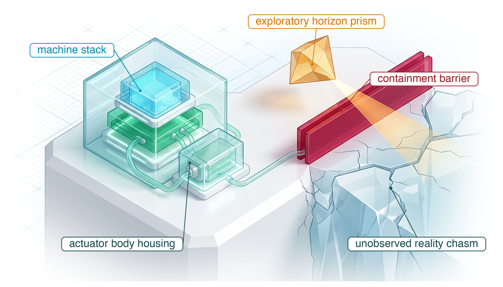
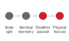

---
format:
  html:
    title: "The Epistemic Frontier"
---

# The Epistemic Frontier {#sec-frontier}

::: {layout-narrow}
::: {.column-margin}

\chapterminitoc

:::

::: {.content-visible when-format="pdf"}
\noindent
{fig-alt="Isometric blueprint of the epistemic frontier. A layered physical AI stack under glass, cabled to an actuator body housing, sits on a plinth whose edge ends at a red double-walled containment barrier above a cracked chasm labeled unobserved reality, while an amber prism labeled exploratory horizon projects a diagnostic beam across the barrier."}
:::

::: {.content-visible unless-format="pdf"}
{fig-alt="Isometric blueprint of the epistemic frontier: a layered physical AI stack under glass, a red containment barrier at the edge of a chasm labeled unobserved reality, and an amber prism projecting a diagnostic beam across it."}
:::

:::

## Purpose {.unnumbered .unlisted}

::: {.content-visible when-format="pdf"}
\begin{marginfigure}
\resizebox{0.92\linewidth}{!}{\mlphysicalstackfull{20}{20}{20}{20}{20}}
\caption{The five-level machine stack across all levels.}
\end{marginfigure}
:::

_How much authority can a machine hold when evidence cannot settle every premise its safety rests on?_

The opening chapter asked what guarantees a machine must enforce before a learned proposal commands physical work. The preceding chapters established the architectural answer: an independent real-time permission path deciding on bounded-age evidence, operating strictly within margins unconsumed by latency, and backed by a verified stopping fallback. Yet every formal guarantee remains conditional on unmeasured physical premises.

A braking certificate assumes a minimum surface friction coefficient that onboard sensors cannot measure prior to contact; a barrier filter assumes uncorrupted state estimation and nominal actuator torque; and a deployment release assumes environmental bounds tested across finite exposure. When rare hazards elude empirical observation, engineering integrity demands naming each unverified premise and restricting operational authority rather than assuming safety by default. Because the causal boundary never relaxes when evidence runs out, autonomous authority must terminate precisely where physical evidence ends.

::: {.column-margin .margin-pointer}
↰ **Prerequisite:** The four laws of @sec-boundary-bedrock-laws, which this chapter closes on.
:::



::: {.callout-learning-objectives}

- Assess which safety claims exceed the evidence available for a specific physical machine
- Evaluate whether a detector can identify a hazard before effective intervention becomes impossible
- Construct residual-claims register entries, each with a restriction, an owner, and a sized closure test, from a release's open premises
- Classify an open premise by the missing observable, evaluation, theory, or scope that would close it
- Trace the four bedrock laws through an unfamiliar machine and state which premise of each the evidence leaves open

:::

## Epistemic Limits {#sec-frontier-epistemic-limits}

Every engineering method has an epistemic boundary where its formal guarantees expire. In physical AI, that boundary is not merely an algorithmic shortfall; it is a physical confrontation between compute latency, sensory observability, and mechanical inertia. Scaling the parameter count of foundation models can yield extraordinary semantic breadth, but it cannot bend the laws of motion: as networks grow, inference latency expands the reaction corridor, trading agility for deliberative depth.

::: {#dfn-frontier-embodied-latency-scaling-law .callout-definition title="Embodied latency scaling law"}

***Embodied latency scaling law***\index{Embodied latency scaling law!definition}\index{Scaling laws!embodied latency} is the physical constraint dictating that scaling neural policy parameter count yields diminishing operational safety returns unless inference latency decreases proportionally, because physical reaction distance $d_{\text{react}} = v \cdot (t_{\text{inference}} + t_{\text{actuation}}) + \frac{v^2}{2 a_{\max}}$ scales linearly with computational delay.

1.  **Significance**: Establishes that intelligence in physical systems cannot be scaled purely by adding model parameters, because computational delay directly degrades dynamic stability and spatial stopping clearance.
2.  **Distinction**: Unlike compute scaling laws in static language modeling where latency affects only token generation speed, embodied latency scaling directly couples computational delay to mechanical reaction time constants ($t_{\text{react}} \ge t_{\text{inference}} + t_{\text{actuation}}$).
3.  **Common pitfall**: Deploying multi-billion parameter foundation models directly in the closed-loop control path under the assumption that greater semantic reasoning compensates for an unbudgeted response delay.

:::

This tension, codified in \ref{dfn-frontier-embodied-latency-scaling-law}, illustrates why parameter scaling alone cannot solve real-time safety. Furthermore, as governed by Ashby's Law of Requisite Variety [@ashby1956introduction], a controller cannot regulate disturbances that its sensory architecture cannot perceive. When an unmodeled disturbance enters the physical plant, no amount of latent computation can compensate for missing physical evidence.

A pallet jack with a weeping hydraulic line crosses one aisle of the site where the warehouse mobile manipulator works, and it leaves a clear film of fluid on the concrete. The machine's stopping budget assumes that the floor can supply the friction its credible deceleration needs, and on dry concrete it can. Under the film it may not, and neither the navigation camera nor the lidar can tell the film from dry floor. The permission path can meet every deadline, the chunk lease can expire on time, and the brake can engage on schedule while the stop still runs past the rack end, because the term that failed is a premise that no sensor on the machine reports. The missing evidence is the local friction floor before braking begins.

```{python}
#| label: calc-frontier-oil-film
#| echo: false
# ┌─────────────────────────────────────────────────────────────────────────────
# │ THE OIL FILM ON THE AISLE
# ├─────────────────────────────────────────────────────────────────────────────
# │ Context: @sec-frontier-epistemic-limits (the premise behind the aisle
# │          speed), @sec-frontier-residual-claims-register (the register
# │          entries and @tbl-17-claims-register), @sec-frontier-failures-
# │          without-detectors (detection latency against the spare margin),
# │          @sec-frontier-fallacies-pitfalls (the vision-only pitfall).
# │
# │ Goal:    Show that the 1.3 m/s normal mode always rested on a friction
# │          floor that no sensor on the machine reports.
# │ Show:    the friction the credible deceleration needs; the stop on a clear
# │          film against the clear distance; the inspected-floor ceiling and
# │          restricted mode; the zero-failure closure test; the time the spare
# │          margin buys. The walking-person ceiling is Ch12's
# │          (@sec-enforcement-stopping-envelopes) and is cited, not recomputed.
# │ How:     credible deceleration a = min(a_brake, mu g); the finished budget
# │          (C2 stop, all three overheads) at the aisle speed; its ceiling as
# │          the positive root with a_eff = a / 1.5; zero-failure sample size.
# └─────────────────────────────────────────────────────────────────────────────
from mlsysim import *

RM = Embodied.MobileManipulator.WarehouseMobileManipulator
AISLE = Embodied.Scenario.WarehouseAisle

class OilFilm:
    # ┌── 1. LOAD (Constants & Parameters) ─────────────────────────────────────
    g = (1 * ureg.standard_gravity).to(ureg.meter / ureg.second**2)  # category: measured (physical constant, standard gravity)
    a_brake = AISLE.a_brake  # category: illustrative (credible deceleration, dry floor)
    mu_dry = AISLE.mu_dry  # category: illustrative (dry concrete)
    mu_insp = AISLE.mu_inspected_floor  # category: illustrative (inspected floor)
    mu_oil = AISLE.mu_oil_film  # category: illustrative (clear hydraulic film)
    v_aisle = AISLE.v_aisle  # category: chosen (normal-mode aisle speed)
    d_clear = AISLE.d_clear  # category: illustrative (rack-end clear distance)
    tau_delay = AISLE.tau_delay  # category: derived (total pre-brake delay)
    overhead = AISLE.fixed_overhead  # category: derived (delta_loc + delta_margin + eps_track)
    v_h = AISLE.v_human_approach  # category: datasheet (ISO 13855 walking speed)
    v_restricted = 1.0 * ureg.meter / ureg.second  # category: chosen (scenario assumption: restricted mode on inspected floors)
    p_miss_target = 0.001  # category: chosen (detector miss-rate bound for closure)
    n_contrast = 1000  # category: illustrative (a smaller zero-miss campaign, for contrast)
    confidence = 0.95  # category: chosen (one-sided confidence level)

    # ┌── 2. EXECUTE (Compute) ─────────────────────────────────────────────────
    mu_min = (a_brake / g).to(ureg.dimensionless).magnitude
    a_dry = min(a_brake, mu_dry * g)
    a_insp = min(a_brake, mu_insp * g)
    a_oil = min(a_brake, mu_oil * g)

    # finished budget at the aisle speed: v tau + 0.75 v^2/a (C2 stop) + overhead
    budget_aisle = (v_aisle * tau_delay + calc_c2_stop_suffix(v_aisle, a_dry)["distance"] + overhead).to(ureg.meter)
    spare_aisle = (d_clear - budget_aisle).to(ureg.millimeter)
    t_latest = (spare_aisle / v_aisle).to(ms)
    stop_oil = (v_aisle * tau_delay + calc_c2_stop_suffix(v_aisle, a_oil)["distance"] + overhead).to(ureg.meter)

    # ceilings: positive root of the finished budget with a_eff = a / 1.5
    margin_loc = AISLE.delta_loc + AISLE.eps_track
    ceiling_dry = calc_max_permitted_velocity(d_clear, tau_delay, a_dry / 1.5, margin_loc, AISLE.delta_margin)
    ceiling_insp = calc_max_permitted_velocity(d_clear, tau_delay, a_insp / 1.5, margin_loc, AISLE.delta_margin)

    n_closure = calc_zero_failure_sample_size(1.0 - p_miss_target, confidence=confidence)
    p_miss_contrast = 1.0 - calc_clopper_pearson_zero_failure_bound(n_contrast, confidence=confidence)

    # ┌── 3. GUARD (Invariants) ────────────────────────────────────────────────
    check(abs(mu_min - 0.204) < 5e-4, f"Friction floor should be 0.204, got {mu_min}.")
    check(a_dry == a_brake and mu_dry > mu_min, "On dry concrete the brakes, not friction, must bind.")
    check(mu_oil < mu_min and mu_insp < mu_min, "On the film and on an inspected floor friction must bind.")
    check(abs(a_insp.to(ureg.meter / ureg.second**2).magnitude - 1.1768) < 5e-4, f"Inspected-floor deceleration should be 1.18 m/s², got {a_insp}.")
    check(abs(budget_aisle.to(ureg.millimeter).magnitude - 997.43) < 5e-3, f"Budget at 1.3 m/s should be 997.43 mm, got {budget_aisle}.")
    check(abs(spare_aisle.to(ureg.millimeter).magnitude - 102.57) < 5e-3, f"Spare at 1.3 m/s should be 102.57 mm, got {spare_aisle}.")
    check(abs(t_latest.to(ms).magnitude - 78.9) < 5e-2, f"T_latest should be 78.9 ms, got {t_latest}.")
    check(abs(ceiling_dry.to(ureg.meter / ureg.second).magnitude - 1.3898) < 5e-5, f"Dry-floor ceiling should be 1.3898 m/s, got {ceiling_dry}.")
    check(
        abs(ceiling_insp.to(ureg.meter / ureg.second).magnitude - 1.0947) < 5e-5, f"Inspected-floor ceiling should be 1.0947 m/s, got {ceiling_insp}."
    )
    check(
        v_restricted < ceiling_insp < v_aisle < ceiling_dry,
        "Restricted mode must sit under the inspected ceiling, and the aisle speed under the dry ceiling.",
    )
    check(abs(stop_oil.to(ureg.meter).magnitude - 2.95) < 5e-3, f"Finished budget on the film should be 2.95 m, got {stop_oil}.")
    check(abs(a_oil.to(ureg.meter / ureg.second**2).magnitude - 0.49) < 5e-3, f"Film deceleration should be 0.49 m/s², got {a_oil}.")
    check(stop_oil > 2 * d_clear, f"On the film the stop from the aisle speed must exceed twice the clear distance, got {stop_oil}.")
    check(n_closure == 2995, f"Zero-failure closure test should need 2,995 trials, got {n_closure}.")
    check(abs(p_miss_contrast - 0.002991) < 5e-7, f"1,000 zero-miss trials should bound the miss rate at 0.002991, got {p_miss_contrast}.")

    # ┌── 4. OUTPUT (Formatting) ───────────────────────────────────────────────
    a_brake_str = fmt_acceleration(a_brake, precision=0)
    mu_min_str = fmt(mu_min, precision=3)
    mu_dry_str = fmt(mu_dry, precision=2)
    mu_insp_str = fmt(mu_insp, precision=2)
    mu_oil_str = fmt(mu_oil, precision=2)
    a_insp_str = fmt_acceleration(a_insp, precision=2)
    a_oil_str = fmt_acceleration(a_oil, precision=2)
    v_aisle_str = fmt_velocity(v_aisle, precision=1)
    d_clear_str = fmt_length(d_clear, unit=ureg.meter, precision=2)
    budget_aisle_str = fmt_length(budget_aisle, unit=ureg.millimeter, precision=1)
    spare_aisle_str = fmt_length(spare_aisle, unit=ureg.millimeter, precision=1)
    t_latest_str = fmt_latency(t_latest, unit=ms, precision=1)
    stop_oil_str = fmt_length(stop_oil, unit=ureg.meter, precision=2)
    ceiling_insp_str = fmt_velocity(ceiling_insp, precision=2)
    v_restricted_str = fmt_velocity(v_restricted, precision=0)
    n_closure_str = fmt_int(n_closure, commas=True)
    n_contrast_str = fmt_int(n_contrast, commas=True)
    p_miss_contrast_str = fmt(p_miss_contrast, precision=6)
    p_miss_target_pct_str = fmt_percent(p_miss_target, precision=1, style="prose")
    p_miss_target_sym_str = fmt_percent(p_miss_target, precision=1, style="symbol")
    confidence_pct_str = fmt_percent(confidence, precision=0, style="prose")
    confidence_sym_str = fmt_percent(confidence, precision=0, style="symbol")
    v_h_str = fmt_velocity(v_h, precision=1)
```

The release decision of @sec-release-safety-cases-claims already met this premise. Its claim C3, braking traction, was refused on the book's own evidence and handed to this chapter as an open premise. The machine's credible deceleration is the smaller of what its brakes deliver and what the floor supplies, $a = \min(a_{\text{brake}}, \mu g)$. The `{python} OilFilm.a_brake_str` credible deceleration that @sec-body-kinetic-momentum set needs a friction coefficient of at least `{python} OilFilm.mu_min_str`. Dry concrete, at a $\mu$ of `{python} OilFilm.mu_dry_str`, supplies far more, so the brakes bind. The clear film, at $\mu$ = `{python} OilFilm.mu_oil_str` (both coefficients illustrative; see the Reader Guide), supplies only `{python} OilFilm.a_oil_str`, and friction binds. At the `{python} OilFilm.v_aisle_str` aisle speed, the finished budget of @tbl-enforcement-stopping-budget, `{python} OilFilm.budget_aisle_str` on dry floor, grows on the film to `{python} OilFilm.stop_oil_str` against a `{python} OilFilm.d_clear_str` clear distance. The friction premise did not become open when the film appeared. The normal mode that @sec-enforcement-stopping-envelopes chose rested on that friction floor on every aisle, the dry ones included, and nothing had measured it there either.

Every engineering method has a boundary where its guarantees expire. The physical wall of @sec-boundary-bedrock-laws is one such boundary, because a larger learned model cannot reduce the travel that its own delay costs the machine. Ashby's law of requisite variety [@ashby1956introduction] names another, since a controller cannot regulate a disturbance that its sensors cannot perceive. On the mobile manipulator the oil film is such a disturbance. The arm's contact limit at the door latch rests on a premise of the same kind, a latch that holds at every force below the arm's contact ceiling, and corrosion or wear can lower the latch's yield force below that ceiling while the joint torque sensors read exactly what they would read against a sound latch. A chemical flow regulator that holds line pressure below its limit depends on an undrifted pressure transducer, and deposition on the diaphragm can drift that reference until the loop regulates against a phantom reading while the true pressure exceeds the limit.

In each case the machine can leave its assumed conditions while its telemetry remains nominal. Successful trials cannot close such a gap, because the exposure wall that @sec-evaluation-trial-limits derives places a rare-hazard rate beyond any practical failure-free campaign. The safety case must name the missing premise, restrict operation while it remains open, and state what evidence could close it. For each open premise, that discipline asks what the machine can measure, what its actuators can still prevent, and which claim must remain open.

## What the Method Cannot Establish {#sec-frontier-method-limits}

The mobile manipulator's release claim for the aisle is a chain of links, and which links it needs depends on the hazards and the protection chosen. The argument must establish the operating domain, measured actuator and stopping bounds, component contracts, and independent permission for learned proposals (@sec-boundary-machine-model). Hazards controlled by runtime detection also need measured detector coverage and timely monitoring. Hazards controlled by passive limits or operating restrictions instead need evidence that those measures hold over the declared load, wear, and exposure envelope. Generating extensive evidence for one link cannot compensate for an unsupported premise in another.[^fn-hist-popper-falsification]

[^fn-hist-popper-falsification]: **Popperian Falsification**\index{Falsification!Popperian induction}: Karl Popper formalized the asymmetry of empirical induction: no finite sequence of safe observations can prove universal safety, whereas a single counterexample refutes it. Operational fleet hours establish survival rates strictly under observed stationary conditions, not out-of-distribution guarantees. Extrapolating zero observed incidents to unbounded environments produces an illusory sense of safety that fails upon encountering unmodeled edge cases.

Each premise of a safety case carries one of the Reader Guide's five statuses (established by measurement or derivation, assumed, decided by accountable judgment, unsupported, or outside the threat model). The envelope trichotomy (\ref{dfn-release-envelope-trichotomy}) places a premise that a runtime monitor checks as known-true, known-false, or unknown. The premises that bound the evidence here are ones no monitor now in service can check, so none can become known-true, and the release, not the monitor, must restrict operation around them. For the base, the stopping-distance claim relies on an assumed friction coefficient between wheel and floor that cannot be measured before braking begins. For the arm, the contact argument depends on a declared floor on the strength of the latch and the objects it handles, a floor decided by engineering judgment about structural yield, while the latch's present strength stays unmeasured between proof tests. For the flow regulator, the pressure claim assumes a transducer whose zero point has not drifted, a premise that its own reading cannot check. Naming these premises explicitly does not weaken the release record. It establishes the physical envelope within which the release verdict is justified, and outside of which the verdict ceases to apply.

Separating measurement from judgment is fundamental to systems engineering discipline. Empirical testing and statistical characterization can estimate physical exposure, quantify sensor noise, and bound parametric uncertainty, but no measurement can choose an acceptable **residual risk**\index{Residual risk} or decide which individuals in an operational environment must bear that risk. Those choices are accountable human decisions that must be recorded as explicit judgments rather than disguised as empirical findings. In the same way, the **threat model**\index{Threat model} bounds the validity of the record. Empirical testing across nominal fleet operations and accidental component faults provides no evidence regarding intentional adversarial attacks. A safety record demonstrating that a vision pipeline handles sensor noise, lens blur, and partial occlusions provides no statistical support for claims about resilience against adversarial optical projection, model parameter tampering, or intentional denial of service across the internal communication bus.

```{python}
#| label: calc-frontier-architectural-shield-dilution
#| echo: false
import math
from mlsysim import *
from mlsysim.core.units import ureg
from mlsysim.fmt import fmt_sci, fmt, check
from mlsysim.physics.robotics import (
    calc_empirical_testing_exposure,
    calc_shielded_system_hazard_rate,
)

# ┌── 1. INPUT (Illustrative target and distinct evidence records) ────
p_target = 1.0e-9  # category: illustrative (system incidents/hour target, not a statutory rate)
confidence = 0.95  # category: chosen (one-sided confidence level)
alpha = 1.0 - confidence  # category: derived (significance level)

fleet_units = 100  # category: illustrative (fleet size)
t_cycle_days = 90.0  # category: illustrative (release cycle length)
hours_per_day = 24.0  # category: illustrative (continuous operation)

c_shield_assumed = 0.9999  # category: illustrative (class-specific interception coverage)
p_hw_assumed = 0.0  # category: illustrative (hardware and common-cause residual set to zero)
proposal_events_hypothetical = 0  # category: illustrative (adjudicated counterfactual-oracle proposal log)

# ┌── 2. COMPUTE (Proposal-log bound and shield decomposition) ────────
# The adjudicated proposal log covers one full cycle of the fleet.
t_cycle_hours = t_cycle_days * hours_per_day
proposal_exposure_hours_hypothetical = fleet_units * t_cycle_hours
# Zero hazardous proposals bound the proposal rate (one-sided Poisson).
p_proposal_upper_hypothetical = -math.log(alpha) / proposal_exposure_hours_hypothetical

# Conditional design arithmetic: the proposal-rate bound the target would require
# at the assumed class-specific interception coverage, and the exposure to show it.
p_proposal_limit = (p_target - p_hw_assumed) / (1.0 - c_shield_assumed)
n_brain_hours = calc_empirical_testing_exposure(p_proposal_limit, confidence=confidence)
t_test_days = n_brain_hours.magnitude / (fleet_units * hours_per_day)
p_system_conditional = calc_shielded_system_hazard_rate(
    p_proposal_upper_hypothetical / ureg.hour, c_shield_assumed, p_hw_assumed / ureg.hour
).magnitude
c_required_cycle = 1.0 - (p_target - p_hw_assumed) / p_proposal_upper_hypothetical
test_overrun_days = t_test_days - t_cycle_days

# ┌── 3. GUARDS (Statistical bounds & invariance checks) ──────────────
check(abs(proposal_exposure_hours_hypothetical - 216000.0) < 1.0, f"Unexpected proposal-log hours: {proposal_exposure_hours_hypothetical}")
check(abs(p_proposal_upper_hypothetical - 1.3869e-5) < 1e-8, f"Unexpected proposal bound: {p_proposal_upper_hypothetical}")
check(proposal_events_hypothetical == 0, "Proposal scenario requires zero events")
check(abs(p_proposal_limit - 1.0e-5) < 1e-9, f"Unexpected proposal limit: {p_proposal_limit}")
check(abs(n_brain_hours.magnitude - 299573.0) < 100.0, f"Unexpected brain exposure: {n_brain_hours}")
check(abs(t_test_days - 124.8) < 1.0, f"Unexpected test days: {t_test_days}")
check(abs(p_system_conditional - 1.386913e-9) < 1e-12, f"Unexpected conditional residual: {p_system_conditional}")
check(abs(c_required_cycle - 0.9999278974) < 1e-8, f"Unexpected required coverage: {c_required_cycle}")
check(test_overrun_days > 34.0, f"Unexpected 90-day overrun: {test_overrun_days}")

# ┌── 4. OUTPUT (Canonical formatting) ────────────────────────────────
class ArchitecturalShieldDilution:
    n_proposal_sci_str = fmt_sci(proposal_exposure_hours_hypothetical, precision=2)
    p_proposal_upper_sci_str = fmt_sci(p_proposal_upper_hypothetical, precision=3)

    p_brain_sci_str = fmt_sci(p_proposal_limit, precision=0)
    n_brain_sci_str = fmt_sci(n_brain_hours.magnitude, precision=2)
    t_test_days_str = fmt(t_test_days, precision=3)
    p_system_conditional_sci_str = fmt_sci(p_system_conditional, precision=3)
    c_required_str = fmt(c_required_cycle, precision=7)
    test_overrun_days_str = fmt(test_overrun_days, precision=1)
```

Take as the system target an illustrative $10^{-9}\text{ h}^{-1}$, a rate that no standard assigns to this machine and that, by the exposure wall of @sec-evaluation-trial-limits, operating hours alone cannot demonstrate.[^fn-math-exposure-updates] The remaining question is what the permission path can add to the claim when it acts between proposal and actuation as the safety shield of @sec-enforcement-minimal-intervention, and which of its premises need evidence of their own.

[^fn-math-exposure-updates]: **Evidence Across Updates**\index{Exposure wall!retraining reset}: An updated model may alter the proposal distribution. Earlier data can be pooled only with a justified configuration-equivalence and exposure argument; an update does not automatically erase every observation. The exposure wall's constant-rate model also requires a defensible treatment of shared fleet conditions and correlated faults.

A shield argument is *conditional*, not a multiplication applied to observed system incidents. A fleet's incident count cannot stand in for a proposal rate, because the hazardous proposals a shield prevented never appear in it. For a defined hazard class $h$, let $\lambda_{\mathrm{proposal},h}$ be the rate of hazardous proposed actions before permission, and let $c_h=P(\mathrm{intercept}\mid\mathrm{hazardous\ proposal},h)$ be measured interception coverage for that class. With a separately bounded hardware and common-cause term $\lambda_{\mathrm{other}}$, a model may use @eq-frontier-shielded-hazard:
$$\lambda_{\mathrm{system},h} \le \lambda_{\mathrm{proposal},h}(1-c_h)+\lambda_{\mathrm{other}}$$ {#eq-frontier-shielded-hazard}
The relation requires a valid proposal oracle, timely detection, actuator authority, and a justified treatment of correlated failures. It gives no credit for an oil film or a weakened latch that the shield cannot observe, and no release follows from the arithmetic until each premise is supported.

::: {#nbk-frontier-fleet-exposure-and-shielded-decomposition .callout-notebook title="A conditional shield calculation"}

**Problem**: One hundred robots keep a fully adjudicated proposal log for one 90-day cycle, judged by a validated counterfactual oracle, and the log records no hazardous proposal. If a named shield's interception coverage for that hazard class were independently established at $c=0.9999$, would the modeled residual meet the $10^{-9}\text{ h}^{-1}$ system target?

**Proposal bound**: Under a stationary Poisson model, zero hazardous proposals in `{python} ArchitecturalShieldDilution.n_proposal_sci_str` proposal-hours give a one-sided 95 percent upper bound of `{python} ArchitecturalShieldDilution.p_proposal_upper_sci_str` $\text{h}^{-1}$.

**Residual**: With hardware and common-cause residual set to zero for this calculation, @eq-frontier-shielded-hazard gives `{python} ArchitecturalShieldDilution.p_system_conditional_sci_str` $\text{h}^{-1}$, **above** the target. The coverage the target requires is at least `{python} ArchitecturalShieldDilution.c_required_str`.

**Required proposal evidence**: At $c=0.9999$ the proposal-rate bound must fall to `{python} ArchitecturalShieldDilution.p_brain_sci_str` $\text{h}^{-1}$. Zero adjudicated hazardous proposals would then require `{python} ArchitecturalShieldDilution.n_brain_sci_str` proposal-hours, or `{python} ArchitecturalShieldDilution.t_test_days_str` days for 100 units, `{python} ArchitecturalShieldDilution.test_overrun_days_str` days beyond the cycle.

**Systems insight**: A shield changes the system claim only for hazard classes it can detect and intercept in time. Proposal frequency, conditional interception coverage, hardware faults, and common-cause failures need separate evidence. Oil or material failure outside the shield's sensing coverage stays in the residual-claims register.
:::

When empirical fleet exposure fails to breach the astronomical exposure wall, system safety cannot be rescued simply by retreating into offline mathematical proof (@fig-17-state-space-formal-verification-frontier). Formal safety verification confronts an equally unyielding epistemic limit: the **curse of dimensionality** across continuous state spaces. Classical Hamilton-Jacobi (HJ) reachability analysis solves a level-set partial differential equation across a discretized grid of the state space, providing an exact backward reachable tube and control-invariant safe set. However, its memory and computational complexity scale exponentially as $\mathcal{O}(N^d)$, where $N$ is the grid resolution per axis and $d$ is the state-space dimensionality. At $d > 6$, HJ reachability collides with an impenetrable "Grid Wall": it tractably solves a 3D Dubins car or 4D kinematic vehicle in seconds, but requires centuries of compute and exabytes of memory for a 7D kinodynamic vehicle, a 12D quadrotor, or a 30D mobile manipulator. Sampling-based statistical verification (such as adaptive stress testing and scenario optimization) breaks the exponential grid wall, scaling polynomially as $\mathcal{O}(d^2)$ up to 50 dimensions or more; yet it purchases tractability by surrendering deterministic safety guarantees, yielding only probabilistic Probably Approximately Correct (PAC) bounds ($1 - \epsilon$) that remain inherently blind to measure-zero adversarial singularities. Modern neural barrier certificates (NBCs) synthesized via branch-and-bound verification tools (such as $\alpha,\beta$-CROWN) establish a promising intermediate frontier, verifying forward invariance across 12D to 30D robotic systems through convex relaxations ($\mathcal{O}(d^k)$). Even so, when state dimensionality scales to coupled multi-robot swarms ($d \ge 48$), verification times again escalate toward intractability, demonstrating that formal methods replace exposure time with state-space dimensional ceilings rather than eliminating epistemic limits.

::: {#fig-17-state-space-formal-verification-frontier fig-env="figure" fig-pos="htb" fig-cap="**The formal verification tractability frontier across state-space dimensionality**: Computation time (seconds, log scale) required to synthesize or verify safe control invariants as a function of continuous state-space dimension $d$. Hamilton-Jacobi reachability (red) provides deterministic continuous guarantees via grid-based partial differential equations ($\\mathcal{O}(N^d)$), hitting the exponential Grid Wall at $d > 6$. Sampling-based statistical verification (green dashed, $\\mathcal{O}(d^2)$) scales polynomially to high dimensions but provides only probabilistic PAC bounds ($1 - \\epsilon$), blind to measure-zero corner failures. Neural barrier certificates verified via branch-and-bound SMT solvers ($\\alpha,\\beta$-CROWN, dark blue, $\\mathcal{O}(d^k)$) push the formal frontier across 12D quadrotors, 16D bipedal robots, and 30D mobile manipulators before computational scaling limits coupled multi-agent swarms ($d \\ge 48$)." fig-alt="Log-linear chart showing verification computation time from milliseconds to centuries across state-space dimensionality from 2 to 50. Hamilton-Jacobi reachability shoots upward exponentially, hitting the Grid Wall at dimension 6. Sampling-based verification scales polynomially as a gentle slope. Neural barrier certificates scale moderately through 12D quadrotor, 16D biped, and 30D mobile manipulator benchmarks, showing how modern relaxations push the formal verification frontier."}

```{python}
#| label: fig-17-state-space-formal-verification-frontier
#| echo: false
#| message: false
#| warning: false

import matplotlib as mpl

mpl.use("Agg")
import matplotlib.pyplot as plt
import numpy as np

# Publication styling
plt.rcParams["font.sans-serif"] = ["Helvetica", "Arial", "DejaVu Sans"]
plt.rcParams["axes.edgecolor"] = "#334155"
plt.rcParams["axes.linewidth"] = 1.0

fig, ax = plt.subplots(figsize=(14.2, 8.0), dpi=300, facecolor="#FFFFFF")
ax.set_facecolor("#FFFFFF")
ax.spines["top"].set_visible(False)
ax.spines["right"].set_visible(False)
ax.spines["left"].set_color("#334155")
ax.spines["bottom"].set_color("#334155")
ax.grid(True, linestyle="--", linewidth=0.6, alpha=0.5, color="#E2E8F0")
ax.set_axisbelow(True)

# State space dimension d from 2 to 50
d = np.linspace(2, 50, 400)

# 1. Hamilton-Jacobi Reachability (Grid PDE, O(N^d))
d_hj = np.linspace(2, 6.2, 150)
T_hj = 0.005 * (48.0 ** (d_hj - 2))

# 2. Sampling-Based Statistical Verification (Scenario / AST, O(d^2))
T_sample = 0.02 * (d**1.8)

# 3. Neural Barrier Certificates (SMT / alpha-beta-CROWN, O(d^k))
T_nbc = 0.035 * (d**2.7)

# Plot curves
ax.plot(
    d_hj,
    T_hj,
    color="#DC2626",
    linewidth=2.8,
    label=r"Hamilton-Jacobi Reachability (Grid PDE, $\mathcal{O}(N^d)$)",
)
ax.plot(
    d,
    T_sample,
    color="#047857",
    linewidth=2.4,
    linestyle="--",
    label=r"Sampling-Based Statistical Verification (Scenario / AST, $\mathcal{O}(d^2)$)",
)
ax.plot(
    d,
    T_nbc,
    color="#1E3A8A",
    linewidth=2.7,
    label=r"Neural Barrier Certificates (SMT / $\alpha,\beta$-CROWN, $\mathcal{O}(d^k)$)",
)

# The Grid Wall for Hamilton-Jacobi Reachability
ax.axvline(6.2, color="#DC2626", linestyle=":", linewidth=1.8, alpha=0.85)
ax.fill_betweenx([1e-3, 5e10], 6.2, 52, color="#FEE2E2", alpha=0.28)

ax.text(
    6.5,
    8e7,
    "THE GRID WALL (Curse of Dimensionality):\nDiscretization memory & PDE solve time\nexplode exponentially beyond $d > 6$",
    fontsize=8.8,
    fontweight="bold",
    color="#DC2626",
)

ax.set_yscale("log")
ax.set_xlim(1.5, 52)
ax.set_ylim(1e-3, 5e10)

# Benchmark Robot Systems Callouts aligned with Neural Barrier Curve
systems = [
    {
        "d": 3,
        "name": "Dubins Car (3D)\n$(x, y, \\theta)$",
        "y_box": 1e-2,
        "col": "#64748B",
    },
    {
        "d": 4,
        "name": "Kinematic Car (4D)\n$(x, y, \\theta, v)$",
        "y_box": 5e2,
        "col": "#64748B",
    },
    {
        "d": 7,
        "name": "Kinodynamic Car (7D)\n$(x, y, z, \\dot{x}, \\dot{y}, \\psi, \\dot{\\psi})$",
        "y_box": 3e-1,
        "col": "#0D9488",
    },
    {
        "d": 12,
        "name": "6-DOF Quadrotor (12D)\n$(p, v, q, \\omega)$",
        "y_box": 2e4,
        "col": "#1E3A8A",
    },
    {
        "d": 16,
        "name": "Bipedal Robot (16D)\n(Floating Base + Legs)",
        "y_box": 4e-2,
        "col": "#1E3A8A",
    },
    {
        "d": 30,
        "name": "Mobile Manipulator (30D)\n(Base + 14-DOF Dual Arm)",
        "y_box": 1.5e6,
        "col": "#7C3AED",
    },
    {
        "d": 48,
        "name": "Multi-Agent Swarm (48D)\n($8 \\times 6$D Coupled Agents)",
        "y_box": 4e8,
        "col": "#7C3AED",
    },
]

for sys_item in systems:
    sd = sys_item["d"]
    st = 0.035 * (sd**2.7)
    ax.plot(sd, st, marker="o", markersize=6.5, color=sys_item["col"], zorder=5)
    ax.axvline(sd, color="#CBD5E1", linestyle=":", linewidth=0.8, alpha=0.55)

    ax.plot(
        [sd, sd],
        [st, sys_item["y_box"]],
        color=sys_item["col"],
        linestyle="--",
        linewidth=0.8,
        alpha=0.7,
    )
    ax.text(
        sd,
        sys_item["y_box"],
        sys_item["name"],
        fontsize=7.8,
        fontweight="bold",
        color=sys_item["col"],
        ha="center",
        va="center",
        bbox=dict(
            boxstyle="round,pad=0.25",
            facecolor="#FFFFFF",
            edgecolor="#CBD5E1",
            alpha=0.92,
            linewidth=0.6,
        ),
    )

badge_box = dict(
    boxstyle="round,pad=0.4",
    facecolor="#FFFFFF",
    edgecolor="#CBD5E1",
    alpha=0.96,
    linewidth=0.8,
)
ax.text(
    36,
    2e-2,
    "Sampling-Based Compromise:\nFast and polynomial up to $d > 100$, but provides only\nprobabilistic PAC bounds ($1-\\epsilon$). Blind to measure-zero\nadversarial counterexamples and worst-case corners!",
    fontsize=8.4,
    color="#047857",
    bbox=dict(
        boxstyle="round,pad=0.4",
        facecolor="#FFFFFF",
        edgecolor="#047857",
        alpha=0.96,
        linewidth=0.8,
    ),
)

ax.text(
    24,
    1.5e5,
    "The Neural Barrier Frontier:\nSynthesizes learned certificates and verifies them via\nSMT / branch-and-bound ($\\alpha,\\beta$-CROWN), breaking the grid wall\nto guarantee formal forward invariance on 12D–50D systems!",
    fontsize=8.5,
    color="#1E3A8A",
    bbox=dict(
        boxstyle="round,pad=0.4",
        facecolor="#FFFFFF",
        edgecolor="#1E3A8A",
        alpha=0.96,
        linewidth=0.8,
    ),
)

time_markers = [
    (1.0, "1 Second"),
    (60.0, "1 Minute"),
    (3600.0, "1 Hour"),
    (86400.0, "1 Day"),
    (3.15e7, "1 Year"),
    (3.15e9, "1 Century"),
]
for sec, label in time_markers:
    ax.axhline(sec, color="#E2E8F0", linestyle="-", linewidth=0.6, alpha=0.6)
    ax.text(50.8, sec, label, fontsize=7.8, color="#94A3B8", va="center", ha="right")

ax.set_xlabel(
    "State-Space Dimensionality $d$ (Degrees of Freedom / State Variables)",
    fontsize=11,
    fontweight="bold",
    color="#1E293B",
)
ax.set_ylabel(
    "Verification / Safety Synthesis Computation Time (seconds, log scale)",
    fontsize=11,
    fontweight="bold",
    color="#1E293B",
)
ax.set_title(
    "Formal Verification Tractability Frontier: Hamilton-Jacobi vs. Sampling vs. Neural Barrier Certificates",
    fontsize=13.0,
    fontweight="bold",
    pad=16,
    color="#1E293B",
)
ax.legend(loc="upper left", fontsize=9.0, framealpha=0.95, edgecolor="#CBD5E1")

plt.tight_layout()
plt.show()
plt.close()
```
:::

Each of these premises, from friction under a film to a shield's coverage for a hazard class it may not observe, ends the same way, named by the release and left unsettled by its evidence. A release that stops at naming them has only listed its caveats. What it needs is a record that turns each such premise into a restriction with an owner and a test that can end it.

## A Residual-Claims Register {#sec-frontier-residual-claims-register}

Refusing claim C3 did not remove the friction premise from the machine, and an unproven premise remains whether or not a safety report records it. The **residual-claims register**\index{Residual-claims register!definition} consumes the release manifest of @sec-release-manifest, taking from it every premise the release left open or unsupported. An open entry restricts authority until its predeclared closure test passes. The register maps each such premise, and every unmonitored invariant, to its missing physical observable, its active containment or operating restriction, an accountable human owner, and a predeclared closure test. Without these four components, an unresolved premise is an unwritten risk, not a register entry. The register is where principle \ref{pri-vol4-evidence-bounds-authority} reaches the premises that evidence could not settle, holding authority to a restriction wherever the supporting evidence is absent.

Each entry links the unsupported claim to the specific unmeasurable physical observable. In a machine that moves mass, a learned policy fails to settle a safety property because sensors cannot transduce the relevant environmental state, the computing substrate cannot process the measurement within the control deadline, or the physical interaction cannot be observed before contact occurs. An engineer must define the **missing observable**\index{Missing observable!definition} with physical precision rather than statistical abstractions. Characterizing an unknown failure as an "out-of-distribution latent state" provides no actionable signal for the permission loop to trigger a physical intervention. By contrast, stating an unmeasured surface friction coefficient, an undetected optical flare across a camera lens array, or an unobservable micro-fracture in an actuator housing identifies the exact physical deficit. Naming the missing observable establishes the boundary where learned inference stops and physical uncertainty begins.

The oil film gives the mobile manipulator its first entry. The premise is that every aisle floor supplies a friction coefficient of at least `{python} OilFilm.mu_min_str`, the value its credible deceleration needs. The missing observable is the friction beneath a clear film, which the navigation camera and the lidar cannot tell from dry concrete. The stop from the aisle speed that fits the clear distance on a dry floor overruns it on the film, so a speed limit the entry imposes can hold only on floors whose friction is measured or controlled.

An open entry requires an **operational response**\index{Operational response!definition}. For the aisles, the most the entry permits is a restricted mode of `{python} OilFilm.v_restricted_str` on floors under the site's inspection regime. An inspected floor supports $\mu \ge$ `{python} OilFilm.mu_insp_str`, which gives a credible deceleration of `{python} OilFilm.a_insp_str` and a ceiling of `{python} OilFilm.ceiling_insp_str`, so the restricted mode sits below its ceiling.[^fn-math-velocity-clamp] A route that the inspection regime does not cover is excluded, or the machine is withheld from it.

[^fn-math-velocity-clamp]: **Velocity Kinetic Derating**\index{Velocity clamp!kinetic derating}: $E_k=mv^2/2$ decreases quadratically with speed. Stopping distance still depends on a validated credible deceleration and total response delay; a speed register alone cannot compensate for arbitrarily low friction.

The restricted mode needs an owner able to keep its physical premises true. Site operations owns this entry through its spill procedure for pallet-jack routes, which sets the inspection interval and names the condition that withdraws permission. The signed speed limit on the permission path enforces the restriction, but a claim about friction cannot be maintained by a speed setting alone.

Every entry needs a **closure test**\index{Closure test!definition} declared before collecting data. For the film, the test must qualify a new transducer, because no measurement by the camera or the lidar can exclude a clear film and more trials with them could not close the entry. The test is a floor-film detector whose miss rate is bounded at `{python} OilFilm.p_miss_target_pct_str` by `{python} OilFilm.n_closure_str` failure-free trials on seeded films (@sec-evaluation-trial-limits); until it passes, the restriction holds. A smaller campaign falls short. Zero misses in `{python} OilFilm.n_contrast_str` independent trials bound the miss probability only at `{python} OilFilm.p_miss_contrast_str` with `{python} OilFilm.confidence_pct_str` confidence. The detector must also report the film early enough that detection, permission, and braking together fit the clear distance, and the trial distribution, detection distance, latency, false alarms, and friction after detection must be declared in advance. A wheel-slip reflex can limit later motion but cannot establish friction before the wheels reach the film.

The same aisle carries a second entry. The stopping budget protects a static obstacle. A person who keeps walking toward the machine through the whole stop adds distance that the budget never charges (@sec-memory-belief-through-occlusion), and @sec-enforcement-stopping-envelopes found that charging it would cap the base at this rack end far below its aisle speed. The premise is that no person approaches the rack end during a stop, and the missing observable is presence in the cross aisle the rack hides. The site's crossing rule, a floor-marked crossing plus a rack-end presence sensor, is the restriction, and site operations owns it. The closure test qualifies the presence sensor by the same zero-failure sizing.

The pick station adds a third entry, and this one belongs to the arm. Its premise is that the object the arm grasps, and later hands to the coworker under `accept_item` (@sec-intervention-human-authority), is the object the task names. @Sec-intent-request-to-proposal showed how that premise fails. A thin-walled red glass jar beside the red mug on the takeaway conveyor draws a confident grounding, and the wrong target passes every geometric check the planner and the permission path apply. The missing observable is identity and fragility, which neither the wrist camera nor the grounding model can establish before contact.

The restriction on this entry has two parts. Site operations admits to the conveyor only items on the pick station's declared item list, which holds no fragile look-alike, and the station admits a grasp only when the pick window holds exactly one object, so that a second object refuses the intent and sends the item to the coworker for a manual pick. Singulation makes the grounding unambiguous for the items it admits but supplies no identity information, and a mis-routed jar that arrives alone is contained only by the feed procedure. That residual is why the entry stays open. A grip-force ceiling set for the most fragile look-alike would need a crush limit for every item that might arrive, itself an unmeasured premise, so the register does not rest on one. Site operations owns the feed list and the singulation rule jointly with the task profile. The closure test is a qualified identity check at the station, a tag read or a scale-and-code check, whose false-accept rate is bounded at `{python} OilFilm.p_miss_target_pct_str` with `{python} OilFilm.confidence_pct_str` confidence by the same `{python} OilFilm.n_closure_str` failure-free trials, run here on seeded look-alikes.

@Tbl-17-claims-register sets the three entries side by side. Each row carries the four components the register requires, so any entry can be audited without the prose around it.

\Needspace{31\baselineskip}

| Claim and missing state                                                                                                                | Hazard mechanism                                                                                                                                                                                                                                                      | Active containment and owner                                                                                                                                                                                                                                                                                            | Predeclared closure test                                                                                                                                                                                                                                                                                                     |
|:---------------------------------------------------------------------------------------------------------------------------------------|:----------------------------------------------------------------------------------------------------------------------------------------------------------------------------------------------------------------------------------------------------------------------|:------------------------------------------------------------------------------------------------------------------------------------------------------------------------------------------------------------------------------------------------------------------------------------------------------------------------|:-----------------------------------------------------------------------------------------------------------------------------------------------------------------------------------------------------------------------------------------------------------------------------------------------------------------------------|
| **Braking traction**: every aisle floor supplies $\mu \ge$ `{python} OilFilm.mu_min_str`; friction beneath a clear film is unobserved. | At $\mu$ = `{python} OilFilm.mu_oil_str` the credible deceleration falls to `{python} OilFilm.a_oil_str`, and the finished budget at `{python} OilFilm.v_aisle_str` grows to `{python} OilFilm.stop_oil_str` against a `{python} OilFilm.d_clear_str` clear distance. | `{python} OilFilm.v_restricted_str` on inspected floors ($\mu \ge$ `{python} OilFilm.mu_insp_str`, ceiling `{python} OilFilm.ceiling_insp_str`); uninspected routes excluded. *Owner*: site operations, through the spill procedure for pallet-jack routes.                                                             | A floor-film detector with a miss rate of at most `{python} OilFilm.p_miss_target_sym_str` at `{python} OilFilm.confidence_sym_str` confidence, from `{python} OilFilm.n_closure_str` failure-free seeded-film trials, plus timing and clearance tests; the restriction holds until it passes.                               |
| **Walking person**: no person approaches the rack end during a stop; presence in the hidden cross aisle is unobserved.                 | A person walking at `{python} OilFilm.v_h_str` through the whole stop would cap the base far below its aisle speed at the rack end (@sec-enforcement-stopping-envelopes).                                                                                             | The crossing rule, a floor-marked crossing plus a rack-end presence sensor. *Owner*: site operations.                                                                                                                                                                                                                   | Qualify the presence sensor by the same zero-failure sizing, `{python} OilFilm.n_closure_str` failure-free trials for a `{python} OilFilm.p_miss_target_sym_str` miss bound.                                                                                                                                                 |
| **Object identity**: the object grasped is the object the task names; identity and fragility before contact are unobserved.            | A confident grounding to a thin-walled glass jar beside the red mug passes every geometric check, and a grip the ceramic mug needs can crush the glass.                                                                                                               | Feed control admits to the conveyor only items on the station's declared list, none of them a fragile look-alike; singulation admits a grasp only with one object in the pick window. An off-list item arriving alone is contained only by the feed procedure. *Owner*: site operations, jointly with the task profile. | A qualified identity check at the station (tag read or scale-and-code) with a false-accept rate of at most `{python} OilFilm.p_miss_target_sym_str` at `{python} OilFilm.confidence_sym_str` confidence, from `{python} OilFilm.n_closure_str` failure-free seeded look-alike trials; the restriction holds until it passes. |

: **Residual-claims register for the aisle and the pick station**: The three open premises behind the mobile manipulator's aisle speed and its pick. For each, the register names the missing physical observable, the hazard it permits, the operating restriction and its accountable owner, and the predeclared closure test that would retire the restriction. {#tbl-17-claims-register tbl-colwidths="[22,24,26,28]"}

A release pipeline records each entry in a fixed schema, and its fields, units, and invariants appear with the other record layouts in @sec-appendix-systems-wire-residual-claims.

All three entries close only through a qualified detector, a floor-film detector for the first, the rack-end presence sensor for the second, and an identity check at the station for the third. Each closure test therefore has to show that the qualified detector reports in time, the two aisle detectors early enough for the permission path to stop the machine and the identity check before the station admits the grasp, and that timing requirement has a physical limit of its own.

## Failures Without Detectors {#sec-frontier-failures-without-detectors}

A runtime detector is itself a physical subsystem. To operate as a **practical detector**\index{Practical detector!definition}, it must satisfy three coupled parameters: comprehensive coverage across the failure distribution, a bounded false-alarm rate, and a detection latency strictly shorter than the physical system's time-to-harm\index{Time-to-harm!definition}. At the `{python} OilFilm.v_aisle_str` aisle speed, the finished stopping budget of @tbl-enforcement-stopping-budget leaves the mobile manipulator `{python} OilFilm.spare_aisle_str` of its clear distance unspent, which the machine covers in `{python} OilFilm.t_latest_str` (@sec-intervention-authority-transitions). A detector for a person at the rack end that adds more than that to the observation path is not a detector for that hazard. The floor-film detector faces a stricter form of the same test. Its detection distance, less the travel during its own latency, must cover the dry-floor stop to the film's edge, because a report that arrives once the wheels are on the film leaves a stop of `{python} OilFilm.stop_oil_str` against the `{python} OilFilm.d_clear_str` clear distance. A detector that reports later is a post-incident logging mechanism. Producing an accurate classification label after crossing an irreversible threshold generates diagnostic evidence but cannot serve as a runtime safeguard.

The fundamental limit of runtime detection arises from observational indistinguishability. Consider two physical states of the world, $S_A$ and $S_B$. In state $S_A$, a commanded actuator trajectory $u(t)$ is safe. In state $S_B$, the identical trajectory $u(t)$ causes structural damage or human injury, requiring the permission path to intervene and command a stop. The dynamics of the body impose a hard deadline $t_{\text{deadline}}$, determined by actuator response time and system momentum, after which physical contact or mechanical yield cannot be prevented. If the telemetry history $y(t)$ provided by onboard instrumentation is identical for $S_A$ and $S_B$ across the entire interval $t \le t_{\text{deadline}}$, no algorithm operating on those observations can reliably distinguish the benign state from the hazardous one. Identical traces rule out a state-specific response before that deadline. A conservative action chosen for both states or a passive mechanical limit may still protect them, if its own clearance and force assumptions are valid.

::: {.column-margin}
{width="100%" fig-alt="Causal chain showing state split producing identical telemetry until deadline passes and irreversible damage occurs."}

*Identical pre-contact telemetry prevents software intervention before irreversible physical damage occurs.*
:::

::: {#dfn-frontier-observational-indistinguishability .callout-definition title="Observational indistinguishability"}
***Observational indistinguishability***\index{Observational indistinguishability!definition}\index{Detectorless failure!indistinguishability} is the physical condition where two distinct world states, one nominal ($S_A$) and one hazardous ($S_B$), generate identical pre-harm sensor telemetry ($y_A(t) \equiv y_B(t)$) up to the system's physical action deadline ($t_{\text{deadline}} = t_{\text{harm}} - t_{\text{act}}$).

1.  **Significance**: Without distinguishing physical energy prior to the action deadline, timely algorithmic differentiation is physically and mathematically impossible. Scaling neural model parameters, increasing dataset size, or accelerating inference compute cannot separate states that emit zero distinguishing physical energy before the time-to-harm.
2.  **Distinction**: Unlike epistemic uncertainty or high classifier entropy (which signals that the model knows it lacks evidence), observational indistinguishability often pairs with high output confidence and near-zero entropy because the neural network maps corrupted observations into nominal latent manifolds.
3.  **Common pitfall**: Relying on software anomaly detectors or VAE reconstruction loss to catch detectorless degradation. When sensor physics blinds the transducer, as piezoresistive crystal creep does, or the hazardous state lies outside the sensed path, as a weakened latch does for the joint channel, the anomaly detector consumes telemetry that carries no trace of the fault and fails silently.
:::

In a learned perception-action policy the same limit appears as shortcut learning. A vision-language-action (VLA)\index{Vision-language-action model} model [@brohan2023rt1; @brohan2023rt2] or an imitation policy [@zhao2023learning] minimizes its loss with whatever correlations the demonstrations contain, and where friction, material strength, or payload inertia goes unobserved, it can learn non-causal visual features, such as floor highlights or the angle of the lighting, as proxies for them. Under distribution shift those proxies fail, yet the encoder can still map the unfamiliar observation into the region of latent space it knows, so the policy acts with high confidence and little ensemble disagreement. An uncertainty estimate computed from that same latent representation, whether a Mahalanobis distance, a dropout variance, or a reconstruction residual, inherits the same blindness and cannot serve as an independent detector. The Brain cannot detect its own shortcut failure, which is why physical containment rests on the permission path below the proposal boundary rather than on the model's self-assessment.

Sensing hardware shows the same limit over longer durations. The flow regulator's pressure transducer drifts as deposits build on its diaphragm, and a transducer whose zero has drifted low reports the same trend as a line that genuinely runs at the lower pressure. A single channel reports one scalar, and no algorithm on that signal can tell a changed process from a degraded calibration. Without an independent reference transducer or a proof test of the zero point, the drift is undetectable at runtime.[^fn-hw-piezoresistive-drift]

[^fn-hw-piezoresistive-drift]: **Piezoresistive Transducer Drift**\index{Piezoresistive transducer!drift}: Mechanical stress relaxation, surface oxidation, and temperature cycles alter the piezoresistive coefficient of silicon strain gauges over extended campaigns. Monolithic software filters cannot separate slow baseline voltage drift from true process pressure increments, creating an unobservable state transition. Preventing overpressure therefore requires independent physical zero-point proof-tests or dual-dissimilar sensing architectures.

The weakened latch at the door is the arm's case of the same limit, and a faster one. Until the latch yields, the joint torque sensors read the same torques against a weakened latch as against a sound one, because both carry the same contact force, and the channel holds no trace of the strength that remains. The yield is irreversible, and no command issued after it restores the latch, so a faster classifier on the joint torque channel protects nothing. The defensible responses supply what that channel lacks. A proof test establishes the latch's strength at a declared interval, and it covers the interval only if corrosion and wear cannot carry the yield force below the contact ceiling between two tests, a rate that the maintenance record, not the torque channel, must support. A passive compliant element in the wrist instead keeps the contact force below a declared floor on latch strength over a mechanically limited stroke, so the premise no longer depends on the latch's state. @Eq-frontier-passive-compliance gives that element's stiffness ceiling, with $F_{\text{allow}}$ set by the declared floor, which holds only if the element carries the entire contact load, the stroke cannot pass its stop, and wear and impact tests support the model.[^fn-math-contact-lipschitz]
$$k_{\text{spring}} \le \frac{F_{\text{allow}}-F_{\text{preload}}}{\Delta x_{\text{stall}}}$$ {#eq-frontier-passive-compliance}

::: {.column-margin .margin-pointer}
↰ **Prerequisite:** Failures undetectable by sensory telemetry challenge the observation contracts formulated in @sec-perception-observation-contract.
:::

[^fn-math-contact-lipschitz]: **Contact Boundary**\index{Contact mechanics!non-smooth impact}: Rigid impact and friction transitions can invalidate a smooth free-motion model. Peak contact force and component damage require measured stiffness, damping, geometry, and actuator response; neither a controller nor a passive part alone supplies a universal bound.

The Deepwater Horizon blowout failed in the opposite way from the Tempe collision of @sec-boundary-when-fails, where the sensors had detected the pedestrian but a designed suppression withheld the braking that state warranted. In the blowout the protective device acted, but on a state that no sensor reported. A faster trigger or broader authority would not have changed the outcome, because no measurement separated the state the protection was qualified for from the actual one. A timelier response rule and a restored redundant brake path address a failure like Tempe's. Only qualification and sensing extended to every state the protection may meet can repair the other kind, the detectorless failure this section describes and the one the oil film poses on the aisle.

\Needspace{0.57\textheight}

::: {#ws-frontier-deepwater-horizon-blind-shear-ram-structural .callout-war-story title="Deepwater Horizon blind shear ram failure (2010)"}
**Context**: On April 20, 2010, the Macondo well in the Gulf of Mexico blew out beneath the *Deepwater Horizon* drilling rig. The last physical containment safeguard was the subsea blowout preventer (BOP), a stack of hydraulic valves and blind shear rams weighing approximately $400$ tons and anchored at the wellhead about $1{,}500\text{ m}$ below the surface [@csb2014macondo].

**Mechanism**: The explosions likely activated the BOP's automatic deadman system, which was meant to close the blind shear ram, shear the drill pipe, and seal the well. By then the drill pipe inside the BOP had buckled off center. The pressure difference between the inside and outside of the pipe had placed it in effective compression, a buckling mechanism that earlier investigations had not identified. The BOP was not designed to cut off-center pipe. The ram punctured and partially severed the pipe but could not close fully and seal the well.

**Impact**: Flow through the punctured pipe resumed rapidly. Eleven crew members died, the rig sank about 36 hours after the explosions, and approximately 5 million barrels of oil spilled into the Gulf of Mexico [@csb2014macondo].

**Response**: The [U.S. Chemical Safety Board](https://www.csb.gov/csb-board-approves-final-report-finding-deepwater-horizon-blowout-preventer-failed-due-to-unrecognized-pipe-buckling-phenomenon-during-emergency-well-control-efforts-on-april-20-2010-leading-to-environmental-disaster-in-gulf-of-mexico/) recommended changes to blowout-preventer design, testing, and oversight. Its investigation also found two instances of miswiring and two backup-battery failures in the controls for the blind shear ram.

**Systems lesson**: The pipe's position inside the BOP was a state that no sensor reported, and the ram acted on it anyway ($y_A(t) \equiv y_B(t)$ for the centered and the buckled pipe). Its qualified cutting geometry did not cover the actual condition. Protection has to be qualified across every physical state it may meet, including pipe position, and across the independent control faults the CSB documented.
:::

When a failure mode lacks a practical detector, the remaining responses are to limit actuator authority under a validated force or clearance model, restrict the operating domain, add independent sensing, or schedule proof tests. A force limit rests on that validated model, because ISO 10218 and ISO/TS 15066 apply to their industrial robot scopes and supply no universal force limit for this machine. Active sensing is itself actuation. A small dither of the wheels, an active probe for the film, measures traction only where the wheels already are, so it cannot close the friction entry. Because the probe must not slip beyond the reserved clearance, the independent permission path must admit each probe command within a separately validated energy, contact, clearance, and timing envelope and choose a state-matched fallback when the needed bound is unavailable. If none of these measures can support the claim, operation must be withheld.

The safety case must document these gaps. @Fig-17-epistemic-limits marks where the argument runs out. The residual-claims register records the detector's blind region, defining the set of physical states that produce indistinguishable observations, along with the maximum exposure duration permitted between physical proof tests. Treating an undetectable failure as a solved runtime problem undermines the validity of the safety case. Preserving the exact boundary where sensing stops forces the engineering organization to rely on physical constraints rather than software optimism.

::: {#fig-17-epistemic-limits fig-env="figure" fig-pos="t" fig-cap="**Two limits on the claim**: Panel (a) shows states with identical pre-deadline telemetry. A speed clamp is useful only with a supported braking and clearance envelope. Panel (b) shows the zero-event exposure required for a rare-rate claim under the chosen Poisson model; a barrier argument also needs observable state, a feasible control action, and valid timing assumptions." fig-alt="Panel (a) shows safe and hazardous states producing the same telemetry until after the action deadline, with a conditional speed clamp. Panel (b) shows zero-event exposure growing inversely with the target rate and a conditional barrier argument."}
{width="100%" fig-alt="Panel (a) shows safe and hazardous states producing the same telemetry until after the action deadline, with a conditional speed clamp. Panel (b) shows zero-event exposure growing inversely with the target rate and a conditional barrier argument."}
:::

Each detectorless mode still leaves a defensible response, and @tbl-17-detectorless-modes sets four of them side by side.[^fn-hw-motor-thermal]

[^fn-hw-motor-thermal]: **Motor Thermal State**\index{Actuator!stator thermal dynamics}: Winding resistance and magnet flux can change with temperature. Whether that changes braking authority depends on the drive, current limits, load, and measured thermal model; a separate holding path may be required for gravity-loaded axes.

| Failure and missing state                                                                            | Why the existing channel can miss it                                                              | Deadline or evidence deficit                                                                                              | Defensible response                                                                                                                      |
|:-----------------------------------------------------------------------------------------------------|:--------------------------------------------------------------------------------------------------|:--------------------------------------------------------------------------------------------------------------------------|:-----------------------------------------------------------------------------------------------------------------------------------------|
| **Pressure-sensor drift**: zero offset changes with aging or deposition.                             | One channel cannot separate true pressure change from its own offset drift.                       | Drift may persist until the process reaches its pressure limit; a detector cannot be credited without a second reference. | Independent calibrated pressure channel, proof test, and rated relief path.                                                              |
| **Latch-strength loss**: corrosion or wear lowers the latch's yield force below the contact ceiling. | Joint torque sensors read the same contact force against a weakened latch as against a sound one. | Latch strength is unmeasured between proof tests, and the yield is irreversible, so no later command restores the latch.  | A passive compliant element sized by @eq-frontier-passive-compliance to a declared floor on latch strength, or proof tests of the latch. |
| **Rotor flux loss**: delivered torque differs from current-based estimate.                           | Stator current alone does not measure the torque constant after magnet damage.                    | A gravity-loaded axis may have little time to arrest once available torque is lost.                                       | Measure torque or rotor state, derate within tested limits, and validate a holding or controlled-stop path.                              |
| **Learned perception shift**: an optical artifact is mistaken for a known scene.                     | Model confidence may remain high even while the physical scene differs.                           | Confidence or reconstruction loss alone does not bound clearance or stopping response.                                    | Independent range/clearance checks and an admitted motion envelope, with residual blind regions recorded.                                |

: **Detectorless physical failure taxonomy**: Four failure modes, in transduction, contact, the drive, and learned perception, whose safe and hazardous states look identical to the existing channel before the time-to-harm. For each, the table gives why the channel misses it, the deadline or evidence it cannot meet, and the response that still supports a claim. {#tbl-17-detectorless-modes tbl-colwidths="[23,26,24,27]"}

Every row fails the practical-detector test because the existing channel gives identical observations for the safe and hazardous states until the deadline has passed. Every defensible response supplies what that channel lacks: a second reference, a passive load limit, a direct torque measurement, or an independent range check. What that missing element is, and whether it can be built, decides the kind of gap each register entry records.

## What Would Change These Answers {#sec-frontier-assumptions-change}

The three entries in the mobile manipulator's residual-claims register\index{Residual-claims register} lack the same element, a qualified detector for a state no sensor in service reports. Sorting every recorded gap by what is missing turns the register from a list of caveats into an engineering agenda, and a recorded gap falls into one of four classes, defined by the missing element. It stems from an **unmeasured observable**\index{Unmeasured observable} when the true physical state (such as a hidden internal defect) cannot be distinguished from sensor data before the deadline for action; from an **evaluation deficit**\index{Evaluation deficit} when the tail probability of failure cannot be bounded because these rare events require intractable physical exposure; from a **theoretical deficit**\index{Theoretical deficit} when the learned policy lacks a bounded relationship between training conditions and execution stability; or from a **scope mismatch**\index{Scope mismatch} when the target claim exceeds what the system architecture can physically support. All three of the machine's entries belong to the first class. More grounding-model trials at the pick station or more stopping runs on dry floors would treat them as evaluation deficits, which they are not. Naming the missing capability defines the exact physical or mathematical requirement that would discharge the entry.

Closing a gap from an unmeasured observable requires a new physical measurement that separates previously indistinguishable states within the permission path's deadline. For the film, a software filter or a learned estimator running on the navigation camera and the lidar cannot be that measurement, because it consumes the same observations that already fail to separate film from dry floor. The floor-film detector must respond to the film through an independent physical channel, and it closes the entry only if it meets the timing requirement of @sec-frontier-failures-without-detectors, holds a bounded false-alarm rate, and fails independently of the cameras.

Closing an evaluation deficit requires replacing raw sample counts with estimators whose bias and variance can be bounded analytically. Logging more unperturbed operation, or running simulated episodes whose fidelity in the tail is unverified, cannot bound a tail rate. An importance-sampling\index{Importance Sampling} or adaptive stress-testing\index{Adaptive Stress-Testing} scheme can, if it demonstrates conservative estimates on benchmark distributions whose answer is known and reports effective independent exposure rather than raw trial counts. Ten thousand simulated trajectories that explore one basin of a collision surface say little about the others, so effective sample size must be estimated from the weights and their dependence (for high-quantile tail bounds and extreme value modeling, see @sec-appendix-ml-evt).

Closing a theoretical deficit requires a bounded analytical claim paired with a runtime mechanism that checks its premises. For a policy trained by imitation or reinforcement learning, the deficit is the absence of any guarantee of bounded outputs under distribution shift, and neither asymptotic convergence nor a bound resting on an uncheckable Lipschitz constant closes it. The theory must state the invariance it guarantees and the support over which it holds, and the machine must carry a monitor that flags when its state leaves that support, with bounded estimator error and decision delay and a validated state-matched stop.

To prevent research optimism from corrupting the safety case, each candidate advance must undergo evaluation against a predeclared closure test. The test defines the missing argument link, the numerical threshold required for sufficiency, and the independent evidence necessary to verify it. An advance fails the test if it merely relocates an assumption to a less visible layer of the system. Replacing a neural network controller with a control-barrier function whose certificate assumes perfectly known linear dynamics does not close a theoretical deficit. It merely relocates the unmodeled dynamics from the opaque network weights to the barrier derivative. A candidate advance is stopped before it can alter the safety verdict whenever its validation relies on the exact unverified properties it was designed to establish.

Research directions in physical machine learning must be judged solely by whether they convert an open residual claim into verified evidence capable of altering the operational verdict. General improvements on benchmark leaderboards, such as a 3 percent reduction in average tracking error or higher reward on a standard task suite, provide no evidence toward closing an unsupported safety link. A research project becomes relevant to physical deployment only when its deliverable targets a specific entry in the claims register, whether by providing the missing transducer, bounding the tail estimator, or furnishing the runtime-checked stability proof. If an advance improves mean performance but leaves the detector blind spot or the tail uncertainty unchanged, the authority limits of the machine remain exactly where they were.

Certain gaps cannot be closed by any known sensor, sampling regime, or mathematical framework. When physical laws, computational limits, or economic constraints preclude the necessary measurement or proof, the safety case cannot remain suspended in anticipation of future discovery. Narrowing the actuator's physical authority, restricting the operational design domain (ODD)\index{Operational design domain}, or refusing to operate the machine is not an admission of research defeat. It is the engineering resolution. Classical fault-tolerant design\index{Fault tolerance!structural bounds} reached the same conclusion, that dependable operation comes from self-monitoring thresholds\index{Self-Monitoring} and structural isolation\index{Structural Isolation} that contain faults rather than from eliminating every disturbance. An arm whose compliant wrist bounds contact force below a declared floor on latch strength does not need to detect a weakened latch to leave it intact. The residual-claims register records the boundary of verifiable knowledge, and the permission path and the machine's passive limits enforce the constraints that bound the consequence of what remains unknown.

The register, the practical-detector test, and the four gap classes have so far been applied to machines whose records already existed. The method must also hold for a machine with no records yet, where the engineer has to decide which premises to measure, which to restrict, and which to leave open.

## Generalizing to Unfamiliar Systems {#sec-frontier-generalizing-unfamiliar-systems}

Applied in order to a machine not previously examined, the four laws of @sec-boundary-bedrock-laws isolate its hazards before its hardware is energized. Consider an automated packaging cell designed for prepared meals. The machine moves rigid plastic trays along a linear track, presses a heated sealing head onto tray perimeters to bond plastic barrier film, and injects pressurized steam into product cavities to blanch ingredients immediately prior to sealing. This cell couples all three machine classes of @sec-boundary-four-archetypes within a single enclosure, the tray as moving mass, the sealing head as contact force, and the steam as thermal flow.

The first law asks what the cell cannot undo, so the evaluation begins by cataloging the irreversible state changes\index{State change!irreversible} the cell can produce and the physical bounds\index{Physical bounds} that govern them. A loaded food tray traversing a linear transfer rail carries momentum. When a tray strikes an obstruction, the kinetic energy is dissipated through plastic deformation of the container and structural deflection of the frame, a state transition that cannot be reversed by commanding the drive motor in reverse. The sealing mechanism introduces a second irreversible boundary. An actuator drives an aluminum sealing head at $180^\circ\text{C}$ against the tray flange to melt polymer bonding layers. If the actuator exerts force beyond the compressive yield strength of the container wall, the flange buckles, destroying the hermetic geometry. The steam subsystem introduces a third irreversible boundary through enthalpy exchange. Steam supplied at $120^\circ\text{C}$ delivers heat to the product; the product-zone temperature can remain lower only under a measured heat-transfer and dwell model. Once proteins denature and cell walls rupture under excessive thermal exposure, cooling the chamber cannot restore product texture.

Because the tray's momentum is already committed, the permission path must act before the carriage consumes its clearance. Consider, with illustrative values throughout, a linear carriage of mass $m_{\text{carriage}} = 12.0\text{ kg}$ transporting a loaded tray at a nominal velocity of $v_{\text{nom}} = 1.50\text{ m/s}$ toward an optical inspection station whose mechanical gate provides a physical clearance margin of $D_{\text{clear}} = 60.0\text{ mm}$ before contacting a rigid frame stop. An overhead vision system detects a closing inspection gate. The controller commands an electromagnetic track brake with a credible deceleration of $a_{\text{brake}} = 15.0\text{ m/s}^2$, a value that assumes the pad and rail friction stay as tested. Determining whether an onboard vision system can halt the carriage prior to an impact requires computing the pre-brake delay $\tau_{\text{delay}}$ across the full observation-to-braking path: optical exposure and rolling-shutter integration ($t_{\text{exp}} = 16.0\text{ ms}$), direct memory access (DMA) transfer and neural detection inference ($t_{\text{inf}} = 36.0\text{ ms}$), CAN-FD safety arbitration bus latency ($t_{\text{bus}} = 2.0\text{ ms}$), and brake solenoid flux buildup rise time ($t_{\text{sol}} = 10.0\text{ ms}$), summing to $\tau_{\text{delay}} = 16.0 + 36.0 + 2.0 + 10.0 = 64.0\text{ ms} = 0.064\text{ s}$.

Over this delay, the carriage travels blind for $d_{\text{blind}} = v_{\text{nom}} \tau_{\text{delay}} = 1.50\text{ m/s} \times 0.064\text{ s} = 96.0\text{ mm}$, which alone exceeds the $60.0\text{ mm}$ clearance, so the physical deadline is missed before braking begins. Once the solenoid builds flux and mechanical pads engage, deceleration consumes an additional distance $d_{\text{brake}} = \frac{v_{\text{nom}}^2}{2 a_{\text{brake}}} = \frac{(1.50\text{ m/s})^2}{2 \times 15.0\text{ m/s}^2} = 75.0\text{ mm}$. The stopping distance of @sec-body-kinetic-momentum is the sum of the two, blind travel that grows linearly with speed and braking distance that grows with its square, so $d_{\text{stop}} = d_{\text{blind}} + d_{\text{brake}} = 96.0\text{ mm} + 75.0\text{ mm} = 171.0\text{ mm}$. That stop exceeds the physical clearance by a deficit of $\Delta d = d_{\text{stop}} - D_{\text{clear}} = 111.0\text{ mm}$, and the machine cannot stop before the modeled gate at this velocity by relying on that vision path.

The second law asks what the cell's learned proposers have shown they can do. Three of them propose actions here, one in each domain. A vision model infers tray contents to propose carriage transit speeds, a multimodal network estimates packaging film thickness to propose sealing forces and dwell durations, and a thermal estimator proposes steam valve pulse widths from incoming product temperature. Each proposer's actions choose part of what it observes next (@sec-data-endogenous-experience). A slower carriage changes the motion blur and timing of the frames the vision model sees, a longer dwell changes the film that the next thickness estimate reads, and a steam pulse changes the product temperature the thermal estimator receives. Their competence therefore extends only to the states a closed-loop evaluation covered, and the question for this cell is whether the target ODD of its evaluation record (@sec-evaluation-logs) contains the states that operation will admit. A restriction imposed after training is itself a change of operating condition. If the demonstrations were collected at the nominal transit speed, the derated mode that the cell's release claim requires moves the vision model into conditions its evaluation never sampled, so the restriction that shortens the stop also opens a regime without evidence. Either the evaluation samples the restricted mode before release, or the release claim records that regime as an open premise.

The third law places those proposals beneath an authority split\index{Authority split} that the proposers cannot delay or corrupt. The permission path keeps the proposals from reaching actuators directly. Its independent kinematic check, at $1\text{ kHz}$, monitors optical encoders along the track, admitting carriage velocity only where rangefinder coverage, measured gate clearance, and a validated stop path support the envelope. For the sealing head, a mechanical force limiter caps transmitted force at a selected $220\text{ N}$, a cap that holds only while the limiter's calibration does. For the steam delivery system, an independent temperature path closes the steam valve when a sensed product-zone temperature reaches $105^\circ\text{C}$ or dwell reaches $400\text{ ms}$. The learned policy retains authority to optimize throughput and seal quality within these bounds, but the permission path retains sole authority to permit physical execution.

The fourth law turns what the evidence supports into a release claim\index{Release claim} and names what it leaves open. The evidence record\index{Evidence record} can support a restricted kinetic claim after tests of rangefinder coverage, gate clearance, and braking. The firmware velocity clamp is sized from the same stopping distance. Requiring the stop to fit within the physical clearance with a safety margin of $d_{\text{margin}} \ge 15.0\text{ mm}$ imposes the constraint $d_{\text{stop}}(v) \le 45.0\text{ mm}$. Reducing operational velocity shortens both terms, and derating it threefold, from $v_{\text{nom}} = 1.50\text{ m/s}$ to a firmware clamp of $v_{\text{clamp}} \le 0.50\text{ m/s}$, compresses blind travel linearly from $96.0\text{ mm}$ to $d_{\text{blind}} = 0.50\text{ m/s} \times 0.064\text{ s} = 32.0\text{ mm}$, while braking distance falls ninefold from $75.0\text{ mm}$ down to $d_{\text{brake}} = \frac{(0.50\text{ m/s})^2}{2 \times 15.0\text{ m/s}^2} \approx 8.3\text{ mm}$. The composite stop $d_{\text{stop}} = 40.3\text{ mm}$ fits within the $45.0\text{ mm}$ threshold, preserving a $19.7\text{ mm}$ physical margin. Simultaneously, carriage kinetic energy ($E_k = \frac{1}{2} m v^2$) drops quadratically by 88.9 percent, from $13.5\text{ J}$ to $1.50\text{ J}$.

Assembling the evidence record also uncovers claims that remain unsupported. To assess seal hermeticity, the engineering team evaluates a vision model that inspects optical scattering through the steam chamber for micro-tears in the sealing film. Within the chamber, localized steam condensation creates optical refraction patterns that mimic film defects while masking genuine punctures. Because no independent physical sensor exists in the cell to measure film seal integrity in real time under dense vapor, this claim has no practical detector. Marking this link as detectorless and unsupported in the claims register\index{Claims register} is not an omission in the documentation, but an accurate statement of what the evidence can justify.

The derated stop therefore supports a *candidate restricted mode* for transport at $0.50\text{ m/s}$, provided the stated 64 ms end-to-end delay, $15\text{ m/s}^2$ credible deceleration, and $60\text{ mm}$ clearance are validated together. Sealing and thermal processing remain conditional on tests of the force limiter, cutoff, material limits, and independent fault path. Autonomous package sign-off is refused because vapor can conceal film defects from the available vision sensor and the example has not established seal integrity independently. That link could be closed by post-cooling leak or vacuum-decay inspection, a tested material-process argument, a self-indicating film, or mandatory downstream inspection. A throughput model cannot replace that physical evidence.

The evaluation of the cell did not begin with model architecture, training losses, or benchmark scores. It began at the physical body, where mass, force, and energy create irreversible state changes, and it ended with an evidence record that marks its open links and restricts authority to what the evidence supports. A neural network predicting a high probability of a safe stop will still crash if the brakes cannot engage before the clearance is consumed.

## What the Four Laws Leave Open {#sec-frontier-architectural-synthesis}

The running machine ends the book refused. On the book's evidence the adjudicator of @sec-release-case-worked-full signs `REFUSE` on all six claims, because each rests on a premise the records leave illustrative or unknown. The measurements of @tbl-16-cond-measurements would move that verdict only part of the way. Once they support the premises they settle, the most a release could sign is `COND` for a named part of the envelope, covering aisle travel in the `{python} OilFilm.v_restricted_str` restricted mode on inspected floors, the door at the guarded approach, and the handover to the coworker. The `{python} OilFilm.v_aisle_str` normal mode would stay unsigned, because it rests on the friction floor that the oil film leaves open. Under either verdict the three entries of @tbl-17-claims-register stay open, each with its owner and closure test, and all three are unmeasured observables that only a qualified detector can close: a floor-film detector, a qualified rack-end presence sensor, and a qualified identity check at the pick station. None of them is a scope mismatch or a theoretical deficit. The machine's authority stops where the register says it does.

That verdict is the four laws applied to one machine, and the packaging cell carried the same laws through a machine the book had not examined. Each law also led one part of this book, and each part handed forward records that state their own conditions. Together those records carry the answer to the question the book opened with, and they also mark where that answer stops. @Fig-17-causal-loop-synthesis draws the loop they protect. The Brain proposes, the permission path admits or refuses each proposal against fresh state, and the Body delivers the admitted command across the Boundary into a World that keeps evolving whether or not any level observes it.

::: {#fig-17-causal-loop-synthesis fig-env="figure" fig-pos="t" fig-cap="**Closed causal loop**: The Brain proposes across the proposal boundary, and the permission path in the Nervous System admits, modifies, or refuses each proposal before the Body acts. The Body's current becomes force and motion at the Boundary, the World evolves, and the Boundary returns measurements with capture times to the permission path and the Brain. Not every state of the World reaches a sensor. The governance envelope surrounds all five levels and changes on the timescale of releases rather than control cycles. The 1 kHz permission loop is one implementation, not a universal rate." fig-alt="Five stacked levels inside a dashed governance envelope: Brain, Nervous System, Body, Boundary, and World, with a dashed proposal boundary between the Brain and the Nervous System. Arrows run down from the Brain to the World, labeled proposal, admitted command, current in a winding, and force and motion. A return arrow runs from the World to the Boundary, then up a side lane to the Nervous System, labeled fresh state, and to the Brain, labeled observations. Labels give the intent model 1 to 5 Hz, the chunk policy 10 to 50 Hz, perception at sensor rate, a 1 kHz permission loop in one implementation, and a 10 to 25 kHz current loop; the Boundary is event-timed, the World is continuous, and governance has no control rate."}
{width="100%" fig-alt="Five stacked levels inside a dashed governance envelope: Brain, Nervous System, Body, Boundary, and World, with a dashed proposal boundary between the Brain and the Nervous System. Arrows run down from the Brain to the World, labeled proposal, admitted command, current in a winding, and force and motion. A return arrow runs from the World to the Boundary, then up a side lane to the Nervous System, labeled fresh state, and to the Brain, labeled observations. Labels give the intent model 1 to 5 Hz, the chunk policy 10 to 50 Hz, perception at sensor rate, a 1 kHz permission loop in one implementation, and a 10 to 25 kHz current loop; the Boundary is event-timed, the World is continuous, and governance has no control rate."}
:::

@Tbl-17-master-synthesis pairs each law with the records that carry it, the premise its evidence cannot always settle, and the restriction that holds while that premise stays open. The numbers each row needs come from the particular machine and its limit records, not from the table.

\Needspace{25\baselineskip}

| Law                            | Part                                                                                             | Records that carry it                                                                                        | Premise the evidence cannot always settle                                                                                   | What restricts operation while it is open                                                                                                         |
|:-------------------------------|:-------------------------------------------------------------------------------------------------|:-------------------------------------------------------------------------------------------------------------|:----------------------------------------------------------------------------------------------------------------------------|:--------------------------------------------------------------------------------------------------------------------------------------------------|
| **Irreversibility**            | I (@sec-body, @sec-brain, @sec-nervous)                                                          | Limit records (@sec-body); the proposer's limits (@sec-brain), which enter the handoff record (@sec-nervous) | Each measured limit, such as floor friction, payload, brake onset, or observation age, still holds under present conditions | A speed or force ceiling sized from the credible limit, a lease derived from the stopping budget, and a fallback reachable from the current state |
| **Endogenous data**            | II (@sec-data, @sec-training, @sec-evaluation)                                                   | Demonstration provenance record, policy manifest, evaluation record                                          | The states the machine enters lie inside the target ODD that closed-loop evaluation sampled                                 | Operation confined to the target ODD, with a runtime monitor on every boundary that can be monitored                                              |
| **Proposal is not permission** | III (@sec-perception, @sec-memory, @sec-intent, @sec-planning, @sec-enforcement, @sec-placement) | Observation contract, belief record, intent lease, trajectory record, enforcement record, placement record   | The permission path sees fresh, distinguishable state and meets its deadline under load                                     | Refusal and the fallback ladder; an expired lease or stale evidence removes permission without waiting for the proposer                           |
| **Evidence bounds authority**  | IV (@sec-intervention, @sec-verification, @sec-release)                                          | Authority record, fault record, release manifest, and the residual-claims register of this chapter           | The premises of the release claim still hold after release                                                                  | A conditional verdict with standing conditions, and a register entry that restricts authority until its closure test passes                       |

: **The four laws and what they leave open**: Each law leads one part of the book and is carried by that part's records. The last two columns name the premise its evidence cannot always settle and the restriction that holds while the premise is open, for a particular machine rather than as a universal hardware floor. {#tbl-17-master-synthesis tbl-colwidths="[14,17,25,22,22]"}

Four decisions keep the restrictions in the table's last column operational. First, preserve each open entry across model updates until a predeclared closure test supplies evidence. Second, keep learned outputs as proposals and maintain an independently validated permission and fallback path whose processor, scheduling period, sensor coverage, and actuator response follow the plant's measured deadlines. Third, use passive limits only where their load path, stroke, wear, and stopping consequences are tested. Fourth, require named engineering and operations owners to sign the release conditions and define the measurements that withdraw authority. Down that column, every law ends the same way, in a restriction that holds until evidence lifts it rather than a guarantee that holds regardless of the evidence.

## Fallacies and Pitfalls {#sec-frontier-fallacies-pitfalls}

Some hazards are unobservable through available sensors, and some claims require more exposure than the design can accumulate. Both limits must shape operating authority rather than disappear into a confidence score.

::: {.column-margin .margin-pointer}
↰ **Prerequisite:** The gap between verified models and unmodeled friction challenges the safety cases in @sec-release-safety-cases-claims.
:::

::: {.fallacy-pitfall}

**Pitfall**: *Relying on vision-based perception alone when the physical hazard is observationally indistinguishable.*

The mobile manipulator approaches a transparent hydraulic-fluid film that its navigation camera and lidar cannot distinguish from dry concrete, producing observational indistinguishability\index{Observational indistinguishability}. When the wheels enter the film and spin without grip, the slip reveals the changed surface only after the deceleration the stop assumed is gone. A visually clear path says nothing about the friction the admitted speed requires. The operating envelope must account for that unobserved condition through defensible speed restrictions or independently validated sensing. The residual-claims register must retain the friction assumption and its containment measure instead of treating missing visual evidence as evidence of traction.

:::

::: {.fallacy-pitfall}

**Fallacy**: *Stator temperature and current measurements are sufficient to detect rotor magnet flux degradation.*

The rotor-flux row of @tbl-17-detectorless-modes already names this gap. Torque follows $\tau = K_t I$ (@sec-body), so when magnet damage\index{Flux degradation} lowers $K_t$, the drive still reports its commanded current and the expected Joule heating\index{Joule heating} while the joint delivers less torque than that current implies. Nominal current is not proof of torque authority, so qualification must verify torque capability independently and the holding path must not assume the original torque.

:::

::: {.fallacy-pitfall}
**Fallacy**: *Massive cloud simulation can substitute for physical exposure in certifying open-world safety.*

A team runs billions of simulated hours in the cloud to bypass the cost of physical exposure. Simulation evidence holds only for the simulator's own model (@sec-evaluation-evidence-regimes), and a simulated floor with the friction of inspected concrete says nothing about a clear film (@sec-evaluation-limits). Repetition inside that closed model adds no evidence about the physics it omits, so it cannot validate sim-to-real\index{Sim-to-real gap} fidelity against the deployment conditions. Simulation remains useful for logic checks and regressions, while physical safety claims also require measurements or validated operating envelopes for the machine. The release case must distinguish simulated evidence from evidence that its assumptions hold on the physical system.
:::

## Summary {#sec-frontier-summary}

At the causal boundary\index{Causal boundary} (@sec-boundary-causal-boundary), a computational decision becomes part of a continuing, irreversible physical process. The architecture developed throughout this book connects this physical irreversibility to measured budgets, explicit interfaces, independent enforcement\index{Independent enforcement}, and accountable release decisions. Its frontier lies in the premises those mechanisms still depend on but cannot fully observe or verify. On the running machine, the arithmetic of the stopping budget never changed when the oil film appeared, but one of its terms had rested all along on a floor that nothing measured, and irreversibility made that unmeasured term as binding as any measured one. An engineering record must expose such limits and let them restrict operation for as long as the machine runs, not only on the day a release is signed. Engineering embodied intelligence requires knowing when the available evidence is sufficient to act and when it is not.

::: {.callout-takeaways title="The epistemic frontier and what the laws leave open"}
* **An open premise restricts authority:** The residual-claims register takes each premise the release manifest left open and gives it a missing observable, a restriction, an owner, and a closure test declared in advance. On the aisle, the friction entry caps any release at its restricted mode on inspected floors until a floor-film detector passes that test.
* **A late detector is only a logger:** A detector protects against a hazard only if its latency fits inside the margin the stop leaves unspent. When safe and hazardous states give identical telemetry until the action deadline, no algorithm separates them in time, and passive compliance\index{Passive compliance}, a restricted envelope, or a second physical channel must carry the claim.
* **Trials cannot reach a rare-hazard rate:** The exposure wall of @sec-evaluation-trial-limits puts a rare-hazard rate beyond any practical failure-free campaign. A shield between proposal and actuation earns credit only for hazard classes it can observe and intercept in time, and its proposal rate, coverage, and common-cause terms each need evidence of their own.
* **Research counts when it closes an entry:** A new sensor, estimator, or proof matters for deployment only when it closes a named register entry by supplying the missing observable, bounding the tail, or checking its own premises at runtime. An entry that nothing can close is resolved by narrowing authority or withholding operation, not by waiting.
* **Every law leaves a premise open:** Irreversibility rests on measured limits that still hold; endogenous data, on a target ODD that covers the states the machine enters; proposal is not permission, on fresh and distinguishable state; and evidence bounds authority, on premises that still hold after release. Authority stops where that evidence does.
:::

::: {.callout-chapter-connection title="From physical AI to the systems discipline"}
This book completes an investigation into the full architecture of machine learning systems. Across the systems curriculum, we explored the single machine (mastering the silicon contract\index{Silicon contract}, arithmetic intensity\index{Arithmetic intensity}, memory hierarchies\index{Memory hierarchies}, and local hardware acceleration\index{Hardware acceleration}), distributed fleets (navigating collective communication fabrics, fault tolerance, cluster orchestration, and high-throughput serving infrastructure), and agentic software trajectories (constructing sandboxed execution environments, dynamic context working sets, and deterministic verification harnesses for autonomous multi-step reasoning). Here, machine learning leaves the digital domain to inhabit embodied physical intelligence—where learned foundation models act as unprivileged proposal engines, real-time nervous systems enforce validated operating bounds, and artificial intelligence at last meets the unyielding conservation laws of the physical universe. This work is dedicated to the students, researchers, and systems engineers who take up the challenge of giving machines safe and capable hands in an open physical world.
:::

```{=latex}
\vspace{5mm}
\begingroup
\raggedleft
```

*Prof. Vijay Janapa Reddi, Harvard University*

```{=latex}
\vspace{10mm}
\endgroup
```

```{=latex}
\part{key:backmatter}
```
