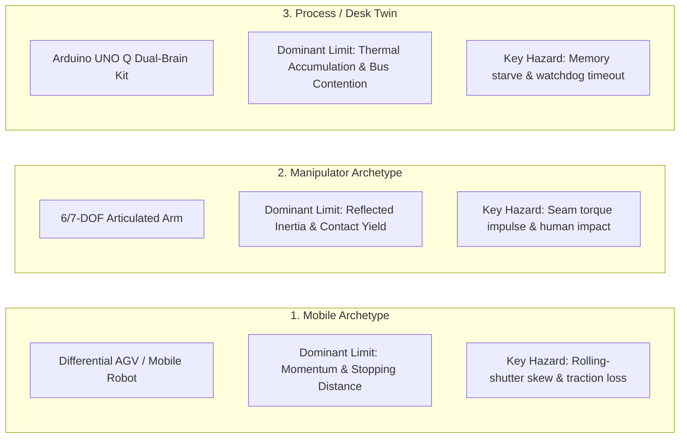

# Cross-Disciplinary Translation Lexicon {.unnumbered #sec-appendix-lexicon}

Physical AI sits at the intersection of four distinct engineering traditions: **Modern Deep Learning (AI)**, **Classical Robotics & Non-Linear Control**, **Real-Time Embedded Systems & Silicon Architecture**, and **Safety-Critical Systems Assurance**.

Because each discipline developed its own vocabulary over decades, engineers from different backgrounds frequently use the same words to mean completely different things—or use different words for the exact same underlying physical concept. This appendix serves as a cross-disciplinary Rosetta Stone.

---

## 1. The Four-Tribe Rosetta Stone

| Physical Concept               | Modern Deep Learning (AI)                                                   | Robotics & Control Theory                                                                              | Embedded Systems & Silicon                                  | Safety Assurance & Standards                                |
|:-------------------------------|:----------------------------------------------------------------------------|:-------------------------------------------------------------------------------------------------------|:------------------------------------------------------------|:------------------------------------------------------------|
| **The Action Command**         | Policy Output / Action Token / Diffusion Chunk $\hat{\mathbf{a}}_{t:t+H}$   | Control Input $\mathbf{u}(t)$ / Generalized Joint Torque $\boldsymbol{\tau}$                           | DAC Register / Timer Capture-Compare Value / PWM Duty Cycle | Commanded Actuation Value / Actuator Demand                 |
| **The Observation**            | Input Tokens / Visual Embedding $\mathbf{z}_t$ / Context History            | Generalized Coordinates $\mathbf{q}, \dot{\mathbf{q}}$ / State Vector $\mathbf{x}(t)$                  | ADC Raw Buffer / SPI Sensor Frame / DMA Ring Packet         | Measured Process Variable / Transduced Feedback             |
| **System Governing Rules**     | Loss Function $\mathcal{L}(\theta)$ / Objective Function / Reward $R(s, a)$ | Plant Dynamics $\dot{\mathbf{x}} = f(\mathbf{x}, \mathbf{u})$ / Mass Matrix $\mathbf{M}(\mathbf{q})$   | Hardware Execution Model / Memory Map / Interrupt Vector    | System Specification / Operating Constraints                |
| **Execution Horizon**          | Autoregressive Sequence / Action Chunk Length $H$                           | Receding Horizon $N$ / Planning Horizon $T_h$                                                          | Execution Period $T_{\text{tick}}$ / Task Schedule Quantum  | Operational Cycle / Task Deadline                           |
| **Boundary Violation**         | Out-of-Distribution (OOD) Shift / Mode Collapse                             | Inevitable Collision State (ICS) / Loss of Stability                                                   | Watchdog Trip / Hard Fault / Bus Error Exception            | Hazard Event / Safety Goal Violation (ISO 26262)            |
| **Runtime Enforcement**        | Action Space Clipping / Rejection Sampling                                  | Control Barrier Function (CBF-QP) / Reference Governor                                                 | Memory Protection Unit (MPU) / Hardware Watchdog (WDT)      | Safety Shield / Independent Monitor Channel (E-Gas)         |
| **Execution Delay**            | Forward Pass Duration / Model Latency                                       | Transport Lag / Phase Delay $e^{-s \tau}$                                                              | Worst-Case Execution Time (WCET) / Bus Contention           | Fault Tolerant Time Interval (FTTI) / Latency Budget        |
| **Uncertainty Representation** | Softmax Entropy / Epistemic Ensemble Variance $\sigma^2$                    | Estimation Covariance $\mathbf{P}(t)$ / Disturbance Bound $\mathcal{W}$                                | ADC Quantization Noise / Sensor Drift / Jitter              | Confidence Bound (Clopper-Pearson) / SOTIF Triggering Event |
| **Coordinate Transforms**      | Cross-Attention Spatial Projection / Camera Positional Embeddings           | $SE(3)$ Rigid Body Transform Tree (`/tf`) / Lie Algebra $\mathfrak{se}(3)$                             | Extrinsic Matrix Register / Sensor Offset Calibration ROM   | Sensor Spatial Alignment / Coordinate Reference Datum       |
| **Optimization Method**        | Stochastic Gradient Descent (SGD) / AdamW Backpropagation                   | Quadratic Programming (QP) / Sequential Quadratic Programming (SQP)                                    | Fixed-Point Lookup Table / Iterative CORDIC Hardware Core   | Deterministic Algorithmic Solver / Validated Function Block |
| **Memory Architecture**        | GPU High-Bandwidth Memory (HBM3 / LPDDR5) / KV Cache                        | Continuous State Covariance Matrix $\mathbf{P} \in \mathbb{R}^{n \times n}$                            | Zero-Allocation DTCM SRAM / Ring Buffer FIFO                | Non-Volatile Fault Log / Redundant Shadow Memory            |
| **Feedback Correction**        | Policy Gradient / Temporal Difference Error $\delta_t$                      | Error Dynamics $\mathbf{e}(t) = \mathbf{r}(t) - \mathbf{y}(t)$ / State Feedback $\mathbf{K}\mathbf{x}$ | Closed-Loop PID Interrupt / Current Shunt Sense Loop        | Closed-Loop Regulated Output / Mitigation Feedback          |

---

## 2. False Friends: Words That Cause Catastrophic Misunderstandings

Engineering teams building Physical AI systems are drawn from distinct engineering traditions—deep learning, classical robotics, embedded systems, and functional safety. Because these disciplines evolved independently, they frequently use the same vocabulary to denote fundamentally incompatible concepts. These "false friends" represent subtle linguistic traps where an assumption from one field, when carried uncritically into another, leads directly to catastrophic hardware failures.

### "Deterministic"
* **In Deep Learning:** Setting `torch.manual_seed(42)` and `cudnn.deterministic = True` so the matrix multiplication forward pass produces bit-identical tensor values across offline runs.
* **In Embedded & Real-Time Systems:** Guaranteeing that every periodic task completes in hardware time $t \le T_{\text{deadline}}$ with bounded jitter ($<1\,\mu\text{s}$), regardless of CPU cache misses, interrupt storms, or bus contention. *An algorithm that always outputs the same tensor 10 milliseconds too late is non-deterministic in physical systems.*

### "Real-time"
* **In Web & Cloud Software:** A web service or UI that updates within $100\text{--}200\text{ ms}$ ("real-time chat", "real-time streaming"), where occasional delays cause dropped frames or buffering spinners without danger.
* **In Physical AI Systems:** Hard deadline determinism where missing a single $1.0\text{ ms}$ execution deadline ($1000\text{ Hz}$) produces an inverter current loop runaway, mechanical resonance, or irreversible collision.

### "State"
* **In Deep Learning:** The internal hidden activations of an RNN, the latent state of an autoencoder, or the Key-Value (KV) cache of an attention layer ($\mathbf{h}_t \in \mathbb{R}^d$). It has no explicit spatial units.
* **In Robotics & Physics:** The complete, physically grounded coordinate representation of the mechanical system ($\mathbf{x} = [\mathbf{q}^T, \dot{\mathbf{q}}^T]^T \in \mathbb{R}^{2n}$) representing positions in meters, angles in radians, velocities in $\text{m/s}$, and temperatures in Kelvin.

### "Latency"
* **In Machine Learning Benchmarks:** The average execution time of `model.forward()` on an isolated GPU under synthetic batching ($P_{50} \approx 15\text{ ms}$), ignoring camera frame exposure, OS scheduler queueing, and DMA memory bus transfer.
* **In Physical AI:** The **Spatial Information Age** ($\tau_{\text{age}}$): the total wall-clock duration from the photon striking the camera photodiode at exposure midpoint $t_{\text{exp}}/2$ to the instant mechanical torque is exerted on the physical environment. In real hardware, $\tau_{\text{age}}$ is often $3\times$ to $5\times$ larger than the GPU forward pass.

### "Safe"
* **In AI Alignment:** The model avoids generating toxic language, hate speech, or copyrighted text.
* **In Physical Systems:** The system maintains forward invariance with respect to physical kinetic boundaries ($h(\mathbf{x}) \ge 0$), guaranteeing that actuator torque, velocity, and deceleration remain mathematically incapable of inflicting mechanical trauma or structural destruction.

### "Robustness"
* **In Deep Learning:** Maintaining classification accuracy under adversarial pixel noise ($\ell_\infty$ epsilon-balls) or image corruption (fog, blur).
* **In Control & Embedded Systems:** Maintaining closed-loop stability across plant parameter variations (gain/phase margins, $\mathcal{H}_\infty$ norm bounds) and hardware physical resilience against electrical noise, bus EMI, power supply voltage droop, and thermal throttling.

### "Policy"
* **In Reinforcement Learning:** The parameterized neural network $\pi_\theta(a \mid s)$ mapping states to action distributions.
* **In Systems Engineering:** The top-level administrative or operational policy governing access rights, operator qualifications, and deployment sign-offs.

---

## 3. Practical Translation Guides for Students

Navigating the multi-disciplinary landscape of Physical AI requires recognizing the implicit assumptions of your home field and actively translating your engineering instincts to match physical realities. The following translation guides provide actionable principles tailored to students and practitioners entering Physical AI from specific foundational backgrounds.

### If you are coming from computer science / deep learning:

1. **Forget `malloc()` on the fast loop:** You cannot allocate dynamic memory or resize lists inside a $1000\text{ Hz}$ control loop. Heap fragmentation causes random multi-millisecond pauses that crash physical robots.
2. **Your model is an unprivileged proposer:** A neural network must never have direct write access to motor registers. It proposes intent; a deterministic mathematical filter running on bare metal permits, clamps, or rejects the command.
3. **Loss $= 0$ in simulation does not mean it works:** Physics engines approximate contact dynamics as linear complementarity problems (LCP). Real contact friction is non-smooth, stiction-dominated, and thermally variable.
4. **Bandwidth matters more than FLOPS:** Streaming multi-gigabyte neural weights from LPDDR5 DRAM on edge SoCs creates a memory wall ($t_{\text{stream}} = M_{\text{weights}} / B_{\text{mem}}$) that limits inference cadence, regardless of how many TFLOPS the NPU matrix core claims.

### If you are coming from mechanical engineering / control theory:

1. **Uncertainty is multimodal:** Classical Kalman filters assume unimodal Gaussian noise. Perception models in the real world face discrete semantic hypotheses (e.g., an object is either in front of or behind a partition), requiring multimodal policy representations (Diffusion / Mixture Density Networks).
2. **You cannot write down the world dynamics $f(\mathbf{x})$ for an unconstrained kitchen or highway:** Analytical ODEs work for steel linkages in a factory cell, but fail when interacting with deformable objects, varying lighting, and open-world human behavior. Deep models provide the semantic perception front-end that classical control lacks.
3. **Control Barrier Functions are the bridge:** You do not have to discard control theory when using deep learning. Instead, treat the learned policy as a nominal reference generator $\mathbf{u}_{\text{ref}}$ and use a Control Barrier Function (CBF-QP) as an active safety filter that minimally adjusts $\mathbf{u}$ only when boundary invariants are threatened.

### If you are coming from embedded systems / electrical engineering:

1. **AI compute is dynamic and stochastic:** You cannot treat neural inference like a fixed-cycle DSP FIR filter. Execution time varies based on image content, caching, and thermal throttling. You must design asynchronous two-speed architectures with expiring leases to absorb timing jitter safely.
2. **Data provenance is as critical as voltage integrity:** Logging teleoperation data without tracking operator response delays ($340\text{ ms}$) or safety governor clamps poisons training pipelines via covariate shift.
3. **Memory crossbars are a shared resource:** When an NPU bursts $25.6\text{ GB/s}$ of DRAM traffic during a vision transformer forward pass, it can starve real-time CPU DMA channels unless hardware AXI Quality of Service (QoS) bus arbitration is configured.

---

## 4. The Three Canonical Archetypes Quick-Reference

Every systems concept in this textbook is grounded across the same three physical machines:

| Physical Metric              | Mobile Archetype (AGV / Quadruped)                                                          | Manipulator Archetype (7-DOF Arm)                                                  | Process / Bench Twin (Arduino UNO Q)                                                    |
|:-----------------------------|:--------------------------------------------------------------------------------------------|:-----------------------------------------------------------------------------------|:----------------------------------------------------------------------------------------|
| **Typical Total Mass ($m$)** | $15\text{--}250\text{ kg}$                                                                  | $15\text{--}45\text{ kg}$ (moving mass)                                            | $<1\text{ kg}$ (benchtop kit)                                                           |
| **Operating Velocity ($v$)** | $1.0\text{--}3.5\text{ m/s}$                                                                | $0.5\text{--}2.0\text{ m/s}$ (end-effector)                                        | N/A (stationary servo/stepper)                                                          |
| **Critical Bottleneck**      | Braking distance $d_{\text{stop}} = \frac{v^2}{2 \mu g}$ under unknown tire friction $\mu$. | Reflected rotor inertia $J_{\text{eff}} = J_L + N^2 J_m$ under gearbox compliance. | Thermal dissipation $\Delta T = P \cdot \theta_{\text{JA}}$ and AXI QoS bus contention. |
| **Inner Enforcer Rate**      | $100\text{--}500\text{ Hz}$ (Traction & Yaw stability)                                      | $1000\text{ Hz}$ (Joint torque & CBF safety shield)                                | $1000\text{ Hz}$ (Cortex-M4 PWM & trip-zone registers)                                  |
| **Outer Brain Rate**         | $5\text{--}20\text{ Hz}$ (VLA / Diffusion path navigation)                                  | $10\text{--}50\text{ Hz}$ (ACT / Diffusion trajectory chunking)                    | $2\text{--}10\text{ Hz}$ (Edge VLM vision tokenization)                                 |
