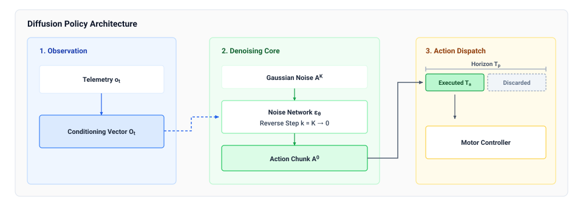
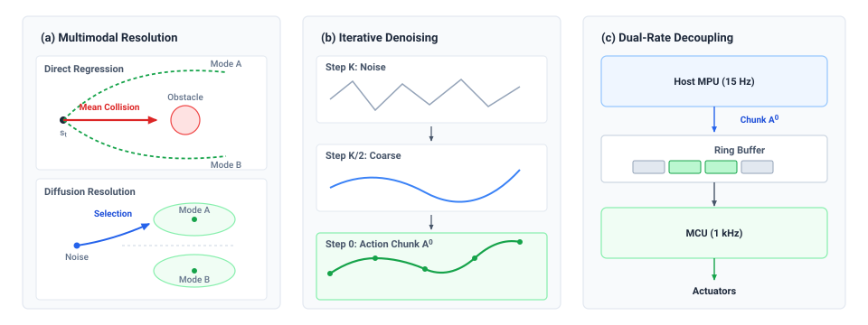

# Machine Learning Background {#sec-appendix-ml}

This appendix collects the machine learning models, statistical bounds, and spatial representations used throughout this book. Each section states the assumptions under which its result holds, so a reader can check them against a particular machine.

## How to Use This Appendix

Consult this appendix when encountering specific learning systems bottlenecks, statistical verification limits, or representation boundaries across chapters in this book:

| When you encounter this systems symptom                                        | Consult                      | For this quantitative tool                                                |
|--------------------------------------------------------------------------------|------------------------------|---------------------------------------------------------------------------|
| A vision-language model hallucinates actions under perceptual ambiguity        | @sec-appendix-ml-probability | Posterior entropy metrics, Shannon uncertainty, and refusal thresholds    |
| Overconfident neural outputs command aggressive actions out-of-distribution    | @sec-appendix-ml-calibration | Softmax simplex geometry and Expected Calibration Error (ECE)             |
| Multi-camera extrinsics, 2D tokenization, or 3D scene geometry drift           | @sec-appendix-ml-spatial     | $SE(3)$ transforms, patch embeddings, attention, and metric 3D lifting    |
| Camera features must be placed in one metric ground-plane grid                 | @sec-appendix-ml-bev-lifting | Lift-Splat depth hypotheses, frustum size, and BEV splatting              |
| Differentiable 3D scene reconstruction diverges during real-time tracking      | @sec-appendix-ml-3dgs        | 3D Gaussian Splatting parameters and covariance projection                |
| Occupancy mapping retains phantom obstacles after objects move                 | @sec-appendix-ml-voxels      | Recursive Bayesian log-odds voxel updates and TSDF fusion                 |
| Small sensor noise produces explosive, unconstrained actuator commands         | @sec-appendix-ml-lipschitz   | Lipschitz continuity bounds and spectral normalization                    |
| A behavioral cloning policy drifts into unrecoverable off-trajectory states    | @sec-appendix-ml-compounding | $\mathcal{O}(T^2 \epsilon)$ compounding error and DAgger linear reduction |
| L2 regression averages bimodal demonstrations into a path between the modes    | @sec-appendix-ml-multimodal  | Conditional expectation proof and the decoder families that avoid it      |
| A generative decoder cannot finish a chunk within the setpoint period          | @sec-appendix-ml-diffusion   | Diffusion and flow-matching sampling cost against the control deadline    |
| Offline reinforcement learning selects ungrounded, destructive motor setpoints | @sec-appendix-ml-affordances | Bellman value overestimation and SayCan affordance grounding              |
| Verifying time-varying physical safety properties across continuous traces     | @sec-appendix-ml-stl         | Signal Temporal Logic (STL) syntax and quantitative robustness degree     |
| Zero-failure fleet testing cannot bound rare catastrophic-event rates          | @sec-appendix-ml-exposure    | Rule of Three, Wald breakdown, and Clopper-Pearson exact bounds           |
| Physical testbed wear explodes during fixed-sample policy qualification        | @sec-appendix-ml-sprt        | Sequential Probability Ratio Test (SPRT) and Wald stopping boundaries     |
| Contact collision shocks and latency spikes exceed Gaussian 6-sigma bounds     | @sec-appendix-ml-evt         | Extreme Value Theory (GEV/GPD) and high-quantile hardware sizing          |

## Probability, Information Theory, and Calibration {#sec-appendix-ml-probability}

Autonomous machines must reason quantitatively about uncertainty across perception, intent estimation, and world modeling.

### Conditional probability and bayes' rule

The conditional probability $P(Y \mid X)$ characterizes the probability of event $Y$ given observed evidence $X$. By Bayes' rule:\index{Bayes' rule!parameter estimation}
$$ P(\theta \mid \mathcal{D}) = \frac{P(\mathcal{D} \mid \theta) P(\theta)}{P(\mathcal{D})} $$
where $P(\theta)$ represents prior belief over model parameters $\theta$, $P(\mathcal{D} \mid \theta)$ represents the likelihood of physical dataset $\mathcal{D}$, and $P(\theta \mid \mathcal{D})$ represents the updated posterior belief.

### Shannon entropy and ambiguity thresholds

Entropy $H(X)$ quantifies the expected uncertainty or information content in a probability distribution. For a discrete random variable $X$ taking values in alphabet $\mathcal{X}$:[^fn-ml-shannon-entropy]
$$ H(X) = - \sum_{x \in \mathcal{X}} P(x) \log_2 P(x) $$
For two equally scored referents, the *model's* candidate-action entropy is high. A calibrated, task-specific threshold can trigger a grounding refusal (`ERR_GROUNDING_AMBIGUITY`) and a validated hold while better evidence is sought. A confidently wrong model can have low entropy, so this threshold is only one input to permission.

[^fn-ml-shannon-entropy]: **Shannon Information Entropy**\index{Shannon entropy!information theory}: Entropy quantifies average uncertainty within a specified discrete distribution. Its physical meaning depends on whether that distribution is calibrated to the relevant referents and observations.

### Softmax overconfidence and calibration error {#sec-appendix-ml-calibration}

Standard neural classification heads normalize raw logit vectors $\mathbf{z} \in \mathbb{R}^K$ into categorical distributions using the softmax function:
$$ \sigma(\mathbf{z})_i = \frac{e^{z_i / T}}{\sum_{j=1}^K e^{z_j / T}} $$
where $T > 0$ is a temperature hyperparameter. The softmax operator projects logits onto the probability simplex $\Delta^K$ strictly through algebraic exponentiation. A large output probability indicates only relative separation between logits, not genuine epistemic certainty.

To quantify whether predicted probabilities match empirical physical frequencies, reliability engineering computes the **Expected Calibration Error (ECE)**:[^fn-ml-binned-ece]
$$ \text{ECE} = \sum_{m=1}^M \frac{|B_m|}{N} \left| \text{acc}(B_m) - \text{conf}(B_m) \right| $$
where the interval $[0, 1]$ is partitioned into $M$ equal-width bins $B_m$, $|B_m|$ is sample count in bin $m$, $N$ is total sample count, $\text{conf}(B_m)$ is mean confidence, and $\text{acc}(B_m)$ is empirical accuracy. In physical autonomy, an uncalibrated model with high ECE reports false certainty during out-of-distribution conditions, misleading safety monitors into withholding supervisory intervention.

[^fn-ml-binned-ece]: **Expected Calibration Error**\index{Expected Calibration Error!binned accuracy metric}: Binned calibration metrics quantify the divergence between neural prediction confidence and realized empirical accuracy across confidence intervals. Standard unregularized deep networks exhibit substantial overconfidence because cross-entropy minimization drives logits to extreme values. Relying on uncalibrated confidence scores to gate safety fallbacks permits undetected distribution shifts to corrupt closed-loop actuation.

## Spatial Representations and Scene Parameterization {#sec-appendix-ml-spatial}

Embodied physical agents perceive, manipulate, and navigate within Euclidean 3D space.

### Special euclidean group SE(3) transforms

Rigid body transformations in 3D space belong to the Special Euclidean group $SE(3)$, combining a $3 \times 3$ rotation matrix $\mathbf{R} \in SO(3)$ with a translation vector $\mathbf{t} \in \mathbb{R}^3$:\index{Spatial coordinate frames!SE(3) representation}
$$ \mathbf{T} = \begin{bmatrix} \mathbf{R} & \mathbf{t} \\ \mathbf{0}^\top & 1 \end{bmatrix} \in SE(3) $$
A homogeneous point $\tilde{\mathbf{p}} = [\mathbf{p}^\top, 1]^\top \in \mathbb{R}^4$ transforms across frames according to linear matrix-vector multiplication:
$$ \tilde{\mathbf{p}}' = \mathbf{T} \tilde{\mathbf{p}} $$
Let $\mathbf{T}_{AB}$ map coordinates expressed in frame $B$ into frame $A$. For world $W$, robot base $B$, end effector $E$, and camera $C$, the chain is $\mathbf{T}_{WC}=\mathbf{T}_{WB}\mathbf{T}_{BE}\mathbf{T}_{EC}$. A valid rigid transform has inverse $\mathbf{T}^{-1} = [\mathbf{R}^\top, -\mathbf{R}^\top \mathbf{t}; \mathbf{0}^\top, 1]$; numerical accuracy still depends on calibrated transforms and their uncertainty.

### Visual patch tokenization, attention, and 3D metric lifting {#sec-appendix-ml-patch-embedding}

Embodied vision-language-action (VLA) models and spatial transformers convert continuous sensory streams into discrete tokens for neural attention, then lift candidate predictions into 3D Euclidean coordinates for physical reasoning.\index{Patch tokenization!vision transformers}\index{Metric unprojection!camera intrinsics} @Sec-brain-learned-representations and @sec-brain-cognitive-pipeline use the token counts derived here to size the application processor's memory traffic.

#### 2D vision transformer patch tokenization

Consider an RGB image $\mathbf{X} \in \mathbb{R}^{H \times W \times C}$ captured by an onboard camera with spatial resolution $H \times W$ and $C$ color channels. Feeding raw pixels to a multilayer perceptron would discard spatial locality and inflate the parameter count, so a vision transformer frontend partitions the image into a non-overlapping sequence of $N$ patches of $P \times P$ pixels, with $P$ typically 14 or 16:
$$ N = \frac{H \cdot W}{P^2} $$
Each patch, indexed by its row and column $(u, v)$ in the camera plane, is flattened into a vector $\mathbf{x}_p^{(u, v)} \in \mathbb{R}^{P^2 C}$. A trainable linear projection $\mathbf{W}_{\text{patch}} \in \mathbb{R}^{(P^2 C) \times d_{\text{model}}}$ maps each flattened patch into the transformer's hidden dimension $d_{\text{model}}$. Self-attention is permutation-invariant and treats its inputs as an unordered set, so the model knows nothing of spatial proximity unless position is added explicitly:
$$ \mathbf{z}_0^{(u, v)} = \mathbf{x}_p^{(u, v)} \mathbf{W}_{\text{patch}} + \mathbf{E}_{\text{pos}}^{2D}(u, v) + \mathbf{e}_{\text{cam}} $$
The 2D position embedding $\mathbf{E}_{\text{pos}}^{2D}(u, v)$ decomposes along the vertical axis $u$ and the horizontal axis $v$, using sinusoidal frequency bands or learned coordinate embeddings. It encodes position in the image plane and carries no metric 3D distance. When several cameras feed one model, such as an overhead camera for scene context and a wrist camera for millimeter-scale alignment, a learned camera identifier $\mathbf{e}_{\text{cam}} \in \{\mathbf{e}_{\text{overhead}}, \mathbf{e}_{\text{wrist}}\}$ distinguishes their reference frames. Some architectures also prepend a summary token $\mathbf{x}_{\text{class}} \in \mathbb{R}^{d_{\text{model}}}$ to the sequence.

```{python}
#| label: calc-appendix-ml-patch-tokens
#| echo: false

# ┌─────────────────────────────────────────────────────────────────────────────
# │ PATCH TOKENS PER FRAME
# ├─────────────────────────────────────────────────────────────────────────────
# │ Context: The patch tokenization worked example in
# │          @sec-appendix-ml-patch-embedding.
# │ Goal: Show how one frame becomes a token tensor and how cameras multiply it.
# │ Show: patch grid, patch count, flattened patch length, tokens for three
# │       cameras.
# │ How: N = (H/P)^2 for a square frame; flattened length P^2 C.
# └─────────────────────────────────────────────────────────────────────────────
from mlsysim import *

class AppxPatchTokens:
    # ┌── 1. LOAD (Constants) ──────────────────────
    side_px = 224  # category: illustrative (square RGB frame, pixels per side)
    patch_px = 14  # category: illustrative (ViT patch size, pixels per side)
    channels = 3  # category: datasheet (RGB color channels)
    d_model = 4096  # category: illustrative (backbone hidden dimension)
    cameras = 3  # category: illustrative (two wrist cameras and one overhead)

    # ┌── 2. EXECUTE (The Compute) ─────────────────
    grid = side_px // patch_px  # patches per side
    n_patches = grid * grid  # patch tokens per frame
    patch_pixels = patch_px * patch_px  # pixels per patch
    patch_len = patch_pixels * channels  # flattened patch vector length
    visual_tokens = cameras * n_patches  # visual tokens across all cameras

    # ┌── 3. GUARD (Invariants) ────────────────────
    check(side_px % patch_px == 0, "the patch size must tile the frame exactly")
    check(grid == 16, f"patch grid {grid}")
    check(n_patches == 256, f"patches per frame {n_patches}")
    check(patch_len == 588, f"flattened patch length {patch_len}")
    check(visual_tokens == 768, f"visual tokens {visual_tokens}")

    # ┌── 4. OUTPUT (Formatting) ───────────────────
    side_str = fmt_int(side_px)
    patch_str = fmt_int(patch_px)
    channels_str = fmt_int(channels)
    grid_str = fmt_int(grid)
    n_patches_str = fmt_int(n_patches)
    patch_pixels_str = fmt_int(patch_pixels)
    patch_len_str = fmt_int(patch_len)
    d_model_str = fmt_int(d_model, commas=False)
    cameras_str = fmt_int(cameras)
    visual_tokens_str = fmt_int(visual_tokens)
```

To make the dimensions concrete, take a square RGB frame `{python} AppxPatchTokens.side_str` pixels on a side (illustrative; see the Reader Guide) with patch size $P =$ `{python} AppxPatchTokens.patch_str`. The frame divides into `{python} AppxPatchTokens.grid_str` patches on a side, `{python} AppxPatchTokens.n_patches_str` in all. Each patch holds `{python} AppxPatchTokens.patch_pixels_str` pixels across `{python} AppxPatchTokens.channels_str` color channels, a flattened vector of `{python} AppxPatchTokens.patch_len_str` values, and $\mathbf{W}_{\text{patch}}$ maps each such vector into a `{python} AppxPatchTokens.d_model_str`-dimensional model space. One frame therefore becomes `{python} AppxPatchTokens.n_patches_str` tokens of width `{python} AppxPatchTokens.d_model_str`. A robot with `{python} AppxPatchTokens.cameras_str` cameras (two wrist cameras and one overhead) supplies `{python} AppxPatchTokens.cameras_str` $\times$ `{python} AppxPatchTokens.n_patches_str` = `{python} AppxPatchTokens.visual_tokens_str` visual tokens per step before any text or proprioceptive token is added.

The visual tokens then join the rest of the input. A natural-language directive such as "grasp the red mug by its handle" is tokenized by byte-pair encoding into text embeddings $\mathbf{z}_{\text{text}} \in \mathbb{R}^{L \times d_{\text{model}}}$. The robot's configuration (joint angles $\mathbf{q}_t$, joint velocities $\dot{\mathbf{q}}_t$, and gripper state) passes through a linear layer into proprioceptive tokens $\mathbf{z}_{\text{state}} \in \mathbb{R}^{K_s \times d_{\text{model}}}$. The three streams concatenate into one multimodal input sequence:
$$ \mathbf{Z} = [\mathbf{z}_{\text{vision}} \,|\, \mathbf{z}_{\text{text}} \,|\, \mathbf{z}_{\text{state}}] \in \mathbb{R}^{N_{\text{total}} \times d_{\text{model}}} $$

#### Self-attention over the combined sequence

The combined sequence $\mathbf{Z}$ passes through a stack of transformer layers, 32 to 80 in current VLA backbones, each consisting of multi-head self-attention and a feed-forward network. Self-attention projects the tokens into queries $\mathbf{Q} = \mathbf{Z} \mathbf{W}_Q$, keys $\mathbf{K}_{\text{attn}} = \mathbf{Z} \mathbf{W}_K$, and values $\mathbf{V} = \mathbf{Z} \mathbf{W}_V$, and computes pairwise attention weights over the whole sequence:\index{Self-attention!multimodal token sequence}
$$ A_{i, j} = \frac{\exp\left(\mathbf{q}_i^\top \mathbf{k}_j / \sqrt{d_k}\right)}{\sum_{m} \exp\left(\mathbf{q}_i^\top \mathbf{k}_m / \sqrt{d_k}\right)} $$
A text token such as "handle" can attend to visual patch tokens, but a high attention weight is not a verified grasp location or metric pose. A trained spatial decoder may produce a 2D affordance heatmap, and placing the gripper in 3D still takes depth evidence, camera calibration, and the metric lifting below. A rolling key-value (KV) cache stores prior token states for attention. It neither tracks object permanence nor maintains a 3D position and velocity; an explicit state estimator must associate observations across frames and widen its uncertainty while the mug is occluded.

#### Pinhole back-projection and 3D metric lifting

Standard 2D patch tokens lack metric scale due to projective ambiguity: along any optical ray $\lambda [u, v, 1]^\top$, infinitely many 3D points project to identical pixel coordinates. To interface with physical control barrier filters, kinetic stopping calculators, and obstacle clearance envelopes, 2D visual predictions must be lifted into metric 3D coordinates $\mathbf{p}_W \in \mathbb{R}^3$.

Let $\mathbf{u} = [u, v]^\top$ denote pixel coordinates on the image sensor, and let the calibrated pinhole camera intrinsic matrix be:
$$ \mathbf{K} = \begin{bmatrix} f_x & 0 & c_x \\ 0 & f_y & c_y \\ 0 & 0 & 1 \end{bmatrix} $$
where $(f_x, f_y)$ are focal lengths in pixels and $(c_x, c_y)$ is the principal point. Given an aligned metric depth measurement $d = z > 0$ (obtained from stereo disparity, time-of-flight LiDAR, or calibrated depth sensors), the 3D position in the camera coordinate frame $\mathbf{p}_C \in \mathbb{R}^3$ is recovered via inverse intrinsic projection:
$$ \mathbf{p}_C = d \cdot \mathbf{K}^{-1} \begin{bmatrix} u \\ v \\ 1 \end{bmatrix} = \begin{bmatrix} (u - c_x) \frac{d}{f_x} \\ (v - c_y) \frac{d}{f_y} \\ d \end{bmatrix} $$
Transforming $\mathbf{p}_C$ into the robot base or world frame $W$ uses the rigid extrinsic transform $\mathbf{T}_{WC} \in SE(3)$ defined in this section:
$$ \tilde{\mathbf{p}}_W = \mathbf{T}_{WC} \tilde{\mathbf{p}}_C \implies \mathbf{p}_W = \mathbf{R}_{WC} \mathbf{p}_C + \mathbf{t}_{WC} $$
Downstream safety monitors and kinematic reachability evaluators require this metric 3D reconstruction; ungrounded 2D tokens cannot establish whether a proposed trajectory satisfies physical clearance boundaries $d_{\text{stop}}$.

### Camera-to-bird's-eye-view lifting {#sec-appendix-ml-bev-lifting}

A bird's-eye-view (BEV) representation places the features of every camera in one metric grid on the ground plane, the frame in which planners and clearance checks work. The **Lift-Splat-Shoot (LSS)** architecture [@philion2020lift] builds that grid from monocular features in three steps, the first three stages of @fig-08-ray-frustum-voxel-lifting.\index{Lift-Splat-Shoot!bird's-eye-view lifting}

```{python}
#| label: calc-appendix-ml-bev-frustum
#| echo: false

# ┌─────────────────────────────────────────────────────────────────────────────
# │ LIFT-SPLAT FRUSTUM AND BEV GRID
# ├─────────────────────────────────────────────────────────────────────────────
# │ Context: @sec-appendix-ml-bev-lifting.
# │ Goal: Size the lifted frustum tensor and the BEV grid it is splatted into.
# │ Show: depth-bin span, frustum values and bytes per frame, BEV cells.
# │ How: values = feature cells^2 * depth bins * channels; bytes at FP16;
# │      cells per side = workspace side / resolution.
# └─────────────────────────────────────────────────────────────────────────────
from mlsysim import *

class AppxBevFrustum:
    # ┌── 1. LOAD (Constants) ──────────────────────
    feat_side = 128  # category: illustrative (feature-map cells per side)
    depth_bins = 64  # category: illustrative (categorical depth bins)
    feat_ch = 64  # category: illustrative (feature channels per cell)
    bytes_per_value = 2 * byte  # category: chosen (FP16 storage)
    d_min = 0.5 * meter  # category: illustrative (nearest depth bin)
    d_max = 20.0 * meter  # category: illustrative (farthest depth bin)
    workspace_side = 20.0 * meter  # category: illustrative (BEV workspace side)
    bev_res = 0.1 * meter  # category: chosen (BEV cell size)

    # ┌── 2. EXECUTE (The Compute) ─────────────────
    frustum_values = feat_side * feat_side * depth_bins * feat_ch
    frustum_bytes = (frustum_values * bytes_per_value).to(MB)
    bev_cells = round((workspace_side / bev_res).to("dimensionless").magnitude)

    # ┌── 3. GUARD (Invariants) ────────────────────
    check(frustum_values == 67_108_864, f"frustum values {frustum_values}")
    check(abs(frustum_bytes.to(MB).magnitude - 134.217728) < 1e-6, f"frustum bytes {frustum_bytes}")
    check(bev_cells == 200, f"BEV cells per side {bev_cells}")
    check(d_max > d_min, "depth span must be positive")

    # ┌── 4. OUTPUT (Formatting) ───────────────────
    feat_side_str = fmt_int(feat_side)
    depth_bins_str = fmt_int(depth_bins)
    feat_ch_str = fmt_int(feat_ch)
    d_min_str = fmt_qty(d_min, meter, precision=1)
    d_max_str = fmt_qty(d_max, meter, precision=0)
    frustum_values_str = fmt_count(frustum_values, scale="M", precision=1, scale_style="word")
    frustum_bytes_str = fmt_memory(frustum_bytes, unit=MB, precision=1)
    workspace_str = fmt_qty(workspace_side, meter, precision=0)
    bev_res_str = fmt_qty(bev_res, meter, precision=1)
    bev_cells_str = fmt_int(bev_cells)
```

1. **Feature extraction.** A vision backbone, such as DINOv2 [@oquab2023dinov2] or a lightweight convolutional network, maps image $\mathbf{I} \in \mathbb{R}^{H \times W \times 3}$ to a grid of feature vectors:
   $$ \mathbf{f}_{u, v} = \text{Backbone}(\mathbf{I})[u, v] \in \mathbb{R}^C $$
   Forward projection (@eq-percep-pinhole-projection) collapses each 3D ray onto one pixel, so a feature $\mathbf{f}_{u, v}$ stands for a whole ray in space, and its metric depth is unknown.

2. **Lift.** LSS represents that ambiguity rather than resolving it. Along the bearing ray $\mathbf{K}^{-1}[u, v, 1]^\top$ of @eq-percep-bearing-ray, the network scores $D$ discrete depth bins spanning $[d_{\min}, d_{\max}]$, for example `{python} AppxBevFrustum.depth_bins_str` bins from `{python} AppxBevFrustum.d_min_str` to `{python} AppxBevFrustum.d_max_str`, spaced linearly or logarithmically:
   $$ \mathbf{p}_{u, v} = \text{softmax}(\mathbf{d}_{u, v}) \in \Delta^{D-1} $$
   An outer product lifts each 2D feature into a frustum of 3D points, one per depth hypothesis:
   $$ \mathbf{c}_{u, v, k} = \mathbf{p}_{u, v}(k) \cdot \mathbf{f}_{u, v} \in \mathbb{R}^C \quad \text{at } \mathbf{P}_c(u, v, d_k) = d_k \mathbf{K}^{-1} \begin{bmatrix} u \\ v \\ 1 \end{bmatrix} $$
   For a feature map `{python} AppxBevFrustum.feat_side_str` cells on a side, with `{python} AppxBevFrustum.depth_bins_str` depth bins and `{python} AppxBevFrustum.feat_ch_str` feature channels, the frustum tensor holds about `{python} AppxBevFrustum.frustum_values_str` values, `{python} AppxBevFrustum.frustum_bytes_str` per frame at FP16. At camera rate that tensor is memory traffic the application processor must carry, which is why implementations keep it in zero-copy buffers on the accelerator.

3. **Splat.** The calibrated extrinsic transform $\mathbf{T}_{\text{base}}^{\text{cam}} = [\mathbf{R}_{\text{base}}^{\text{cam}} \mid \mathbf{t}_{\text{base}}^{\text{cam}}] \in SE(3)$ maps every frustum point from the camera's optical frame into the robot base frame:
   $$ \mathbf{P}_{\text{base}} = \mathbf{R}_{\text{base}}^{\text{cam}} \mathbf{P}_c + \mathbf{t}_{\text{base}}^{\text{cam}} $$
   The workspace is discretized into a grid of vertical pillars, for example `{python} AppxBevFrustum.bev_cells_str` cells on a side covering a `{python} AppxBevFrustum.workspace_str` square at `{python} AppxBevFrustum.bev_res_str` resolution. The splat sums every frustum feature that falls within pillar $(X, Y)$, using accelerated cumulative sums or point-pillar pooling [@philion2020lift; @liu2023bevfusion]:
   $$ \mathbf{V}_{\text{BEV}}(X, Y) = \sum_{(u, v, k) \in \text{Pillar}(X, Y)} \mathbf{c}_{u, v, k} $$
   The splat aligns the cameras' hypotheses in one metric frame. It cannot fill a region no camera saw or remove depth-scale error, so the footprint it assigns to a pedestrian still depends on the depth hypotheses and the calibration.

The softmax over depth bins expresses weights the model assigns, and its entropy is not a calibrated metric covariance. The clearance inset of @sec-perception-error-clearance therefore rests on separately validated spatial residuals, not on the lifted weights.

### Inverse-depth parameterization

In visual-inertial odometry and SLAM, representing distant 3D landmarks in standard Cartesian coordinates $(x, y, z)$ induces extreme non-linearity: small pixel tracking errors produce quadratic depth errors ($\delta z \propto z^2$).

Under **inverse-depth parameterization**, a 3D feature is parameterized by the 6D vector $\mathbf{y} = [x_0, y_0, z_0, \theta, \phi, \rho]^\top$, where $(x_0, y_0, z_0)$ is the optical center when first observed, $(\theta, \phi)$ are azimuth and elevation angles, and $\rho = 1/d$ is inverse depth:[^fn-ml-inverse-depth]
$$ \mathbf{p}(d) = \begin{bmatrix} x_0 \\ y_0 \\ z_0 \end{bmatrix} + \frac{1}{\rho} \begin{bmatrix} \cos\phi \sin\theta \\ -\sin\phi \\ \cos\phi \cos\theta \end{bmatrix} $$
At optical infinity ($d \to \infty$), inverse depth approaches zero ($\rho \to 0$). This parameterization can improve estimator conditioning for distant features; covariance shape and numerical stability still depend on the measurement model, noise assumptions, and estimator implementation.

[^fn-ml-inverse-depth]: **Inverse-Depth Parameterization**\index{Inverse-depth parameterization!visual odometry}: Civera and colleagues used inverse depth to represent distant visual landmarks in monocular estimation.

### 3D Gaussian splatting parameters {#sec-appendix-ml-3dgs}

Continuous neural scene representations parameterize physical environments through collections of 3D Gaussians [@kerbl20233d]. Each Gaussian $G_i(\mathbf{x})$ is defined by four core attributes:\index{Machine Learning!3D Gaussian splatting}

1. **Position ($\boldsymbol{\mu}_i \in \mathbb{R}^3$):** The 3D spatial center.
2. **Covariance matrix ($\boldsymbol{\Sigma}_i \in \mathbb{R}^{3 \times 3}$):** Defining ellipsoidal shape and orientation. So that $\boldsymbol{\Sigma}_i$ stays positive semi-definite throughout gradient descent, it is factorized into a rotation matrix $\mathbf{R}_i \in SO(3)$ (parameterized by a unit quaternion $\mathbf{q}_i$) and a scaling diagonal matrix $\mathbf{S}_i = \text{diag}(s_{x,i}, s_{y,i}, s_{z,i})$:
   $$ \boldsymbol{\Sigma}_i = \mathbf{R}_i \mathbf{S}_i \mathbf{S}_i^\top \mathbf{R}_i^\top $$
3. **Color representation ($c_i$):** Parameterized via Spherical Harmonics (SH) coefficients to model view-dependent specular radiance.
4. **Opacity ($\alpha_i \in [0, 1]$):** Modeled via a sigmoid activation $\alpha_i = \sigma(o_i)$ to ensure continuous density gradients.

During real-time rendering, 3D Gaussians are projected onto camera coordinate frames via Jacobian approximation $\mathbf{J} \in \mathbb{R}^{2 \times 3}$, yielding projected 2D covariance:
$$ \boldsymbol{\Sigma}_{2D} = \mathbf{J} \mathbf{W} \boldsymbol{\Sigma} \mathbf{W}^\top \mathbf{J}^\top $$
where $\mathbf{W}\in SO(3)$ is the rotational part of the world-to-camera transform; the translation enters the projected mean, not this covariance. Differentiable tile-based rasterization sorts Gaussians by depth and evaluates alpha-blended color accumulation:
$$ C = \sum_{i \in \mathcal{N}} c_i \alpha_i \prod_{j=1}^{i-1} (1 - \alpha_j) $$
Storage per primitive depends on its packing and spherical-harmonic degree, so a map's footprint is its primitive count times that packing; @sec-memory-scene-attention-buffers sizes a Gaussian map this way and sets it beside dense and sparse grids. These differentiable parameters support novel-view rendering. Neither the Gaussian density nor its spatial derivative is a conservative collision surface, so clearance permission needs a separately validated geometric extraction, occupancy/ESDF conversion, or independent range sensor that accounts for unknown space and geometric error.

### Log-odds occupancy and signed-distance fusion {#sec-appendix-ml-voxels}

Discrete volumetric grids model occupancy uncertainty through recursive Bayesian estimation. Let $m_i$ denote the binary occupancy state of voxel $i$ ($m_i = 1$ occupied, $m_i = 0$ free).

Using the log-odds transformation $L(x) = \ln \frac{P(x)}{1 - P(x)}$, recursive Bayesian filtering collapses nonlinear probability multiplication into additive linear updates:[^fn-ml-log-odds]
$$ L_t(m_i) = L_{t-1}(m_i) + \ln \frac{P(m_i \mid z_t)}{1 - P(m_i \mid z_t)} - \ln \frac{P(m_i)}{1 - P(m_i)} $$
where $P(m_i \mid z_t)$ is the inverse sensor model and $P(m_i)$ the prior. Along a reliable range ray, traversed cells receive free-space evidence and the measured return receives occupied evidence; space behind the return remains unknown unless observed separately. The additive update can use bounded fixed-point log odds, but sensor error, moving objects, and evidence age still matter.

[^fn-ml-log-odds]: **Recursive Log-Odds Occupancy**\index{Log-odds transformation!occupancy mapping}: The log-odds formulation maps probability values from the bounded unit interval to the unbounded real line, turning nonlinear Bayesian product updates into fast additions. Dynamic ranges are clamped by upper and lower saturation bounds to prevent saturation lockup. Failure to clamp log-odds values delays the clearing of dynamic obstacles when physical objects vacate the workspace.

#### Truncated signed distance fusion

A truncated signed distance field (TSDF) stores in each voxel $\mathbf{v}$ a *metric projective distance* $D(\mathbf{v}) \in [-\mu, +\mu]$, positive in front of an observed return along its sensing ray, and a dimensionless fusion weight $W(\mathbf{v})$.\index{Truncated signed distance field!projective fusion} For a calibrated depth image, transform the voxel center into camera coordinates $\mathbf{p} = [p_x, p_y, p_z]^\top$ and project it to pixel $(u, v)$. Its projective sample is $s = Z_{\text{meas}}(u, v) - p_z$. For a range ray, the equivalent along-ray sample is $s = r_{\text{hit}} - r_{\text{voxel}}$; both are positive before the hit. Near the return, the sample is clamped in meters and fused into the running weighted average:
$$ d_{\mu}(\mathbf{v}) = \max(-\mu, \min(\mu, s)), \qquad D_t(\mathbf{v}) = \frac{W_{t-1}(\mathbf{v}) D_{t-1}(\mathbf{v}) + w_t d_{\mu}(\mathbf{v})}{W_{t-1}(\mathbf{v}) + w_t} $$
where $w_t$ is the dimensionless observation weight and the stored weight $W_t = W_{t-1} + w_t$ is capped at $W_{\max}$. Fusion uses a valid capture-time pose and refuses a sample older than the voxel's last evidence epoch. A negative sample just behind the measured return contributes to the local zero crossing under the surface model; it does not certify an unseen obstacle interior.

Interpolating observed samples gives an approximate gradient near a zero crossing, limited by unknown voxels, projective bias, discretization, and moving objects. A projective TSDF is therefore not the nearest-surface Euclidean distance a clearance decision needs. @Sec-memory-scene-attention-buffers keeps occupancy and the TSDF as separate fields and converts them to a validated occupancy or Euclidean signed distance field (ESDF), with an unknown-space policy, before the permission path queries clearance.

## Function Approximation and Sensitivity Bounds {#sec-appendix-ml-sensitivity}

A neural network that maps sensor state to commands needs a bound on how far its output can move when its input moves.

### Lipschitz continuity and spectral normalization {#sec-appendix-ml-lipschitz}

A neural policy $\pi: \mathcal{X} \to \mathcal{U}$ is $L$-Lipschitz continuous if there exists a non-negative scalar constant $L$ such that for all $\mathbf{x}_1, \mathbf{x}_2 \in \mathcal{X}$:\index{Lipschitz continuity!spectral normalization}
$$ \| \pi(\mathbf{x}_1) - \pi(\mathbf{x}_2) \|_{\mathcal{U}} \le L \| \mathbf{x}_1 - \mathbf{x}_2 \|_{\mathcal{X}} $$
For a feedforward network with $K$ layers $\pi(\mathbf{x}) = \phi_K(\mathbf{W}_K \dots \phi_1(\mathbf{W}_1 \mathbf{x}))$, let $L_{\phi_k}$ bound each activation's slope over the input domain. The composed bound is:
$$ L \le \prod_{k=1}^K L_{\phi_k}\| \mathbf{W}_k \|_2. $$
ReLU and Tanh are 1-Lipschitz in their usual scalar forms; exact GeLU has maximum derivative about $1.1289$, so assigning it a factor of one would understate the bound.

### Perturbation amplification and supervisory clamping

In physical systems, input state $\mathbf{x}$ is corrupted by sensor measurement noise $\delta \mathbf{x}$ bounded by $\|\delta \mathbf{x}\| \le \epsilon$. The resulting deviation in commanded control action is bounded by:
$$ \| \delta \mathbf{u} \| = \| \pi(\mathbf{x} + \delta \mathbf{x}) - \pi(\mathbf{x}) \| \le L \epsilon $$
The constant has output-units per input-unit. For an illustrative policy mapping position in meters to torque in newton-meters, $L=10^3\text{ N}\cdot\text{m}/\text{m}$ and $\epsilon=1\text{ mm}$ allow up to $1\text{ N}\cdot\text{m}$ of command change. Whether that exceeds torque headroom depends on the joint and operating state. **Spectral normalization** can reduce an upper bound on network sensitivity. It bounds the network, not the plant, so stability, safe torque, and sensor validity still come from a separate actuator limit and a state-dependent permission check.

## Imitation Learning and Compounding Covariate Shift {#sec-appendix-ml-compounding}

Behavioral cloning frames physical policy acquisition as supervised regression over demonstrator state-action pairs.

### Mode averaging and the decoders that avoid it {#sec-appendix-ml-multimodal}

Consider an imitation learning objective minimizing mean squared error ($L_2$ loss) over demonstration distribution $P(o, a)$:\index{Mode averaging!appendix refresher}
$$ \min_\pi \mathbb{E}_{(o, a) \sim \mathcal{D}} \left[ \| a - \pi(o) \|^2 \right] $$
Expanding the objective shows that the optimal unconstrained regressor $\pi^*(o)$ evaluates to the **conditional expectation**:
$$ \pi^*(o) = \mathbb{E}[a \mid o] = \int a P(a \mid o) \, da $$
When demonstrator behavior is inherently multimodal—such as dodging an obstacle by steering left ($a = +1.0$) or steering right ($a = -1.0$) with equal probability $P(a = +1) = P(a = -1) = 0.5$—the conditional expectation computes the arithmetic mean:
$$ \pi^*(o) = 0.5(+1.0) + 0.5(-1.0) = 0.0 $$
Executing this averaged action commands zero steering deflection, driving the physical robot directly into the central obstacle.

#### Decoder families

A decoder avoids the mean by representing the conditional action distribution rather than its expectation. The families below trade inference cost against the distributions they can express, and none of them supplies recovery states that the demonstrations lack. @Sec-training-synthesis-regimes compares them by the network evaluations each chunk costs, which is where the choice reaches the control deadline.\index{Action decoder!multimodal families}

1. **Mixture density networks.** A Gaussian mixture model (GMM) head parameterizes the policy output as a conditional mixture of $M$ Gaussian components:
   $$ \pi(a \mid o) = \sum_{m=1}^M w_m(o) \, \mathcal{N}\left(\mu_m(o), \Sigma_m(o)\right) $$
   where the network predicts the mixture weights $w_m(o)$, component means $\mu_m(o)$, and covariances $\Sigma_m(o)$. It gives a closed-form log-likelihood and an exact density in a single forward pass. Maximum-likelihood training is prone to mode collapse and numerical singularity, the head scales poorly to high-dimensional multi-step trajectories, and the component count $M$ must be fixed in advance, which fails when demonstrations branch unevenly.

2. **Implicit behavioral cloning.** Implicit behavioral cloning (IBC) [@florence2022implicit] learns an energy-based model $E_\theta(o, a) \in \mathbb{R}$, trained with contrastive or InfoNCE objectives to assign low energy to demonstrated state-action pairs and high energy to counterfactual actions. Inference approximately solves
   $$ a^* = \arg\min_a E_\theta(o, a) $$
   The energy can represent discontinuous, sharply multimodal distributions and non-convex boundaries that a continuous feedforward map cannot. Inference is an iterative search whose cost and quality depend on the optimizer, the candidate count, and the device, and a non-convex energy can return a local minimum.

3. **Conditional diffusion and flow matching.** Diffusion Policy [@chi2024diffusionpolicy] and flow-matching decoders generate a whole action chunk by iterative denoising or ODE integration. Their training target is the injected noise or a velocity field, conditioned on the corrupted chunk, the observation, and the step, rather than the clean action itself, so the squared-error loss never averages incompatible modes. @Sec-appendix-ml-diffusion derives both objectives and prices their sampling steps.
4. **Latent-variable chunking.** Action Chunking with Transformers (ACT) [@zhao2023learning] predicts a chunk $\mathbf{A}_t = (\mathbf{a}_t, \mathbf{a}_{t+1}, \dots, \mathbf{a}_{t+K-1}) \in \mathbb{R}^{K \times D_a}$ from the current observation $\mathbf{o}_t$ with a conditional variational autoencoder (CVAE) built from a Transformer encoder and decoder. During training, the encoder compresses demonstrated chunks and observations into a low-dimensional latent style variable $\mathbf{z} \sim q_\phi(\mathbf{z} \mid \mathbf{o}_t, \mathbf{A}_t)$, optimized through the variational lower bound:
   $$ \mathcal{L}_{\text{ACT}}(\theta, \phi) = \mathbb{E}_{(\mathbf{o}_t, \mathbf{A}_t) \sim \mathcal{D}, \mathbf{z} \sim q_\phi(\mathbf{z} \mid \mathbf{o}_t, \mathbf{A}_t)} \left[ \|\mathbf{A}_t - \pi_\theta(\mathbf{o}_t, \mathbf{z})\|_1 \right] + \beta D_{\text{KL}}\left( q_\phi(\mathbf{z} \mid \mathbf{o}_t, \mathbf{A}_t) \,\parallel\, \mathcal{N}(\mathbf{0}, \mathbf{I}) \right) $$
   At inference the latent code is sampled from the prior $\mathbf{z} \sim \mathcal{N}(\mathbf{0}, \mathbf{I})$ or set to its mean $\mathbf{z} = \mathbf{0}$. Each code selects one coherent demonstrated intention, such as passing an obstacle on the left or routing a cable into the upper fixture, and the decoder emits an internally consistent chunk for it.

5. **Discrete action tokens.** Vision-language-action models such as RT-1, RT-2, and OpenVLA [@brohan2023rt1; @brohan2023rt2; @kim2024openvla] discretize each continuous action dimension into $B$ uniform bins, commonly 256, and emit one token per dimension:
   $$ \text{bin}(a_k) = \left\lfloor \frac{a_k - a_{\min}}{a_{\max} - a_{\min}} \times (B - 1) \right\rfloor $$
   A categorical output avoids mode averaging and reuses a language model's output head. It incurs a quantization error of $\Delta a = (a_{\max} - a_{\min})/B$ and needs $D_a$ sequential token predictions per action, so its latency grows with the action dimension.

### Continuous trajectory diffusion and flow matching {#sec-appendix-ml-diffusion}

Continuous trajectory diffusion treats policy synthesis as generative denoising over continuous multi-step action trajectory chunks $\mathbf{A} \in \mathbb{R}^{K \times D_a}$ conditioned on visual and proprioceptive observation histories $\mathbf{O}$ [@chi2024diffusionpolicy]. Rather than predicting an unconstrained point estimate via mean squared error, diffusion models represent complex multimodal action distributions without collapsing into mode averaging.\index{Diffusion policy!score-matching derivation}\index{Continuous flow matching!vector field regression}

@Fig-diffusion-policy-architecture shows the policy's structure. It conditions on a short history of camera images and robot state, denoises a candidate chunk from Gaussian noise over $K$ iterations, and dispatches only a prefix of the chunk before it plans again.

::: {#fig-diffusion-policy-architecture fig-env="figure" fig-pos="t" fig-cap="**Diffusion policy architecture**: A continuous trajectory diffusion policy for visuomotor control, denoising a candidate action chunk from Gaussian noise across $K$ iterations and dispatching only a prefix of it before re-planning. Asynchronous buffering and an independent high-rate permission path can separate slower chunk generation from actuation. Conditional denoising can represent alternative demonstrated paths without taking their direct-regression mean. (Adapted from Chi et al. [@chi2024diffusionpolicy])." fig-alt="Diffusion Policy architecture and closed-loop action chunk denoising. An authentic continuous trajectory diffusion architecture for visuomotor control. The policy conditions on an observation horizon of multi-camera images and robot state vectors. Starting from pure Gaussian noise, the noise-prediction backbone (parameterized as either a 1D Temporal Convolutional U-Net or a Time-Transformer) iteratively denoises a candidate action trajectory across diffusion iterations. The resulting action chunk spans a prediction horizon, from which an execution horizon is dispatched to real-time motor controllers before receding-horizon re-planning occurs. This decouples slow generative inference from high-rate motor actuation while allowing alternative action sequences to be sampled when the learned conditional distribution and data support them. (Adapted from Chi et al. [@chi2024diffusionpolicy])."}
{width="100%"}
:::

#### Forward diffusion and variance scheduling

The forward diffusion process progressively corrupts a ground-truth demonstrated action chunk $\mathbf{A}^0 \sim q(\mathbf{A})$ with Gaussian noise across $N$ discrete timesteps (or continuous diffusion time $t \in [0, 1]$):
$$ q(\mathbf{A}^k \mid \mathbf{A}^{k-1}) = \mathcal{N}\left(\mathbf{A}^k; \sqrt{1 - \beta_k} \mathbf{A}^{k-1}, \beta_k \mathbf{I}\right) $$
where $\{\beta_k \in (0, 1)\}_{k=1}^N$ denotes a predefined variance schedule. Defining $\alpha_k = 1 - \beta_k$ and $\bar{\alpha}_k = \prod_{s=1}^k \alpha_s$, the marginal distribution at step $k$ admits a closed-form Gaussian sample directly from $\mathbf{A}^0$:
$$ q(\mathbf{A}^k \mid \mathbf{A}^0) = \mathcal{N}\left(\mathbf{A}^k; \sqrt{\bar{\alpha}_k} \mathbf{A}^0, (1 - \bar{\alpha}_k) \mathbf{I}\right) $$
allowing immediate closed-form sampling of noisy trajectories without simulating intermediate Markov steps:
$$ \mathbf{A}^k = \sqrt{\bar{\alpha}_k} \mathbf{A}^0 + \sqrt{1 - \bar{\alpha}_k} \boldsymbol{\epsilon}, \quad \boldsymbol{\epsilon} \sim \mathcal{N}(\mathbf{0}, \mathbf{I}) $$

#### Reverse denoising and score-matching objective

The generative reverse process synthesizes an action trajectory from pure Gaussian noise $\mathbf{A}^N \sim \mathcal{N}(\mathbf{0}, \mathbf{I})$ by parameterizing the conditional reverse transition distribution $p_\theta(\mathbf{A}^{k-1} \mid \mathbf{A}^k, \mathbf{O})$:
$$ p_\theta(\mathbf{A}^{k-1} \mid \mathbf{A}^k, \mathbf{O}) = \mathcal{N}\left(\mathbf{A}^{k-1}; \boldsymbol{\mu}_\theta(\mathbf{A}^k, \mathbf{O}, k), \boldsymbol{\Sigma}_k\right) $$
Optimizing the variational lower bound on data likelihood reparameterizes the mean $\boldsymbol{\mu}_\theta$ into a noise-prediction network $\boldsymbol{\epsilon}_\theta$:
$$ \boldsymbol{\mu}_\theta(\mathbf{A}^k, \mathbf{O}, k) = \frac{1}{\sqrt{\alpha_k}} \left( \mathbf{A}^k - \frac{\beta_k}{\sqrt{1 - \bar{\alpha}_k}} \boldsymbol{\epsilon}_\theta(\mathbf{A}^k, \mathbf{O}, k) \right) $$
The noise network is optimized via the simplified $L_2$ denoising score-matching objective:
$$ \mathcal{L}_{\text{diff}}(\theta) = \mathbb{E}_{k \sim \mathcal{U}\{1, N\}, \boldsymbol{\epsilon} \sim \mathcal{N}(\mathbf{0}, \mathbf{I}), (\mathbf{O}, \mathbf{A}^0) \sim \mathcal{D}} \left[ \left\| \boldsymbol{\epsilon} - \boldsymbol{\epsilon}_\theta\left(\sqrt{\bar{\alpha}_k}\mathbf{A}^0 + \sqrt{1 - \bar{\alpha}_k}\boldsymbol{\epsilon}, \mathbf{O}, k\right) \right\|^2 \right] $$
By Tweedie's formula, the noise estimate is proportional to the Stein score function (the spatial gradient of the log data density): $\nabla_{\mathbf{A}^k} \ln p(\mathbf{A}^k \mid \mathbf{O}) \approx -\boldsymbol{\epsilon}_\theta(\mathbf{A}^k, \mathbf{O}, k) / \sqrt{1 - \bar{\alpha}_k}$. Conditioning on this score directs stochastic sampling toward high-density demonstration modes rather than averaging incompatible modes into an obstacle collision.

#### Continuous flow matching and vector field regression

While standard diffusion integrates stochastic SDEs, **continuous flow matching** [@lipman2022flow] generates trajectories along deterministic probability flows defined by ordinary differential equations (ODEs):
$$ \frac{d\mathbf{x}_t}{dt} = v_\theta(\mathbf{x}_t, t, \mathbf{O}) $$
Under an optimal transport conditional vector field, the continuous path interpolates linearly between source noise $\mathbf{x}_0 \sim \mathcal{N}(\mathbf{0}, \mathbf{I})$ and demonstration target $\mathbf{x}_1 \sim q(\mathbf{x})$:
$$ \psi_t(\mathbf{x}_0) = (1 - t) \mathbf{x}_0 + t \mathbf{x}_1, \quad t \in [0, 1] $$
The ground-truth velocity field along this path is constant: $\dot{\psi}_t(\mathbf{x}_0) = \mathbf{x}_1 - \mathbf{x}_0$. The neural network $v_\theta$ is trained via direct regression:
$$ \mathcal{L}_{\text{FM}}(\theta) = \mathbb{E}_{t \sim \mathcal{U}[0, 1], \mathbf{x}_0 \sim \mathcal{N}(\mathbf{0}, \mathbf{I}), \mathbf{x}_1 \sim \mathcal{D}} \left[ \left\| v_\theta\left((1 - t)\mathbf{x}_0 + t\mathbf{x}_1, t, \mathbf{O}\right) - (\mathbf{x}_1 - \mathbf{x}_0) \right\|^2 \right] $$
Straighter conditional paths let a low-order solver such as Euler or Runge-Kutta reach a given action quality in fewer function evaluations than a curved diffusion trajectory needs. How few evaluations suffice, and what latency they cost, are properties of the trained model and the device rather than of flow matching itself.

#### Denoising steps against the control deadline

Reverse sampling evaluates the denoiser once per step, in sequence, so a chunk's inference time grows with the number of steps.[^fn-ml-denoising-latency] A decoder whose chunk time exceeds the setpoint period cannot run in lockstep with the controller. It runs asynchronously instead. The application processor generates chunks at a lower rate into a buffer across the proposal boundary (@sec-boundary-machine-model), and the permission path samples the newest chunk at its own rate, interpolates it, and limits its slew before any command reaches a drive. @Algo-diffusion-policy-trajectory formalizes this pipeline in the two-processor implementation, and @fig-diffusion-denoising-process illustrates it. @Sec-training-synthesis-regimes uses the timing below to show which sampler fits the setpoint period.

[^fn-ml-denoising-latency]: **Diffusion denoising latency budget**\index{Diffusion sampling latency}: The number of sequential denoiser evaluations and their latency depend on the sampler, the backbone, and the hardware.

```pseudocode
#| label: algo-diffusion-policy-trajectory
#| pdf-line-number: true
#| pdf-right-comment: false
#| html-comment-delimiter: "▷"

\begin{algorithm}
\caption{Diffusion Policy Trajectory Chunk Denoising and Dual-Rate Actuation}
\begin{algorithmic}
\Require observation history buffer $\mathbf{O}_t = (\mathbf{o}_{t-H+1}, \dots, \mathbf{o}_t)$, noise prediction network $\boldsymbol{\epsilon}_\theta$, noise schedule $\{\alpha_k, \bar{\alpha}_k, \sigma_k\}_{k=1}^{N_{\text{diff}}}$, chunk horizon $K$, MCU loop period $\Delta t_{\text{mcu}}$
\Ensure line-rate joint torque setpoint / action vector $\mathbf{a}_t$
\Statex
\State \textbf{Host MPU — Asynchronous Trajectory Chunk Generation ($10\text{--}20\text{ Hz}$)}
\State $\mathbf{E}_t \gets \Call{VisualEncoder}{\mathbf{O}_t}$
\State $\mathbf{A}^{N_{\text{diff}}} \sim \mathcal{N}(\mathbf{0}, \mathbf{I}_{K \times D_a})$ \Comment{initialize reverse diffusion from Gaussian noise}
\For{$k = N_{\text{diff}}$ \textbf{down to} $1$}
    \State $\hat{\boldsymbol{\epsilon}} \gets \boldsymbol{\epsilon}_\theta(\mathbf{A}^k, \mathbf{E}_t, k)$
    \State $\boldsymbol{\mu}_k \gets \frac{1}{\sqrt{\alpha_k}} \left( \mathbf{A}^k - \frac{1 - \alpha_k}{\sqrt{1 - \bar{\alpha}_k}} \hat{\boldsymbol{\epsilon}} \right)$
    \State $\mathbf{z} \sim \mathcal{N}(\mathbf{0}, \mathbf{I})$ \textbf{if} $k > 1$ \textbf{else} $\mathbf{z} \gets \mathbf{0}$
    \State $\mathbf{A}^{k-1} \gets \boldsymbol{\mu}_k + \sigma_k \mathbf{z}$
\EndFor
\State $\mathbf{A}_{\text{chunk}} \gets \mathbf{A}^0$
\State $\Call{DepositSpscRingBuffer}{\mathbf{A}_{\text{chunk}}}$ \Comment{lock-free deposit into shared buffer}
\Statex
\State \textbf{Real-Time MCU — Synchronous Deterministic Actuation ($1000\text{ Hz}$)}
\If{$\Call{HasNewChunk}{\text{SPSC}}$}
    \State $\Call{UpdateSplineKnots}{\text{SPSC}}$
\EndIf
\State $\mathbf{a}_{\text{raw}} \gets \Call{CubicSplineInterpolate}{\mathbf{A}_{\text{chunk}}, t_{\text{current}}}$
\State $\Delta \mathbf{a} \gets \Call{clamp}{\mathbf{a}_{\text{raw}} - \mathbf{a}_{\text{prev}}, -\dot{\mathbf{a}}_{\max} \Delta t_{\text{mcu}}, +\dot{\mathbf{a}}_{\max} \Delta t_{\text{mcu}}}$ \Comment{kinematic slew-rate governor}
\State $\mathbf{a}_{\text{clamped}} \gets \mathbf{a}_{\text{prev}} + \Delta \mathbf{a}$
\State $\mathbf{a}_t \gets \Call{SafetyGovernorClamp}{\mathbf{a}_{\text{clamped}}}$ \Comment{deterministic envelope enforcement}
\State $\Call{TransmitPwmRegisters}{\mathbf{a}_t}$
\State $\mathbf{a}_{\text{prev}} \gets \mathbf{a}_t$
\State \Return $\mathbf{a}_t$
\end{algorithmic}
\end{algorithm}
```

::: {#fig-diffusion-denoising-process fig-env="figure" fig-pos="t" fig-cap="**Diffusion policy action chunk denoising and receding-horizon decoupling**: (a) Multimodal resolution: direct regression with mean squared error averages divergent demonstrations into an invalid obstacle collision, whereas diffusion policy stochastically selects a coherent demonstrated mode. (b) Iterative trajectory denoising: starting from Gaussian noise $\mathbf{A}^K \sim \mathcal{N}(\mathbf{0}, \mathbf{I})$, reverse diffusion progressively resolves a coarse trajectory into a smooth action chunk $\mathbf{A}^0$. (c) Dual-rate decoupling: an asynchronous neural planner on the host MPU populates a lock-free ring buffer, feeding a $1000\,\text{Hz}$ real-time microcontroller executing deterministic spline interpolation and safety clamping. (Adapted from Chi et al. [@chi2024diffusionpolicy])." fig-alt="Three-panel schematic of Diffusion Policy action chunk denoising and receding-horizon decoupling. (a) Multimodal resolution showing failure of regression mode averaging versus stochastic mode selection. (b) Iterative trajectory denoising across reverse diffusion steps from pure noise to a smooth action chunk. (c) Dual-rate asynchronous decoupling between a 15 Hz host MPU neural planner, an SPSC ring buffer, and a 1 kHz real-time MCU safety governor."}
{width="100%"}
:::

```{python}
#| label: calc-appendix-ml-denoising-cadence
#| echo: false

# ┌─────────────────────────────────────────────────────────────────────────────
# │ DENOISING CADENCE AGAINST THE SETPOINT PERIOD
# ├─────────────────────────────────────────────────────────────────────────────
# │ Context: The decoder-cost worked example in @sec-appendix-ml-diffusion,
# │          cited by @sec-training-synthesis-regimes.
# │ Goal: Show that a sixteen-step DDIM sampler overruns the chosen setpoint
# │       period when run synchronously, while two Euler evaluations fit, and
# │       that asynchronous generation at a lower rate leaves slack.
# │ Show: weight size, lower-bound transfer time, arithmetic intensity, both
# │       sampler latencies, overrun, slack, asynchronous slack.
# │ How: tau_inf = t_vis + k * t_step; deadline = RM.chunk_step.
# └─────────────────────────────────────────────────────────────────────────────
from mlsysim import *

RM = Embodied.MobileManipulator.WarehouseMobileManipulator

class AppxDenoisingCadence:
    # ┌── 1. LOAD (Constants) ──────────────────────
    t_deadline = RM.chunk_step  # category: chosen (setpoint period used as the deadline)
    h_chunk = RM.chunk_horizon  # category: chosen (setpoints per chunk)
    n_weights = 48e6  # category: illustrative (U-Net noise-prediction parameters)
    bytes_per_weight = 2 * byte  # category: chosen (FP16 weights)
    bw_peak = 204.8 * GB / second  # category: illustrative (peak memory bandwidth)
    flop_per_step = 14.2e9 * flop  # category: illustrative (work per denoising evaluation)
    t_vis = 14.0 * millisecond  # category: illustrative (perception backbone per chunk)
    t_step = 1.65 * millisecond  # category: illustrative (time per network evaluation)
    k_ddim = 16  # category: illustrative (DDIM sampling steps)
    n_flow_euler_evaluations = 2  # category: illustrative (one network evaluation per Euler step)
    f_async = 15.0 * Hz  # category: chosen (asynchronous chunk-generation rate)

    # ┌── 2. EXECUTE (The Compute) ─────────────────
    weight_bytes = (n_weights * bytes_per_weight).to(MB)
    t_stream = (weight_bytes / bw_peak).to(millisecond)  # lower-bound weight transfer
    intensity = (flop_per_step / weight_bytes).to(flop / byte)
    t_horizon = (h_chunk * t_deadline).to(millisecond)
    f_sync = (1 / t_deadline).to(Hz)

    t_denoise_ddim = k_ddim * t_step
    tau_inf_ddim = t_vis + t_denoise_ddim
    t_flow = n_flow_euler_evaluations * t_step
    tau_inf_flow = t_vis + t_flow

    ddim_overrun = ((tau_inf_ddim - t_deadline) / t_deadline).to("dimensionless")
    flow_slack = (t_deadline - tau_inf_flow).to(millisecond)
    t_period_async = (1 / f_async).to(millisecond)
    async_slack = (t_period_async - tau_inf_ddim).to(millisecond)

    # ┌── 3. GUARD (Invariants) ────────────────────
    check(abs(t_deadline.to(millisecond).magnitude - 20.0) < 1e-9, f"setpoint period {t_deadline}")
    check(h_chunk == 16, f"chunk horizon {h_chunk}")
    check(abs(t_stream.to(millisecond).magnitude - 0.46875) < 1e-6, f"weight transfer {t_stream}")
    check(abs(intensity.magnitude - 147.9167) < 1e-3, f"arithmetic intensity {intensity}")
    check(abs(tau_inf_ddim.to(millisecond).magnitude - 40.4) < 1e-9, f"DDIM latency {tau_inf_ddim}")
    check(abs(tau_inf_flow.to(millisecond).magnitude - 17.3) < 1e-9, f"flow latency {tau_inf_flow}")
    check(tau_inf_ddim > t_deadline, "DDIM must overrun the synchronous deadline")
    check(tau_inf_flow < t_deadline, "two Euler evaluations must fit the synchronous deadline")
    check(async_slack.magnitude > 0, "asynchronous DDIM must fit its own period")

    # ┌── 4. OUTPUT (Formatting) ───────────────────
    t_deadline_str = fmt_latency(t_deadline, unit=millisecond, precision=0)
    f_sync_str = fmt_qty(f_sync, Hz, precision=0)
    h_chunk_str = fmt_int(h_chunk)
    t_horizon_str = fmt_latency(t_horizon, unit=millisecond, precision=0)
    n_weights_str = fmt_count(n_weights, scale="M", scale_style="word")
    weight_bytes_str = fmt_memory(weight_bytes, unit=MB, precision=0)
    bw_peak_str = fmt_bandwidth(bw_peak, unit=GB / second, precision=1)
    flop_per_step_str = fmt_flops(flop_per_step, unit=GFLOP, precision=1)
    t_stream_str = fmt_latency(t_stream, unit=millisecond, precision=3)
    intensity_str = fmt_arithmetic_intensity(intensity, precision=1)
    t_vis_str = fmt_latency(t_vis, unit=millisecond, precision=0)
    t_step_str = fmt_latency(t_step, unit=millisecond, precision=2)
    k_ddim_str = fmt_int(k_ddim)
    n_flow_str = fmt_int(n_flow_euler_evaluations)
    t_denoise_ddim_str = fmt_latency(t_denoise_ddim, unit=millisecond, precision=1)
    tau_inf_ddim_str = fmt_latency(tau_inf_ddim, unit=millisecond, precision=1)
    t_flow_str = fmt_latency(t_flow, unit=millisecond, precision=1)
    tau_inf_flow_str = fmt_latency(tau_inf_flow, unit=millisecond, precision=1)
    ddim_overrun_pct_str = fmt_int(round(ddim_overrun.magnitude * 100.0))
    flow_slack_str = fmt_latency(flow_slack, unit=millisecond, precision=1)
    flow_slack_pct_str = fmt_percent(flow_slack / t_deadline, precision=1)
    f_async_str = fmt_qty(f_async, Hz, precision=0)
    t_period_async_str = fmt_latency(t_period_async, unit=millisecond, precision=1)
    async_slack_str = fmt_latency(async_slack, unit=millisecond, precision=1)
```

Consider a 7-DoF arm with a two-finger gripper ($D_a = 8$) whose policy generates chunks of `{python} AppxDenoisingCadence.h_chunk_str` setpoints at a chosen `{python} AppxDenoisingCadence.t_deadline_str` setpoint period (`{python} AppxDenoisingCadence.f_sync_str`), a `{python} AppxDenoisingCadence.t_horizon_str` horizon. The noise-prediction network is a 1D temporal convolutional U-Net with `{python} AppxDenoisingCadence.n_weights_str` parameters, `{python} AppxDenoisingCadence.weight_bytes_str` at FP16. Its timings below are illustrative inputs, not measurements of any device. The budget has three parts.

1. **Perception.** A visual encoder processes two synchronized RGB streams (wrist-mounted and over-the-shoulder) into the conditioning embedding $\mathbf{E}_t$ in $t_{\text{vis}} =$ `{python} AppxDenoisingCadence.t_vis_str` per chunk. Because the features are extracted once per chunk before denoising begins, $t_{\text{vis}}$ is a fixed cost whatever the sampling schedule.
2. **Denoising.** Each reverse step evaluates $\boldsymbol{\epsilon}_\theta$ at `{python} AppxDenoisingCadence.flop_per_step_str`. At a peak bandwidth of `{python} AppxDenoisingCadence.bw_peak_str`, streaming the weights once takes at least `{python} AppxDenoisingCadence.t_stream_str`, and the arithmetic intensity is about `{python} AppxDenoisingCadence.intensity_str`. With kernel launch overhead and activation spills, the time per evaluation is $t_{\text{step}} =$ `{python} AppxDenoisingCadence.t_step_str`, and the sampler then sets the cost. A standard DDIM sampler with `{python} AppxDenoisingCadence.k_ddim_str` steps denoises in `{python} AppxDenoisingCadence.t_denoise_ddim_str`, for a total inference latency of `{python} AppxDenoisingCadence.tau_inf_ddim_str`. A flow-matching decoder integrated with `{python} AppxDenoisingCadence.n_flow_str` Euler evaluations, assuming two steps meet the task's action-quality criterion, needs `{python} AppxDenoisingCadence.t_flow_str`, for a total of `{python} AppxDenoisingCadence.tau_inf_flow_str`.
3. **The deadline.** Run synchronously against the `{python} AppxDenoisingCadence.t_deadline_str` period, the DDIM sampler overruns by `{python} AppxDenoisingCadence.ddim_overrun_pct_str` percent before any scheduling overhead. The two-evaluation flow decoder fits with `{python} AppxDenoisingCadence.flow_slack_str` (`{python} AppxDenoisingCadence.flow_slack_pct_str` percent) of compute-only slack, and it may run in lockstep only if its measured tail latency, bus transfer, and operating-system scheduling also fit. Run asynchronously at `{python} AppxDenoisingCadence.f_async_str` (a `{python} AppxDenoisingCadence.t_period_async_str` period), the DDIM sampler refreshes the chunk buffer with `{python} AppxDenoisingCadence.async_slack_str` to spare. The permission path, at 1 kHz in the two-processor implementation, meanwhile interpolates the `{python} AppxDenoisingCadence.t_horizon_str` chunk and checks its freshness, falling back when the chunk expires.

### Compounding quadratic error in behavioral cloning

Offline supervised evaluation samples from a fixed demonstration distribution. In closed-loop execution, current action $a_t$ affects the subsequent physical state $s_{t+1}$ and the next observation distribution.

Let $\pi^*$ be the expert and $\hat{\pi}$ the learner. Suppose its error probability is at most $\epsilon$ at each step under the expert's time-indexed state distribution $d_{\pi^*}^{t}$:
$$ \forall t\le T:\quad \mathbb{E}_{s \sim d_{\pi^*}^{t}} [ \ell(s, \hat{\pi}) ] \le \epsilon. $$
An error can move the robot into states that the expert demonstrations rarely visited. Offline accuracy under $d_{\pi^*}^{t}$ gives no comparable bound on action error in those induced states.

Couple the learner and expert trajectories until their first disagreement. If the error bound applies at each expert-visited step, a union bound gives $P_t\le t\epsilon$ for a disagreement by step $t$.[^fn-ml-compounding-error] If the additional downstream cost after divergence is at most $C_{\max}$ per step, then:
$$ J(\hat{\pi})-J(\pi^*) \le C_{\max}\sum_{t=1}^{T}P_t \le \frac{T(T+1)}{2}\epsilon C_{\max}=\mathcal{O}(T^2\epsilon). $$
This is an upper bound under the stated cost and distribution assumptions [@ross2011reduction]. Single-step validation accuracy alone cannot predict a particular closed-loop failure probability.

[^fn-ml-compounding-error]: **Compounding Error in Imitation Learning**\index{Behavioral cloning!compounding error}: Ross and colleagues analyzed how learner actions shift the state distribution. Expert corrective labels on learner-visited states can reduce this exposure.

### Interactive dataset aggregation (DAgger) linear reduction

The **DAgger** (Dataset Aggregation) algorithm [@ross2011reduction] addresses this distribution shift by collecting training data under the learner's induced state distribution $d_{\hat{\pi}_i}$.

At each training iteration $i$:

1. Execute policy $\hat{\pi}_i$ under the applicable safety envelope to collect trajectories $\mathcal{T}_i = \{s_1, s_2, \dots, s_T\}$.
2. Query the expert to label every visited state $s_t \in \mathcal{T}_i$ with the optimal recovery action $a^* = \pi^*(s_t)$.
3. Aggregate the recovery dataset $\mathcal{D} \leftarrow \mathcal{D} \cup \{(s_t, a^*)\}$.
4. Retrain policy $\hat{\pi}_{i+1}$ on the aggregated dataset.

For the DAgger bound, make a stronger assumption than the earlier per-step $C_{\max}$: one wrong action followed by the expert changes expected remaining cost by at most $u_{\max}$, independent of horizon. With expert labels on learner-visited states, a no-regret online learner, sufficient hypothesis capacity, and a valid finite-sample bound $\delta_N$, a selected policy can satisfy a bound of the form
$$ J(\hat{\pi})-J(\pi^*) \le T u_{\max}(\epsilon_N+\gamma_N+\delta_N), $$
where $\epsilon_N$ is best-in-class loss on the induced-state distribution, $\gamma_N$ is average online-learning regret, and $\delta_N$ covers finite-sample generalization and policy selection. It scales linearly in $T$ only when $u_{\max}=\mathcal{O}(1)$ and those errors remain controlled. The drift states need expert corrective labels; appending recovery trajectories alone does not supply them.

### Closed-loop trajectory distributions and evaluation estimands {#sec-appendix-ml-trajectory-distribution}

Evaluating a learned policy $\pi_\theta$ in an embodied closed loop requires distinguishing between static demonstration distributions and candidate-induced physical distributions.\index{Trajectory distribution!closed loop}\index{State marginals!discounted visitation}

Let a physical rollout be parameterized by initial state $s_0 \sim p(s_0)$, environmental parameters $e \sim P(e)$ (lighting, surface friction, obstacle geometry), plant parameters $m \sim P(m)$ (payload mass, link inertias), and permission-path parameters $\kappa \sim P(\kappa)$ (lease durations, barrier thresholds). Under candidate policy $\pi_\theta$ and physical plant transition dynamics $P(s_{t+1} \mid s_t, u_t)$, the joint probability density of an executed trajectory $\tau = (s_0, u_0, s_1, u_1, \dots, s_T)$ over horizon $T$ is:
$$ P(\tau \mid \pi_\theta) = p(s_0) \prod_{t=0}^{T-1} \pi_\theta(u_t \mid o_t) P(s_{t+1} \mid s_t, u_t) $$
where $o_t = g(s_t, e)$ represents the observation function.

The discounted state visitation distribution (state marginal) $d^{\pi_\theta}(s)$ induced by policy $\pi_\theta$ is:
$$ d^{\pi_\theta}(s) = (1 - \gamma) \sum_{t=0}^\infty \gamma^t P(s_t = s \mid \pi_\theta) $$
or in the finite-horizon unweighted setting: $\bar{d}^{\pi_\theta}(s) = \frac{1}{T} \sum_{t=0}^{T-1} P(s_t = s \mid \pi_\theta)$.

Given a binary task success indicator $\phi(\tau) \in \{0, 1\}$ (e.g., reaching a target receptacle without exceeding torque or clearance limits), the true closed-loop task success probability across operating domain $\mathcal{D}$ is the formal integral:
$$ p(\mathcal{D}) = \mathbb{E}_{c \sim \mathcal{D}}[\phi(\text{Traj}(c))] = \int \phi\left(\text{Traj}(s_0, e, m, \pi_\theta, \kappa)\right) \, dP(s_0, e, m, \kappa) $$
Because the distribution of visited states $d^{\pi_\theta}$ depends directly on policy proposals $u_t$, offline evaluations over fixed logged datasets $\mathcal{D}_{\text{demo}}$ evaluate predictions under $d^{\pi^*}$, and so give no statistical bound over $d^{\pi_\theta}$ when candidate commands deviate from demonstrator actions.

## Value Functions and Affordance Grounding {#sec-appendix-ml-affordances}

Reinforcement learning optimizes sequential physical decision-making through expected reward accumulation.

### Bellman optimality and out-of-distribution overestimation

The optimal state-action value function $Q^*(s, a)$ satisfies the Bellman optimality equation:
$$ Q^*(s, a) = R(s, a) + \gamma \mathbb{E}_{s' \sim P(\cdot \mid s, a)} \left[ \max_{a' \in \mathcal{A}} Q^*(s', a') \right] $$
With static offline data, the maximization can query a learned critic on actions poorly represented in training. Value overestimation can then favor an out-of-distribution proposal. That proposal still needs an independently checked action envelope before it reaches an actuator.

### SayCan affordance-grounded skill selection

The SayCan framework [@ahn2022saycan] integrates semantic knowledge from high-capacity language models with physical affordance constraints from trained policies.\index{Affordances!SayCan value function}

Let $\ell$ represent high-level language instruction and $a$ represent an available low-level skill. The probability of executing skill $a$ in current physical state $s$ decomposes into the product of two probabilities:
$$ P(a \mid s, \ell) \propto P_{\text{LLM}}(a \mid \ell) \cdot V_{\text{policy}}(s, a) $$
where:

- $P_{\text{LLM}}(a \mid \ell)$ represents the **semantic prior**, evaluating whether skill $a$ contributes logically to completing instruction $\ell$.
- $V_{\text{policy}}(s, a) \in [0, 1]$ represents the **physical affordance probability**, modeled by a learned value function that predicts the probability of successfully executing skill $a$ from current state $s$.

If the learned value correctly assigns a near-zero score to an unavailable skill, the product deprioritizes it. The learned score estimates success; it bounds no path, contact force, or clearance, so a separate motion-permission check is needed.

## Signal Temporal Logic and Continuous Robustness {#sec-appendix-ml-stl}

Verifying whether a physical autonomous system satisfies dynamic safety requirements requires moving beyond instantaneous boolean assertions to continuous temporal specifications.

### Syntax and semantics of signal temporal logic

**Signal Temporal Logic (STL)** evaluates continuous-time physical signals $\mathbf{x}(t)$ against temporal requirements defined over time intervals $[a, b]$:\index{Signal Temporal Logic!syntax and semantics}
$$ \varphi ::= \top \mid \mu \mid \neg \varphi \mid \varphi_1 \wedge \varphi_2 \mid \square_{[a, b]} \varphi \mid \diamondsuit_{[a, b]} \varphi \mid \varphi_1 \mathcal{U}_{[a, b]} \varphi_2 $$
where $\mu = (g(\mathbf{x}) \ge 0)$ is an atomic predicate (e.g., clearance $d(t) - d_{\min} \ge 0$), $\square_{[a, b]}$ denotes the **Always** operator, $\diamondsuit_{[a, b]}$ denotes the **Eventually** operator, and $\mathcal{U}_{[a, b]}$ denotes the **Until** operator.

### Quantitative robustness degree

Beyond a boolean satisfaction verdict ($\mathbf{x} \models \varphi$), STL admits a signed **quantitative robustness metric** $\rho(\mathbf{x}, \varphi, t)$.[^fn-ml-stl-robustness] For a formula combining pressure, speed, and force, first define dimensionless atomic margins $\bar g_i(\mathbf{x})=g_i(\mathbf{x})/s_i$, where each positive scale $s_i$ has the same SI unit as its predicate. Then the minimum and maximum below compare like quantities:
$$
\begin{aligned}
\rho(\mathbf{x}, \mu, t) &= \bar g(\mathbf{x}(t)) \\
\rho(\mathbf{x}, \neg \varphi, t) &= -\rho(\mathbf{x}, \varphi, t) \\
\rho(\mathbf{x}, \varphi_1 \wedge \varphi_2, t) &= \min\left( \rho(\mathbf{x}, \varphi_1, t), \rho(\mathbf{x}, \varphi_2, t) \right) \\
\rho(\mathbf{x}, \square_{[a, b]} \varphi, t) &= \min_{t' \in [t+a, t+b]} \rho(\mathbf{x}, \varphi, t') \\
\rho(\mathbf{x}, \diamondsuit_{[a, b]} \varphi, t) &= \max_{t' \in [t+a, t+b]} \rho(\mathbf{x}, \varphi, t')
\end{aligned}
$$
The sign of $\rho$ indicates satisfaction or violation, while its normalized magnitude is dimensionless and depends on the declared scales. Preserve each raw physical margin and unit separately in the fault record; a single minimum of meters, newtons, and kilopascals has no physical meaning.

[^fn-ml-stl-robustness]: **Signal Temporal Logic Robustness**\index{Signal Temporal Logic!quantitative robustness}: Quantitative semantics map a trace and formula to a signed score. Its magnitude inherits the atomic predicate's units only when all combined predicates use commensurate units; otherwise a declared normalization gives a dimensionless score. Negative scores identify violations for falsification searches, subject to sampled-time and measurement limits.

## Zero-Failure Testing and the Exposure Wall {#sec-appendix-ml-exposure}

Suppose a release case selects a catastrophic-event target rate $\lambda_*=10^{-9}/\text{h}$ and asks what zero-event exposure alone can establish at 95 percent confidence. This numerical target is a scenario assumption, not a rate universally assigned to an IEC SIL, an automotive ASIL, or a learned policy.

For $n$ independent equal-duration Bernoulli trials with event probability $p$ in each trial, the probability of zero events is:
$$ P(\text{zero failures}) = (1 - p)^n \le e^{-p n} $$

To exclude a hypothesized per-trial event probability $p$ at one-sided confidence $1-\alpha$, the zero-event probability under that hypothesis must be at most $\alpha$:
$$ (1 - p)^n \le \alpha $$

Taking the natural logarithm of both sides:
$$ n \ln(1 - p) \le \ln \alpha $$

For rare events where $p \ll 1$, using the Taylor expansion $\ln(1 - p) \approx -p$ gives:[^fn-ml-rule-three]
$$ -n p \le \ln \alpha \implies n \ge \frac{-\ln \alpha}{p} = \frac{\ln(1/\alpha)}{p} $$

[^fn-ml-rule-three]: **Statistical Rule of Three**\index{Rule of three!zero-failure testing}: Zero events in $n$ independent Bernoulli trials give the exact one-sided 95 percent upper probability $1-0.05^{1/n}$, approximately $3/n$ for small probabilities. Continuous operating hours instead require a declared event-rate model. Neither calculation covers changed configurations or unobserved hazard classes automatically.

For standard 95 percent confidence ($\alpha = 0.05$):
$$ n \ge \frac{-\ln(0.05)}{p} = \frac{2.99573}{p} \approx \frac{3}{p} $$
This result is known as the **Rule of Three** in reliability engineering and biostatistics.

### The exposure wall

For continuous operating time, suppose incidents follow a stationary homogeneous Poisson process of rate $\lambda$ and fleet hours are applicable to the same configuration. Then $P(N_H=0)=e^{-\lambda H}$, giving $\lambda_U=-\ln(0.05)/H$ after zero incidents. For the selected $\lambda_*$, the required exposure is:\index{Exposure wall!mathematical derivation}
$$ H \ge \frac{-\ln(0.05)}{10^{-9}/\text{h}} \approx 3.00 \times 10^9\text{ h} \approx 342{,}000\text{ machine-years}. $$

The exposure scales inversely with the selected rate. A fleet could accumulate these hours in principle, but a 100-machine fleet would need about 3,420 years of continuous operation, impractical for the illustrated release cycle. A change to weights, calibration, or firmware requires a configuration-equivalence argument before earlier evidence can be pooled; it does not mechanically reset every observation to zero. Zero-event fleet hours bound incidents of the integrated system under the model, not hazardous proposals stopped by a shield. @Sec-evaluation-trial-limits uses this result to show that a zero-event test cannot reach such a rate.

### Wald normal confidence interval breakdown and clopper-pearson exact bounds

In standard machine learning benchmarks, empirical success or failure rates are commonly summarized using the asymptotic Wald normal approximation. For $k$ observed failures across $n$ independent Bernoulli trials, the sample failure proportion is $\hat{p} = k/n$. The two-sided $(1-\alpha)$ Wald confidence interval is:\index{Wald confidence interval!asymptotic breakdown}\index{Clopper-Pearson interval!exact binomial inversion}
$$ \text{CI}_{\text{Wald}} = \hat{p} \pm z_{1-\alpha/2} \sqrt{\frac{\hat{p}(1 - \hat{p})}{n}} $$
where $z_{1-\alpha/2}$ is the standard normal critical value ($z_{0.975} \approx 1.96$ for 95 percent confidence).

In physical autonomy qualification, candidate systems are subjected to zero-failure stress tests ($k = 0$). When $k = 0$, the sample proportion is $\hat{p} = 0$, causing the sample variance term $\hat{p}(1-\hat{p})/n$ to evaluate to exactly zero:
$$ \text{CI}_{\text{Wald}}\Big|_{k=0} = 0 \pm z_{1-\alpha/2} \sqrt{0} = [0, 0] $$
The Wald interval thus claims, at 95 percent confidence, that the failure probability is exactly zero after a finite test run. It ignores sampling uncertainty, and its coverage of any positive failure probability is zero.

To maintain non-asymptotic statistical rigor, physical autonomy qualification requires **Clopper-Pearson exact binomial confidence intervals** [@clopper1934use]. The Clopper-Pearson interval $[p_L, p_U]$ inverts the exact binomial cumulative distribution function without normal approximations:
$$
\sum_{x=k}^n \binom{n}{x} p_L^x (1 - p_L)^{n - x} = \frac{\alpha}{2}, \quad \sum_{x=0}^k \binom{n}{x} p_U^x (1 - p_U)^{n - x} = \frac{\alpha}{2}
$$
These boundaries can be evaluated in exact closed form using quantiles of the Beta distribution:
$$ p_L = B\left(\frac{\alpha}{2}; \, k, \, n - k + 1\right), \quad p_U = B\left(1 - \frac{\alpha}{2}; \, k + 1, \, n - k\right) $$
When zero failures occur ($k = 0$), the lower bound is $p_L = 0$, and the one-sided upper confidence bound satisfies $(1 - p_U)^n = \alpha$, yielding:
$$ p_U = 1 - \alpha^{1/n} $$
For small $p_U$, the first-order Taylor series expansion yields the Rule of Three: $p_U \approx -\ln(\alpha)/n \approx 3/n$ for $\alpha = 0.05$. Unlike the degenerate Wald interval, the Clopper-Pearson interval has coverage of at least $1 - \alpha$ for every $n \ge 1$.

## Sequential Probability Ratio Test {#sec-appendix-ml-sprt}

Evaluating embodied physical policies on physical hardware is expensive and induces mechanical wear. Fixed-sample-size testing requires pre-specifying sample count $N$ and executing all $N$ physical trials even if the system fails in its first runs or the evidence is already decisive. Conversely, naive early stopping (halting testing as soon as a nominal threshold is breached) introduces optional stopping bias, which inflates the Type I error (declaring an unsafe policy safe).

Abraham Wald's **Sequential Probability Ratio Test (SPRT)** [@wald1945sequential] handles optional stopping for two predeclared simple hypotheses by updating a likelihood ratio after each rollout and comparing it with stopping boundaries.\index{Sequential Probability Ratio Test!Wald formulation}

### Log-likelihood ratio and bernoulli updates

Let $x_1, x_2, \dots, x_m$ denote independent trial outcomes from consecutive physical rollouts. Consider two competing operational hypotheses:

- Null hypothesis $H_0$: The system failure probability is unacceptable ($p = p_0$).
- Alternative hypothesis $H_1$: The system failure probability meets the safety target ($p = p_1 < p_0$).

After observing $m$ trials, the cumulative log-likelihood ratio $\Lambda_m$ is:
$$
\Lambda_m = \sum_{i=1}^m \ln \frac{P(x_i \mid H_1)}{P(x_i \mid H_0)}
$$
For discrete Bernoulli trials where $x_i \in \{0, 1\}$ (with $x_i = 1$ denoting task failure and $x_i = 0$ denoting task success), let $k = \sum_{i=1}^m x_i$ be the cumulative failure count across $m$ runs. The log-likelihood ratio simplifies to the exact closed-form evaluation:
$$
\Lambda_m = k \ln \left(\frac{p_1}{p_0}\right) + (m - k) \ln \left(\frac{1 - p_1}{1 - p_0}\right)
$$

### Wald stopping boundaries and decision rules

Given declared Type I error rate $\alpha$ (the maximum allowable probability of falsely accepting $H_1$ when $H_0$ is true) and Type II error rate $\beta$ (the maximum allowable probability of falsely rejecting $H_1$ when $H_1$ is true), testing proceeds according to Wald's stopping rule:
$$
B < \Lambda_m < A
$$
where the usual Wald boundary approximations are:
$$
A = \ln \left(\frac{1 - \beta}{\alpha}\right), \quad B = \ln \left(\frac{\beta}{1 - \alpha}\right)
$$
At each evaluation step $m$:

1. If $\Lambda_m \ge A$: Halt and favor $H_1$ over the specified $H_0$ under the trial model; this is not a general safety certification.
2. If $\Lambda_m \le B$: Halt and favor $H_0$ over the specified $H_1$; do not release on this evidence.
3. If $B < \Lambda_m < A$: The accumulated evidence remains inconclusive; execute rollout $m+1$.

### Average sample number optimality

For independent identically distributed outcomes under these two simple hypotheses, SPRT has an average-sample-number efficiency result relative to comparable tests.[^fn-ml-sprt-optimality] Actual machine-hour savings depend on the two event probabilities, error allowances, overshoot at the stopping boundaries, and trial cost. The displayed thresholds are approximations; a finite-sample operating-characteristic calculation or calibrated simulation is needed for the chosen protocol.

[^fn-ml-sprt-optimality]: **Wald Sequential Probability Ratio Test**\index{Sequential Probability Ratio Test!Wald optimality}: The efficiency result assumes the specified simple hypotheses and independent, identically distributed outcomes. A sequential design can stop an unpromising test early without claiming a fixed percentage of saved robot hours.

## Extreme Value Theory and Tail Risk {#sec-appendix-ml-evt}

Under its conditions, the Central Limit Theorem describes normalized sums and averages, not the tail of each disturbance. A clearance or thermal design may instead depend on a maximum over a declared exposure block:
$$
M_n = \max\{X_1, X_2, \dots, X_n\}
$$
Even a true standard Gaussian has one-sided exceedance probabilities of about $2.87\times10^{-7}$ at $5\sigma$ and $9.87\times10^{-10}$ at $6\sigma$. At 1,000 independent samples per second, the corresponding mean waits are about 0.97 hours and 11.7 days. Contact and bus-delay data may have different tails or dependence; their family and high quantiles must be estimated from relevant measurements, not assigned from the mechanism's name.

### The fisher-tippett-gnedenko theorem

For independent, identically distributed block observations whose normalized maxima have a nondegenerate limit, the Fisher-Tippett-Gnedenko theorem [@coles2001introduction] restricts that limit to the **Generalized Extreme Value (GEV)** family:[^fn-ml-extreme-frechet]
$$
G(z) = \exp\left( -\left[ 1 + \xi \left(\frac{z - \mu}{\sigma}\right) \right]^{-1/\xi} \right)
$$
for $\xi\ne0$ and $1+\xi(z-\mu)/\sigma>0$, with location $\mu$, scale $\sigma>0$, and shape $\xi$. Candidate limiting families are:

1. **Gumbel (Type I, $\xi = 0$):** The continuous limit as $\xi\to0$, often considered for light-tailed observations:
   $$
   G(z) = \exp\left( -\exp\left(-\frac{z - \mu}{\sigma}\right) \right)
   $$
2. **Fréchet (Type II, $\xi > 0$, with tail index $\alpha = 1/\xi$):** A possible limit for power-law tails ($P(X > x) \sim x^{-\alpha}$), if supported by the measured sample and fit. The general GEV expression above supplies its CDF without changing location and scale conventions.
3. **Weibull (Type III, $\xi < 0$):** A possible limit when the sampled quantity has a finite upper endpoint. A nominal mechanical stop does not by itself bound every measured force or latency.

[^fn-ml-extreme-frechet]: **Tail Family Is an Empirical Claim**\index{Extreme Value Theory!Frechet distribution}: A positive fitted GEV shape suggests a heavy-tail model for the sampled exposure blocks; it does not make all collision forces Fréchet. Block size, dependence, threshold choice, fit diagnostics, and parameter uncertainty affect a high-quantile estimate.

### Peaks-over-threshold and generalized Pareto distribution

For a suitable underlying distribution and sufficiently high threshold $u$, the excess $Y=X-u$ given $X>u$ may be approximated by a **Generalized Pareto Distribution (GPD)**. Peaks-over-threshold analysis preserves more exceedances than one maximum per block but requires attention to clustered, dependent events:\index{Generalized Pareto Distribution!peaks over threshold}
$$
H(y) = 1 - \left( 1 + \frac{\xi y}{\tilde{\sigma}} \right)^{-1/\xi}
$$
where $\tilde{\sigma}>0$ is the threshold scale and the expression applies on its supported domain, with the $\xi=0$ case defined by a limit.

### Hardware margin and quantile sizing

For a fitted GPD with exceedance fraction $N_u/n$, one possible high-quantile estimate at per-sample exceedance probability $\epsilon<N_u/n$ and $\xi\ne0$ is:
$$
z_{\epsilon} = u + \frac{\tilde{\sigma}}{\xi} \left( \left(\frac{n}{N_u} \epsilon\right)^{-\xi} - 1 \right)
$$
where $N_u$ is the number of threshold exceedances across $n$ sampled cycles. At $\xi=0$, its continuous limit is $z_\epsilon=u+\tilde\sigma\ln[(N_u/n)/\epsilon]$. Either estimate must carry fit and sampling uncertainty, and its quantile is a probabilistic estimate, not a hard physical bound.

The designer can use fitted tails to choose test levels and candidate margins. A safety-critical clearance or force limit additionally needs a validated operating envelope, actuator response, material threshold, and policy for observations outside the evidence range. Series elasticity, physical stops, or an independently timed clamp are possible protections when their own behavior has been measured for the machine.

## Further Reading

For a deeper foundational understanding of machine learning theory, sequential statistics, and extreme value modeling, consult the following authoritative references:

* **Deep Learning** [@goodfellow2016deep] provides a comprehensive treatment of neural network optimization, regularized representation learning, and Lipschitz sensitivity bounds.
* **An Introduction to Statistical Modeling of Extreme Values** [@coles2001introduction] establishes the definitive mathematical foundations for GEV, GPD, and tail risk quantification.
* **Sequential Analysis** [@wald1945sequential] develops the first-principles mathematical framework and average sample number optimality proofs for the Sequential Probability Ratio Test.
* **A Reduction-Based Framework for Sequential Prediction** [@ross2011reduction] establishes the theoretical foundations of compounding error in imitation learning and derives the DAgger algorithm.
