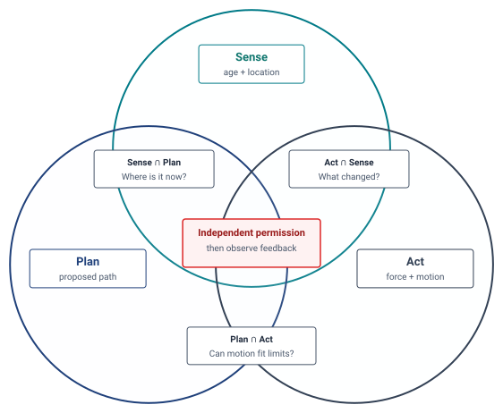

# S·P·A Diagnostic Playbook {#sec-appendix-spa}

A mobile chassis that overshoots a pallet corridor could have stale sensor evidence (Sense), an infeasible waypoint (Plan), or a worn brake that delivers less deceleration than assumed (Act). The **S·P·A taxonomy** locates the first broken contract among **Sense**, **Plan**, and **Act**. Logs and physical measurements then test that diagnosis before a remedy is admitted.

## How to Use This Appendix {.unnumbered}

Use this diagnostic playbook when an embodied system violates a safety envelope, misses an execution deadline, chatters during contact, or trips hardware interlocks. Work through the diagnosis in four systematic passes:

1. **State the physical symptom and binding budget**: Record the observed stopping-distance breach, contact-force transient, thermal trip, or enforcer deadline overrun, including units, load, operating state, and the limit configured for that machine.
2. **Localize the candidate axis or intersection**: Use @tbl-spa-components-ref for a first pass across the three core axes. When the symptom involves interface timing, state representations, or actuation authority, move directly to the intersection landscape in @tbl-spa-intersections.
3. **Test the quantitative hypothesis**: Measure the candidate constraint or budget using the instruments in @tbl-spa-troubleshooting, such as timestamp skew, bus queue time, phase current, or tracking error.
4. **Intervene and remeasure across the causal boundary**: Apply a remedy and rerun the measured test over the declared load, timing, and fault envelope.

The physical symptom determines the most effective entry point. Unstable contact oscillations should immediately examine the Act–Sense ($A \cap S$) boundary. A sudden reference discontinuity or measured torque transient points to the Plan–Act ($P \cap A$) boundary. Phantom obstacle braking or drift under occlusion points to the Sense–Plan ($S \cap P$) interface. Deadline jitter during concurrent neural inference points directly to the three-way causal boundary ($S \cap P \cap A$).

## Diagnostic Summary: The S·P·A Axes {#sec-appendix-spa-summary}

The S·P·A taxonomy decomposes the cyber-physical loop into three axes. @Tbl-spa-components-ref lists a constraint or budget to inspect for each one; these are not all conservation laws.

\Needspace{28\baselineskip}

| Axis          | Operational role                    | Constraint or budget to test                                                     | Diagnostic action                                                                              | Book locus       |
|:--------------|:------------------------------------|:---------------------------------------------------------------------------------|:-----------------------------------------------------------------------------------------------|:-----------------|
| **Sense (S)** | Capture and estimate physical state | Evidence age, field of view, clock conversion, uncertainty, and sensor transport | Compare capture and per-cell evidence epochs with a measured state and the permission deadline | @sec-memory      |
| **Plan (P)**  | Propose a target and trajectory     | Intent validity, compute latency, dynamics, and stopping-suffix admission        | Compare proposed targets and future states with independently checked limits                   | @sec-planning    |
| **Act (A)**   | Apply and measure force             | Current, torque, thermal headroom, brake response, and kinetic clearance         | Measure command-to-force response and achieved stop under the declared load                    | @sec-enforcement |

: **S·P·A axis reference**: The axes organize diagnosis around measured constraints and budgets, with the chapter that develops each contract. {#tbl-spa-components-ref tbl-colwidths="[12,18,30,27,13]"}

While this single-axis separation is helpful for initial triage, production failures rarely originate within a single isolated component. More frequently, the failure sits at the **boundary** between two axes—such as an unblended trajectory step that excites high mechanical rotor inertia, or camera direct memory access (DMA) ingress that saturates the memory crossbar needed by real-time motor timers. Resolving these failures requires mapping the intersection landscape.

## The Intersection Landscape {#sec-appendix-spa-intersections}

@Fig-spa-triad shows how Sense, Plan, and Act intersect, with the permission decision at the center where all three meet. In this appendix, we formalize this landscape into an operational systems diagnostic matrix.

::: {#fig-spa-triad fig-env="figure" fig-pos="t" fig-cap="**The S·P·A intersection landscape**: Sense, Plan, and Act meet pairwise in three physical decisions, locating the object now, checking that proposed motion fits limits, and measuring what changed after acting. Their center is the permission decision, where an independent permission path checks the shared physical budget before actuation." fig-alt="Three overlapping circles labeled Sense, Plan, and Act. Sense and Plan ask where an object is now. Plan and Act ask whether motion fits physical limits. Act and Sense ask what changed. The center, where all three overlap, is the independent permission decision."}
{width="95%"}
:::

Each intersection is a testable handoff. @Tbl-spa-intersections names the failure mode and the evidence needed before a proposed fix earns permission.

| Intersection                     | Handoff contract                                           | Failure to test                                                                | Evidence and candidate remedy                                                                                               |
|:---------------------------------|:-----------------------------------------------------------|:-------------------------------------------------------------------------------|:----------------------------------------------------------------------------------------------------------------------------|
| **$S\cap P$** — belief           | Observations become timed, framed state estimates          | A fresh map publication hides an old voxel or an unseen object remains unknown | Check per-cell evidence epochs, free versus occupied rays, and frame transforms; use a separately validated collision layer |
| **$P\cap A$** — motion           | A proposal becomes an admitted, state-matched trajectory   | A seam requests a torque transient or the stop suffix no longer fits clearance | Check entry state, derivatives, lease, and clearance; reject an infeasible seam and use the resident stop                   |
| **$A\cap S$** — feedback         | Actuation changes the state that sensors report            | Contact force rises before the next useful sample or an actuator saturates     | Measure command-to-force and sensor-return delay; choose a local reflex and passive limit where justified                   |
| **$S\cap P\cap A$** — permission | The independent gate turns a proposal into physical action | Compute, memory, power, or clock interference delays refusal                   | Measure response under contention; revoke tracking and qualify isolation or relocate the path if its bound fails            |

: **The S·P·A intersection taxonomy**: Four handoffs locate the earliest broken physical contract and the evidence required to repair it; the axis reference above links to the underlying chapters. {#tbl-spa-intersections tbl-colwidths="[16,23,27,34]"}

## Physical AI Production Troubleshooting Matrix {#sec-appendix-spa-troubleshooting}

When an operational machine violates physical limits or software invariants, use @tbl-spa-troubleshooting to match observable diagnostic symptoms to the binding axis and high-leverage remedy.

| Observable symptom                                            | Candidate boundary | Discriminating measurement                                                                                | Candidate response                                                                                                   |
|:--------------------------------------------------------------|:-------------------|:----------------------------------------------------------------------------------------------------------|:---------------------------------------------------------------------------------------------------------------------|
| Contact hunting during assembly                               | $A\cap S$          | Measure phase margin and force rise against the sensor-to-torque delay under the actual contact stiffness | Qualify a local impedance loop, approach-speed limit, and passive compliance for that contact                        |
| Torque or current transient at an action-chunk seam           | $P\cap A$          | Compare encoder, phase-current, and requested acceleration traces at the measured entry state             | Admit a state-matched $C^2$ bridge and reserve a stopping suffix; the reduction in @sec-planning is profile-specific |
| Phantom obstacle stop in a corridor                           | $S\cap P$          | Distinguish observed free, occupied, and unknown rays; inspect per-voxel evidence age                     | Clear only observed free space and retest the occupancy-to-permission conversion                                     |
| Enforcer misses its configured deadline during camera ingress | $S\cap P\cap A$    | Correlate response-time misses with bus queue, bank switches, cache misses, and DMA ownership             | Qualify QoS bypass or a coherent local safety snapshot; remeasure under contention                                   |
| Link or workpiece yields during contact                       | $A$                | Compare measured force and displacement with the tested material and tooling limits                       | Reduce admitted speed or force and qualify a compliant load path                                                     |
| Policy update arrives after its admitted chunk horizon        | $P\cap A$          | Measure the update tail, lease expiry, and fallback transfer state                                        | Shorten the admitted action or use an MCU-owned stop; do not extend permission from a percentile alone               |
| MCU rail droops during accelerator bursts                     | $S\cap P\cap A$    | Measure rail waveform, path slack, supervisor threshold, and resulting response time                      | Characterize decoupling, current slew, or physical power isolation                                                   |
| Vehicle drifts laterally despite low offline prediction error | $A\cap S$          | Compare closed-loop yaw bias, lateral clearance, and surface-dependent braking                            | Test closed-loop rollouts and impose a feasible corridor and stop bound                                              |

: **Physical AI production troubleshooting matrix**: Each row is a hypothesis, measurement, and candidate remedy; acceptance depends on the machine's declared limits. {#tbl-spa-troubleshooting tbl-colwidths="[22,13,33,32]"}

\Needspace{0.72\textheight}

## The S·P·A Systems Scorecard {#sec-appendix-spa-scorecard}

Before release, use @tbl-spa-scorecard to name the evidence needed for each handoff. Its checks are examples, not portable pass thresholds: the signed release case must supply the actual limits, operating envelope, confidence or hard-bound semantics, and fallback for the machine.

| Boundary                             | Example acceptance check for a declared machine                                                                                                                                      | Response if the check fails                                                            |
|:-------------------------------------|:-------------------------------------------------------------------------------------------------------------------------------------------------------------------------------------|:---------------------------------------------------------------------------------------|
| **Sense** — capture clock            | Bound capture-to-MCU conversion error and include it in evidence age                                                                                                                 | Resynchronize or withhold motion when the bound expires                                |
| **Sense** — ingestion                | Measure worst admitted sensor/DMA queue occupancy, drop rate, and transfer time under concurrent load                                                                                | Reserve capacity or reduce sensing load; dropped frames do not renew belief            |
| **Plan** — chunk horizon             | Admit a successor before the commit deadline, or transfer to a resident state-matched stop                                                                                           | Use measured update tails as evidence, not as a worst-case guarantee                   |
| **Plan** — dynamics                  | Check position, velocity, acceleration, torque, and stopping suffix against the actual joint and path limits                                                                         | Reject or replan an infeasible chunk                                                   |
| **Act** — brake and contact          | Validate achieved deceleration and force response for load, wear, surface, and temperature                                                                                           | Derate speed, change tooling, or refuse the untested state                             |
| **Act** — thermal                    | Keep measured winding and drive temperature inside device ratings under the duty cycle                                                                                               | Reduce duty or enter the validated stop/hold mode                                      |
| **$S\cap P$** — spatial evidence     | Preserve each cell's evidence epoch and distinguish observed free, occupied, and unknown                                                                                             | Refuse unknown clearance or obtain a new observation                                   |
| **$P\cap A$** — seam                 | Check the matched entry state, derivative limits, and full stopping clearance before commit                                                                                          | Use the MCU-owned baseline stop if a successor is absent or invalid                    |
| **$A\cap S$** — reflex               | Bound sensing-to-force response against a contact-specific harm deadline                                                                                                             | Reduce approach energy or add a validated passive limit                                |
| **$S\cap P\cap A$** — compute        | In the illustrative $1\,\text{ms}$ cycle of @sec-enforcement, qualify a solver WCET of at most $650\,\mu\text{s}$ and budget acquisition, validation, write, and dispatch separately | Revoke tracking permission before the cycle overrun consumes stopping margin           |
| **$S\cap P\cap A$** — shared silicon | Measure enforcer response under worst admitted bus, rail, and thermal contention                                                                                                     | Qualify QoS/local snapshots or relocate the path if isolation cannot be shown          |
| **$S\cap P\cap A$** — permission     | Verify model/state assumptions, feasible CBF input, clock and estimate margins, and a state-matched fallback                                                                         | Refuse the proposal when a premise is missing; a QP result alone proves no path safety |

: **The S·P·A Physical AI systems scorecard**: Example release checks across the three axes and their handoffs. Each row requires a case-specific threshold and evidence; the solver number is an assumed worked qualification target. {#tbl-spa-scorecard tbl-colwidths="[19,48,33]"}
