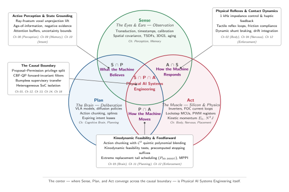

# The S·P·A Taxonomy & Diagnostic Playbook {#sec-appendix-spa}

A physical AI system that fails or drops dead rarely announces why: a mobile chassis that overshoots a pallet corridor might suffer from sensor transport jitter (Sense), a neural policy proposing kinodynamically infeasible waypoints (Plan), or a motor driver whose thermal limiting throttled torque (Act). Where single-node machine learning systems structure engineering around the Data, Algorithm, and Machine triad, embodied Physical AI crosses the causal boundary into irreversible physical mechanics. This appendix formalizes the book's foundational diagnostic framework—the **S·P·A taxonomy** of **Sense**, **Plan**, and **Act**—mapping real-world symptoms, hardware telemetry, and profiler traces directly to the binding cyber-physical axis or boundary intersection before optimization or safety retrofits begin.

## How to Use This Appendix {.unnumbered}

Use this diagnostic playbook when an embodied system violates a safety envelope, misses an execution deadline, chatters during contact, or trips hardware interlocks. Work through the diagnosis in four systematic passes:

1. **State the physical symptom and binding budget**: Record the observed physical failure (e.g., stopping distance breach $\Delta d$, contact force spike $\Delta F$, thermal trip $T > 155^\circ\text{C}$, or enforcer deadline overrun $\tau > 1.0\text{ ms}$) and deployment context.
2. **Localize the candidate axis or intersection**: Use @tbl-spa-components-ref for a first pass across the three core axes. When the symptom involves interface timing, state representations, or actuation authority, move directly to the intersection landscape in @tbl-spa-intersections.
3. **Test the quantitative hypothesis**: Measure the binding physical invariant using the tools and instrumentation listed in @tbl-spa-troubleshooting (e.g., PTP network jitter, AXI crossbar saturation, motor phase current, or Lyapunov covariance expansion).
4. **Intervene and remeasure across the causal boundary**: Apply the high-leverage remedy from @tbl-spa-troubleshooting and re-evaluate under loaded worst-case conditions.

The physical symptom determines the most effective entry point. Unstable contact oscillations should immediately examine the Act–Sense ($A \cap S$) boundary. Sudden trajectory jerks or sheared gearhead teeth point to the Plan–Act ($P \cap A$) boundary. Phantom obstacle braking or drift under occlusion points to the Sense–Plan ($S \cap P$) interface. Deadline jitter during concurrent neural inference points directly to the three-way causal boundary ($S \cap P \cap A$).

## Diagnostic Summary: The S·P·A Axes {#sec-appendix-spa-summary}

The S·P·A taxonomy decomposes the cyber-physical loop into three primary axes. @Tbl-spa-components-ref summarizes the operational role, governing physical conservation law, and primary optimization pathway for each axis.

| Axis          | Operational Role                             | Physical Conservation Law & Constraint                                                                      | Primary Optimization Pathway                                             | Book Locus                              |
|:--------------|:---------------------------------------------|:------------------------------------------------------------------------------------------------------------|:-------------------------------------------------------------------------|:----------------------------------------|
| **Sense (S)** | The Eyes & Ears (Observation & Transduction) | Information aging ($\tau_{\text{age}}$), optical photon limits, SerDes/CSI-2 bus bandwidth                  | Ray-frustum unprojection, active negative evidence, covariance insetting | @sec-perception, @sec-memory            |
| **Plan (P)**  | The Brain (Cognition & Deliberation)         | Arithmetic intensity (FLOP/byte), KV-cache capacity, stochastic inference latency                           | Action chunking, $\mathcal{C}^2$ quintic splines, expiring intent leases | @sec-brain, @sec-planning               |
| **Act (A)**   | The Muscle & Silicon (Force & Hardware)      | Momentum conservation ($E_k = \frac{1}{2}mv^2$), reflected rotor inertia ($N^2 J$), Joule heating ($I^2 R$) | Field-Oriented Control (FOC), deterministic fieldbuses, lockstep MCUs    | @sec-body, @sec-nervous, @sec-placement |

: **S·P·A Axis Reference**: The three foundational axes of Physical AI systems engineering, their governing physical constraints, and primary optimization pathways. {#tbl-spa-components-ref tbl-colwidths="[12,22,34,20,12]"}

While this single-axis separation is helpful for initial triage, production failures rarely originate within a single isolated component. More frequently, the failure sits at the **boundary** between two axes—such as an unblended trajectory step that excites high mechanical rotor inertia, or camera direct memory access (DMA) ingress that saturates the memory crossbar needed by real-time motor timers. Resolving these failures requires mapping the intersection landscape.

## The Intersection Landscape {#sec-appendix-spa-intersections}

The opening chapter introduces @fig-01-spa-triad to establish the conceptual foundation. In @fig-appdx-spa-triad, we formalize this landscape into an operational systems diagnostic map.

::: {#fig-appdx-spa-triad fig-env="figure" fig-pos="htb" fig-cap="**The S·P·A Intersection Landscape**: Sense, Plan, and Act begin as distinct disciplines, but physical AI systems operate at their boundaries. Pairwise intersections govern active state grounding ($S \\cap P$), kinodynamic feasibility ($P \\cap A$), and physical reflex dynamics ($A \\cap S$). Their center is Physical AI systems engineering, where the causal boundary is defended by provable runtime safety enclosures." fig-alt="Three-circle Venn diagram labeled Sense, Plan, and Act. Sense lists transduction, timestamps, spatial covariance, TSDFs, and aging. Plan lists VLA models, diffusion policies, action chunking, and splines. Act lists inverters, FOC current loops, fieldbuses, lockstep MCUs, and kinetic momentum. Pairwise overlaps show What the Machine Believes, How the Machine Responds, and How the Machine Moves. Central three-way intersection is Physical AI Systems Engineering."}
{width="95%"}
:::

Each intersection represents a distinct cyber-physical contract. @Tbl-spa-intersections maps the four intersection regimes, their systems challenges, and their canonical engineering solutions.

| Intersection                                              | System Role                                                                        | Core Systems Challenge                                                                                                      | Canonical Architectural Solutions                                                                                                                                                                                                                                                                                                                                                                                                                                                                                                                                                                                                               | Key Chapters                                                                             |
|:----------------------------------------------------------|:-----------------------------------------------------------------------------------|:----------------------------------------------------------------------------------------------------------------------------|:------------------------------------------------------------------------------------------------------------------------------------------------------------------------------------------------------------------------------------------------------------------------------------------------------------------------------------------------------------------------------------------------------------------------------------------------------------------------------------------------------------------------------------------------------------------------------------------------------------------------------------------------|:-----------------------------------------------------------------------------------------|
| **$S \cap P$** *(Sense $\cap$ Plan)*                   | **"What the Machine Believes"** (Active Perception & State Grounding)           | Transforming raw high-bandwidth sensory streams into actionable 3D state representations without latency blowup or drift.   | • Ray-frustum voxel unprojection tensor optimization • Age-of-Information (AoI) tracking and confidence decay • Active negative evidence raycasting (pruning phantom tracks) • 3D Gaussian Splatting scene attention buffers • Predictive Kalman/particle filtering across measurement dropouts                                                                                                                                                                                                                                                                                                                                     | @sec-perception @sec-memory @sec-intent                                            |
| **$P \cap A$** *(Plan $\cap$ Act)*                     | **"How the Machine Moves"** (Kinodynamic Feasibility & Feedforward)             | Translating stochastic neural policy outputs into continuous, torque-bounded commands that respect mechanical inertia.      | • Action chunking with $\mathcal{C}^2$ quintic polynomial blending ($50\times$ torque spike reduction) • Extreme replacement tail scheduling ($P_{99.99997}$) • Precomputed stopping suffixes and kinetic clearance burn-down • Kinodynamic feasibility admission tests ($t_{\min} \le \tau_{\text{lease}}$) • Embedded GPU-accelerated trajectory optimization (MPPI)                                                                                                                                                                                                                                                              | @sec-brain @sec-planning @sec-enforcement                                          |
| **$A \cap S$** *(Act $\cap$ Sense)*                    | **"How the Machine Responds"** (Physical Reflexes & Contact Dynamics)           | Providing direct, sub-millisecond physical feedback loops to protect the plant before slow deliberative policies can react. | • Kilohertz joint impedance control and direct force feedback ($1000\text{ Hz}$) • Sub-millisecond tactile reflex loops bypassing vision pipelines • Non-smooth Coulomb friction cone compliance ($F = k \Delta x$) • Inverter low-side MOSFET dynamic shunt braking on trips • Closed-loop unicycle drift integration ($y(t) \approx \int v \sin \epsilon_\theta d\tau$)                                                                                                                                                                                                                                                           | @sec-body @sec-nervous @sec-enforcement                                            |
| **$S \cap P \cap A$** *(Sense $\cap$ Plan $\cap$ Act)* | **"Physical AI Systems Engineering"** (The Causal Boundary & Runtime Enclosure) | Enforcing safety invariants, timing determinism, and plant stability when unverified neural policies control physical mass. | • **Dual-Brain Proposal–Permission Architecture**: High-capacity brain proposes; deterministic lockstep MCU permits • **Control Barrier Function (CBF-QP) Minimal Intervention**: Real-time orthogonal projection ($\mathbf{u}^* = \mathbf{u}_{\text{nom}} - \lambda^* \mathbf{a}$) • **Bumpless Supervisory Transfer**: $\mathcal{C}^2$ quintic authority handovers ($1.875$ jerk factor) between human and autonomous policies • **Heterogeneous Silicon Placement**: SoC crossbar QoS and PDN voltage droop isolation ($L \cdot dI/dt$) • **End-to-End Photon-to-Torque Latency Budgeting**: Managing the $100\text{ ms}$ budget | @sec-boundary @sec-enforcement @sec-placement @sec-intervention @sec-release |

: **The S·P·A Intersection Taxonomy**: Diagnostic mapping of pairwise and three-way boundaries across Physical AI systems. {#tbl-spa-intersections tbl-colwidths="[14,20,32,24,10]"}

## Physical AI Production Troubleshooting Matrix {#sec-appendix-spa-troubleshooting}

When an operational machine violates physical limits or software invariants, use @tbl-spa-troubleshooting to match observable diagnostic symptoms to the binding axis and high-leverage remedy.

| Observable Symptom                                                           | Candidate Axis / Intersection | Root Mechanism                                                                                                    | Quantitative Verification Metric                                                                       | High-Leverage Systems Remedy                                                                                         |
|:-----------------------------------------------------------------------------|:------------------------------|:------------------------------------------------------------------------------------------------------------------|:-------------------------------------------------------------------------------------------------------|:---------------------------------------------------------------------------------------------------------------------|
| Contact hunting / high-frequency chatter during assembly                     | **$A \cap S$**                | Sensor transport delay ($\tau_{\text{loop}} > 150\text{ ms}$) eroding phase margin below $0^\circ$                | Frequency response analyzer: Phase margin $\text{PM} < 0^\circ$                                        | Implement local analog/MCU impedance loops ($1\text{ kHz}$); clamp tool approach speed ($v \le 6.25\text{ mm/s}$)    |
| Catastrophic torque spike / sheared gear teeth at trajectory boundaries      | **$P \cap A$**                | Velocity discontinuity across action chunk seams excited by reflected rotor inertia ($N^2 J$)                     | Oscilloscope current probe: $I_{\text{peak}} > 3\times I_{\text{rated}}$ over $\Delta t < 1\text{ ms}$ | Apply continuous $\mathcal{C}^2$ quintic polynomial blending between consecutive chunk buffers                       |
| Phantom obstacle emergency stops in clear corridors                          | **$S \cap P$**                | Sensor noise or dust particles persisting in spatial memory without active raycasting eviction                    | Memory inspection: Voxel log-odds occupancy score remains positive in empty air                        | Assert active negative evidence raycasting along optical sightlines; introduce $\chi^2$ innovation gating            |
| Real-time safety enforcer misses execution deadline ($> 1\text{ ms}$)        | **$S \cap P \cap A$**         | High-bandwidth camera DMA bursts monopolizing shared AXI crossbars and DRAM row buffers                           | Hardware performance counters: Memory controller queue depth $> 80\%$                                  | Assign dedicated AXI QoS priorities; pin safety enforcer tasks to TCM memory on isolated MCU enclaves                |
| Manipulator structural yield / bent link under contact                       | **$A$**                       | Commanded position step penetrating rigid boundary; Hooke's law force spike $F = k \Delta x$                      | Multi-axis load cell: Contact force $F > F_{\text{yield}}$                                             | Insert force-derivative clamps and compliant series-elastic actuators (SEA); calibrate friction cones                |
| Jerky emergency braking during smooth navigation                             | **$P$**                       | Neural policy inference tail latency exceeding action chunk execution horizon ($Q_{1-\epsilon}(L) > H \Delta t$)  | Latency histogram: Chunk buffer underflow count                                                        | Size action chunk horizons against extreme tail quantiles ($P_{99.99997}$); enable 2-step flow matching              |
| Lockstep MCU brownout / watchdog reset during model bursts                   | **$S \cap P \cap A$**         | Rapid current transients ($dI/dt$) from NPU matrix multiplications depressing shared power rails                  | High-speed oscilloscope: Power rail voltage droop $\Delta V > 10\%$ nominal                            | Isolate power rails with dedicated buck converters; add decoupling capacitance; enforce $dI/dt$ slew-rate throttling |
| Vehicle drifts laterally out of clear corridor despite 99.7% model agreement | **$A \cap S$**                | Open-loop heading bias integrating through unicycle kinematics ($y(t) \approx \int v \sin \epsilon_\theta d\tau$) | Trajectory log: Lateral deviation $y(t) > W_{\text{clear}}$ at $t > 5\text{ s}$                        | Replace open-loop loss evaluation with closed-loop simulation rollouts; enforce CBF corridor envelopes               |

: **Physical AI Production Troubleshooting Matrix**: Systematic diagnosis matching observable field anomalies to binding S·P·A axes, root mechanisms, verification metrics, and architectural remedies. {#tbl-spa-troubleshooting tbl-colwidths="[18,12,24,22,24]"}

## The S·P·A Systems Scorecard {#sec-appendix-spa-scorecard}

Before deploying an embodied machine into an operational environment, the systems architect should audit the design against the quantitative criteria in @tbl-spa-scorecard. Each criterion represents a verified physical invariant.

| Category              | Diagnostic Checkpoint              | Passing Requirement                                                                                | Failure Consequence                                                      |
|:----------------------|:-----------------------------------|:---------------------------------------------------------------------------------------------------|:-------------------------------------------------------------------------|
| **Sense (S)**         | Exposure Timestamp Synchronization | Hardware PTP timestamping error $< 1.0\,\mu\text{s}$ across all camera and LiDAR streams           | Epistemic velocity distortion; multi-camera 3D triangulation blurring    |
| **Sense (S)**         | Ingestion Bus Headroom             | Total sensor ingestion bandwidth $< 60\%$ of sustained interface write capacity                    | Kernel page-cache exhaustion; silent frame drops; unguided coasting      |
| **Plan (P)**          | Action Chunk Horizon Tail Coverage | Buffer duration $H \Delta t \ge Q_{1-10^{-6}}(L_{\text{inference}})$ under maximum compute load    | Buffer underflow; recurring emergency stops; mechanical shock            |
| **Plan (P)**          | Kinodynamic Feasibility Admission  | Commanded trajectory satisfies $\ddot{q} \le a_{\max}$ and $\dddot{q} \le j_{\max}$ for all joints | Inverter overcurrent trips; gear tooth shearing                          |
| **Act (A)**           | Reflected Rotor Inertia Damping    | Inverter bandwidth throttles torque when load-acceleration exceeds $N^2 J \ddot{\theta}$           | High-frequency mechanical resonance; joint drive-train fracture          |
| **Act (A)**           | Thermal Duty Cycle Margin          | Continuous RMS current satisfies $I_{\text{rms}} \le I_{\text{cont}}$ under maximum ambient temp   | Stator winding Class F insulation breakdown ($T > 155^\circ\text{C}$)    |
| **$S \cap P$**        | Negative Evidence Raycasting       | Optical sightlines actively clear empty voxels in $\le 2$ consecutive measurement frames           | Phantom obstacle ghost tracks; degraded mission productivity             |
| **$P \cap A$**        | Seam Quintic Blending              | Trajectory replacement seams maintain $\mathcal{C}^2$ acceleration continuity                      | Discontinuous torque shocks; dropped payloads; structural vibration      |
| **$A \cap S$**        | High-Rate Reflex Latency           | Dedicated tactile/force reflex loop executes in $< 1.0\text{ ms}$ on local microcontroller         | Crushed workpieces; slipping grasps; load-cell shear pin yield           |
| **$S \cap P \cap A$** | Dual-Brain Hardware Isolation      | Real-time safety enforcer executes on isolated lockstep core with dedicated TCM memory             | Accelerator memory stalls delay emergency braking; fatal boundary breach |
| **$S \cap P \cap A$** | Power Rail Inductive Margin        | Inductive droop $\Delta V = L \, dI/dt < 5\%$ under maximum concurrent accelerator load            | Microcontroller brownout; phase-locked loop clock unlock; system stall   |
| **$S \cap P \cap A$** | CBF Minimal Intervention Margin    | Orthogonal QP projection executes in $< 150\,\mu\text{s}$ with verified forward-invariance         | Unsafe neural proposals reach motor registers; boundary collision        |

: **The S·P·A Physical AI Systems Scorecard**: Predeployment qualification checklist across all three axes and four intersection boundaries. {#tbl-spa-scorecard tbl-colwidths="[14,24,34,28]"}
