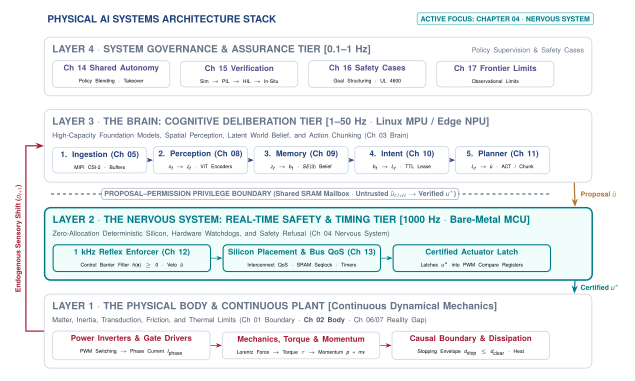
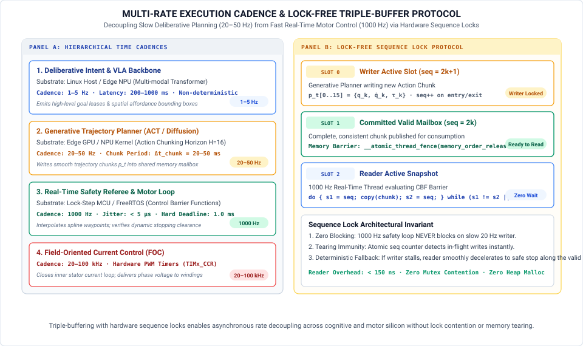
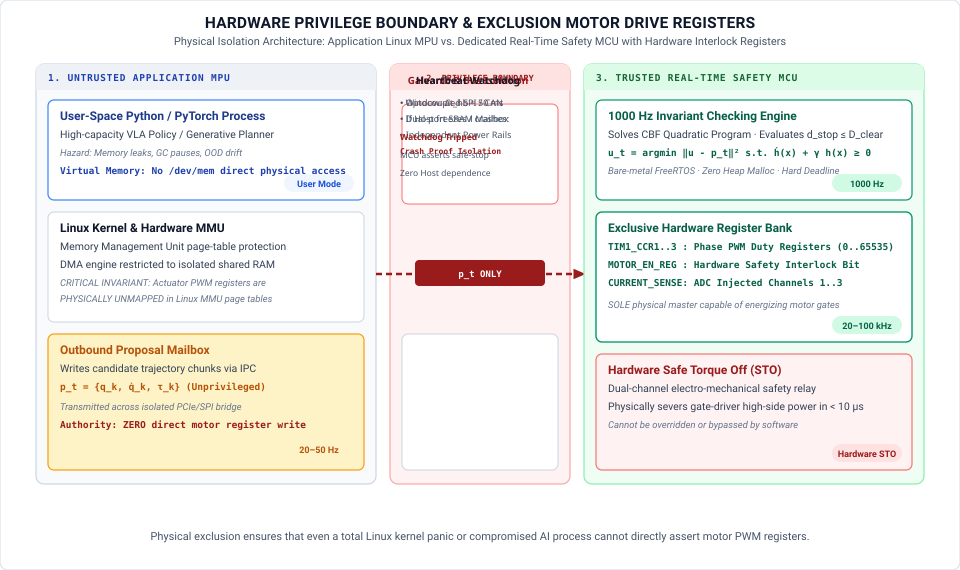

# The Real-Time Nervous System {#sec-nervous}

::: {.column-margin}

\chapterminitoc

:::

::: {#fig-04-locator fig-env="figure" fig-pos="H" fig-cap="**Systems Organ Focus: The Nervous System**: The four-tier physical AI systems architecture highlights the real-time nervous system (Layer 2). Operating between the deliberative brain (Layer 3) and dynamical body (Layer 1), the deterministic nervous system enforces multi-rate synchronization, transports sensorimotor signals under hard real-time deadlines, and maintains the exclusive privilege boundary over actuator energy delivery." fig-alt="Systems Organ Focus: The Nervous System. The four-tier physical AI systems architecture highlights the real-time nervous system (Layer 2). Operating between the deliberative brain (Layer 3) and dynamical body (Layer 1), the deterministic nervous system enforces multi-rate synchronization, transports sensorimotor signals under hard real-time deadlines, and maintains the exclusive privilege boundary over actuator energy delivery."}
{width="100%"}
:::

A physical AI system is an uneasy alliance of fundamentally incompatible physical and computational regimes. The physical body obeys continuous Newtonian dynamics where moving mass will not pause for computation. The cognitive brain operates through high-capacity statistical models that generalize across unstructured environments, but whose execution latencies are heavy-tailed and whose outputs are unverified. The nervous system is the deterministic silicon and communication fabric that bridges these two worlds: it synchronizes multi-rate cadences across four orders of temporal magnitude, manages lock-free data exchange across asynchronous clock domains, and enforces the physical invariants that guarantee digital decisions never violate the mechanical, electrical, and thermal limits of the machine.



::: {.callout-learning-objectives}
After studying this chapter, you will be able to:

1. Explain the role of the nervous system in reconciling stochastic high-level deliberation with deterministic physical dynamics.
2. Derive the execution rate of each pipeline tier from physical time constants rather than arbitrary software benchmarks.
3. Architect lock-free single-producer single-consumer (SPSC) seqlock buffers to exchange trajectory proposals across rate boundaries in bounded time.
4. Distinguish empirical latency percentiles ($P_{99}$) from structural worst-case execution time (WCET) guarantees ($R = C + B + I \le D$).
5. Establish hardware privilege boundaries that prevent unverified learned models from directly writing motor drive registers.
6. Derive physical watchdog lease horizons ($\tau_{\text{lease}}$) from stopping distance mechanics and kinetic energy dissipation limits.
7. Apply the Part I 5x5 Handoffs-by-Limits Synthesis Grid to diagnose timing jitter, bandwidth bottlenecks, and fault propagation.

*Core chapter takeaway.* Authority over physical actuation is settled structurally in hardware, and the execution rate of each subsystem follows from mechanics rather than computational preference. In physical AI, the nervous system serves as the immutable referee: it translates the slow, unverified thoughts of the brain into bounded, safe currents delivered to the body.
:::

## The Multi-Rate Bridge {#sec-nervous-4-1}

<!-- SECTION 4.1 -->
<!-- claim: Given a body that will not wait and a brain that cannot be relied on, the nervous system is what makes one machine out of them. -->
<!-- covers: Reference the cover organ locator image (#fig-locator) to anchor the 4-tier stack. -->
<!-- covers: The reconciliation problem: bridging a deterministic physical plant that obeys mechanics (Chapter 2) with an unbounded, stochastic model that generates proposals (Chapter 4). -->
<!-- covers: Why the two irreducible architectural decisions in physical AI systems are execution rate selection and authority allocation. -->
<!-- covers: The nervous system defined: the deterministic hardware and software fabric that transports signals under physical deadlines and retains exclusive veto authority over actuators. -->
<!-- covers: Why procedural software discipline and cooperative multitasking fail under compute starvation, memory corruption, or soft lockups. -->
<!-- covers: Platform-agnostic canonical systems terminology. -->

<!-- BEGIN -->
As highlighted in the systems organ locator at the opening of this chapter (@fig-04-locator), the nervous system occupies the intermediate architectural tier (Layer 2) that binds the deliberative cognitive brain (Layer 3) to the dynamical physical body (Layer 1). In @sec-boundary, we established that physical AI begins the instant digital computation crosses the causal boundary to command moving mass. In @sec-body, we quantified the unyielding physical budgets that govern that mass: reflected rotor inertia ($N^2 J$), stopping distance dynamics ($d_{\text{stop}}$), feedback phase lag ($\Delta \phi$), and thermal dissipation limits ($I^2 R$). Mass will not wait for computation. The cognitive brain, which @sec-brain develops next, requires high-capacity learned foundation models to generalize across unstructured environments, and those models produce outputs that are stochastic, non-Lipschitz, and subject to variable inference latencies.

This creates the fundamental temporal conflict of embodied intelligence: *the cognitive brain needs time to deliberate, but the physical body cannot wait to survive.*

A high-capacity foundation model or diffusion policy requires tens to hundreds of milliseconds to ingest multi-camera visual streams, evaluate cross-attention over spatial tokens, and synthesize future trajectories. In stark contrast, an electromagnetic motor coil possesses an electrical time constant ($\tau_e = L/R$) measured in fractions of a millisecond, and moving mechanical linkages carry kinetic energy ($E_k = \frac{1}{2} m v^2$) that will shear gearboxes or collide with obstacles if current vectors are delayed or miscalculated. If a vision-language model hallucinates an extreme joint command, stalls during memory management, or experiences an accelerator latency spike, the physical body does not encounter a software exception. Mass continues traveling under its own momentum across all three physical machine archetypes:

- In *Mobile Systems* (Class 1), an autonomous chassis or quadruped traveling at $2.0\text{ m/s}$ covers $0.30\text{ m}$ of unguided displacement during a $150\text{ ms}$ inference stall before wheel braking can engage.
- In *Manipulators* (Class 2), an articulated robot arm swinging an end-effector carries reflected rotor inertia ($N^2 J$) that will crush tooling or breach fixturing envelopes if high-rate impedance loops are interrupted.
- In *Process and Energy Systems* (Class 3), high-power battery inverters and thermal cooling circuits experience thermal runaway or power stage shoot-through if gate switching vectors drift outside microsecond commutation deadlines.

Physical safety cannot be guaranteed through software discipline, operating system thread priorities, or runtime exception handlers alone. It requires an explicit, deterministic computing, memory, and communication fabric: the **real-time nervous system**.

Every signal that crosses the boundary between the brain and the body is governed by five non-negotiable physical limits:

1. **Latency ($\tau$):** The total transport and computation age of a signal. Sensor exposure windows, neural inference runtimes, and fieldbus serialization latencies accumulate along the pipeline; if cumulative latency exceeds physical margins, control loops destabilize.
2. **Bandwidth ($\beta$):** The data volume throughput across interconnects. Uncompressed high-resolution multi-camera feeds demand gigabytes per second, whereas motor actuation setpoints require only kilobits per second of compact parameterization.
3. **Thermal and Energy ($\mathcal{E}$):** The physical dissipation of heat. Massively parallel tensor accelerators consume tens of watts within tightly enclosed chassis, while motor windings dissipate non-reversible resistive heat ($I^2 R$) during continuous torque exertion.
4. **Temporal Determinism ($\sigma_t$):** The cycle-to-cycle execution predictability. A timing jitter of even a few hundred microseconds erodes feedback phase margin ($\Delta \phi = -\frac{\omega T_s}{2}$), transforming stabilizing feedback into acoustic chatter and mechanical resonance.
5. **Fault Domain Isolation ($\mathcal{F}$):** The structural containment of hardware and software failures. A memory leak in an operating system daemon, an out-of-memory purge in a neural runtime, or an electrical current surge on an accelerator power rail must never propagate into the motor control path.

To reconcile the brain's need for deliberative compute time with the body's need for microsecond physical reflexes across these five limits, the nervous system must satisfy five ideal properties:

First, it must deliver microsecond cycle determinism. Feedback loops regulating motor currents and joint torques must execute between $1000\text{ Hz}$ and $20\text{ kHz}$ with sub-microsecond jitter, ensuring invariant phase margins and ripple-free torque.

Second, it must achieve asynchronous multi-rate decoupling. High-level cognitive models deliberate at slow, variable cadences ($1\text{--}50\text{ Hz}$), while actuator bridges require continuous, cycle-precise current vectors at $1000\text{ Hz}$. The nervous system must transport trajectory waypoints across these disparate clock domains in bounded time without allowing compute stalls to block low-level control loops.

Third, it must enforce isolated fault containment. The failure of high-level software services must leave the real-time reflex core running undisturbed on physically segregated hardware.

Fourth, it must maintain uncompromised privilege authority. High-capacity learned models act strictly as untrusted proposal engines. Direct physical write access to pulse-width modulation (PWM) registers, gate-driver timers, and inverter power stages is restricted exclusively to deterministic hardware enforcers that evaluate physical safety invariants before permitting energy delivery.

Fifth, it must guarantee autonomous energy dissipation and safe halting. When communication fails or proposals expire, moving mass continues traveling under its own momentum. The nervous system must autonomously detect timeout events via physical watchdog leases ($\tau_{\text{lease}}$), evaluate dynamic stopping distances ($d_{\text{stop}} \le D_{\text{clear}}$), and safely convert kinetic energy into thermal dissipation through dynamic braking or hardwired Safe Torque Off (STO) interlocks.

The nervous system is the architectural referee that settles authority over physical actuation. The central engineering question of this chapter is: *what silicon partitioning, memory transport contracts, and deterministic fieldbus fabrics allow us to build this bridge in physical hardware?*
<!-- END -->

## Silicon Partitioning {#sec-nervous-4-2}

<!-- SECTION 4.2 -->
<!-- claim: Deliberation is slow and unpredictable, enforcement must be fast and predictable, and no single path can be both. -->
<!-- covers: The profile of deliberate work: variable runtime, deep compute graphs, gigabyte-scale memory footprints, soft failure modes, and batch-oriented parallel hardware. -->
<!-- covers: The profile of reactive work: bounded execution cycles on microsecond budgets, fixed memory footprints, zero runtime allocations, hard real-time deadlines, and cycle-counted processors. -->
<!-- covers: Why general-purpose OS schedulers and preemptible kernels fail to convert deliberate hardware into hard real-time controllers. -->
<!-- covers: Mathematical derivation: deadline overrun probability under log-normal compute distribution (P(T_inf > T_deadline) = 2.38 percent). -->
<!-- covers: The dual-processor imperative. -->

<!-- BEGIN -->
The computational workload of a physical AI machine divides cleanly into two regimes with opposing requirements. The first regime is deliberation, where learned models evaluate sensory context, infer environmental state, and propose future action plans. The second regime is reactive enforcement, where deterministic control logic samples joints, validates kinematic limits, interpolates motion commands, and regulates electrical currents to the motors. These two regimes differ in their fundamental mathematical profiles, hardware architectures, and tolerance for temporal error.

Deliberate work is defined by deep computational graphs, large memory footprints, and variable execution times. A vision-language-action model processing multi-camera video streams, tactile histories, and natural language prompts requires billions of multiply-accumulate operations across hundreds of neural network layers. Storing the parameters and intermediate activation tensors demands gigabytes of high-bandwidth memory. To achieve acceptable arithmetic throughput, deliberate computation executes on massively parallel accelerators such as graphics processing units (GPUs) or dedicated neural processing units (NPUs). These processors maximize aggregate throughput across wide vector registers and batched memory pipelines at the direct expense of deterministic latency. Memory access stalls, dynamic tensor kernel selection, bus transfers, and runtime memory management cause the execution time of consecutive inferences to vary across a wide distribution. If a deliberate model experiences a temporary delay, the failure mode is soft, resulting in a delayed proposal or a stale trajectory that can be held or discarded without immediate hardware damage.

Reactive work operates under the inverse constraints. An inner control loop computing inverse dynamics, joint limit monitoring, or field-oriented motor control requires a few thousand arithmetic operations per update. Its memory footprint is static, measured in kilobytes rather than gigabytes, with every variable allocated at compile time in tightly-coupled on-chip static memory to eliminate heap fragmentation, dynamic paging, and runtime garbage collection. Reactive routines execute on cycle-counted microcontrollers or field-programmable gate arrays (FPGAs) designed for bounded execution rather than maximum parallel throughput. The deadlines governing this work are hard real-time constraints dictated by the mechanical inertia and electrical inductance of the physical system, typically running at rates between $1000\text{ Hz}$ and $10000\text{ Hz}$ on update budgets of $100\text{ }\mu\text{s}$ to $1000\text{ }\mu\text{s}$. If a reactive loop misses its execution deadline, the failure mode is hard, resulting in lost current control, destabilizing torque ripple, or a physical collision before the next command can execute.

Because learned inference runtimes depend on memory access patterns, cache residency, dynamic tensor shapes, and hardware prefetching, their execution times are stochastic. Consider an analytical example where an inference pipeline runs on a dedicated edge accelerator with an execution time $T_{\text{inf}}$ modeled by a log-normal distribution, where the natural logarithm of latency follows $\mathcal{N}(\mu_{\ln}, \sigma_{\ln}^2)$. Suppose the nominal median runtime is $m = 50\text{ ms}$, corresponding to a log-scale location parameter $\mu_{\ln} = \ln(50) \approx 3.912$, with a log-scale dispersion parameter $\sigma_{\ln} = 0.35$, and the deliberate loop is assigned a fixed execution deadline of $T_{\text{deadline}} = 100\text{ ms}$ at $10\text{ Hz}$. The probability of an inference exceeding this deadline is given by the complementary cumulative distribution function:

$$P(T_{\text{inf}} > T_{\text{deadline}}) = 1 - \Phi\left(\frac{\ln T_{\text{deadline}} - \mu_{\ln}}{\sigma_{\ln}}\right)$$

where $\Phi(\cdot)$ denotes the standard normal cumulative distribution function. Evaluating the standard normal variable $z$ yields:

$$z = \frac{\ln(100) - 3.912}{0.35} = \frac{4.605 - 3.912}{0.35} \approx 1.98$$

This standard score gives an overrun probability of approximately $1 - \Phi(1.98) = 0.0238$, or $2.38\%$. At an operating rate of $10\text{ Hz}$, the system attempts $36000$ planning cycles per hour, producing an expected $857$ deadline violations every hour. Even if accelerator hardware delivers an average latency well below the deadline, heavy-tail variance guarantees frequent misses. While an average latency of $53\text{ ms}$ and a $P_{95}$ latency of $89\text{ ms}$ appear acceptable under standard software benchmarks, the $P_{99}$ tail extends to $113\text{ ms}$ and the $P_{99.9}$ tail reaches $148\text{ ms}$, creating intervals where the motor actuators receive no updated commands unless an independent, deterministic process bridges the gap.

General-purpose operating systems and real-time kernel patches (`PREEMPT_RT`) cannot reconcile these two execution profiles on a shared processor. Although real-time extensions allow static task priorities and preemptible kernels, they cannot eliminate shared microarchitectural resources. When a thread executing a learned model streams gigabytes of weight matrices across the memory bus, it evicts cache lines belonging to high-priority control tasks. If the deliberate runtime triggers a translation lookaside buffer (TLB) shootdown, enters a driver-level spinlock, or saturates the memory bus crossbar with direct memory access (DMA) requests, the hardware pipeline stalls.[^fn-hw-dma-coherence] A high-priority real-time interrupt can preempt software execution, but it cannot preempt a hardware memory transaction already occupying the memory bus. Furthermore, Dynamic Voltage and Frequency Scaling (DVFS) governors adjust core clock frequencies based on thermal dissipation and processor utilization, altering instruction cycle times dynamically. The resulting jitter ranges from tens of microseconds to several milliseconds, easily exceeding the entire time budget of a $1000\text{ Hz}$ control loop.

The hardware floor exposes this physical separation at the interface boundary. A host processor running an accelerator communicates across high-latency bus topologies such as PCIe or system fabric crossbars, where DMA transfers require ring-buffer synchronization, host interrupt service routines, and cache coherency handshakes that consume $10\text{ }\mu\text{s}$ to $100\text{ }\mu\text{s}$ per transaction. In contrast, an embedded microcontroller or dedicated real-time motor controller IC (@fig-real-motor-controller) interfaces directly with sensor transceivers and power stages through memory-mapped registers, single-cycle input and output pins, and tightly-coupled static memory with zero wait states. Reading an absolute joint encoder over a serial peripheral interface (SPI) or updating a field-oriented pulse-width modulation counter takes less than $1\text{ }\mu\text{s}$ of bounded execution time,[^fn-hw-epwm-deadtime] completely isolated from system bus contention.

::: {#fig-real-motor-controller fig-env="figure" fig-pos="t" fig-cap="**Dedicated Real-Time Motor Drive Controller Silicon**: Macro view of an embedded motor drive IC with precision current-sense shunt resistors (`R110`), multi-layer power routing, and direct gate-drive outputs. Unlike general-purpose application processors, dedicated real-time control silicon executes cycle-deterministic current commutation loops without operating system schedulers, cache hierarchies, or bus crossbar contention. (Credit: Wikimedia Commons, CC BY-SA 4.0)." fig-alt="Dedicated Real-Time Motor Drive Controller Silicon. Macro view of an embedded motor drive IC with precision current-sense shunt resistors (R110), multi-layer power routing, and direct gate-drive outputs. Unlike general-purpose application processors, dedicated real-time control silicon executes cycle-deterministic current commutation loops without operating system schedulers, cache hierarchies, or bus crossbar contention. (Credit: Wikimedia Commons, CC BY-SA 4.0)."}
{width="85%"}
:::

In heterogeneous Dual-Brain System-on-Chip (SoC) architectures, this physical reality enforces a strict dual-processor design requirement. Deliberate planning and reactive enforcement cannot safely share a processor core, a cache hierarchy, or a common memory bus. The slow, stochastic path requires parallel hardware (Linux host application processors and tensor accelerators) optimized for raw throughput across wide data streams, while the fast, deterministic path requires isolated hardware (bare-metal microcontrollers or FPGA cores) optimized for worst-case execution time and cycle-counted predictability.

::: {#pri-silicon-privilege .callout-principle title="Silicon Privilege Partitioning"}
Never allow a high-capacity learned model to execute in the same fault domain, address space, or power rail as the actuator commutation loop. Deliberation is an unprivileged proposal generator; physical register privilege belongs exclusively to cycle-deterministic real-time silicon.
:::

Safety in physical AI is an architectural partition in silicon, not an operating system scheduling priority. The high-throughput deliberative engine acts strictly as an untrusted client, while dedicated real-time silicon acts as the immutable hardware gatekeeper.
<!-- END -->

## Multi-Rate Cadences {#sec-nervous-4-3}

<!-- SECTION 4.3 -->
<!-- claim: Each rate is set by a physical property, and only one of them has an origin that is not negotiable. -->
<!-- covers: Deriving the inner loop rate (1000 Hz to 20 kHz): dictated by mechanical resonance, sensor bandwidth, and actuator electrical time constants tau = L/R. -->
<!-- covers: Deriving the perception rate (10 to 100 Hz): dictated by sensor integration times, camera exposure windows, and target velocity relative to sensor field of view. -->
<!-- covers: Deriving the planning rate (10 to 50 Hz): dictated by the environmental state change horizon and available compute energy budgets. -->
<!-- covers: Asynchronous data exchange across rate boundaries: lock-free single-producer single-consumer (SPSC) seqlock buffers. -->
<!-- covers: Vector Figure: Multi-Rate Cadence Buffer (#fig-04-multirate-cadence-buffer). -->
<!-- covers: Pure CMOS narrative: converting numbered producer/consumer steps into flowing prose. -->
<!-- covers: Table 4.1: Multi-Rate Cadence Hierarchy. -->

<!-- BEGIN -->
The physical separation of compute domains reflects a fundamental constraint in which no single execution frequency satisfies both the physical dynamics of the body and the computational complexity of perception and learned inference. A physical AI nervous system operates across four distinct rate tiers (@fig-04-multirate-cadence-buffer), each determined by a different physical process:

The inner reflex and current regulation loop runs between $1000\text{ Hz}$ and $20\text{ kHz}$. The motion interpolation and tracking loop runs between $100\text{ Hz}$ and $500\text{ Hz}$. The perception and policy planning pipeline processes incoming sensor streams between $10\text{ Hz}$ and $50\text{ Hz}$. The high-level deliberate reasoning tier updates semantic task targets between $0.5\text{ Hz}$ and $2\text{ Hz}$. Among these tiers, only the fastest rate has an origin that is non-negotiable.

The inner loop rate is governed by the physical time constants of the actuator and the structural resonance of the machine. In an electromagnetic actuator, winding inductance $L$ and phase resistance $R$ define the electrical time constant $\tau_e = L/R$. As an analytical example, consider a brushless permanent magnet motor with phase resistance $R = 0.60\text{ }\Omega$ and winding inductance $L = 120\text{ }\mu\text{H}$. The electrical time constant is $\tau_e = 120\text{ }\mu\text{H} / 0.60\text{ }\Omega = 0.20\text{ ms}$. Regulating current requires sampling phase currents and updating pulse-width modulation duty cycles before winding current drifts beyond acceptable control tolerances, setting an execution interval of $T_s \le 1.0\text{ ms}$ ($1000\text{ Hz}$), with inner field-oriented current loops executing up to $20\text{ kHz}$ ($50\ \mu\text{s}$). At the joint level, the mechanical time constant $\tau_m$ and structural stiffness dictate the required closed-loop bandwidth. Sampled-data control theory [@astrom1997computer] establishes that a discrete sample-and-hold loop introduces an effective phase delay of $\Delta \phi \approx \omega (T_s / 2 + T_d)$, where $T_s$ is the sampling interval and $T_d$ is the computation latency.[^fn-math-zoh-phaselag] If a joint with a target closed-loop crossover frequency of $\omega_c = 100\text{ rad/s}$ experiences an effective feedback delay of $T_s / 2 + T_d = 5.0\text{ ms}$ (for example, with $T_s = 2.0\text{ ms}$ and $T_d = 4.0\text{ ms}$), the discrete sampling process injects:

$$\Delta \phi = 100\text{ rad/s} \times 0.0050\text{ s} = 0.50\text{ rad} \approx 28.6^\circ$$

This phase lag directly erodes the phase margin of the feedback controller, driving the mechanical assembly toward resonance or uncontrolled oscillations when loop execution slows below $500\text{ Hz}$.

The perception tier executes at an intermediate rate dictated by photon collection physics, exposure windows, and target velocity relative to the sensor field of view. An optical image sensor operating under typical indoor illumination ($300\text{ lux}$) requires an integration window of $10\text{ ms}$ to $30\text{ ms}$ to accumulate sufficient charge on each pixel without amplifying thermal read noise. If a manipulator end-effector moves at $1.5\text{ m/s}$, an exposure time of $15\text{ ms}$ causes an edge feature to blur across $\Delta x = 1.5\text{ m/s} \times 0.015\text{ s} = 22.5\text{ mm}$ on the image plane. Increasing the frame rate beyond $60\text{ Hz}$ or $100\text{ Hz}$ provides diminishing returns because the physical shutter cannot shorten without inducing underexposure, while reducing the frame rate below $10\text{ Hz}$ allows moving objects to traverse tens of centimeters between frames, breaking visual tracking associations. The rate of the perception pipeline is bounded from above by photon flux and from below by spatial displacement across consecutive frames.

The deliberate planning and policy tier runs between $10\text{ Hz}$ and $50\text{ Hz}$ based on the horizon of environmental change and the thermal limits of onboard compute. A vision-language-action policy evaluates hundreds of millions of parameters, consuming tens of joules of electrical energy per inference step. The external environment, including moving obstacles, human collaborators, and changing contact surfaces, evolves over intervals of $20\text{ ms}$ to $200\text{ ms}$. Evaluating a learned policy at $20\text{ Hz}$ ($50\text{ ms}$ period) to generate multi-step action chunks ($K = 16$ to $50$ future waypoints) matches this environmental evolution rate while maintaining accelerator dissipation within an embedded power envelope of $15\text{ W}$ to $35\text{ W}$.

Because these tiers execute on isolated hardware domains at different frequencies, data exchange across rate boundaries must be asynchronous, non-blocking, and zero-copy (@fig-04-multirate-cadence-buffer). If a $1000\text{ Hz}$ control loop waits on a mutex lock held by a $20\text{ Hz}$ neural network runtime, a single scheduling delay in the operating system immediately causes the real-time controller to miss its deadline.

To prevent blocking, the nervous system implements **lock-free single-producer single-consumer (SPSC) seqlock buffers** in shared static memory.

::: {.callout-definition title="Lock-Free Sequence Lock (`seqlock`)"}
A synchronization primitive for single-writer multi-reader shared memory that eliminates reader blocking and priority inversion by coupling an atomic monotonic sequence counter with memory barriers; odd counter values signal active writer mutation, while identical even counter values before and after reading guarantee that payload words were latched without tear or inconsistency.
:::

The shared memory region maintains an atomic 64-bit sequence counter alongside double-buffered payload slots.

When the untrusted application processor prepares a new action chunk proposal, it begins by reading the current sequence counter and atomically incrementing it to an odd value, signalling to the rest of the system that a write operation is actively in progress. It then copies the proposal payload—including a monotonic sequence identifier, timestamp, validity lease duration, multi-step trajectory waypoints, and a cyclic redundancy checksum—into the inactive memory buffer. After enforcing an explicit memory barrier (`DMB ISHST` / `DMB ISH`) to ensure all payload bytes are globally visible across the bus,[^fn-hw-dmb-fence] the processor increments the sequence counter once more to an even value with store-release semantics (`STLR`), atomically publishing the completed frame.

On the receiving side, the deterministic real-time microcontroller latches the newest proposal without ever acquiring a lock or stalling execution. At the start of its control cycle, the microcontroller reads the sequence counter with load-acquire semantics (`LDAR`). If the counter is odd, indicating that the producer is midway through updating the buffer, the consumer immediately aborts the read, retaining its existing validated trajectory spline. If the counter is even, the microcontroller copies the payload into its private, tightly-coupled static memory and re-reads the sequence counter. If the counter changed during the copy, a torn read occurred due to a concurrent write, and the frame is safely discarded. If the sequence counter remained identical and even throughout the read, the latch is verified: the microcontroller validates the cyclic redundancy checksum (CRC-32), checks timestamp freshness against its hardware timer, and accepts the proposal. Under this protocol, read latencies on the real-time microcontroller remain strictly bounded below $1.5\ \mu\text{s}$, completely decoupled from the scheduling state or operating system load of the host processor.

::: {.callout-example title="Algorithm 4.1: Lock-Free Trajectory Seqlock Exchange Protocol"}
**Input (Writer):** Proposal payload $P = \{\text{seq\_id}, \text{timestamp\_ns}, \text{lease\_us}, \mathbf{w}_{1..K}, \text{crc32}\}$.
**Input (Reader):** Target local buffer $B_{\text{local}}$ in tightly-coupled static SRAM.
**State:** Shared SRAM mailbox: atomic `uint64` $c_{\text{seq}}$ (init 0), payload slot $\text{Slot}_{\text{shared}}$.
**Output (Reader):** Verified action chunk $P_{\text{latched}}$ or status rejection code.

**Procedure `PUBLISH_ACTION_CHUNK`($P$):**

1. $c_{\text{curr}} \leftarrow \text{ATOMIC\_LOAD\_EXPLICIT}(c_{\text{seq}}, \text{memory\_order\_relaxed})$
2. $\text{ATOMIC\_STORE\_EXPLICIT}(c_{\text{seq}}, c_{\text{curr}} + 1, \text{memory\_order\_relaxed})$ *(Mark odd: write in progress)*
3. $\text{HARDWARE\_MEMORY\_BARRIER}(\text{DMB\_ISHST})$ *(Store barrier pushes counter)*
4. $\text{COPY\_MEMORY}(\text{Slot}_{\text{shared}}.\text{payload}, P, \text{sizeof}(P))$ *(Copy multi-word trajectory)*
5. $\text{HARDWARE\_MEMORY\_BARRIER}(\text{DMB\_ISH})$ *(Full barrier: payload visible)*
6. $\text{ATOMIC\_STORE\_EXPLICIT}(c_{\text{seq}}, c_{\text{curr}} + 2, \text{memory\_order\_release})$ *(Mark even: publish committed)*

**Procedure `LATCH_LATEST_ACTION_CHUNK`($B_{\text{local}}, t_{\text{now}}$):**

1. $c_{\text{start}} \leftarrow \text{ATOMIC\_LOAD\_EXPLICIT}(c_{\text{seq}}, \text{memory\_order\_acquire})$ *(Load initial counter)*
2. **if** $c_{\text{start}}$ is **ODD then return** $\text{STATUS\_WRITER\_ACTIVE}$ *(Writer active; retain prior spline)*
3. $\text{HARDWARE\_MEMORY\_BARRIER}(\text{DMB\_ISHLD})$ *(Load barrier prevents reordering)*
4. $\text{COPY\_MEMORY}(B_{\text{local}}, \text{Slot}_{\text{shared}}.\text{payload}, \text{sizeof}(\text{Payload}))$ *(Latch to local SRAM)*
5. $\text{HARDWARE\_MEMORY\_BARRIER}(\text{DMB\_ISHLD})$ *(Ensure payload reads finish)*
6. $c_{\text{end}} \leftarrow \text{ATOMIC\_LOAD\_EXPLICIT}(c_{\text{seq}}, \text{memory\_order\_acquire})$ *(Re-read sequence counter)*
7. **if** $c_{\text{start}} \neq c_{\text{end}}$ **then return** $\text{STATUS\_TORN\_READ}$ *(Concurrent write detected)*
8. **if** $\text{COMPUTE\_CRC32}(B_{\text{local}}) \neq B_{\text{local}}.\text{crc32}$ **then return** $\text{STATUS\_CHECKSUM\_INVALID}$
9. **if** $(t_{\text{now}} - B_{\text{local}}.\text{timestamp\_ns}) > B_{\text{local}}.\text{lease\_us} \times 1000$ **then return** $\text{STATUS\_LEASE\_EXPIRED}$
10. **return** $\text{STATUS\_VALID\_LATCHED}$ *(Proposal verified for spline synthesis)*
:::

The trajectory payload exchanged through this lock-free mailbox follows the strict schema defined in @tbl-04-schema-action-chunk, establishing explicit data types, SI units, and structural invariants.

| Field Name            | Scalar Type       | Physical SI Units                       | Structural Invariant & Description                                            |          |                       |
|:----------------------|:------------------|:----------------------------------------|:------------------------------------------------------------------------------|----------|-----------------------|
| `sequence_id`         | `uint64_t`        | dimensionless                           | Monotonically strictly increasing integer ($s_k > s_{k-1}$).                  |          |                       |
| `timestamp_ns`        | `uint64_t`        | nanoseconds ($\text{ns}$)               | Hardware capture timestamp on master distributed clock.                       |          |                       |
| `validity_lease_us`   | `uint32_t`        | microseconds ($\mu\text{s}$)            | Physical validity lease window ($T_{\text{lease}} \le 87.6\text{ ms}$).       |          |                       |
| `num_waypoints`       | `uint16_t`        | dimensionless                           | Chunk horizon count ($K \in [16, 50]$).                                       |          |                       |
| `joint_positions`     | `float32[K][N_j]` | radians ($\text{rad}$)                  | Commanded joint angles within reach envelope ($q_{\min} \le q \le q_{\max}$). |          |                       |
| `joint_velocities`    | `float32[K][N_j]` | radians/sec ($\text{rad/s}$)            | Commanded joint velocities within certified ceilings ($\                      | \dot{q}\ | \le \dot{q}_{\max}$). |
| `feedforward_torques` | `float32[K][N_j]` | Newton-meters ($\text{N}\cdot\text{m}$) | Bounded feedforward motor torque vectors ($\                                  | \tau\    | \le \tau_{\max}$).    |
| `crc32`               | `uint32_t`        | bitmask                                 | IEEE 802.3 CRC-32 polynomial over all preceding payload bytes.                |          |                       |
: **Abstract Data Schema for Real-Time Action Chunk Exchange (`TrajectoryProposalChunk`)**: Field layout, scalar types, physical units, and structural invariants for trajectory proposals exchanged across the proposal–permission boundary via lock-free shared memory. {#tbl-04-schema-action-chunk}

::: {#fig-04-multirate-cadence-buffer fig-env="figure" fig-pos="t" fig-cap="**Multi-Rate Execution Cadence and Lock-Free Triple-Buffer Memory Exchange**: (Panel A) Execution timeline across three heterogeneous rate tiers: stochastic policy deliberation on the application processor ($50\text{ Hz}$, $T=20\text{ ms}$, variable inference $T_{\text{inf}} \sim \text{LogNormal}$ with occasional tail overruns), optical perception and state tokenization ($50\text{--}100\text{ Hz}$, $10\text{ ms}$ sensor exposure), and deterministic real-time reflex control on the bare-metal microcontroller ($1000\text{ Hz}$, $T_s=1.0\text{ ms}$). Inset breakdown shows microsecond-scale slot budgeting ($C \le 240\ \mu\text{s} \ll D = 1000\ \mu\text{s}$) with a $760\ \mu\text{s}$ safety jitter margin. (Panel B) Single-producer single-consumer (SPSC) seqlock triple-buffering memory architecture. The producer writes new action chunks into an inactive buffer with an odd sequence counter ($c_{\text{seq}} = 2k+1$) and commits via an atomic store of an even counter ($c_{\text{seq}} = 2k+2$). The real-time microcontroller latches the newest committed buffer in $<1.5\ \mu\text{s}$ without holding mutexes or risking priority inversion, safely falling back to local spline extrapolation or watchdog-driven emergency braking ($T_{\text{wd}} \le 87.6\text{ ms}$) upon buffer starvation." fig-alt="Multi-Rate Execution Cadence and Lock-Free Triple-Buffer Memory Exchange. (Panel A) Execution timeline across three heterogeneous rate tiers: stochastic policy deliberation on the application processor (50\text{ Hz}, T=20\text{ ms}, variable inference T{\text{inf}} \sim \text{LogNormal} with occasional tail overruns), optical perception and state tokenization (50\text{--}100\text{ Hz}, 10\text{ ms} sensor exposure), and deterministic real-time reflex control on the bare-metal microcontroller (1000\text{ Hz}, Ts=1.0\text{ ms}). Inset breakdown shows microsecond-scale slot budgeting (C \le 240\ \mu\text{s} \ll D = 1000\ \mu\text{s}) with a 760\ \mu\text{s} safety jitter margin. (Panel B) Single-producer single-consumer (SPSC) seqlock triple-buffering memory architecture. The producer writes new action chunks into an inactive buffer with an odd sequence counter (c{\text{seq}} = 2k+1) and commits via an atomic store of an even counter (c{\text{seq}} = 2k+2). The real-time microcontroller latches the newest committed buffer in <1.5\ \mu\text{s} without holding mutexes or risking priority inversion, safely falling back to local spline extrapolation or watchdog-driven emergency braking (T{\text{wd}} \le 87.6\text{ ms}) upon buffer starvation."}
{width="95%"}
:::

Rate mismatches introduce three failure modes: phase lag accumulation, aliasing, and buffer starvation. In a discrete-to-continuous conversion, a Zero-Order Hold (ZOH) holds each sample constant for duration $T_{\text{plan}}$, introducing an intrinsic half-sample phase lag $\Delta \phi = -\frac{\omega T_{\text{plan}}}{2}$. Directly applying a planner setpoint across multiple inner loop cycles creates a zero-order hold delay of $T_{\text{plan}}/2$. At a $10\text{ Hz}$ planning rate, this delay amounts to $50\text{ ms}$ of uncompensated lag, degrading control margins if applied without local interpolation. The inner loop avoids this by evaluating continuous cubic or quintic polynomial splines ($q(t) = a_0 + a_1 t + a_2 t^2 + a_3 t^3$) across the latched waypoints at $1000\text{ Hz}$, generating smooth, differentiable position, velocity, and acceleration setpoints on every $1.0\text{ ms}$ tick.

Aliasing occurs when high-frequency sensor noise folds into low-rate estimators, which the system prevents through analog anti-aliasing filters and digital decimation within the high-rate microcontroller domain. Following classical nonlinear control results [@slotine1991applied], stability guarantees hold under the assumption that inner-loop execution jitter remains bounded within a narrow fraction of the sampling period and that setpoint updates arrive before the local trajectory buffer drains. The nervous system establishes these assumptions by enforcing cycle-deterministic interrupt timing on the microcontroller and tracking buffer depth. If the planner stalls and the buffer drains to its final valid waypoint, the operational assumption no longer holds. At that moment, the nervous system rejects further planner inputs and executes an autonomous, deterministic stopping trajectory computed locally at $1000\text{ Hz}$, bringing all joints safely to rest.

::: {#pri-cadence-decoupling .callout-principle title="Lock-Free Cadence Decoupling"}
Never allow a high-frequency real-time control loop to acquire a mutex or spin on a lock shared with a stochastic process; communicate across clock domains exclusively via lock-free atomic sequence mailboxes or triple-buffers.
:::

Communication between cognitive models and motor loops cannot rely on blocking queues, mutexes, or network sockets. Every interface boundary must be bridged by asynchronous, lock-free shared memory or deterministic fieldbuses that guarantee the high-rate motor loop never waits for the slow, stochastic brain.

The operational characteristics, physical time constants, hardware allocation, and failure protocols governing each tier across this multi-rate hierarchy are formalized in @tbl-04-cadence-hierarchy.

| Execution Tier & Frequency                               | Nominal Period ($T$)                                               | Max Jitter Budget ($\Delta T_{\max}$)                         | Hardware & Compute Domain                               | Payload & State Representation                                        | Inter-Tier Transport Contract                                     | Overrun & Failure Protocol                                                                    |
|:---------------------------------------------------------|:-------------------------------------------------------------------|:--------------------------------------------------------------|:--------------------------------------------------------|:----------------------------------------------------------------------|:------------------------------------------------------------------|:----------------------------------------------------------------------------------------------|
| **Reflex & Safety** ($\ge 1000\text{ Hz}$)               | $T \le 1.0\text{ ms}$ ($50\text{ }\mu\text{s}$ at $20\text{ kHz}$) | $\Delta T_{\max} < 10\text{ }\mu\text{s}$ (hard real-time)    | Dedicated real-time MCU or FPGA fabric                  | Phase currents, encoder ticks, PWM duty cycles, emergency clamp flags | Single-cycle MMIO registers, tightly-coupled static memory        | Immediate low-side MOSFET phase short (dynamic braking) or mechanical brake drop              |
| **Motion & Tracking** ($100\text{--}500\text{ Hz}$)      | $T = 2.0\text{--}10.0\text{ ms}$                                   | $\Delta T_{\max} \le 200\text{ }\mu\text{s}$ (firm real-time) | Deterministic real-time RTOS / microcontroller core     | Continuous polynomial splines, $SE(3)$ wrenches, feedforward torques  | Lock-free SPSC circular ring buffer with atomic sequence counters | Local spline extrapolation ($50\text{ ms}$ horizon); controlled deceleration                  |
| **Planning & Policy** ($10\text{--}50\text{ Hz}$)        | $T = 20.0\text{--}100.0\text{ ms}$                                 | $\Delta T_{\max} \le 15\text{ ms}$ ($P_{99}$ tail bound)      | Edge tensor accelerator, host application processor     | Action chunks ($K$-step horizon waypoints), visual embeddings         | Shared static memory SPSC seqlock buffers                         | Expiration of intent lease ($T_{\text{lease}} \le 87.6\text{ ms}$) revokes proposal authority |
| **Reasoning & Deliberation** ($0.5\text{--}2\text{ Hz}$) | $T = 500\text{--}2000\text{ ms}$                                   | Asynchronous ($\Delta T > 500\text{ ms}$)                     | Multi-core host CPU, workstation, cloud VLA coprocessor | Semantic task goals, topological sub-graphs, natural language tokens  | Asynchronous inter-process messaging (gRPC / zero-copy IPC)       | Planner pauses; local motion layer retains stationary impedance hold                          |
: **Multi-Rate Cadence Hierarchy of Physical AI Execution**: Formal specification of execution tiers, physical time constants, jitter tolerances, hardware substrates, memory transport contracts, and deterministic failure protocols. The hierarchy bridges four orders of temporal magnitude, deriving update rates directly from actuator electrical time constants ($\tau_e = L/R$), mechanical phase margins ($\Delta \phi \approx \omega(T_s/2 + T_d)$), optical exposure windows, and thermal compute dissipation limits. Hard real-time reflexes at $\ge 1000\text{ Hz}$ execute in bare-metal silicon with sub-microsecond determinism to prevent hardware damage, while stochastic high-level models at $10\text{--}50\text{ Hz}$ generate candidate action proposals across lock-free atomic buffers under explicit intent leases. {#tbl-04-cadence-hierarchy}

<!-- END -->

## Deterministic Fieldbuses {#sec-nervous-4-4}

<!-- SECTION 4.4 -->
<!-- claim: A processor promises far less about timing than most software assumes, and the gap is where deadlines are missed. -->
<!-- covers: Separate an observed latency percentile from a hard timing guarantee. -->
<!-- covers: Worst-case response time: R = C + B + I <= D. -->
<!-- covers: Loaded vs unloaded contention breakdown (DMA traffic, thermal throttling, memory crossbars). -->
<!-- covers: Classifying variance: Bounded, Experimentally Characterized, Unbounded (pure CMOS narrative). -->
<!-- covers: Zero-allocation static memory architecture. -->
<!-- covers: Table 4.2: Fieldbus Comparison (SPI, CAN-FD, EtherCAT, TSN). -->
<!-- covers: Real-world image: Industrial EtherCAT Controller (#fig-industrial-ethercat-controller). -->

<!-- BEGIN -->
A processor promises far less about timing than most software assumes, and the gap between an observed latency distribution and a structural guarantee is where deadlines are missed. In statistical performance analysis, an engineer measures ten million executions of a task, notes that the ninety-ninth percentile ($P_{99}$) latency is $135\text{ }\mu\text{s}$ and the maximum observed latency is $150\text{ }\mu\text{s}$, and infers that the computation fits comfortably inside a $1.0\text{ ms}$ control deadline. That inference is invalid. An empirical distribution is a record of what happened under a finite sequence of test conditions, whereas a hard real-time guarantee is a proof of what can happen under all legal states of the hardware. When an execution platform includes out-of-order execution pipelines, shared cache hierarchies, speculative prefetchers, and concurrent direct memory access traffic, a finite latency sample cannot establish an upper bound. The missing tail events do not vanish; they simply wait for the rare hardware collision that triggers them in production.

Establishing a deterministic timing guarantee requires bounding every term that contributes to task response time. For a periodic workload with period $T$ and relative deadline $D \le T$, the **worst-case response time** $R$ is defined as the maximum elapsed duration from task release to completion across all valid hardware and software states:

$$R = C + B + I \le D$$

where $C$ is the **worst-case execution time (WCET)** of the computation running on the core in total isolation, with zero bus contention and ideal cache hits;[^fn-math-liu-layland] $B$ is the maximum **blocking duration** incurred while waiting for shared hardware peripherals, mutexes, or lower-priority tasks holding critical resources (governed by priority ceiling protocols); and $I$ is the cumulative **interference** from higher-priority interrupt service routines (ISRs), direct memory access (DMA) bus arbitration delays, memory crossbar stalls, dynamic RAM refresh cycles, and cache line evictions. If any one of these three terms lacks a provable upper bound, the response time $R$ is unbounded and the system possesses no timing guarantee, regardless of how small the mean latency appears in bench benchmarks.

To see how unanalyzed interference breaks an empirical guarantee, consider an analytical example of a robotic torque computation running at $1000\text{ Hz}$ with a hard deadline $D = 1000\text{ }\mu\text{s}$. On an isolated $2.0\text{ GHz}$ application processor with empty bus queues and hot caches, the workload exhibits an unloaded baseline execution time of $C = 120\text{ }\mu\text{s}$. Across millions of undisturbed bench cycles, the measured tail latency never exceeds $P_{99.99} = 150\text{ }\mu\text{s}$, leaving an apparent safety margin of $850\text{ }\mu\text{s}$.

When the same binary runs on an integrated system-on-chip amidst normal machine activity, the operating environment introduces contention across shared silicon resources. High-resolution camera streams transfer image frames via DMA at $1.2\text{ GB/s}$, an onboard neural network accelerator reads weight matrices in large bursts from shared memory, and ambient thermal buildup causes the dynamic voltage and frequency scaling (DVFS) governor to drop core clock frequency from $2.0\text{ GHz}$ to $1.2\text{ GHz}$. The core slowdown expands the base compute time by a factor of $2.0 / 1.2 = 1.67$, raising execution to $C = 200\text{ }\mu\text{s}$. Concurrent bus traffic invalidates cache lines and stalls load instructions at the memory crossbar, introducing $I_{\text{bus}} = 750\text{ }\mu\text{s}$ of memory interference, while unmasked device driver interrupts and lock contention add $B = 180\text{ }\mu\text{s}$ of blocking. Summing these terms yields a total response time of:

$$R = 200\text{ }\mu\text{s} + 180\text{ }\mu\text{s} + 750\text{ }\mu\text{s} = 1130\text{ }\mu\text{s}$$

The task crosses the $1000\text{ }\mu\text{s}$ deadline by $130\text{ }\mu\text{s}$, not because the algorithmic complexity grew, but because shared silicon resources lacked isolation.

Taming this latency spread requires classifying every source of execution variance into three structural categories based on whether its worst-case behavior can be formally bounded:

*Bounded variance sources* encompass deterministic hardware mechanisms whose execution cycles can be modeled with exact algebraic upper bounds: fixed-pipeline single-cycle instructions, deterministic branch decisions, round-robin bus arbitration, tightly-coupled static memory access with zero wait states, and vectored interrupt dispatch on dedicated bare-metal microcontrollers.

*Experimentally characterized sources* encompass shared architectural mechanisms whose maximum latencies cannot be proven from first-principles schematics alone, but whose worst-case envelopes can be bounded through exhaustive stress profiling under locked hardware configurations: shared last-level cache misses under hardware line locking, write-buffer drain stalls, dynamic RAM refresh intervals, and thermal throttling ceilings enforced by active cooling.

*Unbounded variance sources* encompass non-deterministic software and hardware mechanisms whose maximum latency has no finite upper bound: demand-paged virtual memory page faults, preemptive operating system thread scheduling without priority inheritance,[^fn-inc-mars-pathfinder] dynamic heap allocations traversing fragmented free lists, speculative branch mispredictions that pollute pipeline caches, and unscheduled peripheral direct memory access traffic. A hard real-time safety path must strictly eliminate every mechanism from this third category.

::: {.callout-case-study title="The 1997 Mars Pathfinder Priority Inversion"}
In July 1997, shortly after the Mars Pathfinder spacecraft touched down on Ares Vallis, the lander's single-board computer began experiencing periodic total system resets, threatening mission survival [@reeves1997pathfinder].

The lander's avionics computer ran the VxWorks real-time operating system with preemptive priority-based scheduling. A high-priority task, `bc_dist`, collected the results of each MIL-STD-1553 bus cycle and distributed that data to the rest of the spacecraft. Science functions, including imaging, image compression, and the `ASI/MET` meteorological task, ran at lower priority. `ASI/MET` read its data through an inter-process pipe, and the mutual exclusion semaphore at the center of the failure was not one the flight software declared. It was created internally by the operating system's own `select()` service.

During surface operations, `ASI/MET` was inside `select()`, holding that internal semaphore, when a medium-priority task preempted it. When `bc_dist` next needed the pipe, it blocked on the same semaphore. Because the medium-priority task outranked `ASI/MET`, the scheduler kept running it, `ASI/MET` never regained the processor to finish its critical section, and the high-priority distribution task stayed blocked.

Nothing external caught this. There was no watchdog timer. `bc_sched` and `bc_dist` checked each cycle that the other had completed, and when that check failed the computer reset itself. The safety mechanism was two tasks watching each other, and it worked exactly as designed: it detected a missed deadline it could not diagnose, and it did the only thing it could.

Engineers reproduced the failure on a terrestrial testbed in under eighteen hours. The flight software carried a trace facility that was not enabled in flight, and turning it on was part of the diagnosis. They then transmitted a patch that set the mutex initialization parameter to enable *priority inheritance*, so that a low-priority holder of a contended semaphore temporarily inherits the priority of whatever is waiting on it, finishes its critical section, and releases.

The semaphore belonged to a commercial operating system component, and its priority-inheritance flag was off by default for performance. The failure was not in code anyone on the project wrote.

:::

A common misconception in real-time software design asserts that dynamic memory allocation is categorically forbidden on a hard timing path. The prohibition is imprecise. Unbounded dynamic allocation, exemplified by general-purpose heap allocators (`malloc`/`free`) that traverse fragmented free lists or execute variable-length page coalescing, is incompatible with a hard path because its search latency depends on allocation history and heap fragmentation. In contrast, a bounded allocator, such as a fixed-size block pool or a Two-Level Segregated Fit (TLSF) allocator with guaranteed constant-time $\mathcal{O}(1)$ allocation and deallocation bounds, can be integrated safely into a real-time system. On the most safety-critical bare-metal path, the gold standard remains **zero-allocation static architecture**, where all buffers, ring queues, and state variables are statically declared and mapped to physical memory addresses at compile time, eliminating memory management execution entirely during runtime.

The choice of physical communication bus directly dictates the magnitude of the interference term $I$ and blocking term $B$ in the worst-case response time equation. As summarized in @tbl-04-fieldbus-comparison, robotics interconnects divide across a trade-off surface spanning raw throughput, transport latency, cycle jitter, and hardware determinism. In industrial robotic platforms, this deterministic physical layer is implemented through dedicated fieldbus hardware architectures (@fig-industrial-ethercat-controller), which couple hard real-time host processors to modular input/output and motor drive terminals over synchronized Ethernet frames using hardware Distributed Clocks (DC).[^fn-hw-ethercat-dc]

::: {.callout-important title="Fieldbus Serialization Latency and WCET Schedulability"}
*Practical Engineering Question:* Why can an EtherCAT network synchronize 8 robot arm joint axes within a $1.0\text{ ms}$ control loop with $< 100\text{ ns}$ jitter, whereas a CAN-FD bus experiences severe deadline pressure under the identical workload?

*1. CAN-FD Serialization and Arbitration Latency:*
Consider an 8-axis manipulator where each joint node exchanges a 64-byte payload (command torques, encoder positions, velocity feedback, error flags). In CAN-FD, frames use a $1\text{ Mbps}$ arbitration phase (header/CRC, $\approx 35\text{ bits}$) and a $5\text{ Mbps}$ data phase ($64\text{ bytes} \times 8\text{ bits} = 512\text{ bits}$ plus stuff bits $\approx 550\text{ bits}$).

- Data transmission time per frame: $t_{\text{data}} = \frac{550\text{ bits}}{5\times 10^6\text{ bps}} = 110\text{ }\mu\text{s}$.
- Header/arbitration time: $t_{\text{arb}} = \frac{35\text{ bits}}{1\times 10^6\text{ bps}} = 35\text{ }\mu\text{s}$.
- Total frame time per axis: $t_{\text{frame}} \approx 145\text{ }\mu\text{s}$.

For 8 sequential axis transactions over a single shared bus:
$$t_{\text{total, CAN-FD}} = 8 \times 145\text{ }\mu\text{s} = 1160\text{ }\mu\text{s} = 1.16\text{ ms}$$
Because $1.16\text{ ms} > 1.0\text{ ms}$, sequential polling overflows the $1000\text{ Hz}$ control cycle. Furthermore, bitwise priority arbitration causes lower-priority axes (e.g. Axis 8) to suffer cumulative transmission jitter $\Delta T > 1.0\text{ ms}$ whenever higher-priority chassis frames contend for the bus.

*2. EtherCAT On-The-Fly Processing:*
In EtherCAT (100BASE-TX, $100\text{ Mbps}$), a single Ethernet telegram traverses all 8 nodes in a physical daisy chain. Each node's EtherCAT Slave Controller (ESC) reads its 32-byte Process Data Object (PDO) output and writes its 32-byte input on the fly with a hardware processing delay of $t_{\text{node}} \approx 1.0\text{ }\mu\text{s}$.

- Total frame payload: $8 \times 32\text{ bytes} + 64\text{ bytes (Ethernet overhead)} = 320\text{ bytes} = 2560\text{ bits}$.
- Frame wire time: $t_{\text{wire}} = \frac{2560\text{ bits}}{100\times 10^6\text{ bps}} = 25.6\text{ }\mu\text{s}$.
- Total 8-node daisy-chain propagation delay: $t_{\text{prop}} \approx 8 \times 1.0\text{ }\mu\text{s} = 8.0\text{ }\mu\text{s}$.
- Total bus cycle time: $t_{\text{total, EtherCAT}} = 25.6\text{ }\mu\text{s} + 8.0\text{ }\mu\text{s} = 33.6\text{ }\mu\text{s}$.

*Systems Verdict:* EtherCAT finishes the entire 8-axis cycle in $33.6\text{ }\mu\text{s}$ (consuming only $3.4\%$ of the $1.0\text{ ms}$ servo budget) with hardware Distributed Clocks holding synchronization jitter below $100\text{ ns}$. CAN-FD is optimal for asynchronous, distributed chassis management (BMS, thermal pumps, auxiliary grippers), while EtherCAT or TSN is mandatory for multi-axis coordinated kinematic joints. While TSN Ethernet offers the allure of unifying gigabit camera feeds with microsecond servo frames over a single physical link, configuring and formally verifying its IEEE 802.1Qbv Time-Aware Shaper (TAS) gate-control lists (GCL) across asynchronous network switches requires exhaustive network-calculus verification to prevent high-bandwidth video bursts from colliding with time-critical control slots.
:::

Real-time dependability cannot be achieved by buying faster clock speeds or measuring statistical latency percentiles on an idle bench. Dependability requires structural analysis of the execution path: eliminating all unbounded variance sources ($I_{\text{unbounded}} = 0$), bounding shared hardware blocking ($B$), enforcing zero-allocation static memory layouts, and selecting fieldbuses with cycle-deterministic distributed clocks.

::: {#fig-industrial-ethercat-controller fig-env="figure" fig-pos="t" fig-cap="**Industrial Fieldbus Controller for Real-Time Actuator Control**: An industrial EtherCAT DIN-rail controller module featuring high-density I/O terminals, synchronized distributed clock circuitry, and shielded RJ-45 fieldbus ports. The hardware provides sub-microsecond cycle determinism over synchronized Ethernet frames, bridging host control software to motor drive amplifiers on automated assembly lines. (Credit: Wikimedia Commons, CC BY-SA 4.0)." fig-alt="Industrial Fieldbus Controller for Real-Time Actuator Control. An industrial EtherCAT DIN-rail controller module featuring high-density I/O terminals, synchronized distributed clock circuitry, and shielded RJ-45 fieldbus ports. The hardware provides sub-microsecond cycle determinism over synchronized Ethernet frames, bridging host control software to motor drive amplifiers on automated assembly lines. (Credit: Wikimedia Commons, CC BY-SA 4.0)."}
{width="85%"}
:::

| Interconnect Protocol                                        | Physical Topology & Signaling                                            | Payload Throughput ($\beta$)                                                        | Transfer Latency & Cycle Jitter                                                                                                | Determinism Classification                                  | Physical Reach & Wiring Harness                                                            | Physical AI Subsystem Placement                                               |
|:-------------------------------------------------------------|:-------------------------------------------------------------------------|:------------------------------------------------------------------------------------|:-------------------------------------------------------------------------------------------------------------------------------|:------------------------------------------------------------|:-------------------------------------------------------------------------------------------|:------------------------------------------------------------------------------|
| **SPI** (Serial Peripheral Interface)                        | Synchronous 4-wire full-duplex (SCLK, MOSI, MISO, CS), point-to-point    | $10\text{--}50\text{ Mbps}$ (up to $80\text{ Mbps}$ in QSPI/OSPI)                   | Latency: $0.5\text{--}2.0\text{ }\mu\text{s}$ \newline Jitter: $< 50\text{ ns}$                                                | **Bounded** (cycle-deterministic register reads)            | $< 0.3\text{ m}$ (intra-board PCB traces / flat flex)                                      | Joint magnetic angle encoders, 3-phase current-sense ADCs, gate drivers       |
| **CAN-FD** (Controller Area Network FD)                      | 2-wire differential multidrop with bitwise priority arbitration          | $1\text{ Mbps}$ arbitration, $5\text{--}8\text{ Mbps}$ data phase (64-byte payload) | Latency: $25\text{--}150\text{ }\mu\text{s}$ \newline Jitter: $10\text{--}50\text{ }\mu\text{s}$                               | **Analytically Bounded** (strictly bounded for top IDs)     | $\le 40\text{ m}$ at $1\text{ Mbps}$ / $\le 15\text{ m}$ at $5\text{ Mbps}$ (twisted pair) | Chassis management, battery management systems (BMS), auxiliary actuators     |
| **EtherCAT** (Ethernet Control Automation)                   | 100BASE-TX full-duplex daisy-chain; on-the-fly hardware frame processing | $100\text{ Mbps}$ ($1\text{ Gbps}$ in EtherCAT G), payload efficiency $>90\%$       | Latency: $1.0\text{--}5.0\text{ }\mu\text{s}$ per node \newline Jitter: $< 100\text{ ns}$ (distributed clocks)                 | **Hard Real-Time** (hardware-scheduled cyclic PDO frames)   | $\le 100\text{ m}$ between nodes (shielded Cat5e/Cat6)                                     | Multi-axis robot arm joint servos, high-rate force-torque sensors             |
| **TSN Ethernet** (IEEE 802.1Qbv / Time-Sensitive Networking) | Star/mesh switched Ethernet with time-aware traffic shapers              | $1\text{--}10\text{ Gbps}$ full-duplex                                              | Latency: $10\text{--}50\text{ }\mu\text{s}$ (scheduled slots) \newline Jitter: $< 1.0\text{ }\mu\text{s}$ (PTP / IEEE 802.1AS) | **Scheduled Deterministic** (time-gated queue transmission) | $\le 100\text{ m}$ per link                                                                | Centralized backbone bridging multi-camera vision, lidar, and safety reflexes |
: **Fieldbus and Interconnect Protocol Trade-Off Matrix for Physical AI Subsystems**: Comparative breakdown of physical signaling, bandwidth, transfer latency, cycle jitter, determinism classification, physical reach, and canonical subsystem placement across robotics interconnects. SPI provides sub-microsecond register access within a single board; CAN-FD provides robust priority-arbitrated messaging across chassis wiring; EtherCAT delivers microsecond-level hardware cycle synchronization across distributed joint motor drives; and TSN Ethernet unifies high-bandwidth vision streams with scheduled real-time control frames over a single physical backbone. {#tbl-04-fieldbus-comparison}

<!-- END -->

## Actuation Authority {#sec-nervous-4-5}

<!-- SECTION 4.5 -->
<!-- claim: Authority is the physical ability to deliver power, and it must be concentrated in the enforcer. -->
<!-- covers: Why proposal is never permission: physical register-mapped isolation. -->
<!-- covers: Vector figure: Privilege Enforcer Registers (#fig-04-privilege-enforcer-registers). -->
<!-- covers: Energy dissipation during emergency stopping (P_avg = 12.5 W, Delta theta = 1.00 rad). -->
<!-- covers: Out-of-band analog supervisory channels and physical disconnects (Safe Torque Off, STO). -->

<!-- BEGIN -->
Authority in a physical AI system is not an abstract software concept; it is the physical ability to energize motor coils and deliver mechanical power. In a correctly structured machine, this authority is concentrated exclusively within the deterministic real-time enforcer (@fig-04-privilege-enforcer-registers).

::: {#fig-04-privilege-enforcer-registers fig-env="figure" fig-pos="t" fig-cap="**Hardware Privilege Boundary and Exclusive Motor Drive Register Access**: (Panel A) Strict physical isolation architecture. The application processor executes untrusted vision-language-action policies in unprivileged user space, submitting candidate trajectory proposals ($p_t$, dashed path) across an isolated shared-memory transport link. The deterministic real-time microcontroller retains exclusive physical write privilege over motor drive registers, evaluating Control Barrier Functions and stopping invariants before dispatching verified setpoints ($u_t$, solid path) to gate drivers, falling back to dynamic braking ($\bot$) on violation. (Panel B) Unsafe collapsed architecture, where an unverified policy writes actuator registers directly, allowing memory corruption or model hallucinations to command dangerous physical motions." fig-alt="Hardware Privilege Boundary and Exclusive Motor Drive Register Access. (Panel A) Strict physical isolation architecture. The application processor executes untrusted vision-language-action policies in unprivileged user space, submitting candidate trajectory proposals (pt, dashed path) across an isolated shared-memory transport link. The deterministic real-time microcontroller retains exclusive physical write privilege over motor drive registers, evaluating Control Barrier Functions and stopping invariants before dispatching verified setpoints (ut, solid path) to gate drivers, falling back to dynamic braking (\bot) on violation. (Panel B) Unsafe collapsed architecture, where an unverified policy writes actuator registers directly, allowing memory corruption or model hallucinations to command dangerous physical motions."}
{width="90%"}
:::

A learned foundation model or trajectory planner running on an application processor possesses **zero physical authority** to write pulse-width modulation (PWM) timer registers, set gate-driver current references, or toggle motor bridge enable pins. Instead, high-level software generates unprivileged trajectory proposals ($p_t$). These proposals pass across the memory transport interface into the real-time microcontroller, which functions as a strict hardware gatekeeper.

The microcontroller continuously evaluates physical safety invariants: verifying that commanded joint positions lie within physical reach envelopes, that joint velocities do not exceed certified limits, and that projected decelerations remain safely within dynamic stopping clearance ($d_{\text{stop}} \le D_{\text{clear}}$). If a proposal satisfies all invariants, the microcontroller grants execution permission, interpolates the waypoints into high-frequency current references ($u_t$), and writes the physical gate-driver registers. If a proposal threatens collision, contains numerical anomalies, or arrives past its expiration lease, the enforcer revokes permission ($\bot$) and executes a deterministic safe stop by commanding hardware trip zone registers (e.g. TI `EPWM_TZFRC` or STM32 `TIMx_BDTR`).[^fn-hw-tripzone-break]

Consider the physical energy dynamics of this intervention. Suppose an articulated joint with effective rotor inertia $J = 0.050\text{ kg}\cdot\text{m}^2$ rotates at $\omega_0 = 10.0\text{ rad/s}$, carrying kinetic energy $E_k = \frac{1}{2} J \omega_0^2 = 2.5\text{ J}$. If the enforcer rejects an invalid proposal and commands emergency dynamic braking under a maximum deceleration limit $\alpha_{\max} = 50.0\text{ rad/s}^2$, bringing the joint to rest requires a braking time:

$$t_{\text{brake}} = \frac{\omega_0}{\alpha_{\max}} = \frac{10.0\text{ rad/s}}{50.0\text{ rad/s}^2} = 0.20\text{ s} = 200\text{ ms}$$

The angular displacement traversed during this braking maneuver is:

$$\Delta \theta = \frac{\omega_0^2}{2 \alpha_{\max}} = \frac{(10.0\text{ rad/s})^2}{2 \times 50.0\text{ rad/s}^2} = 1.00\text{ rad}$$

Over this $200\text{ ms}$ interval, the entire $2.5\text{ J}$ of kinetic energy converts into heat within the motor winding resistance and switching transistors, yielding an average thermal dissipation rate:

$$P_{\text{avg}} = \frac{2.5\text{ J}}{0.20\text{ s}} = 12.5\text{ W}$$

The physical plant must absorb this energy without exceeding winding insulation thermal limits or allowing the joint to exceed its geometric clearance boundary.

At the enforcer boundary, the origin of an aberrant proposal is irrelevant. A remote memory exploit in an operating system daemon, an adversarial camera perturbation inducing model hallucination, and an arithmetic overflow in a neural matrix multiplier produce the identical boundary event: an invalid proposal packet. Because the enforcer evaluates invariant bounds against physical sensor feedback from optical encoders and current shunts rather than inspecting neural network weights, physical safety bounds hold even under complete compromise of the host operating system. The privilege boundary guarantees that software compromise cannot manifest as a violation of physical limits.

To guard against internal hardware faults or microcontroller latch-ups within the enforcer itself, the system incorporates out-of-band supervisory channels and physical disconnects. These channels consist of unprogrammable analog circuits, hardwired emergency stop mushroom push buttons (@fig-real-estop), and electromechanical contactors that sever power to the motor inverter bridges independently of all digital logic, such as Safe Torque Off (STO, IEC 61800-5-2).[^fn-std-iec61800-sto] While these disconnects provide absolute power interruption, they impose a severe cost on system availability: re-energizing a tripped high-voltage direct-current bus requires pre-charging the inverter filter capacitors through current-limiting resistors to prevent contactor welding, consuming hundreds of milliseconds before motor control can resume. Physical disconnects therefore trade system availability and continuous tracking for unconditional energy removal. Ensuring that these supervisory circuits and enforcer channels remain capable of acting when the primary controller fails requires verifying that they share no hidden dependencies in their clocks, power rails, or silicon substrates.

::: {#fig-real-estop fig-env="figure" fig-pos="t" fig-cap="**Physical Out-of-Band Emergency Stop Interlock**: A panel-mounted, hardwired emergency stop mushroom push button with dual-channel positive break contacts. The interlock provides unprogrammable power isolation directly to motor gate drivers or main line contactors, operating completely outside digital software pipelines and microcontroller firmware. (Credit: Wikimedia Commons, CC BY-SA 3.0)." fig-alt="Physical Out-of-Band Emergency Stop Interlock. A panel-mounted, hardwired emergency stop mushroom push button with dual-channel positive break contacts. The interlock provides unprogrammable power isolation directly to motor gate drivers or main line contactors, operating completely outside digital software pipelines and microcontroller firmware. (Credit: Wikimedia Commons, CC BY-SA 3.0)."}
{width="85%"}
:::

::: {#pri-hardware-authority .callout-principle title="Hardware Authority Invariant"}
If an unverified learned policy possesses direct memory-mapped write access to actuator gate-driver registers, your system has no safety layer—it has only an accident waiting for an out-of-distribution input.
:::

The Proposal–Permission boundary is the fundamental law of actuation authority. The cognitive brain proposes behaviors across high-dimensional semantic spaces, but possesses zero authority to energize coils. Only the deterministic real-time enforcer retains physical write privilege over the hardware registers that convert digital words into moving mass.
<!-- END -->

## Hardware Isolation {#sec-nervous-4-6}

<!-- SECTION 4.6 -->
<!-- claim: Independence is a claim about shared clocks, buses, rails, and memory, and it is usually wrong the first time it is checked. -->
<!-- covers: The four dimensions of hardware isolation: independent execution cores, separate clocks and oscillators, isolated power rails, and segregated memory domains. -->
<!-- covers: Shared-resource failure modes: PCIe bus contention, shared rail voltage sag during GPU compute bursts, crystal oscillator failure, and common-substrate thermal throttling. -->
<!-- covers: Distinguishing brain unresponsiveness from brain corruption: monotonic heartbeat leases versus invalid proposal generation. -->
<!-- covers: Mathematical derivation: watchdog timeout bound from physical stopping distance dynamics (T_wd <= 87.6 ms). -->
<!-- covers: Tiered degradation strategies: dead reckoning, controlled deceleration, holding brakes. -->
<!-- covers: Bench falsification protocols. -->

<!-- BEGIN -->
Independence is a claim about shared clocks, buses, rails, and memory, and it is usually wrong the first time it is checked. System architectures routinely label the brain and the nervous system as isolated because software tasks execute in separate processes, containers, or hypervisor partitions. True physical isolation requires four distinct hardware dimensions: independent execution silicon with private instruction pipelines, separate timing references derived from physically segregated crystal oscillators, isolated power rails fed by independent regulator stages, and segregated memory domains that share neither physical dynamic random-access memory chips nor internal interconnect arbitration buses.[^fn-std-iso26262-ffi] If any of these four physical boundaries collapses onto a shared substrate, a transient failure in the unverified learned model propagates directly into the deterministic nervous system through the physics of the underlying electronics.

Shared electrical and physical infrastructure creates cross-domain failure modes that bypass all software access controls. During a sudden burst of dense matrix multiplication, a deep learning accelerator can pull a transient current spike of $50\text{ A}$ with a slew rate exceeding $100\text{ A}/\mu\text{s}$. If the accelerator and the safety enforcer share a direct-current power rail without dedicated isolation, the resulting voltage sag causes the enforcer rail to droop below its microcontroller reset threshold, dropping below $3.0\text{ V}$ for $5\ \mu\text{s}$ and resetting the safety supervisor while the plant is moving under power. On a shared silicon package or common thermal heat sink, sustained computational load in the brain elevates junction temperatures beyond $105^\circ\text{C}$, triggering thermal throttling or silicon shutdown in adjacent real-time cores. When communication relies on an arbitrated interface such as a shared peripheral interconnect or memory bus, a high-bandwidth visual pipeline or a misbehaving direct memory access controller can saturate bus bandwidth, starving the nervous system of encoder feedback and sensor telemetry. Even a common clock oscillator creates an unbudgeted single point of failure, where thermal drift, mechanical vibration, or crystal cracking desynchronizes both domains at the same instant.

A deterministic nervous system must distinguish between two fundamentally distinct failure modes in the brain: unresponsiveness and corruption.

Unresponsiveness occurs when an inference pipeline hangs, a scheduling deadline is missed, or operating system memory fragmentation blocks execution, producing no output. The nervous system detects unresponsiveness through a monotonic heartbeat lease, where the brain must deliver an authenticated, sequentially incrementing token across an isolated channel before a hardware countdown timer reaches zero.

Corruption occurs when the brain remains fully active and passes its heartbeat deadline, but generates kinematically impossible setpoints, discontinuous velocity requests, or numerical infinities resulting from out-of-distribution visual inputs or matrix overflow. The enforcer treats these failures through separate mechanisms: unresponsiveness triggers a time-based lease expiration, whereas corruption triggers an immediate invariant rejection on the arrival of the malformed proposal packet.

The duration of the watchdog heartbeat lease is not an arbitrary software tuning parameter, but a bound dictated by the physical dynamics of the uncontrolled plant. Consider an analytical mobile platform or robotic link traveling with an initial velocity $v_0 = 1.00\text{ m/s}$ toward a geometric constraint, possessing a remaining safe clearance margin $d_{\text{margin}} = 0.25\text{ m}$. In the event of a silent brain stall, assume the actuators continue applying their last commanded torque, producing a worst-case uncommanded acceleration $a_{\text{fault}} = 2.00\text{ m/s}^2$ until the enforcer detects the timeout and commands emergency braking with deceleration $a_{\text{brake}} = 5.00\text{ m/s}^2$. If the enforcer hardware requires a physical actuation delay $t_{\text{act}} = 10\text{ ms}$ to engage the braking circuits, the plant accelerates unchecked for a total duration $\tau = T_{\text{wd}} + t_{\text{act}}$, where $T_{\text{wd}}$ is the watchdog timeout. During this unbraked interval, the plant travels a displacement $d_1 = v_0 \tau + \frac{1}{2} a_{\text{fault}} \tau^2$ and reaches a peak velocity $v_1 = v_0 + a_{\text{fault}} \tau$. The subsequent stopping distance under maximum deceleration is $d_{\text{brake}} = v_1^2 / (2 a_{\text{brake}})$. Enforcing the geometric boundary condition $d_1 + d_{\text{brake}} \le d_{\text{margin}}$ yields the inequality:

$$v_0 \tau + \frac{1}{2} a_{\text{fault}} \tau^2 + \frac{(v_0 + a_{\text{fault}} \tau)^2}{2 a_{\text{brake}}} \le d_{\text{margin}}$$

Substituting the analytical parameters produces $1.00 \tau + 1.00 \tau^2 + 0.10(1.00 + 2.00 \tau)^2 \le 0.25$, which simplifies to $1.40 \tau^2 + 1.40 \tau - 0.15 \le 0$. Solving the positive root gives a maximum allowable unbraked interval $\tau \le 97.6\text{ ms}$. Subtracting the $10\text{ ms}$ actuation delay yields a strict upper bound on the watchdog timeout of $T_{\text{wd}} \le 87.6\text{ ms}$. Setting the lease any higher permits the physical plant to breach its dynamic safety envelope before the nervous system is permitted to intervene.

When a lease expires or an enforcer rejects a corrupted proposal, the nervous system executes an explicit degradation strategy rather than an unconditioned power cut. In a moving mechanical system, abruptly removing motor power turns active control into unconstrained ballistic coasting, where stored kinetic and potential energy can back-drive gearboxes into mechanical stops. Degradation follows a deterministic state hierarchy calculated within the nervous system. The first tier is envelope-bounded dead reckoning, in which the nervous system extrapolates the trajectory for a fixed horizon of $50\text{ ms}$ using a low-order kinematic model constrained by certified velocity limits. If nominal communication does not resume within this horizon, the nervous system transitions to controlled deceleration, commanding torque profiles that bring joint velocities to zero at the maximum allowable rate that avoids mechanical tipping or thermal damage to the motor windings. If the platform cannot maintain static equilibrium under zero velocity, such as a multi-axis arm under gravitational loading, the nervous system engages electromechanical holding brakes to lock the joints mechanically.

Once the physical plant is brought to a complete, stationary halt, the architecture executes a **Recovery Handshake** before restoring autonomous proposal authority. The bare-metal microcontroller asserts a persistent `FAULT_HELD` latch in the shared SRAM mailbox and reports the exact physical rest pose $(\mathbf{q}_{\text{rest}}, \dot{\mathbf{q}} = \mathbf{0})$. The application processor must flush its stale action chunks, clear its autoregressive key-value (KV) attention cache, re-ingest fresh optical observations tagged with new hardware timestamps, and publish a re-synchronized intent proposal. The microcontroller verifies that the initial waypoint of the new proposal matches the physical rest state within a strict spatial epsilon ($||\mathbf{a}_0 - \mathbf{q}_{\text{rest}}|| \le \epsilon_{\text{sync}}$) before releasing the fault latch and re-energizing PWM modulation.

Verifying that these isolation boundaries function as designed requires physical falsification on the test bench. Four specific fault-injection regimes must be executed against the physical prototype: power-rail droop testing (injecting maximum-slew current steps to verify less than $50\text{ mV}$ of rail cross-coupling noise), clock glitching (verifying independent timing domains maintain stable cycle counts under frequency drift), communication bus flooding (saturating links to verify heartbeat telemetry retains deterministic transmission slots),[^fn-hw-canfd-arbitration] and numerical fault injection (streaming synthetic proposals containing NaNs and infinite floats to verify single-cycle rejection without execution stalls).

Hardware independence must be proven across all four physical dimensions (silicon cores, timing crystals, power rails, and memory fabrics), and watchdog lease durations must be derived directly from the physical stopping distance of the plant.
<!-- END -->

## Invariant Checking {#sec-nervous-4-7}

<!-- SECTION 4.7 -->
<!-- claim: A learned policy emitting torques at 500 Hz puts the brain and the nervous system on the same cycle, and the split has to survive that. -->
<!-- covers: High-rate learned policies: end-to-end visuomotor models and reinforcement learning locomotion policies producing actuator setpoints at 100 to 500 Hz. -->
<!-- covers: The architectural trap: assuming that matching the execution rate of the nervous system eliminates the need for separate proposal and permission layers. -->
<!-- covers: Preserving structural authority: why high inference frequency does not grant register-level privilege to unverified model outputs. -->
<!-- covers: Synchronous invariant checking: executing microsecond-scale boundary checks inline with high-rate proposals. -->

<!-- BEGIN -->
Locomotion policies trained with reinforcement learning and compact visuomotor diffusion models can be compiled to execute on edge tensor processors at rates between $100\text{ Hz}$ and $500\text{ Hz}$. At $500\text{ Hz}$, the model emits a new actuator command every $2.0\text{ ms}$. Because this latency is on the same order as the mechanical time constant of small electric motors and matches the update rate of conventional field-oriented current controllers, software designs often fall into an architectural trap by collapsing the distinction between the brain and the nervous system. The argument made for this collapse is computational efficiency: if the policy directly produces joint torques at the native rate of the plant, intermediate setpoint generators, trajectory interpolators, and tracking controllers appear to add latency without adding expressiveness.

Rate matching does not confer authority. A neural network emitting torques at $500\text{ Hz}$ is governed by the same statistical uncertainty as a large model generating waypoints at $5\text{ Hz}$. It remains an unverified function approximator operating over high-dimensional input spaces where safety guarantees cannot be proven statically. Granting the policy direct access to motor-drive registers eliminates the independent physical layer that enforces mechanical boundaries. The requirement for separate proposal and permission stages is not an artifact of mismatched clock rates, but a structural necessity for maintaining invariant boundaries. Even when the policy and the enforcer execute within the same $2.0\text{ ms}$ scheduling period, the output of the neural network is strictly a proposal that must obtain permission before changing current in a physical winding.

Operating an unverified learned policy inside the fast control loop exposes the physical plant to three distinct failure modes: compute underrun, out-of-distribution torque spikes, and high-frequency structural limit cycling.

*Compute underrun* occurs when execution jitter in the accelerator pipeline causes an inference cycle to exceed the actuation deadline. If memory bus contention or transient thermal throttling extends inference duration from a nominal $1.4\text{ ms}$ to $2.2\text{ ms}$, a model directly driving the motor bridges leaves the hardware without a valid command. In a decoupled nervous system, this deadline miss is detected deterministically by a hardware watchdog timer mapped to the inference completion interrupt: if the model fails to post a validated setpoint before the $2.0\text{ ms}$ boundary, the nervous system drops the proposal and applies zero-torque freewheeling or shorts the motor phases for dynamic braking.

*Out-of-distribution torque spikes* occur when an unexpected physical contact or obscured camera lens pushes the neural network into an untrained region of its latent space, inducing an instantaneous torque reversal. In a direct-drive or quasi-direct drive actuator with rotor inertia $J_{\text{rotor}} = 0.001\text{ kg}\cdot\text{m}^2$ and gear reduction $N = 10$ ($J_{\text{ref}} = N^2 J_{\text{rotor}} = 0.10\text{ kg}\cdot\text{m}^2$), stepping the commanded torque from $+30\text{ N}\cdot\text{m}$ to $-30\text{ N}\cdot\text{m}$ across a single $2.0\text{ ms}$ tick represents an angular jerk of $3\times 10^5\text{ rad/s}^3$. This explosive rate of change can shear gear teeth or destroy inverter switching transistors before any physical displacement is detected by optical vision. The nervous system prevents this destruction by evaluating synchronous rate-of-change ($\frac{d\tau}{dt}$) and torque limits against the state of the previous cycle.

*High-frequency structural limit cycling* occurs when unmodeled link flexibility, gearbox compliance, or sensor phase lag creates positive feedback with the learned policy, driving the mechanical assembly into destructive acoustic resonance. Because this resonance cannot be detected from the command tensor alone, the nervous system evaluates a continuous energy tank model: monitoring phase-lagged acceleration on load-side joint encoders and clamping any proposal that causes net kinetic energy accumulation.

To prevent these failures without degrading loop frequency, the architecture implements **synchronous invariant checking** directly inline with the high-rate inference pipeline. Under a $2.0\text{ ms}$ cycle budget, the system allocates $1.5\text{ ms}$ to sensor acquisition and neural network execution on the host accelerator, reserving the final $500\text{ }\mu\text{s}$ for the nervous system to evaluate physical invariants on an independent deterministic core. The enforcer evaluates fixed-point arithmetic expressions that check kinematic boundaries, maximum torque, maximum jerk, and power envelopes. It also computes an energy tank model that measures the net mechanical energy injected into the system over time, clamping any proposal that would drive the plant into unbounded kinetic accumulation.

When a proposed torque violates an invariant, the enforcer does not attempt numerical optimization, which would introduce unpredictable execution latency. Instead, it clips the command to the boundary of the safe set or substitutes a pre-computed safe control law, such as gravity compensation combined with joint damping. The fast loop achieves high throughput for task performance, but physical safety remains governed by deterministic hardware with independent execution guarantees.

High inference frequency does not grant register write privilege to unverified neural outputs. Microsecond-scale invariant enforcers must gate every command before energy reaches the physical plant.
<!-- END -->

## Supervisory Teleoperation {#sec-nervous-4-8}

<!-- SECTION 4.8 -->
<!-- claim: A person is a third holder of authority, arriving asynchronously with a latency of their own, and their commands are proposals like any other. -->
<!-- covers: Establish the human as a third authority holder alongside the proposal path and the enforcement path. -->
<!-- covers: Route operator input through the identical physical invariant checks before actuation. -->
<!-- covers: The Control Multiplexer. -->
<!-- covers: Mathematical derivation: maximum tolerable network round-trip latency (T_RTT <= 70 ms). -->

<!-- BEGIN -->
The nervous system places a human operator on the exact same structural footing as an autonomous policy. A human operator is not an external master switch with unmediated access to motor amplifiers, but a third authority holder whose inputs are proposals subject to finite transport delays and physical execution limits. On a common execution timing diagram, the three authority paths occupy distinct bands. The nervous system reflex enforcer executes deterministically on an internal core at $1000\text{ Hz}$, evaluating safety invariants every $1.0\text{ ms}$. The autonomous learned policy executes on an onboard accelerator at $20\text{ Hz}$ to $50\text{ Hz}$, delivering a fresh proposal every $20\text{ ms}$ to $50\text{ ms}$ with an internal compute latency of $15\text{ ms}$. A remote human operator operates at visual-motor bandwidths between $5\text{ Hz}$ and $10\text{ Hz}$, transmitting setpoints across an external communications link that adds variable packet transport delays. Because biological nervous systems exhibit an intrinsic neuromuscular reaction latency of $150\text{ ms}$ to $250\text{ ms}$, an operator viewing a video stream is issuing commands based on physical states that existed hundreds of milliseconds in the past.

Treating human inputs as unconditional commands leads directly to hardware damage. In an emergency or under high cognitive load, an operator can pull a joystick to its mechanical stop, commanding an angular acceleration that exceeds inverter current ratings or commanding a rapid velocity reversal that shears gear teeth. Even during nominal teleoperation, network jitter and latency can transform an operator's stabilizing correction into phase-lagged positive feedback, driving the mechanical structure into divergent oscillations. To prevent these failures, the system routes all operator inputs through an arbitration stage termed the **control multiplexer**. The control multiplexer selects whether the active proposal originates from the autonomous policy stream or the human supervisory channel (such as an industrial teach pendant with deadman switches, @fig-real-teach-pendant) based on operational mode and heartbeat validity. The output of the multiplexer does not connect directly to the motor gate drivers. Instead, it passes into the identical pre-actuation invariant checker that inspects autonomous proposals, where physical constraints on joint velocity, rotor jerk, and energy accumulation are evaluated at $1000\text{ Hz}$. If a human operator commands a trajectory that violates an invariant boundary, the enforcer clips the command to the safe set boundary or substitutes a stabilizing damping law.

::: {#fig-real-teach-pendant fig-env="figure" fig-pos="t" fig-cap="**Industrial Teach Pendant for Human Operator Supervisory Input**: An industrial robotic teach pendant equipped with a color touch display, 3-axis proportional joystick, integrated hardwired emergency stop mushroom button, and a 3-position deadman enabling grip switch. Human supervisory jog commands generated through such interfaces constitute asynchronous proposal streams that must be arbitrated by the control multiplexer and verified against physical joint invariants at $1000\text{ Hz}$ before power is applied to motor windings. (Credit: Wikimedia Commons, CC BY-SA 3.0)." fig-alt="Industrial Teach Pendant for Human Operator Supervisory Input. An industrial robotic teach pendant equipped with a color touch display, 3-axis proportional joystick, integrated hardwired emergency stop mushroom button, and a 3-position deadman enabling grip switch. Human supervisory jog commands generated through such interfaces constitute asynchronous proposal streams that must be arbitrated by the control multiplexer and verified against physical joint invariants at 1000\text{ Hz} before power is applied to motor windings. (Credit: Wikimedia Commons, CC BY-SA 3.0)."}
{width="85%"}
:::

Because human inputs arrive across a communications channel subject to latency and packet loss, the physical mechanics of the plant define an upper bound on tolerable network delay before the nervous system must intervene. Consider an analytical example of a mobile manipulator moving along a linear track at velocity $v = 1.2\text{ m/s}$ toward an obstacle or workspace limit, with a maximum emergency braking deceleration $a_{\max} = 3.0\text{ m/s}^2$. The physical distance required to bring the moving mass to rest from velocity $v$ is given by the kinetic stopping distance $d_{\text{stop}} = v^2 / (2 a_{\max})$, which equals $(1.2\text{ m/s})^2 / (2 \times 3.0\text{ m/s}^2) = 0.24\text{ m}$. If the local sensing horizon or reserved spatial margin is $d_{\text{margin}} = 0.60\text{ m}$, the vehicle travels an unmonitored distance $d_{\text{travel}} = v \cdot T_{\text{delay}}$ during a communications drop or latency spike of duration $T_{\text{delay}}$ before corrective braking begins. Total forward displacement before coming to a complete halt cannot exceed the spatial margin, yielding the inequality:

$$v \cdot T_{\text{delay}} + \frac{v^2}{2 a_{\max}} \le d_{\text{margin}}$$

Solving for the maximum tolerable latency yields:

$$T_{\text{delay}} \le \frac{d_{\text{margin}}}{v} - \frac{v}{2 a_{\max}}$$

Substituting the analytical parameters produces $T_{\text{delay}} \le (0.60\text{ m} / 1.2\text{ m/s}) - (1.2\text{ m/s} / (2 \times 3.0\text{ m/s}^2)) = 0.50\text{ s} - 0.20\text{ s} = 0.30\text{ s}$, or $300\text{ ms}$. This total allowable delay budget must accommodate the onboard video capture and encoding latency $T_{\text{cam}} = 30\text{ ms}$, the bidirectional network round-trip time $T_{\text{RTT}}$, and the human visual-motor reaction time $T_{\text{human}} = 200\text{ ms}$. The maximum allowable network round-trip latency before teleoperation becomes physically uncontrollable is therefore:

$$T_{\text{RTT}} \le 300\text{ ms} - 200\text{ ms} - 30\text{ ms} = 70\text{ ms}$$

If $P_{99}$ network round-trip latency exceeds $70\text{ ms}$, or if a command packet fails to arrive within a watchdog interval of $300\text{ ms}$, the nervous system cannot wait for an operator update. The onboard enforcer revokes teleoperation authority and executes an autonomous braking profile to bring the machine to rest within the reserved margin.

Placing the human inside the proposal hierarchy clarifies the distinction between administrative priority and physical authority. An operator holds higher administrative priority than an autonomous model, meaning the control multiplexer grants preemption rights to human inputs whenever an active override signal is received. However, administrative priority does not grant immunity from physical invariants. Both the human operator and the machine learning model sit strictly upstream of the invariant enforcer, differing only in the temporal characteristics and origin of their proposals. The broader systems problems of human supervision, including formal state transitions during authority transfer, cryptographic authentication over wireless uplinks, operator workload limits, and supervisory user interfaces, constitute the safety case examined in @sec-intervention. Within the nervous system, human intervention introduces only the arrival latency of the proposal stream and the invariant envelope that restricts its physical realization.

Human teleoperation is an asynchronous proposal stream, not an unconstrained master override. While human operators hold administrative priority over autonomous models, their commands must pass through the identical invariant checks, and network round-trip latencies exceeding $T_{\text{RTT}} \le 70\text{ ms}$ trigger autonomous safe halting.
<!-- END -->

## The Handoffs Matrix {#sec-nervous-4-9}

<!-- SECTION 4.9 -->
<!-- claim: Five handoffs against five limits, assembled here because this is the first point at which both axes exist, and the record that carries them forward is defined once, here. -->
<!-- covers: Five canonical handoffs: Sensing -> Perception, Perception -> State, State -> Plan, Plan -> Enforcer, Enforcer -> Actuator. -->
<!-- covers: Five physical limits: Latency, Bandwidth, Energy/Thermal, Determinism, Fault Domain Isolation. -->
<!-- covers: Table 4.3: Master 5x5 Handoffs-by-Limits Synthesis Grid. -->
<!-- covers: The Engineering Notebook schema. -->

<!-- BEGIN -->
The nervous system governs five canonical handoffs that bridge physical mechanics and computational inference. Upstream, sensing transfers raw transducer signals to perception pipelines. Perception yields intermediate representations that fuse into an estimated world state. The state feeds the learned policy to produce an action plan. The plan submits candidate trajectories to the safety enforcer. Finally, the approved command passes from the enforcer to the physical actuators. Across each boundary, five physical limits govern feasibility: latency ($\tau$), bandwidth ($\beta$), thermal energy ($\mathcal{E}$), temporal determinism ($\sigma_t$), and fault domain isolation ($\mathcal{F}$). These two axes form a five-by-five matrix that maps every signal path to the physical budgets of the machine.

This matrix explicitly synthesizes the foundational pillars of Part I:

*The Brain rows ($\mathcal{H}_1, \mathcal{H}_2, \mathcal{H}_3$)* inherit the computational and sensory properties established in @sec-brain. At the sensing-to-perception boundary ($\mathcal{H}_1$), bandwidth and latency bind simultaneously as image sensors stream raw 4K pixels over high-speed SerDes lanes, where physical photon integration windows dictate sensor age. Between perception and state estimation ($\mathcal{H}_2$), and state and planning ($\mathcal{H}_3$), energy and latency form the primary binding constraints. Neural network inference on edge tensor accelerators demands tens of joules per forward pass, generating heat within an enclosed chassis, while deep transformer backbones and diffusion policies incur tens of milliseconds of tokenization and denoising latency.

*The Body row ($\mathcal{H}_5$)* inherits the unyielding physical mechanics established in @sec-body. At the terminal handoff from the enforcer to the actuators, temporal determinism and thermal dissipation bind. Brushless motor drivers require cycle-deterministic field-oriented current loops ($50\ \mu\text{s}$ at $20\text{ kHz}$) over hard real-time fieldbuses to prevent torque ripple, while continuous current demands dissipate resistive heat ($I^2 R$) directly into stator windings and power MOSFETs under strict thermal clocks.

*The Nervous System row ($\mathcal{H}_4$)* is the architectural bridge that ties the brain and body together. The boundary between the learned planner and the enforcer carries an action proposal ($p_t$), which consists of a compact spline parameterization or waypoint chunk. Transmitting this payload consumes negligible bandwidth ($\beta < 100\text{ kB/s}$), ensuring that communications never bottleneck planner-to-enforcer handoffs. Instead, this boundary binds strictly on temporal determinism ($\sigma_t$) and fault domain isolation ($\mathcal{F}$). The nervous system isolates the stochastic, unverified outputs of the brain, gating them through lock-free seqlock mailboxes, time-bounded intent leases ($\tau_{\text{lease}} \le 87.6\text{ ms}$), and microsecond-scale Control Barrier Functions before granting permission to energize physical mass.

When a physical AI system fails, the failure manifests as an unbudgeted limit crossing at a specific handoff cell rather than an abstract deficiency in learned intelligence. If an autonomous manipulator drops a payload during high-speed tracking, tracing the signal pipeline reveals that the $P_{99}$ latency of the perception-to-state estimator drifted from an analytical budget of $30\text{ ms}$ to an unbudgeted $85\text{ ms}$ under thermal throttling, or that direct memory access transfers on the main system bus caused jitter in the enforcer loop that exceeded the $1\text{ ms}$ deadline. Evaluating field failures against the grid isolates the exact cell where a physical invariant was violated, turning diffuse behavioral anomalies into concrete hardware and timing diagnostics.

The complete five-by-five synthesis grid mapping every canonical signal handoff against the five physical limits is formalized in @tbl-04-synthesis-grid.

| Canonical Handoff Boundary                                  | Latency Limit ($\tau$)                                                                                           | Bandwidth Limit ($\beta$)                                                                                | Energy & Thermal Limit ($\mathcal{E}$)                                                              | Determinism Limit ($\sigma_t$)                                                                           | Fault Domain Isolation ($\mathcal{F}$)                                                  |
|:------------------------------------------------------------|:-----------------------------------------------------------------------------------------------------------------|:---------------------------------------------------------------------------------------------------------|:----------------------------------------------------------------------------------------------------|:---------------------------------------------------------------------------------------------------------|:----------------------------------------------------------------------------------------|
| **$\mathcal{H}_1$: Sensing $\to$ Perception** *(Brain)*     | **BINDING** \newline $\tau \le 16.7\text{ ms}$ (exposure & readout sets sensor age)                              | **BINDING** \newline $\beta \ge 1.2\text{ GB/s}$ (multi-camera 4K uncompressed streams)                  | *Non-binding* \newline $P < 3\text{ W}$ (sensor head dissipation isolated)                          | **BINDING** \newline $\sigma_t \le 1.0\text{ ms}$ (frame-sync triggers prevent skew)                     | *Non-binding* \newline Defended by SerDes hardware & DMA ring buffers                   |
| **$\mathcal{H}_2$: Perception $\to$ State** *(Brain)*       | **BINDING** \newline $\tau \le 30.0\text{ ms}$ (visual-inertial odometry & feature window)                       | *Non-binding* \newline $\beta \approx 10\text{--}50\text{ MB/s}$ (compressed keypoints & voxels)         | **BINDING** \newline $P \approx 15\text{--}35\text{ W}$ (edge vision backbone accelerator envelope) | *Non-binding* \newline Defended by sliding-window state estimator buffers                                | **BINDING** \newline Spatial memory isolation: MPUs prevent memory corruption           |
| **$\mathcal{H}_3$: State $\to$ Plan** *(Brain)*             | **BINDING** \newline $\tau \le 100.0\text{ ms}$ (autoregressive tokenization & diffusion horizon)                | *Non-binding* \newline $\beta < 5\text{ MB/s}$ (low-dimensional state & prompt embeddings)               | **BINDING** \newline $P \approx 30\text{--}75\text{ W}$ (transformer/diffusion matrix accelerators) | *Non-binding* \newline Defended by receding-horizon chunking & spline buffers                            | **BINDING** \newline Sandboxed policy container prevents host panics halting telemetry  |
| **$\mathcal{H}_4$: Plan $\to$ Enforcer** *(Nervous System)* | **BINDING** \newline $\tau \le 5.0\text{ ms}$ (intent lease validation & CBF projection deadline)                | *Non-binding* \newline Defended by compact parameterized splines ($\beta < 100\text{ kB/s}$)             | *Non-binding* \newline $P < 0.5\text{ W}$ (fixed-point constraint evaluation on MCU)                | **BINDING** \newline $\sigma_t \le 100\text{ }\mu\text{s}$ (cycle-deterministic packet reception on MCU) | **BINDING** \newline Hardware boundary: private bus, separate oscillator, isolated rail |
| **$\mathcal{H}_5$: Enforcer $\to$ Actuator** *(Body)*       | **BINDING** \newline $\tau \le 1.0\text{ ms}$ (servo interval $1.0\text{ ms}$; PWM loop $50\text{ }\mu\text{s}$) | *Non-binding* \newline $\beta \approx 1\text{--}5\text{ Mbps}$ (cyclic PDOs over deterministic fieldbus) | **BINDING** \newline $I^2 R$ copper winding dissipation, MOSFET switching losses                    | **BINDING** \newline $\sigma_t < 10\text{ }\mu\text{s}$ (hard real-time PWM phase alignment & FOC)       | **BINDING** \newline Galvanic isolation, out-of-band analog E-stops, STO circuits       |
: **Master 5x5 Handoffs-by-Limits Synthesis Grid for Physical AI Systems**: The foundational architectural matrix mapping five canonical signal handoffs ($\mathcal{H}_1\text{--}\mathcal{H}_5$) across the Brain (@sec-brain), Body (@sec-body), and Nervous System (this chapter) against five physical limits ($\tau, \beta, \mathcal{E}, \sigma_t, \mathcal{F}$). Cells marked *BINDING* indicate non-negotiable physical constraints dictating hardware selection, timing budgets, and safety mechanisms. Cells designated *Non-binding* are architecturally defended by structural decoupling (such as compact spline parameterization reducing bandwidth demands or dedicated SerDes hardware eliminating software fault propagation). This matrix serves as the unified diagnostic rubric across Part I, formalizing why safety and determinism are properties of isolated hardware boundaries rather than software conventions. {#tbl-04-synthesis-grid}

To ensure these budgets survive the lifecycle of the machine, every boundary condition in the grid is recorded in an engineering notebook. The notebook serves as the single verifiable contract between hardware designers, systems engineers, and model developers. Each entry in the notebook follows the strict schema detailed in @tbl-04-schema-notebook, establishing mandatory fields for physical dimension, SI units, bound category, provenance, and verification timestamps.

| Field Name               | Scalar Type | Physical SI Units                                                | Structural Invariant & Description                                                 |
|:-------------------------|:------------|:-----------------------------------------------------------------|:-----------------------------------------------------------------------------------|
| `signal_id`              | `string`    | dimensionless                                                    | Unique alphanumeric identifier (e.g. `SIG_VIO_01`, `SIG_TRQ_AX1`).                 |
| `source_subsystem`       | `string`    | dimensionless                                                    | Originating hardware or software module (`Camera_SerDes`, `Planner_VLA`).          |
| `destination_subsystem`  | `string`    | dimensionless                                                    | Receiving hardware or software module (`State_Estimator`, `Safety_MCU`).           |
| `physical_dimension`     | `enum`      | dimensionless                                                    | Target limit category ($\tau$, $\beta$, $\mathcal{E}$, $\sigma_t$, $\mathcal{F}$). |
| `nominal_value`          | `float64`   | SI units ($\text{ms}$, $\text{MB/s}$, $\text{W}$, $\mu\text{s}$) | Measured nominal operating value under bench stress conditions.                    |
| `bound_category`         | `enum`      | dimensionless                                                    | Classification: `HARD_MECHANICAL_INVARIANT`, `BOUNDED_WCET`, or `STATISTICAL_P99`. |
| `provenance`             | `string`    | dimensionless                                                    | Derivation origin (`ANALYTICAL_PROOF`, `PHYSICS_SIM`, `HIL_TESTBENCH`).            |
| `verification_timestamp` | `uint64_t`  | UTC timestamp                                                    | Epoch time of physical bench falsification and certification sign-off.             |
: **Abstract Data Schema for Engineering Notebook Records (`EngineeringNotebookRecord`)**: Standard schema for documenting handoff boundary limits, physical units, provenance, and verification state across all machine subsystems. {#tbl-04-schema-notebook}

For example, a concrete handoff entry for a visual-inertial state estimation pipeline is recorded as:

$$\begin{aligned}
\big[\, &\text{Signal ID: } \text{SIG\_VIO\_01} \;\mid\; \text{Path: } \text{Camera\_SerDes} \to \text{State\_Estimator} \\
&\mid\; \text{Limit: } \text{Latency} = 24.5\text{ ms} \;\mid\; \text{Bound: } \text{Statistical } P_{99} \le 30.0\text{ ms} \\
&\mid\; \text{Provenance: } \text{HIL Bench Profiling} \;\mid\; \text{Status: } \text{VERIFIED} \,\big]
\end{aligned}$$

Provenance explicitly records whether a number originates from an analytical first-principles calculation, a physics simulation, or direct hardware measurement on a physical test bench. When a subsystem is revised and a value is remeasured, the notebook updates the entry by creating a versioned record that preserves historical measurements and links the revision to the modified hardware or firmware configuration. Later chapters in this text build upon this exact schema, adding domain-specific fields for policy distributions, safety integrity levels, and formal safety cases without restating or redefining the core data structure.

The 5x5 Handoffs-by-Limits Grid is the master architectural contract of the physical AI machine. Every signal crossing must have its latency, bandwidth, thermal dissipation, determinism, and fault domain formally bounded and recorded in the engineering notebook before physical actuators are energized.
<!-- END -->

## Systems Stress-Tests {#sec-nervous-4-10}

<!-- SECTION 4.10 -->
<!-- claim: Five foundational engineering dilemmas expose where block-diagram independence breaks down in physical hardware. -->
<!-- covers: 1. The Shared Rail Trap (PDN droop Delta V = 3.95 V). 2. The Self-Feeding Watchdog. 3. The Bypass Backdoor. 4. The Phantom Feedback Loop. 5. The Diagnostic Bench Protocol. -->
<!-- covers: Formatted with unnumbered H3 headers and (*The scenario.*, *The systems dilemma.*, *The systems verdict:*). -->

<!-- BEGIN -->
A separation that is correct on an architectural block diagram is often absent in the physical machine. In design schematics, functional modules are partitioned by clean margins and labeled arrows, encouraging the assumption that a deliberative compute engine and a real-time safety enforcer occupy independent fault domains. On physical hardware, however, these subsystems share copper traces, power distribution networks, ground planes, interrupt controllers, and diagnostic buses. When electrical and firmware architectures fail to enforce physical isolation down to the circuit board floor, subtle cross-couplings create bypass pathways that disable or circumvent the safety enforcer.

The following five analytical stress-tests evaluate where block-diagram independence breaks down in embodied machines and define the diagnostic protocols required to expose hidden couplings before field deployment:

### Stress-test 1: The shared rail trap (coupled power distribution and brownout resets) {.unnumbered}

*The scenario.* An autonomous quadruped robot operates from a nominal $24.0\text{ V}$ lithium-ion battery pack with an internal discharge state yielding an open-circuit bus voltage of $21.6\text{ V}$. The power distribution network routes current across a shared bus bar with trace resistance $R_{\text{bus}} = 35.0\text{ m}\Omega$ and parasitic wiring inductance $L_{\text{bus}} = 120.0\text{ nH}$. The main board supplies both a high-throughput neural accelerator and a hard real-time microcontroller running the $1000\text{ Hz}$ invariant enforcer. The microcontroller is powered through a step-down buck converter with an undervoltage lockout threshold of $V_{\text{uvlo}} = 18.0\text{ V}$. During a dynamic leaping maneuver, the neural accelerator initiates an autoregressive vision burst, drawing a current step of $\Delta I_{\text{gpu}} = 25.0\text{ A}$ with a rise time of $\Delta t = 2.0\text{ }\mu\text{s}$, while twelve joint actuators simultaneously accelerate, drawing a steady $I_{\text{motor}} = 45.0\text{ A}$.

*The systems dilemma.* The total instantaneous voltage drop across the shared power distribution network follows $\Delta V = I_{\text{total}} R_{\text{bus}} + L_{\text{bus}} \frac{di}{dt}$. For $I_{\text{total}} = 70.0\text{ A}$ and $di/dt = 25.0\text{ A} / (2.0\times 10^{-6}\text{ s}) = 1.25\times 10^7\text{ A/s}$, the resistive drop is $2.45\text{ V}$ and the inductive spike is $1.50\text{ V}$, yielding a total transient droop of $\Delta V = 3.95\text{ V}$. This sag pulls bus voltage to $21.6\text{ V} - 3.95\text{ V} = 17.65\text{ V}$, breaching the $18.0\text{ V}$ regulator threshold and causing an uncommanded brownout reset of the safety microcontroller during peak torque delivery.

*The systems verdict: Power Isolation Invariant.* Digital processors must never share unbuffered power rails with high-current switching loads. Real-time safety silicon requires dedicated sub-rail regulation, isolated power domains, or galvanic isolation to prevent compute current spikes from resetting safety enforcers during critical maneuvers.

### Stress-test 2: The self-feeding watchdog (interrupt servicing and task starvation) {.unnumbered}

*The scenario.* An industrial mobile manipulator incorporates an external windowed hardware watchdog timer that de-energizes the main actuator contactor if it does not receive a service pulse every $10.0\text{ ms}$. The engineering team places the watchdog refresh call inside a $1000\text{ Hz}$ hardware timer interrupt service routine (ISR) running at the highest hardware priority on the real-time microcontroller. The safety-critical invariant enforcement task runs as a lower-priority RTOS thread. While evaluating a workspace keep-out boundary, the enforcement task deadlocks on a shared mutex.

*The systems dilemma.* With the enforcement thread blocked, the controller ceases updating joint torque limits, validating obstacle clearance, or checking intent lease timestamps. However, because the hardware timer ISR executes independently of thread scheduling, it continues firing every $1.0\text{ ms}$, consistently petting the watchdog and preventing the supervisor from tripping the emergency power relay while the manipulator moves uncontrolled toward a hardstop.

*The systems verdict: Execution-Verified Watchdog Law.* A watchdog must monitor the physical completion of safety invariants, not the electrical ticking of a hardware timer. Servicing a watchdog from a timer ISR certifies only that the clock generator is alive while masking application deadlock.

### Stress-test 3: The bypass backdoor (diagnostic interfaces and unmediated authority) {.unnumbered}

*The scenario.* An autonomous forklift enforces workspace safety through an isolated microcontroller that validates all velocity proposals before dispatching current setpoints over a CAN bus. For factory testing and motor calibration, the wheel drive units include an auxiliary serial diagnostic interface accessible over an internal service socket. During an edge runtime failure on the host computer, a diagnostic daemon writes direct register overrides to the motor drives to read rotor thermal resistance.

*The systems dilemma.* The diagnostic write command overwrites the inverter current target register with an unvalidated test value of $35.0\text{ A}$, commanding forward torque that accelerates the vehicle to $1.8\text{ m/s}$. The primary safety enforcer, reading zero velocity on its command mailbox, detects no safety violation in the proposal stream and leaves its emergency brake relays open, moving the machine without kinematic gating or obstacle avoidance.

*The systems verdict: Exclusive Physical Authority Invariant.* Actuation authority is the sum of every physical wire and register that can command power stages. Auxiliary diagnostic ports must be physically interlocked with hardware jumpers, blown fuses, or power disconnect relays during operational mode.

### Stress-test 4: The phantom feedback loop (command echo versus measured state) {.unnumbered}

*The scenario.* A six-axis articulated manipulator ($m = 90.0\text{ kg}$) executes a discrete Control Barrier Function at $1000\text{ Hz}$ to guarantee that the end-effector remains outside a forbidden zone ($h(\mathbf{x}) \ge 0$). To minimize serial bus traffic and filtering latency, the enforcer evaluates the barrier invariant using the commanded joint position vector $\mathbf{q}_{\text{cmd}}$ from the trajectory generator rather than the measured optical encoder vector $\mathbf{q}_{\text{meas}}$ sampled at the load side.

*The systems dilemma.* While carrying a $20.0\text{ kg}$ payload at $\dot{\mathbf{q}} = 1.5\text{ rad/s}$, a cycloidal drive gear tooth fractures, mechanically decoupling the motor rotor from the link. Gravity accelerates the link downward toward an operator workstation at $9.81\text{ m/s}^2$. Because the trajectory interpolator continues generating valid setpoints within bounds, the enforcer evaluates $h(\mathbf{q}_{\text{cmd}}) > 0$ and reports nominal operation, holding emergency brakes disengaged while the physical link falls $0.35\text{ m}$ onto the workstation.

*The systems verdict: Physical State Invariant.* An invariant enforcer that evaluates software commands rather than physical sensor telemetry validates its own intentions rather than reality. Safety enforcement requires an unbroken, isolated sensory channel to load-side physical transducers.

### Stress-test 5: The diagnostic bench protocol (hardware-in-the-loop fault injection) {.unnumbered}

*The scenario.* An engineering team prepares an autonomous mobile manipulator for factory qualification, executing a four-stage diagnostic fault-injection suite prior to release: power rail transient injection ($di/dt = 150.0\text{ A}/\mu\text{s}$), communication bus packet flooding, memory bit-flips in high-level policy runtimes, and mechanical shaft locking on a dynamometer.

*The systems dilemma.* Nominal operating logs cannot prove physical independence. Pushing the machine across electrical, computational, and mechanical failure boundaries verifies that voltage sag maintains a $20\%$ margin above brownout thresholds, communication flooding induces zero deadline jitter on the safety loop, and locked-rotor divergence exceeding $\Delta \theta = 1.5^\circ$ clamps motor current within $2.0\text{ ms}$.

*The systems verdict: Catastrophic Isolation Law.* A safety case is valid only if the real-time invariant enforcer survives the catastrophic collapse of every surrounding software and electrical component.
<!-- END -->



## Summary {#sec-nervous-4-11}

<!-- SECTION 4.11 -->
<!-- claim: Part I synthesized: the body establishes physical constraints, the brain generates stochastic candidate actions, and the nervous system enforces deterministic arbitration. -->
<!-- covers: The fundamental rule: proposal is never permission, and execution rates are dictated by physical time constants rather than computational convenience. -->
<!-- covers: Preview of Part II: transitioning from structural hardware mechanics to training, simulating, and evaluating learned policies. -->
<!-- covers: Mapping Part II to the synthesis grid: Chapters 5 (Data), 6 (Training), and 7 (Evaluation). -->
<!-- covers: Custom Harvard Crimson callout-takeaways box. -->

<!-- BEGIN -->
The architecture constructed across Part I establishes the mechanical and computational boundary conditions for physical autonomy. A physical AI system begins with the body, whose mass, inertia, friction, and thermal dissipation define the non-negotiable laws of the physical plant. Above this physical plant sits the brain, composed of high-capacity learned models that ingest high-dimensional sensory observations and generate stochastic candidate plans across extended horizons. Between these two tiers sits the nervous system, operating as a deterministic arbiter on isolated hardware. Where the brain is unverified and statistical, the nervous system is bounded and predictable. It measures plant telemetry directly from isolated sensors, evaluates candidate actions against a hard invariant envelope, and guarantees that actuator commands remain strictly within the thermal, electrical, and kinematic limits of the machine.

The central rule governing this three-part division is that proposal is never permission. A learned policy never drives motor windings or opens hydraulic valves directly. Instead, the policy submits candidate trajectories through time-bounded intent leases, treating high-level compute as an untrusted client requesting access to physical actuators. Execution rates across the machine follow directly from physical time constants rather than computational convenience. A brushless motor drive must update its field-oriented current loop at $20\text{ kHz}$ to prevent winding saturation, and a joint position controller must close its loop at $1000\text{ Hz}$ to track commanded paths against unexpected load disturbances. By contrast, a transformer-based vision-language-action model running on an accelerator may take $50\text{ ms}$ to process an image pair and output an action chunk. The nervous system bridges this three-order-of-magnitude frequency disparity by interpolating valid chunks into smooth reference trajectories, continually monitoring tracking error, and asserting local control whenever the lease expires or the state diverges.

With the physical boundaries, timing contracts, and arbitration hardware established, the machine no longer risks hardware destruction when executing experimental software. Part I treated the learned policy as a black box, assuming only that it generates stochastic proposals at low frequency and occasionally fails to meet its deadline or produces an invalid trajectory. Part II opens this black box to examine how learned policies are constructed, trained, and validated. The systems question shifts from who is permitted to move the motors to how the machine acquires the capacity to propose sensible physical actions in the first place.

Part II populates the architecture grid derived in this chapter, addressing the deliberate layers of the system row by row:

In @sec-data, we examine the data systems that feed the policy, tracing the end-to-end pipeline required to collect, synchronize, and represent physical demonstrations. It treats human teleoperation, multisensory logging, and trajectory curation not as abstract datasets, but as high-throughput storage and network workloads where sensor timestamp skew, dropped frames, and proprioceptive drift introduce systematic errors into downstream training.

In @sec-training, we address the computational and physical physics of training and simulation. It analyzes what it costs to train policies over millions of environment steps, contrasting the computational throughput of hardware-accelerated physics simulators against the reality gap of unmodeled contacts, friction hysteresis, and actuator dynamics.

In @sec-evaluation, we complete the policy foundation by establishing how to evaluate a learned model before it receives authority over physical hardware. Because statistical average-case metrics such as validation loss or mean reward hide catastrophic failure modes, the chapter defines systems-oriented evaluation protocols, covering out-of-distribution detection, state-space coverage analysis, and stress-testing methodologies designed to measure tail-risk performance under synthetic perturbations.

::: {.callout-takeaways title="The Real-Time Nervous System and Determinism"}
- **Proposal Is Never Permission:** High-level learned models act strictly as unprivileged proposal engines ($p_t$). Physical write privilege over motor drive registers is reserved exclusively for the deterministic real-time enforcer on isolated safety silicon.
- **Cadence is Dictated by Physics, Not Software:** Execution frequencies across the four tiers ($20\text{ kHz}$ current loops, $1000\text{ Hz}$ barrier enforcement, $20\text{--}50\text{ Hz}$ action chunking, $1\text{--}5\text{ Hz}$ deliberation) derive directly from winding time constants ($\tau_e = L/R$), dynamic phase margins, and sensory exposure windows.
- **Lock-Free Sequence Locks Guarantee Zero-Wait Memory Transport:** Asynchronous data exchange across rate boundaries is mediated by single-producer single-consumer (SPSC) seqlocks in shared static memory, ensuring read operations on the $1000\text{ Hz}$ core execute in $<150\text{ ns}$ without mutex contention, priority inversion, or dynamic heap allocation.
- **Structural Timing Guarantees Outrank Empirical Distributions:** A statistical latency percentile ($P_{99}$) cannot prove real-time safety. Deterministic certification requires analytical Response Time Analysis ($R_i = C_i + B_i + I_i \le D_i$), eliminating unbounded bus contention and memory allocations from the safety path.
- **Four Dimensions of Hardware Isolation:** Dependable safety enforcement requires independent execution silicon, segregated timing crystals, isolated power rails, and dedicated memory buses to prevent catastrophic faults from crossing domain boundaries.
- **Stopping Dynamics Dimension Watchdog Horizons:** Watchdog lease durations ($\tau_{\text{lease}} \le 87.6\text{ ms}$) are derived from kinetic stopping envelopes ($d_{\text{stop}} \le D_{\text{clear}}$), bounding the maximum unguided displacement traversed during an uncommanded compute stall.
- **The 5x5 Synthesis Matrix:** The 5x5 Handoffs-by-Limits Grid establishes the diagnostic rubric mapping the five signal handoffs ($\mathcal{H}_1\text{--}\mathcal{H}_5$) against five physical limits ($\tau, \beta, \mathcal{E}, \sigma_t, \mathcal{F}$).
:::
<!-- END -->

[^fn-math-zoh-phaselag]: The zero-order hold introduces an unavoidable half-sample phase lag $\Delta \phi = -\omega T_s / 2$, degrading phase margin independently of computational delay $T_d$.

[^fn-hw-dma-coherence]: On non-coherent SoCs, software must execute cache invalidation barriers around peripheral DMA transfers to prevent stale cache lines from corrupting motor buffers.

[^fn-hw-epwm-deadtime]: Dedicated motor control timers (TI `ePWM`, STM32 `TIM1`) inject programmable dead-time delays ($100\text{--}500\text{ ns}$) between complementary high-side and low-side gate signals (`TIMx_BDTR`, `DBRED`), preventing catastrophic direct-current bus shoot-through across power inverter phase legs.

[^fn-hw-tripzone-break]: Microcontroller hardware trip zones (TI `EPWM_TZFRC`, STM32 `TIMx_BDTR` Break) respond autonomously to overcurrent comparators or software safety flags within tens of nanoseconds, forcing PWM outputs to high-impedance (Hi-Z) or low-side clamp states, bypassing CPU pipelines entirely.

[^fn-inc-mars-pathfinder]: The 1997 Mars Pathfinder mission suffered unbounded priority inversion when a low-priority meteorological task blocked high-priority attitude control, tripping the system watchdog. The anomaly was resolved by enabling priority inheritance, as formalized by @sha1990priority.

[^fn-std-iso26262-ffi]: ISO 26262 Part 9 and IEC 61508 formalize *Freedom from Interference* (FFI). An unverified software element (e.g., a neural policy) may share compute or communication fabrics with safety-critical tasks only if spatial, temporal, and electrical hardware isolation prevents cascading faults.

[^fn-hw-canfd-arbitration]: CAN arbitration uses wired-AND differential signaling where dominant zeros overwrite recessive ones. A babbling-node defect transmitting continuous frame ID `0x000` starves all other nodes unless intercepted by an active hardware bus guardian or CAN-FD transceiver with dominant-timeout clamps.

[^fn-hw-dmb-fence]: In SPSC seqlock buffers on weakly-ordered ARM cores, producers must issue Data Memory Barriers (`DMB ISHST` / `DMB ISH`) and store-release (`STLR`) instructions when updating odd/even sequence counters. Omitted barriers allow out-of-order execution to expose torn trajectory payloads before the counter update commits.

[^fn-math-liu-layland]: @liu1973scheduling proved that for $n$ periodic tasks under Rate Monotonic scheduling, deadlines are guaranteed if CPU utilization $\sum C_i/T_i \le n(2^{1/n}-1) \to \ln 2 \approx 69.3\%$. Exact Response Time Analysis (RTA) extends schedulability to $100\%$ if $R_i \le D_i$.

[^fn-hw-ethercat-dc]: Under IEC 61158-4-12, EtherCAT Distributed Clocks (DC) synchronize slave controllers (e.g., Beckhoff ET1100, TI PRU-ICSS) to a master reference clock. Hardware phase-locked loops trigger `SYNC0` physical interrupt pulses directly into motor timer pins, holding cyclic synchronization jitter strictly below $100\text{ ns}$.

[^fn-std-iec61800-sto]: Safe Torque Off (STO, IEC 61800-5-2 / SIL 3) uses dual-channel redundant $24\text{ V}$ optocouplers. De-energizing either channel severs gate driver bias, allowing pull-down resistors to clamp MOSFET gates ($V_{gs} = 0\text{ V}$), physically disabling motor torque regardless of operating system state or CPU freeze.
