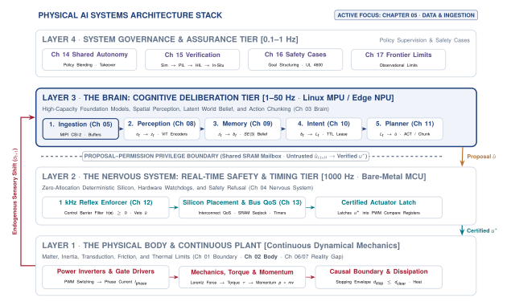
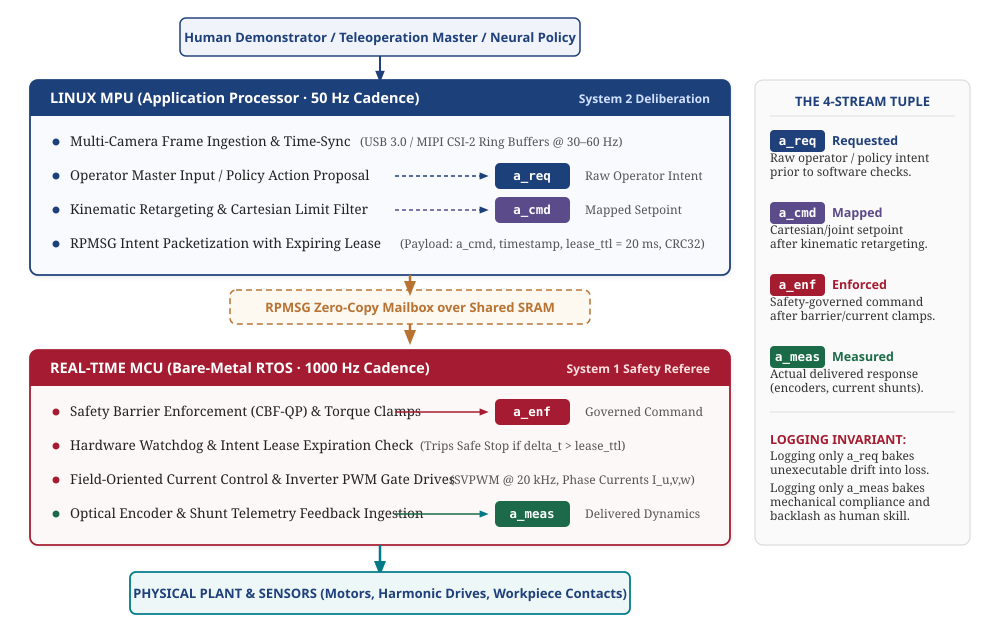
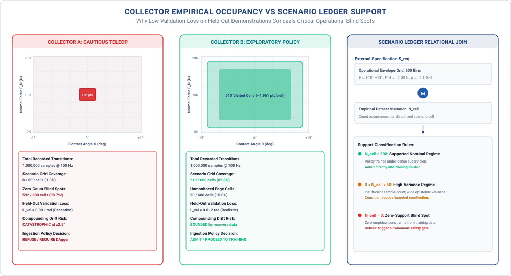
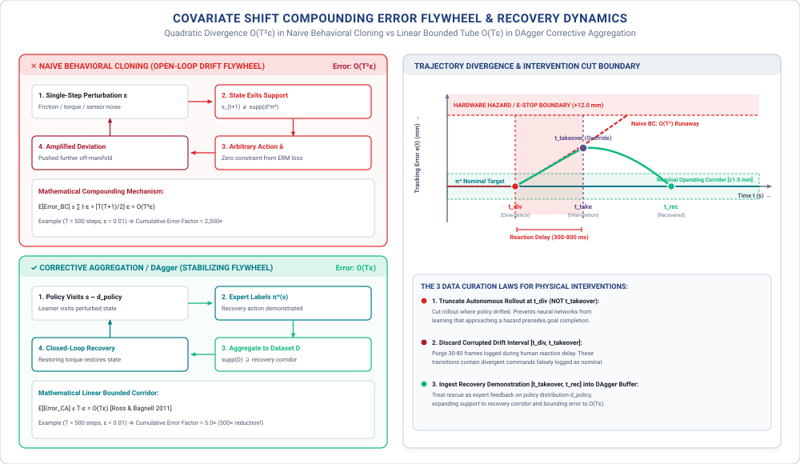
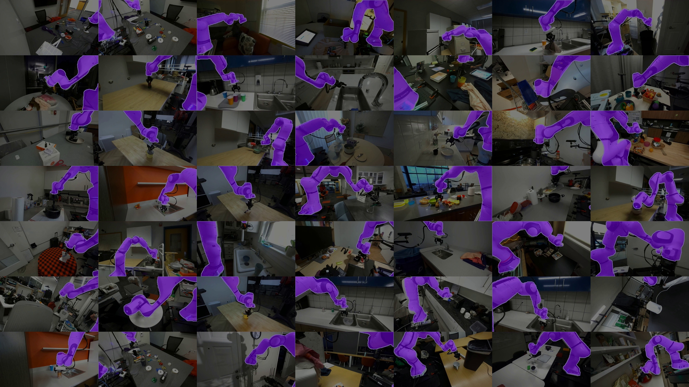

# Physical Data Collection {#sec-data}

::: {.column-margin}

\chapterminitoc

:::

::: {#fig-05-locator fig-env="figure" fig-pos="H" fig-cap="**Demonstration Acquisition Cost Scales with Physical Embodiment**: In the physical AI architecture, data generation feeds the learned Brain organ through physical movement of the Body. Because every recorded transition consumes wall-clock time, manual operator attention, and hardware fatigue life, dataset volume is bounded by physical wear and reset overhead rather than storage capacity." fig-alt="Demonstration Acquisition Cost Scales with Physical Embodiment. In the physical AI architecture, data generation feeds the learned Brain organ through physical movement of the Body. Because every recorded transition consumes wall-clock time, manual operator attention, and hardware fatigue life, dataset volume is bounded by physical wear and reset overhead rather than storage capacity."}
{width="100%"}
:::

*What does the physical machine that collected a dataset leave permanently stamped into the policy that trains on it?*

In digital machine learning, data is a static asset scraped in bulk and curated offline. In physical AI, data is an endogenous trace of physical embodiment coupled to the exact kinematics, sensor latencies, and mechanical backlash of the recording platform. Teleoperated demonstrations capture narrow nominal corridors while omitting recovery dynamics, inducing compounding covariate drift under physical disturbances. Furthermore, data collected on one machine carries an idiosyncratic dynamical signature that cannot transfer unconditionally to another. Building dependable physical AI requires treating demonstration data as an expensive, perishable asset governed by explicit kinematic contracts and synchronous multi-stream telemetry.



::: {.callout-learning-objectives}
After studying this chapter, you will be able to:

1. Account for what one hour of demonstration data actually costs, in wall-clock time, usable trajectory yield, and irreversible mechanical wear.
2. Explain why the collecting policy determines dataset coverage, derive the quadratic compounding error of behavioral cloning ($O(T^2 \epsilon)$) against the linear bound of corrective aggregation ($O(T \epsilon)$), and explain why an episode ending in a rescue must be cut where the policy diverged ($t_{\text{div}}$) rather than where the human intervened ($t_{\text{takeover}}$).
3. Identify which properties of a dataset are bound to the embodiment that produced it, and evaluate the architectural challenges of cross-embodiment datasets such as Open X-Embodiment.
4. Formalize demonstration provenance across the Dual-Brain MPU/MCU boundary, separating requested, mapped, enforced, and measured actions while establishing explicit operational design domain (ODD) support boundaries.

*Core chapter takeaway.* A physical dataset is made by moving a machine, so every sample costs wall-clock time and wear, and the policy that collected it decides what is in it. There is no scraping your way out of this.

:::

## Endogenous Experience {#sec-data-5-1}

<!-- SECTION 5.1 -->
<!-- claim: A physical dataset is made by moving a machine, which makes it expensive, slow, and shaped by whoever collected it. -->
<!-- covers: Open with an analytical $60\text{ min}$ collection session: $8\text{ min}$ of setup, $7\text{ min}$ of calibration, and $15\text{ min}$ of resets leave at most $30\text{ min}$ of motion before quality filtering. -->
<!-- covers: Establish that even automatically logged data was produced by actions that selected which physical states the recorder could observe. -->
<!-- covers: Distinguish scheduled time, motion time, retained episode time, and independent situations so that “one hour” does not conceal the acquisition denominator. -->
<!-- covers: State the chapter’s four deliverables: acquisition cost, collector-induced coverage, embodiment dependence, and an explicit boundary on unsupported use. -->
<!-- covers: Fence simulation and augmentation for @sec-training and policy evaluation for @sec-evaluation. -->
<!-- GROUNDING: number — what one hour of demonstration costs, before any of it is analysed -->

<!-- BEGIN -->
\lettrine{W}{ithin} the physical AI architecture (@fig-05-locator), data acquisition forms the physical substrate feeding the Brain organ, bridging the unyielding mechanics of the Body with the statistical representations of learned policies. In digital machine learning, datasets exist independently of the model: text corpora, image archives, and audio waveforms are scraped, tokenized, and shuffled with zero impact on the physical world. In Physical AI, dataset generation is an endogenous physical process governed by the closed causal loop $s_{t+1} \sim P(s \mid s_t, a_t)$. Every recorded frame, joint angle, and force-torque vector requires commanding electrical currents into motor coils, overcoming frictional stiction, and pushing physical mass through space.

Because every training sample requires physical movement, demonstration data cannot be scaled by scraping or passive logging. A single hour of scheduled facility time on a robotic workcell yields only a fraction of active, usable trajectory records once startup overhead, sensor calibration routines, human fatigue, and physical scene resets are accounted for. Furthermore, because a robot cannot observe an environment without executing actions, the recorded data distribution is strictly closed under the control policy of the collecting agent. If an operator or scripted routine navigates only narrow, collision-free corridors, the dataset remains entirely silent on how to recover from boundary excursions, baking severe compounding drift into downstream imitation policies.

Training dependable physical AI systems requires treating demonstration data as an expensive, perishable physical asset with explicit kinematic contracts and documented operational support boundaries. Characterizing a physical dataset demands accounting for four fundamental systems dimensions:

1. **Physical Acquisition Cost and Fatigue Life:** The true accounting of scheduled facility time, active motion duty cycles, usable episode yield, and mechanical wear on transmissions and actuators.
2. **Collector-Induced Support Manifolds:** The mathematical reality that the collecting policy dictates state-space coverage, creating the quadratic error growth of naive behavioral cloning ($O(T^2 \epsilon)$) and dictating where intervention episodes must be truncated.
3. **Embodiment Idiosyncrasy:** The physical coupling between kinematic geometry, sensor latencies, actuator dynamics, and mass distributions that prevents uncalibrated transfer across different robot platforms.
4. **Boundary Support and Provenance Contracts:** The multi-tier action tap tuple ($(a_{\text{req}}, a_{\text{cmd}}, a_{\text{enf}}, a_{\text{meas}})$) across the MPU/MCU boundary and the explicit operational design domain (ODD) ledger defining where data provides physical support versus where execution must be refused.

The mathematical formulation of training algorithms, simulation environments, and domain randomization belongs to @sec-training, while the statistical methods required to verify whether a policy behaves safely on physical hardware belong to @sec-evaluation. Before a policy can be trained or evaluated, physical records must exist, and every sample in the archive begins with mass moving under power in the real world across mobile systems (burning battery capacity and scrubbing tire treads), articulated manipulators (cycling gearbox teeth and flexing internal harnesses), or process plants (subjecting piping to thermal stresses and valve packing wear).

**Endogenous physical demonstration data** is the empirical sequence of sensory observations and control actions generated by physical movement of an embodied machine ($s_{t+1} \sim P(s \mid s_t, a_t)$). Because every transition requires physical displacement, data volume is strictly bounded by wall-clock facility time, manual reset overhead, and component fatigue life, while state-space coverage is closed under the dynamical authority of the collecting policy.
<!-- END -->
<!-- END -->

## Where Physical Data Comes From {#sec-data-5-2}

<!-- SECTION 5.2 -->
<!-- claim: A physical dataset is not found, logged, or scraped. Somebody moved a machine to make every sample in it. -->
<!-- covers: Classify physical sources by who chooses the action: a colocated demonstrator, a remote operator, a scripted controller, an exploratory policy, or the deployed machine itself. -->
<!-- covers: For each source, identify what is recorded as the action label: human input, command after interface mapping, command after enforcement, or measured physical response. -->
<!-- covers: Show that kinesthetic demonstration, teleoperation, play, and autonomous logging occupy different regions even when they attempt the same contact task. -->
<!-- covers: Separate samples, control steps, episodes, successful episodes, and independent task configurations; multiplying frequency by time produces correlated steps, not equivalent experience. -->
<!-- covers: Compute usable yield from attempt duration, reset duration, failed-log rate, and retention criteria rather than reporting raw recording hours. -->
<!-- covers: Defer simulated trajectories to @sec-training while preserving their physical provenance requirements when they are mixed with measured data. -->
<!-- GROUNDING: number — what one hour of demonstration costs, in time and in wear -->
<!-- DERIVE: Derive each source’s usable episode rate from attempt time, reset time, parallel rigs, and retention rate instead of asserting that abundance is unavailable “at any price.” -->

<!-- BEGIN -->
A physical dataset is not found, logged from passive internet traffic, or assembled from an existing public repository. Every transition tuple in an archive required burning electrical energy, pushing against mechanical friction, and moving physical mass through a coordinate frame. Physical data sources separate according to who chooses the action:

1. In **kinesthetic teaching**, a colocated demonstrator physically grasps and moves the unpowered or gravity-compensated joints of the mechanism.
2. In **teleoperation**, a remote operator guides an input device such as a master arm, a multi-axis space mouse, or a tracked hand controller, transmitting commands across a software interface to the follower robot.[^fn-hw-goertz-teleop]
3. In **scripted collection**, an engineer executes a deterministic control routine, such as a state machine tracking interpolated splines or force-thresholded primitives.
4. In **exploratory collection**, an active policy selects actions to optimize an information-theoretic objective, sample state space, or maximize a reward signal.
5. In **autonomous logging during deployment**, the production policy commands the actuators as it performs work in a factory or warehouse, storing incoming sensor streams in situ.

For each collection source, the engineer must decide which physical or digital variable is recorded as the action label, and that choice alters what the learned model attempts to reproduce. In teleoperation and autonomous systems, data logging taps into multiple layers across the control pipeline (@fig-05-action-taps). On heterogeneous dual-brain platforms, such as a canonical heterogeneous dual-brain System-on-Chip (SoC) bench twin or a bimanual leader-follower teleoperation workstation[^fn-hw-gello-teleop] [@zhao2023learning; @wu2023gello], this pipeline spans two distinct computational domains:

- The unprivileged **Linux Application Processor (MPU)** captures high-bandwidth camera streams (e.g., active stereo RGB-D at $30\text{ Hz}$), ingests master teleoperation inputs or neural policy forward passes, and maps coordinates.
- The real-time **Microcontroller Unit (MCU)** executes at $1000\text{ Hz}$ on bare metal, running low-level PID/impedance control, forward-invariant safety barrier functions, velocity clamping, and motor current limiters over CAN-FD or PWM buses.[^fn-hw-encoder-capture]

::: {#fig-05-action-taps fig-env="figure" fig-pos="t" fig-cap="**The Four-Stream Action Tap Tuple across the Dual-Brain MPU/MCU Boundary**: On a heterogeneous edge architecture, data logging captures four distinct physical semantics: (1) $a_{\text{req}}$ (raw operator or policy intent on the Linux MPU prior to software checks), (2) $a_{\text{cmd}}$ (kinematically retargeted setpoint), (3) $a_{\text{enf}}$ (safety-governed command post-CBF barrier enforcement and motor torque clamping on the real-time MCU), and (4) $a_{\text{meas}}$ (measured plant response via joint optical encoders and current shunts). Logging only $a_{\text{req}}$ bakes unexecutable actuator drift into training loss, while logging only $a_{\text{meas}}$ bakes mechanical compliance, link deflection, and backlash as demonstrated human skill. Source: Architectural design adapted from @zhao2023learning and @wu2023gello." fig-alt="The Four-Stream Action Tap Tuple across the Dual-Brain MPU/MCU Boundary. On a heterogeneous edge architecture, data logging captures four distinct physical semantics: (1) a{\text{req}} (raw operator or policy intent on the Linux MPU prior to software checks), (2) a{\text{cmd}} (kinematically retargeted setpoint), (3) a{\text{enf}} (safety-governed command post-CBF barrier enforcement and motor torque clamping on the real-time MCU), and (4) a{\text{meas}} (measured plant response via joint optical encoders and current shunts). Logging only a{\text{req}} bakes unexecutable actuator drift into training loss, while logging only a{\text{meas}} bakes mechanical compliance, link deflection, and backlash as demonstrated human skill. Source: Architectural design adapted from @zhao2023learning and @wu2023gello."}
{width="100%"}
:::

The four taps along this control path capture fundamentally different physical semantics:

- The **requested action** ($a_{\text{req}}$): the raw input from the operator's tracking device or policy proposal before coordinate transformations or software boundary checks.
- The **mapped command** ($a_{\text{cmd}}$): the Cartesian setpoint or joint target computed after kinematic retargeting and workspace boundary checks.
- The **enforced command** ($a_{\text{enf}}$): the setpoint after real-time safety filters, velocity limits, and barrier functions have clamped the candidate trajectory.
- The **measured response** ($a_{\text{meas}}$): the actual kinematic and kinetic response reported by joint optical encoders and current shunts after mechanical contact and structural deflection have occurred.

If the logging pipeline records $a_{\text{req}}$ prior to software limit enforcement, the dataset contains dynamically infeasible trajectories that command accelerations beyond motor current limits. If it logs $a_{\text{meas}}$ after contact, the recorded label reflects structural compliance and gear backlash rather than commanded intent, turning a feedforward control signal into an observation of material deformation. Logging the full tuple $(a_{\text{req}}, a_{\text{cmd}}, a_{\text{enf}}, a_{\text{meas}})$ across the MPU/MCU boundary is necessary to distinguish operator intent from governor intervention.

::: {.callout-definition title="The Four-Stream Action Tap Tuple"}
The **four-stream action tap tuple** $(a_{\text{req}}, a_{\text{cmd}}, a_{\text{enf}}, a_{\text{meas}})$ is the synchronized multi-tier record logged across the Dual-Brain MPU/MCU boundary that distinguishes raw operator or policy intent ($a_{\text{req}}$), kinematically retargeted setpoints ($a_{\text{cmd}}$), safety-governor clamped commands ($a_{\text{enf}}$), and delivered physical actuator response ($a_{\text{meas}}$), preventing governor interventions or structural compliance from being falsely attributed to demonstrated physical skill.
:::

### Synchronous 4-stream action tap and telemetry ring-buffer protocol

To operationalize the four-stream action tap in hardware without introducing non-deterministic logging jitter or buffer contention, the system executes a synchronized inter-core capture loop:

**Input Interfaces:**

- Raw observation stream $\mathbf{o}_t \in \mathcal{O}$ from the host perception pipeline (active stereo RGB-D at $30\text{ Hz}$, hardware timestamp $t_{\text{exp}}$).
- Raw operator input or policy action candidate $a_{\text{req}}(t) \in \mathcal{A}_{\text{raw}}$ from MPU shared memory ($50\text{ Hz}$).
- Kinematic retargeting and workspace boundary mapping $\mathcal{K}: \mathcal{A}_{\text{raw}} \to \mathcal{A}_{\text{cartesian}}$.
- Forward-invariant Control Barrier Function (CBF) and velocity limiter $\mathcal{B}: \mathcal{X} \times \mathcal{A}_{\text{cartesian}} \to \mathcal{A}_{\text{safe}}$ on the real-time MCU.
- Bare-metal hardware registers for quadrature encoder counts (`TIMx_CNT` / `eQEP`) and phase current shunts (`ADC_DR`).

**Execution Protocol (Periodic $1.0\text{ ms}$ MCU Cycle):**

1. **Perception and Intent Ingestion (Host MPU Domain):**
   Ingest synchronized camera frame $\mathbf{o}_t$ with hardware exposure timestamp $t_{\text{exp}}$, sample raw master input $a_{\text{req}}(t)$, evaluate forward kinematics $a_{\text{cmd}}(t) \leftarrow \mathcal{K}(a_{\text{req}}(t))$, and commit $\langle t_{\text{exp}}, \mathbf{o}_t, a_{\text{req}}, a_{\text{cmd}} \rangle$ to shared memory DMA TX descriptors.

2. **Safety Barrier Evaluation and Actuation (MCU Domain, $1000\text{ Hz}$ ISR):**
   Latch hardware monotonic clock $t_{\text{mono}} \leftarrow \text{ReadTimerRegister}(\text{TIMx\_CNT})$, ingest $a_{\text{cmd}}(t)$ across inter-core SPSC buffers with memory fence (`DMB ISH`), and evaluate dynamic barrier constraints:
   $$a_{\text{enf}}(t) \leftarrow \mathcal{B}(\mathbf{x}_{\text{current}}, a_{\text{cmd}}(t)).$$
   If $a_{\text{enf}}(t) \neq a_{\text{cmd}}(t)$, assert governor intervention flag $b_{\text{clamped}} \leftarrow \text{true}$ with clamp code $\kappa$, and dispatch $a_{\text{enf}}(t)$ to motor PWM registers (`ePWM CMPA`) over the fieldbus.

3. **Physical Response Capture and Commit:**
   Sample optical joint encoders and phase current shunts at PWM reload ($a_{\text{meas}}(t) \leftarrow \text{ReadPlantSensors}()$), compute tracking discrepancy $\delta_{\text{track}} \leftarrow \|a_{\text{enf}}(t) - a_{\text{meas}}(t)\|_2$, assemble synchronous telemetry packet $\mathcal{P}_t = \langle t_{\text{mono}}, \mathbf{o}_t, a_{\text{req}}, a_{\text{cmd}}, a_{\text{enf}}, a_{\text{meas}}, \mathbf{h}_{\text{plant}}, [b_{\text{clamped}}, \kappa, \delta_{\text{track}}] \rangle$, and commit $\mathcal{P}_t$ into a lock-free DMA circular ring buffer for non-blocking asynchronous persistence.

Because the collecting entity dictates how the machine approaches the environment, kinesthetic teaching, teleoperation, unguided play, and autonomous logging occupy disjoint state-action manifolds even when attempting the exact same physical contact task. Consider inserting a cylindrical steel pin into a chamfered hole with a clearance of $50\text{ }\mu\text{m}$. A colocated human guiding the tool directly senses contact reaction forces through their hands and makes instantaneous, fine-grained compliance adjustments at their own wrist joints. A remote teleoperator watching a two-dimensional video feed lacks direct haptic feedback, creating visual latency delays, command overshoot, and characteristic hunting motions as the operator pecks at the contact boundary. A scripted controller follows a programmed helical search pattern at constant linear velocity, generating a dense geometric spiral with predictable force spikes against the chamfer face. Autonomous logging from an exploratory or partially trained policy wanders across off-target regions, repeatedly binding the pin at oblique angles until motor current thresholds trigger a software fault. These logs do not constitute noisy samples of a single underlying trajectory. They represent outputs from distinct dynamical systems operating under different closed-loop bandwidths, latency profiles, and mechanical compliances.

A common accounting error in physical machine learning is treating every recorded control step as an independent unit of experience. When a joint controller logs state-action pairs at $50\text{ Hz}$, one hour of continuous recording produces $180{,}000\text{ steps}$. Multiplying sample frequency by recording time yields large step counts, but adjacent steps exhibit extreme temporal autocorrelation. Two camera frames logged $20\text{ ms}$ apart differ by sub-millimeter end-effector displacements and minor sensor noise. Distributional coverage scales with the count of independent task episodes and distinct physical configurations, not with the sampling clock. An archive containing $100{,}000\text{ steps}$ distributed across five hundred distinct workpiece positions and lighting conditions provides vastly broader support than $1{,}000{,}000\text{ steps}$ logged during a single continuous demonstration where the end-effector engaged a workpiece at a single bench location.

Evaluating the throughput of a physical collection campaign requires calculating the usable episode yield from the mechanical and operational parameters of the workcell. Consider an analytical example of an articulated manipulator collecting contact demonstrations for a precision assembly task. Let an attempt require an average duration $t_{\text{att}} = 20\text{ s}$. After each attempt, the cell must return to a valid initial state, requiring the manipulator to transit home and an automated fixture to reset the workpiece, adding a reset duration $t_{\text{rst}} = 15\text{ s}$. The total cycle time for a single attempt is $t_{\text{cyc}} = t_{\text{att}} + t_{\text{rst}} = 35\text{ s}$. In one wall-clock hour ($3600\text{ s}$), a single rig completes at most $102\text{ attempts}$. Physical collection suffers from trial failures where workpieces slip, parts jam, or safety watchdogs trip on excessive contact force. If the trial failure rate is $25\%$, and post-collection validation rejects an additional $10\%$ of logs due to camera occlusion or dropped network packets, the retention rate is:
$$R = (1 - 0.25) \times (1 - 0.10) = 0.675.$$
The usable episode yield for a single rig is:
$$Y_{\text{usable}} = \left\lfloor\frac{3600\text{ s}}{t_{\text{cyc}}}\right\rfloor \times R = 102 \times 0.675 \approx 68.8\text{ usable episodes per hour}.$$

If training a policy requires $5000\text{ validated episodes}$ to achieve target success rates across geometric variations, collecting that data on one workstation requires $72.7\text{ hours}$ of active execution time. Across those $72.7\text{ hours}$, the machine executes $7415\text{ physical cycles}$, subjecting gearbox teeth to repeated directional reversals, stressing flex cables inside articulated joints through thousands of bends, and accumulating thermal load in motor windings under sustained stall currents. Operating three parallel collection rigs increases the throughput to approximately $206.4\text{ usable episodes per hour}$ and compresses calendar time to $24.2\text{ hours}$, but it scales hardware wear and maintenance linearly across three sets of mechanical transmissions and sensors.

Simulated trajectories generated in rigid-body physics engines avoid direct hardware wear and can generate millions of transitions per hour across distributed compute clusters. The mechanics, approximations, and domain transfer boundaries of simulated data are treated in @sec-training. When synthetic trajectories are combined with physical logs, the physical provenance of every record must be tracked explicitly. A model trained on an undifferentiated mixture inherits the contact unfaithfulness of the physics engine wherever synthetic data dominates, while inheriting the unmodeled sensor noise and mechanical backlash of the hardware wherever physical data dominates. Without tracking the collecting agent and the recording tap point for each sample, an engineer cannot determine whether an on-robot failure stems from simulation error or from physical collection bias. Human teleoperation remains the standard technique for gathering high-quality physical trajectories,[^fn-hw-goertz-teleop] yet the interface between the human and the machine shapes the recorded dynamics long before the data reaches a model.
<!-- END -->
<!-- END -->

## Teleoperation and What It Costs {#sec-data-5-3}

<!-- SECTION 5.3 -->
<!-- claim: A human puppeting a machine is the dominant source of physical training data, and the interface shapes the data more than anyone admits. -->
<!-- covers: Trace the teleoperation loop from the operator’s displayed observation through input device, interface mapping, command path, machine response, and returned observation. -->
<!-- covers: Account separately for display latency, operator response time, command transport, and machine response because each changes the demonstrated correction. -->
<!-- covers: Compare two interfaces on the same touch task and show how limited axes, rate controls, or missing force feedback suppress actions that are difficult to express. -->
<!-- covers: Record the operator’s requested action, the mapped command, the enforced command, and the measured response as different quantities rather than treating them as one label. -->
<!-- covers: Derive usable minutes from setup, calibration, resets, pauses, invalid episodes, and quality review for a declared $60\text{ min}$ session. -->
<!-- covers: Express wear as attempts multiplied by mechanism cycles divided by the component’s rated service life; do not infer damage from elapsed time alone. -->
<!-- GROUNDING: mechanism — the operator, the interface, and the latency between them -->
<!-- FIGURE: SHOW the same contact task collected through two interfaces producing different reachable command sets and different occupied regions of state-action space. -->
<!-- DERIVE: Derive the usable-hour and service-life budgets; the claim that teleoperation is dominant is domain-dependent and requires scoped evidence or removal. -->

<!-- BEGIN -->
Human teleoperation closes a feedback loop that spans the operator, the input device, the communication bus, the low-level motor controller, and the physical environment (@fig-05-teleop-rig). In a typical teleoperation workstation, an image sensor captures the workspace, encodes the video stream, and transmits the frames across a network to a display console. The human operator perceives the visual feedback, decides on a corrective trajectory, and applies physical displacement to an input device. The workstation samples the device state, maps the spatial displacement into joint or end-effector coordinates, and transmits the resulting setpoint across an industrial bus to the robot's motor drives. The actuators generate torque, accelerating the mechanical linkages against inertia, joint friction, and contact constraints. The resulting displacement alters the physical scene, producing new optical signals that the image sensor records on the next cycle.

::: {#fig-05-teleop-rig fig-env="figure" fig-pos="t" fig-cap="**Kinematically Isomorphic Leader-Follower Teleoperation Architecture across Heterogeneous Manipulators**: Demonstration acquisition on physical robot platforms using low-cost, kinematically isomorphic leader controllers (canonical architecture [@wu2023gello]). (A) Bimanual teleoperation setup with twin 6-DoF leader arms mapped directly to dual heavy-payload follower manipulators during a compliant liquid-pouring task. (B) Single-arm leader-follower configuration controlling a torque-controlled manipulator with an overhead task camera. (C) Precision pick-and-place manipulation with passive gravity compensation and joint-angle direct drive. Because the leader device mirrors follower kinematics without requiring numerical inverse kinematics (IK), the interface eliminates IK singularities while preserving the operator's direct joint-level coordination. However, human reaction latency ($200\text{--}300\text{ ms}$) and communication delays still introduce phase lag into the recorded $(s_t, a_t)$ demonstration tuples. Source: Adapted from Wu et al. [@wu2023gello], CC BY 4.0." fig-alt="Kinematically Isomorphic Leader-Follower Teleoperation Architecture across Heterogeneous Manipulators. Demonstration acquisition on physical robot platforms using low-cost, kinematically isomorphic leader controllers (canonical architecture [@wu2023gello]). (A) Bimanual teleoperation setup with twin 6-DoF leader arms mapped directly to dual heavy-payload follower manipulators during a compliant liquid-pouring task. (B) Single-arm leader-follower configuration controlling a torque-controlled manipulator with an overhead task camera. (C) Precision pick-and-place manipulation with passive gravity compensation and joint-angle direct drive. Because the leader device mirrors follower kinematics without requiring numerical inverse kinematics (IK), the interface eliminates IK singularities while preserving the operator's direct joint-level coordination. However, human reaction latency (200\text{--}300\text{ ms}) and communication delays still introduce phase lag into the recorded (st, at) demonstration tuples. Source: Adapted from Wu et al. [@wu2023gello], CC BY 4.0."}
{width="95%"}
:::

Every stage in this loop introduces latency that alters the timing of the demonstrated correction. In an analytical reference setup with a high-speed camera and a wired local network, display processing requires $t_{\text{disp}} = 50\text{ ms}$ across exposure, H.264 decoding, and monitor refresh. Human visual perception and neuromuscular transmission introduce an operator response latency of $t_{\text{hum}} = 200\text{ ms}$ for continuous path corrections. Command quantization, packetization, and bus transport to the robot controller add $t_{\text{cmd}} = 10\text{ ms}$. Actuator torque ramp-up and structural inertia impose a mechanical response latency of $t_{\text{mech}} = 80\text{ ms}$ before the robot achieves the commanded acceleration. The total round-trip latency is:
$$t_{\text{loop}} = t_{\text{disp}} + t_{\text{hum}} + t_{\text{cmd}} + t_{\text{mech}} = 50\text{ ms} + 200\text{ ms} + 10\text{ ms} + 80\text{ ms} = 340\text{ ms}.$$

When a contact misalignment occurs at time $t$, the operator sees the error at $t + 50\text{ ms}$, issues a motor command at $t + 250\text{ ms}$, and the arm exerts corrective force against the workpiece at $t + 340\text{ ms}$. During those $340\text{ ms}$, the physical system continues moving under momentum and external contact forces. If the data logger records the current sensor observation $s_t$ alongside the human command $a_t$ issued at that same clock instant, the recorded demonstration pairs a physical state with an action chosen in response to a state that existed $250\text{ ms}$ in the past. This temporal misalignment bakes an unmodeled phase lag directly into the training targets, producing policies that over-correct or oscillate when deployed autonomously at $50\text{--}100\text{ Hz}$.

**Teleoperation round-trip latency** ($t_{\text{loop}} = t_{\text{disp}} + t_{\text{hum}} + t_{\text{cmd}} + t_{\text{mech}}$) is the total elapsed time between a physical contact event and the delivered corrective actuator response, embedding biological reaction delays ($200\text{--}300\text{ ms}$) as artificial phase lag in demonstration timestamps. **Demonstration yield** ($Y_{\text{usable}} = \lfloor T_{\text{active}} / t_{\text{cyc}} \rfloor \cdot R$) is the fraction of scheduled facility time that converts into validated, defect-free trajectory records after deducting startup, calibration, operator rest, physical resets, and quality filtering losses.

::: {.callout-important title="Ingestion Bandwidth and Storage Budgets for Multi-Camera Teleoperation"}
**Question:** What is the sustained data ingestion rate, NVMe storage bandwidth, and daily storage consumption for a bimanual leader-follower teleoperation rig capturing multi-modal demonstration data for physical imitation learning?

**Parameters:**

- **Perception:** 4 active stereo RGB-D cameras (2 static eye-to-hand environment cameras + 2 wrist eye-in-hand cameras):
  - RGB streams: $1920 \times 1080\text{ px}$ at $30\text{ Hz}$, $24\text{ bits/px}$ ($3\text{ bytes/px}$).
  - Depth streams: $1280 \times 720\text{ px}$ at $30\text{ Hz}$, $16\text{ bits/px}$ (raw `uint16` depth in millimeters, $2\text{ bytes/px}$).
- **Kinematics & Dynamics:** 2 leader arms + 2 follower arms (14-DoF total):
  - Joint positions $\mathbf{q}$, velocities $\dot{\mathbf{q}}$, commanded torques $\boldsymbol{\tau}_{\text{cmd}}$, measured torques $\boldsymbol{\tau}_{\text{meas}}$, and 4-stream action tuples logged at $1000\text{ Hz}$ ($128\text{ bytes/step}$).
- **Tactile & Haptics:** 2 dual-finger fingertip tactile sensor arrays ($16 \times 16$ pressure taxels $\times 2\text{ bytes} \times 4\text{ pads} = 2048\text{ bytes/step}$) logged at $100\text{ Hz}$.

**Calculation:**

1. **Raw Video Bandwidth:**
   $$\text{BW}_{\text{RGB}} = 4 \times (1920 \times 1080 \times 3\text{ bytes}) \times 30\text{ s}^{-1} = 4 \times 6.2208\text{ MB} \times 30 = 746.50\text{ MB/s}.$$
   $$\text{BW}_{\text{Depth}} = 4 \times (1280 \times 720 \times 2\text{ bytes}) \times 30\text{ s}^{-1} = 4 \times 1.8432\text{ MB} \times 30 = 221.18\text{ MB/s}.$$
   $$\text{BW}_{\text{Vision, total}} = 746.50\text{ MB/s} + 221.18\text{ MB/s} = 967.68\text{ MB/s} \approx 0.968\text{ GB/s}.$$

2. **Kinematic and Tactile Bandwidth:**
   $$\text{BW}_{\text{Kinematics}} = 128\text{ bytes} \times 1000\text{ s}^{-1} = 0.128\text{ MB/s}.$$
   $$\text{BW}_{\text{Tactile}} = 2048\text{ bytes} \times 100\text{ s}^{-1} = 0.205\text{ MB/s}.$$

3. **Total Sustained Ingestion Rate:**
   $$\text{BW}_{\text{total}} = 967.68 + 0.13 + 0.21 = 968.02\text{ MB/s} \approx 0.968\text{ GB/s}.$$

4. **Hourly and Shift Storage Consumption:**
   $$\text{Storage}_{\text{1 hour}} = 968.02\text{ MB/s} \times 3600\text{ s} = 3{,}484{,}872\text{ MB} \approx 3.48\text{ TB/hr} \text{ (raw uncompressed)}.$$
   When recording at a standard $1280 \times 720$ RGB target ($331.8\text{ MB/s}$) alongside depth ($221.2\text{ MB/s}$) with synchronous 4-stream metadata, sustained ingestion requires **$740\text{ MB/s}$**, accumulating exactly **$2.66\text{ TB/hr}$** of uncompressed telemetry.
   Across an 8-hour collection shift with 5 parallel workstations, the raw telemetry ingestion generates:
   $$\text{Storage}_{\text{shift}} = 5 \times (2.66\text{ TB/hr} \times 8\text{ hr}) = 106.4\text{ TB per shift}.$$

**Systems Significance:**
A high-capacity data acquisition workstation cannot log uncompressed multi-view streams over standard USB 3.0 buses (capped at $400\text{ MB/s}$ real-world throughput) or write to SATA SSDs (capped at $550\text{ MB/s}$). Ingesting $740\text{ MB/s}$ to $968\text{ MB/s}$ requires dedicated PCIe Gen4 NVMe storage (capable of $>5000\text{ MB/s}$ sequential writes) or hardware-accelerated NVENC video compression (H.265 intra-frame at CRF 18, compressing streams $8\times$ to $\approx 92.5\text{ MB/s}$ / $333\text{ GB/hr}$) to prevent OS buffer overruns and silent frame drops.
:::

In **bilateral teleoperation**, where contact forces measured at the follower arm are reflected back as haptic torques to the leader arm, transport delay creates a severe stability hazard. Consider the net energy exchanged across the communication channel over time horizon $t$:
$$\Delta E_{\text{channel}}(t) = \int_0^t \left( f_{\text{master}}(\sigma) \dot{x}_{\text{master}}(\sigma) - f_{\text{follower}}(\sigma) \dot{x}_{\text{follower}}(\sigma) \right) d\sigma.$$
In an ideal, zero-latency system, $\Delta E_{\text{channel}} = 0$, satisfying the passivity condition $\Delta E \le 0$ (meaning the communication channel acts as a passive transmission line that cannot generate energy). When transport delay $\tau(t) > 0$ varies dynamically across the network, the delayed force reflection acts out-of-phase with operator hand velocity. The interface behaves like a delayed spring: when the operator pushes into contact and begins to retract, the delayed reaction force arrives late, pushing the operator's hand in the direction of motion. The product $f_{\text{master}} \cdot \dot{x}_{\text{master}}$ does positive mechanical work, injecting virtual energy ($\Delta E > 0$) into the feedback loop.[^fn-math-passivity-teleop] This non-passive energy drives high-frequency mechanical limit cycles, causing the master and follower arms to chatter violently against rigid contact fixtures. Stabilizing the rig requires Time-Domain Passivity Controllers (TDPC) or wave-variable transformations, which inject virtual damping into the teleoperation link. While passivity controllers prevent hardware damage, the added damping acts as a low-pass filter on operator hand motions, attenuating high-frequency contact cues and suppressing subtle tactile feedback.

::: {#pri-teleoperation-passivity .callout-principle title="Bilateral Teleoperation Passivity Condition"}
In bilateral teleoperation with force reflection, variable network latency $\tau(t)$ injects virtual energy ($\Delta E > 0$) into the operator interface. To prevent contact instability and mechanical limit cycles, the real-time nervous system must enforce the passivity condition $\int_0^t (f_{\text{master}}\dot{x}_{\text{master}} - f_{\text{follower}}\dot{x}_{\text{follower}}) \, d\tau \le 0$ via Time-Domain Passivity Observers (TDPO).
:::

The physical interface through which the operator delivers commands acts as a hardware filter on the demonstration data. Consider an assembly task requiring the insertion of a metal peg into a tight clearance fixture. When collected using a direct kinesthetic leader arm with six degrees of freedom and bilateral force feedback, the operator feels the contact forces transmitted from the follower arm and adjusts insertion angles smoothly at velocities exceeding $0.15\text{ m/s}$. When the same task is teleoperated using a rate-controlled six-axis mouse or planar joystick with visual-only feedback, the operator has no physical sensation of contact force or mechanical binding. To avoid generating excessive torques that trigger hardware safety cutoffs, the operator switches to an open-loop step-and-wait strategy, advancing the tool in small increments of $1.0\text{ mm}$, pausing to inspect the video feed for part deflection, and then commanding another step. The two interfaces produce fundamentally different datasets for the exact same physical task. The kinesthetic leader arm populates the state-action space with continuous velocity profiles and high-frequency force adaptations during contact. The rate-controlled interface records a dataset characterized by low average velocities, prolonged periods of zero motion while the operator inspects the visual feed, and an absence of corrective torques during the insertion phase. A policy trained by imitation on the rate-controlled dataset learns this stop-and-go behavior and stalls whenever visual latency prevents it from confirming contact. The demonstration dataset captures the narrow operational envelope permitted by the human interface rather than the physical capability of the mechanical body. As categorized in @tbl-05-teleop-taxonomy, the teleoperation interface class fundamentally governs control bandwidth, round-trip transport latency, operator fatigue limits, and the resulting dynamical artifacts embedded in the recorded demonstration corpus.

| Interface Paradigm & Hardware Class                                                                                                            | Kinematic & Control Mapping                                                                                                                    | Round-Trip Latency ($\tau_{\text{loop}}$)                                         | Haptic / Force Feedback Fidelity                                               | Effective Control Bandwidth ($f_{\text{ctrl}}$)                                            | Operator Fatigue Limit ($T_{\text{fatigue}}$)                                              | Characteristic Demonstration Artifacts & Policy Bias                                                                                                              |
|:-----------------------------------------------------------------------------------------------------------------------------------------------|:-----------------------------------------------------------------------------------------------------------------------------------------------|:----------------------------------------------------------------------------------|:-------------------------------------------------------------------------------|:-------------------------------------------------------------------------------------------|:-------------------------------------------------------------------------------------------|:------------------------------------------------------------------------------------------------------------------------------------------------------------------|
| **Bilateral Kinesthetic Leader Arm** (1:1 Active Replica Puppet, e.g., canonical dual-arm bimanual teleoperation workcell [@zhao2023learning]) | Direct joint-to-joint position copying ($q_{\text{master}} \mapsto q_{\text{follower}}$) with active gravity compensation                      | $15\text{ to }35\text{ ms}$ (Direct bus / EtherCAT / CANopen)                     | High bilateral force reflection; senses contact stiffness and binding directly | $500\text{ to }1000\text{ Hz}$ telemetry ($5\text{ to }10\text{ Hz}$ human neuromuscular)  | $45\text{ to }60\text{ min}$ (Arm tremor $>2.0\text{ mm}$ after prolonged holding)         | Continuous velocity profiles ($>0.15\text{ m/s}$); fluid compliance; operator motor tremors recorded in joint velocity derivatives                                |
| **6-DoF 3D Spacemouse** (Isometric Elastic Puck)                                                                                               | Elastic force/torque to Cartesian velocity setpoint ($\dot{\mathbf{x}}_{\text{cmd}} = \mathbf{K}_v \mathbf{f}_{\text{mouse}}$); resolved by IK | $60\text{ to }120\text{ ms}$ (USB HID polling + host IK solver + motor ramp)      | Zero force reflection; visual-only estimation of workpiece contact loads       | $50\text{ to }100\text{ Hz}$ Cartesian rate ($<2\text{ Hz}$ human correction rate)         | $90\text{ to }120\text{ min}$ (Low physical effort, desk-supported wrist rest)             | Step-and-wait hunting motions; low average velocity ($<0.03\text{ m/s}$); prolonged zero-motion pauses during visual verification; absent reactive contact forces |
| **Optical / VR 6-DoF Spatial Controller** (Tracked Wand / Spatial Poses)                                                                       | Absolute Cartesian pose tracking ($\mathbf{T}_{\text{hand}} \in SE(3)$) with clutching and workspace scale                                     | $80\text{ to }180\text{ ms}$ (Optical exposure + SLAM pose solve + wireless link) | Low (Vibrotactile ERM/LRA pulses only); no directional force reflection        | $60\text{ to }120\text{ Hz}$ spatial pose ($\sigma_{\text{jitter}} \approx 0.8\text{ mm}$) | $30\text{ to }45\text{ min}$ ("Gorilla arm" shoulder fatigue from ungrounded holding)      | Over-correction oscillations from visual-motor phase lag; clutching discontinuities; out-of-plane drift; exaggerated retraction motions upon visual contact       |
| **Direct Instrumented Exoskeleton** (Wearable Master Glove / Arm Linkage)                                                                      | High-DoF joint-angle mapping with kinematic retargeting to multi-finger hand                                                                   | $25\text{ to }60\text{ ms}$ (Wearable bus + retargeting solver + low-level drive) | Moderate-to-high active tendon force feedback on individual finger linkages    | $200\text{ to }500\text{ Hz}$ joint state ($7\text{ to }12\text{ Hz}$ finger dexterity)    | $20\text{ to }35\text{ min}$ (Mechanical weight burden, pressure points, harness sweating) | Biomechanical calibration mismatch; non-linear retargeting artifacts; rich contact force profiles during multi-point precision grasps                             |
: **Teleoperation Master-Follower Interface Taxonomy for Physical Demonstration Collection**: Comparison of input interface paradigms across kinematic mapping, transport latency, haptic fidelity, control bandwidth, operator fatigue limits, and characteristic demonstration artifacts. The choice of teleoperation hardware acts as a mechanical and dynamical filter on the recorded state-action distribution. {#tbl-05-teleop-taxonomy}

Treating the recorded stream as a single sequence of states and actions obscures the signal transformations that occur between human intent and mechanical motion. A physical logging pipeline must record four distinct quantities at each time step:

1. $a_{\text{req}}$: the operator requested action from the master input device.
2. $a_{\text{cmd}}$: the mapped setpoint produced after inverse kinematics and workspace checks on the Linux MPU.
3. $a_{\text{enf}}$: the enforced command emitted by the real-time MCU safety layer after velocity limits, current clamps, and barrier functions have evaluated.
4. $a_{\text{meas}}$: the measured physical response from joint encoders and current sensors.

Logging only one of these quantities corrupts the training signal. If an operator commands an excessive velocity toward a joint limit and the low-level controller clamps the setpoint, recording $a_{\text{req}}$ teaches the policy to demand unsafe, unexecutable motions that violate hardware boundaries. If the logger records $a_{\text{enf}}$ or $a_{\text{meas}}$ while discarding $a_{\text{req}}$, the recorded state-action pairs attribute the safety filter's intervention to the human demonstration, teaching the model that a gentle stop was the operator's deliberate choice rather than the result of an automated emergency clamp. Preserving the full chain from $a_{\text{req}}$ through $a_{\text{meas}}$ enables an engineer to isolate whether an execution failure during deployment stems from policy prediction error, kinematic retargeting artifacts, safety interventions, or mechanical tracking error.

A nominal hour of scheduled teleoperation yields only a fraction of that time in usable training data. In an analytical baseline for a $T_{\text{sched}} = 60.0\text{ min}$ ($3600\text{ s}$) collection shift, initial cell initialization, bus synchronization, and safety watchdog checks consume $t_{\text{setup}} = 8.0\text{ min}$ ($480\text{ s}$). Optical sensor calibration, multi-camera extrinsic sweeps, and 6-axis force-torque sensor gravity nulling require $t_{\text{calib}} = 7.0\text{ min}$ ($420\text{ s}$). Ergonomic fatigue limits human operator concentration, requiring mandatory rest breaks totaling $t_{\text{rest}} = 10.0\text{ min}$ ($600\text{ s}$) per hour to prevent motor tremor drift. The remaining active motion window is $T_{\text{motion}} = 60.0 - 8.0 - 7.0 - 10.0 = 35.0\text{ min}$ ($2100\text{ s}$). Within this active window, each manipulation attempt requires an average execution time of $t_{\text{att}} = 25.0\text{ s}$, followed by a reset phase of $t_{\text{rst}} = 15.0\text{ s}$ to return the robot to its home configuration and reset the physical workpiece fixture. The total cycle time per attempt is $t_{\text{cyc}} = t_{\text{att}} + t_{\text{rst}} = 40.0\text{ s}$, yielding at most $N_{\text{att}} = \lfloor 2100\text{ s} / 40.0\text{ s} \rfloor = 52\text{ attempts}$ per session. This represents $52 \times 25.0\text{ s} = 1300\text{ s}$ ($21.67\text{ min}$, or $36.1\%$ of the hour) of gross attempt motion and $52 \times 15.0\text{ s} = 780\text{ s}$ ($13.0\text{ min}$, or $21.7\%$) of physical reset time. Human teleoperation is subject to operational errors, including dropped objects, jamming, and accidental contact limit violations. Assuming an in-trial failure rate of $20\%$, $41.6\text{ attempts}$ complete successfully. Post-collection quality review removes an additional $15\%$ of completed trials due to operator hesitation, visual occlusions, or borderline task success metrics. The net retention rate across all collection stages is $R = (1 - 0.20) \times (1 - 0.15) = 0.68$, resulting in $N_{\text{usable}} = 52 \times 0.68 \approx 35.36\text{ usable episodes}$. At $25.0\text{ s}$ of demonstration trajectory per episode, $35.36\text{ episodes}$ produce $884\text{ s}$, or approximately $14.73\text{ min}$ of usable demonstration time per scheduled hour ($24.6\%$ net yield). A dataset target of $5000\text{ validated episodes}$ requires $5000 / 35.36 \approx 141.4\text{ scheduled operator hours}$, scaling labor requirements and collection schedules by a factor of $4.07$ relative to the raw $34.7\text{ h}$ of retained trajectory duration.

::: {#pri-facility-to-yield .callout-principle title="The 4-to-1 Facility-to-Yield Ratio"}
Never budget physical demonstration campaigns by scheduled facility hours. Due to sensor calibration, workpiece re-fixturing, operator ergonomics, and post-collection QA filtering, one hour of scheduled robot cell time yields at most 15 minutes of validated, defect-free trajectory data (a $4:1$ overhead factor).
:::

Hardware degradation during collection depends on the accumulation of physical cycles and directional stress reversals rather than elapsed wall-clock time. Consider the wrist joint of an articulated arm equipped with a strain-wave harmonic drive and internal routing flex cables. In an analytical wear model, the harmonic gear transmission carries a rated fatigue life of $L_{\text{gear}} = 5{,}000{,}000\text{ stress cycles}$ under rated output torque, and the internal cable bundle is rated for $L_{\text{cable}} = 200{,}000\text{ bending cycles}$. During the $25.0\text{ s}$ execution of a peg-insertion attempt, contact alignment and search motions introduce an average of $n_{\text{gear}} = 14\text{ torque reversals}$ and $n_{\text{cable}} = 6\text{ joint flex cycles}$. Resetting the rig adds an additional $2\text{ full flex cycles}$ during the return stroke. To collect $5000\text{ validated episodes}$ at a net retention rate of $R = 0.68$, the hardware must execute $N_{\text{total}} = 5000 / 0.68 \approx 7353\text{ physical attempts}$. Across these $7353\text{ attempts}$, the wrist transmission sustains $7353 \times 14 = 102{,}942\text{ stress cycles}$, consuming $2.1\%$ of its rated fatigue life. Concurrently, the internal cable bundle undergoes $7353 \times (6 + 2) = 58{,}824\text{ bending cycles}$, consuming $58{,}824 / 200{,}000 = 29.4\%$ of its total service life on a single dataset collection campaign. If three collection campaigns run sequentially on the same rig without component replacement, the flex cable reaches $88.2\%$ of its fatigue limit, where conductor strand breakage and intermittent signal loss begin to corrupt sensor streams. The mechanical wear budget must be computed directly from cycle counts and load reversals to schedule component replacement before hardware failure invalidates collection sessions. The operational time breakdown and mechanical wear budget across a declared $60\text{ min}$ teleoperation session are synthesized in @tbl-05-collection-budget.

| Session Stage / Activity         | Allocated Duration ($\Delta t$)         | Wall-Clock Share (\%) | Physical Operation & Control State                                                                          | Hardware Stress & Wear Mechanism                                                                                                              | Net Trajectory Output ($N_{\text{episodes}}$ / $T_{\text{yield}}$) |
|:---------------------------------|:----------------------------------------|:----------------------|:------------------------------------------------------------------------------------------------------------|:----------------------------------------------------------------------------------------------------------------------------------------------|:-------------------------------------------------------------------|
| **Cell Startup & Bus Sync**      | $8.0\text{ min}$ ($480\text{ s}$)       | $13.3\%$              | Bus synchronization (EtherCAT/CANopen), safety watchdog verification, optical homing                        | Power-on electrical inrush; thermal warm-up in motor windings and sensor bridges                                                              | $N = 0\text{ ep}$, $0.0\text{ min}$ yield                          |
| **Sensor Calibration & Nulling** | $7.0\text{ min}$ ($420\text{ s}$)       | $11.7\%$              | Camera intrinsic/extrinsic sweep, 6-axis F/T gravity bias nulling, tactile matrix zeroing                   | Static holding torque; sensor bridge thermal stabilization; zero dynamic gear wear                                                            | $N = 0\text{ ep}$, $0.0\text{ min}$ yield                          |
| **Operator Rest & Ergonomics**   | $10.0\text{ min}$ ($600\text{ s}$)      | $16.7\%$              | Mandatory operator breaks to mitigate visual fatigue, cognitive saturation, and tremor drift                | Passive standby; electromagnetic brakes engaged or zero-velocity holding current                                                              | $N = 0\text{ ep}$, $0.0\text{ min}$ yield                          |
| **Physical Scene Resets**        | $13.0\text{ min}$ ($780\text{ s}$)      | $21.7\%$              | Part unclamping, receptacle clearing, peg re-fixturing, manipulator return stroke ($15.0\text{ s/attempt}$) | $52\text{ return strokes} \times 2\text{ bends} = 104\text{ cable flex cycles}$; zero contact payload                                         | $N = 0\text{ ep}$, $0.0\text{ min}$ yield                          |
| **Active Teleoperated Attempts** | $22.0\text{ min}$ ($1320\text{ s}$)     | $36.6\%$              | Real-time human teleoperation guiding peg approach, chamfer search, and insertion ($25.0\text{ s/attempt}$) | $52 \times 14 = 728\text{ torque reversals}$ on harmonic drive; $52 \times 6 = 312\text{ cable flex cycles}$; contact loads $\le 15\text{ N}$ | $N = 52\text{ raw attempts}$, $21.67\text{ min}$ gross motion      |
| **In-Trial Failures (Rejected)** | $-4.33\text{ min}$ ($-260\text{ s}$)    | $-7.2\%$              | Part slippage, jamming, watchdog force trip ($F_N > 15.0\text{ N}$), dropped pegs ($20\%$ loss)             | High-force contact transients; abrasive wear on gripper silicone pads                                                                         | $-10.4\text{ ep}$ discarded                                        |
| **Post-Collection QA Filtering** | $-2.60\text{ min}$ ($-156\text{ s}$)    | $-4.3\%$              | Offline filtering: link latency $>100\text{ ms}$, visual occlusion, operator hesitation ($15\%$ loss)       | Zero hardware wear (offline computational validation pass)                                                                                    | $-6.24\text{ ep}$ discarded                                        |
| **Net Validated Dataset Yield**  | **$14.73\text{ min}$** ($884\text{ s}$) | **$24.6\%$**          | High-quality synchronized multi-modal trajectories ($s_t, a_t$) admitted into training buffer               | Consumes $2.1\%$ of wrist gear life and $29.4\%$ of internal flex cable life per $5000\text{ episode}$ campaign                               | **$N_{\text{usable}} = 35.36$** episodes                           |
: **Physical Demonstration Collection Budget Breakdown across a Scheduled 60-Minute Session**: Partitioning of facility clock time, active motion yield, quality filtering losses, and mechanical component fatigue across collection stages for a precision peg-in-hole assembly workcell ($T_{\text{sched}} = 60.0\text{ min}$, $N_{\text{att}} = 52\text{ attempts}$, nominal attempt $t_{\text{att}} = 25.0\text{ s}$, reset $t_{\text{rst}} = 15.0\text{ s}$). The nominal hour yields only $14.73\text{ min}$ of retained demonstration data ($24.6\%$ net yield), while imposing significant cumulative fatigue on mechanical transmissions and wiring flex lines. {#tbl-05-collection-budget}

Teleoperation records trajectories that are bounded by what a human operator can perceive through a display, coordinate through an input interface, and stabilize against system latencies. The resulting dataset reflects the operational policy of the human-interface composite rather than an unconstrained sample of physical dynamics. Every demonstration collected in this manner carries the structural limitations, response delays, and conservative motion biases of the collecting apparatus into the training distribution.
<!-- END -->

## Coverage and the Collecting Policy {#sec-data-5-4}

<!-- SECTION 5.4 -->
<!-- claim: The machine that gathers the data determines what is in it, which is the same endogeneity from @sec-data-5-7 arriving at training time. -->
<!-- covers: Construct the collector’s empirical occupancy by counting the states and state-action pairs visited during complete trajectories. -->
<!-- covers: Compare a cautious collector with an exploratory collector on the same touch task and show that their datasets answer different questions despite identical sensors and logging rates. -->
<!-- covers: Explain that an action label exists only after the collector reaches the state, so an unvisited state has neither a preferred action nor evidence that no safe action exists. -->
<!-- covers: Trace behavioral-cloning error one step beyond the demonstrated region: a small prediction error changes the next observation, where the dataset may contain no corrective example. -->
<!-- covers: Define coverage against a deployment scenario ledger, including object pose, contact condition, payload, and disturbance range, rather than against the dataset’s own extrema. -->
<!-- covers: Detect unsupported deployment cells by joining required scenario bins to visitation counts and reporting zero-count and low-count cells explicitly. -->
<!-- GROUNDING: failure — states the collecting policy never visited, and therefore never labelled -->
<!-- FIGURE: SHOW two collectors occupying different subsets of the required deployment state space, with equal dataset sizes but unequal uncovered regions. -->
<!-- DERIVE: Derive collector dependence by reconstructing visitation counts from trajectories generated under two policies rather than asserting that the collector shapes coverage. -->

<!-- BEGIN -->
\lettrine{A}{ physical} dataset is generated by executing a sequence of control actions on hardware and logging the resulting state transitions over time. When an agent or human operator executes trajectories $\tau = \{(s_0, a_0), (s_1, a_1), \dots, (s_T, a_T)\}$ at a fixed logging rate such as $100\text{ Hz}$, the collected samples define an **empirical state-action occupancy distribution [@spencer2021feedback]** $d^{\pi_{\text{col}}}(s, a)$. The training loss in imitation learning minimizes prediction error weighted by this distribution, optimizing the learned policy $\pi_\theta$ exclusively on states where $d^{\pi_{\text{col}}}(s) > 0$. The machine that gathers the data determines what is in the dataset, which is the operational endogeneity of physical systems entering the learning pipeline at training time. The dataset does not represent an unconstrained sampling of the physical state space. It represents the trajectory manifold traced by the collecting policy $\pi_{\text{col}}$ under its specific control biases, interface latencies, and risk constraints.

Consider an analytical example of a robotic gripper aligning with a workpiece edge using tactile sensing and force feedback. The physical workspace requires managing contact angles over $\theta \in [-15.0^\circ, +15.0^\circ]$ and normal contact forces up to $F_N = 20.0\text{ N}$. Two different collecting policies gather data on this exact task using identical six-axis force-torque sensors and tactile arrays logging at $f_s = 100\text{ Hz}$. Each policy records $N = 1000\text{ episodes}$ lasting $10.0\text{ s}$ per episode, producing identical dataset sizes of $1{,}000{,}000\text{ transition records}$ ($1.00 \times 10^6\text{ samples}$).

The first collector is a cautious human teleoperator who approaches the workpiece along a single nominal axis at $v = 0.01\text{ m/s}$, maintaining contact strictly perpendicular to the surface ($\theta \in [-2.0^\circ, +2.0^\circ]$) under light normal force ($F_N \in [4.0\text{ N}, 6.0\text{ N}]$). The second collector is an exploratory compliance policy that approaches across a broader spread of approach angles ($\theta \in [-15.0^\circ, +15.0^\circ]$), encountering transient slips and varied contact loads ($F_N \in [1.0\text{ N}, 18.0\text{ N}]$). Discretizing the two-dimensional state space of contact angle and normal force into bins of $1.0^\circ$ and $1.0\text{ N}$ produces a deployment grid of $30 \times 20 = 600\text{ discrete cells}$.

Reconstructing the visitation counts reveals the structural difference between these datasets. The cautious collector deposits all $1{,}000{,}000\text{ samples}$ into $4 \times 2 = 8\text{ cells}$, concentrating an average of $125{,}000\text{ samples}$ in each visited bin while leaving $592\text{ cells}$ ($98.7\%$ of the required operational grid) with a visitation count of zero. The exploratory collector distributes its $1{,}000{,}000\text{ samples}$ across $510\text{ cells}$ with a mean density of $1961\text{ samples per cell}$, leaving $90\text{ cells}$ ($15.0\%$) unvisited. Despite identical byte counts, logging frequencies, and sensor streams, these datasets answer different physical questions. The cautious dataset provides dense supervision on maintaining an already aligned contact, whereas the exploratory dataset provides information on how tactile signatures and reaction forces evolve during off-axis engagement.

An action label in a physical dataset exists only because the collecting policy chose to visit that state and issued a command. When a state has zero visitation count, the dataset contains neither a preferred action nor physical evidence that an action cannot be found. Supervised learning algorithms cannot distinguish between a physical configuration that is inherently unstable, a configuration that is safe but unvisited, and a configuration that causes mechanical damage. To the loss function, all unvisited regions appear identically as a total absence of constraints.

This absence creates the compounding failure mechanism of behavioral cloning. Suppose a policy trained on the cautious dataset executes on the physical hardware. At $t = 0.00\text{ s}$, an unmodeled friction variation or mechanical vibration perturbs the gripper to an angle of $\theta = +4.5^\circ$, placing the state outside the 8 demonstrated cells. The policy evaluates its neural network on an unvisited input. Because empirical risk minimization provides zero constraint outside the support of the training distribution, the policy outputs an action $\hat{a}$ with a small bounded angular error. Applying $\hat{a}$ causes the next state at $t = 0.01\text{ s}$ to reach $\theta = +6.0^\circ$ with a contact force of $11.0\text{ N}$. Because the dataset contains zero examples showing how to reduce an off-axis angle under high contact force back to the nominal corridor, the policy cannot generate a corrective command. The error shifts the system further from the demonstrated manifold on every control step, and the gripper jams against the fixture.

The **compounding covariate shift flywheel** is the closed-loop destabilization dynamic in behavioral cloning where unmodeled disturbances push the physical state outside the empirical demonstration support $d^{\pi_{\text{col}}}(s)$, prompting out-of-distribution policy commands that amplify tracking errors, scale state drift quadratically ($O(T^2 \epsilon)$) over execution horizon $T$, and culminate in boundary collisions, wheel lockup, or joint overcurrent trips.

::: {#pri-boundary-attractor .callout-principle title="The Boundary Attractor Law"}
An imitation policy cannot interpolate across an unvisited physical state. Every boundary state omitted from the collection distribution $d^{\pi_{\text{col}}}(s)$ becomes an unconstrained dynamical attractor toward physical collision or motor overcurrent tripping when evaluated under closed-loop feedback.
:::

Evaluating dataset quality by computing extrema over the collected values creates a circular evaluation metric. If a collector only records contact forces between $4.0\text{ N}$ and $6.0\text{ N}$, measuring coverage relative to the minimum and maximum logged values reports $100\%$ completeness across that interval. Coverage must instead be evaluated against an external **scenario ledger**, which defines the required deployment envelope across object poses, surface friction ranges, contact velocities, payload masses, and external disturbance bounds.

Unsupported deployment regions are detected by performing a relational join between the required scenario bins and the empirical dataset visitation counts. For each cell in the ledger, the analysis reports the exact transition count $N_{\text{cell}}$. Cells with $N_{\text{cell}} = 0$ represent unmonitored blind spots where the policy will execute without training supervision, while cells with low counts, such as $N_{\text{cell}} < 50\text{ samples}$, represent high-variance training regimes.

This coverage deficit cannot be detected by evaluating validation loss on a held-out test split of the collected data. Because the held-out split is drawn from the same trajectories generated by $\pi_{\text{col}}$, it shares the identical empirical occupancy $d^{\pi_{\text{col}}}$. The validation loss can reach $0.001\text{ rad}$, indicating statistical convergence, while $98.7\%$ of the required operational envelope contains zero training examples. Verifying coverage requires computing the ratio of supported scenario cells to total required cells before a policy is deployed on physical actuators (@fig-05-collector-coverage-ledger).

::: {#fig-05-collector-coverage-ledger fig-env="figure" fig-pos="t" fig-cap="**Collector Empirical Occupancy and Scenario Ledger Relational Join**: (Left) Comparison of empirical state-action visitation distributions between a cautious teleoperator (concentrating $1{,}000{,}000$ transitions into 8 nominal cells, leaving 98.7 percent of the 600-cell operational envelope unvisited despite near-zero validation loss $\mathcal{L}_{\text{val}} = 0.001\text{ rad}$) and an exploratory policy (visiting 510 cells with 85.0 percent coverage across the full contact angle and force envelope). (Right) Performing a relational join between the external scenario ledger $\mathcal{S}_{\text{req}}$ and empirical visitation $d^{\pi_{\text{col}}}$ partitions the state space into supported nominal regimes ($N_{\text{cell}} \ge 500$), high-variance transition zones ($0 < N_{\text{cell}} < 50$), and zero-support blind spots ($N_{\text{cell}} = 0$) where autonomous control must be refused. Systems significance: Demonstrates why statistical convergence on a training split cannot verify operational coverage on physical hardware." fig-alt="Collector Empirical Occupancy and Scenario Ledger Relational Join. (Left) Comparison of empirical state-action visitation distributions between a cautious teleoperator (concentrating 1{,}000{,}000 transitions into 8 nominal cells, leaving 98.7 percent of the 600-cell operational envelope unvisited despite near-zero validation loss \mathcal{L}{\text{val}} = 0.001\text{ rad}) and an exploratory policy (visiting 510 cells with 85.0 percent coverage across the full contact angle and force envelope). (Right) Performing a relational join between the external scenario ledger \mathcal{S}{\text{req}} and empirical visitation d^{\pi{\text{col}}} partitions the state space into supported nominal regimes (N{\text{cell}} \ge 500), high-variance transition zones (0 < N{\text{cell}} < 50), and zero-support blind spots (N{\text{cell}} = 0) where autonomous control must be refused. Systems significance: Demonstrates why statistical convergence on a training split cannot verify operational coverage on physical hardware."}
{width="100%"}
:::

<!-- END -->

## Intervention, Censoring, and Recovery Data {#sec-data-5-5}

<!-- SECTION 5.5 -->
<!-- claim: An absent hazardous state means one of four different things, and training on rescues teaches the machine that the rescue was the correct behaviour. -->
<!-- covers: Four reasons a state is missing from a dataset: never reached, blocked by enforcement, corrected by an operator, or discarded. Each demands a different response from whoever uses the data. -->
<!-- covers: The selection trap: takeovers happen precisely when the policy has entered a state it handles badly, so intervention logs are not drawn from the same distribution as nominal operation. -->
<!-- covers: Naive imitation on rescued episodes: appending a rescued episode whole teaches the policy that drifting toward the hazard is followed by recovery, which is the opposite of the intended lesson. -->
<!-- covers: Where to cut the episode: terminating the autonomous trajectory at the moment of divergence rather than the moment of takeover, and what has to be logged for that moment to be recoverable at all. -->
<!-- covers: Corrective aggregation rather than passive logging: treating the intervention as expert feedback on the distribution the policy itself induced. -->
<!-- covers: The retraining cascade: what happens across successive policy generations trained on uncurated, human-rescued fleet data. -->
<!-- covers: State what the intervention record in @sec-data-5-8 must carry for any of this to be possible, and require it there. -->
<!-- GROUNDING: failure — an absent state, the four different things that absence can mean, and where the episode has to be cut -->
<!-- FIGURE: A trajectory phase space showing nominal rollouts, divergence into a basin the policy cannot recover from, the takeover point, and the earlier divergence point where the training episode must actually be cut. -->
<!-- DERIVE: The compounding-error bound under naive behavioral cloning against the bound under corrective aggregation, so the reader sees why the cut point matters quadratically rather than linearly. -->

<!-- BEGIN -->
When a hazardous or boundary state does not appear in a training dataset, an engineer cannot conclude that the physical system avoids that state naturally. An absent state in the empirical log corresponds to one of four distinct physical mechanisms during data collection:

1. **Unvisited nominal path**: The collecting policy never visited the state because nominal rollouts remained entirely within the primary task corridor. This absence represents unmonitored nominal operation, detected by cross-referencing trajectory logs against the scenario ledger.
2. **Safety governor interception**: An active safety barrier or deterministic reflex in the nervous system detected an impending boundary violation and truncated the motion before the state was reached. This absence is detected directly in the safety monitor logs, which record the barrier trip.
3. **Human supervisory takeover**: A human safety operator perceived a developing hazard and disengaged the autonomous policy before contact occurred. This absence is detected through the takeover disengagement flag on the vehicle or manipulator bus.
4. **Post-collection censoring**: The machine actually entered the hazardous state and collided with an obstacle or jammed a joint, but an automated post-processing script discarded the episode as corrupt or incomplete. This absence is not detected by dataset inspection, because the failure transitions were purged before the training arrays were written to disk.

Each mechanism produces an identical zero count in a scenario cell, yet treating them identically leads to incorrect conclusions about policy stability.

Human takeovers and automated disengagements introduce a selection trap into fleet data. An intervention occurs precisely when the autonomous policy has entered a region of state space that it handles poorly, causing tracking error or model uncertainty to exceed an operational threshold. Because disengagements are triggered by failing rollouts, the collected intervention data is not drawn from the nominal state distribution of the task. If a safety driver intervenes when a mobile robot drifts $0.15\text{ m}$ outside its lane corridor at $2.0\text{ m/s}$, the trajectory recorded after the takeover captures an expert recovering from an edge case disturbance. The distribution of states visited during these rescues, denoted $d^{\text{takeover}}$, is conditioned on policy failure rather than standard task execution. Treating intervention logs as if they were drawn from the nominal distribution $d^{\pi^*}$ distorts the training distribution toward states that only exist because the prior policy failed.

Appending a rescued episode directly to a behavioral cloning dataset teaches the policy that moving toward a hazard is the correct precursor to completing the task. When an episode is recorded continuously across a takeover, the pre-intervention segment contains erroneous control outputs generated by the learned policy, whereas the post-intervention segment contains corrective actions generated by the human operator that guide the system back to the goal. When a neural network trains on this full sequence under a mean squared error or cross-entropy imitation objective, it minimizes loss across all transitions simultaneously. The optimization associates the uncorrected drift (such as an increasing heading error or excessive contact force) with subsequent task success. When evaluated on the physical machine, the resulting policy actively steers toward the dangerous boundary because the training demonstrations showed that entering that boundary preceded successful goal attainment.

Eliminating this spurious correlation requires finding the **divergence point** where the autonomous policy parted from the nominal manifold, rather than the takeover point where the physical override occurred. On a machine operating at a control frequency of $100\text{ Hz}$, human perceptual and neuromuscular latency introduces a reaction delay between $300\text{ ms}$ and $800\text{ ms}$. During those $30$ to $80$ execution cycles, the policy outputs divergent actions that drive the physical state away from the target trajectory while the logger continues recording them as autonomous operations. If the training pipeline truncates the episode at the takeover timestamp $t_{\text{takeover}}$, those $30$ to $80$ corrupted transitions remain in the dataset. To construct a clean training sample, the pipeline must cut the autonomous rollout at the earlier divergence timestamp $t_{\text{div}}$ and discard the transitional interval from $t_{\text{div}}$ to $t_{\text{takeover}}$. The recovery demonstration recorded after $t_{\text{takeover}}$ is retained as a separate, corrective sequence.

Detecting $t_{\text{div}}$ in offline ingestion pipelines requires searching backwards in time from the physical override timestamp across a synchronized pre-trigger telemetry buffer:
$$\begin{aligned}
\hat{t}_{\text{div}} = \min \Bigl\{ t \in [t_{\text{takeover}} - \Delta t_{\text{lookback}}, t_{\text{takeover}}] \;\Big|\; &\|\mathbf{x}_{\text{plant}}(t) - \mathbf{x}_{\text{ref}}(t)\|_2 > \delta_{\text{tol}} \\
&\lor\; \text{Tr}(\boldsymbol{\Sigma}_{\pi}(t)) > \sigma_{\text{thresh}}^2 \Bigr\}.
\end{aligned}$$
The pipeline scans backwards across a lookback window ($\Delta t_{\text{lookback}} = 1.0\text{--}2.0\text{ s}$) until both the kinematic tracking residual $\|\mathbf{x}_{\text{plant}} - \mathbf{x}_{\text{ref}}\|_2$ and the policy ensemble action covariance $\text{Tr}(\boldsymbol{\Sigma}_\pi)$ return within nominal $3\sigma$ confidence bounds. All transitions recorded between $\hat{t}_{\text{div}}$ and $t_{\text{takeover}}$ are pruned from the training corpus.

**Intervention curation** is the causal data-cleaning protocol that truncates an autonomous rollout at its divergence timestamp $t_{\text{div}}$ rather than the physical override timestamp $t_{\text{takeover}}$, excising human perceptual reaction delay ($300\text{--}800\text{ ms}$) and unmodeled drift transitions to prevent learned policies from acquiring spurious attractor basins toward safety boundaries.

The necessity of isolating divergence points and training on recovery trajectories is governed by how compounding errors accumulate over an operational horizon of $T$ control steps [@ross2011reduction].[^fn-math-dagger-bound] Let the autonomous policy $\hat{\pi}$ have an expected single-step decision error:
$$\epsilon = \mathbb{E}_{s \sim d^{\pi^*}} [\|\hat{\pi}(s) - \pi^*(s)\|]$$
relative to an expert policy $\pi^*$. The mathematical contrast between naive behavioral cloning and corrective aggregation follows a clear three-step derivation:

1. **Probability of First Excursion**: At time step $t$, the probability that the policy made at least one mistake in the preceding $t$ steps is $1 - (1 - \epsilon)^t \le t \epsilon$.
2. **Unconstrained Loss Outside Support**: Under standard behavioral cloning trained only on nominal demonstrations, the expert provides zero supervision outside $d^{\pi^*}$. Once the system exits the demonstrated tube, the expected downstream cost per step is unconstrained, bounded only by the maximum task penalty $C_{\max} = 1$.
3. **Quadratic Cumulative Bound**: Integrating these failure probabilities across the full operational horizon of $T$ steps yields a cumulative trajectory error that grows quadratically:
$$\mathbb{E}[\text{Error}_{\text{BC}}] \le \sum_{t=1}^{T} t \epsilon = \epsilon \frac{T(T+1)}{2} = O(T^2 \epsilon).$$

When interventions are logged, cut at $t_{\text{div}}$, and ingested through **corrective aggregation** (such as DAgger [@ross2011reduction]), the expert provides demonstrations initialized directly from the empirical state distribution $d^{\hat{\pi}}$ induced by the running policy. Because the dataset now contains corrective demonstrations for off-manifold states, an error at step $t$ does not cause unrecoverable divergence on step $t+1$. The policy learns to return to the nominal tube, collapsing the per-step error to a constant $\epsilon$ across the entire horizon:
$$\mathbb{E}[\text{Error}_{\text{CA}}] \le \sum_{t=1}^T \epsilon = T \epsilon = O(T \epsilon).$$

For an assembly task running for $T = 500\text{ steps}$ ($5.0\text{ s}$ at $100\text{ Hz}$) with a per-step error probability of $\epsilon = 0.01$, quadratic compounding yields a theoretical error factor of $T^2 \epsilon = 2500$, whereas corrective aggregation holds the error factor to $T \epsilon = 5$, representing a $500\times$ reduction in cumulative drift (@fig-05-compounding-error-flywheel).

::: {#fig-05-compounding-error-flywheel fig-env="figure" fig-pos="t" fig-cap="**Covariate Shift Compounding Error Flywheel and Intervention Episode Curation**: (Left) Cyclic feedback dynamics of naive Behavioral Cloning (BC) showing $O(T^2 \epsilon)$ quadratic error explosion as unobserved perturbations trigger out-of-distribution commands, contrasted against DAgger Corrective Aggregation (CA) which expands dataset support to perturbed states and bounds trajectory drift to $O(T \epsilon)$. (Right) Trajectory phase space showing an autonomous policy $\hat{\pi}$ diverging from nominal path $\pi^*$ at timestamp $t_{\text{div}}$, the subsequent human reaction delay window from $t_{\text{div}}$ to $t_{\text{takeover}}$ ($300\text{--}800\text{ ms}$) where divergent commands are falsely logged as autonomous execution, the takeover point $t_{\text{takeover}}$, and the expert recovery trajectory returning the state to the nominal tube. Preserving data integrity requires truncating rollouts at $t_{\text{div}}$, discarding the corrupted drift window from $t_{\text{div}}$ to $t_{\text{takeover}}$, and ingesting the recovery segment from $t_{\text{takeover}}$ to $t_{\text{rec}}$ into the corrective training buffer. Source: Theoretical formulation based on Ross et al. [@ross2011reduction] and Spencer et al. [@spencer2021feedback]." fig-alt="Covariate Shift Compounding Error Flywheel and Intervention Episode Curation. (Left) Cyclic feedback dynamics of naive Behavioral Cloning (BC) showing O(T^2 \epsilon) quadratic error explosion as unobserved perturbations trigger out-of-distribution commands, contrasted against DAgger Corrective Aggregation (CA) which expands dataset support to perturbed states and bounds trajectory drift to O(T \epsilon). (Right) Trajectory phase space showing an autonomous policy \hat{\pi} diverging from nominal path \pi^ at timestamp t{\text{div}}, the subsequent human reaction delay window from t{\text{div}} to t{\text{takeover}} (300\text{--}800\text{ ms}) where divergent commands are falsely logged as autonomous execution, the takeover point t{\text{takeover}}, and the expert recovery trajectory returning the state to the nominal tube. Preserving data integrity requires truncating rollouts at t{\text{div}}, discarding the corrupted drift window from t{\text{div}} to t{\text{takeover}}, and ingesting the recovery segment from t{\text{takeover}} to t{\text{rec}} into the corrective training buffer. Source: Theoretical formulation based on Ross et al. [@ross2011reduction] and Spencer et al. [@spencer2021feedback]."}
{width="100%"}
:::

Deploying successive policy generations on physical hardware without cutting divergence intervals triggers a retraining cascade:

1. In **Generation 1**, a policy operates with a slight calibration error, causing a robotic arm to drift toward a joint torque limit until a human operator grabs the override pendant.
- In **Generation 2**, a policy trained on these uncurated episodes treats the drifting states as if they were deliberate precursors to success. The resulting neural network develops phantom attractor basins near the intervention boundary, driving the arm aggressively toward the torque limit before attempting an abrupt, uncoordinated correction.
- Operators respond by intervening earlier in subsequent deployments. By **Generation 3**, the intervention rate per operating hour increases while validation loss on the collected dataset continues to drop, creating a false metric of improvement while physical autonomy degrades.

Preventing the retraining cascade requires the nervous system to emit a formal **intervention record** whenever a takeover or barrier trip occurs.[^fn-std-iso-records] As specified in the safety architecture of @sec-intervention, this record cannot be a simple binary flag attached to a video stream. It must preserve a circular pre-trigger buffer containing raw sensor frames, actuator effort commands, and policy latent states spanning at least $2.0\text{ s}$ prior to disengagement. It must include a monotonic hardware timestamp marking the exact microsecond the override asserted, an identifier indicating whether the override came from a human input device or a deterministic safety monitor, and the full recovery trajectory until the system returns to the nominal scenario envelope. Without this record, a training pipeline cannot compute the divergence timestamp $t_{\text{div}}$, cannot prune the transitional error window, and cannot transform physical rescues into valid training data.
<!-- END -->

## Embodiment and Transfer {#sec-data-5-6}

<!-- SECTION 5.6 -->
<!-- claim: Data from one machine is not data about the task. Kinematics, sensing, and dynamics are baked into every sample. -->
<!-- covers: Define the embodiment contract carried by each sample: sensor geometry and calibration, observation rate and delay, action coordinates and limits, actuator response, and contact interface. -->
<!-- covers: Separate task-level facts, such as which surface should be touched, from embodiment-specific realizations, such as the command and observation that produced that touch. -->
<!-- covers: Work one numerical transfer between two end effectors with different jaw ranges, command rates, force limits, and camera offsets, and identify which recorded fields remain meaningful. -->
<!-- covers: Show that normalization can align numerical ranges while leaving differences in observability, delay, saturation, compliance, and available authority unchanged. -->
<!-- covers: Require a target-machine compatibility check before reuse: every observation field must be interpretable, and every action must map within declared rate, range, and timing bounds. -->
<!-- covers: Cite kinematics and dynamics where their guarantees are needed; keep the chapter at the interface quantities used to accept, adapt, relabel, or reject the data. -->
<!-- GROUNDING: number — the same task on two embodiments, and what does not transfer -->
<!-- FIGURE: SHOW identical normalized observation-action pairs crossing different sensor and actuator bounds on two embodiments, leaving only a smaller compatible intersection. -->
<!-- DERIVE: Derive transfer compatibility by mapping the worked dataset through both machines’ declared observation, action, timing, and saturation bounds. -->

<!-- BEGIN -->
Data collected from one physical machine is not data about the task. Every recorded trajectory binds the physical characteristics of the collecting hardware into its numerical values, including link lengths, joint velocity envelopes, sensor optical paths, communication delays, and contact surface compliances. When an engineer saves an observation-action trace $(o_t, a_t)$, the record does not capture an abstract manipulation skill. It captures the **embodiment contract** established between that specific machine and its environment (governed by the ISO/IEC 5259 data quality standard series). This contract encompasses the sensor geometry and optical calibration, the sampling period and transport latency of the perception bus, the coordinate frames and kinematic limits of the actuators, the torque-speed saturation curves of the motors (including reflected rotor inertia $N^2 J_{\text{rotor}}$ in geared transmissions), and the friction and compliance of the contact interface. Changing any parameter in this contract alters the mapping between commanded inputs and physical state transitions.

The **cross-embodiment compatibility contract** is the formal geometric, dynamical, and temporal specification (such as those underpinning the Open X-Embodiment [@open_x_embodiment_collaboration2024open] and DROID [@khazatsky2024droid] datasets) that defines the forward kinematics mapping, control rate normalization ($\Delta t$), and actuator effort bounds required before multi-robot trajectories can be transferred to a target physical plant.

Engineering a data reuse pipeline requires separating task-level invariants from embodiment-specific realizations. A task-level invariant is a geometric or dynamical condition required by the environment, such as bringing a compliant probe into contact with a terminal pad at an angle within $5^\circ$ of the surface normal while maintaining a normal force between $2.0\text{ N}$ and $5.0\text{ N}$. An embodiment-specific realization is the sequence of joint encoder counts, pulse-width modulation duty cycles, bus transport delays, and camera pixel rasters that achieved that condition on a specific test rig. While the contact target exists in world coordinates, the recorded dataset contains only the realization. A downstream model trained directly on those raw records learns the idiosyncratic dynamics of the source rig, including its structural flex, drive backlash, and camera mount vibration.

In this analytical example, because no bench measurement exists yet, consider transferring a dataset recorded on Embodiment A to Embodiment B for an identical touch-and-grasp task:

- **Embodiment A** uses a parallel-jaw gripper with a $0\text{ to }100\text{ mm}$ stroke range, a $50\text{ Hz}$ command rate ($20\text{ ms}$ period), a continuous force limit of $40\text{ N}$, and a wrist camera offset $45\text{ mm}$ behind the tool center point with a $15\text{ ms}$ transport delay.
- **Embodiment B** uses a compact gripper with a $0\text{ to }60\text{ mm}$ stroke range, a $20\text{ Hz}$ command rate ($50\text{ ms}$ period), a continuous force limit of $15\text{ N}$, and a wrist camera offset $20\text{ mm}$ behind the tool center point with a $35\text{ ms}$ transport delay.

Mapping the dataset from Embodiment A through the limits of Embodiment B reveals the points where transfer fails mechanically. For an object width of $75\text{ mm}$, Machine A opens to $80\text{ mm}$, a command that exceeds the mechanical travel of Machine B by $20\text{ mm}$ and drives its leadscrew against the physical endstop. During the hold phase, Machine A applies $30\text{ N}$ of clamping force. That same command exceeds Machine B's continuous rating of $15\text{ N}$ by a factor of two, driving the motor amplifier into current saturation. In the time domain, subsampling the $50\text{ Hz}$ trajectory onto Machine B's $20\text{ Hz}$ bus aliases high-frequency contact transitions and introduces a zero-order hold phase lag of $15\text{ ms}$. Combined with the $20\text{ ms}$ increase in camera transport delay ($35\text{ ms} - 15\text{ ms}$), Machine B perceives contact events $35\text{ ms}$ after they occur. At an approach velocity of $0.10\text{ m/s}$, this sensor-to-actuation latency carries the gripper $3.5\text{ mm}$ past the intended contact plane before the first corrective command can be dispatched, while the $25\text{ mm}$ camera mounting disparity introduces visual parallax that shifts the apparent position of the workpiece boundary in the image frame.

Standard machine learning pipelines attempt to reconcile these physical discrepancies by normalizing observation and action channels to the interval $[0, 1]$ or $[-1, 1]$. This normalization produces a cosmetic alignment of numerical ranges while leaving physical incompatibility untouched. If an opening command is normalized by dividing by the maximum stroke, a normalized command $u = 0.75$ corresponds to $75\text{ mm}$ on Machine A, which clears a $70\text{ mm}$ workpiece. On Machine B, that same normalized command $u = 0.75$ commands an opening of $45\text{ mm}$ ($0.75 \times 60\text{ mm}$), causing the fingers to collide with the workpiece during the approach trajectory. Normalization rescales numbers, but it cannot expand actuator stroke, cannot lower electrical resistance, and cannot eliminate transport latency. When the data distributions of both embodiments are plotted in normalized space, the demonstration trajectories appear identical, yet only the subset lying within the physical intersection (openings under $60\text{ mm}$, forces under $15\text{ N}$, and command bandwidths under $20\text{ Hz}$) can execute on the target hardware without saturation or impact damage.

::: {#pri-unitless-scaling .callout-principle title="The Non-Invariance of Unitless Scaling"}
Unitless range normalization ($[-1, 1]$) aligns tensor dimensions on disk but destroys physical invariants. Normalizing an actuator command masks torque saturation, stroke limits, and transport delays, guaranteeing dynamic failure when transferred to hardware with differing reflected inertia or bus latency.
:::

### Cross-embodiment datasets and the open X-embodiment frontier

The emergence of large-scale multi-robot datasets, spearheaded by the **Open X-Embodiment (OXE) initiative** [@open_x_embodiment_collaboration2024open] and the **DROID dataset** [@khazatsky2024droid], highlights both the potential and the systems bottlenecks of cross-embodiment learning. The Open X-Embodiment repository aggregates over $1{,}000{,}000\text{ demonstration trajectories}$ collected across 22 distinct robot embodiments from more than 20 academic and industrial institutions, powering generalist robot policies such as RT-X, Octo, and OpenVLA. However, ingesting heterogeneous physical telemetry into a single training corpus exposes four fundamental systems mismatches:

1. **Action Space Incompatibility**: A canonical 7-DoF articulated research arm records joint positions $\mathbf{q} \in \mathbb{R}^7$, a bimanual leader-follower workstation records dual 6-DoF arm vectors $\mathbf{q} \in \mathbb{R}^{14}$, and a mobile manipulator logs base planar velocities $(\dot{x}, \dot{y}, \dot{\theta})$ paired with a 5-DoF arm. Because joint-space representations are strictly non-transferable across different kinematic topologies, multi-embodiment architectures are forced to project actions into a universal Cartesian end-effector delta representation:
   $$\Delta \mathbf{x}_t = (\Delta x, \Delta y, \Delta z, \Delta \phi_{\text{roll}}, \Delta \phi_{\text{pitch}}, \Delta \phi_{\text{yaw}}) \in SE(3), \quad a_{\text{gripper}} \in [0, 1].$$
   While Cartesian deltas provide geometric standardization, they discard actuator dynamics. A Cartesian displacement $\Delta \mathbf{x} = [0.03\text{ m}, 0.0, 0.0]$ that is trivial for an industrial arm near its nominal configuration will drive a lightweight manipulator through a kinematic singularity, commanding infinite joint velocities that trigger immediate overcurrent protection.

2. **Control Loop Frequency Discrepancies**: Across the Open X-Embodiment datasets, recording frequencies vary widely, spanning $3\text{ Hz}$ (e.g., Bridge-v2), $10\text{ Hz}$ (e.g., Google Fractal), $20\text{ Hz}$ (e.g., DROID), and $50\text{ Hz}$ (e.g., canonical bimanual high-frequency datasets). A step delta $\Delta x = 20\text{ mm}$ recorded at $3\text{ Hz}$ corresponds to a linear velocity of $0.06\text{ m/s}$, whereas the same numerical delta at $50\text{ Hz}$ corresponds to a violent $1.0\text{ m/s}$ stroke. If an ingestion pipeline trains a policy on unscaled delta tokens without explicit timebase conditioning ($\Delta t$), the learned model emits chaotic velocity commands that depend on which dataset dominated the training mini-batch.
3. **Perception and Viewpoint Disparity**: Heterogeneous datasets combine disparate camera viewpoints, including high-mounted third-person room cameras, angled workcell cameras, and wrist-mounted eye-in-hand cameras, each with distinct optical focal lengths, sensor aspect ratios, and dynamic exposure ranges. Training an invariant visual representation requires multi-view camera extrinsic calibration and coordinate frame reprojection [@lynch2017modern].
4. **Gripper Mechanics and Contact Compliance**: Gripper actions range from binary open/close flags (pneumatic chucks) to continuous position setpoints ($0\text{--}100\text{ mm}$) and force-controlled tendon tensioning. Furthermore, differences in contact pad compliance (e.g., soft silicone vs rigid 3D-printed PLA) alter the friction coefficient $\mu$ by a factor of four, rendering identical gripping force setpoints either secure or prone to catastrophic slip.
5. **Null-Space and Kinematic Redundancy Projection**: When mapping a 7-DoF articulated arm (e.g., a 7-DoF torque-controlled manipulator) or a 14-DoF bimanual platform into a 6-DoF Cartesian delta ($\Delta \mathbf{x} \in SE(3)$), the 1-DoF null-space redundancy (the arm angle or elbow swivel parameter $\psi$) is projected out and lost. When the learned Cartesian policy executes on target hardware, the local inverse kinematics solver must resolve the unconstrained null-space independently (e.g., via joint-limit avoidance or manipulability maximization). Without the original demonstrator's elbow posture bias, the target arm can drift into mechanical joint limits or sweep its elbow into surrounding fixtures during maneuvers that were completely collision-free in the source demonstrations.

Reusing physical data across embodiments requires a formal compatibility check at the ingestion boundary before any sample enters the training buffer. The ingestion pipeline must transform the recorded trace through forward kinematics to evaluate coordinate consistency [@lynch2017modern], verify that all commanded joint velocities and accelerations lie within the target machine's dynamic limits [@tedrake2023manipulation], and verify that perceptual features match the target sensor's field of view and resolution. Actions that exceed kinematic reach or actuator effort limits cannot simply be clamped at execution time; clamping distorts the velocity profile and destroys the causal relationship between observed errors and corrective motions. Samples that pass the compatibility check are admitted; samples that can be geometrically re-targeted through inverse kinematics are relabeled; and samples that demand unavailable physical authority or unobservable states are rejected. When an ingestion pipeline admits unverified records across an embodiment boundary, it injects invalid dynamics into the model's training distribution. The resulting policy does not fail because the neural network underfitted the training loss. It fails because the training dataset contained actions that were physically sound only on the machine that collected them.

<!-- END -->

## How Datasets Go Wrong {#sec-data-5-7}

<!-- SECTION 5.7 -->
<!-- claim: A physical dataset fails in ways a scraped one cannot: coverage gaps you cannot see, and a label that was correct only for that machine. -->
<!-- covers: Treat coverage failure as an external mismatch: compare required deployment cells with observed visitation rather than searching the dataset alone for evidence of states it never contains. -->
<!-- covers: Detect operator drift by partitioning collection chronologically and comparing completion time, correction count, command magnitude, and intervention rate across windows. -->
<!-- covers: Detect calibration or timebase discontinuities by joining every episode to calibration identifiers, clock checks, and configuration changes instead of trusting a uniform file schema. -->
<!-- covers: Detect silent embodiment mismatch by validating the recorded machine fingerprint and interface contract before loading any trajectory. -->
<!-- covers: Distinguish a failed attempt from a failed recording; attempt counts, retained counts, and exclusion reasons must reconcile. -->
<!-- covers: Place the incident case here only after these detectors are defined, and use it to trace one silent failure from acquisition through the resulting policy behavior. -->
<!-- GROUNDING: failure — coverage gaps, operator drift, and silent embodiment mismatch -->
<!-- INCIDENT: needs a documented, citable case. Do not invent one. -->
<!-- DERIVE: Derive why internal inspection cannot prove coverage by constructing two deployment requirements consistent with the same observed dataset but with different unsupported regions. -->

<!-- BEGIN -->
A physical dataset contains no internal markers to indicate what it fails to measure. When an engineer inspects a static corpus of logged robot interactions, standard distribution metrics like feature variance, sample density, and covariance evaluate only the states the machine actually reached. They cannot detect states the machine never encountered. Consider an empirical dataset $\mathcal{D} = \{(\mathbf{s}_k, \mathbf{a}_k)\}$ collected during peg-in-hole assembly, where all recorded contact forces fall within $f_z \in [0.5, 2.0]\text{ N}$ and lateral offsets within $\Delta x \in [-1.5, 1.5]\text{ mm}$. If Deployment Requirement A defines a nominal operational envelope $\mathcal{S}_{\text{req}, A}$ bounded by $f_z \le 2.0\text{ N}$ and $|\Delta x| \le 1.5\text{ mm}$, the dataset appears fully populated. If Deployment Requirement B instead specifies $\mathcal{S}_{\text{req}, B}$ with $f_z \le 8.0\text{ N}$ and $|\Delta x| \le 5.0\text{ mm}$ to account for pallet tolerances, $\mathcal{D}$ leaves large regions of the required state space completely unvisited. Yet $\mathcal{D}$ itself is identical in both cases. Because the recorded data distribution does not change when the deployment specification expands, internal analysis of $\mathcal{D}$ cannot establish whether coverage is sufficient. Coverage failure is an external mismatch between the required operational envelope $\mathcal{S}_{\text{req}}$ partitioned into discrete evaluation cells and the empirical visitation distribution $\mathcal{S}_{\text{obs}}$. Without an independent, external specification of $\mathcal{S}_{\text{req}}$, coverage failure cannot be detected.

When training data originates from human teleoperation, the data collection policy drifts over time as human operators adapt to the interface. Early in a collection campaign, an operator moves deliberately, introducing corrective sub-movements and pauses while searching for visual cues. After hundreds of repetitions, the same operator develops muscle memory, increasing speed, rounding corners, and executing aggressive feedforward maneuvers. In an analytical example of $500$ teleoperated assembly demonstrations gathered over two weeks, median completion time drops from $12.4\text{ s}$ in the first $50$ episodes to $5.8\text{ s}$ in the final $50$, while the $P_{99}$ commanded angular velocity increases from $0.42\text{ rad/s}$ to $1.85\text{ rad/s}$. The resulting late-stage demonstrations rely on dynamic momentum and precise timing that the physical robot cannot replicate when running under closed-loop latency at deployment. Detecting operator drift requires partitioning the dataset chronologically into sliding temporal windows and comparing distribution shifts across episode duration, corrective jerk count, mean command magnitude, and teleoperation intervention rate. If these metrics drift across windows, treating the dataset as an identically distributed sample pool injects multi-modal, non-stationary behavior into the policy.

File containers such as HDF5, Zarr, or Apache Parquet enforce tabular schema consistency, but they conceal hardware state transitions that occur between recording runs. A robot arm may be shut down overnight, recalibrated, or bumped by a technician, altering the zero-position offsets of its joint encoders or the extrinsics of an overhead camera. If a camera mount shifts by $3\text{ mm}$, the visual position of the target workpiece changes relative to the robot base, yet the resulting image array matches the recorded tensor shape and type definitions perfectly. Similarly, clock synchronization drifts across distributed microcontrollers over long sessions, causing the actual temporal offset between a force-torque measurement and a camera frame to vary by tens of milliseconds.[^fn-hw-ptp-sync] As illustrated in @fig-05-camera-calibration, multi-camera demonstration rigs deployed across heterogeneous environments must continuously audit the extrinsic spatial transformation $\mathbf{T}_{\text{cam} \rightarrow \text{base}}$ by projecting the robot's kinematic URDF (Unified Robot Description Format) wireframe directly over raw camera streams. Detecting calibration and timebase discontinuities requires joining every recorded episode against an immutable hardware audit trail containing sensor calibration identifiers, optical reference checks, and clock synchronization health metrics. When a dataset is loaded without verifying that every trajectory shares a common, valid calibration identifier, the learning algorithm is forced to fit conflicting physical mappings within identical numerical coordinates.

::: {#fig-05-camera-calibration fig-env="figure" fig-pos="t" fig-cap="**Multi-Camera-to-Robot Extrinsic Calibration and Visual Verification in Diverse Demonstration Environments**: Data collection across heterogeneous physical environments requires continuous validation of the extrinsic spatial transformation $\mathbf{T}_{\text{cam} \rightarrow \text{base}}$ between camera optical frames and the robot base frame. Six representative real-world collection scenes from the DROID platform depict autonomous extrinsic calibration verification using 3D kinematic reprojection (CtRNet-X / PyTorch3D) [@khazatsky2024droid]. Forward kinematics computed from optical joint encoders render the robot's URDF mesh directly over the camera video stream. If mechanical vibration or physical disturbances displace camera brackets by even a few millimeters, the visual discrepancy between the kinematic wireframe and the physical arm exposes extrinsic drift before corrupted trajectories enter the training pipeline. Documenting immutable calibration hashes in the dataset record prevents learning algorithms from attempting to fit contradictory spatial mappings within identical numerical coordinates. Source: Adapted from Khazatsky et al. [@khazatsky2024droid], CC BY 4.0." fig-alt="Multi-Camera-to-Robot Extrinsic Calibration and Visual Verification in Diverse Demonstration Environments. Data collection across heterogeneous physical environments requires continuous validation of the extrinsic spatial transformation \mathbf{T}{\text{cam} \rightarrow \text{base}} between camera optical frames and the robot base frame. Six representative real-world collection scenes from the DROID platform depict autonomous extrinsic calibration verification using 3D kinematic reprojection (CtRNet-X / PyTorch3D) [@khazatsky2024droid]. Forward kinematics computed from optical joint encoders render the robot's URDF mesh directly over the camera video stream. If mechanical vibration or physical disturbances displace camera brackets by even a few millimeters, the visual discrepancy between the kinematic wireframe and the physical arm exposes extrinsic drift before corrupted trajectories enter the training pipeline. Documenting immutable calibration hashes in the dataset record prevents learning algorithms from attempting to fit contradictory spatial mappings within identical numerical coordinates. Source: Adapted from Khazatsky et al. [@khazatsky2024droid], CC BY 4.0."}
{width="95%"}
:::

Physical data collected across multiple nominally identical workstations frequently harbors silent embodiment mismatch. Two robotic arms from the same manufacturer can have different gearbox wear, thermal dissipation profiles, or firmware velocity filters. In an analytical comparison, Rig 1 with new strain-wave gears exhibits $0.02^\circ$ backlash, whereas Rig 2 after $2000\text{ hours}$ of operation exhibits $0.35^\circ$ backlash and a $22\text{ ms}$ phase lag in joint torque response. Actions recorded on Rig 2 include compensatory lead times and higher gain commands that produce severe oscillations when executed on Rig 1. Detecting embodiment mismatch requires verifying a machine fingerprint before any trajectory enters the training pipeline. This fingerprint binds the kinematics, actuator serial numbers, firmware versions, and dynamic transfer function models to the recorded data file. If a trajectory fails the interface contract for the target deployment hardware, the ingestion pipeline must flag and exclude it before training begins.

A physical collection pipeline generates two distinct classes of failed data that must not be conflated. A failed task attempt occurs when the machine executes a complete physical sequence but fails to achieve the objective, such as dropping a connector during insertion. A failed recording occurs when the logging infrastructure drops network packets, corrupts an image frame, or experiences a buffer overrun on the logging storage bus. Discarding failed task attempts creates severe survivorship bias, stripping the dataset of the recovery behaviors and error distributions needed to train a stabilizing policy. Discarding or retaining failed recordings without accounting corrupts the training timebase, presenting non-uniform sample periods $\Delta t$ as constant control intervals. To prevent both failure modes, the data ingestion pipeline must enforce strict reconciliation accounting where the total attempt count equals the sum of retained successful trajectories, retained failed task trajectories, and excluded corrupted recordings, with every exclusion tied to a documented hardware or network error code.

The canonical failure mode of silent coordinate and unit contract mismatch is documented in the loss of the Mars Climate Orbiter [@nasa1999mco]. Ground software computed angular momentum desaturation thruster impulses in imperial pound-force-seconds ($\text{lbf}\cdot\text{s}$), while the onboard autonomous navigation software ingested the velocity change values assuming metric Newton-seconds ($\text{N}\cdot\text{s}$). Because $1\text{ lbf}\cdot\text{s} = 4.45\text{ N}\cdot\text{s}$, the onboard trajectory integration underestimated the cumulative velocity adjustment by a factor of $4.45$ over nine months of cruise. The numerical files satisfied all schema and format checks, yet the silent unit contract mismatch accumulated an unobserved $170\text{ km}$ orbital trajectory error, causing the spacecraft to enter the Martian atmosphere at an altitude of $57\text{ km}$ rather than its intended $226\text{ km}$ periapsis, resulting in atmospheric breakup.

When a silent coordinate or unit failure passes through an ingestion pipeline undetected, the resulting policy failure is difficult to diagnose from model loss curves alone. In multi-rig robotic collection, a minor physical shift in sensor mounting or an uncalibrated tool-center-point transform introduces a systematic coordinate discrepancy into the training corpus. The neural network optimizes its objective by averaging the conflicting kinematic demonstrations, producing a policy that converges mathematically on training loss but generates indecisive, oscillatory motions at the physical workpiece interface. Because the model was trained on data containing conflicting physical ground truths, the failure manifests on the real machine as an unexpected limit-cycle oscillation rather than a detectable numerical error.[^fn-inc-cruise-pedestrian]

::: {.callout-case-study title="Cruise Robotaxi Pedestrian Drag (2023) and Missing Recovery Covariate Shift"}

On October 2, 2023, in San Francisco, California, an autonomous robotaxi operated by Cruise LLC was involved in a severe multi-agent collision that resulted in catastrophic physical injury and the subsequent grounding of the entire commercial fleet [@nhtsa2023cruise].

*The physical sequence.*
A human-driven vehicle traveling in an adjacent lane struck a pedestrian crossing against the traffic signal, violently catapulting her across the lane divider directly into the path of the Cruise autonomous vehicle (AV). The AV executed an emergency stop, applying $1.4g$ maximum deceleration and stopping in $0.46\text{ s}$, coming to rest directly above the pedestrian who was now pinned underneath the vehicle's floorpan and rear axle.

*The catastrophic covariate drift.*
Following the primary emergency stop, the onboard contextual planner evaluated its state: the vehicle was stationary in an active urban traffic lane. The autonomous driving policy executed its nominal post-collision "pull-over" maneuver to clear the travel lane and pull to the curb. In doing so, the AV accelerated forward, dragging the trapped pedestrian underneath the chassis for $20\text{ feet}$ ($6.1\text{ meters}$) at speeds up to $7\text{ mph}$ ($11\text{ km/h}$) before coming to a final stop.

*Root-cause systems and dataset failure analysis.*

1. **The Absent Recovery State in Training Distribution ($d^{\pi_{\text{col}}}(s) = 0$):**
   The autonomous driving policy had been trained on millions of miles of nominal driving and thousands of simulated and logged roadside pull-over maneuvers. However, the training corpus contained *zero* demonstration trajectories or recovery maneuvers representing states where an injured human was lodged underneath the vehicle chassis.

2. **Occlusion Tracker Blind Spot and Covariate Shift:**
   When the pedestrian was launched underneath the chassis, she passed entirely out of the line-of-sight of all vehicle LiDARs, RADARs, and perimeter cameras. The perception state estimator, lacking an under-chassis tactile or ultrasonic ground-plane sensor, cleared the pedestrian bounding-box track after several frames of total occlusion. The high-level planner evaluated the scene assuming the road ahead was clear.

3. **Execution Outside the Empirical Support Envelope without Refusal:**
   Because empirical risk minimization produces arbitrary, ungrounded actions outside the training support $d^{\pi_{\text{col}}}$, the autonomous policy evaluated its nominal pull-over routine. The vehicle lacked a deterministic safety barrier or hardware governor prohibiting vehicle re-engagement after an airbag deployment or severe collision event without explicit remote human operator clearance.

*The physical AI lesson.*
The Cruise incident is a tragic demonstration of compounding covariate shift in physical systems. When a machine enters an extreme edge state that was omitted during dataset collection, naive policy execution does not default to safe passivity—it executes nominal primitives that can convert a survivable incident into a fatal mechanical interaction. Autonomous machines must maintain an immutable scenario support ledger and enforce deterministic control refusal when sensor occlusions and state uncertainty cross the empirical boundary.
:::

No statistical operation performed on a tensor array can verify that the underlying machine was calibrated, that the human demonstrator did not drift, or that unobserved regions of the workspace remain safe. A physical dataset is reliable only when its collection history and physical unit contracts are recorded as rigorously as the numerical features themselves.

A **support envelope relational join** is the set-theoretic cross-referencing between an empirical state-action occupancy distribution $d^{\pi_{\text{col}}}(s,a)$ and an external scenario ledger $\mathcal{S}_{\text{req}}$ that partitions the operational design domain into supported nominal regimes ($N_{\text{cell}} \ge N_{\text{min}}$), high-variance transition zones, and zero-support blind spots ($N_{\text{cell}} = 0$) where autonomous control authority must be refused.
<!-- END -->

## The Dataset Schema {#sec-data-5-8}

<!-- SECTION 5.8 -->
<!-- claim: What was collected, by whom, on what machine, and what it does not cover. -->
<!-- covers: State only the fields this chapter adds to the notebook. The schema, its provenance rules, and its versioning are established in Section 4.10 and are not restated here. -->
<!-- covers: Record the collection source, collector policy, operator or autonomous controller, interface version, enforcement configuration, and retention rule. -->
<!-- covers: Identify the physical machine by sensor calibration, action contract, firmware, replaceable contact parts, and relevant maintenance events rather than by model name alone. -->
<!-- covers: Report scheduled time, motion time, attempted episodes, retained episodes, control steps, and independent task configurations with their denominators. -->
<!-- covers: Preserve requested, mapped, enforced, and measured actions as separate fields, including overrides, truncations, and exclusion reasons. -->
<!-- covers: State the supported conditions and the known absences: unattempted states, environmental bounds, excluded failures, missing operators, and unmatched embodiments. -->
<!-- covers: Use a short record audit to show why two files with identical schemas and sample counts can support different deployment claims. -->
<!-- covers: Separate downstream uses: @sec-training needs the human and override provenance, while @sec-release needs the coverage, exclusions, and embodiment evidence for release. -->

<!-- BEGIN -->
The general notebook schema, cryptographic hashing, and immutable logging contracts established in @sec-nervous govern how a machine records its execution events. This chapter adds the fields that bind physical movement to a training dataset. A raw array of joint trajectories and camera frames cannot speak for its own physical validity. Without an explicit data record, an ingestion pipeline treats numbers recorded on a vibrating, misaligned rig as equivalent to numbers collected on a rigid, calibrated testbed. The data record documents what was collected, by whom, on which physical instance, and under what operational limits, establishing the boundary between valid training evidence and unmodeled mechanical error.

The **demonstration provenance record** is the immutable metadata tuple $(a_{\text{req}}, a_{\text{cmd}}, a_{\text{enf}}, a_{\text{meas}}, \mathbf{h}_{\text{plant}}, \tau_{\text{bus}}, \mu_{\text{contact}})$ logged at every control step that binds behavioral trajectories to specific actuator kinematics, sensor calibration hashes, bus latencies, and contact wear states across the Dual-Brain MPU/MCU boundary.

::: {#pri-absence-ledger .callout-principle title="The Absence Ledger Principle"}
A physical dataset is defined as much by what it omits as by what it contains. If a dataset does not explicitly catalog its unvisited angles, unattempted payloads, and excluded failure trips in an immutable support ledger, downstream verification must treat the missing physics as actively unsafe rather than successfully mastered.
:::

Every trajectory in the training corpus must identify its collection source, collector policy, and execution authority. When data originates from human teleoperation, the record logs the operator identifier, the interface hardware, and the transport timing, such as a 6-DOF master arm sampled at $100\text{ Hz}$ with $0.8\text{ ms}$ of input jitter. When data originates from an autonomous or mixed controller, the record stores the exact policy checkpoint, the planner version, and the active enforcement configuration, including Cartesian bounding boxes, joint velocity limits, and contact-force clamping thresholds. Trajectories must also record the active retention rule, documenting whether an episode was committed automatically upon task completion, retained after an explicit operator review, or flagged for inclusion as an instructive failure recovery.

A physical machine cannot be identified by a generic model name alone. The data record specifies the individual plant through its extrinsic and intrinsic sensor calibrations, action contract, motor drive firmware revisions, and component wear state. Replaceable contact surfaces alter the governing dynamics. A parallel-jaw gripper fitted with compliant $30\text{ A}$ durometer silicone pads generates contact compliance and friction characteristics that differ entirely from the same gripper fitted with worn $60\text{ A}$ polyurethane pads under identical joint commands. Maintenance milestones, such as cable retensioning, drive belt replacements, gearbox swaps, and camera remounts, are logged directly into the machine state record. If an arm underwent joint recalibration between morning and afternoon collection shifts, the dataset must expose that boundary so downstream training does not attempt to resolve two conflicting kinematic mappings into a single policy.

Accounting for dataset volume requires explicit denominators across both time and trial counts. Reporting only the count of retained frames or successful episodes obscures the true yield of the collection process. The data record tracks scheduled cell time, active motion time, attempted episodes, retained successes, retained task failures, excluded recordings, and the count of independent physical task configurations. In an analytical example of a precision peg-insertion campaign scheduled for $40.0\text{ h}$ of cell time, $28.5\text{ h}$ of net motion time produces 1000 total attempts across 12 distinct workpiece fixtures. The resulting tally records 820 retained successes, 110 retained task failures containing recovery attempts, and 70 excluded recordings rejected due to logging packet drops. Dividing motion time by attempted episodes yields an average cycle budget of $102.6\text{ s}$ per attempt, exposing the actual operational pacing and the proportion of time spent resetting the physical environment.

A single action column in a dataset conceals the causal filtering performed by the nervous system. The data record preserves four distinct action streams at every control step: the requested action from the operator or learned policy, the mapped action produced after coordinate transforms and kinematics, the enforced action output by the safety filter after clamping and barrier evaluations, and the measured action realized by the physical actuators. Logging these streams alongside boolean override flags, truncation markers, and numeric exclusion codes reveals where the collector commanded kinematically impossible motions, where the safety enforcer intervened to prevent collisions, and where tracking lag separated command from execution. Discarding the intermediate representations leaves the training pipeline unable to distinguish between an intentional human demonstration and an action heavily modified by an underlying governor.

Every physical dataset operates within a bounded envelope, and the data record must explicitly catalog both supported conditions and known absences. Supported conditions define the verified operating domain, encompassing payload masses between $0.10\text{ kg}$ and $1.50\text{ kg}$, ambient illumination from $300\text{ lx}$ to $1200\text{ lx}$, workbench surface friction coefficients, and workpiece dimensional tolerances. Known absences define what was omitted or unattempted: unvisited workspace volumes, approach angles outside a $30^\circ$ cone, ambient temperatures outside the range of $18\text{ }^\circ\text{C}$ to $26\text{ }^\circ\text{C}$, excluded failure modes such as unrecoverable motor stalls, missing operators who did not participate in the shift, and hardware embodiments that lack kinematic parity. Stating what is absent prevents an engineer from treating the absence of training failures as evidence of policy competence. The complete metadata schema and physical contract fields required to preserve this dataset provenance are formalized in @tbl-05-provenance-schema, defining the metadata structures, calibration contracts, multi-stream action tap points, and operational envelope boundaries required before any trajectory is admitted into training pipelines.

| Provenance Domain                    | Schema Field / Data Structure | Representation & Units                                                                                                                           | Physical & Invariant Purpose                                                                                                                      | Ingestion Enforcement & Downstream Consumer                                                                                             |
|:-------------------------------------|:------------------------------|:-------------------------------------------------------------------------------------------------------------------------------------------------|:--------------------------------------------------------------------------------------------------------------------------------------------------|:----------------------------------------------------------------------------------------------------------------------------------------|
| **Session & Authority**              | `session_authority`           | `{collector_type: enum, operator_id: str, policy_hash: sha256, sampling_rate_hz: uint16, p99_jitter_ms: float32}`                                | Records commanding authority (teleop/scripted/autonomous), demonstrator identity, and bus timing jitter                                           | @sec-intervention Operator Audit; rejects sessions with $P_{99}\text{ jitter} > 2.0\text{ ms}$ or uncertified operators                 |
| **Kinematic Plant & Embodiment**     | `embodiment_contract`         | `{robot_serial: str, dh_parameters: float32[N,4], backlash_deg: float32[N], gear_ratios: uint16[N], firmware_build: str}`                        | Binds trajectory to exact link geometry, harmonic drive backlash ($\Delta \theta_{\text{backlash}}$), and motor firmware filters                  | Ingestion Forward Kinematics Validator; verifies dynamic feasibility and joint angle limits against target hardware                     |
| **Perception & Calibration State**   | `sensor_calibration`          | `{camera_serials: str[M], intrinsic_K: float32[M,3,3], extrinsic_T: SE(3)[M], timebase_sync: enum(PTP, NTP), ft_bias_null: float32[6]}`          | Documents optical intrinsics, eye-in-hand extrinsics, clock synchronization (IEEE 1588 PTP), and static gravity wrench offsets                    | Spatial Perception Pipeline; rejects data with expired extrinsic calibration ($>24\text{ h}$) or clock drift $>5\text{ ms}$             |
| **Contact Interface & Wear State**   | `contact_wear_state`          | `{end_effector_sn: str, pad_material: str, shore_hardness: uint8, friction_coeff: float32, flex_cycle_count: uint32, maintenance_epoch: uint16}` | Logs fingertip elastomer durometer ($30\text{ A}$ silicone vs. $60\text{ A}$ polyurethane), friction ($\mu$), and accumulated flex fatigue        | Dynamics Transfer Engine; flags contact demonstrations as non-transferable if elastomer compliance shifted $>15\%$                      |
| **Four-Stream Action Tap Tuple**     | `action_stream_tuple`         | `{a_req: float32[D], a_cmd: float32[D], a_enf: float32[D], a_meas: float32[D], override_flag: bool, clamp_code: uint8}`                          | Preserves full causal chain: raw operator intent, mapped setpoint, safety-barrier clamped command, and measured actuator response                 | Behavioral Cloning Loss Aggregator; isolates safety governor interventions and excludes clamped transitions from nominal imitation loss |
| **Scenario Ledger & Support Bounds** | `support_envelope`            | `{payload_bounds_kg: [float32, 2], reach_cone_deg: float32, illum_lux: [uint16, 2], temp_c: [float32, 2], known_absences: str[]}`                | Defines explicit operational design domain (ODD) support bounds and catalogs unattempted failure modes, workspace blind spots, and missing angles | @sec-release Safety Case Release; ensures deployment state queries remain within empirically supported convex hull                      |
: **Demonstration Dataset Provenance Schema for Physical AI Systems**: Formal specification of metadata blocks, data types, physical invariants, and enforcement obligations required to bind physical movement logs to training pipelines (extending ISO/IEC 5259 and the @sec-nervous notebook schema). Trajectories omitting these fields fail ingestion compatibility checks. {#tbl-05-provenance-schema}

A short record audit demonstrates why two files with identical tensor schemas and sample counts cannot support the same deployment claims. Consider an analytical audit of two dataset files, File A and File B, each containing 500,000 state-action pairs recorded at $50\text{ Hz}$ ($2.78\text{ h}$ of motion) for a dual-arm assembly task:

- **File A** records four certified operators across eight fixture layouts, reports zero safety enforcer overrides, and verifies consistent fingertip durometer across all trajectories.
- **File B** records a single operator at a single fixed jig, logs 620 enforcer interventions where joint velocity limits clamped the requested trajectories, and notes a sensor re-zeroing event midway through collection without recalibrating the extrinsics.

While an automated validation script checking tensor shapes and value ranges accepts both files equally, File A supports a deployment claim across variable workstations, whereas File B documents an overconstrained demonstration corrupted by unmodeled kinematic shifts.

Downstream lifecycle stages consume the data record for distinct engineering guarantees:

- The human and override provenance feeds directly into the supervisory auditing of @sec-intervention, where safety engineers evaluate demonstrator consistency, teleoperation latency tails, and the frequency of governor interventions to assess human reliability.
- The coverage boundaries, exclusion ledgers, and embodiment calibration histories pass forward to @sec-release, where they form the empirical baseline for the safety case, verifying that the training distribution matches the target operational design domain before the learned policy is granted execution authority on a physical machine.
<!-- END -->

## Systems Stress-Tests {#sec-data-5-9}

<!-- SECTION 5.9 -->
<!-- claim: A dataset that is large, clean, and wrong for the deployment. -->
<!-- covers: At $20\text{ Hz}$, add $72{,}000$ control steps by repeating one hour of the same successful motion, then show that the required scenario ledger gains no newly covered cell. -->
<!-- covers: Retain a clean dataset after replacing the contact pad and recalibrating the camera, then identify which embodiment-contract fields make the old labels conditionally usable or invalid. -->
<!-- covers: Collect only episodes that pass an online force limit and show how deleting the clipped and aborted attempts removes the recovery boundary the learned policy will later approach. -->
<!-- covers: Compare two operators using interfaces with different reachable axes and show that aggregation increases sample count while preserving a systematic hole. -->
<!-- covers: Require each stress test to end with a decision to accept, condition, recollect, relabel, or refuse the dataset. -->

<!-- BEGIN -->
A dataset that satisfies every static schema validator and passes every tensor shape assertion can remain completely invalid for physical deployment. In physical systems, data quality is not a property of tensor shape consistency, missing-value percentages, or raw sample volume. Because physical data is gathered by moving a mechanical body through a workspace under the authority of a specific collecting policy, the recorded trajectories reflect only the narrow manifold of states that the collector visited, the physical parameters of the collection rig, and the filtering rules applied during logging. Evaluating a candidate training corpus requires testing it against the external physical requirements of the operational design domain rather than inspecting its internal statistics. The following four analytical stress-tests evaluate datasets that appear large and clean while concealing systematic operational deficits:

### Stress-test 1: The volume illusion in repetitive demonstrations (nominal attractor overfitting) {.unnumbered}

*The scenario.* An articulated six-axis manipulator executes a tactile surface-tracking task. The operational scenario ledger requires verifying performance across 500 discrete cells spanning contact normal forces ($F_N = 2.0\text{--}10.0\text{ N}$), surface friction ($\mu = 0.10\text{--}0.40$), and contact angles ($\theta = -10.0^\circ\text{ to }+10.0^\circ$). The baseline archive contains $200{,}000$ control steps across 45 cells. An operator completes a $1.0\text{ h}$ ($3600\text{ s}$) session repeating the nominal motion ($v = 0.05\text{ m/s}, F_N = 5.0\text{ N}, \theta = 0.0^\circ$), logging $72{,}000$ new steps without a single dropped packet.

*The systems dilemma.* The ingestion pipeline reports a $36.0\%$ sample volume increase with zero schema errors. However, all $72{,}000$ new transitions fall entirely inside the 3 nominal cells already populated by the baseline archive ($\Delta N_{\text{cells}} = 0$). Empirical loss minimization on this corpus overfits the nominal attractor while leaving $91.0\%$ of the required operational envelope completely unsupported.

*The systems verdict: Coverage Delta Law.* High logging frequencies generate correlated temporal samples rather than new physical experience. Raw sample count must never qualify a dataset; engineering acceptance requires evaluating coverage deltas ($\Delta N_{\text{cells}}$) against the operational scenario ledger.

### Stress-test 2: Embodiment drift after hardware maintenance (decoupled optical vs contact mechanics) {.unnumbered}

*The scenario.* An automated assembly workcell uses a parallel-jaw gripper with compliant fingertip pads and an eye-in-hand camera to perform peg-in-hole insertions ($2000$ historical episodes, $500{,}000$ transitions). During maintenance, a technician replaces worn $30\text{ A}$ silicone pads with stiffer $60\text{ A}$ polyurethane pads (shifting friction from $\mu = 0.85$ to $\mu = 0.35$ and tripling contact stiffness), while tightening the camera bracket (shifting extrinsic pose by $\Delta x = +4.2\text{ mm}$ and $\Delta \theta = +1.8^\circ$).

*The systems dilemma.* The legacy archive passes array schema checks, but the physical plant has mutated across both optical and contact mechanics. Camera extrinsic offsets can be resolved by relabeling and reprojecting visual coordinate frames through the known kinematic delta. However, altered fingertip compliance and friction fundamentally change the physical transfer function between commanded force and resulting slip, rendering legacy force-torque and tactile labels physically incorrect.

*The systems verdict: Embodiment Invariant.* A dataset is bound to the physical mechanics of the body that generated it. Optical coordinates can be reprojected across geometric calibrations, but historical contact demonstration labels cannot be reused when physical contact compliance changes.

### Stress-test 3: Survivorship bias from safety filter censoring (the missing boundary dynamics) {.unnumbered}

*The scenario.* A robotic arm executes a tactile insertion task requiring seating an aluminum connector into a socket with $100\text{ }\mu\text{m}$ clearance under a real-time $1000\text{ Hz}$ safety force barrier ($F_{\max} = 15.0\text{ N}$). Across 1000 attempted collection episodes, contact forces reach $15.0\text{ N}$ in 280 trials, triggering the enforcer to clamp velocity and abort. An automated curation script discards all 280 aborted attempts, retaining only the 720 pristine trials where forces remained below $8.0\text{ N}$.

*The systems dilemma.* The retained 720-episode corpus exhibits zero force violations and near-zero training loss. However, when deployed, minor vibrations push contact force to $9.5\text{ N}$. Because the model has never observed a state transition above $8.0\text{ N}$, it outputs unconditioned forward commands that escalate contact force until the hardware emergency stop trips. Discarding safety aborts eliminates the boundary transitions and recovery dynamics required for closed-loop stabilization.

*The systems verdict: Boundary Retention Law.* Deleting safety interventions creates severe survivorship bias. A policy trained only on unperturbed successes learns that high contact forces never occur, depriving the system of the negative feedback and recovery behaviors required to survive real-world disturbances.

### Stress-test 4: Aggregation holes across asymmetric interfaces (master device kinematic blindspots) {.unnumbered}

*The scenario.* A teleoperated manipulation rig collects demonstrations for a snap-fit assembly task requiring roll, pitch, and yaw alignment. Operator A collects 2000 episodes using a 3-DOF translation master with a 2-position wrist toggle ($\theta_{\text{roll}} \in \{0.0^\circ, 90.0^\circ\}$). Operator B collects 2000 episodes using a 6-DOF master arm whose mechanical gimbal stop restricts roll to $[-15.0^\circ, +15.0^\circ]$. The team merges both shifts into a single dataset of 4000 episodes ($1{,}200{,}000$ transitions).

*The systems dilemma.* Mapping empirical state occupancy onto the required orientation ledger reveals that roll angles between $20.0^\circ$ and $70.0^\circ$ contain exactly zero samples. When encountering intermediate roll perturbations, behavioral cloning policies emit erratic out-of-distribution commands.

*The systems verdict: Interface Aggregation Law.* Aggregating data across kinematically constrained master devices increases statistical volume while preserving hardware blind spots. An unvisited degree of freedom cannot be filled by adding more demonstrations from an interface that cannot express it.
<!-- END -->

## Summary {#sec-data-5-10}

<!-- SECTION 5.10 -->
<!-- claim: @sec-training receives a dataset, and the question of what to do with it. -->
<!-- covers: Distill acquisition cost into scheduled time, usable trajectory time, reset burden, and consumed service life. -->
<!-- covers: State that dataset coverage is the visitation record of a particular collector under particular constraints, not a property implied by sample count. -->
<!-- covers: Preserve embodiment, interface, enforcement, and exclusion provenance as part of the data rather than as optional metadata. -->
<!-- covers: Carry forward an explicit support boundary alongside the trajectories so later training cannot silently widen the dataset’s claim. -->
<!-- covers: Hand @sec-training both the dataset and its record; training choices cannot recover states, actions, or counterfactuals that collection omitted. -->

<!-- BEGIN -->
Physical data collection converts mechanical work, operator hours, and hardware fatigue into numerical records. A dataset of $1{,}000{,}000\text{ state-action pairs}$ logged at $50\text{ Hz}$ represents exactly $20{,}000\text{ s}$, or $5.56\text{ hours}$, of active motion. Translating scheduled time into that quantity requires budgeting across three operational stages and one hardware consumable:

- **Scheduled facility time** spans the full operational shift, including rig initialization, sensor calibration, and network staging.
- **Usable trajectory time** is the narrow window during which the machine actively executes task transitions under valid logging conditions.
- **Reset burden** represents the time spent repositioning manipulators, fixtures, and workpieces between episodes, which frequently demands three to four times the duration of the demonstration run itself.
- **Consumed service life** tracks the irreversible mechanical fatigue inflicted on the physical system. Every trajectory consumes a finite portion of the rated operating hours of harmonic gearheads, cycles the thermal limits of motor windings, wears down mechanical cable linkages, and erodes compliant fingertip elastomers.

Coverage within a physical dataset is the empirical visitation record of a specific collector operating under specific physical, kinematic, and cognitive constraints. It is not an inherent attribute produced by large sample volumes. Amassing millions of transitions from a teleoperator manipulating a 3-DOF translation master cannot yield data on rotational dynamics or pitch recovery. When the collector is a human operator, the recorded trajectory distribution reflects biological reaction latencies ($P_{99} \approx 250\text{ ms}$), hand-eye coordination limits, and visual blind spots imposed by camera placement. When the collector is an algorithmic baseline or an existing policy, the distribution reflects the exact tracking gains, conservative safety margins, and kinematic limits of that controller. Adding volume within familiar operational envelopes merely increases statistical density over previously visited paths. Beyond the physical and cognitive boundaries of the collection setup, the dataset contains zero information.

Because every physical sample reflects the exact conditions under which it was recorded, provenance cannot be treated as optional packaging. It is a constitutive component of the dataset. A complete dataset ledger preserves four distinct provenance dimensions alongside the raw observation and action arrays:

1. **Embodiment provenance** logs the physical instance, link lengths, joint backlash, sensor calibration parameters, and firmware version of the recording testbed.
2. **Interface provenance** captures the master controller type, mapping function, transport delay, and input filtering applied to operator commands.
3. **Safety enforcement provenance** records every instance where an underlying reflex, velocity governor, or Cartesian barrier clipped, filtered, or overrode commanded actions before current reached the motor windings across the MPU/MCU boundary.
4. **Exclusion provenance** records every trial terminated by safety trips, operator errors, or task aborts. Discarding failed runs without preserving their initial states, disturbance profiles, and divergence points artificially sanitizes the data, hiding the boundaries where the physical system failed.

To prevent downstream training algorithms from interpolating across unvisited regions of the state space, the dataset must carry an explicit support boundary. This boundary is a formal geometric or statistical ledger of the subspace where empirical observations actually exist. In Cartesian coordinates, it bounds the envelope of reached positions and approach vectors. In velocity and acceleration space, it establishes the maximum dynamic rates verified on hardware. In wrench space, it records the envelope of contact forces sustained by the end effector. When a learned model is queried outside this support boundary during deployment, the ensuing error is not a minor statistical variance to be resolved by function approximation, but an ungrounded state transition where the physical system has never operated. Propagating the support boundary directly into the downstream pipeline provides the nervous system with the envelope required to trigger control refusal or safety interventions.

::: {.callout-takeaways title="Physical Data Collection and Provenance"}
- **Coverage is an Empirical Visitation Record, Not a Sample Count:** Repetitive collection inside nominal attractors inflates tensor row counts without expanding state-space coverage ($\Delta N_{\text{cells}} = 0$). Training corpora must be certified against multi-dimensional scenario ledgers spanning the entire operational design domain.
- **Physical Datasets Are Bound to Embodiment Mechanics:** Optical calibrations can be reprojected mathematically across geometric transforms, but contact mechanics (elastomer durometer, contact compliance, joint backlash) permanently bake physical transfer functions into force-torque labels that cannot transfer across mutated hardware.
- **Safety Interventions Must Be Preserved (Boundary Retention Law):** Censoring aborted collection runs or governor-clamped trajectories deprives the policy of boundary recovery dynamics. Datasets must record the complete 4-stream action tuple ($\mathbf{a}_{\text{req}}, \mathbf{a}_{\text{cmd}}, \mathbf{a}_{\text{enf}}, \mathbf{a}_{\text{meas}}$) to expose governor interventions.
- **Master Interface Blind Spots Create Irrecoverable Voids:** Aggregating demonstrations across kinematically restricted master devices (e.g., 3-DOF translation pucks vs. 6-DOF arms) leaves structural voids across unvisited rotational degrees of freedom that no downstream scaling can recover.
- **Training Cannot Synthesize Missing Physical Counterfactuals:** No loss function, diffusion schedule, or geometric data augmentation can generate physics that the collection regime omitted. Explicit support boundaries must accompany datasets to trigger selective runtime abstention outside the empirical convex hull.
:::

@Sec-training receives both the logged dataset and this complete mechanical record, shifting the systems problem from acquisition to training. The governing constraint for every optimization method covered next is that no training choice can recover missing physics. No neural network architecture, loss formulation, diffusion schedule, or data augmentation heuristic can synthesize state transitions, reactive counterfactuals, or control authorities that the collection regime omitted. If the collection process never visited a high-slip friction regime, never demonstrated recovery from a $40\text{ mm}$ position error, or operated entirely behind a force governor that capped contact loads to $10.0\text{ N}$, the resulting policy cannot learn to manage those physical interactions. @Sec-training examines the computational, architectural, and safety costs incurred when converting this finite, constrained record into an executable policy.
<!-- END -->

[^fn-hw-goertz-teleop]: Raymond Goertz developed the first bilateral mechanical and electrical master-slave telemanipulators at Argonne National Laboratory in the late 1940s and 1950s for handling radioactive materials.

[^fn-hw-gello-teleop]: Low-cost 3D-printed leader arms (such as GELLO and ALOHA) use joint encoders to mirror poses without active motorized force reflection, decoupling hardware acquisition cost from kinematic fidelity.

[^fn-hw-encoder-capture]: On real-time MCUs, optical encoder counts and current shunt readings are sampled via hardware timer interrupts and Direct Memory Access (DMA) to guarantee microsecond determinism.

[^fn-math-passivity-teleop]: In bilateral teleoperation with force feedback, variable network transport latency injects virtual energy into the control loop ($\Delta E > 0$). Without time-domain passivity controllers (TDPC) or wave-variable transformations, this non-passive energy triggers destructive high-frequency mechanical limit cycles and contact chatter.

[^fn-math-dagger-bound]: Dean Pomerleau's ALVINN (1989) first encountered behavioral cloning drift. Stéphane Ross and J. Andrew Bagnell formalized this in 2011 with DAgger [@ross2011reduction], proving that querying the expert over the learner's induced distribution collapses quadratic compounding error ($O(T^2 \epsilon)$) to linear bounds ($O(T \epsilon)$).

[^fn-std-iso-records]: Under ISO 13849 PLe and ISO 26262 ASIL D, disengagements require deterministic hardware fault logging into non-volatile ring buffers before software task termination.

[^fn-hw-ptp-sync]: While high-end perception systems use IEEE 1588 Precision Time Protocol (PTP) for sub-microsecond hardware timestamping across Ethernet subnets, uncoordinated USB and CAN buses introduce variable OS scheduling jitter that silently corrupts cross-sensor temporal alignment.

[^fn-inc-cruise-pedestrian]: National Highway Traffic Safety Administration (NHTSA), *Office of Defects Investigation (ODI) Preliminary Evaluation PE23-018: Automated Driving System Post-Crash Maneuver Collision and Pedestrian Injury*, San Francisco, CA, October 2023; California Department of Motor Vehicles (DMV), *Order of Suspension for Cruise LLC Autonomous Vehicle Deployment and Testing Permits*, October 24, 2023.
