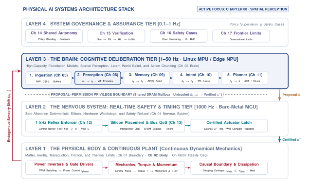
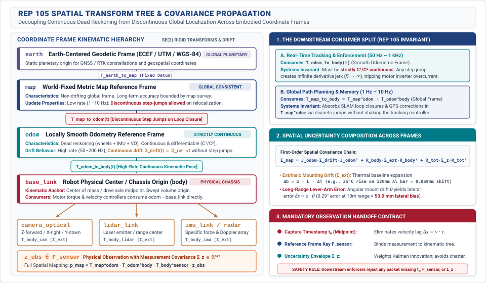
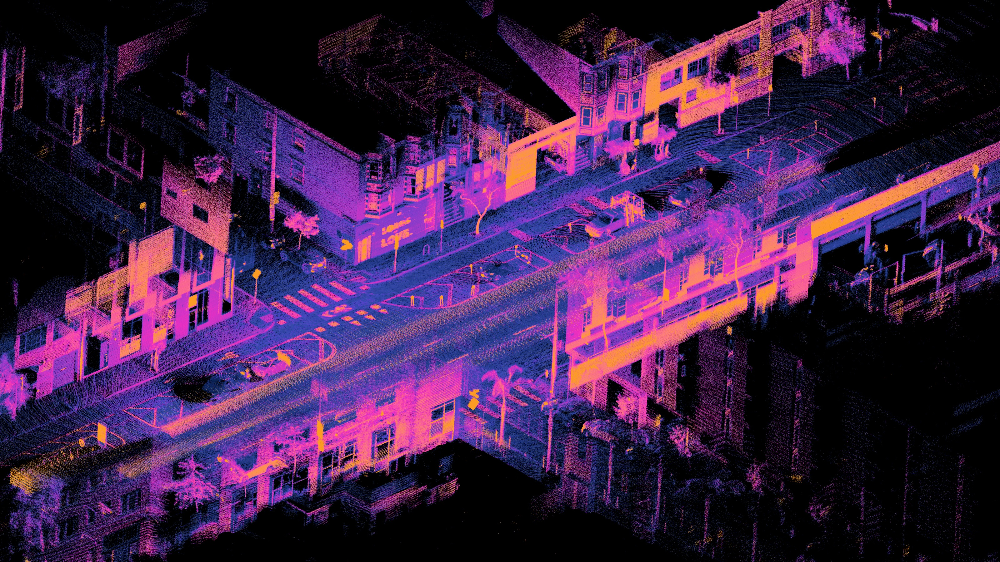
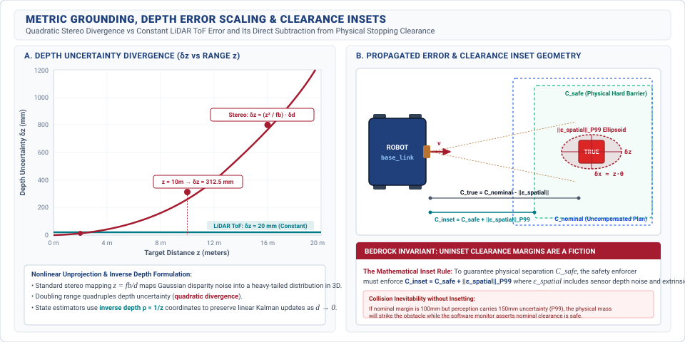

# Sensor Perception {#sec-perception}

::: {.column-margin}

\chapterminitoc

:::

::: {#fig-08-locator fig-env="figure" fig-pos="H" fig-cap="**Systems Organ Focus: Brain**: Transduction to memory as a temporal progression, illustrating cumulative latency along the perception pipeline from CMOS photodiodes across MIPI CSI-2 serialization, DMA transfer, ISP debayering, and neural backbone evaluation. Attribution: Textbook team (CC BY 4.0)." fig-alt="Systems Organ Focus: Brain. Transduction to memory as a temporal progression, illustrating cumulative latency along the perception pipeline from CMOS photodiodes across MIPI CSI-2 serialization, DMA transfer, ISP debayering, and neural backbone evaluation. Attribution: Textbook team (CC BY 4.0)."}
{width="100%"}
:::

*When was this taken, where from, and how wrong might it be?*

A physical machine cannot act directly on raw photons or acoustic reflections. It must translate asynchronous, noisy sensor streams into calibrated metric claims in 3D space before physical clearance is consumed. This transformation is bound by physical latency: while an image frame is serialized over a MIPI CSI-2 bus and evaluated by a vision backbone, the physical world continues to move. Mechanical vibration, rolling-shutter scanline skew, and lens distortion degrade geometric accuracy. Reliable perception requires bounding end-to-end information age, attaching covariance ellipsoids to every spatial claim, and packaging observations into immutable records with strict health contracts.



::: {.callout-learning-objectives}
After studying this chapter, you will be able to:

1. State the three properties every observation must carry and explain what breaks when each is missing.
2. Account for the age accumulated between transduction and use across the latency waterfall, stage by stage.
3. Trace visual sensory processing from CMOS pixel arrays across MIPI CSI-2 DMA ring buffers on the Linux MPU to 3D foundation model backbones.
4. Model rolling shutter scanline skew and camera-to-IMU temporal and extrinsic calibration from first principles.
5. Compute what a capture configuration costs in memory bus bandwidth and name what it takes that from.
6. Name the failure modes of perception and identify which are detectable at runtime versus silent.

*Core chapter takeaway.* An observation without an age, a frame, and an uncertainty is not usable, and the cost of producing one is taken from the same bus everything else is competing for.

:::

## Photons to Spatial Claims {#sec-perception-8-1}

<!-- SECTION 8.1 -->
<!-- claim: The policy Part II produced may implement one of these stages, several, or all of them at once. What follows specifies what each stage must guarantee, not that each must be a separate module. -->
<!-- covers: Open on the joint: Part II delivered a policy with a record attached, and that record is the input to every contract in this chapter. -->
<!-- covers: An end-to-end policy and a staged stack are the same machine at different granularities; the stages are responsibilities that must be discharged somewhere, not boxes that must exist. -->
<!-- covers: What you lose when a stage is implicit: you cannot inspect it, bound it, expire it, or refuse on it. -->
<!-- covers: Why enforcement is the one responsibility that can never be absorbed into the policy, which is the thread Part III follows to its end. -->
<!-- covers: Set up perception as the first handoff: what the machine is allowed to believe it saw, and when it saw it. -->
<!-- GROUNDING: mechanism — the three properties an observation carries, and what each is for -->
<!-- FIGURE: A timeline showing accumulated latency at each physical and software stage between photon arrival and downstream model consumption. -->

<!-- BEGIN -->
\lettrine{P}{art} II established what a learned policy can deliver and what its evaluation record can prove. That record documents empirical performance across a test distribution, bounds the distribution shifts under which the policy was evaluated, and lists the latency and compute budgets required to execute a forward pass. Yet a policy residing in memory does not act on the physical world in isolation. To govern physical mass, it must receive measurements that reflect true mechanical states and issue commands that execute through real actuators under strict temporal deadlines. The architectural contracts developed across Part III take that evaluation record as their baseline input. The task of the system architecture is to wrap the learned model in the sensing pipelines, synchronization mechanisms, state representations, and execution runtimes necessary to convert statistical inference into safe physical movement.

A physical architecture can take many concrete shapes. An end-to-end vision-to-action model maps raw camera bitstreams directly to joint torque commands within a single neural network. A classical modular pipeline partitions that same computation across independent processes for sensor ingestion, state estimation, mapping, trajectory generation, and motor control. While these implementations look entirely distinct on a software architecture diagram, they represent the same machine analyzed at different levels of granularity. Perception, state estimation, spatial reasoning, planning, tracking, and actuation are not mandatory software modules that must run in separate address spaces. They are fundamental responsibilities that physics requires the machine to discharge somewhere along the signal path between physical stimulus and physical response.[^fn-math-marr-levels]

When an engineering team consolidates these responsibilities into an end-to-end model, the stages do not vanish. They are absorbed into the weight matrix, where they operate implicitly across hidden layers. What changes is what the system engineer can inspect, bound, expire, or refuse. In an explicit pipeline, an engineer can verify that an intermediate coordinate transform satisfies rigid-body geometry, attach an expiration deadline to a stale feature vector, or intercept an estimation error before it reaches the control loop. When a stage is implicit, intermediate representations cannot be isolated or independently measured. If an implicit perception representation confuses specular reflection on a wet floor for open clearance, the downstream layers act on that representation directly, with no intermediate interface capable of detecting the error or invalidating the data before a command reaches an actuator.

This distinction identifies the single responsibility that can never be absorbed into a learned policy. While perception, estimation, and nominal trajectory generation can all be learned from data, enforcement must remain external and deterministic. A learned model is inherently statistical; its evaluation record guarantees performance in expectation over a test set, but provides no absolute mathematical invariant for any single inference cycle. When a policy encounters an out-of-distribution input, suffers an internal numerical failure, or stalls on a compute bottleneck, the authority to halt the machine, clamp actuator current, or invoke a reflexive fallback must rest with a separate execution monitor.

In modern physical AI systems, this division of responsibility is physically embodied in a **dual-brain architecture**. The high-bandwidth, unprivileged sensory perception stack—ingesting multi-camera streams via Direct Memory Access (DMA) ring buffers, running hardware image signal processors (ISPs), and evaluating billion-parameter 3D vision foundation models—resides on a high-performance Linux Microprocessor Unit (MPU) or System-on-Chip (SoC) accelerator. Concurrently, a separate, real-time Microcontroller Unit (MCU) runs deterministic safety monitors, inertial strapdown filters, and control barrier functions on bare metal. The MPU emits candidate perceptual interpretations and unprivileged motion proposals; the real-time MCU enforces physical clearance invariants and holds the unconditional hardware authority to refuse or override them. That enforcement boundary is the structural invariant that Part III traces from initial sensor ingress down to motor commutators.

The architectural pipeline begins at the boundary where physical energy converts into digital data. As illustrated in the systems architectural locator (@fig-08-locator), perception constitutes the first structural handoff in the sensory-to-actuation chain, tracking the timeline from transduction at the detector array to state estimation in memory while accounting for the information age accumulated at each step. Perception determines what the machine is permitted to believe about its immediate environment and precisely when that physical state existed. For downstream computation to consume a sensory measurement without causing mechanical instability, every observation must carry three distinct properties. It must carry an acquisition timestamp that records when the physical phenomenon occurred, an identified coordinate frame that fixes the measurement in physical space, and an uncertainty estimate that bounds the reliability of the signal. Without these three metadata fields, a tensor of detected objects, foundation model patch embeddings, or surface normals is not a physical measurement; it is an ungrounded array of numbers.

The need for these properties becomes concrete when tracing the latency accumulated across an embedded perception pipeline. Consider an autonomous mobile base operating in an industrial facility at $2.0\text{ m/s}$. Photons striking the photodiode array of a CMOS camera do not instantly appear as feature embeddings in an inference engine. In an analytical breakdown of a typical embedded vision system, the sensor array requires $33\text{ ms}$ for exposure and pixel readout at $30\text{ Hz}$. Direct memory access transfers across a serial bus into system memory add $8\text{ ms}$. Operating system kernel scheduling and driver buffer handling introduce $4\text{ ms}$ of queuing delay. Image debayering, rectification, and color correction require $5\text{ ms}$ of preprocessing time. Finally, running a vision backbone on an onboard accelerator requires $25\text{ ms}$ at $P_{99}$ latency.

By the time the perception stage yields an observation tensor, $75\text{ ms}$ of total latency have accumulated between photon capture and model consumption. Over that $75\text{ ms}$ window, the vehicle has traversed $0.15\text{ m}$ of physical space. If the perception stage hands downstream components an object detection bounding box without a timestamp and a spatial transform, a downstream planner must evaluate that obstacle relative to the current position of the chassis. It will assume the obstacle sits $0.15\text{ m}$ closer or further than its true current coordinate, steering around a physical ghost or driving directly into an obstacle that moved into its trajectory during the processing interval. Downstream software cannot safely consume a perception output that does not explicitly declare when it was captured, what coordinate system it references, and how wide its error distribution remains.

::: {.callout-definition title="Spatial Information Age"}
The **spatial information age** ($\tau_{\text{age}}$) is the total elapsed physical time between the energy integration midpoint ($t_{\text{exp}}/2$) at the transducer and the downstream consumption of the observation by a state estimator or policy, translating directly into unmodeled spatial displacement:
$$\Delta x = \int_{t_0}^{t_0+\tau_{\text{age}}} v(t)\,dt$$
as the embodied platform traverses physical space.
:::

[^fn-math-marr-levels]: Marr (1982) decomposed vision into theory, algorithm, and hardware. In Physical AI, perception is a real-time pipeline where transport latency directly erodes stability margins.

<!-- END -->

## What Perception Hands Over {#sec-perception-8-2}

<!-- SECTION 8.2 -->
<!-- claim: Downstream cannot use a measurement it cannot date, locate, or bound. -->
<!-- covers: Contrast raw sensor measurements with the state representations required by downstream control, planning, and memory subsystems. -->
<!-- covers: Define the capture timestamp property ($t_0$) at the integration midpoint and show how using arrival time ($t_{\text{recv}}$) injects phase lag and tracking instability into downstream estimators. -->
<!-- covers: Define the reference frame property ($\mathcal{F}_{\text{sensor}}$ relative to $\mathcal{F}_{\text{body}}$) and explain why uncalibrated mounting extrinsics cause spatial planning errors. -->
<!-- covers: Define the uncertainty envelope property ($\Sigma_z$) and explain how downstream optimizers fail when sensor noise is treated as ground truth. -->
<!-- covers: Establish the handoff contract: downstream components must reject any observation lacking a timestamp, frame identifier, and validity envelope. -->
<!-- GROUNDING: mechanism — the three properties, and what breaks downstream when each is missing -->
<!-- FIGURE: A comparison showing state estimation trajectory tracking error when fed true capture-time observations versus arrival-time observations for a moving body. -->
<!-- DERIVE: The tracking error $\Delta x = v \cdot \tau$ induced when downstream state estimators treat delivery time as capture time for a body moving at velocity $v$ over transport delay $\tau$. -->

<!-- BEGIN -->
Raw sensor hardware yields electrical measurements such as photodiode voltages, time-of-flight counter values, or capacitive displacements. These unstructured signals bear little resemblance to the state variables required by downstream autonomy. An actuator controller cannot track a desired force using a two-dimensional grid of raw pixel intensities, and a trajectory optimizer cannot plan collision-free paths using unorganized time-of-flight returns. Downstream estimation, planning, and memory subsystems require structured representations of physical state, including metric positions, velocities, bounding volumes, surface normals, and semantic classifications. Translating raw sensor streams into these representations is the operational responsibility of the perception pipeline. However, downstream consumers cannot safely interpret a perceived state without explicit metadata that anchors the measurement in physical reality. To be consumable by downstream software, an observation must carry three formal properties, comprising a capture timestamp, an assigned reference frame, and an uncertainty envelope.

The first mandatory property is the **capture timestamp** $t_0$, which specifies the temporal midpoint of the physical energy integration window. Sensors do not take instantaneous snapshots; a camera integrates photons across an exposure duration, and a mechanical lidar sweeps laser pulses over an azimuth arc across several milliseconds. Downstream state estimators require $t_0$ to integrate the measurement into the machine's dynamic equations of motion. A common architectural failure in embedded systems is recording the arrival timestamp $t_{\text{recv}}$, the moment the operating system kernel completes the direct memory access transfer, and passing $t_{\text{recv}}$ downstream as the observation epoch. Because pipeline execution, serial bus transfers, and driver scheduling introduce a transport delay $\tau = t_{\text{recv}} - t_0$, substituting arrival time for capture time corrupts the state estimator.

The magnitude of this corruption is a direct function of platform kinematics. Consider a vehicle traversing a trajectory with instantaneous velocity $v(t)$. When an observation taken at $t_0$ is evaluated by a downstream filter at $t_{\text{recv}}$, the physical state of the machine has shifted. The resulting spatial tracking error $\Delta x$ is the integral of the platform velocity over the transport delay, $\Delta x = \int_{t_0}^{t_0+\tau} v(t)\,dt$. In an analytical case of constant linear velocity $v$, this relationship simplifies to $\Delta x = v \cdot \tau$. For a mobile robot traveling at $v = 3.0\text{ m/s}$ subject to an end-to-end perception delay $\tau = 80\text{ ms}$, treating the arrival time as the measurement time shifts the perceived obstacle boundary by $\Delta x = 0.24\text{ m}$. In closed-loop tracking, feeding delayed observations without timestamp compensation introduces a phase lag into the feedback path. This phase lag erodes the phase margin of the controller, driving the physical system toward oscillatory tracking errors or complete mechanical divergence.

The second mandatory property is the **reference frame** identifier $\mathcal{F}_{\text{sensor}}$. Every spatial measurement is natively resolved in the local coordinate system of the physical transducer. A camera measures bearing angles relative to its optical center, while a radar measures range and Doppler velocity relative to its antenna array. Downstream trajectory planners and obstacle maps operate in a chassis body frame $\mathcal{F}_{\text{body}}$ or an inertial navigation frame $\mathcal{F}_{\text{world}}$. Transforming an observation from $\mathcal{F}_{\text{sensor}}$ to $\mathcal{F}_{\text{body}}$ requires applying a rigid-body spatial transformation consisting of a rotation matrix and a translation vector that define the sensor mounting extrinsics.[^fn-std-rep105-frames] Across the three machine archetypes, this spatial binding takes distinct physical forms: in Mobile Systems, $\mathcal{F}_{\text{body}}$ represents the mobile chassis `base_link` tracking through an odometric frame `odom`; in Manipulator Systems, it maps across serial kinematic chains from the mounting flange `tool0` through articulated joint angles to the base origin `base_link`; in Process / Energy Systems, it maps local pyrometry or laser galvanometer scan coordinates to the fixed workcell or reactor vessel datum $\mathcal{F}_{\text{vessel}}$. As structured in the coordinate frame transformation tree (@fig-08-coordinate-frame-tree), the standard spatial hierarchy formalizes this spatial progression by nesting coordinate frames: $\mathcal{F}_{\text{earth}} \to \mathcal{F}_{\text{map}} \to \mathcal{F}_{\text{odom}} \to \mathcal{F}_{\text{body}} \to \mathcal{F}_{\text{sensor}}$. When perception outputs omit the frame identifier or rely on nominal CAD dimensions rather than calibrated physical extrinsics, small angular offsets create large spatial errors that scale with distance. An uncalibrated pitch or yaw error of $\theta = 1.0^\circ$ on a sensor detecting an object at a range $d = 15.0\text{ m}$ induces a transverse position error of $\Delta y \approx d \cdot \sin(1.0^\circ) \approx 0.26\text{ m}$. In tight warehouse aisles or cluttered physical environments, a lateral error of $0.26\text{ m}$ causes the planner to steer into physical racking or reject valid corridors as obstructed.

The formal mathematical specifications, continuity classes, and covariance growth characteristics of this coordinate hierarchy are codified in @tbl-08-rep105-tree. By establishing explicit parent-child relations and separating continuous dead reckoning from discontinuous global localization, the transform tree ensures that high-frequency control loops and downstream state estimators maintain mathematically consistent reference origins without incurring step-discontinuity shocks.

| Coordinate Frame ($\mathcal{F}$)              | Parent Frame  | Continuity Class             | Estimator Source                                        | Covariance Growth Dynamic ($\mathbf{\Sigma}(t)$)                                                                                                                            | Permitted Downstream Consumers                                                     | Step-Discontinuity & Safety Policy                                                             |
|:----------------------------------------------|:--------------|:-----------------------------|:--------------------------------------------------------|:----------------------------------------------------------------------------------------------------------------------------------------------------------------------------|:-----------------------------------------------------------------------------------|:-----------------------------------------------------------------------------------------------|
| `earth` ($\mathcal{F}_{\text{earth}}$)        | *None* (Root) | Piecewise $C^0$              | Multi-band GNSS / RTK / Geodetic survey                 | Bounded absolute error: $\sigma \approx 0.02\text{--}5.0\text{ m}$ depending on RTK carrier lock                                                                            | Global mission routing, statutory geofencing                                       | Step jumps on satellite re-acquisition; **forbidden** in closed-loop control                   |
| `map` ($\mathcal{F}_{\text{map}}$)            | `earth`       | Piecewise $C^0$              | Global LiDAR/Visual SLAM, landmark factor graphs        | Bounded global variance; discrete contraction on loop closure: $\mathbf{\Sigma} \leftarrow (\mathbf{\Sigma}^{-1} + \mathbf{H}^T\mathbf{R}^{-1}\mathbf{H})^{-1}$             | Global path planners, topological graph search                                     | Loop closure induces instantaneous coordinate shifts; **forbidden** in high-rate tracking      |
| `odom` ($\mathcal{F}_{\text{odom}}$)          | `map`         | Strictly $C^1$               | Wheel encoders, Visual-Inertial Odometry, IMU strapdown | Unbounded monotonic drift: $\mathbf{\Sigma}_{\text{odom}}(t) \propto t$; short-term variance minimal ($\sigma_{\Delta p} < 1\text{ mm}$ over $100\text{ ms}$)               | High-rate trajectory tracking, MPC, Control Barrier Functions, velocity estimation | Transform must remain strictly continuous; discrete jumps are treated as catastrophic faults   |
| `base_link` ($\mathcal{F}_{\text{body}}$)     | `odom`        | $C^\infty$ (Rigid)           | Platform kinematic definition / center of mass          | Identity variance relative to structural mass ($\mathbf{\Sigma}_{\text{base}} = \mathbf{0}_{6\times 6}$)                                                                    | Forward/inverse kinematics, swept-volume collision checking, CoM balance           | Fixed origin; updates solely via kinematic joint state and dynamic integration                 |
| `sensor_link` ($\mathcal{F}_{\text{sensor}}$) | `base_link`   | $C^\infty$ (or $C^1$ gimbal) | Optical/RF CAD calibration + online extrinsic estimator | Extrinsic covariance $\mathbf{\Sigma}_{\text{mount}} \in \mathbb{R}^{6\times 6}$; expands under thermal expansion ($\alpha = 23\times 10^{-6}\text{ K}^{-1}$) and vibration | Perception unprojection, raycasting, optical flow extraction                       | Extrinsic drift must be continuously bounded; unprojected points must transform to `base_link` |
: **REP 105 Spatial Transform Tree Standard and Covariance Propagation Parameters**: System-wide coordinate frame hierarchy defining parent-child transform relationships, temporal continuity classes, estimation sources, and covariance dynamics per ROS Enhancement Proposal 105 (REP 105) and Smith--Cheeseman spatial uncertainty principles [@smith1986estimating]. The architecture enforces a strict decoupling between discontinuous global map relocalization (`map`) and smooth, continuous dead reckoning (`odom`), guaranteeing that inner-loop trajectory controllers and safety barrier functions never encounter mathematical step discontinuities during loop-closure corrections. {#tbl-08-rep105-tree}

The **REP 105 spatial transform tree** formalizes this standardized, acyclic kinematic coordinate hierarchy ($\mathcal{F}_{\text{earth}} \to \mathcal{F}_{\text{map}} \to \mathcal{F}_{\text{odom}} \to \mathcal{F}_{\text{body}} \to \mathcal{F}_{\text{sensor}}$), strictly isolating continuous, high-rate local dead reckoning ($\mathcal{F}_{\text{odom}}$) used in inner control loops from discrete, discontinuous global map relocalization corrections ($\mathcal{F}_{\text{map}}$) used by global planners, preventing step-discontinuity shocks in physical tracking controllers.

::: {#fig-08-coordinate-frame-tree fig-env="figure" fig-pos="t" fig-cap="**REP 105 Spatial Transform Tree and Uncertainty Composition**: The spatial coordinate frame hierarchy formalizes the separation between continuous local dead reckoning ($\mathcal{F}_{\text{odom}} \to \mathcal{F}_{\text{body}}$) consumed by high-frequency tracking loops and discontinuous global map corrections ($\mathcal{F}_{\text{map}} \to \mathcal{F}_{\text{odom}}$) consumed by global planners. Spatial covariance compounds across the kinematic chain ($\mathbf{\Sigma}_{\text{map}} \approx \mathbf{J}_{\text{odom}}\mathbf{\Sigma}_{\text{drift}}\mathbf{J}_{\text{odom}}^T + \mathbf{R}_{\text{body}}\mathbf{\Sigma}_{\text{ext}}\mathbf{R}_{\text{body}}^T + \mathbf{R}_{\text{tot}}\mathbf{\Sigma}_z\mathbf{R}_{\text{tot}}^T$), requiring downstream consumers to reject observations that lack an explicit coordinate key $\mathcal{F}_{\text{sensor}}$, acquisition epoch $t_0$, and covariance envelope $\mathbf{\Sigma}_z$. Attribution: Book kinematic systems diagram, CC BY 4.0." fig-alt="REP 105 Spatial Transform Tree and Uncertainty Composition. The spatial coordinate frame hierarchy formalizes the separation between continuous local dead reckoning (\mathcal{F}{\text{odom}} \to \mathcal{F}{\text{body}}) consumed by high-frequency tracking loops and discontinuous global map corrections (\mathcal{F}{\text{map}} \to \mathcal{F}{\text{odom}}) consumed by global planners. Spatial covariance compounds across the kinematic chain (\mathbf{\Sigma}{\text{map}} \approx \mathbf{J}{\text{odom}}\mathbf{\Sigma}{\text{drift}}\mathbf{J}{\text{odom}}^T + \mathbf{R}{\text{body}}\mathbf{\Sigma}{\text{ext}}\mathbf{R}{\text{body}}^T + \mathbf{R}{\text{tot}}\mathbf{\Sigma}z\mathbf{R}{\text{tot}}^T), requiring downstream consumers to reject observations that lack an explicit coordinate key \mathcal{F}{\text{sensor}}, acquisition epoch t0, and covariance envelope \mathbf{\Sigma}z. Attribution: Book kinematic systems diagram, CC BY 4.0."}
{width="95%"}
:::

The third mandatory property is the **uncertainty envelope** $\mathbf{\Sigma}_z$. A physical measurement without a variance is an assertion of absolute certainty. Environmental degradation such as low illumination, atmospheric scattering, surface specularities, and model epistemic uncertainty mean that perception outputs are stochastic estimates. The uncertainty envelope $\mathbf{\Sigma}_z$, parameterized as a covariance matrix over the observation dimensions, bounds the spread of the measurement error. State estimators such as Kalman filters and nonlinear factor graph optimizers rely on $\mathbf{\Sigma}_z$ to weight sensory innovations against the internal dynamic model of the body. If perception hands over an observation without $\mathbf{\Sigma}_z$, downstream algorithms must assume a static noise parameter or treat the measurement as ground truth. When the physical sensor degrades, treating a noisy or out-of-distribution perception output as certain forces the optimizer to pull state estimates toward spurious measurements. The resulting high-frequency corrections propagate directly to motor drives, causing severe torque chatter, rapid thermal rise in actuator windings, and mechanical wear.

The **perception handoff contract** is the formal interface invariant requiring every observation packet crossing from the perception pipeline into the nervous system to carry a capture timestamp ($t_0$), a verified reference coordinate frame ($\mathcal{F}_{\text{sensor}}$), and an explicit uncertainty covariance matrix ($\mathbf{\Sigma}_z$). Downstream components must reject any ungrounded packet that omits these fields.

::: {#pri-observation-invariants .callout-principle title="The Three Invariants of Observation"}
Never pass a perception tensor downstream without an acquisition timestamp latched at the exposure midpoint, an unambiguous coordinate frame identifier, and an explicit spatial uncertainty covariance matrix.
:::

These three properties define the formal handoff contract between perception and the remainder of the autonomy stack. Downstream state estimators, planners, and safety watchdogs must reject any observation packet that lacks an explicit capture timestamp $t_0$, a verified coordinate frame $\mathcal{F}_{\text{sensor}}$, and an uncertainty covariance $\mathbf{\Sigma}_z$. Dropping an incomplete or unbounded observation allows a downstream estimator to propagate its state forward using physical dynamics, degrading uncertainty smoothly over time. Accepting an ungrounded packet, by contrast, injects unmodeled delays, spatial distortions, and false confidence directly into the control loop. Enforcing this contract requires tracing how an observation originates, beginning at the hardware interface where physical phenomena are first sampled.

[^fn-std-rep105-frames]: REP 105 (*Coordinate Frames for Mobile Platforms*) standardizes transform trees ($\mathcal{F}_{\text{earth}} \to \mathcal{F}_{\text{map}} \to \mathcal{F}_{\text{odom}} \to \mathcal{F}_{\text{body}} \to \mathcal{F}_{\text{sensor}}$). It isolates high-frequency continuous odometry from discrete map corrections, preventing step discontinuities in low-level motor controllers during global relocalization.
<!-- END -->

## Transduction, Hardware Sampling, and Temporal Calibration {#sec-perception-8-3}

<!-- SECTION 8.3 -->
<!-- claim: Lag has already accumulated before software receives anything at all. -->
<!-- covers: Model physical exposure as a temporal integral over interval $t_{\text{exp}}$, establishing that every frame is a time-averaged measurement rather than an instantaneous snapshot. -->
<!-- covers: Compare global shutter exposure with rolling shutter line-by-line readout, showing how body motion during readout introduces spatial distortion across the image plane. -->
<!-- covers: Trace serialization and transport delays across physical camera interfaces (MIPI CSI-2, GMSL2, USB3, and GigE Vision) into receiver buffers. -->
<!-- covers: Analyze clock domain crossing and quantify oscillator drift between sensor internal crystals and host CPU/SoC monotonic system clocks. -->
<!-- covers: Establish hardware synchronization mechanisms, comparing software polling against hardware GPIO triggers and IEEE 1588 PTP network timestamping. -->
<!-- covers: Account for the total age of a frame at the exact moment DMA completes in host memory: $t_{\text{age}} = t_{\text{exp}}/2 + t_{\text{readout}} + t_{\text{transport}}$. -->
<!-- GROUNDING: number — exposure and rolling shutter as skew, in millimetres at a speed -->
<!-- FIGURE: A geometric diagram showing rolling shutter scanline distortion on a vertical object passed at speed, mapping row index to spatial displacement. -->
<!-- DERIVE: The spatial skew $\Delta x(y) = v \cdot y \cdot t_{\text{row}}$ across scanlines and the motion blur width $\Delta x_{\text{blur}} = v \cdot t_{\text{exp}}$ as functions of body velocity $v$. -->

<!-- BEGIN -->
Lag accumulates before software receives anything at all, beginning at the photosite where physical phenomena are converted into electrical charge. A camera does not capture an instantaneous snapshot of the physical world. Photons collect on a photodiode over a finite exposure duration $t_{\text{exp}}$, which means the recorded pixel intensity represents the temporal integral of scene radiance $I(t)$ over that interval:
$$I_{\text{pixel}} = \int_{0}^{t_{\text{exp}}} I(t)\,dt$$
When the sensor or the observed environment moves at velocity $v$ during exposure, a sharp physical boundary spreads across multiple photosites. The resulting motion blur width in the direction of motion is given by $\Delta x_{\text{blur}} = v \cdot t_{\text{exp}}$. Because light accumulates continuously across the exposure window, the effective point in time that corresponds to the accumulated charge is the temporal midpoint of the interval, introducing an unavoidable physical measurement lag of $t_{\text{exp}}/2$ relative to the start of exposure.

### Rolling shutter distortion and motion compensation

How that exposure window is scheduled across the pixel array determines the spatial geometry of the resulting image. In a **global shutter** sensor, every pixel photodiode accumulates charge during the identical time interval and transfers the accumulated electrons to shielded storage nodes simultaneously. In a **rolling shutter** sensor, silicon area and cost constraints dictate that rows are reset, exposed, and read out sequentially from the top scanline $y = 0$ to the bottom scanline $y = H - 1$. Each successive scanline begins exposure after a row period $t_{\text{row}}$, creating a progressive temporal offset across the image plane:[^fn-hw-rolling-shutter]
$$t(y) = t_0 + y \cdot t_{\text{row}}$$
where $t_0$ is the start of exposure for the top row. When the body translates at linear velocity $v$ perpendicular to an observed vertical feature, scanline $y$ captures that feature at a spatial displacement:
$$\Delta x(y) = v \cdot y \cdot t_{\text{row}}$$

Under rotational motion, rolling shutter distortion becomes non-linear. If the camera undergoes angular rotation at angular velocity vector $\boldsymbol{\omega} = [\omega_x, \omega_y, \omega_z]^T$ (e.g., rapid yaw or pitch during aggressive robot maneuvers), the effective camera attitude changes continuously as scanlines are read. For a scanline at vertical coordinate $y$, the differential rotation relative to the frame start is $\Delta \boldsymbol{\theta}(y) \approx \boldsymbol{\omega} \cdot y \cdot t_{\text{row}}$. This scanline-dependent rotation warps straight physical lines into curves, induces focal-length dilation (scaling distortion during pitch), and shears vertical walls into slanted surfaces.

As an analytical example, consider a ground robot traversing an aisle at $v = 3.0\text{ m/s}$ equipped with a rolling shutter camera operating at $30\text{ Hz}$ with vertical resolution $H = 1080\text{ rows}$. If the active readout time across all rows is $t_{\text{readout}} = 33.3\text{ ms}$, the inter-row readout interval is $t_{\text{row}} = 33.3\text{ ms} / 1080 \approx 30.8\text{ }\mu\text{s}$. A vertical pallet edge spanning the full height of the frame does not appear vertical in the captured array. The bottom scanline ($y = 1079$) is sampled $33.3\text{ ms}$ after the top scanline ($y = 0$), producing a total physical spatial skew of:
$$\Delta x = 3.0\text{ m/s} \times 0.0333\text{ s} \approx 0.10\text{ m} = 100\text{ mm}$$
With an exposure duration of $t_{\text{exp}} = 10.0\text{ ms}$, each individual scanline also suffers a motion blur width of $\Delta x_{\text{blur}} = 3.0\text{ m/s} \times 0.010\text{ s} = 0.03\text{ m} = 30\text{ mm}$. If downstream geometry reconstruction treats this image as an instantaneous rigid projection, the perceived $100\text{ mm}$ tilt causes the motion planner to identify an artificial intrusion into the free corridor. Correcting this distortion requires **rolling-shutter motion compensation**, the continuous-time geometric unwarping algorithm that utilizes high-rate ($1000\text{ Hz}$) inertial angular velocities ($\boldsymbol{\omega}$) and linear velocities ($\mathbf{v}$) to interpolate the instantaneous 6-DoF camera pose $\mathbf{T}_{wb}(t(y))$ for each individual scanline $y$, restoring rigid epipolar geometry prior to 3D triangulation.

### MIPI CSI-2 DMA ingress on the linux MPU

Once analog-to-digital converters on the sensor die digitize the pixel charges, the frame must travel across a physical interconnect to host memory. In a canonical heterogeneous System-on-Chip (SoC) comprising an unprivileged application processor (Linux MPU) and an isolated hard real-time safety microcontroller (bare-metal MCU), camera streams enter via the **Mobile Industry Processor Interface Camera Serial Interface (MIPI CSI-2)** bus.[^fn-hw-mipi-csi]

::: {.callout-perspective title="Silicon Ingestion Dataflow Architecture"}
1. **D-PHY / C-PHY Physical Layer**: Differential data lanes transmit high-speed serialized pixel packets ($1.5\text{--}2.5\text{ Gbps}$ per lane), protected by header error correction.
2. **SoC CSI-2 Host Controller**: Deserializes byte packets, strips headers, and validates CRC integrity.
3. **Scatter-Gather DMA Controller**: A dedicated DMA engine transfers pixel byte words directly into DRAM over the internal system interconnect (e.g., AXI crossbar).
4. **Kernel DMA Ring Buffers**: Under Linux (`v4l2`), the driver allocates pre-mapped non-cacheable DMA buffers (`V4L2_MEMORY_MMAP`). The DMA populates pages without user-space copies.
:::

Once DMA write completion occurs, the kernel driver issues an interrupt.[^fn-hw-v4l2-dma] Pointers to these contiguous memory regions are shared as zero-copy file descriptors (`dma_buf`) directly with the hardware Image Signal Processor (ISP) and Neural Processing Unit (NPU), bypassing CPU memory bus hops. By contrast, interfaces relying on Universal Serial Bus (USB3) or GigE Vision over Ethernet package pixel streams into discrete packets, incurring frame assembly, kernel network stack traversal, and driver memory copies that inflate transport latency from $t_{\text{transport}} < 0.5\text{ ms}$ (MIPI CSI-2) up to $5\text{--}20\text{ ms}$ (USB3/GigE), with tail latencies exceeding $P_{99} > 35\text{ ms}$ under CPU thread scheduling contention.

### Camera-to-IMU temporal and extrinsic calibration

Visual perception does not operate in isolation; it functions alongside an Inertial Measurement Unit (IMU) running at high frequencies ($1000\text{ Hz}$). Fusing high-rate angular velocity $\boldsymbol{\omega}$ and linear acceleration $\mathbf{a}$ from the IMU with low-rate visual frames ($30\text{--}60\text{ Hz}$) in Visual-Inertial Odometry (VIO) requires rigorous spatial and temporal calibration [@furgale2013unified; @li2014online; @forster2017onmanifold].

The spatial relationship between the IMU reference frame $\mathcal{F}_{\text{imu}}$ and the camera reference frame $\mathcal{F}_{\text{cam}}$ is defined by the rigid extrinsic transformation $\mathbf{T}_{\text{imu}}^{\text{cam}} = (\mathbf{R}_{\text{imu}}^{\text{cam}}, \mathbf{p}_{\text{imu}}^{\text{cam}})$. Because the camera and IMU are physically separated by a lever arm $\mathbf{p}_{\text{imu}}^{\text{cam}}$, an angular acceleration $\dot{\boldsymbol{\omega}}$ or angular velocity $\boldsymbol{\omega}$ experienced by the body induces an additional tangential and centripetal acceleration at the camera:
$$\mathbf{a}_{\text{cam}} = \mathbf{R}_{\text{imu}}^{\text{cam}} (\mathbf{a}_{\text{imu}} - \mathbf{g}) + \boldsymbol{\omega} \times (\boldsymbol{\omega} \times \mathbf{p}_{\text{imu}}^{\text{cam}}) + \dot{\boldsymbol{\omega}} \times \mathbf{p}_{\text{imu}}^{\text{cam}}$$

Equally critical is the **temporal calibration offset** $\tau_{\text{cam-imu}} = t_{\text{cam}} - t_{\text{imu}}$. Standard commercial crystal oscillators on independent sensor breakout boards drift by roughly $\pm 50\text{ ppm}$, accumulating $50\text{ }\mu\text{s}$ of error every second ($4.3\text{ s}$ per day). Moreover, analog anti-aliasing filters in the IMU, electronic exposure delays in the camera, and DMA driver scheduling inject fixed and variable temporal offsets between the two data streams.

If the temporal offset $\Delta t$ is uncalibrated, platform rotation couples directly into catastrophic spatial estimation errors. Suppose a robot rotates at an angular velocity of $\omega = 2.0\text{ rad/s}$ ($115^\circ/\text{s}$). An undetected temporal lag of $\Delta t = 10\text{ ms}$ between the camera frame and the IMU integration causes a rotational orientation mismatch of:
$$\Delta \theta = \omega \cdot \Delta t = 2.0\text{ rad/s} \times 0.010\text{ s} = 0.020\text{ rad} \approx 1.15^\circ$$
At an operating distance of $z = 10.0\text{ m}$, this angular misalignment projects into a transverse spatial error of:
$$\Delta p \approx z \cdot \Delta \theta = 10.0\text{ m} \times 0.020\text{ rad} = 0.20\text{ m} = 200\text{ mm}$$
This artificial $200\text{ mm}$ displacement corrupts visual feature triangulation, causing visual-inertial estimators to compute false scale factors and driving the filter toward mathematical divergence. Eliminating these timing errors requires hardware-level synchronization: a hardware GPIO trigger strobe latches exposure start times across all cameras and IMU sampling registers simultaneously,[^fn-hw-tim-pwm] while online continuous-time calibration algorithms estimate residual sub-millisecond offsets $\tau_{\text{cam-imu}}$ within the joint factor graph [@furgale2013unified]. As shown in the physical multi-modal perception pod in @fig-08-sensor-suite, co-locating multiple high-resolution cameras and LiDAR modules on a rigid vehicle bracket requires routing these deterministic hardware sync strobes alongside high-speed GMSL2/FPD-Link serializer links to bound clock drift and transport latency across all sensing channels.

**Camera-to-IMU spatial-temporal calibration** is the joint determination of the rigid 6-DoF extrinsic transformation $\mathbf{T}_{\text{imu}}^{\text{cam}} \in SE(3)$ and the temporal latency offset $\tau_{\text{cam-imu}} = t_{\text{cam}} - t_{\text{imu}}$, bounding lever-arm centripetal accelerations and rotational misalignment errors ($\Delta p \approx z \omega \Delta t$) during dynamic motion.

::: {#fig-08-sensor-suite fig-env="figure" fig-pos="t" fig-cap="**Physical Multi-Modal Perception Sensor Suite on an Autonomous Testbed**: Close-up view of an integrated perception pod mounted on an autonomous vehicle chassis. The assembly houses multiple high-dynamic-range CMOS cameras with distinct focal lengths and fields of view alongside solid-state and spinning time-of-flight LiDAR modules on a rigid machined aluminum mounting bracket. Each physical transducer defines its own local reference frame ($\mathcal{F}_{\text{sensor}}$), requiring precise extrinsic geometric calibration ($\mathbf{T}_{\text{sensor}\to\text{body}}$) and thermal compensation to prevent angular deviations ($\theta$) from projecting into severe lateral errors ($\Delta y \approx d \cdot \sin\theta$) at operating distance. Shielded coaxial serializers (GMSL2/FPD-Link) and dedicated hardware sync lines route synchronized microsecond triggers to prevent inter-sensor phase skew. Attribution: Open-source robotics testbed platform, CC BY-SA 4.0." fig-alt="Physical Multi-Modal Perception Sensor Suite on an Autonomous Testbed. Close-up view of an integrated perception pod mounted on an autonomous vehicle chassis. The assembly houses multiple high-dynamic-range CMOS cameras with distinct focal lengths and fields of view alongside solid-state and spinning time-of-flight LiDAR modules on a rigid machined aluminum mounting bracket. Each physical transducer defines its own local reference frame (\mathcal{F}{\text{sensor}}), requiring precise extrinsic geometric calibration (\mathbf{T}{\text{sensor}\to\text{body}}) and thermal compensation to prevent angular deviations (\theta) from projecting into severe lateral errors (\Delta y \approx d \cdot \sin\theta) at operating distance. Shielded coaxial serializers (GMSL2/FPD-Link) and dedicated hardware sync lines route synchronized microsecond triggers to prevent inter-sensor phase skew. Attribution: Open-source robotics testbed platform, CC BY-SA 4.0."}
{width="85%"}
:::

### The latency waterfall

Summing these physical stages yields the total age of the sensory data as it cascades through the perception pipeline. That information age is governed by the **latency waterfall**:
$$t_{\text{age}} = \frac{t_{\text{exp}}}{2} + t_{\text{readout}} + t_{\text{transport}} + t_{\text{DMA}} + t_{\text{ISP}} + t_{\text{backbone}} + t_{\text{IPC}}$$

::: {.callout-important title="Sensor Transduction Latency and Spatial Information Age Budget"}
*The scenario.* An embodied platform navigates a dynamic workspace. We evaluate the cumulative information age $\tau_{\text{age}}$ across the complete sensory-to-inference pipeline and compute the resulting unmodeled physical displacement $\Delta x = v \cdot \tau_{\text{age}} + \frac{1}{2} a \cdot \tau_{\text{age}}^2$ across three distinct physical machine archetypes.

**Stage-by-Stage Latency Waterfall:**

1. *Exposure Integration Midpoint ($t_{\text{exp}}/2$):* CMOS camera running at $30\text{ Hz}$ with auto-exposure $t_{\text{exp}} = 16.0\text{ ms} \implies \Delta t_1 = 8.0\text{ ms}$.
2. *Rolling Shutter Line Readout ($t_{\text{readout}}$):* Column parallel ADC scanning across 1080 rows $\implies \Delta t_2 = 16.6\text{ ms}$ (average scanline).
3. *MIPI CSI-2 Serialization & Transport ($t_{\text{transport}}$):* 4-lane D-PHY at $2.5\text{ Gbps/lane} \implies \Delta t_3 = 0.8\text{ ms}$.
4. *DMA Ingress & Kernel V4L2 Buffer Queue ($t_{\text{DMA}}$):* Scatter-gather DRAM write and driver interrupt $\implies \Delta t_4 = 1.2\text{ ms}$.
5. *Hardware ISP Debayering & Rectification ($t_{\text{ISP}}$):* Dedicated on-chip ISP hardware pass $\implies \Delta t_5 = 2.5\text{ ms}$.
6. *Vision Backbone Tensor Forward Pass ($t_{\text{backbone}}$):* INT8 quantized Vision Transformer on edge NPU $\implies \Delta t_6 = 22.0\text{ ms}$.
7. *Covariance Packaging & Zero-Copy IPC ($t_{\text{IPC}}$):* Shared-memory circular ring buffer dispatch $\implies \Delta t_7 = 0.5\text{ ms}$.

**Total Spatial Information Age:**
$$\tau_{\text{age}} = 8.0 + 16.6 + 0.8 + 1.2 + 2.5 + 22.0 + 0.5 = 51.6\text{ ms}$$

**Archetype Displacement Analysis:**

- **Mobile Systems (Autonomous Mobile Robot):** At nominal cruising speed $v = 2.5\text{ m/s}$ under acceleration $a = 0\text{ m/s}^2$:
  $$\Delta x_{\text{AMR}} = 2.5\text{ m/s} \times 0.0516\text{ s} = 0.129\text{ m} = 129\text{ mm}$$
  *Systems Impact:* Consumes $>60\%$ of the nominal $200\text{ mm}$ safety corridor clearance before the policy evaluates the frame.

- **Manipulators (High-Speed Industrial Arm):** At end-effector Cartesian velocity $v = 1.8\text{ m/s}$ during precision peg-in-hole assembly:
  $$\Delta x_{\text{arm}} = 1.8\text{ m/s} \times 0.0516\text{ s} = 0.0929\text{ m} = 92.9\text{ mm}$$
  *Systems Impact:* Exceeds standard chamfer insertion tolerances ($1\text{--}5\text{ mm}$) by nearly two orders of magnitude, guaranteeing tool collision without historical pose interpolation.

- **Process / Energy Systems (Laser Metal Additive Melt-Pool Scanner):** Galvanometer scan mirror traversing at $v_{\text{scan}} = 0.8\text{ m/s}$ with thermal pyrometry:
  $$\Delta x_{\text{melt}} = 0.8\text{ m/s} \times 0.0516\text{ s} = 0.0413\text{ m} = 41.3\text{ mm}$$
  *Systems Impact:* The thermal feedback loop controls laser power against a melt-pool position that has shifted by $>80$ melt-pool diameters ($d_{\text{pool}} \approx 0.5\text{ mm}$), causing thermal runaway or void formation.
:::

Tracing this latency progression across the entire perception and inference pipeline reveals how time accumulates from initial photon arrival down to downstream token generation and control dispatch. As budgeted stage-by-stage in @tbl-08-latency-budget, every hardware serialization step, memory bus arbitration stall, and neural forward pass compounds the effective information age. Across typical platform velocities, this accumulated latency translates directly into centimeters or meters of unrecoverable physical displacement before a control loop can react.

| Pipeline Stage & Physical Mechanism                                                        | Nominal Latency ($\mu \pm \sigma$) | Worst-Case Bound ($P_{99.9}$) | Added Age ($\Delta t$)        | Cumulative Age ($t_{\text{age}}$)  | Displacement at $2.0\text{ m/s}$ | Displacement at $10.0\text{ m/s}$ | Contention Source & Hardware Mitigation                                                                           |
|:-------------------------------------------------------------------------------------------|:-----------------------------------|:------------------------------|:------------------------------|:-----------------------------------|:---------------------------------|:----------------------------------|:------------------------------------------------------------------------------------------------------------------|
| **1. Photodiode Transduction & Exposure** Photon integration on CMOS pixel array        | $8.0 \pm 1.5\text{ ms}$            | $16.5\text{ ms}$              | $4.0\text{--}16.5\text{ ms}$  | $4.0\text{--}16.5\text{ ms}$       | $8\text{--}33\text{ mm}$         | $40\text{--}165\text{ mm}$        | Low-light integration stretch; clamp maximum exposure via driver register (`SHUTTER_MAX`)                         |
| **2. Sensor Readout & Column ADC** Correlated double sampling & pixel digitization      | $11.0 \pm 0.5\text{ ms}$           | $33.3\text{ ms}$              | $11.0\text{--}33.3\text{ ms}$ | $15.0\text{--}49.8\text{ ms}$      | $30\text{--}100\text{ mm}$       | $150\text{--}498\text{ mm}$       | Rolling shutter line skew; deploy global shutter sensors with hardware GPIO strobe triggers                       |
| **3. Physical Interconnect Transport** Differential serialization over GMSL2 / CSI-2    | $0.8 \pm 0.1\text{ ms}$            | $2.2\text{ ms}$               | $0.8\text{--}2.2\text{ ms}$   | $15.8\text{--}52.0\text{ ms}$      | $32\text{--}104\text{ mm}$       | $158\text{--}520\text{ mm}$       | Packetization & protocol overhead; bypass USB/GigE in favor of dedicated GMSL2/FPD-Link links                     |
| **4. DMA Ingress & Kernel Ring Buffering** Scatter-gather DMA transfer to host DRAM     | $1.2 \pm 0.3\text{ ms}$            | $8.5\text{ ms}$               | $1.2\text{--}8.5\text{ ms}$   | $17.0\text{--}60.5\text{ ms}$      | $34\text{--}121\text{ mm}$       | $170\text{--}605\text{ mm}$       | Shared DRAM bus contention; assign high AXI QoS priorities and lock non-cacheable DMA buffers                     |
| **5. Hardware ISP & Tensor Normalization** Debayering, geometric rectify, color format  | $2.5 \pm 0.4\text{ ms}$            | $7.0\text{ ms}$               | $2.5\text{--}7.0\text{ ms}$   | $19.5\text{--}67.5\text{ ms}$      | $39\text{--}135\text{ mm}$       | $195\text{--}675\text{ mm}$       | Software fallback stalls; enforce dedicated on-chip fixed-function ISP hardware pipelines                         |
| **6. Neural Backbone Forward Pass** INT8/FP16 tensor matrix multiply on NPU             | $18.0 \pm 2.0\text{ ms}$           | $38.0\text{ ms}$              | $18.0\text{--}38.0\text{ ms}$ | $37.5\text{--}105.5\text{ ms}$     | $75\text{--}211\text{ mm}$       | $375\text{--}1055\text{ mm}$      | Thread preemption and thermal throttling ($T_j > 85^\circ\text{C}$); lock NPU core clocks and pin weights in SRAM |
| **7. Covariance Packaging & IPC Dispatch** Spatial bounding, bitfield check, shmem ring | $0.5 \pm 0.1\text{ ms}$            | $4.5\text{ ms}$               | $0.5\text{--}4.5\text{ ms}$   | **$38.0\text{--}110.0\text{ ms}$** | **$76\text{--}220\text{ mm}$**   | **$380\text{--}1100\text{ mm}$**  | Downstream lock contention; deploy lock-free POSIX shared memory and enforce hard age-drop rules                  |
: **End-to-End Information Age Accumulation and Physical Displacement Budget**: Stage-by-stage temporal accounting from initial photon arrival at the sensor photosite through hardware deserialization, direct memory access (DMA), neural backbone inference, and inter-process communication (IPC) dispatch. Information age $\Delta t$ reflects the elapsed time from physical energy integration midpoint ($t_{\text{exp}}/2$) to downstream availability. Nominal metrics reflect optimized embedded hardware pipelines (e.g., $60\text{ Hz}$ global-shutter camera, hardware ISP, INT8 NPU acceleration); worst-case bounds ($P_{99.9}$) reflect thermal clock throttling, memory bus saturation, and OS scheduling jitter. Physical displacement $\Delta x = v \cdot t_{\text{age}}$ demonstrates how latency converts directly into unrecoverable spatial drift across operational speeds. {#tbl-08-latency-budget}
<!-- END -->

## The Cost of Ingestion {#sec-perception-8-4}

<!-- SECTION 8.4 -->
<!-- claim: Getting a frame into memory takes bandwidth from the same resource the permission path needs, and the quantity that matters is the delay that imposes on a refusal. -->
<!-- covers: Trace one sensor stream end to end and convert it into two numbers only: the age it adds to the observation, and the delay it imposes on the enforcement path competing for the same resource. -->
<!-- covers: Derive the maximum admissible ingestion load from the enforcement deadline and the slack measured in Chapter 2, rather than from what the interface can sustain. -->
<!-- covers: Show why the interesting quantity is burst behaviour rather than average bandwidth, because an average that fits can still push one refusal past its deadline. -->
<!-- covers: State the design consequence: resolution, frame rate, and sensor count are safety parameters, because each is a withdrawal from the budget that pays for refusing. -->
<!-- covers: Name the implementation mechanisms and stop there, citing a systems text. How a descriptor chain is programmed is below the floor. -->
<!-- GROUNDING: number — bandwidth for one capture configuration, against what the bus has -->
<!-- FIGURE: A memory subsystem diagram showing camera DMA streams, OS page caches, and neural inference engines contending for memory controller bandwidth. -->
<!-- DERIVE: Derive the admissible ingestion load from the enforcement deadline and measured slack, not from interface throughput. -->

<!-- BEGIN -->
Getting sensory data into main memory is not free, and it does not happen in an isolated subsystem. When raw pixel streams arrive across physical links such as MIPI CSI-2 or Ethernet, hardware engines write those bytes directly into dynamic random-access memory (DRAM) through direct memory access (DMA). That transfer shares the physical interconnect, cache hierarchies, and memory controllers with every other executing workload on the machine, including neural inference engines, operating system drivers, and safety monitors. Every sensory stream therefore imposes two numbers on the machine. The first number is the age the transport pipeline adds to the observation before compute cores can read it. The second number is the delay that incoming data stream imposes on the safety enforcement path competing for the exact same memory bus. The first number delays when the policy knows what happened. The second number delays whether the safety reflex can veto an unsafe actuation command before a physical deadline expires.

To see the scale of this competition across physical archetypes, consider their respective ingress demands: an industrial manipulator synchronizing dual high-speed eye-in-hand cameras with tactile arrays ($600\text{ MB/s}$ burst ingress); a laser powder-bed fusion process scanner streaming coaxial NIR pyrometry at $1000\text{ Hz}$ ($1.2\text{ GB/s}$ continuous ingress); or an autonomous mobile machine equipped with four high-resolution surround cameras and dual lidars. In the mobile configuration, suppose the four global shutter cameras capture $3840 \times 2160$ images at $30\text{ Hz}$ using a raw 12-bit format packed into $1.5\text{ B}$ per pixel. Each uncompressed frame occupies $3840 \times 2160 \times 1.5\text{ B} \approx 12.44\text{ MB}$ of memory. Across four cameras at $30\text{ Hz}$, the sustained write traffic generated by frame ingestion alone is:
$$B_{\text{ingest}} = 4 \times 12.44\text{ MB} \times 30\text{ s}^{-1} \approx 1.493\text{ GB/s}$$
When the perception stack reads these frames to feed vision backbones, operating system page caches duplicate intermediate buffers, and neural network accelerators read weights and write activations, the memory controller experiences traffic several times larger than the raw ingestion rate. If the host platform uses a dual-channel LPDDR5 memory subsystem with a theoretical peak bandwidth of $51.2\text{ GB/s}$, the raw camera ingress consumes roughly $2.9\text{ percent}$ of theoretical capacity. Evaluated purely as a steady-state average, this ingress appears well within the limits of the hardware interface.

Steady-state averages, however, conceal the physical failure mode. Physical sensors do not emit bytes as a continuous, uniformly distributed trickle. They emit data in synchronized bursts when hardware exposure gates finish readout. When four cameras triggered by a shared hardware strobe complete their frame readout simultaneously over a $16.0\text{ ms}$ window, DMA controllers write large transaction bursts across the system interconnect to maximize bus utilization. While these high-priority DMA writes stream into DRAM, the memory controller must switch bus directions from reads to writes, activate new DRAM banks, and arbitrate competing transaction queues. If the safety enforcement monitor needs to read joint state estimates, evaluate control barrier functions, and submit a brake command during this precise burst, its memory read requests stall behind the inbound sensory flood. An average ingestion load that consumes only 3 percent of bus capacity can still monopolize memory controller channels for several continuous milliseconds, pushing the tail latency of the enforcement path past its deadline.

The maximum admissible ingestion load must therefore be derived from the enforcement deadline and the measured timing slack established in @sec-body, rather than from what the physical interface can sustain. Let $T_{\text{enforce}}$ denote the fixed period of the safety enforcement loop, and let $t_{\text{exec}}$ denote its execution duration on an idle memory bus. The timing slack available to absorb interference is $S = T_{\text{enforce}} - t_{\text{exec}}$. Under concurrent sensory ingestion, the execution duration expands by a contention stall $\Delta t_{\text{stall}}$, which depends on the burst volume $V_{\text{burst}}$ and the effective DRAM service rate $R_{\text{arb}}$ under read-write arbitration. Preventing deadline violations requires that the worst-case stall stay strictly within the timing slack:
$$\Delta t_{\text{stall}} = \frac{V_{\text{burst}}}{R_{\text{arb}}} \le S$$
Solving for the burst volume yields the maximum admissible ingestion load:
$$V_{\text{burst}} \le S \times R_{\text{arb}}$$
The admissible sensory payload is bounded by the smallest timing slack in the fastest enforcement reflex. In an analytical example where an enforcement monitor runs with a timing slack of $S = 250\text{ }\mu\text{s}$ and the memory controller delivers an effective service rate of $R_{\text{arb}} = 20.0\text{ GB/s}$ during write contention, the total sensory ingestion burst cannot exceed:
$$V_{\text{burst}} \le 250\text{ }\mu\text{s} \times 20.0\text{ GB/s} = 5.0\text{ MB}$$
Any sensor configuration whose combined DMA write burst exceeds $5.0\text{ MB}$ will stall the memory controller long enough to exhaust the slack, causing the safety monitor to miss its deadline regardless of the average bandwidth.

::: {#pri-ingress-bandwidth .callout-principle title="Ingress Bandwidth as a Safety Parameter"}
Sensor resolution, frame rate, and channel count are safety parameters, not perception parameters; every megabyte of sensory DMA burst consumes memory bus service time directly from the safety refusal path.
:::

This relationship establishes that sensor resolution, frame rate, and sensor count are safety parameters rather than purely perception parameters. In machine learning pipelines, engineering teams routinely increase camera resolution or add sensor modalities to improve open-loop model accuracy. In a physical machine, every additional pixel, bit of quantization depth, and exposure frame is an unavoidable withdrawal from the memory bandwidth budget that pays for timely refusal. Upgrading four cameras from $1080\text{p}$ ($1920 \times 1080$) to $4\text{K}$ ($3840 \times 2160$) quadruples the burst volume $V_{\text{burst}}$ from $3.11\text{ MB}$ to $12.44\text{ MB}$ per frame. On a system with the timing margins derived above, that single change pushes the worst-case memory stall from $155.5\text{ }\mu\text{s}$ to $622.0\text{ }\mu\text{s}$, exceeding the $250\text{ }\mu\text{s}$ slack and causing the safety enforcement loop to overrun its period. The higher-resolution image may produce a more confident detection in the learned model, but it removes the machine's guarantee of stopping in time.[^fn-std-iso-mpam]

The hardware mechanisms governing how frames move into memory, including PCIe scatter-gather descriptor rings, I/O memory management unit (IOMMU) page tables, and DRAM bank conflict schedulers, are standard computer systems topics treated in depth by @hennessy2019computer as well as @bryant2015computer. For the physical AI architect, the implementation details of descriptor rings sit below the floor. The quantity to budget is the latency penalty that sensory ingress inflicts on safety-critical memory transactions. When perception traffic claims the bus, the delay propagates directly into the physical domain. Every millisecond that memory contention steals from the enforcement loop is a millisecond during which the body continues along its existing trajectory without permission, converting a digital stall in the memory controller into an irrevocable loss of physical stopping distance.
<!-- END -->

## Spatial Error, 3D Foundation Models, and Physical Clearance {#sec-perception-8-5}

<!-- SECTION 8.5 -->
<!-- claim: A spatial error is not a number in a representation. Used to authorize motion, it becomes a displacement, and it is spent out of the same clearance that keeps the machine off the obstacle. -->
<!-- covers: Convert each source of spatial error into millimetres of displacement at the point of contact: scale error, frame error, calibration drift, and depth uncertainty. -->
<!-- covers: Propagate it: show how an error at the sensor becomes an error at the end effector through the transform chain, and which term dominates at realistic distances. -->
<!-- covers: Subtract it from clearance. The margin an enforcer defends must be inset by the spatial error of everything upstream of it, and a margin that has not been inset is a fiction. -->
<!-- covers: State the units contract that makes this checkable at an interface: what the number means, in which frame, at which epoch, with what stated uncertainty. -->
<!-- covers: Name the condition under which spatial error must revoke permission rather than merely widen a margin, which is when the error is unbounded or unknown rather than large. -->
<!-- covers: Cite projection, triangulation, and rigid-transform mathematics to a vision or robotics text. The book consumes the error term and does not derive it. -->
<!-- GROUNDING: mechanism — metric grounding, and what depth unprojection assumes -->
<!-- FIGURE: A plot showing depth estimation error scaling quadratically with distance for stereo vision versus constant error for time-of-flight LiDAR. -->
<!-- DERIVE: Derive the clearance inset from the propagated spatial error; cite the projection and triangulation mathematics that produce the error term. -->

<!-- BEGIN -->
A spatial error is not a number in a representation. When downstream control logic uses an estimated coordinate to authorize motion, that error becomes a physical displacement, and it is spent out of the same clearance that keeps the machine off the obstacle. Transforming a sensor observation into physical authority requires **metric grounding**, which maps raw detector measurements into geometric space. This grounding relies on unprojecting two-dimensional sensor coordinates into three dimensions, an inversion that assumes known optics, rigid mounting, and predictable surface properties.

The mathematical principles of projection and triangulation, detailed by @hartley2003multiple as well as @szeliski2022computer, govern how measurement noise converts into spatial displacement. In passive stereo vision, depth $z$ is computed from baseline $b$, focal length $f$, and disparity $d$ through the relationship $z = \frac{f b}{d}$. Differentiating this unprojection with respect to disparity yields the depth uncertainty:
$$\delta z \approx \frac{z^2}{f b} \delta d$$
where $\delta d$ is the subpixel disparity matching error.[^fn-math-inverse-depth] Because depth error scales quadratically with distance $z$, doubling the operating range quadruples the physical depth uncertainty. In contrast, time-of-flight sensors such as pulsed LiDAR calculate distance from photon transit time $z = \frac{c \Delta t}{2}$, where $c$ is the speed of light and $\Delta t$ is the measured round-trip time. The resulting range uncertainty depends on clock jitter and detector rise time, remaining approximately constant across the operational range of the sensor, as demonstrated in the dense urban point cloud scan in @fig-08-lidar-pointcloud.

**Inverse-depth metric grounding** is the geometric parameterization of visual range observations in inverse-distance coordinates ($\rho = 1/z$) to preserve linear Gaussian measurement error properties and prevent Kalman filter covariance divergence under the heavy-tailed, quadratic spatial error distributions ($\delta z \approx \frac{z^2}{fb}\delta d$) inherent to passive stereo triangulation and monocular unprojection.

Consider an analytical example of a stereo camera with baseline $b = 0.20\text{ m}$, focal length $f = 800\text{ px}$, and a disparity matching uncertainty of $\delta d = 0.5\text{ px}$. At a distance of $z = 2.0\text{ m}$, the expected depth uncertainty is:
$$\delta z = \frac{(2.0\text{ m})^2}{800\text{ px} \times 0.20\text{ m}} \times 0.5\text{ px} = 0.0125\text{ m} = 12.5\text{ mm}$$
At a distance of $z = 10.0\text{ m}$, the same disparity uncertainty yields:
$$\delta z = \frac{(10.0\text{ m})^2}{800\text{ px} \times 0.20\text{ m}} \times 0.5\text{ px} = 0.3125\text{ m} = 312.5\text{ mm}$$
At ten meters, the depth uncertainty alone exceeds the total physical envelope of many small mobile robots.

::: {#fig-08-lidar-pointcloud fig-env="figure" fig-pos="t" fig-cap="**Registered 3D LiDAR Point Cloud in an Urban Environment**: High-resolution orthographic projection of 23 million time-of-flight points acquired by an Ouster OS1-64 multi-beam LiDAR mounted on a moving vehicle navigating an urban intersection (Folsom and Dore St, San Francisco). Points are registered in real time into the global coordinate frame ($\mathcal{F}_{\text{world}}$) via simultaneous localization and mapping (SLAM) and colorized by calibrated return intensity scaled by range. Because time-of-flight ranging uncertainty ($z = c \Delta t / 2$) remains approximately constant across operating range, LiDAR generates dense metric surfaces for physical clearance estimation without the quadratic depth degradation ($\delta z \propto z^2$) characteristic of passive stereo triangulation. Continuous motion compensation across sweeping scanlines is essential to prevent vehicle velocity from shearing the reconstructed geometry. Attribution: Ouster Inc. public dataset, CC BY 4.0." fig-alt="Registered 3D LiDAR Point Cloud in an Urban Environment. High-resolution orthographic projection of 23 million time-of-flight points acquired by an Ouster OS1-64 multi-beam LiDAR mounted on a moving vehicle navigating an urban intersection (Folsom and Dore St, San Francisco). Points are registered in real time into the global coordinate frame (\mathcal{F}{\text{world}}) via simultaneous localization and mapping (SLAM) and colorized by calibrated return intensity scaled by range. Because time-of-flight ranging uncertainty (z = c \Delta t / 2) remains approximately constant across operating range, LiDAR generates dense metric surfaces for physical clearance estimation without the quadratic depth degradation (\delta z \propto z^2) characteristic of passive stereo triangulation. Continuous motion compensation across sweeping scanlines is essential to prevent vehicle velocity from shearing the reconstructed geometry. Attribution: Ouster Inc. public dataset, CC BY 4.0."}
{width="85%"}
:::

### 3D Foundation models in physical AI: DINOv2, SAM, and ConceptGraphs

Modern physical AI architectures do not rely solely on classical hand-engineered geometric detectors or closed-set bounding box classifiers. Instead, they increasingly leverage **3D vision foundation models** that combine zero-shot open-vocabulary semantic understanding with metric spatial grounding:

1. **Self-Supervised Vision Backbones (DINOv2)**: DINOv2 [@oquab2023dinov2] uses vision transformer (ViT) architectures trained via self-distillation on massive visual datasets.[^fn-math-dinov2-patches] Unlike supervised models that collapse fine spatial details into discrete class labels, DINOv2 produces dense patch token representations where feature vectors preserve powerful geometric and semantic properties. Patch tokens from DINOv2 naturally encode dense cross-view correspondences, part-level semantics, and relative depth cues without any task-specific fine-tuning.
2. **Promptable Zero-Shot Segmentation (SAM)**: The Segment Anything Model (SAM) [@kirillov2023segment] delivers class-agnostic instance mask segmentation across arbitrary visual scenes. By running a heavyweight image encoder once per frame and evaluating fast, promptable mask decoders, SAM partitions complex physical scenes into coherent object surfaces.
3. **Open-Vocabulary 3D Scene Graphs (ConceptGraphs)**: To translate 2D foundation model representations into actionable physical representations, systems such as ConceptGraphs [@kuwajerwala2024conceptgraphs; @jatavallabhula2023conceptfusion] and Hydra [@hughes2022hydra] lift 2D instance masks and dense semantic features into 3D metric space:
   - For every video frame, 2D segmentation masks from SAM and dense semantic feature embeddings from DINOv2 / CLIP are extracted.
   - Using calibrated depth maps (from active stereo or LiDAR) and camera poses $\mathbf{T}_{wb}(t)$, the 2D masked pixels are unprojected into 3D point cloud clusters in the body or map frame.
   - Redundant 3D object proposals across sequential camera viewpoints are merged by evaluating both geometric overlap (3D bounding box Intersection over Union, $\text{IoU}_{3\text{D}}$) and semantic cosine similarity in the foundation embedding space.
   - The resulting output is an **object-centric 3D scene graph**, where each node represents a distinct physical object carrying an oriented 3D bounding box, a centroid position $\mathbf{p} \in \mathbb{R}^3$, a spatial covariance $\mathbf{\Sigma}_p \in \mathbb{R}^{3\times 3}$, and an open-vocabulary text-aligned embedding vector.

**3D foundation metric lifting** is the multi-rate systems architecture that projects dense 2D foundation model representations (such as DINOv2 self-supervised patch tokens and SAM instance segmentation masks) into 3D metric entities (such as ConceptGraphs object-centric nodes) with calibrated spatial covariances ($\mathbf{\Sigma}_p$) and temporal freshness bounds.

From an ML Systems perspective, deploying foundation models on physical machines introduces a fundamental compute and latency trade-off. Running DINOv2 and SAM requires between $10^9$ and $10^{11}\text{ FLOPs}$ per forward pass, consuming hundreds of megabytes of memory bandwidth and exhibiting execution latencies of $100\text{--}300\text{ ms}$ on embedded NPUs [@lin2018architectural]. An autonomous machine moving at $2.0\text{ m/s}$ cannot close high-rate feedback loops over a $300\text{ ms}$ foundation model cycle.

Physical AI architectures solve this by partitioning perception into a **multi-rate hierarchy**:

- **High-Rate Metric Ingress ($30\text{--}60\text{ Hz}$)**: The Linux MPU runs hardware ISP debayering and fast metric depth unprojection directly from MIPI CSI-2 DMA buffers, generating instantaneous 3D obstacle point sets and occupancy grids.
- **Asynchronous Foundation Graph Updates ($1\text{--}5\text{ Hz}$)**: In parallel worker threads, the NPU evaluates DINOv2 patch embeddings and SAM segmentation masks on keyframes, incrementally updating the semantic nodes of the 3D ConceptGraph.
- **Deterministic Real-Time Enforcement ($1000\text{ Hz}$)**: The real-time MCU queries the metric clearance envelope defended around the robot, verifying that no physical obstacle intrudes into the clearance inset, completely decoupled from the execution jitter of the MPU foundation model pipeline.

### Clearance inset margins and transform chain propagation

Spatial error does not remain confined to the sensor optical frame. To govern physical motion, the estimated point must be propagated through a chain of coordinate transformations to the robot base frame and out to the end effector or vehicle perimeter. The mechanics of rigid body transformations and kinematic frame composition are standard results treated by Craig [@craig2005introduction] as well as @lynch2017modern. Each link in this transform chain contributes scale errors, mounting calibration drift, joint encoder quantization, and mechanical compliance under load. Angular errors at the sensor mount amplify linearly with lever-arm distance. In an analytical case where an extrinsic calibration shifts by $\theta = 0.005\text{ rad}$ ($0.29^\circ$) between a camera mount and the vehicle chassis, the resulting lateral displacement error is $\delta x \approx z \theta = 50.0\text{ mm}$ at a target distance of $z = 10.0\text{ m}$. When combined with quadratic depth uncertainty, the total spatial error vector $\boldsymbol{\epsilon}_{\text{spatial}}$ at long range is dominated by depth along the optical axis and angular lever-arm effects orthogonal to it.

Every physical safety barrier operates by defending a geometric boundary around the machine. If an enforcement monitor enforces a nominal clearance margin $C_{\text{nominal}}$ between the body envelope and a detected obstacle, the true physical clearance $C_{\text{true}}$ is reduced by the upstream spatial error:
$$C_{\text{true}} = C_{\text{nominal}} - \|\boldsymbol{\epsilon}_{\text{spatial}}\|$$
To guarantee that the machine never breaches a physical safety limit $C_{\text{safe}}$, the safety enforcer must defend an **inset clearance** $C_{\text{inset}}$:
$$C_{\text{inset}} = C_{\text{safe}} + \|\boldsymbol{\epsilon}_{\text{spatial}}\|_{P_{99}}$$
where $\|\boldsymbol{\epsilon}_{\text{spatial}}\|_{P_{99}}$ represents the ninety-ninth percentile bound of the propagated spatial error. Across physical archetypes, this inset defending $C_{\text{safe}}$ enforces distinct operational envelopes: in Mobile Systems, defending a $C_{\text{safe}} = 200\text{ mm}$ vehicle corridor buffer against industrial racking; in Manipulators, defending a $C_{\text{safe}} = 5.0\text{ mm}$ tool clearance during high-speed fixture approach where link compliance and joint backlash compound optical errors; and in Process / Energy Systems, defending a $C_{\text{safe}} = 1.5\text{ mm}$ standoff distance for laser deposition print heads over warped metallic substrate plates. As illustrated in @fig-08-depth-uncertainty-clearance, depth uncertainty divergence dictates how sensor noise converts into physical encroachment. While time-of-flight LiDAR exhibits a constant range error floor across distance, passive stereo triangulation uncertainty diverges quadratically ($\delta z \propto z^2$). When compounded by angular mounting compliance ($\delta x \approx z \theta$), distant spatial uncertainty ellipsoids expand along the optical axis, directly subtracting from physical clearance. A nominal safety margin that has not been inset by the upstream perception error is a fiction. If an enforcer commands a stop when nominal clearance reaches $100\text{ mm}$, but the perception pipeline carries an unmodeled spatial uncertainty of $150\text{ mm}$, the physical structure will collide with the obstacle while the monitor registers a safe state.

The **clearance inset margin** is the mathematically enforced buffer expansion ($C_{\text{inset}} = C_{\text{safe}} + \|\boldsymbol{\epsilon}_{\text{spatial}}\|_{P_{99}}$) added to nominal obstacle clearance boundaries to account for upstream spatial perception uncertainty, uncalibrated extrinsic lever arms ($\delta x \approx z\theta$), and quadratic depth degradation ($\delta z \propto z^2$), ensuring physical safety limits ($C_{\text{safe}}$) are never breached.

::: {#fig-08-depth-uncertainty-clearance fig-env="figure" fig-pos="t" fig-cap="**Metric Grounding, Depth Error Scaling, and Clearance Inset Geometry**: (A) Depth uncertainty $\delta z$ as a function of target distance $z$, contrasting quadratic stereo vision divergence ($\delta z \approx \frac{z^2}{fb}\delta d$) with constant pulsed LiDAR time-of-flight error ($\delta z \approx \frac{c\Delta t}{2}$). (B) Overhead geometric clearance diagram of a mobile platform approaching an obstacle. The propagated spatial uncertainty ellipsoid $\|\boldsymbol{\epsilon}_{\text{spatial}}\|_{P_{99}}$ (depth axis error $\delta z$ and transverse lever-arm error $\delta x \approx z\theta$) directly subtracts from nominal clearance, requiring the safety enforcer to defend an expanded inset margin $C_{\text{inset}} = C_{\text{safe}} + \|\boldsymbol{\epsilon}_{\text{spatial}}\|_{P_{99}}$ to guarantee the physical collision threshold $C_{\text{safe}}$ is never breached. Attribution: Book geometric error analysis, CC BY 4.0." fig-alt="Metric Grounding, Depth Error Scaling, and Clearance Inset Geometry. (A) Depth uncertainty \delta z as a function of target distance z, contrasting quadratic stereo vision divergence (\delta z \approx \frac{z^2}{fb}\delta d) with constant pulsed LiDAR time-of-flight error (\delta z \approx \frac{c\Delta t}{2}). (B) Overhead geometric clearance diagram of a mobile platform approaching an obstacle. The propagated spatial uncertainty ellipsoid \|\boldsymbol{\epsilon}{\text{spatial}}\|{P{99}} (depth axis error \delta z and transverse lever-arm error \delta x \approx z\theta) directly subtracts from nominal clearance, requiring the safety enforcer to defend an expanded inset margin C{\text{inset}} = C{\text{safe}} + \|\boldsymbol{\epsilon}{\text{spatial}}\|{P{99}} to guarantee the physical collision threshold C{\text{safe}} is never breached. Attribution: Book geometric error analysis, CC BY 4.0."}
{width="95%"}
:::

Because clearance depends on propagated error, downstream planners and safety monitors cannot consume raw coordinate tuples. An observation crossing the perception boundary must satisfy an explicit interface contract defining its metric meaning. Every spatial estimate must specify its target coordinate frame, its acquisition epoch timestamp, and its bounded uncertainty representation, such as a spatial covariance matrix $\mathbf{\Sigma} \in \mathbb{R}^{3 \times 3}$ or a bounding radius. An observation that delivers $(x, y, z) = (4.2, -1.1, 0.8)$ without stating the reference frame, the time at which the photons struck the detector, and the confidence ellipsoid cannot be integrated into a safety case. Downstream control loops cannot deduce whether the measurement warrants a $10\text{ mm}$ inset or a $500\text{ mm}$ inset.

When spatial error is bounded and quantified, the nervous system can compensate by expanding the clearance inset, trading vehicle speed or workspace volume for physical separation. However, when spatial error is unbounded or unknown, widening the margin is mathematically undefined. If a stereo camera encounters a textureless wall, optical glare that causes sensor saturation, or a lost calibration parameter, the disparity variance diverges. Under unbounded or unquantified uncertainty, the perception subsystem cannot furnish a valid spatial bound, and the system must immediately revoke permission for autonomous motion. Expanding a clearance margin assumes that the error distribution has a known tail; when that assumption fails, continuing motion relies on chance rather than engineering.

The complete operational protocol for metric unprojection, kinematic covariance propagation, and dynamic clearance inset sizing is formalized below:

### Spatial clearance inset and depth covariance projection protocol

**Cadence & Invariants:**

- *Execution Cadence:* Synchronous with perception frame ingress ($30\text{--}60\text{ Hz}$ on Linux MPU / Hardware ISP).
- *Memory Invariant:* Zero dynamic heap allocation in inner unprojection loops; bounded matrix scratchpad buffers.
- *Interface Contract:* Emits bounded spatial claims $(\mathbf{p}_{\text{body}}, \mathbf{\Sigma}_{\text{body}}, C_{\text{inset}}, \tau_{\text{age}})$ to the shared-memory spatial scene graph.

**Execution Protocol:**

1. **Information Age & Temporal Freshness Verification (Stage 1):**
   Compute total information age $\tau_{\text{age}} \leftarrow t_{\text{curr}} - t_0$. If $\tau_{\text{age}} > \tau_{\text{max\_admissible}}$, assert `UNBOUNDED_ERROR_FAULT` and trigger stale-frame refusal. Otherwise, compute unmodeled kinematic displacement vector $\Delta \mathbf{p}_{\text{age}} \leftarrow \mathbf{v} \cdot \tau_{\text{age}}$.

2. **Optical Metric Unprojection & Sensor Covariance Synthesis (Stage 2):**
   For each measurement point $(u, v, z, \sigma_d^2) \in \mathcal{P}_{\text{sensor}}$:

   - Compute 3D optical coordinates: $x_s \leftarrow \frac{(u - c_x) z}{f_x}, \quad y_s \leftarrow \frac{(v - c_y) z}{f_y}, \quad z_s \leftarrow z$.
   - For passive stereo triangulation ($z = f b / d$):
     $$\begin{aligned}
     \sigma_{z,s}^2 &\leftarrow \left( \frac{z^2}{f_x b} \right)^2 \sigma_d^2, \\
     \sigma_{x,s}^2 &\leftarrow \left(\frac{u - c_x}{f_x}\right)^2 \sigma_{z,s}^2 + \left(\frac{z}{f_x}\right)^2 \sigma_u^2, \\
     \sigma_{y,s}^2 &\leftarrow \left(\frac{v - c_y}{f_y}\right)^2 \sigma_{z,s}^2 + \left(\frac{z}{f_y}\right)^2 \sigma_v^2.
     \end{aligned}$$
     Construct diagonal sensor covariance: $\mathbf{\Sigma}_{\text{sensor}} \leftarrow \operatorname{diag}(\sigma_{x,s}^2, \sigma_{y,s}^2, \sigma_{z,s}^2)$.

   - For time-of-flight LiDAR ($z = c \Delta t / 2$): set range variance $\sigma_{z,s}^2 \leftarrow \sigma_{\text{ToF}}^2$ and construct beam covariance $\mathbf{\Sigma}_{\text{sensor}}$.
3. **Rigid Kinematic Transform & Spatial Covariance Projection (Stage 3):**
   Transform position to body coordinates $\mathbf{p}_{\text{body}} \leftarrow \mathbf{R}_{\text{sensor}}^{\text{body}} \mathbf{p}_{\text{sensor}} + \mathbf{p}_{\text{sensor}}^{\text{body}} + \Delta \mathbf{p}_{\text{age}}$.
   Project spatial covariance via first-order error propagation across mounting extrinsics ($\mathbf{J}_{\text{ext}} = [\mathbf{I}_{3\times 3}, -[\mathbf{R}_{\text{sensor}}^{\text{body}} \mathbf{p}_{\text{sensor}}]_\times]$):
   $$\mathbf{\Sigma}_{\text{body}} \leftarrow \mathbf{J}_p \mathbf{\Sigma}_{\text{sensor}} \mathbf{J}_p^T + \mathbf{J}_{\text{ext}} \mathbf{\Sigma}_{\text{ext}} \mathbf{J}_{\text{ext}}^T + \|\mathbf{v}\|^2 \sigma_{\tau}^2 \mathbf{I}_{3\times 3}.$$

4. **Bounding Error Ellipsoid & Dynamic Clearance Inset Sizing (Stage 4):**
   Compute maximum principal eigenvalue $\lambda_{\max} \leftarrow \max \operatorname{eig}(\mathbf{\Sigma}_{\text{body}})$ and evaluate the $99\text{th}$-percentile error radius ($\chi_3^2(0.99) \implies \kappa_{99} \approx 3.368$):
   $$\|\boldsymbol{\epsilon}_{\text{spatial}}\|_{P_{99}} \leftarrow \kappa_{99} \sqrt{\lambda_{\max}}.$$
   If $\lambda_{\max} > \lambda_{\text{divergence\_limit}}$ or $\det(\mathbf{\Sigma}_{\text{body}}) \le 0$, assert `UNBOUNDED_ERROR_FAULT` and revoke motion authorization. Otherwise, size the dynamic clearance inset:
   $$C_{\text{inset}} \leftarrow C_{\text{safe}} + \|\boldsymbol{\epsilon}_{\text{spatial}}\|_{P_{99}}.$$

5. **Record Packaging & Shared Memory Emission (Stage 5):**
   Populate claim record $\mathcal{C}_{\text{body}} \leftarrow (\mathbf{p}_{\text{body}}, \mathbf{\Sigma}_{\text{body}}, C_{\text{inset}}, \tau_{\text{age}})$ and commit to the lock-free shared memory ring buffer with memory barrier (`DMB ISH`).

A fundamental invariant emerges from this propagation chain: a nominal clearance boundary that has not been expanded by the ninety-ninth percentile propagated perception covariance is an optical fiction that guarantees physical collision.
<!-- END -->

## How Observations Go Wrong {#sec-perception-8-6}

<!-- SECTION 8.6 -->
<!-- claim: Most perception failures are silent, and a timestamp that lies is worse than a frame that is missing. -->
<!-- covers: Classify perception failures into detectable faults (frame drop, CRC error, timeout) versus silent failures (motion blur, lens flare, optical saturation, out-of-distribution hallucinations). -->
<!-- covers: Analyze physical degradation modes: dynamic range saturation under direct sunlight, low-light SNR collapse, and lens occlusion from rain, dust, or mud. -->
<!-- covers: Analyze transport and timing failures: packet drops, deserializer bit slips, clock jitter, and corrupted timestamps that misreport observation age. -->
<!-- covers: Construct runtime health monitors: pixel intensity histograms, watchdog timers, optical flow plausibility limits, and cross-sensor IMU consistency checks. -->
<!-- covers: Analyze the fundamental boundary of runtime monitors: why single-sensor self-monitoring cannot detect in-distribution semantic errors or optical illusions. -->
<!-- covers: Present a real-world incident case study where an undetected perception failure (such as sensor clock desynchronization or unflagged saturation) propagated directly to an actuator command. -->
<!-- GROUNDING: failure — blur, saturation, dropout, desynchronisation, and a timestamp that lies -->
<!-- INCIDENT: needs a documented, citable case. Do not invent one. -->
<!-- FIGURE: A taxonomy matrix categorizing perception failure modes by observability, detection latency, and required mitigation strategy. -->
<!-- DERIVE: The state estimation error bound $\Delta p = v \cdot \delta t + \frac{1}{2} a \cdot (\delta t)^2$ resulting from an undetected clock desynchronization $\delta t$ under velocity $v$ and acceleration $a$. -->

<!-- BEGIN -->
Perception failures divide into two distinct operational classes. Detectable faults occur when the physical sensor or the communication transport reports an explicit error condition. A serializer-deserializer link drops a lock, a cyclical redundancy check detects a corrupted payload, a frame buffer overflows, or a transport bus times out. These failures are straightforward to handle because the hardware driver asserts an error flag at the boundary of the nervous system. Downstream planning algorithms immediately register the missing frame, invalidate stale state estimates, and transition the machine into a degraded operating mode or command a controlled stop. In contrast, **silent failures** occur when the sensor hardware and transport pipeline function without error, delivering a fully populated, structurally valid tensor whose numerical values misrepresent the physical world.

Physical degradation of the optical channel represents the most common source of silent error.[^fn-hw-lidar-drift] When direct sunlight enters an optical aperture, incident photons exceed the full-well capacity of the CMOS photodiodes, clamping pixel intensities at their maximum quantization limit across large patches of the array. This dynamic range saturation destroys local spatial gradients. Feature extractors, optical flow estimators, and disparity matching algorithms fail because mathematical optimization on a uniform flat field yields zero information, yet the driver emits a valid frame at nominal line rate. Low-light environments introduce the opposite failure mode. As ambient illumination drops, photon shot noise and sensor read noise dominate the measurement. The signal-to-noise ratio collapses, causing downstream neural networks to extract geometric features from random thermal fluctuations rather than physical scene boundaries. Environmental contaminants on the protective lens or dome window (such as water droplets, airborne dust, or mud splatters) act as irregular refractive elements and optical low-pass filters. They attenuate contrast, distort spatial geometry, and obscure obstacles while the transport bus continues to operate without asserting a single fault flag. Across physical archetypes, these silent degradation modes take distinct manifestations: in Mobile Systems, low-angle sun glare saturates forward cameras on highway asphalt or rain droplets refract LiDAR beams; in Manipulators, specular reflections off polished metallic workpieces blind active stereo depth cameras and coolant mist coats eye-in-hand lenses; and in Process / Energy Systems, metallic vapor plumes, incandescent spatter, and soot deposits attenuate pyrometer optical sight glasses in laser additive powder-bed fusion, causing temperature estimators to report nominal states while melt pool temperatures surge uncontrollably.

Timing and transport anomalies can also corrupt an observation silently. If an unshielded physical interface experiences electromagnetic interference, deserializer bit slips can alter payload semantics without invalidating standard packet lengths. Far more destructive than a lost packet is an observation delivered with a timestamp that misreports its true acquisition epoch. If an image sensor captures photons at epoch $t_0$, but an unbuffered PCIe interrupt handler or an unsynchronized system clock timestamps the resulting memory buffer at $t_0 + \delta t$, the downstream state estimator integrates spatial features under an incorrect body pose. Consider a machine traveling with instantaneous velocity $v$ and linear acceleration $a$ along a given trajectory. When perception suffers an undetected timing desynchronization $\delta t$, the state estimator assigns the detected position of an obstacle to the body coordinates at $t_0 + \delta t$ rather than $t_0$. Over the unmodeled time interval $\delta t$, the physical state estimation error $\Delta p$ between the asserted position and the true position is governed by the kinematic relation:
$$\Delta p = v \cdot \delta t + \frac{1}{2} a \cdot (\delta t)^2$$

In an analytical example of an autonomous vehicle operating at a velocity of $v = 20.0\text{ m/s}$ under an active braking deceleration of $a = -4.0\text{ m/s}^2$, an undetected timing delay of $\delta t = 50\text{ ms}$ (the duration of a single delayed frame across a congested internal bus) produces a positional estimation error of:
$$\Delta p = (20.0\text{ m/s})(0.050\text{ s}) + \frac{1}{2}(-4.0\text{ m/s}^2)(0.050\text{ s})^2 = 1.0\text{ m} - 0.005\text{ m} = 0.995\text{ m}$$
An undetected positional error of $0.995\text{ m}$ exceeds the nominal safety clearance of an industrial aisle or a standard roadway lane. Because the pipeline delivers a continuous stream of valid tensors, the state estimator assumes a fresh observation, computing safe actuator trajectories from stale physics. A frame that is entirely missing causes a known loss of information that a Kalman filter can handle by expanding its state covariance. A frame that arrives on time with a corrupt timestamp causes the filter to contract its covariance around an incorrect mean, driving actuators toward an obstacle that the model believes has already been cleared.

Defending against silent failure requires dedicated runtime health monitors operating at the sensor ingestion boundary. A pixel intensity histogram monitor measures the distribution of raw digitized values immediately after direct memory access transfer, identifying over-exposure saturation when values concentrate at the maximum bit depth or identifying lens occlusion when spatial variance drops below an empirical noise floor. A hardware watchdog timer tracks inter-arrival times across the direct memory access channel, flagging transport jitter when inter-frame intervals exceed $T_{\text{nominal}} + 3\sigma_{\text{jitter}}$. Higher up the stack, an optical flow plausibility monitor compares computed pixel displacement vectors against the physical velocity envelope of the body, rejecting observations that imply accelerations beyond mechanical capability. In multi-modal configurations, a cross-sensor consistency check compares high-rate ($1000\text{ Hz}$) inertial measurement unit integrations against visual odometry. If the visual pipeline reports that the machine is stationary while the accelerometer measures a sustained $2.0\text{ m/s}^2$ specific force, the monitor detects the discrepancy and trips a perception fault.

Every runtime health monitor operates under a fundamental boundary. A single sensing channel cannot validate its own semantic interpretations. A camera assembly with clean optics, balanced exposure, jitter-free transport, and synchronized microsecond clocking can still present an observation that leads a learned model to hallucinate a clear path or ignore an obstacle. Because deep vision models project high-dimensional inputs through complex non-linear manifolds, in-distribution optical anomalies (such as a high-contrast shadow across a road, a painted mural on the side of a transport container, or specular reflection from wet asphalt) generate plausible pixel statistics, valid optical flow fields, and high model confidence. A single-sensor monitor evaluates whether the data collection process operated within nominal limits, not whether the inferred semantics match physical reality. Validating semantic truth requires either cross-validation against an orthogonal physical modality (such as pulsed lidar or radar that does not share optical failure modes) or a safety architecture that verifies physical clearance through independent mechanical guarantees.

A comprehensive architectural comparison of primary spatial sensor modalities, their physical transduction principles, spatial-temporal limits, and environmental failure modes is provided in @tbl-08-sensor-modalities. Understanding these fundamental physical trade-offs is essential for constructing multi-modal perceptual architectures capable of surviving orthogonal sensor degradation.

| Sensor Modality & Physical Principle                                                                                                        | Spatial / Angular Resolution                                                                                                            | Effective Range ($z_{\text{max}}$) & Uncertainty                                                                                                                                  | Ingestion Latency & Refresh Rate                                              | Ingress Bandwidth Budget                                                                    | Environmental Degradation & Silent Failure Modes                                                                                             | Primary Autonomy Role                                                                                                  |
|:--------------------------------------------------------------------------------------------------------------------------------------------|:----------------------------------------------------------------------------------------------------------------------------------------|:----------------------------------------------------------------------------------------------------------------------------------------------------------------------------------|:------------------------------------------------------------------------------|:--------------------------------------------------------------------------------------------|:---------------------------------------------------------------------------------------------------------------------------------------------|:-----------------------------------------------------------------------------------------------------------------------|
| **RGB Global Shutter Camera** CMOS photodiode array with simultaneous pixel charge transfer ($400\text{--}700\text{ nm}$)                | $1920\times 1080$ to $3840\times 2160\text{ px}$ ($\sim 0.02^\circ\text{/px}$)                                                       | Monocular bearing only; scale ambiguous without geometric priors                                                                                                                  | $8\text{--}33\text{ ms}$ latency ($30\text{--}120\text{ Hz}$)              | $1.5\text{--}6.0\text{ Gbps}$ ($12\text{--}16\text{-bit}$ RAW via MIPI / GMSL2)          | Optical saturation under direct sun ($>100\text{ klux}$); SNR collapse in low light ($<1\text{ lux}$); lens contamination (water, mud, dust) | 2D semantic classification, fine feature tracking, traffic signal / sign recognition                                   |
| **Active / Passive Stereo Camera** Dual calibrated CMOS imagers; passive ambient or active IR speckle ($850\text{--}940\text{ nm}$)      | $1280\times 720$ to $1920\times 1080\text{ depth px}$                                                                                   | $0.2\text{--}15.0\text{ m}$; quadratic depth uncertainty: $\delta z = \frac{z^2}{fb}\delta d$ ($\sigma_z \approx 12\text{ mm}$ at $2\text{ m}$, $312\text{ mm}$ at $10\text{ m}$) | $15\text{--}35\text{ ms}$ latency ($30\text{--}90\text{ Hz}$)              | $0.5\text{--}2.5\text{ Gbps}$ ($16\text{-bit}$ depth map via USB3 / CSI-2)               | Textureless surfaces; direct sun washing out active IR pattern; thermal baseline expansion ($\alpha = 23\times 10^{-6}\text{ K}^{-1}$)       | Close-range metric clearance, manipulation visual servoing, dense 3D obstacle avoidance                                |
| **Pulsed Time-of-Flight LiDAR** Pulsed laser diode ($905\text{ / }1550\text{ nm}$) with SPAD/APD array; transit time $z = c\Delta t / 2$ | $32\text{--}128\text{ beams}$; $0.05^\circ\text{--}0.2^\circ$ angular resolution                                                        | $0.5\text{--}250.0\text{ m}$; range uncertainty constant: $\sigma_z \approx 10\text{--}30\text{ mm}$ independent of range $z$                                                     | $33\text{--}100\text{ ms}$ sweep ($10\text{--}30\text{ Hz}$)               | $50\text{--}300\text{ Mbps}$ ($10^5\text{--}2\times 10^6\text{ pts/s}$ via UDP Ethernet) | Atmospheric backscatter in dense fog, rain ($>25\text{ mm/h}$), and dust; detector blooming on retroreflectors (range walk)                  | Metric 3D geometric reconstruction, global map localization, direct envelope defense                                   |
| **77 GHz FMCW Radar** Millimeter-wave radar ($76\text{--}81\text{ GHz}$); beat frequency for range, Doppler shift for $\dot{z}$          | $1^\circ\text{--}5^\circ$ azimuth, $3^\circ\text{--}10^\circ$ elevation; range resolution $\Delta R \approx 0.05\text{--}0.15\text{ m}$ | $0.5\text{--}300.0\text{ m}$; range error $\sigma_R \approx 0.1\text{ m}$; direct radial velocity $\sigma_v \approx 0.1\text{ m/s}$                                               | $20\text{--}50\text{ ms}$ chirp sequence ($20\text{--}50\text{ Hz}$)       | $5\text{--}50\text{ Mbps}$ (Target clusters via CAN-FD / 100BASE-T1)                     | Multipath ghost reflections; elevation angle ambiguity (overhead sign clutter); specular bounce off angled sheet metal                       | All-weather long-range obstacle tracking, direct radial velocity feedback in fog/glare                                 |
| **Neuromorphic Event Camera** Asynchronous pixel circuits detecting log illumination changes $\Delta \ln I \ge \pm C$                    | $640\times 480$ to $1280\times 720\text{ px}$                                                                                           | Bearing and optical flow only; requires ego-motion for depth triangulation                                                                                                        | $1\text{--}10\text{ }\mu\text{s}$ latency (Continuous asynchronous stream) | $10\text{--}200\text{ Mbps}$ (Dynamic: $10^6\text{--}5\times 10^7\text{ events/s}$)      | Zero output on static scenes without motion; vibration-induced background event noise; high-frequency flicker saturation                     | Ultra-high-speed dynamic obstacle avoidance, high-speed visual odometry under extreme dynamic range ($>120\text{ dB}$) |
: **Spatial Sensor Modality Comparison Matrix**: Quantitative comparison of spatial sensing modalities across physical transduction mechanisms, spatial and angular resolutions, operational range limits, depth uncertainty scaling, ingestion latencies, bandwidth requirements, and physical degradation failure modes. Combining complementary sensing channels with orthogonal physical failure mechanisms (e.g., pairing high-resolution optical cameras vulnerable to glare with all-weather 77 GHz radar or active pulsed LiDAR) is mathematically necessary to prevent silent perception failures from compromising physical safety margins. {#tbl-08-sensor-modalities}

The catastrophic potential of undetected, silent perception failures is demonstrated in the investigation of the May 2016 collision near Williston, Florida, involving an automated passenger vehicle and a perpendicular tractor-semitrailer.[^fn-inc-tesla-williston] [@ntsb2017tesla] The vehicle was cruising at $33.0\text{ m/s}$ ($74\text{ mph}$) under automated lateral and longitudinal control on a divided highway when a 53-foot refrigerated semitrailer turned left across its path. The forward collision warning and automatic emergency braking functions combined camera and radar, and the manufacturer told investigators they were designed to mitigate front-to-rear collisions rather than to act on crossing traffic or to intervene at highway speed. A trailer crossing laterally satisfied neither condition. No detection of the trailer was recorded, and no channel raised a fault or a degraded confidence flag, so the absence of an obstacle was indistinguishable, everywhere downstream, from a clear road. The system commanded no braking torque before impact.

::: {#pri-timestamp-integrity .callout-principle title="The Timestamp Integrity Law"}
A sensor frame that arrives on time with a corrupted timestamp is far more dangerous than a dropped frame; dropouts force estimators to expand covariance, whereas false timestamps contract covariance around a physical lie.
:::

When an observation crosses from the perception pipeline into the nervous system, downstream tracking loops and safety enforcers cannot deduce whether the underlying sensors were saturated, delayed, or misaligned. The perception subsystem cannot simply output a tensor and rely on downstream components to infer its integrity. To prevent silent failures from corrupting physical control, every observation must arrive packaged with an explicit, immutable record of its temporal origin, reference frame, and validated health metrics.
<!-- END -->

## The Observation Contract {#sec-perception-8-7}

<!-- SECTION 8.7 -->
<!-- claim: What must be stated about perception before anything downstream is permitted to trust it. -->
<!-- covers: State only the fields this chapter adds to the notebook. The schema, its provenance rules, and its versioning are established in Section 4.10 and are not restated here. -->
<!-- covers: Define the formal schema of the immutable observation record passed across the perception boundary to downstream subsystems. -->
<!-- covers: Specify mandatory record fields: capture timestamp epoch ($t_{\text{exp-mid}}$), sequence index, sensor frame identifier ($\mathcal{F}_{\text{sensor}}$), raw tensor payload, and spatial covariance matrix ($\Sigma_z$). -->
<!-- covers: Specify metadata fields: active camera intrinsics, temperature calibration coefficients, and sensor firmware revision hash. -->
<!-- covers: Define the contract for validity flags: degraded confidence, partial occlusion markers, and sensor health status bits. -->
<!-- covers: Specify the test interface: how fault injectors in Chapter 12 and verification suites in Chapter 15 mutate observation record fields to validate downstream resilience. -->
<!-- FIGURE: A memory layout diagram showing the typed byte structure and header fields of the observation record. -->

<!-- BEGIN -->
The boundary between the perception pipeline and the nervous system is a memory interface governed by an explicit serialization contract. A downstream tracking loop, state estimator, or safety monitor cannot inspect camera registers, probe optical hardware, or reconstruct sensor exposure history. If the perception pipeline provides only an isolated array of floats or a raw pixel buffer, downstream consumers are forced to make unverified assumptions about when the data was captured, where the sensor was pointed, and how much noise corrupts the signal. To eliminate these unstated assumptions, the perception pipeline packages every observation into an immutable **observation record**, laid out in contiguous, byte-aligned memory. The top-level message envelope, transport header, and schema versioning adhere to the universal notebook contract established in @sec-nervous. This chapter extends that baseline envelope by defining the perception payload, consisting of five mandatory physical channels, three metadata blocks, and a fixed-width validity bitfield.

The **observation record** is the immutable engineering notebook schema extension that encapsulates raw sensor measurements and learned feature tokens with nanosecond-precise energy integration timestamps ($t_{\text{exp-mid}}$), kinematic reference frame keys ($\mathcal{F}_{\text{sensor}}$), spatial uncertainty covariance matrices ($\mathbf{\Sigma}_z$), thermal calibration offsets, and a $64\text{-bit}$ hardware health bitmask.

| Record Schema Field           | Physical / Semantic Modality                                                                                       | Cryptographic & Provenance Guarantee                                           | Downstream Verifier & Usage                                                                           |                        |             |
|:------------------------------|:-------------------------------------------------------------------------------------------------------------------|:-------------------------------------------------------------------------------|:------------------------------------------------------------------------------------------------------|------------------------|-------------|
| **`capture_timestamp_epoch`** | $64\text{-bit}$ integer elapsed nanoseconds at physical photon integration midpoint ($t_{\text{exp-mid}}$)         | Hardware GPIO strobe latch / IEEE 1588 PTP monotonic hardware counter          | State estimator latency compensation; computing spatial displacement $\Delta x = v \tau_{\text{age}}$ |                        |             |
| **`sequence_index`**          | Monotonically increasing $64\text{-bit}$ integer frame counter ($N_{\text{seq}}$)                                  | Direct hardware FPGA/CSI-2 host controller counter                             | Detecting dropped frames and bus packet loss without clock dependence                                 |                        |             |
| **`sensor_frame_id`**         | Kinematic transform key ($\mathcal{F}_{\text{sensor}}$) binding observation to REP 105 hierarchy                   | Formal coordinate frame tree specification SHA-256 digest                      | Unprojecting 2D/3D features into `base_link` and `odom` reference origins                             |                        |             |
| **`tensor_payload`**          | Calibrated depth tensors, 3D point clusters, or DINOv2 / SAM patch token embeddings                                | Fixed-width contiguous memory buffer, zero-copy `dma_buf` descriptor           | Feeding downstream 3D spatial scene graphs and neural policy backbones                                |                        |             |
| **`spatial_covariance`**      | Packed upper-triangular array representing 3D spatial uncertainty ($\mathbf{\Sigma}_z \in \mathbb{R}^{3\times 3}$) | Propagated optical geometry: $\sigma_z^2 = (z^2 / fb)^2 \sigma_d^2$            | Weighting Kalman filter gain; expanding clearance insets ($C_{\text{inset}} = C_{\text{safe}} + \     | \boldsymbol{\epsilon}\ | _{P_{99}}$) |
| **`calibration_metadata`**    | Focal lengths $(f_x, f_y)$, principal point $(c_x, c_y)$, and active housing thermistor readings                   | ISO 9001 factory calibration certificate hash, online temperature coefficients | Dynamic thermal baseline drift compensation ($\Delta b = \alpha b \Delta T$)                          |                        |             |
| **`provenance_digest`**       | $256\text{-bit}$ cryptographic SHA-256 hash of sensor firmware build and model backbone weights                    | Cryptographic binary signature, immutable weight tensor digest                 | Audit verification against unrecorded model or firmware substitutions                                 |                        |             |
| **`health_bitmask`**          | $64\text{-bit}$ unpadded bitmask: lower $32\text{ b}$ hardware health, upper $32\text{ b}$ perceptual validity     | Real-time hardware watchdog monitors, single-instruction bit check             | Reflexive rejection of saturated, desynchronized, or occluded frames                                  |                        |             |
: **Physical AI Observation Record Schema**: Immutable schema fields added to the base engineering notebook to record physical transduction epochs, coordinate frame bindings, spatial uncertainty covariances, temperature compensation parameters, and hardware health flags. {#tbl-08-observation-record-schema}

As formalized in the observation record schema (@tbl-08-observation-record-schema), an observation record is not an ephemeral message passed between software threads. It is a formal, immutable contract that specifies the physical validity of a sensory measurement before any downstream process is permitted to trust it. Where @sec-nervous defines the base schema for all run records, this section details the specific fields that the perception subsystem adds to that foundation. The observation record combines raw perceptual data with its spatial frame, uncertainty bounds, and hardware health state in a single contiguous memory layout.

The formal schema of the observation record contains five mandatory fields:

1. **Exposure Midpoint Timestamp** ($t_{\text{exp-mid}}$): A $64\text{-bit}$ integer recording nanoseconds since the UNIX epoch, latched at the midpoint of physical exposure by a hardware timer.
2. **Monotonic Sequence Index** ($k$): A $64\text{-bit}$ unsigned integer incremented by the hardware capture engine on every frame, allowing downstream nodes to detect frame drops and out-of-order delivery.
3. **Reference Frame Identifier** ($\mathcal{F}_{\text{sensor}}$): A $16\text{-bit}$ enumerated identifier that indexes into the spatial transform tree, resolving the sensor's physical mounting location relative to the body origin.
4. **Perceptual Payload**: The raw sensor tensor or spatial embedding, stored in a contiguous buffer with fixed byte alignment.
5. **Spatial Covariance Matrix** ($\mathbf{\Sigma}_z$): A $6 \times 6$ positive semi-definite matrix encoding the spatial and angular uncertainty of the measurement in the sensor frame.

Three metadata structures follow the mandatory physical fields to preserve calibration provenance across varying operating environments:

1. **Active Optical Intrinsics**: Records focal lengths $(f_x, f_y)$, optical center coordinates $(c_x, c_y)$, and radial distortion coefficients.
2. **Temperature Calibration Coefficients**: Stores thermal coefficients alongside real-time readings from thermistors mounted on the sensor housing. Mechanical structures expand with temperature changes. In an analytical calculation for an aluminum camera mounting bar with a thermal expansion coefficient of $23 \times 10^{-6}\text{ K}^{-1}$, a temperature rise of $25\text{ }^\circ\text{C}$ over an initial $120\text{ mm}$ baseline causes a mechanical expansion of $23 \times 10^{-6} \times 0.12\text{ m} \times 25\text{ K} \approx 6.9 \times 10^{-5}\text{ m} = 0.069\text{ mm}$. If left uncorrected, this thermal baseline drift induces systematic ranging errors in downstream triangulation.[^fn-hw-thermal-drift] The active temperature coefficients allow downstream estimators to adjust baseline and focal lengths dynamically during operation.
3. **Sensor Firmware and Model Revision Hash**: A $256\text{-bit}$ cryptographic hash of the sensor firmware, register configurations, and foundation model backbone weights. This hash guarantees that downstream algorithms can verify the exact signal processing pipeline and model version used to acquire and encode the raw observations.

Before reading the tensor payload or executing matrix operations, downstream tracking loops and safety enforcers evaluate an unpadded $64\text{-bit}$ validity bitfield located at a fixed offset within the record header. This bitfield operates as a formal execution contract between the perception front-end and the nervous system. The lower $32\text{ bits}$ report hardware health status flags populated by the runtime monitors established in @sec-perception-8-6, including analog-to-digital saturation, rolling shutter synchronization faults, optical interface transmission errors, and sensor temperature limit trips. The upper $32\text{ bits}$ convey perception validity flags, such as partial lens occlusion markers, lens flare indicators, and semantic confidence degradation flags. The contract dictates that if any safety-critical health bit is set, downstream motion controllers must treat the observation as invalid without evaluating the tensor payload. Evaluating a $64\text{-bit}$ bitmask requires one CPU instruction ($0.3\text{ ns}$ on a $3.0\text{ GHz}$ core), allowing reflex loops to reject corrupt sensory data with negligible latency overhead before committing compute cycles to tensor operations.

The explicit byte structure of the observation record defines the fault injection interface used for system verification. Rather than simulating complex physical environments or modifying sensor hardware, fault injectors in @sec-enforcement manipulate observation records directly on the shared memory bus before downstream delivery. An injector can add a systematic offset of $50\text{ ms}$ to $t_{\text{exp-mid}}$ to simulate clock drift, drop every fifth record by introducing gaps in the sequence index, inflate the diagonal elements of $\mathbf{\Sigma}_z$ by a factor of ten, or set the partial occlusion bit while leaving the raw tensor intact. Verification suites in @sec-verification execute these structured mutations deterministically against candidate software builds. If a downstream motion planner fails to transition into a safe fallback state when the sensor health bitfield indicates a communication fault, or if an estimator diverges because timestamp jitter reached $100\text{ ms}$, the verification suite pinpoints the failure directly in the software interface. The record layout ensures that every failure mode observed on physical test tracks can be reproduced, audited, and tested in regression pipelines without physical hardware in the loop.

An observation record provides the complete spatial, physical, and operational context of a measurement at a single instant in time. Yet having a fully formed, mathematically validated observation record does not guarantee that the measurement can be acted upon. Once the record is committed to memory, its value decays with every microsecond of transport delay, queuing stall, and processing latency across the system bus.
<!-- END -->

## Systems Stress-Tests {#sec-perception-8-8}

<!-- claim: An observation that is accurate and useless because of when it arrived. -->
<!-- covers: Stress-test 1: The high-confidence stale observation — demonstrate how an accurate but delayed frame causes an obstacle avoidance planner to clear a collision path that has already closed. -->
<!-- covers: Stress-test 2: Inter-sensor clock skew — demonstrate how two cameras with a $15\text{ ms}$ clock offset observing a target moving at $30\text{ m/s}$ generate phantom duplicate obstacles in downstream state estimators. -->
<!-- covers: Stress-test 3: Bus saturation under optical transients — evaluate how a sudden scene change triggers burst transmission that starves high-priority safety interrupts on a shared interconnect. -->
<!-- covers: Architectural mitigations: enforce freshness deadlines with hard frame drops, hardware-synchronized PTP triggers, and QoS-prioritized DMA channels. -->
<!-- FIGURE: A timing diagram showing how clock skew between two sensors observing a moving vehicle creates phantom split tracks in the downstream world model. -->
<!-- DERIVE: The phantom spatial separation $\Delta d = v_{\text{target}} \cdot \Delta t_{\text{skew}}$ generated between two unsynchronized sensor observations of an object moving at velocity $v_{\text{target}}$. -->

<!-- BEGIN -->
An observation that arrives with zero sensor noise, perfect spatial resolution, and high semantic classification confidence is useless if it arrives late. In an embodied system moving through space, perceptual validity decays with every millisecond of transport latency, queuing stall, and processing jitter. When software queues or memory buses decouple a measurement timestamp from the physical state of the machine, acting on that measurement forces the controller to execute actions against a world that no longer exists. The following three analytical stress-tests examine the failure modes that emerge when timing, synchronization, and interconnect bandwidth break down across the perception pipeline:

### Stress-test 1: The high-confidence stale observation (the expired reality trap) {.unnumbered}

*The scenario.* An autonomous mobile transport robot ($m = 450.0\text{ kg}$) traverses an industrial corridor at $v = 3.0\text{ m/s}$. The front stereo perception pipeline feeds bounding box proposals to a local collision avoidance planner at $20\text{ Hz}$ ($50.0\text{ ms}$ period). A memory compaction pause in the vision process delays tensor serialization by $\Delta t = 220.0\text{ ms}$, delivering an observation with a $0.98$ confidence score asserting that the corridor doorway remains clear. During that $220.0\text{ ms}$, an automated forklift moving transversely at $v_{\text{fork}} = 2.5\text{ m/s}$ advances $0.55\text{ m}$ into the robot's swept path.

*The systems dilemma.* Sizing clearance against stale observations converts pipeline delay into physical collision. Relying on the $0.98$ semantic confidence, the planner calculates a nominal clearance margin of $0.40\text{ m}$, yet true physical clearance has closed to zero. For vehicle velocity $v = 3.0\text{ m/s}$, obstacle speed $v_{\text{obs}} = 2.5\text{ m/s}$, and braking deceleration $a_{\text{max}} = 2.0\text{ m/s}^2$, the freshness ceiling is $t_{\text{max}} = 50.0\text{ ms}$. At $\Delta t = 220.0\text{ ms}$, an older observation is far more dangerous than an explicit sensor dropout ($o_t = \emptyset$).

*The systems verdict: Freshness Invariant.* Semantic certainty cannot substitute for temporal freshness. In physical systems, the nervous system must enforce a hard drop rule that discards any observation exceeding its freshness ceiling ($t_{\text{max}}$), falling back to dynamic model propagation under expanding covariance envelopes.

### Stress-test 2: Inter-sensor clock skew and phantom obstacles (temporal desynchronization) {.unnumbered}

*The scenario.* A mobile platform tracks an oncoming transport vehicle operating at $v_{\text{target}} = 30.0\text{ m/s}$ using two overlapping global-shutter cameras connected to separate interface cards. Oscillator drift between the cards produces a steady clock skew of $\Delta t_{\text{skew}} = 15.0\text{ ms}$. Both cameras independently detect the oncoming vehicle and tag records with local timestamps.

*The systems dilemma.* The spatial separation between camera exposure instants is $\Delta d = v_{\text{target}} \Delta t_{\text{skew}} = 30.0\text{ m/s} \times 0.015\text{ s} = 0.45\text{ m}$. When the central tracking filter fuses these observations assuming a unified time base, the $45.0\text{ cm}$ spatial discrepancy exceeds the association gate for a single bounding box, splitting the target into two distinct phantom tracks and forcing unnecessary emergency evasive maneuvers.

*The systems verdict: Clock Synchronization Law.* Spatial calibration across multi-sensor suites is physically invalid without microsecond-accurate temporal synchronization. To bound spatial association error below $\epsilon_{\text{pos}} = 0.05\text{ m}$, the system must enforce hardware-level clock synchronization (IEEE 1588 PTP or GPIO strobing) directly at sensor exposure circuits ($\Delta t_{\text{skew}} \le \epsilon_{\text{pos}} / v_{\text{max}}$).

### Stress-test 3: Bus saturation under optical transients (shared interconnect starvation) {.unnumbered}

*The scenario.* An autonomous vehicle transitions from direct sunlight ($100{,}000\text{ lux}$) into a dark loading bay ($20\text{ lux}$) at $v = 6.0\text{ m/s}$. The illumination change triggers four cameras to adjust exposure gains simultaneously, bursting raw pixel telemetry across the shared SoC interconnect at $4.8\text{ GB/s}$ against a memory controller limit of $5.2\text{ GB/s}$ ($92\%$ bus utilization).

*The systems dilemma.* Real-time safety monitors reading high-frequency IMU and wheel encoder telemetry ($128\text{ kB/s}$ at $1000\text{ Hz}$) experience head-of-line blocking in the shared memory controller, inflating access latency from $15.0\ \mu\text{s}$ to $2.8\text{ ms}$ ($P_{99.9}$) and starving the closed-loop traction controller.

*The systems verdict: Interconnect Quality-of-Service Law.* Perceptual data ingestion must never starve real-time safety reflexes. The SoC architecture must enforce hardware AXI QoS priority registers, isolating real-time safety channels on dedicated SRAM or high-priority lanes while rate-limiting or dropping perception frames during transient bus saturation.
<!-- END -->

## Summary {#sec-perception-8-9}

<!-- SECTION 8.9 -->
<!-- claim: Chapter 6 receives an observation that knows how old it is. -->
<!-- covers: Summarize perception as the physical and computational process of producing dated, localized, and bounded observation records. -->
<!-- covers: Reiterate that latency and bus bandwidth are finite physical budgets consumed during ingestion rather than software afterthoughts. -->
<!-- covers: Reiterate that downstream components require explicit metric coordinates and uncertainty bounds to avoid catastrophic control errors. -->
<!-- covers: State the handoff to Chapter 9 (Memory and State): how the system maintains coherent physical belief across time when observations are delayed, noisy, or occluded. -->

<!-- BEGIN -->
Perception in a physical AI system is the physical and computational process of producing dated, localized, and bounded observation records. An observation is not an abstract tensor of activations or a list of uncalibrated bounding boxes generated by an isolated neural network. In a machine that moves through physical space, sensory data begins as physical energy interacting with a detector array, passes through analog-to-digital converters and direct memory access controllers, and undergoes neural processing before reaching downstream consumers. To be usable by a learned policy or a state estimator, every observation record must carry three physical invariants. First, it requires a hardware-latched timestamp capturing the temporal midpoint of sensor integration, allowing downstream loops to compute exactly how old the observation is. Second, it requires an explicit geometric transform that maps coordinates from the local sensor frame into the physical body frame of the machine. Third, it requires an uncertainty envelope that bounds measurement noise, lens distortion, and model dispersion. Without these three metadata fields, perception delivers ungrounded numbers that force downstream controllers to treat historical measurements as present reality.

The resources required to ingest sensory data represent finite physical budgets that must be accounted for during system design rather than treated as software overhead. High-rate cameras, LiDAR units, and radar arrays generate continuous streams of digital payloads that compete directly for shared memory buses, direct memory access channels, and cache capacity. Consider an analytical example of an autonomous vehicle equipped with four high-resolution cameras operating at $30\text{ Hz}$. If each camera streams raw Bayer frames of $1920 \times 1080$ pixels at $16\text{ bits}$ per pixel, the four sensors continuously generate $497.7\text{ MB/s}$ of raw ingress traffic across the system interconnect. When image pipelines debayer these frames, convert color spaces, and populate input tensors for neural network backbones, the aggregate memory read and write volume exceeds $1.5\text{ GB/s}$. If this data stream shares a silicon crossbar with the microcontroller bus without hardware-enforced quality-of-service priorities, memory bus saturation can stall safety-critical telemetry. If an inertial measurement unit interrupt running at $1000\text{ Hz}$ experiences a $P_{99}$ scheduling delay of $5.0\text{ ms}$ because camera direct memory access transfers congest the bus, a vehicle traveling at $10.0\text{ m/s}$ travels $50\text{ mm}$ without active acceleration feedback. Ingestion latency cannot be masked through asynchronous software queues, because software buffering does not alter the physical time elapsed between photon arrival and actuator response. Every millisecond consumed by serialization, sensor driver dispatch, and neural inference ages the observation record and widens the physical distance traveled by the machine.

Downstream controllers, planners, and safety enforcers require observation records expressed in metric coordinates with bounded uncertainty to prevent physical control errors. A neural object detector that outputs a scalar softmax classification probability of $0.97$ provides a metric of training distribution alignment, but it provides zero information regarding the spatial variance of the object surface. This creates a dangerous systems paradox: an AI model can be highly confident in its semantic prediction while being entirely blind to geometric drift. If an obstacle is reported at a nominal range of $5.0\text{ m}$ without a spatial covariance matrix $\mathbf{\Sigma}$, a trajectory optimization solver cannot evaluate clearance bounds along a planned path. Consider an analytical example where mechanical vibration or thermal expansion introduces an unmodeled angular calibration drift of $0.01\text{ rad}$ at a sensor bracket. At a measurement distance of $5.0\text{ m}$, this small angular deviation produces a lateral translation error of $50\text{ mm}$. If a mobile machine plans a navigation trajectory through an opening with a nominal clearance margin of $80\text{ mm}$, the unmodeled calibration error consumes over 60 percent of the available margin. Because the policy relies on a high softmax confidence while ignoring geometric uncertainty, the machine will drive smoothly into a catastrophic structural collision, entirely unaware that its physical reality has drifted from its mathematical belief. When perception algorithms fail to output explicit covariance envelopes, downstream control systems cannot distinguish between sensor noise and true physical displacement. This missing bound leads either to phantom emergency braking when noise spikes cross fixed thresholds, or to structural collisions when physical drift remains undetected.

An observation record that knows its age, its spatial frame, and its uncertainty fulfills the contract of the perception system, but an individual observation remains an isolated, historical snapshot of a dynamic world. Sensors sample the environment at discrete intervals, introduce nonzero transport and inference delays, and experience intermittent dropouts when physical objects pass behind obstacles or enter sensor blind spots. A physical machine cannot achieve continuous, stable operation by reacting directly to raw, asynchronous perception packets as they arrive. If a high-speed vehicle updates its motor torques solely in response to instantaneous, delayed vision outputs, the feedback loop encounters phase lag that destabilizes tracking and induces violent oscillations. To bridge the gap between discrete, delayed sensory observations and continuous physical reality, the architecture must maintain an internal representation of the physical environment that persists across measurement intervals.

::: {.callout-takeaways title="Spatial Perception and Age of Information"}
- **Observation Age Begins at Transduction Midpoint:** Sensory records must carry hardware-latched exposure timestamps ($t_{\text{mid}}$). Every millisecond of serialization, debayering, and neural inference inflates observation age ($t_{\text{age}}$), consuming unguided stopping clearance ($\Delta d = \int v \, dt$).
- **Sensory Ingress Contends for Shared Silicon Bandwidth:** Uncompressed camera streams ($>1.5\text{ GB/s}$) saturate shared SoC interconnects. Ingestion pipelines must enforce hardware QoS channels and DMA prioritization to prevent bulk visual payloads from starving real-time IMU interrupts ($1000\text{ Hz}$).
- **Softmax Probability is Not Geometric Uncertainty:** A classification score ($0.97$) gives zero spatial variance. Downstream kinodynamic planners require metric coordinate vectors with formal covariance ellipsoids ($\mathbf{\Sigma} \in \mathbb{R}^{3 \times 3}$) to evaluate spatial clearance margins against obstacle surfaces.
- **Sensor Calibration is a Dynamic Physical Variable:** Mechanical shock, vibration, and thermal expansion continuously drift extrinsic transformation matrices ($T_{\text{sensor}}^{\text{body}}$). An unmodeled $0.01\text{ rad}$ angular drift at $5.0\text{ m}$ range induces $50\text{ mm}$ of lateral error, requiring continuous online observability checks.
- **Perception Provides Dated Snapshots, Not Continuous Reality:** Discrete sensory packets arrive with non-uniform latencies ($20\text{--}100\text{ ms}$). Raw perception outputs cannot directly drive motor inverters; they must feed persistent spatial memory representations that propagate physical state forward during sensor occlusion.
:::

This requirement defines the handoff to @sec-memory. Where perception produces isolated, dated observation records bounded in space and uncertainty, the memory and state estimation subsystem fuses these asynchronous records against forward kinematic and dynamic models. By maintaining an explicit state distribution, the nervous system propagates physical belief forward during sensory dead times, reconciles delayed observation records through historical state buffers, and preserves object permanence when obstacles are temporarily occluded. Perception answers what physical quantities were measured, when they occurred, and how imprecise they might be. The memory and state architecture consumes those bounded records to determine what the world is doing right now, providing the continuous, low-latency state vector required to govern physical action safely.
<!-- END -->

<!-- FOOTNOTES -->

[^fn-hw-rolling-shutter]: In rolling shutter sensors, sequential row readout ($t_{\text{readout}} = (H-1)t_{\text{row}}$) warps epipolar lines under angular velocity $\boldsymbol{\omega}$, breaking rigid multi-view geometry unless continuous-time pose interpolation $\mathbf{T}_{wb}(t(y))$ is modeled.

[^fn-hw-mipi-csi]: Mobile Industry Processor Interface Camera Serial Interface (MIPI CSI-2) utilizes low-voltage differential D-PHY/C-PHY signaling ($1.5\text{--}2.5\text{ Gbps/lane}$) with dedicated hardware CRC and ECC to transport raw Bayer/YUV pixel streams directly into host memory without software stack intervention.

[^fn-hw-v4l2-dma]: Video4Linux2 (V4L2) kernel drivers use memory-mapped (`V4L2_MEMORY_MMAP`) or user-pointer (`V4L2_MEMORY_USERPTR`) I/O to allocate non-cacheable DMA scatter-gather buffers, streaming frames into contiguous physical memory without copying through kernel space.

[^fn-hw-tim-pwm]: Hardware timers (STM32 TIMx_CCR / Linux PTP PHC) latch exposure start times across camera GPIOs and IMU sampling registers simultaneously, bounding inter-sensor temporal skew to $<1\text{ }\mu\text{s}$.

[^fn-std-iso-mpam]: To bound memory access latency under DMA bursts, SoCs implement ARM MPAM (ISO 26262 ASIL D) and AXI QoS priority levels to ensure safety monitor reads preempt camera streams.

[^fn-math-inverse-depth]: While image disparity error is Gaussian ($\delta d \sim \mathcal{N}(0, \sigma_d^2)$), non-linear unprojection $z = fb/d$ creates asymmetric heavy tails in 3D Euclidean space. At long ranges ($d \to 0$), depth variance diverges, requiring estimators to parameterize landmarks in inverse depth ($\rho = 1/z$).

[^fn-math-dinov2-patches]: Vision Transformers (DINOv2) partition images into $P \times P$ patches ($14 \times 14\text{ px}$), projecting them into $N = (HW)/P^2$ patch tokens. All-to-all self-attention preserves fine geometric correspondences and part-level semantics across views without requiring explicit task-specific supervised training.

[^fn-hw-lidar-drift]: Analogous silent degradation occurs in active time-of-flight LiDAR sensors using Single-Photon Avalanche Diodes (SPADs) or Avalanche Photodiodes (APDs). When a laser pulse strikes a highly retroreflective surface (such as a highway sign or safety garment), the intense photon return saturates the photodetector die, causing *range walk* or detector blooming. The distorted pulse shape triggers the receiver timing discriminator prematurely, injecting range measurement biases of several centimeters without asserting any hardware failure flag.

[^fn-inc-tesla-williston]: National Transportation Safety Board (NTSB) statutory highway accident investigation report NTSB/HAR-17/02 [@ntsb2017tesla], *Collision Between a Car Operating With Automated Vehicle Control Systems and a Tractor-Semitrailer Truck Near Williston, Florida, May 7, 2016*.

[^fn-hw-thermal-drift]: Thermal expansion of aluminum sensor brackets ($\alpha_{\text{Al}} = 23\times 10^{-6}\text{ K}^{-1}$) alters extrinsic baseline ($b(T) = b_0(1+\alpha \Delta T)$). In long-range stereo, an uncorrected $0.1\text{ mm}$ shift at $20\text{ m}$ induces a $0.69\text{ m}$ range bias, requiring online extrinsic tracking.
