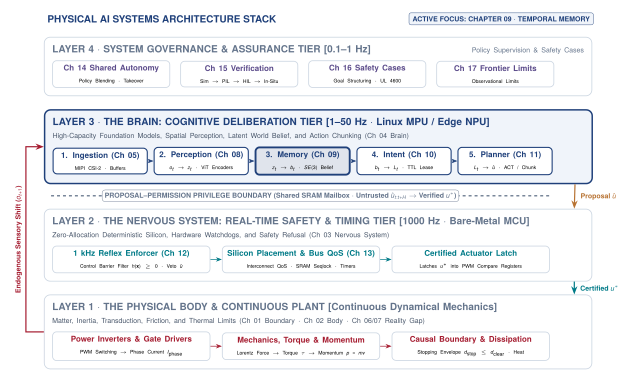
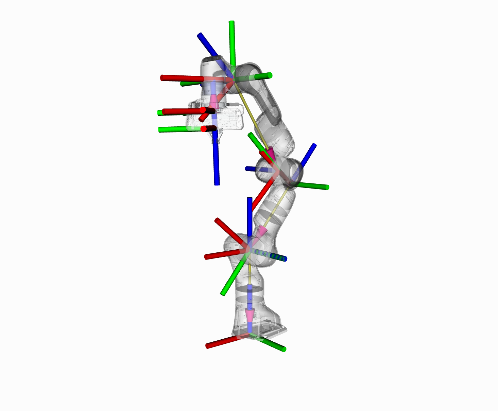
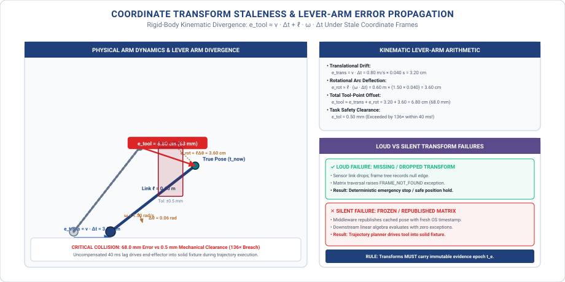
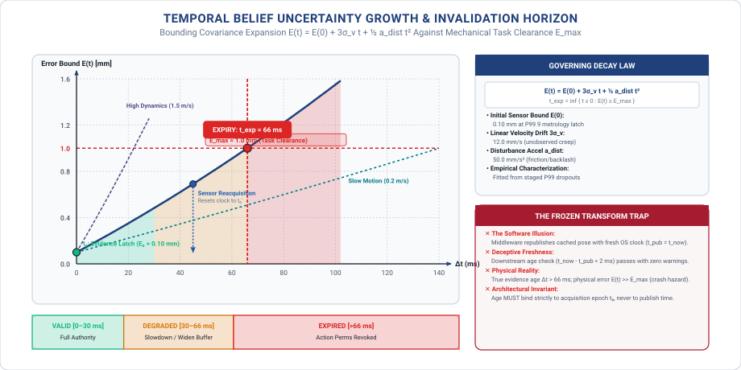

# Spatial Memory & Belief {#sec-memory}

::: {.column-margin}

\chapterminitoc

:::

::: {#fig-09-locator fig-env="figure" fig-pos="H" fig-cap="**Systems Organ Focus: Brain**: Dynamic spatial memory and temporal belief decay. As time elapses after the last physical sensor measurement ($t_0$), unobserved kinematic drift and process noise expand the spatial error covariance envelope $E(t)$. The memory system must enforce deterministic expiration ($t_{\mathrm{exp}}$) when uncertainty crosses task clearance margins, preventing stale or frozen transform representations from misleading downstream planners." fig-alt="Systems Organ Focus: Brain. Dynamic spatial memory and temporal belief decay. As time elapses after the last physical sensor measurement (t0), unobserved kinematic drift and process noise expand the spatial error covariance envelope E(t). The memory system must enforce deterministic expiration (t{\mathrm{exp}}) when uncertainty crosses task clearance margins, preventing stale or frozen transform representations from misleading downstream planners."}
{width="100%"}
:::

*How fast does a spatial belief turn into dangerous fiction once a sensor loses sight of an object?*

Physical interaction is fundamentally non-Markovian: an obstacle that passes behind an occluding pillar, a tool resting in a closed bin, or a surface whose compliance was probed seconds ago continues to exert physical constraints on the workspace. An embodied agent must maintain a coherent temporal belief state that tracks unseen entities without confusing past observations with present physical reality. As occlusion duration grows, spatial uncertainty expands, and unobserved objects move. Dependable physical AI architectures separate geometric covariance from existence probability, anchor perceptual tokens to structured transform trees, and enforce explicit temporal decay horizons ($t_{\text{exp}}$) so that phantom stale representations never induce catastrophic planning collisions.



::: {.callout-learning-objectives}
After studying this chapter, you will be able to:

1. State what a belief must carry in addition to a value, and why each part is required.
2. Predict how long a belief remains usable after its last measurement, from the dynamics rather than from habit.
3. Set an expiry from a measured decay rate and defend the number against mechanical clearance budgets.
4. Identify which belief failures are visible downstream and which are silent.
5. Contrast volumetric representations (TSDF voxel grids, OctoMaps, 3D Gaussian Splats) across memory footprints and query latencies.
6. Design lock-free coordinate transform and raycasting pipelines that assert negative evidence to prevent the frozen transform trap.

*Core chapter takeaway.* Belief has a rate of decay, and it must expire on that rate rather than on convenience. A frozen transform is more dangerous than a missing one, because nothing downstream can tell.

:::

## Preserving Spatial Belief {#sec-memory-9-1}

<!-- SECTION 9.1 -->
<!-- claim: Belief is what the machine holds between measurements, and it has an age and a rate at which it becomes fiction. -->
<!-- covers: Separate an observation, which records what a sensor saw at one instant, from a belief, which is carried forward after that instant. -->
<!-- covers: Open with a touching machine whose contact point may drift by at most 20 mm/s: a 2 mm allowable error leaves 100 ms after vision disappears. -->
<!-- covers: Define age from the last measurement that constrained the belief, not from the last time software copied, predicted, or published it. -->
<!-- covers: Show that an unchanged value can become unusable because the world continues changing while the stored number does not. -->
<!-- covers: Establish expiry as an interface event that marks the belief unusable; later chapters own the resulting refusal or fallback. -->
<!-- GROUNDING: number — how long a belief stays usable after the last measurement -->
<!-- FIGURE: A timeline that shows the last constraining measurement, the widening physical-error bound, the usability threshold, and the instant the belief expires. -->
<!-- DERIVE: The 100 ms opening lifetime from allowable error divided by bounded unobserved motion. -->

<!-- BEGIN -->
\lettrine{I}{n the four-tier} architectural hierarchy of physical AI (@sec-nervous), the **Brain** organ sits between incoming sensory observations and low-level nervous system enforcement. Within this cognitive layer, **Memory** serves as the temporal bridge that carries geometric, spatial, and physical beliefs forward in time (@fig-09-locator). A physical observation records what a sensor detected at a single discrete instant, fixing a measurement to a past timestamp and storing raw values that do not alter once written into memory. A **belief** is the estimate the machine carries forward after that instant, representing what the policy assumes to be true about the environment at the present moment. Between consecutive sensor frames, no physical system possesses direct knowledge of its surroundings. Instead, it operates entirely on belief, projecting past data into the immediate present. Because the physical world does not stop moving when an exposure ends or a packet drops, every belief carries an intrinsic rate of decay, drifting away from physical reality until it becomes fiction. As illustrated in the systems locator (@fig-09-locator), the primary systems challenge of memory is to bound this uncertainty growth against task-defined usability thresholds before stale data can misguide downstream planning.

In a canonical heterogeneous dual-brain System-on-Chip (SoC) architecture, this principle governs the division of responsibility between compute tiers. The unprivileged application processor (Linux MPU) maintains high-dimensional spatial memory structures, processes multi-modal perception, and generates candidate trajectory proposals. The real-time safety processor (deterministic bare-metal microcontroller unit, MCU) acts as the permission referee, enforcing hard temporal deadlines and physical validity limits. Because the Linux MPU experiences scheduling jitter, memory bus contention, and inference latency, it cannot be trusted to self-report temporal freshness. The real-time MCU evaluates every incoming proposal against independent hardware timers, revoking tracking authority the moment an unrefreshed belief breaches task safety margins.

Consider an analytical example of a manipulator tasked with touching a workpiece and regulating contact force against a moving assembly fixture. The fixture drifts relative to the robot base at a bounded velocity of at most $20\text{ mm/s}$. The mechanical compliance of the tooling permits an allowable positioning error of $2\text{ mm}$ before the tool either breaks contact entirely or generates excessive normal forces that overload the wrist sensor. Dividing the allowable error by the maximum drift velocity yields an operational lifetime of $100\text{ ms}$, calculated as $2\text{ mm} / (20\text{ mm/s}) = 0.100\text{ s}$. For the first $50\text{ ms}$ after the camera captures an image, the physical position of the workpiece remains safely within the tolerance window. At $100\text{ ms}$, the unobserved displacement reaches the outer boundary of the error budget. At $101\text{ ms}$, without a new measurement to constrain the state, the stored coordinate is no longer a reliable guide for action.

In software systems, data age is frequently measured from the instant a message was serialized, published over an inter-process bus, or updated in a shared memory table. In a physical AI system, this convention is dangerous. Propagating a state estimate through an extended Kalman filter at $1000\text{ Hz}$ or republishing a kinematic transform at $200\text{ Hz}$ creates a stream of fresh timestamps, but it does not refresh the underlying information. The true age of a belief is determined strictly by the timestamp of the last physical measurement that constrained it. A downstream tracking loop that reads a position estimate generated by dead reckoning or policy rollouts may observe a publish timestamp only $2\text{ ms}$ old, yet the physical error envelope continues to expand at the velocity of the unobserved drift. Timestamping an inference output or a cache lookup records when compute occurred, but it tells the receiver nothing about when reality was last checked.

In traditional computing architectures, an immutable variable in memory retains its validity indefinitely until an explicit write modifies its bits. A cached key-value pair remains accurate as long as the underlying database record has not signaled an invalidation. In physical systems, the failure mode is inverted. An unchanged value in memory becomes progressively less true because physical state evolves under external forces while the stored bits remain static. The bits do not spoil through corruption; they spoil through divergence. When a camera is occluded or an optical link drops frames, a register holding the last observed object pose retains its floating-point value with perfect numerical precision. If the machine continues executing trajectory commands against that frozen value, the discrepancy between the stored representation and physical geometry compounds with every millisecond of unobserved motion, eventually driving the end-effector into collision.

To prevent a machine from acting on stale data, memory systems must treat expiry as an explicit interface event. An expired belief is not a missing variable or a null pointer in an operating system; it is a formal boundary condition where the uncertainty envelope around a state estimate exceeds the safety tolerance of the task. The **belief state invalidation horizon** ($t_{\mathrm{exp}} = \inf \{ t \ge 0 : E(t) \ge E_{\max} \}$) marks the exact temporal deadline where unobserved kinematic drift and process noise drive accumulated error past the mechanical clearance or safety margin ($E_{\max}$), revoking tracking authority and forcing an explicit transition to a safe fallback mode. Managing this boundary requires treating every stored quantity not merely as a coordinate or a vector, but as an active contract defined by when it was measured, the reference frame in which it was established, and the bounded rate at which its validity drains away.

::: {#pri-evidence-epoch-invariant .callout-principle title="The Evidence Epoch Invariant"}
*Extrapolation advances timestamps without refreshing evidence age. Unmonitored belief drifts into physical failure. Never let an intermediate predictor, filter, or transport bridge reset the evidence acquisition epoch $t_0$; compute freshness is a software artifact, but physical freshness belongs strictly to the hardware transducer.*
:::
<!-- END -->

## What Memory Hands Over {#sec-memory-9-2}

<!-- SECTION 9.2 -->
<!-- claim: A belief is a value, a frame, an age, and a rate at which it is losing validity. -->
<!-- covers: Define the value with its quantity, units, and entity identity so that downstream consumers know what the number describes. -->
<!-- covers: Carry the frame because identical coordinates in different frames designate different physical states. -->
<!-- covers: Carry the time of the last constraining evidence; a prediction or republishing operation must not reset that time. -->
<!-- covers: Add the error bound at the last update as well as its growth law, because age and decay rate alone cannot determine present validity. -->
<!-- covers: Express decay in physical units and within a stated operating envelope rather than as an unqualified confidence score. -->
<!-- covers: Show how a consumer combines initial error, elapsed time, and growth to compare the current bound with its own tolerance. -->
<!-- GROUNDING: mechanism — a belief as a value, a frame, an age, and a decay rate -->
<!-- DERIVE: The minimum record fields by showing that current error requires both an initial bound and a growth law, such as \(e(t)=e_0+rt\). -->

<!-- BEGIN -->
A belief passed across a bus or retrieved from a buffer cannot simply be a raw array of floating-point numbers. An unannotated vector such as $[0.142, -0.051, 0.812]$ conveys nothing about what physical entity is being described, what physical dimension is represented, or how that quantity is scaled. A downstream controller receiving raw coordinates without metadata must rely on implicit conventions established at compile time. If an estimator produces positions in meters while an actuator controller expects millimeters, or if an angular rate is mistaken for an absolute orientation, the resulting command drives motor current to saturation limits within milliseconds. To prevent misinterpretation across software boundaries, a belief record must first specify the entity identity, the physical quantity, and the measurement units. The consumer must be able to verify that the value represents the center of mass of a specific workpiece in meters, or the normal contact force on a fingertip in newtons, before routing that number into a control law.

Specifying the quantity and units remains incomplete without binding the value to a concrete reference frame. Identical spatial coordinates describe entirely different physical realities depending on the origin and orientation of the coordinate system. A Cartesian position $[0.142, -0.051, 0.812]\text{ m}$ designates a point suspended in free space when evaluated in the robot base frame, but represents a point several hundred millimeters inside a rigid fixture when interpreted in the tool flange frame. Because kinematic links flex, joints move, and coordinate transforms update at varying rates, a belief record must carry an explicit frame identifier. Carrying the frame allows the receiving node to look up the corresponding spatial transformation tree and project the stored geometry into the local frame required by the actuator, preventing the controller from acting on geometric misalignments caused by moving kinematic chains.

Geometry and identity describe the physical state at a single moment, but memory must also capture the temporal anchor of that state. The timestamp attached to a belief must record the exact epoch $t_0$ of the physical interaction or optical exposure that last constrained the estimate. In distributed architectures, intermediate nodes often republish data, execute Kalman filter prediction steps, or run forward kinematic propagations to maintain high-rate control streams. A prediction step or cache refresh updates the transmission timestamp, but it does not add physical evidence. If an intermediate process overwrites $t_0$ with the current system clock during a forward rollout, downstream safety monitors observe a deceptive stream of fresh timestamps while the underlying state continues to drift unchecked. Preserving the original measurement epoch $t_0$ across all serialization and filtering stages ensures that consumers measure the age of the information against the physical world rather than against the scheduling frequency of the local computer.

Knowing the measurement epoch $t_0$ establishes elapsed time $\Delta t = t - t_0$, but elapsed time alone cannot determine whether a belief is valid for a given action. Two estimates of identical age diverge at different rates depending on physical constraints. A workpiece firmly held in a pneumatic vise maintains sub-millimeter positional certainty after several seconds of sensor occlusion, whereas the same workpiece sliding along a moving conveyor belt accumulates substantial position error in fifty milliseconds. Therefore, a belief record must include both the initial uncertainty bound $e_0$ established at the epoch of measurement and an explicit growth law that quantifies how that uncertainty expands over time.

The minimum record fields necessary for a consumer to evaluate a stored state can be derived directly from the requirement to bound current error. Let $e(t)$ represent the upper bound of the discrepancy between the stored value and true physical state at time $t$. If an estimator establishes a state at time $t_0$ with an initial measurement uncertainty $e_0$, and external disturbances or unmodeled velocities cause the true state to diverge at a maximum rate $r$, the upper bound on error at current time $t$ obeys the linear expansion $e(t) = e_0 + r(t - t_0)$. As an analytical example, consider a tactile sensor array that establishes the initial slip displacement of a grasped object with an uncertainty $e_0 = 0.40\text{ mm}$ at $t_0 = 1.200\text{ s}$. If the object slides beneath the gripper at a maximum unmeasured velocity $r = 15.0\text{ mm/s}$, the error bound after an unobserved interval of $\Delta t = 80\text{ ms}$ expands to $e(t) = 0.40\text{ mm} + (15.0\text{ mm/s})(0.080\text{ s}) = 1.60\text{ mm}$. Omitting either $e_0$ or $r$ leaves the consumer unable to compute $e(t)$, demonstrating that an initial bound and an expansion rate are both structurally required.

Expressing uncertainty through physical bounds and expansion rates distinguishes a physical AI belief from a probabilistic confidence score. An object detection network might output a class confidence of $0.94$, but a downstream position controller cannot convert a unitless probability into an actuator displacement margin. A confidence score of $0.94$ provides no information about whether an obstacle boundary is uncertain by $2.0\text{ mm}$ or by $200\text{ mm}$, nor does it indicate how rapidly that boundary moves when occlusion occurs. A physical memory record must express its initial bound $e_0$ and expansion rate $r$ in concrete physical dimensions such as meters, radians, or newtons per second. Furthermore, these rates are valid only within a defined operating envelope, such as a maximum assumed acceleration or a verified contact friction coefficient. If physical operating conditions exceed that envelope, the expansion rate is no longer guaranteed, and the belief record must be treated as invalid.

When memory hands over a tuple containing value, reference frame, measurement epoch $t_0$, initial bound $e_0$, and growth rate $r$, the consumer executes a deterministic verification step before applying the data to physical control. The consumer possesses an application tolerance $\epsilon_{\text{tol}}$ dictated by the physical task. In a precision insertion operation with a radial clearance of $0.80\text{ mm}$, the controller requires that positional uncertainty remain below $\epsilon_{\text{tol}} = 0.80\text{ mm}$. Upon reading the belief record at current time $t_{\text{now}}$, the consumer calculates the elapsed time $\Delta t = t_{\text{now}} - t_0$, evaluates the present error bound $e(t_{\text{now}}) = e_0 + r \Delta t$, and compares the result directly against $\epsilon_{\text{tol}}$. If $e(t_{\text{now}}) \le \epsilon_{\text{tol}}$, the controller executes the motion. If $e(t_{\text{now}}) > \epsilon_{\text{tol}}$, the belief has expired, and the controller transitions immediately to a safe holding state or an active search routine without waiting for an external invalidation signal.

::: {.callout-definition title="The Spatial Belief Contract"}
A **spatial belief contract** is the explicit typed tuple $(\mathbf{x}, \mathcal{F}, t_0, e_0, r, \mathcal{E})$ governing state handoffs between memory and control, binding the estimated value ($\mathbf{x}$) to an unambiguous coordinate frame ($\mathcal{F}$), a physical acquisition epoch ($t_0$), an initial error bound ($e_0$), a validated growth rate ($r$), and an operating envelope ($\mathcal{E}$).
:::
<!-- END -->

## A State Has an Epoch {#sec-memory-9-3}

<!-- SECTION 9.3 -->
<!-- claim: Acquisition time, estimation time, and publication time are three different instants, and a state that does not distinguish them cannot be aligned with anything. -->
<!-- covers: Three timestamps, and why collapsing them loses information -->
<!-- covers: Bounded synchronisation error between clocks, and what it costs in position -->
<!-- covers: Aligning two states that were never measured at the same moment -->
<!-- covers: What a consumer must be told to use a state safely -->
<!-- GROUNDING: number — two clocks with bounded offset, and the position error that follows -->

<!-- BEGIN -->
Every state reported by a sensor or estimated by a model corresponds to a specific point in time, termed its **epoch**. In a physical computing pipeline, that state passes through three distinct temporal boundaries before a controller can act on it. The **acquisition epoch** ($t_0$) is the nanosecond-precise timestamp recording the exact physical instant when energy transduction occurred at the hardware sensor boundary, such as photons striking a photodiode array or a digital register latching an encoder count.[^fn-hw-timer-capture] The **estimation epoch** ($t_{\text{est}}$) marks the instant the computational pipeline (whether a state estimator or neural network) completed its mathematical inference over those measurements. The **publication epoch** ($t_{\text{pub}}$) marks the instant the serialized message was committed to a communication bus or network queue for dispatch to downstream consumers.

[^fn-hw-timer-capture]: Microcontroller timer input-capture units latch signal edges into shadow registers upon external interrupt. Reading capture registers without atomic synchronization against overflow interrupt flags induces 16-bit or 32-bit counter aliasing, corrupting acquisition epochs by up to the full counter period (e.g., $65.5\text{ ms}$).

Collapsing these three timestamps into a single receipt or transmission timestamp destroys the physical validity of the state. If an inference accelerator requires $45\text{ ms}$ to execute an object detection model and the operating system incurs another $5\text{ ms}$ of scheduling and serialization latency before publication, tagging the resulting object pose with the publication time hides a $50\text{ ms}$ physical displacement. During that $50\text{ ms}$ interval, gravity, momentum, and contact forces continue to act on the physical system without pause. If a conveyor belt carries a workpiece at $0.60\text{ m/s}$, a downstream gripper that treats the publication timestamp as the measurement epoch assumes the workpiece is located where it was $50\text{ ms}$ in the past, introducing an unmodeled position error of $(0.60\text{ m/s})(0.050\text{ s}) = 30.0\text{ mm}$. A state that records only when data became available tells the consumer nothing about the physical instant the measurement represents, making temporal alignment impossible.

Even when a system records true acquisition epochs, physical AI architectures rely on distributed processing nodes whose local oscillator clocks drift independently. Synchronizing these distributed clocks over standard bus networks introduces a bounded synchronization error, and that temporal uncertainty translates directly into spatial uncertainty.[^fn-hw-ptp-canfd] Consider an analytical example where an autonomous manipulator tracks a moving assembly target. The vision processor and the joint motion controller run on separate compute boards synchronized across an Ethernet bus using the Precision Time Protocol (PTP, IEEE 1588), maintaining a bounded clock offset of $\delta t = \pm 1.5\text{ ms}$. If the target moves relative to the camera at an operational velocity of $v = 1.20\text{ m/s}$, the clock offset alone creates an irrecoverable spatial positioning uncertainty of $e_{\text{sync}} = v \cdot \delta t = (1.20\text{ m/s})(0.0015\text{ s}) = 1.80\text{ mm}$. In an assembly operation with a mechanical clearance tolerance of $0.50\text{ mm}$, an uncalibrated clock synchronization bound of $1.5\text{ ms}$ causes physical interference and tool collision before any controller tracking latency is added. The physical error budget must therefore allocate margin for clock synchronization jitter alongside sensor resolution and structural deflection.

Real physical systems never sample all relevant state variables simultaneously. A tactile array might latch normal force readings at $t_1 = 12.0\text{ ms}$, an optical tracking camera might finish sensor integration at $t_2 = 18.5\text{ ms}$, and joint optical encoders might sample angular positions at $t_3 = 21.0\text{ ms}$. Because these observations occur at different epochs, they cannot be combined through direct algebraic operations. Fusing a camera observation at $t_2$ with an encoder observation at $t_3$ requires the consumer to project one state across the temporal gap $\Delta t = |t_3 - t_2| = 2.5\text{ ms}$ using explicit kinematic models and bounded velocities. Without the true acquisition epoch for each individual signal, the alignment calculation cannot determine the sign or magnitude of $\Delta t$. Extrapolating state without an accurate epoch causes the fusion algorithm to compute spatial offsets from fictitious temporal baselines, compounding errors across every fusion cycle.

For a consumer to use a state safely, the memory record must provide four explicit quantities: the physical state value, the precise acquisition epoch referenced to a synchronized system clock, the upper bound on clock synchronization uncertainty, and the maximum rate of physical state change. Given these quantities, the consumer computes the exact elapsed duration between the acquisition epoch and the execution deadline, evaluates the worst-case expansion of the error bound, and determines whether the state remains within task tolerances. Handing over a state without its acquisition epoch leaves the consumer blind to transport delays and scheduling jitter, turning deterministic control into open-loop guesswork. Because physical geometry also changes as bodies move through space, spatial transforms between reference frames are subject to the same temporal decay, carrying their own distinct measurement epochs.

[^fn-hw-ptp-canfd]: Fieldbus protocols exhibit distinct clock synchronization jitter envelopes: IEEE 1588 PTP over Ethernet achieves $\delta t < 1.0\ \mu\text{s}$, EtherCAT Distributed Clocks (DC) achieve $<100\text{ ns}$ hardware SYNC0 jitter, and CAN-FD bit-phase synchronization yields $\pm 10\text{--}50\ \mu\text{s}$.
<!-- END -->

## Reference Frames and Volumetric Representations {#sec-memory-9-4}

<!-- SECTION 9.4 -->
<!-- claim: A frame mismatch turns a numerically valid proposal into force applied at the wrong place, and the transform that produced it has an epoch like everything else. -->
<!-- covers: Establish the epoch requirement: a transform is only valid at the time it was measured, and composing transforms of different ages produces a pose that was never true. -->
<!-- covers: Show what a stale transform costs in displacement at realistic speeds, which is the same arithmetic as Chapter 2's delay-as-distance applied to geometry. -->
<!-- covers: Name the condition under which a frame mismatch must revoke permission rather than be corrected: when the machine cannot establish which frame a number is in. -->
<!-- covers: Explain why a frozen transform is worse than a missing one, because nothing downstream can tell the difference between fresh and stuck. -->
<!-- covers: Cite the composition mathematics to a robotics text. What this book owns is the epoch, the propagation, and the refusal. -->
<!-- GROUNDING: number — one frame mismatch, in centimetres at the tool -->
<!-- FIGURE: A paired calculation that shows the same reported point landing at two tool locations under the correct and mismatched frames, with the physical error labeled in centimeters. -->
<!-- DERIVE: Tool-point error from the omitted translation and the lever-arm relation \(e\approx \ell\theta\), rather than quoting a frame-mismatch distance. -->

<!-- BEGIN -->
Every geometric coordinate is meaningless without the reference frame in which it was observed, and every reference frame in a moving machine moves. Spatial transformation matrices express translations and rotations between coordinate frames, allowing an onboard computer to map a target detected by a camera into joint torques applied at an end-effector (@fig-09-robot-transform-tree). In rigorous spatial mechanics, rigid-body poses belong to the Special Euclidean Lie group $SE(3) = SO(3) \times \mathbb{R}^3$. A homogeneous transformation matrix mapping coordinates from frame $B$ to frame $A$ at time $t$ is expressed as
$$\mathbf{T}_A^B(t) = \begin{bmatrix} \mathbf{R}_A^B(t) & \mathbf{p}_A^B(t) \\ \mathbf{0}^T & 1 \end{bmatrix} \in SE(3)$$
where $\mathbf{R}_A^B(t) \in SO(3)$ is a $3 \times 3$ orthonormal rotation matrix satisfying $\mathbf{R}^T \mathbf{R} = \mathbf{I}$ and $\det(\mathbf{R}) = +1$, and $\mathbf{p}_A^B(t) \in \mathbb{R}^3$ is the translation vector designating the origin of frame $B$ relative to frame $A$.

A robot maintains its spatial relationships as a directed acyclic coordinate transform tree $\mathcal{T} = (\mathcal{V}, \mathcal{E})$, where each vertex $v \in \mathcal{V}$ denotes a physical or virtual coordinate frame (e.g., base link, camera sensor, wrist flange, tool center point, workpiece target), and each directed edge $(i, j) \in \mathcal{E}$ stores a time-varying transform $\mathbf{T}_i^j(t)$ parameterized by joint encoder angles and static link offsets [@lynch2017modern; @craig2005introduction].[^fn-hw-spatial-dma] What classical mechanics treats as a timeless geometric relationship, however, is in a physical computing system a time-stamped message subject to finite transport delays, processing latency, and clock drift. A coordinate transform is valid only at the exact epoch when its underlying physical geometry was measured. When an onboard computer composes a multi-link kinematic chain across a directed path $0 \to 1 \to \dots \to K$, the end-to-end transform is computed by sequential matrix multiplication:
$$\mathbf{T}_0^K(t) = \prod_{k=1}^K \mathbf{T}_{k-1}^k(t_k)$$
When the measurement epochs $t_k$ across individual edges diverge (due to asynchronous joint encoder sampling, bus serialization queues, or dropped camera frames), the resulting matrix product does not describe the physical machine at any single instant $t$. It evaluates a synthetic, hybrid pose that never existed in physical reality.[^fn-hw-seqlock-dmb]

::: {#fig-09-robot-transform-tree fig-env="figure" fig-pos="t" fig-cap="**Kinematic Coordinate Frame Tree on an Articulated Manipulator**: Physical and software transformation frame hierarchy for a 7-DOF Franka Emika Panda manipulator inside RViz. The coordinate tree anchors the base link ($\texttt{panda\_link0}$) to the world origin and recursively chains joint frames ($\texttt{panda\_link1}$ through $\texttt{panda\_link7}$) to the mechanical flange ($\texttt{panda\_link8}$), nominal end-effector ($\texttt{panda\_NE}$), tool center point ($\texttt{panda\_EE}$), finger graspers ($\texttt{panda\_hand}$, $\texttt{panda\_leftfinger}$, $\texttt{panda\_rightfinger}$), and stiffness frame ($\texttt{panda\_K}$). Each directed edge represents a time-varying homogeneous transformation matrix $\mathbf{T}_{A}^{B}(t)$ parameterized by encoder angles and kinematic offsets. Composing transforms of disparate measurement epochs injects lever-arm positioning error $e_{\mathrm{tool}} \approx e_{\mathrm{trans}} + \ell \Delta \theta$, while a frozen transform edge in the tree silently guides motion against phantom coordinates. (Credit: Franka Robotics GmbH / ROS Community, CC BY 4.0)." fig-alt="Kinematic Coordinate Frame Tree on an Articulated Manipulator. Physical and software transformation frame hierarchy for a 7-DOF Franka Emika Panda manipulator inside RViz. The coordinate tree anchors the base link (panda_link0) to the world origin and recursively chains joint frames (panda_link1 through panda_link7) to the mechanical flange (panda_link8), nominal end-effector (panda_NE), tool center point (panda_EE), finger graspers (panda_hand, panda_leftfinger, panda_rightfinger), and stiffness frame (panda_K). Each directed edge represents a time-varying homogeneous transformation matrix parameterized by encoder angles and kinematic offsets. Composing transforms of disparate measurement epochs injects lever-arm positioning error e_tool ≈ e_trans + ℓ Δθ, while a frozen transform edge in the tree silently guides motion against phantom coordinates. (Credit: Franka Robotics GmbH / ROS Community, CC BY 4.0)."}
{width="85%"}
:::

The cost of an expired transform is direct spatial displacement (@fig-frame-staleness-error). Applying the delay-as-distance principle from @sec-body to kinematics, uncompensated latency translates directly into geometric positioning error through the lever arm of the linkages. For an articulated kinematic chain with $N$ moving joints, an uncompensated latency $\Delta t_i$ at joint $i$ moving with angular velocity $\boldsymbol{\omega}_i$ induces a spatial velocity $\mathbf{v}_{\text{tool}} = \boldsymbol{\omega}_i \times (\mathbf{p}_{\text{tool}} - \mathbf{p}_i)$ at the tool tip. Over an unobserved latency window, the cumulative tool-point positioning error expands across the articulated chain according to
$$\Delta \mathbf{p}_{\text{tool}} \approx \Delta \mathbf{p}_{\text{base}} + \sum_{i=1}^N \left( \boldsymbol{\omega}_i \Delta t_i \right) \times (\mathbf{p}_{\text{tool}} - \mathbf{p}_i)$$
where $\ell_i = \|\mathbf{p}_{\text{tool}} - \mathbf{p}_i\|$ represents the effective lever arm from joint $i$ to the tool center point.

Consider an analytical example of a manipulator holding a tool point at a distance of $\ell = 0.60\text{ m}$ from its wrist assembly. Suppose the base and wrist rotate at an angular velocity of $\omega = 1.50\text{ rad/s}$ while the arm translates through space at $v = 0.80\text{ m/s}$. If a tracking pipeline publishes a camera-to-tool transform with an uncompensated staleness of $\Delta t = 40\text{ ms} = 0.040\text{ s}$, the translation of the frame drifts by $e_{\text{trans}} = v \cdot \Delta t = (0.80\text{ m/s})(0.040\text{ s}) = 0.032\text{ m} = 3.20\text{ cm}$. Over the same interval, the angular orientation rotates through $\Delta \theta = \omega \cdot \Delta t = (1.50\text{ rad/s})(0.040\text{ s}) = 0.060\text{ rad}$. Through the lever-arm relation $e_{\text{rot}} \approx \ell \Delta \theta$, this angular shift swings the tool point across an arc of $e_{\text{rot}} \approx (0.60\text{ m})(0.060\text{ rad}) = 0.036\text{ m} = 3.60\text{ cm}$. Summing the translational shift and the lever-arm deflection yields a total tool-point positioning error of $e_{\text{tool}} \approx e_{\text{trans}} + \ell \Delta \theta = 3.20\text{ cm} + 3.60\text{ cm} = 6.80\text{ cm}$. In a precision contact task where an end-effector regulates force against a workpiece, a spatial discrepancy of $6.80\text{ cm}$ commands an actuator to drive through solid metal before tactile sensors can register unexpected resistance.

::: {#pri-leverage-of-staleness .callout-principle title="The Leverage of Staleness"}
*Transform staleness multiplies through kinematic link lengths; an uncompensated millisecond of lag at the robot base swings the tool center point through centimeters of unobserved deflection.*
:::

::: {#fig-frame-staleness-error fig-env="figure" fig-pos="t" fig-cap="**Coordinate Transform Staleness and Lever-Arm Kinematic Error Propagation**: Rigid-body spatial divergence induced by an uncompensated $40\text{ ms}$ transform latency on a manipulator arm translating at $v = 0.80\text{ m/s}$ and rotating at $\omega = 1.50\text{ rad/s}$. Base translation shifts the tool frame by $e_{\text{trans}} = v \Delta t = 3.20\text{ cm}$, while arm link rotation ($\ell = 0.60\text{ m}$) swings the tool point through an arc $e_{\text{rot}} \approx \ell \omega \Delta t = 3.60\text{ cm}$, yielding a cumulative tool-point positioning error of $e_{\text{tool}} \approx 6.80\text{ cm}$ ($68.0\text{ mm}$) that breaches the $\pm 0.50\text{ mm}$ task clearance by $136\times$. Whereas a missing transform triggers a loud exception and safe holding reflex, a frozen transform republished with fresh system timestamps evaluates with zero linear algebra exceptions, silently driving the tool into collision." fig-alt="Coordinate Transform Staleness and Lever-Arm Kinematic Error Propagation. Rigid-body spatial divergence induced by an uncompensated 40 ms transform latency on a manipulator arm translating at v = 0.80 m/s and rotating at ω = 1.50 rad/s. Base translation shifts the tool frame by e_trans = v Δt = 3.20 cm, while arm link rotation (ℓ = 0.60 m) swings the tool point through an arc e_rot ≈ ℓ ω Δt = 3.60 cm, yielding a cumulative tool-point positioning error of e_tool ≈ 6.80 cm (68.0 mm) that breaches the ±0.50 mm task clearance by 136×. Whereas a missing transform triggers a loud exception and safe holding reflex, a frozen transform republished with fresh system timestamps evaluates with zero linear algebra exceptions, silently driving the tool into collision."}
{width="100%"}
:::

Beyond discrete kinematic frames, an embodied agent must also maintain continuous volumetric spatial memory to track unobserved obstacles, plan collision-free paths, and support real-time reactive grasping (@fig-09-octomap-volumetric-mapping). By executing **volumetric free-space raycasting** along sensor sightlines, spatial memory actively updates 3D voxel hierarchies (such as OctoMap or OpenVDB) and deterministically clears unoccupied voxels. The foundational algorithm for volumetric raycasting is the 3D Differential Digital Analyzer (3D-DDA) fast voxel traversal [@amanatides1987fast].[^fn-hw-cuda-octree] For a sensor sightline ray $\mathbf{r}(s) = \mathbf{o} + s\mathbf{d}$ ($s \ge 0$) originating at optical origin $\mathbf{o} \in \mathbb{R}^3$ with unit direction $\mathbf{d} \in \mathbb{R}^3$ through a discrete voxel grid of isotropic pitch $\Delta v$, the traversal steps through voxel boundaries $(u, v, w)$ by maintaining next-plane crossing parameters:
$$t_{\text{next}, x} = \frac{(u + \operatorname{step}_x)\Delta v - o_x}{d_x}, \quad \Delta t_x = \frac{\Delta v}{|d_x|}$$
At each iteration, the algorithm advances along the dimension with minimal $t_{\text{next}}$, achieving $O(1)$ arithmetic operations per traversed voxel cell.

Crucially, as the ray traverses free space from $s = 0$ to $s = z_{\text{depth}} - \delta$, the pipeline updates occupancy log-odds $L(\mathbf{m}) = \ln \frac{P(\mathbf{m})}{1 - P(\mathbf{m})}$ by asserting **negative evidence**:
$$L(\mathbf{m}_i) \leftarrow L(\mathbf{m}_i) + l_{\text{free}}, \quad l_{\text{free}} = \ln \left( \frac{P(\text{occ} \mid \text{free})}{1 - P(\text{occ} \mid \text{free})} \right) < 0$$
At the terminal measurement interval $[z_{\text{depth}} - \delta, z_{\text{depth}} + \delta]$, positive evidence is integrated:
$$L(\mathbf{m}_{\text{end}}) \leftarrow L(\mathbf{m}_{\text{end}}) + l_{\text{occ}}, \quad l_{\text{occ}} = \ln \left( \frac{P(\text{occ} \mid \text{hit})}{1 - P(\text{occ} \mid \text{hit})} \right) > 0$$
This active assertion of negative evidence along sensor sightlines is the exact computational mechanism that invalidates phantom obstacle tracks when dynamic objects leave a region, pruning ghost tracks without waiting for passive timeout decay.

For closed-loop trajectory optimization and reactive grasping, discrete occupancy grids are insufficient because they lack continuous spatial derivatives. Physical AI systems employ **Truncated Signed Distance Fields (TSDFs)** [@curless1996volumetric; @newcombe2011kinectfusion; @oleynikova2017voxblox].[^fn-math-tsdf-fusion] For any spatial query point $\mathbf{x} \in \mathbb{R}^3$, let $\pi(\mathbf{x})$ denote the camera pinhole perspective projection and $\mathbf{p}_{\text{cam}}$ the optical center. The projective signed distance is $D(\mathbf{x}) = (\mathbf{x} - \mathbf{p}_{\text{cam}})_z - z_{\text{depth}}(\pi(\mathbf{x}))$. Truncating by distance metric margin $\mu$ yields normalized signed distance $d(\mathbf{x}) = \max\left(-1, \min\left(1, D(\mathbf{x})/\mu\right)\right)$. Voxels integrate incoming frames through running weighted recursive fusion:
$$D_k(\mathbf{x}) = \frac{W_{k-1}(\mathbf{x}) D_{k-1}(\mathbf{x}) + w_k d_k(\mathbf{x})}{W_{k-1}(\mathbf{x}) + w_k}, \quad W_k(\mathbf{x}) = \min(W_{k-1}(\mathbf{x}) + w_k, W_{\max})$$
Tri-linear interpolation across adjacent TSDF voxel vertices yields exact continuous spatial distance metrics and analytical spatial gradients $\nabla d(\mathbf{x}) = \frac{\mathbf{x} - \mathbf{x}_{\text{surf}}}{\|\mathbf{x} - \mathbf{x}_{\text{surf}}\|}$. Gradient-based motion planners utilize this continuous derivative to evaluate collision cost gradients $\nabla_{\mathbf{x}} \mathcal{C}_{\text{coll}}(\mathbf{x}) = -\nabla d(\mathbf{x})$, pushing trajectory waypoints smoothly out of obstacle boundaries.

Moving beyond fixed voxel lattices, **3D Gaussian Splatting (3DGS)** [@kerbl20233d; @matsuki2024gaussian] provides continuous, spatially indexed, and differentiable spatial memory. A scene is represented as a collection of $M$ explicit anisotropic 3D ellipsoidal Gaussians:
$$G_i(\mathbf{x}) = \exp\left( -\frac{1}{2} (\mathbf{x} - \boldsymbol{\mu}_i)^T \mathbf{\Sigma}_i^{-1} (\mathbf{x} - \boldsymbol{\mu}_i) \right)$$
where center $\boldsymbol{\mu}_i \in \mathbb{R}^3$ and spatial covariance $\mathbf{\Sigma}_i = \mathbf{R}_i \mathbf{S}_i \mathbf{S}_i^T \mathbf{R}_i^T$ are parameterized by a unit quaternion $\mathbf{q}_i \in SO(3)$ and scale vector $\mathbf{s}_i \in \mathbb{R}^3$, accompanied by opacity $\alpha_i \in [0, 1]$ and spherical harmonics color coefficients $\mathbf{c}_i$. During robot operation, online spatial memory updates optimize Gaussian parameters in real time via tile-based differentiable rasterization and gradient backpropagation under combined photometric and geometric depth losses:
$$\mathcal{L} = (1 - \lambda) \|\mathbf{I} - \hat{\mathbf{I}}\|_1 + \lambda \mathcal{L}_{\text{D-SSIM}} + \lambda_d \|\mathbf{D} - \hat{\mathbf{D}}\|_1$$
Gaussians are adaptively densified in under-reconstructed areas and pruned in empty regions, enabling real-time photorealistic novel-view synthesis and continuous collision querying without the memory explosion of uniform volumetric grids (@tbl-09-spatial-rep).

::: {#fig-09-octomap-volumetric-mapping fig-env="figure" fig-pos="t" fig-cap="**Probabilistic 3D Volumetric Mapping and Hierarchical Octree Space Subdivision**: Empirical 3D spatial memory representation reconstructed from a physical mobile robot traversing an indoor corridor with a tilting LiDAR scanner [@hornung2013octomap]. (a) Raw 3D point cloud acquired during robot motion, subject to sensor noise and finite field-of-view occlusions. (b) Volumetric OctoMap voxel representation modeling 3D space as an 8-ary hierarchical tree, where occupied volumes are probabilistically updated and stored across variable resolutions. (c) Explicit free-space raycasting and lossless octree pruning, differentiating verified traversable space (white voxels) from occupied obstacles (dark voxels) and unobserved unknown regions. By maintaining explicit free-space evidence along sensor sightlines, spatial memory actively invalidates phantom obstacle tracks without waiting for arbitrary software timeouts. (Credit: Hornung et al. / Autonomous Intelligent Systems Lab, University of Freiburg, CC BY 3.0)." fig-alt="Probabilistic 3D Volumetric Mapping and Hierarchical Octree Space Subdivision. Empirical 3D spatial memory representation reconstructed from a physical mobile robot traversing an indoor corridor with a tilting LiDAR scanner [@hornung2013octomap]. (a) Raw 3D point cloud acquired during robot motion, subject to sensor noise and finite field-of-view occlusions. (b) Volumetric OctoMap voxel representation modeling 3D space as an 8-ary hierarchical tree, where occupied volumes are probabilistically updated and stored across variable resolutions. (c) Explicit free-space raycasting and lossless octree pruning, differentiating verified traversable space (white voxels) from occupied obstacles (dark voxels) and unobserved unknown regions. By maintaining explicit free-space evidence along sensor sightlines, spatial memory actively invalidates phantom obstacle tracks without waiting for arbitrary software timeouts. (Credit: Hornung et al. / Autonomous Intelligent Systems Lab, University of Freiburg, CC BY 3.0)."}
{width="95%"}
:::

| Spatial Representation Paradigm                                                                      | Underlying Geometric Primitive                                                                 | Memory Footprint ($300\,\text{m}^3 @ 1\,\text{cm}$)      | Dynamic Update Latency ($10^5\,\text{pts}$)            | Collision / Raycast Query Latency                            | Continuous Gradient $\nabla d(\mathbf{x})$                                          | Differentiable Fusion Support                               | Primary Execution Target & Bottleneck            |                                          |                                               |
|:-----------------------------------------------------------------------------------------------------|:-----------------------------------------------------------------------------------------------|:---------------------------------------------------------|:-------------------------------------------------------|:-------------------------------------------------------------|:------------------------------------------------------------------------------------|:------------------------------------------------------------|:-------------------------------------------------|------------------------------------------|-----------------------------------------------|
| **Octree Occupancy Grid** (e.g., OctoMap)                                                            | Hierarchical 8-ary tree with log-odds occupancy voxels                                         | $45 - 120\text{ MB}$ (pointer overhead)                  | $15 - 45\text{ ms}$ (CPU pointer recursion)            | $2.5 - 8.0\,\mu\text{s}$ per ray                             | Discontinuous (finite difference only)                                              | None (discrete binary/probabilistic voting)                 | Host CPU (pointer chasing & L1/L2 cache misses)  |                                          |                                               |
| **Hierarchical Sparse VDB** (e.g., OpenVDB / NanoVDB)                                                | Dynamic $B$-tree array ($32^3 \to 16^3 \to 8^3$ leaf tiles)                                    | $18 - 40\text{ MB}$ (linearized sparse leaf buffers)     | $2.0 - 6.5\text{ ms}$ (SIMD/GPU bitmask traversal)     | $0.15 - 0.45\,\mu\text{s}$ per ray (DDA hardware step)       | $C^0$ tri-linear spatial gradient                                                   | Partial (voxel-grid differentiable splatting)               | Edge GPU / SIMD Host (DRAM bus bandwidth bound)  |                                          |                                               |
| **Truncated SDF (TSDF)** (e.g., Voxblox / KinectFusion)                                              | Voxel-hashing spatial blocks with metric distance weights                                      | $60 - 180\text{ MB}$ (dense allocated sub-blocks)        | $1.2 - 4.0\text{ ms}$ (GPU projective ray integration) | $0.08 - 0.25\,\mu\text{s}$ (direct hash index lookup)        | Exact metric $\nabla d(\mathbf{x}) = \frac{\mathbf{x} - \mathbf{x}_{\text{surf}}}{\ | \mathbf{x} - \mathbf{x}_{\text{surf}}\                      | }$                                               | Moderate (mesh zero-crossing extraction) | Embedded GPU / FPGA (Shared SRAM/L2 capacity) |
| **Continuous Neural SDF** (e.g., Instant-NGP / NeuS)                                                 | Multi-resolution spatial hash table + shallow MLP                                              | $8 - 25\text{ MB}$ (quantized hash table weights)        | $30 - 120\text{ ms}$ (online gradient backpropagation) | $12 - 50\,\mu\text{s}$ (neural network batch inference)      | Analytic autograd $\nabla_{\mathbf{x}} f_\theta(\mathbf{x}) \in C^\infty$           | Full (photometric / geometric end-to-end loss)              | Dedicated NPU / GPU (Tensor core compute bound)  |                                          |                                               |
| **3D Gaussian Splatting [@kerbl20233d; @matsuki2024gaussian] (3DGS)** (e.g., Spatially Indexed 3DGS) | Parametric anisotropic 3D ellipsoids ($\boldsymbol{\mu}, \mathbf{\Sigma}, \alpha, \mathbf{c}$) | $35 - 90\text{ MB}$ ($5 \times 10^5$ explicit Gaussians) | $8 - 22\text{ ms}$ (tile-based differentiable raster)  | $0.05 - 0.18\,\mu\text{s}$ (radix-sorted tile rasterization) | Explicit spatial derivative $\nabla_{\mathbf{x}} G(\mathbf{x})$                     | Full (sub-millisecond photorealistic differentiable render) | Edge GPU / High-End SoC (Memory bandwidth bound) |                                          |                                               |
: **Volumetric Spatial Memory Representation Trade-Offs in Physical AI Architectures**: Quantitative comparison of continuous and discrete 3D spatial memory structures across storage footprint (evaluated for a nominal $10\text{ m} \times 10\text{ m} \times 3\text{ m}$ active manipulation workcell at $1\text{ cm}$ isotropic voxel resolution), insertion latency, raycast collision query latency, continuous spatial gradient availability $\nabla d(\mathbf{x})$, differentiable rendering support, and primary silicon execution targets. {#tbl-09-spatial-rep}

::: {.callout-important title="Memory Footprint and DRAM Bandwidth of 3D TSDF Voxel Grids"}
*Practical Engineering Question:* What is the memory footprint and DRAM bandwidth demand of 3D TSDF voxel grids across sparse vs naive dense representations, and why does naive dense allocation starve concurrent NPU policy inference on edge SoCs?

*1. Naive Dense Volumetric Allocation:*
Consider an active robotic manipulation workcell measuring $10\text{ m} \times 10\text{ m} \times 3\text{ m} = 300\text{ m}^3$.

- At isotropic resolution $\Delta v = 1.0\text{ cm} = 0.01\text{ m}$:
  $$\text{Voxel Count} = \left(\frac{10}{0.01}\right) \times \left(\frac{10}{0.01}\right) \times \left(\frac{3}{0.01}\right) = 1000 \times 1000 \times 300 = 3 \times 10^8\text{ voxels}$$

- Memory footprint at $4\text{ bytes}$ per voxel ($16\text{-bit}$ TSDF distance $+ 16\text{-bit}$ fusion weight):
  $$M_{\text{dense, 1cm}} = 3 \times 10^8 \times 4\text{ B} = 1.20 \times 10^9\text{ B} = 1.20\text{ GB}$$

- If resolution is refined to $\Delta v = 5.0\text{ mm} = 0.005\text{ m}$ for precision tool contact:
  $$\text{Voxel Count} = 2000 \times 2000 \times 600 = 2.4 \times 10^9\text{ voxels} \implies M_{\text{dense, 5mm}} = 9.60\text{ GB}$$
  This exceeds the entire physical DRAM capacity ($8\text{ GB}$) of the edge SoC!

*2. Sparse Voxel Hashing (Occupancy Sparsity $\approx 3\%$):*
Physical obstacles and workcell surfaces occupy only a thin 2D manifold within 3D volume. Grouping voxels into $8^3 = 512$ voxel leaf blocks and allocating only within the TSDF truncation band ($\mu = \pm 3\text{ cm}$):

- Active occupied volume: $\approx 3.0\%$ of $300\text{ m}^3 = 9.0\text{ m}^3$.
- Active voxel count at $1\text{ cm}$: $9.0 \times 10^6\text{ voxels} \implies \approx 17,578\text{ blocks}$.
- Memory footprint:
  $$M_{\text{sparse, 1cm}} = 17,578\text{ blocks} \times (512\text{ voxels} \times 4\text{ B} + 32\text{ B header}) \approx 36.5\text{ MB}$$

- At $5.0\text{ mm}$ resolution: $M_{\text{sparse, 5mm}} \approx 292\text{ MB}$ (easily fits in SoC LPDDR5).

*3. DRAM Bus Bandwidth under $60\text{ Hz}$ RGB-D Raycasting:*
A depth sensor running at $640 \times 480$ resolution at $60\text{ fps}$ produces:
$$\text{Ray Rate} = 640 \times 480 \times 60 = 18,432,000\text{ rays/sec} \approx 18.43\text{ M rays/s}$$

- Traversing a dense grid requires reading and writing along the full $3.0\text{ m}$ ray ($300$ voxel lookups per ray):
  $$\text{Dense DRAM Bandwidth} = 18.43 \times 10^6 \times 300 \times 8\text{ B (R+W)} \approx 44.2\text{ GB/s}$$
  This consumes $>85\%$ of the SoC's total shared LPDDR5 bandwidth ($51.2\text{ GB/s}$), causing severe memory bus throttling.

- Sparse VDB with 3D-DDA only updates voxels within the narrow truncation margin ($6$ voxels per ray) and caches active leaf blocks in GPU shared memory / L2 cache:
  $$\text{Sparse DRAM Bandwidth} = 18.43 \times 10^6 \times 6 \times 8\text{ B} \times (1 - 0.95\text{ cache hit rate}) \approx 44.2\text{ MB/s}$$

*Systems Verdict:* Naive dense 3D grids are mathematically trivial but silicon-infeasible. Dependable physical AI architectures must use sparse hierarchical voxel hashing (e.g., OpenVDB / Voxblox) with GPU thread-block localization to reduce memory footprint by $33\times$ and DRAM bus traffic by $1000\times$, protecting the memory bus for real-time neural policy execution.
:::

To integrate incoming sensory point clouds while actively evicting stale obstacle geometry, the spatial memory engine executes the structured raycast update detailed in Algorithm 9.1.

::: {.callout-example  title="Algorithm 9.1: Volumetric TSDF Raycast Update with Temporal Decay"}
**Inputs:** Point cloud $\mathcal{P} = \{\mathbf{p}_k\}_{k=1}^{N_{\text{pts}}}$ in sensor frame $\mathcal{F}_{\text{sensor}}$, sensor pose $\mathbf{T}_{\text{world}\leftarrow\text{sensor}}(t_0)$ at capture epoch $t_0$, truncation margin $\mu$, max weight $W_{\max}$, decay half-life $\tau_{\text{decay}}$.

**State:** Sparse TSDF voxel block hash table $\mathcal{V}_{\text{tsdf}} = \{\text{block\_idx} \to \text{Block}(8^3\text{ voxels})\}$.

**Outputs:** Updated continuous TSDF spatial belief and dynamic negative evidence field.

**Execution Procedure (`UPDATE_VOLUMETRIC_TSDF`):**

1. $t_{\text{curr}} \leftarrow \text{GetPtpMonotonicTimeNs}()$; $\Delta t_{\text{elapsed}} \leftarrow (t_{\text{curr}} - t_0) \times 10^{-9}$.
2. If $\Delta t_{\text{elapsed}} > \tau_{\max,\text{latency}} \implies$ **return** $\text{STATUS\_FRAME\_TOO\_STALE}$ (reject stale sensory frame).
3. $\mathbf{p}_{\text{cam,world}} \leftarrow \mathbf{T}_{\text{world}\leftarrow\text{sensor}}.\text{translation}$ (optical center in world frame).
4. **For each point $\mathbf{p}_k \in \mathcal{P}$ (parallel GPU threads):**
   * $\mathbf{p}_{\text{world}} \leftarrow \mathbf{T}_{\text{world}\leftarrow\text{sensor}} \cdot \mathbf{p}_k$; $\mathbf{r}_{\text{dir}} \leftarrow \frac{\mathbf{p}_{\text{world}} - \mathbf{p}_{\text{cam,world}}}{\|\mathbf{p}_{\text{world}} - \mathbf{p}_{\text{cam,world}}\|}$; $r_{\text{len}} \leftarrow \|\mathbf{p}_{\text{world}} - \mathbf{p}_{\text{cam,world}}\|$.
   * *Phase 1 (Negative Free-Space Clearing via 3D-DDA):*
     * For each voxel $v$ along ray from $0$ to $r_{\text{len}} - \mu$:
       * $\text{vox} \leftarrow \text{GetOrAllocateBlock}(\mathcal{V}_{\text{tsdf}}, v.\text{block\_index}).\text{voxels}[v.\text{local\_idx}]$
       * $\text{vox}.\text{weight} \leftarrow \text{vox}.\text{weight} \cdot \exp\left(-\frac{t_0 - \text{vox}.t_{\text{last}}}{\tau_{\text{decay}}}\right)$
       * $\text{vox}.t_{\text{last}} \leftarrow t_0$
       * If $\text{vox}.d_{\text{tsdf}} < 0.0 \implies \text{vox}.d_{\text{tsdf}} \leftarrow \min(\text{vox}.d_{\text{tsdf}} + L_{\text{clear}}, 1.0)$
   * *Phase 2 (Surface Boundary Truncated Signed Distance Integration):*
     * For each voxel $v$ along ray from $r_{\text{len}} - \mu$ to $r_{\text{len}} + \mu$:
       * $\text{dist} \leftarrow \|\text{vox}.\mathbf{x} - \mathbf{p}_{\text{cam,world}}\| - r_{\text{len}}$
       * If $\text{dist} > -\mu$:
         * $d_{\text{norm}} \leftarrow \text{clamp}(\text{dist} / \mu, -1.0, 1.0)$
         * $w_{\text{obs}} \leftarrow \frac{1}{1 + \sigma_z^2 r_{\text{len}}^2}$ (distance-weighted variance)
         * $w_{\text{old}} \leftarrow \text{vox}.\text{weight} \cdot \exp\left(-\frac{t_0 - \text{vox}.t_{\text{last}}}{\tau_{\text{decay}}}\right)$
         * $\text{vox}.d_{\text{tsdf}} \leftarrow \frac{w_{\text{old}} \cdot \text{vox}.d_{\text{tsdf}} + w_{\text{obs}} \cdot d_{\text{norm}}}{w_{\text{old}} + w_{\text{obs}}}$
         * $\text{vox}.\text{weight} \leftarrow \min(w_{\text{old}} + w_{\text{obs}}, W_{\max})$; $\text{vox}.t_{\text{last}} \leftarrow t_0$
5. **return** $\text{STATUS\_TSDF\_UPDATED}$
:::

The volumetric belief state produced by this pipeline adheres to the abstract data schema specified in @tbl-09-schema-volumetric-belief, guaranteeing typed spatial bounds and physical SI unit invariants for downstream motion planners.

| Field Name               | Scalar Type  | Physical SI Units         | Structural Invariant & Description                                                                         |                                        |        |           |          |
|:-------------------------|:-------------|:--------------------------|:-----------------------------------------------------------------------------------------------------------|----------------------------------------|--------|-----------|----------|
| `voxel_grid_origin`      | `float32[3]` | meters ($\text{m}$)       | Bounded world coordinates of spatial memory anchor ($x, y, z \in [-50, 50]$).                              |                                        |        |           |          |
| `voxel_resolution_m`     | `float32`    | meters ($\text{m}$)       | Isotropic voxel pitch ($\Delta v \in [0.005, 0.050]$).                                                     |                                        |        |           |          |
| `evidence_epoch_t0`      | `int64_t`    | nanoseconds ($\text{ns}$) | Immutable hardware capture timestamp of newest fused sensory frame.                                        |                                        |        |           |          |
| `tsdf_trunc_margin_m`    | `float32`    | meters ($\text{m}$)       | Metric distance margin for TSDF clamping ($\mu \in [0.02, 0.10]$).                                         |                                        |        |           |          |
| `active_block_count`     | `uint32_t`   | dimensionless             | Number of dynamically allocated $8^3$ sparse leaf blocks in GPU hash map.                                  |                                        |        |           |          |
| `surface_gradient_norm`  | `float32[3]` | dimensionless             | Analytical spatial gradient vector ($\nabla d(\mathbf{x}) = \frac{\mathbf{x} - \mathbf{x}_{\text{surf}}}{\ | \mathbf{x} - \mathbf{x}_{\text{surf}}\ | }$, $\ | \nabla d\ | = 1.0$). |
| `temporal_decay_tau_s`   | `float32`    | seconds ($\text{s}$)      | Exponential decay half-life for unobserved volumetric evidence ($\tau_{\text{decay}} \le 2.0\text{ s}$).   |                                        |        |           |          |
| `free_space_sweep_epoch` | `int64_t`    | nanoseconds ($\text{ns}$) | Timestamp of most recent raycast sweep asserting negative free-space evidence.                             |                                        |        |           |          |
: **Abstract Volumetric Spatial Belief Manifest Schema**: Structural parameters, data types, physical SI units, and invariant constraints governing 3D TSDF and occupancy state memory handoffs between spatial estimation backbones and downstream motion planning controllers. {#tbl-09-schema-volumetric-belief}

A corrupted system architecture fails more destructively when a transform freezes than when it disappears. Known as the **frozen transform trap**, this failure mode occurs when a sensor driver or intermediate transport bridge caches its last computed pose and repeatedly republishes that stale matrix under refreshed message timestamps, allowing every mathematical operation downstream to succeed without error. Matrix multiplications evaluate cleanly, linear algebra libraries raise no exceptions, and tracking filters treat the static values as proof of a stationary physical environment. While the physical robot continues to articulate, the planner calculates goal vectors relative to a phantom coordinate frame pinned to where the arm was located hundreds of milliseconds earlier. Because numerical pipelines cannot distinguish between a stationary object and a halted sensor pipeline, the machine executes open-loop motions with complete mathematical confidence.

The safety of a physical architecture depends on treating every spatial transform as a decaying belief bounded by an explicit expiration budget. A transform without an epoch is an unverified assertion, and a transform whose age exceeds task tolerance must be discarded before it reaches motor drivers. When direct geometric observations become unavailable, the machine cannot simply halt every operation at the first missed sensor frame. Extending action across brief sensing gaps requires estimators that propagate physical belief forward until new measurements arrive to confirm or correct the state.
<!-- END -->

## Belief Through Occlusion {#sec-memory-9-5}

<!-- SECTION 9.5 -->
<!-- claim: Prediction extends a belief past the last measurement, and there is a point where it stops being evidence. -->
<!-- covers: Treat prediction as propagation of old evidence through a model, not as a new observation and not as grounds for resetting age. -->
<!-- covers: Use a touching machine whose gripper occludes the contacted object while the state propagates relative pose from the last visible measurement. -->
<!-- covers: Apply the previously established error-growth envelope to calculate the longest admissible rollout for that contact. -->
<!-- covers: Stop the rollout when its bound reaches the task tolerance, even if the predicted trajectory remains smooth and numerically stable. -->
<!-- covers: On reacquisition, compare the returning measurement with the prediction before replacing or blending the state. -->
<!-- covers: Transfer the same reasoning to a flow regulator whose delayed measurement permits short model-based propagation but not indefinite confidence. -->
<!-- GROUNDING: number — how long a rollout stays usable after the last measurement -->
<!-- DERIVE: The rollout-error envelope from the last measured error and bounded unobserved motion over the occlusion interval. -->

<!-- BEGIN -->
When direct sensing fails, a physical AI system uses an internal transition model to advance its estimate of the state. A Kalman filter updates state estimates using plant dynamics,[^fn-math-bayesian-filter] while a learned policy might predict the next relative pose using an autoregressive network. In both implementations, propagating a state across an unobserved interval does not generate new information. Prediction is the mathematical extrapolation of old evidence forward in time. It preserves the utility of an observation by compensating for expected physical motion, but it does not reset the age of the underlying measurement. If an optical sensor captured the position of a workpiece at time $t = 0\text{ ms}$, an estimator projecting that position to $t = 100\text{ ms}$ still relies entirely on evidence that is $100\text{ ms}$ old. Treating a predicted state as an active observation confuses mathematical continuity with physical truth.

This distinction becomes critical during physical contact. Consider an articulated arm tasked with inserting a hardened steel pin into a close-tolerance bearing sleeve. A wrist-mounted stereo camera tracks the pin and the sleeve during the approach phase. When the parallel-jaw gripper descends to seat the pin, the mechanical structure of the gripper and the fingers completely occludes the camera line of sight $40\text{ mm}$ above the fixture. For the remaining distance, the nervous system receives no direct optical measurements of the mating interface. The tracking pipeline switches to forward propagation, computing the relative pose between the tool center point and the sleeve bore from the last verified camera frame combined with joint encoder integration.

Because every physical model simplifies reality, the error between the projected state and the physical world expands continuously throughout the blind interval. In state estimation, this dispersion is governed by **occlusion covariance expansion**—the continuous, physics-governed mathematical widening of state estimation uncertainty (governed by stochastic plant models such as the continuous Lyapunov differential equation $\dot{\mathbf{P}} = \mathbf{A}\mathbf{P} + \mathbf{P}\mathbf{A}^T + \mathbf{Q}$) during sensor line-of-sight dropouts, bounding the unobserved divergence caused by plant velocity uncertainties and disturbance accelerations before reacquisition. In this analytical example, suppose the vision system provides an initial position uncertainty bound $\epsilon_0 = 0.30\text{ mm}$ at the moment of occlusion ($t = 0\text{ ms}$). During the unobserved descent, two independent noise sources degrade the prediction. First, unobserved mechanical vibration and workpiece thermal expansion introduce an unmodeled drift velocity bounded by $v_{\text{drift}} = 4.0\text{ mm/s}$. Second, minor compliance in the arm joints and unmodeled drive backlash create an unobserved acceleration uncertainty bounded by $a_{\text{err}} = 30.0\text{ mm/s}^2$. The worst-case error growth envelope $\epsilon(t)$ over an occlusion duration $t$ follows the quadratic expansion

$$\epsilon(t) = \epsilon_0 + v_{\text{drift}} t + \frac{1}{2} a_{\text{err}} t^2$$

The insertion operation requires a maximum radial alignment error of $\epsilon_{\text{tol}} = 0.80\text{ mm}$ to clear the lead-in chamfer of the sleeve. Substituting the parameters into the envelope yields the quadratic relation $15.0 t^2 + 4.0 t - 0.50 = 0$. Solving for the positive root gives a maximum admissible rollout duration of $t_{\max} \approx 93\text{ ms}$. If the descent velocity is $150\text{ mm/s}$, the arm travels $14.0\text{ mm}$ during this $93\text{ ms}$ window. Throughout this interval, the internal simulation runs smoothly, floating-point coordinates update without numerical instability, and trajectory generators report valid setpoints. Yet at $t = 94\text{ ms}$, the bound of the predicted error exceeds the physical clearance of the chamfer. The prediction has stopped functioning as evidence. Allowing the motor drivers to continue downward motion on predicted coordinates past $93\text{ ms}$ means accepting that the pin may strike the rim of the sleeve, generating lateral forces that can fracture the tooling. The nervous system must terminate the open-loop motion precisely at this boundary, switching to a guarded compliance routine or halting the descent before contact occurs.

When the sensor pipeline reacquires line of sight, the system cannot simply overwrite the propagated state with the new measurement, nor can it blindly pass the raw measurement into the downstream controller. Sensor readings obtained immediately after occlusion often suffer from transient lighting reflections, partial edge visibility, or correspondence errors. Before blending or resetting the state, the estimator must calculate the innovation, defined as the difference between the returning measurement and the model's predicted pose. If the new measurement falls inside the calculated error envelope $\epsilon(t)$, the measurement confirms the model's drift assumptions, allowing the estimator to collapse the uncertainty and reset the evidence clock. If the incoming measurement falls outside the envelope, either the physical object moved unexpectedly or the sensor returned an outlier. Snapping the coordinate frame directly to an erroneous outlier introduces an instantaneous position step into the trajectory planner. The resulting derivative demand requests infinite joint acceleration, triggering overcurrent faults on the motor drives. The nervous system must isolate the discrepancy, evaluate whether the measurement is valid, and reject discontinuous jumps before updating actuation targets.

The identical failure mechanism governs continuous process machines that regulate fluids or gases. In an automated chemical dispensing loop, a motor-driven needle valve regulates fluid delivery into a reactor. A Coriolis mass flow meter measures liquid throughput, but because the sensor requires fluid mass to transit its measurement tubes, it sits $1.5\text{ m}$ downstream of the valve orifice, introducing a $120\text{ ms}$ transport delay at nominal flow rates. To maintain stable closed-loop pressure without waiting for the delayed sensor frame, an internal flow model predicts real-time throughput from valve stem displacement and differential pressure. This short model-based propagation allows the valve actuator to make rapid micro-adjustments during normal operation. If downstream viscosity shifts or an inline filter begins to clog, the physical plant diverges from the static model. If the controller relies on its internal model beyond the $120\text{ ms}$ transport window without reconciling the prediction against delayed meter readings, the calculated flow diverges from physical reality. The controller continues to open the valve to satisfy a phantom deficit, over-pressurizing the manifold and bursting the upstream fitting.

In both discrete manipulation and continuous fluid control, model prediction serves as a temporary bridge across missing or delayed observations. The bridge holds only while the accumulated model error remains smaller than the mechanical tolerance of the task. Forward propagation does not manufacture certainty out of thin air, and its authority over physical actuators must expire the moment the error envelope outgrows the clearance of the physical world.
<!-- END -->

## The Rate of Belief Decay {#sec-memory-9-6}

<!-- SECTION 9.6 -->
<!-- claim: Uncertainty grows at a rate you can measure, and that rate is what sets the expiry. -->
<!-- covers: Begin with the physical tolerance imposed by the consuming task, such as allowable contact-point displacement or regulated-temperature error. -->
<!-- covers: Derive how unmeasured velocity, acceleration, disturbance, or model error expands the bound after the last observation. -->
<!-- covers: Measure prediction error over staged dropout intervals and report the relevant tail, rather than treating an estimator’s covariance as observed error. -->
<!-- covers: Define expiry as the earliest time at which the validated error envelope reaches the physical tolerance. -->
<!-- covers: Recompute expiry across operating regimes when load, speed, contact condition, or disturbance changes the decay rate. -->
<!-- covers: At expiry, require the state interface to publish invalid or degraded status without prescribing the enforcement mechanism owned by Chapter 12. -->
<!-- covers: State this as an imported result rather than a derived one: name the source, the assumptions under which it holds, how this machine establishes that those assumptions hold, and what the machine does at the moment they stop holding. -->
<!-- GROUNDING: number — covariance growth from the last update, to a usable threshold -->
<!-- FIGURE: A graph that shows measured or bounded error growth crossing a task-derived tolerance, with the crossing identified as the expiry rather than an arbitrary timeout. -->
<!-- DERIVE: Expiry as \(t_{\mathrm{exp}}=\inf\{t:E(t)\geq E_{\max}\}\), with both \(E(t)\) and \(E_{\max}\) tied to measurable physical quantities. -->

<!-- BEGIN -->
Physical tasks impose hard clearance and error limits on the body. In a precision peg-in-hole insertion, the chamfer geometry defines an allowable radial alignment error of $0.8\text{ mm}$ before the tool collides with the shoulder of the bore. In a continuous dispensing process, a fluid temperature error exceeding $2.5\text{ }^\circ\text{C}$ alters viscosity enough to double the bead width and flood the channel. These physical bounds define the maximum tolerable error budget $E_{\max}$. The task of state estimation is not to eliminate error, but to maintain an uncertainty envelope $E(t)$ that is guaranteed to remain strictly below $E_{\max}$ throughout execution.

The moment an observation frame ends, that envelope expands as unmeasured dynamics accumulate. Between sensor updates, the nervous system propagates the state forward by integrating commanded forces through an internal model of the plant.[^fn-math-covariance-growth]

::: {.callout-important title="Continuous-Time Covariance Propagation"}
In continuous-time estimation theory, the physical system is modeled as a linear stochastic differential equation:
$$\dot{\mathbf{x}}(t) = \mathbf{A}\mathbf{x}(t) + \mathbf{B}\mathbf{u}(t) + \mathbf{G}\mathbf{w}(t)$$
where $\mathbf{x}(t) \in \mathbb{R}^n$ is the true state vector, $\mathbf{u}(t) \in \mathbb{R}^m$ is the control input, and $\mathbf{w}(t) \in \mathbb{R}^p$ is a zero-mean white Gaussian disturbance with continuous process noise spectral density matrix $\mathbf{Q}_c \in \mathbb{R}^{p \times p}$, representing torque ripple, unmodeled joint friction, and aerodynamic buffeting. The propagation of the state error covariance matrix $\mathbf{P}(t) = \mathbb{E}[(\mathbf{x}(t) - \hat{\mathbf{x}}(t))(\mathbf{x}(t) - \hat{\mathbf{x}}(t))^T]$ obeys the continuous-time Lyapunov differential equation:
$$\dot{\mathbf{P}}(t) = \mathbf{A}\mathbf{P}(t) + \mathbf{P}\mathbf{A}^T + \mathbf{G}\mathbf{Q}_c\mathbf{G}^T$$

For a canonical kinematic double-integrator plant tracking position $p$ and velocity $v$ along a single axis ($\mathbf{x} = [p, v]^T$), the system and disturbance coupling matrices are:
$$\mathbf{A} = \begin{bmatrix} 0 & 1 \\ 0 & 0 \end{bmatrix}, \quad \mathbf{G} = \begin{bmatrix} 0 \\ 1 \end{bmatrix}, \quad \mathbf{Q}_c = [q_c]$$
where $q_c$ is the continuous acceleration noise power spectral density ($(\text{m/s}^2)^2/\text{Hz}$). Integrating the Lyapunov equation analytically from an initial covariance $\mathbf{P}(0) = \begin{bmatrix} \sigma_p^2(0) & \sigma_{pv}(0) \\ \sigma_{pv}(0) & \sigma_v^2(0) \end{bmatrix}$ over an unobserved duration $t$ yields the exact closed-form covariance matrix:
$$\mathbf{P}(t) = \begin{bmatrix} \sigma_p^2(0) + 2\sigma_{pv}(0) t + \sigma_v^2(0) t^2 + \frac{1}{3} q_c t^3 & \sigma_{pv}(0) + \sigma_v^2(0) t + \frac{1}{2} q_c t^2 \\ \sigma_{pv}(0) + \sigma_v^2(0) t + \frac{1}{2} q_c t^2 & \sigma_v^2(0) + q_c t \end{bmatrix}$$
:::

This closed-form derivation exposes the three distinct physical mechanisms governing spatial memory decay:

1. **Initial Velocity Dispersion ($\sigma_v^2(0) t^2$)**: An unmeasured velocity error at the moment of occlusion propagates linearly into position displacement ($\sigma_v(0) t$), driving quadratic variance expansion.
2. **Stochastic Acceleration Diffusion ($\frac{1}{3} q_c t^3$)**: White process noise integrated through the double integrator induces cubic variance growth, causing rapid spatial dispersion over extended sensing dropouts.
3. **Deterministic Disturbance Acceleration ($\frac{1}{2} a_{\mathrm{dist}} t^2$)**: Any unmodeled constant force or friction bias bounded by $|a_{\mathrm{dist}}|$ deflects the physical body quadratically with time.[^fn-math-nonsmooth-contact]

As an analytical example (a bench realization will depend on specific motor thermal curves and bearing preload), consider an articulated arm holding a tool tip where the operation requires positioning error to remain below $E_{\max} = 1.0\text{ mm}$ (@fig-uncertainty-growth). At the final visual update at $t = 0$, the estimator reports an initial 3-sigma position envelope of $E(0) = 0.1\text{ mm}$ and a velocity uncertainty $\sigma_v = 4.0\text{ mm/s}$. Unmodeled joint friction and transmission backlash inject an unmeasured acceleration disturbance bounded by $a_{\mathrm{dist}} = 50\text{ mm/s}^2$. The validated position error envelope expands over time according to the kinematic growth bound
$$E(t) = E(0) + 3\sigma_v t + \frac{1}{2} a_{\mathrm{dist}} t^2$$
Evaluating this expression with the stated parameters yields $E(t) = 0.1 + 12.0 t + 25.0 t^2$, with $t$ in seconds and $E(t)$ in millimeters. Setting $E(t) = E_{\max} = 1.0\text{ mm}$ gives the quadratic equation $25.0 t^2 + 12.0 t - 0.9 = 0$. The single positive real root gives $t = 0.066\text{ s}$, establishing that the unobserved propagation window cannot exceed $66\text{ ms}$ before the tool envelope breaches the task clearance.

An estimator's internal covariance matrix is a product of its own mathematical assumptions, not a direct measurement of physical divergence. Filter tuning parameters are frequently softened in production software to smooth commanded trajectories or prevent filter divergence, causing theoretical filter covariance to underestimate actual tracking drift. A defensible decay rate must be established by measuring empirical prediction error over staged sensor dropout intervals during hardware characterization. By systematically suppressing sensor frames for controlled durations from $10\text{ ms}$ to $500\text{ ms}$ while recording ground truth with an external laser tracker or rigid optical cage, the engineer collects an empirical distribution of prediction residuals. Because system safety depends on worst-case deviations rather than average tracking, the error envelope $E(t)$ must be fitted to the $P_{99}$ or $P_{99.9}$ empirical error tail across thousands of dropout trials rather than the theoretical mean covariance.

The **belief state invalidation horizon** (formalized as the expiry time $t_{\mathrm{exp}}$) is defined as the earliest time at which the validated error envelope reaches the physical task tolerance,
$$t_{\mathrm{exp}} = \inf \{ t \ge 0 : E(t) \ge E_{\max} \}$$
Under this definition, expiry is neither an arbitrary communication watchdog timer nor a fixed $100\text{ ms}$ heuristic chosen for scheduling convenience. It is a physical deadline dictated by the intersection of task geometry, actuator authority, and disturbance dynamics. When the last valid observation occurs at timestamp $t_0$, the belief state carries an absolute expiration timestamp $t_{\mathrm{deadline}} = t_0 + t_{\mathrm{exp}}$. Beyond $t_{\mathrm{deadline}}$, downstream control loops cannot assume the estimated pose lies within the required mechanical clearance.

::: {#fig-uncertainty-growth fig-env="figure" fig-pos="t" fig-cap="**Temporal Belief Uncertainty Growth and Invalidation Horizon**: Covariance expansion $E(t) = E(0) + 3\sigma_v t + \frac{1}{2} a_{\mathrm{dist}} t^2$ under unobserved forward propagation following measurement latch epoch $t_0$. The quadratic error envelope expands under unmodeled velocity uncertainty ($\sigma_v = 4.0\text{ mm/s}$) and unmeasured disturbance acceleration ($a_{\mathrm{dist}} = 50.0\text{ mm/s}^2$) until crossing the task clearance limit $E_{\max} = 1.00\text{ mm}$ at the invalidation horizon $t_{\mathrm{exp}} = 66\text{ ms}$. The lower lifecycle bar transitions through `VALID` (full tracking authority), `DEGRADED` (reduced speed and expanded safety margins), and `EXPIRED` (action permissions revoked). Incoming measurements within the innovation gate reset the evidence clock to $t_0'$, whereas republished cached matrices (the frozen transform trap) create deceptive software freshness while true physical drift compounds toward collision." fig-alt="Temporal Belief Uncertainty Growth and Invalidation Horizon. Covariance expansion E(t) = E(0) + 3\sigmav t + \frac{1}{2} a{\mathrm{dist}} t^2 under unobserved forward propagation following measurement latch epoch t0. The quadratic error envelope expands under unmodeled velocity uncertainty (\sigmav = 4.0\text{ mm/s}) and unmeasured disturbance acceleration (a{\mathrm{dist}} = 50.0\text{ mm/s}^2) until crossing the task clearance limit E{\max} = 1.00\text{ mm} at the invalidation horizon t{\mathrm{exp}} = 66\text{ ms}. The lower lifecycle bar transitions through VALID (full tracking authority), DEGRADED (reduced speed and expanded safety margins), and EXPIRED (action permissions revoked). Incoming measurements within the innovation gate reset the evidence clock to t0', whereas republished cached matrices (the frozen transform trap) create deceptive software freshness while true physical drift compounds toward collision."}
{width="100%"}
:::

Because disturbance magnitudes and plant dynamics vary with operating conditions, $t_{\mathrm{exp}}$ is not a single static scalar for the entire machine. A robotic arm traversing free space at $0.2\text{ m/s}$ incurs small disturbance torques, yielding a validated error growth that permits an unobserved window of $140\text{ ms}$. When the same arm moves at $1.5\text{ m/s}$ carrying an unmodeled $5.0\text{ kg}$ payload, centrifugal forces and joint compliance accelerate error accumulation, shrinking $t_{\mathrm{exp}}$ to $22\text{ ms}$. Transitions between free motion and surface contact introduce impulsive contact forces that invalidate kinematic drift models within milliseconds. A production state interface must therefore evaluate decay rates across distinct operating regimes, selecting the active expiry limit based on payload mass, velocity, and contact state.

The derived expiration deadline $t_{\mathrm{exp}}$ spans multiple orders of magnitude depending on the entity kinematics and task clearances, as systematized in @tbl-09-belief-decay-horizons. While a rigid table fixture tolerates hundreds of milliseconds of occlusion before thermal and base vibration drift breaches micro-machining tolerances, a high-speed tool tip traversing near rigid boundaries expires in less than $7\text{ ms}$. Similarly, human coworkers and dynamic mobile robots demand distinct temporal invalidation horizons coupled to active fail-safe reflexes, proving that memory freshness is fundamentally an operational physical contract rather than a uniform software timer.

| Physical Operational Entity Class    | Kinematic Drift & Disturbance Model                   | Nominal Velocity ($v_0$) & Disturbance ($a_{\text{dist}}$)                         | Task Clearance Margin ($E_{\max}$)                   | Dynamic Error Growth Envelope $E(t)$          | Validated Expiry Horizon ($t_{\text{exp}}$) | Mandatory Interface Fallback at Expiry                                  |
|:-------------------------------------|:------------------------------------------------------|:-----------------------------------------------------------------------------------|:-----------------------------------------------------|:----------------------------------------------|:--------------------------------------------|:------------------------------------------------------------------------|
| **Rigid Workcell Fixture / Datum**   | Thermal expansion & structural base vibration         | $v_0 = 0.0\text{ mm/s}, \, a_{\text{dist}} = 2.0\text{ mm/s}^2$                    | $0.20\text{ mm}$ (micrometer tooling clearance)      | $E(t) = 0.02 + 1.0 t^2\text{ (mm)}$           | $424\text{ ms}$                             | Hold trajectory; re-zero tool touch-probe against physical datum        |
| **Workpiece on Transfer Conveyor**   | Belt speed jitter & contact friction micro-slip       | $v_0 = 600\text{ mm/s} \pm 25\text{ mm/s}, \, a_{\text{dist}} = 150\text{ mm/s}^2$ | $2.00\text{ mm}$ (suction cup compliance limit)      | $E(t) = 0.30 + 25.0 t + 75.0 t^2\text{ (mm)}$ | $58\text{ ms}$                              | Abort grasp descent; hold standoff clearance above belt                 |
| **Articulated Human Coworker**       | Ballistic torso motion & unobserved limb reach        | $v_0 = 1.20\text{ m/s}, \, a_{\text{dist}} = 6.00\text{ m/s}^2$                    | $150\text{ mm}$ (ISO/TS 15066 collaborative margin)  | $E(t) = 15.0 + 1200 t + 3000 t^2\text{ (mm)}$ | $92\text{ ms}$                              | Revoke motion permission; engage Category 0/1 monitored stop            |
| **Autonomous Mobile Robot (AMR)**    | Unicycle planar kinematics & traction wheel slip      | $v_0 = 1.80\text{ m/s}, \, a_{\text{dist}} = 2.50\text{ m/s}^2$                    | $300\text{ mm}$ (aisle clearance corridor limit)     | $E(t) = 30.0 + 1800 t + 1250 t^2\text{ (mm)}$ | $137\text{ ms}$                             | Halt corridor advance; broadcast spatial yield token on inter-agent bus |
| **High-Speed Tool Center Point**     | Joint flexibility, centrifugal torque & gear backlash | $v_0 = 2.50\text{ m/s}, \, a_{\text{dist}} = 18.0\text{ m/s}^2$                    | $0.80\text{ mm}$ (precision chamfer insertion limit) | $E(t) = 0.05 + 50.0 t + 9000 t^2\text{ (mm)}$ | $6.8\text{ ms}$                             | Decouple feedforward trajectory; engage low-gain impedance compliance   |
| **Free-Falling / Dropped Component** | Unconstrained gravitational acceleration & drag       | $v_0 = 0.0\text{ mm/s}, \, a_{\text{dist}} = 9810\text{ mm/s}^2$                   | $25.0\text{ mm}$ (dynamic catch intercept basket)    | $E(t) = 2.0 + 4905 t^2\text{ (mm)}$           | $68.5\text{ ms}$                            | Cancel dynamic intercept; park manipulator in protected safety home     |
: **Temporal Belief Decay Horizons and Dynamic Expiry Budgets across Physical Operational Classes**: Quantitative breakdown of kinematic disturbance models, nominal dynamics, task clearance budgets $E_{\max}$, analytical error envelopes $E(t)$, derived expiration horizons $t_{\text{exp}} = \inf\{t \ge 0 : E(t) \ge E_{\max}\}$, and mandatory interface fallback responses across six embodied operational regimes. Evaluated for unobserved blind intervals following direct sensor dropout. {#tbl-09-belief-decay-horizons}

When elapsed time reaches $t_{\mathrm{exp}}$ without a confirming sensor frame, the state estimation interface must publish an invalid or degraded status code alongside the state estimate. Publishing stale coordinates with an unflagged valid status violates the subsystem contract and forces downstream planners into unguided execution. The state estimator does not decide what recovery maneuver the machine executes. The selection between engaging mechanical holding brakes, falling back to a hard real-time impedance reflex, or executing a safe stop belongs to the safety enforcement architecture detailed in @sec-enforcement. The state estimator fulfills its contract entirely by revoking its claim of certainty the moment the validated bound breaches $E_{\max}$.

This expiration contract is an imported result from statistical estimation theory and rigid-body mechanics, based on three explicit assumptions: that the physical plant parameters remain within their identified bounds, that external disturbances do not exceed the modeled noise spectrum $a_{\mathrm{dist}}$, and that every relevant error mode is observable in the measurement stream. The nervous system monitors these assumptions during runtime by tracking the innovation sequence whenever sensor measurements arrive. If incoming measurement residuals consistently exceed the expected distribution, the estimator marks its own decay model as invalid, forcing immediate state expiration. This mathematical guarantee holds only so long as divergence remains observable. If an external disturbance or unmodeled physical interaction enters a subspace that the sensors cannot detect, the physical error accumulates without expanding the estimator's calculated uncertainty envelope, leaving the machine unaware that its belief has decayed.
<!-- END -->

## What Can and Cannot Be Estimated {#sec-memory-9-7}

<!-- SECTION 9.7 -->
<!-- claim: A model predicting a state is not the same as that state being observable, and an unobservable error grows without any uncertainty estimate noticing. -->
<!-- covers: Define an unobservable state through two different physical states that produce the same available measurement history. -->
<!-- covers: Use a regulator measuring \(y=x+b\) to show that true process state \(x\) and sensor bias \(b\) cannot be separated without another constraint. -->
<!-- covers: Show why a predictor can remain precise while the true state drifts along a direction the measurements do not distinguish. -->
<!-- covers: Explain that an innovation test detects disagreement only when the sensor output would change; it cannot expose common-mode or unobservable error. -->
<!-- covers: Identify independent sensing, deliberate excitation, or periodic external anchoring as ways to constrain the missing state. -->
<!-- covers: Require a needed but unconstrained state to be marked unavailable or conservatively bounded, with formal observability analysis cited rather than taught. -->
<!-- covers: State this as an imported result rather than a derived one: name the source, the assumptions under which it holds, how this machine establishes that those assumptions hold, and what the machine does at the moment they stop holding. -->
<!-- GROUNDING: failure — a state the measurements never constrain, drifting with no alarm -->
<!-- FIGURE: Two distinct hidden-state histories that produce the same sensor sequence, showing why no downstream calculation can choose between them. -->
<!-- DERIVE: The indistinguishability of \(x\) and \(b\) from \(y=x+b\) before naming the condition observability. -->

<!-- BEGIN -->
A learned model predicting a physical quantity is not evidence that the quantity is physically observable. In state estimation, a state trajectory is **observable** if and only if the history of available sensor outputs over a finite time window uniquely determines the initial state of the machine. When two distinct physical state histories produce the exact same sequence of sensor readings, no mathematical operation, filter, or neural network running on the nervous system can determine which physical trajectory the body actually followed. The machine receives identical bitstreams from its sensor interfaces across both realities.

To see why predictability differs from observability, consider an analytical example of a robotic end-effector regulating contact force against a rigid surface. Let the true normal contact force be $x(t)$, and let the strain-gauge conditioning electronics introduce an unknown, slowly changing sensor bias $b(t)$. The raw measurement delivered to the estimator at each sample interval is $y(t) = x(t) + b(t)$. Suppose the sensor outputs a constant stream $y(t) = 5.0\text{ N}$. This observation is satisfied by a true physical force $x(t) = 5.0\text{ N}$ with zero offset $b(t) = 0.0\text{ N}$. It is equally satisfied by a true force $x(t) = 2.0\text{ N}$ with a sensor bias $b(t) = 3.0\text{ N}$, or by $x(t) = 0.0\text{ N}$ with a bias $b(t) = 5.0\text{ N}$. For any arbitrary offset trajectory $\Delta(t)$, the state pair $(x(t) - \Delta(t), b(t) + \Delta(t))$ produces the exact same measurement sequence $y(t)$. The difference between the true force and the sensor offset lies in an **unobservable subspace** of the measurement system.

Because the measurement stream cannot distinguish between physical load and sensor drift, an estimator must rely on prior assumptions about how each state evolves. If a Kalman filter or a learned recurrent estimator is configured with a belief that the sensor offset $b(t)$ is static with near-zero variance, it attributes every variation in $y(t)$ to changes in true contact force $x(t)$. As new samples arrive at $1000\text{ Hz}$, the filter incorporates the incoming data, repeatedly updating its internal state. Because the incoming measurements match the forward projection of the state dynamics, the calculated state covariance contracts, and the estimator reports an increasingly narrow uncertainty bound, publishing an estimate of $5.0\text{ N} \pm 0.05\text{ N}$ at $P_{99}$. Meanwhile, ambient heat from the joint motors warms the sensor bridge, causing the physical bias $b(t)$ to drift at an analytical rate of $0.2\text{ N/min}$. Over $15\text{ min}$, $b(t)$ shifts by $3.0\text{ N}$. The true force on the surface has fallen from $5.0\text{ N}$ to $2.0\text{ N}$, yet the estimator reports high confidence in a state that has drifted by 60 percent of its nominal value.

The downstream control policy responds to this false certainty by commanding motor torques to maintain what it believes is a $5.0\text{ N}$ preload. Because the true force is only $2.0\text{ N}$, the friction force at the contact patch drops below the shear load of the workpiece, causing the part to slip from the gripper and fall into the tooling fixture. This failure occurs without triggering a single internal software diagnostic. The estimator monitors the **innovation sequence**, which is the difference between incoming measurements $y(t)$ and predicted measurements $\hat{y}(t)$. In this drift scenario, the estimator predicted $\hat{y}(t) = \hat{x}(t) + \hat{b}(t) = 5.0\text{ N}$, and the physical sensor returned $y(t) = 5.0\text{ N}$. The innovation residual is zero at every time step. An innovation check measures only whether the physical sensors disagree with the forward projection of the internal state. It cannot expose an unobservable error mode, because along the unobservable manifold the sensor output is invariant to the drift.

Recovering observability requires the system architecture to provide an additional constraint that breaks the symmetry along the unobservable subspace. An engineering design accomplishes this in one of three ways. First, independent sensing can introduce a second measurement channel with different failure physics, such as monitoring joint motor current or an optical deflection sensor that does not share the strain gauge's thermal sensitivity. Second, the machine can perform deliberate physical excitation, commanding the gripper to briefly break contact with the workpiece for $40\text{ ms}$, creating a known boundary condition of $x(t) = 0.0\text{ N}$ where the measured sensor value directly exposes $b(t)$. Third, the machine can rely on periodic external anchoring, bringing the tool into contact with a calibrated reference load cell during scheduled tool-change cycles to reset the bias estimate.

When a physical state cannot be constrained by complementary sensing or active excitation, the nervous system must treat that state as unobservable and refuse to publish false precision. The estimation layer must mark the corresponding state dimensions as unavailable, or expand their uncertainty envelope according to the worst-case physical drift rate of the underlying hardware rather than the contracted covariance of a filtering algorithm. Formal observability analysis for linear and nonlinear dynamic systems is an established foundation of control theory, treated rigorously by @kalman1960new for linear state spaces and by @hermann1977nonlinear for nonlinear systems via Lie derivatives. A systems engineer does not rederive these rank conditions at runtime. The engineering task is to identify which physical states lack full observability rank under the current sensor suite, and to enforce that the state interface never reports statistical convergence on an unconstrained degree of freedom.

State estimation guarantees are imported results that hold only under four explicit assumptions. First, the sensor forward model must capture all physical couplings without unmodeled algebraic dependencies. Second, physical parameters such as component stiffness and thermal coefficients must remain within pre-calibrated envelopes. Third, sensor noise must remain zero-mean and uncorrelated with actuator commands. Fourth, the operating trajectory of the machine must avoid singular configurations that cause the observability matrix to lose rank. The nervous system validates these assumptions during operation by cross-checking redundant measurement channels, checking environmental temperature sensors, and enforcing active re-zeroing routines before uncertainty timers expire. When an operating condition violates these assumptions, such as when an optical sensor becomes occluded or a kinematic configuration reaches a singular alignment, the nervous system revokes the valid status flag of the estimate and forces downstream controllers to fall back to conservative velocity and torque limits.
<!-- END -->

## How Belief Goes Wrong {#sec-memory-9-8}

<!-- SECTION 9.8 -->
<!-- claim: A frozen transform reports a confident, precise, and entirely wrong answer. -->
<!-- covers: Distinguish loud failures, which invalidate or remove a record, from silent failures that preserve a plausible value and valid-looking status. -->
<!-- covers: Trace a frozen transform becoming silent only when software republishes it with a new timestamp or discards its original provenance. -->
<!-- covers: Show how a phantom-object track outlives the entity it represents when geometric state expires separately from existence evidence. -->
<!-- covers: Contrast a schema-detectable frame mismatch with a semantically wrong but type-correct frame assignment that requires a physical consistency check. -->
<!-- covers: Detect overconfident prediction through staged occlusions and reacquisition residuals, while acknowledging that unobservable drift can evade both. -->
<!-- covers: Place the stale-transform incident here as a callout tracing the last correct evidence, the corrupted freshness signal, the resulting command, and the missing detector. -->
<!-- GROUNDING: failure — phantom objects, frozen transforms, and prediction believed too long -->
<!-- INCIDENT: needs a documented, citable case. Do not invent one. -->
<!-- DERIVE: The frozen-transform failure path from timestamp replacement to a downstream age check that incorrectly passes. -->

<!-- BEGIN -->
A failure in a state estimation pipeline takes one of two forms. In a loud failure, a component halts execution, drops a communication packet, clears an output buffer, or asserts an explicit error bit. Downstream consumers immediately observe the absence of data or the cleared validity flag, enabling deterministic fallback routines to halt motion or transition to open-loop compliance. In a silent failure, the memory layer continues to publish a complete, numerically well-formed state record with valid status bits, low variance indicators, and continuous timestamps, while the numbers inside the record diverge from the physical configuration of the machine. Downstream control loops consume these corrupted records without raising an exception, computing feedback corrections against a phantom geometry. Because physical actuators execute commands derived from these valid-looking records, silent state corruption produces high-velocity collisions and unconstrained force delivery before software safety monitors register an anomaly.[^fn-inc-amr-occlusion]

The most deceptive silent failure is the **frozen transform**, which occurs when software replaces an aging spatial relationship with a synthetic stream of current timestamps. Consider an optical tracking node that computes a transformation matrix $T_{\text{camera}}^{\text{object}}$ at timestamp $t_0 = 0\text{ ms}$. If the optical sensor disconnects, drops frames, or suffers thread starvation at $t = 10\text{ ms}$, the underlying tracking algorithm ceases to produce new spatial evidence. If the message-passing middleware or an intermediate transport node retains the last computed matrix in an unexpired buffer and republishes it at a loop rate of $1000\text{ Hz}$, generating a new transmission timestamp $t_k = t_0 + k \cdot (1\text{ ms})$, the temporal provenance of the measurement is erased. A downstream tracking controller verifies freshness by computing data age as $\Delta t = t_{\text{now}} - t_{\text{msg}}$. Because the publisher stamped the message with the current system clock, $\Delta t$ evaluates to less than $1\text{ ms}$, satisfying a strict freshness threshold of $\tau_{\text{max}} = 5\text{ ms}$. The controller accepts the transform as current evidence. If the physical object moves at $0.5\text{ m/s}$ while the transform remains static, the controller accumulates $50\text{ mm}$ of spatial tracking error in $100\text{ ms}$, yet reports zero estimated tracking divergence.

::: {.callout-case-study title="Warehouse AMR Forklift Dynamic Occlusion Collision"}
**System:** Autonomous Mobile Robot (AMR) logistics transport fleet ($1.80\text{ m/s}$ differential-drive pallet transporter) operating in an active high-density fulfillment facility, equipped with dual 2D safety LiDAR scanners, forward depth cameras, a distributed coordinate transform tree (`/tf`), and a 2D/3D dynamic costmap tracking engine.

**Incident:** AMR traversing an aisle intersection collided with a high-speed manual forklift ($v_{\text{fork}} = 3.20\text{ m/s}$) traveling along the orthogonal cross-aisle. The AMR suffered severe frontal chassis buckling, crushing its primary safety LiDAR optical housing ($>\$45,000$ direct damage) and forcing a 6-hour facility-wide logistics dispatch shutdown.

**Telemetry Snapshot:**

- At $t = 0.000\text{ s}$, the AMR approaches the blind 4-way intersection at $v_0 = 1.80\text{ m/s}$. High-bay metal pallet racks obstruct optical and LiDAR line of sight into the cross-aisle.
- At $t = 0.080\text{ s}$, the forward LiDAR briefly registers the forklift's steel mast through a narrow racking gap at a distance of $d = 4.20\text{ m}$, closing at relative velocity $v_{\mathrm{rel}} = 5.00\text{ m/s}$. The tracking pipeline instantiates track token `entity_track_942`.
- At $t = 0.120\text{ s}$, an unmodeled structural building column completely occludes the forklift from all AMR sensor sightlines.
- From $t = 0.120\text{ s}$ to $t = 0.650\text{ s}$ ($530\text{ ms}$ blind occlusion window), the dynamic obstacle tracker continues forward-propagating `entity_track_942` under a constant-velocity Kalman filter. However, the filter's process noise covariance $\mathbf{Q}$ was artificially softened, preventing spatial covariance from expanding at the physical rate of unobserved acceleration ($a_{\text{max}} = 2.50\text{ m/s}^2$).
- Simultaneously, the costmap layer lacked 3D-DDA free-space raycasting to assert negative evidence behind the column, while an auxiliary SLAM CPU core lockup froze an intermediate coordinate transform edge (`map` $\to$ `odom`) in the shared `/tf` tree. The transport bridge continued republishing this frozen matrix under fresh local monotonic timestamps.
- At $t = 0.580\text{ s}$, the trajectory planner evaluated aisle clearance against the stale `/tf` coordinate frame and the unexpanded Kalman track, which placed the forklift $1.85\text{ m}$ behind its true physical location. The planner commanded the AMR to accelerate through the intersection.
- At $t = 0.650\text{ s}$, the AMR emerged from behind the rack and struck the forklift's steel forks with a kinetic impact energy of $2.92\text{ kJ}$.

**Root Cause & Physics of Failure:**

1. *Frozen Transform Trap:* A locked SLAM thread caused the `/tf` bridge to republish static coordinate frames with synthetic fresh timestamps ($\Delta t = t_{\text{now}} - t_{\text{msg}} < 2\text{ ms}$), completely blinding downstream collision checkers to $530\text{ ms}$ of uncompensated spatial drift.
2. *Decoupled Spatial State from Existence Probability:* The obstacle tracker held existence probability $p_{\text{exist}} \ge 0.85$ over an arbitrary static timeout ($2.0\text{ s}$) rather than evaluating the physical invalidation horizon ($t_{\mathrm{exp}} = 137\text{ ms}$ for $E_{\max} = 0.30\text{ m}$ clearance at $v_{\mathrm{rel}} = 5.00\text{ m/s}$).
3. *Absence of Negative Free-Space Evidence:* The volumetric memory failed to execute line-of-sight raycasting to clear or bound unobserved obstacle tracks as the AMR's viewing geometry evolved.

**Systems Resolution:** Implemented hardware-timestamped spatial belief records with immutable acquisition epochs ($t_0$), enforced deterministic track invalidation deadlines ($t_{\mathrm{exp}} = \inf\{t : E(t) \ge E_{\max}\}$), integrated 3D-DDA raycasting with explicit negative evidence clearing, and added a cross-checking watchdog on `/tf` transform tree edges that revokes motion authority whenever transform jitter exceeds $10\text{ ms}$.

**Systems Takeaway:** In dynamic environments, an unobserved obstacle's spatial belief decays rapidly under closing velocities; projecting a track forward without exponential covariance expansion and strict physical expiry converts temporary sensor occlusion into high-energy kinetic impact.
:::

Phantom-object tracks arise when the nervous system decouples the lifetime of spatial coordinates from the lifetime of existence evidence. A perception module maintains an object track comprising a kinematic state vector $\mathbf{x} = [p, v]^T$ and an existence probability $p_{\text{exist}} \in [0, 1]$. When the physical object is removed from the workspace or an occlusion begins, raw detector hits drop to zero. If the estimation layer continues to propagate $\mathbf{x}$ forward using process dynamics while existence probability decay is governed by a long time constant (for instance, an analytical decay rate where $p_{\text{exist}}$ remains above an operating threshold for $1500\text{ ms}$ without reinforcement), the tracker maintains a persistent phantom entity. The path planner routes the manipulator around empty space, or an automated grasping routine closes its fingers on an empty coordinate. Detecting a phantom track cannot rely on passive measurement absence. It requires an active negative observation, where a line-of-sight sensor sweeps the volume and confirms that the expected occupancy is empty, or an unfulfilled contact expectation when a force sensor registers zero load at the predicted contact boundary.[^fn-std-ul-iso]

Coordinate frame misattributions divide along a similar boundary between syntax and semantics. A schema-detectable frame mismatch occurs when a publisher labels a transform with an invalid or undefined frame identifier in the transformation tree graph. A message bus with static schema enforcement rejects the packet at the serialization boundary because the named frame cannot be resolved to a known parent link. In contrast, a semantically wrong frame assignment occurs when an engineer or configuration file assigns a valid, type-correct frame identifier that represents the wrong physical link. For example, commanding a tool center point trajectory using the transform of the bare mounting flange $T_{\text{flange}}$ instead of the extended tool tip $T_{\text{tool}}$ satisfies every schema validation check, type assertion, and tree traversal test. If the physical tool tip extends $150\text{ mm}$ beyond the mounting flange along the tool $z$-axis, the kinematic solver computes joint angles that drive the physical metal of the tool into the workspace surface before the commanded frame reaches its target. Detecting a semantic frame error requires physical consistency checks, such as verifying measured motor torques against an analytical dynamic model of the arm, or cross-referencing multi-camera optical tracker observations against joint encoder kinematics.

When sensor updates drop out, an estimator relies entirely on its predictive forward model to advance state estimates across the blind interval. A well-formulated filter updates the mean state estimate $\hat{\mathbf{x}}(t)$ while monotonically expanding the estimation covariance $\mathbf{\Sigma}(t)$ to reflect the growth of unconstrained process noise. An overconfident predictor understates process variance $\mathbf{Q}$, holding $\mathbf{\Sigma}(t)$ artificially compact over an extended prediction duration exceeding $200\text{ ms}$. When fresh sensor measurements eventually arrive, the small covariance prevents the filter from correcting its trajectory, treating valid measurements as statistical outliers and rejecting them. Engineers identify overconfidence during system qualification by executing staged synthetic occlusions, systematically dropping sensor frames for intervals between $50\text{ ms}$ and $500\text{ ms}$ and evaluating the reacquisition innovation residual $y(t) - \hat{y}(t)$. If the reacquisition residual consistently exceeds the predicted $3\sigma$ covariance bounds across fifty analytical trials, the process noise model is invalid. However, when drift occurs along unobservable degrees of freedom (such as workpiece slippage inside compliant gripper pads during high-acceleration transfers), no reacquisition residual can form because no sensor directly measures the displacement. Unobservable physical drift evades both residual checks and staged occlusion detectors, persisting until the machine makes physical contact with an external reference surface.

Preventing stale, misattributed, and unbounded estimates from compromising the physical machine requires formal structure at the boundary between estimation and control. An ad hoc dictionary of floating-point values and raw transformation matrices cannot distinguish between active evidence and cached momentum. Every element of spatial memory must reside within an explicit state record that couples the numerical value to its base coordinate frame, its sensor provenance, its decay envelope, and a hard invalidation deadline that forces downstream consumers to act on physical truth rather than numerical habit.
<!-- END -->

## The Spatial State Schema {#sec-memory-9-9}

<!-- SECTION 9.9 -->
<!-- claim: What is tracked, in which frame, with what expiry, and what happens when the expiry passes. -->
<!-- covers: State only the fields this chapter adds to the notebook. The schema, its provenance rules, and its versioning are established in Section 4.10 and are not restated here. -->
<!-- covers: Record each state’s quantity, units, entity identity, frame, evidence time, estimate time, and clock domain. -->
<!-- covers: Record the initial error bound, validated growth law, operating envelope, expiry threshold, and confidence level supporting the bound. -->
<!-- covers: Name the allowed statuses, including valid, degraded, expired, and unobservable, so absence is not overloaded to mean every failure. -->
<!-- covers: Bind each expiry to a downstream physical tolerance and state the required consumer response without implementing Chapter 12’s enforcer. -->
<!-- covers: Preserve source observations, model version, transform provenance, and update ownership so freshness cannot be manufactured by copying. -->
<!-- covers: Give Chapter 15 a fault-injection target and Chapter 16 the evidence needed to defend or reject the expiry. -->

<!-- BEGIN -->
The state record instantiates the notebook schema established in @sec-nervous by binding the physical state estimate to the temporal and spatial constraints under which that estimate remains true. Where @sec-nervous defines generic message structures, this chapter introduces seven memory-specific metadata fields required to govern decay. Every recorded state entry contains the physical quantity, its SI units, the unique entity identity of the physical object, the reference coordinate frame in which coordinates are expressed, the evidence timestamp $t_e$ recording when the originating photons or forces touched a sensor, the estimate timestamp $t_m$ produced by the estimator forward model, and the explicit clock domain identifier. Separating evidence time from estimate time ensures that a predictor running at $1000\text{ Hz}$ cannot disguise an old optical measurement taken $80\text{ ms}$ earlier as immediate ground truth. Stating the clock domain prevents uncompensated bus delays or clock drift across distributed microcontrollers from corrupting the delta $t_m - t_e$.

The **state record** is the immutable memory notebook extension that encapsulates an estimated physical quantity $(\mathbf{x})$ with its reference frame identifier $(\mathcal{F})$, physical evidence epoch ($t_e$), computational estimate epoch ($t_m$), initial error bound ($\epsilon_0$), validated growth law ($g(\Delta t)$), operating envelope ($\mathcal{E}$), and discrete lifecycle status.

To govern how fast an estimate degrades across blind intervals, the record stores the initial error bound $\epsilon_0$, a validated error growth law $g(\Delta t)$, the operating envelope $\mathcal{E}$, the expiry threshold $\tau$, and the statistical confidence level supporting the bound. In an analytical example of a tactile peg insertion, the state record tracks the lateral peg position $x_{\text{peg}}$ in the assembly frame with an initial uncertainty bound $\epsilon_0 = 0.05\text{ mm}$ derived from touch contact at $t_e$, supported at a $P_{99.9}$ confidence level. When contact breaks and optical tracking is occluded, the validated error growth law models lateral displacement drift as $g(\Delta t) = \epsilon_0 + v_{\max} \Delta t + \frac{1}{2} a_{\text{slip}} (\Delta t)^2$, where $v_{\max} = 0.01\text{ m/s}$ is maximum steady gripper creep and $a_{\text{slip}} = 0.2\text{ m/s}^2$ is acceleration-induced pad slip. The operating envelope specifies the kinematic limits under which this growth law was verified, such as arm accelerations below $2.0\text{ m/s}^2$. If the arm exceeds those dynamics, the model $g(\Delta t)$ is unvalidated, and the bound collapses. The expiry threshold $\tau$ sets the maximum tolerable physical error before the estimate becomes structurally unusable.

Overloading data absence or a single null pointer to represent every estimation failure deprives downstream consumers of the physical reason a belief cannot be trusted. The record enforces an explicit discrete lifecycle status with four mandatory states comprising valid, degraded, expired, and unobservable. An entry is valid when the elapsed duration $\Delta t = t_{\text{curr}} - t_e$ yields an accumulated error $g(\Delta t)$ within nominal operational tolerances and operating envelope invariants hold. It transitions to degraded when $\Delta t$ causes $g(\Delta t)$ to exceed high-precision operational thresholds while remaining inside the hard safety limit $\tau$, requiring downstream planners to reduce velocity or widen clearance buffers. It transitions to expired the instant $\Delta t \ge \tau$ or when an envelope invariant is violated, forbidding the consumer from executing actions that depend on the value. Finally, the state is marked unobservable when the estimator detects that the underlying physical degree of freedom has decoupled from all active sensors, such as workpiece rotation inside a compliant gripper where no internal sensor measures angular slip, even if elapsed time has not yet reached $\tau$.

The numeric value of $\tau$ is not an arbitrary timeout chosen for computational convenience. It is strictly bounded by the physical clearance of the tooling and the maximum closing velocity of the actuators. In a chamferless insertion task with a radial clearance of $0.10\text{ mm}$, exceeding a lateral uncertainty of $0.10\text{ mm}$ guarantees physical collision between the workpiece shoulder and the mating hole edge. Given the analytical slip model where error reaches $0.10\text{ mm}$ after $45\text{ ms}$ of unobserved motion, $\tau$ must be set to $45\text{ ms}$ or less. The state record mandates the required consumer response upon entering degraded or expired states without defining the lower-level execution machinery reserved for @sec-enforcement. For an expired target position, the record specifies whether the consumer must hold current joint positions, transition to open-loop impedance compliance, or surrender authority to an upstream supervisor, ensuring that the consumer cannot silently retain stale numbers as frozen targets.

Freshness cannot be manufactured by copying data between memory locations or updating timestamps on unobserved states. To prevent synthetic freshness loops, the record preserves the cryptographic hash or identifier of the raw source observations, the exact software version of the estimation model, the full transform tree provenance linking the base frame to the sensor origin, and the designated update ownership token. Only the originating estimator process possesses write authority for a given entity record. If an intermediate planning node reads an estimate and republishes it across a middleware bus, it cannot update $t_e$ or reset the status to valid without providing fresh sensor observation hashes. Preserving transform provenance ensures that if a parent frame in the kinematic chain becomes invalid, all child state records derived through that transform branch invalidate simultaneously.

By isolating decay rates, provenance hashes, and discrete statuses in standardized fields, the state record provides a direct target for systematic verification. In @sec-verification, fault-injection harnesses evaluate software resilience by manipulating the record under test, such as artificially holding $t_e$ constant while advancing $t_m$, corrupting frame identifiers, or injecting sensor dropout to verify that consumers transition into their specified fallback modes within one control cycle. In @sec-release, the safety case utilizes the recorded bounds, operating envelopes, and verified confidence levels as empirical evidence to defend the claim that unobserved drift cannot exceed mechanical safety margins during normal and degraded operation.

The complete memory interface contract is formalized in @tbl-09-invalidation-epochs, defining the binary encoding, hardware timing authorities, provenance validation invariants, deterministic invalidation triggers, and failure modes across all eight state metadata fields. By strictly binding evidence epochs to hardware input-capture timers, enforcing cryptographic entity tracking hashes, and invalidating beliefs whenever the dynamic error bound $E(t)$ crosses task limits, this schema prevents intermediate software proxies from manufacturing synthetic freshness.

| Schema Field Identifier   | Binary Encoding & Wire Type                                                       | Clock Domain & Hardware Authority         | Provenance Validation Invariant                                                           | Deterministic Invalidation Trigger                                                      | Physical Failure Mode on Staleness / Omission                                             |
|:--------------------------|:----------------------------------------------------------------------------------|:------------------------------------------|:------------------------------------------------------------------------------------------|:----------------------------------------------------------------------------------------|:------------------------------------------------------------------------------------------|
| `evidence_epoch_t0`       | `int64` (64-bit ns since PTP epoch)                                               | Hardware Input-Capture Timer / Sensor PHY | Monotonically strictly increasing ($t_{0, k} > t_{0, k-1}$); matches raw PHY frame header | Stale when $t_{\text{now}} - t_0 \ge \tau_{\text{exp}}$; invalid if re-stamped by proxy | Silent frozen transform; blind motion into displaced physical obstacles                   |
| `clock_domain_id`         | `uint16` ENUM (`0x01`=PTP, `0x02`=TCXO, `0x03`=CAN)                               | Grandmaster Clock / Hardware Sync Bus     | Must match recognized domain topology in active hardware registry                         | Invalidate if sync lock lost or inter-domain offset $\delta t > \delta t_{\max}$        | Asynchronous time skew; uncalibrated spatial shear $e = v_{\text{rel}} \Delta t$          |
| `sync_jitter_bound`       | `uint32` (32-bit ns, $3\sigma$ upper bound)                                       | Hardware PLL / PTP Servo Filter           | Monitored $\le 500\,\mu\text{s}$; verified by NIC hardware timestamp counter              | Invalidate when PLL unlocks or network packet delay variation (PDV) spikes              | Hidden positioning uncertainty $e_{\text{sync}} = v \cdot \delta t$ breaching task budget |
| `entity_uuid_hash`        | `uint64` (Cryptographic SIPHash of Track ID)                                      | Central Spatial Registry / Track Server   | Unique per physical entity; bound to explicit coordinate frame tree node                  | Invalidate upon negative line-of-sight sweep or track termination token                 | Persistent phantom tracks; grasping empty space or avoiding cleared zones                 |
| `coordinate_frame_id`     | `uint16` (Unique TF graph node token)                                             | Kinematic Tree Server / Baseboard MPU     | Must resolve to active path in kinematic transform tree without cycles                    | Invalidate if any parent transform in the kinematic branch expires or faults            | Coordinate misattribution; force applied along wrong physical axis                        |
| `growth_envelope_params`  | `float32[4]` ($[\epsilon_0, v_{\text{drift}}, a_{\text{max}}, P_{\text{conf}}]$)  | Offline System ID / Characterization Lab  | Verified against empirical dropout distributions ($P_{99.9}$ confidence)                  | Invalidate when physical accelerations exceed verified envelope $\mathcal{E}$           | Overconfident state propagation; unbounded slip during blind motion                       |
| `lifecycle_status`        | `uint8` ENUM (`0x01`=VALID, `0x02`=DEGRADED, `0x04`=EXPIRED, `0x08`=UNOBSERVABLE) | Local State Record Invalidation Engine    | State transitions obey strict FSM; cannot revert to VALID without new $t_0$               | Automatic transition to EXPIRED when $E(t_{\text{now}}) \ge E_{\max}$ or fault detected | Unflagged degraded execution; bypass of fail-safe impedance reflexes                      |
| `negative_evidence_epoch` | `int64` (64-bit ns of last clear sweep)                                           | Active Raycast Pipeline / LiDAR Grid      | Ray sweep frustum intersects entity volume with zero observed returns                     | Forces `lifecycle_status = EXPIRED` immediately upon volume clearance                   | Ghost obstacle blocking path planning; unrecoverable workcell starvation                  |
: **Physical Memory Invalidation Epochs and Hardware Timestamp Provenance Schema**: Formal specification of the eight mandatory metadata fields governing belief lifecycle, hardware clock domain bindings, error envelope parameterization, and deterministic invalidation triggers required to prevent stale-state execution across distributed physical AI sub-brains. {#tbl-09-invalidation-epochs}

When each individual state record faithfully accounts for its own decay and strictly enforces its own expiry deadline, the nervous system avoids the hazard of acting on single stale beliefs. However, physical manipulation rarely depends on a solitary coordinate in isolation. A machine holding an object against a fixture evaluates multiple spatial relations simultaneously, drawing on separate state records populated by distinct estimators operating across different sensor modalities and clock domains. When these independent beliefs are evaluated together, new failure modes emerge where every individual record is internally valid, freshly observed, and mathematically sound, yet the combined geometric picture describes a physical impossibility.
<!-- END -->

## Systems Stress-Tests {#sec-memory-9-10}

<!-- SECTION 9.10 -->
<!-- claim: Beliefs that are individually correct and jointly inconsistent. -->
<!-- covers: Test two individually fresh estimates acquired at different times and compute their possible relative inconsistency as \(v_{\mathrm{rel}}\Delta t\). -->
<!-- covers: Transform two estimates of the same object into a common frame and reject agreement claims that exceed their combined error bounds. -->
<!-- covers: Test a valid geometric track whose entity has left the scene, separating state uncertainty from evidence that the entity still exists. -->
<!-- covers: Test two estimators that agree because they share the same biased sensor, exposing agreement without independence. -->
<!-- covers: Apply a transform from the wrong epoch even though both the observation and transform remain inside their individual expiry windows. -->
<!-- covers: For every case, require the reader to name the visible symptom, detector, safe response, and state-record field that would prevent recurrence. -->
<!-- DERIVE: The joint error caused by timestamp skew from relative motion over \(\Delta t\). -->

<!-- BEGIN -->
When individual state records are evaluated in isolation, each may satisfy its freshness deadline, maintain bounded covariance, and present clean cryptographic provenance. In a physical machine that touches and regulates, failures rarely announce themselves through a single expired record. Instead, hazardous behaviors emerge when multiple estimates, each internally consistent and unexpired, are evaluated jointly by a downstream policy or controller. The following five stress tests evaluate how joint inconsistency across asynchronous sensing, spatial frame fusion, track termination, common-cause sensor bias, and kinematic epoch skew creates physical failure modes:

### Stress-test 1: Asynchronous dual-arm assembly (timestamp skew in relative motion) {.unnumbered}

*The scenario.* A dual-arm assembly cell seats a cylindrical shaft into a moving collar. Arm 1 moves the shaft along the insertion axis at $v_1 = 0.35\text{ m/s}$, while Arm 2 tracks the collar translating at $v_2 = -0.15\text{ m/s}$ (relative closing velocity $v_{\mathrm{rel}} = 0.50\text{ m/s}$). Both state estimators publish records with a $50.0\text{ ms}$ expiry. Camera 1 captures shaft position at $t_1 = 100.0\text{ ms}$ and Camera 2 captures collar position at $t_2 = 120.0\text{ ms}$. At evaluation time $t = 125.0\text{ ms}$, both records remain unexpired. The insertion policy commands alignment based on a nominal radial clearance of $1.5\text{ mm}$.

*The systems dilemma.* The controller evaluates spatial separation without reconciling timestamps. Over the skew interval $\Delta t = |t_2 - t_1| = 20.0\text{ ms}$, relative displacement shifts by $\Delta x = v_{\mathrm{rel}} \Delta t = 0.50\text{ m/s} \times 0.020\text{ s} = 10.0\text{ mm}$. Because this $10.0\text{ mm}$ skew error exceeds the $1.5\text{ mm}$ clearance by more than a factor of six, the commanded trajectory drives the shaft directly into the collar lip.

*The systems verdict: Joint Temporal Alignment Law.* Individual freshness guarantees only that a measurement was true when acquired, but multi-body physical interaction demands that multiple beliefs be reconciled to the same microsecond instant. Multi-entity controllers must forward-propagate asynchronous beliefs through their dynamic models or enforce maximum allowable observation skew $\Delta t_{\mathrm{max}} = \delta_{\mathrm{clearance}} / v_{\mathrm{rel}}$.

### Stress-test 2: Conflicting spatial estimates in robotic milling (the fusion midpoint fallacy) {.unnumbered}

*The scenario.* An overhead vision system and an in-hand optical profilometer estimate the origin of a titanium blank clamped to a workbench. The overhead camera reports origin at $x_{\mathrm{base}} = 145.0\text{ mm} \pm 1.5\text{ mm}$ ($3\sigma$). The in-hand profilometer reports the same feature at $x_{\mathrm{base}} = 149.0\text{ mm} \pm 1.0\text{ mm}$. The combined error bound is $2.5\text{ mm}$, but the spatial separation between means is $|145.0\text{ mm} - 149.0\text{ mm}| = 4.0\text{ mm}$.

*The systems dilemma.* An unvalidated sensor fusion module computes a variance-weighted average of $147.4\text{ mm} \pm 0.83\text{ mm}$. When the cutter approaches at rapid traverse, the tool plunges into material $2.4\text{ mm}$ deeper than intended, inducing severe chatter and spindle overcurrent.

*The systems verdict: Geometric Innovation Gating Law.* Averaging conflicting spatial estimates whose separation exceeds the Minkowski sum of their bounds does not resolve uncertainty; it fabricates a confident midpoint where no physical surface exists. Spatial estimators must reject fusion and halt motion when Chi-squared innovation gates fail.

### Stress-test 3: Track termination and ballistic descent (covariance vs physical existence) {.unnumbered}

*The scenario.* A robotic arm picks steel components from a feed belt moving at $0.80\text{ m/s}$. An operator removes a component before the pick zone. The tracking filter receives no subsequent visual detections, but continues extrapolating component position using its belt velocity model ($\sigma_x(t) = \sigma_0 + \alpha t$), maintaining variance below the rejection threshold for $300.0\text{ ms}$.

*The systems dilemma.* At $t = 200.0\text{ ms}$ after removal, the gripper executes a ballistic descent to grasp the component at the extrapolated coordinate, slamming fingers into an empty belt and striking an alignment guide.

*The systems verdict: Existence Decoupling Law.* Spatial covariance represents geometric uncertainty assuming an entity exists. It contains zero information regarding whether the entity remains present in the physical world. Estimators must couple spatial propagation with an existence probability field that decays upon negative visual evidence.

### Stress-test 4: Common-cause sensor drift in force regulation (the illusion of redundancy) {.unnumbered}

*The scenario.* An articulated press regulates $200.0\text{ N}$ normal force against an aircraft panel using two estimators: an analytical joint-current model and a learned neural estimator ingesting wrist strain-gauge voltages. A nearby radiant heater elevates the wrist casing by $18.0^{\circ}\text{C}$, introducing a $+15.0\text{ N}$ thermal zero-point bias into the shared strain-gauge bridge.

*The systems dilemma.* Because both estimators draw from the same uncompensated analog channel, both report an applied force of $200.0\text{ N}$ with zero residual, showing perfect mutual agreement. In physical reality, the exerted force is only $185.0\text{ N}$, leaving the structural bond dangerously under-compacted.

*The systems verdict: Sensor Provenance Invariant.* Redundant software estimators provide zero safety margin if their noise models and systematic biases share a common physical hardware transducer or analog line. Genuine redundancy requires heterogeneous sensing modalities.

### Stress-test 5: Kinematic epoch skew in turbine blade finishing (moving coordinate frames) {.unnumbered}

*The scenario.* A mobile manipulator finishes a turbine blade while its base translates at $0.20\text{ m/s}$. An in-hand scanner acquires surface profile points at $t_{\mathrm{scan}} = 50.0\text{ ms}$. The kinematics engine computes the base-to-tip coordinate transform at $t_{\mathrm{kin}} = 70.0\text{ ms}$ while the arm decelerates at $2.0\text{ m/s}^2$. Both records carry a $100.0\text{ ms}$ expiry window.

*The systems dilemma.* The surface reconstruction node transforms the $50.0\text{ ms}$ point cloud using the $70.0\text{ ms}$ kinematic matrix because both records are unexpired. Over the $20.0\text{ ms}$ epoch gap, the base moves $4.0\text{ mm}$ and the arm flexes under deceleration, inducing a $5.8\text{ mm}$ spatial distortion in the computed surface normal that causes the grinder to gouge the blade.

*The systems verdict: Transform Epoch Invariant.* Kinematic transforms are continuous functions of time. Applying an unexpired transform from the wrong epoch distorts geometric truth as destructively as corrupting raw sensor packets. State records must enforce strict epoch matching ($|t_{\mathrm{scan}} - t_{\mathrm{kin}}| \le \epsilon$) across transform lookups.
<!-- END -->

## Summary {#sec-memory-9-11}

<!-- SECTION 9.11 -->
<!-- claim: Chapter 7 receives a belief that knows how old it is. -->
<!-- covers: Distill the handoff as a value whose meaning, evidence time, physical-error bound, and provenance remain attached. -->
<!-- covers: Reiterate that prediction advances a state but does not create evidence or reset its age. -->
<!-- covers: State that expiry follows from physical tolerance and validated error growth, not a convenient software timeout. -->
<!-- covers: Preserve the distinction between growing uncertainty and error that the available measurements cannot observe. -->
<!-- covers: Hand Chapter 10 an estimate that intent may consume only while its frame, epoch, and validity remain defensible. -->

<!-- BEGIN -->
A state estimate handed across the interface to the planning and control architecture is not a bare array of floating-point coordinates. It is a bound data structure that carries its physical semantics, the exact timestamp of the physical measurement that produced it, an explicit physical-error bound, and the hardware provenance of its sensing path. When a tactile probe or vision sensor measures the surface of a workpiece, the value produced is meaningful only within the coordinate frame where the physical interaction occurred, at the precise microsecond of measurement. If a downstream consumer receives a position vector without knowing that the underlying optical measurement occurred $45\text{ ms}$ in the past and relies on a kinematic chain calibrated at a different epoch, the consumer acts on an illusion of geometry. Downstream modules do not need raw voltage streams, but they must receive a belief package whose provenance and temporal origins cannot be stripped away. The policy and the nervous system must never consume a coordinate without knowing which sensor captured it, through which bus it traveled, and when that evidence ceased to be fresh.

State propagation algorithms, such as numerical integration through a kinematic model or a forward dynamic filter, advance the timestamp of a state vector to match the current execution cycle. This forward projection bridges the latency gap between discrete sensor arrivals, but it generates zero new physical evidence. Extrapolating a position from an encoder reading taken at $t_0 = 0\text{ ms}$ to $t_1 = 40\text{ ms}$ under an assumption of constant velocity yields a computational state for $t_1$, yet the evidence supporting that value remains rooted entirely at $t_0$. The age of the belief is $40\text{ ms}$, not $0\text{ ms}$. Calling a kinematic predictor twenty times in succession without a fresh measurement does not refresh the memory of the machine. It merely inflates the spatial variance envelope according to the physical limits of unmodeled acceleration. Confusing the prediction horizon with evidence arrival is the root mechanism of stale-state execution, where a controller acts with mathematical certainty while tracking an extrapolation that has drifted away from the physical workpiece.

The lifetime of a state estimate cannot be governed by convenient software timeouts, such as an operating system watchdog or a communications transport buffer set to a round $100\text{ ms}$. Expiry is a physical calculation dictated by the mechanical tolerances of the workpiece and the validated growth rate of unobserved error. If a milling cutter operates with an allowable geometric tolerance of $0.5\text{ mm}$, and the tool carriage can accelerate under unexpected load disturbances at up to $4.0\text{ m/s}^2$, then after an observation dropout of $\Delta t = 20\text{ ms}$, the unmeasured displacement can reach $0.8\text{ mm}$ via the second-order expansion $\frac{1}{2} a (\Delta t)^2$. At the threshold of $15.8\text{ ms}$, the unobserved error envelope crosses the $0.5\text{ mm}$ tolerance limit and the belief expires, regardless of whether the software message queue remains healthy. The nervous system must invalidate that belief at the exact physical budget boundary. A frozen transform or an expired state held in a transport cache is far more hazardous than an explicit missing frame, because a missing frame triggers an immediate reflex or a controlled stop, whereas a stale transform allows the machine to drive full power into a physical fixture.

A systems engineer must preserve the operational distinction between modeled uncertainty and error that the available measurements cannot observe. Modeled uncertainty expands predictably, widening the covariance matrix as process noise accumulates during prediction steps. Unobservable error, in contrast, occurs when the available sensors cannot distinguish between physical states, such as when redundant force sensors share an elastic mounting plate that deforms under thermal load, or when an in-hand scanner experiences unmeasured structural vibration along the tool arm. In these regimes, the estimator may report a tightly bounded covariance and negligible residual between redundant channels, falsely indicating high agreement while the physical tool is off target by several millimeters. Guarding against unobservable drift requires cross-modal validation across mechanically independent sensing channels and explicit hardware lineage records, verifying that redundant estimators do not share common-mode physical failure paths or uncalibrated mechanical compliance.

::: {.callout-takeaways title="Spatial Memory and Dynamic Occupancy"}
- **Prediction Advances State but Generates Zero Evidence:** Forward-propagating a state vector through kinematic differential equations advances the timestamp, but evidence age ($t_{\text{age}}$) remains rooted at the raw measurement epoch. Calling a forward predictor without new measurements inflates spatial variance ($\mathbf{\Sigma}(t)$).
- **Temporal Skew Across Moving Bodies Destroys Spatial Clearance:** In multi-entity relative motion ($v_{\text{rel}} = 0.5\text{ m/s}$), an unsynchronized measurement skew of $\Delta t = 20\text{ ms}$ induces $\Delta x = 10\text{ mm}$ of unmodeled geometric error, requiring all relative states to be strictly reconciled to the identical microsecond epoch.
- **Innovation Gating Must Precede Sensor Fusion (The Midpoint Fallacy):** When two sensors disagree by more than their combined uncertainty margins (e.g., a camera sees a block at $145\text{ mm}$ and a tactile probe feels it at $149\text{ mm}$ with $1\text{ mm}$ bounds), blindly averaging them computes a mathematically optimal midpoint ($147\text{ mm}$) where no physical object actually exists. Systems must reject fusion and halt motion when Chi-squared ($\chi^2$) innovation gates fail, rather than driving the machine into thin air.
- **Spatial Covariance Does Not Represent Physical Existence:** Covariance matrices quantify geometric variance assuming an object exists. If a tracked object is removed or occluded, spatial extrapolation continues blindly, requiring an explicit existence probability field ($P_{\text{exist}}(t)$) that decays upon negative visual evidence.
- **State Expiry is Dictated by Physics, Not Software Timeouts:** Belief validity windows are bounded by mechanical tolerances and disturbance acceleration ($\tau_{\text{expire}} = \sqrt{2 \delta_{\text{tol}} / a_{\text{dist}}}$). Stale state records held in transport buffers are far more hazardous than explicit missing frames.
:::

@Sec-intent takes up the synthesis of intent, where planning architectures and learned policies construct trajectories and select actions. Those planners must consume the state estimate under a strict contract. An action is defensible only while the underlying coordinate frame tree remains synchronized, the sensor epochs match within an analytical tolerance $\epsilon$, and the physical error bound remains within the task budget. When structural components deflect under rapid deceleration, applying a kinematic transform from one epoch to a perceptual point cloud captured at another introduces geometric shear that no learned policy can identify or compensate for at runtime. By ensuring that every belief retains its evidence age, its kinematic epoch token, and its validated physical bounds, the memory architecture provides the policy with an honest boundary between what the machine directly perceives and where physical ignorance begins.
<!-- END -->

<!-- FOOTNOTES -->

[^fn-hw-spatial-dma]: Traversing pointer-based spatial trees and voxel grids induces CPU cache misses. On unified-memory SoCs, concurrent DMA transfers from sensor ingest pipelines saturate shared DRAM arbiters, expanding worst-case spatial query latency tails from sub-microsecond bounds to tens of milliseconds.

[^fn-hw-seqlock-dmb]: In heterogeneous dual-brain platforms, 6-DoF transformation matrices exceed atomic word sizes ($64\text{ B}$). Lock-free synchronization requires sequence locks (`seqlock`) with inner-shareable memory barriers (`DMB ISH` on ARM, `fence` on RISC-V) to prevent torn reads between MPU updates and MCU reads.

[^fn-hw-cuda-octree]: On SIMT GPU architectures (e.g., NVIDIA Ampere/Ada Lovelace SMs), parallel 3D-DDA raycasting encounters thread divergence when rays within a 32-thread warp traverse octree voxels of differing depths. Modern spatial engines implement branchless DDA stepping, pack active voxel blocks into GPU Shared Memory (L1 cache), and utilize atomic integer bitmasks (`atomicOr`) to serialize voxel hash updates without global DRAM lock contention.

[^fn-math-tsdf-fusion]: In continuous TSDF fusion, the projective distance update assumes a pinhole camera geometry with calibrated focal lengths $(f_x, f_y)$ and optical center $(c_x, c_y)$. Spatial gradients $\nabla d(\mathbf{x})$ extracted via central finite differences or analytical trilinear interpolation are guaranteed $C^0$-continuous across voxel boundaries, providing smooth Jacobians $\mathbf{J}_{\text{dist}} = \nabla d(\mathbf{x})^T \mathbf{J}_{\text{kin}}(q)$ for gradient-based inverse kinematics and trajectory optimization.

[^fn-math-bayesian-filter]: @kalman1960new formulated state estimation via recursive projections. @moravec1985high extended Bayesian updates to spatial occupancy grids under explicit sensor noise models.

[^fn-math-covariance-growth]: The term $\frac{1}{3}q_c t^3$ represents cubic variance expansion from integrating acceleration noise through two state integrators, setting the fundamental limit on blind dead reckoning.

[^fn-math-nonsmooth-contact]: Contact introduces non-smooth Coulomb friction and stick-slip transitions, causing step changes in error growth that require hybrid contact mode tracking.

[^fn-inc-amr-occlusion]: Industrial mobile robot safety standards (ANSI/ITSDF B56.5, ISO 3691-4) mandate uninterrupted spatial fields of view and dynamic braking distances under worst-case closing velocities. Decoupling existence decay from unobserved velocity expansion violates these standards by creating blind travel zones under dynamic occlusion.

[^fn-std-ul-iso]: Autonomous safety standards codify spatial belief validity. ANSI/UL 4600 Clause 8.3 requires explicit data age bounds, deterministic invalidation of unobserved dynamic tracks, and active negative-obstacle checks. ISO 26262-6 Clause 7 mandates temporal freshness verification and ASIL fault isolation for shared transform states.
