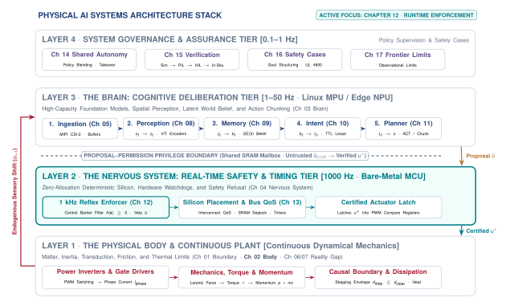
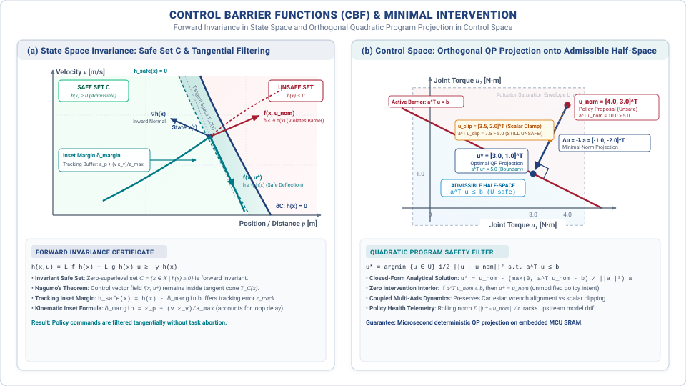
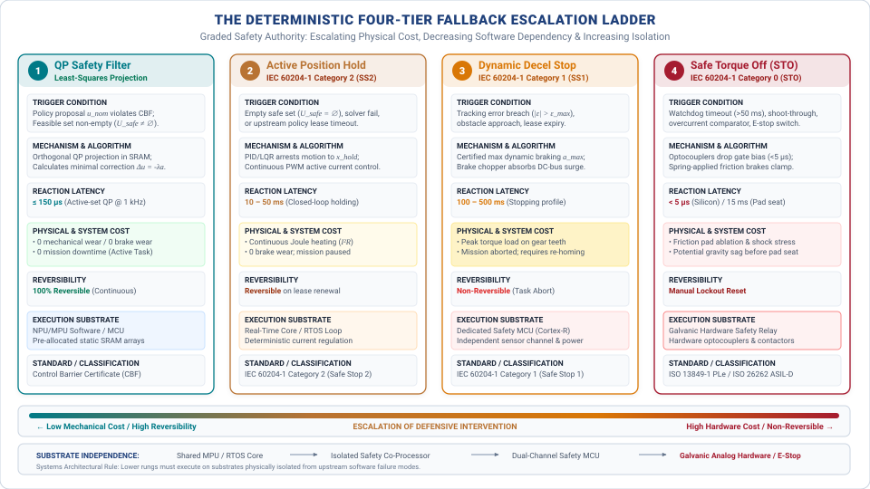

# Deterministic Safety Enforcement {#sec-enforcement}

::: {.column-margin}

\chapterminitoc

:::

::: {#fig-12-locator fig-env="figure" fig-pos="H" fig-cap="**Systems Organ Focus: Nervous**: In the physical AI systems architecture, the deterministic nervous system sits between the unverified deliberative brain and the dynamical body, serving as the sole authority permitted to translate advisory commands into physical force or refuse them outright. Operating at microsecond control cadences, the enforcer projects candidate actions onto forward-invariant safe sets and manages a multi-tier fallback hierarchy to guarantee physical containment." fig-alt="Systems Organ Focus: Nervous. In the physical AI systems architecture, the deterministic nervous system sits between the unverified deliberative brain and the dynamical body, serving as the sole authority permitted to translate advisory commands into physical force or refuse them outright. Operating at microsecond control cadences, the enforcer projects candidate actions onto forward-invariant safe sets and manages a multi-tier fallback hierarchy to guarantee physical containment."}
{width="100%"}
:::

*How does an unprivileged software proposal become physical torque, and what guarantees that the gatekeeper can always say no in time?*

When a high-capacity learned policy encounters an out-of-distribution sensory input, it can output an erratic, high-energy control command in a single forward pass. Waiting for the model to diagnose its own failure or relying on Linux user-space exceptions is physically impossible once setpoints reach motor drivers. Real-time safety enforcement is the deterministic hardware and mathematical barrier that stands between unverified neural proposals and physical actuators. Operating at microsecond cadences on dedicated microcontroller silicon, the enforcer uses Control Barrier Functions and minimal-intervention quadratic programs (CBF-QP) to project candidate actions onto forward-invariant safe sets—guaranteeing that the machine never breaches physical constraints while preserving learned task competence.



::: {.callout-learning-objectives}
After studying this chapter, you will be able to:

1. Explain why a correction rate is set by how fast the plant deviates, not by preference.
2. Predict what an actuator at saturation does to a loop that does not know it has saturated.
3. Explain why delay in a loop causes oscillation rather than lag alone.
4. State the tracking error bound a controller guarantees, and inset a safety margin by it.

*Core chapter takeaway.* The nervous system's job end to end: track a permitted command into force, and refuse one that should not become force. The enforcer's margin is only as good as the tracking error of the loop beneath it. Safety enforcers depend on inner feedback loops tracking commanded braking currents within bounded error; tracking and refusal are a unified mathematical contract.

:::

## The Deterministic Gatekeeper {#sec-enforcement-12-1}

<!-- SECTION 12.1 -->
<!-- claim: This is the only part of the machine permitted to move an actuator, and the only part that can refuse. -->
<!-- covers: The dual responsibility of the nervous system: converting upstream learned policy proposals into physical force while maintaining independent authority to refuse execution. -->
<!-- covers: Why tracking and safety enforcement must be co-located at the machine boundary rather than delegated to upstream models or remote planners. -->
<!-- covers: The fundamental dependency: a safety enforcer's spatial clearance is mathematically bounded by the worst-case tracking error of the underlying control loop. -->
<!-- covers: The limits of deterministic safety: how enforcers fail through latency overruns, stale state estimates, and shared-mode hardware faults. -->
<!-- covers: Chapter roadmap: moving from inner feedback mechanics to outer barrier certificates, minimal intervention projection, fallback escalation, and fail-safe contracts. -->
<!-- GROUNDING: mechanism — the two jobs of the permission path: turn a command into force, or refuse it -->
<!-- FIGURE: A block diagram showing proposal flow from the learned policy through the enforcer filter to the tracking loop and physical plant, highlighting the autonomous veto path. -->

<!-- BEGIN -->
\lettrine{A}{learned policy produces numbers,} but numbers do not move mass. In classical computing, software executes "behind glass": algorithmic errors raise exceptions, invalid matrix multiplications return NaN tokens, and failed operations can be retried without altering the physical universe. In Physical AI, computation directly controls moving mass, dissipates electrical power, and commands mechanical force. Once an actuator energizes a motor winding, momentum integrates, kinetic energy transfers, and mechanical deformation cannot be undone by a software catch block. Between the output tensor of an upstream neural network and the magnetic field inside an electric motor sits the nervous system of the machine. As mapped in the four-tier architectural hierarchy of @fig-12-locator, this subsystem occupies the critical boundary where unverified computational proposals meet physical mechanics. It carries two distinct responsibilities that define its physical role: it must translate a permitted command into physical force under deterministic timing deadlines, and it must maintain the independent authority to refuse execution entirely. Upstream neural networks, vision-language-action (VLA) models, and high-level trajectory optimizers are unverified advisory processes. They can propose a target velocity, generate a motion waypoint, or request an end-effector wrench, but they do not possess the hardware authority to drive an actuator. The **permission path** is the sole component on the machine permitted to energize a motor winding, and it is the only component endowed with the capability to refuse an upstream request.

Tracking and safety enforcement must be co-located at this physical machine boundary rather than delegated to upstream software layers. High-level learned models operate over deep computational pipelines with variable execution times, often exhibiting inference latencies between $100\text{ ms}$ and $500\text{ ms}$. In contrast, the physical plant is governed by mechanical momentum, where a delay of $5\text{ ms}$ in a high-speed motion can allow an unmonitored mass to exceed its allowable travel envelope. If the authority to refuse were placed upstream, network dropouts, bus contention spikes, or memory management pauses in an inference runtime would silently disable safety arbitration while the physical mechanism continues its motion. The nervous system executes on local microcontroller or real-time processor hardware directly wired to motor drives and joint encoders, evaluating commands at update rates such as $1000\text{ Hz}$. At this boundary, safety is evaluated against the physical state that exists in the current millisecond rather than a stale estimate captured in an earlier sensor frame.

An enforcer cannot guarantee safety beyond the physical fidelity of the control loop beneath it. Every mathematical safety barrier, whether formulated as a geometric spatial boundary or a maximum torque limit, assumes that the tracking controller follows a commanded trajectory within a bounded error. Consider an analytical example where a robotic manipulator must maintain a minimum clearance of $20\text{ mm}$ from a rigid fixture while moving at $1.0\text{ m/s}$. If the underlying tracking loop exhibits a worst-case position tracking error of $e_{\max} = 15\text{ mm}$ under load disturbances, the safety enforcer must evaluate its barriers against a boundary expanded by that full $15\text{ mm}$. A safety certificate that assumes perfect tracking will permit a commanded path that physically collides with the obstacle. The certified clearance of the enforcer is strictly bounded by the tracking performance of the underlying loop. When motor saturation, joint compliance, or unmodeled friction causes the tracking error to grow, the available safety margin contracts by the same amount.

Even when mathematically sound, deterministic enforcers can fail because of physical and computational constraints in the systems architecture. An enforcer requires a finite processing budget to evaluate barrier functions, solve quadratic programs, or project proposals onto an admissible action set. If the constraint solver experiences a $P_{99}$ latency tail that exceeds its allocated $1\text{ ms}$ execution budget, the system faces an immediate failure mode, choosing between executing an unverified proposal or applying an uncoordinated emergency brake that may cause structural damage. Enforcers also fail when supplied with stale or phase-lagged state estimates. If a low-pass sensor filter introduces a $20\text{ ms}$ delay while an actuator accelerates at $5.0\text{ m/s}^2$, the computed state lags true position by $1.0\text{ mm}$, systematically corrupting barrier evaluations. Furthermore, shared hardware modes, such as common power supplies, shared communication buses, or single-point clock generators, can cause the tracking loop, the enforcer, and the sensor pipeline to fail simultaneously.

Constructing an enforcement architecture requires ordering the machine's software layers from inner physical reflexes to outer policy interfaces. The lowest layer governs the inner feedback mechanics that turn high-frequency setpoints into motor currents. Above this tracking foundation sits the barrier evaluation logic, which checks incoming proposals against invariant state constraints. When a proposal violates a constraint, a minimal intervention filter modifies the command just enough to restore feasibility, preserving the policy's intended motion to the extent physical limits allow. If no safe projection exists or if state estimation uncertainty exceeds verified thresholds, the architecture shifts authority to a deterministic fallback handler to bring the machine to a controlled stop.

The construction of this entire chain begins at the interface between the safety filter and the tracking controller. To determine whether an action is safe to execute, the enforcer does not need to analyze inner control loop gains, motor winding dynamics, or pulse-width modulation switching frequencies. It consumes a single contract from the controller beneath it, which is an explicit bound on the worst-case tracking error between where the machine was commanded to be and where its physical mass actually resides.
<!-- END -->

## What Control Hands Over {#sec-enforcement-12-2}

<!-- SECTION 12.2 -->
<!-- claim: Enforcement consumes one number from the loop beneath it: a bound on how far the machine may be from where it was commanded to be. Everything else about the controller is somebody else's subject. -->
<!-- covers: State the tracking contract: under stated conditions the loop keeps the machine within a bounded distance of the commanded trajectory, and that bound is the only thing enforcement needs. -->
<!-- covers: Work one command-to-response example concretely enough that the reader sees the bound is a physical distance rather than an abstraction. -->
<!-- covers: Name the conditions the bound rests on, and what happens to it outside them: disturbance beyond the modelled range, a rate the loop cannot follow, and an actuator already at its limit. -->
<!-- covers: Show how that bound insets every margin downstream, so a loosened tracking bound silently shrinks the clearance an enforcer thought it had. -->
<!-- covers: Require the bound to be published with its conditions and monitored at run time, because a tracking bound that is never checked is an assumption rather than a contract. -->
<!-- covers: Cite loop design, stability, and tuning to a controls text. This book states what a controller guarantees and never derives it. -->
<!-- GROUNDING: number — a step command, the response, and the tracking error between them -->
<!-- FIGURE: Step response of a closed-loop plant showing reference command, actual trajectory, settling corridor, and the worst-case tracking error bound $\epsilon_{\text{track}}$. -->
<!-- DERIVE: The worst-case steady-state tracking error bound $\epsilon_{\text{track}}$ as a function of maximum disturbance force $d_{\text{max}}$ and closed-loop stiffness $K$. -->

<!-- BEGIN -->
The tracking contract isolates the enforcer from the internal mechanics of the plant. A feedback controller operating over continuous physical dynamics makes many promises internally, but only one number passes upward across the systems interface. For any commanded trajectory $r(t)$ satisfying admissible velocity and acceleration limits, the physical state $x(t)$ remains within a bounded distance $\|x(t) - r(t)\| \le \epsilon_{\text{track}}$. The enforcer does not inspect transfer functions, root loci, or proportional-integral-derivative gains. The methods used to synthesize feedback gains and prove asymptotic stability belong to classical control theory [@slotine1991applied; @astrom2021feedback]. To the software sitting above the loop, the controller is a black box that turns reference setpoints into physical motion, guaranteed to stay within the error bound $\epsilon_{\text{track}}$ of the commanded path.

This bound is a physical distance rather than a mathematical abstraction. In a closed-loop mechanical system with active stiffness $K$ subject to an unmodeled external disturbance force $d(t)$, the steady-state position error balances the disturbance against the restoring control effort. When disturbances are bounded such that $|d(t)| \le d_{\text{max}}$, the worst-case steady-state tracking error bound $\epsilon_{\text{track}}$ derives directly from the stiffness of the closed loop.
$$\epsilon_{\text{track}} = \frac{d_{\text{max}}}{K}$$
Consider an analytical example of a linear positioning stage with closed-loop stiffness $K = 5000\text{ N/m}$ operating in an environment where friction and payload variations introduce an unmodeled disturbance force bounded by $d_{\text{max}} = 25.0\text{ N}$. The maximum steady-state error is $\epsilon_{\text{track}} = 25.0\text{ N} / 5000\text{ N/m} = 0.005\text{ m}$, which corresponds to $5.0\text{ mm}$. When the reference command executes a step of $100.0\text{ mm}$, the carriage accelerates, settles into the bounded corridor, and comes to rest. At steady state, the physical carriage does not sit precisely at $100.0\text{ mm}$. It rests anywhere within the interval $[95.0\text{ mm}, 105.0\text{ mm}]$.

That guarantee holds only within a defined envelope of physical operating conditions. The controller provides the bound $\epsilon_{\text{track}}$ under three physical conditions. First, the reference trajectory cannot demand accelerations beyond what the actuators can deliver. Second, external disturbances must remain strictly below $d_{\text{max}}$. Third, the actuator must operate below its internal current and voltage limits. If an upstream policy commands a trajectory that demands an acceleration of $15.0\text{ m/s}^2$ from an actuator whose current limit caps acceleration at $10.0\text{ m/s}^2$, the feedback loop saturates. The integrator winds up, phase lag accumulates, and the physical mechanism falls behind the reference by an amount that grows with every millisecond of saturation. If an unexpected external load exceeds $25.0\text{ N}$, the disturbance overpowers the restoring force of stiffness $K$, pulling the carriage outside the $\pm 5.0\text{ mm}$ corridor. Outside its rated envelope, the controller provides no bound at all.

Because physical reality can diverge from the reference command by up to $\epsilon_{\text{track}}$, every geometric and dynamic margin evaluated by an enforcer must be inset by that exact distance. If a robot arm must maintain a physical clearance of at least $20.0\text{ mm}$ from a fragile fixture, and the underlying tracking loop guarantees an error bound $\epsilon_{\text{track}} = 5.0\text{ mm}$, the enforcer cannot evaluate safety against the nominal geometry. It must inset the admissible state space by adding a virtual buffer of $5.0\text{ mm}$, checking that the commanded reference maintains a clearance of at least $25.0\text{ mm}$ from the obstacle surface. If worn bearings, thermal expansion, or altered motor parameters loosen the true tracking error from $5.0\text{ mm}$ to $12.0\text{ mm}$ without the enforcer updating its internal model, the true physical clearance to the fixture shrinks from $15.0\text{ mm}$ to $8.0\text{ mm}$. The enforcer believes it is operating with a comfortable safety margin while the physical hardware moves dangerously close to collision. A degraded tracking bound silently erodes safety margins across the entire software stack.

A tracking bound that is never checked at run time is an assumption rather than a contract. Because environmental conditions fluctuate and mechanical components degrade, the nervous system must publish $\epsilon_{\text{track}}$ alongside the explicit operational conditions that validate it, while monitoring the instantaneous tracking error $e(t) = \|x(t) - r(t)\|$ on every tick of the control cycle. If sensor feedback reveals that $e(t)$ approaches or exceeds $\epsilon_{\text{track}}$, the tracking contract has broken. When a disturbance force spikes to $40.0\text{ N}$ or an actuator enters thermal throttling, the nervous system cannot treat the resulting divergence as a normal transient. It must detect the contract violation immediately, invalidating the spatial assumptions used by downstream filters before unmodeled deflection causes physical damage.

::: {#pri-inset-margin .callout-principle title="The Inset Margin Invariant"}
Every spatial and dynamic safety boundary evaluated by an enforcer must be inset by the underlying tracking loop's verified worst-case tracking error plus the transport lag displacement: $\delta_{\text{margin}} \ge \epsilon_{\text{track}} + v \cdot \tau_{\text{delay}} + \epsilon_{\text{est}}$. An enforcer that evaluates barrier certificates against nominal geometric boundaries without insetting will permit trajectories that physically collide with obstacles whenever tracking error reaches its certified bound.
:::

The mathematical synthesis of tracking controllers, observer design, and disturbance rejection proofs are treated in depth by the control literature [@slotine1991applied]. For the systems engineer building physical AI architectures, the responsibility begins where control guarantees end. The tracking controller provides the mechanism to translate permitted references into physical currents, but it has no semantic awareness of obstacles, task goals, or system-level hazards. It will execute a command into a solid wall with the same closed-loop fidelity that it brings to free-space motion. Before any proposed action is handed to this tracking machinery, the system must determine whether the proposal is permitted to become force at all.
<!-- END -->

## The Authority to Refuse {#sec-enforcement-12-3}

<!-- SECTION 12.3 -->
<!-- claim: The permission path exists to say no, and everything else it does is secondary to that. -->
<!-- covers: Architectural primacy of refusal: the permission path is fundamentally a safety gate with actuation capabilities, not an actuator pipeline with safety logging. -->
<!-- covers: Authority asymmetry: upstream learned models propose desired trajectories, but the nervous system retains absolute authority to deny or modify execution. -->
<!-- covers: Fail-operational autonomy: why the refusal mechanism must maintain local state and continue enforcing safety even during complete brain or network crashes. -->
<!-- covers: Command filtering versus veto: defining clear criteria for when proposals should be geometrically projected versus when motion must be aborted entirely. -->
<!-- covers: The zero-command floor: establishing the safe physical equilibrium state (zero-torque coasting, dynamic braking, or mechanical brake locking) when authority is severed. -->
<!-- GROUNDING: mechanism — refusal as the defining capability, not an exceptional case -->
<!-- FIGURE: Timing diagram illustrating an upstream policy crash, heartbeat watchdog timeout, and the immediate autonomous transition of the nervous system to local position hold. -->

<!-- BEGIN -->
The permission path is not a transmission line that relays actions while logging safety statistics in the background. It is a safety gate that admits actuation only when specific physical criteria are satisfied, treating every incoming proposal as unsafe until proven otherwise. In conventional automation, control pipelines operate on trust, executing commands under the assumption that the upstream software component produces valid setpoints. In physical AI, that assumption fails by design. A learned policy operating in high-dimensional perception space has no mathematical guarantees of stability, no bounded output variance, and no internal representation of actuator current limits or mechanical stress. Because the learned model cannot be held accountable for physical destruction, the nervous system must not treat its outputs as authoritative directives. Upstream models produce proposals, but only the nervous system possesses the authority to turn a proposal into force.

This division creates an asymmetric authority model between the brain and the nervous system, formalized in systems engineering as the **Simplex Architecture Pattern** [@sha2001using]. The Simplex pattern resolves the tension between high performance and safety by decomposing the control system into four structural components:

1. **The Advanced Controller**: An unverified, high-capacity learned model (such as a Vision-Language-Action network or diffusion policy executing on a Linux MPU) that optimizes for complex, open-ended task performance.
2. **The Baseline Safety Controller**: A certified, high-assurance deterministic controller (such as a Lyapunov-based posture regulator or precomputed quintic deceleration spline executing on bare-metal MCU firmware) that guarantees stability and physical containment within a known envelope.
3. **The Safety Manager**: Deterministic arbitration logic that continuously evaluates the state of the machine against forward-invariant barrier sets, tracking error bounds, and execution deadlines.
4. **The Simplex Switch**: An atomic hardware or real-time firmware multiplexer that routes actuation signals to the motor bridge, selecting the Advanced Controller's output when certified safe and instantaneously falling back to the Baseline Controller when safety envelopes are endangered.

The **Simplex architecture pattern** is a safety-critical systems structure featuring an Advanced (unverified) Controller, a certified Baseline (Safety) Controller, a Safety Manager, and an arbitration switch (Simplex Switch) that autonomously strips the Advanced Controller of authority and transfers control to the Baseline Controller before the physical state breaches recoverable bounds.

Under this Simplex contract, the upstream policy never commands the plant directly. Instead, communication across the Dual-Brain boundary operates through time-bounded **intent leases**. The Linux MPU transmits candidate control vectors as structured packets over shared SRAM mailboxes using the Remote Processor Messaging (RPMSG) protocol. Each proposal payload contains a monotonic sequence identifier, a microsecond timestamp, an explicit lease duration ($\tau_{\text{lease}}$), candidate setpoints, and a cyclic redundancy check (CRC32). The real-time microcontroller inspects the lease on every control cycle. If the lease is valid, the state is within safe set boundaries, and tracking error remains bounded, the Simplex switch permits the proposal (or its minimally projected variant) to drive the actuators. If the lease expires without renewal, tracking diverges, or the proposal threatens physical boundaries, the Simplex switch revokes permission and engages the Baseline Safety Controller unilaterally.[^fn-hw-tim-pwm] The upstream policy is not consulted, does not negotiate, and possesses no hardware mechanism to override the switch.

When an incoming proposal conflicts with physical constraints, the enforcer chooses between two distinct interventions: command filtering and an outright veto. Command filtering applies when the proposal is structurally sound but marginally exceeds an admissible kinematic or dynamic boundary. If an analytical model of a six-axis manipulator shows that a proposed end-effector velocity vector demands a joint speed $4\%$ above a rated motor limit of $3.0\text{ rad/s}$, the nervous system can project the reference onto the boundary of the safe set using control barrier functions or quadratic programming. This projection preserves the geometric direction of the motion while scaling down magnitude to obey the $3.0\text{ rad/s}$ ceiling. Projection is permissible only when the deviation is local, continuous, and cleanly separated from catastrophic hazards. When a proposal exhibits structural invalidity—such as a discontinuous jump in commanded position across consecutive frames, a request for acceleration that exceeds maximum physical torque capabilities, or a trajectory vector aimed directly into an immovable obstacle—geometric projection becomes dangerous. A discontinuous or wildly infeasible proposal indicates that the upstream perception or inference pipeline has entered an unmodeled failure mode. Attempting to project an ungrounded hallucination onto the nearest safe boundary executes a synthetic motion that has no relationship to task intent. In such cases, the enforcer must veto the proposal entirely, tripping the Simplex switch and dropping authority to a local fallback.

To maintain authority when the upstream system collapses, the refusal mechanism must operate with complete local autonomy. The nervous system cannot depend on the brain to report its own failures or request a shutdown. Consider an analytical example where an upstream policy publishes trajectory setpoints at $20\text{ Hz}$, or one frame every $50\text{ ms}$, across an inter-process communication bus to a nervous system running a joint tracking loop at $1000\text{ Hz}$. The nervous system couples incoming frames to a hardware-timed watchdog timer. If the upstream inference engine experiences an operating system scheduling stall, an out-of-memory exception, or a CUDA kernel panic, the flow of setpoints halts. If the intent lease duration is set to $\tau_{\text{lease}} = 40\text{ ms}$ and the watchdog timeout is configured for $t_{\text{timeout}} = 10\text{ ms}$ of heartbeat silence, the nervous system detects the fault within milliseconds. It does not freeze the last commanded actuator currents, which would cause an arm moving at $1.2\text{ m/s}$ to drift under momentum and strike environmental boundaries. Instead, the local enforcer immediately severs the upstream command channel and transitions to an autonomous position hold, synthesizing a smooth deceleration trajectory that brings joint velocities to zero at a controlled rate of $8.0\text{ m/s}^2$ while remaining within current limits.

Severing upstream authority requires a well-defined physical state at the lowest level of the hardware interface, which forms the **zero-command floor**. In software engineering, halting an execution pipeline often means returning a null pointer or clearing a register to zero. In physical systems, writing a zero to a motor drive register produces radically different mechanics depending on actuator topology. Setting current commands to zero in a low-friction, direct-drive motor removes all resistive torque, causing a robot arm holding a $5.0\text{ kg}$ payload to drop under gravity in free fall. Conversely, commanding zero velocity in a stiff position controller with high proportional gains commands maximum peak current to arrest motion instantaneously, which can shear gear teeth or buckle structural linkages if momentum is high. The system designer must select the zero-command state to match the mechanical physics of the plant. In geared transmissions with high backdrivability, dynamic braking shorts the motor windings through low-resistance shunts or MOSFET bridges, converting the back-electromotive force of the spinning rotor into electrical current that generates a braking torque proportional to velocity. This dynamic damping smoothly dissipates kinetic energy as heat without requiring active software control, though it cannot resist static gravitational torque once motion ceases. When static holding or power-off safety is required, the zero-command state de-energizes electromechanical spring-applied friction brakes, clamping the joints mechanically after dynamic braking has reduced angular velocity below a threshold of $0.1\text{ rad/s}$ to prevent excessive friction lining wear.

Refusal is therefore not an emergency exception handler invoked only during rare failures. It is the steady-state operating discipline of the entire machine. On every millisecond tick of the control clock, the nervous system verifies that an incoming proposal is topologically valid, that communication heartbeats remain unbroken, that the commanded reference lies strictly inside invariant safety sets, and that tracking error remains bounded. If any condition fails, the enforcer says no, substituting an autonomous fallback or engaging the zero-command floor. Because the enforcer holds the ultimate authority to deny actuation, its implementation must not depend on the very components it is designed to constrain.
<!-- END -->

## Where the Enforcer Sits {#sec-enforcement-12-4}

<!-- SECTION 12.4 -->
<!-- claim: The enforcer sits where it can be reached in time, and it may only check quantities it can establish without asking the component it is checking. -->
<!-- covers: Reference checking (pre-control): validating planned trajectory waypoints before controller execution, providing broad geometric foresight but blind to tracking overshoots. -->
<!-- covers: Command checking (post-control): validating raw torque and velocity commands immediately before actuator output, ensuring physical limits at the expense of horizon foresight. -->
<!-- covers: Latency and visibility trade-offs: why reference checkers fail to catch loop-induced resonances and command checkers cannot anticipate multi-step dynamic traps. -->
<!-- covers: Co-processor architectures: comparing sequential in-line filtering against parallel asynchronous safety monitoring. -->
<!-- covers: The dual-stage enforcement pattern: pairing a pre-control kinematic corridor filter with a post-control instantaneous limit clamp. -->
<!-- covers: Constrain what the enforcer is allowed to read: a quantity it can sense or bound independently of the proposal path, never one produced by the component it is checking. Where no independent source exists, say so, and state that the guarantee is then conditional on the learned estimate rather than independent of it. -->
<!-- GROUNDING: mechanism — checking a reference against checking a command, and what each cannot see -->
<!-- FIGURE: Architectural comparison of pre-control reference filtering, post-control command monitoring, and dual-stage enforcement showing their respective visibility and latency horizons. -->

<!-- BEGIN -->
The enforcer must sit at a specific physical and logical boundary in the signal pipeline, determined by the timescale of the dynamics it governs and the latencies of the channels feeding it. Two natural boundaries exist in every machine that translates learned proposals into motion. The first boundary sits upstream of the feedback control loop, where the system executes reference checking. A reference checker validates planned trajectory waypoints, coordinate targets, or velocity vectors emitted by a high-level planner before those targets enter the tracking loop. Because it operates in kinematic space over a forward horizon, an analytical reference checker operating at $50\text{ Hz}$ can evaluate a $300\text{ ms}$ trajectory segment against static geometric envelopes, workspace boundaries, and self-collision models. The strength of reference checking is wide spatial foresight. Its limitation is complete blindness to the actual state of the plant. A reference checker verifies where the machine intends to go, not where it goes. If a planned path maintains a clearance of $5.0\text{ mm}$ from a steel bracket, the reference checker marks the command valid. Yet if the downstream tracking controller exhibits a transient position overshoot of $10.0\text{ mm}$ when accelerating a heavy load, the physical arm strikes the bracket despite passing every upstream validation step.

The second boundary sits downstream of the feedback controller, directly in front of the power electronics, where the system executes command checking. A command checker inspects the raw physical quantities produced by the tracking loop, evaluating motor phase currents, hydraulic valve spool displacements, pulse-width modulation duty cycles, and joint torque references immediately before writing them to hardware registers. Operating at the inner control loop frequency, typically $1000\text{ Hz}$ with an execution budget under $100\text{ \mu s}$, the command checker enforces hard instantaneous limits. It prevents electrical overcurrent, structural over-torque, and thermal runaway by clipping or zeroing signals that exceed the physical ratings of the plant. What the command checker gains in physical certainty, it surrenders in temporal foresight. Operating on a single discrete time step $\Delta t = 1.0\text{ ms}$, it cannot evaluate future state evolution. An instantaneous torque command of $18\text{ N}\cdot\text{m}$, which is well within an analytical motor rating of $45\text{ N}\cdot\text{m}$, appears entirely safe to a post-control monitor. However, if that torque accelerates a $10\text{ kg}$ linkage toward a rigid stop at $1.5\text{ m/s}$, the kinetic energy of the mechanism will exceed the maximum deceleration capacity of the actuator over the remaining travel distance. The command checker detects no fault until the linkage is inches from impact, at which point no allowable reverse torque can prevent a collision.

This split reveals the fundamental trade between latency and visibility. Reference checkers possess multi-step geometric visibility but suffer from high latency and blind spots regarding closed-loop tracking dynamics. Operating at planning rates between $10\text{ Hz}$ and $50\text{ Hz}$, a reference filter cannot respond to unmodeled plant resonance, sensor noise amplification, or sudden control instability occurring at frequencies above its update rate. If a feedback controller develops a $60\text{ Hz}$ limit cycle oscillation, the reference setpoints remain stationary while the physical linkages shake. Conversely, command checkers respond within microseconds on every millisecond clock tick, eliminating latency, but their one-step horizon creates dynamic traps where every instantaneous torque is legal until an irrecoverable state is reached.

The placement of the enforcer also determines how it integrates into the computing fabric. In a sequential in-line architecture, every signal passes synchronously through the enforcement logic before reaching the next stage. A reference checker filters the trajectory before the controller reads it, or a command clamp modifies the torque register before the motor drive samples it. Sequential execution guarantees zero uninspected commands, but it inserts the worst-case execution time of the enforcer directly into the critical latency path. For an analytical $1000\text{ Hz}$ loop with a total deadline of $1000\text{ \mu s}$, allocating a $P_{99}$ latency of $250\text{ \mu s}$ to an in-line safety check shrinks the budget available for feedback computation. If the enforcer overruns its execution budget, the entire cycle faults. In a parallel asynchronous architecture, the enforcer executes on a separate co-processor or an isolated processor core, monitoring the state of the machine and the command stream concurrently without intercepting every cycle. When the parallel monitor detects an invariant violation, it asserts a hardware line to open a safety contactor or switch the motor drive to dynamic braking. Parallel execution preserves control loop timing, but the asynchronous detection and communication introduce an enforcement lag bounded by the monitor cycle time and bus jitter, analytical examples showing $3.0\text{ ms}$ to $8.0\text{ ms}$ of delay. To compensate for this reaction delay, the system designer must expand the physical safety margins, slowing the machine or increasing its minimum clearance buffers.

Because neither single location provides both dynamic foresight and instantaneous protection, physical AI architectures resolve the tension through a **dual-stage enforcement pattern**. This pattern maps cleanly onto a canonical heterogeneous dual-brain System-on-Chip (SoC) architecture:

- **Upstream Stage (Pre-Control Corridor Filter on Application MPU):** Operating at $20\text{--}50\text{ Hz}$ on an application microprocessor core (a high-capacity unprivileged application processor), this stage accepts multi-step trajectory chunks emitted by the learned policy. It verifies that the planned path maintains an analytical stopping corridor under worst-case braking parameters and validates geometric clearance against static workspace envelopes before packing the waypoints into an RPMSG intent lease.
- **Downstream Stage (Instantaneous CBF-QP Safety Shield on Bare-Metal Real-Time MCU):** Operating inside a strict $1000\text{ Hz}$ ($1000\,\mu\text{s}$) timer interrupt loop on a deterministic microcontroller core (an isolated hard real-time safety microcontroller), this stage receives the proposed setpoint from shared SRAM, verifies tracking error bounds, solves an active-set Control Barrier Function quadratic program in pre-allocated static SRAM, and clamps raw current and torque commands directly before writing to PWM timer registers.

The pre-control stage prevents the system from entering dynamic traps by ensuring that a valid deceleration trajectory always exists, while the post-control stage catches loop instability, mechanical overshoots, and transient sensor dropouts before current reaches the motor windings.

Placing the enforcer correctly is useless if its inputs share failure modes with the component it checks. An enforcer may only evaluate quantities that it can establish independently of the proposal path. If a pre-control corridor filter calculates collision distances using a depth map generated by the same neural perception model that planned the motion, an out-of-distribution visual artifact will deceive both the planner and the enforcer simultaneously. Independent enforcement requires independent sensing and isolated computation. On heterogeneous dual-brain SoCs and industrial robotics controllers, the bare-metal safety MCU reads secondary optical encoders and hardware limit switches wired directly to its own GPIO and hardware timer capture registers over dedicated buses, completely isolated from the Linux virtual memory space and operating system scheduler. A collision enforcer must read dedicated safety lidar or ultrasonic proximity sensors whose signal conditioning relies on deterministic threshold logic rather than learned inference. Where no physically independent sensor exists, such as when estimating the friction coefficient of a wet roadway or the variable mass of an unmodeled payload, the systems engineer cannot construct an independent physical guarantee. In those operating regimes, the safety assertion is conditional, its validity bounded by the statistical uncertainty of the learned estimator rather than guaranteed by the nervous system. Every invariant that the enforcer checks, whether evaluated upstream across a geometric corridor or downstream at the motor terminals, ultimately assumes that the physical plant retains the control authority to arrest its own motion before crossing a forbidden boundary.

::: {#pri-simplex-independence .callout-principle title="The Simplex Independence Rule"}
A safety monitor must never evaluate a state estimate produced by the component it is designed to constrain, nor share an un-preemptible communication bus, memory matrix, or clock tree with unverified processes. Where independent sensing is physically impossible, the safety claim is conditional on model uncertainty rather than guaranteed by hardware.
:::
<!-- END -->

## Stopping Envelopes {#sec-enforcement-12-5}

<!-- SECTION 12.5 -->
<!-- claim: Knowing continuously that a stop is still available costs achievable speed, and that trade is the design. -->
<!-- covers: Kinematic stopping physics: calculating minimum stopping distance as a function of instantaneous velocity, maximum deceleration, and total nervous system delay. -->
<!-- covers: Insetting safety boundaries: expanding static and dynamic obstacle envelopes by the lower-level tracking error bound $\epsilon_{\text{track}}$ from 12.3. -->
<!-- covers: Continuous feasibility verification: verifying at every loop cycle that a safe stopping trajectory remains available from the current state. -->
<!-- covers: The throughput tax: how maintaining continuous stopping guarantees imposes a strict upper bound on achievable operational speed. -->
<!-- covers: Dynamic envelope adaptation: adjusting stopping distances online based on payload mass variations, surface friction estimates, and actuator thermal limits. -->
<!-- GROUNDING: number — the stopping envelope, inset by the tracking bound from 12.2 -->
<!-- FIGURE: A phase-plane diagram (velocity vs position) showing the physical stopping boundary, the tracking-error inset envelope, and an admissible nominal trajectory. -->
<!-- DERIVE: The minimum safe stopping distance $d_{\text{stop}}(v) = v \cdot \tau_{\text{delay}} + \frac{v^2}{2 a_{\text{max}}} + \epsilon_{\text{track}}$ from kinematic first principles. -->

<!-- BEGIN -->
To guarantee that a machine never enters a forbidden state, the nervous system must know at every moment that an unassisted stop remains physically achievable. This guarantee defines the **stopping envelope**, the set of all state trajectories from which maximum available braking can bring the system to rest without violating a spatial or kinematic boundary. Maintaining this guarantee requires reserving both distance and time for an emergency deceleration maneuver that the machine may never execute during nominal operation. Knowing continuously that a stop is still available costs achievable speed, and that trade is the design. Every increase in operating velocity expands the distance required to arrest momentum, consuming the spatial buffer between the machine and its physical constraints.

The geometry of the stopping envelope derives directly from Newtonian kinematics combined with the signal latency of the nervous system. Consider a body moving along a single axis at instantaneous velocity $v$. When an enforcer detects a boundary violation or receives an unsafe proposal, a finite transport delay $\tau_{\text{delay}}$ elapses before actuators can generate opposing force. This total delay compounds perception exposure time, transport latency over the internal communications bus, enforcer evaluation cycle time, and the physical current rise time in the motor windings. During $\tau_{\text{delay}}$, the body continues to travel under its pre-existing velocity, traversing a reaction distance of $v \cdot \tau_{\text{delay}}$. Once braking torque engages, assuming a constant maximum deceleration $a_{\text{max}}$, the time required to arrest the remaining velocity is $v / a_{\text{max}}$, during which the body traverses a braking distance of $v^2 / (2 a_{\text{max}})$.

A pure kinematic calculation assumes that the underlying feedback controller tracks the reference trajectory with zero error. In physical reality, external disturbances, unmodeled joint friction, and sensor quantization cause the physical plant to diverge from the reference trajectory by an instantaneous tracking error bounded by $\epsilon_{\text{track}}$, established by the low-level loop in @sec-enforcement-12-2. If an obstacle sits at a coordinate $x_{\text{obs}}$, placing the nominal stopping target exactly at $x_{\text{obs}}$ causes a collision whenever the tracking error reaches its positive bound. The enforcer must therefore inset the allowable reference boundary away from the obstacle by $\epsilon_{\text{track}}$. Combining reaction displacement, braking displacement, and the tracking bound yields the total minimum stopping distance,

$$d_{\text{stop}}(v) = v \cdot \tau_{\text{delay}} + \frac{v^2}{2 a_{\text{max}}} + \epsilon_{\text{track}}$$

Any trajectory proposal that places the machine at a distance $d < d_{\text{stop}}(v)$ from a physical constraint is unsafe, even if the instantaneous velocity vector points away from the obstacle.

Consider an analytical example of an automated transport platform moving through an indoor industrial facility. The platform runs a $50\text{ Hz}$ trajectory planner, communicates over an internal bus with deterministic message delivery, and uses an enforcer co-processor operating at $1000\text{ Hz}$. Summing the perception pipeline latency ($30\text{ ms}$), the worst-case message transport interval ($20\text{ ms}$), and the motor drive torque response time ($10\text{ ms}$) yields a total nervous system delay $\tau_{\text{delay}} = 60\text{ ms}$. The mechanical brakes and motor drives provide a maximum deceleration $a_{\text{max}} = 2.0\text{ m/s}^2$, and encoder verification establishes a worst-case tracking error bound $\epsilon_{\text{track}} = 0.050\text{ m}$. At a moderate operational velocity $v = 1.5\text{ m/s}$, the reaction distance during delay is $1.5\text{ m/s} \times 0.060\text{ s} = 0.090\text{ m}$, and the braking distance is $(1.5\text{ m/s})^2 / (2 \times 2.0\text{ m/s}^2) = 0.563\text{ m}$. Adding the $0.050\text{ m}$ tracking inset yields a total required stopping clearance $d_{\text{stop}}(1.5\text{ m/s}) = 0.703\text{ m}$. If the system increases nominal speed by two-thirds to $v = 2.5\text{ m/s}$, the delay displacement rises to $0.150\text{ m}$ and the braking displacement scales quadratically to $1.563\text{ m}$, expanding the required envelope to $1.763\text{ m}$. A $67\%$ increase in velocity demands a $151\%$ increase in clear clearance ahead of the chassis. In physical autonomous mobile robots and automated guided vehicles, this dynamic clearance envelope is continuously scanned and enforced by dedicated hardware, such as the time-of-flight safety laser scanner shown in @fig-12-real-laser-scanner.

::: {#fig-12-real-laser-scanner fig-env="figure" fig-pos="t" fig-cap="**Industrial Safety Laser Scanner and Dynamic Protective Field Enforcer**: A physical time-of-flight (ToF) safety laser scanner commonly mounted on the leading bumper of automated guided vehicles (AGVs) and autonomous mobile robots (AMRs). The unit utilizes an internal motor-driven mirror rotating at $20\text{--}50\text{ Hz}$ to sweep pulsed infrared laser beams across a $270^\circ$ planar scanning plane, resolving obstacle distances via time-of-flight measurements. To enforce the dynamic stopping distance $d_{\text{stop}}(v) = v \cdot \tau_{\text{delay}} + \frac{v^2}{2 a_{\max}} + \epsilon_{\text{track}}$, the scanner continuously switches between velocity-dependent zone profiles: outer *warning fields* that prompt soft advisory deceleration in software when breached, and inner *protective fields* wired through dual-channel safety relays to trigger immediate Category 0 (Safe Torque Off) or Category 1 hardware stops when penetrated." fig-alt="Industrial Safety Laser Scanner and Dynamic Protective Field Enforcer. A physical time-of-flight (ToF) safety laser scanner commonly mounted on the leading bumper of automated guided vehicles (AGVs) and autonomous mobile robots (AMRs). The unit utilizes an internal motor-driven mirror rotating at 20\text{--}50\text{ Hz} to sweep pulsed infrared laser beams across a 270^\circ planar scanning plane, resolving obstacle distances via time-of-flight measurements. To enforce the dynamic stopping distance d{\text{stop}}(v) = v \cdot \tau{\text{delay}} + \frac{v^2}{2 a{\max}} + \epsilon{\text{track}}, the scanner continuously switches between velocity-dependent zone profiles: outer warning fields that prompt soft advisory deceleration in software when breached, and inner protective fields wired through dual-channel safety relays to trigger immediate Category 0 (Safe Torque Off) or Category 1 hardware stops when penetrated."}
{width="85%"}
:::

Because velocity and obstacle distances change continuously, the enforcer cannot evaluate feasibility only when a new trajectory begins. It must verify feasibility at every cycle of the low-level loop. In a phase-plane representation where velocity is plotted against distance to the nearest constraint, the stopping equation defines a parabolic boundary that separates safe states from inescapable collision states. The region between the physical obstacle boundary and the tracking-inset curve represents the margin consumed by lower-level control uncertainty. At every cycle, the enforcer projects the current state $(x, v)$ forward along an emergency stop trajectory. If the projected final rest position crosses the inset boundary, or if the current operating state crosses into the forbidden zone of the phase plane, the enforcer vetoes the planner's proposal and commands maximum deceleration.

The physical necessity of maintaining a clear stopping envelope levies an inevitable tax on operational throughput. In any deployment where sensing range is finite or environmental visibility is restricted by geometry, the maximum detection horizon $d_{\text{sense}}$ dictates a hard ceiling on legal velocity. If an onboard optical sensor can confirm an unobstructed corridor only up to $2.0\text{ m}$ ahead around a blind warehouse corner, the system cannot permit a speed exceeding $2.68\text{ m/s}$ under the parameters of the earlier example, regardless of how quickly the underlying machine learning model can compute actions. To run faster, the engineer must either increase braking torque $a_{\text{max}}$, compress signal latency $\tau_{\text{delay}}$, or tighten the tracking error $\epsilon_{\text{track}}$ through higher loop gains. When hardware limits prevent further reduction in those terms, the only remaining parameter is velocity.

The parameters governing the stopping envelope are rarely stationary during physical operation. When a robotic manipulator grasps an unmodeled $15\text{ kg}$ steel billet, the combined inertia of the arm increases, reducing the maximum angular deceleration $a_{\text{max}}$ that joint actuators can produce without exceeding their peak mechanical torque ratings. Similarly, on a mobile robot, moisture or oil on a concrete floor reduces the tire friction coefficient, lowering the maximum tractive deceleration before wheel slip occurs and widening the tracking error $\epsilon_{\text{track}}$. Repeated hard decelerations also drive up rotor and inverter temperatures, triggering thermal derating logic that temporarily lowers available braking torque. An enforcer that treats $a_{\text{max}}$ as a static datasheet constant will underestimate the stopping envelope precisely when the machine is under heavy load. The enforcer must adapt $d_{\text{stop}}(v)$ dynamically, pulling updated friction estimates, payload mass estimates, and thermal derating factors from the nervous system at runtime.

Dynamic envelope adaptation functions only as long as the enforcer possesses accurate state estimates and the actuators retain the physical capacity to supply the requested forces. If surface contamination drops effective traction to near zero, or if a sustained duty cycle pushes winding temperatures past their thermal ceilings, the deceleration capability assumed in the safety calculation evaporates. Under those conditions, the mathematical envelope expands toward infinity while the physical machine continues along its ballistic path. The moment the required deceleration torque exceeds what the physical hardware can produce, the enforcer transitions from a deterministic guardian into an impotent observer.
<!-- END -->

## When the Enforcer Runs Out of Authority {#sec-enforcement-12-6}

<!-- SECTION 12.6 -->
<!-- claim: Saturation is not a control problem here. It is the moment the permission path no longer has the actuation it needs to keep the promise it made. -->
<!-- covers: Define it in the book's terms: the enforcer's guarantee assumed it could apply a corrective action, and at saturation that action is not available at any commanded value. -->
<!-- covers: Show the consequence: a stopping envelope computed with full authority is wrong once the actuator is at its limit, and the margin was already spent before anyone noticed. -->
<!-- covers: Detect it, because saturation is one of the few failures with a cheap and reliable detector: commanded against achievable, continuously, at the loop rate. -->
<!-- covers: Export it upstream. Saturation is information the planner needs, and a plan that keeps requesting what cannot be delivered must be revoked rather than tracked. -->
<!-- covers: Fold it into the stopping calculation so the envelope shrinks as authority is consumed, rather than being recomputed after the fact. -->
<!-- covers: Cite integrator windup and its remedies to a controls text. That is controller design, and this book is deciding whether a machine may keep moving. -->
<!-- GROUNDING: number — a loop at saturation, and error accumulating while nothing improves -->
<!-- FIGURE: Time-series of commanded effort versus actual actuator output during saturation, highlighting accumulated integrator error and the resulting recovery delay. -->
<!-- DERIVE: Derive the stopping envelope under reduced authority, showing how much margin is lost per unit of authority consumed. -->

<!-- BEGIN -->
In control engineering, **actuator saturation** is treated as a bounded nonlinearity that introduces phase lag, degrades loop stability, and leads to windup in feedback controllers. In the architecture of a physical AI system, saturation is more immediate. It is the instant the permission path loses the physical capacity required to keep its safety warranty. The enforcer makes guarantees on the premise that it can interpose a corrective control action $u_{\text{corr}}$ whenever the machine approaches a forbidden state boundary. When an actuator reaches its mechanical, electrical, or thermal limit, that corrective force cannot be delivered at any commanded magnitude. The enforcer cannot protect a boundary using force that the physical body cannot generate.

The consequence is that a stopping envelope computed under nominal assumptions is invalidated the moment authority is consumed. Consider an analytical example of a mobile base with total mass $m = 100\text{ kg}$ moving at a forward velocity $v_0 = 2.0\text{ m/s}$. Under nominal conditions, the drive motors supply a peak braking force $F_{\text{nom}} = 400\text{ N}$, producing a maximum deceleration $a_{\text{nom}} = F_{\text{nom}} / m = 4.0\text{ m/s}^2$. The nominal stopping distance is
$$d_{\text{stop,nom}} = \frac{v_0^2}{2 a_{\text{nom}}} = \frac{(2.0\text{ m/s})^2}{2 \times 4.0\text{ m/s}^2} = 0.50\text{ m}.$$
If steady-state resistance, such as climbing an incline or overcoming friction, consumes an authority fraction $\alpha \in [0, 1)$ of peak actuator capacity, the remaining deceleration falls to $a_{\text{eff}} = (1 - \alpha) a_{\text{nom}}$. The actual stopping distance expands to
$$d_{\text{stop}}(\alpha) = \frac{v_0^2}{2 (1 - \alpha) a_{\text{nom}}} = \frac{d_{\text{stop,nom}}}{1 - \alpha}.$$
The loss of stopping margin is the difference
$$\Delta d_{\text{stop}} = d_{\text{stop}}(\alpha) - d_{\text{stop,nom}} = d_{\text{stop,nom}} \left( \frac{\alpha}{1 - \alpha} \right).$$
If the vehicle uses $75\%$ of its motor torque to maintain steady speed on a slope ($\alpha = 0.75$), only $100\text{ N}$ of force remains for deceleration, yielding $a_{\text{eff}} = 1.0\text{ m/s}^2$. The stopping distance expands from $0.50\text{ m}$ to $2.00\text{ m}$. The $1.50\text{ m}$ of safety margin was spent during steady-state motion, long before the enforcer issued a deceleration command.

When tracking controllers beneath the enforcer employ integral action, saturation introduces an additional latency penalty. If an actuator reaches its limit while tracking error $\epsilon(t) = x_{\text{des}}(t) - x(t)$ persists, the integrator continues accumulating error, driving the internal control state far beyond the physical ceiling. When the enforcer intervenes to command full braking, the motor does not reverse force immediately. The physical output remains pinned at the forward saturation limit while the accumulated integrator error unwinds below the clamping threshold. In an analytical example where tracking error accumulates over $200\text{ ms}$, the integrator unwinding phase can introduce a recovery delay $\tau_{\text{unwind}} = 150\text{ ms}$ before net negative force develops. At $v_0 = 2.0\text{ m/s}$, this delay adds an unbraked coasting distance $\Delta d_{\text{delay}} = v_0 \tau_{\text{unwind}} = 0.30\text{ m}$ directly to the stopping envelope. Control literature addresses this behavior through anti-windup clamping, back-calculation, and conditional integration (see @astrom2006advanced; @franklin1998digital). From the perspective of systems enforcement, the requirement is not merely to stabilize the control loop, but to measure this unwinding delay and budget its distance penalty inside the forward stopping horizon.

Actuator saturation is one of the few hardware failures with a direct, deterministic detector inside the nervous system. At each execution cycle of the motor tracking loop, typically running at $1000\text{ Hz}$ ($1\text{ ms}$ tick interval), the nervous system compares the commanded effort $u_{\text{cmd}}$ with the realizable actuator limit $u_{\text{act}} = \text{clip}(u_{\text{cmd}}, u_{\text{min}}, u_{\text{max}})$. A nonzero clipping difference, $|u_{\text{cmd}} - u_{\text{act}}| > 0$, or an inverter status register indicating current limit saturation, provides an immediate signal that the actuator has exhausted its authority. By tracking the duration and magnitude of this clamping signal, the nervous system monitors available control authority on every millisecond tick without relying on noisy external state estimation.

Because authority consumption alters stopping distance immediately, the enforcer cannot treat actuator limits as static parameters in an offline calculation. Instead, the nervous system must fold real-time authority consumption directly into the stopping envelope. When an actuator allocates baseline torque $u_{\text{bias}}$ to hold a payload against gravity or overcome an opposing grade, the enforcer recalculates effective deceleration as $a_{\text{eff}} = (u_{\text{max}} - |u_{\text{bias}}|) / m$ before verifying the next trajectory segment. As authority is consumed, the allowable speed ceiling decreases continuously. If authority depletion causes the calculated stopping distance to exceed the clear sensing horizon, the system reaches an authority deficit. The enforcer cannot allow the machine to maintain its speed. It must command deceleration while sufficient physical authority still remains.

Authority depletion is state information that must be exported upstream to the planner. A learned policy operating at $20\text{ Hz}$ that continues commanding accelerations to a motor saturated at $1000\text{ Hz}$ is executing without physical grounding. If the planner does not receive saturation feedback, it will continue generating trajectories based on acceleration profiles the body cannot execute, widening the divergence between model state and physical reality. The nervous system communicates saturation events to the policy layer as an active constraint violation. When an authority alarm triggers, the planner's active trajectory is revoked, requiring the model to re-plan from the machine's true, authority-constrained state.

Every dynamic stopping envelope and safety margin depends on the physical capacity of the machine to generate corrective force within the remaining distance. When that capacity is restricted by load, grade, or thermal derating, the space of executable safe trajectories contracts. An enforcer cannot verify safety simply by checking whether the current state is collision-free. It must confirm that the current state permits an executable sequence of future control actions that terminate safely under the actuator authority that actually exists.

::: {#pri-actuator-authority .callout-principle title="The Actuator Authority Invariant"}
A Control Barrier Function is mathematically valid only while physical actuators retain sufficient current, voltage, and thermal headroom to deliver the computed corrective force: $u^* \in [u_{\min}, u_{\max}]$. When steady-state gravity or friction consumes the actuator's operating envelope, the enforcer must dynamically contract the safe set before control authority at the margin vanishes.
:::
<!-- END -->

## Safe Sets as Conditional Permission {#sec-enforcement-12-7}

<!-- SECTION 12.7 -->
<!-- claim: A safe set gives the enforcer something it can check every cycle. What it gives is a conditional warrant, and the conditions are the subject of this section. -->
<!-- covers: Introduce one barrier as an example of a per-cycle checkable rule, in the smallest form that makes the check concrete, and move on. The technique is not the subject. -->
<!-- covers: Name the five conditions the warrant rests on: a plant model of stated fidelity, bounded disturbances, actuation authority sufficient to realise the correction, a solver that completes inside the period, and a sampling interval short enough that the continuous-time argument survives discretisation. -->
<!-- covers: For each condition, say what establishes it on a real machine, which of the five Chapter 2 measures, and which remain assumptions the release argument has to carry. -->
<!-- covers: Attach a detector to each condition, because a conditional guarantee whose conditions are unmonitored is an unconditional assertion. -->
<!-- covers: State the required behaviour when a condition is violated at run time, and make it a transition to a fallback rather than a continued claim. -->
<!-- covers: Cite forward invariance, relative degree, and barrier construction to the safe-control literature. This book consumes the result and audits its conditions. -->
<!-- GROUNDING: number — the safe set and the condition that keeps the machine inside it -->
<!-- FIGURE: State-space vector field showing unconstrained policy trajectories vectoring toward an unsafe boundary being deflected tangentially along the safe set boundary $\partial \mathcal{C}$. -->
<!-- DERIVE: Derive the per-cycle check and the margin the tracking bound insets; cite the invariance result rather than proving it. -->

<!-- BEGIN -->
A safe set gives the enforcer a concrete predicate that can be evaluated on every tick of the control clock. In control theory, a **safe set** $\mathcal{C}$ is defined as the zero-superlevel set of a continuously differentiable scalar certificate $h(x): \mathcal{X} \to \mathbb{R}$, such that
$$\mathcal{C} = \{x \in \mathcal{X} \mid h(x) \ge 0\}, \quad \partial \mathcal{C} = \{x \in \mathcal{X} \mid h(x) = 0\}.$$
The mathematical foundation of **forward invariance**, established by Blanchini [@blanchini1999set] and extended through Control Barrier Functions by @ames2014control and @ames2019control,[^fn-math-nagumo-invariance] guarantees that if the initial physical state begins inside $\mathcal{C}$, there exists an admissible control input sequence that prevents the trajectory from ever leaving $\mathcal{C}$.

A **forward-invariant safe set** is a designated sub-region of the state space $\mathcal{C} = \{\mathbf{x} \in \mathcal{X} \mid h(\mathbf{x}) \ge 0\}$ possessing the property that any state trajectory originating within $\mathcal{C}$ remains strictly within $\mathcal{C}$ for all forward time under admissible control inputs, despite bounded disturbances and model discrepancies.

::: {.callout-important title="Forward Invariance and Lie Derivatives"}
Consider a continuous-time physical plant whose dynamics are affine in the control input:
$$\dot{x} = f(x) + g(x)u,$$
where $x \in \mathcal{X} \subseteq \mathbb{R}^n$ denotes the mechanical state vector (positions, velocities) and $u \in \mathcal{U} \subseteq \mathbb{R}^m$ represents the commanded actuator efforts (phase currents, motor torques). The time derivative of the safety certificate along the system trajectory is computed using Lie derivatives:
$$\dot{h}(x, u) = \nabla h(x) \cdot \dot{x} = \frac{\partial h}{\partial x} f(x) + \frac{\partial h}{\partial x} g(x) u = L_f h(x) + L_g h(x) u.$$
By Nagumo's viability theorem and Ames's Control Barrier Function framework, the safe set $\mathcal{C}$ is rendered forward-invariant if the control input $u$ satisfies the differential inequality:
$$\dot{h}(x, u) \ge -\gamma(h(x)),$$
where $\gamma: \mathbb{R} \to \mathbb{R}$ is an extended class-$\mathcal{K}_\infty$ function (typically selected as a linear contraction rate $\gamma(h) = \gamma_0 h$ with $\gamma_0 > 0$). Substituting the Lie derivatives into this condition yields:
$$L_f h(x) + L_g h(x) u \ge -\gamma_0 h(x).$$
Because the dynamics are affine in $u$, this condition transforms the nonlinear set-invariance requirement into an instantaneous affine linear half-space inequality on the control input:
$$a(x)^T u \le b(x),$$
where the constraint normal vector $a(x) \in \mathbb{R}^m$ and boundary threshold $b(x) \in \mathbb{R}$ are given by:
$$a(x) \triangleq -L_g h(x)^T, \quad b(x) \triangleq L_f h(x) + \gamma_0 h(x).$$
:::

::: {.callout-definition title="Control Barrier Function (CBF-QP)"}
A **Control Barrier Function (CBF-QP)** is a certified, forward-invariant safety filter formulated as a sub-millisecond convex quadratic program ($\min_{\mathbf{u}} \frac{1}{2}\|\mathbf{u} - \mathbf{u}_{\text{nom}}\|^2 \text{ s.t. } L_f h(\mathbf{x}) + L_g h(\mathbf{x})\mathbf{u} \ge -\gamma(h(\mathbf{x})), \mathbf{u}_{\min} \le \mathbf{u} \le \mathbf{u}_{\max}$) that continuously evaluates state-space constraints $h(\mathbf{x}) \ge 0$ along control-affine plant dynamics, admitting unverified learned policy proposals $\mathbf{u}_{\text{nom}}$ without modification in the safe set interior and computing the least-squares minimal orthogonal projection $\mathbf{u}^*$ on the boundary to guarantee physical containment.
:::

When a learned neural policy proposes an unverified action $u_{\text{nom}}$, the enforcer does not need to forecast the entire future path of the machine. It evaluates this single half-space inequality at the current state $x$. If the proposed action satisfies $a(x)^T u_{\text{nom}} \le b(x)$, the enforcer passes the command to the motor untouched. If the proposed action vectors the trajectory across the boundary $\partial \mathcal{C}$ into the unsafe domain, the enforcer filters the command, deflecting the state trajectory tangentially along the boundary.

The arithmetic of this per-cycle barrier check is direct. Consider an analytical example of a cart with mass $m = 10.0\text{ kg}$ translating along a linear track toward a hard stop at position $p_{\text{max}} = 2.0\text{ m}$. The actuator can deliver a maximum braking force of $u_{\text{max}} = 40.0\text{ N}$, corresponding to a maximum deceleration of $a_{\text{max}} = u_{\text{max}} / m = 4.0\text{ m/s}^2$. For a second-order mechanical system ($\dot{p} = v, \dot{v} = u/m$), a pure position constraint $h(p) = p_{\text{max}} - p$ has relative degree $r = 2$ because control input $u$ does not appear in $\dot{h}(p) = -v$.[^fn-math-cbf-degree] To recover relative degree one ($r = 1$), the barrier function incorporates the kinetic stopping distance:
$$h(p, v) = (p_{\text{max}} - p) - \frac{v^2}{2 a_{\text{max}}}.$$
Differentiating with respect to time along the dynamics yields:
$$\dot{h}(p, v, u) = -\dot{p} - \frac{v \dot{v}}{a_{\text{max}}} = -v - \frac{v (u / m)}{a_{\text{max}}} = -v \left(1 + \frac{u}{u_{\text{max}}}\right).$$
Suppose the cart is currently at position $p = 1.50\text{ m}$ traveling forward at velocity $v = 1.50\text{ m/s}$. The required stopping distance under maximum deceleration is $(1.50)^2 / (2 \times 4.0) = 0.281\text{ m}$, leaving a barrier value of $h = (2.0 - 1.50) - 0.281 = 0.219\text{ m}$. Choosing a linear contraction rate $\gamma_0 = 2.0\text{ s}^{-1}$, the enforcer requires $\dot{h} \ge -2.0 \times 0.219 = -0.438\text{ m/s}$. Substituting the state values yields the inequality $-1.50 (1 + u / 40.0) \ge -0.438$, which simplifies to $1 + u / 40.0 \le 0.292$, or $u \le -28.3\text{ N}$. If the policy proposes an acceleration command of $u_{\text{nom}} = +10.0\text{ N}$, the enforcer overrides the proposal and commands at least $28.3\text{ N}$ of braking force.

A real machine does not execute continuous, ideal forces on an uncorrupted plant. The nominal barrier assumes exact state feedback and instantaneous torque realization, but the nervous system operates subject to lower-level tracking errors and sensor uncertainty. If the tracking loop exhibits a bounded velocity error $\epsilon_v = 0.10\text{ m/s}$ and the state estimator exhibits a position uncertainty $\epsilon_p = 0.02\text{ m}$, the enforcer cannot evaluate the barrier at the geometric edge of the safe set. It must evaluate an inset barrier $h_{\text{safe}}(x) = h(x) - \delta_{\text{margin}}$. In this analytical example, the worst-case stopping distance under velocity error expands by $\Delta d = (v + \epsilon_v)^2 / (2 a_{\text{max}}) - v^2 / (2 a_{\text{max}}) \approx v \epsilon_v / a_{\text{max}} = (1.50 \times 0.10) / 4.0 = 0.0375\text{ m}$. Combining this stopping deficit with the position uncertainty yields a required barrier inset of $\delta_{\text{margin}} = \epsilon_p + \Delta d = 0.02 + 0.0375 = 0.0575\text{ m}$. Tightening the barrier by this margin reduces the effective barrier value from $0.219\text{ m}$ to $0.1615\text{ m}$, shifting the required intervention threshold earlier in the trajectory.

The safety warrant provided by the barrier calculation is strictly conditional. Forward invariance guarantees that the state remains within $\mathcal{C}$ if and only if five underlying conditions hold simultaneously:

1. **Model Fidelity:** The nominal plant dynamics $f(x)$ and $g(x)$ must capture the true system dynamics within a certified parameter error bound.
2. **Disturbance Bounds:** External forces and unmodeled friction acting on the mass must remain strictly within the modeled disturbance envelope $|d(t)| \le d_{\max}$.
3. **Actuation Authority:** Physical actuators must possess sufficient voltage, current, and thermal headroom to realize the commanded corrective force without saturation ($u^* \in [u_{\min}, u_{\max}]$).
4. **Solver Determinism:** The optimization solver or projection algorithm must terminate strictly within its allocated execution budget ($T_{\text{solve}} \le T_{\text{budget}} < T_{\text{loop}}$).
5. **Discretization Invariance:** The discrete sampling interval $T_{\text{ctrl}}$ must be sufficiently small that inter-sample state drift does not breach the continuous-time invariance boundary.

Each of these five conditions maps directly to the physical system budgets established in @sec-body, separating empirical bench characterization from assumptions that the release argument must explicitly carry. Model fidelity and disturbance bounds are measured on the bench through system identification and load testing, yet the release argument must assume that operational environments do not exceed the tested envelope. Actuation authority is governed by the energy and thermal budgets of the drive electronics, verified by dynamometer curves under continuous load. Solver execution is governed by the latency budget of the nervous system processor, verified through static worst-case execution time analysis. Sampling interval validity is governed by the loop frequency budget, ensuring that the discrete step $T_{\text{ctrl}} = 1.0\text{ ms}$ limits zero-order hold integration error to a fraction of $\delta_{\text{margin}}$.

Because a conditional guarantee whose conditions are unmonitored is an ungrounded assertion, the nervous system must attach a dedicated hardware or software detector to each condition. A disturbance observer calculates the residual between predicted acceleration and measured accelerometer data on every cycle, flagging unmodeled external forces that exceed the disturbance budget. Inverter status registers and current shunt monitors track actuator saturation, reporting when commanded torque cannot be delivered. A hardware watchdog and high-resolution cycle counter monitor solver execution latency against the sub-millisecond deadline. Timestamp counters on the sensor bus monitor communication jitter and missed sample deadlines.

When any runtime detector trips, the mathematical premise of the safe set collapses. If an actuator overheats and drops its torque limit, or if an unexpected payload disturbance exceeds the observer threshold, the enforcer cannot continue claiming that tangential projection along $\partial \mathcal{C}$ guarantees safety. The correct system response is not to recompute the barrier with optimistic parameters, but to execute an immediate transition to a dedicated fallback mode via the Simplex switch. The enforcer revokes the policy's authority, disengages normal tracking, and commands an emergency stop sequence or mechanical brake engagement. The safe set provides a valid permission path only while its operating contract is intact, and the nervous system enforces safety by knowing precisely when that contract has failed.
<!-- END -->

## Minimal Intervention {#sec-enforcement-12-8}

<!-- SECTION 12.8 -->
<!-- claim: Change a proposal as little as possible, because maximal intervention is a hazard with a different shape. -->
<!-- covers: The principle of minimal intervention: granting the learned policy complete operational authority unless a proposed action violates barrier constraints. -->
<!-- covers: Quadratic Programming (QP) projection: formulating real-time safety filtering as the smallest correction $\min_u \frac{1}{2}\|u - u_{\text{nom}}\|^2$ subject to linear barrier constraints. -->
<!-- covers: The hazard of uncoordinated clipping: why independent per-axis saturation or clipping creates unmodeled net torques, severe chattering, and mechanical stress. -->
<!-- covers: Boundary chattering mitigation: smoothing techniques and boundary layer margins to prevent high-frequency switching during sustained operation on safe set limits. -->
<!-- covers: Upstream policy health monitoring: tracking cumulative intervention magnitude $\int \|u - u_{\text{nom}}\| dt$ as an early detector of model drift or distribution shift. -->
<!-- covers: State this as an imported result rather than a derived one: name the source, the assumptions under which it holds, how this machine establishes that those assumptions hold, and what the machine does at the moment they stop holding. -->
<!-- GROUNDING: number — the smallest change that makes a proposal admissible -->
<!-- FIGURE: Geometric representation of control input space showing the nominal policy command $u_{\text{nom}}$, the half-space of admissible inputs, and the orthogonal QP projection $u^*$. -->
<!-- DERIVE: The closed-form analytical solution for the QP projection of a nominal input $u_{\text{nom}}$ onto a single linear half-space barrier constraint. -->

<!-- BEGIN -->
The principle of **minimal intervention** grants the learned policy complete operational authority across the interior of the safe set, modifying a command if and only if the proposed action violates a barrier constraint. When an autonomous machine executes a task, replacing the neural network's commands with a hand-crafted conservative controller during nominal operation discards the behavioral competence that justified deploying a learned model. Conversely, overriding a proposed action by forcing an aggressive, full-magnitude braking command at the first encounter with a boundary creates large acceleration spikes, destabilizes dynamic balance, and interrupts task progress. Minimal intervention treats safety enforcement as a **safety shield** (projection operator). The nervous system accepts the policy's proposal as the default intent and computes the smallest physical correction that keeps the system within the invariant set.

A **minimal-intervention QP projection (safety shield)** is a sub-millisecond convex optimization safety filter ($\min_{\mathbf{u}} \frac{1}{2}\|\mathbf{u} - \mathbf{u}_{\text{nom}}\|^2 \text{ s.t. } a(\mathbf{x})^T \mathbf{u} \le b(\mathbf{x}), \mathbf{u}_{\min} \le \mathbf{u} \le \mathbf{u}_{\max}$) that passes unverified learned policy proposals unaltered in the interior of the safe set and computes the least-squares orthogonal modification on the boundary, preserving task intent without uncoordinated scalar clipping.

Formally, this safety filtering mechanism is framed as a **Control Barrier Function Quadratic Program (CBF-QP)** [@ames2016control]. At each discrete control interval $T_{\text{ctrl}} = 1.0\text{ ms}$ on the bare-metal microcontroller, the enforcer receives a nominal torque command $u_{\text{nom}} \in \mathbb{R}^m$ from the policy mailbox and solves a convex optimization problem.[^fn-hw-cortex-cycles]

::: {.callout-important title="CBF-QP Formulation"}
**Objective:** Compute the minimal intervention $u^*$:
$$\begin{aligned}
u^* = \arg\min_{u \in \mathbb{R}^m} \quad & \frac{1}{2} \|u - u_{\text{nom}}\|^2 \\
\text{subject to} \quad & a_k(x)^T u \le b_k(x), \quad \forall k \in \{1, \dots, K\}, \\
& u_{\min} \le u \le u_{\max}.
\end{aligned}$$
The objective minimizes the Euclidean norm of the intervention, $\frac{1}{2}\|u - u_{\text{nom}}\|^2$, subject to linear inequality constraints derived from the $K$ active barrier certificates and physical actuator saturation limits. Because the objective function is strictly convex and the constraints form a closed convex polyhedron in control space, the optimization problem yields a unique global minimum that can be solved within deterministic sub-millisecond execution bounds.
For a single active barrier certificate $a^T u \le b$, the quadratic program admits an exact closed-form analytical solution that eliminates numerical solver iterations entirely. When the nominal input satisfies $a^T u_{\text{nom}} \le b$, the constraint is inactive, the correction is zero, and $u^* = u_{\text{nom}}$. When the proposal violates the boundary such that $a^T u_{\text{nom}} > b$, the optimal command $u^*$ lies directly on the bounding hyperplane $a^T u = b$. Constructing the Lagrangian $\mathcal{L}(u, \lambda) = \frac{1}{2} \|u - u_{\text{nom}}\|^2 + \lambda (a^T u - b)$ with non-negative multiplier $\lambda \ge 0$, setting the gradient $\nabla_u \mathcal{L} = u - u_{\text{nom}} + \lambda a$ to zero yields $u = u_{\text{nom}} - \lambda a$. Substituting this expression into the boundary equality $a^T (u_{\text{nom}} - \lambda a) = b$ produces $a^T u_{\text{nom}} - \lambda \|a\|^2 = b$, which resolves to $\lambda = (a^T u_{\text{nom}} - b) / \|a\|^2$. Substituting $\lambda$ back into the stationarity equation establishes the orthogonal projection:
$$u^* = u_{\text{nom}} - \frac{\max(0, a^T u_{\text{nom}} - b)}{\|a\|^2} a.$$
:::

Consider an analytical example for a two-axis planar mechanism where the learned policy proposes a nominal joint torque command $u_{\text{nom}} = [4.0, 3.0]^T\text{ N}\cdot\text{m}$. The barrier certificate enforces the half-space constraint $a^T u \le b$ with normal vector $a = [1.0, 2.0]^T$ and boundary limit $b = 5.0\text{ N}\cdot\text{m}$. Evaluating the nominal proposal yields $a^T u_{\text{nom}} = (1.0)(4.0) + (2.0)(3.0) = 10.0\text{ N}\cdot\text{m}$, which exceeds the admissible threshold by $5.0\text{ N}\cdot\text{m}$. The squared norm of the constraint vector is $\|a\|^2 = 1.0^2 + 2.0^2 = 5.0$. The Lagrange multiplier evaluates to $\lambda = (10.0 - 5.0) / 5.0 = 1.0$, producing a correction vector $\lambda a = [1.0, 2.0]^T\text{ N}\cdot\text{m}$. Subtracting this correction from the nominal input produces the filtered command $u^* = [4.0 - 1.0, 3.0 - 2.0]^T = [3.0, 1.0]^T\text{ N}\cdot\text{m}$. The magnitude of the required physical intervention is $\|u^* - u_{\text{nom}}\| = \sqrt{(-1.0)^2 + (-2.0)^2} = \sqrt{5.0} \approx 2.24\text{ N}\cdot\text{m}$. This orthogonal modification satisfies the boundary condition $a^T u^* = (1.0)(3.0) + (2.0)(1.0) = 5.0\text{ N}\cdot\text{m}$ while preserving the maximum possible component of the policy's intended effort.

As illustrated in @fig-12-cbf-safety-filter, this minimal-intervention architecture operates simultaneously across state space $\mathcal{X}$ and control input space $\mathcal{U}$. In state space (panel a), unconstrained policy proposals vectoring across the barrier into the unsafe region are deflected tangentially along the forward-invariant safe set boundary $\partial \mathcal{C}$ inset by the tracking error margin $\delta_{\text{margin}}$. In control space (panel b), the enforcer orthogonally projects the unconstrained command $u_{\text{nom}}$ onto the linear half-space boundary $a^T u \le b$, preserving multi-axis dynamic coupling where heuristic scalar clipping fails to guarantee safety.

::: {#fig-12-cbf-safety-filter fig-env="figure" fig-pos="t" fig-cap="**Control Barrier Function Safe Set Invariance and Minimal-Intervention Quadratic Program Projection**: (a) State Space Invariance ($\mathcal{X}$): The safe set $\mathcal{C} = \{x \in \mathcal{X} \mid h(x) \ge 0\}$ is rendered forward-invariant by evaluating the Lie derivative condition $\dot{h}(x, u) = L_f h(x) + L_g h(x) u \ge -\gamma h(x)$. To guarantee physical safety under lower-level tracking error $\epsilon_{\text{track}}$ and sensing latency, the enforcer insets the boundary by $\delta_{\text{margin}} = \epsilon_p + (v \epsilon_v)/a_{\max}$. When an unconstrained learned policy proposal vectors toward the forbidden set (red dashed vector $f(x, u_{\text{nom}})$), the enforcer filters the command, deflecting the state trajectory tangentially along the inset boundary (teal vector $f(x, u^*)$) in compliance with Nagumo's viability theorem ($f \in T_{\mathcal{C}}(x)$). (b) Control Input Space Minimal Intervention ($\mathcal{U}$): In the 2D torque space $(u_1, u_2)$, the active barrier certificate establishes a linear half-space boundary $a^T u \le b$. An unsafe policy proposal $u_{\text{nom}} = [4.0, 3.0]^T\text{ N}\cdot\text{m}$ is orthogonally projected via a sub-millisecond quadratic program onto the bounding hyperplane at $u^* = [3.0, 1.0]^T\text{ N}\cdot\text{m}$ with minimal intervention correction $\Delta u = -\lambda a$. In contrast, heuristic per-axis scalar clipping $u_{\text{clip}} = [3.5, 2.0]^T\text{ N}\cdot\text{m}$ distorts the net Cartesian wrench angle and remains strictly outside the admissible control half-space ($a^T u_{\text{clip}} = 7.5 > 5.0$)." fig-alt="Control Barrier Function Safe Set Invariance and Minimal-Intervention Quadratic Program Projection. (a) State Space Invariance (\mathcal{X}): The safe set \mathcal{C} = \{x \in \mathcal{X} \mid h(x) \ge 0\} is rendered forward-invariant by evaluating the Lie derivative condition \dot{h}(x, u) = Lf h(x) + Lg h(x) u \ge -\gamma h(x). To guarantee physical safety under lower-level tracking error \epsilon{\text{track}} and sensing latency, the enforcer insets the boundary by \delta{\text{margin}} = \epsilonp + (v \epsilonv)/a{\max}. When an unconstrained learned policy proposal vectors toward the forbidden set (red dashed vector f(x, u{\text{nom}})), the enforcer filters the command, deflecting the state trajectory tangentially along the inset boundary (teal vector f(x, u^)) in compliance with Nagumo's viability theorem (f \in T{\mathcal{C}}(x)). (b) Control Input Space Minimal Intervention (\mathcal{U}): In the 2D torque space (u1, u2), the active barrier certificate establishes a linear half-space boundary a^T u \le b. An unsafe policy proposal u{\text{nom}} = [4.0, 3.0]^T\text{ N}\cdot\text{m} is orthogonally projected via a sub-millisecond quadratic program onto the bounding hyperplane at u^ = [3.0, 1.0]^T\text{ N}\cdot\text{m} with minimal intervention correction \Delta u = -\lambda a. In contrast, heuristic per-axis scalar clipping u{\text{clip}} = [3.5, 2.0]^T\text{ N}\cdot\text{m} distorts the net Cartesian wrench angle and remains strictly outside the admissible control half-space (a^T u{\text{clip}} = 7.5 > 5.0)."}
{width="100%"}
:::

The geometric coordination of this projection distinguishes principled enforcement from heuristic clipping. A common implementation flaw in embedded motor controllers is independent per-axis saturation, where each joint command is clamped to an isolated scalar limit without evaluating coupling across degrees of freedom. In a multi-link articulated body, joint accelerations are coupled through the off-diagonal terms of the mass matrix. Clamping joint torques independently rotates the net Cartesian wrench vector away from its intended line of action. When an uncoordinated saturation clips torque on one axis while leaving adjacent axes unrestricted, the resulting wrench generates unmodeled twisting moments across structural linkages, introduces severe lateral vibrations, and increases mechanical fatigue on gear teeth and output bearings. Constrained quadratic projection preserves dynamic coupling by computing the modification across all actuation axes simultaneously.

The selection of an enforcement filtering paradigm establishes the boundary between microsecond real-time determinism, mathematical safety guarantees, and the preservation of learned task competence. As summarized in @tbl-12-safety-filter-architectures, architectural choices vary dramatically in their handling of relative degree, solver worst-case execution time (WCET), forward invariance guarantees, and directional fidelity. While naive per-axis clamping introduces uncoordinated net wrenches and predictive filters exceed microsecond motor loop deadlines, Control Barrier Function quadratic programs (ZCBF-QP and HOCBF-QP) provide the mathematical structure required for minimal intervention on embedded real-time silicon.

| Safety Filter Paradigm                     | Relative Degree ($r$)               | Mathematical Guarantee                                            | Optimization Formulation                                                                         | Embedded Latency (WCET)                               | Intervention Fidelity                                                                               | Primary Failure Mode                                            |                                               |                                                                              |
|:-------------------------------------------|:------------------------------------|:------------------------------------------------------------------|:-------------------------------------------------------------------------------------------------|:------------------------------------------------------|:----------------------------------------------------------------------------------------------------|:----------------------------------------------------------------|-----------------------------------------------|------------------------------------------------------------------------------|
| **Per-Axis Heuristic Clamping**            | $r = 0$ / $1$ (Algebraic)           | None (Violates invariant set geometry)                            | $u_i^* = \text{clip}(u_{\text{nom}, i}, u_{\min, i}, u_{\max, i})$                               | $< 1\,\mu\text{s}$ (Vectorized ALU)                   | Uncoordinated (Distorts net wrench direction)                                                       | High-frequency chattering; unmodeled joint stress               |                                               |                                                                              |
| **Zeroing Control Barrier (ZCBF-QP)**      | $r = 1$ ($L_g h \neq \mathbf{0}$)   | Forward invariance $\mathcal{C}$ ($\dot{h} \ge -\gamma h$)        | $\min_{\mathbf{u}} \frac{1}{2}\                                                                  | \mathbf{u} - \mathbf{u}_{\text{nom}}\                 | ^2 \text{ s.t. } \mathbf{A}_{\text{cbf}}\mathbf{u} \le \mathbf{b}_{\text{cbf}}$                     | $15\text{--}120\,\mu\text{s}$ ($P_{99.9} \le 175\,\mu\text{s}$) | Optimal (Orthogonal half-space projection)    | Infeasible when actuators saturate ($\mathcal{U}_{\text{safe}} = \emptyset$) |
| **High-Order CBF (HOCBF / Kinetic Inset)** | $r \ge 2$ (Position limits)         | Higher-order invariant set $\mathcal{C}_r$ via Lie derivatives    | $\min_{\mathbf{u}} \frac{1}{2}\                                                                  | \mathbf{u} - \mathbf{u}_{\text{nom}}\                 | ^2 \text{ s.t. } L_f^r h + L_g L_f^{r-1} h\,\mathbf{u} \ge -\boldsymbol{\alpha}(\boldsymbol{\psi})$ | $45\text{--}250\,\mu\text{s}$ ($P_{99.9} \le 350\,\mu\text{s}$) | Near-Optimal (Dissipation-aligned projection) | Highly sensitive to plant inertia / mass matrix error                        |
| **Explicit Polyhedral Reachability**       | $r \in \mathbb{N}$ (Linear systems) | Robust positively invariant (RPI) set containment                 | Multi-parametric QP lookup: $\mathbf{H}_i \mathbf{x} + \mathbf{G}_i \mathbf{u} \le \mathbf{f}_i$ | $5\text{--}30\,\mu\text{s}$ (Polytopic region search) | Exact on polyhedral boundaries                                                                      | Polytopic complexity explosion ($>10^4$ regions for $n>6$)      |                                               |                                                                              |
| **Predictive Safety Filter (MPSF)**        | Arbitrary ($N$-step horizon)        | Recursive feasibility with terminal invariant set $\mathcal{X}_f$ | $\min_{\mathbf{U}} \sum_{k=0}^{N-1}\                                                             | \mathbf{u}_k - \mathbf{u}_{\text{nom}, k}\            | ^2 + V_f(\mathbf{x}_N)$                                                                             | $2.0\text{--}15.0\text{ ms}$ (Real-time SQP solver)             | Global foresight (Avoids dynamic traps)       | Deadline overruns on microsecond motor control loops                         |
: **Comparative Systems Architecture of Real-Time Safety Enforcement and Filter Paradigms**: Comparison of mathematical guarantees, relative degree handling, algorithmic optimization structure, worst-case execution time (WCET) bounds on embedded bare-metal silicon, intervention directional fidelity, and primary failure modes across five candidate safety filtering architectures. Zeroing CBFs (ZCBF) and High-Order CBFs (HOCBF) provide the optimal trade-off between microsecond determinism and minimal intervention, whereas uncoordinated clamping compromises multi-axis dynamics and predictive filters exceed bare-metal control loop deadlines. {#tbl-12-safety-filter-architectures}

Operating directly on the boundary of the safe set introduces a distinct physical failure mode known as boundary chattering. If a learned policy continuously drives the system against an active barrier, discrete-time enforcement creates a high-frequency limit cycle. At $T_{\text{ctrl}} = 1.0\text{ ms}$, the enforcer applies an orthogonal correction on one time step to satisfy the barrier, moving the state slightly into the safe set interior. On the subsequent time step, the policy again commands an unsafe action, triggering another correction. This alternating sequence switches the active constraint at frequencies approaching the $500\text{ Hz}$ Nyquist limit of the $1000\text{ Hz}$ control loop. Rapid torque reversals excite unmodeled structural resonances in the mechanical transmission, cause rapid thermal dissipation in the drive inverters, and degrade surface contact in harmonic drives. To eliminate boundary chattering, the nervous system incorporates boundary layer smoothing, scaling the projection through a thin margin parameter $\epsilon$ that continuously damps the command as the state approaches the boundary rather than applying a discontinuous step correction.

Beyond enforcing safety on each instantaneous cycle, the intervention vector $\Delta u = u^* - u_{\text{nom}}$ provides a continuous diagnostic measurement of upstream policy health. During nominal operation within the training distribution, a well-trained policy operates inside the safe set, producing zero intervention norm across most cycles. When sensory degradation, model drift, or novel environmental dynamics cause the policy to produce unsafe proposals, the frequency and magnitude of the enforcer's corrections increase. By tracking the cumulative intervention metric over a rolling window of $W = 500\text{ ms}$, calculated as the discrete sum $\sum_{k=0}^{N-1} \|u_k^* - u_{\text{nom}, k}\| \Delta t$, the nervous system detects upstream failure before the machine reaches an irrecoverable state. When the $P_{95}$ intervention metric over the window exceeds a predetermined threshold, the system flags policy divergence, allowing the host architecture to trigger retraining data logging or operator notification.

The theoretical guarantee of this minimal intervention projection is an imported result that holds under three specific engineering assumptions. First, the plant dynamics must remain affine in the control input over the control period. Second, the underlying current tracking loop must achieve sufficient closed-loop bandwidth ($10\text{ kHz}$ current regulation beneath the $1000\text{ Hz}$ torque command loop) so that commanded torque matches delivered motor torque. Third, the intersection of the barrier half-spaces and physical actuator saturation limits must remain non-empty ($\mathcal{U}_{\text{safe}} \neq \emptyset$).

::: {.callout-important title="Bare-Metal CPU Cycle Budget for Sub-Millisecond CBF-QP Solving"}
**Question:** *Can a bare-metal $480\text{ MHz}$ microcontroller execute an active-set Quadratic Program safety filter inside a $1000\text{ Hz}$ ($1000\,\mu\text{s}$) control loop alongside Field-Oriented Control (FOC) current regulation without missing real-time timer deadlines?*

**Hardware Substrate:** A canonical hard real-time safety microcontroller operating at $f_{\text{CPU}} = 480\text{ MHz}$ with hardware double-precision Floating-Point Unit (FPU), $64\text{ KB}$ Data Tightly-Coupled Memory (DTCM) running at single-cycle access ($0$ wait states).

**1. Available Real-Time Clock Cycle Budget:**
For a control loop period $T_{\text{loop}} = 1.0\text{ ms} = 1000\,\mu\text{s}$:
$$N_{\text{total\_cycles}} = 480\text{ MHz} \times 1.0\text{ ms} = 480{,}000\text{ clock cycles}.$$

**2. Sub-Task Execution Cycle Accounting (Worst-Case Analysis):**

- **State Acquisition & Sensor Ingestion ($T_1$):** Read optical encoder SPI registers and 3-phase ADC current shunts via direct DTCM buffers:
  $$N_1 \approx 12{,}000\text{ cycles} \quad (25.0\,\mu\text{s}).$$

- **Lease Monotonicity & Tracking Contract Audit ($T_2$):** Verify CRC32, timestamp freshness ($\tau_{\text{lease}} \le 40\text{ ms}$), and position error $\|x - r\| \le \epsilon_{\text{track}}$:
  $$N_2 \approx 4{,}800\text{ cycles} \quad (10.0\,\mu\text{s}).$$

- **Lie Derivative & Constraint Half-Space Synthesis ($T_3$):** Evaluate $L_f h_k(x)$ and $L_g h_k(x)$ for $K = 6$ barrier certificates (joint position limits, velocity ceilings, and kinematic stopping boundaries):
  $$N_3 \approx 28{,}800\text{ cycles} \quad (60.0\,\mu\text{s}).$$

- **Active-Set QP Projection Solve ($T_4$):** Primal-Dual active-set solver in pre-allocated static SRAM with $m = 6$ control inputs, $K = 6$ constraints, taking at most $8$ active-set iterations (Cholesky factorizations $\mathcal{O}(m^3)$ and back-solves $\mathcal{O}(m^2)$):
  $$N_4 \approx 57{,}600\text{ cycles} \quad (120.0\,\mu\text{s}).$$

- **Simplex Boundary Arbitration & PWM Compare Register Reload ($T_5$):** Atomic write of $u^*$ to timer compare registers (`TIMx_CCR1`–`CCR6`):
  $$N_5 \approx 4{,}800\text{ cycles} \quad (10.0\,\mu\text{s}).$$

**3. Total Worst-Case Execution Time (WCET):**
$$T_{\text{WCET}} = 25.0 + 10.0 + 60.0 + 120.0 + 10.0 = 225.0\,\mu\text{s} \quad (108{,}000\text{ cycles}).$$
$$\text{CPU Utilization}_{\text{enforcer}} = \frac{108{,}000}{480{,}000} = 22.5\%.$$

**Verdict:** The entire CBF-QP safety shield consumes only $225\,\mu\text{s}$ ($22.5\%$) of the $1\text{ ms}$ tick interval, leaving $775\,\mu\text{s}$ ($372{,}000\text{ cycles}$, or $77.5\%$ CPU headroom) for background $20\text{ kHz}$ current loop regulation, hardware watchdog heartbeat servicing, and telemetry serialization.
:::

On a canonical heterogeneous dual-brain System-on-Chip (SoC), this safety shield executes inside the bare-metal $1000\text{ Hz}$ ($1000\,\mu\text{s}$) timer interrupt service routine on the real-time microcontroller core. The execution follows a strict deterministic sequence:

1. **Interrupt Entry & State Acquisition ($0\text{--}15\,\mu\text{s}$):** Hardware timer triggers ISR; firmware reads raw optical encoder registers and ADC current shunts.
2. **Proposal & Lease Verification ($15\text{--}25\,\mu\text{s}$):** The MCU inspects the shared SRAM ring buffer populated by the Linux MPU over RPMSG or shared memory. It validates the CRC32 checksum, confirms monotonic sequence order, and verifies that the intent lease has not expired ($\tau_{\text{lease}} \le 40\text{ ms}$). It resets the hardware countdown watchdog ($\tau_{\text{watchdog}} \le 10\text{ ms}$).
3. **Tracking Contract Verification ($25\text{--}35\,\mu\text{s}$):** Firmware evaluates instantaneous tracking error $e(t) = \|x(t) - r(t)\|$ against the certified bound $\epsilon_{\text{track}}$.
4. **CBF-QP Safety Shield Solve ($35\text{--}150\,\mu\text{s}$):** An active-set QP solver running in pre-allocated static DTCM SRAM evaluates active barrier inequalities and computes $u^* = \arg\min_u \frac{1}{2}\|u - u_{\text{nom}}\|^2$. Dynamic memory allocation (`malloc`) is strictly forbidden to prevent non-deterministic heap fragmentation.
5. **Simplex Switch Arbitration ($150\text{--}165\,\mu\text{s}$):** If the QP is feasible and constraints hold, $u^*$ is written directly to the PWM timer compare registers. If the intent lease has expired, tracking error exceeds $\epsilon_{\text{track}}$, or actuator saturation renders the feasible control set empty ($\mathcal{U}_{\text{safe}} = \emptyset$), the Simplex switch trips, immediately transferring authority from the unverified policy to the deterministic Fallback Ladder.

The deterministic execution loop that unifies barrier evaluation, active-set quadratic optimization, and Simplex fallback arbitration on bare-metal microcontroller silicon is formalized below:

### Bare-metal 1 kHz control barrier function safety shield protocol

**Cadence & Invariants:**

- *Execution Cadence:* Hard real-time periodic timer interrupt ($f = 1000\text{ Hz}$, period $T_{\text{loop}} = 1.0\text{ ms}$, maximum allowable hardware timing jitter $< 1.0\,\mu\text{s}$).
- *Memory Invariant:* Zero dynamic heap allocation (`malloc`/`free` strictly forbidden; all state matrices and solver workspaces statically allocated in DTCM SRAM).
- *Hardware Authority:* Exclusive direct write access to motor PWM timer compare registers (`TIMx_CCR` / `ePWM_CMPA`) and hardware brake trip GPIOs.

**Execution Protocol:**

1. **State Acquisition & Innovation Gating (Stage 1):**
   Sample raw encoder registers $\mathbf{q}_{\text{enc}}$ and phase currents $\mathbf{i}_{\text{phase}}$ via SPI/ADC DMA. Compute reconstructed physical state $\hat{\mathbf{x}}_t = (\hat{\mathbf{q}}_t, \dot{\hat{\mathbf{q}}}_t)$. Evaluate measurement innovation $\mathbf{r}_t \leftarrow \|\mathbf{y}_t - \mathbf{C}\hat{\mathbf{x}}_t\|$. If $\mathbf{r}_t > \gamma_{\text{sensor}}$, assert `ERR_SENSOR_CORRUPTION` and transition to Stage 5 (Fallback Escalation).

2. **Intent Lease & Tracking Contract Audit (Stage 2):**
   Verify CRC32 checksum of $\mathcal{C}_{\text{prop}}$ in shared SRAM. Compute lease age $\Delta t_{\text{lease}} \leftarrow t_{\text{now}} - \mathcal{C}_{\text{prop}}.t_{\text{stamp}}$. If $\Delta t_{\text{lease}} > \tau_{\text{lease}}$ or CRC mismatch, assert `ERR_LEASE_EXPIRED` and jump to Stage 5. Compute instantaneous tracking error $e(t) \leftarrow \|\hat{\mathbf{q}}_t - \mathcal{C}_{\text{prop}}.\mathbf{r}_t\|$; if $e(t) > \epsilon_{\text{crit}}$, assert `ERR_TRACKING_BREACH` and jump to Stage 5.

3. **Lie Derivative & Inset Barrier Evaluation (Stage 3):**
   For each active safety barrier $k \in \{1, \dots, K\}$:

   - Compute Lie derivatives along control-affine plant dynamics:
     $$L_f h_k(\hat{\mathbf{x}}_t) = \nabla h_k(\hat{\mathbf{x}}_t)^T f(\hat{\mathbf{x}}_t), \quad L_g h_k(\hat{\mathbf{x}}_t) = \nabla h_k(\hat{\mathbf{x}}_t)^T g(\hat{\mathbf{x}}_t).$$

   - Construct half-space constraint row:
     $$\mathbf{a}_k^T \leftarrow -L_g h_k(\hat{\mathbf{x}}_t), \quad b_k \leftarrow L_f h_k(\hat{\mathbf{x}}_t) + \gamma_k (h_k(\hat{\mathbf{x}}_t) - \delta_k).$$
   If $\mathbf{a}_k^T \mathbf{u}_{\text{nom}} \le b_k, \forall k$ and $\mathbf{u}_{\min} \le \mathbf{u}_{\text{nom}} \le \mathbf{u}_{\max}$: set $\mathbf{u}_t^* \leftarrow \mathbf{u}_{\text{nom}}$, $\mathrm{Regime} \leftarrow \text{NOMINAL\_PASS}$, write $\mathbf{u}_t^*$ to `TIMx_CCR` registers, kick hardware watchdog timer, and return.

4. **Active-Set Minimal-Intervention Quadratic Program Solve (Stage 4):**
   Initialize active constraint set $\mathcal{W} \leftarrow \{k \mid \mathbf{a}_k^T \mathbf{u}_{\text{nom}} > b_k\} \cup \{i \mid u_{\text{nom}, i} \notin [u_{\min, i}, u_{\max, i}]\}$. Solve convex quadratic program in static DTCM workspace:
   $$\mathbf{u}^* = \arg\min_{\mathbf{u} \in \mathbb{R}^m} \frac{1}{2}\|\mathbf{u} - \mathbf{u}_{\text{nom}}\|^2 \quad \text{s.t.} \quad \mathbf{a}_k^T \mathbf{u} \le b_k, \; \forall k \in \{1, \dots, K\}, \quad \mathbf{u}_{\min} \le \mathbf{u} \le \mathbf{u}_{\max}.$$
   If solver converges ($N_{\text{iter}} \le 15$): set $\mathbf{u}_t^* \leftarrow \mathbf{u}^*$, $\mathrm{Regime} \leftarrow \text{QP\_PROJECTED}$, write $\mathbf{u}_t^*$ to `TIMx_CCR` registers, kick watchdog, and return. Else (timeout or infeasibility $\mathcal{U}_{\text{safe}} = \emptyset$), assert `ERR_QP_INFEASIBLE` and escalate to Stage 5.

5. **Simplex Deterministic Fallback Escalation (Stage 5):**
   Trip Simplex Switch to revoke policy execution authority:

   - Moderate fault ($e(t) \le \epsilon_{\text{crit}}$ and lease expired): set $\mathrm{Regime} \leftarrow \text{FALLBACK\_HOLD}$, compute local position hold torque $\mathbf{u}_{\text{hold}} = \mathbf{K}_p (\mathbf{q}_{\text{hold}} - \hat{\mathbf{q}}_t) - \mathbf{K}_d \dot{\hat{\mathbf{q}}}_t + \mathbf{g}(\hat{\mathbf{q}}_t)$, and write to `TIMx_CCR`.
   - Severe fault ($e(t) > \epsilon_{\text{crit}}$ or $h_k \le 0$): set $\mathrm{Regime} \leftarrow \text{FALLBACK\_DYNAMIC\_STOP}$, command dynamic braking deceleration $a_{\text{brake}} = a_{\max}$.
   - Emergency fault (watchdog timeout or over-current): set $\mathrm{Regime} \leftarrow \text{ESTOP\_TRIPPED}$, assert hardware break pin (`TIMx_BKIN`), engaging Safe Torque Off (STO) and spring friction brakes in $< 5\,\mu\text{s}$.
<!-- END -->

## The Fallback Ladder {#sec-enforcement-12-9}

<!-- SECTION 12.9 -->
<!-- claim: When nothing admissible remains, the response is graded, and each rung costs more than the one before. -->
<!-- covers: The escalation hierarchy: a deterministic ladder of defensive actions triggered when no admissible control input exists within primary barrier constraints. -->
<!-- covers: Rung 1 — Least-squares projection: modifying nominal commands to the closest admissible action while maintaining active mission progress. -->
<!-- covers: Rung 2 — Active position hold: arresting motion at the current position using active closed-loop motor regulation. -->
<!-- covers: Rung 3 — Controlled dynamic stop: executing an open-loop or profile-based dynamic braking maneuver along a dedicated fallback trajectory. -->
<!-- covers: Rung 4 — Hard power cutoff: opening safety contactors to remove bus power and engage passive mechanical friction brakes. -->
<!-- covers: Justification and cost accounting: evaluating latency to engage, structural stress, mechanical wear, and mission abort penalties for each escalation tier. -->
<!-- GROUNDING: mechanism — four rungs, each with what it costs and what it guarantees -->
<!-- FIGURE: The four-tier fallback ladder illustrating triggering conditions, transition latencies, mechanical wear costs, and mission reversibility for each rung. -->

<!-- BEGIN -->
When nothing admissible remains within the barrier constraints, the response is graded, and each rung costs more than the one before. A physical machine cannot treat safety as a single binary switch. If an enforcer cuts bus power whenever an upstream proposal brushes against a barrier margin, the system suffers uncoordinated deceleration, thermal cycling, and continuous mission aborts. If it instead relies on software optimization when an inverter bridge experiences shoot-through current, the gate drivers burn before an operating system can schedule an interrupt handler. The nervous system resolves this tension through an escalation ladder of deterministic defensive actions, moving from microsecond mathematical projection down to galvanic power isolation.

The **four-tier fallback ladder** is a graded, deterministic escalation hierarchy of defensive actions (Level 1: Minimal-Intervention QP Projection; Level 2: Active Position Hold; Level 3: Controlled Dynamic Stop; Level 4: Galvanic Safe Torque Off) that transitions across independent execution substrates as control authority, solver feasibility, or hardware invariants degrade.

The first rung is least-squares projection, executed on every control cycle while the feasible control set remains non-empty ($\mathcal{U}_{\text{safe}} \neq \emptyset$). When a nominal proposal $u_{\text{nom}}$ points outside the admissible half-spaces, the enforcer computes the minimal-norm modification $u^* = \arg\min_u \|u - u_{\text{nom}}\|^2$ subject to the active barrier inequalities. In an analytical $1000\text{ Hz}$ control loop with a worst-case execution budget of $175\,\mu\text{s}$, this projection runs entirely in pre-allocated static SRAM. It guarantees forward invariance while maintaining active mission progress, charging zero mechanical wear and zero mission downtime. The projection succeeds only while the intersection of the barrier constraints and the actuator torque envelope contains at least one solution. When physical saturation, conflicting obstacle boundaries, or numerical divergence render the admissible control set empty ($\mathcal{U}_{\text{safe}} = \emptyset$), the mathematical premise of the projection fails, tripping the Simplex switch to escalate to the second rung.

The second rung is an active position hold, corresponding to an IEC 60204-1 Category 2 stop (Safe Stop 2).[^fn-std-iec60204-sil3] Rather than attempting to navigate along the planned trajectory, the nervous system commands the actuators to arrest motion and maintain the current coordinate $x_{\text{hold}}$ under closed-loop feedback. Inverter gate drivers remain actively modulated by pulse-width modulation, driving stator currents to generate the reaction torques needed to resist gravitational load and payload inertia. This rung costs electrical energy and generates continuous Joule heating ($I^2 R$) across the motor windings, but it incurs zero friction wear on mechanical brake pads and leaves the kinematic state fully preserved. If an upstream planner recovers within its lease timeout and provides a valid trajectory, the enforcer resumes nominal execution with zero homing overhead. If the intent lease expires without renewal, or if tracking error exceeds the closed-loop holding tolerance, the system abandons station-keeping and drops to the third rung.

The third rung is a controlled dynamic stop, classified under IEC 60204-1 as Category 1 (Safe Stop 1). The nervous system overrides all task goals and commands maximum certified counter-electromotive braking along a dedicated deceleration profile ($a_{\text{brake}} = a_{\max}$). For an arm operating at a linear velocity of $2.0\text{ m/s}$ with a certified braking acceleration of $a_{\max} = 4.0\text{ m/s}^2$ and an actuation response delay of $12\text{ ms}$, stopping requires a deterministic clearance budget of $d_{\text{stop}} = v \tau + v^2 / (2 a_{\max}) = 0.524\text{ m}$. As counter-torque slows the moving mass, mechanical kinetic energy ($E_k = \frac{1}{2} m v^2$) regenerates through the inverter bridge into the DC bus capacitors.[^fn-hw-brake-chopper] The power stage must absorb this electrical surge through sized bus capacitance and dynamic brake chopper resistors to prevent DC-bus overvoltage faults. A Category 1 stop imposes peak torque loads across gear teeth, aborts the active task, and requires a full state re-initialization sequence before motion can resume, but it brings the machine to a controlled standstill before isolating inverter power.

The fourth and final rung is a hard power cutoff, classified as an IEC 60204-1 Category 0 stop, or Safe Torque Off. This tier bypasses software execution entirely. As illustrated in @fig-12-real-estop-interlock, when a physical emergency stop pushbutton is depressed, an over-current comparator trips, or a hardware watchdog timer exceeds its $50\text{ ms}$ timeout, hardware optocouplers and safety relays de-energize the gate-driver bias supply in under $5\,\mu\text{s}$. The inverter MOSFET gates drop below their conduction threshold, forcing the bridge into high-impedance cutoff and eliminating electromagnetic torque regardless of processor register state. Electrically released, spring-actuated friction brakes clamp the motor shafts to arrest mechanical rotation. This rung provides galvanic and hardware-level isolation against silicon failure, but it exacts the highest physical penalty. Clamping friction brakes at high rotational speeds causes rapid lining ablation, transmits undamped shock loads directly through harmonic drive flexsplines, and can induce gravitational payload drop during the millisecond mechanical dead-time before brake pads seat.

::: {#fig-12-real-estop-interlock fig-env="figure" fig-pos="t" fig-cap="**Industrial Emergency Stop Pushbutton and Hardware Cutoff Gate**: A positive-break, mechanically latching mushroom emergency stop (E-stop) switch mounted on an industrial machine tool console. The prominent red actuator head and yellow high-visibility safety bezel govern dual-channel, positive-opening normally closed (NC) contacts wired directly into certified safety relays conforming to IEC 60204-1 (Category 0) and ISO 13849-1 (Category 4 / Performance Level e). Depressing the button physically breaks the electrical coil circuit to main safety contactors and interrupts the gate-driver power rail in under $5\,\mu\text{s}$, executing immediate Safe Torque Off (STO) and engaging mechanical spring-applied friction brakes without depending on microcontrollers, operating system schedulers, or software decision logic." fig-alt="Industrial Emergency Stop Pushbutton and Hardware Cutoff Gate. A positive-break, mechanically latching mushroom emergency stop (E-stop) switch mounted on an industrial machine tool console. The prominent red actuator head and yellow high-visibility safety bezel govern dual-channel, positive-opening normally closed (NC) contacts wired directly into certified safety relays conforming to IEC 60204-1 (Category 0) and ISO 13849-1 (Category 4 / Performance Level e). Depressing the button physically breaks the electrical coil circuit to main safety contactors and interrupts the gate-driver power rail in under 5\,\mu\text{s}, executing immediate Safe Torque Off (STO) and engaging mechanical spring-applied friction brakes without depending on microcontrollers, operating system schedulers, or software decision logic."}
{width="85%"}
:::

The justification for structuring enforcement as a ladder lies in the fundamental trade-off between engagement latency, structural stress, component wear, and mission reversibility. Rung 1 resolves deviations in microseconds with zero hardware degradation and complete reversibility. Rung 2 arrests motion in tens of milliseconds, consuming electrical power and thermal headroom while preserving the mission context. Rung 3 commits the machine to a complete stop over hundreds of milliseconds, dissipating regenerative energy and discarding the trajectory plan to guarantee collision avoidance. Rung 4 acts in microseconds at the silicon layer, sacrificing brake linings, gear life, and operational continuity to prevent electrical fires or unmitigated kinetic strikes.

The deterministic escalation hierarchy across these four defensive tiers is structured in @fig-12-fallback-ladder. As execution descends from software-level quadratic optimization to galvanic analog contactors, reaction latency drops and physical isolation increases, while mechanical wear costs and mission recovery penalties escalate irreversibly.

::: {#fig-12-fallback-ladder fig-env="figure" fig-pos="t" fig-cap="**The Deterministic Four-Tier Fallback Escalation Ladder**: The physical AI nervous system structures defensive actions into a graded hierarchy of four deterministic rungs across distinct execution substrates. Rung 1 executes sub-millisecond quadratic programming (QP) projections in static microcontroller SRAM, maintaining active mission progress with zero mechanical wear. Rung 2 executes an active closed-loop position hold (IEC 60204-1 Category 2 / SS2) on a real-time RTOS core, dissipating electrical Joule heating while preserving trajectory context. Rung 3 executes a controlled dynamic stop (IEC 60204-1 Category 1 / SS1) via dedicated safety MCU firmware, absorbing regenerative DC-bus energy into brake choppers at the cost of task abort and required re-homing. Rung 4 executes a hardware-level Safe Torque Off (IEC 60204-1 Category 0 / STO / ISO 13849-1 PLe) via optical isolators and spring-actuated mechanical friction brakes in under $5\,\mu\text{s}$, providing galvanic isolation against silicon and power rail failures at the expense of mechanical lining ablation and mandatory manual reset." fig-alt="The Deterministic Four-Tier Fallback Escalation Ladder. The physical AI nervous system structures defensive actions into a graded hierarchy of four deterministic rungs across distinct execution substrates. Rung 1 executes sub-millisecond quadratic programming (QP) projections in static microcontroller SRAM, maintaining active mission progress with zero mechanical wear. Rung 2 executes an active closed-loop position hold (IEC 60204-1 Category 2 / SS2) on a real-time RTOS core, dissipating electrical Joule heating while preserving trajectory context. Rung 3 executes a controlled dynamic stop (IEC 60204-1 Category 1 / SS1) via dedicated safety MCU firmware, absorbing regenerative DC-bus energy into brake choppers at the cost of task abort and required re-homing. Rung 4 executes a hardware-level Safe Torque Off (IEC 60204-1 Category 0 / STO / ISO 13849-1 PLe) via optical isolators and spring-actuated mechanical friction brakes in under $5\,\mu\text{s}$, providing galvanic isolation against silicon and power rail failures at the expense of mechanical lining ablation and mandatory manual reset."}
{width="100%"}
:::

To bridge abstract control tiers with statutory machinery compliance, @tbl-12-iec60204-stopping-categories maps the four rungs of the fallback ladder to the standardized emergency stopping categories of IEC 60204-1, ISO 13849-1, and ISO 26262. The table articulates the physical trade-offs governing electrical power status, deceleration mechanisms, engagement latencies, mechanical wear penalties, and post-fault mission recovery workflows across each stopping tier.

| Stop Category & Standard                                                     | Functional Definition & Power Status                                      | Deceleration & Braking Mechanism                                                             | Triggering Fault Condition                                                                                                                      | Engagement Latency ($\tau_{\text{engage}}$)                                                 | Mechanical Wear & Dynamic Stress                                       | Mission Context & Recovery Workflow                                               |
|:-----------------------------------------------------------------------------|:--------------------------------------------------------------------------|:---------------------------------------------------------------------------------------------|:------------------------------------------------------------------------------------------------------------------------------------------------|:--------------------------------------------------------------------------------------------|:-----------------------------------------------------------------------|:----------------------------------------------------------------------------------|
| **Safely-Limited Speed / Force (SLS/SLF)** *IEC 61800-5-2 / ISO 10218*    | Power continuously applied; active closed-loop PWM modulation             | Real-time orthogonal QP projection ($\mathbf{u}^* = \text{proj}(\mathbf{u}_{\text{nom}})$)   | Nominal proposal encroaching on barrier margin ($a^T \mathbf{u}_{\text{nom}} > b$)                                                              | $< 175\,\mu\text{s}$ (Inline single-cycle DTCM projection)                                  | Zero friction wear; nominal inverter thermal dissipation               | Continuous; zero mission interruption; transparent to upstream planner            |
| **Category 2 (Safe Stop 2, SS2)** *IEC 60204-1 §9.2.2 / ISO 13849-1*      | Power continuously applied to motor drives; PWM switching active          | Controlled deceleration along safe profile to stationary position hold                       | Intent lease expiration ($\tau_{\text{lease}} > 40\text{ ms}$); minor tracking error ($\epsilon_{\text{track}} < e \le \epsilon_{\text{crit}}$) | $1.0\text{--}3.0\text{ ms}$ (Deterministic firmware interrupt)                              | Zero friction wear; continuous Joule heating ($I^2 R$) in windings     | Fully reversible; state space preserved; instant motion resumption on re-lease    |
| **Category 1 (Safe Stop 1, SS1)** *IEC 60204-1 §9.2.2 / SIL 3 / PLe*      | Power maintained during braking, then galvanically isolated (STO engaged) | Maximum counter-electromotive braking ($a_{\max}$) via inverter or dynamic chopper resistors | Critical tracking error ($e > \epsilon_{\text{crit}} = 8.0\text{ mm}$); barrier breach ($h \le 0$); QP infeasibility                            | $2.0\text{--}15.0\text{ ms}$ (MCU interrupt; braking duration $50\text{--}300\text{ ms}$)   | Peak gear-tooth torque; DC-bus regenerative surge absorbed by shunts   | Mission aborted; trajectory discarded; requires supervisor state-machine reset    |
| **Category 0 (Safe Torque Off, STO)** *IEC 60204-1 §9.2.2 / ASIL-D / PLe* | Immediate, uncoordinated removal of electrical power from motor windings  | Uncontrolled coasting arrested by passive spring-applied friction brakes                     | Hardware watchdog timeout ($t_{\text{timeout}} \ge 3.0\text{ ms}$); physical E-stop; rail limit switch                                          | $< 5\,\mu\text{s}$ silicon gate cutoff; $20\text{--}80\text{ ms}$ mechanical brake pad drop | Severe friction pad ablation; structural shock on harmonic flexsplines | Irreversible abort; possible lost absolute commutation; manual homing calibration |
: **IEC 60204-1 Emergency Stopping Categories and Hardware Implementation Standards**: Functional mapping of international safety stopping categories to electrical power states, braking mechanisms, activation latencies, mechanical component degradation, and mission recovery workflows. Category 2 (SS2) and Category 1 (SS1) utilize controlled electronic deceleration to eliminate friction brake ablation and structural shock, whereas Category 0 (STO) enforces uncoordinated galvanic isolation via dual-channel hardware safety paths to guarantee fail-safe de-energization during catastrophic hardware or timing faults. {#tbl-12-iec60204-stopping-categories}

Every rung of the ladder assumes that the hardware executing the fallback remains independent of the fault that triggered the escalation. If an enforcer shares its power rail, crystal oscillator, or memory bus with the host processor producing the unsafe commands, a single electrical disturbance can compromise both the nominal planner and the defensive fallback. A deterministic state machine in firmware cannot provide safety if the physical substrate executing it lacks genuine isolation.
<!-- END -->

## How Enforcement Goes Wrong {#sec-enforcement-12-10}

<!-- SECTION 12.10 -->
<!-- claim: A second processor is not automatically independent, and determinism is not safety. -->
<!-- covers: The fallacy of redundant processors: how shared power rails, common oscillators, board-level buses, and ground loops create single-point common-mode failures. -->
<!-- covers: Latency overruns: failure modes where safety calculations exceed real-time deadlines, executing interventions that are physically out of phase with plant dynamics. -->
<!-- covers: Stale state and sensor corruption: how estimation latency, encoder slip, or sensor bias blinds the enforcer to physical barrier violations. -->
<!-- covers: Determinism versus safety: why a deterministic system executing an incorrect or stale plant model merely produces deterministic crashes. -->
<!-- covers: Incident anatomy: analyzing a real-world failure where safety enforcer CPU starvation caused by SPI bus contention prevented timely emergency braking. -->
<!-- GROUNDING: failure — shared rails and clocks, and what determinism does not buy -->
<!-- INCIDENT: needs a documented, citable case. Do not invent one. -->
<!-- FIGURE: Fault tree diagram of an enforcement subsystem showing common-mode failure paths across shared power supplies, clock lines, and communication buses. -->

<!-- BEGIN -->
Placing a secondary processor alongside the primary compute module creates an illusion of architectural independence that physical packaging routinely undermines. When a machine hosts a trajectory planner on a high-throughput system-on-chip and an enforcement monitor on a real-time microcontroller, both chips almost always share a common circuit board. That shared board introduces common-mode coupling through power distribution networks, clock sources, and ground planes. If a single $5.0\text{ V}$ to $3.3\text{ V}$ step-down regulator powers both processors, an electrical short, transient latch-up, or thermal shutdown on the host side drops the supply rail below the microcontroller operating threshold of $2.7\text{ V}$, resetting both chips simultaneously. Similarly, routing clock lines from a single crystal oscillator or distribution tree creates a shared failure point where a crystal fracture or line ringing halts both execution pipelines on the exact same cycle. High return currents from pulse-width-modulated motor drivers elevate local potential across the digital ground plane, inducing ground bounce that corrupts logic thresholds on shared board-level communication buses like Inter-Integrated Circuit or Serial Peripheral Interface lines. These hardware failure modes are completely invisible to software running on the chips. A microcontroller brownout detector can pull a reset line when rail voltage collapses, but if the reference supply to the detector itself drops, the enforcer fails silently without executing its defensive routine.

Even when physical isolation across silicon and power supplies is complete, an enforcer fails if its computational delay falls out of phase with the dynamics of the plant. A safety filter evaluates admissibility by projecting state trajectories or evaluating control barrier functions at each discrete control tick. If the calculation budget is allocated $1.0\text{ ms}$ within a $1000\text{ Hz}$ control loop, but complex boundary geometry or numerical conditioning issues push solver execution to $12.0\text{ ms}$, the resulting command arrives eleven cycles late. For an articulated link moving at an angular velocity of $3.0\text{ rad/s}$, a $12.0\text{ ms}$ delay represents an unmodeled angular displacement of $0.036\text{ rad}$, or approximately $2.1^{\circ}$. When the enforcer finally asserts an emergency braking torque computed for the earlier state, that torque acts against physical coordinates the machine has already passed. In an underdamped mechanical assembly, an intervention executed out of phase with plant velocity injects energy into the structural resonance instead of damping it, accelerating the body toward the obstacle the filter was constructed to avoid. A hardware watchdog or real-time timer interrupt detects the deadline overrun and aborts the cycle, but it cannot undo the physical momentum accrued during the overrun period.

An enforcer cannot observe physical mechanics directly; it observes digital state estimates reconstructed from sensor data. When the sensing pipeline introduces phase lag, calibration drift, or undetected mechanical slip, the enforcer becomes blind to boundary violations occurring in the physical world. Consider an optical encoder measuring motor shaft angle across an elastomeric timing belt. If dynamic belt stretch under high torque produces $4.0\text{ mm}$ of linear compliance, or if the drive pulley slips by several gear teeth during an aggressive acceleration transient, the joint state reported to the enforcer remains within allowable geometric limits while the physical link has breached a virtual wall. Low-pass filters applied to eliminate high-frequency sensor noise introduce group delay. A second-order filter with a $20\text{ Hz}$ cutoff frequency delays the velocity estimate by approximately $15\text{ ms}$. If an unexpected contact begins at $t = 0\text{ ms}$, the filtered velocity signal does not cross the over-speed fault threshold until impact forces have already peaked and loaded the mechanical transmission. Kinematic cross-validation against redundant absolute encoders or joint torque sensors can detect large structural discrepancies, but slow thermal bias drift in inertial measurement units and sub-threshold mechanical slip remain undetected until physical contact occurs.

A common engineering misconception equates deterministic software execution with system safety. Determinism guarantees that a computation finishes in an exact number of clock cycles and produces bit-identical outputs for identical inputs, but it provides no guarantee regarding the physical validity of the underlying equations. A real-time operating system executing a control barrier filter on an isolated core with zero microsecond scheduling jitter is fully deterministic. Yet if the plant model programmed into that filter assumes a nominal friction coefficient of $\mu = 0.80$ when oil contamination on the rail has dropped the actual friction to $\mu = 0.15$, the enforcer calculates an analytical stopping distance of $0.40\text{ m}$ for a deceleration maneuver that physically requires $2.13\text{ m}$ of travel. The enforcer executes its intervention with microsecond precision, asserts the calculated braking current on schedule, and deterministically crashes the carriage into the mechanical end-stop. Determinism guarantees repeatable behavior, but when paired with an unmodeled payload mass, an inaccurate inertia tensor, or an uncalibrated force constant, it simply guarantees that the failure will be perfectly repeatable. Open-loop timing monitors cannot detect model inaccuracy, which reveals itself only when closed-loop tracking error diverges in downstream physical states.

Incident analysis demonstrates how software interlock elimination, bus contention, and resource starvation defeat safety enforcement in production hardware.[^fn-hw-dma-starvation] During this communication dead-time, the actuator receives no updated torque commands, retaining its last valid setpoint while momentum carries the machine toward a physical barrier.[^fn-inc-therac-25]

::: {.callout-case-study title="Therac-25 Software Interlock Elimination and Table Positioning Over-Torque"}
**System:** AECL Therac-25 dual-mode ($25\text{ MeV}$ electron / X-ray) medical linear accelerator and automated radiotherapy patient table, controlled by a single PDP-11 computer running uniprocessor assembly firmware [@leveson1993investigating].

**Incident:** Between 1985 and 1987, six patients received massive radiation overdoses (up to $20{,}000\text{ rad}$, over $100\times$ the prescribed therapeutic dose) and multiple patients suffered fatal radiation-induced injuries accompanied by uncommanded motorized patient positioning table over-torque collisions.

**Telemetry & Software Analysis:**

- In preceding models (Therac-6 and Therac-20), physical safety was guaranteed by independent hardware interlocks: physical microswitches, mechanical turntable detents, and analog diode steering circuits that physically prevented the linear accelerator from firing in high-current mode unless the beam-flattening target and scattering foil were mechanically locked in place.
- In the Therac-25, engineers removed all physical hardware interlocks to reduce manufacturing cost and simplify hardware design, delegating exclusive safety authority to software running on the PDP-11 computer.
- **Root Cause 1 (8-Bit Counter Rollover):** A software safety interlock routine incremented an 8-bit shared variable (`Class3_done`) on every evaluation loop. When an operator completed setup at the exact moment the counter incremented from 255 to 256 ($0\text{xFF} \to 0\text{x00}$), the software evaluated `Class3_done == 0` as "checks complete and safe," bypassing upper-column interlock verification entirely.
- **Root Cause 2 (Concurrent Keypress Race Condition):** When an experienced technician rapidly corrected an operating mode selection on the VT100 terminal in under 8 seconds (typing `X`, cursor-up, `E`, and `Return`), the input parser updated the beam energy register to 25 MeV electron mode while a separate background task was still positioning the mechanical turntable magnets. The software fired the high-current beam into the patient without the scattering foil or tungsten target in position.
- **Root Cause 3 (Shared Software Motor Table Over-Torque):** Table positioning motors and turntable drives shared processor execution cycles without independent closed-loop current limiting or end-stop limit switch cutoffs. When command queues overflowed, table drives slammed patients into machine housings under full motor stall torque.

**Physical AI Architectural Lesson:** Software-only safety filters executing on complex, non-deterministic compute stacks cannot replace independent bare-metal hardware trip zones. The Therac-25 disaster is the canonical historical proof that removing physical interlocks in favor of software decision logic transforms transient concurrency bugs and arithmetic overflows directly into catastrophic kinetic and physical energy releases. In modern Physical AI architectures, the nervous system must isolate safety enforcement onto dedicated microcontrollers with hardware break circuits (`TIMx_BKIN`, Safe Torque Off relays) that physically de-energize gate drivers within microseconds, completely bypassing operating system schedulers and application software.
:::

Every failure mode in the enforcement layer traces back to a breakdown of independence or a divergence between the internal plant representation and physical reality. The nervous system cannot treat its safety claims as unconditional truths. A mathematical barrier certificate, a dual-core silicon package, and a zero-jitter real-time scheduler establish safety only within the bounded envelope where power supplies remain isolated, state estimates match physical mechanics, and execution deadlines are met without exception.
<!-- END -->

## Enforcer Telemetry {#sec-enforcement-12-11}

<!-- SECTION 12.11 -->
<!-- claim: What the permission path guarantees, under what conditions, and where those guarantees stop. -->
<!-- covers: State only the fields this chapter adds to the notebook. The schema, its provenance rules, and its versioning are established in Section 4.10 and are not restated here. -->
<!-- covers: The specification contract: formal definition of the enforcement record data structure handed to system integration, deployment, and placement layers. -->
<!-- covers: Quantified parameters: recording the verified tracking error bound $\epsilon_{\text{track}}$, maximum stopping time $t_{\text{stop}}$, barrier function parameters, and loop period $T_{\text{loop}}$. -->
<!-- covers: Provenance tracking: documenting whether safety bounds originate from analytic derivation, physics simulation, or hardware worst-case stress testing. -->
<!-- covers: Threshold definitions: specifying exact numerical triggers for escalating down the fallback ladder from QP filtering to emergency power cutoff. -->
<!-- covers: Environmental assumptions: formalizing the operating envelope (friction limits, payload bounds, temperature ranges) required for safety guarantees to hold. -->

<!-- BEGIN -->
Because safety guarantees cannot hold unconditionally across arbitrary physical states, the nervous system must formalize the exact boundary where its protections apply. The **enforcement record** is the data structure that exports this boundary to system integration, deployment, and task-placement layers. Rather than treating safety enforcement as an ambient property of the software stack, the record defines an explicit specification contract. It establishes what the permission path guarantees, the physical parameters it assumes, the execution budgets it requires, and the failure states that cause it to refuse action. Following the baseline specification schema and provenance conventions established in earlier chapters (such as @sec-nervous), this record appends the temporal, spatial, and dynamic fields unique to closed-loop force regulation and intervention.

The **enforcement record** is the immutable specification contract and runtime audit ledger that exports the verified tracking error bounds ($\epsilon_{\text{track}}$), stopping envelopes ($t_{\text{stop}}, d_{\text{stop}}$), Control Barrier Function parameters, discrete fallback escalation thresholds, and certified environmental operating assumptions across the permission boundary.

The specification contract grounds its guarantees in four primary quantified parameters: the verified tracking error bound $\epsilon_{\text{track}}$, the maximum stopping time $t_{\text{stop}}$, the barrier function coefficients, and the loop period $T_{\text{loop}}$. Consider an analytical example of a linear gantry stage that regulates contact force before translating a payload. The nervous system executes its inner regulation loop at a fixed period of $T_{\text{loop}} = 1.0\text{ ms}$ ($1000\text{ Hz}$). Across nominal operations, closed-loop tracking remains within $\epsilon_{\text{track}} = 4.2\text{ mm}$ at $P_{99.99}$ under maximum rated load disturbance. If the safety filter intervenes, the downstream braking mechanism brings the carriage to rest from its maximum allowable velocity of $1.5\text{ m/s}$ within $t_{\text{stop}} = 85\text{ ms}$, traversing an analytical stopping distance of $0.064\text{ m}$ under peak deceleration. When the intervention relies on a control barrier function $h(x) \ge 0$ with class-$\mathcal{K}$ linear parameter $\alpha = 12.0\text{ s}^{-1}$, the record binds these exact values directly to the physical plant model. Upstream trajectory generators cannot treat the enforcer as an unconstrained safety net, because they must budget a minimum spatial clearance of $\Delta x_{\text{margin}} \ge \epsilon_{\text{track}} + v_{\text{max}} t_{\text{stop}}$ to prevent an intervention from contacting a physical limit.

Every numerical entry in the record carries an explicit provenance tag documenting whether the bound originates from analytical derivation, physics simulation, or hardware worst-case stress testing. These three sources offer vastly different levels of real-world confidence. An analytical derivation based on rigid-body equations provides a mathematical baseline, such as an ideal stopping time of $t_{\text{stop}} = 62\text{ ms}$ that assumes instantaneous current reversal and constant traction. A multibody physics simulation sweeping parameter variations across fifty thousand runs might incorporate thermal winding degradation and calculate a $P_{99.9}$ tail of $t_{\text{stop}} = 78\text{ ms}$. Direct hardware injection testing on the physical rail under cold-temperature lubricant conditions reveals contactor bounce and electromagnetic latching latency, establishing the true worst-case bound of $t_{\text{stop}} = 85\text{ ms}$. Documenting provenance prevents an integrator from mistaking an uncalibrated simulation boundary for an empirically validated hardware invariant.

The record formalizes the deterministic fallback ladder by mapping discrete numerical thresholds to specific protective actions. Escalation does not rely on coarse error strings or unquantified health flags. In our analytical positioning stage, Level 1 nominal operation permits quadratic programming filter adjustments as long as tracking error satisfies $e(t) \le \epsilon_{\text{track}} = 4.2\text{ mm}$ and optimization solver latency remains below $T_{\text{solve}} \le 650\ \mu\text{s}$. If tracking error diverges into the intermediate window between $4.2\text{ mm}$ and $\epsilon_{\text{crit}} = 8.0\text{ mm}$, or if solver execution exceeds $800\ \mu\text{s}$, the system escalates to Level 2, overriding policy proposals with a deterministic safe setpoint that decelerates along a precomputed trajectory. If tracking error exceeds $\epsilon_{\text{crit}} = 8.0\text{ mm}$ or the barrier margin violates $h(x) \le 0$, the controller escalates to Level 3, shorting the motor windings through dynamic braking resistors to dissipate kinetic energy. Finally, if hardware watchdog heartbeats cease for more than $t_{\text{timeout}} = 3.0\text{ ms}$ or mechanical overtravel switches trip, the circuit escalates to Level 4, de-energizing the primary safety contactor to cut motor bus power completely.

To formalize this specification contract across the dual-brain boundary, @tbl-12-safety-schema defines the abstract data schema for the safety invariant envelope. Every field is bound to an explicit physical SI unit, a real-time validation invariant, an independent hardware verification substrate, and a deterministic fallback escalation tier.

| Schema Field Identifier  | Binary Type & Layout           | Physical SI Units            | Verification Invariant                                      | Hardware Audit Substrate          | Fallback Escalation Tier                       |                       |                         |
|:-------------------------|:-------------------------------|:-----------------------------|:------------------------------------------------------------|:----------------------------------|:-----------------------------------------------|-----------------------|-------------------------|
| `seq_id`                 | `uint64_t` ($8\text{ B}$)      | Monotonic counter            | $s_k = s_{k-1} + 1$                                         | MCU DMA Packet Parser             | Level 2 (Hold on gap)                          |                       |                         |
| `timestamp_us`           | `uint64_t` ($8\text{ B}$)      | Microseconds ($\mu\text{s}$) | $t_{\text{now}} - t_{\text{stamp}} \le \tau_{\text{lease}}$ | Hardware Timer 64-bit             | Level 2 ($\tau_{\text{lease}} > 40\text{ ms}$) |                       |                         |
| `pos_tracking_bound`     | `float32_t` ($4\text{ B}$)     | Meters ($\text{m}$)          | $\                                                          | x_{\text{meas}} - r_{\text{cmd}}\ | \le \epsilon_{\text{track}}$                   | Dual Optical Encoders | Level 2 / Level 3       |
| `vel_ceiling_limit`      | `float32_t` ($4\text{ B}$)     | Radians/sec ($\text{rad/s}$) | $\                                                          | \dot{q}\                          | \le \dot{q}_{\max}$                            | Timer Input Capture   | Level 1 (QP Clamp)      |
| `torque_slew_ceiling`    | `float32_t` ($4\text{ B}$)     | $\text{N}\cdot\text{m/s}$    | $\                                                          | \dot{\tau}\                       | \le \dot{\tau}_{\max}$                         | Inverter Current Loop | Level 1 (Slew Limiter)  |
| `cbf_barrier_margin`     | `float32_t[K]` ($24\text{ B}$) | Normalized distance          | $h_k(\mathbf{x}) \ge \delta_{\text{margin}, k}$             | Active-Set QP Engine              | Level 1 / Level 3                              |                       |                         |
| `actuator_curr_limit`    | `float32_t` ($4\text{ B}$)     | Amperes ($\text{A}$)         | $                                                           | I_{\text{phase}}                  | \le I_{\text{peak}}$                           | ADC Current Shunts    | Level 3 (Dynamic Brake) |
| `dc_bus_overvolt_thresh` | `float32_t` ($4\text{ B}$)     | Volts ($\text{V}$)           | $V_{\text{bus}} \le V_{\text{max\_safe}}$                   | Analog Comparator (`COMP1`)       | Level 3 (Brake Chopper)                        |                       |                         |
| `watchdog_timeout_us`    | `uint32_t` ($4\text{ B}$)      | Microseconds ($\mu\text{s}$) | $t_{\text{silent}} \le t_{\text{timeout}}$                  | Silicon Windowed Watchdog         | Level 4 (Safe Torque Off)                      |                       |                         |
| `crc32_checksum`         | `uint32_t` ($4\text{ B}$)      | CRC32-IEEE 802.3             | $\text{CRC}(\text{payload}) == \text{checksum}$             | Hardware CRC Accelerator          | Level 2 (Reject packet)                        |                       |                         |
: **Abstract Data Schema for the Real-Time Safety Invariant Envelope (`SafetyInvariantEnvelope`)**: Specification contract layout ($68\text{ bytes}$ total), binary data types, physical SI units, mathematical verification invariants, hardware audit substrates, and deterministic escalation tiers governing real-time safety enforcement across the proposal–permission boundary. {#tbl-12-safety-schema}

The complete specification contract for this multi-tiered defense-in-depth strategy is formalized in @tbl-12-fallback-hierarchy. By binding discrete quantitative thresholds directly to execution substrates, power-stage actuation states, stopping distance budgets, and mission recovery protocols, the enforcement record provides the deterministic boundary required for safe system integration.

| Escalation Level & Action          | Quantitative Trigger Bounds                                                                                                                | Execution Substrate & Silicon Isolation                                               | Actuation State & Power Stage Action                                                                       | Physical Arrest Budget ($v_{\max} = 1.5\text{ m/s}$)                                                                                 | Mission Reversibility & Protocol                                                                  |
|:-----------------------------------|:-------------------------------------------------------------------------------------------------------------------------------------------|:--------------------------------------------------------------------------------------|:-----------------------------------------------------------------------------------------------------------|:-------------------------------------------------------------------------------------------------------------------------------------|:--------------------------------------------------------------------------------------------------|
| **Level 1: Minimal Intervention**  | $e(t) \le 4.2\text{ mm}$, $T_{\text{solve}} \le 650\,\mu\text{s}$, $h(\mathbf{x}) > 0$, $\vert I_{\text{cmd}}\vert \le 12.0\text{ A}$      | Primary Real-Time Core (bare-metal MCU, static SRAM)                                  | Orthogonal QP projection $\mathbf{u}^*$; active closed-loop FOC PWM modulation at $20\text{ kHz}$          | Continuous tracking ($d_{\text{error}} \le \epsilon_{\text{track}} = 4.2\text{ mm}$)                                                 | Fully transparent; automatic resumption; logs $\Delta \mathbf{u}$ diagnostic metric               |
| **Level 2: Safe Trajectory Decel** | $4.2\text{ mm} < e(t) \le 8.0\text{ mm}$, $650\,\mu\text{s} < T_{\text{solve}} \le 800\,\mu\text{s}$, $\tau_{\text{lease}} > 40\text{ ms}$ | Local Safety MCU (Autonomous bare-metal execution; static ROM splines)                | Override policy setpoints; execute smooth quintic deceleration ($a = -8.0\text{ m/s}^2$) to position hold  | $t_{\text{stop}} \le 190.5\text{ ms}$, $d_{\text{stop}} \le 144.6\text{ mm}$ (including $3\text{ ms}$ detection)                     | Reversible; auto-resumes if policy renews lease within $200\text{ ms}$, else escalates to Level 3 |
| **Level 3: Dynamic Shunt Braking** | $e(t) > 8.0\text{ mm}$, $h(\mathbf{x}) \le 0$, current saturation $> 5\text{ ms}$, $T_{\text{solve}} > 800\,\mu\text{s}$                   | Independent Safety Co-Processor / CPLD (Isolated power rail, direct SPI/PWM override) | Inhibit upstream PWM; switch low-side MOSFET bridge or engage dynamic braking chopper resistors            | $t_{\text{stop}} \le 85.0\text{ ms}$, $d_{\text{stop}} \le 64.0\text{ mm}$ (under peak electromagnetic counter-torque)               | Non-reversible in active cycle; mission aborted; requires safety latch reset and re-zeroing       |
| **Level 4: Galvanic Power Cutoff** | Watchdog trip ($t_{\text{timeout}} \ge 3.0\text{ ms}$), physical E-stop switch, overtravel limit switch                                    | Galvanically Isolated Discrete Safety Relay Logic (Hardware interlock; zero software) | De-energize gate-driver optocouplers ($< 5\,\mu\text{s}$); de-energize contactor coils; drop spring brakes | $t_{\text{stop}} \le 290.0\text{ ms}$, $d_{\text{stop}} \le 256.0\text{ mm}$ (including $30\text{ ms}$ brake pad latching dead-time) | Latched hardware fault; requires physical inspection, manual reset button, and homing calibration |
: **Deterministic Enforcer Fallback Hierarchy and Specification Contract Matrix**: Formal specification of the multi-tiered defense-in-depth fallback hierarchy recorded in the chapter enforcement record. The table details quantitative numerical triggers ($e(t)$, $T_{\text{solve}}$, $t_{\text{timeout}}$, $h(\mathbf{x})$, $I_{\text{cmd}}$), physical silicon execution substrates, inverter power-stage actions, certified worst-case stopping distance budgets from $v_{\max} = 1.5\text{ m/s}$, and recovery protocols across nominal, degraded, emergency, and catastrophic operating regimes. {#tbl-12-fallback-hierarchy}

No enforcement guarantee holds when the machine operates outside its designed physical environment, so the record bounds the plant dynamics within an explicit operating envelope. For the gantry stage, the record specifies a Coulomb friction coefficient bounded by $\mu \in [0.65, 0.90]$, a total payload mass of $m_{\text{load}} \in [0.0\text{ kg}, 5.0\text{ kg}]$ attached to a carriage mass of $12.0\text{ kg}$, and an ambient operating temperature range between $5\ ^\circ\text{C}$ and $45\ ^\circ\text{C}$. If water contamination drops rail friction to $\mu = 0.20$, or if an unmodeled payload mass of $9.0\text{ kg}$ is mounted to the end-effector, the available actuator torque becomes mathematically incapable of satisfying the barrier contraction condition $\dot{h}(x) \ge -\alpha h(x)$. The record exposes these constraints directly to supervisory monitors, which must revoke policy dispatch and trigger a controlled shutdown whenever sensors detect that physical parameters have crossed outside the certified envelope.

An enforcement record complete with verified mathematical parameters, strict escalation thresholds, and documented operating boundaries provides the formal contract required to integrate learned control into physical hardware. Yet a specification contract written to disk guarantees safety only if the underlying execution platform can satisfy its timing and computational constraints under physical load. If an enforcer is mathematically verified but stalls on a saturated memory bus during a high-speed transit maneuver, the failure occurs in time rather than in logic.
<!-- END -->

## Systems Stress-Tests {#sec-enforcement-12-12}

<!-- SECTION 12.12 -->
<!-- claim: An enforcer that is correct and too slow to matter. -->
<!-- covers: Stress-Test 1 — Real-time deadline violation: injecting synthetic compute jitter into the barrier QP solver to verify watchdog fallback triggering. -->
<!-- covers: Stress-Test 2 — Actuator saturation under shock load: applying peak external step loads during maximum-velocity maneuvers to verify anti-windup clamping. -->
<!-- covers: Stress-Test 3 — Sudden upstream policy death: killing the policy process mid-trajectory to verify autonomous nervous system transition to controlled stopping. -->
<!-- covers: Stress-Test 4 — Sensor estimate corruption: introducing synthetic bias and drift into state feedback to evaluate tracking error detection thresholds. -->
<!-- covers: Stress telemetry: logging minimum boundary clearance, intervention latency, and mechanical peak forces across all injected fault scenarios. -->
<!-- FIGURE: Telemetry time-series during a simulated policy crash showing heartbeat loss, watchdog timeout, fallback ladder transition, and physical arrest before the safe boundary. -->

<!-- BEGIN -->
An enforcer that is mathematically correct in logic but too slow to execute in physical time provides zero protection to an operating machine. When a barrier solver overruns its execution budget during a high-speed transit maneuver, the moving mass does not pause to wait for the computation to finish. Momentum continues to integrate velocity along the unbraked trajectory, carrying the body across the safe boundary before the microcontroller can assert counter-torque. Verifying the enforcement organ requires evaluating its behavior under deliberate computational and physical faults. The following four analytical stress-tests evaluate the safety filter under synthetic latency jitter, mechanical shock loads, process termination, and corrupted state feedback:

### Stress-test 1: Real-time deadline violation (barrier QP solver jitter) {.unnumbered}

*The scenario.* A linear gantry carrying a $4.5\text{ kg}$ payload operates at $v = 2.4\text{ m/s}$ toward an end-of-travel buffer. The real-time safety enforcer executes an active-set Quadratic Program at $1000\text{ Hz}$ ($T_{\text{period}} = 1.0\text{ ms}$, nominal solve time $420.0\ \mu\text{s}$). Synthetic memory contention and cache line invalidations cause solver latency to stretch to $910.0\ \mu\text{s}$, exceeding the hard $800.0\ \mu\text{s}$ Level 2 timeout.

*The systems dilemma.* Sizing safety around mean solve times leads to overtravel. Permitting the solver to run past the deadline misses the timer interrupt update reload, driving the linear motor under a stale torque command while the carriage moves $2.4\text{ mm/ms}$. The real-time executive must abort the solver precisely at $800.0\ \mu\text{s}$, injecting a precomputed Level 2 deceleration setpoint from static local SRAM that halts the carriage before the end-stop buffer.

*The systems verdict: Bounded Execution Deadline Law.* A safety proof is valid only within the clock cycle in which it completes. An enforcer that computes a safe action $50.0\ \mu\text{s}$ after the timer interrupt has fired does not prevent a mechanical collision; real-time safety filters must fail closed via deterministic hardware timeouts.

### Stress-test 2: Actuator saturation under shock load (dynamic viability kernel contraction) {.unnumbered}

*The scenario.* A Cartesian gantry ($m = 16.5\text{ kg}$) traverses at $v_{\text{max}} = 2.8\text{ m/s}$ toward a boundary with remaining clearance $d_{\text{clear}} = 65.0\text{ mm}$. The drive motor has a peak saturation limit of $I_{\text{peak}} = 28.0\text{ A}$ ($F_{\text{peak}} = 350.0\text{ N}$). An unmodeled external step load of $F_{\text{ext}} = 180.0\text{ N}$ opposes motion, driving the tracking controller into full current saturation.

*The systems dilemma.* Demanded current hits the $28.0\text{ A}$ limit. If tracking integral error accumulates while saturated, discharging the wound-up state when resistance clears will drive $350.0\text{ N}$ forward thrust toward the boundary during maximum braking. The enforcer must detect current saturation within $1.0\text{ ms}$, clamp integral accumulators, and contract the barrier viability kernel to reflect physical current ceilings.

*The systems verdict: Control Authority Saturation Invariant.* A Control Barrier Function assumes commanded control outputs can be converted into physical force. When actuators saturate, control authority at the margin vanishes; safety filters must dynamically contract admissible sets to match physical voltage and current limits.

### Stress-test 3: Sudden upstream policy death (autonomous low-level stopping authority) {.unnumbered}

*The scenario.* A neural policy on an application processor generates trajectory chunks at $50\text{ Hz}$ for a linear stage moving at $v = 2.0\text{ m/s}$ ($E_k = 33.0\text{ J}$) governed by an intent lease of $\tau_{\text{lease}} = 40.0\text{ ms}$ and a $100\text{ Hz}$ heartbeat. At $t = 1.200\text{ s}$, an unhandled kernel panic kills the host policy process.

*The systems dilemma.* The real-time MCU detects heartbeat cessation within $3.0\text{ ms}$. If the MCU cuts contactors via Safe Torque Off, the carriage coasts $290.0\text{ mm}$ under friction and crashes into hardstops. Instead, the MCU autonomously executes Level 2 controlled deceleration ($a_{\text{brake}} = -8.0\text{ m/s}^2$) stored in local SRAM, arresting the mass in $d_{\text{arrest}} = 256.0\text{ mm}$ and preserving $18.4\text{ mm}$ of clearance before the boundary.

*The systems verdict: Autonomous Safety Authority Invariant.* High-level learned planners are unverified processes that can crash or deadlock without notice. Physical protection survives only when the deterministic low-level enforcer possesses independent stopping trajectories and the exclusive authority to execute them.

### Stress-test 4: Sensor estimate corruption (residual innovation bounds) {.unnumbered}

*The scenario.* A precision motion stage uses dual feedback sensing: an optical encoder ($0.5\ \mu\text{m}$ resolution) and an accelerometer filtered at $1000\text{ Hz}$. During a $2.2\text{ m/s}$ sweep, an optical read-head contamination fault introduces a progressive position bias of $\Delta x_{\text{drift}} = 0.8\text{ mm/ms}$ with $\pm 3.5\text{ mm}$ noise spikes.

*The systems dilemma.* Evaluating barrier inequalities over the corrupted estimate leads the filter to believe the carriage is further from the boundary than its true position, delaying braking until impact. The enforcer evaluates residual innovations ($\|r_k\| = \|\mathbf{y}_k - \hat{\mathbf{y}}_k\| \le \gamma$) at $1000\text{ Hz}$, detecting sensor divergence within $2.0\text{ ms}$ and switching to redundant sensing or dynamic braking before drift exhausts the barrier buffer.

*The systems verdict: Innovation Gating Law.* An enforcer evaluates barrier certificates against state estimates rather than physical ground truth. If perception fails, the enforcer guarantees safety for a phantom system while real mass drifts into danger; physical margins must swallow worst-case unobservable estimation error.
<!-- END -->

## Summary {#sec-enforcement-12-13}

<!-- SECTION 12.13 -->
<!-- claim: Chapter 10 receives two things that must share a machine. -->
<!-- covers: Synthesis of tracking and refusal: the nervous system as the authoritative bridge between learned intent and physical mechanics. -->
<!-- covers: The composite safety margin: how total clearance compounds tracking bounds, transport delay, actuator saturation limits, and state estimation error. -->
<!-- covers: Invariance over prediction: why continuous barrier enforcement provides deterministic safety guarantees that multi-step trajectory planners cannot match. -->
<!-- covers: Autonomy of the permission path: why enforcement must execute independently at the hardware floor regardless of upstream software health. -->
<!-- covers: Handover to Chapter 13: how the computational and bandwidth demands of enforcement dictate compute placement across edge, nervous system, and brain. -->

<!-- BEGIN -->
A physical AI system resolves the tension between learned intent and mechanical reality inside the nervous system. The brain proposes actions through high-dimensional representations, but the nervous system alone holds the physical authority to transform a proposal into phase current or to reject it outright. Tracking and refusal form a single mathematical contract. Tracking guarantees that when an action is permitted, the low-level control loop converts that command into mechanical force within a bounded tracking error. Refusal guarantees that whenever a proposed command threatens the physical boundaries of the machine, the permission path intercepts the signal and asserts a safe alternative before momentum carries the mass into an obstacle. The integrity of an enforcer depends on the tracking performance of the underlying loop. A barrier certificate derived on paper becomes invalid if the drive electronics cannot track the commanded braking current within the time and error bounds assumed during verification.

The physical clearance protecting a machine is never a static geometric measurement. It is a composite safety margin that compounds feedback tracking bounds, transport latency, actuator saturation limits, and state estimation error. As an analytical example, consider a linear carriage translating at $v = 1.5\text{ m/s}$ toward an end-stop. If the current loop guarantees a maximum tracking deviation $\epsilon_{\text{track}} = 4.0\text{ mm}$, the transport delay across the communication bus introduces a $t_{\text{delay}} = 2.0\text{ ms}$ lag during which the carriage travels $d_{\text{delay}} = v \cdot t_{\text{delay}} = 3.0\text{ mm}$ before the inverter responds, the motor current limit caps braking acceleration at $a_{\text{max}} = 5.0\text{ m/s}^2$ requiring a stopping distance $d_{\text{brake}} = v^2 / (2 a_{\text{max}}) = 225.0\text{ mm}$, and the state estimator carries an unobservable residual bound $\epsilon_{\text{est}} = 3.5\text{ mm}$, the minimum certified clearance is the arithmetic sum of these terms, $d_{\text{clear}} \ge \epsilon_{\text{track}} + d_{\text{delay}} + d_{\text{brake}} + \epsilon_{\text{est}} = 235.5\text{ mm}$. If an engineer budgets only the nominal stopping distance $d_{\text{brake}}$, the unmodeled transport lag, tracking jitter, and sensor uncertainty consume the remaining $10.5\text{ mm}$ of margin, and the carriage strikes the end-stop at velocity.

This deterministic containment is achieved through forward invariance rather than multi-step trajectory prediction. Upstream planners attempt to ensure safety by projecting candidate trajectories forward over finite horizons, but trajectory optimization remains vulnerable to distribution shifts, model inaccuracies, and compute exhaustion. When an unmodeled load appears or numerical optimization fails to converge before the sample deadline, a predictive planner cannot certify safety. In contrast, set-theoretic barrier enforcement evaluates an instantaneous inequality directly on the proposed control input at the current state. By constraining the instantaneous time derivative of a barrier function $\dot{h}(\mathbf{x}, \mathbf{u}) \ge -\alpha(h(\mathbf{x}))$, the enforcer maintains the forward invariance of the safe set at every control cycle. The nervous system does not need to forecast the trajectory ten steps into the future to guarantee that the machine remains within admissible physical bounds right now.

To enforce invariance under physical fault conditions, the permission path must operate with complete architectural autonomy at the hardware floor. If the enforcer relies on the high-level policy computer for execution or heartbeats, any operating system stall, memory exhaustion, or thermal throttling event compromises mechanical safety. The nervous system isolates enforcement onto dedicated real-time microcontrollers or programmable logic running synchronously with the motor inverters at $1000\text{ Hz}$ or higher. This bare-metal layer treats the upstream learned model as an untrusted client. When transport monitors detect dropped packets, watchdog timers expire, or state estimates diverge beyond residual thresholds, the local permission path revokes the policy's authority and asserts deterministic braking profiles autonomously. Safety is maintained not by hoping that the upstream software recovers, but by designing the nervous system to govern physical forces when upstream software crashes.

::: {.callout-takeaways title="Deterministic Safety and Control Barrier Functions"}
- **Tracking and Refusal Form a Single Mathematical Contract:** The brain proposes actions ($p_t$), but the deterministic nervous system holds exclusive hardware authority over motor gate drivers. Safety enforcement requires an inner tracking loop that can reliably convert permitted commands into physical counter-torque within bounded tracking error ($\epsilon_{\text{track}}$).
- **Composite Clearance Bounds Must Compound All Inelastic Delays:** Physical stopping clearance is never just nominal stopping distance ($v^2/2a_{\max}$). The certified margin must strictly sum tracking error bounds ($\epsilon_{\text{track}}$), transport bus latency ($v \cdot t_{\text{delay}}$), kinematic deceleration ($v^2/2a_{\max}$), and unobservable state estimation residual ($\epsilon_{\text{est}}$).
- **Forward Invariance Outperforms Multi-Step Trajectory Prediction:** Receding-horizon trajectory optimizers are vulnerable to solver timeouts and model divergence. Control Barrier Functions evaluate instantaneous set-theoretic constraints ($\dot{h}(\mathbf{x}, \mathbf{u}) \ge -\alpha h(\mathbf{x})$) at $1000\text{ Hz}$, ensuring safety at the current microsecond step regardless of downstream replanning stalls.
- **The Deterministic 4-Tier Fallback Ladder:** When perturbations strike, the system escalates deterministically: Level 1 (QP orthogonal projection), Level 2 (autonomous MCU deceleration spline), Level 3 (dynamic shunt braking via low-side MOSFET shorting), and Level 4 (galvanic power cutoff via discrete safety relays).
- **Hardware Watchdogs Fail Closed on Upstream Policy Crashes:** Application processors executing learned policies are non-deterministic and crash-prone. When Linux kernel panics or mailbox heartbeats cease ($t_{\text{timeout}} \ge 3.0\text{ ms}$), the isolated bare-metal MCU autonomously arrests the plant without waiting for upstream recovery.
:::

The architecture of a physical AI system must reconcile two distinct computational entities that share a single machine. The high-level brain explores, plans, and optimizes across open-ended operational domains without safety guarantees, while the low-level nervous system tracks verified commands, evaluates barrier certificates, and retains the absolute authority to say no. These two workloads impose fundamentally opposing demands on hardware. A learned policy requires parallel tensor compute with massive memory bandwidth but operates under loose deadlines where occasional latency jitter is acceptable. Conversely, barrier evaluation and phase-current regulation demand minimal arithmetic throughput but impose hard, sub-millisecond real-time deadlines with zero tolerance for tail latency. Attempting to co-locate these divergent workloads on a single monolithic processor compromises both determinism and throughput. @Sec-placement turns to this physical partitioning, examining how the computational and bandwidth demands of perception, policy evaluation, and barrier enforcement determine the placement of silicon across the edge, the nervous system, and the central brain.
<!-- END -->

::: {.callout-notebook title="The 1 kHz MCU Safety Enforcer"}
Test the boundary between unverified learned proposals and deterministic physical authority on the dual-brain kit:

1. **Bare-Metal CBF-QP Implementation:** Deploy an active-set Control Barrier Function safety filter on the bare-metal MCU running at $1000\text{ Hz}$ in zero-allocation static SRAM.
2. **Proposal Filtering on the Bench:** Stream unconstrained, out-of-envelope trajectory proposals from the Linux MPU over shared SRAM via RPMSG mailboxes and verify that the MCU orthogonally projects commands onto the safe set boundary $\partial \mathcal{C}$ without distorting net Cartesian direction.
3. **Seeded Crash Injection:** Trigger a synthetic Linux kernel panic during a high-speed motion sweep. Measure the time required for the MCU hardware watchdog to detect heartbeat cessation ($t_{\text{timeout}} \le 3.0\text{ ms}$) and verify autonomous Level 2 deceleration to position hold before carriage travel reaches physical end-stops.

*Hardware bench guide and starter firmware:* Lab 08: MCU Enforcer.
:::

[^fn-hw-tim-pwm]: In canonical safety microcontrollers, hardware trip zones (`EPWM_TZFRC`, `TIMx_BKIN`) operate independently of the CPU. Hardware break circuits force complementary PWM outputs into high-impedance or low-side clamp states within $<50\text{ ns}$, preventing shoot-through before software ISRs execute.

[^fn-math-nagumo-invariance]: Nagumo (1942) established that dynamic systems remain within closed sets $\mathcal{C}$ if vector fields lie in Bouligand tangent cones at boundaries. @ames2014control synthesized Nagumo's theorem with Lyapunov methods, creating Control Barrier Functions (CBFs) that enforce invariance via convex affine control constraints.

[^fn-math-cbf-degree]: Zeroing CBFs require relative degree one ($L_g h \neq 0$). For second-order systems where constraints govern position, filters construct velocity-dependent kinetic stopping boundaries ($h = p_{\max} - p - v^2/(2a_{\max})$) or High-Order CBFs to ensure control inputs appear in first derivatives.

[^fn-hw-cortex-cycles]: On bare-metal safety MCUs, QP safety filters use static memory arrays with hard iteration ceilings. While typical active-set solve times range from $60\text{--}120\ \mu\text{s}$, worst-case execution time spikes to $600\ \mu\text{s}$ under nearly degenerate constraints, requiring static WCET budgeting.

[^fn-std-iec60204-sil3]: IEC 60204-1 defines functional stops: Category 0 (Safe Torque Off, STO; immediate unpowered mechanical stop), Category 1 (Safe Stop 1, SS1; controlled deceleration then power removal), and Category 2 (Safe Stop 2, SS2; powered standstill). ISO 13849-1 PLe mandates dual-channel hardware safety paths.

[^fn-hw-brake-chopper]: During high-deceleration braking (Category 1 SS1), kinetic energy charges DC bus capacitors ($\Delta E = \frac{1}{2} m v^2$). Hardware comparators activate dynamic braking chopper MOSFETs to dissipate regenerative current through ceramic resistors, preventing bus overvoltage faults.

[^fn-hw-dma-starvation]: On SoC interconnects (ARM AHB matrix), round-robin DMA arbitration allows bulk telemetry dumps (8 KB flash writes) to saturate the bus matrix. This starves real-time SPI DMA channels driving motor DACs, inducing millisecond enforcement overruns despite idle processor cores.

[^fn-inc-therac-25]: @leveson1993investigating demonstrated the fatal hazard of replacing physical hardware interlocks with software logic. Therac-25 suffered arithmetic counter overflows, missing mechanical turntable feedback, and shared UI/actuator execution threads, causing catastrophic radiation overdoses.
