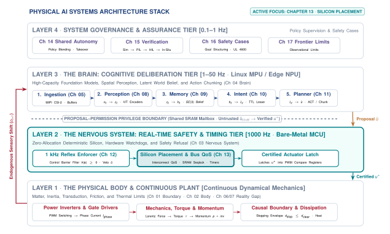
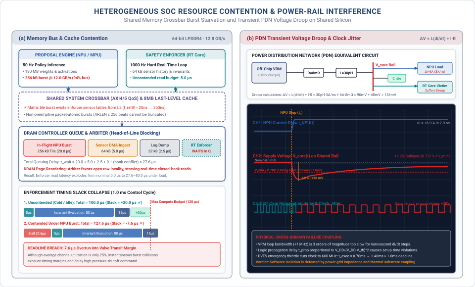
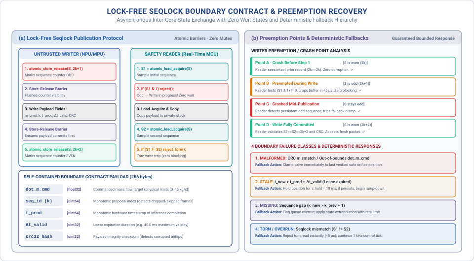

# Heterogeneous Silicon Placement {#sec-placement}

::: {.column-margin}

\chapterminitoc

:::

::: {#fig-13-locator fig-env="figure" fig-pos="H" fig-cap="**Systems Organ Focus: Nervous**: The physical co-location boundary where learned policy deliberation and deterministic safety enforcement converge on shared silicon. On a heterogeneous system-on-chip, high-throughput cognitive bursts and hard real-time reflex loops compete for memory controllers, on-chip interconnect crossbars, power distribution rails, and thermal mass. Attribution: Book architecture diagram, CC BY 4.0." fig-alt="Systems Organ Focus: Nervous. The physical co-location boundary where learned policy deliberation and deterministic safety enforcement converge on shared silicon. On a heterogeneous system-on-chip, high-throughput cognitive bursts and hard real-time reflex loops compete for memory controllers, on-chip interconnect crossbars, power distribution rails, and thermal mass. Attribution: Book architecture diagram, CC BY 4.0."}
{width="100%"}
:::

*The boundaries were drawn on a diagram. Do they exist on the die?*

In abstract system diagrams, neural perception, trajectory planning, and safety enforcement appear as clean, independent blocks connected by ideal mathematical arrows. In a physical machine, all of these workloads are forced onto shared system-on-chip silicon to meet strict size, weight, power, and cost constraints. When a dense neural accelerator bursts across a unified memory bus, it can saturate DRAM controllers and delay a safety-critical encoder interrupt by several milliseconds. Heterogeneous compute placement is the engineering discipline of allocating cognitive and reflex workloads across CPUs, NPUs, GPUs, and real-time microcontrollers while using hardware-enforced AXI QoS arbitration, power rail decoupling, and thermal management to prove that real-time safety guarantees survive execution on shared silicon.



::: {.callout-learning-objectives}
After studying this chapter, you will be able to:

1. Name every claimant on each shared resource in a given heterogeneous design.
2. Measure the tail latency distribution of the enforcement path under synthetic contention on the proposal path.
3. State what experimental result would falsify an independence claim, then construct the test harness to run it.
4. Predict how a power step or thermal excursion in the accelerator domain alters the execution timing and clock stability of the safety core.
5. Evaluate the four remediation strategies—static reservation, spatial partitioning, workload reduction, and separate silicon—against the physical dynamics of the plant.

*Core chapter takeaway.* Independence claimed on a block diagram is not independence measured under load. Two paths on one die share a bus, a rail, and a thermal mass, and physical separation must be demonstrated through worst-case empirical measurement rather than asserted through logical privilege.
:::

## The Silicon Substrate {#sec-placement-13-1}

<!-- SECTION 13.1 -->
<!-- claim: Everything built so far now shares one piece of silicon, and the independence claimed in @sec-nervous meets a real bus. -->
<!-- covers: Open with a flow-regulating machine whose learned proposal path and enforcement path occupy separate compute domains on one system-on-chip but share the route to memory and the actuator interface. -->
<!-- covers: Define independence operationally: proposal-path activity must neither move enforcement latency beyond its bound nor prevent the enforcer from refusing a command. -->
<!-- covers: Count the common resources explicitly, including the memory controller, last-level cache, interconnect, power rail, clock and reset domains, and thermal package. -->
<!-- covers: Frame the chapter as a falsification exercise that proceeds from claimant inventory to loaded measurement, warm measurement, and a recorded placement decision. -->
<!-- GROUNDING: number — two paths and what they share, counted -->

<!-- BEGIN -->
\lettrine{C}{onsider an industrial bypass} valve regulating high-pressure fuel flow into a gas turbine combustion chamber. Upstream sensors monitor manifold pressure, mass flow rate, and fuel temperature. A learned policy running on an integrated neural accelerator evaluates these telemetry streams every $20\text{ ms}$, proposing continuous micro-adjustments to the valve actuator to optimize combustion efficiency. Parallel to this proposal pipeline, a deterministic safety enforcer executes on a separate real-time processor core, evaluating flow rate limits and chamber pressure thresholds every $1.0\text{ ms}$. If chamber pressure exceeds a critical limit, the enforcer must immediately override the policy, command the valve servo to clamp shut within $2.0\text{ ms}$, and prevent an overpressure blowout. In the four-tier architectural locator shown in @fig-13-locator, the nervous system serves as the definitive temporal barrier between the stochastic, high-capacity cognition of the brain and the irreversible dynamics of the physical body. On an architectural block diagram, the proposal path and the enforcement path appear as two completely isolated functional blocks connected only by a logical interface. On the physical system-on-chip installed inside the valve actuator housing—such as a canonical heterogeneous dual-brain System-on-Chip (SoC)—both compute engines reside on the same square centimeter of silicon, sharing memory buses, power rails, clock trees, and peripheral controllers.

This shared-silicon reality governs every domain of physical embodiment across all Three Physical Machine Archetypes:

- In *Mobile systems* (Class 1), an autonomous chassis or mobile delivery robot co-locates multi-camera vision-language-action (VLA) navigation models on an embedded GPU with $1000\text{ Hz}$ steer-by-wire and emergency braking reflexes on an adjacent real-time core. A memory bus stall during feature extraction can delay an obstacle-avoidance brake command, allowing moving kinetic mass ($E_k = \frac{1}{2}mv^2$) to breach safety stopping margins ($d_{\text{stop}}$).
- In *Manipulators* (Class 2), an articulated robot arm executes high-dimensional diffusion grasping policies ($20\text{--}50\text{ Hz}$) alongside high-gain Cartesian impedance and joint torque loops ($1000\text{ Hz}$). If an accelerator tensor burst evicts safety state tables from the shared last-level cache, the resulting microsecond jitter degrades feedback phase margins ($\Delta \phi = -\frac{\omega T_s}{2}$), inducing acoustic chatter, motor torque ripple, or fixture collisions.
- In *Process and energy systems* (Class 3), industrial chemical bypass valves and high-voltage grid battery inverters co-locate continuous thermodynamic optimization with hard real-time overpressure and power-stage shoot-through interlocks. A delayed safety interrupt allows manifold pressure to spike beyond structural burst limits or power transistors to enter catastrophic thermal runaway.

In traditional software systems operating "behind glass," computing is idempotent and isolation is easily abstracted through virtual memory, kernel time-slicing, and software containers. A delayed database query or an unhandled exception causes temporary software stalls without altering physical reality. In Physical AI, however, computation exerts physical force, moves physical mass, and dissipates electrical energy. Safety arguments constructed in @sec-nervous and @sec-enforcement depend on maintaining strict physical separation between the untrusted cognitive authority that proposes action and the deterministic reflex authority that permits it. On a shared heterogeneous die, this separation requires **operational independence**, which can be defined through two concrete physical requirements. First, no computational activity, memory transfer, or burst traffic originating from the proposal path may cause the execution latency of the enforcement path to exceed its bounded deadline. Second, no failure mode, software crash, or privilege escalation within the proposal path may inhibit the enforcer from evaluating safety invariants or asserting a safe default state. If an unconstrained tensor calculation on the Linux Microprocessor Unit (MPU) delays a safety evaluation on the Real-Time Microcontroller Unit (MCU) long enough for pressure in the valve manifold to spike past its structural limit, the logical isolation depicted on the architecture diagram has failed in hardware.

To understand how logical isolation breaks down on silicon, consider an analytical example of this flow-regulating system implemented on a single system-on-chip. The deterministic enforcer runs at $1000\text{ Hz}$, initiating a state evaluation cycle every $1.0\text{ ms}$. In each cycle, the enforcer reads $64\text{ KB}$ of calibrated sensor history from main memory, verifies boundary conditions, and issues an actuator command, requiring $120\text{ }\mu\text{s}$ of baseline execution time when memory access is uncontended. The chip uses a shared 64-bit LPDDR4 memory subsystem running at a data rate of $1600\text{ MT/s}$, delivering a peak theoretical bandwidth of $12.8\text{ GB/s}$. In isolation, streaming the enforcer's $64\text{ KB}$ sensor buffer over this bus requires $64\text{ KB} / (12.8\text{ GB/s}) = 5.0\text{ }\mu\text{s}$.

Contention arises when the learned policy executes on the adjacent neural core. Running an image-based flow estimation model at $50\text{ Hz}$, the neural accelerator streams weights and activation maps totaling $180\text{ MB}$ per inference pass across a sustained $15\text{ ms}$ compute window. This inference burst demands an average bandwidth of $(180\text{ MB}) / (15\text{ ms}) = 12.0\text{ GB/s}$, consuming $93.75\%$ of the total available DRAM throughput. When the memory controller arbitrates between the two masters, the enforcer's memory requests wait in controller queues behind long bursts of matrix multiplication reads. If the effective bandwidth allocated to the enforcer falls to the residual $0.8\text{ GB/s}$, the sensor read transfer alone expands from $5.0\text{ }\mu\text{s}$ to $80.0\text{ }\mu\text{s}$. When combined with last-level cache line evictions, crossbar arbitration stalls, and interrupt handling jitter, the enforcer's observed tail latency at $P_{99.9}$ reaches $1055\text{ }\mu\text{s}$. The enforcer misses its $1.0\text{ ms}$ physical deadline, not because its own algorithmic workload changed, but because the proposal path occupied the shared memory controller.

Main memory bandwidth is merely one member of an extensive list of shared on-chip resources. A full accounting across the die reveals physical couplings at every layer of the hardware platform. The proposal engine and the safety enforcer share the last-level cache, where large activation matrices evict the enforcer's pinned lookup tables and sensor history buffers. They share the on-chip crossbar interconnect, where arbitration policies often favor burst throughput over bounded latency. They share the power distribution network, where the sudden activation of billions of switching transistors inside the neural engine produces an inductive and resistive voltage drop across the internal power rails ($\Delta V = L \cdot dI/dt + IR$), risking clock instability and timing closure failures in adjacent real-time cores. They share the phase-locked loops that generate clock signals, the hardware reset lines, and the common thermal package. If the neural accelerator dissipates $15\text{ W}$ of continuous power, the junction temperature across the silicon substrate can rise from $45^\circ\text{C}$ to $95^\circ\text{C}$, prompting thermal management logic to cut processor clock frequencies in half and double execution times across every core on the die.

Because these interactions are governed by physical coupling rather than software abstractions, architectural claims of independence must be treated as hypotheses to be falsified through rigorous measurement. Verifying a system requires four distinct steps. First, an engineer builds a claimant inventory, identifying every physical resource shared between proposal and enforcement domains, from memory channels and interconnect queues down to voltage regulators and thermal interfaces. Second, the system undergoes loaded measurement, subjecting the proposal path to synthetic worst-case compute, memory, and bus traffic while logging the full tail latency distribution of the enforcement path at $P_{99}$ and $P_{99.9}$. Third, the system undergoes warm measurement, operating under peak ambient temperatures and sustained thermal dissipation to measure clock throttling and voltage droop under load. Fourth, the engineer records a formal placement decision, verifying that the worst-case response time of the safety loop remains strictly within physical requirements under all possible operating states.

When empirical testing reveals that shared hardware invalidates safety margins, modifying software task priorities or adjusting thread scheduling cannot resolve the underlying physical contention. The coupling exists in the silicon wiring, the queue depths of the crossbar arbiters, and the thermal resistance of the integrated circuit package. Determining which compute engines can safely reside on the same die, how shared interconnects must be partitioned, and where physical isolation boundaries must be enforced represents the fundamental engineering problem of physical placement.
<!-- END -->

## Two Paths on One Die {#sec-placement-13-2}

<!-- SECTION 13.2 -->
<!-- claim: Placement cannot be deferred to integration, because it decides whether the separation is real. -->
<!-- covers: Specify each path by its inputs, outputs, execution rate, deadline, and privilege, making clear that only the enforcement path can issue an actuator command. -->
<!-- covers: Map proposal inference, state exchange, enforcement, device I/O, and logging onto concrete execution domains before assigning performance numbers. -->
<!-- covers: Calculate the unloaded execution demand of each path and expose the slack between enforcement completion and the body-imposed deadline. -->
<!-- covers: Distinguish core separation from failure-domain separation by tracing which kernel, interrupt controller, clock, reset, and memory services remain common. -->
<!-- covers: Compare candidate placements by computation time, communication time, interference exposure, and the time required to reach a safe state after a fault. -->
<!-- GROUNDING: mechanism — what runs where, and what that decision costs everything else -->
<!-- FIGURE: Show that separate compute lanes still converge on common memory, power, clock, reset, and thermal resources that can defeat the claimed separation. -->
<!-- DERIVE: Derive placement feasibility from execution demand, communication cost, deadline slack, and shared failure domains instead of asserting that compute is not fungible. -->

<!-- BEGIN -->
Placement cannot be deferred to integration, because the physical assignment of software functions to hardware execution engines determines whether separation exists at all. Consider a valve regulating high-pressure fluid flow in a chemical processing line, where a learned model adjusts the valve trim position to track a variable target flow rate while an enforcement filter prevents downstream pressure transients that would rupture the pipe. The machine contains two paths with conflicting requirements. The proposal path ingests downstream pressure histories, acoustic vibration signals, and temperature logs over a moving window of one hundred samples, running a learned neural policy at $20\text{ Hz}$ to calculate a recommended valve displacement. It operates under a soft deadline of $45\text{ ms}$, holds no direct hardware authority over the motor driver, and runs in an unprivileged user space. The enforcement path samples raw differential pressure transducers at $1000\text{ Hz}$, evaluates physical boundary constraints on pressure slew rates and cavitation limits, and generates electrical drive commands for the valve servo. It executes under a hard physical deadline of $1.0\text{ ms}$, requires an execution budget bounded at $200\text{ }\mu\text{s}$ to leave sufficient margin for mechanical valve transit, and runs in a privileged real-time execution domain. Only the enforcement path holds memory-mapped input-output access to the pulse-width modulation registers that command the valve motor.

::: {.callout-definition title="Heterogeneous Silicon Partitioning"}
The **heterogeneous silicon partitioning** pattern is the architectural allocation of stochastic, high-capacity cognitive workloads (perception, learned policy evaluation) and deterministic reflex loops (safety invariant checks, actuator commutation) across specialized execution domains—typically an unprivileged Application Processor (MPU) and a privileged Real-Time Microcontroller (MCU)—isolated via hardware memory protection units (MPUs), tightly-coupled static RAM (TCM), and dedicated peripheral controllers.
:::

To assign concrete performance numbers, these functions must be mapped onto physical silicon domains. In a heterogeneous dual-brain system-on-chip—such as the canonical dual-brain architecture introduced in @sec-nervous—proposal inference maps onto an unprivileged Linux Application Processor (MPU) or dedicated neural accelerator. State exchange between the paths maps onto a shared static memory mailbox or ring buffer in dynamic random-access memory. Safety enforcement and sensor validation map onto a dedicated Real-Time Controller Subsystem (MCU) running bare-metal firmware or a deterministic real-time operating system. Device input-output maps onto dedicated serial peripheral interface controllers, analog-to-digital converters, and timer channels directly wired to the MCU. Telemetry logging, network communications, and fault recording map onto the Linux MPU. As detailed in @tbl-13-compute-allocation, each compute domain on a modern physical AI platform exhibits distinct trade-offs across nominal clock rate, tail latency determinism, operating system isolation, and memory bus coupling.

| Compute Engine Domain                                       | Nominal Clock & Power                                    | Latency Determinism ($P_{99.99}$)                                                         | OS & Privilege Isolation                                               | Memory & Interconnect Coupling                                                 | Target Workload Assignment                                                                      |
|:------------------------------------------------------------|:---------------------------------------------------------|:------------------------------------------------------------------------------------------|:-----------------------------------------------------------------------|:-------------------------------------------------------------------------------|:------------------------------------------------------------------------------------------------|
| **Application Processor Subsystem (MPU)**                   | $1.0\text{--}2.2\text{ GHz}$, $2\text{--}10\text{ W}$    | Non-deterministic (Jitter $> 20\text{ ms}$; MMU paging, kernel preemption)                | Rich OS (Linux / POSIX), Ring 3 user space vs. Ring 0 kernel           | Shared coherent L3 cache, virtual memory via MMU, unified DRAM                 | Telemetry logging, edge VLMs/VLAs, PyTorch, ROS2 policy evaluation ($10\text{--}50\text{ Hz}$)  |
| **GPU Tensor Core Engine**                                  | $0.8\text{--}1.3\text{ GHz}$, $10\text{--}40\text{ W}$   | Semi-deterministic (Jitter $\approx 200\text{--}800\text{ }\mu\text{s}$; warp scheduling) | Host driver queue, user-space runtime, unified virtual memory          | High-throughput LPDDR5/HBM, wide AXI bursts ($256\text{ B}$), high DRAM load   | High-throughput perception, multi-camera feature extraction, dense VLM inference                |
| **Dedicated Neural Processing Unit** (NPU / Systolic Array) | $0.6\text{--}1.0\text{ GHz}$, $2\text{--}8\text{ W}$     | High determinism (Jitter $< 50\text{ }\mu\text{s}$; static graph execution)               | Hardware mailbox, fixed-depth systolic pipeline, pinned memory buffers | Dedicated on-chip SRAM ($8\text{--}32\text{ MB}$), periodic DMA bursts to DRAM | Learned policy evaluation, low-latency trajectory chunk generation ($20\text{--}100\text{ Hz}$) |
| **Real-Time Controller Subsystem (MCU)**                    | $200\text{--}800\text{ MHz}$, $0.1\text{--}1.5\text{ W}$ | Strictly bounded (Jitter $< 5.0\text{ }\mu\text{s}$; deterministic in-order core)         | RTOS (FreeRTOS / Zephyr) or Bare-Metal, MPU memory regions             | Tightly-Coupled Memory (TCM / SRAM), private peripheral bus, zero paging       | Deterministic safety invariants, $1\text{ kHz}$ CBF safety filters, direct PWM timers           |
| **Discrete Safety Microcontroller**                         | $200\text{--}400\text{ MHz}$, $0.2\text{--}1\text{ W}$   | Fully invariant (Jitter $< 50\text{ ns}$; cycle-accurate lockstep core)                   | Bare-metal / AUTOSAR Classic, hardware Fault Collection Unit (FCCU)    | Isolated SRAM/Flash, independent external power rails, dedicated crystal       | Emergency mechanical clamping, hardware interlocks, supervisory watchdog trips                  |
: **Heterogeneous Compute Allocation and Execution Domain Characteristics**: Comparative analysis of compute domains on modern physical AI platforms. Allocation decisions dictate latency determinism, failure isolation, and memory contention, establishing why safety-critical reflex loops cannot execute on general-purpose application cores or GPUs without hardware-enforced isolation. {#tbl-13-compute-allocation}

In an analytical evaluation of the unloaded system, the computational budgets appear generous. In the enforcement path on the real-time MCU, reading four pressure sensors over a high-speed peripheral bus requires $40\text{ }\mu\text{s}$, evaluating the constraint envelope and computing the actuator signal takes $80\text{ }\mu\text{s}$, and writing the resulting register values to the motor controller timer takes $15\text{ }\mu\text{s}$. The total unloaded execution demand is $135\text{ }\mu\text{s}$. Against the $400\text{ }\mu\text{s}$ computational deadline mandated by the $1.0\text{ ms}$ physical cycle (which reserves $600\text{ }\mu\text{s}$ for servo motor settling), the enforcement path exhibits an unloaded slack of $265\text{ }\mu\text{s}$. In the proposal path on the Linux MPU, a policy requiring $3.2\text{ GFLOPs}$ per step executes on an accelerator capable of $2.0\text{ TFLOPS}$ sustained throughput, yielding an inference time of $1.6\text{ ms}$. Adding $0.8\text{ ms}$ for tensor formatting and $0.1\text{ ms}$ to publish the proposal to the shared ring buffer, the proposal path requires $2.5\text{ ms}$ of computation per $50\text{ ms}$ cycle, leaving $47.5\text{ ms}$ of unloaded slack. Evaluated in isolation, both loops operate with comfortable margins.

Assigning these tasks to separate processor cores does not establish independent failure domains if the underlying silicon infrastructure remains shared.[^fn-std-cast-32a] While the real-time core executes instructions independently from the application processor, both cores rely on common hardware services:

- *Shared interrupt routing:* The Generic Interrupt Controller (GIC) routes peripheral and inter-processor notifications across a shared fabric, where a flood of Ethernet packet interrupts on the Linux MPU can delay the timer interrupt that triggers the $1000\text{ Hz}$ MCU safety loop.
- *Shared memory controllers:* Both paths access the same dynamic memory controller and interconnect crossbar, where large matrix tile loads generated by the neural accelerator saturate DRAM command queues, turning an expected $20\text{ ns}$ level-two cache refill on the real-time core into a $350\text{ ns}$ round-trip to main memory.
- *Shared clock trees:* The cores share phase-locked loops (PLLs) for clock generation, where dynamic voltage and frequency scaling (DVFS) transients on the application processor introduce clock jitter across adjacent real-time domains.
- *Shared power rails:* A single Power Distribution Network (PDN) delivers current to both domains, where switching surges from the neural accelerator drop the internal voltage rail, risking logic state corruption or brownout resets.
- *Shared reset domains:* A kernel panic on the Linux MPU that triggers a hardware watchdog reset can pull down the shared peripheral bus or system interconnect, disabling pulse-width modulation outputs and leaving the valve unpowered.

Evaluating candidate placements reveals how physical coupling governs system feasibility. In a unified placement where proposal, enforcement, and logging execute as threads under a single symmetric multiprocessing operating system on shared application cores, communication between paths takes less than $1\text{ }\mu\text{s}$ via shared pointer passing. However, cache eviction and kernel preemption cause the tail latency of the enforcement path to reach $2.8\text{ ms}$ at $P_{99.9}$, repeatedly missing the $1.0\text{ ms}$ hard deadline and risking pipe overpressure. In a heterogeneous single-die placement (e.g., dual-brain SoC with Linux MPU + Real-Time MCU on one chip), proposal runs on the MPU/NPU and enforcement runs on an isolated MCU core; communication across on-chip shared static random-access memory requires $12\text{ }\mu\text{s}$. Under synthetic worst-case memory contention, enforcement latency rises to $380\text{ }\mu\text{s}$, which still fits within the $400\text{ }\mu\text{s}$ compute budget. However, when the accelerator dissipates sustained peak power, local thermal elevation triggers automatic clock frequency halving, stretching enforcement execution to $540\text{ }\mu\text{s}$ and violating the physical deadline. In a dual-die placement where enforcement resides on a physically isolated microcontroller with its own power regulation, crystal oscillator, and memory, communication across an external serialized peripheral interface costs $150\text{ }\mu\text{s}$. Because the failure domains are physically decoupled, the enforcement execution time remains invariant at $135\text{ }\mu\text{s}$, guaranteeing that if the proposal path stalls, crashes, or overheats, the enforcement core detects the missing heartbeat and transitions the flow valve to a safe mechanical relief position within a single $1.0\text{ ms}$ cycle.
<!-- END -->

## Contention for Shared Resources {#sec-placement-13-3}

<!-- SECTION 13.3 -->
<!-- claim: Every shared resource has more than one claimant, and a number that does not say what it competes with is not yet a systems number. -->
<!-- covers: Inventory the digital claimants, including sensor direct-memory-access traffic, model weights and activations, enforcement-state reads, actuator writes, cache maintenance, and logging. -->
<!-- covers: Derive each claimant’s average demand from bytes per event and event rate, then retain burst size and burst duration because equal averages can produce different interference. -->
<!-- covers: Use arithmetic intensity only to determine whether a workload tends to be compute- or memory-bound; use arbitration, burst timing, cache residency, and priority to determine which request waits. -->
<!-- covers: Calculate the enforcement delay produced when its request arrives behind the longest permitted overlapping burst, and compare that delay with the available slack. -->
<!-- covers: Inventory power claimants separately by their current steps, shared source impedance, regulator response, and susceptibility to voltage droop, clock reduction, or reset. -->
<!-- covers: Name a detector for each coupling mechanism, such as memory-controller counters, cache-miss counters, request timestamps, rail telemetry, throttle flags, and reset-cause registers. -->
<!-- GROUNDING: number — every claimant on one memory controller, and arithmetic intensity -->
<!-- FIGURE: Show, in two aligned panels, how a memory burst adds enforcement delay while a proposal-path current step reduces timing headroom through the shared rail. -->
<!-- DERIVE: Derive digital demand as bytes per event times event rate and derive rail disturbance from current step and supply impedance; arithmetic intensity alone cannot predict which claimant wins. -->

<!-- BEGIN -->
Every shared resource has more than one claimant, and a number that does not say what it competes with is not yet a systems number. On a system-on-chip regulating a fluid pipeline, physical wires do not respect functional boundaries drawn on a software architecture diagram. The proposal path, the enforcement path, and the system infrastructure share the same silicon, competing for the same memory controllers, crossbar switches, and power distribution rails. An inventory of digital claimants on the main memory bus includes sensor direct memory access streams that deposit raw pressure transducer readings and acoustic flow telemetry into dynamic random-access memory, the neural accelerator fetching model weight matrices and spilling intermediate activation tensors, the real-time core reading pipeline boundary invariants and historic sensor ring buffers, actuator write buffers pushing pulse-width modulation commands to the flow valve driver, cache controllers executing dirty line writebacks, and diagnostic logging processes writing state records to nonvolatile storage buffers.

In physical AI hardware design, *crossbar bus and DRAM bank contention* is the physical queuing delay and priority inversion induced when high-throughput memory or direct memory access (DMA) bursts from unconstrained compute masters saturate shared on-chip interconnect crossbars and DRAM controllers, inflating the worst-case read and write latencies of high-priority real-time safety transactions due to non-preemptive packet burst arbitration and DRAM row-buffer bank conflicts.

Each claimant imposes a demand that can be derived from its transfer size per event and its event rate. In an analytical example of a flow-regulation controller sharing a single $64\text{-bit}$ LPDDR4 memory channel rated at $12.8\text{ GB/s}$ peak bandwidth, sensor direct memory access transfers a $64\text{ kB}$ buffer at $1000\text{ Hz}$, generating an average demand of $64.0\text{ MB/s}$. The learned proposal model executes an inference pass every $20\text{ ms}$ ($50\text{ Hz}$), streaming $60\text{ MB}$ of parameters and activation data for an average demand of $3.0\text{ GB/s}$. The enforcement path executes every $1.0\text{ ms}$ ($1000\text{ Hz}$), reading $4\text{ kB}$ of pipeline state and historical sensor logs, consuming $4.0\text{ MB/s}$ on average. Actuator writes require $1\text{ kB}$ per millisecond ($1.0\text{ MB/s}$), cache maintenance evictions contribute $128.0\text{ MB/s}$ in writebacks, and diagnostic telemetry logging transfers $32\text{ kB}$ records at $100\text{ Hz}$ ($3.2\text{ MB/s}$). Summing these rates gives an aggregate demand of $3.2002\text{ GB/s}$, which represents $25.0\%$ of the channel capacity. An engineer who inspects only average utilization would conclude that three-quarters of the bus capacity remains available. But memory arbiters do not schedule average rates, they arbitrate discrete bursts, and two workloads with identical average throughput create distinct interference profiles if one streams continuously in small packets while the other arrives in long, saturating blocks.

Arithmetic intensity, defined as the ratio of arithmetic operations to memory bytes transferred, indicates whether a computational routine is bounded by execution units or by memory bandwidth during steady-state execution. For a convolution or dense matrix multiplication on the proposal path, an arithmetic intensity of $120\text{ FLOP/byte}$ indicates that arithmetic units will be fully occupied once data resides in local cache or static memory. However, during the initial phase where weights are transferred from dynamic memory, the operational arithmetic intensity drops to zero, converting the accelerator into a high-priority direct memory access engine that saturates the memory bus. Arithmetic intensity reveals whether a workload can hide memory transfer latency behind arithmetic work in isolation, but it provides no information about queue contention, transfer priority, burst duration, or which request waits when two paths access the bus simultaneously.

The latency experienced by the enforcement path depends directly on the longest uninterrupted burst permitted on the shared interconnect and the internal banking dynamics of the DRAM subsystem (@fig-13-soc-contention-droop a). In this analytical system, the neural accelerator transfers weights in $256\text{ kB}$ tiles. Across a $12.8\text{ GB/s}$ interface, an uninterrupted $256\text{ kB}$ burst occupies the physical bus for $20.0\text{ }\mu\text{s}$. When the on-chip interconnect uses packet-atomic non-preemptive arbitration (even with AMBA AXI Quality-of-Service `AxQOS` priority tags), an enforcement request that arrives immediately after a tile transfer begins must wait the full $20.0\text{ }\mu\text{s}$ transfer duration. Contention is further compounded inside the dynamic memory controller. Dynamic random-access memory is physically organized into independent banks, where each bank contains a two-dimensional array of storage cells managed by a single row buffer. When an access targets a row already loaded into the buffer (a *row-buffer hit*), data is transferred in column access time ($t_{\text{CAS}} \approx 14\text{ ns}$). If an access targets a different row in the same bank (a *bank conflict* or *row-buffer miss*), the controller must first restore and close the open row by precharging the bank ($t_{\text{RP}} \approx 14\text{ ns}$), activate the newly requested row ($t_{\text{RCD}} \approx 14\text{ ns}$), and execute the column read ($t_{\text{CAS}} \approx 14\text{ ns}$), tripling baseline access latency.

Crucially, modern DRAM memory controllers employ First-Ready First-Come-First-Served (FR-FCFS) scheduling algorithms designed to maximize aggregate bus utilization by prioritizing row-buffer hits over raw transaction arrival order. When the neural engine streams a continuous matrix tile, it holds open active row buffers across multiple DRAM banks. If a high-priority real-time safety read targeting a closed row arrives from the MCU, the DRAM controller repeatedly reorders queued transactions to prioritize remaining hits from the neural stream. If the controller queue contains a pending $64\text{ kB}$ sensor direct memory access burst ($5.0\text{ }\mu\text{s}$) and a $32\text{ kB}$ logging burst ($2.5\text{ }\mu\text{s}$), plus multiple bank conflict precharge cycles, total queuing delay reaches $27.6\text{ }\mu\text{s}$. If the enforcement routine has a total compute allocation of $100\text{ }\mu\text{s}$ within a $1.0\text{ ms}$ physical deadline and was provisioned with $20.0\text{ }\mu\text{s}$ of timing slack, this $27.6\text{ }\mu\text{s}$ memory stall consumes the entire margin and delays the valve closing command by $7.6\text{ }\mu\text{s}$, causing an actuation deadline violation.

::: {#pri-memory-contention .callout-principle title="The Memory Contention Invariant"}
Average memory bus bandwidth is a vanity metric; real-time safety is dictated entirely by worst-case burst length, DRAM bank conflict precharge latencies, and non-preemptive crossbar queue depths.
:::

Contention extends to the power distribution network, where claimants compete for charge rather than bandwidth (@fig-13-soc-contention-droop b). When the neural accelerator starts a matrix multiply across thousands of parallel multiply-accumulate units, its current draw steps by $\Delta I = 6.0\text{ A}$ with a transition time of $\Delta t = 2.0\text{ ns}$, producing a current slew rate of $dI/dt = 3.0\text{ A/ns}$. Across a shared power distribution network with an effective loop inductance of $L = 30\text{ pH}$ and an equivalent series resistance of $R = 8.0\text{ m}\Omega$, the transient voltage disturbance across the rail is derived from the fundamental circuit relationship:
$$\Delta V = L \cdot \frac{dI}{dt} + I \cdot R$$
The inductive drop contributes $L(dI/dt) = (30 \times 10^{-12}\text{ H}) \times (3.0 \times 10^9\text{ A/s}) = 90\text{ mV}$, while the resistive drop contributes $I \cdot R = (6.0\text{ A}) \times (8.0 \times 10^{-3}\ \Omega) = 48\text{ mV}$, producing a total rail droop of $\Delta V = 138\text{ mV}$.

*PDN voltage droop coupling* is the instantaneous electrical rail collapse ($\Delta V = L \cdot \frac{dI}{dt} + I \cdot R$) induced across shared on-die power distribution networks when fast, large current steps from parallel neural execution units deplete local decoupling capacitance, stretching logic gate propagation delays ($t_{\text{pd}}$) and triggering clock frequency degradation, timing closure violations, or brownout resets across co-located real-time cores.

On a nominal $0.85\text{ V}$ core supply, this $138\text{ mV}$ drop represents a $16.2\%$ voltage collapse, falling well below the $0.78\text{ V}$ minimum operating voltage ($V_{\min}$) of the co-located real-time core. The off-chip Voltage Regulator Module (VRM) operates with a control loop bandwidth below $1\text{ MHz}$, responding within $2.0\text{ }\mu\text{s}$—three orders of magnitude too slow to counteract a nanosecond transient. First-stage charge delivery relies entirely on integrated deep-trench decoupling capacitors (DTCs). If local capacitance is depleted before the current transient settles, supply voltage collapses. In digital CMOS circuits, logic gate propagation delay ($t_{\text{pd}}$) follows the Alpha-Power Law:
$$t_{\text{pd}} \propto \frac{C_L V_{dd}}{(V_{dd} - V_{\text{th}})^\alpha}$$
where $C_L$ is load capacitance, $V_{\text{th}} \approx 0.35\text{ V}$ is transistor threshold voltage, and $\alpha \approx 1.3$ is the velocity saturation index. As $V_{dd}$ collapses from $0.85\text{ V}$ to $0.712\text{ V}$, the overdrive term $(V_{dd} - V_{\text{th}})$ drops by $27.6\%$, stretching gate propagation delays by $+38\%$. Logic paths fail flip-flop setup-time margins ($t_{\text{setup}}$), causing pipeline timing faults, dynamic frequency throttling, or hardware brownout resets that immediately drop valve actuation drive signals.

::: {.callout-important title="Inductive Power Rail Voltage Droop and Timing Headroom Collapse"}
*Practical Engineering Question:* Why does activating a neural accelerator's systolic array cause an adjacent real-time safety microcontroller core on the same die to fail setup-time timing closure, even when the power supply is rated for $100\text{ W}$?

*1. Current Slew Rate ($dI/dt$) and Parasitic Rail Inductance ($L$):*
Suppose an unclocked $8\text{--}\text{core}$ neural processing unit suddenly enables $4096$ multiply-accumulate (MAC) units to execute a transformer linear projection layer. Current draw steps from $I_0 = 1.0\text{ A}$ (quiescent) to $I_{\text{peak}} = 7.0\text{ A}$ ($\Delta I = 6.0\text{ A}$) within a transition rise time of $\Delta t = 2.0\text{ ns}$.
$$\frac{dI}{dt} = \frac{6.0\text{ A}}{2.0 \times 10^{-9}\text{ s}} = 3.0 \times 10^9\text{ A/s} = 3.0\text{ A/ns}$$
The on-chip power distribution grid and ball-grid array (BGA) package exhibit an effective parasitic loop inductance $L = 30\text{ pH} = 30 \times 10^{-12}\text{ H}$ and equivalent series resistance $R = 8.0\text{ m}\Omega = 0.008\ \Omega$.

*2. Rail Voltage Droop Calculation:*
$$\Delta V = L \cdot \frac{dI}{dt} + I_{\text{peak}} \cdot R = (30 \times 10^{-12}\text{ H})(3.0 \times 10^9\text{ A/s}) + (6.0\text{ A})(0.008\ \Omega) = 90\text{ mV} + 48\text{ mV} = 138\text{ mV}$$
On a nominal core supply $V_{dd} = 0.850\text{ V}$, the rail sags to $V_{\text{core}} = 0.850\text{ V} - 0.138\text{ V} = 0.712\text{ V}$, breaching the core's minimum operating voltage ceiling ($V_{\min} = 0.780\text{ V}$).

*3. Alpha-Power Law Gate Delay Stretch:*
With threshold voltage $V_{\text{th}} = 0.350\text{ V}$ and velocity saturation parameter $\alpha = 1.30$:

- Nominal overdrive: $(V_{dd} - V_{\text{th}})^\alpha = (0.850 - 0.350)^{1.3} = (0.500)^{1.3} \approx 0.406$
- Drooped overdrive: $(V_{\text{droop}} - V_{\text{th}})^\alpha = (0.712 - 0.350)^{1.3} = (0.362)^{1.3} \approx 0.266$
- Propagation delay scaling ratio:
$$\frac{t_{\text{pd,droop}}}{t_{\text{pd,nom}}} = \frac{V_{\text{droop}} / (V_{\text{droop}} - V_{\text{th}})^\alpha}{V_{dd} / (V_{dd} - V_{\text{th}})^\alpha} = \frac{0.712 / 0.266}{0.850 / 0.406} = \frac{2.677}{2.094} \approx 1.278 \implies +27.8\% \text{ gate delay stretch}$$
When combined with high-temperature metallization resistance ($+10\%$), critical logic path delay expands by $+38\%$.

*Systems Verdict:* A logic pipeline designed with a $15\%$ setup-time margin ($t_{\text{setup}}$) suffers catastrophic timing violations on the real-time core. To survive, the system-on-chip's power management unit must either enforce dedicated deep-trench capacitors (DTC) with localized power islands or force emergency dynamic frequency halving ($1.2\text{ GHz} \to 600\text{ MHz}$), doubling enforcement execution time and overrunning control deadlines.
:::

::: {#fig-13-soc-contention-droop fig-env="figure" fig-pos="t" fig-cap="**Heterogeneous SoC Resource Contention and Power-Rail Interference**: (a) On-chip memory bus and cache contention. A high-throughput proposal engine (NPU/MPU) streams dense parameter tensors ($180\text{ MB}$, $256\text{ kB}$ bursts at $12.0\text{ GB/s}$), evicting safety state tables from shared L3 cache and saturating the non-preemptive DRAM controller queue ($t_{\text{wait}} = 27.6\text{ }\mu\text{s}$). In the timing waterfall below, queuing stalls inflate the real-time enforcer's sensor read latency from $5.0\text{ }\mu\text{s}$ to $32.6\text{ }\mu\text{s}$, consuming available timing slack ($+20\text{ }\mu\text{s}$) and overrunning the $120\text{ }\mu\text{s}$ compute budget by $7.6\text{ }\mu\text{s}$ within the $1.0\text{ ms}$ control loop. (b) Power Distribution Network (PDN) transient voltage droop and clock degradation. Fast current steps ($\Delta I = 6.0\text{ A}$, $dI/dt = 3.0\text{ A/ns}$) excite package loop parasitics ($L = 30\text{ pH}$, $R = 8.0\text{ m}\Omega$), inducing an instantaneous rail droop $\Delta V = L(dI/dt) + IR = 138\text{ mV}$ ($16.2\%$ collapse on $0.85\text{ V}$ rail). The resulting voltage sag breaches $V_{\min} = 0.78\text{ V}$, stretching gate propagation delays by $+38\%$ and triggering DVFS emergency clock halving ($1.2\text{ GHz} \to 600\text{ MHz}$) that expands enforcement execution beyond physical deadlines. Attribution: Original diagram created for this textbook (CC BY 4.0)." fig-alt="Heterogeneous SoC Resource Contention and Power-Rail Interference. (a) On-chip memory bus and cache contention. A high-throughput proposal engine (NPU/MPU) streams dense parameter tensors (180\text{ MB}, 256\text{ kB} bursts at 12.0\text{ GB/s}), evicting safety state tables from shared L3 cache and saturating the non-preemptive DRAM controller queue (t{\text{wait}} = 27.6\text{ }\mu\text{s}). In the timing waterfall below, queuing stalls inflate the real-time enforcer's sensor read latency from 5.0\text{ }\mu\text{s} to 32.6\text{ }\mu\text{s}, consuming available timing slack (+20\text{ }\mu\text{s}) and overrunning the 120\text{ }\mu\text{s} compute budget by 7.6\text{ }\mu\text{s} within the 1.0\text{ ms} control loop. (b) Power Distribution Network (PDN) transient voltage droop and clock degradation. Fast current steps (\Delta I = 6.0\text{ A}, dI/dt = 3.0\text{ A/ns}) excite package loop parasitics (L = 30\text{ pH}, R = 8.0\text{ m}\Omega), inducing an instantaneous rail droop \Delta V = L(dI/dt) + IR = 138\text{ mV} (16.2\% collapse on 0.85\text{ V} rail). The resulting voltage sag breaches V{\min} = 0.78\text{ V}, stretching gate propagation delays by +38\% and triggering DVFS emergency clock halving (1.2\text{ GHz} \to 600\text{ MHz}) that expands enforcement execution beyond physical deadlines. Attribution: Original diagram created for this textbook (CC BY 4.0)."}
{width="95%"}
:::

Detecting these interactions requires dedicated hardware instrumentation, because software running on a core that has been stalled cannot record the duration of its own stall. Memory-controller performance counters log queue occupancy, bank conflicts, and per-master read and write transaction counts. Performance monitoring units on the real-time core record cache miss counts and stall cycles against an invariant free-running counter. On the electrical side, on-die analog-to-digital converters and fast comparator circuits record voltage excursions on internal rails, thermal diodes log junction temperature gradients across the floorplan, and power-management logs record dynamic frequency throttling states. When an uncommanded reset occurs, reset-cause registers distinguish a software watchdog expiration from an under-voltage brownout or a thermal emergency trip.

When contention is budgeted through measured burst times, queue structures, and power supply impedances rather than assumed from isolated benchmarks, the boundary between proposal and enforcement ceases to be a conceptual line on a block diagram. As summarized in @tbl-13-contention-channels, multi-master contention on shared silicon operates across digital memory queues, cache hierarchies, crossbar switches, and analog power/thermal networks, requiring active hardware interceptors to guarantee real-time safety.

| Contention Channel                   | Physical Coupling Mechanism                                                               | Contention Trigger & Workload Dynamics                                                                         | Nominal vs. Contended Delay                                                                            | Systems Failure Manifestation                                                                | Hardware Mitigation & Interceptor                                                    |
|:-------------------------------------|:------------------------------------------------------------------------------------------|:---------------------------------------------------------------------------------------------------------------|:-------------------------------------------------------------------------------------------------------|:---------------------------------------------------------------------------------------------|:-------------------------------------------------------------------------------------|
| **DRAM Memory Bus & Controller**     | Non-preemptive burst arbitration, bank conflicts ($t_{\text{RCD}}$, $t_{\text{RP}}$)      | Accelerator weight tile prefetch ($256\text{ kB}$ bursts) overlapping sensor history reads                     | $5.0\text{ }\mu\text{s} \rightarrow 80.0\text{ }\mu\text{s}$ ($16\times$ inflation per $64\text{ kB}$) | Sensor buffer starvation, $1.0\text{ ms}$ control loop overrun, delayed clamp                | AXI QoS priority tags (`AxQOS`), dedicated DRAM channels, DMA token buckets          |
| **Shared Last-Level Cache (L3)**     | Cache line capacity thrashing via pseudo-LRU replacement policy                           | Large parameter tensor streaming ($>10\text{ MB}$) evicting safety state tables                                | $20\text{ ns}$ (L2 hit) $\rightarrow 350\text{ ns}$ (DRAM round-trip penalty)                          | Pipeline stalls in invariant checkers, tail latency jitter at $P_{99.9}$                     | Cache way-partitioning (ARM MPAM, Intel CAT), cache-line locking, private TCM        |
| **On-Chip Interconnect Crossbar**    | Arbiter queue head-of-line blocking on multi-layer AXI/NoC fabrics                        | Concurrent camera DMA streams and diagnostic circular ring-buffer flushes                                      | $35\text{ ns} \rightarrow 840\text{ ns}$ transaction stall ($24\times$ inflation)                      | Actuator packet dispatch delay, PWM register jitter, missed heartbeat checks                 | Segregated virtual channels, strict-priority crossbar routing, decoupled slave ports |
| **Power Distribution Network (PDN)** | Inductive ($L\cdot dI/dt$) and resistive ($I\cdot R$) rail voltage collapse               | Simultaneous unclocked MAC array activation ($\Delta I = 6\text{--}22\text{ A}$, $t_r < 5\text{ ns}$)          | $\Delta V = 138\text{--}165\text{ mV}$ droop ($>16\%$ drop on $0.85\text{ V}$ rail)                    | Gate propagation stretch, timing closure violations, under-voltage reset                     | On-package deep-trench capacitors (DTC), current-slew limiters, isolated PMIC rails  |
| **Shared Thermal Package**           | Substrate heat diffusion through package spreader ($\theta_{\text{JA}} = 2.0\text{ K/W}$) | Sustained peak inference ($15\text{--}25\text{ W}$) driving junction past $T_{\text{trip}} = 95^\circ\text{C}$ | Clock halved ($1.2\text{ GHz} \rightarrow 600\text{ MHz}$), execution $2.0\times$                      | Enforcement execution expands ($0.70\text{ ms} \rightarrow 1.40\text{ ms}$), deadline missed | Independent PLL domains, NPU thermal throttling caps, physical dual-die split        |
: **Shared SoC Resource Contention Channels and Physical Coupling Mechanisms**: Breakdown of five physical interference vectors on unified silicon. Contention operates at microsecond and nanosecond timescales beneath operating system visibility, requiring architectural partitioning or dedicated hardware isolation to prevent cognitive bursts from violating reflex timing bounds. {#tbl-13-contention-channels}

The interaction between two paths on one die cannot be left to uncoordinated arbitration. What crosses the physical boundary must be defined by explicit guarantees on production time, validity, and failure response.
<!-- END -->

## The Boundary Contract {#sec-placement-13-4}

<!-- SECTION 13.4 -->
<!-- claim: What crosses between the two paths is a contract with a production time, a validity interval, and a defined behaviour on every way it can be missing, not a pointer into shared memory. -->
<!-- covers: State the boundary contract as the latest complete proposal plus its production time, sequence, validity interval, and provenance, rather than as an unqualified pointer into shared memory. -->
<!-- covers: Size the bounded exchange from producer rate and maximum consumer stall, then state whether overflow discards the oldest proposal, rejects the newest, or forces a fallback. -->
<!-- covers: Trace a writer preempted before, during, and after publication to show how the reader detects an incomplete or torn record. -->
<!-- covers: State the required memory-order relationship without descending into instruction-set-specific fence configuration. -->
<!-- covers: Require the enforcement path to detect stale, missing, overwritten, and malformed records and to continue with a bounded fallback in every case. -->
<!-- covers: Prohibit mutex ownership, allocation pressure, or backpressure from the proposal side from delaying the enforcement path. -->
<!-- GROUNDING: mechanism — what crosses the trust boundary, with its production time and its behaviour on every way of being missing -->
<!-- FIGURE: Show every point at which the writer can stop while the reader either obtains one complete version or detects failure without blocking. -->
<!-- DERIVE: Derive ring capacity from production rate and worst-case consumer stall, and derive why the publication protocol cannot expose a mixed-version record. -->

<!-- BEGIN -->
What crosses between the proposal path and the enforcement path is a contract carrying a production timestamp, a sequence identifier, a validity interval, and a defined response for every failure mode, not an unqualified pointer into shared memory. Passing a raw memory address across the trust boundary couples the reader directly to the writer's internal memory layout, execution timing, and failure domain. If a vision-language model or deep neural policy running on an accelerator provides only a pointer to its private output buffer, the real-time core that regulates a gas valve has no mechanism to determine whether the writer is still modifying the buffer, has stalled mid-inference, or has encountered an unhandled fault. The boundary payload must therefore be an immutable, self-contained record. For a fluid flow regulator, this record contains the target mass flow rate command $\dot{m}_{\text{cmd}}$, a monotonically increasing sequence counter $k$, a generation timestamp $t_{\text{prod}}$ sampled from an invariant hardware timer, an expiration lease duration $\Delta t_{\text{valid}}$, and an integrity checksum calculated over the payload bytes. In a canonical heterogeneous dual-brain architecture (as formalized in the intent contract in @sec-nervous), this interface manifests as a packed struct exchanged across zero-copy shared SRAM mailboxes, binding spatial target vectors, velocity/acceleration limits, epistemic model confidence $\gamma_{\text{conf}}$, and an IEEE 802.3 32-bit CRC checksum. The enforcement path reads the record as an isolated snapshot, evaluating its temporal freshness and physical validity before any value reaches the valve actuator.

Preserving temporal isolation across a shared die requires eliminating all blocking synchronization primitives at the exchange interface. If the real-time enforcement loop acquires a mutual exclusion lock held by the proposal generator, any execution stall in the neural pipeline propagates directly into the physical plant. In an analytical example of a flow regulation loop operating at $1000\text{ Hz}$ with a $1.0\text{ ms}$ tick budget, a $25\text{ ms}$ inference tail stall on the host processor would cause the real-time core to miss 25 consecutive actuation updates while gas pressure in the manifold continues to rise. Dynamic memory allocation introduces the same vulnerability, because allocating or freeing buffer structures from a shared heap contends for allocator spinlocks and triggers unpredictable memory reclamation latency. Backpressure is equally prohibited. The proposal path cannot throttle the rate of the enforcement loop when the plant requires continuous regulation, and the enforcement path cannot stall the policy pipeline when fresh sensor frames arrive. The interaction must be one-way, non-blocking, and asynchronous, ensuring that the enforcement core runs to completion on every tick regardless of the operational state of the publisher.

When the proposal path emits trajectory chunks rather than single setpoints, the exchange boundary requires a bounded ring buffer sized to decouple the two execution rates. Consider an analytical example where the learned policy produces flow setpoint updates at a rate of $f_{\text{prop}} = 50\text{ Hz}$, giving a production period of $T_{\text{prop}} = 20\text{ ms}$, while the enforcement loop services the valve at $f_{\text{enf}} = 1000\text{ Hz}$ with a period of $T_{\text{enf}} = 1.0\text{ ms}$. If the real-time core experiences a maximum servicing delay of $\Delta t_{\text{stall}} = 60\text{ ms}$ during emergency sensor diagnostics or flash logging, the producer emits proposals that the consumer cannot immediately drain. The minimum buffer capacity $N$ required to preserve all unread proposals during this worst-case consumer stall is derived from the producer rate and the stall duration, $N = \lceil f_{\text{prop}} \cdot \Delta t_{\text{stall}} \rceil + 1 = \lceil 50\text{ Hz} \cdot 0.060\text{ s} \rceil + 1 = 4\text{ slots}$. If the buffer fills beyond $N$ slots, the exchange policy must define whether to discard the oldest unread proposal, reject the incoming write, or initiate a fallback. In a flow regulation system where physical valve dynamics evolve forward in time, retaining stale trajectory targets while rejecting new state corrections degrades tracking accuracy. The exchange contract therefore overwrites the oldest slot on overflow while setting a queue-overrun flag, forcing the consumer to recognize that intermediate proposals were dropped.

Preventing the enforcement reader from observing a partially written or mixed-version record requires a lock-free publication protocol governed by memory barriers (@fig-13-lockfree-boundary-contract a).[^fn-hw-dmb-barriers] The writer and reader coordinate through a single shared sequence counter $S$. Before modifying the payload buffer, the writer increments $S$ from an even value to an odd value, executes a store-release memory barrier to ensure that the updated sequence is visible to interconnect arbiters, writes the payload fields, executes a second store-release barrier, and increments $S$ to the next even integer. The enforcement reader reads $S$ using a load-acquire operation, storing the initial value $S_1$. If $S_1$ is odd ($S_1 \pmod 2 = 1$), the writer is actively modifying the buffer, and the reader rejects the slot without touching the payload. If $S_1$ is even, the reader executes a load-acquire barrier, reads the payload fields, executes another load-acquire barrier, and samples the counter a second time as $S_2$. The reader accepts the data if and only if $S_1 = S_2$. If $S_1 \neq S_2$, the writer updated or started modifying the record during the read operation, indicating that the data is torn. Tracing the writer across all preemption points demonstrates why a mixed-version record cannot be exposed. If the writer halts before the first increment, the reader samples the previous even sequence and obtains the prior intact record. If the writer halts after setting $S$ odd or during payload writes, the reader observes an odd sequence on every subsequent cycle and rejects the buffer. If the writer halts after the final even increment, the reader receives the new, fully committed record. At no point can a stalled or preempted writer force the reader to consume inconsistent bytes.

::: {#pri-asymmetric-decoupling .callout-principle title="Lock-Free Asymmetric Decoupling"}
Never share a blocking synchronization primitive across cognitive deliberation and hard real-time safety domains; asynchronous lock-free sequence mailboxes guarantee that reader execution latency is bounded ($< 5\,\mu\text{s}$) regardless of writer preemption, crashes, or unhandled faults.
:::

::: {.callout-example  title="Algorithm 13.1: Hardware Crossbar QoS Arbitration and Thermal Throttling Supervisor"}
**Inputs:** Memory transaction request $\text{req} = \{\text{master\_id}, \text{addr}, \text{burst\_len}, \text{is\_write}, \text{qos\_tag}\}$, silicon junction temperature $T_j$ from on-die thermal diodes.

**State:** Crossbar arbiter queues $Q_{\text{realtime}}, Q_{\text{besteffort}}$; PMU clock frequencies $f_{\text{mcu}}, f_{\text{npu}}$.

**Structural Invariants:**

1. *QoS Priority Invariant:* Real-time safety transactions ($\text{qos\_tag} == \text{QOS\_CRITICAL}$) strictly preempt pending best-effort bursts.
2. *Real-Time Clock Invariant:* Real-time core clock $f_{\text{mcu}} \ge f_{\text{nom}}$ is invariant; thermal DVFS throttling applies exclusively to $f_{\text{npu}}$.

**Procedure 1: Crossbar Transaction Arbitration (`ARBITRATE_CROSSBAR_TRANSACTION`):**

* If $\text{req}.\text{qos\_tag} == \text{QOS\_CRITICAL} \implies \text{EnqueueHead}(Q_{\text{realtime}}, \text{req})$
* Else $\implies \text{EnqueueTail}(Q_{\text{besteffort}}, \text{req})$ (rate-limited token bucket queue).
* If $\text{IsCrossbarIdle}()$ and not $\text{IsEmpty}(Q_{\text{realtime}})$:
  * $\text{txn} \leftarrow \text{Dequeue}(Q_{\text{realtime}})$; $\text{DispatchAxiBurst}(\text{txn}, \text{channel}=\text{CH\_DIRECT})$ (dedicated DRAM bank).
* Else if $\text{IsCrossbarIdle}()$ and not $\text{IsEmpty}(Q_{\text{besteffort}})$:
  * $\text{txn} \leftarrow \text{Dequeue}(Q_{\text{besteffort}})$
  * If $\text{TokenBucketAvailable}(\text{txn}.\text{burst\_len})$:
    * $\text{ConsumeTokens}(\text{txn}.\text{burst\_len})$; $\text{DispatchAxiBurst}(\text{txn}, \text{channel}=\text{CH\_SHARED})$.
  * Else:
    * $\text{StallMaster}(\text{txn}.\text{master\_id}, \text{duration}=50\text{ ns})$ (throttle unconstrained DMA bursts).

**Procedure 2: Thermal Budget Supervision (`SUPERVISE_THERMAL_BUDGET`):**

* If $T_j \ge T_{\text{trip}}$ (e.g., $95.0^\circ\text{C}$):
  * $\text{ThrottleClock}(\text{DOMAIN\_NPU}, f_{\text{target}} = f_{\text{npu}} / 2)$; $\text{AssertThermalFlag}(\text{STATUS\_DEGRADED})$.
  * $\text{LockClockDomain}(\text{DOMAIN\_MCU}, f_{\text{target}} = f_{\text{nom}})$ (protect safety loop clock).
* Else if $T_j \le T_{\text{clear}}$ (e.g., $85.0^\circ\text{C}$):
  * $\text{RestoreClock}(\text{DOMAIN\_NPU}, f_{\text{target}} = f_{\text{npu\_nom}})$; $\text{ClearThermalFlag}(\text{STATUS\_DEGRADED})$.
:::

Every read operation on the enforcement side must evaluate the published record against four distinct failure classes and execute a pre-computed fallback within the single-tick control window (@fig-13-lockfree-boundary-contract b). A record is classified as malformed if the payload checksum fails or if the commanded flow $\dot{m}_{\text{cmd}}$ violates physical bounds, such as a negative mass flow or a valve displacement exceeding mechanical stops. A record is classified as stale when the local monotonic hardware clock $t_{\text{now}}$ exceeds the expiration limit, $t_{\text{now}} > t_{\text{prod}} + \Delta t_{\text{valid}}$. A record is classified as missing when the sequence counter skips an expected index ($k_{\text{new}} > k_{\text{prev}} + 1$), and classified as overwritten when the sequence check fails ($S_1 \neq S_2$). In every failure case, the enforcement loop cannot pause to request retransmission or wait for the host processor to recover. Instead, the loop branches to a deterministic fallback action parameterized by the duration of the outage. For transient dropouts lasting less than a hold threshold $\tau_{\text{hold}} = 10\text{ ms}$, the controller clamps the valve at its last verified safe orifice position. If the fault persists beyond $\tau_{\text{hold}}$, the controller executes a predefined deceleration ramp to close the valve at a bounded rate of $d\dot{m}/dt = -5.0\text{ (kg/s)/s}$, preventing pressure transients in the upstream piping before de-energizing the actuator drive.

::: {#fig-13-lockfree-boundary-contract fig-env="figure" fig-pos="t" fig-cap="**Lock-Free Seqlock Boundary Contract and Preemption Recovery Hierarchy**: (a) Inter-core lock-free state exchange protocol between an untrusted proposal writer (NPU/MPU) and a deterministic real-time safety reader (MCU). Atomic `store-release` and `load-acquire` memory barriers coordinate updates through a shared monotonic sequence counter $S$ without acquiring mutual exclusion locks or incurring heap allocation. A self-contained $256\text{ byte}$ payload binds commanded mass flow $\dot{m}_{\text{cmd}}$, sequence index $k$, hardware timestamp $t_{\text{prod}}$, lease validity $\Delta t_{\text{valid}}$, and CRC-32 checksum. (b) Writer preemption matrix and deterministic fallbacks. The safety reader samples sequence snapshots ($S_1, S_2$); odd values ($S \pmod 2 = 1$) or mismatched sequences ($S_1 \neq S_2$) instantly trap in-flight or torn writes within $<5\text{ }\mu\text{s}$ with zero blocking. Four boundary failure classes (malformed, stale, missing, torn) map directly to bounded real-time fallback actions, guaranteeing continuous $1000\text{ Hz}$ actuator regulation during host crashes. Attribution: Original diagram created for this textbook (CC BY 4.0)." fig-alt="Lock-Free Seqlock Boundary Contract and Preemption Recovery Hierarchy. (a) Inter-core lock-free state exchange protocol between an untrusted proposal writer (NPU/MPU) and a deterministic real-time safety reader (MCU). Atomic store-release and load-acquire memory barriers coordinate updates through a shared monotonic sequence counter S without acquiring mutual exclusion locks or incurring heap allocation. A self-contained 256\text{ byte} payload binds commanded mass flow \dot{m}{\text{cmd}}, sequence index k, hardware timestamp t{\text{prod}}, lease validity \Delta t{\text{valid}}, and CRC-32 checksum. (b) Writer preemption matrix and deterministic fallbacks. The safety reader samples sequence snapshots (S1, S2); odd values (S \pmod 2 = 1) or mismatched sequences (S1 \neq S2) instantly trap in-flight or torn writes within <5\text{ }\mu\text{s} with zero blocking. Four boundary failure classes (malformed, stale, missing, torn) map directly to bounded real-time fallback actions, guaranteeing continuous 1000\text{ Hz} actuator regulation during host crashes. Attribution: Original diagram created for this textbook (CC BY 4.0)."}
{width="95%"}
:::

Enforcing these guarantees in hardware memory and software state ensures that software crashes, memory corruptions, and pipeline stalls on the proposal side cannot breach the timing bounds of the physical controller. The contract decouples the logical validity of each command from the operational state of the generating core, allowing the flow regulator to maintain safe containment even when the neural network enters an uncommanded reset. However, establishing clean boundaries in memory and interconnect arbitration solves only the logical half of co-location. When the accelerator and the real-time processor share the same silicon die, the high power dissipated during dense matrix operations conducts directly through the substrate, elevating local junction temperatures and altering transistor switching speeds across adjacent cores.
<!-- END -->

## Thermal Coupling and Timing {#sec-placement-13-5}

<!-- SECTION 13.5 -->
<!-- claim: Heat produced by one path throttles the other, which makes thermal design a timing concern. -->
<!-- covers: Account for proposal inference, enforcement, memory traffic, and regulator losses as heat sources coupled through one package and enclosure. -->
<!-- covers: Predict junction-temperature rise from measured power and the package or system thermal step response, rather than treating room temperature as device temperature. -->
<!-- covers: Map the predicted temperature to the processor’s documented or measured throttle state, then measure how that state changes enforcement execution time. -->
<!-- covers: Recompute deadline margin at the hottest allowed starting condition, including throttle hysteresis and the time required for frequency recovery. -->
<!-- covers: Separate thermal coupling from power-rail coupling by identifying whether the observed delay follows temperature, voltage, or both. -->
<!-- covers: Show that moving a workload to avoid throttling changes communication traffic, memory contention, and power distribution, forcing the placement calculation to be repeated. -->
<!-- GROUNDING: number — a throttle event, and the deadline it moves -->
<!-- FIGURE: Show proposal-path power raising junction temperature until throttling lengthens enforcement execution past a marked deadline. -->
<!-- DERIVE: Derive temperature rise from power and measured thermal response, then derive the moved deadline from the resulting frequency or execution-time change. -->

<!-- BEGIN -->
Every watt dissipated on a silicon die flows into a single thermal domain. In a co-located architecture, heat generation is not confined to the compute cores executing the proposal policy. Power dissipation divides across four coupled mechanisms, comprising dense matrix units performing neural inference, general-purpose cores executing the real-time enforcement loop, memory interface transceivers driving high-bandwidth external memory traffic, and parasitic losses inside integrated voltage regulators. While the enforcement loop consumes a predictable, low-power baseline, the proposal path exhibits large dynamic swings depending on batch dimensions and model activation patterns. Because the package heat spreader, thermal interface material, and protective enclosure present a finite thermal conductivity to ambient air, heat produced by peak accelerator activity raises the common junction temperature across all adjacent circuits on the die.

In physical AI systems engineering, *thermal clock throttling* is the automatic, hardware-enforced reduction of processor clock frequency triggered when sustained high-power cognitive inference elevates silicon junction temperature ($T_j$) past thermal trip thresholds ($T_{\text{trip}}$), introducing state-dependent hysteretic execution time inflation that forces co-located real-time safety loops to overrun hard physical deadlines.

Device temperature cannot be approximated by ambient room conditions. A machine operating in an industrial flow-control enclosure at an ambient temperature of $45.0\,^{\circ}\text{C}$ experiences an internal temperature rise governed by total power dissipation and the thermal resistance of the assembly. On a modern heterogeneous robotics platform, such as the high-density heterogeneous SoC architecture shown in @fig-13-jetson-orin, high-density neural accelerators, general-purpose application cores, and real-time processing clusters reside within millimeters of each other under a common heatsink and fan assembly. Consider an analytical example where a shared system-on-chip is mounted on a conduction-cooled enclosure with an effective junction-to-ambient thermal resistance of $\theta_{\text{JA}} = 2.0\text{ K/W}$ and a thermal time constant of $\tau_{\text{th}} = 8.0\text{ s}$. When the enforcement loop runs in isolation, drawing $P_{\text{enf}} = 1.5\text{ W}$ alongside baseline idle and memory power of $P_{\text{base}} = 2.5\text{ W}$, total dissipation is $4.0\text{ W}$, producing a steady-state temperature rise of $8.0\text{ K}$ and maintaining the junction at $53.0\,^{\circ}\text{C}$. When a high-rate vision-language-action policy begins continuous proposal inference, the accelerator draws an additional $P_{\text{prop}} = 16.0\text{ W}$, memory traffic adds $P_{\text{mem}} = 3.5\text{ W}$, and internal power regulator inefficiencies contribute $P_{\text{reg}} = 2.5\text{ W}$. Total power steps to $P_{\text{total}} = 26.0\text{ W}$. The steady-state junction temperature rises by $\Delta T = P_{\text{total}} \times \theta_{\text{JA}} = 26.0\text{ W} \times 2.0\text{ K/W} = 52.0\text{ K}$, elevating the silicon substrate to $T_j = 97.0\,^{\circ}\text{C}$.

::: {#fig-13-jetson-orin fig-env="figure" fig-pos="t" fig-cap="**Heterogeneous Edge Robotics Compute Architecture and Thermal Management**: High-density edge robotics System-on-Module (SoM) and carrier board architecture. An integrated SoC combines a high-throughput GPU, dedicated deep learning accelerators (e.g., systolic arrays), and real-time application and safety processor clusters sharing a unified LPDDR5 memory subsystem. Under peak cognitive inference workloads ($15\text{--}60\text{ W}$ TDP), localized substrate heat dissipation necessitates a massive finned aluminum heatsink with PWM fan cooling to prevent junction temperatures ($T_j$) from crossing thermal trip thresholds ($T_{\text{trip}}$) that forcibly throttle real-time safety loop clock frequencies. Peripheral interfaces (PCIe Gen4, 10GbE, USB 3.2, and 40-pin nervous system headers) illustrate the physical coupling between high-bandwidth sensor streams and deterministic actuator lines. Attribution: Hardware photo courtesy of NVIDIA Corporation (CC BY-NC 4.0)." fig-alt="Heterogeneous Edge Robotics Compute Architecture and Thermal Management. High-density edge robotics System-on-Module (SoM) and carrier board architecture. An integrated SoC combines a high-throughput GPU, dedicated deep learning accelerators (e.g., systolic arrays), and real-time application and safety processor clusters sharing a unified LPDDR5 memory subsystem. Under peak cognitive inference workloads (15\text{--}60\text{ W} TDP), localized substrate heat dissipation necessitates a massive finned aluminum heatsink with PWM fan cooling to prevent junction temperatures (Tj) from crossing thermal trip thresholds (T{\text{trip}}) that forcibly throttle real-time safety loop clock frequencies. Peripheral interfaces (PCIe Gen4, 10GbE, USB 3.2, and 40-pin nervous system headers) illustrate the physical coupling between high-bandwidth sensor streams and deterministic actuator lines. Attribution: Hardware photo courtesy of NVIDIA Corporation (CC BY-NC 4.0)."}
{width="85%"}
:::

Silicon thermal management controllers protect the die from permanent structural degradation through automated clock throttling. When the internal temperature sensor registers a junction temperature crossing a hardware trip threshold $T_{\text{trip}} = 95.0\,^{\circ}\text{C}$, the clock distribution network forcibly reduces operating frequencies. In this analytical example, the real-time core cluster shifts from a nominal frequency of $f_{\text{nom}} = 1.20\text{ GHz}$ down to a throttled frequency of $f_{\text{throt}} = 600\text{ MHz}$. For an enforcement cycle requiring $N_{\text{cycles}} = 8.4 \times 10^5\text{ cycles}$ to parse telemetry, verify sequence records, compute pressure derivatives, and evaluate safety polygons, nominal execution time is $t_{\text{exec}} = 0.70\text{ ms}$. Within a $1000\text{ Hz}$ control period ($1.00\text{ ms}$ tick deadline), nominal execution leaves a timing margin of $0.30\text{ ms}$. Under the throttled state, execution time scales inversely with frequency, expanding to $t_{\text{exec,throt}} = 8.4 \times 10^5 / (600 \times 10^6\text{ s}^{-1}) = 1.40\text{ ms}$. The enforcement task overruns its period by $0.40\text{ ms}$, dropping control cycles and triggering uncommanded safety trips.

Thermal throttling introduces state-dependent hysteresis that extends deadline violations long after the triggering load subsides. Hardware thermal managers do not restore nominal clock frequencies immediately when temperature drops below $T_{\text{trip}}$. To prevent high-frequency thermal oscillation around the trip point, the controller enforces a clearance threshold, such as $T_{\text{clear}} = 85.0\,^{\circ}\text{C}$, requiring the junction to cool by $10.0\text{ K}$ before restoring the $1.20\text{ GHz}$ clock. Because the thermal mass of the package and heat sink cools at a rate dictated by its exponential time constant $\tau_{\text{th}} = 8.0\text{ s}$, reducing processor power after a missed deadline cannot produce an instantaneous return to safe timing. Even if software halts the proposal path completely, the die requires several seconds to dissipate stored heat and cross $T_{\text{clear}}$. During this recovery window, the enforcement loop remains trapped at $600\text{ MHz}$, systematically violating consecutive real-time deadlines and forcing the valve into hardware-latched emergency containment.

::: {#pri-thermal-mass-latency .callout-principle title="Thermal Mass as Latency Memory"}
Thermal mass acts as a low-pass filter on power, but a long-duration memory on execution timing: once a heavy cognitive workload trips thermal clock throttling, the real-time core remains trapped at degraded clock frequencies for multiple seconds after the cognitive workload has halted.
:::

Diagnosing execution-time expansion requires separating thermal degradation from electrical power-rail coupling. Both failure modes originate in heavy accelerator activity, but they operate on distinct physical timescales. Power-rail coupling manifests as resistive voltage drops and inductive transients across shared power distribution networks within microseconds of a matrix multiplication burst. If supply voltage sags below minimum operating margins, logic gates experience propagation delays within a single clock cycle, causing pipeline timing violations or immediate brownout resets. Thermal coupling develops over hundreds of milliseconds to several seconds as heat diffuses through silicon and packaging. Correlating execution-time drift against high-frequency oscilloscope captures of core supply voltage $V_{\text{core}}(t)$ and low-frequency telemetry from on-die thermal diodes $T_j(t)$ isolates the root cause. A timing fault that tracks the envelope of temperature rather than instantaneous current transients confirms thermal throttling rather than rail collapse.

Relocating the proposal model to a physically separate processor or discrete companion accelerator eliminates on-die thermal interference, but it alters the timing and resource balance of the entire machine. Moving the neural workload off-chip replaces intra-die shared memory transfers with board-level serial buses such as PCIe or Ethernet. Serialization delays, packet framing, and bus arbitration add tens of milliseconds of latency to proposal delivery, increasing the required validity window $\Delta t_{\text{valid}}$ defined in the boundary contract. Off-chip transceivers also increase board-level power consumption, shift heat dissipation toward peripheral power converters, and introduce new contention points on external memory buses. Partitioning computation to resolve a thermal deadline violation redistributes electrical, communication, and timing constraints, requiring the complete placement budget to be recalculated from physical measurements.
<!-- END -->

## Testing the Separation {#sec-placement-13-6}

<!-- SECTION 13.6 -->
<!-- claim: An independence claim is a hypothesis, and this is the experiment that tries to refute it. -->
<!-- covers: Express the independence claim as a measurable bound on enforcement latency and refusal availability under specified proposal workloads, temperatures, and operating modes. -->
<!-- covers: Stress memory bandwidth, cache capacity, accelerator traffic, sensor transfers, and logging with workloads that reproduce the largest permitted bursts rather than merely high average utilization. -->
<!-- covers: Timestamp enforcement-path entry, decision completion, and actuator-interface publication so interference can be localized rather than inferred from end-to-end delay alone. -->
<!-- covers: Run a factorial test covering cold and warm states, idle and stressed proposal paths, logging disabled and enabled, and ordinary and refusal-producing commands. -->
<!-- covers: Set the falsification threshold from the body-imposed deadline minus fixed sensing and output costs, including measurement uncertainty. -->
<!-- covers: Report the latency distribution, maximum observed excursion, sample count, test duration, and uncovered operating conditions rather than claiming absolute independence from a passing run. -->
<!-- covers: Use a documented incident or explicitly labeled composite case to trace the coupling mechanism, the missing detector, and the field condition absent from the bench test. -->
<!-- GROUNDING: number — enforcement timing with and without load, measured warm -->
<!-- INCIDENT: needs a documented, citable case. Do not invent one. -->
<!-- FIGURE: Show enforcement-latency distributions for idle and loaded proposal paths at cold and warm conditions, with the falsification threshold and sample counts visible. -->
<!-- DERIVE: Derive the permitted enforcement-path latency from the physical deadline and the other fixed delay terms before choosing the experimental pass threshold. -->

<!-- BEGIN -->
An independence claim on shared silicon is not a structural property established by a block diagram. It is an empirical hypothesis, and the verification procedure is an experiment designed to refute it. In a machine that regulates a fluid or gas flow, the nervous system guarantees that a throttling valve actuates within a deterministic deadline regardless of what the learned policy executes on the shared processor. Stating this guarantee requires expressing independence as a measurable bound on enforcement latency and refusal availability across all permitted proposal workloads, chip temperatures, and operating modes. If memory contention or thermal throttling from the proposal engine delays a safety refusal past the deadline, the two paths are coupled, and the logical isolation drawn in the system architecture is false.

The pass threshold for this experiment derives directly from physical dynamics. Consider a high-pressure gas regulation manifold where downstream pipe compliance and fluid compressibility dictate a hard physical deadline $t_{\text{deadline}} = 15.0\text{ ms}$ to initiate valve closure before line pressure breaches safe containment limits. Fixed sensing overhead consumes $t_{\text{sense}} = 3.5\text{ ms}$ for pressure transducer sampling, analog-to-digital conversion, and direct memory access ingest into local buffers. Fixed output overhead consumes $t_{\text{act}} = 2.1\text{ ms}$ for serial bus transmission to the valve drive, command cyclic redundancy checks, and actuator coil energization. Setting aside an instrumentation uncertainty margin $t_{\text{uncert}} = 0.4\text{ ms}$ to account for measurement jitter and timer resolution, the maximum duration permitted for enforcement computation is derived by subtraction,
$$t_{\text{enf,max}} = t_{\text{deadline}} - t_{\text{sense}} - t_{\text{act}} - t_{\text{uncert}} = 15.0\text{ ms} - 3.5\text{ ms} - 2.1\text{ ms} - 0.4\text{ ms} = 9.0\text{ ms}$$
This $9.0\text{ ms}$ boundary is the **falsification threshold**. If any enforcement cycle under test exceeds this value, the independence hypothesis is refuted.

Refuting an independence claim requires synthetic workloads engineered to induce worst-case resource contention rather than standard benchmarks that report average throughput.[^fn-math-wcet-anomalies] High average utilization schedules memory accesses evenly across clock cycles, whereas actual interference peaks during synchronized bursts. The test framework must deliberately flood shared memory channels with unaligned direct memory access transfers, thrash shared cache capacity with dirty line writebacks from transformer weight tensors, trigger accelerator matrix multiplications that induce rapid supply rail voltage droops, and stream peak-rate sensor telemetry while diagnostic logging writes to non-volatile flash storage. These stress profiles reproduce the transient contention that occurs when a proposal model initiates a large attention pass at the exact microsecond the flow enforcement loop reads pressure telemetry.

Measuring end-to-end latency across the complete control loop conceals the physical site of interference. When total response time drifts, an external pin measurement cannot distinguish between memory bus stalls during invariant evaluation, pipeline stalls in the central processor, or queue buildup on the peripheral bus. Instrumentation must record hardware timestamps at three distinct boundaries, specifically enforcement-path entry when sensor frames arrive in local memory ($t_0$), decision completion when the safety contract resolves ($t_1$), and actuator publication when the command byte commits to the transmit queue ($t_2$). The computation interval $t_1 - t_0$ isolates core execution, cache misses, and local memory stalls, while the dispatch interval $t_2 - t_1$ isolates bus arbitration and output queue contention caused by concurrent background traffic.

Coupling mechanisms compound across physical, electrical, and logical domains, requiring a full factorial experimental matrix. The evaluation sweeps across cold junction conditions ($T_j = 35^\circ\text{C}$) and warm junction conditions ($T_j = 85^\circ\text{C}$), an idle proposal path versus a saturated proposal engine executing maximum-batch inference, diagnostic circular logging disabled versus streaming at full non-volatile memory bandwidth, and nominal tracking commands versus boundary-violating commands that trigger refusal routines. Testing refusal paths under full stress is mandatory because executing a safe clamping trajectory or entering emergency shutdown involves cold branch paths, non-cached error-handling code, and secondary bus transactions that never execute during steady-state flow regulation.

Consider an analytical example of a flow regulation processor evaluated across $10^7$ control cycles. In the baseline configuration with an idle proposal path and a cold die at $T_j = 35^\circ\text{C}$, the enforcement path exhibits tight timing bounds, with a median latency $P_{50} = 1.8\text{ ms}$, a ninety-ninth percentile $P_{99} = 2.4\text{ ms}$, and a maximum observed excursion of $2.9\text{ ms}$, well below the $9.0\text{ ms}$ falsification threshold. When the proposal path runs sustained vision-language inference with full diagnostic logging active on a warm die at $T_j = 82^\circ\text{C}$, shared cache evictions and memory bus arbitration expand the distribution. In this loaded state, median latency increases to $P_{50} = 4.6\text{ ms}$, while the tail latency reaches $P_{99} = 8.1\text{ ms}$ and $P_{99.9} = 9.7\text{ ms}$, with a worst-case peak excursion of $11.4\text{ ms}$. Although the median remains within the acceptable window, the $P_{99.9}$ metric and the peak excursion cross the $9.0\text{ ms}$ threshold, refuting the independence hypothesis. Reporting average execution time or passing percentiles obscures the reality that one out of every thousand cycles violates the physical deadline and risks fluid overpressure.

Completing millions of test cycles without a timing violation does not prove absolute independence. It proves only that interference remained below the falsification threshold across the specific trajectory of states exercised during that test window. A rigorous verification report presents the full empirical latency distribution, the maximum observed excursion, the exact sample count, the total test duration, and the explicit list of unexercised operational conditions. Operating states excluded from the bench setup, including electromagnetic interference from nearby pump motors, degraded power supply rails, and silicon aging effects, remain unverified risks rather than proven boundaries.[^fn-inc-ariane-5]

::: {.callout-case-study title="The 1996 Ariane 5 Flight 501"}
On June 4, 1996, the maiden flight of the European Ariane 5 launch vehicle (Flight 501) was catastrophically terminated 37 seconds after liftoff, destroying the rocket and its four scientific satellites.

The primary root cause originated in the Inertial Reference System (SRI) software, which had been reused directly from the Ariane 4 platform. The software contained a fatal numeric exception: a 64-bit floating-point variable representing horizontal bias velocity ($BH$) was converted into a 16-bit signed integer without software overflow protection. Because Ariane 5's initial flight trajectory exhibited substantially higher horizontal velocities than Ariane 4, the conversion overflowed at $t = +36.7\text{ s}$.

The conversion sat inside an alignment function that served no purpose after liftoff. It was retained from Ariane 4, where it let a countdown be resumed late, and on Flight 501 it was still executing roughly forty seconds into flight. Of seven such conversions in the code, three had been left unprotected, on the argument that the processor had to stay within an $80\%$ workload target. The backup unit, running identical software on identical hardware, failed first, and the active unit followed about $72\text{ ms}$ later. Redundancy bought nothing, because both channels shared the same defect.

With no navigation data available, the failed unit placed a diagnostic pattern on the bus. The main On-Board Computer had no way to distinguish that pattern from attitude data and acted on it, commanding a large deflection of the booster and main engine nozzles. The vehicle swung to an angle of attack of about $20^\circ$, aerodynamic loads separated the boosters from the core, and the flight termination system destroyed the launcher.

*Systems significance for Physical AI:* A component that cannot compute an answer will often emit something anyway, and a consumer that cannot tell a diagnostic from a measurement will act on it. The defect was inherited code doing work the mission no longer required, kept because removing it seemed riskier than leaving it, and protected only where a workload budget allowed. Reuse carries the assumptions of the machine it was written for, and identical redundancy replicates them exactly.
:::

The failure analysis of this incident illustrates how unexercised coupling paths breach physical boundaries. On the bench, the proposal path executed steady-state flow optimization while the enforcement loop processed nominal valve adjustments. In the field, an abrupt upstream pressure spike caused the enforcement monitor to trigger an emergency refusal and command rapid valve closure. Simultaneously, the policy engine detected an anomaly and initiated a high-priority diagnostic memory dump over the shared direct memory access bus. The diagnostic transfer saturated the memory arbiter for $4.8\text{ ms}$, expanding the refusal calculation time from its nominal $3.2\text{ ms}$ to $12.1\text{ ms}$. Because the bench test suite had evaluated refusal logic and diagnostic memory logging in isolation rather than in combination, the arbiter lockup went undetected until the delayed valve command allowed line pressure to rupture the downstream burst disc.

Falsifying an independence claim localizes the precise mechanism of interference, identifying whether isolation collapsed in the shared cache banks, across the memory bus arbiter, through thermal clock throttling, or within peripheral serialization queues. Once measurement proves that the logical boundary drawn on the block diagram does not exist on the die, the engineering task shifts from characterization to remediation, determining which shared resources must be partitioned, reserved, or physically separated across distinct packages.
<!-- END -->

## Isolation and Re-placement Decisions {#sec-placement-13-7}

<!-- SECTION 13.7 -->
<!-- claim: Falsifying an independence claim tells you it is broken. Choosing among reservation, partitioning, workload reduction, and separate silicon is the decision that follows. -->
<!-- covers: The options, and what each costs -->
<!-- covers: When a software reservation is enough and when it is not -->
<!-- covers: What forces a move to separate silicon -->
<!-- covers: Re-placement as a cascade: moving one workload moves the others -->
<!-- GROUNDING: mechanism — reservation, partitioning, reduction, separate silicon, and what each costs -->

<!-- BEGIN -->
When an empirical test falsifies an independence claim, it demonstrates that a boundary drawn on an architectural diagram does not exist in the physical silicon. Resolving that failure requires an explicit engineering choice among four distinct interventions, comprising static reservation, spatial partitioning, workload reduction, and physical relocation to separate silicon. As structured in the decision framework in @tbl-13-replacement-decisions, each intervention operates at a distinct layer of the computing stack, trading execution throughput, memory capacity, transport latency, board area, or bill-of-materials cost to restore predictable bounds to the nervous system.

| Remediation Strategy     | Target Coupling Layer                                              | Implementation Mechanism                                                                                             | Systems Engineering Trade-Off                                                                                                      | Residual Vulnerability                                                                      | Physical Silicon Migration Trigger                                                                           |
|:-------------------------|:-------------------------------------------------------------------|:---------------------------------------------------------------------------------------------------------------------|:-----------------------------------------------------------------------------------------------------------------------------------|:--------------------------------------------------------------------------------------------|:-------------------------------------------------------------------------------------------------------------|
| **Static Reservation**   | CPU execution time, OS scheduling preemption                       | Fixed-priority preemptive scheduling (`SCHED_FIFO`), static time-slot slicing (ARINC 653)                            | Idle capacity ($20\text{--}40\%$ throughput loss); unallocated cycles wasted during quiescent states                               | Micro-architectural contention beneath OS visibility (shared L3, DRAM bank conflicts)       | Memory bus or cache stalls violate real-time deadlines despite $100\%$ CPU core allocation                   |
| **Spatial Partitioning** | Cache capacity thrashing, DRAM bus contention                      | Cache way-partitioning (ARM MPAM, Intel CAT), MPU/IOMMU domains, AXI QoS rate limiters                               | Structural fragmentation; reduced L3 working set for perception ($+15\text{--}30\text{ ns}$ DRAM access penalty)                   | Unpartitionable DRAM controller queues, row-buffer locality reordering, PDN voltage droop   | Matrix engine current steps ($\Delta I > 10\text{ A}$) trigger rail droop, or DRAM queue stalls exceed slack |
| **Workload Reduction**   | Memory throughput saturation, peak thermal power                   | Model quantization (INT8/FP8), context downsampling, reduced policy rate ($50\text{ Hz} \rightarrow 20\text{ Hz}$)   | Degraded policy tracking fidelity; increased control phase lag near dynamic stability boundaries                                   | Common clock distribution trees, shared Power Management Units (PMU), unified reset domains | Model accuracy drops below operational limits, or shared clock/reset faults propagate across domains         |
| **Physical Relocation**  | Power rail collapse, clock loss, thermal propagation, common reset | Segregate safety reflex to discrete lockstep MCU (e.g., dual-core lockstep processor) with isolated PMIC and crystal | Increased board area, BOM cost, and inter-chip transport latency ($0.2\text{ }\mu\text{s} \rightarrow 1.5\text{ ms}$ over SPI/CAN) | External harness EMI, PCB transceiver failures, inter-chip serialization delay overhead     | Mandatory for ISO 26262 ASIL D / IEC 61508 SIL 3 where substrate-level common-cause faults are prohibited    |
: **Workload Re-Placement and Isolation Decision Matrix**: Systematic evaluation of remediation pathways when empirical testing falsifies independence on shared silicon. Each tier trades distinct engineering currencies (throughput, capacity, latency, board footprint) to eliminate contention channels before escalating to physically segregated silicon. {#tbl-13-replacement-decisions}

Static reservation preserves the physical placement of workloads on the shared chip while allocating a guaranteed fraction of a shared resource to the critical path. In a flow regulation machine where nominal valve tracking runs alongside an adaptive neural model optimizing pump efficiency, reservation assigns dedicated execution slots or fixed memory bus bandwidth to the tracking loop. The cost of reservation is idle capacity. If the tracking loop requires $2.0\text{ ms}$ of memory arbiter access during every $10\text{ ms}$ control window to guarantee deadline compliance during fluid pressure transients, that $20\%$ slice of memory bandwidth remains unavailable to the background model during steady-state operation, even when the valve position is stationary and no fluid correction is needed.

Spatial partitioning divides physical hardware structures so that workloads no longer compete for the same physical cells.[^fn-std-iso-automotive] Cache way-partitioning, core pinning, and dedicated memory channels establish hardware barriers within a single die. The cost of partitioning is lost flexibility and structural fragmentation. Splitting an eight-megabyte shared cache into a six-megabyte partition for the policy model and a two-megabyte partition for flow safety logic prevents cache line evictions across the boundary. However, it permanently restricts the working set of the learned model, forcing higher DRAM access rates and increasing mean memory latency by tens of nanoseconds on every inference step.

::: {#pri-substrate-failure-domain .callout-principle title="Substrate Failure Domain Invariant"}
When functional safety standards (ISO 26262 ASIL D, IEC 61508 SIL 3) prohibit common-cause power, clock, and reset failures, software partitioning on a single SoC is legally and physically insufficient; safety reflexes must execute on a physically segregated microcontroller package.
:::

Workload reduction resolves contention by shrinking the computational or memory footprint of the non-critical workload until its peak demand falls within the uncontended margins of the shared system. An engineer might downsample telemetry logging from $1000\text{ Hz}$ to $100\text{ Hz}$, quantize policy weights from sixteen-bit floating point to eight-bit integers to cut memory bus traffic in half, or lower the execution frequency of the flow optimization model. The cost of reduction is degraded functional authority. Lowering the update rate of the policy increases the phase lag of its control proposals, while weight quantization can degrade the accuracy of flow predictions near non-linear valve operating limits.

When software reservations, spatial partitioning, and workload reduction fail to guarantee isolation, the remaining remedy is physical relocation to separate silicon. Software reservations and cache partitioning succeed when interference is confined to processor cores and cache hierarchies where the operating system or hypervisor can enforce strict scheduling policies. They fail when contention occurs in unpartitionable hardware structures beneath the visibility of software. DRAM bank arbiters, command queues, memory bus crossbars, and peripheral direct memory access controllers process transactions based on physical arrival times and low-level bus protocols. If a learned policy model initiates a wide burst transfer that occupies the memory bus while a valve refusal monitor attempts an emergency register write, the hardware arbiter will complete the in-flight transfer before servicing the write. If the resulting queuing delay expands the monitor response time beyond the physical tolerance of the hydraulic line, no software priority assignment can prevent the line from overpressuring.

Physical coupling beyond the digital logic also forces a move to separate silicon. When high-performance neural compute cores draw transient currents of tens of amperes during complex inference bursts, localized voltage droop on shared power rails can force the system-on-chip power management unit to throttle clock frequencies across the entire die. If that thermal or electrical throttling slows the nervous system's flow monitoring loop from $1000\text{ Hz}$ to $500\text{ Hz}$, the safety mechanism violates its control deadline through physical rail coupling rather than bus contention. Furthermore, sharing a single substrate couples the failure domains. A hardware fault, memory parity panic, or watchdog reset triggered by the learned policy restarts the entire system-on-chip, extinguishing the enforcement monitor at the exact moment when valve control authority is lost. Placing the nervous system on a physically isolated microcontroller or provisioning dual redundant compute nodes on a single domain controller board (@fig-13-fsd-board) restores independent power, clocking, and reset circuitry.

::: {#fig-13-fsd-board fig-env="figure" fig-pos="t" fig-cap="**Dual-Silicon Automotive Domain Controller Motherboard and Spatial Partitioning**: Dual-SoC fail-operational compute motherboard from a canonical autonomous vehicle domain controller. Two fully redundant System-on-Chip packages (Node A and Node B) are placed side-by-side on a single automotive-grade printed circuit board. Each compute node is provisioned with its own discrete LPDDR4 DRAM chips (four packages per SoC), isolated power management integrated circuits (PMICs), dedicated power rails, and localized flash storage. Threaded mounting standoffs provide a perimeter interface for a shared liquid-cooling cold plate, dissipating thermal energy from simultaneous high-rate vision inference. Peripheral interfaces along the board perimeter integrate multi-channel coaxial FPD-Link/GMSL camera deserializers, CAN bus transceivers, and redundant vehicle power feeds, physically enforcing independent failure domains across the two autonomous compute engines. Attribution: Hardware photo courtesy of Tesla, Inc. / Ingineerix teardown analysis (fair use for educational critique)." fig-alt="Dual-Silicon Automotive Domain Controller Motherboard and Spatial Partitioning. Dual-SoC fail-operational compute motherboard from a canonical autonomous vehicle domain controller. Two fully redundant System-on-Chip packages (Node A and Node B) are placed side-by-side on a single automotive-grade printed circuit board. Each compute node is provisioned with its own discrete LPDDR4 DRAM chips (four packages per SoC), isolated power management integrated circuits (PMICs), dedicated power rails, and localized flash storage. Threaded mounting standoffs provide a perimeter interface for a shared liquid-cooling cold plate, dissipating thermal energy from simultaneous high-rate vision inference. Peripheral interfaces along the board perimeter integrate multi-channel coaxial FPD-Link/GMSL camera deserializers, CAN bus transceivers, and redundant vehicle power feeds, physically enforcing independent failure domains across the two autonomous compute engines. Attribution: Hardware photo courtesy of Tesla, Inc. / Ingineerix teardown analysis (fair use for educational critique)."}
{width="85%"}
:::

Relocating a workload to separate silicon is rarely a localized modification. It triggers a cascade of placement and communication adjustments across the entire machine. Moving the flow enforcement monitor off the primary system-on-chip replaces an internal, zero-copy shared-memory pointer exchange that completed in $0.2\text{ }\mu\text{s}$ with an external serial or packetized bus interface. A point-to-point serial peripheral interface or controller area network bus operating across board traces introduces serialization delays, packet framing overhead, and transceiver latency, expanding the transport time of each sensor reading and valve command to $1.5\text{ ms}$ or more.

This added transport latency consumes a substantial portion of the total reaction budget. In a system with a strict $10.0\text{ ms}$ deadline to arrest a fluid pressure surge, spending $3.0\text{ ms}$ on round-trip cross-chip communication leaves only $7.0\text{ ms}$ for sensor conversion, state estimation, and physical valve actuation. The engineering team must then re-evaluate the placement of upstream sensor interfaces, deciding whether pressure transducers should wire directly to the safety microcontroller or remain on the primary board. Moving the sensor interface offloads the main chip and eliminates communication latency for the safety loop, but it simultaneously forces the learned policy model to receive its observation stream over the slower external link. Every re-placement decision propagates through the physical interconnects, shifting bottlenecks from on-die memory arbiters to board-level pin counts, wiring runs, and serial buses.
<!-- END -->

## Hardware Allocation {#sec-placement-13-8}

<!-- SECTION 13.8 -->
<!-- claim: Where each part runs, what it shares, and what was measured under contention. -->
<!-- covers: State only the fields this chapter adds to the notebook. The schema, its provenance rules, and its versioning are established in @sec-nervous and are not restated here. -->
<!-- covers: Record each function’s execution domain, privilege, activation rate, deadline, and measured loaded execution bound. -->
<!-- covers: List every shared resource, its claimants, its arbitration or isolation mechanism, and the largest interference observed. -->
<!-- covers: Preserve the test configuration, including model and firmware versions, clock policy, enclosure, ambient condition, instrumentation, workload, and sample count. -->
<!-- covers: Record the predeclared falsification criterion, the observed result, any mitigation applied, and the conditions not exercised. -->
<!-- covers: Hand the record forward to @sec-verification for fault injection and @sec-release for the release argument; @sec-verification cannot inject against a record produced later. -->

<!-- BEGIN -->
Every placement choice settles a trade-off between communication latency and resource contention, but an engineering team cannot rely on unwritten assumptions to track where those boundaries fall. The **placement record** formalizes this physical topology in the systems engineering notebook. Building upon the baseline schema, versioning rules, and provenance requirements established in @sec-nervous, this chapter introduces the specific descriptors required to capture on-die co-location and silicon contention.

The **placement record** is the formal systems specification contract and empirical verification ledger that documents the physical execution domain, privilege level, activation period, loaded execution bounds, shared resource inventory, hardware arbitration mechanisms, and pre-declared falsification criteria across co-located silicon domains. As formalized in the memory-mapped specification contract in @tbl-13-placement-record-schema (`struct HeterogeneousPlacementRecord_t`), the placement record binds ten core hardware and timing descriptors across every function in the machine, spanning both the high-level policy regulating flow demand and the hard-real-time monitor managing valve safety.

| Offset & Field Name                  | Type & Size         | Units & Topology               | Structural Invariant & Bound                                                               | Hardware Audit Substrate          |
|:-------------------------------------|:--------------------|:-------------------------------|:-------------------------------------------------------------------------------------------|:----------------------------------|
| `0x00`: `execution_domain_id`        | `uint64_t` (8B)     | Core Enum                      | `domain_id` $\in \{\text{MPU}, \text{NPU}, \text{GPU}, \text{MCU}, \text{LOCKSTEP}\}$      | Memory Protection Unit (MPU)      |
| `0x08`: `privilege_and_ring`         | `uint64_t` (8B)     | Privilege Level                | Proposal $\le \text{EL0}$, Enforcer $\ge \text{EL1}/\text{Secure}$                         | ARM TrustZone / HSM               |
| `0x10`: `nominal_period_ns`          | `uint64_t` (8B)     | $\text{ns}$                    | $T_s \in [10^6, 5 \times 10^7]\text{ ns}$ ($1.0\text{ ms}$ enforcer)                       | Free-running monotonic timer      |
| `0x18`: `hard_deadline_ns`           | `uint64_t` (8B)     | $\text{ns}$                    | $t_{\text{deadline}} = T_{\text{period}} - t_{\text{actuator\_transit}}$ ($1.0\text{ ms}$) | Hardware watchdog timer (WDT)     |
| `0x20`: `wcet_unloaded_ns`           | `uint64_t` (8B)     | $\text{ns}$                    | $t_{\text{exec,nom}} \le 135\,000\text{ ns}$ ($135\,\mu\text{s}$ baseline)                 | PMU cycle counter (`PMCCNTR`)     |
| `0x28`: `wcet_loaded_synthetic_ns`   | `uint64_t` (8B)     | $\text{ns}$                    | $t_{\text{exec,max}} \le 380\,000\text{ ns}$ (under full AXI load)                         | Factorial contention test harness |
| `0x30`: `shared_axi_channel_qos`     | `uint64_t` (8B)     | AMBA `AxQOS`                   | $\text{QoS}_{\text{MCU}} = \text{0xF}$, $\text{QoS}_{\text{NPU}} \le \text{0x4}$           | Crossbar QoS priority registers   |
| `0x38`: `max_pdn_droop_thermal_trip` | `uint32_t[2]` (8B)  | $\text{mV}$ & $^\circ\text{C}$ | $\Delta V_{\text{droop}} \le 70\text{ mV}$, $T_{\text{trip}} \le 95.0^\circ\text{C}$       | On-die comparator & thermal diode |
| `0x40`: `hardware_mitigation_flags`  | `uint8_t[32]` (32B) | Bitfield                       | Active: TCM SRAM, MPAM, Isolated Rail                                                      | Register lock (`SYSCON_LOCK`)     |
| `0x60`: `model_firmware_sha256`      | `uint8_t[32]` (32B) | SHA-256                        | Cryptographic digest (weights, kernel, RTOS)                                               | Secure Boot ROM / RoT signature   |
: **Abstract Data Schema for the Heterogeneous SoC Placement Record (`HeterogeneousPlacementRecord_t`)**: Formal systems specification contract and empirical verification ledger layout ($128\text{ bytes}$ total), field types, physical SI units, structural invariants, and hardware audit substrates. This record establishes Freedom From Interference (FFI) across co-located silicon domains and is passed directly to the verification and release pipelines. {#tbl-13-placement-record-schema}

These parameters define the physical execution domain (such as a neural processing unit cluster, an application processor core, or a discrete lockstep microcontroller), the hardware privilege level, the nominal activation period, the hard physical deadline, and the measured loaded execution bound. When an analytical example allocates an upstream pipeline pressure estimator to a core running at $1000\text{ Hz}$ with a $1.0\text{ ms}$ deadline, the record documents both the unloaded execution time of $0.18\text{ ms}$ and the worst-case bound of $0.62\text{ ms}$ observed when all co-located execution units operate under maximum synthetic contention.

Beyond per-function properties, the record constructs an inventory of shared physical resources across the die and board. This inventory names every memory interconnect, shared last-level cache, external memory channel, direct memory access engine, and power rail that connects two or more execution domains. For each shared element, the entry lists the competing claimants, the hardware arbitration or partitioning mechanism, and the maximum interference observed during validation. In a shared-die system where a $50\text{ Hz}$ flow regulation policy and a $1000\text{ Hz}$ valve actuation loop access the same physical dynamic random-access memory bus, memory bus contention can inflate memory read latencies. If quality-of-service channel priorities or cache-line locking mechanisms are engaged, the record logs their hardware register configurations alongside the resulting tail latency. In an analytical test scenario, logging an unmitigated read stall inflation from $45\text{ ns}$ to $310\text{ ns}$ establishes an empirical baseline that explains why the safety loop required dedicated static random-access memory buffers or separate memory controllers.

An interference measurement is incomplete without the exact operational state of the silicon when the sample was taken. The placement record therefore preserves the complete test environment, binding the data to immutable hardware and software identifiers. This metadata includes the exact neural network weight checksums, firmware versions, kernel configuration hashes, and clock management policies, specifying whether dynamic voltage and frequency scaling was active or locked to fixed clock frequencies. It documents the physical test fixture, including the enclosure geometry, the thermal interface material, the ambient room temperature, and the physical instrumentation attached to the board, such as logic analyzer channels or current sense resistors on power rails. The workload description must record the synthetic traffic generators used to saturate memory channels, the sensor sampling rates driving input buffers, and the statistical sample count, requiring a minimum of $10^7$ operational cycles to capture rare tail events at $P_{99.99}$ confidence.

Every placement entry requires a predeclared falsification criterion written before the test executes. This criterion specifies the physical threshold that constitutes architectural failure, such as any instance where a valve current clamp command is delayed beyond $0.80\text{ ms}$ during simultaneous neural accelerator bursts and direct memory access transfers. The record logs the measured empirical distribution against this criterion, noting whether the hypothesis of non-interference was sustained or falsified. When interference violates the target budget and forces an engineering change, the record details the exact mitigation applied, such as enabling memory bus bandwidth throttling on the neural accelerator or moving the pressure sensor direct memory access buffer to an isolated internal memory bank. The entry must also document the boundary conditions that were not exercised during the test run, such as operating states above $45^\circ\text{C}$ ambient temperature, multi-bit memory error injection, or simultaneous sensor transceiver fault states.

Documenting these boundaries during physical integration provides the structural substrate for the safety analysis in subsequent chapters. The placement record cannot be generated during the logical architecture design in @sec-enforcement, because logical block diagrams do not contain physical pin assignments, clock trees, or memory arbiter contention profiles. Instead, this record is handed forward directly to the verification and release workflows. @Sec-verification consumes the recorded arbitration points and shared power rails as the target map for hardware and software fault injection, deliberately corrupting shared structures to prove that fault propagation matches the predicted failure domains. @Sec-release incorporates the recorded loaded execution bounds and unexercised test limits into the formal safety case, transforming empirical measurements into evidentiary arguments for operational deployment.

A placement record produced under standard test conditions demonstrates that physical separation mechanisms function when the hardware operates within nominal parameters. However, an interference envelope measured on a cold bench or across a short sample sequence does not guarantee separation when physical thermal mass saturates and junction temperatures climb.
<!-- END -->

## Systems Stress-Tests {#sec-placement-13-9}

<!-- SECTION 13.9 -->
<!-- claim: A separation that holds at room temperature and fails warm. -->
<!-- covers: Apply an accelerator current step at the least favorable enforcement phase and determine whether shared-rail droop, clock reduction, or reset changes the refusal deadline. -->
<!-- covers: Trigger a shared clock or reset-domain fault and measure whether the enforcement path remains available or reaches the recorded safe state within its bound. -->
<!-- covers: Align sensor direct-memory-access traffic and logging flushes with an enforcement-state read to expose phase-dependent contention hidden by average bandwidth. -->
<!-- covers: Crash or stall the proposal runtime while its last record is being published and verify that the boundary detector rejects the incomplete record without blocking. -->
<!-- covers: For each case, state the predicted coupling, the detector expected to fire, the measured result, and whether the placement claim survives. -->

<!-- BEGIN -->
A physical separation that holds at room temperature can fail when the die warms to operational equilibrium. On a cold test bench at $25.0^{\circ}\text{C}$, power distribution networks operate with minimal resistance, transistor switching margins remain wide, and memory controllers spend negligible bandwidth on refresh commands. Once an autonomous machine runs under continuous load, junction temperatures reach $85.0^{\circ}\text{C}$ to $105.0^{\circ}\text{C}$. At these temperatures, metal line resistance increases, propagation delays stretch, and resource contention sharpens. A placement claim cannot rest on nominal traces. The following four analytical stress-tests evaluate where logical boundaries collapse into physical interference under thermal and electrical stress:

### Stress-test 1: High-temperature current transient (shared-rail power droop) {.unnumbered}

*The scenario.* A natural gas flow unit integrates an 8-core neural accelerator and an isolated lockstep MCU core on one SoC. The enforcer must read line pressure ($12.0\text{ MPa}$) and verify valve current within $1.20\text{ ms}$ at $1000\text{ Hz}$. At a junction temperature of $95.0^{\circ}\text{C}$, the accelerator draws a $22.0\text{ A}$ current step ($35.0\text{ ns}$ rise time) on the shared $0.85\text{ V}$ rail.

*The systems dilemma.* The transient load induces a $165.0\text{ mV}$ droop across package parasitics, triggering on-chip DVFS circuits to scale enforcer clock frequency from $400.0\text{ MHz}$ to $200.0\text{ MHz}$ to prevent timing faults. At $200.0\text{ MHz}$, enforcement execution time stretches beyond the $1.20\text{ ms}$ pressure rise deadline, causing physical over-pressurization.

*The systems verdict: Power Grid Isolation Law.* Electrical rails do not honor logical privilege levels. An accelerator burst inside a software container can collapse the power grid of the safety enforcer, turning a compute spike into actuator control failure unless protected by on-package decoupling and hardware current-slew limiters.

### Stress-test 2: Clock jitter and shared reset domains (common-mode fault propagation) {.unnumbered}

*The scenario.* A cryogenic propellant regulator uses an on-chip PLL to synthesize clocks for vision pipelines, policy runtimes, and the real-time enforcement bus. While regulating liquid oxygen at $6.50\text{ kg/s}$, a thermal transient unlocks the primary PLL, or a watchdog asserts a warm reset of the stalled policy cluster across a shared reset controller.

*The systems dilemma.* Reset assertions in the proposal domain induce transient electrical glitches and metastable states in the shared enforcement register file, disabling the enforcer. The enforcer requires a dedicated crystal oscillator and independent power-on-reset rail, transitioning valve drivers to a passive spring-return bypass state within $0.60\text{ ms}$ of clock instability.

*The systems verdict: Clock and Reset Domain Invariant.* A safety enforcer cannot outlive the clock distribution network that drives its flip-flops. When clock trees or reset lines are shared across failure domains, a fault in an unverified policy engine propagates directly into the nervous system.

### Stress-test 3: Phase-aligned bus collision and DRAM refresh contention (interconnect starvation) {.unnumbered}

*The scenario.* A chemical metering machine streams camera DMA traffic at $950.0\text{ MB/s}$ into shared DRAM while logging flushes $128.0\text{ KB}$ buffers. The enforcer reads calibration tables and pressure across the main crossbar. Although average bandwidth utilization is $28\%$, DMA bursts align with enforcer reads at $T_j = 90.0^{\circ}\text{C}$, where DRAM refresh overhead consumes $12\%$ of total channel availability.

*The systems dilemma.* The phase-aligned collision expands enforcer read latency from $35.0\ \mu\text{s}$ to a $P_{99.99}$ tail of $840.0\ \mu\text{s}$, starving the $1000\text{ Hz}$ control loop. Relocating safety-critical state and calibration tables to tightly-coupled SRAM (TCM) bounds read latency below $100.0\ \text{ns}$ under full bus saturation.

*The systems verdict: Peak Contention Law.* Average memory bandwidth is meaningless for real-time safety. Interference on shared interconnects is instantaneous and phase-dependent; safety state must reside in tightly-coupled static memory isolated from shared DRAM traffic.

### Stress-test 4: Abrupt policy crash during record serialization (asymmetric mailbox boundaries) {.unnumbered}

*The scenario.* The policy governing a gas blending manifold experiences an unhandled numeric exception while writing a $256\text{ byte}$ flow schedule into a shared lock-free ring buffer, terminating with sequence counters half-updated while gas flows at $25.0\text{ m/s}$.

*The systems dilemma.* If the interface relies on software mutexes, the crashed producer leaves locks permanently acquired, deadlocking the enforcer. The boundary detector must identify malformed or partial records in under $5.0\ \mu\text{s}$, dropping proposals without blocking and executing deterministic tracking fallback.

*The systems verdict: Adversarial Producer Law.* An untrusted proposal engine must be treated as an adversarial producer. The nervous system must reject corrupt or partial publications with zero wait states, ensuring that a policy crash never consumes enforcement execution budget.
<!-- END -->

## Summary {#sec-placement-13-10}

<!-- SECTION 13.10 -->
<!-- claim: Part II closes: five handoffs, one enforcer, one machine. -->
<!-- covers: Distill the placement result as a claim limited to the tested workload, thermal envelope, clock policy, and fault domain. -->
<!-- covers: State the quantities the placement record contributes: loaded enforcement latency, shared-resource headroom, common-mode failures, detector coverage, and untested conditions. -->
<!-- covers: Close Part III by showing that the five handoffs now form one measured machine whose logical boundaries do not automatically constitute physical independence. -->
<!-- covers: Hand Part IV a bounded architecture whose human authority, verification evidence, and release verdict can now be examined without assuming separation. -->

<!-- BEGIN -->
A placement result is an empirical claim whose validity extends only as far as the measured envelope. It does not establish that two software components are independent in an absolute sense. Instead, the placement record demonstrates that under an analytical stress workload executing at a specific ambient temperature, with fixed clock governance policies and documented fault domains, the shared physical substrates of the die did not cause the untrusted path to violate the timing constraints of the safety path. On a gas blending manifold regulating high-velocity flows at $25.0\text{ m/s}$, drawing the policy and the safety enforcer in separate boxes on an architectural diagram does not isolate them from a shared voltage regulator, a common memory crossbar, or the heat sink clamped across both processor clusters. If the matrix multiplication core executing the learned flow proposal draws peak current while all four memory channels service direct memory access transfers, the resulting voltage drop and thermal dissipation affect the enforcer core immediately. The boundaries drawn during system design exist on the silicon only when verified against these shared electrical, thermal, and architectural limits.

The placement record converts qualitative architectural intent into five budgetable physical quantities. First, it defines the loaded enforcement latency, measured not in isolation but during concurrent maximum-bandwidth direct memory access transfers and peak inference activity, establishing an analytical $P_{99.99}$ execution bound of $85\text{ }\mu\text{s}$ against a hard $100\text{ }\mu\text{s}$ control deadline. Second, it documents shared-resource headroom, confirming that average memory bus saturation remains below $68\%$ under peak burst traffic, which preserves the $12\%$ channel availability required for high-temperature DRAM refresh cycles. Third, it identifies common-mode failure mechanisms, including frequency throttling triggered by thermal sensors that slow down deterministic safety cores alongside policy engines, or phase-aligned bus collisions that lock arbitration logic. Fourth, it measures detector coverage, proving that corrupt packets, deadlocks, and stalled ring buffers are trapped within a deterministic window of $5.0\text{ }\mu\text{s}$ without requiring the enforcer to wait on an unresponsive thread. Fifth, it catalogs the untested conditions, explicitly specifying the operating temperatures above $85^\circ\text{C}$, the unprofiled sensor burst patterns, and the degraded power supply voltages where separation guarantees have not been established.

With the completion of this placement analysis, the five architectural handoffs of Part III form a single measured machine. The flow of data from sensor ingress into state estimation, from estimated state into learned policy proposal, from proposal into reflex enforcement, and from enforcement into physical valve actuation can no longer be treated as independent software modules communicating across idealized channels. The logical boundaries established across earlier chapters provide the structure needed to reason about authority and failure propagation, but physical reality governs their execution. A memory controller does not recognize software privilege levels when arbitrating row-buffer conflicts, and an interrupt line asserts whether the processor is executing user-space code or an enforcer loop. When a valve controller commands a proportional solenoid to alter gas mixture ratios, the action is the culmination of a pipeline whose timing, power, and memory footprints have been measured together on one die.

::: {.callout-takeaways title="Heterogeneous Silicon Placement and Memory Contention"}
- *Logical privilege rings do not isolate shared electrical rails:* An accelerator power surge ($22.0\text{ A}$ current transient, $35\text{ ns}$ rise time) drops shared silicon rail voltage ($L \, dI/dt$), triggering DVFS clock throttling that doubles safety enforcer execution latency and causes deadline overruns unless protected by isolated power domains.
- *Clock distribution networks and reset lines are common-mode vectors:* Sharing on-chip Phase-Locked Loops (PLLs) or reset controllers across proposal and permission domains allows an unhandled exception in an unverified policy engine to reset or glitch the real-time enforcer's register files.
- *Phase-aligned bus collisions corrupt real-time determinism:* Average memory bus utilization ($28\%$) is meaningless for real-time safety. Simultaneous DMA bursts and DRAM refresh cycles inflate enforcer read latency from $35\ \mu\text{s}$ to $840\ \mu\text{s}$ ($P_{99.99}$), requiring safety-critical state to be locked in Tightly-Coupled SRAM (TCM).
- *Untrusted policy engines must be treated as adversarial producers:* Upstream neural policies crash, hang, or leave sequence counters half-updated. The enforcer must consume shared ring buffers via lock-free seqlocks and validate header checksums in $<5.0\ \mu\text{s}$ without blocking on locks.
- *The placement deliverable quintet:* Before deploying an architecture, five physical invariants must be measured under concurrent maximum load: loaded enforcement latency ($P_{99.99}$), shared-resource headroom, common-mode failure paths, detector fault coverage, and cataloged untested boundaries.
:::

Part IV takes this bounded machine and confronts the problem of deployment. Having established what the hardware and software layers cost under load, the remaining questions concern justification, verification, and operational governance. The analysis shifts from whether the enforcer can execute within $100\text{ }\mu\text{s}$ to how human authority is preserved when an operator overrides a learned trajectory, what empirical verification evidence is sufficient to justify operating a non-deterministic model over combustible physical flows, and what criteria determine a formal release verdict. Because the architectural limits and shared-resource contention have been measured rather than assumed, the safety case in Part IV can proceed from physical facts rather than architectural optimism.
<!-- END -->

::: {.callout-notebook title="Placement Ripple and Shared-Bus Contention"}
Measure the timing of the real-time enforcement path under heavy cognitive and direct-memory-access load on the dual-brain kit:

1. *Unloaded baseline:* Run the deterministic $1\text{ kHz}$ safety enforcer on the ARM Cortex-M controller and establish baseline execution latency and timer jitter ($t_{\text{exec}} \le 120\,\mu\text{s}$, jitter $< 5\,\mu\text{s}$) with an idle Linux MPU.
2. *Synthetic contention injection:* Execute a high-throughput vision-language policy or dense matrix-multiplication benchmark on the Linux MPU while streaming maximum-bandwidth MIPI-CSI camera DMA transfers into shared DRAM. Log the empirical tail latency distribution ($P_{95}, P_{99}, P_{99.9}$) of the MCU safety loop.
3. *Lock-free preemption testing:* Trigger simulated MPU kernel panics and out-of-memory crashes mid-publication in the shared SRAM mailbox (`PhysicalAgent_IntentProposal_t`). Verify that the MCU detects stale and torn records within $< 5\,\mu\text{s}$ and transitions to deterministic Level 2 safe stop without timing overruns.

*Hardware bench guide and starter firmware:* Lab 09: Placement Ripple.
:::

[^fn-std-cast-32a]: FAA AC 20-193 / CAST-32A mandates multicore interference analysis, requiring bounded WCET proofs under contention across shared caches, buses, and memory controllers.

[^fn-hw-dmb-barriers]: On weakly ordered SoCs, cross-core memory visibility requires hardware barriers. Writers issue Data Memory Barriers (`DMB ISH`) after updating sequence counters and flushing cache lines. Readers issue `DMB ISH` before and after reading payloads to prevent out-of-order execution past sequence checks.

[^fn-math-wcet-anomalies]: In out-of-order multicore SoCs, timing composability collapses due to *timing anomalies*. Speculative execution and non-blocking caches mean local optimizations (e.g., cache hits) can alter instruction issue order and paradoxically increase total execution time under concurrent execution.

[^fn-inc-ariane-5]: The official Inquiry Board report [@lions1996ariane5] established that the SRI software exception, combined with diagnostic data on the shared 1553 bus and lack of OBC validation, caused vehicle aerodynamic destruction.

[^fn-std-iso-automotive]: ISO 26262-9 Clause 5 defines Freedom From Interference (FFI) across ASIL boundaries. Proving FFI requires verified spatial partitioning (MPU/IOMMU memory protection), temporal partitioning (hardware bandwidth limiters and watchdog timers), and authenticated communication contracts.
