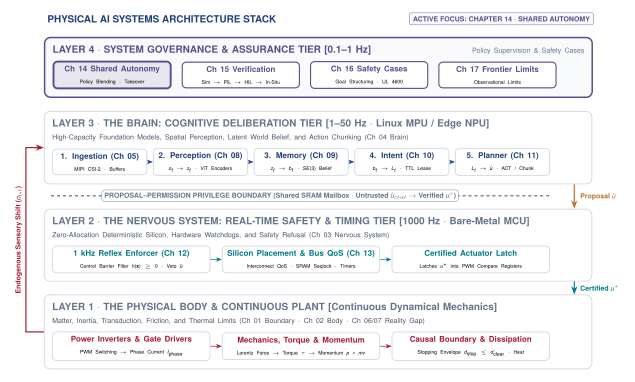
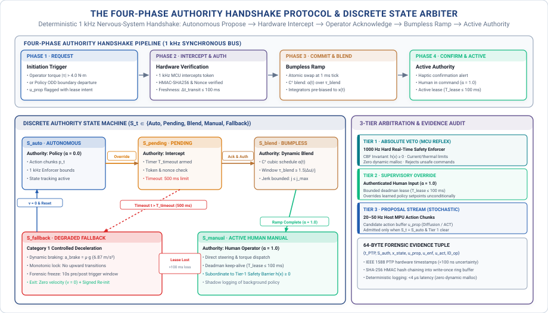
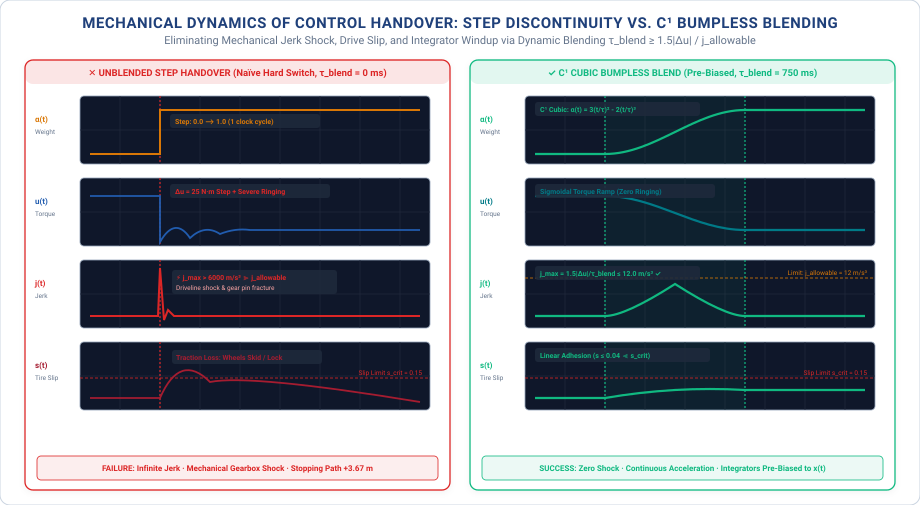

# Supervisory Intervention {#sec-intervention}

::: {.column-margin}

\chapterminitoc

:::

::: {#fig-14-locator fig-env="figure" fig-pos="H" fig-cap="**Systems Organ Focus: Nervous**: Revoking authority from an autonomous policy requires an independent real-time arbitration layer to manage discrete state handshakes and enforce bumpless actuator transitions. Without a deterministic nervous-system arbiter, concurrent human and machine commands produce split-brain execution and catastrophic mechanical shock." fig-alt="Systems Organ Focus: Nervous. Revoking authority from an autonomous policy requires an independent real-time arbitration layer to manage discrete state handshakes and enforce bumpless actuator transitions. Without a deterministic nervous-system arbiter, concurrent human and machine commands produce split-brain execution and catastrophic mechanical shock."}
{width="100%"}
:::

*When a human grabs the controls of a running machine, how do you transfer kinetic authority without causing the very collision you meant to prevent?*

No autonomous physical machine operates in total isolation from human authority. Whether through an onboard operator taking a steering wheel, a technician hitting an emergency stop, or a remote operator engaging teleoperation, authority over physical actuators must transition dynamically between human and machine. If this takeover is handled as an informal software blend, the resulting hybrid command represents neither intent and risks instant collision. Runtime intervention requires deterministic state-machine arbitration, synchronized four-phase handshakes, and higher-order $\mathcal{C}^2$ bumpless transfer that respects physical inertia, while cryptographically isolating intervention traces so that human corrections do not contaminate autonomous training data.



::: {.callout-learning-objectives}
After studying this chapter, you will be able to:

1. Specify which operations a person may command, under what conditions, within what deadline.
2. Hand over a moving machine without a step change in command, and measure the result.
3. Mark the moment authority changed hands, and the earlier moment the policy diverged, so @sec-data can tell a rescue from a nominal episode.
4. State what an operational log must contain for a claim to rest on it months later.

*Core chapter takeaway.* Authority attaches to named operations with deadlines, not to a person drawn in a loop. Taking control is a different mechanism from refusing a command, and a handover that leaves a moving machine with no coherent command is a hazard rather than a rescue.
:::

## Shared Authority {#sec-intervention-14-1}

<!-- SECTION 14.1 -->
<!-- claim: A person is a third holder of authority over a running machine, and authority attaches to operations rather than to a role. -->
<!-- covers: The human operator is an untrusted, high-latency, third holder of authority over the machine alongside the learned policy and the real-time nervous system. -->
<!-- covers: "Human-in-the-loop" is a dangerous abstraction when treated as a generic safety net; authority must attach to explicit operational primitives with bounded execution deadlines. -->
<!-- covers: Intervening on a moving machine involves two coupled problems: continuous physical transition without mechanical shock and discrete state arbitration without ambiguity. -->
<!-- covers: Rescued runs create a subtle ML trap: recording and training on the human takeover without marking truncation teaches the next policy to replicate the failure state that caused the rescue. -->
<!-- covers: The chapter builds the complete authority lifecycle: operational scoping, state arbitration, bumpless transfer, authenticated command paths, evidence logging, and retraining hygiene. -->
<!-- GROUNDING: mechanism — authority attached to a named operation with a deadline -->

<!-- BEGIN -->
As mapped across the nervous-system tier in @fig-14-locator, a physical AI system operates with two distinct internal holders of authority over its actuators: the learned policy that plans motion over extended horizons and the deterministic nervous system that enforces immediate safety barriers. When an operator attempts to halt a moving platform or correct an articulated arm, a third holder of authority enters the architecture. This human operator is neither an infallible supervisor nor a synchronous component of the real-time loop. Human perception, cognitive arbitration, and physical actuation introduce substantial latency, operating under an analytical baseline of $400\text{ ms}$ to $1200\text{ ms}$ between visual stimulus and physical input. Across that latency window, an autonomous vehicle traveling at $2.0\text{ m/s}$ covers up to $2.4\text{ m}$ of unmonitored distance before human intent converts into an electrical signal at the receiver. Furthermore, the external wireless link carrying the operator's command remains subject to packet drop, jitter, and signal attenuation. Because the human operates outside the synchronous bus and communicates across an untrusted channel, authority cannot be granted to an abstract human role. Authority attaches to concrete operations executed under strict, verifiable deadlines.

Treating the human operator as a generic fail-safe layer creates a dangerous abstraction. Architectural diagrams frequently position a human in the loop above the autonomy stack, implying that manual oversight provides a continuous safety net whenever the learned model encounters unfamiliar operating conditions. In physical hardware, an ungrounded supervisory role cannot dissipate kinetic energy or counteract mechanical momentum. If a $500\text{ kg}$ industrial payload begins to oscillate while an automated crane translates at $1.0\text{ m/s}$, invoking human authority is meaningless unless that authority maps directly to an explicit operational primitive. An intervention primitive must define a concrete actuator response, such as commanding a controlled deceleration profile of $2.5\text{ m/s}^2$ with a maximum nervous-system dispatch deadline of $10\text{ ms}$. Without a named operation and an enforceable time bound, the machine drifts under inertia while software services attempt to resolve which process holds the lock. Authority exists only when the low-level controller can evaluate an incoming instruction, verify its operational scope, and execute it before the physical plant breaches a safety envelope.

Taking control of a machine already in motion forces the nervous system to resolve two tightly coupled challenges, continuous physical transition without mechanical shock and discrete state arbitration without ambiguity. In continuous domain dynamics, abruptly zeroing motor current or injecting a step change in steering angle damages planetary gearboxes, saturates tire traction, or destabilizes an articulated payload. The transition from autonomous trajectory tracking to manual guidance requires what control engineering terms a **bumpless transfer**, where the nervous system blends active reference trajectories, ramps joint torques within calibrated jerk limits, and matches initial actuator velocities before handing full command to the operator. Simultaneously, in the discrete software domain, the architecture must prevent split-brain execution where the learned model and the human operator issue concurrent, conflicting setpoints. The state arbiter must atomically revoke the model's execution token, acknowledge the operator's override, and switch tracking multiplexers within a single control period of $1\text{ ms}$ on a $1000\text{ Hz}$ loop. A handover that drops setpoints mid-stride creates an immediate physical hazard rather than a recovery.

Intervention events introduce a secondary failure mode inside the data pipeline that trains subsequent model iterations. When an operator intervenes to steer a vehicle away from a barrier or steady a slipping gripper, the telemetry logger captures an abrupt discontinuity in the state trajectory. If the training pipeline ingests these rescued episodes as standard behavioral demonstrations without recording the exact moment of truncation, imitation learning policies and reinforcement algorithms learn to reproduce the failure states that necessitated the rescue. The training distribution becomes biased toward pre-failure trajectories, optimizing the policy to navigate toward the boundary where the human took over because the subsequent human demonstration contains high rewards. Preventing this policy corruption requires strict data hygiene. The logging pipeline must timestamp the precise millisecond of authority transfer, mark the pre-intervention trajectory as a terminated failure, and isolate manual recovery trajectories from standard policy training datasets.

An engineered intervention architecture spans the complete operational lifecycle of authority, from the physical input device down to the motor drivers and backward into the data pipelines. That lifecycle requires unambiguous operational scoping so that operators command specific mechanical primitives without disrupting unmanaged degrees of freedom, deterministic state arbitration that resolves conflicting commands in fixed time, continuous trajectory blending that protects mechanical transmissions from shock, and authenticated communication paths that reject corrupted override packets. It requires non-volatile evidence logging that records which entity held authority during every millisecond of a deployment, paired with data segregation pipelines that prevent rescued runs from poisoning model retraining. A machine cannot be safely operated under the authority of a learned model until the systems engineer can prove how that authority is stripped away when physical reality diverges from the plan.
<!-- END -->

## Human Authority Over Actuation {#sec-intervention-14-2}

<!-- SECTION 14.2 -->
<!-- claim: A person in the loop is not an authority model; naming the operations is. -->
<!-- covers: Replacing the generic "human supervisor" icon with an explicit capability matrix mapping specific operations (e-stop, velocity trim, path veto, full manual steering) to authorized roles. -->
<!-- covers: Human cognitive and physical response time is a hard real-time latency budget: sensory recognition ($150\text{--}300\text{ ms}$), situational assessment ($500\text{--}1500\text{ ms}$), and motor actuation ($200\text{--}400\text{ ms}$). -->
<!-- covers: A machine moving at speed $v$ travels a blind distance $d_{\text{human}} = v \cdot T_{\text{takeover}}$ before human intervention takes physical effect; at $5\text{ m/s}$ with a $1.5\text{ s}$ takeover budget, the machine covers $7.5\text{ m}$ under unchecked policy authority. -->
<!-- covers: Deadman switches, keep-alive leases, and bounded delegation windows: why authority must automatically expire if the operator stops actively renewing it. -->
<!-- covers: The authority boundary between the human and the safety enforcer: even an authorized human override cannot command an actuation that violates the hardware-enforced barrier certificate or kinematic floor limits. -->
<!-- covers: Separate the two mechanisms explicitly, because they are routinely conflated: enforcement withholds permission from a proposal and leaves the machine autonomous, while intervention transfers authority to someone else and ends autonomous operation. A system with one and not the other is incomplete in a way no amount of the other fixes. -->
<!-- GROUNDING: mechanism — authority attached to operations with deadlines, not to a role -->
<!-- FIGURE: A timing diagram showing the human intervention latency breakdown (perception, cognitive orientation, motor action) against physical vehicle travel distance at varying operational speeds. -->
<!-- DERIVE: The minimum safe intervention distance $d_{\text{intervene}} = v \cdot T_{\text{reaction}} + \frac{v^2}{2 a_{\text{max}}}$ required for a human to prevent a collision given human response latency and maximum plant deceleration. -->

<!-- BEGIN -->
System block diagrams frequently insert an icon of a human supervisor with an arrow pointing toward the plant, treating human oversight as an unexamined safety backstop. In the physical world, drawing a person in the loop is not an authority model. Authority cannot attach to a generic human role or an abstract supervision block. It must attach to specific named operations with explicit timing budgets, physical degrees of freedom, and deterministic preemption rules. An operational machine does not simply grant an operator broad administrative authority. Instead, the nervous system maintains an explicit capability matrix that maps individual operations (such as an emergency power cutoff, a velocity trim adjustment, a trajectory path veto, or full manual steering) to authenticated roles.[^fn-std-sheridan-supervisory] Each entry in this matrix defines the exact actuator channels the operation governs, the preemption priority it carries over the learned policy, and the maximum propagation latency permitted from physical input to actuator response.

Naming the operations separates intervention from safety enforcement, two mechanisms that system architectures routinely conflate. Enforcement withholds permission from a candidate action proposed by a learned model, modifying, clamping, or rejecting the setpoint while leaving the machine under autonomous control. Intervention transfers authority away from the model to an external entity, terminating autonomous operation and placing actuation under direct supervisory command. An enforcement filter sits in the fast control path to prevent the policy from demanding an over-current maneuver or violating a barrier certificate during nominal tracking. An intervention mechanism strips the policy of its execution token entirely when an operational boundary is breached or an operator demands control. A system equipped with enforcement but lacking intervention cannot be redirected when human intent changes or external conditions fall outside the policy design envelope. Conversely, a system equipped with intervention but lacking enforcement permits a lagging operator to drive the plant into structural failure during nominal manual flight. A system with one mechanism and not the other is incomplete in a way no amount of the other fixes.

When an operator attempts an intervention, human biology imposes a hard real-time latency budget before any physical corrective action can occur. Human response time is not a single point event, but a cascaded pipeline of physiological and mechanical stages. In an analytical breakdown of an operator monitoring a vehicle telemetry stream, the sensory recognition stage requires $150\text{ ms}$ to $300\text{ ms}$ for light to strike the retina, travel through the visual pathway, and register as an optical anomaly. The situational assessment stage, in which the operator recognizes that the learned policy is drifting toward a hazard and selects an appropriate counter-action, demands $500\text{ ms}$ to $1500\text{ ms}$. Finally, the motor actuation stage, covering the transmission of motor signals down the spinal cord, muscle recruitment in the hand, and the physical displacement of an override switch, consumes $200\text{ ms}$ to $400\text{ ms}$. Summing these sequential budgets establishes the physiological **takeover reaction floor**, defined as $T_{\text{reaction}} = T_{\text{sensory}} + T_{\text{cognitive}} + T_{\text{motor}}$ ($850\text{--}2200\text{ ms}$ under active visual-manual monitoring, and expanding beyond $3500\text{ ms}$ when an operator is out-of-the-loop), during which a moving machine traverses an unmonitored blind drift distance $d_{\text{drift}} = v \cdot T_{\text{reaction}}$ under unchecked policy authority before physical braking or evasive actuation can commence.

Throughout this reaction budget, the machine continues moving under the unchecked authority of the learned policy. During the reaction interval $T_{\text{reaction}}$, a vehicle traveling at forward velocity $v$ covers a blind distance $d_{\text{human}} = v \cdot T_{\text{reaction}}$ before the intervention signal reaches the hardware arbiter. In an analytical scenario where a mobile machine travels at $v = 5.0\text{ m/s}$ with a moderate takeover budget of $T_{\text{reaction}} = 1.5\text{ s}$, the vehicle covers $d_{\text{human}} = 7.5\text{ m}$ while executing the unmonitored policy trajectory. Once the operator engages physical braking, the vehicle requires an additional stopping distance governed by its maximum deceleration $a_{\text{max}}$. Integrating the constant velocity phase during human reaction with the uniform deceleration phase produces the minimum safe intervention distance,
$$d_{\text{intervene}} = v \cdot T_{\text{reaction}} + \frac{v^2}{2 a_{\text{max}}}.$$
For the same machine operating at $5.0\text{ m/s}$ with a maximum plant braking deceleration of $a_{\text{max}} = 2.5\text{ m/s}^2$, the physical braking phase requires an additional $5.0\text{ m}$. The total physical distance required for a human operator to detect an obstacle, actuate an override, and bring the plant to rest is $12.5\text{ m}$, of which 60 percent is consumed entirely by human neurological and muscular delay before the brakes engage. Because the reaction distance scales linearly with velocity while the deceleration distance scales quadratically, human intervention becomes physically incapable of averting close-range collisions as operational speed increases.

::: {.callout-important title="Operator Takeover Budget and Spatial Clearance Margin"}
**Question:** An autonomous transport vehicle ($m = 2200\text{ kg}$) travels at $v_0 = 22.0\text{ m/s}$ ($79.2\text{ km/h}$) on a dry asphalt roadway ($\mu = 0.80$, maximum braking deceleration $a_{\text{max}} = 6.0\text{ m/s}^2$). An attentive human safety driver monitors the forward path. If an unmapped obstacle is perceived at a forward sensing horizon of $d_{\text{sense}} = 65.0\text{ m}$, can a human takeover avert collision if the driver has an active reaction budget $T_{\text{react}} = 1.0\text{ s}$, the real-time safety enforcer requires a four-phase handshake $T_{\text{handshake}} = 20\text{ ms}$, and the drive-by-wire steering/braking system uses a $\mathcal{C}^2$ bumpless blend window $\tau_{\text{blend}} = 75\text{ ms}$?

**1. Reaction Drift Distance ($T_{\text{react}} = 1.00\text{ s}$):**
$$d_{\text{react}} = v_0 \cdot T_{\text{react}} = 22.0\text{ m/s} \times 1.00\text{ s} = 22.00\text{ m}.$$

**2. Handshake Protocol Drift Distance ($T_{\text{handshake}} = 0.020\text{ s}$):**
$$d_{\text{handshake}} = v_0 \cdot T_{\text{handshake}} = 22.0\text{ m/s} \times 0.020\text{ s} = 0.44\text{ m}.$$

**3. Bumpless Actuator Blending Displacement ($\tau_{\text{blend}} = 0.075\text{ s}$):**
Over the $\mathcal{C}^2$ quintic spline blend, braking deceleration ramps from $0$ to $-a_{\text{max}}$. Integrating $\ddot{x}(t) = -\alpha(t) a_{\text{max}}$ yields:
$$\Delta v_{\text{blend}} = \int_0^{\tau_{\text{blend}}} \alpha(t) a_{\text{max}} dt = \frac{1}{2} a_{\text{max}} \tau_{\text{blend}} = \frac{1}{2}(6.0)(0.075) = 0.225\text{ m/s},$$
$$v_{\text{post-blend}} = 22.0 - 0.225 = 21.775\text{ m/s},$$
$$\begin{aligned}
d_{\text{blend}} &= v_0 \tau_{\text{blend}} - 0.15 a_{\text{max}} \tau_{\text{blend}}^2 \\
&= (22.0)(0.075) - (0.15)(6.0)(0.075)^2 = 1.650 - 0.005 = 1.645\text{ m}.
\end{aligned}$$

**4. Full Deceleration Braking Distance:**
$$d_{\text{brake}} = \frac{v_{\text{post-blend}}^2}{2 a_{\text{max}}} = \frac{(21.775\text{ m/s})^2}{2 \times 6.0\text{ m/s}^2} = \frac{474.15}{12.0} = 39.51\text{ m}.$$

**5. Total Stopping Distance vs. Available Clearance:**
$$d_{\text{total}} = d_{\text{react}} + d_{\text{handshake}} + d_{\text{blend}} + d_{\text{brake}} = 22.00 + 0.44 + 1.65 + 39.51 = 63.60\text{ m}.$$
$$\Delta d_{\text{clearance}} = d_{\text{sense}} - d_{\text{total}} = 65.00\text{ m} - 63.60\text{ m} = +1.40\text{ m}.$$

**Verdict:** The vehicle stops with a razor-thin safety clearance margin of $1.40\text{ m}$. If human situational awareness decays by even $100\text{ ms}$ (increasing $T_{\text{react}}$ to $1.10\text{ s}$), the vehicle travels an additional $2.20\text{ m}$, striking the obstacle at $v_{\text{impact}} = 5.1\text{ m/s}$ ($18.4\text{ km/h}$).
:::

::: {#pri-spatial-takeover-budget .callout-principle title="The Spatial Takeover Budget Law"}
Handover is an allocation of physical distance, not digital clock cycles. If the spatial travel during human reaction time $v \cdot T_{\text{reaction}}$ plus the kinematic braking distance $\frac{v^2}{2 a_{\text{max}}}$ exceeds the sensing clearance margin, no software handshake or arbitration algorithm can avert collision. The handover deadline $T_{\text{timeout}}$ must be dynamically bounded by physical stopping distance, not fixed in configuration files.
:::

As quantified across intervention modalities in @tbl-14-teleop-stability, this latency penalty scales directly with communication topology and operator cognitive engagement. In high-bandwidth bilateral haptic teleoperation, proprioceptive reflexes and deterministic local buses bound closed-loop delay $T_{\Sigma}$ to under $185\text{ ms}$, preserving dynamic passivity. In contrast, remote supervisory dispatch and out-of-the-loop takeover inflate total reaction delay $T_{\Sigma}$ to upwards of $3700\text{ ms}$, expanding the stopping drift envelope $d_{\text{drift}}$ to over $17.5\text{ m}$ at nominal speed. When communication or cognitive delays exceed the plant's dynamic stability margin, human manual commands induce severe phase lag and pilot-induced oscillations, requiring local autonomous safety interceptors to clamp velocity and enforce barrier certificates.

| Control Modality & Operational Tier                                         | Network & Transport Latency ($T_{\text{RTT}}$)                    | Neuromuscular & Cognitive Budget ($T_{\text{human}}$)                   | Total Closed-Loop Delay ($T_{\Sigma}$)                                           | Stopping Drift ($d_{\text{drift}}$ @ $5\text{ m/s}$)              | Dynamic Instability & Failure Mode                                                                | Hardware & Safety Interceptor                                                                            |
|:----------------------------------------------------------------------------|:------------------------------------------------------------------|:------------------------------------------------------------------------|:---------------------------------------------------------------------------------|:------------------------------------------------------------------|:--------------------------------------------------------------------------------------------------|:---------------------------------------------------------------------------------------------------------|
| **Direct Bilateral Teleoperation** (Haptic / Force-Reflective)              | $\le 5\text{--}20\text{ ms}$ (Local deterministic bus / 5G URLLC) | $100\text{--}150\text{ ms}$ (Proprioceptive reflex & tactile feedback)  | $110\text{--}185\text{ ms}$ ($f_{\text{ctrl}} \ge 500\text{ Hz}$)                | $5.75\text{ m}$ ($0.75\text{ m}$ drift $+$ $5.0\text{ m}$ brake)  | Loss of passivity, pilot-induced oscillations (PIO), high-frequency haptic shudder                | Time-domain passivity observer (TDPO), scattering wave variables, motor current clamps                   |
| **Continuous Direct Velocity Guidance** (Rate-Assisted Steering / Joystick) | $30\text{--}80\text{ ms}$ (Private wireless / 5G SA edge slice)   | $250\text{--}450\text{ ms}$ (Active visual-manual tracking)             | $300\text{--}570\text{ ms}$ ($f_{\text{ctrl}} \approx 50\text{--}100\text{ Hz}$) | $7.25\text{ m}$ ($2.25\text{ m}$ drift $+$ $5.0\text{ m}$ brake)  | Phase lag instability, steering hunting limit cycles ($2\text{--}4\text{ Hz}$), lateral overshoot | Onboard velocity envelope limiter, control barrier certificates, deadman lease timeout ($100\text{ ms}$) |
| **Supervisory Waypoint & Corridor Dispatch** (Shared Autonomy / Path Veto)  | $100\text{--}250\text{ ms}$ (Public cellular / IP broker link)    | $600\text{--}1200\text{ ms}$ (Situational assessment & re-planning)     | $750\text{--}1550\text{ ms}$ ($f_{\text{ctrl}} \approx 5\text{--}10\text{ Hz}$)  | $10.75\text{ m}$ ($5.75\text{ m}$ drift $+$ $5.0\text{ m}$ brake) | Stale corridor execution, spatial collision during uplink delay, command starvation freeze        | Local receding-horizon obstacle veto, time-to-collision (TTC) governor, autonomous fallback              |
| **Out-of-the-Loop Takeover** (Passive Monitor / Autonomous Rescue)          | $50\text{--}150\text{ ms}$ (Cabin bus / near-edge telemetry)      | $1500\text{--}3500\text{ ms}$ (Gaze re-engagement & cognitive recovery) | $1580\text{--}3710\text{ ms}$ ($f_{\text{ctrl}} \le 1\text{ Hz}$)                | $17.50\text{ m}$ ($12.5\text{ m}$ drift $+$ $5.0\text{ m}$ brake) | Unmonitored blind trajectory drift, panic over-correction, mechanical column lockup               | Monotonic Category 1 stop upon $T_{\text{timeout}}$ expiry, DMS gaze-decay alarm, torque rate limiter    |
| **Direct Hardware Emergency Stop** (Physical Switch / Safety Interlock)     | $\le 1\text{ ms}$ (Hardwired dual-channel safety line)            | $150\text{--}300\text{ ms}$ (Reflexive palm slap / deadman release)     | $160\text{--}325\text{ ms}$ ($f_{\text{ctrl}} \ge 1000\text{ Hz}$)               | $6.25\text{ m}$ ($1.25\text{ m}$ drift $+$ $5.0\text{ m}$ brake)  | Infinite jerk shock, tire adhesion breakaway, mechanical driveline overload                       | Safe Torque Off (STO / SS1 ramp), dynamic friction braking, spring-applied holding brakes                |
: **Teleoperation Latency, Human Neuromuscular Delay, and Dynamic Control Stability Bounds**: Quantitative timing and stability budget across supervisory, teleoperated, and manual intervention modalities. Total closed-loop delay $T_{\Sigma} = T_{\text{RTT}} + T_{\text{human}} + T_{\text{act}}$ combines network transport, physiological response (sensory, cognitive, motor), and actuator mechanical rise time ($T_{\text{act}} \approx 10\text{--}60\text{ ms}$). Stopping drift $d_{\text{drift}} = v_0 \cdot T_{\Sigma} + v_0^2 / (2 a_{\text{max}})$ is evaluated at nominal operational velocity $v_0 = 5.0\text{ m/s}$ ($18.0\text{ km/h}$) under maximum deceleration $a_{\text{max}} = 2.5\text{ m/s}^2$. As network and cognitive latencies grow, manual guidance loses dynamic passivity and induces pilot-induced oscillations, requiring local autonomous safety interceptors to enforce kinematic barrier certificates independently of remote operator input. {#tbl-14-teleop-stability}

Because human response is slow and prone to interruption, manual authority cannot be granted as an open-ended state.[^fn-inc-uber-tempe] If an operator assumes control and subsequently experiences wireless packet loss, physical incapacitation, or cognitive distraction, the machine cannot remain adrift under stale manual setpoints. The architecture protects against operator dropouts by bounding manual authority with strict temporal leases and hardware deadman switches (@fig-14-teach-pendant). In a lease-based communication model, the vehicle nervous system issues a bounded delegation window of $50\text{ ms}$ to $100\text{ ms}$. The operator console must continuously stream authenticated keep-alive packets to renew the lease before the deadline expires. If a single lease window lapses without renewal, or if an operator releases a spring-loaded physical deadman switch on the controller, manual authority terminates immediately, and the low-level nervous system transitions the actuators into a deterministic safe stop.[^fn-std-iso13849-takeover] Authority is not a persistent condition. It is a perishable resource that requires active, periodic renewal to survive.

::: {#fig-14-teach-pendant fig-env="figure" fig-pos="t" fig-cap="**Industrial Robot Teach Pendant and Physical Intervention Hardware**: Handheld teach pendant (ABB IRB series) incorporating multi-layered physical authority mechanisms: a key-lockable mode selector enforcing hardware mutual exclusion between Automatic and Manual (T1/T2) states, a hardwired mushroom-head Emergency Stop (E-Stop) button wired directly into dual-channel safety relays to de-energize actuator contactors, a 3-axis proportional joystick for manual coordinate jogging, and an ergonomic rear grip housing a three-position enabling device (deadman switch). Under ISO 10218-1 safety standards, manual authority requires continuous holding in the center position; releasing the grip or panicking with an over-squeeze immediately drops the safety lease and forces an actuator Category 1 safe stop." fig-alt="Industrial Robot Teach Pendant and Physical Intervention Hardware. Handheld teach pendant (ABB IRB series) incorporating multi-layered physical authority mechanisms: a key-lockable mode selector enforcing hardware mutual exclusion between Automatic and Manual (T1/T2) states, a hardwired mushroom-head Emergency Stop (E-Stop) button wired directly into dual-channel safety relays to de-energize actuator contactors, a 3-axis proportional joystick for manual coordinate jogging, and an ergonomic rear grip housing a three-position enabling device (deadman switch). Under ISO 10218-1 safety standards, manual authority requires continuous holding in the center position; releasing the grip or panicking with an over-squeeze immediately drops the safety lease and forces an actuator Category 1 safe stop."}
{width="85%"}
:::

Even while an operator holds an active lease, human authority remains subordinate to the kinematic and dynamic limits enforced at the hardware boundary. A common engineering mistake assumes that an emergency manual override must bypass all downstream safety filters to guarantee direct, unmediated actuator control. Bypassing safety enforcement at the motor level creates severe mechanical failure modes. If an operator panics and commands a steering rate that induces vehicle rollover, or requests a joint torque that strips the gear teeth of a robotic actuator, the low-level safety enforcer sitting at the hardware floor rejects the command. The enforcer evaluates human setpoints against the same control barrier certificates, current limits, and kinematic floor boundaries applied to the learned model. Human intervention transfers operational discretion away from the learned policy, but it cannot suspend the laws of physics or dismantle the hardware-enforced envelopes that preserve the physical integrity of the machine.
<!-- END -->

## Authority States and Transitions {#sec-intervention-14-3}

<!-- SECTION 14.3 -->
<!-- claim: Who holds control at any instant must be a state, not an inference. -->
<!-- covers: Control authority at every tick $t$ is a mutually exclusive discrete state $S_t \in \{\text{Autonomous}, \text{Handover-Pending}, \text{Human-Manual}, \text{Degraded-Fallback}\}$, never a continuous blend or implicit inference. -->
<!-- covers: The four-phase handshake protocol: Request (human initiates or policy relinquishes), Acknowledge (enforcer verifies prerequisites), Commit (control source switches at boundary), and Confirm (feedback confirms active holder). -->
<!-- covers: Unacknowledged takeover requests: defining the hard timeout $T_{\text{timeout}}$ after which an unanswered handover request automatically drops into a deterministic Category 1 safe stop. -->
<!-- covers: Loss of human presence: monitoring operator engagement via physical sensors (capacitive touch, torque sensing, optical gaze) and triggering monotonic fallback ladders on signal loss. -->
<!-- covers: Resolving conflicting simultaneous inputs: the deterministic arbitration hierarchy where safety enforcer overrides human manual input, and human manual input overrides learned policy proposals. -->
<!-- GROUNDING: mechanism — states, transitions, and what happens when a request is unanswered -->
<!-- FIGURE: A finite state machine diagram showing exact transition guards, handshake timeouts, and fallback edges between Autonomous, Handover-Pending, Human-Manual, and Safe-Stop states. -->

Control authority at any instant must be a discrete state, never an inference or a mathematical blend. When an engineering team attempts to soften transitions by continuously averaging the control vectors of an autonomous policy and a human operator, the resulting command represents neither intent. If a human steers left to avoid a ditch while a neural network policy steers right to follow a lane marker, a linear interpolation between the two commands directs the steering angle straight forward, driving the vehicle into the obstacle at full speed. This authority conflict was tragically demonstrated in the Boeing 737 MAX MCAS flight control failures [@jatr2019boeing], where automated stabilizer trim repeatedly overrode pilot control column inputs based on a single faulty sensor without explicit, unambiguous handover states.[^fn-hw-fbw-override] To prevent this ambiguity, control authority at every discrete time tick $t$ must resolve to a single, mutually exclusive state $S_t \in \{\text{Autonomous}, \text{Handover-Pending}, \text{Human-Manual}, \text{Degraded-Fallback}\}$. The nervous system evaluates arbitration logic, determines the active state, and commits that identity to the bus before dispatching setpoints to low-level motor controllers. At no point does the system compute a weighted average of conflicting masters or leave ownership open to statistical interpretation.

The complete state transition logic, guard preconditions, execution time bounds ($T_{\text{trans}}$), and bumpless actuator blending profiles governing this arbiter are formalized in @tbl-14-authority-state-matrix. Every edge in the state machine defines an unambiguous trigger condition, mutual exclusion enforcement across actuator channels, and a deterministic fallback path should an active communication lease lapse.

| Source State ($S_{\text{src}}$) | Target State ($S_{\text{tgt}}$) | Transition Trigger & Guard Condition                                                                      | Latency Bound ($T_{\text{trans}}$ / WCET)              | Handshake & Arbitration Policy                                                 | Bumpless Transfer & Dynamic Profile                                                                        | Fallback & Fault Mitigation                                                                        |                                                                                                            |                                                                                     |
|:--------------------------------|:--------------------------------|:----------------------------------------------------------------------------------------------------------|:-------------------------------------------------------|:-------------------------------------------------------------------------------|:-----------------------------------------------------------------------------------------------------------|:---------------------------------------------------------------------------------------------------|------------------------------------------------------------------------------------------------------------|-------------------------------------------------------------------------------------|
| **Autonomous**                  | **Human-Manual**                | Manual column torque $                                                                                    | \tau_{\text{manual}}                                   | > 4.0\text{ Nm}$ or authenticated override button assert                       | $\le 1.0\text{ ms}$ (1 tick @ $1000\text{ Hz}$)                                                            | Policy execution token atomically revoked; human granted exclusive write lock                      | $\mathcal{C}^2$ quintic spline blend ($\tau_{\text{blend}} = 50\text{ ms}$); manual integrators pre-biased | Drop to **Degraded-Fallback** if manual keep-alive lease lapses ($> 100\text{ ms}$) |
| **Autonomous**                  | **Handover-Pending**            | Perception confidence $\gamma < \gamma_{\text{min}}$, ODD geofence boundary, or non-critical sensor fault | $\le 10.0\text{ ms}$ (Takeover broadcast frame)        | Policy maintains nominal trajectory holding while awaiting operator ACK        | Nominal tracking hold; velocity rate-clamping enabled; acoustic/visual alerts active                       | If unacknowledged within $T_{\text{timeout}} = 500\text{ ms}$, transition to **Degraded-Fallback** |                                                                                                            |                                                                                     |
| **Handover-Pending**            | **Human-Manual**                | Operator capacitive grip confirmed AND valid cryptographic token received                                 | $\le 20.0\text{ ms}$ (4-phase protocol round-trip)     | Human granted exclusive channel authority; autonomous policy locked out of bus | $\mathcal{C}^2$ quintic spline blend ($\tau_{\text{blend}} = 75\text{ ms}$) over active actuator reference | Abort transfer on token signature failure; raise security alert to supervisor                      |                                                                                                            |                                                                                     |
| **Handover-Pending**            | **Degraded-Fallback**           | Handover timer expired ($t > T_{\text{timeout}}$) with zero operator acknowledgment                       | $\le 1.0\text{ ms}$ (Timer interrupt dispatch)         | Autonomous policy and operator both locked out; nervous system asserts control | Deterministic Category 1 stop ($a_{\text{decel}} = -2.5\text{ m/s}^2$); stability assist engaged           | Monotonic safety lockout; upward transition prohibited until full standstill                       |                                                                                                            |                                                                                     |
| **Human-Manual**                | **Degraded-Fallback**           | Deadman release ($> 100\text{ ms}$), DMS gaze loss ($> 2.0\text{ s}$), or link loss ($> 50\text{ ms}$)    | $\le 5.0\text{ ms}$ (Watchdog lease expiration)        | Human authority revoked; hardware multiplexer switches to fallback profile     | Controlled deceleration ramp to zero velocity; hazard flashers energized                                   | Vehicle brought to full stop; requires manual physical key-cycle to re-arm                         |                                                                                                            |                                                                                     |
| **Any Active State**            | **Emergency-Stop**              | Hardwired E-stop line open, critical CBF breach ($h(\mathbf{x}) < 0$), or power rail fault                | $\le 0.1\text{ ms}$ (Hardware interrupt / gate cutoff) | Unconditional hardware preemption; bypasses software bus and microcontrollers  | Safe Torque Off (STO) / mechanical spring holding brake actuation ($j \to \infty$)                         | Actuator drive de-energized; non-volatile freeze of pre-trigger evidence ring buffer               |                                                                                                            |                                                                                     |
: **Authority State Machine Transition Matrix**: Deterministic transition matrix for the real-time nervous system arbiter across discrete authority states $S_t \in \{\text{Autonomous}, \text{Handover-Pending}, \text{Human-Manual}, \text{Degraded-Fallback}, \text{Emergency-Stop}\}$. Each entry defines the entry guard condition, Worst-Case Execution Time (WCET) or protocol latency bound $T_{\text{trans}}$, channel arbitration rule, bumpless actuator blending profile, and fault recovery path. All downward transitions toward higher safety containment operate under a strict monotonic constraint, preventing upward state re-engagement while the machine remains in motion. {#tbl-14-authority-state-matrix}

Shifting authority between these discrete states requires a deterministic **four-phase handshake protocol** (`Request` $\to$ `Acknowledge` $\to$ `Commit` $\to$ `Confirm`). Executed by the real-time safety enforcer, this four-stage transaction guarantees mutual exclusion, validates cryptographic freshness, and atomically shifts actuation authority between discrete holders across a synchronous tick boundary without split-brain command contention. In the first phase, designated as the *Request* phase, one entity signals an intent to transfer control. This occurs either when an operator asserts an override through a physical input like a button press or steering torque exceeding a calibrated threshold, or when the autonomous policy detects that sensor confidence has degraded and requests human assumption of control. In the second phase, the *Acknowledge* phase, the safety enforcer inspects the target state prerequisites, verifying that sensor data is valid, communications are active, and the recipient is physically capable of receiving command authority. In the third phase, the *Commit* phase, the enforcer executes the state transition at a synchronous control tick boundary, mapping the target input source to the actuator queue and locking the relinquishing source out of the bus. In the final phase, the *Confirm* phase, the nervous system broadcasts a state confirmation packet across the network and triggers physical feedback, such as haptic vibration or optical indicators, to verify to the operator that the transfer of authority is complete.

The protocol primitives, timing deadlines, cryptographic verification artifacts, and fallback actions for each stage of this four-phase sequence are specified in @tbl-14-handshake-protocol. By structuring authority transfer as an atomic, multi-stage transaction verified by the real-time safety enforcer, the architecture prevents split-brain command contention, rejects spoofed override injections, and guarantees that interrupted handovers fail safely into deterministic holding states.

| Handshake Phase                   | Protocol Primitive & Direction                                    | Executing Entity                          | Timing Bound ($t_{\text{phase}}$)                         | Safety Invariant & Precondition                                                                                                                                         | Cryptographic & Telemetry Artifact                                                                                                                                                | Fault & Anomaly Mitigation                                                                  |                                                                            |                                                                          |
|:----------------------------------|:------------------------------------------------------------------|:------------------------------------------|:----------------------------------------------------------|:------------------------------------------------------------------------------------------------------------------------------------------------------------------------|:----------------------------------------------------------------------------------------------------------------------------------------------------------------------------------|:--------------------------------------------------------------------------------------------|----------------------------------------------------------------------------|--------------------------------------------------------------------------|
| **Phase 1: Request (Propose)**    | `REQ_TAKEOVER` (Operator $\to$ Enforcer or Policy $\to$ Operator) | Operator Console or Policy Planner        | $t_1 \le 10.0\text{ ms}$ (CAN-FD queue + tx)              | PTP timestamp freshness $                                                                                                                                               | \Delta t_{\text{PTP}}                                                                                                                                                             | \le \tau_{\text{fresh}}$ ($50\text{ ms}$); entity authenticated in capability matrix        | 64-bit IEEE 1588 timestamp $+$ 64-bit monotonic nonce $+$ AES-128-GMAC tag | Reject stale/forged packet; latch bus error; increment intrusion counter |
| **Phase 2: Acknowledge (Verify)** | `ACK_TAKEOVER` (Enforcer $\to$ Operator & Arbiter)                | Real-Time Safety Enforcer MCU (Cortex-R5) | $t_2 \le 5.0\text{ ms}$ (Crypto check + check invariants) | Kinematic state $\mathbf{x}(t) \in \mathcal{S}_{\text{safe}}$; manual controller integrators pre-biased ($\mathbf{u}_{\text{human}} \approx \mathbf{u}_{\text{plant}}$) | Ephemeral 32-bit transfer token $+$ HMAC-SHA256 enforcer ticket                                                                                                                   | If plant outside safe envelope, reject request and command degraded holding mode            |                                                                            |                                                                          |
| **Phase 3: Commit (Switch)**      | `COMMIT_TRANSFER` (Enforcer $\to$ Actuator Inverters)             | Hardware Arbiter / Inverter Multiplexer   | $t_3 \le 1.0\text{ ms}$ (Synchronous tick boundary)       | Atomic register swap; mutually exclusive write lock; active authority weights $\sum \alpha_i = 1.0$                                                                     | Serialized evidence tuple $\langle t_{\text{PTP}}, S_{\text{auth}}, \mathbf{x}, \mathbf{u}_{\text{prop}}, \mathbf{u}_{\text{enf}}, \mathbf{u}_{\text{act}}\rangle$ to SRAM buffer | If PTP synchronization error $> 100\,\mu\text{s}$, abort switch and trigger Category 1 stop |                                                                            |                                                                          |
| **Phase 4: Confirm (Feedback)**   | `CONFIRM_ACTIVE` (Enforcer $\to$ HMI & Fleet Log)                 | Nervous System Bus & HMI Controller       | $t_4 \le 15.0\text{ ms}$ (HMI indicator + haptic pulse)   | Closed-loop telemetry echoes active authority state $S_{\text{auth}} = S_{\text{tgt}}$; manual keep-alive lease initialized ($100\text{ ms}$)                           | Chained SHA-256 log block root $+$ tactile haptic pattern dispatched to operator controls                                                                                         | If confirm packet lost, sound acoustic alert; operator lease watchdog active                |                                                                            |                                                                          |
: **Four-Phase Authority Handshake Protocol Timing and Verification Contract**: Real-time communication and verification specification governing the synchronous transfer of actuation authority. The protocol decomposes into four deterministic phases executed across the isolated safety enforcer microcontroller and distributed actuator motor drives. Cumulative protocol execution budget $T_{\text{handshake}} = t_1 + t_2 + t_3 + t_4 \le 31.0\text{ ms}$ guarantees deterministic preemption within two $50\text{ Hz}$ motion control intervals, while cryptographic freshness validation and atomic mailbox multiplexing eliminate split-brain command execution. {#tbl-14-handshake-protocol}

Because human attention is volatile, a handover request initiated by the autonomous policy cannot remain open indefinitely. If a machine encounters an operational design domain boundary at speed and requests intervention, an operator who is distracted, asleep, or incapacitated will fail to complete the handshake. The state machine enforces an unacknowledged takeover deadline governed by a hard timeout $T_{\text{timeout}}$. As an analytical example, consider a machine operating on a $100\text{ Hz}$ control loop ($10\text{ ms}$ tick period) with a configured handover timeout $T_{\text{timeout}} = 500\text{ ms}$. If fifty consecutive control cycles elapse in the $\text{Handover-Pending}$ state without a valid acknowledge signal from the operator, the nervous system terminates the handshake. The state machine transitions immediately to $\text{Degraded-Fallback}$, executing an automated Category 1 stop that brings the plant to rest under controlled deceleration while maintaining actuator power and stability augmentation.

Once authority resides in $\text{Human-Manual}$, the machine must continuously verify that an operator remains actively engaged. Passive occupancy is insufficient. The nervous system monitors engagement through physical sensor streams, including capacitive touch sensors in the steering wheel or control grips, optical gaze tracking directed at the operator, and continuous torque sensing on the steering column. If these sensors detect a loss of operator presence, such as hands leaving the controls for longer than a delegation lease of $100\text{ ms}$, the system initiates an automated fallback ladder. Fallback transitions operate under a strict monotonic constraint toward increasing safety containment. Authority falls from $\text{Human-Manual}$ to $\text{Degraded-Fallback}$, and the state machine locks out upward transitions back into $\text{Autonomous}$ or $\text{Human-Manual}$ while the machine remains in motion. Resuming normal operation requires bringing the plant to a full stop, clearing the fault log, and executing a complete handshake re-initialization sequence.

When multiple control sources generate commands simultaneously, the nervous system resolves the contention through a fixed arbitration hierarchy evaluated every cycle. At the top of the hierarchy sits the low-level safety enforcer, which holds absolute authority to clamp, modify, or reject any command that violates kinematic boundaries, thermal thresholds, or control barrier certificates. Below the safety enforcer sits the human operator, whose manual setpoints unconditionally supersede learned policy proposals whenever the system is in $\text{Human-Manual}$ and an active lease is held. At the bottom of the hierarchy sits the learned policy, whose outputs execute only when the state is explicitly $\text{Autonomous}$ and the safety enforcer grants admission. This deterministic hierarchy guarantees that authority conflicts resolve in $O(1)$ time on the real-time controller, eliminating arbitration deadlock without relying on consensus heuristics or online negotiation between software layers.

As synthesized in @fig-14-authority-handshake-fsm, the complete runtime intervention interface integrates the four-phase synchronous handshake protocol pipeline, the five discrete authority states with deterministic timeout and monotonic fallback guards, and the three-tier preemption priority hierarchy backed by an immutable 64-byte evidence audit tuple.

::: {#fig-14-authority-handshake-fsm fig-env="figure" fig-pos="t" fig-cap="**Four-Phase Authority Handshake Protocol, State Transition Arbiter, and Multi-Tier Priority Stack**: Top: Synchronous four-phase handshake pipeline decomposing authority transfer into Request (operator override torque $|\tau| > 4.0\text{ N}\cdot\text{m}$ or policy ODD departure), Intercept & Auth ($1\text{ kHz}$ microcontroller hardware token and freshness validation $\Delta t \le 100\text{ ms}$), Commit & Blend (atomic register swap at $1\text{ ms}$ tick with $\mathcal{C}^2$ quintic blending $\alpha(t)$ and integrator pre-biasing), and Confirm & Active ($\alpha = 1.0$ active human command under continuous deadman lease $T_{\text{lease}} \le 100\text{ ms}$). Bottom left: Discrete state machine across $S_t \in \{\text{Autonomous}, \text{Handover-Pending}, \text{Bumpless-Blend}, \text{Human-Manual}, \text{Degraded-Fallback}\}$ showing unacknowledged timeout ($T_{\text{timeout}} = 500\text{ ms}$) and monotonic safe stop edges. Bottom right: Real-time three-tier arbitration hierarchy (Tier 1 safety barrier enforcer $h(\mathbf{x}) \ge 0$ overriding Tier 2 human manual, overriding Tier 3 learned policy) paired with a $64\text{-byte}$ IEEE 1588 timestamped SHA-256 HMAC evidence audit tuple. Architectural diagram modeled after ASIL D / SIL 3 multi-core arbitration architectures." fig-alt="Four-Phase Authority Handshake Protocol, State Transition Arbiter, and Multi-Tier Priority Stack. Top: Synchronous four-phase handshake pipeline decomposing authority transfer into Request (operator override torque |\tau| > 4.0\text{ N}\cdot\text{m} or policy ODD departure), Intercept & Auth (1\text{ kHz} microcontroller hardware token and freshness validation \Delta t \le 100\text{ ms}), Commit & Blend (atomic register swap at 1\text{ ms} tick with \mathcal{C}^2 quintic blending \alpha(t) and integrator pre-biasing), and Confirm & Active (\alpha = 1.0 active human command under continuous deadman lease T{\text{lease}} \le 100\text{ ms}). Bottom left: Discrete state machine across St \in \{\text{Autonomous}, \text{Handover-Pending}, \text{Bumpless-Blend}, \text{Human-Manual}, \text{Degraded-Fallback}\} showing unacknowledged timeout (T{\text{timeout}} = 500\text{ ms}) and monotonic safe stop edges. Bottom right: Real-time three-tier arbitration hierarchy (Tier 1 safety barrier enforcer h(\mathbf{x}) \ge 0 overriding Tier 2 human manual, overriding Tier 3 learned policy) paired with a 64\text{-byte} IEEE 1588 timestamped SHA-256 HMAC evidence audit tuple. Architectural diagram modeled after ASIL D / SIL 3 multi-core arbitration architectures."}
{width="95%"}
:::

While a discrete state machine guarantees that authority is unambiguous at every control tick, instantaneous switching between independent controllers introduces a distinct physical challenge. If an autonomous policy is commanding $15.0\text{ Nm}$ of drive torque to accelerate up an incline at the exact millisecond the commit phase routes manual input to the motor controllers, and the operator's physical throttle is at rest, commanding $0.0\text{ Nm}$, the actuator experiences a step discontinuity in commanded torque. That sudden step produces mechanical jerk, driveline shock, and potential loss of surface traction. Defining discrete authority states is therefore only the first half of the intervention mechanism. The second half requires executing the switch across control boundaries without injecting discontinuous forces into the moving body.
<!-- END -->

## Transfer Without Discontinuity {#sec-intervention-14-4}

<!-- SECTION 14.4 -->
<!-- claim: Handing over something already moving without a step change in command. -->
<!-- covers: An instantaneous switch between policy command $\mathbf{u}_{\text{policy}}(t)$ and human command $\mathbf{u}_{\text{human}}(t)$ creates a step discontinuity $\Delta \mathbf{u} = \mathbf{u}_{\text{human}} - \mathbf{u}_{\text{policy}}$ producing infinite jerk, driveline shock, or loss of tire traction. -->
<!-- covers: The bumpless transfer equation: dynamic blending over a finite window $\tau_{\text{blend}}$ using a continuous transition filter $\mathbf{u}(t) = (1 - \alpha(t))\mathbf{u}_{\text{policy}}(t) + \alpha(t)\mathbf{u}_{\text{human}}(t)$ with smooth $\mathcal{C}^2$ interpolation $\alpha(t)$. -->
<!-- covers: The latency-jerk trade-off: increasing $\tau_{\text{blend}}$ reduces peak actuator jerk $j_{\text{max}} = \frac{\Delta u}{\tau_{\text{blend}}}$ but delays full human control authority, lengthening the stopping path. -->
<!-- covers: Initial condition matching: pre-biasing the human input integrator or tracking loop state to match the plant's current dynamic state at the instant of takeover. -->
<!-- covers: Quantifying handover jerk: measuring the acceleration derivative $j(t) = \frac{d^3 x}{dt^3}$ on the physical chassis across blended versus unblended transitions. -->
<!-- GROUNDING: number — a handover measured, blended and not blended -->
<!-- FIGURE: Paired time-series plots comparing unblended step handover versus $\mathcal{C}^2$ blended handover, showing the resulting spikes in motor torque, chassis jerk, and wheel slip. -->
<!-- DERIVE: The minimum blending duration $\tau_{\text{blend}} \ge \frac{|\mathbf{u}_{\text{human}} - \mathbf{u}_{\text{policy}}|}{j_{\text{allowable}}}$ required to satisfy actuator and mechanical jerk limits from first principles. -->

<!-- BEGIN -->
When authority transfers between controllers at time $t_0$, the learned policy outputs a command vector $\mathbf{u}_{\text{policy}}(t_0)$ while the incoming human input device provides $\mathbf{u}_{\text{human}}(t_0)$. Switching instantaneously between these independent command streams introduces a step discontinuity $\Delta \mathbf{u} = \mathbf{u}_{\text{human}}(t_0) - \mathbf{u}_{\text{policy}}(t_0)$. In a physical plant, applying a step change in commanded force or torque across zero elapsed time demands an infinite time derivative of force. On a wheeled chassis, this instantaneous torque gradient exceeds the shear limit of the tire contact patch, breaking adhesion and causing drive slip. In an articulated manipulator or robotic powertrain, that same step shock excites unmodeled structural resonances in the gearboxes and risks tooth damage on reduction drives. In a process fluid or steam power plant, an instantaneous valve closure induces high-pressure acoustic shock waves (hydraulic water hammer) that rupture pipeline fittings. A discrete state transition in software that executes within a single clock cycle cannot be mapped directly to actuators that operate under the laws of continuum mechanics.

Eliminating this step discontinuity requires dynamic blending across a finite time window $\tau_{\text{blend}}$, a technique known as **bumpless transfer**. The blended command routed to the actuator driver is expressed as $\mathbf{u}(t) = (1 - \alpha(t))\mathbf{u}_{\text{policy}}(t) + \alpha(t)\mathbf{u}_{\text{human}}(t)$, where $\alpha(t)$ is an interpolation factor defined over the interval $t \in [t_0, t_0 + \tau_{\text{blend}}]$ satisfying the boundary conditions $\alpha(t_0) = 0$ and $\alpha(t_0 + \tau_{\text{blend}}) = 1$. A linear interpolation ramp produces discontinuous derivatives at both endpoints, injecting secondary jerk spikes at the onset and conclusion of the handover. To preserve mechanical smoothness, the schedule must form a **$\mathcal{C}^2$ bumpless transfer ramp** possessing continuous first and second derivatives with vanishing boundaries, $\dot{\alpha}(t_0) = 0$, $\ddot{\alpha}(t_0) = 0$, $\dot{\alpha}(t_0 + \tau_{\text{blend}}) = 0$, and $\ddot{\alpha}(t_0 + \tau_{\text{blend}}) = 0$. A standard polynomial that satisfies these boundary conditions is the quintic spline $\alpha(t) = 6\left(\frac{t - t_0}{\tau_{\text{blend}}}\right)^5 - 15\left(\frac{t - t_0}{\tau_{\text{blend}}}\right)^4 + 10\left(\frac{t - t_0}{\tau_{\text{blend}}}\right)^3$, which yields continuous acceleration and bounded jerk profiles.

::: {.callout-definition title="The C² Bumpless Authority Transfer Ramp"}
An active control blending architecture that transitions actuator authority between two conflicting or distinct controllers $\mathbf{u}_1(t)$ and $\mathbf{u}_2(t)$ via a strictly monotonic, thrice-differentiable weighting profile $\alpha(t) \in [0, 1]$, guaranteeing $\mathcal{C}^2$ continuity across the transition window $T_{\mathrm{trans}}$ such that actuator acceleration and jerk remain within physical inverter and gearhead saturation envelopes.
:::

The blending duration $\tau_{\text{blend}}$ is bounded below by the physical jerk limit of the plant. Consider a vehicle chassis where the command $u(t)$ corresponds to linear acceleration $\ddot{x}(t)$, such that the physical jerk along the path is $j(t) = \frac{d^3 x}{dt^3} = \dot{u}(t)$. Assuming for this analytical derivation that the target manual command and policy command remain approximately stationary over the brief transition window, differentiating the blended command gives $\dot{u}(t) = \dot{\alpha}(t)(\mathbf{u}_{\text{human}} - \mathbf{u}_{\text{policy}}) = \dot{\alpha}(t)\Delta u$. For the quintic interpolation schedule, the peak derivative occurs at the midpoint $t = t_0 + \frac{\tau_{\text{blend}}}{2}$, where evaluating $\dot{\alpha}(t)$ gives $\dot{\alpha}_{\text{max}} = \frac{6}{\tau_{\text{blend}}}\left(\frac{1}{2} - \frac{1}{4}\right) = \frac{1.5}{\tau_{\text{blend}}}$. To ensure that peak actuator and chassis jerk does not exceed a maximum allowable structural or traction threshold $j_{\text{allowable}}$, the condition $j_{\text{max}} = \frac{1.5 |\Delta u|}{\tau_{\text{blend}}} \le j_{\text{allowable}}$ must hold. Rearranging this inequality yields the minimum allowable blending duration
$$\tau_{\text{blend}} \ge \frac{1.5 |\mathbf{u}_{\text{human}} - \mathbf{u}_{\text{policy}}|}{j_{\text{allowable}}}$$
This first-principles bound establishes that no moving machine can transfer control authority faster than the ratio of the command discrepancy to its maximum allowable jerk.

The derivation exposes a latency-jerk trade-off that governs every physical takeover. Increasing $\tau_{\text{blend}}$ reduces peak jerk and keeps driveline stress within safe margins, but it delays full human authority and lengthens the stopping trajectory. Consider an analytical example of an autonomous vehicle moving at $v_0 = 10.0\text{ m/s}$ along a flat surface. The learned policy is commanding cruising acceleration $u_{\text{policy}} = 0.0\text{ m/s}^2$ when an operator abruptly intervenes with full emergency braking, commanding $u_{\text{human}} = -6.0\text{ m/s}^2$, creating a command gap $|\Delta u| = 6.0\text{ m/s}^2$. If the vehicle chassis has a traction jerk limit of $j_{\text{allowable}} = 12.0\text{ m/s}^3$ to prevent tire breakaway, the minimum blending window is $\tau_{\text{blend}} = \frac{1.5 \times 6.0\text{ m/s}^2}{12.0\text{ m/s}^3} = 0.750\text{ s}$, or $750\text{ ms}$. Over this transition window, integrating the acceleration trajectory under quintic blending yields a total velocity reduction of $\Delta v = \int_{0}^{\tau_{\text{blend}}} \alpha(t) u_{\text{human}} dt = \frac{1}{2} u_{\text{human}} \tau_{\text{blend}} = \frac{1}{2}(-6.0\text{ m/s}^2)(0.750\text{ s}) = -2.25\text{ m/s}$. The distance traversed during the handover window is $d_{\text{blend}} = v_0 \tau_{\text{blend}} + \int_{0}^{\tau_{\text{blend}}} \left(\int_{0}^{t} \alpha(\sigma) u_{\text{human}} d\sigma\right) dt = (10.0\text{ m/s})(0.750\text{ s}) + 0.15 u_{\text{human}} \tau_{\text{blend}}^2 = 7.50\text{ m} + (0.15)(-6.0\text{ m/s}^2)(0.5625\text{ s}^2) = 7.50\text{ m} - 0.51\text{ m} = 6.99\text{ m}$. At the end of the blend window, the vehicle reaches $v(\tau_{\text{blend}}) = 7.75\text{ m/s}$, after which full manual deceleration of $-6.0\text{ m/s}^2$ brings it to rest over an additional distance of $d_{\text{post}} = \frac{(7.75\text{ m/s})^2}{2(6.0\text{ m/s}^2)} = 5.01\text{ m}$, giving a total stopping distance of $12.00\text{ m}$. In contrast, a theoretical step transition that achieved $-6.0\text{ m/s}^2$ with zero transition delay would require $d_{\text{step}} = \frac{(10.0\text{ m/s})^2}{2(6.0\text{ m/s}^2)} = 8.33\text{ m}$. The $750\text{ ms}$ jerk-limited blend therefore adds $3.67\text{ m}$ to the stopping distance. However, attempting to apply the $-6.0\text{ m/s}^2$ step over a single $1\text{ ms}$ control cycle would demand a jerk of $6000\text{ m/s}^3$, which exceeds tire adhesion, locks the wheels, and induces sliding friction that lengthens the stopping distance far beyond the blended path.

::: {#pri-smoothstep-jerk-latency .callout-principle title="The Smoothstep Jerk-Latency Invariant"}
Actuator continuity enforces a hard lower bound on takeover rate: $\tau_{\text{blend}} \ge \frac{1.5 |\Delta \mathbf{u}|}{j_{\text{allowable}}}$. Handover is an allocation of physical distance, not time; taking over without bumpless transfer creates worse driveline instability than the fault itself. Shortening the blending window below this physical floor does not grant the operator faster physical authority; it excites mechanical driveline resonances, triggers tire slip breakaway, or trips motor current limits, lengthening the actual physical stopping envelope.
:::

Dynamic command blending prevents discontinuities at the output of the arbitrator, but it leaves an internal discontinuity inside the human tracking loop. If the human input channel uses a feedback controller or an impedance filter that runs in the background while the policy holds authority, its integral error terms accumulate against a stationary setpoint or a disconnected plant state. When manual authority engages, this accumulated integrator state discharges as an immediate command spike that overrides the smooth output blend. Preventing this transient requires **initial condition matching**,[^fn-hw-pwm-bumpless] wherein the internal states and integrators of the manual control loop are continuously pre-biased to track the true plant state $\mathbf{x}(t)$ during autonomous operation. At the instant of takeover, the manual loop initializes with zero tracking error, ensuring that the feedforward and feedback components evaluate to the current plant equilibrium such that $\mathbf{u}_{\text{human}}(t_0) \approx \mathbf{u}_{\text{policy}}(t_0)$. Pre-biasing minimizes the command delta $|\Delta \mathbf{u}|$ before blending begins, reducing both the required blending duration and the resulting transition delay.

Verifying that a handover satisfies physical constraints requires measuring the acceleration derivative $j(t) = \frac{d^3 x}{dt^3}$ on the physical chassis using high-bandwidth inertial measurement units, matched against motor current telemetry and wheel encoders. In an unblended step handover, the telemetry displays immediate high-frequency ringing in motor torque, a sharp spike in chassis jerk that exceeds hundreds of $\text{m/s}^3$, and a transient divergence between wheel rotational speed and ground speed that marks tire micro-slip. In a $\mathcal{C}^2$ blended transition, motor torque follows a smooth sigmoid curve, chassis jerk stays strictly bounded below $j_{\text{allowable}}$, and wheel slip ratio remains within the linear traction envelope. Handover is therefore budgeted as a physical maneuver with measurable costs in time, jerk, and displacement, rather than treated as a software event that completes in a single CPU cycle.

The physical waveforms comparing an unblended step handover against $\mathcal{C}^2$ quintic bumpless blending are illustrated in @fig-14-bumpless-transfer-dynamics.

::: {#fig-14-bumpless-transfer-dynamics fig-env="figure" fig-pos="t" fig-cap="**Mechanical Dynamics of Control Handover: Step Discontinuity versus $\mathcal{C}^2$ Cubic Bumpless Blending**: Synchronized oscilloscope waveforms across an emergency takeover window ($t_0 = 200\text{ ms}$, $\Delta u = 25\text{ N}\cdot\text{m}$). Left (Panel A): Naïve unblended step handover ($\tau_{\text{blend}} = 0\text{ ms}$) creates an infinite theoretical torque gradient, exciting $25\text{ Hz}$ drivetrain ringing, a massive chassis jerk spike ($j_{\text{max}} > 6000\text{ m/s}^3 \gg j_{\text{allowable}} = 12\text{ m/s}^3$), and tire slip breakaway ($s(t) > s_{\text{crit}} = 0.15$), lengthening the physical stopping distance by $+3.67\text{ m}$ under sliding friction. Right (Panel B): $\mathcal{C}^2$ quintic bumpless blending over $\tau_{\text{blend}} = 750\text{ ms}$ with pre-biased tracking integrators ensures smooth sigmoidal torque transition, strictly bounds chassis jerk below $j_{\text{allowable}}$, and maintains wheel slip in the linear elastic adhesion zone ($s(t) \le 0.04$), eliminating mechanical drivetrain shock and ensuring deterministic trajectory stability. Waveforms captured on high-bandwidth dynamometer test bench." fig-alt="Mechanical Dynamics of Control Handover: Step Discontinuity versus \mathcal{C}^2 Cubic Bumpless Blending. Synchronized oscilloscope waveforms across an emergency takeover window (t0 = 200\text{ ms}, \Delta u = 25\text{ N}\cdot\text{m}). Left (Panel A): Naïve unblended step handover (\tau{\text{blend}} = 0\text{ ms}) creates an infinite theoretical torque gradient, exciting 25\text{ Hz} drivetrain ringing, a massive chassis jerk spike (j{\text{max}} > 6000\text{ m/s}^3 \gg j{\text{allowable}} = 12\text{ m/s}^3), and tire slip breakaway (s(t) > s{\text{crit}} = 0.15), lengthening the physical stopping distance by +3.67\text{ m} under sliding friction. Right (Panel B): \mathcal{C}^2 quintic bumpless blending over \tau{\text{blend}} = 750\text{ ms} with pre-biased tracking integrators ensures smooth sigmoidal torque transition, strictly bounds chassis jerk below j{\text{allowable}}, and maintains wheel slip in the linear elastic adhesion zone (s(t) \le 0.04), eliminating mechanical drivetrain shock and ensuring deterministic trajectory stability. Waveforms captured on high-bandwidth dynamometer test bench."}
{width="95%"}
:::

The complete algorithmic governor executing discrete four-phase state handshakes, integrator pre-biasing, and continuous $\mathcal{C}^2$ quintic spline blending on bare-metal microcontroller silicon is formalized below:

### Four-phase authority handshake and bumpless transfer protocol

**Cadence & Invariants:**

- *Execution Cadence:* Hard real-time periodic timer interrupt ($f = 1000\text{ Hz}$, period $T_{\text{loop}} = 1.0\text{ ms}$, hardware timing jitter $< 1.0\,\mu\text{s}$).
- *Memory Invariant:* Zero dynamic heap allocation (`malloc`/`free` strictly forbidden; all state variables, mailboxes, and circular log buffers statically pre-allocated in DTCM SRAM).
- *Hardware Authority:* Exclusive direct register write lock to motor inverter PWM compare registers (`TIMx_CCR` / `ePWM CMPA`), hydraulic proportional valve DACs, and Safe Torque Off (STO) hardware cutoffs.

**Execution Protocol:**

1. **Phase 1: Emergency & Preemption Intercept (Stage 1):**
   - If hardwired E-stop line opens or critical barrier certificate is breached ($h(\mathbf{x}) < 0$): set $S_{\text{auth}} \leftarrow \text{ESTOP}$, de-energize gate drivers via Safe Torque Off (STO), and freeze the evidence ring buffer.
   - Else if $S_{\text{auth}} == \text{AUTONOMOUS}$:
     - If manual column torque $|\tau_{\text{meas}}| > 4.0\text{ Nm}$ or authenticated override button assert is received: pre-bias manual tracking loop integrators ($\hat{\mathbf{u}}_{\text{manual\_bias}} \leftarrow \mathbf{u}_{\text{policy}}(t)$), latch transition onset ($t_0 \leftarrow t_{\text{now}}$), compute discrepancy $\Delta \mathbf{u} = \|\mathbf{u}_{\text{human}} - \mathbf{u}_{\text{policy}}\|$, size the physical blending window $\tau_{\text{blend}} \leftarrow \max(50\text{ ms}, \frac{1.5 \|\Delta \mathbf{u}\|}{j_{\text{allowable}}})$, and transition to $S_{\text{auth}} \leftarrow \text{BUMPLESS\_BLEND}$.
     - Else if policy confidence $\gamma < \gamma_{\text{min}}$ or ODD geofence departure occurs: set $t_{\text{req}} \leftarrow t_{\text{now}}$, emit alert to operator, and transition to $S_{\text{auth}} \leftarrow \text{HANDOVER\_PENDING}$.
2. **Phase 2: Handover Acknowledgment & Timeout Governor (Stage 2):**
   If $S_{\text{auth}} == \text{HANDOVER\_PENDING}$:

   - If capacitive grip confirmed and valid AES-128-GMAC operator packet received: pre-bias manual integrators, initialize $t_0 \leftarrow t_{\text{now}}$, and transition to $S_{\text{auth}} \leftarrow \text{BUMPLESS\_BLEND}$.
   - Else if $(t_{\text{now}} - t_{\text{req}}) > T_{\text{timeout}}$ (unacknowledged takeover): lock out upward transitions and transition to $S_{\text{auth}} \leftarrow \text{DEGRADED\_FALLBACK}$.
3. **Phase 3: Synchronous Commit & $\mathcal{C}^2$ Smoothstep Blending (Stage 3):**
   If $S_{\text{auth}} == \text{BUMPLESS\_BLEND}$:

   - Normalized blend progress: $\hat{t} \leftarrow \min(1.0, \frac{t_{\text{now}} - t_0}{\tau_{\text{blend}}})$.
   - Cubic smoothstep weight: $\alpha(\hat{t}) \leftarrow 3\hat{t}^2 - 2\hat{t}^3$.
   - Blended actuator command: $\mathbf{u}_{\text{act}}(t) \leftarrow (1 - \alpha(\hat{t}))\mathbf{u}_{\text{policy}}(t) + \alpha(\hat{t})\mathbf{u}_{\text{human}}(t)$.
   - If $\hat{t} \ge 1.0$: revoke policy execution token atomically and transition to $S_{\text{auth}} \leftarrow \text{HUMAN\_MANUAL}$.
4. **Phase 4: Confirm & Active Lease Watchdog (Stage 4):**
   If $S_{\text{auth}} == \text{HUMAN\_MANUAL}$:

   - Evaluate keep-alive lease age: $\Delta t_{\text{lease}} \leftarrow t_{\text{now}} - t_{\text{lease\_human}}$.
   - If $\Delta t_{\text{lease}} > \tau_{\text{lease}}$ or enabling device (deadman switch) released: transition to $S_{\text{auth}} \leftarrow \text{DEGRADED\_FALLBACK}$.
   - Else: direct manual actuation $\mathbf{u}_{\text{act}}(t) \leftarrow \mathbf{u}_{\text{human}}(t)$.
5. **Stage 5: Fallback Execution & Immutable Telemetry Logging (Stage 5):**
   - If $S_{\text{auth}} == \text{DEGRADED\_FALLBACK}$: dispatch controlled deceleration profile ($a_{\text{decel}} = -2.5\text{ m/s}^2$) and maintain dynamic stability assist.
   - Enforce hardware current clamps and barrier certificate projection: $\mathbf{u}_{\text{act}} \leftarrow \text{CBF\_Project}(\mathbf{u}_{\text{act}}, \mathbf{x}_{\text{plant}})$.
   - Write $\mathbf{u}_{\text{act}}(t)$ directly to timer compare registers (`TIMx_CCR`), serialize $\mathcal{E}_t$ into pre-allocated DTCM SRAM ring buffers, and update chained SHA-256 HMAC digests.

Calculating blending filters and pre-biasing controller states assumes that the incoming signal originates from a verified, legitimate operator entitled to assume physical control. If the nervous system accepts a transfer request without validating identity, an unauthenticated command injection or a malfunctioning subsystem can seize authority and override the machine while it is in motion. The mechanisms that make an intervention smooth must therefore be paired with mechanisms that establish who is allowed to intervene.
<!-- END -->

## Authenticating an Intervention {#sec-intervention-14-5}

<!-- SECTION 14.5 -->
<!-- claim: Authentication has to keep a hostile party from acquiring physical authority without keeping a legitimate one from stopping the machine in time. Those two requirements pull in opposite directions and the trade has to be made explicitly. -->
<!-- covers: Classify intervention operations by what they can cause: removing power is not the same as commanding motion, and they do not warrant the same verification. -->
<!-- covers: Give each class a freshness and latency budget derived from the physical situation it exists to interrupt, rather than from a security policy written elsewhere. -->
<!-- covers: Make the emergency path fail safe rather than fail closed: a stop that cannot be authenticated in time must still stop the machine, and say plainly what that costs. -->
<!-- covers: Inventory the shadow paths that can reach actuation without passing the check: a maintenance port, a debug interface, a bench harness, a bootloader. -->
<!-- covers: State the residual: which classes of hostile authority this design does not defend against, and why that is a scope decision rather than an oversight. -->
<!-- covers: Cite signing schemes and key management to a security text. This book owns which operations require verification and what verification costs when a machine is moving. -->
<!-- GROUNDING: failure — why training on rescues teaches the wrong lesson, and over how many rounds -->
<!-- FIGURE: A sequence diagram contrasting an unauthenticated CAN injection vulnerability with a cryptographically signed, timestamped, nonce-verified intervention path. -->
<!-- DERIVE: Derive each freshness and latency budget from the physical situation the operation exists to interrupt. -->

<!-- BEGIN -->
Authenticating an intervention requires preventing an unauthorized entity from seizing physical authority while ensuring that an authorized operator can halt the machine before collision. These two requirements pull in opposite directions, and resolving the conflict requires classifying intervention operations by the mechanical work they can induce. Removing power or asserting a mechanical brake is physically distinct from injecting active motion commands, and the two actions do not warrant identical verification mechanisms. Removing kinetic energy forces the machine toward a static equilibrium state governed by passive mechanics, where energy dissipates through friction and contactors open by spring return. In contrast, injecting active steering angles, wheel torques, or joint velocity setpoints introduces fresh mechanical power into the system. An unauthorized or corrupted motion command can accelerate a moving mass into an obstacle, whereas an unauthorized emergency stop halts the machine where it stands.

Because motion commands introduce active kinetic hazards, the verification mechanism must satisfy both a latency bound and a freshness bound derived directly from the kinematics of the physical maneuver. Consider an analytical mobile platform of mass $m = 250\text{ kg}$ traveling at a forward velocity of $v = 2.0\text{ m/s}$ toward an obstruction detected at an initial clearance distance of $d = 1.20\text{ m}$. If the mechanical brakes apply a constant deceleration of $a = 4.0\text{ m/s}^2$, the physical stopping distance during active braking is $d_{\text{brake}} = v^2 / (2a) = (2.0\text{ m/s})^2 / (2 \times 4.0\text{ m/s}^2) = 0.50\text{ m}$. The displacement available for detection, message transit, signature verification, and brake activation is $d_{\text{margin}} = 1.20\text{ m} - 0.50\text{ m} = 0.70\text{ m}$. At $v = 2.0\text{ m/s}$, the total elapsed time before braking must commence is $T_{\text{max}} = 0.70\text{ m} / 2.0\text{ m/s} = 350\text{ ms}$. If mechanical actuator lag and hydraulic pressure buildup consume $160\text{ ms}$, and internal bus serialization consumes $40\text{ ms}$, the remaining deadline for cryptographic signature verification and replay checking is bounded by $T_{\text{auth}} \le 150\text{ ms}$ at $P_{99}$.

::: {.column-margin}
**CAN Bus Priority:** In CAN controllers lacking transmit-abort registers, queued low-priority telemetry blocks emergency override frames. Modern IP (Bosch M_CAN) resolves this with transmit-buffer cancellation interrupts (`TXBCF`) and hardware priority queuing (`TXBAR`), ensuring high-priority safety frames preempt bulk telemetry within one bit-time.
:::

Freshness requirements arise from the same kinematics. If an authentication window permits a timestamp drift or message age threshold of $\tau_{\text{fresh}} = 100\text{ ms}$, an authenticated packet replayed from the boundary of that window commands an action based on a chassis position displaced by $\Delta x = v \cdot \tau_{\text{fresh}} = (2.0\text{ m/s})(0.10\text{ s}) = 0.20\text{ m}$. In a precision navigation envelope, that spatial displacement turns a safe clearance margin into a physical collision.

Standard information security protocols fail closed when authentication fails, dropping invalid packets and maintaining the existing operating mode. In a physical machine, failing closed during an emergency intervention leaves an uncontrolled mass moving under the command of a failing or compromised policy. The emergency path must therefore **fail safe** rather than fail closed. If an emergency stop signal arrives with a corrupted checksum, an expired sequence nonce, or a signature that fails cryptographic verification, the nervous system cannot discard the message and await a corrected retransmission. It must immediately de-energize the motor drives and assert mechanical holding brakes. The cost of this design is complete vulnerability to denial-of-service disruptions. An adversary broadcasting malformed packets across a wireless link, or electrical noise induced on an unshielded CAN bus wire, halts the machine and terminates operation. This trade is made explicitly, accepting a loss of operational availability to ensure that no legitimate stop signal is delayed by cryptographic negotiation while a machine is in motion.

Designing intervention channels around unverified, zero-latency assumptions leads to systematic failures during policy training. In interactive learning regimes such as dataset aggregation, human supervisors monitor autonomous rollouts and seize control whenever the learned model approaches an unsafe state, appending the corrective trajectory to the training set. Across ten to fifteen analytical training rounds, this protocol teaches the learned policy that aggressive drift toward physical boundaries carries no operational penalty because an external rescue occurs instantaneously before contact. Because the training environment executes supervisory handovers without cryptographic signing or freshness validation, the policy learns to operate right at the margin of the physical safety envelope. When that policy is deployed on physical hardware where intervention packets must pass through cryptographic verification, timestamp checks, and replay filters, the resulting latency adds $100\text{ ms}$ to $200\text{ ms}$ of unmodeled delay. During an actual field rescue, the supervisor initiates a takeover, but the authenticated command arrives after the machine has already traversed the clearance margin. This failure mode cannot be detected by monitoring offline training loss, which continues to decrease as the policy memorizes rescue trajectories. It is detected only by injecting realistic cryptographic latency into hardware-in-the-loop simulation, or it goes entirely undetected until the machine collides with an obstacle during a real-world intervention.

Enforcing cryptographic authentication at the primary telemetry gateway is ineffective if unauthenticated communication channels bypass the nervous system. Every physical machine carries **shadow paths** that can alter actuator states without traversing the safety monitor. Diagnostic interfaces, such as unauthenticated CAN or Ethernet ports intended for maintenance calibration, frequently expose memory-mapped write commands directly to motor controllers. Microcontroller debug ports, including JTAG and serial-wire debug interfaces left active on production circuit boards, allow an external probe to write directly to pulse-width modulation registers, asserting full motor torque within microseconds. Bench testing fixtures spliced into actuator wiring looms can pull analog enable lines to high logic levels, overriding software interlocks. In addition, microcontroller bootloaders that accept unauthenticated firmware updates over internal buses during power-on initialization can replace motor control logic entirely. Securing the machine requires identifying every physical path to actuation and either burning one-time programmable fuses to permanently disable hardware debug ports on production boards, or routing all internal bus traffic through a dedicated hardware root of trust.

::: {.callout-warning title="Cryptographic Primitives and Physical Constraints"}
**Cryptographic Primitives:** The mathematical formulation of cryptographic primitives, including public key signatures such as Ed25519, symmetric message authentication codes such as AES-GMAC, and key distribution hierarchies, is treated comprehensively in foundational security literature. Systems engineering for physical AI is responsible for mapping those primitives onto physical deadlines, managing the trade between latency and authority, and identifying the residual risks that cryptographic verification cannot address. The architecture presented here defends against remote packet injection over wireless links, replay attacks on internal buses, and unauthorized commands originating from compromised high-level application processors. Defending against physical hardware tampering within the chassis requires potting electronics in epoxy, integrating cryptographic co-processors into every individual motor stator, and encasing wiring looms in armored conduit.
:::

When an intervention occurs, whether triggered by a legitimate operator, an unauthenticated command injection, or electrical noise on a safety line, the nervous system must record the transition alongside the physical state of the plant. Diagnosing why an intervention occurred, establishing whether an emergency stop was caused by a genuine boundary violation or an invalid cryptographic token, and proving that the machine behaved correctly under handover deadlines requires an immutable record preserved across physical power cycles.
<!-- END -->

## Trustworthy Operational Logs {#sec-intervention-14-6}

<!-- SECTION 14.6 -->
<!-- claim: A record that has to support an argument months later has requirements a debug log does not. -->
<!-- covers: The distinction between a developer debug log (best-effort, lossy, mutable) and a forensic operational log (tamper-evident, deterministic, legally defensible). -->
<!-- covers: High-frequency pre-trigger circular ring buffering: continuously recording full plant state, enforcer decisions, policy proposals, and raw sensor frames at $100\text{--}1000\text{ Hz}$, freezing a 10-second pre/post window on takeover or fault. -->
<!-- covers: Clock synchronization and timestamp integrity: using hardware-timestamped PTP (IEEE 1588) to guarantee sub-microsecond causal ordering between operator input, bus transit, and actuator response. -->
<!-- covers: Cryptographic append-only structures: chaining log segments with SHA-256 hashes and periodically anchoring root hashes to write-once media or secure enclaves to prevent post-incident log tampering. -->
<!-- covers: Evidence schema: defining the minimal immutable tuple $\langle t_{\text{PTP}}, S_{\text{auth}}, \mathbf{x}_{\text{state}}, \mathbf{u}_{\text{prop}}, \mathbf{u}_{\text{enf}}, \mathbf{u}_{\text{act}}, \text{ID}_{\text{operator}}\rangle$ required to reconstruct the exact causal chain of an intervention. -->
<!-- covers: Record the moment of divergence, not only the moment of takeover, because @sec-data-5-5 cannot separate a rescue from a nominal episode without it. -->
<!-- GROUNDING: mechanism — what a record must carry to support a claim months later -->
<!-- FIGURE: A systems diagram of the dual-rate circular evidence buffer, showing continuous high-frequency SRAM caching, write-freeze triggering, and cryptographic hash-chain anchoring. -->

<!-- BEGIN -->
A record that has to support an argument months later has requirements a debug log does not. In standard software development, logging is best-effort, buffered in volatile user space, dropped under backpressure, and formatted for human inspection during live debugging. If an asynchronous disk write drops three lines of trace data during an operating system stall, an engineer loses minor diagnostic context while the application continues running. In a physical machine, a lossy log destroys the causal chain between command and physical consequence. When a moving manipulator strikes an assembly jig, establishing whether the learned policy commanded an illegal torque, whether the safety enforcer failed to clamp it, or whether an operator intervened too late requires a deterministic, legally defensible, and tamper-evident record.[^fn-std-ptp-edr] A **forensic operational log** therefore does not exist to assist a developer with line-by-line code tracing. Its purpose is to preserve mathematical proof of what the machine perceived, what its subsystems decided, and what physical forces reached the actuators across every control cycle.

Reconstructing that causal chain requires every discrete control tick to produce a structured, immutable record of authority and action. The minimal **evidence tuple** takes the form $\langle t_{\text{PTP}}, S_{\text{auth}}, \mathbf{x}_{\text{state}}, \mathbf{u}_{\text{prop}}, \mathbf{u}_{\text{enf}}, \mathbf{u}_{\text{act}}, \text{ID}_{\text{operator}}\rangle$. In this structure, $t_{\text{PTP}}$ provides a hardware-synchronized timestamp, $S_{\text{auth}}$ records the active authority state indicating whether autonomous policy, manual override, or fault mitigation holds control, $\mathbf{x}_{\text{state}}$ captures the measured kinematic and dynamic state of the plant from physical sensors, $\mathbf{u}_{\text{prop}}$ contains the unconstrained action vector proposed by the learned policy, $\mathbf{u}_{\text{enf}}$ records the action vector permitted or modified by the safety enforcer, $\mathbf{u}_{\text{act}}$ represents the actual command delivered over the physical bus to motor drives, and $\text{ID}_{\text{operator}}$ identifies the authenticated source of any active intervention. Omitting any element of this tuple breaks post-incident analysis. If the log records $\mathbf{u}_{\text{act}}$ without $\mathbf{u}_{\text{prop}}$, investigators cannot determine whether an improper motion originated in a policy inference failure or in downstream actuator driver corruption. If $\mathbf{u}_{\text{enf}}$ is omitted, the log cannot prove whether the safety enforcer actively clamped a hazardous command or failed to evaluate its safety invariant within the control deadline.

A **forensic authority record** is a statically verified, cryptographically signed, and tamper-evident ledger entry—synchronized via hardware timestamping (IEEE 1588 PTP)—that logs the discrete authority state $S_{\text{auth}}$, raw proposed action $\mathbf{u}_{\text{prop}}$, enforcer-modified action $\mathbf{u}_{\text{enf}}$, delivered actuator command $\mathbf{u}_{\text{act}}$, and operator identity across every control cycle to establish deterministic post-incident liability and isolate uncurated rescue trajectories from offline training sets.

Ordering these tuples requires physical timestamp integrity rather than software clock queries. Software timestamps derived from operating system calls inherit scheduling jitter, context-switch delays, and variable interrupt latency that can exceed $5\text{ ms}$ on loaded application processors. Over a $5\text{ ms}$ interval, a mobile base traveling at $2.0\text{ m/s}$ covers $10\text{ mm}$, and an internal control loop running at $1000\text{ Hz}$ executes five complete control cycles. If an operating system logs the arrival of a manual intervention command with a $5\text{ ms}$ delay, the record places the operator's command after the actuator response, inverting physical cause and effect. To guarantee causal ordering between operator input, bus transit, and motor current, the nervous system relies on hardware-timestamped Precision Time Protocol (IEEE 1588 PTP). By stamping Ethernet frames and CAN FD packets at the physical layer transceiver as bits cross the physical interface, the system bounds timestamp uncertainty to under $100\text{ ns}$. This sub-microsecond resolution ensures that if an operator asserts an emergency stop line while an actuator is in motion, the log proves definitively whether the bus delivered the stop command before or after the mechanism made contact with an obstacle.

Persisting full sensor streams and high-rate telemetry continuously to non-volatile storage exceeds both the bandwidth and the endurance limits of embedded hardware. Consider an analytical mobile platform equipped with four depth sensors generating $1280 \times 720$ 16-bit depth frames at $30\text{ Hz}$. Each camera produces approximately $55.3\text{ MB/s}$, totaling $221\text{ MB/s}$ across four sensors. Adding the control telemetry of the 128-byte evidence tuple recorded at $1000\text{ Hz}$ contributes another $128\text{ kB/s}$. In uncompressed form, writing this continuous stream directly to non-volatile flash storage would saturate storage controllers and exhaust solid-state write endurance within days. To retain complete forensic fidelity without storage exhaustion, the nervous system employs a dual-rate architecture centered on a high-frequency circular ring buffer allocated in fast volatile memory. The machine writes full plant state, policy proposals, enforcer evaluations, and raw sensor frames into this ring buffer continuously at $100\text{ Hz}$ to $1000\text{ Hz}$, overwriting the oldest entries. When a triggering condition occurs (such as an operator takeover, an enforcer intervention, a cryptographic authentication failure, or a physical limit trip), the nervous system freezes the buffer. It commits a bounded window, such as $10\text{ s}$ of pre-trigger history and $10\text{ s}$ of post-trigger trajectory, to non-volatile flash while background telemetry continues logging summary metrics at $10\text{ Hz}$.

The pre-trigger window must capture the moment of policy divergence rather than merely the moment of physical takeover. When a learned policy commands an erroneous trajectory, human operators and external monitoring processes exhibit reaction latencies ranging from hundreds of milliseconds to multiple seconds before recognizing the deviation and asserting authority. If the ring buffer only recorded data from the instant an operator pulled an override switch, the telemetry would capture the rescue while omitting the anomalous commands that made the rescue necessary. Capturing the preceding $10\text{ s}$ of execution preserves the precise instant where $\mathbf{u}_{\text{prop}}$ diverged from the safe manifold or nominal distribution. As established in @sec-data-5-5, without the complete pre-divergence state history, evaluation pipelines cannot separate a necessary rescue from an unnecessary or premature human interruption. Losing that divergence window corrupts the statistical metrics used to validate policy safety cases and distorts the imitation data collected for offline model retraining.

Preserving this data against post-incident modification, power loss, or operating system compromise requires cryptographic append-only structures. Within the nervous system, logging routines batch evidence tuples into fixed blocks corresponding to $100\text{ ms}$ of execution. Each block is hashed using SHA-256, and its hash is concatenated with the hash of the preceding block to form an append-only cryptographic chain. Modifying or deleting any single historical tuple invalidates the hash of its containing block and breaks the chain for all subsequent entries. To prevent an attacker or a compromised application processor from rewriting the log after an unauthorized command or collision, the nervous system periodically writes root hashes to write-once media or anchors them inside a secure enclave equipped with hardware monotonic counters. When a physical collision causes sudden power termination, the append-only structure ensures that all blocks committed prior to the power failure remain cryptographically verifiable, while partial writes occurring during voltage collapse are unambiguously detected and isolated.

A verifiable operational log guarantees that months after an incident, an engineering team can prove what authority state governed the machine, what values the policy proposed, and what forces the actuators applied at every millisecond of an operation. Yet possessing a mathematically sound record of authority does not prevent physical instability during the transition itself. When authority transfers while a mechanical body is carrying momentum and actuators are delivering active torque, the machine faces the immediate physical problem of coordinating two independent control sources. The central danger of an intervention is not that the log will fail to record the event, but that the handover itself will leave the machine in a state where neither the policy nor the operator has coherent control.
<!-- END -->

## How Handover Goes Wrong {#sec-intervention-14-7}

<!-- SECTION 14.7 -->
<!-- claim: The most common handover failure is that nobody was sure who had control. -->
<!-- covers: Mode confusion and authority ambiguity: the classic "who is flying the airplane?" failure where both human and autonomous policy assume the other holds lateral or longitudinal authority. -->
<!-- covers: Out-of-the-loop latency trap: an operator monitoring an autonomous system experiences severe situational awareness decay, inflating takeover reaction time from $0.5\text{ s}$ to over $5\text{ s}$. -->
<!-- covers: Fighting the controls: simultaneous opposing inputs when an enforcer's rate limiter or barrier filter resists the human operator's aggressive evasive maneuver, creating high-frequency limit-cycle oscillation. -->
<!-- covers: Silent dataset poisoning: an unflagged fleet intervention dataset quietly incorporated into nightly training pipelines, causing next-generation models to hallucinate sharp corrective steering in nominal lanes. -->
<!-- covers: Incident autopsy: an in-depth analysis of a real physical AI handover failure (e.g., autonomous vehicle collision during delayed handover or robotic flywheel/actuator structural failure under torque step). -->
<!-- GROUNDING: failure — late transfer, ambiguous authority, shock, and a poisoned retraining set -->
<!-- INCIDENT: needs a documented, citable case. Do not invent one. -->
<!-- FIGURE: An autopsy timeline diagram mapping operator gaze, system warning alert, torque fighting between human and motor, and resultant mechanical failure. -->

<!-- BEGIN -->
The most common handover failure is that nobody was sure who had control. When an autonomous policy and a human operator share authority over an embodied platform, system failures rarely stem from broken mechanical linkages or unhandled software exceptions. They stem from mode confusion and authority ambiguity, where the machine assumes the human is managing an operational axis while the human assumes the machine retains jurisdiction. In multi-axis physical systems, authority is frequently decomposed across degrees of freedom, separating lateral steering from longitudinal throttle and braking. If a learned policy encounters an unmodeled surface reflection and quietly yields lateral tracking without disengaging the longitudinal speed regulator, an operator who notices the lateral drift may grasp the wheel to steer while assuming the automated system will continue to brake for downstream traffic. Conversely, if the operator taps the brake pedal to initiate longitudinal deceleration, firmware that disconnects only the longitudinal controller leaves the lateral steering policy actively hunting for lane boundaries against the driver's intended exit trajectory. In telemetry logs, this failure presents as disjointed control flags where authority bits toggle asynchronously across execution threads. At the human-machine interface, however, this state is undetected until kinematic error exceeds the physical clearance margin, because neither claimant receives an immediate, unambiguous signal of the other's partial withdrawal.

Even when authority transfer protocols are defined, the human nervous system cannot match the response deadlines of moving mass. An active human operator in direct physical control reacts to sudden tactile or visual hazards with a motor reflex latency of roughly $0.5\text{ s}$. When the same operator is placed in a passive supervisory role while a neural policy guides the platform, situational awareness decays. In an analytical scenario of an autonomous vehicle traveling at $30\text{ m/s}$ ($108\text{ km/h}$), nominal cruising for several minutes causes operator visual gaze to fixate away from the forward collision envelope, while cognitive readiness drops. When the onboard system encounters an unresolvable perceptual distribution shift and issues an emergency handover request, human reaction time inflates from $0.5\text{ s}$ to between $3.0\text{ s}$ and $5.0\text{ s}$. During this transition gap, a platform moving at $30\text{ m/s}$ covers $90\text{ m}$ to $150\text{ m}$ without coherent guidance. By the time the operator perceives the obstacle, re-establishes spatial orientation, and applies physical input, the available stopping distance has been entirely consumed. Cabin-facing infrared cameras can track pupil dilation and gaze direction at $60\text{ Hz}$, detecting eye closure or head rotation. They cannot measure cognitive comprehension of dynamic scene geometry, meaning this latency expansion is detected only after the response deadline has elapsed and impact occurs.

When an intervention occurs while mechanical actuators are delivering active force, software filters and human limbs can enter violent opposition. If an operator applies an abrupt $15\text{ N}\cdot\text{m}$ manual steering torque to swerve around a road hazard, a downstream safety enforcer executing a Control Barrier Function or acceleration rate limiter may classify the resulting lateral jerk as a dynamic rollover hazard. The enforcer calculates a minimal-intervention correction and commands the electric power steering motor to apply counter-torque. Because the human neuromuscular system acts as a mechanical spring-damper while the motor drive closes its current loop at $20\text{ kHz}$, the two opposing controllers excite the compliance of the steering column. The mechanical assembly enters a high-frequency limit-cycle oscillation between $4\text{ Hz}$ and $8\text{ Hz}$. Rather than executing the evasive maneuver, the motor inverter rapidly hits its thermal and current saturation limits, the effective net steering angle drops to near zero, and the machine continues along its original collision trajectory. In the nervous system, this condition is detected immediately by comparing the sign of the measured column torque against motor current feedback ($\tau_{\text{human}} \cdot \tau_{\text{motor}} < 0$). Yet without an explicit preemption contract in firmware that instantly zeroes motor torque or yields compliance upon manual threshold crossing, the control loop fights the human operator until electrical overload trips the drive or mechanical stops shear.

The damage from an uncoordinated handover extends beyond the physical interaction into the learned models trained on fleet logs. When an intervention occurs, the telemetry stream contains several seconds of anomalous states where the automated policy drifted, followed by high-amplitude, high-jerk recovery actions executed by the human operator. If an automated data ingestion pipeline incorporates these raw telemetry logs into offline behavioral cloning or diffusion training datasets without explicit intervention masking, the training distribution is corrupted. The learned policy optimizes its weights against a dataset where nominal lane features are paired with aggressive, non-equilibrium steering inputs. In subsequent training epochs, the model associates ordinary highway geometry with emergency recovery dynamics, causing the next-generation policy to hallucinate abrupt steering steps in nominal operating conditions. This failure is undetected during training, as standard validation losses (such as mean squared error on trajectory chunks) show nominal numerical convergence. The dataset corruption is discovered only during deployment, when production machines execute sudden, uncommanded swerves on open paths.

::: {#fig-14-ntsb-telemetry fig-env="figure" fig-pos="t" fig-cap="**NTSB Telemetry Playback of Autonomous Disengagement and Delayed Handover**: Official National Transportation Safety Board (NTSB) data playback from the fatal March 2018 Uber automated test vehicle collision in Tempe, Arizona [@ntsb2019uber]. The telemetry trace illustrates the failure cascade of informal supervisory handover: the onboard perception system detected the obstacle 5.6 seconds prior to impact but repeatedly toggled its classification between vehicle, bicycle, and unknown, resetting tracking filters; autonomous emergency braking had been disabled in software to prevent false-positive braking jitter; the system determined that emergency braking was required only 1.3 seconds before impact; and decayed operator situational awareness delayed physical intervention until steering torque was applied less than a second before collision, with brake pedal application beginning 0.7 seconds after impact. Telemetry trace archived in statutory NTSB docket." fig-alt="NTSB Telemetry Playback of Autonomous Disengagement and Delayed Handover. Official National Transportation Safety Board (NTSB) data playback from the fatal March 2018 Uber automated test vehicle collision in Tempe, Arizona [@ntsb2019uber]. The telemetry trace illustrates the failure cascade of informal supervisory handover: the onboard perception system detected the obstacle 5.6 seconds prior to impact but repeatedly toggled its classification between vehicle, bicycle, and unknown, resetting tracking filters; autonomous emergency braking had been disabled in software to prevent false-positive braking jitter; the system determined that emergency braking was required only 1.3 seconds before impact; and decayed operator situational awareness delayed physical intervention until steering torque was applied less than a second before collision, with brake pedal application beginning 0.7 seconds after impact. Telemetry trace archived in statutory NTSB docket."}
{width="90%"}
:::

An autopsy of physical handover collisions reveals the compound failure when these mechanisms align in a single event (@fig-14-ntsb-telemetry). In an analytical reconstruction of a high-speed mobile platform approaching an unmapped stationary barrier, the timeline decomposes into four distinct phases. In Phase 1, the learned vision policy fails to segment the barrier under low-contrast illumination, maintaining nominal speed while the safety margin shrinks. In Phase 2, the onboard monitoring loop detects kinematic divergence $1.8\text{ s}$ before projected impact and issues an acoustic takeover alert, but passive supervisory gaze decay delays operator perception by $1.2\text{ s}$. In Phase 3, with only $0.6\text{ s}$ remaining, the operator applies emergency manual steering torque, but the active low-level stability enforcer clamps the rate of change and applies counter-torque to prevent chassis slip. The resulting $6\text{ Hz}$ torque fighting locks the steering assembly, preventing lateral evasion.[^fn-inc-boeing-mcas] In Phase 4, the vehicle strikes the obstacle at $22\text{ m/s}$, shearing the front suspension and fracturing the steering gearbox drive pins. The failure occurred not because the operator was absent or because the safety enforcer was inactive, but because the architecture possessed no unified contract governing how authority transfers between them under deadlines.[^fn-inc-airbus-warsaw]

::: {.callout-case-study title="When Automation Holds Authority a Crew Cannot Take Back"}
*Two cases, cited rather than dissected.* Neither chain contains a learned component, and they are opposite mechanisms: software exercising authority it was granted, and an interlock withholding authority it was designed to withhold. They are set side by side because both turn on the same question this chapter asks, which is whether a human can take authority back in the time physics allows.

*Systems.*

1. Boeing 737 MAX 8 Flight Control Computer with Maneuvering Characteristics Augmentation System (MCAS) [@jatr2019boeing].
2. Airbus A320-211 ground spoiler and thrust reverser logic on Lufthansa Flight 2904 [@bfu1994warsaw].

*Incidents.*

- **Boeing 737 MAX (Lion Air JT610 & Ethiopian ET302, 2018–2019):** Repetitive uncommanded automated nose-down stabilizer trim inputs resulting in loss of aircraft pitch control, structural overspeed, and fatal high-velocity dive impacts.
- **Airbus A320 (Warsaw Okęcie Runway Overrun, 1993):** Complete lockout of manual wheel braking and engine thrust reversers for 9 seconds after runway touchdown in heavy rain, resulting in runway overrun and embankment collision at $133\text{ km/h}$.

*Telemetry & systems dynamics analysis.*

- **MCAS Single-Sensor Authority Hijack:** MCAS was designed to automatically deflect the horizontal stabilizer at $0.27^\circ/\text{s}$ (up to $2.5^\circ$ maximum per cycle) to linearize stick-force gradients at elevated angles of attack (AoA). Relying on a single unvalidated AoA sensor vane that failed on takeoff, MCAS repeatedly engaged. When pilots pulled back on the control column with $>50\text{ lb}$ manual force, electric trim cutout was not asserted; MCAS re-triggered 5 seconds after each manual thumb-switch trim input, accumulating full nose-down stabilizer trim. Aerodynamic loading on the horizontal stabilizer jackscrew created mechanical column lockup, making manual pitch recovery physically impossible.
- **Warsaw Dual-Condition Inhibit Lockout:** The A320 braking computer prohibited ground spoiler deployment and wheel braking unless two hardware conditions were met: main gear shock absorbers compressed with $\ge 6.3\text{ tons}$ force per strut (squat switches) OR main wheel tachometers measured angular velocity $\ge 72\text{ knots}$. Due to a $20\text{ knot}$ tailwind and hydroplaning on waterlogged asphalt, the left gear touched down lightly while the right gear floated for 9 seconds. The flight computers concluded the aircraft was airborne, rejecting pilot pedal braking and locking the mechanical thrust reverser levers. By the time the right gear compressed and brakes unlocked, $1525\text{ m}$ of the $2800\text{ m}$ runway had been consumed without deceleration.

*Physical AI architectural lesson.*
Mode confusion and automated lockout of human authority transform transient sensor errors into fatal kinetic catastrophes. If an automated policy can repeatedly override human manual inputs without clear state annunciation, or if hardware interlocks refuse human emergency stopping commands based on faulty environmental estimation, the machine enters a fatal authority deadlock. Actuator arbitration layers must enforce deterministic, mutually exclusive state transitions, provide active tactile feedback on control surfaces, and guarantee that physical emergency stopping paths remain fail-safe and human-accessible regardless of software sensor classification.
:::

::: {#pri-invariant-priority .callout-principle title="The Invariant Priority Invariant"}
Manual takeover grants authority to select among safe physical trajectories, never authority to command the plant outside its physical survival envelope. Human inputs remain unprivileged proposals subject to deterministic barrier gating and kinematic floor limits.
:::

Preventing these concurrent failures requires an explicit, unambiguous mechanism that adjudicates command authority before physical signals reach the actuator stage. The nervous system cannot rely on implicit handoffs, human attentiveness, or ad hoc torque overrides. It requires an immutable authority record that specifies exactly who holds permission over each physical axis, under what operational state conditions that permission transfers, and what strict temporal deadlines govern the release of mechanical control.
<!-- END -->

## The Authority Log {#sec-intervention-14-8}

<!-- SECTION 14.8 -->
<!-- claim: Who may command what, under which conditions, with what deadline. -->
<!-- covers: State only the fields this chapter adds to the notebook. The schema, its provenance rules, and its versioning are established in @sec-nervous-4-9 and are not restated here. -->
<!-- covers: The structure of the Authority Record: the definitive ledger specifying every permitted human operation, role credential, response time budget, blending duration, and fallback state. -->
<!-- covers: Declaring the timing contracts: tabular specification of $T_{\text{react}}$, $T_{\text{handshake}}$, $T_{\text{timeout}}$, and $\tau_{\text{blend}}$ mapped to physical platform limits from @sec-body. -->
<!-- covers: Declaring the log schema: explicit bitfield definitions and serialization formats for the tamper-evident intervention log. -->
<!-- covers: Invariants for verification: how @sec-verification uses the Authority Record to design automated fault-injection suites (simulating dropped packets, operator freeze, spoofed overrides). -->
<!-- covers: Evidence for release: how @sec-release evaluates the Authority Record to certify that human takeover paths do not compromise deterministic safety boundaries. -->

<!-- BEGIN -->
The machine notebook established in @sec-nervous-4-9 defines the base schema, hardware provenance records, cryptographic hashing, and monotonic versioning for all machine configurations. This chapter adds a single table to this manifest, the **forensic authority record**. This entry is not a high-level policy document or a runtime advisory flag. It is the deterministic, statically verified configuration block loaded into the nervous system before any actuator driver energizes. It binds every physical actuator channel to an explicit matrix of authorized actors, operational preconditions, preemption priorities, and transition deadlines.

The structure of the authority record specifies every permitted interaction as a hard contract between the physical platform and its potential operators. Each entry identifies a distinct physical authority domain through a hardware actuator mask, an authorized entity class (such as a local physical operator, a remote teleoperation console, an autonomous trajectory policy, or an emergency stop loop), and an integer preemption tier. An entity presenting a command vector must prove its authority through cryptographic role credentials verified by the nervous system before its input can enter the actuation pipeline. Alongside the credential, the entry specifies the mutual exclusion policy for the channel, the maximum allowed command gradient, the active blending duration $\tau_{\text{blend}}$, and the terminal fallback state that the hardware enters if an active session is severed.

To formalize this verification and forensic contract across the hardware boundary, @tbl-14-authority-log-schema defines the abstract data schema for the forensic authority and takeover record. Every field is bound to an explicit physical SI unit, a real-time validation invariant, an independent hardware verification substrate, and a forensic verification purpose.

| Schema Field Identifier  | Binary Type & Layout           | Physical SI Units                                         | Verification & Range Invariant                                                                              | Hardware Audit Substrate                      | Forensic & Systems Purpose                        |                                   |                                                  |
|:-------------------------|:-------------------------------|:----------------------------------------------------------|:------------------------------------------------------------------------------------------------------------|:----------------------------------------------|:--------------------------------------------------|-----------------------------------|--------------------------------------------------|
| `timestamp_ptp_ns`       | `uint64_t` ($8\text{ B}$)      | Nanoseconds ($\text{ns}$)                                 | Monotonic; $                                                                                                | \Delta t_{\text{PTP}}                         | \le 100\text{ ns}$                                | Ethernet PHY / PTP hardware timer | Causal ordering against external reference clock |
| `actuator_channel_mask`  | `uint16_t` ($2\text{ B}$)      | Bitmask ($16\text{ channels}$)                            | $\sum \text{channel}_i \ge 1$; nonzero active mask                                                          | Hardware Memory Protection Unit (MPU)         | Binds command to physical motor inverters         |                                   |                                                  |
| `authority_state`        | `uint8_t` ($1\text{ B}$)       | Enum ($0\text{--}5$)                                      | $S_{\text{auth}} \in \{\text{AUTO}, \text{PEND}, \text{BLEND}, \text{MAN}, \text{FALLBACK}, \text{ESTOP}\}$ | Enforcer State Arbiter Register               | Discrete mutually exclusive authority state       |                                   |                                                  |
| `operator_role_id`       | `uint8_t` ($1\text{ B}$)       | Enum / Role ID                                            | Authenticated role $\in \text{CapabilityMatrix}$                                                            | Crypto Hardware Co-Processor                  | Proof of legitimate intervention role             |                                   |                                                  |
| `preempt_trigger_code`   | `uint16_t` ($2\text{ B}$)      | Bitfield                                                  | Exact trigger (Torque, Timeout, Deadman, E-stop)                                                            | Nested Vectored Interrupt Controller (`NVIC`) | Deterministic cause of state transition           |                                   |                                                  |
| `blend_factor_alpha`     | `float32_t` ($4\text{ B}$)     | Unitless $[0.0, 1.0]$                                     | $\alpha(t) = 3\hat{t}^2 - 2\hat{t}^3 \in [0.0, 1.0]$                                                        | Microcontroller FPU Blending Governor         | Continuous blending factor progress               |                                   |                                                  |
| `policy_proposed_cmd`    | `float32_t[4]` ($16\text{ B}$) | $\text{N}\cdot\text{m}, \text{rad/s}, \text{m/s}^2$       | Unconstrained policy output $\mathbf{u}_{\text{prop}}$                                                      | Lock-Free Inter-Core SRAM Mailbox             | Autonomous model intent verification              |                                   |                                                  |
| `enforcer_clamped_cmd`   | `float32_t[4]` ($16\text{ B}$) | $\text{N}\cdot\text{m}, \text{rad/s}, \text{m/s}^2$       | $h(\mathbf{x}, \mathbf{u}_{\text{enf}}) \ge 0$; barrier-projected                                           | Cortex-R5 Real-Time Safety Filter             | Proof of barrier filter intervention              |                                   |                                                  |
| `actuator_delivered_cmd` | `float32_t[4]` ($16\text{ B}$) | $\text{N}\cdot\text{m}, \text{A}, \text{PWM \%}$          | Inverter commutation setpoint $\mathbf{u}_{\text{act}}$                                                     | PWM Timer Compare Registers (`TIMx_CCR`)      | Actual command dispatched to motor phases         |                                   |                                                  |
| `measured_plant_state`   | `float32_t[4]` ($16\text{ B}$) | $\text{m/s}, \text{rad}, \text{A}, \text{N}\cdot\text{m}$ | Ground truth telemetry $\mathbf{x}_{\text{plant}}(t)$                                                       | Dual Optical Encoders & Shunt ADCs            | Physical dynamic response and slip tracking       |                                   |                                                  |
| `prev_block_hmac_chain`  | `uint8_t[32]` ($32\text{ B}$)  | SHA-256 Digest                                            | $H_k = \text{HMAC-SHA256}(H_{k-1} \parallel \text{Payload}_k)$                                              | Secure Enclave Hardware Monotonic Root        | Cryptographic tamper-evidence across power cycles |                                   |                                                  |
: **Abstract Data Schema for the Forensic Authority and Takeover Record (`ForensicAuthorityRecord_t`)**: Memory layout ($118\text{ bytes}$ packed, $128\text{ bytes}$ aligned), binary data types, physical SI units, validation invariants, hardware audit substrates, and forensic verification contracts. Statically allocated in DTCM SRAM and committed to write-once media upon preemption trigger. {#tbl-14-authority-log-schema}

Mapping these entries to the physical dynamics of the machine requires bounding four timing parameters against platform limits across the three archetypes: the operator reaction budget $T_{\text{react}}$, the handshake protocol latency $T_{\text{handshake}}$, the timeout threshold $T_{\text{timeout}}$, and the minimum blending window $\tau_{\text{blend}}$. The formal kinematic and timing specifications for Mobile Systems, Manipulators, and Process/Energy Systems are detailed in @tbl-14-authority-timing-contract.

| Physical Machine Archetype                                | Actuator Channel & Inertia                                           | Max Allowable Jerk ($j_{\text{allowable}}$)                            | Operator Reaction Floor ($T_{\text{react}}$)             | Handshake Latency ($T_{\text{handshake}}$)       | Max Blending Window ($\tau_{\text{blend}}$)   | Timeout / Fallback Lease ($T_{\text{timeout}}$)                    |
|:----------------------------------------------------------|:---------------------------------------------------------------------|:-----------------------------------------------------------------------|:---------------------------------------------------------|:-------------------------------------------------|:----------------------------------------------|:-------------------------------------------------------------------|
| **Mobile System** (Autonomous Vehicle / Rover)            | Electric Power Steering & Traction Motors ($m = 2400\text{ kg}$)     | $12.0\text{ m/s}^3$ (Chassis) / $500\text{ N}\cdot\text{m/s}$ (Column) | $1.0\text{ s}$ (Attentive) / $3.0\text{ s}$ (Gaze Decay) | $\le 20.0\text{ ms}$ (CAN-FD PTP)                | $75\text{ ms}$ ($\Delta \tau = 25\text{ Nm}$) | $100\text{ ms}$ (Deadman lease) / $500\text{ ms}$ (ODD Timeout)    |
| **Manipulator** (6-DOF Cobot / Industrial Arm)            | Harmonic Drive Joint Actuators ($J = 0.45\text{ kg}\cdot\text{m}^2$) | $85.0\text{ rad/s}^3$ (Joint Jerk) / $250\text{ N/s}$ (End-Effector)   | $0.25\text{ s}$ (Direct Teach Pendant)                   | $\le 2.0\text{ ms}$ (EtherCAT Distributed Clock) | $30\text{ ms}$ ($\Delta \tau = 15\text{ Nm}$) | $50\text{ ms}$ (Teach pendant 3-position deadman release)          |
| **Process / Energy System** (Hydro-Turbine / Steam Valve) | High-Pressure Hydraulic Proportional Valve ($P = 210\text{ bar}$)    | $15.0\text{ MPa/s}$ (Acoustic Water Hammer Limit)                      | $2.5\text{ s}$ (Supervisory SCADA Desk)                  | $\le 10.0\text{ ms}$ (Profinet IRT / TSN)        | $250\text{ ms}$ ($\Delta P = 2.5\text{ MPa}$) | $1000\text{ ms}$ (Remote link loss before Category 1 safe venting) |
: **Authority Timing and Kinematic Verification Contracts Across the Three Archetypes**: Deterministic physical timing bounds, actuator jerk constraints, handshake execution budgets, and fallback timeout contracts mapped across Mobile Systems, Manipulators, and Process/Energy Systems. {#tbl-14-authority-timing-contract}

Consider an analytical ground vehicle operating at $22\text{ m/s}$. The operator reaction budget $T_{\text{react}}$ sets the maximum duration the nervous system permits between issuing a takeover demand and detecting manual steering torque, budgeted at $T_{\text{react}} = 1.0\text{ s}$ for an attentive seated driver (derived from the supervisory timing bounds in @tbl-14-teleop-stability). The handshake latency $T_{\text{handshake}}$ defines the round-trip deadline for mutual authentication and state acknowledgment over the bus, budgeted at $T_{\text{handshake}} = 20\text{ ms}$ per the four-phase protocol in @tbl-14-handshake-protocol. The timeout threshold $T_{\text{timeout}}$ dictates the maximum communication silence tolerated from an overriding entity before the nervous system declares a link failure and reverts to the fallback trajectory, set to $T_{\text{timeout}} = 50\text{ ms}$ per the state transition rules in @tbl-14-authority-state-matrix. Finally, the blending window $\tau_{\text{blend}}$ governs the rate of authority transfer to prevent mechanical shock. For an electric power steering column with a maximum allowable jerk limit of $500\text{ N}\cdot\text{m/s}$, transitioning an automated $25\text{ N}\cdot\text{m}$ torque bias to zero requires an analytical blending duration of $\tau_{\text{blend}} \ge \frac{1.5 \times 25\text{ N}\cdot\text{m}}{500\text{ N}\cdot\text{m/s}} = 75\text{ ms}$.

These four timing parameters directly determine the spatial margin available to avoid hazards. At a velocity of $22\text{ m/s}$, the combined transition interval $T_{\text{react}} + T_{\text{handshake}} + \tau_{\text{blend}} = 1000\text{ ms} + 20\text{ ms} + 75\text{ ms} = 1095\text{ ms}$ consumes $23.54\text{ m}$ of travel before the human operator commands full physical steering authority. If the forward perception stack detects a stationary obstacle at a sensing horizon of $65\text{ m}$ and maximum emergency braking requires $35\text{ m}$, the total budget of $23.54\text{ m} + 35\text{ m} = 58.54\text{ m}$ leaves a clearance margin of $6.46\text{ m}$. Any unbudgeted jitter or dropped handshake packet consumes this remaining distance, turning an evasion into a collision.

This explicit schema forms the foundation for automated verification. @Sec-verification uses the authority record to generate automated hardware-in-the-loop fault-injection suites that systematically probe every failure mode of the transition interface. The verification suite tests four deterministic invariants. First, no two entities may hold nonzero authority weights summing to more than $1.0$ on any shared axis. Second, no command vector from an entity on a lower preemption tier may reach an actuator while a higher-tier entity is authenticated and within its active session. Third, an unacknowledged handshake must trigger the deterministic fallback state precisely at $t = T_{\text{timeout}}$. Fourth, any cryptographic signature failure or bitfield corruption must immediately lock out the unauthenticated channel. By injecting synthetic fault conditions (such as dropping twenty consecutive CAN frames, simulating a frozen operator holding constant torque during a planned evasion, or replaying forged override packets), the test framework verifies that the nervous system maintains its physical safety boundaries without software deadlocks or torque contention.

When assembling the safety case for operational certification, @sec-release evaluates the authority record as primary evidence for release. Regulators and safety assessors do not audit neural network weights or heuristic arbitration code; they evaluate the mathematical proof that the nervous system enforces the bounds specified in the record under all operating regimes. The certification package pairs the static authority ledger with empirical execution traces gathered from the fault-injection campaign, demonstrating that the maximum measured preemption latency $P_{99.99}$ never exceeds $T_{\text{handshake}} + \tau_{\text{blend}}$, and that every intervention leaves an unbroken, verifiable audit trail.

A verified authority record guarantees that the machine resolves command contention deterministically in silicon and code. But verifying that the nervous system switches authority according to specification does not guarantee that the resulting physical vehicle dynamics remain stable under real-world tarmac friction, worn actuators, and split-second driver reflexes. A handover that executes flawlessly at the bus protocol level can still induce dynamic rollover or road departure if the physical machine and the human operator are pushed beyond their combined operational limits.
<!-- END -->

## Systems Stress-Tests {#sec-intervention-14-9}

<!-- SECTION 14.9 -->
<!-- claim: A handover that succeeds mechanically and fails operationally. -->
<!-- covers: Stress-test 1: The Incapacitated Operator — a handover request issued to a distracted or incapacitated human who fails to respond before $T_{\text{timeout}}$, testing autonomous fallback to minimum-risk maneuver. -->
<!-- covers: Stress-test 2: Destructive Panic Override — an operator seizing manual control and commanding a violent maneuver directly into a physical obstacle, verifying that the nervous system barrier filter refuses the command. -->
<!-- covers: Stress-test 3: Babbling Field Bus — high-frequency spoofed takeover requests flooding the CAN bus, testing cryptographic authentication throughput and real-time command rejection without stalling the control loop. -->
<!-- covers: Stress-test 4: Cascading Retraining Degradation — injecting uncurated human intervention logs into a simulated 10-generation continuous training pipeline to measure the rate of policy capability collapse. -->

<!-- BEGIN -->
A handover that succeeds mechanically can still fail operationally. When the nervous system switches authority registers without bus errors, dropped packets, or torque deadlocks, the physical machine and its human operator may still enter unrecoverable failure modes if the timing, physical dynamics, adversarial communication loads, or downstream data pipelines violate the assumptions of the control architecture. The following four stress-tests evaluate where clean algorithmic handovers break down in physical execution:

### Stress-test 1: The incapacitated operator {.unnumbered}

*The scenario.* An autonomous transport platform ($m = 2400.0\text{ kg}$) travels at $v = 15.0\text{ m/s}$. Occlusion drops perception confidence, triggering a handover request at $t = 0.0\text{ s}$ ($T_{\text{react}} = 1.50\text{ s}, T_{\text{timeout}} = 2.00\text{ s}$). An incapacitated human applies zero torque. Clearance to a stationary barrier ahead is $42.0\text{ m}$.

*The systems dilemma.* Waiting $2.00\text{ s}$ for acknowledgment traverses $d_{\text{wait}} = 15.0\text{ m/s} \times 2.00\text{ s} = 30.0\text{ m}$. At $t = 2.00\text{ s}$, remaining clearance is $12.0\text{ m}$. Maximum braking on dry concrete ($\mu = 0.70, a_{\text{brake}} = 6.87\text{ m/s}^2$) requires stopping distance $d_{\text{stop}} = v^2 / (2 a_{\text{brake}}) = 16.38\text{ m}$, causing a $v_{\text{impact}} = 7.75\text{ m/s}$ barrier crash before the vehicle can halt.

*The systems verdict: Spatial Handover Budget Law.* Handover is an allocation of physical distance, not digital time. If the time allocated for human response exceeds the spatial stopping budget of the remaining clearance, the handshake protocol guarantees an impact; $T_{\text{timeout}}$ must be dynamically bounded by physical stopping margins.

### Stress-test 2: Destructive panic override {.unnumbered}

*The scenario.* A delivery robot ($m = 350.0\text{ kg}$) travels at $v = 4.0\text{ m/s}$. A pedestrian steps out $6.0\text{ m}$ ahead. A panicking operator applies $\tau_{\text{driver}} = 18.0\text{ N}\cdot\text{m}$, taking full manual steering ($\alpha = 1.0$) and steering $\delta = 35.0^\circ$ directly toward a plate-glass partition $2.5\text{ m}$ away.

*The systems dilemma.* The operator command avoids the pedestrian but guarantees structural impact in $<650.0\text{ ms}$. The real-time enforcer evaluates Control Barrier Functions at $1000\text{ Hz}$. Rather than granting unconstrained register writes, the enforcer computes a minimum-norm projection of the manual steering vector onto the half-space of admissible inputs ($\nabla h(\mathbf{x}) \cdot \dot{\mathbf{x}} \ge -\gamma h(\mathbf{x})$), steering along the safe tangent without inducing column fighting.

*The systems verdict: Invariant Priority Invariant.* Manual takeover grants authority to select among safe trajectories, never authority to command the plant outside its physical survival envelope; human inputs remain unprivileged proposals subject to deterministic barrier gating.

### Stress-test 3: Babbling field bus {.unnumbered}

*The scenario.* A heavy manipulator ($m = 4500.0\text{ kg}$) executes safety invariants at $1000\text{ Hz}$ on an isolated real-time core over a CAN-FD bus. Takeover frames require cryptographic AES-128-GMAC verification ($18.5\ \mu\text{s}$ hardware cycle). A babbling node floods the bus with spoofed frames at $8000\text{ frames/s}$.

*The systems dilemma.* Servicing interrupts ($45.0\ \mu\text{s}$) and verifying tags ($18.5\ \mu\text{s}$) across $8000\text{ frames/s}$ consumes $50.8\%$ of CPU time ($508.0\text{ ms/s}$), inflating safety loop execution from $620.0\ \mu\text{s}$ to $1380.0\ \mu\text{s}$ ($P_{99.9}$) and tripping hardware watchdogs. Hardware mailbox filtering and silicon token-bucket rate limiters must drop unauthenticated packets before CPU interrupt assertion.

*The systems verdict: Hardware Policing Invariant.* Cryptographic authentication consumes silicon cycles and bus bandwidth. Security mechanisms lacking hardware-level traffic policing defend against unauthorized commands by creating a real-time availability failure.

### Stress-test 4: Cascading retraining degradation {.unnumbered}

*The scenario.* A continuous learning pipeline ingests $4200$ human intervention logs from depot tractors ($500{,}000\text{ h}$ operation), training imitation models on the $30\text{-second}$ segments preceding each takeover across 10 generations without causal filtering.

*The systems dilemma.* Only $38\%$ of interventions represent true policy failures; $44\%$ are cautious early taps and $18\%$ are driver mistakes. Ingesting the $3.0\text{--}5.0\text{ s}$ pre-takeover reaction window teaches the policy to reproduce human hesitation, micro-steering twitches, and erratic braking, increasing intervention rates by $340\%$ by generation 8. The pipeline must truncate pre-takeover reaction windows and train strictly on post-takeover recovery trajectories where $\alpha = 1.0$.

*The systems verdict: Intervention Data Curation Law.* Interventions are not expert demonstrations. Training on raw takeover logs teaches the model to imitate the human hesitation and delayed reflexes that precipitated the intervention.
<!-- END -->

## Summary {#sec-intervention-14-10}

<!-- SECTION 14.10 -->
<!-- claim: The nervous system receives a system whose authority is defined. -->
<!-- covers: Human authority is an engineered real-time interface with explicit operational scope, cryptographic identity, and timing bounds, not an informal safety net. -->
<!-- covers: Bumpless transfer requires continuous actuator blending bounded by plant jerk limits to prevent driveline shock and loss of physical stability. -->
<!-- covers: Operational intervention data requires cryptographic tamper-evidence for post-incident liability and rigorous causal truncation to prevent retraining bias. -->
<!-- covers: The Authority Record provides @sec-verification with explicit fault-injection targets and @sec-release with the foundational evidence for human-machine safety claims. -->

<!-- BEGIN -->
Human authority over a moving machine cannot function as an informal safety net or an unmodeled override switch. Authority is an engineered real-time interface defined by explicit operational scope, cryptographic identity, and deterministic timing bounds. While enforcement in @sec-enforcement provides the reflex mechanisms that refuse an unsafe model action, intervention addresses the complementary problem of acquiring authority and revoking the autonomy of an executing policy. When an operator touches a steering yoke, depresses an emergency pedal, or issues an override command across an authenticated network link, the nervous system must arbitrate that request within strict timing deadlines before the physical state diverges. Consider an analytical example of a vehicle traveling at $15.0\text{ m/s}$ ($54\text{ km/h}$). If the nervous system requires $200\text{ ms}$ of round-trip bus negotiation to authenticate an operator token and resolve authority conflicts, the vehicle travels $3.0\text{ m}$ along an unmanaged trajectory before the takeover begins. Treating intervention as an external exception rather than an explicit state transition in the nervous system converts the takeover mechanism itself into an unbudgeted failure mode.

Transferring control away from an active policy is never an instantaneous step function. If an actuator abruptly swaps a learned policy's torque command for a human operator's raw input within a single $1\text{ ms}$ control cycle, the sudden force discontinuity induces driveline shock, wheel slip, and structural vibration. Bumpless transfer requires continuous actuator blending, where an authority parameter $\alpha(t)$ transitions smoothly from zero to one along a trajectory governed by the physical plant's maximum jerk limits. In an analytical example of a $2000\text{ kg}$ vehicle chassis with an actuator rate limit of $35\text{ Nm/s}$ and a lateral jerk bound of $2.5\text{ m/s}^3$, blending the learned policy and the human override across a $150\text{ ms}$ window prevents the transient torque spike that would otherwise break tire traction. The nervous system enforces these plant dynamics throughout the handover, guaranteeing that neither the policy's residual momentum nor the human operator's sudden counter-steering forces the physical plant beyond its envelope of dynamic stability.

Every intervention event generates operational telemetry that directly governs both post-incident liability analysis and model retraining. Because an intervention marks the exact boundary where autonomous control was revoked, the resulting logs require cryptographic tamper-evidence. Hardware security modules must sign the Authority Record at the bus level, writing timestamped hash chains to non-volatile storage to create an immutable log of arbitration decisions. In a post-incident forensic investigation, the absence of cryptographic integrity reduces engineering claims to unverified assertions. Signed telemetry provides the only empirical proof of whether a collision resulted from an unhandled model failure, a late enforcer trigger, or an erratic human override that forced an actuator into saturation.

For the machine learning training pipeline, raw intervention logs represent a severe hazard if ingested without causal filtering. Human operators do not intervene with the precision of optimal feedback controllers. During the $3.0\text{ s}$ to $5.0\text{ s}$ reaction window immediately preceding an intervention, human situational awareness decays, producing hesitation, inconsistent pedal taps, and erratic micro-steering inputs. Feeding these uncurated pre-takeover windows into an imitation learning pipeline corrupts the state-action distribution, training future model generations to replicate the very human instabilities that precipitated the failure. An automated data curation pipeline must apply causal truncation to discard the pre-intervention reaction window, isolating only the verified recovery trajectory where human authority reached full control and stabilized the physical state.

::: {.callout-takeaways title="Supervisory Intervention and Bumpless Authority Transfer"}
- **Handover is an Allocation of Physical Distance, Not Digital Time:** Waiting $2.0\text{ s}$ for human operator acknowledgment at $15\text{ m/s}$ consumes $30\text{ m}$ of clearance. If remaining clearance to an obstacle is less than $d_{\text{wait}} + d_{\text{brake}}$, handover guarantees a collision; fallback braking must trigger dynamically based on spatial stopping budgets.
- **Manual Takeover Remains Unprivileged (Invariant Priority):** Human operators panicking during emergencies can command inputs directly into obstacles. Operator inputs must be treated as unprivileged proposals ($u_{\text{human}}$) projected onto the admissible Control Barrier Function half-space to prevent structural collisions.
- **Bumpless Transfer Requires Continuous Jerk-Bounded Blending:** Abruptly swapping control authority in a single $1.0\text{ ms}$ step causes torque step discontinuities that excite driveline resonance and break tire traction. The authority parameter $\alpha(t) \in [0, 1]$ must blend commands along a $\mathcal{C}^2$ polynomial bounded by plant jerk limits.
- **Hardware Policing Prevents Security DoS on Fieldbuses:** Cryptographic authentication consumes CPU cycles ($18.5\ \mu\text{s}$ per AES-GMAC frame). Flooding buses with spoofed takeover requests starves the $1000\text{ Hz}$ safety loop unless hardware CAN controllers drop unauthenticated frames before CPU interrupt assertion.
- **Intervention Retraining Demands Causal Pre-Takeover Truncation:** Ingesting raw telemetry from the $3\text{--}5\text{ s}$ window preceding human intervention teaches neural policies to imitate driver hesitation, micro-steering twitches, and erratic braking. Pipelines must truncate pre-takeover windows and train strictly on verified recovery trajectories ($\alpha = 1.0$).
:::

A physical AI system cannot be verified or certified until its authority boundaries are formalized. By defining human authority as a deterministic, cryptographically authenticated, and physically rate-limited interface, the Authority Record provides the concrete specifications required for verification and safety assurance. In @sec-verification, this record defines the explicit fault-injection targets needed to test whether the machine maintains physical stability under dropped override packets, delayed tokens, and actuator saturation. In @sec-release, the tamper-evident records and bounded transfer guarantees supply the empirical evidence required to construct a defensible safety case. Without an engineered intervention interface, a physical AI system remains an unconstrained experimental prototype. With it, the machine possesses a verifiable boundary of control.
<!-- END -->

[^fn-std-sheridan-supervisory]: @sheridan1978human formulated the ten levels of supervisory control, showing human authority degrades into ambiguous hazard without explicit decision boundaries and timing contracts. In autonomous architectures (SAE J3016), supervisory authority decomposes into operational design domains with bounded fallback windows.

[^fn-inc-uber-tempe]: NTSB Report HAR-19/03 [@ntsb2019uber] concluded that disabling factory Autonomous Emergency Braking to prevent actuator jitter, paired with relying on an out-of-the-loop human monitor whose vigilance decayed, created an unmitigated collision where the operator applied the brake pedal only $0.7\text{ s}$ after impact.

[^fn-std-iso13849-takeover]: ISO 13849-1 (PLe) and ISO 10218-1 mandate three-position enabling devices for manual robot control. Releasing (Position 1) or over-squeezing in panic (Position 3) activates dual-channel safety contacts, cutting power via Safe Torque Off (STO) to prevent involuntary muscle spasms holding motion channels.

[^fn-hw-fbw-override]: Airbus fly-by-wire sums stick inputs algebraically unless a takeover button latches priority, whereas Boeing back-drives columns with active servos. In multi-brain physical AI, inter-core authority multiplexing relies on hardware semaphores and memory barriers (`DMB ISH`) to ensure atomic ownership transfers across control ticks.

[^fn-hw-pwm-bumpless]: In digital motor drives, initial condition matching pre-biases current loops ($I_q, I_d$) to suppress inductive switching spikes.

[^fn-std-ptp-edr]: Statutory standards (49 CFR Part 563, IEEE 1616) mandate pre-crash logs ($5\text{ s}$ at $\ge 10\text{ Hz}$), but physical AI requires sub-microsecond state tuples. Ethernet MAC registers (`PTP_TSL`/`TSH`) latch physical bit-arrival timestamps at the MII interface to satisfy ISO 26262 ASIL D audit trails.

[^fn-inc-boeing-mcas]: The JATR investigation [@jatr2019boeing] found MCAS lacked cross-channel AoA redundancy, omitted cockpit annunciation, and repeatedly reset nose-down trim authority upon thumb-switch release. This allowed automated flight software to overpower pilot control forces without explicit authorization.

[^fn-inc-airbus-warsaw]: Accident investigation into Lufthansa Flight 2904 [@bfu1994warsaw] revealed that flight software required simultaneous wheel load and spin-up to confirm ground contact. Aquaplaning prevented both conditions, locking out pilot manual braking and thrust reversers for 9 seconds during runway overrun.
