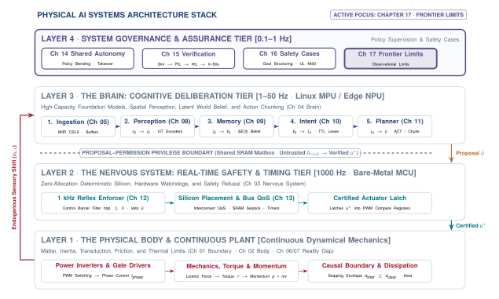
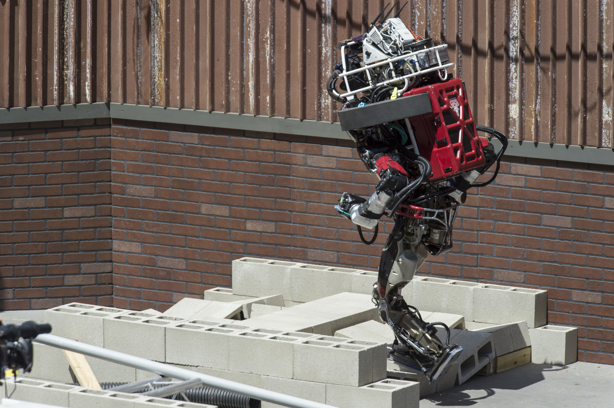
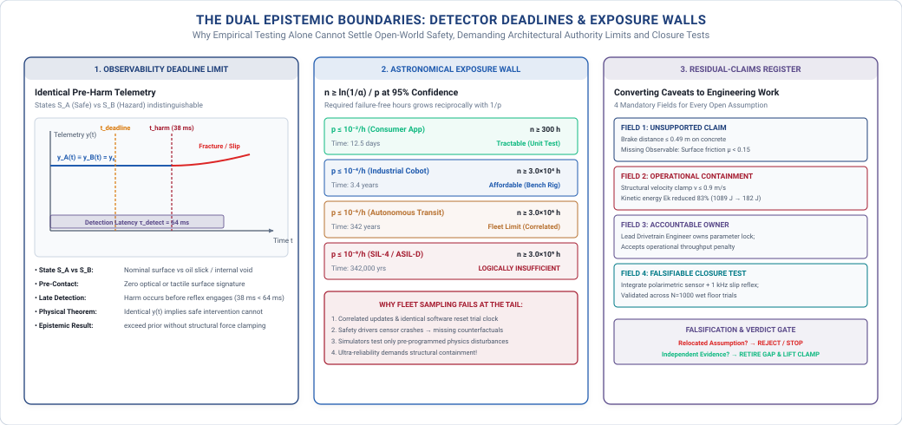
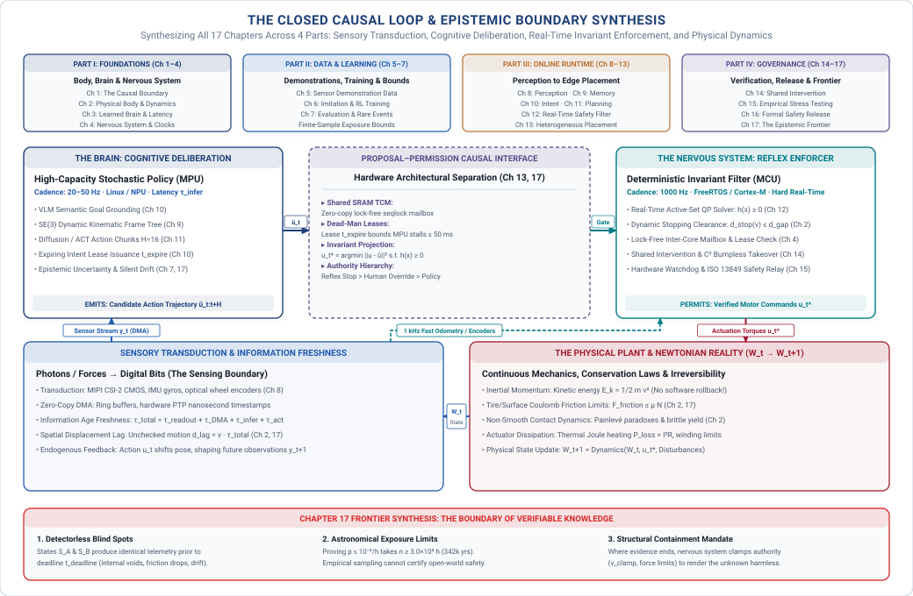

# The Epistemic Frontier {#sec-frontier}

::: {.column-margin}

\chapterminitoc

:::

::: {#fig-17-locator fig-env="figure" fig-pos="H" fig-cap="**Systems Stage Focus: The Epistemic Frontier**: Mapping cataloged physical failure modes against runtime detectors across the machine lifecycle, isolating the detectorless gaps where empirical evidence ends and architectural containment must govern." fig-alt="Systems Stage Focus: The Epistemic Frontier. Mapping cataloged physical failure modes against runtime detectors across the machine lifecycle, isolating the detectorless gaps where empirical evidence ends and architectural containment must govern."}
{width="100%"}
:::

*What physical failure modes remain invisible to modern runtime detectors, and how must an engineer govern what evidence cannot settle?*

A systems engineering framework that teaches practitioners to demand rigorous evidence must be equally transparent about the boundaries of its own methodology. No finite amount of empirical testing can certify open-world safety against catastrophic rare events, and several critical failure modes in physical systems lack practical real-time detectors. The frontier of physical AI is not a speculative list of future algorithms, but the formal register where unproven premises and detectorless gaps are openly documented. Recognizing what current evidence cannot settle—and enforcing the physical authority limits and operational restrictions needed to render the unknown harmless—is the definitive mark of professional engineering discipline.



::: {.callout-learning-objectives}
After studying this chapter, you will be able to:

1. Identify, for a machine of your own, which claims your evidence cannot currently support.
2. Name a failure mode from this book for which no practical detector exists.
3. State what advance would close a specific gap, and how you would know it had.
4. Apply the four properties to a machine this book never described.

*Core chapter takeaway.* A complete record still leaves claims unsupported. Several failure modes named in this book have no practical detector, and some claims cannot be supported by any evidence obtainable today. Naming those is the register of the discipline, not a weakness in it.
:::

## Epistemic Limits {#sec-frontier-17-1}

<!-- SECTION 17.1 -->
<!-- claim: A book that teaches engineers to demand evidence has to be honest about the evidence its own method cannot produce. -->
<!-- covers: Reopen the @sec-release verdict and show that it authorizes only a stated machine, operating envelope, duration, and set of monitored conditions. -->
<!-- covers: Compare three apparently complete records: a moving machine whose stopping claim assumes available friction, a touching machine whose force limit assumes material integrity, and a flow regulator whose bound assumes an undrifted reference sensor. -->
<!-- covers: Distinguish completeness within the method from completeness of knowledge; every required record field may be filled while a necessary premise remains unsupported. -->
<!-- covers: Establish the chapter’s test for a useful gap: name the affected claim, the missing evidence or observable, the present operational response, and the result that would close it. -->
<!-- covers: Explain that a new model or benchmark matters here only if it changes one of those four entries and can therefore alter a release verdict. -->
<!-- GROUNDING: frame — what the method establishes, and the boundary where it stops -->

<!-- BEGIN -->
A safety case assembled through rigorous systems engineering concludes with an explicit verdict. When an engineering review accepts that verdict, it does not certify that the physical machine is unconditionally safe. The verdict authorizes a specific hardware revision running a designated software build, restricted to a defined operating envelope, validated for an explicit operational duration such as $2000\text{ h}$, and conditioned on the continuous functioning of specified runtime monitors. As illustrated in the systems stage locator (@fig-17-locator), a rigorous engineering framework maps every cataloged physical failure mode against available runtime detectors across the machine's architecture. Where verified detectors and deterministic reflexes exist, the nervous system can enforce physical boundaries, clip unsafe commands, and arrest motion within budgeted latency windows. But where detectors are absent, the matrix reveals empty cells—unclosable epistemic gaps where empirical evidence ends and operational restrictions must govern. It establishes that across the validated parameter space, every cataloged hazard has an assigned mitigation path with verified latency budgets and bounded actuation forces. The authority of that authorization depends entirely on the validity of its underlying physical premises. A book that teaches engineers to demand evidence has to be honest about the evidence its own method cannot produce.

Consider three machines, each possessing an apparently complete safety record whose line items close without a single arithmetic deficit. The first is a mobile transport platform moving at $1.5\text{ m/s}$, whose stopping distance claim of $0.49\text{ m}$ assumes an available tire-to-floor friction coefficient of $\mu \ge 0.60$. If unmonitored liquid on the concrete floor reduces that coefficient to $\mu = 0.15$, the kinematic braking distance derived from friction limits quadruples from $0.19\text{ m}$ to $0.76\text{ m}$. Combined with the $0.30\text{ m}$ traversed during a $200\text{ ms}$ perception and actuation latency, the total stopping distance expands to $1.06\text{ m}$, breaching the $0.80\text{ m}$ clearance buffer before the vehicle halts. The second is an articulated manipulator commanded to limit contact force to $40\text{ N}$ during workpiece assembly, where the force-limiting guarantee assumes structural stiffness and material integrity across the end-effector mount. If fatigue micro-cracking introduces unmodeled compliance into the mount, mechanical deflection stores strain energy under load and releases it abruptly during surface transitions, delivering an unmeasured $120\text{ N}$ transient peak to the workpiece while the joint torque sensors register nominal values. The third is a chemical flow regulator maintaining downstream line pressure below $200\text{ kPa}$, whose control loop assumes an undrifted diaphragm pressure transducer. If chemical deposition on the diaphragm induces a steady calibration drift of $0.5\text{ kPa/h}$, the nervous system throttles the valve against a phantom pressure spike or opens it into an actual overpressure state of $240\text{ kPa}$, unaware that its reference sensor has drifted from physical ground truth.

These failures expose the difference between completeness within an engineering method and completeness of physical knowledge. In all three systems, every required cell in the verification matrix was populated with valid data. The timing budgets closed, the safety reflexes passed fault injection, the thermal dissipation of the actuators remained below the $80\,^{\circ}\text{C}$ winding limit, and the runtime enforcer executed deterministically at $1000\text{ Hz}$. Yet a necessary physical premise in each system remained unsupported by direct, continuous evidence. The record documented compliance with the specification, but the specification treated environmental friction, structural mechanics, and sensor calibration as static invariants rather than dynamic physical states. When an unmonitored invariant shifts, the physical machine departs from the verified envelope while telemetry continues to report normal operation.

Treating these blind spots with systems engineering rigor requires defining an **evidentiary gap** as an operational quantity rather than a general caveat: an operational state in a safety case where a safety-critical claim relies on a physical premise that cannot be continuously verified during execution or established through prior testing. To be actionable, every gap must satisfy a four-part specification: (1) state the affected claim, such as maintaining deceleration within a designated spatial buffer; (2) identify the missing observable or unattainable evidence, such as the instantaneous friction coefficient between the wheel contact patch and an oily surface; (3) state the present operational containment response, such as derating the maximum transit speed to $0.6\text{ m/s}$ or restricting the machine to dry indoor flooring; and (4) define the predeclared closure test—the physical measurement, sensor modality, or analytical result that would close the gap and permit the operational restriction to be lifted.

Framing the frontier in these terms clarifies how to evaluate new machine learning models, training regimes, and empirical benchmarks. In software machine learning, progress is often tracked by aggregate scores on standardized test datasets. In physical AI, a new model architecture, an expanded parameter count, or an improved benchmark score is irrelevant to a deployment authority unless it alters one of the four entries in an evidentiary gap. If a learned policy achieves higher average accuracy on an offline manipulation dataset but still requires an external mechanical guard to prevent over-torque, the safety case remains identical. Conversely, if an algorithmic advance provides verifiable bounds on out-of-distribution visual inputs, or if an improved model reduces inference latency from $80\text{ ms}$ to $10\text{ ms}$ at the $P_{99}$ tail and thereby recovers $0.10\text{ m}$ of stopping margin, that improvement directly alters the release verdict.

The frontier of the discipline is not a survey of emerging software techniques, which date quickly as tooling evolves. It is the boundary where measurable evidence ends and operational containment begins. An engineer who builds machines that act on the physical world must know exactly which claims their safety record proves, which claims it merely assumes, and what instrumentation or physical insight would be required to transform an assumption into evidence.
<!-- END -->

## What the Method Cannot Establish {#sec-frontier-17-2}

<!-- SECTION 17.2 -->
<!-- claim: A complete record still leaves things undecided, and knowing which is part of the discipline. -->
<!-- covers: Decompose a release claim into necessary links such as domain membership, measured physical bounds, component contracts, enforcement independence, detector coverage, and continued monitoring. -->
<!-- covers: Classify each link as measured, derived from measured premises, assumed, decided by accountable judgment, unsupported, or explicitly outside the threat model. -->
<!-- covers: Show from the logic of necessary premises that strong evidence for five links cannot compensate for a sixth link that is unsupported. -->
<!-- covers: Mark the friction premise, material-damage threshold, and sensor-independence premise in the three example records, then state exactly how each limits its verdict. -->
<!-- covers: Separate measurement from judgment: evidence can estimate exposure and uncertainty, but it cannot choose an acceptable residual risk or decide who may bear it. -->
<!-- covers: State the adversarial boundary precisely; tests of accidental faults do not support claims about intentional sensor manipulation, model tampering, or denial of enforcement. -->
<!-- covers: Define the claimed failure probability, unit of exposure, confidence level, and independence assumptions before counting a single trial. -->
<!-- covers: Derive from $(1-p)^n$ that zero observed failures require $n \ge \ln(\alpha)/\ln(1-p)$ independent representative exposures to support a bound $p$ at confidence $1-\alpha$. -->
<!-- covers: Work the number: supporting $p \le 10^{-9}$ per operating hour at 95 percent confidence takes roughly $3.0\times10^{9}$ failure-free hours, about 342,000 machine-years. -->
<!-- covers: Explain why correlated fleet hours, changing software, censored interventions, and unvalidated simulation do not automatically count as independent representative exposure. -->
<!-- covers: Distinguish unaffordable evidence from logically insufficient evidence, because more testing can address the first and only a narrower claim or a structural argument can address the second. -->
<!-- covers: State the defensible alternatives: narrow the domain, bound physical authority, add independent enforcement, shorten the verdict, assign the residual risk explicitly, or refuse. -->
<!-- GROUNDING: number — the exposure a rare-event claim would require, against what is affordable -->
<!-- FIGURE: SHOW the reciprocal growth of required exposure as the target failure rate falls, with universal open-world claims placed outside every finite-exposure curve. -->
<!-- DERIVE: the zero-failure exposure bound, including its confidence, independence, and representativeness assumptions -->

<!-- BEGIN -->
A safety release claim for a physical AI system is not a monolithic assertion of competence. It is a conjunction of discrete, necessary links that must all hold simultaneously for a physical guarantee to remain valid. A complete argument requires establishing domain membership for incoming sensor observations, measured physical bounds on actuator authority and stopping distances, formal component contracts across software boundaries, strict execution independence between the learned policy and the safety enforcement path, quantified detector coverage across all identified fault modes, and continuous runtime monitoring of system invariants. Because these premises form a logical conjunction, the strength of the overall claim is governed by its weakest constituent link. Generating extensive, high-confidence empirical evidence for five of these links cannot compensate for a sixth link that remains unsupported, because a failure in any single premise causes the deductive safety argument to fail entirely.[^fn-phil-popper-falsification]

Every link in a safety case requires an explicit epistemic classification, identifying each premise as measured directly through physical instrumentation, derived analytically from measured premises, assumed on physical or operational grounds, decided by accountable judgment, left unsupported by existing data, or explicitly declared outside the threat model. In the three reference machines examined throughout this text, these classifications reveal the exact boundary where evidence ends. For the wheeled mobile robot, the stopping-distance guarantee relies on an assumed friction coefficient between tire and floor that cannot be measured before braking begins. For the articulated manipulator, the collision-containment argument depends on an assumed material-damage threshold for surrounding equipment, which is an engineering judgment about structural yield rather than a measured property of the controller. For the aerial vehicle, the state-estimation envelope assumes statistical independence between optical flow and inertial sensors, an assumption that collapses under sudden illumination changes or frame resonance. Naming these premises explicitly does not weaken the release record. It establishes the physical envelope within which the release verdict is justified, and outside of which the verdict ceases to apply.

Separating measurement from judgment is fundamental to systems engineering discipline. Empirical testing and statistical characterization can estimate physical exposure, quantify sensor noise, and bound parametric uncertainty, but no measurement can choose an acceptable residual risk or decide which individuals in an operational environment must bear that risk. Those choices are accountable human decisions that must be recorded as explicit judgments rather than disguised as empirical findings. In the same way, the threat model establishes an absolute boundary on the validity of the record. Empirical testing across nominal fleet operations and accidental component faults provides no evidence regarding intentional adversarial attacks. A safety record demonstrating that a vision pipeline handles sensor noise, lens blur, and partial occlusions provides zero statistical support for claims about resilience against adversarial optical projection, model parameter tampering, or intentional denial of service across the internal communication bus.

When an engineering claim relies on statistical testing to bound the probability of a hazardous event, the claim requires rigorous formal definition before conducting trials. The engineering specification must define the target failure probability $p$, the physical unit of exposure, the required statistical confidence level $1-\alpha$, and the necessary independence assumptions before counting a single hour or trial. If a dangerous failure occurs with constant probability $p$ per independent, identically distributed exposure unit, the probability of observing zero failures across $n$ units of exposure is $(1-p)^n$. To assert with confidence $1-\alpha$ that the true failure rate does not exceed $p$, the probability of observing zero failures purely by chance must not exceed $\alpha$, yielding the inequality $(1-p)^n \le \alpha$. Taking the natural logarithm of both sides gives $n \ln(1-p) \le \ln(\alpha)$. Because $p \in (0, 1)$, the quantity $\ln(1-p)$ is negative, and dividing by it reverses the inequality, yielding the required exposure bound:
$$n \ge \frac{\ln(\alpha)}{\ln(1-p)}$$
For rare failure events where $p \ll 1$, the first-order Taylor approximation $\ln(1-p) \approx -p$ simplifies this relation to $n \ge \ln(1/\alpha)/p$.

As an analytical example, consider a safety requirement specifying that a high-consequence physical failure must occur with probability $p \le 10^{-9}$ per operating hour at a 95 percent confidence level ($1-\alpha = 0.95$, so $\alpha = 0.05$). Substituting these values into the exact relation demonstrates the scale of empirical testing required to support the claim. With $\ln(0.05) \approx -2.9957$ and $\ln(1 - 10^{-9}) \approx -1.0000 \times 10^{-9}$, the required number of independent, failure-free operational hours is:
$$n \ge \frac{-2.9957}{-1.0000 \times 10^{-9}} \approx 3.0 \times 10^{9}\text{ operating hours}$$
Accumulating $3.0 \times 10^{9}\text{ operating hours}$ without a single observed failure requires approximately 342,000 machine-years of continuous execution (@fig-17-epistemic-limits, Panel 2). This threshold represents the **astronomical exposure wall**: the mathematical scaling limit ($n \ge \frac{\ln(1/\alpha)}{p}$) where certifying ultra-rare tail failure probabilities ($p \le 10^{-9}/\text{h}$) at statistical confidence ($1-\alpha$) in open-world physical domains requires billions of independent, failure-free operational exposure hours ($>10^9\text{ h}$ or hundreds of thousands of machine-years), rendering pure empirical black-box fleet testing logically and economically insufficient.[^fn-std-sil4-testing]

::: {.callout-important title="Observational Deadlines, Tail Exposure Scaling, and Energy Dissipation"}
Three fundamental calculations demonstrate why empirical fleet testing cannot substitute for deterministic physical containment:

1. **Observational Indistinguishability Deadline Deficit:**
   Consider a high-speed robotic gripper closing on a brittle ceramic workpiece where brittle fracture occurs at normal load $F_{\text{crit}} = 15\text{ N}$. Given a force ramp rate $\dot{F} = 400\text{ N/s}$, the physical time-to-harm from initial contact is:
   $$t_{\text{harm}} = \frac{F_{\text{crit}}}{\dot{F}} = \frac{15\text{ N}}{400\text{ N/s}} = 37.5\text{ ms}$$
   The real-time nervous system and plant introduce actuator current decay latency $\tau_{\text{act}} = 25\text{ ms}$ and fieldbus serialization latency $\tau_{\text{bus}} = 2\text{ ms}$. For a runtime detection filter to prevent fracture, detection latency must satisfy:
   $$\tau_{\text{det}} \le t_{\text{harm}} - \tau_{\text{act}} - \tau_{\text{bus}} = 37.5\text{ ms} - 25\text{ ms} - 2\text{ ms} = 10.5\text{ ms}$$
   If an exteroceptive camera pipeline operates at $30\text{ Hz}$ ($\tau_{\text{frame}} = 33.3\text{ ms}$) with neural inference latency $\tau_{\text{infer}} = 20\text{ ms}$, total perception latency is $\tau_{\text{det}} = 53.3\text{ ms}$. The timing budget deficit is:
   $$\Delta \tau = \tau_{\text{det}} - \tau_{\text{det,max}} = 53.3\text{ ms} - 10.5\text{ ms} = +42.8\text{ ms}$$
   Because $\Delta \tau > 0$, algorithmic detection is physically impossible before fracture occurs, mandating passive spring compliance ($k = 2.5\text{ N/mm}$) rather than vision software.

2. **Astronomical Exposure Scaling vs. Fleet Testing:**
   To certify a catastrophic autonomy failure rate $p \le 10^{-9}/\text{h}$ at $95\%$ confidence ($\alpha = 0.05$):
   $$n \ge \frac{\ln(1/0.05)}{10^{-9}} = \frac{2.9957}{10^{-9}} \approx 3.0 \times 10^9\text{ hours} \approx 342{,}465\text{ machine-years}$$
   For an industrial fleet of $1{,}000$ robots deployed $8\text{ h/day}$ ($2.92 \times 10^6\text{ fleet-h/year}$), accumulating $3.0 \times 10^9\text{ h}$ of independent, failure-free data would require:
   $$T_{\text{test}} = \frac{3.0 \times 10^9\text{ h}}{2.92 \times 10^6\text{ h/year}} \approx 1{,}027\text{ calendar years}$$
   Any software checkpoint update resets this counter to zero, demonstrating why safety cases must rest on deterministic barrier shields rather than fleet sampling.

3. **Kinetic Energy Clamping and Friction Collapse:**
   A $450\text{ kg}$ transport robot traveling at nominal velocity $v_{\text{nom}} = 2.2\text{ m/s}$ possesses kinetic energy:
   $$E_{k,\text{nom}} = \frac{1}{2} m v_{\text{nom}}^2 = \frac{1}{2}(450\text{ kg})(2.2\text{ m/s})^2 = 1089\text{ J}$$
   When environmental surface friction collapses from clean concrete ($\mu = 0.70$) to a thin lubricant spill ($\mu = 0.12$), stopping distance with sensorimotor reaction delay $\tau = 50\text{ ms}$ expands to:
   $$d_{\text{stop,nom}} = v_{\text{nom}} \tau + \frac{v_{\text{nom}}^2}{2 \mu g} = (2.2)(0.050) + \frac{2.2^2}{2(0.12)(9.81)} = 0.110 + 2.056 = 2.166\text{ m}$$
   By clamping velocity in firmware to $v_{\text{clamp}} = 0.90\text{ m/s}$, kinetic energy falls to:
   $$E_{k,\text{clamp}} = \frac{1}{2}(450\text{ kg})(0.90\text{ m/s})^2 = 182.25\text{ J} \quad (-83.3\%)$$
   The clamped stopping distance becomes:
   $$d_{\text{stop,clamp}} = (0.90)(0.050) + \frac{0.90^2}{2(0.12)(9.81)} = 0.045 + 0.344 = 0.389\text{ m} \le 0.50\text{ m}$$
   This structural velocity clamp preserves the $0.50\text{ m}$ clearance buffer without requiring real-time friction sensing.
:::

Operational fleet data rarely satisfies the statistical assumptions underlying this derivation. Aggregating runtime across a fleet of one thousand machines operating in parallel does not yield one thousand independent hours per wall-clock hour, because shared environmental conditions, correlated fleet-wide software updates, and common spatial layouts introduce systematic dependencies. Furthermore, learned systems undergo continuous modification; deploying an updated neural network checkpoint, retuned sensor filter, or modified calibration table resets the statistical trial counter, because the new software constitutes a distinct statistical distribution. Human safety interventions further distort empirical records through censoring. When an attentive human operator intercepts an erratic motion before contact occurs, the intervention truncates a potential accident, converting an uncontained failure into an unrecorded counterfactual. Similarly, unvalidated physics simulations cannot substitute for physical exposure, because simulation trials test only the disturbance distributions and contact dynamics that the modeler explicitly programmed, leaving real-world transfer discrepancies unmeasured.

An engineer must therefore distinguish between evidence that is unaffordable and evidence that is logically insufficient. Demonstrating a failure rate bound of $p \le 10^{-4}$ per operating hour on a mechanical brake actuator may be unaffordable within an eight-week test campaign, but it remains a tractable physical hypothesis that additional test benches and capital can establish. Conversely, attempting to prove open-world safety bounds for an end-to-end vision-language-action model through empirical sampling is logically insufficient, because no finite dataset can span the unbounded combinatorial possibilities of unconstrained physical environments. When a required premise cannot be settled by evidence, accumulating further empirical test hours is futile. The defensible engineering responses are structural. An engineer can narrow the operational design domain to eliminate untestable environmental states, bound the mechanical authority of the actuators so that maximum kinetic energy remains below structural damage limits, install an independent deterministic safety enforcer in the nervous system with veto authority over the learned policy, shorten the temporal duration of the release verdict to mandate frequent physical re-inspection, assign the residual risk explicitly to a designated human operator through formal interface contracts, or refuse to issue a release verdict.[^fn-hw-fault-registers]

This epistemic boundary is vividly illustrated in extreme-environment exploration platforms, such as planetary rovers drilling and navigating unstructured extraterrestrial terrain (@fig-17-mars-perseverance-drill). Operating millions of kilometers from Earth under multi-minute communication latencies that preclude human teleoperation, the machine must interact with uncharacterized geological formations whose internal fracture dynamics and surface friction cannot be certified through prior fleet testing. Mission survivability is achieved not by asserting statistical competence over unknown terrain distributions, but by enforcing deterministic physical authority limits: hardware torque clutches, passive suspension compliance, and hard-coded nervous-system reflexes that halt actuator drives the instant contact impedance departs from safe envelopes.

::: {#fig-17-mars-perseverance-drill fig-env="figure" fig-pos="t" fig-cap="**Autonomous Robotic Manipulation and Core Sampling in Unstructured Extraterrestrial Terrain**: NASA's Perseverance Mars Rover operating at the \"Rochette\" bedrock outcrop in Jezero Crater (Sol 198), displaying its 2.1-meter five-degree-of-freedom robotic arm and 45-kilogram turret equipped with a rotary-percussive coring drill, Mastcam-Z stereoscopic navigation cameras, and proximity sensors. Two visible coring boreholes (*Montdenier* and *Montagnac*) illustrate direct mechanical contact interaction with uncharacterized geological strata. Operating under a 4-to-24-minute one-way speed-of-light communication latency to Earth, the rover cannot rely on human teleoperation to catch contact bifurcations or slip hazards. Because empirical testing across open Martian environments is logically incapable of exhausting all unmonitored physical invariants (such as subsurface rock fractures, grain cohesion, or unexpected drill-bit binding), safety is guaranteed structurally: passive mechanical compliance, deterministic motor current torque clamps, and autonomous nervous-system reflexes bound energy transfer and arrest motion before irreversible structural yield can occur. Image credit: NASA/JPL-Caltech/MSSS (public domain)." fig-alt="Autonomous Robotic Manipulation and Core Sampling in Unstructured Extraterrestrial Terrain. NASA's Perseverance Mars Rover operating at the \"Rochette\" bedrock outcrop in Jezero Crater (Sol 198), displaying its 2.1-meter five-degree-of-freedom robotic arm and 45-kilogram turret equipped with a rotary-percussive coring drill, Mastcam-Z stereoscopic navigation cameras, and proximity sensors. Two visible coring boreholes (Montdenier and Montagnac) illustrate direct mechanical contact interaction with uncharacterized geological strata. Operating under a 4-to-24-minute one-way speed-of-light communication latency to Earth, the rover cannot rely on human teleoperation to catch contact bifurcations or slip hazards. Because empirical testing across open Martian environments is logically incapable of exhausting all unmonitored physical invariants (such as subsurface rock fractures, grain cohesion, or unexpected drill-bit binding), safety is guaranteed structurally: passive mechanical compliance, deterministic motor current torque clamps, and autonomous nervous-system reflexes bound energy transfer and arrest motion before irreversible structural yield can occur. Image credit: NASA/JPL-Caltech/MSSS (public domain)."}
{width="85%"}
:::
<!-- END -->

## A Residual-Claims Register {#sec-frontier-17-3}

<!-- SECTION 17.3 -->
<!-- claim: Every claim the evidence does not support gets an entry: what is missing, what is done instead, who owns it, and what would close it. -->
<!-- covers: The register, and what one entry contains -->
<!-- covers: Linking a claim to the observable that is missing -->
<!-- covers: The operational response chosen while the gap is open -->
<!-- covers: The closure test, written before the gap is closed -->
<!-- GROUNDING: mechanism — one entry: the missing observable, the response, the owner, the closure test -->

<!-- BEGIN -->
An unproven premise does not vanish when an engineer omits it from a safety report. When empirical testing cannot establish a safety bound, the unproven premise must be entered into a formal **residual-claims register**: an auditable systems engineering ledger that maps every unproven physical premise or unmonitored invariant in a safety case to its missing physical observable, active mechanical or architectural containment constraint, named accountable human owner, and predeclared closure test. An engineering team cannot treat an unverified physical assumption as an unwritten risk or a temporary modeling convenience. Every entry in the register translates an epistemic shortfall into four mandatory components, comprising the unsupported claim and its missing physical observable, the structural operational response that contains the hazard, the named engineer who owns the operational risk, and the closure test that defines what evidence would retire the entry. Without these four components, an unresolved claim is simply an unmonitored defect.

Every entry begins by linking the unsupported claim to the specific physical observable that cannot be measured. In an embodied system with physical authority over mass, a learned policy fails to settle a safety property because sensors cannot transduce the relevant environmental state, the computing substrate cannot process the measurement within the control deadline, or the physical interaction cannot be observed before contact occurs. An engineer must define the missing observable with physical precision rather than statistical abstractions. Characterizing an unknown failure as an out-of-distribution latent state provides no actionable signal for an enforcement loop. Stating an unmeasured surface friction coefficient, an undetected optical flare across a camera lens array, or an unobservable micro-fracture in an actuator housing identifies the exact physical deficit. Naming the missing observable establishes the boundary where learned inference stops and physical uncertainty begins.

In an analytical example, consider a $450\text{ kg}$ autonomous mobile transport robot moving palletized goods across an industrial logistics depot. The safety case asserts that the learned navigation policy will never command a turning maneuver that causes wheel slip and lateral skidding on smooth concrete floors contaminated with spilled lubricant. The missing observable is the local surface friction coefficient $\mu$, which varies from $\mu = 0.70$ on clean dry concrete down to $\mu = 0.12$ under a lubricant slick. Standard RGB cameras and structured-light depth sensors cannot detect a transparent, two-millimeter layer of synthetic machine oil before the drive wheels make contact. Because this observable cannot be transduced prior to traversal, empirical fleet hours cannot establish that the learned policy will maintain traction during high-speed turns.

An open entry in the register requires an immediate operational response enforced in the nervous system or the physical plant. The response cannot consist of a warning label, an advisory note in an operator manual, or a software retry loop. It must be a structural constraint that prevents the unmeasured observable from causing damage. In the transport robot example, the nervous system microcontroller clamps the maximum translational velocity from the nominal $2.2\text{ m/s}$ down to $v_{\text{clamp}} = 0.9\text{ m/s}$, and derates maximum allowable lateral acceleration to $a_{\text{lat}} \le 1.0\text{ m/s}^2$ within its static configuration table. This velocity restriction drops the vehicle's kinetic energy from $\frac{1}{2}(450\text{ kg})(2.2\text{ m/s})^2 = 1089\text{ J}$ down to $\frac{1}{2}(450\text{ kg})(0.9\text{ m/s})^2 = 182\text{ J}$, an $83\text{ percent}$ reduction in destructive potential. At $0.9\text{ m/s}$, the worst-case stopping distance on an oil slick with $\mu = 0.12$ (producing a deceleration of $a = \mu g \approx 1.18\text{ m/s}^2$) under a $50\text{ ms}$ sensorimotor reaction delay is $d_{\text{stop}} = (0.9 \times 0.050) + \frac{0.9^2}{2 \times 1.18} = 0.045 + 0.343 = 0.388\text{ m}$. This stopping distance keeps the machine within the $0.50\text{ m}$ safety margin maintained by its proximity sensors.

Every operational response requires a named owner with the authority to maintain the constraint against organizational pressure. If ownership is assigned to an entire development team or an anonymous safety committee, the constraint will erode whenever deployment schedules tighten or customer throughput targets slip. The owner is an individual engineer or an operational manager whose signature appears on the release verdict. In the transport robot system, the drivetrain engineering lead and the depot operations manager serve as co-owners. The drivetrain lead owns the firmware parameter lock on the velocity clamp, ensuring that no software update can override the $0.9\text{ m/s}$ ceiling. The operations manager owns the physical operating environment, guaranteeing that pedestrian walkways remain separated by physical barriers wherever transport paths intersect. Both owners legally accept the throughput penalty as the direct operational price of operating with an unproven claim.

Every entry must define its closure test at the moment the gap is identified. If an engineering team defines the closure test after gathering new data, the criteria will inevitably shift to match whatever measurements were inexpensive to collect. A closure test specifies the verifiable physical measurement, sensor modality, or mathematical invariant that eliminates the dependency on the operational constraint. For the mobile transport robot, the closure test requires integrating an onboard polarimetric surface reflectivity sensor validated across $N = 1000$ empirical trials under controlled surface contaminants, combined with a firmware-level wheel-encoder differential slip detector that executes at $1000\text{ Hz}$ and triggers emergency braking within $10\text{ ms}$ of slip onset. Once that instrumentation is installed, calibrated, and proven to satisfy the $P_{99.9}$ detection bound, the entry is retired and the velocity clamp is removed.

Specifying a closure test forces an engineering organization to determine whether a gap can be resolved with improved instrumentation and testing, or whether it represents a permanent unobservable state. When a closure test requires a physical transducer that cannot be manufactured or a computational budget that the edge platform cannot support, the register entry remains open for the operating lifetime of the machine. The operational response becomes a permanent architectural boundary. The danger arises when an organization treats an unclosable entry as a temporary backlog item, assuming that every physical failure mode can eventually be trapped by an onboard runtime detector.

The structured anatomy of these register entries is formalized across representative physical AI archetypes in @tbl-17-claims-register, illustrating how unmonitored hazards are systematically bounded by operational constraints until falsifiable closure tests are satisfied.

| System Archetype & Release Claim                                                                                                                | Missing Physical Observable                                                                                         | Physical Hazard Mechanism                                                                                                                                                                                                             | Operational Containment & Accountable Owner                                                                                                                                                                                                                                                                               | Predeclared Closure Test                                                                                                                                                                                                                             |
|:------------------------------------------------------------------------------------------------------------------------------------------------|:--------------------------------------------------------------------------------------------------------------------|:--------------------------------------------------------------------------------------------------------------------------------------------------------------------------------------------------------------------------------------|:--------------------------------------------------------------------------------------------------------------------------------------------------------------------------------------------------------------------------------------------------------------------------------------------------------------------------|:-----------------------------------------------------------------------------------------------------------------------------------------------------------------------------------------------------------------------------------------------------|
| **Autonomous Mobile Robot (450 kg)** *Claim*: Stopping distance $d \le 0.50\text{ m}$ on depot concrete ($v_{\text{nom}} = 2.2\text{ m/s}$). | Forward surface friction coefficient $\mu \in [0.12, 0.70]$ under thin fluid/lubricant films ($h \le 2\text{ mm}$). | Reduced friction quadruples kinematic braking distance ($d = \frac{v^2}{2\mu g} + v\tau$), expanding stopping envelope from $0.39\text{ m}$ to $1.64\text{ m}$ and breaching clearance buffer.                                        | Drivetrain firmware clamps max velocity to $v_{\text{clamp}} \le 0.90\text{ m/s}$ ($E_{\text{kin}}$ drops from $1089\text{ J}$ to $182\text{ J}$, $-83.3\%$) and lateral acceleration $a_{\text{lat}} \le 1.0\text{ m/s}^2$; physical depot pedestrian barriers. *Owners*: Drivetrain Lead & Depot Operations Manager. | Integrate forward polarimetric scatterometer ($P_{99.9}$ oil detection at $3.0\text{ m}$) + $1000\text{ Hz}$ wheel-encoder differential slip reflex ($t_{\text{arrest}} \le 10\text{ ms}$) verified across $N \ge 1000$ contaminated track trials.   |
| **Articulated Manipulator (6-DoF)** *Claim*: Bounded contact force $F \le 40\text{ N}$ during brittle ceramic workpiece assembly.            | Subsurface voids or micro-cracks ($V_{\text{void}} > 0.5\text{ mm}^3$) within uninspected ceramic workpieces.       | Normal force ramps at $400\text{ N/s}$, crossing the $15\text{ N}$ brittle fracture threshold in $38\text{ ms}$; actuator current-decay delay ($\tau_{\text{decay}} = 25\text{ ms}$) prevents closed-loop force arrest.               | Passive mechanical compliance interface with calibrated spring detent ($k = 2.5\text{ N/mm}$) and pneumatic breakaway relief limiting peak force to $F_{\text{peak}} \le 18\text{ N}$; derate jaw speed to $5\text{ mm/s}$. *Owner*: Tooling & End-Effector Lead.                                                      | Integrate jaw-embedded ultrasonic pulse-echo transducer ($f = 5\text{ MHz}$, $\tau_{\text{meas}} \le 12\text{ ms}$) detecting structural voids prior to reaching $5\text{ N}$ clamping force with false-alarm rate $\alpha_{\text{FA}} \le 10^{-4}$. |
| **Chemical Flow Regulator** *Claim*: Downstream line pressure bound $P \le 200\text{ kPa}$ over $2000\text{ h}$ continuous campaign.         | Sensor zero-point baseline drift ($\kappa = 0.5\text{ kPa/h}$) from chemical deposition on silicon diaphragm.       | Downward drift causes controller to open valve against phantom under-pressure, driving physical manifold to $240\text{ kPa}$ (rupture risk) while telemetry reads nominal $195\text{ kPa}$.                                           | Hard-wired analog rupture burst-disc ($P_{\text{burst}} = 215\text{ kPa}$) and mandatory scheduled physical zero-point proof-tests every $\Delta t_{\text{proof}} = 72\text{ h}$. *Owners*: Process Safety Lead & Plant Reliability Engineer.                                                                          | Install dual-dissimilar sensing: piezoresistive transducer paired with non-intrusive ultrasonic Coriolis flow meter, triggering cross-channel disparity trip when $\lvert \Delta P_{\text{disparity}} \rvert \ge 5.0\text{ kPa}$.                    |
| **Multi-Rotor Aerial Drone** *Claim*: Positional drift $e_{\text{pos}} \le 0.10\text{ m}$ during rapid transitions across indoor corridors.  | Visual feature track persistence under high-dynamic-range lighting shifts ($>10^4\text{ lux/s}$).                   | Sudden feature loss triggers visual odometry divergence; IMU double-integration error drifts quadratically ($\sigma_x \propto \frac{1}{2} a_{\text{bias}} t^2 \approx 0.8\text{ m}$ in $400\text{ ms}$), causing perimeter collision. | Autonomous geofence safety bubble ($d_{\text{standoff}} \ge 1.5\text{ m}$) enforced by independent time-of-flight (ToF) pulsed-lidar safety shield triggering auto-hover retro-thrust within $20\text{ ms}$. *Owner*: Flight Autonomy Lead.                                                                            | Integrate multi-spectral event-based neuromorphic vision sensor ($>120\text{ dB}$ dynamic range, latency $\tau \le 1\text{ ms}$) maintaining state error $e \le 0.05\text{ m}$ over $N = 500$ abrupt blackout transitions.                           |
: **The Residual-Claims Register Matrix**: Auditable ledger of unproven physical premises across representative physical AI archetypes. For each open claim, the register defines the missing physical observable, the physical hazard mechanism, the active operational containment enforced by the nervous system or mechanical hardware, the accountable human owners, and the falsifiable closure test required to retire the operational restriction. {#tbl-17-claims-register}

### Frontier synthesis and residual-claims manifest schema {.unnumbered}

To ensure auditable tracking of unmonitored invariants across software deployments and physical revisions, safety-critical systems represent open residual claims through a formal, structured data contract (@tbl-17-residual-claims-schema). The abstract schema below defines the mandatory fields, scalar types, physical SI units, and structural invariants required for every unresolved physical assumption:

| Manifest Category           | Parameter & Type                   | Physical Unit          | Invariant & Operational Contract                                  |
|:----------------------------|:-----------------------------------|:-----------------------|:------------------------------------------------------------------|
| **Manifest Header**         | `system_identifier` (`str`)        | —                      | Unique embodied platform ID (e.g., `AMR-450-DEPOT`)               |
| **Manifest Header**         | `hardware_build_rev` (`str`)       | —                      | Target silicon and chassis revision (`HW-REV-3.2`)                |
| **Manifest Header**         | `software_digest` (`str`)          | —                      | Cryptographic binary hash (SHA-256)                               |
| **Manifest Header**         | `validity_limit_hours` (`float`)   | hours                  | Maximum statutory operating window before review                  |
| **Residual Claims**         | `entry_id` (`str`)                 | —                      | Unique claim tag (e.g., `CLAIM-FRIC-001`)                         |
| **Residual Claims**         | `target_safety_claim` (`str`)      | —                      | Explicit safety invariant ($d_{\text{stop}} \le 0.50\text{ m}$)   |
| **Residual Claims**         | `missing_observable` (`str`)       | SI units               | Unmeasured physical state (e.g., surface friction $\mu$)          |
| **Physical Hazard**         | `governing_law` (`str`)            | —                      | Newton-Euler, Navier-Stokes, Joule heating                        |
| **Physical Hazard**         | `time_to_harm` (`float`)           | seconds                | Time from unmodeled transition to irreversible yield              |
| **Operational Containment** | `containment_type` (`enum`)        | —                      | `FIRMWARE_PARAM_CLAMP`, `PASSIVE_MECHANICAL`, `PROOF_TEST`        |
| **Operational Containment** | `authority_limit` (`float`)        | $\text{m/s}, \text{N}$ | Hard numeric setpoint ceiling ($v_{\max}, F_{\max}$)              |
| **Operational Containment** | `kinetic_energy_ceiling` (`float`) | $\text{J}$             | Maximum allowable kinetic energy under fault ($E_k \le E_{\max}$) |
| **Predeclared Closure**     | `closure_modality` (`str`)         | —                      | Transducer technology or formal method required                   |
| **Predeclared Closure**     | `sample_trials` (`int`)            | count                  | Minimum empirical sample exposure ($N \ge 1000$)                  |
| **Predeclared Closure**     | `confidence_level` (`float`)       | —                      | Statistical confidence threshold ($1 - \alpha \ge 0.999$)         |
: **Epistemic Residual-Claims Register**: Concrete data schema for residual claims. {#tbl-17-residual-claims-schema}

## Failures Without Detectors {#sec-frontier-17-4}

A runtime detector is not an abstract classifier. A **practical detector** is a physical subsystem governed by three coupled parameters, namely coverage across the failure distribution, a bounded false-alarm rate, and a detection latency strictly shorter than the physical system's time-to-harm. If a mobile transport base traveling at $1.5\text{ m/s}$ requires $180\text{ ms}$ of braking actuation to avoid colliding with an obstacle, a perception pipeline requiring $250\text{ ms}$ of sensor aggregation and compute latency is not a detector for that hazard. It is a post-incident logging mechanism. Producing an accurate classification label after the physical body has crossed an irreversible threshold generates diagnostic evidence for an investigation, but it cannot participate in the safety case as a runtime safeguard.

The fundamental limit of runtime detection arises from observational indistinguishability. Consider two physical states of the world, $S_A$ and $S_B$. In state $S_A$, a commanded actuator trajectory $u(t)$ is safe. In state $S_B$, the identical trajectory $u(t)$ causes structural damage or human injury, requiring the nervous system to intervene and execute a stopping reflex. The dynamics of the body impose a hard deadline $t_{\text{deadline}}$, determined by actuator response time and system momentum, after which physical contact or mechanical yield cannot be prevented. If the telemetry history $y(t)$ provided by onboard instrumentation is identical for $S_A$ and $S_B$ across the entire interval $t \le t_{\text{deadline}}$, no algorithm operating on those observations can reliably distinguish the benign state from the hazardous one. When two physical realities produce identical sensor traces up to the action deadline, the probability of safe intervention cannot exceed the unconditioned prior, regardless of model scale or compute capacity.

::: {.callout-definition title="Observational Indistinguishability"}
The physical condition where two distinct world states—one nominal ($S_A$) and one catastrophic ($S_B$)—generate identical pre-harm sensor telemetry ($y_A(t) \equiv y_B(t)$) up to the system's physical action deadline ($t_{\text{deadline}} = t_{\text{harm}} - t_{\text{act}}$), rendering timely algorithmic differentiation physically and mathematically impossible regardless of model capacity, inference compute, or training dataset volume.
:::

In learned perception-action policies, this detectability limit manifests as silent distribution shift and embodied shortcut learning. High-capacity neural networks, such as Vision-Language-Action (VLA) models or deep imitation policies, minimize empirical loss by discovering opportunistic statistical correlations across high-dimensional demonstration datasets. In embodied tasks, unmeasured physical properties—such as contact friction, material yield strength, or payload inertia—are unobserved latent variables. Deep models routinely learn to exploit non-causal visual features (such as ambient illumination angles, floor specular highlights, or camera frame-rate synchronization) as computational proxies for these physical properties. When operating under open-world distribution shift, these non-causal correlations collapse. However, because high-dimensional non-linear encoders compress the out-of-distribution observation $\mathbf{x}$ directly into a nominal latent manifold $\mathbf{z} = \phi(\mathbf{x}) \in \mathcal{Z}_{\text{nom}}$, the policy outputs action distributions $\pi(\mathbf{a} \mid \mathbf{z})$ with near-zero softmax entropy ($H(\pi) \approx 0$) and minimal ensemble disagreement. The model commands aggressive, damaging physical trajectories while its internal representations indicate nominal performance. Crucially, any epistemic uncertainty estimator implemented in software (such as latent Mahalanobis distance, Monte Carlo dropout, or autoencoder reconstruction residuals) evaluates uncertainty using the very same corrupted representations $\mathbf{z}$. Because the confidence estimator and the policy share the broken perceptual representations, internal software metrics cannot serve as an independent detector of shift. This failure mode is termed **embodied shortcut learning and latent epistemic shift**: the process where a high-capacity neural policy exploits non-causal statistical correlations in training demonstrations as computational proxies for unmeasured physical states, causing the model to command destructive actions with maximal confidence while rendering internal uncertainty metrics completely blind to the failure. The learned Brain is fundamentally blind to its own shortcut failure, necessitating an independent deterministic Nervous System to enforce physical containment.

Physical sensing hardware exhibits an identical lack of identifiability over longer operating durations. In a fluid regulation system, an inline thermal mass flow sensor subjected to surface fouling or thermal aging drifts downward at an analytical example rate of $0.02\text{ L/min}$ per $100\text{ h}$ of operation. Over the same timescale, an incipient pipe constriction or supply pressure drop produces an identical, genuine reduction in mass flow. A single measurement channel measuring heat dissipation reports a declining scalar signal $q(t)$. The nervous system receives the telemetry stream, but no algorithm processing that single signal can identify whether the physical process has changed or the transducer calibration has degraded. Both physical conditions generate the exact same observation sequence. Without an independent reference transducer or a direct differential measurement, the drift is undetectable at runtime.[^fn-hw-piezoresistive-drift]

Mechanical manipulation reveals failures where the threshold for safe action cannot be known before physical contact occurs. Consider a robotic manipulator grasping ceramic workpieces. A sound workpiece safely tolerates a normal gripping force of $50\text{ N}$, whereas a workpiece containing an internal structural void fractures when normal force exceeds $15\text{ N}$. Exterior optical cameras and tactile skin arrays inspect the workpiece before grasping, but internal voids produce zero surface signatures. Prior to contact, the force sensors report $0.0\text{ N}$. Once contact occurs, the gripper jaws close, ramping normal force at an analytical example rate of $400\text{ N/s}$. The boundary between safe load application and brittle fracture is crossed in $38\text{ ms}$, which is shorter than the combined latency of the force sensor filter, the serial bus transfer, and the motor drive's current-decay response. The safe force cannot be determined before contact, and fracture occurs before the nervous system can arrest jaw motion. This scenario defines a **detectorless failure mode**: a physical degradation mechanism, sensor aging effect, or contact bifurcation whose observation latency, sensing blind spot, or transduction physics prevents detection within the body's time-to-harm ($\tau_{\text{det}} + \tau_{\text{act}} > t_{\text{harm}}$), necessitating structural physical authority limits, mechanical compliance, or scheduled proof-tests rather than software detection loops.[^fn-math-contact-lipschitz]

::: {.callout-case-study title="Deepwater Horizon Blind Shear Ram Structural Degradation"}
On April 20, 2010, the Macondo well in the Gulf of Mexico experienced a catastrophic blowout, leading to the loss of 11 lives, the sinking of the *Deepwater Horizon* drilling rig, and the discharge of 4.9 million barrels of crude oil. The final physical safeguard intended to prevent catastrophic containment loss was the subsea Blowout Preventer (BOP)—a $450\text{-ton}$ stack of hydraulic valves and mechanical cutting rams positioned on the seabed $1{,}500\text{ m}$ below the surface [@csb2014macondo].

When gas kicks breached well casing barriers and ignited the drilling platform, the blowout preventer's automatic mode function was designed to close the Blind Shear Rams (BSR) on loss of power, hydraulics and communication with the rig. It did fire. No surface channel could report what the rams had actually done, because the link that would have carried such a report was the same link whose loss triggered the attempt.

In reality, physical containment had completely failed due to an unmonitored, detectorless physical state transition:

1. **Effective Compression in a Shut-In Well:** The investigation found that flow force alone was insufficient to buckle the pipe. The pipe went into effective compression while the well was shut in and static, before the rams were called on, so the geometry that defeated them was already set.
2. **Elastic-Plastic Euler Buckling:** Under severe axial compression, the drill pipe exceeded its critical Euler buckling load ($P_{\text{cr}} = \pi^2 E I / L_{\text{eff}}^2$). The pipe buckled laterally, deflecting out of the wellbore centerline and pinning itself firmly against the inner wall of the blowout preventer casing.
3. **Shear Blade Geometric Incompatibility:** The Cameron blind shear rams were designed, tested, and certified assuming a concentrically aligned drill pipe positioned squarely in the center of the bore. When the hardened V-shaped shear blades advanced, the off-center, buckled pipe was crushed and folded against the casing wall rather than cleanly severed. The flattened pipe jammed between the ram blocks, preventing the elastomeric seals from seating together and leaving a massive annular cross-section open for hydrocarbons to continue surging upward.

The rams did not simply fail to cut. They punctured the pipe, and in doing so reopened a well that had been sealed. *Systems significance.* The failure of the Deepwater Horizon blind shear ram is a definitive real-world manifestation of observational indistinguishability ($y_A(t) \equiv y_B(t)$). The subsea BOP instrumentation monitored only hydraulic supply pressure and piston stroke position; it possessed zero internal proximity sensors, magnetic resonance coils, or ultrasound transducers to observe the lateral spatial displacement or cross-sectional deformation of the drill pipe inside the casing. Control software operated under the unmonitored physical premise that the drill pipe remained concentric. Because the physical time-to-harm from pipe buckling to containment breach was instantaneous under blowout flow, and because the failure was completely detectorless to the control loop, software commands could not prevent disaster. Containment in such extreme regimes cannot rely on blind hydraulic actuation; it requires structural containment envelopes, multi-plane redundant shear geometries capable of severing off-center cross-sections, and hard physical proof-tests.
:::

An identical detectorless challenge governs dynamic legged locomotion across unstructured disaster debris (@fig-17-humanoid-disaster-rubble). While exteroceptive vision and LiDAR can construct dense point clouds of irregular rubble, they cannot determine whether a fractured cinderblock will shear, tip, or crumble under footfall loading prior to touchdown. Because ground-reaction collapse occurs within tens of milliseconds—far faster than an end-to-end vision network can re-infer footstep trajectories—safety cannot rely on vision software. Traversability depends on low-level joint torque reflexes, passive foot compliance, and deterministic center-of-mass momentum bounds that arrest or adapt gait dynamics without waiting for high-level neural replanning.

::: {#fig-17-humanoid-disaster-rubble fig-env="figure" fig-pos="t" fig-cap="**Physical AI at the Disaster Frontier: Humanoid Locomotion Across Unstructured Debris**: The WARNER humanoid robot (Boston Dynamics Atlas platform with autonomous balance and footstep planning developed by WPI and Carnegie Mellon University) negotiating an irregular cinderblock and rubble debris field during the DARPA Robotics Challenge Finals. In unstructured disaster environments, exteroceptive sensing (head-mounted multi-sense LiDAR and stereo cameras) can map surface elevation but cannot measure the internal structural integrity, frictional stability, or settling compliance of individual loose cinderblocks before foot touchdown. Because the contact-to-instability time-to-harm ($t_{\text{harm}} \le 30\text{ ms}$) is substantially shorter than high-level vision replanning cycles ($\tau_{\text{vision}} \ge 100\text{ ms}$), visual detection of foothold collapse is physically impossible before balance is lost. Robust traversal requires low-level joint torque reflexes, passive foot compliance, and deterministic center-of-mass momentum bounds that arrest or adapt gait dynamics without waiting for vision software permission. Image credit: DARPA / WPI-CMU (public domain)." fig-alt="Physical AI at the Disaster Frontier: Humanoid Locomotion Across Unstructured Debris. The WARNER humanoid robot (Boston Dynamics Atlas platform with autonomous balance and footstep planning developed by WPI and Carnegie Mellon University) negotiating an irregular cinderblock and rubble debris field during the DARPA Robotics Challenge Finals. In unstructured disaster environments, exteroceptive sensing (head-mounted multi-sense LiDAR and stereo cameras) can map surface elevation but cannot measure the internal structural integrity, frictional stability, or settling compliance of individual loose cinderblocks before foot touchdown. Because the contact-to-instability time-to-harm (t{\text{harm}} \le 30\text{ ms}) is substantially shorter than high-level vision replanning cycles (\tau{\text{vision}} \ge 100\text{ ms}), visual detection of foothold collapse is physically impossible before balance is lost. Robust traversal requires low-level joint torque reflexes, passive foot compliance, and deterministic center-of-mass momentum bounds that arrest or adapt gait dynamics without waiting for vision software permission. Image credit: DARPA / WPI-CMU (public domain)."}
{width="85%"}
:::

When a failure mode lacks a practical detector, software engineering teams often attempt to construct heuristic proxies, such as autoencoder reconstruction errors or sliding-window telemetry variance. These proxies offer the appearance of safety while leaving the physical hazard unmitigated. When a failure cannot be detected within the time-to-harm, only five architectural responses are physically sound. The machine can reduce actuator authority, capping velocities, forces, or pressures so that undetected transitions remain non-destructive. It can narrow the operational design domain, physically excluding conditions where unobservable states occur. It can install a complementary sensor based on an independent physical principle, such as pairing optical cameras with acoustic emission sensors. It can establish scheduled proof tests and physical inspections to bound the exposure duration of silent degradation. If none of these measures is feasible, the only valid engineering decision is to refuse operation.[^fn-hw-bus-serialization]

The safety case must document these gaps explicitly rather than concealing them beneath unverified detection claims. As illustrated in @fig-17-epistemic-limits, when safe state $S_A$ and hazardous state $S_B$ produce identical sensor observations prior to the physical deadline $t_{\text{deadline}}$, software cannot intervene before irreversible damage occurs, and statistical sampling cannot certify ultra-rare failure rates across open-world distributions. The residual-claims register records the detector's blind region, defining the set of physical states that produce indistinguishable observations, along with the maximum exposure duration permitted between physical proof tests. Treating an undetectable failure as a solved runtime problem undermines the validity of the safety case. Preserving the exact boundary where sensing stops forces the engineering organization to rely on physical constraints rather than software optimism.

::: {#fig-17-epistemic-limits fig-env="figure" fig-pos="t" fig-cap="**The Dual Epistemic Boundaries: Observability Deadlines, Astronomical Exposure Scaling, and the Residual-Claims Register**: (1) *Observational Indistinguishability:* When safe state $S_A$ (nominal friction / sound core) and hazardous state $S_B$ (lubricant slick / internal void) yield identical pre-harm telemetry $y_A(t) \equiv y_B(t) = y_0$, detection latency $\tau_{\text{detect}} = 64\text{ ms}$ exceeds the action deadline $t_{\text{deadline}} = t_{\text{harm}} - t_{\text{brake}}$, rendering safe intervention impossible without mechanical force/velocity limits. (2) *Astronomical Exposure Wall:* The zero-failure exposure bound $n \ge \frac{\ln(1/\alpha)}{p}$ at $95\%$ confidence requires $3.0 \times 10^9\text{ h}$ ($342{,}000\text{ machine-years}$) to support $p \le 10^{-9}/\text{h}$, proving that open-world combinatorial spaces cannot be certified by empirical fleet testing alone. (3) *The Residual-Claims Register:* Every unsettled premise is mapped to an operational containment boundary and an accountable owner until falsifiable independent evidence satisfies a predeclared closure test." fig-alt="The Dual Epistemic Boundaries: Observability Deadlines, Astronomical Exposure Scaling, and the Residual-Claims Register. (1) Observational Indistinguishability: When safe state SA (nominal friction / sound core) and hazardous state SB (lubricant slick / internal void) yield identical pre-harm telemetry yA(t) \equiv yB(t) = y0, detection latency \tau{\text{detect}} = 64\text{ ms} exceeds the action deadline t{\text{deadline}} = t{\text{harm}} - t{\text{brake}}, rendering safe intervention impossible without mechanical force/velocity limits. (2) Astronomical Exposure Wall: The zero-failure exposure bound n \ge \frac{\ln(1/\alpha)}{p} at 95\% confidence requires 3.0 \times 10^9\text{ h} (342{,}000\text{ machine-years}) to support p \le 10^{-9}/\text{h}, proving that open-world combinatorial spaces cannot be certified by empirical fleet testing alone. (3) The Residual-Claims Register: Every unsettled premise is mapped to an operational containment boundary and an accountable owner until falsifiable independent evidence satisfies a predeclared closure test."}
{width="100%"}
:::

### Active epistemic probing and invariant monitoring {.unnumbered}

To mitigate detectorless failure modes before physical limits are breached, safety-critical nervous systems can execute active epistemic probing. In this pattern, the controller injects a high-frequency, sub-perceptual mechanical or electrical dither $\delta u(t)$ (such as a $125\text{ Hz}$ torque ripple $\delta \tau \le 0.03\,\tau_{\text{max}}$) and measures the dynamic plant impedance response. If the measured transfer function departs from nominal stiffness or flux bounds, the nervous system trips a deterministic fallback before irreversible yield occurs, as formalized in Algorithm 17.1.

::: {.callout-example title="Algorithm 17.1: Active Epistemic Probe and Invariant Degradation Monitor"}
**Inputs:** Hardware telemetry stream $\mathbf{y}_t$, learned action proposal $\mathbf{u}_{\text{policy}}$, nominal plant parameters $\mathcal{M}_{\text{nominal}} = \{k_0, K_{t0}, \mu_0\}$, threshold limits $\{\Delta_{\text{disparity}}, \tau_{\text{deadline}}, E_{\text{kin},\max}\}$.

**Outputs:** Permitted actuator command $\mathbf{u}_{\text{cmd}}$, hardware trip flag $\text{register\_trip\_flag}$.

**Structural Invariants:**

1. *Synchronous Reaction Bound:* Execution loop strictly periodic at $1000\text{ Hz}$ ($\Delta t = 1.0\text{ ms} \pm 2\,\mu\text{s}$).
2. *Sub-Threshold Probing:* Injected perturbation energy $\|\delta \mathbf{u}\| \le 0.03 \, \|\mathbf{u}_{\text{nominal}}\|$ (zero operational disruption).
3. *Fail-Safe Primacy:* If estimated plant disparity exceeds threshold, trip hardware crowbar within $\le 500\,\mu\text{s}$.

**Execution Pipeline:**

1. **Synchronous Sample & Timestamp Acquisition:**
   * $\mathbf{y}_t \leftarrow \text{ReadAdcsAndEncodersDma}()$; $t_{\text{now}} \leftarrow \text{ReadMonotonicHardwareTimer}()$.
2. **Epistemic Dither Injection:**
   * $\delta \mathbf{u}_t \leftarrow \text{GenerateOrthogonalDither}(\text{freq}=125\text{ Hz}, \text{amp}=0.03\,u_{\max}, \phi_t)$.
   * $\mathbf{u}_{\text{probe}} \leftarrow \mathbf{u}_{\text{policy}} + \delta \mathbf{u}_t$.
3. **Empirical Transfer Impedance Extraction:**
   * $\hat{Z}(t) \leftarrow \text{ComputePhaseLockedImpedance}(\delta \mathbf{u}_t, \mathbf{y}_t.\text{high\_rate\_response})$.
   * $\Delta_{\text{disp}} \leftarrow \|\hat{Z}(t) - \mathcal{M}_{\text{nominal}}.\text{impedance}\|$.
4. **Observational Boundary & Invariant Evaluation:**
   * If $\Delta_{\text{disp}} > \Delta_{\text{disparity}}$:
     * $\mathbf{u}_{\text{cmd}} \leftarrow \text{EnforceDeterministicSafeStop}(\text{profile}=\text{ESTOP\_SPRING\_BRAKE})$.
     * $\text{register\_trip\_flag} \leftarrow \text{TRUE}$; $\text{SetHardwareFaultRegister}(\text{ACTIVE\_HIGH})$.
     * $\text{LogClaimsRegisterEvent}(\text{"DEGRADATION\_TRIP"}, \Delta_{\text{disp}}, t_{\text{now}})$.
     * **return** $(\mathbf{u}_{\text{cmd}}, \text{register\_trip\_flag})$.
5. **Dynamic Kinematic Authority Clamping:**
   * $E_{\text{kin}} \leftarrow \frac{1}{2} m \, \|\mathbf{v}_t\|^2$.
   * If $(E_{\text{kin}} > E_{\text{kin},\max}) \lor (\text{clearance} < d_{\text{stop}}(\mathbf{v}_t, \mu_{\min}))$:
     * $\mathbf{u}_{\text{cmd}} \leftarrow \text{ProjectControlBarrierFunction}(\mathbf{u}_{\text{probe}}, \mathbf{y}_t, \mathcal{C}_{\text{safe}})$.
   * Else:
     * $\mathbf{u}_{\text{cmd}} \leftarrow \mathbf{u}_{\text{probe}}$.
   * $\text{register\_trip\_flag} \leftarrow \text{FALSE}$.
6. **Register-Level Actuator Drive Write:**
   * $\text{WriteHardwarePWMRegisters}(\mathbf{u}_{\text{cmd}})$.
   * **return** $(\mathbf{u}_{\text{cmd}}, \text{register\_trip\_flag})$.
:::

A taxonomy of these unobservable physical failure modes across transduction, contact mechanics, electromagnetic actuation, and learned perception is compiled in @tbl-17-detectorless-modes, highlighting the timing budget deficits and why heuristic software proxies fail.[^fn-hw-motor-thermal]

| Failure Mode & Physical Domain                                                 | Underlying Physical Degradation Mechanism                                                                                                                                               | Root Cause of Observational Indistinguishability                                                                                                                                         | Timing Budget Mismatch ($t_{\text{harm}}$ vs. $\tau_{\text{det}} + \tau_{\text{act}}$)                                                                                                                                                       | Ineffective Software Proxy                                                                                                                                    | Defensible Hardware / Architectural Interceptor                                                                                                                |
|:-------------------------------------------------------------------------------|:----------------------------------------------------------------------------------------------------------------------------------------------------------------------------------------|:-----------------------------------------------------------------------------------------------------------------------------------------------------------------------------------------|:---------------------------------------------------------------------------------------------------------------------------------------------------------------------------------------------------------------------------------------------|:--------------------------------------------------------------------------------------------------------------------------------------------------------------|:---------------------------------------------------------------------------------------------------------------------------------------------------------------|
| **Piezoresistive Creep** *(Pressure / Strain Transduction)*                 | Mechanical crystal fatigue and surface passivation on silicon strain diaphragm, inducing offset drift $V_{\text{off}}(t) = V_0 + \kappa t$.                                             | Analog-to-digital converter digitizes slow monotonic baseline drift into valid, low-noise codes indistinguishable from genuine process pressure changes.                                 | Drift accumulates over $10^2\text{--}10^3\text{ h}$; process overpressure rupture occurs in $t_{\text{harm}} \approx 100\text{ ms}$, while detection latency is unbounded ($\tau_{\text{det}} = \infty$).                                    | Moving-average smoothing and autoencoder reconstruction residuals classify slow drift as normal process dynamics.                                             | Dual-dissimilar redundant sensors (piezoresistive + resonant quartz); mechanical burst discs; scheduled zero-point proof-tests.                                |
| **Non-Smooth Contact Bifurcation** *(High-Speed Manipulation / Locomotion)* | Rigid-body impact transitions and Coulomb friction stick-slip boundaries exhibiting discontinuous velocity jumps ($\dot{q}^+ \neq \dot{q}^-$) and Painlevé acceleration non-uniqueness. | Pre-contact telemetry ($F_{\text{ext}} = 0$, $d > 0$) provides zero gradient of the non-smooth impact manifold; microscopic surface asperities are unobservable prior to collision.      | Contact-to-fracture time $t_{\text{harm}} \le 15\text{--}38\text{ ms}$; sensor filter ($\tau = 15\text{ ms}$) + bus transfer ($\tau = 2\text{ ms}$) + motor inductive decay ($\tau = 25\text{ ms}$) yields $42\text{ ms} > t_{\text{harm}}$. | High-gain impedance controllers and neural contact policies lack uniform Lipschitz continuity across collision manifolds, causing limit cycles or saturation. | Series-elastic actuators (SEA) providing passive physical compliance; mechanical spring detents; calibrated breakaway tool mounts.                             |
| **Silent Rotor Demagnetization** *(Permanent Magnet Synchronous Motors)*    | NdFeB rotor magnets exceed maximum thermal ceiling ($T_{\text{rotor}} > 140^\circ\text{C}$ under stall torque), causing irreversible flux loss and reduction in torque constant $K_t$.  | Thermocouples monitor stator windings only; motor drive reports nominal current $I_q$, but actual delivered electromagnetic torque $\tau = K_t I_q$ drops silently by $20\text{--}40\%$. | Demagnetization develops during multi-second thermal soak; catastrophic load drop occurs in $t_{\text{harm}} \approx 50\text{ ms}$ upon gravity loading with zero runtime warning.                                                           | Stator-based lumped-parameter thermal models underestimate rotor eddy-current heating under high-frequency PWM switching harmonics.                           | High-Curie-temperature magnets ($T_C > 310^\circ\text{C}$); spring-applied fail-safe electromagnetic friction brakes (de-energize to lock); motor over-sizing. |
| **Latent Epistemic Shift** *(Vision-Language-Action Models)*                | Out-of-distribution optical artifacts (caustic glares, specular reflections) project onto nominal intermediate activation manifolds in deep latent layers.                              | Learned network outputs action distributions with high confidence (entropy $H \approx 0$) and low ensemble variance, driving actuators along an unsafe trajectory.                       | Trajectory departure breaches safe clearance in $t_{\text{harm}} \approx 120\text{ ms}$; high-dimensional density estimation suffers the curse of dimensionality and cannot run within the $10\text{ ms}$ loop.                              | Softmax temperature scaling, Mahalanobis feature distance, and VAE reconstruction loss exhibit severe false negatives on structured shifts.                   | Proposal--Permission architecture; independent deterministic kinematic safety shield with hardware rangefinders (ToF, sonar) holding veto authority.           |
: **Taxonomy of Physical Failure Modes Lacking Real-Time Runtime Detectors**: Comparison of critical failure modes across transduction, contact mechanics, electromagnetic drives, and learned vision-action policies where physical observables are indistinguishable before the time-to-harm. The table details the physical degradation mechanism, the root cause of observational blindness, the timing budget deficit ($\tau_{\text{det}} + \tau_{\text{act}} > t_{\text{harm}}$), the failure of software proxies, and the required physical hardware or architectural interceptors. {#tbl-17-detectorless-modes}
<!-- END -->

## What Would Change These Answers {#sec-frontier-17-5}

<!-- SECTION 17.5 -->
<!-- claim: Each gap has a specific advance that would close it, and naming it turns a caveat into work. -->
<!-- covers: Classify each recorded gap by what is missing: an observable, evidence-efficient evaluation, a bounded theory, or a narrower claim that can actually be supported. -->
<!-- covers: For an observability gap, require a new measurement to separate previously indistinguishable states before the action deadline and quantify its coverage, false alarms, latency, and failure independence. -->
<!-- covers: For a rare-event gap, require an evaluation method to demonstrate conservative or unbiased estimation on known failure-generating distributions and report effective independent exposure rather than raw simulated trials. -->
<!-- covers: For a theory gap, state the bounded claim and assumptions the theory would establish, then identify how those assumptions would be checked during operation. -->
<!-- covers: Predeclare a closure test that names the unsupported link, the required threshold, and independent evidence; an advance has not closed the gap if it merely replaces one hidden assumption with another. -->
<!-- covers: Evaluate research directions only by whether they convert a named unsupported link into measured or derived support that could change the verdict; unrelated benchmark improvement does not count. -->
<!-- covers: Admit gaps that cannot be closed and show that narrowing authority or refusing operation is an engineering resolution, not a research failure. -->
<!-- GROUNDING: mechanism — each gap paired with the advance that would close it -->
<!-- FIGURE: SHOW the trace from unsupported claim through missing capability and candidate advance to a falsifiable closure test, with advances that merely relocate assumptions stopped before the verdict -->
<!-- DERIVE: the sufficiency of each proposed advance from the exact missing argument link and its predeclared closure threshold -->

<!-- BEGIN -->
Every entry in the residual-claims register marks an unsupported link in the safety case where argument gives way to assumption. Transforming these recorded caveats into an engineering agenda requires sorting them by what is physically or theoretically missing. A recorded gap falls into one of four classes, defined by the missing element. It stems from an unmeasured observable when the physical state cannot be distinguished from sensor data before the deadline for action; from an evaluation deficit when the tail probability of failure cannot be bounded because rare events require intractable physical exposure; from a theoretical deficit when the learned policy lacks a bounded relationship between training conditions and execution stability; or from a scope mismatch when the target claim exceeds what the system architecture can physically support. Naming the missing capability defines the exact physical or mathematical requirement that would discharge the entry.

Closing an observability gap requires a new physical measurement that separates previously indistinguishable states within the nervous system's deadline. For the ceramic grasping failure where an internal void is undetectable prior to contact, an advance cannot be a software filter or a learned estimator operating on the same surface sensors. The advance must introduce a transducer operating on an independent physical channel, such as an ultrasonic pulse-echo transducer or an active acoustic resonance detector. To close the gap, the measurement must satisfy a budgetable engineering threshold. It must resolve the defect within a latency that leaves sufficient margin for the actuator to halt, while maintaining a bounded false-alarm rate and demonstrating failure independence from the primary optical stream. If the transducer takes an analytical example duration of $12\text{ ms}$ to measure acoustic damping, and the mechanical brake halts the jaw in $10\text{ ms}$, the total detection-and-arrest budget of $22\text{ ms}$ fits within the $38\text{ ms}$ time-to-fracture. The gap closes because the physical deadline is met, not because the estimator improved in expectation.

Closing a rare-event evaluation gap requires replacing raw sample counts with structured estimation whose bias and variance can be analytically bounded. A safety claim asserting a tail failure rate below $10^{-6}\text{ failures/hr}$ cannot be verified by logging $10^{6}\text{ hours}$ of unperturbed physical operation, nor by running $10^{8}$ simulated episodes whose fidelity in the tail is unknown. An advance that closes this gap must construct an importance sampling or adaptive stress-testing scheme that demonstrates conservative probability estimation on known, analytical benchmark distributions. The evaluation must report effective independent exposure rather than raw trial counts. If ten thousand simulated trajectories explore the identical local basin of a collision surface, the effective independent sample size is one, not ten thousand. An advance closes the evaluation gap only when it provides an estimator whose variance decreases at a verifiable rate and whose assumptions about the tail geometry are independently checkable.

Closing a theory gap requires a bounded analytical claim paired with a runtime mechanism that checks its premises. When a policy is trained by imitation or reinforcement learning, the gap is the absence of an inductive bias that guarantees bounded outputs under distribution shift. A theoretical advance cannot close this gap by proving asymptotic convergence or by deriving bounds that depend on uncheckable Lipschitz constants across high-dimensional activation spaces. The theory must state the precise invariance it guarantees, define the support over which that invariance holds, and provide an operational detector that flags when physical state trajectories leave that support. If a learned tracking controller is proven stable assuming the payload mass remains within $[1.0\text{ kg}, 2.5\text{ kg}]$ and actuator bandwidth exceeds $40\text{ Hz}$, the theoretical advance closes the safety link only if an online estimator monitors payload inertia at $P_{99}$ intervals and transitions to a mechanical brake if the mass assumption is violated.

To prevent research optimism from corrupting the safety case, every candidate advance must be evaluated against a predeclared closure test. The test defines the missing argument link, the numerical threshold required for sufficiency, and the independent evidence necessary to verify it. An advance fails the test if it merely relocates an assumption to a less visible layer of the system. Replacing a neural network controller with a control-barrier function whose certificate assumes perfectly known linear dynamics does not close a theory gap. It relocates the unmodeled dynamics from the network weights to the barrier derivative. A candidate advance is stopped before it can alter the safety verdict whenever its validation relies on the exact unverified properties it was designed to establish.[^fn-math-hamming-bounds]

Research directions in physical machine learning must be judged solely by whether they convert an open residual claim into verified evidence capable of altering the operational verdict. General improvements on benchmark leaderboards, such as a 3 percent reduction in average tracking error or higher reward on a standard task suite, provide zero evidence toward closing an unsupported safety link. A research project becomes relevant to physical deployment only when its deliverable targets a specific entry in the claims register, whether by providing the missing transducer, bounding the tail estimator, or furnishing the runtime-checked stability proof. If an advance improves mean performance but leaves the detector blind spot or the tail uncertainty unchanged, the authority limits of the machine remain exactly where they were.

Certain gaps cannot be closed by any known sensor, sampling regime, or mathematical framework. When physical laws, computational limits, or economic constraints preclude the necessary measurement or proof, the safety case cannot remain suspended in anticipation of future discovery. Narrowing the actuator's physical authority, restricting the operational design domain, or refusing to operate the machine is not an admission of research defeat. It is the definitive engineering resolution. A machine whose authority is physically bounded to non-destructive force levels does not require an ultrasonic sensor to survive an undetected void. The residual-claims register records the boundary of verifiable knowledge, and the nervous system enforces the physical constraints that render the remaining unknown harmless.
<!-- END -->

## Generalizing to Unfamiliar Systems {#sec-frontier-17-6}

<!-- SECTION 17.6 -->
<!-- claim: The four properties, in a form usable on a machine this book never described. -->
<!-- covers: Apply the method to an unfamiliar automated food-processing cell that moves trays, contacts packages, and regulates steam, so all three forms of physical consequence appear in one machine. -->
<!-- covers: Identify the irreversible state changes: tray momentum, seal deformation, and heat delivered to product, then state which affected state cannot be restored by a software retry. -->
<!-- covers: Compute how far a tray travels during the full age of the observation-to-enforcement path and compare that distance with the remaining clearance. -->
<!-- covers: Trace which learned components may propose position, contact, and temperature changes and which independent nervous-system mechanisms may clip, substitute, or refuse them. -->
<!-- covers: Build the release claim from the resulting physical bounds, information-age budget, authority split, and evidence record, explicitly marking detectorless and unsupported links. -->
<!-- covers: Render the verdict the evidence permits and state what new observation, method, theory, or scope restriction could change it. -->
<!-- covers: Close with the reusable discipline: locate irreversible consequence, derive the deadline from the body, separate proposal from permission, and claim no more than the record supports. -->
<!-- GROUNDING: frame — the four properties, in a form usable on an unfamiliar machine -->
<!-- FIGURE: SHOW how the four properties expose the decisive budgets, authority boundary, and unsupported claim in a machine not otherwise used by the book -->
<!-- DERIVE: the unfamiliar machine’s freshness bound from its physical speed, end-to-end information age, and remaining clearance -->

<!-- BEGIN -->
Applying the framework developed across this book to a machine not previously examined demonstrates how the four properties, consisting of physical bounds, information-age budgets, the authority split, and the evidence record, isolate hazards before hardware is energized. Consider an automated packaging cell designed for prepared meals. The machine moves rigid plastic trays along a linear track, presses a heated sealing head onto tray perimeters to bond plastic barrier film, and injects pressurized steam into product cavities to blanch ingredients immediately prior to sealing. This cell exercises all three modalities of physical consequence within a single enclosure, spanning kinetic mass transport, mechanical contact force, and thermodynamic energy transfer. Evaluating this system does not require specialized food-processing heuristics. It requires evaluating the physical envelope, computing the timing deadlines imposed by the body, enforcing strict boundaries on what learned software can touch, and determining what the available evidence can prove.

Every evaluation begins by cataloging the irreversible state changes the cell can produce. A loaded food tray traversing a linear transfer rail carries momentum. When a tray strikes an obstruction, the kinetic energy is dissipated through plastic deformation of the container and structural deflection of the frame, a state transition that cannot be reversed by commanding the drive motor in reverse. The sealing mechanism introduces a second irreversible boundary. An actuator drives an aluminum sealing head at $180^\circ\text{C}$ against the tray flange to melt polymer bonding layers. If the actuator exerts force beyond the compressive yield strength of the container wall, the flange buckles, destroying the hermetic geometry. The steam subsystem introduces a third irreversible boundary through enthalpy exchange. Saturated steam injected at $120^\circ\text{C}$ delivers heat directly into biological tissue. Once proteins denature and cell walls rupture under excessive thermal exposure, cooling the chamber cannot restore product texture. Software retries do not exist in thermodynamic or structural domains. Once an actuator delivers energy beyond the yield threshold of a material, the physical state is altered permanently.

Because state changes cannot be undone, the nervous system must intervene before physical clearances are consumed. In an analytical baseline, let the linear carriage transport a loaded tray at a nominal velocity of $v = 1.5\text{ m/s}$ toward an inspection station whose mechanical gate provides a clearance margin of $d_{\text{clear}} = 60\text{ mm}$ before contacting a rigid stop. Determining whether an onboard vision system can halt the carriage prior to an impact requires computing the end-to-end information age across the full observation-to-enforcement path. Optical image capture and sensor readout at $60\text{ Hz}$ consume $16\text{ ms}$, direct memory access serialization and image normalization consume $8\text{ ms}$, neural inference on an edge accelerator takes $25\text{ ms}$ at $P_{99}$, nervous-system trajectory arbitration consumes $3\text{ ms}$, and communication across the controller area network bus to the drive consumes $2\text{ ms}$. The motor drive introduces an additional $10\text{ ms}$ of current rise time before the mechanical brake engages, yielding a total information age of $\tau = 64\text{ ms}$. Over this interval, the carriage travels unchecked for a distance of $d_{\text{lag}} = v \cdot \tau = (1.5\text{ m/s})(0.064\text{ s}) = 96\text{ mm}$. If the emergency brake decelerates the carriage at $a = 15.0\text{ m/s}^2$, the subsequent braking distance is $d_{\text{brake}} = v^2 / (2a) = (1.5\text{ m/s})^2 / (30.0\text{ m/s}^2) = 75\text{ mm}$. The total stopping envelope is $d_{\text{total}} = d_{\text{lag}} + d_{\text{brake}} = 171\text{ mm}$. Because $171\text{ mm}$ exceeds the $60\text{ mm}$ clearance by $111\text{ mm}$, the machine cannot be protected against an obstruction at this velocity by relying on perception software. The physical deadline is missed before the brake begins to generate torque.

Resolving this hazard requires separating proposal from permission through an explicit authority boundary. In this cell, learned models propose actions across all three domains. A vision model infers tray contents to propose carriage transit speeds, a multimodal network estimates packaging film thickness to propose sealing forces and dwell durations, and a thermal estimator proposes steam valve pulse widths based on incoming product temperature. The nervous system prevents these proposals from reaching actuators directly. An independent kinematic governor operating at $1000\text{ Hz}$ monitors optical encoders along the track, clipping carriage velocity setpoints so that the stopping envelope never exceeds the instantaneous clearance measured by hardware rangefinders. For the sealing head, an analog pressure relief valve mechanically vents pneumatic pressure above $220\text{ N}$, preventing structural flange collapse regardless of what force command the policy issues. For the steam delivery system, a redundant thermocouple and hard-wired bimetallic switch interrupt power to the solenoid valve if chamber temperature exceeds $105^\circ\text{C}$ or if dwell time exceeds $400\text{ ms}$. The learned policy retains authority to optimize throughput and seal quality within these bounds, but the nervous system retains sole authority to permit physical execution.

With the physical bounds, information-age budget, and authority split established, the safety case is compiled into a formal release claim. The evidence record supports specific operational guarantees through deterministic test logs and physical proofs. The kinetic hazard is mitigated by constraining carriage velocity to $v \le 0.50\text{ m/s}$, where $d_{\text{lag}} = 32\text{ mm}$ and $d_{\text{brake}} = 8.3\text{ mm}$, yielding a total stopping distance of $40.3\text{ mm}$ that fits within the $60\text{ mm}$ clearance. Mechanical flange crushing is bounded by the relief valve spring constant, and gross thermal destruction is bounded by the electrical cutoff. However, assembling the evidence record also uncovers claims that remain unsupported. To verify package sterility and seal hermeticity, the engineering team evaluates a vision model that inspects optical scattering through the steam chamber to detect micro-tears in the sealing film. Within the chamber, localized steam condensation creates optical refraction patterns that mimic film defects while masking genuine punctures. Because no independent physical sensor exists in the cell to measure film seal integrity in real time under dense vapor, this claim has no practical detector. Marking this link as detectorless and unsupported in the claims register is not an omission in the documentation, but an accurate statement of what the evidence can justify.

The verdict permitted by this record divides the machine into approved and restricted operating modes. The physical cell is released for automated transport, mechanical sealing, and thermal processing because all kinetic, crushing, and thermal hazards are bounded by independent nervous-system mechanisms that do not rely on the learned policy. The cell is denied release for autonomous packaging sign-off. The machine cannot certify its own output because the evidence record contains an unclosed, detectorless link regarding seal integrity under vapor. Closing this gap cannot be achieved by gathering more training images or increasing the capacity of the perception model. The verdict can change only through one of four engineering actions. The team can add an independent physical transducer, such as a post-cooling ultrasonic leak detector or downstream vacuum-decay sensor, that verifies seal integrity after steam clears. They can construct a thermodynamic proof demonstrating that the mechanical dwell and temperature envelope guaranteed by the hardware switches ensures a complete seal across all specified film thicknesses. They can alter the packaging chemistry to use a self-indicating colorimetric barrier film. Or they can narrow the operational scope, routing every packaged unit to an external secondary inspection line before distribution.

This evaluation illustrates the discipline that governs every physical machine operating under learned control. The engineering process does not begin with model architecture, training losses, or benchmark scores. It begins at the physical body, identifying every point where mass, force, or energy creates an irreversible state change. From those physical mechanics, the engineer derives the freshness deadlines that the nervous system must meet, verifies that the end-to-end information age fits within physical clearances, and enforces a strict authority split that denies learned software unmediated access to actuators. Finally, the engineer assembles the evidence record, acknowledging where mathematical proofs and sensor capabilities end, marking open links without equivocation, and restricting operational authority to match the boundaries of what has been proven. Building physical systems that learn and act requires accepting that gravity, inertia, and thermodynamics do not yield to statistical expectations.
<!-- END -->

## Architectural Synthesis Across the Physical AI Stack {#sec-frontier-17-7}

<!-- SECTION 17.7 -->
<!-- claim: The seventeen chapters of this curriculum form an unbroken causal chain from raw physics to certified release verdicts. -->

<!-- BEGIN -->
Across the seventeen chapters and four parts of this book, this discipline has unfolded across every layer of the physical AI stack, synthesized in @fig-17-causal-loop-synthesis. In Part I (@sec-boundary through @sec-nervous), we established the foundational systems premise: *the Causal Boundary*. Crossing this boundary marks the transition from decoupled software living safely behind glass—where errors are caught by runtime exception handlers and transactions are rolled back without consequence—to continuous physical reality, where bits modulate motor drives, accelerate inertial mass, and dissipate irreversible Joule heat. We decomposed the embodied machine into its three constitutive organs: the *Body* governed by mechanics and thermodynamics, the *Brain* built from high-capacity learned policies, and the deterministic *Nervous System* that enforces real-time timing deadlines and holds sole authority over safety refusal.

In Part II (@sec-data through @sec-evaluation), we demonstrated why closing the sensorimotor loop breaks the foundational i.i.d. assumptions of classical machine learning. Because every physical action alters the pose of the hardware and shapes future sensor inputs, observation streams are endogenous and non-stationary, requiring rigorous demonstration budgeting, distribution-shift characterization, and finite-sample exposure arithmetic.

In Part III (@sec-perception through @sec-placement), we constructed the online real-time execution engine. We traced perception latencies across direct memory access transfers, maintained temporal state freshness in structured memory, negotiated multi-cadence intent horizons, planned kinematically bounded trajectories, enforced deterministic invariant shields at the hardware interface, and placed compute across heterogeneous edge silicon fabrics to satisfy hard physical deadlines.

In Part IV (@sec-intervention through this chapter), we governed the physical machine in operation: managing shared human-machine interventions, verifying fault tolerance through empirical stress testing, compiling Claim-Argument-Evidence trees into auditable release verdicts, and now, at the Frontier, confronting what finite empirical evidence can never settle.

::: {#fig-17-causal-loop-synthesis fig-env="figure" fig-pos="t" fig-cap="**The Closed Causal Loop and Epistemic Boundary Synthesis**: Unifying the seventeen chapters across the four parts of the physical AI curriculum. Cognitive deliberation in the high-capacity Brain (heterogeneous application MPU / NPU) emits candidate action trajectory chunks $\hat{u}_{t:t+H}$ across the Proposal–Permission causal interface. The deterministic Nervous System (real-time bare-metal MCU) projects proposals onto Control Barrier Functions $h(x) \ge 0$ at $1000\text{ Hz}$, enforcing physical stopping distances $d_{\text{stop}}(v) \le d_{\text{gap}}$ before commanding actuator currents to the physical plant ($W_t \to W_{t+1}$). Continuous dynamics, Coulomb friction limits ($F \le \mu N$), non-smooth contacts, and thermal limits dissipate energy without software rollback, closing the loop through sensory transduction DMA ring buffers back to memory. This chapter isolates the epistemic frontier: where detectorless blind spots and astronomical exposure walls [@butler1993infeasibility; @koopman2016challenges] prevent empirical certification, the nervous system enforces structural velocity and force clamps to render the unknown harmless." fig-alt="The Closed Causal Loop and Epistemic Boundary Synthesis. Unifying the seventeen chapters across the four parts of the physical AI curriculum. Cognitive deliberation in the high-capacity Brain (heterogeneous application MPU / NPU) emits candidate action trajectory chunks \hat{u}{t:t+H} across the Proposal–Permission causal interface. The deterministic Nervous System (real-time bare-metal MCU) projects proposals onto Control Barrier Functions h(x) \ge 0 at 1000\text{ Hz}, enforcing physical stopping distances d{\text{stop}}(v) \le d{\text{gap}} before commanding actuator currents to the physical plant (Wt \to W{t+1}). Continuous dynamics, Coulomb friction limits (F \le \mu N), non-smooth contacts, and thermal limits dissipate energy without software rollback, closing the loop through sensory transduction DMA ring buffers back to memory. This chapter isolates the epistemic frontier: where detectorless blind spots and astronomical exposure walls [@butler1993infeasibility; @koopman2016challenges] prevent empirical certification, the nervous system enforces structural velocity and force clamps to render the unknown harmless."}
{width="100%"}
:::

The complete architectural synthesis across all seventeen chapters and four parts is codified in @tbl-17-master-synthesis, mapping each layer of the stack to its target organ, foundational systems problem, bedrock physical law, governing operational invariant, and non-negotiable hardware floor.

| Chapter & Subject    | Architectural Organ & Part         | Core Systems Problem                                          | Bedrock Physical Law / Governing Principle                                                          | Primary Operational Invariant                                                                             | Hardware Floor / Physical Limit                                                                    |
|:---------------------|:-----------------------------------|:--------------------------------------------------------------|:----------------------------------------------------------------------------------------------------|:----------------------------------------------------------------------------------------------------------|:---------------------------------------------------------------------------------------------------|
| **01: Boundary**     | Whole Machine *(Part I)*           | Non-idempotent action in continuous physical reality          | First & Second Laws of Thermodynamics; Conservation of Momentum                                     | Proposal–Permission separation; No unmediated actuator writes                                             | Actuator kinetic energy dissipation & thermal limits                                               |
| **02: Body**         | Body (Plant) *(Part I)*            | Actuator bandwidth, compliance, and torque saturation         | Newton-Euler rigid-body dynamics; Joule heating ($P = I^2 R$)                                       | Mechanical impedance & torque-speed envelope ($T \le T_{\text{stall}}$)                                   | Motor winding thermal limit ($T_{\text{max}} \le 130^\circ\text{C}$); Backlash                     |
| **03: Brain**        | Brain (Policy) *(Part I)*          | High-capacity representation & inference latency scaling      | Universal approximation; Roofline compute vs. memory bandwidth                                      | Action distribution support ($\pi(a \mid s) \in \mathcal{U}_{\text{valid}}$); Latency variance            | Edge GPU/NPU SRAM size & DRAM memory bandwidth                                                     |
| **04: Nervous**      | Nervous System *(Part I)*          | Deterministic real-time timing & fail-safe arbitration        | Hard real-time schedulability (RM/EDF); Synchronous reactivity                                      | Safety reflex determinism ($t_{\text{reflex}} \le t_{\text{deadline}}$); Shielding                        | Deterministic MCU/FPGA execution; Sub-microsecond clock jitter                                     |
| **05: Data**         | Closed Loop *(Part II)*            | Non-stationary endogenous observation distributions           | Markov decision process state visitation distribution ($d^{\pi}$)                                   | Covariate shift bounds; Policy-induced distribution containment                                           | Telemetry bus throughput (PCIe/MIPI); Storage write endurance                                      |
| **06: Training**     | Policy Optimization *(Part II)*    | Compounding imitation error and distribution drift            | Bellman optimality; Lipschitz bounds under shift ($O(T^2 \epsilon)$)                                | Bounded Bellman residual; Expert-policy divergence budget                                                 | Accelerator inter-node interconnect bandwidth (NVLink/InfiniBand)                                  |
| **07: Evaluation**   | Empirical Testing *(Part II)*      | Rare-event tail estimation in open physical domains           | Law of Large Numbers; Zero-failure exposure bound ($n \ge \frac{\ln \alpha}{\ln(1-p)}$)             | Statistical confidence certificate ($1-\alpha$ on tail rate $p$)                                          | Finite fleet testing hours; Accelerated life-test physical bounds                                  |
| **08: Perception**   | Sensing Subsystem *(Part III)*     | Sensor readout latency, jitter, and multi-modal alignment     | Shannon-Hartley theorem; Speed-of-light / acoustic propagation                                      | Temporal freshness deadline ($\tau_{\text{age}} \le \tau_{\text{max}}$); Timestamp skew                   | Sensor exposure time & MIPI CSI-2 DMA serialization pipeline                                       |
| **09: Memory**       | State Representation *(Part III)*  | Epistemic state staleness under continuous ego-motion         | Information decay; Kalman filter covariance propagation ($\mathbf{P}_{k \mid k-1}$)                 | Occupancy grid spatial freshness; Bounded estimation covariance                                           | DRAM memory footprint & cache hierarchy hit latency for voxels                                     |
| **10: Intent**       | Goal Arbitration *(Part III)*      | Multi-cadence planning horizons and intent preemption         | Hierarchical control theory; Reachability analysis                                                  | Intent lease validity contract; Bounded preemption latency                                                | Asynchronous IPC message queue depth & RTOS context-switch latency                                 |
| **11: Planning**     | Trajectory Synthesis *(Part III)*  | Kinodynamic feasibility under continuous obstacle constraints | Pontryagin's Maximum Principle; Kinematic jerk/acceleration bounds                                  | Collision-free corridor ($\mathcal{X}_{\text{free}}$); Curvature bound ($\kappa \le \kappa_{\text{max}}$) | Peak actuator jerk capacity ($\dot{a}_{\text{max}}$); Re-planning rate ($10\text{--}50\text{ Hz}$) |
| **12: Enforcement**  | Runtime Safety Shield *(Part III)* | Deterministic clipping and safe fallback intervention         | Set invariance; Control Barrier Functions ($\dot{B} + \alpha(B) \ge 0$)                             | Forward invariance of safe set $\mathcal{C}$; Hardware veto independence                                  | Hardware interlock latency ($\tau \le 1\text{ ms}$); Analog crowbar / relay trip                   |
| **13: Placement**    | Compute Topology *(Part III)*      | Heterogeneous pipeline partitioning across edge fabrics       | Amdahl's Law; Power-Performance-Area (PPA) Pareto frontier                                          | End-to-end sensor-to-actuator budget ($\sum \tau_i \le \tau_{\text{harm}}$)                               | Edge thermal design power (TDP $\le 35\text{ W}$); Bus communication delays                        |
| **14: Intervention** | Human-Machine Team *(Part IV)*     | Mode confusion, authority handoff, and cognitive takeover lag | Human sensorimotor latency ($t_{\text{takeover}} \approx 0.5\text{--}2.0\text{ s}$); Shared control | Unambiguous authority lease; Safe minimal risk maneuver (MRM)                                             | Physical haptic actuator bandwidth; Human cognitive reaction floor                                 |
| **15: Verification** | Rigorous Testing *(Part IV)*       | Coverage completeness under non-linear physical dynamics      | Formal methods; Hybrid system reachability; Boundary stress testing                                 | Fault-injection containment matrix; Pass/fail oracle determinism                                          | Dynamometer & Hardware-in-the-Loop test-rig fidelity and bandwidth                                 |
| **16: Release**      | Deployment Governance *(Part IV)*  | Claim-Argument-Evidence auditability & statutory compliance   | Deductive logic of necessary premises; SIL/ASIL risk calculus                                       | Structured Safety Case closure; Cryptographic build manifest                                              | Statutory legal liability bounds; ODD physical envelope limits                                     |
| **17: Frontier**     | Epistemic Governance *(Part IV)*   | Detectorless physical failure modes & unclosable claims       | Popperian empirical falsification; Observational indistinguishability                               | Residual-claims register closure test; Structural containment                                             | Physical transducer sensitivity limits; Fundamental time-to-harm                                   |
: **Master Synthesis of Physical AI Across Seventeen Chapters and Four Parts**: Comprehensive architectural blueprint mapping every chapter in the text to its target organ, foundational systems problem, bedrock physical law, governing operational invariant, and non-negotiable hardware floor. The taxonomy illustrates how physical constraints dictate software boundaries from foundational thermodynamic laws to deployment release verdicts. {#tbl-17-master-synthesis}

::: {#pri-epistemic-containment .callout-principle title="Epistemic Containment and Physical AI Governance"}
1. **The Observability Invariant:** If the sensor-to-actuator detection latency exceeds the body's time-to-harm ($\tau_{\text{det}} + \tau_{\text{act}} > t_{\text{harm}}$), delegate safety to passive mechanical compliance, firmware parameter clamps, and scheduled proof-tests; never rely on learned inference or software exception handlers.
2. **The Exposure Invariant:** Never use operational fleet hours to certify tail safety below the inverse fleet lifetime ($p \le 1/T_{\text{fleet}}$); open-world combinatorial safety cannot be proven by empirical sampling, but must be guaranteed by deterministic nervous-system shields.
3. **The Proposal–Permission Invariant:** High-capacity learned Brain models may propose complex actions across multi-cadence intent horizons, but the deterministic Nervous System must retain sole and non-overridable authority to permit, clip, or veto commands at the hardware register level.
:::
<!-- END -->

## Epistemic Governance and Operational Limits {#sec-frontier-17-8}

<!-- SECTION 17.8 -->
<!-- claim: Governing unclosable epistemic claims requires permanent structural containment, rigorous hardware interlocks, and accountable human ownership. -->

<!-- BEGIN -->
The ultimate maturity of physical AI engineering lies in how an organization governs the claims its empirical records cannot settle. In digital software, unhandled edge cases are often treated as minor bugs to be patched in subsequent agile sprints. In physical systems governing moving mass, high voltages, or chemical flows, unhandled edge cases cause permanent material fracture, thermal runaway, and loss of human life. Statutory safety standards—such as ISO 26262 ASIL D, IEC 61508 SIL 3, and modern autonomous governance standards such as UL 4600 and ISO 21448 (SOTIF)—explicitly require that unmonitored assumptions be cataloged, bounded, and audited throughout the entire operational lifecycle.[^fn-std-sotif-ul4600]

When empirical fleet exposure cannot breach the Astronomical Exposure Wall ($n \ge \frac{\ln(1/\alpha)}{p}$), the engineering team must enforce four non-negotiable operational disciplines:

1. **Permanent Residual Registers:** Epistemic blind spots are not temporary backlog items. Every entry in @tbl-17-claims-register represents a permanent architectural constraint until an independent physical measurement or proven analytical invariant discharges it.
2. **Deterministic Nervous-System Primacy:** High-capacity neural policies running on application processors must never possess unmediated actuator write privileges. Actuator drive registers (`TIMx_CCR`, `ePWM CMPA`) must be governed by bare-metal real-time microcontrollers executing deterministic safety filters with sub-millisecond reaction times.
3. **Passive Hardware Bounding:** Where observation latencies exceed the body's time-to-harm ($\tau_{\text{det}} + \tau_{\text{act}} > t_{\text{harm}}$), safety cannot rely on software. Physical containment must be delegated to passive hardware: series-elastic springs, pneumatic relief valves, torque-limiting slip clutches, and spring-applied fail-safe brakes.
4. **Accountable Human Signatures:** Operational risk cannot be dispersed across an anonymous team. Every release claim with an open residual gap must carry the explicit, legally accountable signature of named engineering leads who verify that the physical containment envelope renders the unknown harmless.
<!-- END -->

## Systems Stress-Tests {#sec-frontier-17-9}

With the core epistemic limits, residual-claims register schemas, detectorless failure mechanisms, and master architectural taxonomy established, an engineer must be prepared to audit complex physical systems at the boundary of empirical verification. The following four systems stress-tests serve as capstone analytical exercises, challenging you to diagnose observational indistinguishability, detectorless physical aging, astronomical exposure traps, and latent manifold shortcuts across embodied platforms:

### Stress-test 1: The oily surface gradient (observational indistinguishability) {.unnumbered}

*The scenario.* An autonomous $600\text{ kg}$ pallet-transport robot navigates a smooth concrete warehouse concourse at $2.2\text{ m/s}$. An unmapped spill of transparent synthetic hydraulic fluid ($\mu = 0.10$) covers a $3\text{ m}$ patch of floor directly ahead, presenting zero visual contrast to onboard RGB-D and LiDAR sensors.

*The systems dilemma.* Before the drive wheels enter the slick, sensor telemetry is identical to clean dry concrete ($y_A(t) \equiv y_B(t)$). By the time wheel encoders detect differential angular slip, the kinematic stopping distance on $\mu = 0.10$ has expanded from $0.45\text{ m}$ to $2.51\text{ m}$, breaching the $0.80\text{ m}$ obstacle clearance buffer before the vehicle can halt.

*The systems verdict: Law of Physical Causality and Irreversibility.* Safe stopping cannot be certified through vision-based perception alone when the physical observable (friction coefficient $\mu$) is unmeasurable prior to contact. The engineering authority must derate maximum velocity to $v \le 0.8\text{ m/s}$ ($E_{\text{kin}} \le 192\text{ J}$) in mixed-traffic zones or install forward polarimetric scatterometry, recording the unobservable surface condition in the residual-claims register.

### Stress-test 2: Silent thermal demagnetization (detectorless actuator aging) {.unnumbered}

*The scenario.* A 6-DoF robotic manipulator performs high-cadence pick-and-place operations with heavy steel payloads. Over repeated duty cycles, rotor eddy currents heat the NdFeB permanent magnets in Joint 3's motor past $145^\circ\text{C}$, exceeding the magnet's thermal ceiling and causing an irreversible $30\%$ reduction in remanent magnetic flux ($B_r$) and torque constant $K_t$.

*The systems dilemma.* Stator resistance temperature detectors (RTDs) report nominal stator temperatures ($75^\circ\text{C}$), and motor inverter current shunts report full commanded quadrature current ($I_q = 25\text{ A}$). However, actual output electromagnetic torque ($\tau = K_t I_q$) silently drops from $50\text{ N}\cdot\text{m}$ to $35\text{ N}\cdot\text{m}$. When the arm transitions to cantilevered gravity holding, the joint sags uncontrollably, striking a human operator station in $t_{\text{harm}} = 45\text{ ms}$.

*The systems verdict: Law of Governed Change and Defensible Release.* Stator-only thermal telemetry cannot detect rotor magnet flux degradation at runtime. The machine must incorporate high-Curie-temperature magnets ($T_C > 310^\circ\text{C}$), spring-applied fail-safe friction brakes (de-energize to lock via hardware interlock lines), and mandatory scheduled offline torque-constant proof-tests on a dynamometer every 500 operating hours.

### Stress-test 3: The astronomical exposure trap (certifying open-world edge cases) {.unnumbered}

*The scenario.* An autonomous delivery vehicle developer logs 10 million accident-free operational miles ($500{,}000\text{ hours}$) across multiple urban deployments and submits a safety case claiming a catastrophic collision probability $p \le 10^{-8}/\text{hour}$ at $95\%$ statistical confidence for its end-to-end multimodal foundation model.

*The systems dilemma.* Under the zero-failure exposure bound $n \ge \frac{\ln(1/\alpha)}{p}$, certifying $p \le 10^{-8}/\text{hour}$ at $95\%$ confidence ($\alpha = 0.05$) mathematically requires $n \ge 3.0 \times 10^8\text{ hours}$ (over 34,200 machine-years) of independent, identically distributed exposure. Furthermore, periodic over-the-air neural weight updates and correlated weather patterns across the fleet continuously reset and invalidate sample independence.

*The systems verdict: Law of Information Freshness & Zero-Failure Exposure Bound.* Empirical black-box fleet testing is mathematically and logically insufficient to certify ultra-rare tail safety in open combinatorial environments. The release claim must be rejected unless safety is guaranteed by an independent deterministic nervous-system shield (CBF-QP enforcer running on an isolated MCU) holding exclusive hardware veto authority over motor inverters.

### Stress-test 4: The latent manifold shortcut (specular glare in brittle grasping) {.unnumbered}

*The scenario.* A high-precision dual-arm manipulator employs an end-to-end Vision-Language-Action (VLA) model to insert thin glass pharmaceutical ampoules into packaging trays. Direct late-afternoon sunlight reflects off a stainless-steel workbench, casting caustic specular glares across the camera sensor array.

*The systems dilemma.* The high-dimensional visual encoder projects the out-of-distribution optical flare onto the nominal latent manifold ($\mathbf{z} \in \mathcal{Z}_{\text{nom}}$). The policy commands a rapid downward plunging trajectory with near-zero softmax entropy ($H(\pi) \approx 0$). Latent-space Mahalanobis distance uncertainty estimators fail to flag the anomaly because the model is confident in its corrupted representation. The gripper drives the glass ampoule into the metal tray at $300\text{ mm/s}$, shattering the vial in $14\text{ ms}$.

*The systems verdict: Law of Proposal and Permission Privilege.* High-capacity learned models cannot serve as their own safety supervisors. Actuator commands must pass through a Proposal–Permission boundary where a deterministic bare-metal nervous-system enforcer monitors hardware load cells and laser proximity rangefinders at $1000\text{ Hz}$, backed by mechanical spring detents that decouple force before glass fracture limits are reached.

<!-- BEGIN -->
The final frontier of physical AI is not algorithmic perfection, but epistemic governance: establishing rigorous institutional and architectural controls over what cannot be known. When an engineering team acknowledges that open-world complexity, catastrophic tail risks, and detectorless failure modes preclude absolute empirical certainty, the safety argument does not collapse into paralysis. Instead, it transitions from inductive confidence to deductive structural containment. The governing instrument of this discipline is the **Residual-Claims Register**—an immutable ledger that explicitly records every unclosable claim, unmodeled physical parameter, and unobservable state transition, pairing each with a permanent, hardware-enforced containment boundary.

Where software cannot observe, hardware must constrain. If friction coefficients on unmapped terrain cannot be guaranteed, velocity must be physically clamped so that stopping distance remains within the shortest possible line-of-sight clearance. If internal structural voids in handled materials cannot be detected before contact, robotic end-effectors must incorporate passive mechanical compliance—such as spring-loaded flexures or torque-limiting slip clutches—that limit peak impact forces below destructive thresholds regardless of software commands. If neural network latent spaces cannot guarantee out-of-distribution detection, the machine must operate behind physical exclusion barriers or within certified geofenced corridors. Structural containment renders epistemic uncertainty harmless by ensuring that when the unknown occurs, the physical energy released remains strictly below the threshold of catastrophic damage.

Ultimately, epistemic governance is a human accountability contract. An autonomous system, no matter how sophisticated its neural architecture or how extensive its training corpus, is a mathematical artifact lacking legal personhood, moral agency, and the capacity to bear liability. When a physical AI system damages property, disrupts critical infrastructure, or harms a human being, responsibility cannot be diffused into the opacity of high-dimensional latent spaces. The Cryptographic Release Manifest established in @sec-release binds the operational authority of the machine directly to the cryptographic signatures of designated systems engineers and adjudicators. Epistemic humility is therefore not merely a philosophical virtue, but the core ethical and professional discipline of physical AI systems engineering: recognizing the limits of empirical proof, bounding physical authority through deterministic hardware shields, and accepting personal accountability for the machines we release into the physical world.

The synthesis of physical AI systems engineering is illustrated across the three pillars in @fig-17-closed-loop-synthesis: the **Brain** (which explores, plans, and optimizes across open-world representations), the **Nervous System** (which arbitrates authority, verifies intent leases, and enforces real-time barrier certificates), and the **Body** (which interacts with continuum mechanics under strict conservation laws).

::: {#fig-17-closed-loop-synthesis fig-env="figure" fig-pos="t" fig-cap="**The Tripartite Architecture of Physical AI Systems Engineering**: High-level synthesis illustrating the fundamental division of responsibility across the three physical AI pillars. (Left) The Brain operates in the unprivileged cognitive domain, synthesizing open-vocabulary goals, volumetric memory, and continuous trajectory proposals under soft real-time deadlines. (Center) The Nervous System operates in the privileged, deterministic domain, enforcing hard real-time CBF-QP safety shields, evaluating intent leases, and executing hardware trip-zone vetoes at $1000\text{ Hz}$. (Right) The Body executes forces and torques under immutable physical conservation laws (time, energy, mass, momentum, thermal dissipation). Safety is achieved not by hoping the Brain never fails, but by guaranteeing that the Nervous System strictly bounds the kinetic authority of the Body when the Brain inevitably encounters the unknown. Attribution: Original textbook diagram (CC BY 4.0)." fig-alt="The Tripartite Architecture of Physical AI Systems Engineering. High-level synthesis illustrating the fundamental division of responsibility across the three physical AI pillars. (Left) The Brain operates in the unprivileged cognitive domain, synthesizing open-vocabulary goals, volumetric memory, and continuous trajectory proposals under soft real-time deadlines. (Center) The Nervous System operates in the privileged, deterministic domain, enforcing hard real-time CBF-QP safety shields, evaluating intent leases, and executing hardware trip-zone vetoes at 1000\text{ Hz}. (Right) The Body executes forces and torques under immutable physical conservation laws (time, energy, mass, momentum, thermal dissipation). Safety is achieved not by hoping the Brain never fails, but by guaranteeing that the Nervous System strictly bounds the kinetic authority of the Body when the Brain inevitably encounters the unknown. Attribution: Original textbook diagram (CC BY 4.0)."}
{width="95%"}
:::

### Capstone synthesis: The three archetypes {.unnumbered}

To close the curriculum, we revisit the Three Archetypes introduced in earlier chapters, demonstrating how the complete physical AI framework governs real hardware across diverse physical embodiments:

1. **The Autonomous Mobile Manipulator (Mobile Archetype):**
   - *Physical Substrate:* Differential-drive AGV with a 7-DOF articulated arm ($m_{\text{total}} = 185\text{ kg}$, $v_{\max} = 1.8\text{ m/s}$, payload $10\text{ kg}$).
   - *The Failure Mode:* Navigating a warehouse corridor under changing lighting, a vision-language policy misidentifies a thin, oil-slicked metal ramp as dry concrete, commanding a high-speed turning trajectory.
   - *The Systems Defense:* The exteroceptive Brain is blind to the low-friction hazard (observational indistinguishability). However, the deterministic Nervous System evaluates wheel slip ratios and IMU yaw rates at $1000\text{ Hz}$. Detecting a micro-slip anomaly ($s > 0.08$) within $4\text{ ms}$, the real-time MCU safety shield instantly overrides the policy's torque vectoring, clamps maximum velocity to $0.4\text{ m/s}$ (firmware velocity derating), and engages $\mathcal{C}^1$ bumpless deceleration along a straight-line stopping corridor.
   - *The Systems Verdict: Law of Structural Containment.* Safety did not depend on the VLA model recognizing oil; safety was guaranteed by the nervous system's deterministic traction barrier invariant.
2. **The High-Speed Collaborative Delta Robot (Manipulator Archetype):**
   - *Physical Substrate:* 4-axis parallel kinematic delta robot ($v_{\text{tool}} \le 4.0\text{ m/s}$, cycle rate $120\text{ picks/min}$) sorting food products alongside human packing personnel.
   - *The Failure Mode:* A worker reaches into the shared pick zone to clear a jammed carton. The robot's learned object-tracking head experiences a transient $45\text{ ms}$ GPU kernel scheduling stall, causing an intent lease timeout.
   - *The Systems Defense:* The nervous system's windowed hardware watchdog detects heartbeat absence within $3.0\text{ ms}$. The Simplex switch trips, immediately transferring motor authority from the stalled Linux MPU to a precomputed quintic deceleration spline resident in microcontroller SRAM TCM. Actuators smoothly arrest motion within $18\text{ ms}$ ($d_{\text{stop}} = 36\text{ mm}$), strictly respecting ISO/TS 15066 transient impact force limits ($F \le 50\text{ N}$).
   - *The Systems Verdict: Law of Asymmetric Authority.* The high-level neural policy proposes; the bare-metal safety enforcer permits. When deliberation stalls, the nervous system enforces zero-command containment without waiting for software recovery.
3. **The Continuous Chemical Reaction Furnace (Process Archetype):**
   - *Physical Substrate:* Exothermic batch reactor with variable-speed reactant injection pumps and proportional cooling jacket valves ($P_{\max} = 4.5\text{ MPa}$, $T_{\max} = 450^\circ\text{C}$).
   - *The Failure Mode:* An adaptive neural optimization policy adjusts reactant feed rates to maximize yield. A sudden supply batch variance introduces an unmodeled catalytic promoter, initiating thermal runaway with temperature rising at $\dot{T} = 12.5^\circ\text{C/s}$.
   - *The Systems Defense:* The neural optimizer misinterprets the rapid temperature rise as a productive yield surge. However, an independent Control Barrier Function running on an isolated lockstep safety controller continuously evaluates the thermal-hydraulic barrier $h(T, P) = T_{\max} - T - \tau_{\text{cool}}\dot{T}$. The moment $h(T, P) \le 0$, the enforcer asserts hardwired Safe Torque Off (STO) to the feed pumps and commands 100 percent duty cycle to the emergency quench coolant valve via direct memory-mapped PWM registers, bypassing the Linux optimizer entirely.
   - *The Systems Verdict: Law of Proposal and Permission Privilege.* High-capacity learned models cannot serve as their own safety supervisors. Actuator commands must pass through a Proposal–Permission boundary where a deterministic bare-metal nervous-system enforcer monitors hardware load cells and laser proximity rangefinders at $1000\text{ Hz}$, backed by mechanical spring detents that decouple force before glass fracture limits are reached.

## Summary {#sec-frontier-17-10}

The central question posed at the opening of this book—*why does an error that costs nothing on a screen destroy hardware in the physical world?*—finds its ultimate resolution at this frontier. Software operating behind glass enjoys the luxury of idempotency. An embodied machine operating in the physical world is bound by conservation laws: delay is paid in physical displacement ($d = v \tau$), kinetic energy cannot be recalled once released, and unmonitored physical invariants drift regardless of model confidence. The frontier of physical AI is therefore not a catalog of speculative algorithms, but the permanent boundary where measurable evidence ends and structural containment begins. A machine is safe to operate not when its learned models appear competent, but when its nervous system ensures that failure remains physically bounded.

::: {.callout-takeaways title="The Epistemic Frontier and Master Synthesis"}
- **The Epistemic Boundary is Permanent (Residual-Claims Register):** Empirical verification can never test the full combinatorial open world. Every physical AI release requires an explicit Residual-Claims Register that identifies unclosable hypotheses and binds each to a deterministic physical or mechanical containment mechanism.
- **Observational Indistinguishability Demands Structural Containment:** When safe and catastrophic physical states emit identical pre-harm sensor signals ($y_A(t) \equiv y_B(t)$) until the reaction window is exhausted ($\tau_{\text{det}} + \tau_{\text{act}} > t_{\text{harm}}$), software cannot prevent damage. Safety must be enforced through passive mechanical compliance, slip clutches, or velocity derating.
- **The Astronomical Exposure Wall Precludes Black-Box Statistical Proofs:** Validating an ultra-reliable safety claim ($p \le 10^{-8}/\text{hour}$) requires $>3.0 \times 10^8\text{ hours}$ (34,200 machine-years) of failure-free exposure—a mathematical impossibility. High-assurance physical safety rests exclusively on architectural isolation and deterministic runtime enforcers.
- **The Proposal–Permission Architectural Invariant:** Across all embodiments (mobile robots, manipulators, continuous chemical plants), high-capacity neural foundation models propose actions ($p_t$), while bare-metal real-time microcontrollers hold exclusive hardware veto authority over power inverters ($1000\text{ Hz}$).
- **The Sovereign Master Law of Physical AI:** Software behind glass enjoys idempotency; in the physical universe, computational delay is paid in millimeters ($\Delta x = \int v \, dt$), kinetic energy cannot be recalled, and safety is achieved only when failure remains physically bounded.
:::

[^fn-phil-popper-falsification]: Karl Popper formalized the asymmetry of empirical induction: no finite sequence of safe observations ($\forall t \le T$) can prove universal safety ($\forall t$), whereas one counterexample refutes it. Operating hours establish survival rates under stationary distributions, not out-of-distribution guarantees.

[^fn-std-sil4-testing]: Standards like IEC 61508 (SIL 4) target failure rates of $10^{-9}\text{ failures/h}$. @butler1993infeasibility proved verifying such rates via black-box testing requires billions of hours ($>10^9\text{ h}$), necessitating formal architectural containment and deterministic runtime enforcers.

[^fn-hw-fault-registers]: In safety architectures, physical authority is enforced at the register level. Hardware fault registers (DSP `TZFLG`, MCU `TIMx_BDTR`) force PWM outputs into shutdown in $<200\text{ ns}$ upon comparator trip, bypassing software pipelines and isolating real-time DMA traffic.

[^fn-hw-piezoresistive-drift]: Piezoresistive diaphragms and strain gauges undergo mechanical creep and lattice fatigue over thermal cycles, shifting baseline offset voltages ($V_{\text{offset}} = V_0 + \kappa t$). Single-channel software filters cannot distinguish transducer aging from genuine physical changes without out-of-band calibration.

[^fn-math-contact-lipschitz]: Rigid-body dynamics with Coulomb friction exhibit non-smooth velocity jumps ($\dot{q}^+ \neq \dot{q}^-$) and Painlevé paradoxes. Neural policies lacking uniform Lipschitz bounds cannot guarantee closed-loop reachability across impact manifolds without mechanical compliance or hardware limiters.

[^fn-hw-bus-serialization]: GMSL2 deserializers introduce fixed serialization latencies ($16\text{--}33\text{ ms}$). POSIX IPC stacks suffer tail latency ($P_{99.9} > 50\text{ ms}$), creating dangerous sensory freshness deficits.

[^fn-hw-motor-thermal]: Stator resistance rises with temperature ($R(T) = R_0 [1 + \alpha_{\text{Cu}}\Delta T]$), escalating $I^2 R$ heating and slowing emergency braking current decay.

[^fn-math-hamming-bounds]: Richard Hamming observed that true reliability arises from architecting systems where unmitigated errors are bounded by structural invariants before propagating. In Physical AI, this establishes Proposal–Permission architecture: learned models propose actions, but nervous systems enforce invariant limits.

[^fn-std-sotif-ul4600]: While ISO 26262/IEC 61508 address hardware and software bugs, ISO 21448 (SOTIF) and UL 4600 mandate safety cases evaluating performance insufficiencies, sensor blind zones, and unknown edge cases, prohibiting deployment based on statistical extrapolation.
