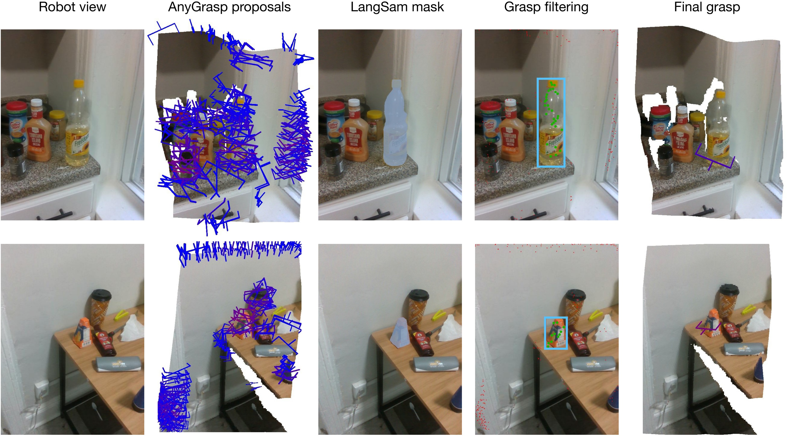
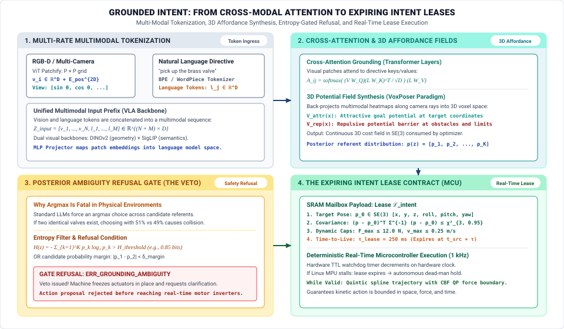
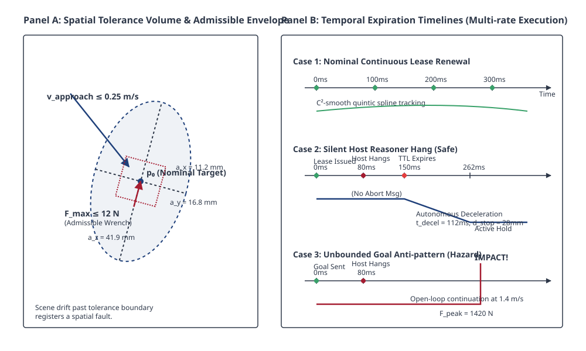
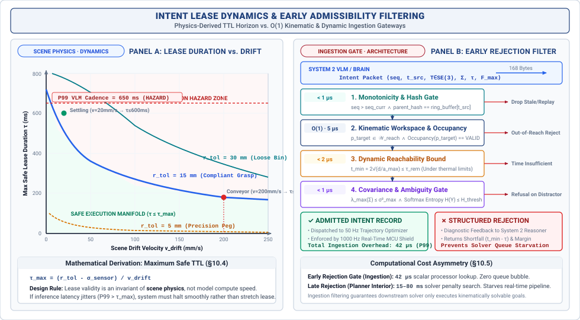

# Grounded Intent {#sec-intent}

::: {.column-margin}

\chapterminitoc


```{=latex}
\vspace{1em}
\mlphysicalstack{100}{20}{20}{20}{20}
```
:::


*What must an autonomous goal carry to prevent a slow reasoning model from driving a machine into a situation that no longer exists?*

Natural human language commands and high-level mission goals are phrased in abstract, ungrounded terms that contain zero information regarding joint torque limits, obstacle clearances, or dynamic reachability. The intent subsystem bridges this semantic gap, translating task-level directives into metric spatial affordances and actionable geometric constraints. However, an intent proposal is never an open-ended authorization to act. Because external environments change dynamically while high-level foundation models operate with high variance and multi-second latency, every intent proposal must be formalized as an expiring geometric lease ($\mathcal{L}_{\text{intent}}$) with explicit spatial bounding boxes and strict time-to-live contracts that fail-safe on silence.



::: {.callout-learning-objectives}
After studying this chapter, you will be able to:

1. State the three bounds every goal must carry and what each one prevents.
2. Set a validity window from the dynamics of the scene rather than from the model's cadence.
3. Filter a goal against reachability before anything plans for it.
4. Explain why an intent that expires on its own is safer than one that is cancelled.

*Core chapter takeaway.* A goal must carry its own expiry and its own admissible envelope. An intent that has to be cancelled by something else is already a hazard, because the thing that would cancel it may be the thing that failed.

:::

## Grounded Affordances {#sec-intent-10-1}

\begin{marginfigure}
\mlphysicalstack{100}{30}{0}{0}{0}
\end{marginfigure}

A high-level reasoning model produces abstract semantic objectives—"pick up the blue vial," "yield to the approaching pedestrian," or "navigate to loading dock four." But electric motors do not understand natural language, and physical actuators cannot track ungrounded adjectives. A brushless DC motor accepts phase voltages, currents, and joint angles; it has no concept of "carefully" or "behind." Between the unconstrained latent space of a multimodal foundation model and the deterministic physics of moving mass lies the problem of **intent**: translating open-ended task directives into metric spatial affordances, geometric clearance envelopes, and dynamic reachability bounds.

This fundamental challenge is the modern robotic manifestation of what Harnad termed the **symbol grounding problem** [@harnad1990symbol]: purely symbolic or linguistic tokens within a computational system have no intrinsic physical meaning unless causally grounded in non-symbolic, sensorimotor interactions with the physical environment. Whereas early natural language understanding systems such as Winograd's SHRDLU [@winograd1972] achieved semantic execution only inside highly simplified, closed-world blocks domains with known analytic geometries, modern physical AI systems must ground open-vocabulary instructions into dynamic, noisy, real-world physical environments.

::: {#dfn-intent-physical-ai-system .callout-definition title="Physical AI system"}

***Physical AI system***\index{Physical AI systems!intent framing} is a computing system that couples learned reasoning models (such as neural networks or large language models) with physical actuators to exert work on the physical environment. Unlike digital AI systems that output text or pixels, physical AI systems output forces, torques, and thermodynamic changes, requiring a strict safety contract between non-deterministic reasoning and deterministic execution.

:::

 An intent proposal is never an open-ended authorization to act. Because external environments change dynamically while high-level reasoning operates with high latency variance ($1\text{--}5\text{ Hz}$), an embodied machine cannot treat a cognitive goal as an infinite-horizon directive. If an articulated arm carrying a payload tracks a semantic objective whose physical coordinates have moved, or if the reasoning pipeline hangs on an out-of-memory stall, kinetic energy continues driving mass into collision unless the intent carries strict internal bounds. These two cadences have been diverging for three decades. @Fig-intent-frequency-gap places them on one axis: the reflex loop has held its kilohertz rate while semantic inference has fallen by three orders of magnitude as models grew, and no scheduling policy closes a gap of that size.

*The systems dilemma.* High-level reasoning pipelines—such as vision-language models, spatial transformers, and neural task planners—operate at human cadence, processing camera streams and performing multimodal token projections at update rates between $1\text{ Hz}$ and $5\text{ Hz}$. Because these models run on complex operating systems (such as Linux) with deep memory hierarchies and GPU coprocessors, their execution latencies exhibit high variance: an inference engine with a nominal $P_{50}$ latency of $120\text{ ms}$ can easily experience $P_{99}$ latency spikes exceeding $500\text{ ms}$ under thermal throttling, PCIe memory bus contention, or thread scheduling jitter. In contrast, the physical machine operates in a continuous mechanical domain governed by rigid-body kinematics, elasticity, and contact dynamics, requiring joint controllers and trajectory generators that execute deterministically at $50\text{ Hz}$ to $500\text{ Hz}$ (with inner torque and current loops running at $1000\text{ Hz}$). Between these two disparate regimes lies the boundary where semantic reasoning translates into physical action.

::: {#fig-intent-frequency-gap fig-env="figure" fig-pos="htb" fig-cap="**The Systems Dilemma**: Operating frequency of low-level control loops against high-level reasoning models from 1990 to 2025. Control holds a flat kilohertz cadence while semantic inference falls into the single-hertz range as models grow, and the widening vertical distance between them is the gap a dual-brain architecture exists to bridge." fig-alt="Log-scale two-line chart from 1990 to 2025 contrasting low-level control loops, which hold a flat kilohertz cadence, against high-level reasoning models, whose operating frequency falls into the single hertz range as model size grows."}

```{python}
#| echo: false
import pandas as pd
import matplotlib.pyplot as plt
from mlsysim import viz

data = pd.read_csv("vol4/intent/data/frequency_gap_trends.csv")

fig, ax, COLORS, plt = viz.setup_plot(figsize=(8, 5))

_groups = list(dict.fromkeys(data["System_Tier"]))
_cmap = plt.get_cmap('viridis', max(len(_groups), 2))
for _i, _g in enumerate(_groups):
    _sub = data[data["System_Tier"] == _g]
    ax.plot(_sub["Year"], _sub["Frequency_Hz"], color=_cmap(_i), label=str(_g), linewidth=2.5, markersize=8)

plt.yscale("log")
plt.ylabel("Operating Frequency (Hz)")
plt.xlabel("Year")
plt.title("The widening frequency gap in Physical AI")

reasoning = data[data["System_Tier"] == "High-Level Reasoning"]
for _, row in reasoning.iterrows():
    if row["Year"] >= 2012:
        offset = -15 if row["Technology"] not in ["YOLOv1", "OpenVLA (7B quantized)"] else 12
        plt.annotate(row["Technology"], (row["Year"], row["Frequency_Hz"]), textcoords="offset points", xytext=(0, offset), ha='center', fontsize=9)

plt.legend(title="Execution Tier", loc="center left")
ax.margins(x=0.14, y=0.14)
plt.tight_layout()
plt.show()
plt.close()
```

:::

To reconcile these timing regimes without compromising physical safety, modern physical AI systems adopt a **dual-brain** hardware architecture (@sec-boundary). As realized in a canonical heterogeneous dual-brain System-on-Chip (SoC) architecture, computation is partitioned across an asymmetric silicon boundary:

1. **The proposer brain (Linux MPU)**: An unprivileged application processor (e.g., a multi-core MPU running Linux) executes the large-scale learned perception models, open-vocabulary grounding backends, and high-level reasoning policies. Operating in an asynchronous, non-deterministic domain, it formulates candidate semantic hypotheses and packages them into structured proposals.
2. **The permission referee (real-time MCU)**: A deterministic microcontroller (e.g., an on-chip ARM Cortex-M or RISC-V core running bare metal or a hard real-time RTOS) executes the safety shield, trajectory interpolation, and motor drive loops. Operating on millisecond hardware deadlines, it validates incoming proposals against invariant barrier certificates [@ames2019control] and hardware timer leases before granting actuation authority.

The data structure that crosses this MPU-to-MCU inter-processor communication (IPC) boundary is the **intent record**: an explicit, strictly typed interface contract that converts high-level objectives into bounded geometric targets that the real-time MCU can safely evaluate, constrain, and track. On an articulated arm holding a $2.0\text{ kg}$ payload, a $400\text{ ms}$ inference stall on the Linux MPU leaves the machine without fresh guidance across twenty consecutive control cycles. If the control architecture treats the high-level goal as an unbounded, open-ended directive, momentum and gravity continue to drive mass whether the target remains physically valid or not.

Open-ended instructions derived from language models, such as "tidy the desk" or "pick up the mug," cannot be passed directly to a physical controller because they omit the spatial, temporal, and mechanical boundaries that define safe execution. A motor controller cannot interpret abstract goals; it accepts setpoints, joint currents, and trajectory polynomials. If an instruction provides only a semantic target without geometric coordinates, velocity limits, and contact thresholds, it functions as an open-ended command with an infinite time horizon.[^fn-std-strips-planning] If a human hand moves the mug while the arm is in flight, the low-level controller has no perception of the change. Without an explicit bounding contract, the arm sweeps through the empty workspace, or drives the gripper into the tabletop at maximum current until an actuator hits its thermal trip point or an optical encoder registers a stall.

When a machine design relies on an external cancellation message to abort an invalid motion, it assumes that the subsystem responsible for detecting failure will remain operational. In physical systems, this assumption fails precisely when safety is most threatened. If an onboard vision pipeline crashes due to an out-of-memory error, if an inference kernel hangs on a direct memory access lock, or if a sensor cable shears, the MPU node that issued the goal becomes unreachable. If the real-time MCU requires an active cancel signal to halt execution, a crash in the reasoning layer leaves the last dispatched goal active indefinitely. The actuators will continue driving mass toward a target that may no longer exist, through space that may no longer be clear. A goal must carry its own expiry, because whatever would have canceled it may be the exact component that failed.

To enforce physical safety across the Dual-Brain boundary, every intent packet emitted by the learned MPU must carry three non-negotiable bounds:

1. **3D spatial tolerance envelope**: An explicit target pose in $SE(3)$ accompanied by a bounded metric tolerance volume (e.g., an oriented covariance ellipsoid), defining both the intended goal pose and the allowable positional dispersion within which the low-level controller is permitted to maneuver and declare goal attainment.
2. **Expiring temporal lease (TTL)**: An explicit time-to-live $\tau$ measured in milliseconds. If an analytical model operating at $4\text{ Hz}$ issues a lease of $300\text{ ms}$, the real-time MCU tracks the target while the lease is fresh; if no renewal packet arrives before the deadline passes, a local hardware countdown timer automatically revokes motion authority and transitions the actuators to a controlled hold.
3. **Admissible command and force envelope**: Explicit dynamic limits that cap the peak velocity ($v_{\max}$), joint acceleration ($a_{\max}$), and contact wrench ($F_{\max}$) the machine may exert while pursuing the target, ensuring that an end-effector cannot apply more than $12\text{ N}$ of normal force to a surface regardless of tracking error.

Establishing these protections requires a systematic interface pipeline between the reasoning layer and the nervous system. The system must resolve unstructured language and image features into unambiguous spatial coordinates, attach strict self-expiring leases to every command, filter candidate goals for kinematic and dynamic reachability before admitting them to the trajectory queue, and enforce a formal intent record schema on the inter-processor communication bus. When every goal carries its own spatial boundary, its own temporal deadline, and its own force ceiling, the physical machine remains stable and bounded even when the learned brain stalls, crashes, or falls silent.

::: {#dfn-intent-expiring-intent-lease .callout-definition title="Expiring intent lease"}

***Expiring intent lease***\index{Expiring intent lease!definition}\index{Intent lease!definition} ($\mathcal{L}_{\text{intent}}$) is a time-bounded contract ($t_{\text{exp}} = t_{\text{src}} + \tau$) issued by an upstream deliberation tier authorizing downstream trajectory execution only within a finite physical duration $\tau$, automatically revoking motion authority upon unrenewed expiration.

1.  **Significance**: In digital software, an interrupted sender simply stalls an I/O pipeline; in physical machines, momentum and gravity continue driving mass whether the high-level planner is alive or frozen. An expiring lease ensures that silence is treated as an active state transition, triggering an autonomous stop at the local microcontroller without needing an external cancel message from a crashed processor.
2.  **Distinction**: Unlike a network keepalive heartbeat that merely monitors link connectivity, an intent lease couples the validity duration directly to workspace drift velocity ($v_{\max}$) and stopping distance dynamics ($d_{\text{stop}}$).
3.  **Common pitfall**: Sizing the lease duration too generously to mask high inference latency percentiles ($P_{99}$). An oversized lease leaves a wide unmonitored window where the machine operates open-loop in an environment that may have changed.

:::

These bounding invariants apply directly across all Three Physical Machine Archetypes:

- **Class 1 (mass-dominated mobility systems):** Autonomous mobile robots (AMRs) and quadruped platforms navigating crowded environments must bind intent with a spatial clearance corridor and a decaying temporal lease. If an obstacle enters the corridor while the high-level planner is stalled, the expiration of the lease forces immediate friction braking before the remaining spatial buffer collapses.
- **Class 2 (contact-dominated manipulation systems):** Articulated industrial arms and multi-fingered grippers executing precision assembly must bind intent with an oriented covariance ellipsoid and a strict normal wrench cap ($F_{\max}$). If an insertion target shifts, the force ceiling prevents the gripper from driving tooling into rigid fixtures past mechanical yield limits.
- **Class 3 (flow-dominated process and energy systems):** Battery energy storage cooling loops and grid power inverters must bind intent with thermal and phase rate limits. If a learned optimizer hangs, the expiring lease automatically reverts coolant pumps and inverter gate drivers to deterministic baseline setpoints before thermal capacitance is exhausted.

::: {#psp-intent-silence-state-transition .callout-perspective title="Silence is a state transition, not an absence"}
In digital software, the absence of network packets leaves state unchanged; in physical AI, silence is an active physical hazard. Every intent lease must be designed such that when upstream communication ceases, the downstream real-time controller autonomously executes a deterministic safe state through local hardware timers without requiring an external cancellation signal.
:::

## What Intent Hands Over {#sec-intent-10-2}

Every intent packet delivered across the architectural boundary must establish a spatial contract before the nervous system accepts it for execution. In physical manipulation, handing a downstream trajectory generator an isolated coordinate is an incomplete instruction. Rooted in Gibson's ecological perception of affordances [@gibson1979ecological], an embodied agent does not perceive the environment merely as inert geometric voxels; it perceives what the environment *affords* for action (e.g., surfaces afford supporting weight, handles afford grasping). Crucially, an affordance is not an isolated 3D coordinate—it is an action-relative relationship between physical geometry, robot kinematics, and contact force limits. The intent record must therefore specify both a target pose in $SE(3)$, comprising a position vector $\mathbf{p} \in \mathbb{R}^3$ and an orientation matrix $\mathbf{R} \in SO(3)$, and an explicit tolerance volume that defines acceptable terminal error. The **3D spatial tolerance envelope** is a bounded metric volume in $SE(3)$ (parameterized by target pose $\mathbf{p}_0 \in \mathbb{R}^3$ and oriented covariance matrix $\mathbf{\Sigma} \in \mathbb{R}^{3 \times 3}$) defining the allowable positional dispersion within which low-level controllers maneuver and declare goal attainment. Without a defined tolerance volume, a controller cannot determine when a motion has succeeded. Consider an articulated arm commanded to align a tactile probe with a contact pad on a circuit board. If the high-level policy specifies a target pose but omits the tolerance volume, the low-level tracking loop attempts to drive Euclidean tracking error to absolute zero. Because sensor noise, link compliance, and kinematic calibration errors prevent exact mathematical convergence, the integrator in the feedback loop winds up, increasing motor currents until an overcurrent protection circuit trips or the probe cracks the substrate. By supplying an explicit tolerance geometry, such as an ellipsoid with semi-axes of $1.5\text{ mm}$ translationally and $0.05\text{ rad}$ rotationally, the intent packet provides the nervous system with a computable termination condition. The local controller can declare the goal reached, damp out residual momentum, and signal the next execution stage.

Spatial validity in the physical world is transient. Because the environment changes continuously, a physical goal must carry an absolute expiration timestamp rather than relying on an asynchronous cancellation message from the reasoning layer. When a vision-language model generates a spatial target from a camera frame captured at $t = 0\text{ ms}$, that coordinate is valid only for the duration of the operational window that justified it. If the inference pipeline operating at $5\text{ Hz}$ on the Linux MPU hangs on a tensor allocation or drops a thread, the physical scene continues to evolve. A human operator reaches into the workcell, or a secondary mechanism shifts the target object by $50\text{ mm}$. If the real-time MCU depends on an active abort command to stop, the silence of a crashed vision process allows the stale goal to persist indefinitely. The local tracking loop continues driving mass toward a coordinate that is no longer unoccupied. Attaching a temporal lease, such as a validity duration of $250\text{ ms}$ for an analytical model evaluated at $4\text{ Hz}$, converts liveness into a local invariant.[^fn-std-iso-watchdog] The MCU evaluates the current hardware clock against the goal expiration timestamp on every $1000\text{ Hz}$ control cycle. If the deadline passes without the receipt of an authenticated renewal packet over the shared SRAM mailbox, the local controller automatically drops the active goal and transitions the actuators into a controlled hold. This property establishes the foundational architectural invariant of **failing safe on silence**: the complete absence of upstream communication passively transitions the physical plant into a deterministic safe state via hardware countdown timers.

A target bounded in space and time remains hazardous if the controller is permitted unlimited physical effort to achieve it. The intent packet must therefore declare an admissible command envelope that caps the peak contact forces, joint velocities, and actuator power that the planner may utilize during execution. When a model computes a target pose that lies slightly beneath a physical surface due to stereo disparity error, an unconstrained position controller treats the discrepancy as tracking error and commands maximum restoring torque. In a tactile search task where a multi-jointed finger slides across an unknown object, unconstrained execution generates excessive normal forces that can bend linkages or shear tactile skins. By embedding explicit dynamic limits in the goal record, such as a maximum normal contact force of $6.0\text{ N}$, a linear velocity cap of $0.10\text{ m/s}$, and a joint power limit of $25\text{ W}$, the high-level policy sets the physical budget for the action. The low-level **impedance controller**\index{Impedance controller}[^fn-ctrl-impedance] projects these bounds directly into its torque saturation limits, ensuring that mechanical interactions remain compliant regardless of visual estimation errors.

When any of these three bounds is omitted, an intermittent communication dropout or perception stall degrades the control system into an open-loop runaway hazard. Consider an analytical example of a mobile manipulator moving at $1.2\text{ m/s}$ toward an unbounded target pose located $3.0\text{ m}$ ahead. At an operating speed of $1.2\text{ m/s}$, the base covers $120\text{ mm}$ every $100\text{ ms}$. If an Ethernet link drops packets or an inference accelerator stalls for $400\text{ ms}$, an unbounded goal leaves the motor drives executing the last received velocity profile, carrying the machine through $480\text{ mm}$ of unmonitored displacement. If an obstacle enters the corridor during that interval, a collision occurs before the host software can re-establish communication. With a bounded intent packet carrying a $150\text{ ms}$ expiration lease and a commanded deceleration bound of $3.0\text{ m/s}^2$, the failure sequence proceeds differently. The communication loss at $t = 0\text{ ms}$ allows the machine to proceed for at most $150\text{ ms}$, covering $180\text{ mm}$, at which point the MCU detects lease expiration. The local reflex immediately commands maximum deceleration, bringing the kinetic energy of the machine to zero in an additional $400\text{ ms}$ and $240\text{ mm}$ of stopping distance. Total unguided travel is strictly capped at $420\text{ mm}$, preventing kinetic runaway without requiring assistance from the failed upstream node.

::: {#nbk-intent-lease-duration-collision-exposure-tradeoff-across .callout-notebook title="Lease duration vs. collision exposure tradeoff across the three archetypes"}
To understand how an expiring intent lease ($\mathcal{L}_{\text{intent}}$) bounds physical risk across diverse machines, consider the physical consequences of an unserviced $200\text{ ms}$ upstream compute stall ($\Delta t = 0.200\text{ s}$) when comparing an unbounded goal ($t_{\text{exp}} = \infty$) against a physics-derived lease ($\tau \le \frac{r_{\text{tol}} - \sigma_{\text{sensor}}}{v_{\text{drift}}}$):

1. **Class 1 (mass-dominated mobility system):** A $150\text{ kg}$ autonomous mobile robot (AMR) navigates a shared factory aisle at cruising velocity $v = 1.5\text{ m/s}$ with maximum friction braking $a_{\max} = 3.0\text{ m/s}^2$. The task tolerance radius is $r_{\text{tol}} = 30\text{ mm}$, sensor noise is $\sigma_{\text{sensor}} = 6\text{ mm}$, and dynamic obstacle drift velocity is $v_{\text{drift}} = 0.40\text{ m/s}$.
   - *Safe Lease Duration:* $\tau = \frac{30\text{ mm} - 6\text{ mm}}{400\text{ mm/s}} = 0.060\text{ s} = 60\text{ ms}$.
   - *Bounded vs. Unbounded Stopping Envelope:* Under a $60\text{ ms}$ expiring lease, the chassis travels $d_{\text{react}} = v \tau = (1.5\text{ m/s})(0.060\text{ s}) = 0.090\text{ m} = 90\text{ mm}$ before the hardware timer triggers maximum deceleration, bringing the robot to rest in $d_{\text{brake}} = \frac{v^2}{2 a_{\max}} = \frac{(1.5)^2}{2(3.0)} = 0.375\text{ m} = 375\text{ mm}$ (total stopping distance $d_{\text{stop}} = 465\text{ mm}$). Under an unbounded $200\text{ ms}$ stall, unguided travel expands to $d_{\text{react}} = (1.5)(0.200) = 0.300\text{ m}$, increasing total stopping distance to $675\text{ mm}$—an unmonitored spatial overrun of $210\text{ mm}$ that breaches pedestrian separation corridors.
2. **Class 2 (contact-dominated manipulation system):** A 7-DoF manipulator tooling tip approaches a rigid aluminum assembly fixture ($k = 4.0 \times 10^5\text{ N/m}$) at approach velocity $v = 0.30\text{ m/s}$.
   - *Rate of Force Rise:* $\frac{dF}{dt} = k v = (4.0 \times 10^5\text{ N/m})(0.30\text{ m/s}) = 1.2 \times 10^5\text{ N/s} = 120\text{ N/ms}$.
   - *Bounded vs. Unbounded Contact Force:* If the intent record specifies a $40\text{ ms}$ lease with a wrench ceiling $F_{\max} = 15\text{ N}$, the local current loop clamps torque within $2\text{ ms}$ of contact, bounding peak force to $F_{\text{peak}} \le 18\text{ N}$. Under an unbounded goal during a $200\text{ ms}$ inference stall, unbraked motion generates an uncorrected penetration of $\Delta x = v \Delta t = (0.30\text{ m/s})(0.200\text{ s}) = 0.060\text{ m} = 60\text{ mm}$, driving theoretical contact force to $F = k \Delta x = 24{,}000\text{ N}$—shattering the **harmonic drive**\index{Harmonic drive} gear teeth and buckling the wrist link.
3. **Class 3 (flow-dominated process and energy system):** A containerized battery energy storage system (BESS) liquid cooling loop with lumped thermal capacitance $C_{\text{th}} = 900\text{ J/K}$ dissipates heat from cells generating $P_{\text{in}} = 3600\text{ W}$ during rapid megawatt-level charging.
   - *Thermal Runaway Rate:* With coolant valve closed ($P_{\text{out}} = 0\text{ W}$), $\frac{dT}{dt} = \frac{P_{\text{in}}}{C_{\text{th}}} = \frac{3600\text{ W}}{900\text{ J/K}} = 4.0\text{ K/s}$.
   - *Safe Lease Duration:* If the cell chemistry permits a maximum temperature overshoot of $\Delta T_{\max} = 2.0\text{ K}$ before cell degradation accelerates, the maximum allowable pump valve command lease is $\tau = \frac{\Delta T_{\max}}{dT/dt} = \frac{2.0\text{ K}}{4.0\text{ K/s}} = 0.500\text{ s} = 500\text{ ms}$. If an ungrounded thermal optimization policy stalls for $10.0\text{ s}$, the temperature rises by $\Delta T = (4.0\text{ K/s})(10.0\text{ s}) = 40.0\text{ K}$, triggering irreversible **thermal runaway**\index{Thermal runaway} and flammable electrolyte venting.
:::

These three bounds formalize the division of authority between high-level reasoning and low-level reflexes, echoing the hierarchical decomposition of the **subsumption architecture**\index{Subsumption architecture}[^fn-ai-subsumption] [@brooks1986robust]. High-level reasoning on the Linux MPU operates over unstructured data, long time horizons, and semantic abstractions. It possesses the contextual breadth required to define **what is permissible**, establishing which spatial volume contains the target, what time window makes the action valid, and what maximum forces are safe for the surrounding environment. Low-level reflexes on the real-time MCU operate deterministically on millisecond deadlines, measuring joint encoders and strain gauges. Reflexes possess the high-frequency state feedback required to enforce **how execution occurs**, synthesizing smooth trajectories, resolving kinematic redundancies, managing actuator thermal budgets, and executing immediate stops upon lease expiry. High-level models never issue raw torque or voltage commands to the motors, because an unverified neural network cannot guarantee real-time stability. Low-level controllers never generate autonomous goals, because a feedback loop lacks semantic context. The bounded intent record serves as the strictly typed contract between them, ensuring that high-level intelligence governs the envelope of operation while low-level determinism guarantees physical containment. As illustrated on a physical 7-DoF manipulator executing everyday manipulation tasks in @fig-10-real-grounded-affordance-franka, high-level intent translates language goals into grounded 3D affordance and constraint value maps that govern the end-effector's spatial target envelopes across sequential execution phases. Low-level tracking loops then consume these spatial objective manifolds to synthesize collision-free paths within granted time slices.

::: {#fig-10-real-grounded-affordance-franka fig-env="figure" fig-pos="t" fig-cap="**Real-Robot 3D Affordance Grounding and Value-Map Trajectory Execution**: A 7-DoF torque-controlled manipulator executing open-vocabulary tasks from composed 3D spatial value maps [@huang2023voxposer]. A language model translates a semantic goal into voxelized affordance and constraint costmaps sited in the robot's own workspace, so the geometry rather than the instruction is what bounds kinetic authority, and no task-specific reinforcement training is needed to obtain that bound. (Source: Huang et al., 2023 [@huang2023voxposer], CC BY 4.0)." fig-alt="Real-Robot 3D Affordance Grounding and Value-Map Trajectory Execution. A canonical 7-DoF torque-controlled manipulator executing diverse open-vocabulary manipulation tasks guided by composed 3D spatial value maps in real-world lab environments [@huang2023voxposer]. Across everyday language instructions—including sweeping paper trash into a dustpan, closing cabinet drawers, turning on lamps, opening capped vitamin bottles, and multi-stage pick-and-place sequences—an upstream vision-language model translates semantic goals into 3D voxelized affordance and constraint costmaps directly in the robot's physical workspace. The low-level trajectory generator and impedance controller evaluate these 3D spatial bounds to synthesize collision-free setpoint paths across sequential time intervals (t=1, 2, dots), bounding the robot's kinetic authority within task-specific geometric envelopes without requiring task-specific reinforcement training. (Source: Huang et al., 2023 [@huang2023voxposer], CC BY 4.0)."}
{width="95%"}
:::

Grounding an intent packet into these three bounds requires a formal transformation from ambiguous sensory inputs into structured, verifiable proposals. When a system processes a high-level directive or a sequence of visual tokens, the initial proposal is rarely a single, unambiguous set of coordinates. It begins as an uncertain geometric hypothesis that must carry its own spatial ambiguity and its own temporal limits before it can be admitted to the execution pipeline.

## From Request to Expiring Geometric Proposal {#sec-intent-10-3}

A natural language instruction becomes physically dangerous at the moment an unverified semantic hypothesis acquires authority over motion. When an operator or high-level supervisor issues a semantic directive such as "grasp the brass valve," an onboard vision-language model parses the character stream, projects image features into a shared embedding space, and selects a candidate visual bounding region. From those pixels, the network extracts an estimated pose in $SE(3)$ and writes coordinate values into a memory buffer. At that exact boundary, an ungrounded string of tokens becomes a physical destination that commands mass, velocity, and actuator currents.[^fn-math-symbol-grounding] If the visual backbone associates the language token with an adjacent fixture or an unlabelled calibration target, the resulting coordinate vector $\mathbf{p} \in \mathbb{R}^3$ enters the trajectory pipeline as an authoritative physical goal. Because a low-level motor drive measures only encoder pulses, winding temperatures, and phase currents, it cannot evaluate whether the coordinate it tracks corresponds to the intended component or to an empty tabletop.[^fn-math-vlm-lipschitz] The grounding process must therefore produce an explicit geometric proposal that packages its own spatial uncertainty, its selection evidence, and its temporal expiration before any motion planner accepts it.

To understand how open-vocabulary language directives translate into actionable geometric targets, modern physical AI systems rely on three foundational grounding paradigms:

1. **Affordance-grounded skill selection (SayCan)**: Pioneered by Ahn et al. [@ahn2022saycan], SayCan grounds large language model reasoning in physical feasibility. It does this by combining the language model's semantic belief that an action makes logical sense with a physical model's belief that the action is actually possible in the current scene (for the rigorous probabilistic formulation, see @sec-appendix-ml). If a large language model (LLM) proposes "pick up the sponge" when the sponge is trapped inside a closed drawer, the physical affordance probability drops to zero. This prevents the system from dispatching an impossible action and compels the reasoner to select an intermediate pre-condition skill ("open the drawer").
2. **3D value-map affordance fields (VoxPoser)**: Rather than selecting from discrete, pretrained skill policies, VoxPoser [@huang2023voxposer][^fn-ai-voxposer] leverages vision-language models and LLM-generated Python code to synthesize continuous 3D spatial affordance and constraint value maps directly in the robot's physical workspace. By querying 2D visual grounding backends (e.g., OWL-ViT, SAM, Grounding DINO) across multi-view RGB-D streams, the system back-projects visual activations into a 3D voxel grid $\mathcal{V} \subset \mathbb{R}^3$. The LLM writes code that computes 3D potential fields: an **attraction value map** $\mathbf{V}_{\text{attr}}(\mathbf{x})$ that pulls the end-effector toward target contact affordances (e.g., grasping handles or rim geometries), and a **repulsion constraint map** $\mathbf{V}_{\text{rep}}(\mathbf{x})$ that penalizes trajectories passing near obstacles. A downstream **model-predictive controller (MPC)**\index{Model-predictive controller}[^fn-ctrl-mpc] or trajectory optimizer then computes dynamic paths directly over this composed 3D cost manifold without requiring task-specific reinforcement training.
3. **Language model programs for embodied control (Code as Policies)**: Introduced by Liang et al. [@liang2023code][^fn-ai-code-as-policies], Code as Policies (CaP) prompts large language models to generate executable Python programs that compose perception APIs, geometric coordinate transformations, and parameterized motion primitives. Instead of outputting single static setpoints, the LLM writes algorithmic control structures containing spatial arithmetic, conditional branching (`if is_grasped(): ...`), and reactive loops that query real-time sensor feedback.

Formally, **open-vocabulary affordance grounding** is the computational process of projecting unconstrained natural language instructions and multimodal sensor streams into verified 3D spatial target manifolds and interaction affordance fields (such as SayCan feasibility factors, VoxPoser value maps, or Code as Policies primitives), parameterized with physical SI units and coordinate frame attachments.

Across all three paradigms, transforming raw visual observations and language tokens into executable intent records requires a multi-stage perceptual filtering pipeline, as demonstrated on the physical manipulation platform in @fig-10-real-open-vocab-grounding. The system must transition from raw visual observations to dense candidate grasps (via geometric grasp generators like AnyGrasp), isolate the semantic referent through language-conditioned instance segmentation masks (e.g., Lang-SAM[^fn-vis-lang-sam] combining Grounding DINO with Segment Anything), prune ungrounded proposals outside the segmented geometric envelope, and extract an oriented $SE(3)$ target pose with defined spatial tolerance bounds.

::: {#fig-10-real-open-vocab-grounding fig-env="figure" fig-pos="t" fig-cap="**Real-World Open-Vocabulary Language Grounding and Geometric Grasp Proposal Pipeline**: An open-vocabulary instruction narrowed to one executable grasp through dense candidate generation, language-conditioned segmentation, and mask filtering [@liu2024okrobot]. Grasps are proposed before the language is consulted, which is what keeps the pipeline geometric: the instruction selects among physically valid candidates rather than producing a pose of its own, and what reaches the motion planner carries explicit tolerance bounds and an expiration lease." fig-alt="Real-World Open-Vocabulary Language Grounding and Geometric Grasp Proposal Pipeline. On a physical robotic manipulation workstation, open-vocabulary semantic instructions are grounded into executable spatial targets through a multi-stage perceptual filtering pipeline [@liu2024okrobot]. (a) Robot point-of-view RGB camera observation of a cluttered tabletop workspace containing everyday tools and objects. (b) Dense geometric grasp generation proposing unconditioned candidate 6D end-effector poses across the scene using AnyGrasp. (c) Language-conditioned instance segmentation using Lang-SAM (combining Grounding DINO with Segment Anything) to isolate the target object mask from an open-vocabulary query. (d) Bounding mask spatial filtering, pruning all grasp candidates located outside the segmented geometric envelope. (e) Final selected grasp pose with 3D orientation frame (SE(3) target) handed over to the motion planner with explicit spatial tolerance bounds and an expiration lease."}
{width="95%"}
:::

### Direct coordinate tokenization and metric unprojection

In direct spatial token heads and end-to-end Vision-Language-Action (VLA) backbones—such as RT-1 [@brohan2023rt1], RT-2 [@brohan2023rt2], PaLM-E [@driess2023palme], OpenVLA, and PaliGemma—continuous 3D target coordinates are mapped directly into the model's discrete language vocabulary. Rather than outputting unconstrained floating-point vectors, the model discretizes each spatial axis into a fixed number of uniform bins (typically $B = 1000$ bins, represented as special tokens `<loc000>` through `<loc999>`).

When prompted with a physical directive such as `"pick up the red mug"`, the model outputs a sequence of discrete coordinate tokens designating the target grasping centroid:
$$\text{Tokens} = [\langle\text{loc350}\rangle, \langle\text{loc420}\rangle, \langle\text{loc180}\rangle]$$
corresponding to normalized spatial coordinates $[\tilde{u}, \tilde{v}, \tilde{z}] = [0.350, 0.420, 0.180] \in [0, 1]^3$.

To convert these dimensionless tokens into an executable intent record, the nervous system unprojects them through calibrated optical intrinsics and platform extrinsics, mapping the normalized coordinates back to physical Cartesian space.[^fn-math-unprojection-intent]

Crucially, bin discretization introduces an irreducible spatial quantization uncertainty. For a workspace dimension of width $1.0\text{ m}$ divided into $1000$ bins, the quantization error contributes to the total variance, which compounds with depth sensor noise. The intent generation front-end must synthesize this combined variance into the oriented spatial covariance matrix $\boldsymbol{\Sigma}_p$ before handing the intent lease $\mathcal{L}_{\text{intent}}$ over to the real-time execution core.

To prevent an unverified neural network output from masquerading as a deterministic setpoint, the grounded proposal must satisfy a formal interface contract. The proposal cannot consist solely of an isolated Cartesian pose. It must carry the referent identity, the perceptual evidence that selected it, a spatial tolerance volume, and an expiration lease. The referent identity specifies the semantic class and instance identifier assigned by the upstream model. The selection evidence records the bounding box coordinates, cross-attention weights, and posterior class probabilities that justified the match. The spatial tolerance volume, parameterized by an oriented covariance ellipsoid, defines the physical region within which the referent is estimated to lie. The expiration lease establishes an absolute deadline after which the target coordinate is automatically discarded. In a physical workcell, an object can shift, roll, or be occluded milliseconds after a camera frame is exposed. A target coordinate detached from its perceptual evidence and its expiration lease becomes an open-loop hazard, directing mechanical power toward coordinates that no longer contain the target.

When a vision-language model processes an ambiguous request in an environment containing multiple candidate objects, its mathematical objective encourages it to output an argmax prediction. In digital applications, choosing the top-ranked candidate when two options exhibit near-equal probabilities of $0.51$ and $0.49$ produces a harmless user-interface recommendation. In a physical machine, breaking an evidential tie silently produces an arbitrary trajectory. If two identical mechanical components sit on an assembly bench separated by $180\text{ mm}$, an ungrounded model that guesses between them commits the manipulator to a ballistic approach trajectory that passes through the clearance volume of the adjacent part. Ambiguity must therefore be treated as an explicit, first-class output state. When the posterior entropy across candidate referents (a mathematical measure of the model's uncertainty, detailed in @sec-appendix-ml) exceeds an admissibility threshold, or when the top two candidate probabilities are nearly tied, or when the spatial tolerance volumes of competing hypotheses overlap in $SE(3)$, the required system behavior is an explicit **grounding refusal** (`ERR_GROUNDING_AMBIGUITY`) rather than an optimistic guess. The grounding layer rejects the command, signals an unresolved reference to the supervisor, and holds the actuators in a safe state until an unambiguous directive or an active disambiguation scan resolves the distribution.

Formally, **open-vocabulary grounding ambiguity** is the condition where multimodal feature projections yield multi-peak posterior distributions, overlapping geometric hypotheses, or unresolvable evidential ties across candidate physical referents ($H(\mathbf{z}) > H_{\text{thresh}}$), requiring an explicit grounding refusal (`ERR_GROUNDING_AMBIGUITY`) rather than optimistic argmax tie-breaking.

::: {#psp-intent-ambiguity-refusal .callout-perspective title="Ambiguity demands refusal, never argmax guessing"}
In digital web applications, breaking an evidential tie between two items via argmax is harmless; in physical AI, breaking a tie between two spatial coordinates commands kinetic energy through the clearance volume of an unselected object. When posterior entropy exceeds threshold, the only safe physical action is an explicit grounding refusal (`ERR_GROUNDING_AMBIGUITY`).
:::

::: {#ws-intent-autort-hallucination-constitution .callout-war-story title="VLA spatial hallucination and the Robot Constitution (2024)"}
**Context**: Google's AutoRT project deployed a fleet of mobile manipulators running large Vision-Language-Action (VLA) models and Visual Language Models (VLMs) across unstructured office environments [@ahn2023autort].

**Mechanism**: Large VLA models natively lack an understanding of physical limits, joint kinematics, or geometric clearance bounds. Because their core foundation is internet text and 2D images, they frequently hallucinated physically impossible intent proposals—such as attempting to grasp a reflection in a mirror, or outputting spatial coordinate tokens that wildly exceeded the robot's physical reach envelope.

**Impact**: Executing hallucinated target coordinates blindly translated into unconstrained, aggressive physical arm swings that collided with the environment, shattered objects, or struck the robot's own chassis.

**Response**: Engineers had to insert an explicit semantic and geometric supervisor called the "Robot Constitution"—a combination of an LLM-based rule monitor and a deterministic kinematic envelope checker—that vetoed unsafe intent proposals *before* they reached the trajectory planner. As a final safety backstop, human supervisors held physical kill switches.

**Systems lesson**: A VLA model predicting spatial coordinate tokens is not a physics engine; it is a statistical interpolator that cannot guarantee geometric feasibility or physical safety. An architecture that pipes raw VLA target tokens directly to a physical motion planner without a deterministic kinematic bounding layer and ambiguity-refusal tripwires is fundamentally unsafe.
:::

The complete computational pipeline from multimodal patch tokenization to the entropy-gated expiring intent lease is mapped in @fig-10-vla-cross-attention-intent-lease.

::: {#fig-10-vla-cross-attention-intent-lease fig-env="figure" fig-pos="t" fig-cap="**Grounded Intent Architecture from Multimodal Cross-Attention to the Expiring Intent Lease**: Multimodal tokens are aligned by cross-attention into 3D affordance and repulsion fields [@huang2023voxposer], filtered by an ambiguity gate, and emitted as an expiring lease across the application-processor to microcontroller boundary. The refusal gate is the load-bearing stage, because it forbids an open-loop $\operatorname{argmax}$ guess when posterior entropy is high and halts actuators instead, and the lease is what stops a verified proposal from outliving the scene it was grounded in." fig-alt="Grounded Intent Architecture: From Multimodal Cross-Attention to the Expiring Intent Lease. (1) Multimodal tokenization. (2) Cross-attention reasoning and 3D affordance synthesis. (3) Ambiguity refusal gate. (4) Expiring intent lease contract."}
{width="100%"}
:::

Consider an analytical example where an articulated manipulator receives an instruction to align its gripper with a target component located at a nominal standoff distance of $1.20\text{ m}$ along the camera optical axis. The vision-language model extracts a nominal target pose $\mathbf{p}_0 = [0.450, -0.120, 0.220]^T\text{ m}$ relative to the robot base frame, accompanied by an empirical localization covariance matrix $\mathbf{\Sigma} \in \mathbb{R}^{3 \times 3}$. Due to the geometric disparity between sensor pixel resolution in the focal plane and range uncertainty along the line of sight, the diagonal elements of the covariance matrix in the principal sensor frame are $\sigma_x^2 = (4.0\text{ mm})^2$, $\sigma_y^2 = (6.0\text{ mm})^2$, and $\sigma_z^2 = (15.0\text{ mm})^2$. For a three-dimensional Gaussian hypothesis, the $95\%$ confidence region is bounded by the tolerance ellipsoid $(\mathbf{p} - \mathbf{p}_0)^T \mathbf{\Sigma}^{-1} (\mathbf{p} - \mathbf{p}_0) \le \chi^2_{3, 0.95}$, where the critical value from the chi-square distribution is $\chi^2_{3, 0.95} \approx 7.815$. @Fig-10-intent-lease-envelope (Panel A) evaluates the principal semi-axes, yielding $a_x = \sqrt{7.815} \times 4.0\text{ mm} \approx 11.2\text{ mm}$, $a_y = \sqrt{7.815} \times 6.0\text{ mm} \approx 16.8\text{ mm}$, and $a_z = \sqrt{7.815} \times 15.0\text{ mm} \approx 41.9\text{ mm}$, bounding a spatial tolerance volume of $V = \frac{4}{3} \pi a_x a_y a_z \approx 3.30 \times 10^{-5}\text{ m}^3$, or $33.0\text{ cm}^3$. If the physical gripper mechanism allows a maximum mechanical positioning error of $12.0\text{ mm}$ along the approach axis, the unconstrained spatial uncertainty along the depth axis ($41.9\text{ mm}$) exceeds the physical capture envelope. A downstream planner receiving only the nominal point $\mathbf{p}_0$ attempts a precision grasp and collides with the component edges; a planner receiving the oriented ellipsoid can either align its approach vector with the narrow $11.2\text{ mm}$ axis or reject the proposal as ungrounded.

::: {#fig-10-intent-lease-envelope fig-env="figure" fig-pos="t" fig-cap="**The Intent Lease Contract, Spatial Tolerance Volume and Temporal Expiration Timelines**: The lease's spatial half is a covariance ellipsoid around the target pose with bounded approach velocity and wrench; its temporal half is a hardware time-to-live. Panel B shows why the temporal half matters. When the host reasoner hangs silently at $80\text{ ms}$, the timer expires at $150\text{ ms}$ and the local controller decelerates to a hold on its own, so safety does not depend on an upstream abort message ever arriving." fig-alt="The Intent Lease Contract: Spatial Tolerance Volume and Temporal Expiration Timelines. (Panel A) 3D spatial grounding geometry showing nominal target pose p0 in R^3, the oriented localization covariance ellipsoid with principal semi-axes (ax=11.2 mm, ay=16.8 mm, az=41.9 mm), the approach velocity vector (v_approach <= 0.25 m/s), and the admissible wrench envelope (F_max <= 12 N). When physical scene drift displaces the object past the tolerance boundary, a spatial fault is registered. (Panel B) Multi-rate execution timelines contrasting: (Case 1) nominal continuous lease renewal stream maintaining C^2-smooth quintic spline tracking; (Case 2) silent host reasoner hang at t=80 ms, where the hardware TTL timer expires at t_exp=150 ms and triggers autonomous local controlled deceleration (t_decel=112 ms, d_stop=28 mm) to an active hold without requiring an upstream abort message; and (Case 3) an unbounded infinite-horizon goal anti-pattern that drives unmonitored mass into an open-loop impact at 1.4 m/s (F_peak=1420 N)."}
{width="100%"}
:::

A noisy detection with a large covariance volume is easily flagged and rejected by spatial filters. The failure that defeats downstream safety systems is a confident grounding to the wrong physical entity. If a vision-language model evaluates an image containing an exposed glass beaker adjacent to a machined steel housing and assigns a $99.2\%$ confidence score to the glass beaker when instructed to "secure the housing," the model emits a sharp, low-variance geometric proposal centered on the glass. The trajectory planner receives the coordinate, computes an inverse kinematics solution, verifies joint limits, and confirms that the path clears all obstacles in the static environment map. The low-level safety enforcer evaluates the trajectory against dynamic velocity caps and finds every acceleration within admissible boundaries. Because the motion is kinematically smooth and geometrically valid, the machine executes the trajectory without a single software exception, driving the end effector into the glass with the full clamping force intended for steel.

This failure reveals the boundary between what a downstream safety enforcer can verify and what it must accept as an unvalidated premise. A deterministic safety enforcer checks coordinate bounds, kinematic reachability, joint torque limits, and geometric collisions against known occupancy grids. It can never determine whether a coordinate corresponds to the intended semantic object. Semantic classification depends on high-dimensional feature representations that cannot be formally verified against real-time safety invariants. The mechanics of multimodal feature extraction, cross-attention alignment, and open-vocabulary phrase grounding belong to the computer vision and language literature [@kamath2021mdetr; @gu2022open; @radford2021learning; @liu2023grounding]. A physical AI architecture consumes these models without relying on their internal activations for safety. The responsibility of the systems engineering contract is to govern the boundary where these models meet the physical machine, ensuring that every semantic hypothesis is bounded by an explicit tolerance volume, gated by a grounding refusal on ambiguity, and constrained by a strict temporal lease before it ever acquires the authority to move.

To evaluate how different open-vocabulary perceptual frontends interface with deterministic systems contracts, @tbl-10-grounding-paradigms compares the dominant architectural categories of language grounding against their geometric output representations, nominal localization uncertainties, compute latency budgets, and deterministic verification readiness.

| Grounding Architecture & Paradigm                                                      | Geometric Output Representation                                                                            | Nominal Localization Uncertainty ($\sigma_{xyz}$)                                                      | Compute Latency & Memory Envelope                                                   | Deterministic Verification Readiness                                                                           | Primary Systems Failure Signature & Hardware Fallback Reflex                                                                                                                                |
|:---------------------------------------------------------------------------------------|:-----------------------------------------------------------------------------------------------------------|:-------------------------------------------------------------------------------------------------------|:------------------------------------------------------------------------------------|:---------------------------------------------------------------------------------------------------------------|:--------------------------------------------------------------------------------------------------------------------------------------------------------------------------------------------|
| **2D Bounding Boxes** (e.g., GLIP, Grounding DINO, MDETR)                              | Planar box $[u_{\min}, v_{\min}, u_{\max}, v_{\max}] \subset \mathbb{R}^2$ with depth plane backprojection | $\sigma_{xy} \approx 5\text{--}15\text{ mm}$, $\sigma_z \approx 25\text{--}60\text{ mm}$ (depth noise) | Latency: $80\text{--}250\text{ ms}$; VRAM: $1.8\text{--}4.2\text{ GB}$ (FP16)       | **High:** Bounding box frustum yields convex hull; depth discontinuity filters detect background bleed         | Over-inclusive box encloses adjacent fixture $\rightarrow$ Triggers spatial tolerance covariance expansion refusal ($\lambda_{\max}(\mathbf{\Sigma}) > \sigma_{\text{admit}}^2$)            |
| **Dense Semantic Segmentation** (e.g., Grounded-SAM, CLIPSeg, Lang-SAM)                | Pixel binary mask $\mathcal{M} \subset \mathbb{Z}^2$ with surface normal point cloud extraction            | $\sigma_{xy} \approx 2\text{--}8\text{ mm}$, $\sigma_z \approx 5\text{--}18\text{ mm}$ (surface mesh)  | Latency: $200\text{--}650\text{ ms}$; VRAM: $3.5\text{--}7.5\text{ GB}$ (FP16)      | **High:** Exact boundary contour allows 3D contact mesh fitting and point-cloud occupancy verification         | Mask bleeds across thin contact boundaries $\rightarrow$ Triggers multi-hypothesis contour entropy abort ($H(\mathbf{z}) > H_{\text{thresh}}$)                                              |
| **3D Neural Fields & VLM Point Clouds** (e.g., LERF, ConceptFusion, 3D-LLM, OpenShape) | Continuous 3D feature field $\phi(\mathbf{p}) \in \mathbb{R}^d$ or oriented 3D bounding box $\in SE(3)$    | $\sigma_{xy} \approx 8\text{--}20\text{ mm}$, $\sigma_z \approx 10\text{--}25\text{ mm}$ (voxel grid)  | Latency: $400\text{--}1800\text{ ms}$; VRAM: $6.0\text{--}16.0\text{ GB}$ (FP16)    | **Moderate:** Ray-marching density thresholding admits local geometric minima and spatial drift                | Feature field local minimum generates phantom free-space target $\rightarrow$ Cross-validation against raw 3D ToF point cloud fails                                                         |
| **Direct Spatial Token Heads & VLAs** (e.g., RT-2, PaLM-E, Octo, OpenVLA)              | Discretized Cartesian coordinate bins $\mathbf{p}_{\text{bin}} \in \mathbb{Z}^3$ or direct action tokens   | $\sigma_{xyz} \approx 20\text{--}50\text{ mm}$ (bin quantization discretization error)                 | Latency: $150\text{--}500\text{ ms}$; VRAM: $8.0\text{--}28.0\text{ GB}$ (FP8/FP16) | **Low:** Lacks geometric bounding volume; token logits exhibit non-Lipschitz spatial jumps near decision seams | Out-of-distribution visual artifact triggers discontinuous coordinate jump $\rightarrow$ Rejected at intent ingestion filter by kinematic workspace check ($\mathbf{p} \notin \mathcal{W}$) |

: **Open-Vocabulary Grounding Model Categories vs. Spatial Precision and Verification Readiness**: Comparison of language-to-geometry perception paradigms across spatial output representations, typical 3D localization uncertainty bounds ($\sigma_{xyz}$), computational resource envelopes, deterministic safety verifiability, and systems-level failure mitigations. Hardware systems cannot verify internal model activations, requiring geometric bounding contracts to govern the interface between learned vision-language frontends and deterministic motion planners. {#tbl-10-grounding-paradigms tbl-colwidths="[18,20,16,14,14,18]"}

## Goals That Expire {#sec-intent-10-4}

An intent must die on its own, because whatever would have cancelled it may be the thing that failed. In distributed computing architectures, a coordinator cancels obsolete jobs by transmitting explicit abort signals across an interconnect. In a physical machine, relying on explicit cancellation introduces an asymmetric safety vulnerability. An abort command requires an intact communications bus, an uncorrupted scheduler, and a sender process that remains sufficiently functional to recognize its own failure. When a learned vision-language model crashes, deadlocks on a memory allocation, or hangs inside a graphics driver, no cancellation packet is ever assembled or dispatched. If the motion planner treats an active goal as valid until explicitly revoked, the actuator continues executing open-loop physical actions toward a stale or invalid target while the supervising software is dead. Granting intent through a self-expiring **temporal lease** inverts this failure mode. Originally formulated by @gray1989leases for distributed cache consistency, the lease primitive guarantees safety under communication partitions and node crashes by granting a bounded time contract that expires passively on silence. In physical AI, adapting this distributed lease mechanism ensures that if an upstream vision-language model stalls, crashes, or falls silent, the physical actuators automatically revoke tracking authority without requiring cooperation from the failed software component.[^fn-hw-watchdog-rtt]

The duration of a temporal lease cannot be arbitrary. It must be derived mathematically from the rate at which the physical environment diverges from the model's perception of it. Consider an object moving or settling in the physical workspace with a maximum drift velocity $v_{\text{drift}}$ relative to the world frame. Let $r_{\text{tol}}$ denote the spatial tolerance radius of the task, defined as the maximum positional error between the end effector and the target that still permits successful execution without collision. At the moment of perception, the sensor pipeline introduces measurement noise with an upper error bound $\sigma_{\text{sensor}}$. Over an elapsed duration $t$, the object can displace by at most $v_{\text{drift}} t$, causing the total worst-case spatial error to grow according to $\sigma_{\text{sensor}} + v_{\text{drift}} t$. For the goal to remain geometrically valid throughout its execution window, this total error must not exceed the allowable tolerance radius. Setting the worst-case error equal to $r_{\text{tol}}$ establishes the maximum safe lease duration,
$$\tau \le \frac{r_{\text{tol}} - \sigma_{\text{sensor}}}{v_{\text{drift}}}$$
When sensor noise meets or exceeds the tolerance radius ($r_{\text{tol}} \le \sigma_{\text{sensor}}$), the spatial uncertainty of perception exhausts the entire error budget immediately, yielding $\tau \le 0\text{ s}$ and requiring the system to reject the goal without moving.

In an analytical example of an articulated manipulator picking components from a moving conveyor, let the belt move with a drift velocity of $v_{\text{drift}} = 0.20\text{ m/s}$ ($200\text{ mm/s}$). The mechanical compliance of the gripper allows a positioning tolerance radius of $r_{\text{tol}} = 15\text{ mm}$, while the overhead vision pipeline exhibits a calibrated perception noise bound of $\sigma_{\text{sensor}} = 3\text{ mm}$. Substituting these values into the lease equation yields
$$\tau \le \frac{15\text{ mm} - 3\text{ mm}}{200\text{ mm/s}} = \frac{12\text{ mm}}{200\text{ mm/s}} = 0.060\text{ s} = 60\text{ ms}$$
As plotted along the dynamic operating curve in @fig-10-lease-dynamics-tradeoff (Panel A), a lease duration longer than $60\text{ ms}$ permits the component to drift outside the gripper's physical capture envelope while the planner is still driving the arm toward the initial coordinate. If the conveyor slows to $v_{\text{drift}} = 0.02\text{ m/s}$ ($20\text{ mm/s}$), the allowable validity window expands to $600\text{ ms}$. Because physical drift rates vary with workspace dynamics, the safe lease duration is a property of the environment and the tooling, not an arbitrary parameter tuned to software convenience.

::: {#fig-10-lease-dynamics-tradeoff fig-env="figure" fig-pos="t" fig-cap="**Physics-Derived Lease Validity Horizon and Ingestion Rejection Gateways**: Maximum safe lease duration falls as scene drift velocity rises, bounded by $\tau \le (r_{\text{tol}} - \sigma_{\text{sensor}}) / v_{\text{drift}}$, beside the four-stage gateway that rejects inadmissible proposals in $42\,\mu\text{s}$ at $P_{99}$. The two panels state the same constraint from opposite ends. Lease duration is set by physics, so pinning it to reasoning cadence at $P_{99} = 650\text{ ms}$ violates the bound under drift no matter how fast the gateway runs." fig-alt="Physics-Derived Lease Validity Horizon and Ingestion Rejection Gateways. (Panel A) Maximum safe lease duration tau as a function of scene drift velocity vdrift across distinct task tolerance radii (rtol = 5 mm, 15 mm, 30 mm) derived from tau <= (rtol - sigmasensor) / vdrift. The green shaded region denotes the admissible safe execution manifold, while the red shaded region marks the stale-goal collision hazard zone. Coupling lease duration to reasoning model inference cadence (P99 = 650 ms) violates the physical bound under dynamic drift. (Panel B) The 4-stage early rejection pipeline: (1) monotonic sequence and parent perception hash verification (<1 mus), (2) O(1) analytical kinematic workspace manifold W and static occupancy check (<5 mus), (3) dynamic reachability filter (tmin = 2sqrtd/amax <= taurem), and (4) semantic covariance ambiguity gate (lambdamax(Sigma) <= sigma^2max). Inadmissible proposals are rejected in 42 mus (P99) with structured diagnostic feedback, eliminating 15–80 ms trajectory optimizer stalls and preventing planning queue starvation."}
{width="100%"}
:::

Coupling the lease duration to the execution cadence of the reasoning model introduces an open-loop drift hazard whenever inference latency fluctuates. A common engineering error sets the lease duration equal to the mean execution period of the high-level policy, granting a $250\text{ ms}$ validity window because the vision model operates at a nominal $4\text{ Hz}$. This conflates compute throughput with physical state stability. Physical scene dynamics dictate the rate at which reality diverges from the state estimate, whereas inference latency reflects GPU memory bandwidth, batch size, and scheduler contention, bounded by the hardware's Roofline model [@williams2009roofline]. When an onboard accelerator encounters thermal throttling or kernel preemption, inference latency stretches into long tails. If a policy with a mean latency of $250\text{ ms}$ exhibits a $P_{99}$ latency spike of $650\text{ ms}$, a system that coupled lease validity to the nominal cadence allows the machine to operate blindly for $400\text{ ms}$ past its safe envelope. The lease duration $\tau$ must remain anchored to physical dynamics, defining a hard deadline that the inference pipeline must service, rather than an elastic budget that expands to match computational delay.

To sustain continuous motion without coming to an unwanted stop, the high-level reasoning system must refresh the active lease before it expires. This renewal protocol requires the upstream model to transmit a new geometric proposal and an updated duration timestamp at an arrival period $T_{\text{period}} \le \tau - t_{\text{latency}}$, where $t_{\text{latency}}$ accounts for the total time spent in image capture, inference computation, serialization, and network transport. When a renewal arrives while the current lease remains active, the downstream trajectory planner must integrate the updated coordinates without generating acceleration spikes. The planner evaluates the new boundary conditions, computes a jerk-limited trajectory splice from the current state vector $(\mathbf{p}, \mathbf{v}, \mathbf{a})$ to the refreshed goal manifold, and extends the execution time horizon. If the updated goal lies within the kinematic tolerance of the current path, the controller smoothly updates the terminal waypoint. If the refreshed goal shifts abruptly, indicating an object jump or semantic reclassification, the planner rejects the trajectory splice and prepares the actuator for an immediate controlled stop.

In a canonical heterogeneous dual-brain SoC architecture, this temporal lease is enforced at the silicon boundary. The unprivileged Linux host processor (MPU) constructs the intent record in user space, populating $\tau$ based on environmental dynamics, and transfers the payload into a shared SRAM ring buffer via the Remote Processor Messaging (RPMSG) framework.[^fn-hw-rpmsg-sram] The deterministic real-time microcontroller (MCU) reads the record and immediately arms a dedicated hardware countdown timer (such as a Windowed Watchdog Timer or high-resolution hardware counter). If the Linux MPU freezes, suffers driver contention, or fails to deliver an authenticated renewal packet before the hardware counter reaches zero, the MCU timer underflows. This underflow triggers a non-maskable hardware interrupt in $< 1\ \mu\text{s}$, causing the MCU to de-assert motor enable lines or switch the inverter gate drivers into a deterministic fallback state, completely bypassing the stalled Linux operating system.

When a lease expires without renewal, the machine executes the deterministic terminal state specified within the original lease contract. A physical system cannot simply hold its last commanded actuator velocities, because unguided momentum carries mass across the workspace without valid intent. The safety enforcer in the nervous system triggers one of three deterministic actions the instant the timer reaches zero. An active position hold engages closed-loop proportional-derivative control to lock joint coordinates against gravity, preserving the machine's position in free space. A controlled deceleration applies maximum permissible joint deceleration along the current path tangent vector, dissipating kinetic energy to bring the body to rest before geometric boundaries are crossed. A zero-torque compliance mode disables motor current or sets active stiffness to zero, allowing external mechanical compliance or gravity to govern the body when an abrupt freeze would risk pinching a human or damaging a brittle workpiece. Because this fallback behavior is compiled into the deterministic nervous system before motion begins, the transition occurs without requiring communication with the failed upstream model.

Executing an expiring lease safely assumes that the commanded geometric proposal is actually achievable by the physical body. If a proposed coordinate lies beyond kinematic reach or demands joint velocities that exceed actuator limits during the lease window, granting the lease wastes control authority and risks triggering hardware fault trips. Determining whether a goal is kinematically and dynamically admissible belongs before the trajectory generator accepts the lease, establishing a physical filter between high-level intent and motion execution.

## Reachability and Admissible Goals {#sec-intent-10-5}

Filtering a goal against the physical capability of the machine belongs at the intent ingestion boundary, before the proposed target enters the trajectory optimization queue. When an upstream vision-language model or neural policy emits a coordinate, treating that proposal as an unverified candidate protects the real-time motion pipeline from executing or even evaluating impossible motions. Kinematic workspace analysis, imported from classical formulations [@craig2005introduction; @lynch2017modern], defines the closed spatial manifold of reachable end-effector configurations given link dimensions, joint range limits, and mounting geometry.[^fn-math-workspace-manifold] An analytical reachability check evaluates whether the target coordinate $\mathbf{p}_{\text{target}}$ resides inside this workspace manifold $\mathcal{W}$, while an occupancy check verifies that the bounding volume of the target does not intersect known persistent obstacles. If a proposed touch target lies outside $\mathcal{W}$, no sequence of joint torques can reach it. Passing an out-of-reach goal to a numerical trajectory optimizer forces the solver to search an empty solution space, converting a geometric impossibility into a computing failure.

The computational cost of rejecting an invalid goal at the ingestion boundary is orders of magnitude smaller than rejecting it inside the motion planner (@fig-10-lease-dynamics-tradeoff, Panel B). An analytical workspace bounding check or hierarchical bounding-sphere intersection executes in $O(1)$ time, requiring less than $5\ \mu\text{s}$ of scalar processor time. In contrast, a trajectory optimization loop solving a constrained non-linear program across $N$ discrete time steps consumes between $15\text{ ms}$ and $60\text{ ms}$ of compute time, with a $P_{99}$ tail latency exceeding $80\text{ ms}$ under complex collision geometry. When an unachievable target enters the planner, numerical solvers run through their maximum iteration budget before declaring infeasibility, driving internal slack variables against their penalty boundaries. During that calculation window, the planner cannot service valid incoming goals, creating planning queue starvation. If the machine operates under a $50\text{ ms}$ control cycle deadline, a single unachievable goal creates a pipeline bubble that starves downstream interpolation buffers and forces the nervous system into a fallback stop. Early rejection ensures that the trajectory planner only commits compute cycles to goals that possess guaranteed kinematic solutions.

::: {#psp-intent-reject-at-ingestion .callout-perspective title="Reject at the ingestion gate, not in the trajectory solver"}
Evaluating kinematic reachability and static occupancy in $O(1)$ scalar time ($< 5\,\mu\text{s}$) at the intent ingestion boundary prevents invalid goals from entering $O(N)$ trajectory optimization loops ($15\text{--}80\text{ ms}$), eliminating solver starvation bubbles and avoiding downstream pipeline deadline misses.
:::

A target that lies within the static kinematic workspace may still be physically unachievable within the operational window. Static reachability establishes only that a stationary pose exists where the end-effector touches the target coordinate. In contrast, **dynamic reachability** requires that the machine can transition from its current kinematic state to the target state within the remaining lease duration without exceeding actuator velocity and acceleration limits. Think of this like driving a car: even if a destination is technically reachable, you cannot get there in 5 seconds if doing so requires accelerating faster than your engine allows. If the remaining lease duration is shorter than the minimum physical transit time required to accelerate and decelerate safely (for the full kinematic time-optimal derivations, see @sec-appendix-control), the goal is dynamically inadmissible. Admitting an inadmissible goal guarantees that the lease will expire before the physical body reaches the target, triggering a mid-trajectory deceleration that wastes mechanical work and cycle time.

Formally, **dynamic reachability** is the physical condition wherein an end-effector can transition from its instantaneous initial state to a target pose within the remaining lease validity duration while strictly respecting actuator velocity, acceleration, and thermal torque limits.

These dynamic reachability bounds rest on imported rigid-body mechanics under three assumptions, namely that actuator torque-speed curves remain within nominal thermal envelopes, joint encoders accurately report the initial state $(\mathbf{p}_0, \mathbf{v}_0)$, and the payload mass matches the inertial model used in the acceleration bounds. The machine verifies these assumptions at runtime through high-frequency telemetry in the nervous system, sampling joint current, motor temperature, and bus latency at $1000\text{ Hz}$. When motor winding temperatures exceed thermal thresholds, or when an external force measurement indicates payload mass deviation, the nervous system scales down $a_{\max}$ and $v_{\max}$ in the parameter registry. The intent filter immediately evaluates subsequent incoming leases against these reduced limits. At the instant thermal derating occurs, goals that were previously admissible become dynamically unreachable, and the ingestion filter drops them before they can command unattainable torques.

When the ingestion filter rejects an intent proposal, it must not simply discard the packet. Discarding without feedback leaves the upstream reasoning model unaware of why motion failed to occur, forcing it to wait for an end-to-end task timeout. The intent filter generates an immediate, structured diagnostic packet returned directly to the reasoning layer over the inter-core mailbox. This diagnostic payload contains the rejection classification, such as a kinematic workspace violation (`ERR_WORKSPACE_OUT_OF_BOUNDS`), dynamic time insufficiency (`ERR_DYNAMIC_TIME_INSUFFICIENT`), or swept-volume collision intersection (`ERR_OCCUPANCY_BLOCKED`), along with the numerical margins of failure. For a dynamic reachability failure, the feedback returns the shortfall $t_{\min} - t_{\text{rem}}$ and the maximum reachable distance along the commanded vector within the allotted lease. For a static workspace violation, the feedback provides the projection of the target onto the boundary of $\mathcal{W}$. The reasoning layer uses this structured signal to adjust its proposal on the subsequent inference cycle, either by extending the requested lease duration, choosing an alternate grasp approach, or commanding base relocation.

Filtering goals for reachability guarantees that every intent handed to the trajectory generator is geometrically and dynamically solvable by the physical body. It prevents computational starvation in the motion planner and eliminates dead time caused by attempting unachievable trajectories. Yet reachability verifies only that the machine has the physical capability to reach a commanded coordinate in space. It cannot determine whether that coordinate corresponds to a meaningful physical object or a phantom artifact of sensory noise.

## How Intent Goes Wrong {#sec-intent-10-6}

When a vision-language model outputs a three-dimensional target coordinate for a physical manipulator, that coordinate can fail in several distinct ways. It may be a hallucinated target coordinate generated from visual attention patterns on reflective background textures. It may be a stale target representing an object that a human coworker bumped or displaced $300\text{ ms}$ earlier while the camera pipeline was buffering frames. It may be a reference ambiguity where the model arbitrarily selects one of two identical machined parts on a tray without resolving which one the task requires. Or it may stem from an out-of-distribution scene shift, such as unexpected lighting or dust on an optical lens, that degrades the spatial prediction accuracy of the network. While their causal origins differ between learned representation errors and physical timing mismatches, a hallucinated target and a correct target that outlived its scene fail the same way downstream.

To the trajectory generator and the nervous system, every intent arrives as a coordinate, a bounding volume, or a target pose. If the brain commands a grasp at a coordinate where an object previously sat, the motion planner solves an inverse kinematics problem and plans an obstacle-free trajectory to empty air. If the brain commands a grasp at a coordinate generated by an attention hallucination inside a solid steel fixture, the planner attempts to construct a path into occupied space. In both cases, the downstream motion pipeline receives a goal that is mathematically well-formed but physically unachievable or hazardous. When the target lies in free space, the manipulator sweeps through empty air, closing its gripper on nothing and stalling until a task timeout expires. When the target intersects unexpected geometry, the planned trajectory commands the arm into contact with solid mass, converting a software perception error into an unintended impact at $1.5\text{ m/s}$ unless an independent layer halts motion.

The first defense against ungrounded coordinates is geometric cross-validation against low-latency depth sensors. While large vision-language models may require $200\text{ ms}$ to $500\text{ ms}$ of inference time, a structured-light camera or a time-of-flight sensor produces a raw point cloud at $30\text{ Hz}$ or $60\text{ Hz}$, maintaining an occupancy map updated within $20\text{ ms}$. Before an intent proposal passes to the trajectory generator, the ingestion filter cross-checks the commanded coordinate against this occupancy map. In an analytical example where the brain commands a grasp at a target coordinate, the filter queries the point cloud within a bounding sphere of radius $30\text{ mm}$ centered on the target. If the sphere contains zero depth returns, the filter rejects the target as a hallucination or a stale coordinate from an object that was removed. If the depth returns indicate a solid surface extending continuously across the approach vector, the filter rejects the target as an unsegmented fixture. Geometric occupancy checks detect gross spatial hallucinations and out-of-date free-space targets before the planner spends compute generating a trajectory.

Geometric validation cannot detect errors where the coordinate lands squarely on a real, solid object, but that object is the wrong one. When a scene contains multiple identical workpieces and the prompt requests the defective part, an overconfident model may emit the coordinate of whichever object had a slightly higher logit in its spatial token head. The nervous system can detect this semantic reference ambiguity by evaluating the entropy across candidate object detections before issuing a physical intent record. If the model outputs a multimodal probability distribution over several candidate poses, where the difference in softmax confidence between the top two candidates is within an analytical margin of $0.15$, the spatial reference is ambiguous. Rather than allowing the physical body to execute an arbitrary choice that may ruin a workpiece, the ingestion pipeline intercepts the high-entropy goal and halts execution, returning an ambiguity diagnostic to the reasoning layer or requesting disambiguation.

Intent failure modes organize along two axes, defined by whether the error is detectable by geometric occupancy or requires semantic verification, and how rapidly that failure converts into physical hazard. Gross hallucinations and stale targets in occupied space represent immediate kinematic collisions, detectable geometrically in milliseconds by raw point clouds. Stale targets in free space represent delayed starvation hazards, detectable geometrically by the absence of mass. Reference ambiguities and misclassified affordances, such as grasping a fragile ceramic vessel by its lip with excessive force or picking up the wrong identical part, pass every geometric occupancy filter because physical mass is present at the target. These errors have a moderate time-to-hazard, governed by the duration of the transport phase, and can only be caught prior to motion by evaluating semantic uncertainty distributions. The complete taxonomy of intent failure modes, their mathematical detection invariants, real-time sensor channels, and corresponding deterministic hardware reflexes is formalized in @tbl-10-grounding-failure-modes.

| Failure Taxonomy & Root Cause                                                           | Mathematical Detection Invariant / Trigger Condition                                                                                                                                            | Detection Tier & Sensor Channel                                                                    | Real-Time Mitigation Action & Hardware Reflex                                                                                     | Worst-Case Stopping & Recovery Margin                                                                                                                 |
|:----------------------------------------------------------------------------------------|:------------------------------------------------------------------------------------------------------------------------------------------------------------------------------------------------|:---------------------------------------------------------------------------------------------------|:----------------------------------------------------------------------------------------------------------------------------------|:------------------------------------------------------------------------------------------------------------------------------------------------------|
| **Phantom Target** (visual attention artifact or specular reflection in empty space)    | $\mathcal{N}_{\text{cloud}}(\mathbf{p}_{\text{target}}, r) = \emptyset$ (zero depth returns in local bounding sphere)                                                                           | Ingestion filter check against 3D ToF LiDAR / structured light ($30\text{--}60\text{ Hz}$)         | **Pre-Planning Ingestion Drop:** Rejects intent packet, emits structured diagnostic `ERR_EMPTY_VOXEL`, keeps actuators stationary | $0\text{ mm}$ displacement (rejected before trajectory generation begins; $t_{\text{reject}} \le 42\,\mu\text{s}$)                                    |
| **Stale Target** (workpiece displaced during upstream neural inference window)          | $(\mathbf{x}_{\text{meas}} - \mathbf{p}_{\text{target}})^T \mathbf{\Sigma}^{-1} (\mathbf{x}_{\text{meas}} - \mathbf{p}_{\text{target}}) > 1$ (tracked state outside covariance ellipsoid)       | Fast visual odometry / local point cloud tracker in nervous system ($100\text{--}500\text{ Hz}$)   | **Dynamic Trajectory Abort:** Invalidate active lease locally, command maximum deceleration $a_{\max}$ to active hold state       | $t_{\text{stop}} \le 20\text{ ms}$; physical displacement bounded to $\Delta x \le \frac{v_0^2}{2 a_{\max}} + v_0 t_{\text{abort}} \le 5.2\text{ mm}$ |
| **Semantic Ambiguity** (multiple identical workpieces, multi-peak posterior logits)     | $H(\mathbf{z}) = -\sum_{i=1}^K p_i \log_2 p_i > H_{\text{thresh}}$ or $\vert p_1 - p_2 \vert \le \delta_{\text{margin}}$ (high entropy)                                                         | Ingestion filter softmax distribution and spatial covariance evaluator ($10\text{--}50\text{ Hz}$) | **Grounding Refusal:** Intercept command, hold actuators in safe position, transmit disambiguation request to supervisor          | $0\text{ mm}$ displacement (refusal enforced before trajectory synthesis; no arbitrary tie-breaking)                                                  |
| **Misclassified Affordance** (grasping rigid bolted fixture with full clamping torque)  | $\Vert \mathbf{F}_{\text{meas}} \Vert > F_{\max}$ or $\Vert \boldsymbol{\tau}_{\text{meas}} - \mathbf{J}^T \mathbf{F}_{\text{cmd}} \Vert > \boldsymbol{\tau}_{\text{thresh}}$ (wrench mismatch) | Real-time 6-axis wrist force-torque transducer and joint torque strain gauges ($1000\text{ Hz}$)   | **Zero-Torque Compliance / STO:** Hardware analog/digital comparator switches inverter to compliance damping or Safe Torque Off   | $t_{\text{reflex}} \le 2.0\text{ ms}$; peak contact wrench bounded to $F_{\text{peak}} \le k \Delta x \le 8.0\text{ N}$                               |
| **Dynamic Unreachability** (target unreachable within lease under $a_{\max}, v_{\max}$) | $t_{\min}(\Vert \Delta \mathbf{p} \Vert, v_{\max}, a_{\max}) > t_{\text{rem}}$ where $t_{\min} = \frac{d}{v_{\max}} + \frac{v_{\max}}{a_{\max}}$ (trapezoidal profile shortfall)                | Ingestion boundary kinematic and dynamic feasibility checker ($1000\text{ Hz}$)                    | **Early Admission Rejection:** Drop packet immediately, return shortfall margin $t_{\min} - t_{\text{rem}}$ to reasoning layer    | $0\text{ ms}$ motion wasted; eliminates trajectory solver queue starvation ($O(1)$ scalar check $< 5\,\mu\text{s}$)                                   |

: **Semantic Grounding Failure Modes, Detection Invariants, and Real-Time Mitigation Actions**: Structured taxonomy of intent failure modes categorized by physical root cause, mathematical detection triggers, sensor tiers, deterministic hardware reflexes, and physical stopping margins. A robust physical AI architecture ensures that every failure mode has an independent, non-overridable deterministic interceptor in the nervous system. {#tbl-10-grounding-failure-modes tbl-colwidths="[18,22,18,24,18]"}

The most dangerous failure modes are those that pass both geometric occupancy filters and semantic entropy checks, entering the motion planner with valid status. A vision-language model may identify a clean, reachable grasp pose on a tool, but misjudge the friction coefficient of the handle or fail to recognize that the tool is mechanically bolted to a table. Because mass exists at the predicted location and the target classification exhibits high model confidence, no upstream software check flags the intent. When the manipulator closes its fingers and attempts to lift, the kinematic trajectory demands upward acceleration that the mechanical constraint prevents. In these blind spots, software intent validation fails completely. Safety falls entirely to low-level contact reflexes in the nervous system, where joint torque sensors detect an unexpected reaction force exceeding $20\text{ N}$ within $2\text{ ms}$ and abort current to the motor windings, or to human authority exercising a hard-wired emergency stop.

Because intent failures span this range of physical consequences and detection mechanisms, the interface between the brain and the nervous system cannot consist of naked Cartesian coordinates or raw joint angles. An unadorned coordinate carries neither the physical assumptions under which it was generated nor the temporal boundary beyond which it becomes hazardous. To survive the inevitable failures of learned perception, every goal handed to the physical machine must be encapsulated within a formal structure that declares its spatial envelope, its dynamic constraints, and its explicit lifetime.

## The Intent Lease {#sec-intent-10-7}

Building on the system schema, data types, and record versioning established in @sec-nervous, the **intent record** defines the minimal payload required to bound a physical objective in space, time, and force. An unadorned kinematic command fails because it communicates only where a mechanism should move, omitting the physical assumptions, force limits, and temporal boundaries that justify the motion. The intent record resolves this vulnerability by wrapping the target objective in an explicit mathematical envelope that the nervous system can parse, validate, and enforce without consulting the model that produced it. If an upstream planner stalls, crashes, or drops offline, the record contains every parameter required to bring the machine to a controlled physical stop before the lease boundary is breached.

Formally, the **intent record** is the strictly typed IPC message structure crossing the Dual-Brain boundary that bounds a high-level cognitive goal within an explicit 3D target pose ($T \in SE(3)$), spatial tolerance matrix ($\mathbf{\Sigma}$), temporal validity lease ($t_{\text{exp}}$), maximum allowable wrench envelope ($F_{\text{max}}$), cryptographic parent perception digest, and deterministic terminal behavior flags.

In a serialized byte-level layout, an intent record occupies a fixed footprint of $168\text{ bytes}$, avoiding dynamic memory allocation in real-time communication rings. The payload begins with an $8\text{-byte}$ monotonic sequence counter and an $8\text{-byte}$ perception timestamp $t_{\text{src}}$ recorded in nanoseconds of UTC epoch time. Kinematics are defined by a target pose $T \in SE(3)$, packed as three $8\text{-byte}$ double-precision Cartesian coordinates $(x, y, z)$ and a four-element unit quaternion $(q_w, q_x, q_y, q_z)$ totaling $56\text{ bytes}$. A diagonal tolerance matrix $\mathbf{\Sigma} \in \mathbb{R}^6$ specifies allowable translational and rotational tracking deviations across six single-precision floats ($24\text{ bytes}$). The record closes with an $8\text{-byte}$ lease expiration timestamp $t_{\text{exp}}$, a six-element wrench limit vector $F_{\text{max}} \in \mathbb{R}^6$ bounding allowable forces and torques using single-precision floats ($24\text{ bytes}$), and an $8\text{-byte}$ field containing terminal behavior flags and memory alignment padding. The complete byte-level serialization layout, physical units, mathematical validation invariants, and hardware enforcement mechanisms of the intent record schema are summarized in @tbl-10-intent-schema.

::: {.column-margin}
**Cryptographic Lineage & Token Signing**
A $32\text{-byte}$ cryptographic hash of the parent perception state binds the command directly to the specific sensor frame from which the inference was derived. This ensures that the real-time enforcer can verify cryptographic lineage via `HMAC-SHA256` signatures against a rolling buffer of authorized hardware sensor captures, rejecting injected packets or stale inferences.
:::

| Byte Offset & Field Name         | Data Type & Size                    | Physical Units & Frame                                                                                      | Real-Time Validation Invariant & Pre-Condition                                                                                                                              | Hardware Interceptor & Enforcement Mechanism                                                    |
|:---------------------------------|:------------------------------------|:------------------------------------------------------------------------------------------------------------|:----------------------------------------------------------------------------------------------------------------------------------------------------------------------------|:------------------------------------------------------------------------------------------------|
| `0x00..0x07` `sequence_id`       | `uint64_t` (8 bytes)                | Monotonic counter (dimensionless)                                                                           | $\text{Seq} > \text{Seq}_{\text{last\_committed}}$ (strictly monotonic; detects out-of-order or replayed packets)                                                           | Atomic register comparison in NIC/DMA ring buffer ($< 50\text{ ns}$); drops replayed packets    |
| `0x08..0x0F` `t_source`          | `uint64_t` (8 bytes)                | Nanoseconds ($\text{ns}$) UTC epoch time                                                                    | $t_{\text{current}} - t_{\text{src}} \le \Delta t_{\text{max\_age}}$ (verifies freshness of upstream camera exposure)                                                       | Real-time hardware clock counter check; drops stale perception frames before decoding           |
| `0x10..0x2F` `parent_hash`       | `uint8_t[32]` (32 bytes)            | SHA-256 Digest (dimensionless)                                                                              | $\text{Match}(\text{parent\_hash}, \mathcal{B}_{\text{sensor\_ring}})$ (verifies cryptographic perception lineage)                                                          | Fast SRAM hash-table lookup against local sliding window of verified sensor captures            |
| `0x30..0x67` `target_pose_SE3`   | `double[7]` (56 bytes)              | $[x, y, z]$ in $\text{m}$; $[q_w, q_x, q_y, q_z]$ unit quaternion (Robot Base Frame)                        | $\left\lvert \Vert \mathbf{q} \Vert_2^2 - 1.0 \right\rvert \le 10^{-6}$ (quaternion normality) and $\mathbf{p} \in \mathcal{W}_{\text{reach}}$ (workspace manifold)         | Hardware FPU vector norm evaluator + $O(1)$ analytical boundary check against joint limit table |
| `0x68..0x7F` `tolerance_sigma`   | `float32[6]` (24 bytes)             | $[\sigma_x, \sigma_y, \sigma_z]$ in $\text{m}$; $[\sigma_\phi, \sigma_\theta, \sigma_\psi]$ in $\text{rad}$ | $\mathbf{\Sigma} \succ 0$ (strictly positive-definite) and $\lambda_{\max}(\mathbf{\Sigma}) \le \sigma_{\text{admit}}^2$ (statistical compactness)                          | Diagonal Cholesky decomposition check; rejects proposals with excessive spatial dispersion      |
| `0x80..0x87` `t_expire`          | `uint64_t` (8 bytes)                | Nanoseconds ($\text{ns}$) UTC epoch time                                                                    | $t_{\text{exp}} \ge t_{\text{current}} + t_{\text{min\_exec}}$ and $t_{\text{exp}} - t_{\text{src}} \le \tau_{\text{safe}}$ (bounded finite validity window)                | Dedicated hardware countdown watchdog timer (RTT / WWDT); triggers safe fallback upon underflow |
| `0x88..0x9F` `wrench_limit_Fmax` | `float32[6]` (24 bytes)             | $[F_x, F_y, F_z]$ in $\text{N}$; $[\tau_x, \tau_y, \tau_z]$ in $\text{N}\cdot\text{m}$                      | $\Vert \mathbf{F}_{xyz} \Vert \le F_{\text{payload\_cap}}$ and $\Vert \boldsymbol{\tau}_{xyz} \Vert \le \tau_{\text{motor\_limit}}$ (enforces physical compliance envelope) | Inverter current saturation clamp + analog threshold comparator on 6-axis wrist F/T sensor      |
| `0xA0..0xA7` `terminal_flags`    | `uint32_t` + `uint8_t[4]` (8 bytes) | Bitmask enum + 4-byte zero-padding                                                                          | $\text{Flag} \in \{\text{ACTIVE\_HOLD}, \text{COMPLIANT\_DROP}, \text{DECEL\_STOP}\}$ (deterministic fallback specification)                                                | Hardware state machine selector; directly configures motor PWM gate drivers upon lease expiry   |

: **Intent Lease Protocol Contract Schema and Serialization Specification**: Byte-level memory layout ($168\text{ bytes}$ total), data types, physical coordinate frames, real-time validation invariants, and low-level nervous system enforcement mechanisms for the intent record. This strictly typed binary contract decouples high-level learned perception from low-level deterministic motor actuation, ensuring that unvalidated model hypotheses can never compromise physical hardware safety. {#tbl-10-intent-schema tbl-colwidths="[18,14,18,26,24]"}

The nervous system evaluates monotonicity and provenance before passing an incoming intent record to the trajectory generator. When an asynchronous vision-language model requires $250\text{ ms}$ of inference time, a lighter geometric planner operating at $50\text{ Hz}$ may have already emitted a command derived from a newer camera exposure. By comparing the incoming sequence identifier against the highest sequence number committed to the actuation pipeline, the receiver discards out-of-order or replayed packets in constant time. If $t_{\text{src}}$ indicates that the perception frame is older than the current tracking epoch, or if the parent perception hash does not match an entry in the local sliding ring buffer of verified sensor frames, the packet is dropped immediately. This check executes in less than $1\,\mu\text{s}$ of memory lookup and prevents the machine from executing delayed commands generated from stale visual scenes.

An intent record governs execution through a five-state finite state machine comprising the Pending, Active, Renewed, Expired, and Aborted states. Upon arrival over the real-time bus, the record enters the Pending state while the nervous system evaluates kinematic reachability and verifies that the commanded motion remains within the wrench limit $F_{\text{max}}$. Once validated, the record transitions to Active, granting the motor controllers authority to track toward the target pose $T$ within the tolerance envelope $\mathbf{\Sigma}$. If an upstream model generates a successor intent record with a higher sequence counter and valid provenance before the local hardware clock reaches $t_{\text{exp}}$, the state machine transitions to Renewed, updating the target pose and extending the expiration timestamp without interrupting joint velocity profiles. If the mechanism satisfies the target pose within the tolerance bounds $\mathbf{\Sigma}$, the lease completes; if joint torque sensors detect unexpected resistance exceeding $F_{\text{max}}$, the state machine transitions immediately to Aborted, cutting motor authority.

When the local clock reaches $t_{\text{exp}}$ without receiving a valid renewal record, the intent transitions deterministically to the Expired state. Because this transition is evaluated locally in the nervous system at $1000\text{ Hz}$, the machine does not depend on an upstream cancellation message that might never arrive. The terminal behavior flag in the intent record dictates the exact mechanical action executed at the exact millisecond of expiration. Under an active hold policy, the controller clamps the reference trajectory to the measured position at $t_{\text{exp}}$ and engages closed-loop position control, drawing motor current to counteract gravity and hold a payload in place. Under a compliant drop policy, the controller commands zero torque or applies velocity damping, allowing kinetic energy to dissipate smoothly as mechanical brakes engage. The selection is governed by the physical load. A robotic arm holding a $5\text{ kg}$ workpiece over an open bin requires an active hold to prevent dropping the part, whereas a high-speed spindle requires torque cutoff and damping to prevent continuous friction heating during a software stall.

The complete deterministic execution loop that unifies intent record ingestion, cryptographic lineage verification, kinematic workspace gating, and hardware watchdog lease countdown on real-time microcontroller silicon is formalized below:

### Intent lease validation and time-to-live watchdog protocol

**Cadence & invariants:**

- *Execution Cadence:* Hard real-time periodic interrupt ($f = 1000\text{ Hz}$, period $T_c = 1.0\text{ ms}$, maximum allowable jitter $< 50\,\mu\text{s}$).
- *Memory Invariant:* Zero dynamic heap allocation (`malloc`/`free` strictly forbidden; all state variables statically allocated in TCM SRAM).
- *Hardware Authority:* Direct write/evaluate access to hardware timer compare registers (`WWDT` / `RTT_VR`), shared IPC SRAM mailbox (`RPMSG` virtio rings), and motor drive PWM enable lines (`TIMx_CCR` / `ePWM CMPA`).

**Execution protocol:**

1. **Cryptographic provenance & monotonic sequence check (Stage 1):**
   If a new packet $\mathcal{L}_{\text{cand}}$ is resident in the shared SRAM mailbox:

   - Sequence monotonicity: if $\mathcal{L}_{\text{cand}}.\text{seq\_id} \le \mathcal{L}_{\text{active}}.\text{seq\_id}$, drop packet with `ERR_SEQ_NON_MONOTONIC`.
   - Perception freshness: if $(t_{\text{now}} - \mathcal{L}_{\text{cand}}.t_{\text{src}}) > \Delta t_{\text{max\_age}}$, drop packet with `ERR_PERCEPTION_STALE`.
   - Perception lineage: if $\text{Lookup}(\mathcal{L}_{\text{cand}}.\text{parent\_hash}, \mathcal{B}_{\text{sensor\_ring}}) = \text{FALSE}$, drop packet with `ERR_PARENT_HASH_MISMATCH`.
   - HMAC signature: if $\text{HMAC\_SHA256}(\mathcal{L}_{\text{cand}}) \ne \mathcal{L}_{\text{cand}}.\text{hmac}$, drop packet with `ERR_HMAC_INVALID`.[^fn-hw-hmac-intent]
2. **Static workspace, normality, and occupancy gating (Stage 2):**
   - Check unit quaternion normalization: if $\left\lvert \|\mathcal{L}_{\text{cand}}.\mathbf{q}_{\text{quat}}\|_2^2 - 1.0 \right\rvert > 10^{-6}$, drop packet with `ERR_QUATERNION_NON_NORMAL`.
   - Check kinematic reachability: if $\mathcal{L}_{\text{cand}}.\mathbf{p}_{\text{target}} \notin \mathcal{W}_{\text{reach}}$, drop packet with `ERR_WORKSPACE_OUT_OF_BOUNDS`.
   - Check static occupancy: if $\text{Intersects}(\mathcal{L}_{\text{cand}}.\mathbf{p}_{\text{target}}, \text{Octree}_{\text{static}})$, drop packet with `ERR_OCCUPANCY_BLOCKED`.
3. **Dynamic reachability & covariance ambiguity gate (Stage 3):**
   Evaluate spatial covariance dispersion by checking the maximum axis of the uncertainty ellipsoid $\mathbf{\Sigma}$; if it exceeds the admission limit, drop packet with `ERR_GROUNDING_AMBIGUITY`.
   Compute the minimum physical transit time $t_{\min}$ required to accelerate and decelerate to the target (for the precise trapezoidal velocity profile derivation, see @sec-appendix-control).
   If $t_{\min} > (\mathcal{L}_{\text{cand}}.t_{\text{exp}} - t_{\text{now}})$, drop packet with `ERR_DYNAMIC_TIME_INSUFFICIENT` and return margin shortfall $t_{\min} - \tau_{\text{rem}}$.

4. **Hardware watchdog arming & trajectory latch (Stage 4):**
   If Stages 1–3 pass: atomically update $\mathcal{L}_{\text{active}} \leftarrow \mathcal{L}_{\text{cand}}$, set $\mathcal{L}_{\text{active}}.\text{state} \leftarrow \text{ACTIVE}$ (or $\text{RENEWED}$), program countdown timer register $\text{WRITE\_REG}(\text{RTT\_VR}, \mathcal{L}_{\text{active}}.t_{\text{exp}} - t_{\text{now}})$,[^fn-hw-timer-register] and dispatch $(\mathbf{p}_{\text{target}}, \dot{\mathbf{p}}_{\text{max}}, \mathcal{L}_{\text{active}}.\mathbf{F}_{\max})$ to the quintic trajectory spline generator.

5. **$1\text{ kHz}$ watchdog evaluation & deterministic fallback trigger (Stage 5):**
   On every millisecond interrupt tick:

   - If measured contact wrench $\|\mathbf{F}_{\text{meas}}\| > \mathcal{L}_{\text{active}}.\mathbf{F}_{\max}$:[^fn-std-iso-envelopes] set $\mathcal{L}_{\text{active}}.\text{state} \leftarrow \text{ABORTED}$ and command immediate torque limit clamp or Safe Torque Off.
   - Else if $t_{\text{now}} \ge \mathcal{L}_{\text{active}}.t_{\text{exp}}$ (or watchdog underflow interrupt fires): set $\mathcal{L}_{\text{active}}.\text{state} \leftarrow \text{EXPIRED}$, and execute the programmed fallback:
     - `ACTIVE_HOLD`: clamp trajectory setpoint to $\mathbf{p}_{\text{curr}}$ and engage closed-loop position hold.
     - `DECEL_STOP`: apply maximum deceleration along current path tangent ($a = -a_{\max}$).
     - `COMPLIANT_DROP`: set active stiffness to zero and apply velocity damping.

Because the intent record defines an explicit, self-contained mathematical contract, verification frameworks can evaluate system safety without inspecting the weights of the learned model. In @sec-verification, the fields of the intent record schema serve as the interface specification for automated runtime assertions and hardware-in-the-loop fuzz testing. Invariant monitors verify that the lease duration $t_{\text{exp}} - t_{\text{src}}$ never exceeds the lookahead horizon of the safety shield, and that $\mathbf{\Sigma}$ remains strictly positive-definite. Fuzzing harnesses inject corrupted quaternions, expired timestamps, and wrench limits set to zero directly into the communication ring at $10\text{ kHz}$, verifying that the nervous system rejects every non-compliant packet and enters a safe terminal state within a single $1\text{ ms}$ control tick.

The intent record guarantees that no goal can command physical actuators without an active, verified lease, preventing runaway motions caused by model stalls, network drops, or replayed packets. Yet enforcing strict temporal and spatial bounds at the interface does not prevent the physical environment from changing around a valid objective. When an initially clear path is obstructed by a moving human or a shifting workpiece, the intent record remains unexpired and mathematically well-formed while the physical motion toward the target becomes dangerous.

## Fallacies and Pitfalls {#sec-intent-10-8}

The failure mode that breaks a physical AI system is rarely a corrupted memory buffer or a malformed floating-point payload, but a correct goal that becomes dangerous without changing. When an upstream vision-language model emits an intent record, the target coordinates, spatial tolerances, and allowable contact wrenches accurately reflect the state of the physical scene at the sampling timestamp $t_{\text{src}}$. If the physical world shifts after $t_{\text{src}}$, or if the reasoning compute node crashes mid-trajectory, the intent record remains mathematically valid, well-formed, and unmutated. The nervous system cannot inspect the contents of the record to discover that the physical justification for the motion has evaporated. If the downstream tracking loop treats an intent as valid until an explicit cancellation arrives, a stalled model leaves the physical body executing obsolete instructions at full motor authority. The following fallacies and pitfalls evaluate whether the nervous system enforces temporal and spatial boundaries when upstream intelligence fails silently:

::: {.fallacy-pitfall}

**Fallacy**: *Upstream host crashes or hangs will reliably emit cancellation packets to downstream actuators.*

*The scenario.* An articulated 6-axis manipulator ($12.0\text{ kg}$ payload) approaches a rigid aluminum assembly fixture at $0.40\text{ m/s}$. The vision-language model executes asynchronously on a host accelerator, issuing intent records with lease duration $\Delta t_{\text{lease}} = 100.0\text{ ms}$. At $t = 340.0\text{ ms}$, the host accelerator encounters a kernel deadlock during matrix multiplication, freezing the pipeline without emitting error packets.

*The dilemma.* If the $1000\text{ Hz}$ nervous system extrapolates the unrenewed trajectory past $t_{\text{exp}}$, the end-effector impacts the rigid fixture in $65.0\text{ ms}$, shattering the harmonic drives. If motor current is cut instantly, the payload drops under gravity. The nervous system must detect $t \ge t_{\text{exp}}$ within $1.0\text{ ms}$, executing a controlled deceleration ($a_{\max} = 2.5\text{ m/s}^2$) that brings velocity to zero in $t_{\text{stop}} = 201.0\text{ ms}$ ($d_{\text{stop}} = 50.5\text{ mm}$) and engages active gravity holding.

*Systems takeaway: Passive Temporal Expiry Law.* Host software crashes cannot be detected by waiting for network error packets. The passive expiration of a local hardware timer is the only failure detector guaranteed to survive the death of an upstream model.

:::

::: {.fallacy-pitfall}

**Pitfall**: *Allowing an unexpired temporal lease to continue commanding motion when target spatial bounds are violated.*

*The scenario.* A 7-axis compliant arm lowers a gripper toward a $0.50\text{ kg}$ steel bracket. The active intent record specifies target pose $\mathbf{p}_{\text{target}}$ with a tolerance radius $r_{\text{tol}} = 12.0\text{ mm}$ and a lease duration of $120.0\text{ ms}$. At $t = 45.0\text{ ms}$, conveyor vibration shifts the bracket $40.0\text{ mm}$ laterally.

*The dilemma.* The intent record remains temporally valid with $75.0\text{ ms}$ remaining. The local perception loop evaluates the spatial displacement condition $(\mathbf{x}_{\text{measured}} - \mathbf{p}_{\text{target}})^T \mathbf{\Sigma}^{-1} (\mathbf{x}_{\text{measured}} - \mathbf{p}_{\text{target}}) > 1$ at $500\text{ Hz}$. Detecting that the physical target has escaped the tolerance ball invalidates the lease locally within $2.0\text{ ms}$, clamping downward contact force below $8.0\text{ N}$ before striking the table.

*Systems takeaway: Spatial Contract Invariant.* A goal does not need to be mathematically corrupt to be physically hazardous. Embedding spatial bounds directly into the intent record allows the nervous system to reject an obsolete goal the instant the environment moves, without waiting for slow deliberative re-planning.

:::

::: {.fallacy-pitfall}

**Pitfall**: *Oscillating between emergency braking trips and uncontrolled execution during inference latency jitter.*

*The scenario.* A mobile manipulator carrying a $4.0\text{ kg}$ container encounters $40.0^{\circ}\text{C}$ ambient heat, throttling the coprocessor so reasoning latency spikes from $P_{50} = 75.0\text{ ms}$ to $P_{99} = 260.0\text{ ms}$ against a fixed lease of $\Delta t_{\text{lease}} = 100.0\text{ ms}$. Renewal packets arrive $160.0\text{ ms}$ late.

*The dilemma.* Tripping hard emergency dynamic brakes at every expiration causes violent $4\text{ Hz}$ shuddering that spills payload. Automatically extending leases violates temporal safety. The trajectory generator scales reference velocity along a $C^2$-continuous curve as remaining lease $\tau_{\text{remain}}$ drops below stopping horizon $t_{\text{brake}} = v / a_{\max}$, settling to a stationary hold until fresh updates arrive.

*Systems takeaway: Latency Degradation Law.* Inference latency spikes are physical realities driven by thermal limits and bus contention. Trajectory generators must decelerate smoothly to a controlled stationary hold rather than oscillating between emergency trips and unmonitored execution.

:::

::: {.fallacy-pitfall}

**Fallacy**: *Neural networks can resolve bimodal spatial ambiguity by averaging candidate target locations.*

*The scenario.* A sorting robot descends at $0.30\text{ m/s}$ to pick a connector. A second identical connector is dropped $35.0\text{ mm}$ away. The vision model computes the spatial mean between the two objects, emitting a target $\mathbf{p}_{\text{target}}$ in empty space with covariance expanding to $3\sigma = 55.0\text{ mm}$.

*The dilemma.* Admitting this intent drives the gripper into empty space and risks a side collision with both parts. The real-time admission gate evaluates maximum eigenvalue $\lambda_{\max}(\mathbf{\Sigma}) \le \sigma_{\max}^2 = (10.0\text{ mm})^2$ via Cholesky decomposition ($42.0\ \mu\text{s}$ latency), rejecting the ambiguous intent packet in under $1.0\text{ ms}$ and maintaining a safe holding state.

*Systems takeaway: Covariance Admission Law.* Semantic ambiguity in upstream neural networks manifests physically as spatial dispersion. Evaluating covariance at the admission boundary prevents actuators from executing an averaged trajectory that corresponds to no real object in the physical world.

:::

## Summary {#sec-intent-10-9}

Intent generation establishes a formal architectural contract that decouples slow, non-deterministic neural deliberation from fast real-time tracking through time-bounded operating leases. By restricting upstream foundation models to emitting bounded, expiring goal specifications rather than point-by-point actuator trajectories, the system bridges multi-rate execution cadences while guaranteeing that physical authority passively lapses if cognitive inference stalls.

A physical AI system cannot permit a learned reasoning model to command raw actuator trajectories directly. High-level vision-language models and learned policies operate over nondeterministic inference graphs, where context lengths, attention heads, and memory bandwidth produce variable execution latencies. If an upstream model generates point-by-point joint torques or Cartesian path splines, any scheduling hiccup or inference pause leaves the physical body coasting on momentum or executing stale motor commands against an unobserved obstacle. The resulting intent contract establishes a hard boundary between high-level reasoning and physical execution by restricting the output of learned models to bounded, expiring, and kinematically reachable goals.

High-level reasoning determines what target state the machine should seek, but it delegates how the machine moves to deterministic downstream control loops. By decoupling goal formulation from motion synthesis, the system bounds the authority of the neural network. The model cannot command an arbitrary path through the workspace, nor can it bypass dynamic limits. Instead, the model issues an intent packet that encapsulates the desired state alongside explicit admissibility criteria, leaving the nervous system free to reject any packet that violates the kinematic limits or safety envelopes of the physical body.

This interface relies on three core mathematical bounds that define the validity envelope of any goal. First, target geometry is bounded by a spatial tolerance ball $\mathcal{B}_\epsilon(x^*) = \{ x \in \mathbb{R}^3 \mid \|x - x^*\| \le \epsilon \}$, where the radius $\epsilon$ defines the admissible error volume around the target pose $x^*$. Second, temporal authority is bounded by the lease duration $\tau$, establishing an expiration timestamp $t_{\text{exp}} = t_{\text{issue}} + \tau$ after which the intent record becomes null. Third, dynamic feasibility limits constrain the spatial displacement $\Delta x = \|x^* - x_0\|$ relative to the current end-effector pose $x_0$. For an analytical example of a manipulator with a maximum allowable acceleration $a_{\max} = 2.0\text{ m/s}^2$ and maximum velocity $v_{\max} = 0.50\text{ m/s}$, traversing a displacement of $\Delta x = 0.20\text{ m}$ requires accelerating to peak velocity in $0.25\text{ s}$, cruising for $0.15\text{ s}$, and decelerating to rest in $0.25\text{ s}$, yielding a minimum traversal time $t_{\min} = 650\text{ ms}$. If an incoming intent packet specifies a lease duration $\tau < 650\text{ ms}$ for that displacement, the admission boundary rejects the intent before execution begins because the goal cannot be reached without violating kinematic limits.

The trajectory planner in @sec-planning receives this intent record as a clean, self-contained specification. The planner consumes the target coordinate $x^*$, the tolerance radius $\epsilon$, the covariance matrix $\mathbf{\Sigma}$, and the lease duration $\tau$ as numeric constraints. It operates without access to the prompt tokens, image embeddings, or model weights that produced the packet. The trajectory planner does not evaluate whether a target represents a tool, a fastener, or an empty bin, because all semantic requirements were already converted into spatial envelopes, velocity limits, and contact force thresholds at the intent boundary. By stripping semantic ambiguity from the real-time planning pipeline, the system ensures that the trajectory generator solves a purely geometric and dynamic optimization problem governed by deterministic execution budgets.

*The physical AI insight.* The underlying design rule for physical safety in learned systems is that protection depends on structural temporal leases rather than active software cancellations. In classical distributed software, a supervising process detects an anomaly and transmits an abort signal to interrupt a running thread. In physical AI, relying on an active cancellation message introduces a dangerous failure mode, because the very fault that causes the learned model to produce incorrect actions (such as an out-of-distribution visual artifact, an operating system thread lock, or an out-of-memory exception) often halts the execution path that would otherwise issue the abort. A machine that requires an explicit cancellation signal to halt will continue driving its actuators until a mechanical stop or a physical collision arrests the mechanism.

Structuring intent as a decaying temporal lease reverses this failure vulnerability. A lease is an affirmative grant of execution authority that automatically dissolves unless an uncorrupted, validated update arrives before the deadline. When an upstream model hangs, stalls, or fails validation, the expiration timestamp passes without renewal, and the nervous system automatically triggers a controlled deceleration to a zero-velocity state. Safety is preserved through the passive passage of time rather than the active dispatch of a software message.

## Fallacies and Pitfalls {#sec-intent-fallacies-pitfalls}

::: {.fallacy-pitfall}
**Fallacy**: *A semantic command can be cancelled by an abort message when it is no longer safe.*
*The scenario.* An LLM guiding a mobile manipulator issues a long-horizon command to "fetch the object." When the model detects an unexpected obstacle in the camera feed, it generates a "stop" command.
*The dilemma.* If the vision pipeline stalls, the network drops packets, or the LLM inference hangs due to compute contention, the abort message is never dispatched. The robot continues executing the last command open-loop, driving kinetic energy into the obstacle.
*Systems takeaway: Expiring leases vs. active aborts.* In physical systems, the subsystem responsible for generating a cancel signal is often the one that fails. Safety must rely on positive temporal leases ($\mathcal{L}_{\text{intent}}$) that passively decay to zero authority upon silence, rather than depending on the active transmission of software aborts.
:::

::: {.fallacy-pitfall}
**Fallacy**: *Semantic ambiguity can be resolved safely by choosing the most probable candidate (argmax).*
*The scenario.* A vision-language model is asked to "grasp the bracket" but sees two identical brackets side-by-side. It assigns a 51 percent probability to the left bracket and a 49 percent probability to the right bracket, taking the argmax to proceed with the left.
*The dilemma.* In a digital UI, picking the top recommendation is harmless. In physical AI, breaking an evidential tie arbitrarily commands mechanical work. A trajectory planned for the left bracket may pass directly through the physical volume occupied by the nearly equally probable right bracket, causing a collision.
*Systems takeaway: Refusal on ambiguity.* When posterior entropy across candidate physical referents is high, the system must trigger an explicit grounding refusal (`ERR_GROUNDING_AMBIGUITY`) and halt the machine, never proceeding with an optimistic guess.
:::

## Summary {#sec-intent-summary}

::: {.callout-takeaways title="Grounded intent and cryptographic leases"}
* **Intent Packages Emit Bounded Goals, Never Raw Actuator Trajectories:** Foundation vision-language models have variable inference latencies. Restricting high-level outputs to bounded target poses ($x^*$), tolerance balls ($\mathcal{B}_\epsilon(x^*)$), and lease durations ($\tau_{\text{lease}}$) prevents scheduling hiccups from translating into kinematic momentum runaway.
* **Dynamic Feasibility Gating Precedes Kinematic Execution:** A target pose displacement $\Delta x = \|x^* - x_0\|$ requires minimum kinematic traversal time $t_{\min} = \Delta x / v_{\max} + v_{\max}/a_{\max}$. Intent leases specifying $\tau_{\text{lease}} < t_{\min}$ are kinematically infeasible and must be rejected at the admission gate.
* **Safety Requires Expiring Leases Rather Than Active Abort Messages:** In physical systems, software faults that cause incorrect commands (thread deadlocks, memory leaks, VLM stalls) kill the very execution path that would dispatch an abort message. Protection must rely on positive temporal leases that automatically expire upon silence.
* **Semantic Ambiguity is Stripped at the Intent Boundary:** Trajectory planners and real-time safety referees evaluate pure geometry, covariance bounds, and dynamic constraints ($x^*, \epsilon, \mathbf{\Sigma}, \tau$), remaining entirely decoupled from natural language tokens, embeddings, or model weights.
* **SayCan Affordance Gating Prevents Unreachable Commands:** High semantic probability from an LLM must be multiplicatively gated by physical affordance value functions ($P = P_{\text{VLM}} \times V_{\text{affordance}}(s)$) to prevent plausible-sounding goals from commanding kinematically singular configurations.
:::

Granting continuous physical authority to an inductive foundation model invites hardware destruction. Because high-capacity models operate with variable inference latencies and exhibit unpredictable failure modes under visual ambiguity, the architecture must never rely on an active software cancel command to stop the machine. True safety requires passive temporal leases: authority that automatically decays to zero momentum the moment neural inference falls silent.

::: {.callout-chapter-connection title="From intent leases to trajectory planning"}
Where the intent boundary resolves semantic ambiguity and defines what target state the machine must achieve within a finite temporal lease, it deliberately leaves the mechanics of motion unprescribed. In @sec-planning, we examine real-time trajectory generation and optimization: solving the kinodynamic problem of synthesizing jerk-bounded splines, respecting actuator torque ceilings, and computing feedforward control signals that move physical mass before the granted lease expires.
:::

[^fn-std-strips-planning]: **STRIPS Planning**\index{STRIPS Planning}: Classical STRIPS planning formulated goals as static, infinite-duration logical predicates. In Physical AI, where operating environments evolve outside the perception horizon, goals cannot be persistent logical truths; they must be structured as decaying, transient geometric leases that expire automatically.

[^fn-std-iso-watchdog]: **Hardware Watchdog**\index{Hardware Watchdog}: Machinery safety standards (ISO 13849-1 PL d/e, IEC 61508 SIL 2/3) require independent hardware watchdogs that autonomously command safe states (Safe Torque Off, IEC 60204-1 Stop Category 1) upon loss of cyclic communication, without requiring active cooperation from non-deterministic host processors.

[^fn-math-symbol-grounding]: **Symbol Grounding Problem**\index{Symbol Grounding Problem}: The challenge of connecting abstract words to physical objects is known as the *symbol grounding problem*. Because vision-language models can be unpredictable, tiny changes in the camera image can cause the model's chosen physical coordinate to jump wildly (see @sec-appendix-ml for details).

[^fn-math-vlm-lipschitz]: **Lipschitz Continuity**\index{Lipschitz Continuity}: In mathematical terms, neural networks often lack "Lipschitz continuity." This means a tiny change in input (like a slight shadow) can cause a massive jump in output (like pointing to a completely different coordinate). Bounding envelopes protect the robot from these sudden, unpredictable jumps. For rigorous bounds, see @sec-appendix-ml.

[^fn-math-saycan-value]: **SayCan Affordance Probability**\index{SayCan Affordance Probability}: SayCan uses a value function to score how likely an action is to succeed physically. By blending this physical score with the language model's logic score, it stops the system from trying things that make sense in text but are physically impossible. For the rigorous derivation, see @sec-appendix-ml.

[^fn-hw-watchdog-rtt]: **Real-Time Timer (RTT)**\index{Real-Time Timer}: Safety chips use hardware timers to enforce lease expirations. If the timer runs out, it triggers an immediate hardware interrupt that shuts down motor power instantly, bypassing any software delays. For hardware specifics, see @sec-appendix-systems.

[^fn-hw-rpmsg-sram]: **Remote Processor Messaging (RPMSG)**\index{Remote Processor Messaging}: Modern chips allow the slow reasoning processor and the fast control processor can communicate by writing to a shared memory space. This is much faster and safer than sending network packets. For memory synchronization details, see @sec-appendix-systems.

[^fn-math-workspace-manifold]: **Workspace Manifold**\index{Workspace Manifold}: The workspace is the total 3D area a robot can physically reach. Near the edges of this space, or when joints line up perfectly (singularities), trying to move in a straight line might require the motors to spin impossibly fast, causing the robot to fail. For the rigorous kinematic equations, see @sec-appendix-control.

[^fn-hw-hmac-intent]: **HMAC SHA-256 Authentication**\index{HMAC SHA-256 Authentication}: Cryptographic signatures ensure that the fast control processor only accepts commands that genuinely came from the reasoning model, preventing corrupted data or hacked software from moving the robot. For security architectures, see @sec-appendix-systems.

[^fn-hw-timer-register]: **Hardware Down-Counters**\index{Hardware Down-Counters}: These are physical countdown clocks wired directly into the chip. Because they run on their own crystal oscillators, they keep perfect time even if the main computer completely freezes.

[^fn-std-iso-envelopes]: **ISO Collaborative Operation Modes**\index{ISO Collaborative Operation Modes}: ISO 10218-1/2 and ISO/TS 15066 define collaborative robot operation modes, including Power and Force Limiting (PFL) and Speed and Separation Monitoring (SSM), specifying transient and quasi-static contact force thresholds across anatomical body regions.

[^fn-math-unprojection-intent]: **Metric Unprojection**\index{Metric Unprojection}: Unprojection converts image pixels and depth back into real-world 3D coordinates using the camera's lens parameters and physical position on the robot. For the rigorous matrix derivation and quantization error bounds, see @sec-appendix-systems.

[^fn-ai-voxposer]: **VoxPoser**\index{VoxPoser}: A framework that enables large language models and vision-language models to synthesize continuous 3D affordance and constraint fields (value maps) zero-shot from language instructions and RGB-D images, enabling motion planning without task-specific trajectory data.

[^fn-ctrl-mpc]: **Model-Predictive Controller (MPC)**\index{Model-Predictive Controller}: An advanced control strategy that optimizes a finite time-horizon of control inputs by repeatedly solving an online constrained optimization problem using a dynamic model of the plant, subject to state and input constraints.

[^fn-ai-code-as-policies]: **Code as Policies (CaP)**\index{Code as Policies}: An approach that prompts code-writing LLMs to directly generate robot-executable programs (e.g., in Python), bridging high-level task planning and lower-level reactive loops.
[^fn-vis-lang-sam]: **Lang-SAM**\index{Lang-SAM}: Language Segment-Anything (Lang-SAM) combines open-vocabulary object detection (like Grounding DINO) with zero-shot instance segmentation (like Segment Anything) to produce pixel-precise masks for objects specified by text prompts.

[^fn-ctrl-impedance]: **Impedance Controller**\index{Impedance Controller}: A control framework that regulates the dynamical relationship (mechanical impedance) between a manipulator and its environment rather than rigidly tracking position or force, enabling safe and compliant interactions.

[^fn-ai-subsumption]: **Subsumption Architecture**\index{Subsumption Architecture}: A reactive robotic architecture introduced by Rodney Brooks in 1986, decomposing complex behavior into a hierarchy of parallel task-achieving sensory-motor loops where higher layers can subsume (inhibit or override) lower layers.
