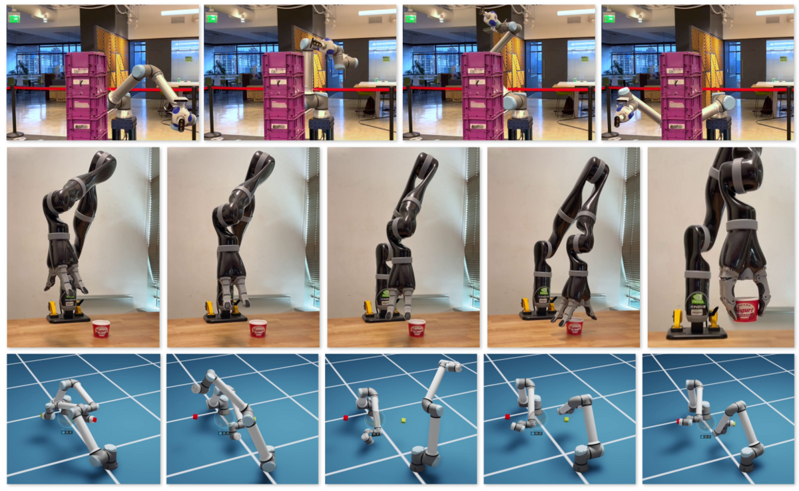
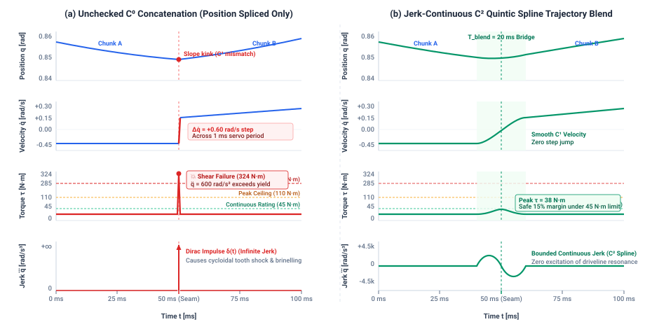
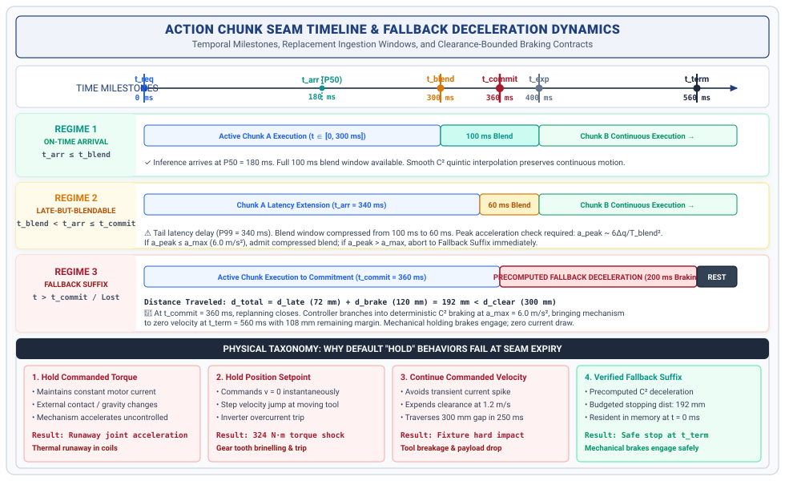

# Trajectory Planning {#sec-planning}

::: {.column-margin}

\chapterminitoc

:::

\begin{marginfigure}
\mlphysicalstack{100}{50}{50}{60}{30}
\end{marginfigure}

*What does a physical machine do during the unbudgeted milliseconds when the next neural trajectory chunk is late?*

The raw output of a neural policy is often a discrete sequence of waypoints or a stochastic action chunk sampled from a diffusion model. If these discrete references are streamed directly to joint motor drives, the resulting step discontinuities command infinite jerk, exciting structural resonances, shearing gearboxes, and tripping overcurrent inverters. Trajectory planning in physical AI is the discipline of transforming discrete neural proposals into continuous, dynamically feasible trajectory splines that respect the physical limits of the plant. A dependable planner must guarantee $\mathcal{C}^2$ jerk smoothness, enforce receding-horizon spline blending across chunk seams, and execute precomputed emergency stopping suffixes whenever upstream neural inference is delayed.



::: {.callout-learning-objectives}
After studying this chapter, you will be able to:

1. Set a planning horizon from an inference latency distribution rather than a round number.
2. Predict what a discontinuity at a chunk boundary does to a transmission.
3. Specify the behavior of a plan whose replacement never arrives, and defend it as part of the plan.
4. Identify which trajectory failures are visible before execution and which appear only during it.

*Core chapter takeaway.* A plan must define what happens when its replacement is late, because the replacement will be late. The seam between one plan and the next is where mechanisms break, not the middle of either.

:::

## Continuous Trajectories {#sec-planning-11-1}

At the wrist of an articulated industrial robot lowering a cutting tool onto a moving workpiece, the joint tracking loop executes deterministically on a Real-Time Microcontroller Unit (MCU) every $10\text{ ms}$. At this $100\text{ Hz}$ cadence (with inner field-oriented current loops cycling at $1000\text{ Hz}$), the nervous system queries joint optical encoders, evaluates closed-loop PID or computed torque control laws, and writes pulse-width modulation (PWM) current setpoints to motor phase inverters. The physical body possesses inertia $J$ and kinetic energy $E_k = \frac{1}{2} J \dot{\mathbf{q}}^2$. Physical time cannot pause for an operating system thread switch, a GPU kernel launch, or a memory bus contention spike. If the tracking loop receives a continuous, smooth stream of position and velocity references, the tool makes contact with controlled force and begins its traverse across the surface. If the reference stream stutters, drops, or halts, physical inertia takes over.

::: {#dfn-physical-ai-systems .callout-definition title="Physical AI systems"}

***Physical AI systems***\index{Physical AI systems!planning framing} are cyber-physical architectures that couple high-capacity neural deliberation (the "brain") with high-frequency deterministic tracking and safety enforcement (the "nervous system") to exert physical work in the real world. Unlike software-only AI, physical AI systems must generate commands that satisfy dynamic feasibility, respect actuator limits, and execute continuously in hard real time despite stochastic inference latency.

:::

 A plan is a promise about the near future, and the central engineering challenge of trajectory generation is what happens when that promise runs out before the next one arrives.

This temporal invariant governs machines across all Three Physical Machine Archetypes.

1. **Mobile Systems (AMRs / AGVs / Quadrupeds)**: An autonomous mobile robot navigating a high-density logistics corridor at $v_0 = 1.5\text{ m/s}$ requires continuous steering angle and wheel torque setpoints every $10\text{ ms}$. If an inference engine stalls for $150\text{ ms}$, the unguided chassis drifts through $d = v_0 \Delta t = 225\text{ mm}$ of dead reckoning, exhausting its spatial obstacle clearance and inducing severe tire slip if emergency braking is clamped abruptly.
2. **Manipulators (Articulated Arms / High-Speed Delta Pickers)**: A 6-DOF industrial arm sweeping a $4.0\text{ kg}$ payload at $2.0\text{ m/s}$ relies on model-based feedforward torque $\boldsymbol{\tau}_{\mathrm{ff}} = \mathbf{M}(\mathbf{q})\ddot{\mathbf{q}} + \mathbf{C}(\mathbf{q}, \dot{\mathbf{q}})\dot{\mathbf{q}} + \mathbf{g}(\mathbf{q})$. An unexpected missing reference forces low-level joint controllers to hold stale currents against gravity or trip mechanical spring brakes, producing shock torques that shear gearbox drive keys.
3. **Process/Energy Systems (Thermal Extrusion / Chemical Batch Reactors / Gas Turbines)**: In polymer fused-filament 3D printing or continuous flow reactors, mass feed rates and heater thermal powers must obey strict continuous derivative bounds ($d\dot{m}/dt \le \dot{M}_{\max}$, $d\dot{Q}/dt \le \dot{Q}_{\max}$). A step discontinuity in commanded mass flow creates instantaneous nozzle melt-pressure surges ($\Delta P = 4.0\text{--}8.0\text{ MPa}$) that blow out barrel seals or fracture nozzle orifices.[^fn-hw-setpoint-slew]

Above this hard real-time execution loop sits the deliberative Brain tier, hosted on a high-throughput Linux Microprocessor Unit (MPU) or embedded neural accelerator (such as a canonical heterogeneous dual-brain System-on-Chip (SoC) architecture). Here, learned policies—such as RT-1 [@brohan2022rt1], RT-2 [@zitkovich2023rt2], Action Chunking with Transformers (ACT) [@zhao2023learning], or Diffusion Policy [@chi2024diffusionpolicy]—process camera frames, point clouds, and tactile signals to propose reference paths. Unlike the deterministic, microsecond-accurate periodic cycle of the motor drives on the real-time MCU, policy inference on the Linux MPU exhibits variable execution time. A forward pass that completes in $35\text{ ms}$ under nominal conditions stretches to $120\text{ ms}$ when image compression buffers clear, and extends beyond $200\text{ ms}$ when operating system context switches, garbage collection pauses, or memory bus contention delay tensor execution on the neural coprocessor. The real-time tracking loop never waits for the upstream model to finish. It consumes whatever reference is resident in its execution buffer when its hardware timer fires, regardless of whether a fresh neural computation has arrived.

When an architecture generates only a single control step ahead ($H = 1$), this timing mismatch immediately breaks physical control. If a policy predicts a motor action for $t + 10\text{ ms}$ but requires $25\text{ ms}$ of compute time to evaluate the network, the output arrives $15\text{ ms}$ after the target instant has already passed into history. The real-time tracking loop arrives at $t + 10\text{ ms}$ with an empty or expired reference buffer. If the low-level MCU controller holds the previous motor currents, the manipulator accelerates unguided under gravitational and external contact loads. If it clamps the mechanical brakes or zeros the drive torques, the sudden step change in acceleration exerts massive shock loads on the gearboxes and dislodges the workpiece. A single-step prediction contract implicitly assumes that computation is instantaneous, an assumption that the physical execution pipeline violates on every single cycle.

To bridge this temporal chasm between slow, variable neural inference on the MPU and high-frequency actuator control on the MCU, planning systems output a trajectory spanning multiple future control intervals. This sequence of future references is an **action chunk**\index{Action chunk!definition}—a finite, time-parameterized sequence of future reference states or control commands $[\mathbf{u}_t, \mathbf{u}_{t+1}, \dots, \mathbf{u}_{t+H-1}]$ emitted as an atomic block by an upstream neural policy across horizon $H$, buffering the nervous system against inference latency variance. In an analytical example, suppose a learned planner generates a trajectory across a horizon of $H = 200\text{ ms}$, providing $20$ discrete setpoints at $10\text{ ms}$ intervals. At $t = 0\text{ ms}$, the tracking loop on the MCU starts executing the first setpoint of this plan. The system cannot wait until the plan finishes to calculate the next one, so it dispatches a replacement request across the inter-processor communication (IPC) bus at $t_{\text{req}} = 50\text{ ms}$. If the nominal inference latency is $t_{\text{lat}} = 60\text{ ms}$ at $P_{50}$, the replacement arrives at $t_{\text{arr}} = 110\text{ ms}$. The new plan arrives $90\text{ ms}$ before the original plan reaches its expiry time of $t_{\text{exp}} = 200\text{ ms}$, providing an overlap during which the nervous system can splice the new trajectory into the current execution path.

The nominal arrival time describes only the center of the distribution, and physical systems fail in the tail. If memory contention, thermal throttling, or bus contention extends the replacement latency to $P_{99} = 180\text{ ms}$, the replacement arrives at $t = 230\text{ ms}$. Because the existing plan expires at $t_{\text{exp}} = 200\text{ ms}$, an uncovered interval of $30\text{ ms}$ opens between the exhaustion of the valid trajectory and the arrival of its successor. Lengthening the chunk horizon to $1000\text{ ms}$ increases the time buffer, but it forces the body to execute actions planned on stale perceptual measurements. If the workpiece shifts during that second, the stale trajectory drives the tool into collision. Action chunking buys finite time, but it does not eliminate the tail of the latency distribution or guarantee that a replacement will arrive before the horizon expires.

As captured in  It is an unprivileged proposed trajectory submitted across the MPU/MCU boundary to the tracking controller and the real-time safety enforcer, valid only over its stated temporal horizon. Because every computing platform exhibits a nonzero tail of delayed inference, every plan must define its own **seam behavior**\index{Seam behavior!definition}. The seam is the terminal transition that governs the actuators if the expiry time passes without an accepted replacement. A well-formed plan specifies whether the machine should decelerate to a controlled stop along the path tangent, switch to compliant force regulation, or hold a static position. The seam is where physical mechanisms break when computation stalls, not the middle of a smoothly executing trajectory.

The planner is responsible for generating kinematic paths that the body can physically follow, managing the timing windows of action chunks, and specifying deterministic termination states for the moments when replacements are late. Whether those proposed trajectories violate environmental keep-out zones, exceed dynamic load limits, or remain safe under unexpected obstacles is an independent determination. The planner proposes what the body might do and defines how the trajectory ends when computation fails. The safety enforcer independently evaluates whether that proposal is permitted to reach the actuators (@sec-enforcement), echoing the layered behavioral overrides of the subsumption architecture [@brooks1986subsumption].

## What Planning Hands Over {#sec-planning-11-2}

A geometric path describes a sequence of configurations in space, parameterized by arc length $s \in [0, S]$ or a dimensionless progression variable $\sigma \in [0, 1]$, without reference to time.[^fn-math-apf-planning] Formulated in the foundational work of Lozano-Pérez [@lozanoperez1983spatial], the **configuration space**\index{Configuration space!definition} ($\mathcal{C}$-space) represents the topological manifold of all possible robot joint states $\mathbf{q} \in \mathcal{C}$, transforming complex articulated geometries into a single dimensionless point while mapping physical obstacles into configuration space obstacles $\mathcal{C}_{\text{obs}}$. A path defines where the machine travels through the collision-free manifold $\mathcal{C}_{\text{free}} = \mathcal{C} \setminus \mathcal{C}_{\text{obs}}$, but it contains no information about velocity, acceleration, or actuation limits. To become an **executable trajectory**\index{Executable trajectory!definition}, the geometric path must be mapped to time, $t \mapsto \mathbf{x}(t) = [\mathbf{q}(t)^T, \dot{\mathbf{q}}(t)^T, \ddot{\mathbf{q}}(t)^T]^T$, assigning concrete physical states, kinematic derivatives, or actuator targets to explicit timestamps. Only when parameterized by time does the path expose the rates, accelerations, and temporal deadlines that the nervous system must evaluate. The data structure handed over from the upstream planner to the execution system is therefore never an abstract curve or an ungrounded tensor. It is a time-indexed **trajectory packet**\index{Trajectory packet!definition} delivered across the MPU/MCU boundary to two distinct consumers: the tracking controller and the safety enforcer. The tracking controller consumes the trajectory to interpolate high-rate actuator setpoints ($1\text{ kHz}$) and compute model-based feedforward torques. The safety enforcer consumes the trajectory to independently verify that the planned motion remains within physical, thermal, and environmental boundaries before any command reaches the motor phase inverters (@sec-enforcement).

Every field in the trajectory handoff corresponds to a specific check that the tracker or enforcer must execute. The first requirement is spatial and temporal alignment. The trajectory packet must explicitly declare its coordinate reference frame identifier $\mathcal{F}$, its generation timestamp $t_0$, its planned initial state $\mathbf{x}_0$, and its validity interval $[t_{\text{start}}, t_{\text{exp}}]$. Without an explicit coordinate frame, the tracking controller cannot transform end-effector positions and velocities into joint coordinates. Without a generation timestamp and initial state, the enforcer cannot measure pipeline transport latency or detect state drift. Consider an inference pipeline that samples the robot state at $t = 0\text{ ms}$, requires $60\text{ ms}$ to compute a trajectory chunk on the Linux MPU, and delivers a trajectory starting at $\mathbf{x}_0$. If the physical mechanism was in motion during inference and drifted by $20\text{ mm}$, passing the trajectory directly to the tracker causes an instantaneous step error in the control loop, commanding peak torque and inducing severe mechanical jerk. By comparing the planned initial state $\mathbf{x}_0$ against the true state measured by MCU encoders at $t_{\text{start}}$, the enforcer can reject the chunk if the tracking discrepancy exceeds an allowed tolerance, or the tracker can synthesize a short transition spline to bridge the position offset. The validity interval defines the temporal window over which the planner guarantees internal consistency, setting the exact expiration time $t_{\text{exp}}$ when the chunk ceases to be authoritative.

The handoff represents a feasibility claim under declared body limits rather than a proof that the machine can execute the trajectory under every future disturbance. When a planner generates a trajectory, it verifies that the requested joint velocities $\dot{\mathbf{q}}(t)$, accelerations $\ddot{\mathbf{q}}(t)$, and torques $\boldsymbol{\tau}(t)$ fall within nominal operating bounds under an assumed dynamic model. It cannot account for unmodeled friction, external payloads, or sudden contact forces that arise during execution. The safety enforcer must independently evaluate this feasibility claim against conservative runtime limits before permitting the tracker to execute the trajectory. If a learned planner generates a trajectory assuming an empty gripper, demanding $80\%$ of peak actuator torque during high-speed acceleration, and the physical gripper is carrying a $4.0\text{ kg}$ payload, executing the trajectory would demand $130\%$ of rated motor torque. The resulting current draw would trip thermal protection or cause severe tracking lag. The enforcer uses the explicit state derivatives and required forces in the handoff to reject plans that exceed safe margins under the actual physical configuration.

To allow continuous transitions between consecutive planning cycles, the trajectory must specify boundary conditions at both ends of its temporal horizon. A trajectory that guarantees only continuous position creates physical damage at the replacement seam. If the planner produces a trajectory whose initial velocity $\dot{\mathbf{q}}(t_{\text{start}})$ does not match the true velocity of the body at the moment of handoff, the resulting step change in velocity requires infinite acceleration, causing torque saturation and structural vibration. Even if velocity is continuous, a step discontinuity in acceleration causes a step change in motor torque, producing severe jerk that excites mechanical resonances in gearboxes and linkages. The handoff must therefore enforce second-order derivative continuity ($C^2$ continuity) at the seam, matching position, velocity, and acceleration to the terminal state of the currently executing trajectory chunk. Specifying terminal boundary conditions at $t_{\text{exp}}$ similarly ensures that if a successor plan arrives on time, the new trajectory can splice directly into the existing motion without arresting the body.

Because feasibility depends on physical context, the handoff must include the explicit assumptions under which the trajectory was generated. These metadata fields include the assumed payload mass and inertia, the expected contact state (such as free-space motion, sliding contact, or rigid fixture engagement), the allocated actuation budget, and the minimum spatial clearance to known obstacles. The safety enforcer compares these declared assumptions against independent sensor measurements in real time. If the handoff specifies a free-space motion with an expected contact force of $0\text{ N}$, but an onboard six-axis force-torque sensor registers an unexpected load of $25\text{ N}$ along the tool axis, the enforcer immediately invalidates the trajectory. The physical premise of the plan has been violated, and continuing along the precomputed path risks driving the tool into a rigid obstruction.

Every computing architecture exhibits latency tails where replacement plans arrive late or fail to arrive entirely. An executable handoff must therefore provide an explicit, finite **precomputed stopping suffix**\index{Precomputed stopping suffix!definition} that governs the body if the clock reaches $t_{\text{exp}}$ without a valid successor. A precomputed stopping suffix is a dynamically feasible deceleration trajectory resident in execution memory upon chunk admission that safely brings the physical plant to a controlled resting state along the path tangent if replanning stalls or successor plans are exhausted. Leaving terminal behavior unspecified or defaulting to an instantaneous position hold is physically dangerous. If a machine traveling at $1.2\text{ m/s}$ encounters an expired plan and defaults to holding its final position sample, the tracking controller attempts to bring the velocity to zero instantaneously. This step command saturates actuator braking torque and can cause mechanical transmission damage or tip-over. The terminal suffix is a precomputed deceleration trajectory that begins at $t_{\text{exp}}$ and brings the machine to a safe resting state along the path tangent over a finite stopping time $T_{\text{stop}}$. Depending on the task and mechanical structure, this terminal behavior may decelerate to a stop along the path tangent, switch actuator control to passive damping, or descend to a mechanically stable resting posture. The critical systems requirement is that the terminal suffix is budgeted, checked for dynamic feasibility, and resident in memory before execution of the chunk begins.

On real-time embedded hardware, this handoff is realized inside an **embedded execution buffer**\index{Embedded execution buffer!definition} resident in the MCU's static RAM (SRAM).[^fn-hw-dma-pingpong] To decouple the asynchronous Linux MPU from the microsecond-accurate MCU servo loop, the execution engine employs a lockless double-buffering or ring-buffer architecture with atomic status registers (`BUFFER_EMPTY`, `BUFFER_READY`, `BUFFER_ACTIVE`, `BUFFER_EXPIRED`). When the upstream policy on the MPU synthesizes a new action chunk, it populates the inactive background buffer over shared memory, direct memory access (DMA), or high-speed SPI. At the admission boundary, the MCU safety enforcer performs an $O(1)$ algorithmic validation check on the candidate chunk. If the packet passes all invariant tests, the MCU performs an atomic pointer swap at the next servo tick, seamlessly committing the new trajectory chunk to the active tracking loop without heap allocation, thread synchronization locks, or timing jitter.

Structuring the plan handoff as a bounded, hardware-grounded contract shifts the burden of safety and timing from the non-deterministic planner to the deterministic nervous system. The tracking controller receives the dense state targets, timestamps, and feedforward terms required to drive the actuators along a smooth path. The safety enforcer receives the generation metadata, dynamic assumptions, validity bounds, and terminal suffix needed to guard the machine against latency tails, state divergence, and physical model mismatches. When each field in the handoff corresponds to an explicit runtime verification, the nervous system can execute high-speed motions without relying on the assumption that the next inference cycle will always succeed.

## From Goal to Trajectory {#sec-planning-11-3}

An intent names a desired physical outcome—such as touching a workpiece with a specified contact force or placing an end-effector at a target pose (@sec-intent)—but an actuator cannot execute a goal. While large language models can decompose natural language instructions into high-level task plans using grounded affordances (e.g., SayCan [@ahn2022saycan]), a goal defines where the machine should eventually arrive or what constraint it should satisfy, without providing the joint velocities, torque bounds, intermediate kinematic states, or continuous time schedule required to move physical mass through space. The nervous system requires a trajectory, which assigns concrete state targets, feedforward actuation terms, and explicit timestamps across a bounded temporal interval. If a learned policy could evaluate multimodal state observations and output valid motor currents instantaneously at the hardware control period ($1000\text{ Hz}$), planning as an architectural stage would not exist; the machine would operate purely as a high-frequency feedback controller. In physical systems, learned neural policies require tens or hundreds of milliseconds to compute a motion sequence, while the tracking controller and safety enforcer must execute deterministically every few milliseconds. A plan exists precisely because a goal cannot be executed directly by hardware and neural inference operates far slower than the cadence of the control loop.

In classical robotics systems, bridging this gap was achieved through sampling-based path planning. Rather than constructing explicit algebraic representations of the high-dimensional configuration obstacle manifold $\mathcal{C}_{\text{obs}}$, algorithms randomly sample the free configuration space $\mathcal{C}_{\text{free}}$. Multi-query architectures, pioneered by @kavraki1996probabilistic through the **Probabilistic Roadmap (PRM)**\index{Probabilistic roadmap!definition}, construct a global topological roadmap of interconnected collision-free configurations during an offline preprocessing phase, enabling rapid online multi-query path lookups. For dynamic, single-query real-time navigation, @lavalle1998rapidly introduced the **Rapidly-Exploring Random Tree (RRT)**\index{Rapidly-exploring random tree!definition}, which incrementally grows a space-filling tree biased toward unexplored Voronoi regions of $\mathcal{C}_{\text{free}}$, guaranteeing probabilistic completeness without requiring precomputed graphs.

To span this temporal gap between slow model inference and high-frequency actuator control, modern robot learning architectures formulate policy execution via **receding-horizon action chunking**\index{Receding-horizon action chunking!definition}.[^fn-math-bellman-dp] Two dominant paradigms characterize this generation:

1. **Action Chunking with Transformers (ACT)**: Formulated as a Conditional Variational Autoencoder (CVAE) paired with a Transformer encoder-decoder and deployed on the ALOHA bimanual teleoperation system [@zhao2023learning], ACT predicts a discrete sequence of future joint setpoints $\mathbf{A} = [\mathbf{a}_1, \dots, \mathbf{a}_H] \in \mathbb{R}^{H \times D}$ simultaneously across a prediction horizon $H$. To mitigate compounding trajectory drift across successive chunks, ACT applies *temporal ensembling*, maintaining an exponential moving average over overlapping predicted chunks ($w_i = \exp(-m \cdot i)$). While effective in simulation and low-speed teleoperation, temporal ensembling averages discrete coordinate samples without enforcing derivative continuity, which can inject high-frequency derivative chatter into real-time motor drives.
2. **Diffusion Policy**: Formulating trajectory synthesis as an iterative score-based denoising process [@chi2024diffusionpolicy], Diffusion Policy rolls out future action trajectories by solving a score Stochastic Differential Equation (SDE) or Denoising Diffusion Implicit Model (DDIM) ODE conditioned on visual and proprioceptive histories. A diffusion policy predicts a chunk of horizon $T_p$ (e.g., $16$ steps), executes a committed subset of steps $T_a$ (e.g., $8$ steps), and replans on subsequent sensor ingress (@fig-11-action-chunking-trace). While diffusion models capture rich multimodal distributions, their iterative denoising schedules ($K = 8\text{--}16$ steps) introduce significant inference latency and stochastic latency variance.

From an ML systems perspective, the parameter governing the handoff across these models is the **end-to-end replacement latency**\index{End-to-end replacement latency!definition}, denoted as random variable $L \sim \mathcal{D}(L)$. Treating model execution time on an isolated accelerator as the planning latency is an engineering error that undercounts the true physical delay. End-to-end replacement latency begins at the physical timestamp of the sensory observation used to condition the planner and spans six pipeline stages:
$$L = t_{\mathrm{sense\_ingress}} + t_{\mathrm{ipc\_dma}} + t_{\mathrm{infer}} + t_{\mathrm{deser}} + t_{\mathrm{validate}} + t_{\mathrm{admit}}$$
where $t_{\mathrm{sense\_ingress}}$ includes camera exposure and frame grabber serialization ($15\text{ ms}$), $t_{\mathrm{ipc\_dma}}$ is direct memory access transfer to the accelerator ($5\text{ ms}$), $t_{\mathrm{infer}}$ is neural forward pass or diffusion denoising ($65\text{ ms}$), $t_{\mathrm{deser}}$ is trajectory deserialization into engineering units ($2\text{ ms}$), $t_{\mathrm{validate}}$ is kinematic and constraint verification by the safety enforcer ($18\text{ ms}$), and $t_{\mathrm{admit}}$ is atomic buffer admission into the MCU execution queue ($1\text{ ms}$). In this representative deployment, while raw inference consumes $65\text{ ms}$, the true end-to-end replacement latency is $L = 106\text{ ms}$.

Because operating system scheduling, memory bus contention, and accelerator thermal throttling introduce variability into every stage, replacement latency exhibits an empirical distribution with a pronounced tail. If the tracking controller consumes the final state sample of an active chunk before a validated replacement is admitted into the embedded buffer, the queue suffers starvation, forcing the nervous system to abandon nominal tracking and execute its precomputed deceleration suffix. Sizing the plan horizon against a conventional tail percentile such as $P_{99}$ without accounting for mission exposure guarantees regular physical interruptions. Consider an articulated arm performing an uninterrupted $10\text{ minute}$ ($600\text{ s}$) manipulation task where new trajectory chunks are requested every $200\text{ ms}$, creating $K = 3000$ consecutive handoffs across the mission. If the trajectory horizon accommodates only the $P_{99}$ latency, the probability of completing the mission without exhausting the buffer at any seam is $(1 - 0.01)^{3000} \approx 7.2 \times 10^{-14}$. On average, the machine encounters thirty late seams during a single ten-minute run, repeatedly dropping into emergency deceleration. To achieve an acceptable mission exhaustion failure probability $\epsilon_{\mathrm{mission}}$, the allowable per-handoff failure probability $\epsilon$ must satisfy $(1 - \epsilon)^K = 1 - \epsilon_{\mathrm{mission}}$, which simplifies to $\epsilon \approx \epsilon_{\mathrm{mission}} / K$ when $\epsilon_{\mathrm{mission}} \ll 1$. For a mission failure budget of $\epsilon_{\mathrm{mission}} = 10^{-3}$ across $3000$ handoffs, the allowable per-plan exhaustion probability is $\epsilon \approx 3.33 \times 10^{-7}$, requiring the system to size its horizon against the extreme tail quantile $Q_{1-\epsilon}(L) \approx P_{99.99997}$.

Determining the length of each trajectory chunk requires scheduling when the replacement request is dispatched relative to the start of the current chunk. Requesting the next chunk immediately upon entering the active chunk generates motor plans from outdated sensor readings, accumulating state drift. The system therefore delays the dispatch until an execution lead time $T_{\mathrm{request}}$ has elapsed within the active chunk. From the instant of dispatch, the remaining execution time available in the active buffer must accommodate the full replacement latency at the target quantile $Q_{1-\epsilon}(L)$, plus a deterministic reserve $T_{\mathrm{reserve}}$ dedicated to trajectory splicing, safety validation, and timer jitter. If the control loop operates at a period of $T_c$, the minimum number of discrete trajectory samples $N$ that each generated chunk must contain is:
$$N = \left\lceil \frac{T_{\mathrm{request}} + Q_{1-\epsilon}(L) + T_{\mathrm{reserve}}}{T_c} \right\rceil$$
Every parameter in this equation must be measured under maximum representative system load, including saturated direct memory access channels, peak bus traffic from adjacent sensor streams, and thermal throttling of the compute substrate.

In an analytical example for a robotic arm executing a sequence that touches a surface and then slides a fixture, the tracking controller runs at $100\text{ Hz}$ ($T_c = 10\text{ ms}$). Empirical profiling under full sensor and bus contention yields a median latency of $65\text{ ms}$, a $P_{95}$ latency of $110\text{ ms}$, and a tail quantile $Q_{1-\epsilon}(L) = 240\text{ ms}$ corresponding to the mission reliability budget. The safety enforcer requires an admission and validation reserve $T_{\mathrm{reserve}} = 30\text{ ms}$ to evaluate torque limits and geometric clearance. To incorporate updated contact force readings gathered during the initial touch, the dispatch delay is set to $T_{\mathrm{request}} = 80\text{ ms}$. Sizing the chunk according to the tail distribution yields:
$$N = \left\lceil \frac{80\text{ ms} + 240\text{ ms} + 30\text{ ms}}{10\text{ ms}} \right\rceil = \left\lceil \frac{350\text{ ms}}{10\text{ ms}} \right\rceil = 35\text{ samples}$$
If an engineer selects a round-number horizon of $200\text{ ms}$ ($N = 20\text{ samples}$) based on the median latency of $65\text{ ms}$ plus an informal margin, the budget fails under real execution. With $T_{\mathrm{request}} = 80\text{ ms}$, the time remaining in the active chunk after dispatch is $200\text{ ms} - 80\text{ ms} = 120\text{ ms}$. Subtracting the $30\text{ ms}$ reserve leaves an allowable latency budget of only $90\text{ ms}$. In this analytical latency distribution, replacement latency exceeds $90\text{ ms}$ in approximately $10\%$ of all cycles (the $P_{90}$ threshold). As a consequence, the robot runs out of trajectory samples once every ten seams, causing the nervous system to abort tracking, apply joint braking, and shudder to a halt mid-motion.

::: {#psp-planning-tail-latency-horizon .callout-perspective title="The tail latency horizon invariant"}
Size the action chunk horizon $N$ against the mission tail quantile $Q_{1-\epsilon_{\mathrm{mission}}/K}(L)$ measured under maximum bus and memory contention, never against the median $P_{50}$ plus an informal round-number margin.
:::

When a generative policy serves as the planner, iterative score evaluation and denoising steps govern the shape of this latency distribution. The internal mechanics of diffusion schedules, attention caching, and token generation sit below the first budgetable quantity of the physical AI system. The systems interface treats the learned model strictly as a stochastic producer of motion chunks characterized by an empirical latency profile and an output horizon $N$. In physical hardware deployments of receding-horizon action chunking, the robot predicts a trajectory chunk of horizon $T_p$, executes a committed subset of steps $T_a$, and replans on subsequent sensor ingress, allowing the controller to absorb inference latency while reacting dynamically to disturbances (@fig-11-action-chunking-trace). Sizing $N$ against the latency tail guarantees that a replacement chunk is resident in memory before the active plan runs out of samples. Yet ensuring that a replacement trajectory arrives in time addresses only the temporal continuity of the plan. The state samples contained within the admitted chunk must also match the kinematic capabilities of the joints and remain continuous with the physical velocity and acceleration of the mechanism at the handoff seam.

::: {#fig-11-action-chunking-trace fig-env="figure" fig-pos="t" fig-cap="**Receding-horizon action chunking and closed-loop disturbance recovery on real robot hardware**: A receding-horizon diffusion policy predicting sixteen action steps and executing eight before replanning, on hardware, under three disturbances: camera occlusion, an in-flight shove of the target block, and a displacement after the terminal motion has begun. The execution buffer is what absorbs all three. It keeps the end-effector moving through inference jitter and gives the replanning cycle somewhere to insert a correction without stopping the arm." fig-alt="Receding-horizon action chunking and closed-loop disturbance recovery on real robot hardware. Hardware deployment of a receding-horizon diffusion policy (Tp = 16 predicted action steps, Ta = 8 executed steps before replanning) on a canonical 6-DOF industrial manipulator performing the planar Push-T manipulation task under dynamic perturbations. (Left) Visual Occlusion: A human hand waving in front of the overhead tracking camera introduces perceptual noise and inference latency jitter, but the receding-horizon execution buffer prevents pipeline starvation and preserves continuous end-effector motion. (Middle) In-Flight State Divergence: A physical disturbance abruptly shifts the target T-block during the active pushing phase; the rolling replanning cycle detects state divergence from the recorded plan assumptions and immediately synthesizes a corrective trajectory chunk that re-acquires and aligns the block. (Right) Terminal Suffix Replanning: When the block is displaced after the manipulator has already initiated its terminal motion toward the designated end-zone, the policy aborts the terminal sequence, replans a return trajectory, and restores the block to the target alignment. (Adapted from Chi et al. [-@chi2024diffusionpolicy])."}
{width="100%"}
:::

### The planning execution delay gap and future-state conditioning

In a receding-horizon planning framework—whether executing a score-based diffusion policy, an action chunking transformer, or trajectory optimization—replanning requires a finite end-to-end computational latency $\Delta t_{\text{plan}} = L$ (spanning sensing, DMA transfer, neural inference, and constraint validation, typically $50\text{--}150\text{ ms}$). A widespread design error in robot learning architectures is conditioning the planner on the *current* measured physical state sampled at the request epoch $t_0$:
$$\mathbf{x}_{\text{meas}}(t_0) = \begin{bmatrix} \mathbf{q}(t_0) \\ \dot{\mathbf{q}}(t_0) \end{bmatrix}$$
By the time neural inference, safety validation, and buffer admission finish at $t_{\text{admit}} = t_0 + \Delta t_{\text{plan}}$, the physical robot has already moved under the previously active trajectory chunk ($A$) over the entire interval $\Delta t_{\text{plan}}$. The newly arrived trajectory chunk ($B$) begins at the historical state $\mathbf{x}_{\text{meas}}(t_0)$, but the physical plant is now located at $\mathbf{x}_A(t_0 + \Delta t_{\text{plan}})$. Attempting to execute chunk $B$ immediately injects an unmodeled step displacement into the tracking loop:
$$\Delta \mathbf{x}_{\text{gap}} = \mathbf{x}_A(t_0 + \Delta t_{\text{plan}}) - \mathbf{x}_{\text{meas}}(t_0) \approx \int_{t_0}^{t_0 + \Delta t_{\text{plan}}} \dot{\mathbf{q}}_A(t) \, dt$$
For an industrial arm moving at joint velocity $\dot{q} = 0.50\text{ rad/s}$ across a planning latency $\Delta t_{\text{plan}} = 80\text{ ms}$, this execution delay gap creates an instantaneous step error of $\Delta q_{\text{gap}} = (0.50\text{ rad/s})(0.080\text{ s}) = 0.040\text{ rad}$ ($2.29^\circ$). When streamed to high-gain joint controllers, this step demands peak restoring torque ($\tau_{\text{step}} = K_p \Delta q_{\text{gap}}$), causing violent mechanical jerk, acoustic thumping, and overcurrent inverter trips.

To eliminate the planning execution delay gap, high-performance physical AI architectures implement **future-state conditioning**\index{Future-state conditioning!definition}. Instead of conditioning inference on the stale measured state $\mathbf{x}_{\text{meas}}(t_0)$, the upstream planner conditions its trajectory rollout on the *forward-simulated terminal state* of the currently executing trajectory chunk evaluated at the exact anticipated admission epoch $t_{\text{admit}} = t_0 + \Delta t_{\text{plan}}$:
$$\mathbf{x}_{\text{cond}} = \hat{\mathbf{x}}_A(t_0 + \Delta t_{\text{plan}}) = \begin{bmatrix} \mathbf{q}_A(t_0 + \Delta t_{\text{plan}}) \\ \dot{\mathbf{q}}_A(t_0 + \Delta t_{\text{plan}}) \\ \ddot{\mathbf{q}}_A(t_0 + \Delta t_{\text{plan}}) \end{bmatrix}$$
Because the low-level MCU tracks the active chunk $A$ deterministically, $\hat{\mathbf{x}}_A(t_0 + \Delta t_{\text{plan}})$ accurately predicts the robot's physical configuration at the handoff instant. When chunk $B$ arrives and is admitted at $t_{\text{admit}}$, its initial boundary values match the executing trajectory's position, velocity, and acceleration to machine precision:
$$\mathbf{q}_B(0) = \mathbf{q}_A(t_{\text{admit}}), \quad \dot{\mathbf{q}}_B(0) = \dot{\mathbf{q}}_A(t_{\text{admit}}), \quad \ddot{\mathbf{q}}_B(0) = \ddot{\mathbf{q}}_A(t_{\text{admit}})$$
This future-state conditioning guarantees that the replacement seam maintains strict $C^2$ continuity, eliminating the execution delay gap without requiring the machine to pause, decelerate, or suffer impulsive torque spikes.

::: {#dfn-planning-future-state-conditioning .callout-definition title="Future-state conditioning"}

***Future-state conditioning***\index{Future-state conditioning!definition}\index{Trajectory planning!future-state conditioning} is the real-time planning protocol wherein an upstream trajectory optimizer or generative action policy conditions its rollout on the forward-simulated kinematic state ($\hat{\mathbf{x}}_A(t_0 + \Delta t_{\text{plan}})$) of the currently executing plan evaluated at the anticipated replacement admission epoch.

1.  **Significance**: Finite neural inference latency ($\Delta t_{\text{plan}} \approx 50\text{--}150\text{ ms}$) introduces an execution delay gap ($\Delta \mathbf{x}_{\text{gap}}$) between the measured state at exposure and the state when the new plan arrives. Conditioning on the forward-simulated state aligns the new trajectory's origin with the robot's physical configuration at the handoff instant, eliminating tracking lag without requiring the machine to pause or decelerate.
2.  **Distinction**: Unlike classical open-loop replanning that naively sets the new plan's starting waypoint to stale sensor feedback ($\mathbf{q}_B(0) = \mathbf{q}_{\text{meas}}(t_0)$), future-state conditioning projects forward along the active trajectory chunk to ensure continuous momentum.
3.  **Common pitfall**: Assuming the forward-simulated state matches reality without checking tracking error. If an external contact disturbance displaced the robot during the planning interval ($\|\mathbf{x}_{\text{meas}} - \hat{\mathbf{x}}_A\| > \epsilon_{\text{tol}}$), the conditioned plan starts from a phantom state, demanding a runtime spline correction before admission.

:::

## Feasibility and Continuity {#sec-planning-11-4}

A candidate trajectory produced by a learned policy or path planner is merely a sequence of geometric propositions until the nervous system verifies that the physical body can execute it. An admitted motion plan must satisfy simultaneous constraints across multiple physical domains, including joint position limits, angular velocity limits, actuator acceleration envelopes, contact force thresholds, workspace obstacle clearance, and the dynamic stopping distance required to prevent collision if an emergency occurs. A systems engineer does not compute full-body kinematics from first principles within the tracking loop [@craig2005introduction; @lynch2017modern]. Instead, the safety enforcer evaluates a machinery-specific rigid-body model that maps commanded joint positions $\mathbf{q}(t)$, velocities $\dot{\mathbf{q}}(t)$, and accelerations $\ddot{\mathbf{q}}(t)$ directly to actuator torques $\boldsymbol{\tau}(t) = \mathbf{M}(\mathbf{q})\ddot{\mathbf{q}} + \mathbf{C}(\mathbf{q}, \dot{\mathbf{q}})\dot{\mathbf{q}} + \mathbf{g}(\mathbf{q})$ and motor phase currents $I_i(t) = \tau_i(t) / k_{\tau,i}$. Within-plan **feasibility**\index{Feasibility!definition} is therefore established not by geometric reachability, but by verifying that the predicted peak torque remains within the continuous thermal limit of the motor windings and the mechanical yield limits of the reduction gears across the entire time horizon. In real hardware deployments, trajectory optimization frameworks solve these constrained optimization problems over parallelized GPU threads, generating time-parameterized minimum-jerk splines that dynamically steer industrial manipulators around obstacles while strictly enforcing kinematic and torque bounds (@fig-11-manipulator-trajectory). This transition from discrete geometric path smoothing to continuous trajectory optimization represents a major pillar of motion planning systems. @ratliff2009chomp introduced **Covariant Hamiltonian Optimization for Motion Planning (CHOMP)**\index{Covariant Hamiltonian optimization for motion planning!definition}, demonstrating how functional gradient techniques can optimize continuous trajectory splines directly over precomputed distance fields, simultaneously minimizing path roughness and obstacle proximity. @schulman2014motion formulated **TrajOpt**\index{TrajOpt!definition}, which recast motion planning as sequential convex programming with exact $L_1$ penalty metrics, integrating continuous-time swept-volume collision checking to eliminate collision tunneling between discrete time steps. For non-differentiable contact dynamics and agile dynamic maneuvering, @williams2017model formulated **Model Predictive Path Integral (MPPI)**\index{Model predictive path integral!definition} control, leveraging massively parallel GPU threads to sample thousands of candidate trajectories simultaneously, weighting rollouts via an information-theoretic free-energy cost to achieve agile real-time receding-horizon control.

::: {#fig-11-manipulator-trajectory fig-env="figure" fig-pos="t" fig-cap="**Real-Time Trajectory Optimization and Dynamic Obstacle Avoidance on Industrial Manipulators**: GPU-accelerated motion generation executing minimum-jerk splines on hardware, avoiding a dynamic obstacle against a signed distance field, executing a constrained pick-and-lift, and coordinating two arms in a shared workspace. Collision distance is evaluated in continuous time rather than at waypoints, which is what allows the trajectory to be re-optimized while it is being executed. Adapted from [@sundaralingam2023curobo]." fig-alt="Real-Time Trajectory Optimization and Dynamic Obstacle Avoidance on Industrial Manipulators. Experimental deployment of GPU-accelerated motion generation (cuRobo) executing time-parameterized, minimum-jerk trajectory splines on physical hardware. (Top row) A canonical 6-DOF industrial manipulator executes an online obstacle avoidance trajectory around a dynamic workspace obstacle, continuously evaluating continuous-time collision distances against a 3D Euclidean Signed Distance Field (ESDF) voxel map generated via real-time depth perception. (Middle row) A canonical 6-DOF collaborative arm executes a collision-free pick-and-lift trajectory spline constrained by joint velocity, acceleration, and torque envelopes. (Bottom row) Coordinated multi-arm trajectory synthesis in simulation showing two canonical industrial manipulators executing synchronized, collision-free obstacle avoidance around shared workspace boundaries. Adapted from [@sundaralingam2023curobo]."}
{width="95%"}
:::

Validating feasibility solely at discrete planning waypoints creates a false sense of compliance. When a planner outputs trajectory points separated by a sampling interval $T_s$, the physical mechanism moves along an interpolated path between those samples. If the nervous system checks constraints only at the discrete sample timestamps $t_k = k T_s$, high-order trajectory derivatives can exceed physical bounds during the inter-sample interval $[t_k, t_{k+1}]$. Consider an analytical example of a linear joint with a maximum acceleration limit $a_{\max} = 10.0\text{ m/s}^2$ and a velocity ceiling $v_{\max} = 2.00\text{ m/s}$. If the planner outputs consecutive velocity samples $\dot{q}_k = 1.95\text{ m/s}$ and $\dot{q}_{k+1} = 1.95\text{ m/s}$ separated by $T_s = 20\text{ ms}$, a cubic spline interpolator that applies an intermediate acceleration of $a_{\max}$ produces an intra-sample velocity overshoot bounded by $\Delta v \le \frac{1}{2} a_{\max} T_s$. Evaluating this bound yields:
$$\Delta v \le \frac{1}{2} (10.0\text{ m/s}^2)(0.020\text{ s}) = 0.10\text{ m/s}$$
The true physical velocity peaks at $1.95\text{ m/s} + 0.10\text{ m/s} = 2.05\text{ m/s}$ between the two valid waypoints, exceeding the $2.00\text{ m/s}$ limit and triggering an over-speed clamp. To guarantee continuous-time feasibility without evaluating every infinitesimal point, the admission filter must evaluate an interior contracted bound, $|\dot{q}_k| \le v_{\max} - \frac{1}{2} a_{\max} T_s$, derived from the maximum rate of change of the interpolator.

Concatenating two trajectories that are each individually feasible over their respective time domains does not produce a feasible combined plan. Consider an active trajectory chunk $A$ defined over $t \in [0, T_A]$ and an incoming replacement chunk $B$ defined over $t \in [0, T_B]$, joined at the handoff timestamp $t_{\mathrm{seam}}$. Even when chunk $A$ and chunk $B$ strictly obey all kinematic and dynamic bounds in isolation, their intersection at $t = t_{\mathrm{seam}}$ can exhibit severe derivative discontinuities (@fig-11-action-chunk-seam-continuity). The level of continuity required across the seam is dictated by the low-level actuator interface. A position-controlled actuator receiving a continuous position command ($C^0$ continuity) may still experience a step change in velocity $\Delta \dot{q} = \dot{q}_B(0) - \dot{q}_A(t_{\mathrm{seam}})$. A velocity-controlled or torque-controlled actuator receiving matching velocity endpoints ($C^1$ continuity) will still experience a step change in commanded acceleration $\Delta \ddot{q} = \ddot{q}_B(0) - \ddot{q}_A(t_{\mathrm{seam}})$, demanding an instantaneous jump in actuator torque $\Delta \boldsymbol{\tau} = \mathbf{M}(\mathbf{q})\Delta \ddot{\mathbf{q}}$.

::: {#dfn-planning-c-jerk-spline-seam .callout-definition title="The C² jerk spline seam"}

***$C^2$ jerk spline seam***\index{C2 jerk spline seam@$C^2$ jerk spline seam!definition}\index{Jerk spline seam!definition} is the temporal, kinematic, and dynamic boundary interface ($t_{\mathrm{seam}}$) between consecutive receding-horizon action chunks, where the nervous system enforces simultaneous second-order continuity of position ($\mathbf{q}$), velocity ($\dot{\mathbf{q}}$), and acceleration ($\ddot{\mathbf{q}}$) via online polynomial spline synthesis.

1.  **Significance**: Splicing two individually feasible action chunks with only position continuity ($C^0$) or velocity continuity ($C^1$) creates acceleration step jumps ($\Delta \ddot{\mathbf{q}}$). Reflected through the drivetrain inertia ($J_{\mathrm{eff}} = J_L + N_g^2 J_m$), these acceleration steps demand impulsive torque spikes ($\tau_{\mathrm{seam}} = J_{\mathrm{eff}} \Delta \ddot{\mathbf{q}}$) that shatter gear teeth, brinell bearings, and trip inverter overcurrent protections.
2.  **Distinction**: Unlike cosmetic trajectory smoothing that rounds corners after the fact, a $C^2$ seam bridge explicitly solves an online minimum-jerk boundary value problem between the active and incoming trajectory chunks.
3.  **Common pitfall**: Evaluating constraints only at discrete trajectory waypoints ($t_k$). High-order spline interpolators can peak between sampling intervals, exceeding velocity or acceleration limits in continuous time while passing discrete checks.

:::

When a discontinuous velocity command reaches the tracking controller, the resulting shock load is governed by the reflected inertia of the drive and the mechanical compliance of the transmission, not by the nominal step size alone. In an analytical example of a rotary robotic joint, a motor with rotor inertia $J_m = 1.2 \times 10^{-4}\text{ kg}\cdot\text{m}^2$ drives a link inertia $J_L = 1.5\text{ kg}\cdot\text{m}^2$ through a $100:1$ speed reducer with torsional stiffness $k_\theta = 2.0 \times 10^4\text{ N}\cdot\text{m/rad}$. The total effective inertia reflected at the joint output is $J_{\mathrm{eff}} = J_L + N_g^2 J_m = 1.5\text{ kg}\cdot\text{m}^2 + (100)^2 (1.2 \times 10^{-4}\text{ kg}\cdot\text{m}^2) = 2.7\text{ kg}\cdot\text{m}^2$. If replacement chunk $B$ introduces a boundary velocity step $\Delta \dot{q} = 0.15\text{ rad/s}$ across a single digital control cycle $T_c = 2.0\text{ ms}$ ($500\text{ Hz}$), the tracking loop attempts to close the velocity gap by commanding an apparent acceleration $\ddot{q}_{\mathrm{cmd}} = \frac{\Delta \dot{q}}{T_c} = \frac{0.15\text{ rad/s}}{0.002\text{ s}} = 75.0\text{ rad/s}^2$. The inertial torque required to accelerate the reflected mass across this single period is:
$$\tau_{\mathrm{seam}} = J_{\mathrm{eff}} \ddot{q}_{\mathrm{cmd}} = (2.7\text{ kg}\cdot\text{m}^2)(75.0\text{ rad/s}^2) = 202.5\text{ N}\cdot\text{m}$$
If the joint transmission has a continuous torque rating of $45\text{ N}\cdot\text{m}$ and a transient peak ceiling of $120\text{ N}\cdot\text{m}$, this seam step demands $169\%$ of the maximum allowable transient rating. Across the elastic compliance of the transmission, this dynamic torque produces an instantaneous angular deflection $\theta_{\mathrm{deflect}} = \frac{\tau_{\mathrm{seam}}}{k_\theta} = \frac{202.5\text{ N}\cdot\text{m}}{20000\text{ N}\cdot\text{m/rad}} = 0.0101\text{ rad}$ ($0.58^\circ$). The command step does not appear dangerous in an unrendered coordinate plot, but the physical gearbox absorbs the entire kinetic pulse as tooth bending stress and bearing brinelling.[^fn-hw-pwm-trip]

::: {#fig-11-action-chunk-seam-continuity fig-env="figure" fig-pos="t" fig-cap="**Action Chunk Seam Boundary Dynamics, Unchecked $C^0$ Concatenation against $C^2$ Jerk-Continuous Spline Synthesis**: Splicing a new action chunk onto an active one by matching position alone allows a $0.60\text{ rad/s}$ velocity step across a single $1.0\text{ ms}$ servo period, which reflected inertia converts into $324\text{ N}\cdot\text{m}$ of impulsive torque against a $285\text{ N}\cdot\text{m}$ shear yield limit. The seam is a mechanical event, not a software one, and a fifth-order polynomial bridge over $20\text{ ms}$ is what keeps it below the drive's rating." fig-alt="Action Chunk Seam Boundary Dynamics: Unchecked C^0 Concatenation vs. C^2 Jerk-Continuous Spline Synthesis. Splicing an incoming action chunk (B) onto an active chunk (A) without higher-order derivative matching creates severe dynamic shocks at the handoff seam (tseam = 50 ms). (Case A) In an unchecked C^0 concatenation, matching position alone allows a velocity step Delta q_dot = +0.60 rad/s across a single Tc = 1.0 ms servo period, inducing an apparent joint acceleration impulse q_ddotcmd = 600 rad/s^2. Through the joint's reflected inertia (Jeff = 2.7 kg*m^2), this step transmits an impulsive torque tauseam = 324 N*m that exceeds the continuous motor rating (45 N*m), transient peak ceiling (110 N*m), and the 285 N*m shear yield limit, resulting in catastrophic drive pin fracture and bearing brinelling. (Case B) Splicing via a 5^th-order polynomial bridge over Tblend = 20 ms guarantees C^2 continuity and bounded minimum jerk (dddotq <= 4500 rad/s^3), keeping dynamic torque within the continuous operating zone (tau <= 38 N*m) with zero resonant vibration."}
{width="100%"}
:::

The physical consequences of an unmitigated seam discontinuity vary drastically across actuator architectures and mechanical drive technologies. As detailed in @tbl-11-transmission-dynamics, the effective reflected inertia $J_{\mathrm{eff}} = J_L + N_g^2 J_m$ and torsional stiffness $k_\theta$ determine both the natural resonant frequency of the driveline ($f_{\mathrm{res}} \approx \frac{1}{2\pi}\sqrt{k_\theta / J_{\mathrm{eff}}}$) and its vulnerability to impulsive torque spikes. In high-ratio strain wave (harmonic) drives commonly employed in collaborative robots, the rotor inertia is amplified by $N_g^2 \approx 10^4\text{--}2.5\times 10^4$, creating low resonant frequencies ($12\text{--}28\text{ Hz}$) that are readily excited by step acceleration commands, risking flexspline tooth fatigue. Conversely, quasi-direct drive (QDD) actuators in dynamic legged robots feature small gear ratios ($6:1\text{--}10:1$) and high mechanical bandwidth ($80\text{--}180\text{ Hz}$); while resilient against mechanical tooth shear, unblended command steps in QDD systems cause immediate inverter DC bus voltage pumping and current loop desaturation trips. Sizing trajectory derivative clamps therefore requires matching the planner's boundary checker to the physical impedance and resonance envelope of the specific actuator transmission.

| Embodiment & Actuator Architecture                       | Gear Ratio ($N_g$) & Torsional Stiffness ($k_\theta$)                                                          | Reflected Inertia Ratio ($N_g^2 J_m / J_L$)                           | Resonant Frequency ($f_{\mathrm{res}}$)                     | Continuous Jerk Limit ($\dddot{q}_{\mathrm{limit}}$) | Critical Seam Step Failure Mode                                       | Hardware Interceptor & Protective Filter                                           |
|:---------------------------------------------------------|:---------------------------------------------------------------------------------------------------------------|:----------------------------------------------------------------------|:------------------------------------------------------------|:-----------------------------------------------------|:----------------------------------------------------------------------|:-----------------------------------------------------------------------------------|
| **Precision Articulated Arm (Harmonic / Strain Wave)**   | $N_g = 100\text{--}160$; $k_\theta = 1.5\text{--}4.0 \times 10^4\text{ N}\cdot\text{m/rad}$; zero backlash     | $2.0\text{--}8.0 \times$ (rotor inertia dominates driveline dynamics) | $12\text{--}28\text{ Hz}$ (low structural anti-resonance)   | $15\text{--}45\text{ rad/s}^3$                       | Flexspline tooth fatigue, wave generator brinelling, limit cycles     | $5^{\text{th}}$-order polynomial bridge + notch filter tuned to $f_{\mathrm{res}}$ |
| **Heavy Industrial Manipulator (Cycloidal Drive)**       | $N_g = 40\text{--}120$; $k_\theta = 8.0\text{--}25.0 \times 10^4\text{ N}\cdot\text{m/rad}$; backlash $< 1.5'$ | $1.0\text{--}4.0 \times$ (balanced motor-to-link inertia)             | $35\text{--}75\text{ Hz}$ (stiff cycloidal pin assembly)    | $50\text{--}120\text{ rad/s}^3$                      | Input drive pin shear fracture, output roller spalling, keyway shear  | Model-based inverse dynamics torque limiter + hardware rate clamp                  |
| **Dynamic Legged Robot / Humanoid (Quasi-Direct Drive)** | $N_g = 6\text{--}10$; $k_\theta = 0.8\text{--}2.0 \times 10^3\text{ N}\cdot\text{m/rad}$; backdrivable         | $0.05\text{--}0.20 \times$ (link mass and impact dynamics dominate)   | $80\text{--}180\text{ Hz}$ (high structural bandwidth)      | $250\text{--}600\text{ rad/s}^3$                     | Inverter DC bus voltage pumping, current desaturation, stator heating | Microsecond CBF-QP torque filter + regenerative bus clamp shunt                    |
| **High-Speed Linear Gantry (Direct-Drive Ironless)**     | $N_g = 1$ (gearless); $k_x = 5.0\text{--}15.0 \times 10^6\text{ N/m}$; zero backlash                           | $0.0 \times$ (rotor mass equals carriage payload mass)                | $120\text{--}300\text{ Hz}$ (very high mechanical rigidity) | $40\text{--}100\text{ m/s}^3$                        | Carriage linear bearing pitting, magnetic pole slip, encoder loss     | FPGA-based $S$-curve interpolator with microsecond jerk limiter                    |
: **Mechanical Transmission Parameters, Resonance Frequencies, and Jerk Limits Across Physical AI Embodiments**: Drive technologies exhibit divergent reflected inertia ratios ($N_g^2 J_m / J_L$), torsional stiffness ratings ($k_\theta$), and resonant frequencies ($f_{\mathrm{res}} \approx \frac{1}{2\pi}\sqrt{k_\theta / J_{\mathrm{eff}}}$). While high-ratio strain wave transmissions suffer mechanical flexspline damage under low-frequency jerk ($< 30\text{ Hz}$), quasi-direct drives transfer unmitigated seam acceleration steps into motor current saturation and inverter bus voltage surges. {#tbl-11-transmission-dynamics tbl-colwidths="[14,14,14,16,14,14,14]"}

Smoothing this boundary discontinuity requires online **$C^2$ trajectory spline blending**\index{C2 trajectory spline blending@$C^2$ trajectory spline blending!definition}, which must be treated as the synthesis of an entirely new motion plan rather than as cosmetic filtering. When the nervous system inserts a polynomial bridge $q_{\mathrm{blend}}(t)$ over a transition interval $T_{\mathrm{blend}}$ to connect chunk $A$ and incoming chunk $B$, the resulting bridge segment must undergo the exact same dynamic feasibility checks as the primary chunks.[^fn-hw-jerk-limits] Standard trajectory generation theory proves that a fifth-order (quintic) polynomial bridge can match position, velocity, and acceleration boundary conditions simultaneously, guaranteeing $C^2$ continuity and continuous jerk across the transition [@biagiotti2008trajectory; @siciliano2009robotics].

Mathematically, the quintic blend bridge is parameterized on the normalized transition interval $t \in [0, T_{\mathrm{blend}}]$ as:
$$q(t) = a_0 + a_1 t + a_2 t^2 + a_3 t^3 + a_4 t^4 + a_5 t^5$$
To satisfy second-order derivative continuity, the polynomial coefficients $\mathbf{a} = [a_0, a_1, a_2, a_3, a_4, a_5]^T$ must satisfy six simultaneous boundary conditions:
$$q(0) = q_0, \quad \dot{q}(0) = \dot{q}_0, \quad \ddot{q}(0) = \ddot{q}_0$$
$$q(T_{\mathrm{blend}}) = q_1, \quad \dot{q}(T_{\mathrm{blend}}) = \dot{q}_1, \quad \ddot{q}(T_{\mathrm{blend}}) = \ddot{q}_1$$
where $(q_0, \dot{q}_0, \ddot{q}_0)$ is the terminal physical state of chunk $A$ at the handoff instant, and $(q_1, \dot{q}_1, \ddot{q}_1)$ is the target state on incoming chunk $B$ at $t = T_{\mathrm{blend}}$. Solving this linear algebraic system yields closed-form algebraic expressions for all six coefficients.[^fn-math-quintic-coeffs] Because these equations require only basic arithmetic operations ($O(1)$ computational complexity), an embedded real-time MCU evaluates them in less than $5\,\mu\text{s}$, well within a $1\text{ kHz}$ servo timer interrupt.

The resulting dynamic **jerk profile**\index{Jerk profile!definition} is linear and continuous:
$$\dddot{q}(t) = 6 a_3 + 24 a_4 t + 60 a_5 t^2$$
Bounding maximum dynamic jerk ($\max_{t \in [0, T_{\mathrm{blend}}]} |\dddot{q}(t)| \le \dddot{q}_{\mathrm{limit}}$) is non-negotiable in physical AI: it ensures that the spectrum of commanded torque does not contain high-frequency components near the transmission anti-resonance frequency $f_{\mathrm{res}} = \frac{1}{2\pi}\sqrt{k_\theta / J_{\mathrm{eff}}}$, preventing destructive limit cycles and structural vibration.

Selecting an appropriate mathematical representation for candidate trajectories governs the trade-off between expressive policy generation, real-time computational overhead, and hardware-level derivative guarantees. As compared in @tbl-11-trajectory-representations, classical parameterizations such as quintic polynomial splines and minimum-jerk B-splines provide rigorous, closed-form continuity ($C^2$ and $C^4$) and strict interior derivative bounds with sub-millisecond evaluation times, making them directly consumable by motor drives. In contrast, discrete action chunks produced by autoregressive transformers (such as Action Chunking with Transformers) or iterative score-based diffusion policies operate across multi-millisecond inference horizons and output discrete waypoint sequences ($C^{-1}$). Because these raw generative proposals lack inherent physical feasibility guarantees and exhibit broad-spectrum derivative scatter, the nervous system must project them through intermediate spline synthesizers or safety-barrier filters before admission to the real-time execution queue.

| Trajectory Paradigm                                    | Mathematical Parameterization                                                                                                              | Continuity Order ($C^k$)                                                                   | Synthesis Latency ($T_{\mathrm{eval}}$)                                   | Dynamic Feasibility Guarantee                                      | Jerk Bounding & Vibration Control                                     | Seam Splicing Overhead                                                     |
|:-------------------------------------------------------|:-------------------------------------------------------------------------------------------------------------------------------------------|:-------------------------------------------------------------------------------------------|:--------------------------------------------------------------------------|:-------------------------------------------------------------------|:----------------------------------------------------------------------|:---------------------------------------------------------------------------|
| **Quintic Polynomial Spline ($5^{\text{th}}$-Order)**  | $q(t) = \sum_{i=0}^5 a_i t^i$, algebraic BVP on $[0, T]$                                                                                   | $C^2$ continuous ($q, \dot{q}, \ddot{q}$ matched; piecewise-linear $\dddot{q}$)            | $< 5\,\mu\text{s}$ ($\mathbf{A}_{6 \times 6}^{-1} \mathbf{b}$ on MCU/DSP) | Exact; algebraic extrema via derivative polynomial roots           | Closed-form linear jerk profile; avoids acceleration step shocks      | $O(1)$ closed-form boundary bridge matching $(q_0, \dot{q}_0, \ddot{q}_0)$ |
| **Minimum-Jerk B-Spline (Degree $p \ge 5$)**           | $q(t) = \sum_{j=0}^m \mathbf{P}_j N_{j,p}(t)$; $\min \int_0^T \Vert \dddot{q} \Vert^2 dt$                                                  | $C^{p-1}$ continuous (e.g., $C^4$ for quintic; smooth jerk $\dddot{q}$ and snap $q^{(4)}$) | $50\text{--}500\,\mu\text{s}$ (banded linear system solver)               | Convex hull property guarantees bounds within control polygon      | Globally minimizes total jerk integral; provably suppresses resonance | $O(m)$ banded knot insertion and degree elevation                          |
| **Receding Horizon Action Chunk (ACT / Transformers)** | Discrete sequence $\mathbf{A} = [\mathbf{a}_1, \dots, \mathbf{a}_H] \in \mathbb{R}^{H \times D}$                                           | $C^{-1}$ discrete / $C^0$ under zero-order or linear hold                                  | $15\text{--}60\text{ ms}$ (batched attention on accelerator)              | None; stochastic outputs may violate velocity and torque envelopes | Zero native jerk bounding; exhibits inter-sample derivative jitter    | Temporal ensembling / exponential moving average over chunks               |
| **Diffusion Policy / Flow-Matching Rollout**           | Continuous score ODE/SDE: $\mathbf{a}_{k-1} = \mathbf{a}_k - \gamma \mathbf{s}_\theta(\mathbf{a}_k) + \boldsymbol{\sigma}\boldsymbol{\xi}$ | $C^{-1}$ discrete waypoint sequence                                                        | $30\text{--}180\text{ ms}$ ($K=8\text{--}16$ denoising steps on NPU)      | Probabilistic; out-of-distribution drift causes trajectory spikes  | Unbounded output chatter; score noise injects driveline harmonics     | Receding-horizon re-sampling with initial-state conditioning               |
: **Trajectory Representation Comparison Matrix for Physical AI Systems**: Comparative analysis of classical continuous spline parameterizations and modern learned discrete action representations across continuity degree, synthesis latency, dynamic feasibility guarantees, and mechanical jerk mitigation. While generative models provide high-level semantic generalization, their discrete, unconstrained outputs ($C^{-1}$) require downstream spline interpolation ($C^2$/$C^3$) and constraint projection before reaching motor drive current loops. {#tbl-11-trajectory-representations tbl-colwidths="[14,14,14,16,14,14,14]"}

::: {#nbk-planning-seam-acceleration-jump-reflected-inertia-torque .callout-notebook title="Seam acceleration jump and reflected inertia torque spike"}
To quantify why $C^0$ position matching destroys transmissions, consider what happens when two trajectory chunks meet with a velocity mismatch across three physical machine embodiments:

**1. Industrial Manipulator Joint (Cycloidal Reducer):**

- Parameters: Rotor inertia $J_m = 1.2 \times 10^{-4}\text{ kg}\cdot\text{m}^2$, link inertia $J_L = 1.5\text{ kg}\cdot\text{m}^2$, gear ratio $N_g = 100$, servo cycle $T_c = 1.0\text{ ms}$.
- Effective reflected inertia:
  $$J_{\mathrm{eff}} = J_L + N_g^2 J_m = 1.5 + (100)^2 (1.2 \times 10^{-4}) = 2.7\text{ kg}\cdot\text{m}^2$$

- Unblended seam jump: Velocity step $\Delta \dot{q} = 0.60\text{ rad/s}$ across single tick $T_c = 1.0\text{ ms}$.
  $$\ddot{q}_{\mathrm{cmd}} = \frac{0.60\text{ rad/s}}{0.001\text{ s}} = 600.0\text{ rad/s}^2 \implies \tau_{\mathrm{seam}} = J_{\mathrm{eff}} \ddot{q}_{\mathrm{cmd}} = (2.7)(600.0) = 1620\text{ N}\cdot\text{m}$$
  Even if the motor drive current loop saturates at its hardware limit ($I_{\max} \implies \tau_{\mathrm{sat}} = 324\text{ N}\cdot\text{m}$), this impulsive torque exceeds the $285\text{ N}\cdot\text{m}$ cycloidal disk pin yield shear limit by $14\%$, causing pin fracture within $1.1\text{ ms}$.

- $C^2$ Quintic Spline Solution: Splicing over $T_{\mathrm{blend}} = 30\text{ ms}$ limits peak acceleration to $\ddot{q}_{\mathrm{peak}} \approx \frac{5.77 \Delta \dot{q}}{T_{\mathrm{blend}}} = \frac{5.77(0.60)}{0.030} = 115.4\text{ rad/s}^2$, requiring $\tau_{\mathrm{peak}} = (2.7)(115.4) = 31.2\text{ N}\cdot\text{m}$, operating safely within the $45\text{ N}\cdot\text{m}$ continuous envelope ($31\%$ margin).

**2. Autonomous Mobile Robot (Differential-Drive AGV):**

- Parameters: Chassis mass $m = 150\text{ kg}$, wheel radius $r = 0.10\text{ m}$, tire-ground friction coefficient $\mu = 0.70$, control cadence $T_c = 10\text{ ms}$.
- Unblended seam jump: Forward velocity step $\Delta v = 0.35\text{ m/s}$ across $10\text{ ms}$.
  $$a_{\mathrm{cmd}} = \frac{0.35}{0.010} = 35.0\text{ m/s}^2 \implies F_{\mathrm{traction}} = m a = (150\text{ kg})(35.0\text{ m/s}^2) = 5250\text{ N}$$
  The maximum available friction force is $F_{\mathrm{fric},\max} = \mu m g = (0.70)(150)(9.81) = 1030\text{ N}$. The commanded force exceeds available traction by $510\%$, causing total wheel lockup, tire skidding, and complete loss of odometric localization.

**3. Process Extrusion System (Polymer Flow Governor):**

- Parameters: Extruder screw barrel volume $V_0 = 2.5 \times 10^{-4}\text{ m}^3$, polymer melt bulk modulus $\beta = 1.2\text{ GPa}$, nominal flow $\dot{V} = 1.0\times 10^{-5}\text{ m}^3/\text{s}$, servo tick $T_c = 5\text{ ms}$.
- Unblended seam jump: Volumetric feed rate step $\Delta \dot{V} = 0.4\times 10^{-5}\text{ m}^3/\text{s}$ over $5\text{ ms}$.
  $$\Delta P_{\mathrm{seam}} \approx \beta \frac{\Delta \dot{V} \cdot T_c}{V_0} = (1.2 \times 10^9) \frac{(0.4 \times 10^{-5})(0.005)}{2.5 \times 10^{-4}} = 9.6\times 10^7\text{ Pa} = 96.0\text{ MPa}$$
  This pressure pulse exceeds the $45\text{ MPa}$ barrel burst rupture rating, blowing out pressure transducer seals.
:::

::: {#psp-planning-c2-continuity .callout-perspective title="The C² continuity invariant"}
A trajectory without continuous acceleration ($\mathcal{C}^2$) is not a motion plan; unblended velocity steps across replanning seams are converted by driveline inertia into destructive torque spikes.
:::

A related physical failure arises from output chatter in learned policy proposals. High-frequency oscillations across successive planning chunks are frequently produced by stochastic sampling, score-matching noise, or autoregressive variance in generative policies. Even when every discrete sample in a chattering trajectory satisfies absolute position and velocity limits, the rapid sign reversals in commanded acceleration force the actuators into continuous torque reversal. In an analytical duty cycle where an actuator reverses a torque of $30\text{ N}\cdot\text{m}$ at $25\text{ Hz}$, the rapid current transitions generate sustained $I^2 R$ resistive heating in the motor stator and hammer the gear teeth across their backlash zone.[^fn-hw-thermal-derating] The systems engineer budgets this high-frequency variation not as a perceptual roughness metric, but as an actuator thermal rise and transmission fatigue cost. A trajectory that excites structural resonances or exceeds the allowable thermal dissipation of the motor drive is physically infeasible, regardless of how accurately its geometric waypoints follow the nominal task objective. Even when a candidate chunk satisfies every internal and boundary feasibility check, the nervous system must still account for the reality that the next replacement chunk may fail to arrive before the active plan reaches its terminal sample.

## Behavior at the Seam {#sec-planning-11-5}

A replacement trajectory will eventually arrive late. Treating that delay as an asynchronous communication error or a generic software exception shifts responsibility away from the trajectory generator to software layers that lack physical state context. In an execution architecture governed by real-time deadlines, **seam lateness**\index{Seam lateness!definition} is not the event where inference time exceeds its median $P_{50}$ duration. It is the physical interval between the last admissible replacement time and the actual timestamp at which a verified replacement trajectory is accepted by the nervous system. When a learned policy runs on a compute substrate subject to memory contention, kernel launch jitter, and thermal throttling, tail latency at $P_{99}$ or $P_{99.9}$ routinely exceeds the nominal replanning period. The trajectory currently in execution must therefore contain its own behavioral resolution for that latency. What the machine does when the clock crosses the replanning deadline belongs to the plan itself, budgeted in millimeters, millivolts, and thermal energy before the first setpoint reaches the joint controllers.

Every active plan chunk operates across five distinct temporal milestones, as mapped across the replanning regimes and clearance budgets of @fig-11-seam-timeline-fallback. These are the request point $t_{\mathrm{req}}$, the blend deadline $t_{\mathrm{blend}}$, the fallback commitment point $t_{\mathrm{commit}}$, the nominal plan expiry $t_{\mathrm{exp}}$, and the terminal-state deadline $t_{\mathrm{term}}$. Consider an analytical example of a direct-drive manipulator carrying a $4.0\text{ kg}$ payload at an operating speed of $v_0 = 1.2\text{ m/s}$ toward an assembly fixture, with an available downstream clearance of $d_{\mathrm{clear}} = 0.30\text{ m}$. The active chunk has a nominal execution duration of $T_{\mathrm{chunk}} = 500\text{ ms}$. At $t_{\mathrm{req}} = 0\text{ ms}$, the nervous system dispatches the current state estimate to the policy to compute the next chunk. Under nominal conditions, inference completes at $P_{50} = 180\text{ ms}$, leaving ample margin before the blend deadline at $t_{\mathrm{blend}} = 300\text{ ms}$. If the replacement chunk arrives before $t_{\mathrm{blend}}$, the controller blends the new waypoints over a nominal $100\text{ ms}$ window, achieving a continuous transition before the active chunk reaches its nominal expiry at $t_{\mathrm{exp}} = 400\text{ ms}$. If inference encounters tail delays and stretches to $P_{99} = 340\text{ ms}$, the replacement arrives after $t_{\mathrm{blend}}$ but before $t_{\mathrm{commit}} = 360\text{ ms}$. In that late-but-blendable interval, the blending window is compressed, forcing higher instantaneous accelerations across the remaining overlap.

Once elapsed time reaches the fallback commitment point $t_{\mathrm{commit}}$, the window for evaluating and splicing an incoming replacement closes completely. Any candidate trajectory arriving after $t_{\mathrm{commit}}$ is rejected, because executing the validation arithmetic and interpolating an incoming boundary condition would consume time that the physical mechanism cannot spare. At $t_{\mathrm{commit}}$, the controller branches unconditionally into a precomputed **fallback suffix**\index{Fallback suffix!definition}. A fallback suffix is not an open-ended idle routine, but a deterministic, finite trajectory segment defined by an explicit entry condition, an execution duration, a bounded resource allocation, and an exact terminal state. The plan cannot simply instruct the nervous system to hold. In physical actuation, holding has three conflicting interpretations that consume different energy and clearance, and conflating them causes mechanical failure:

1. **Holding the last commanded torque or current**: Maintains constant actuator effort, which allows the mechanism to accelerate uncontrollably if external contact loads shift or if gravitational moments vary as the arm drifts.
2. **Holding the last position setpoint**: Commands an instantaneous zero velocity at the final waypoint, which presents the low-level tracking loop with a step change in commanded velocity, drawing peak current, tripping motor drive overcurrent protection, and exciting structural resonances against stiff contact surfaces.
3. **Continuing at the last commanded velocity**: Avoids transient current spikes but expends remaining clearance at full operating speed, causing the mechanism to drive through its workspace boundary.

A valid fallback suffix must specify a continuous deceleration profile that brings joint velocities to zero while satisfying torque, voltage, and thermal constraints throughout the braking maneuver.

The admissibility of the fallback deceleration profile is determined by whether the braking distance and stopping time fit within the physical clearance and available actuator torque. Continuing the analytical example, suppose the motor drives can sustain a maximum linear deceleration of $a_{\mathrm{max}} = 6.0\text{ m/s}^2$ without exceeding the thermal dissipation limits of the winding insulation. Between the blend deadline $t_{\mathrm{blend}} = 300\text{ ms}$ and the fallback commitment point $t_{\mathrm{commit}} = 360\text{ ms}$, the machine accumulates a late latency interval of $\Delta t_{\mathrm{late}} = 60\text{ ms} = 0.060\text{ s}$ while continuing along its nominal trajectory at $v_0 = 1.2\text{ m/s}$. During this unreplaced interval, the end-effector travels an initial distance of $d_{\mathrm{late}} = v_0 \cdot \Delta t_{\mathrm{late}} = 1.2\text{ m/s} \times 0.060\text{ s} = 0.072\text{ m}$. At $t_{\mathrm{commit}}$, the fallback deceleration begins. Bringing the mass from $v_0 = 1.2\text{ m/s}$ to rest at $a_{\mathrm{max}} = 6.0\text{ m/s}^2$ requires a braking duration of $t_{\mathrm{brake}} = v_0 / a_{\mathrm{max}} = 1.2 / 6.0 = 0.20\text{ s} = 200\text{ ms}$, covering a braking distance of $d_{\mathrm{brake}} = v_0^2 / (2 a_{\mathrm{max}}) = (1.44\text{ m}^2/\text{s}^2) / (12.0\text{ m/s}^2) = 0.120\text{ m}$. The total physical distance consumed from the blend deadline to a complete stop is $d_{\mathrm{total}} = d_{\mathrm{late}} + d_{\mathrm{brake}} = 0.072\text{ m} + 0.120\text{ m} = 0.192\text{ m}$. Because $d_{\mathrm{total}} = 0.192\text{ m}$ is less than the available clearance $d_{\mathrm{clear}} = 0.30\text{ m}$, the machine halts safely at $t_{\mathrm{term}} = 560\text{ ms}$.[^fn-std-iso-robotics] If the clearance had been restricted to $0.150\text{ m}$, the plan would have been physically inadmissible from the moment of synthesis, because its fallback commitment point was scheduled too late to prevent contact.

::: {#fig-11-seam-timeline-fallback fig-env="figure" fig-pos="t" fig-cap="**Action Chunk Seam Timeline, Replacement Ingestion Regimes, and Fallback Deceleration Dynamics**: Three arrival regimes for a replacement chunk against a $500\text{ ms}$ active chunk: on time with a full blend, late but still blendable on a compressed window, and absent past the commitment point. The commitment point is what makes the timeline safe, because after it the controller stops waiting and branches unconditionally into a precomputed deceleration profile, so a missing replacement costs clearance rather than control." fig-alt="Action Chunk Seam Timeline, Replacement Ingestion Regimes, and Fallback Deceleration Dynamics. Execution timeline and physical clearance allocation across the five critical temporal milestones of an active trajectory chunk (Tchunk = 500 ms). (Regime 1) On-time replacement arrival (P50 = 180 ms <= tblend) allows a full 100 ms polynomial blend into Chunk B with zero velocity penalty. (Regime 2) Late-but-blendable arrival (P99 = 340 ms in (tblend, tcommit]) compresses the blend window to 60 ms, requiring runtime algebraic peak-acceleration checks (apeak approx. 6Delta q / Tblend^2) to prevent over-torque conditions. (Regime 3) Once time crosses the fallback commitment point tcommit = 360 ms without an admitted replacement, the controller branches unconditionally into a precomputed C^2 deceleration profile (amax = 6.0 m/s^2). The total distance traversed during late latency drift (dlate = 72 mm) and active braking (dbrake = 120 mm) consumes dtotal = 192 mm, safely halting within the available physical clearance (dclear = 300 mm) at tterm = 560 ms before engaging mechanical holding brakes. The bottom cards contrast this structured fallback against the failure modes of naive hold strategies (holding torque, holding position, or continuing velocity)."}
{width="100%"}
:::

When a late replacement arrives before $t_{\mathrm{commit}}$, attempting to preserve continuous motion by blending the trajectories consumes the remaining overlap duration and risks violating actuator limits. If a replacement arrives at $t = 340\text{ ms}$, the available blending duration shrinks from the nominal $100\text{ ms}$ to $T_{\mathrm{blend}} = 60\text{ ms}$. A bridge polynomial connecting the active chunk state $(q_A, \dot{q}_A)$ to the replacement chunk state $(q_B, \dot{q}_B)$ across a compressed duration $T_{\mathrm{blend}}$ requires peak accelerations that scale inversely with $T_{\mathrm{blend}}^2$. If the spatial separation between the active trajectory and the new proposal at the blend boundary is $\Delta q = 0.015\text{ m}$, the additional acceleration induced solely by the bridging interpolation scales as approximately $6 \Delta q / T_{\mathrm{blend}}^2 = 6(0.015\text{ m}) / (0.060\text{ s})^2 = 25.0\text{ m/s}^2$. Added to the baseline chunk acceleration, this peak demand exceeds the actuator limit of $a_{\mathrm{max}} = 6.0\text{ m/s}^2$. Even though Chunk A and Chunk B each satisfy kinematic and dynamic constraints when evaluated in isolation, splicing them across a compressed temporal seam causes an actuator overtorque condition. The trajectory generator must verify the algebraic extrema of the spliced segment before committing to the blend; if peak accelerations violate motor torque bounds, the controller must reject the replacement and execute the fallback deceleration.

In the terminal case where a replacement never arrives, the fallback suffix must guide the machine into a bounded, statically stable equilibrium before the terminal-state deadline $t_{\mathrm{term}}$ elapses. For a stationary manipulator, this equilibrium corresponds to zero velocity, zero acceleration, and engagement of mechanical holding brakes to dissipate motor current and eliminate winding heating. For tasks where holding position in free space is impossible or hazardous, such as balancing an inverted pendulum or transferring a molten material that will solidify in a nozzle, reaching the terminal state without a new plan constitutes a loss of operational authority. In such regimes, the fallback suffix cannot resolve the failure on its own. It must culminate in an explicit refusal request transmitted to the nervous system's safety enforcer (@sec-enforcement), triggering the deterministic shutdown sequence or protective interlock that governs unrecoverable state transitions.

To prevent catastrophic loss of physical authority when computation delays breach timing margins, the nervous system enforces a deterministic, multi-tier fallback hierarchy. As structured in @tbl-11-seam-fallback-hierarchy, each execution tier maps the five temporal milestones ($t_{\mathrm{req}}, t_{\mathrm{blend}}, t_{\mathrm{commit}}, t_{\mathrm{exp}}, t_{\mathrm{term}}$) to an explicit trajectory action, control mode, and enforcer invariant. In Tier 0, on-time arrivals ($t_{\mathrm{arr}} \le t_{\mathrm{blend}}$) execute nominal polynomial blending with zero dynamic penalty. In Tier 1, replacement chunks arriving during the late-but-blendable interval ($t_{\mathrm{blend}} < t_{\mathrm{arr}} \le t_{\mathrm{commit}}$) undergo compressed spline bridging, subject to strict algebraic peak-acceleration checks. Once time reaches the fallback commitment point $t_{\mathrm{commit}}$ without an admitted replacement, the system branches unconditionally to Tier 2, engaging the precomputed $C^2$ path-tangent deceleration suffix. If the physical embodiment encounters unexpected contact or workspace boundary violations during deceleration, control escalates to Tier 3 (compliant passive damping) or Tier 4 (Safe Torque Off and mechanical spring brake clamping). Under this structured contract, late computation never results in undefined hardware behavior or unguided momentum drift.

| Fallback Tier & Execution Regime                                  | Temporal Trigger Window                                                           | Active Trajectory Action                                                                                                            | Kinematic & Energy Budget Impact                                                                                                           | Actuator Control Mode                                                | Recovery & Re-entry Path                                                | Safety Enforcer Invariant & Interlock                                                                                                                           |
|:------------------------------------------------------------------|:----------------------------------------------------------------------------------|:------------------------------------------------------------------------------------------------------------------------------------|:-------------------------------------------------------------------------------------------------------------------------------------------|:---------------------------------------------------------------------|:------------------------------------------------------------------------|:----------------------------------------------------------------------------------------------------------------------------------------------------------------|
| **Tier 0: Nominal Handover (Synchronous Splicing)**               | $t_{\mathrm{arr}} \le t_{\mathrm{blend}}$ (On-time arrival)                       | Evaluate $5^{\text{th}}$-order polynomial blend bridge over $T_{\mathrm{blend}}$ ($100\text{ ms}$)                                  | Continuous $C^2$ transition; nominal torque profile with $0\%$ margin erosion                                                              | Feedforward torque + closed-loop trajectory tracking                 | Direct execution of incoming Chunk $B$; seamless continuation           | $\Vert \Delta \dot{\mathbf{q}} \Vert \le \Delta \dot{\mathbf{q}}_{\mathrm{allow}}$, $\tau_{\mathrm{blend}} \le \tau_{\mathrm{cont}}$, zero tracking error fault |
| **Tier 1: Compressed Overlap (Late-but-Blendable)**               | $t_{\mathrm{blend}} < t_{\mathrm{arr}} \le t_{\mathrm{commit}}$ (Delayed arrival) | Synthesize compressed spline bridge over $T_{\mathrm{blend}} = t_{\mathrm{commit}} - t_{\mathrm{arr}}$                              | Acceleration scales as $O(1/T_{\mathrm{blend}}^2)$; consumes up to $85\%$ peak torque ceiling                                              | High-gain tracking with dynamic feedforward torque clamping          | Execute Chunk $B$ if algebraic peak checks pass; else drop to Tier 2    | $\max \vert \ddot{q}(t) \vert \le a_{\mathrm{max}}$, $\Delta v \le v_{\mathrm{safe}} - v_{\mathrm{limit}}$, intra-sample bound verified                         |
| **Tier 2: Path-Tangent Deceleration (Fallback Commitment)**       | $t \ge t_{\mathrm{commit}}$ with no valid replacement chunk                       | Unconditionally execute precomputed $C^2$ stopping suffix over $T_{\mathrm{stop}}$                                                  | Constant deceleration $a_{\mathrm{decel}} = -a_{\mathrm{max}}$; consumes clearance $d_{\mathrm{brake}} = \frac{v_0^2}{2 a_{\mathrm{max}}}$ | Closed-loop deceleration profile to zero velocity ($v \to 0$)        | Incoming chunks discarded; replanning must resume from stationary state | $d_{\mathrm{total}} = d_{\mathrm{late}} + d_{\mathrm{brake}} < d_{\mathrm{clearance}}$; ISO 10218-1 stopping envelope enforced                                  |
| **Tier 3: Compliant Passive Damping (Contact / Stall Fallback)**  | $t \ge t_{\mathrm{commit}}$ under contact load or boundary trip                   | Terminate trajectory tracking; engage Cartesian damping: $\boldsymbol{\tau} = -\mathbf{D}\dot{\mathbf{q}} + \mathbf{g}(\mathbf{q})$ | Kinetic energy dissipated into motor windings; bounds contact wrench                                                                       | Zero-stiffness joint torque control with virtual viscous damping     | Requires supervisor release clearance and workspace re-homing           | $\Vert F_{\mathrm{ext}} \Vert \le F_{\mathrm{contact,max}}$ ($< 50\text{ N}$ per ISO/TS 15066); motor RMS thermal current within envelope                       |
| **Tier 4: Mechanical Brake Clamping (Terminal Refusal / E-Stop)** | $t \ge t_{\mathrm{term}}$ (Plan exhausted) or watchdog trip                       | Planner emits formal refusal; de-energize motor stages and drop spring brakes                                                       | Actuator current zeroed; mechanical friction dissipates residual momentum                                                                  | Safe Torque Off (STO, IEC 61800-5-2 SIL 3) + spring brake engagement | Hard fault latch; requires operator reset and safety self-test          | $I_q = 0\text{ A}$; static holding torque $\tau_{\mathrm{brake}} \ge 1.5 \tau_{\mathrm{gravity}}$, zero electrical power                                        |
: **Action Chunk Seam Discontinuity and Replanning Latency Fallback Hierarchy**: Five-tier deterministic safety and execution escalation hierarchy mapping temporal arrival milestones ($t_{\mathrm{req}}, t_{\mathrm{blend}}, t_{\mathrm{commit}}, t_{\mathrm{exp}}, t_{\mathrm{term}}$) to trajectory actions, control modes, and enforcer invariants. When computational delays breach the fallback commitment point $t_{\mathrm{commit}}$, the nervous system unconditionally engages the precomputed deceleration suffix rather than accepting tardy, unverified neural proposals. {#tbl-11-seam-fallback-hierarchy tbl-colwidths="[14,14,14,16,14,14,14]"}

The deterministic execution loop that unifies receding-horizon chunk ingestion, $\mathcal{C}^2$ polynomial blending, and stopping suffix escalation on real-time microcontroller silicon is formalized below:

### Receding-horizon $\mathcal{C}^2$ action chunk blending and stopping suffix protocol

**Cadence & Invariants:**

- *Execution Cadence:* Hard real-time periodic interrupt ($f = 1000\text{ Hz}$, period $T_c = 1.0\text{ ms}$, maximum allowable timing jitter $< 50\,\mu\text{s}$).
- *Memory Invariant:* Zero dynamic heap allocation (`malloc`/`free` strictly forbidden; all state variables statically allocated in SRAM TCM).
- *Hardware Authority:* Direct evaluate/write access to motor phase PWM compare registers (`TIMx_CCR` / `ePWM CMPA`) and fieldbus setpoint registers.

**Execution Protocol:**

1. **Local State Sampling & Temporal Milestone Evaluation (Stage 1):**
   Sample current joint position $\mathbf{q}_t$ and velocity $\dot{\mathbf{q}}_t$ from optical encoder registers. Compute elapsed chunk time $\tau_{\mathrm{chunk}} \leftarrow t_{\mathrm{now}} - \mathcal{C}_{\mathrm{active}}.t_{\mathrm{start}}$. If $\tau_{\mathrm{chunk}} \ge \mathcal{C}_{\mathrm{active}}.t_{\mathrm{commit}}$ and $\mathrm{BufferStatus} \ne \text{BUFFER\_SPLICED}$, transition immediately to Stage 4 (Stopping Suffix Escalation).

2. **Candidate Chunk Invariant Validation & Boundary Check (Stage 2):**
   If $\mathcal{C}_{\mathrm{cand}}$ is resident with status `BUFFER_READY` and $t_{\mathrm{now}} \le \mathcal{C}_{\mathrm{active}}.t_{\mathrm{commit}}$:

   - Evaluate boundary discontinuity at planned handover point $t_{\mathrm{seam}}$:
     $$\Delta \mathbf{q} = \mathbf{Q}_B(0) - \mathbf{Q}_A(t_{\mathrm{seam}}), \quad \Delta \dot{\mathbf{q}} = \dot{\mathbf{Q}}_B(0) - \dot{\mathbf{Q}}_A(t_{\mathrm{seam}}), \quad \Delta \ddot{\mathbf{q}} = \ddot{\mathbf{Q}}_B(0) - \ddot{\mathbf{Q}}_A(t_{\mathrm{seam}}).$$

   - Verify invariants: $\|\Delta \dot{\mathbf{q}}\| \le \Delta \dot{\mathbf{q}}_{\mathrm{allow}}$ and $\|\Delta \mathbf{q}\| \le \Delta \mathbf{q}_{\mathrm{tol}}$. If valid, proceed to Stage 3; else reject candidate and set `ERR_SEAM_DISCONTINUITY`.
3. **Closed-Form $\mathcal{C}^2$ Quintic Spline Synthesis (Stage 3):**
   Determine available blend duration $T_{\mathrm{blend}} \leftarrow \min(T_{\mathrm{nominal\_blend}}, \mathcal{C}_{\mathrm{active}}.t_{\mathrm{commit}} - t_{\mathrm{now}})$.
   Solve closed-form quintic coefficients $\mathbf{a}_0 \dots \mathbf{a}_5$ for each active joint channel.[^fn-math-quintic-vector]
   Verify interior peak acceleration $\max_{t} |\ddot{\mathbf{q}}_{\mathrm{blend}}(t)| \le \mathbf{a}_{\max}$ and jerk $\max_{t} |\dddot{\mathbf{q}}_{\mathrm{blend}}(t)| \le \dddot{\mathbf{q}}_{\max}$. If verified, atomically swap $\mathcal{C}_{\mathrm{active}} \leftarrow \mathcal{C}_{\mathrm{blend\_then\_cand}}$, mark `BUFFER_SPLICED`, and set $\mathrm{Regime} \leftarrow \text{BLEND\_SPLINE}$. Else, drop candidate chunk and escalate to Stage 4.

4. **Stopping Suffix Fallback Engagement (Stage 4):**
   If $\tau_{\mathrm{chunk}} \ge \mathcal{C}_{\mathrm{active}}.t_{\mathrm{commit}}$ without successful splice: set $\mathrm{Regime} \leftarrow \text{STOPPING\_SUFFIX}$ and interpolate precomputed stopping polynomial $\mathbf{q}_{\mathrm{stop}}(t)$ guaranteeing constant deceleration $-\mathbf{a}_{\max}$ to zero velocity along path tangent. If remaining clearance $d_{\mathrm{remain}} < d_{\mathrm{stop}}$ or external contact wrench $\|F_{\mathrm{ext}}\| > F_{\max}$, assert Safe Torque Off (`STO`), engage mechanical spring holding brakes, and set $\mathrm{Regime} \leftarrow \text{ESTOP\_CLAMP}$.

5. **Feedforward Torque Synthesis & PWM Output Dispatch (Stage 5):**
   Evaluate rigid-body inverse dynamics $\boldsymbol{\tau}_{\mathrm{ff}} = \mathbf{M}(\mathbf{q}_t^*)\ddot{\mathbf{q}}_t^* + \mathbf{C}(\mathbf{q}_t^*, \dot{\mathbf{q}}_t^*)\dot{\mathbf{q}}_t^* + \mathbf{g}(\mathbf{q}_t^*)$, compute feedback voltage duty cycles $\mathbf{u}_t^* = \boldsymbol{\tau}_{\mathrm{ff}} + \mathbf{K}_p(\mathbf{q}_t^* - \mathbf{q}_t) + \mathbf{K}_d(\dot{\mathbf{q}}_t^* - \dot{\mathbf{q}}_t)$, write $\mathbf{u}_t^*$ to hardware PWM registers, and commit telemetry records to the lockless ring buffer.

This real-time safety architecture enforces the precomputed suffix invariant: every trajectory chunk must carry its own precomputed stopping suffix resident in hardware memory upon admission, ensuring that when the replacement is late, the nervous system has zero microseconds of unbudgeted deliberation.

## How Plans Go Wrong {#sec-planning-11-6}

A plan can be feasible when issued and infeasible by the time it executes. The latency between trajectory synthesis in the learned policy and physical actuation by the motor drives creates a temporal window during which the state of the machine drifts, the environment shifts, or the geometric interface between consecutive trajectory chunks violates dynamic constraints. Failures in planned motion distribute across four distinct points of first visibility. A failure may become observable before admission into the execution buffer, at concatenation during the splicing of adjacent chunks, after execution begins as the physical body interacts with its environment, or only across a sequence of successive plans where no individual plan violates any local constraint. Establishing where a failure first becomes visible dictates which subsystem possesses the signal and the time budget required to detect and reject it.

The earliest observable failure occurs when a generated chunk is internally invalid before any command reaches the motor drivers. An unconstrained neural policy or an imperfectly sampled trajectory can propose waypoint sequences that exceed physical hardware limits. A pre-execution bound checker evaluates candidate chunks against fixed kinematic and dynamic limits during the admission phase. Rather than evaluating arbitrary safety thresholds, the bound checker calculates the exact margin $M(t) = L_{\mathrm{limit}} - |x(t)|$ across every discrete trajectory point for position $q$, velocity $\dot{q}$, and acceleration $\ddot{q}$. In an analytical example of a manipulator joint governed by a velocity limit of $\dot{q}_{\mathrm{limit}} = 2.50\text{ rad/s}$, a candidate trajectory containing a velocity sample of $|\dot{q}(120\text{ ms})| = 2.65\text{ rad/s}$ produces a negative margin of $M(120\text{ ms}) = -0.15\text{ rad/s}$. The pre-execution checker intercepts the chunk before admission, emitting an explicit fault record containing the violated joint channel, the numerical limit, the timestamp of the violation, and the negative margin. Rejecting an invalid plan at the admission boundary incurs zero dynamic disturbance because the machine remains on its previously validated trajectory.

When two consecutive plans are each internally feasible, their concatenation can still produce an instantaneous dynamic violation at the temporal seam. If the terminal velocity or acceleration of the active plan does not match the initial state of the candidate replacement, splicing them across a discrete control cycle requires an impulsive force. A boundary checker evaluates the kinematic mismatch across the transition boundary $t_{\mathrm{handover}}$ by comparing the terminal derivatives of the active plan with the initial derivatives of its candidate replacement. The checker evaluates the step differences $\Delta q = q_B(t_{\mathrm{handover}}) - q_A(t_{\mathrm{handover}})$, $\Delta \dot{q} = \dot{q}_B(t_{\mathrm{handover}}) - \dot{q}_A(t_{\mathrm{handover}})$, and $\Delta \ddot{q} = \ddot{q}_B(t_{\mathrm{handover}}) - \ddot{q}_A(t_{\mathrm{handover}})$. The admissible boundary velocity discontinuity $\Delta \dot{q}_{\mathrm{allow}}$ is derived from the peak torque rating $\tau_{\mathrm{max}}$ of the actuator and the total joint inertia $J$ over a single discrete control interval $\Delta t = 1.0\text{ ms}$. In an analytical example with link and rotor inertia $J = 0.080\text{ kg}\cdot\text{m}^2$ and an actuator torque limit of $\tau_{\mathrm{max}} = 40.0\text{ N}\cdot\text{m}$, the maximum velocity step that the actuator can bridge across $\Delta t = 0.001\text{ s}$ without saturating torque is $\Delta \dot{q}_{\mathrm{allow}} = \tau_{\mathrm{max}} \Delta t / J = (40.0\text{ N}\cdot\text{m})(0.001\text{ s}) / (0.080\text{ kg}\cdot\text{m}^2) = 0.50\text{ rad/s}$. If the boundary checker measures a velocity step exceeding $0.50\text{ rad/s}$, it rejects the candidate chunk before concatenation, preventing torque saturation, gear tooth impact, and mechanical fatigue in the drive train.

The physical severity of omitting boundary derivative checks follows directly from the drivetrain dynamics, without needing a case study to establish it.[^fn-inc-seam-trip]

Even when a trajectory passes all pre-execution and boundary checks, changes in the physical world during execution can render the remainder of the plan infeasible. A grasped workpiece can slip, an unmodeled obstacle can enter the workspace, or structural tracking error can accumulate beyond allowable tolerances. Runtime monitors detect changed-world infeasibility by observing four dedicated signals, comprising joint state divergence, tracking error velocity, unexpected contact wrenches, and the invalidation of geometric assumptions recorded in the plan header. The tracking error allowance $\epsilon_{\mathrm{pos}}$ is derived directly from the geometric clearance $d_{\mathrm{clearance}}$ between the planned trajectory envelope and the nearest obstacle boundary minus the structural deflection allowance $\delta_{\mathrm{deflect}}$. In an analytical packaging cell with a budgeted clearance of $d_{\mathrm{clearance}} = 0.020\text{ m}$ and an unmodeled payload deflection allowance of $\delta_{\mathrm{deflect}} = 0.005\text{ m}$, the position error trip threshold evaluates to $\epsilon_{\mathrm{pos}} = d_{\mathrm{clearance}} - \delta_{\mathrm{deflect}} = 0.015\text{ m}$. If measured tracking error $|q_{\mathrm{actual}}(t) - q_{\mathrm{planned}}(t)|$ exceeds $0.015\text{ m}$, or if a six-axis force-torque sensor registers an unmodeled contact wrench exceeding $F_{\mathrm{contact}} = 10.0\text{ N}$ during a free-space motion phase, the runtime monitor invalidates the active plan and triggers immediate reflex deceleration.

A plan also becomes infeasible when time elapses faster than replacement plans arrive, leading to horizon exhaustion. Waiting for an execution pointer to fall off the end of an array or relying on a zero-order hold to repeat the final setpoint guarantees an abrupt loss of dynamic authority, resulting in saturated position gains or violent impacts with mechanical end stops. Horizon exhaustion must be detected by comparing the remaining executable duration $T_{\mathrm{remain}}(t) = t_{\mathrm{end}} - t$ against the worst-case stopping duration $T_{\mathrm{stop}}$. The stopping budget is derived from the maximum operational velocity and the constant emergency deceleration limit $a_{\mathrm{decel}}$ across all active joints, defined by $T_{\mathrm{stop}}(t) = \max_i (|\dot{q}_i(t)| / a_{\mathrm{decel},i})$. For an arm traveling at joint velocity $\dot{q} = 1.20\text{ rad/s}$ with an emergency deceleration limit of $a_{\mathrm{decel}} = 4.0\text{ rad/s}^2$, the minimum time required to bring the joint to rest is $T_{\mathrm{stop}} = (1.20\text{ rad/s}) / (4.0\text{ rad/s}^2) = 0.300\text{ s}$ ($300\text{ ms}$). The exhaustion detector fires precisely when $T_{\mathrm{remain}}(t) = 300\text{ ms}$, initiating controlled deceleration toward a static equilibrium before the trajectory buffer empties.

The most deceptive category of plan failure involves cross-plan oscillation, which cannot be observed within any single trajectory chunk. In this failure mode, every individual plan is smooth, kinematically bounded, and collision-free, yet the sequence of plans produces high-frequency reversals or spatial limit cycles. This behavior arises when a policy alternates between competing local minima, such as choosing between left and right avoidance paths around an obstacle, flipping its intent every $100\text{ ms}$ inference cycle. Single-plan bound checkers and seam boundary checkers pass every individual proposal because each chunk is locally feasible. Detecting cross-plan oscillation requires a sequence monitor that maintains a bounded sliding history of $N$ previous plans over a rolling duration such as $1.0\text{ s}$. The monitor tracks the directional reversal count $R_N$ and the total acceleration variation $V_N = \sum_{k=1}^N \|\ddot{q}_k(0) - \ddot{q}_{k-1}(T)\|$. The threshold for allowable directional reversals is derived from the thermal dissipation limit of the motor windings under continuous torque reversal. When $R_N$ exceeds the thermal budget or when total variation indicates thrashing without net spatial progress, the sequence monitor rejects the oscillating candidate and commands the nervous system to hold position or execute a deterministic fallback path.

Every detector in the planning pipeline relies on an explicit contract between the trajectory generator and the execution runtime. If a plan is delivered as a raw list of coordinates without metadata defining its valid lifespan, its geometric clearance bounds, its boundary derivatives, and its intended fallback behavior, the nervous system cannot determine whether an ongoing motion remains safe or has drifted into infeasibility. Making plan execution verifiable requires encapsulating waypoints within a structured record that binds kinematic trajectories to their temporal validity windows and monitoring thresholds.

## The Trajectory Contract {#sec-planning-11-7}

The **trajectory record**\index{Trajectory record!definition} is the immutable data structure that the planning system hands to the execution runtime at every replanning cycle. While the general schema, serialization format, and global provenance rules for system logs are established in @sec-nervous, trajectory management introduces domain-specific fields that enforce physical continuity and temporal deadlines. Within its kinematic definition, the record stores the geometric motion profile either as discrete kinematic setpoint arrays or as continuous polynomial spline coefficients. It pairs this representation with the sample cadence (such as $\Delta t = 10\text{ ms}$ for a $100\text{ Hz}$ setpoint stream), the total planned horizon $T_{\mathrm{plan}}$ (such as $400\text{ ms}$), the target coordinate frame identifier $\mathcal{F}$, the engineering SI units, and the exact initial-state timestamp $t_0$ matching the state measurement from which the path was computed. Recording the coordinate frame and units directly in the handoff prevents frame mismatches at the tracking layer, while the explicit cadence and timestamp allow the low-level joint controller to interpolate setpoints and evaluate kinematic derivatives without relying on ambient system clocks.

Because physical feasibility depends on the state of the world when the plan was formed, the record preserves the state estimate $\hat{\mathbf{x}}(t_0)$ and the environmental model against which the path was validated. This snapshot captures the assumed obstacle geometry, occupancy grid revisions, surface friction coefficients ($\mu = 0.80$ in an analytical dry-contact example), and estimated payload properties (such as a mass of $2.50\text{ kg}$). If an external object moves into the planned path during execution, an active runtime monitor cannot determine whether the policy saw and bypassed the obstacle or whether the path is in collision unless it can evaluate the difference between the current sensor stream and the assumptions stored in the record. Retaining this state snapshot allows the runtime collision checker to compute relative displacement margins and trigger path replanning only when the physical world diverges from the planner's recorded assumptions.

Rather than storing a single boolean flag indicating that validation passed, the trajectory record logs every checked kinematic and dynamic limit alongside the validator software version and the computed safety margins. These fields record the minimum obstacle clearance distance ($d_{\mathrm{clear}} = 42\text{ mm}$ in an analytical corridor evaluation), the peak joint torque ratio ($\tau_{\mathrm{peak}}/\tau_{\mathrm{limit}} = 0.78$), the maximum anticipated Cartesian jerk, and any unresolved boundary conditions, such as unverified contact states in downstream grasping phases. When hardware operating conditions change, such as when an actuator heats up and the thermal model decreases the maximum allowable torque $\tau_{\mathrm{limit}}$, the nervous system can inspect these recorded margins directly. The runtime safety filter can immediately determine whether an ongoing trajectory violates the newly constrained limit and command a fallback maneuver without waiting for a complete replanning cycle.

To manage the boundary between successive trajectory chunks, the record defines the temporal contract and the terminal behavior of the motion. This contract specifies the boundary state $(\mathbf{q}(T_{\mathrm{plan}}), \dot{\mathbf{q}}(T_{\mathrm{plan}}), \ddot{\mathbf{q}}(T_{\mathrm{plan}}))$, the required continuity order $C^k$ (typically $C^2$ continuity for acceleration-bounded motor drives), the replacement deadline $t_{\mathrm{replace}}$, the fallback commitment point $t_{\mathrm{commit}}$, the terminal suffix trajectory, and the terminal steady-state condition. Consider a trajectory chunk with an active horizon of $T_{\mathrm{plan}} = 400\text{ ms}$ and a stopping duration of $T_{\mathrm{stop}} = 150\text{ ms}$. The fallback commitment point falls at $t_{\mathrm{commit}} = T_{\mathrm{plan}} - T_{\mathrm{stop}} = 250\text{ ms}$. If a valid replacement plan is not admitted before $t = 250\text{ ms}$, the execution runtime abandons the expectation of an incoming chunk and executes the precomputed terminal suffix, bringing the arm to a controlled stop at $t = 400\text{ ms}$ without exceeding joint acceleration or jerk limits.

In embedded firmware on the MCU, this contract is materialized as a contiguous, fixed-size memory structure (`struct PlannedTrajectoryChunk`), detailed in @tbl-11-trajectory-schema. To guarantee deterministic execution without heap fragmentation, the record allocates static arrays for active trajectory setpoints and stopping suffix coefficients in SRAM. The MCU execution engine maintains a lockless ping-pong buffer: the Linux MPU populates the background record over shared memory or DMA, while the real-time core consumes the active record. When validation passes, an atomic pointer swap commits the new record to the tracking loop at the next servo tick with zero copy overhead.

| Byte Offset & Field Name                | Data Type & Size           | Physical Units & Frame                                   | Real-Time Validation Invariant                                                                                                                            | Hardware Interceptor & Enforcement Mechanism                                         |
|:----------------------------------------|:---------------------------|:---------------------------------------------------------|:----------------------------------------------------------------------------------------------------------------------------------------------------------|:-------------------------------------------------------------------------------------|
| **0x00..0x07**: `sequence_id`           | `uint64_t` (8 bytes)       | Monotonic Counter (dimensionless)                        | $\text{Seq} > \text{Seq}_{\text{last\_committed}}$ (strictly monotonic; drops replayed packets)                                                           | Atomic register comparison in DMA ring buffer ($< 50\text{ ns}$); drops stale chunks |
| **0x08..0x0F**: `t_generation_ns`       | `uint64_t` (8 bytes)       | Nanoseconds ($\text{ns}$) PTP Epoch                      | $t_{\mathrm{now}} - t_0 \le \Delta t_{\mathrm{transport\_max}}$ ($< 50\text{ ms}$; bounds transport lag)                                                  | Hardware timestamp comparator; rejects proposals delayed by bus contention           |
| **0x10..0x2F**: `intent_lease_hash`     | `uint8_t[32]` (32 bytes)   | SHA-256 Digest (dimensionless)                           | $\text{Match}(\text{hash}, \mathcal{L}_{\mathrm{active\_intent}})$ (validates lease lineage)                                                              | Fast SRAM hash lookup; prevents execution for revoked intent leases                  |
| **0x30..0x37**: `cadence_dt_ns`         | `uint64_t` (8 bytes)       | Nanoseconds ($\text{ns}$) per sample                     | $\Delta t = 10\,000\,000\text{ ns}$ ($10\text{ ms}$ nominal tracking cadence, $100\text{ Hz}$)                                                            | Hardware timer interval match check; prevents clock scale mismatch in interpolator   |
| **0x38..0x3F**: `horizon_samples_N`     | `uint32_t` + pad (8 bytes) | Sample count ($N \in [16, 64]$)                          | $N \ge \lceil(T_{\mathrm{req}} + Q_{1-\epsilon}(L) + T_{\mathrm{res}})/T_c\rceil$ (tail latency horizon)                                                  | Pre-execution buffer size validator; drops undersized action chunks                  |
| **0x40..0x47**: `t_commit_ns`           | `uint64_t` (8 bytes)       | Nanoseconds ($\text{ns}$) PTP Epoch                      | $t_{\mathrm{commit}} = t_{\mathrm{exp}} - T_{\mathrm{stop}}$ (hard mechanical stopping deadline)                                                          | Hardware countdown timer; triggers automatic deceleration suffix upon underflow      |
| **0x48..0x5F**: `boundary_q_vel_acc`    | `float32[6]` (24 bytes)    | $\text{rad}$, $\text{rad/s}$, $\text{rad/s}^2$           | $\Vert \dot{\mathbf{q}}(0) - \dot{\mathbf{q}}_{\mathrm{active}}(t_{\mathrm{seam}}) \Vert \le \Delta \dot{\mathbf{q}}_{\mathrm{allow}}$ ($C^2$ continuity) | $O(1)$ boundary derivative validator; prevents cycloidal/harmonic torque shocks      |
| **0x60..0xBF**: `suffix_poly_coeffs`    | `float32[24]` (96 bytes)   | Polynomial $\mathbf{a}_0 \dots \mathbf{a}_5$ per DOF     | $T_{\mathrm{stop}} \ge v_{\mathrm{boundary}} / a_{\mathrm{decel\_limit}}$ (stopping feasibility invariant)                                                | MCU hardware interpolator registers; directly drives deceleration on replan stall    |
| **0xC0..0xEF**: `assumed_mass_friction` | `float32[12]` (48 bytes)   | $\text{kg}$, $\mu$, $\text{N}\cdot\text{m}$, $\text{mm}$ | $m_{\mathrm{payload}} \le m_{\mathrm{rated}}$, $\tau_{\mathrm{peak}} \le \tau_{\max}$, $d_{\mathrm{clear}} \ge d_{\mathrm{stop}}$                         | Dynamic model parameter validator; ensures model-based feedforward stability         |
| **0xF0..0xF7**: `prng_seed_hash`        | `uint64_t` (8 bytes)       | Hash / Seed (dimensionless)                              | Link to exact diffusion denoising / ACT CVAE latent noise seed                                                                                            | Non-volatile provenance recorder; guarantees deterministic simulation replay         |
: **Abstract Data Schema for Real-Time Planned Trajectory Chunk (`PlannedTrajectoryChunk`)**: Memory layout ($248\text{ bytes}$ total), data types, physical SI units, validation invariants, and hardware enforcement mechanisms for trajectory proposals exchanged across the MPU/MCU boundary. {#tbl-11-trajectory-schema tbl-colwidths="[20,16,18,24,22]"}

Diagnosing cross-plan anomalies or mechanical failures requires offline reproduction from logged data. The trajectory record links the generated motion directly to the high-level intent identifier (@sec-intent), the planner binary version, the neural network weights hash, the configuration parameter vector, and the pseudorandom generator seed. Sampling-based motion planners and learned diffusion policies exhibit stochastic behavior across runs. If an execution failure occurs on the physical machine, attempting to re-evaluate the planner in simulation with identical sensor inputs will produce a different trajectory unless the original seed is supplied. Logging the exact seed and configuration hash ensures that an engineer can re-run the planning pipeline deterministically to isolate whether an anomalous motion originated from policy instability, sensor noise, or an unmodeled physical disturbance.

Finally, the record preserves a sequence of monotonic hardware timestamps marking each stage of the plan lifecycle. These include the planning request timestamp $t_{\mathrm{req}}$, the generation completion timestamp $t_{\mathrm{gen}}$, the validation completion timestamp $t_{\mathrm{val}}$, the runtime admission timestamp $t_{\mathrm{adm}}$, the physical activation timestamp $t_{\mathrm{act}}$, and the formal expiration timestamp $t_{\mathrm{exp}}$. Preserving this timing chain enables the automated detection of scheduling jitter, queue starvation, and communication delays across the system bus. In fault-injection testing, where synthetic delays are introduced to verify that safety monitors fire before physical limits are exceeded (@sec-verification), this timestamp ledger provides the ground truth required to measure exact detector latency. When an upstream computation stalls and $t_{\mathrm{adm}}$ slips past $t_{\mathrm{commit}}$, comparing the logged activation times against the planned replacement deadlines demonstrates whether the nervous system transferred authority to the terminal fallback path at the exact microsecond required by the body's momentum.

## Fallacies and Pitfalls {#sec-planning-11-8}

A planned trajectory that is kinematically feasible and collision-free at the moment of admission can become physically impossible while the machine is in motion. Feasibility is not an intrinsic property of a polynomial spline or a neural network rollout; it is a time-bound claim that the state of the body and the geometry of the workcell will match the assumptions recorded in the trajectory record. The following fallacies and pitfalls evaluate whether an execution runtime and its underlying safety monitors can detect when physical reality diverges from the admitted plan, and whether the nervous system enforces safe termination before the machine violates its hardware limits:

::: {.fallacy-pitfall}

**Fallacy**: *Static admission checks protect a machine against obstacle displacements during active execution.*

*The scenario.* An articulated 6-axis arm sweeps an end-effector at $1.5\text{ m/s}$ along an admitted $400.0\text{ ms}$ trajectory certified with a $50.0\text{ mm}$ clearance margin from an assembly jig at $t_{\mathrm{adm}} = 0.0\text{ ms}$. At execution time $t = 120.0\text{ ms}$, an external mechanism shifts the jig $70.0\text{ mm}$ directly into the tool flange path.

*The dilemma.* The static clearance certificate is invalid. The real-time perception pipeline must evaluate proximity invariants at $1000\text{ Hz}$, detecting spatial boundary penetration and triggering hard deceleration before the remaining travel distance closes to impact.

*Systems takeaway: Static Clearance Invalidation Law.* Clearance guarantees expire the moment the physical environment changes; static admission checks cannot protect a machine against dynamic workspace alterations during active motion.

:::

::: {.fallacy-pitfall}

**Pitfall**: *Stitching individually feasible action chunks without checking derivative continuity across seams.*

*The scenario.* A manipulator carrying a $3.0\text{ kg}$ payload executes consecutive $200.0\text{ ms}$ trajectory chunks at $5\text{ Hz}$. Chunk $k$ accelerates joint 1 to $\dot{q}_1 = +1.5\text{ rad/s}$ and stops at the seam. Chunk $k+1$ immediately accelerates joint 1 to $\dot{q}_1 = -1.5\text{ rad/s}$. Both chunks independently satisfy acceleration ($12.0\text{ rad/s}^2$) and jerk ($60.0\text{ rad/s}^3$) bounds.

*The dilemma.* While each chunk is feasible in isolation, stitching them together produces a $2.5\text{ Hz}$ directional chatter that excites gearbox structural resonances. Detecting limit cycles requires the admission gate to maintain a sliding temporal window of historical derivative metrics across seams.

*Systems takeaway: Inter-Chunk Continuity Invariant.* Independent feasibility of individual trajectory chunks does not compose into dynamic feasibility across their seam; multi-chunk history verification is required to guarantee smooth physical execution.

:::

::: {.fallacy-pitfall}

**Pitfall**: *Delaying fallback transition past the hard stopping horizon in the hope that delayed compute finishes.*

*The scenario.* A diffusion planner generates $300.0\text{ ms}$ trajectory chunks with an analytical stopping duration $T_{\mathrm{stop}} = 120.0\text{ ms}$, establishing a fallback commitment point at $t_{\mathrm{commit}} = 180.0\text{ ms}$. Compute latency degrades to $210.0\text{ ms}$ under an interrupt storm. At $t = 180.0\text{ ms}$, the coprocessor signals inference is $90\%$ complete.

*The dilemma.* Delaying fallback in the hope that compute finishes guarantees an unmonitored overtravel if the coprocessor deadlocks. The execution queue must strictly commit to the precomputed terminal deceleration suffix at $t_{\mathrm{commit}} = 180.0\text{ ms}$, bringing the arm to rest under maximum payload inertia.

*Systems takeaway: Fallback Commitment Law.* The fallback commitment point is a hard mechanical boundary dictated by physical stopping distance ($T_{\mathrm{stop}} = v/a_{\max}$), not a scheduling heuristic that can yield to delayed computation.

:::

::: {.fallacy-pitfall}

**Fallacy**: *Feasible boundary conditions at spline endpoints guarantee feasibility throughout the interior blend.*

*The scenario.* A linear gantry moving an $8.0\text{ kg}$ fixture blends two perpendicular velocity segments ($\mathbf{v}_1 = [1.2, 0.0]\text{ m/s}$ to $\mathbf{v}_2 = [0.0, 1.2]\text{ m/s}$) using a quadratic polynomial over $\Delta t = 50.0\text{ ms}$. Endpoint velocities and accelerations meet the actuator limit ($a_{\max} = 5.0\text{ m/s}^2$).

*The dilemma.* Evaluating the blend trajectory at the midpoint reveals a peak centripetal acceleration of $a_{\mathrm{mid}} = 9.6\text{ m/s}^2$, demanding nearly double the continuous force rating of the linear motors and tripping drive overcurrent protection.

*Systems takeaway: Interior Path Feasibility Invariant.* Boundary condition feasibility does not imply interior path feasibility. Continuous dynamic envelope verification over the entire blend window is required before admitting composite trajectories.

:::

::: {.fallacy-pitfall}

**Pitfall**: *Relying solely on feedforward dynamic models when physical contact or payload mass can change abruptly.*

*The scenario.* An arm executes an admitted $400.0\text{ ms}$ trajectory lifting a $6.0\text{ kg}$ casting at $2.0\text{ m/s}^2$. At $t = 160.0\text{ ms}$, the casting slips from the gripper, reducing payload mass to zero while motor drives continue applying full feedforward torque.

*The dilemma.* The sudden mass loss invalidates the rigid-body dynamic model, causing an acceleration spike. Closed-loop tracking error monitors detect the velocity divergence within $2.0\text{ ms}$, intercepting excess current commands before position errors grow dangerous.

*Systems takeaway: Model Invalidation Response Law.* Sudden contact and mass transitions instantly rupture feedforward dynamic models; closed-loop feedback monitors must isolate disturbances before unmodeled forces violate physical bounds.

:::

::: {.fallacy-pitfall}

**Fallacy**: *A trajectory can omit an achievable terminal stopping suffix if replacement plans are expected to arrive in time.*

*The scenario.* A Cartesian gantry operates at $v = 2.0\text{ m/s}$ with a physical deceleration limit $a_{\mathrm{dec}} = 4.0\text{ m/s}^2$, requiring a minimum stopping time $T_{\mathrm{min}} = v / a_{\mathrm{dec}} = 500.0\text{ ms}$ ($s = 0.50\text{ m}$). A planner emits a candidate plan with an active horizon of $350.0\text{ ms}$ and an undersized terminal suffix of $T_{\mathrm{stop}} = 200.0\text{ ms}$.

*The dilemma.* Executing the $200.0\text{ ms}$ deceleration requires $10.0\text{ m/s}^2$ braking—exceeding motor capabilities by $250\%$. The static admission gate must evaluate $T_{\mathrm{stop}} \ge v_{\mathrm{boundary}} / a_{\mathrm{dec}}$ and reject the packet before execution.

*Systems takeaway: Terminal Suffix Completeness Law.* A trajectory lacking a physically achievable terminal stopping suffix is invalid at the moment of creation, regardless of whether a replacement plan arrives on time.

:::

## Summary {#sec-planning-11-9}

Trajectory planning in physical AI transforms discrete spatial intent into continuous, time-parameterized trajectories that strictly satisfy the kinematic feasibility constraints of the physical plant. Operating within a receding-horizon model predictive control (MPC) framework, the planning subsystem repeatedly optimizes finite-horizon action chunks across rolling temporal windows, guaranteeing derivative continuity across replanning seams while absorbing stochastic replacement latencies.

The physical machine does not execute a target coordinate or a geometric curve. It consumes voltage, current, and torque commands indexed against an uncompromising clock. An autonomous planner cannot emit a spatial path and leave the timing to downstream interpretation. The concrete artifact handed to the tracking hardware must be a time-parameterized trajectory, defined as an explicit sequence of states, feedforward inputs, and bounding envelopes specified at discrete time steps. A geometric line in configuration space carries no information about acceleration, jerk, or thermal dissipation in the motor windings. Only when every waypoint is bound to an explicit timestamp can the lower-level nervous system evaluate whether motor coils will overheat or whether an instantaneous acceleration step demands more torque than the power stage can deliver.

Sizing the temporal duration of this trajectory is an exercise in latency budgeting rather than algorithmic preference. The active horizon cannot be chosen arbitrarily or tuned by intuition. It is dictated by the measured distribution of end-to-end replacement latency, the total operational exposure time of the mission, and the permitted probability of trajectory exhaustion. If the planning pipeline exhibits a $P_{99.9}$ replacement latency of $180\text{ ms}$ under peak compute load, an active horizon of $150\text{ ms}$ guarantees periodic starvation, forcing the machine to run out of instructions during ordinary operation. Sizing the plan horizon requires calculating the tail percentile of compute, bus transfer, and queue delays across the entire mission duration, ensuring that the probability of the machine outrunning its buffer remains below the target safety threshold.

A plan that satisfies every mechanical constraint in isolation can still destroy the machine when spliced against its successor. Feasibility inside a single trajectory requires that every interior state transition respects torque limits, velocity ceilings, and kinematic reach. Yet the primary failure mode in physical AI systems occurs at the seam between two individually valid plans. When a newly generated trajectory arrives, its initial state must match the physical machine's projected state at the exact timestamp of handoff, preserving position, velocity, and acceleration continuity. A discontinuity of $0.05\text{ m/s}$ in joint velocity across the seam forces an infinite instantaneous acceleration demand, causing motor current loops to saturate and tripping overcurrent protection hardware. Within-plan smoothness is insufficient without explicit seam invariance.

Even when internally smooth and seam-continuous, trajectory feasibility remains strictly conditional on the state measurements and physical assumptions recorded at the moment of plan synthesis. A trajectory generated under the premise of a rigid $5.0\text{ kg}$ payload becomes dynamic fiction if the gripper drops the workpiece or if surface friction drops by half mid-motion. The planned feedforward torques then act as unmodeled physical disturbances rather than tracking aids. Feasibility is not a static property stamped onto a mathematical function at creation time. It is a perishable contract that degrades as real-world states drift away from the state estimate and environmental model captured at the planning epoch.

Because compute stalls and communication delays are inevitable in real computing hardware, the plan must define what happens when a replacement fails to arrive on time. Terminal behavior is not an external exception handler or an asynchronous recovery routine patched onto the runtime. It is an integral, mandatory suffix of the trajectory itself. Every admissible plan must terminate in a dynamically achievable stopping trajectory or an invariant holding state, sized from first principles using maximum deceleration limits and current velocities. If an end-effector moves at $v = 1.5\text{ m/s}$ and the axis deceleration limit is $a_{\mathrm{dec}} = 3.0\text{ m/s}^2$, the minimum physical stopping duration is $T_{\mathrm{min}} = 500\text{ ms}$, requiring $0.375\text{ m}$ of clear deceleration travel. A plan that omits this safe terminal suffix is invalid before execution begins, because when a deadline is missed, the nervous system has no time to deliberate.

The planning subsystem concludes its task by delivering a fully specified artifact for independent verification rather than by asserting its own safety. This handoff artifact contains five concrete elements, comprising a dated, time-indexed trajectory of reference states and feedforward inputs, declared physical bounds on velocity, acceleration, and torque, boundary conditions enforcing continuity at the handoff seam, explicit environmental validity assumptions, and a finite, mechanically achievable terminal behavior.

::: {.callout-takeaways title="Kinodynamic planning and jerk spline seams"}
* **Trajectories Are Time-Parameterized Contracts, Not Geometric Paths:** Physical actuators consume current, voltage, and torque indexed against an uncompromising clock. An admissible plan must explicitly bind every waypoint to timestamps, state vectors ($\mathbf{q}, \dot{\mathbf{q}}, \ddot{\mathbf{q}}$), and feedforward torques to evaluate winding heating and acceleration limits.
* **Action Chunk Horizons Are Dimensioned by Tail Replacement Latency:** Planning horizons ($H$) cannot be chosen arbitrarily. Sizing requires bounding the $P_{99.9}$ sense-to-proposal replacement latency across the total mission duration to prevent periodic trajectory buffer starvation ($t_{\text{horizon}} \ge t_{\text{replace}}^{P_{99.9}}$).
* **Seam Invariance Trumps Internal Plan Smoothness:** Splicing two individually valid trajectories together without matching boundary derivatives ($\Delta \dot{\mathbf{q}} = 0.05\text{ m/s}$) demands infinite instantaneous acceleration ($\ddot{\mathbf{q}} \to \infty$), causing current loop saturation and inverter trips. Trajectories must enforce $\mathcal{C}^2$ continuity at handoff seams.
* **Terminal Stopping Suffixes Are Mandatory Architectural Components:** A trajectory lacking an explicit, physically achievable stopping suffix ($T_{\text{stop}} \ge v_{\text{bound}}/a_{\text{dec}}$) is invalid at creation. When an upstream replanning deadline is missed, the nervous system executes the terminal stopping deceleration without deliberating.
* **Feedforward Torques Degrade into Disturbances Upon Model Rupture:** Feasibility is conditional on payload and contact assumptions. A sudden loss of payload mass ($6.0\text{ kg} \to 0\text{ kg}$) turns planned feedforward torques into destructive disturbance forces that must be isolated by real-time tracking error monitors within milliseconds.
:::

A trajectory optimizer is only as safe as its numerical convergence guarantees and dynamic model fidelity. When non-linear solvers encounter kinematic singularities or exceed their allotted compute budgets, leaving the machine without a certified terminal stopping suffix guarantees an uncontrolled ballistic event. Physical machines require trajectory contracts whose worst-case expiration behavior is mathematically pre-computed to bring momentum to zero.

::: {.callout-chapter-connection title="From trajectory optimization to safety enforcement"}
Although the planning subsystem constructs kinodynamically feasible motion contracts, an unprivileged predictive optimization pipeline can never be permitted to certify its own physical execution. In @sec-enforcement, we construct the deterministic safety filter: evaluating set-theoretic forward invariance via Control Barrier Functions (CBFs) [@ames2019control] at kilohertz rates, using real-time quadratic programming to minimally intervene and enforce invariant boundaries before unverified proposals reach motor drives.
:::

[^fn-hw-setpoint-slew]: **Setpoint Slew**\index{Setpoint Slew}: In continuous manufacturing, setpoints control mass feed valves ($\dot{m}$) or heaters ($P$). Unlike rigid joints, thermal nozzles exhibit transport lag ($\tau = L/v$). Slew limiters ($d\dot{m}/dt \le \dot{M}_{\max}$) prevent hydraulic water hammer and thermal shock cracking.

[^fn-math-apf-planning]: **Artificial Potential Fields (APF)**\index{Artificial Potential Fields}: @khatib1986realtime formulated real-time obstacle avoidance via artificial potential fields, modeling obstacles as repulsive barriers and goals as attractive wells. While computationally efficient for reactive steering, potential fields lack temporal parameterization and cannot guarantee smooth derivative continuity across replanning seams.

[^fn-hw-dma-pingpong]: **Direct Memory Access (DMA) Ping-Pong**\index{Direct Memory Access (DMA) Ping-Pong}: High-performance architectures use specialized hardware memory channels to safely swap execution buffers in under a microsecond without pausing the control loop. For lower-level hardware implementation details, see @sec-appendix-systems.

[^fn-math-bellman-dp]: **Principle of Optimality**\index{Principle of Optimality}: Receding-horizon planning builds on this classical control principle, continuously updating the plan based on the newest sensor data to balance optimality and latency. For a deeper mathematical treatment, see @sec-appendix-control.

[^fn-hw-pwm-trip]: **Pulse-Width Modulation (PWM) Trip**\index{Pulse-Width Modulation (PWM) Trip}: Sending unblended, sudden acceleration steps to physical motors causes sharp current spikes that can trigger protective hardware shutdowns or permanently damage the mechanical bearings. For details on fieldbuses and motor drives, see @sec-appendix-systems.

[^fn-hw-jerk-limits]: **Jerk Limits**\index{Jerk Limits}: Bounding jerk ($\dddot{\mathbf{q}}$) is mandatory in robotics to prevent severe vibration and mechanical wear in the physical gears. For details on resonance and hardware transmissions, see @sec-appendix-systems.

[^fn-hw-thermal-derating]: **Thermal Derating**\index{Thermal Derating}: Constantly reversing motor torque generates excess heat, which rapidly increases electrical resistance and significantly reduces the motor's power capacity. For calculations on Joule heating and thermal limits, refer to @sec-appendix-systems.

[^fn-std-iso-robotics]: **ISO Robotics Standards**\index{ISO Robotics Standards}: ISO 10218-1/2 and ISO/TS 15066 mandate budgeting latency ($T_{\text{sense}} + T_{\text{compute}} + T_{\text{brake}}$) to ensure protective stoppage before violating safety zones.

[^fn-inc-seam-trip]: **Seam Trip**\index{Seam Trip}: Step discontinuities at chunk handoffs excite physical resonances that can mechanically shear drive pins and trigger electrical inverter protection shutdowns. For details on resonance and hardware limits, see @sec-appendix-systems.

[^fn-math-quintic-coeffs]: **Quintic Spline Coefficients**\index{Quintic Spline Coefficients}: The closed-form algebraic expressions for the six coefficients are derived by solving the system of boundary conditions. For the full mathematical derivation, see @sec-appendix-control.

[^fn-math-quintic-vector]: **Vectorized Quintic Spline Coefficients**\index{Vectorized Quintic Spline Coefficients}: This extends the scalar solution to calculate coefficients for all active joint channels simultaneously. For the full rigorous vectorized derivation, refer to @sec-appendix-control.
