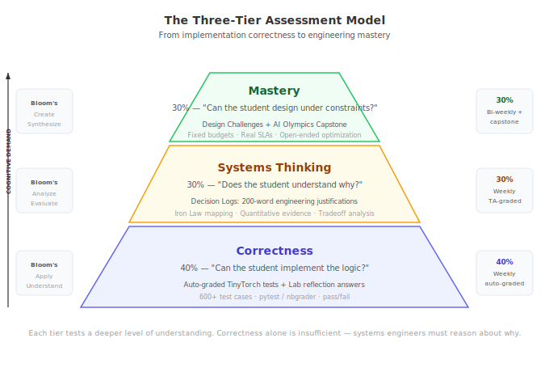

This guide provides everything you need to evaluate student mastery: weighted grade structures, detailed rubrics, sample student work, and the AI Olympics capstone specification.

---

## 1. The Three-Tier Assessment Model

We recommend a 100-point scale per assignment, distributed across three tiers:

| Tier | Method | Weight | What It Tests |
|:---|:---|:---|:---|
| **Correctness** | Auto-graded tests (TinyTorch, Lab answers) | 40% | Can the student implement the logic? |
| **Systems Thinking** | Decision Logs (200-word justifications) | 30% | Does the student understand *why*? |
| **Mastery** | Design Challenges (open-ended optimization) | 30% | Can the student apply theory to new problems? |

### Grading Load Estimates

Plan your TA staffing based on these estimates:

| Task | Time per Student | Frequency | 30-Student Section | 60-Student Class |
|:---|:---|:---|:---|:---|
| Decision Log grading | 3–5 min | Weekly | ~2 hrs/week | ~4 hrs/week |
| TinyTorch systems questions | 5–8 min | Weekly | ~3 hrs/week | ~6 hrs/week |
| Design Challenges | 10–15 min | Bi-weekly | ~4 hrs bi-weekly | ~8 hrs bi-weekly |
| TinyTorch auto-grading | Automated | Weekly | ~10 min (review flags) | ~20 min |

::: {.callout-tip}
## Efficiency Tip
Use the [3-question speed rubric](ta-guide.qmd) for Decision Logs — it cuts grading time by ~40% while maintaining consistency. Grade all logs for one week in a single sitting.
:::

### Semester-Level Grade Breakdown

**Semester 1 (Foundations):**

| Component | Weight | Count |
|:---|:---|:---|
| TinyTorch Modules | 35% | 8 modules |
| Lab Decision Logs | 25% | 15 labs |
| Design Challenges (Part C) | 20% | 4 major (one per Part) |
| Capstone (AI Olympics) | 20% | 1 |

**Semester 2 (Scale):**

| Component | Weight | Count |
|:---|:---|:---|
| Lab Decision Logs | 40% | 15 labs |
| Design Challenges | 30% | 4 major (one per Part) |
| Capstone (Fleet Synthesis) | 30% | 1 |

---

## 2. Decision Log Rubric (30 Points)

The Decision Log is the most important metacognitive artifact in the course. Use this rubric for consistent grading:

| Criterion | Excellent (10) | Adequate (6) | Insufficient (2) |
|:---|:---|:---|:---|
| **Quantitative Evidence** | Cites 3+ specific numbers from instruments (latency, memory, throughput, accuracy). | Cites 1–2 numbers. | No numbers; vague assertions ("it was faster"). |
| **Causal Reasoning** | Explains *why* using Iron Law terms or Roofline terminology. Maps the optimization to a specific equation term. | Describes *what* happened but misses the "why." | Lists observations without explanation. |
| **Constraint Awareness** | Explicitly addresses tradeoffs (e.g., "Trading 1.2% accuracy for 4x throughput to meet the 50ms SLA"). | Mentions constraints but doesn't quantify the tradeoff. | Ignores constraints entirely. |

### Sample Decision Log: Excellent (30/30)

> **Lab 09: Quantization — Part C Decision Log**
>
> I recommend deploying the MobileNetV2 model with INT8 post-training quantization for the Seeed XIAO target.
>
> **Evidence:** INT8 quantization reduced model size from 14.2 MB to 3.6 MB (3.9x compression), meeting the 4 MB flash constraint. Inference latency dropped from 48.3ms to 12.1ms (3.99x speedup), well under the 50ms SLA. Accuracy decreased from 91.4% to 90.2% (1.2% drop).
>
> **Reasoning:** The dominant bottleneck on this device is the $D_{vol}/BW$ term — the 256KB SRAM cannot hold FP32 activations for the depthwise separable convolutions. INT8 reduces $D_{vol}$ by 4x, which directly unblocks the memory bandwidth constraint. The accuracy loss is negligible because MobileNetV2's architecture is inherently quantization-friendly (no large dynamic ranges in the depthwise layers).
>
> **Tradeoff:** I rejected INT4 quantization despite its additional 2x memory savings because accuracy dropped to 84.7% (6.7% loss) — below the 88% project threshold. The marginal memory gain (1.8 MB → 0.9 MB) was not worth the accuracy cliff.

### Sample Decision Log: Insufficient (6/30)

> The quantized model was smaller and faster. I used INT8 because it seemed like a good balance. The model still worked after quantization.

*Why insufficient:* No specific numbers. No Iron Law mapping. No tradeoff analysis. No evidence of understanding *why* it worked.

---

## 3. TinyTorch Grading (100 Points per Module)

TinyTorch modules test both implementation correctness and systems understanding:

### Auto-Graded (70 Points)

- Standard unit test pass/fail via `pytest` or `nbgrader`
- Tests cover: correctness, edge cases, numerical stability
- All-or-nothing per test (no partial credit for failing tests)

### Systems Thinking Questions (30 Points)

Each module includes 3 manually-graded questions (10 points each). These ask students to reason about the systems implications of their code.

**Example questions by module:**

| Module | Sample Question |
|:---|:---|
| 01: Tensor | "Your tensor stores data in row-major order. How would inference latency change if you switched to column-major? For which operations would it matter?" |
| 06: Autograd | "Your `backward()` builds a full computation graph in memory. At what model size (number of parameters) would this become the memory bottleneck on a 16GB GPU? Show your calculation." |
| 08: Training | "Your training loop processes one batch at a time. Describe two concrete changes that would improve GPU utilization, and estimate the speedup for each." |

### Grading Scale for Systems Thinking Questions

| Score | Criteria |
|:---|:---|
| **10** | Correct reasoning with quantitative estimate. References specific hardware constraints. |
| **7** | Correct direction of reasoning but missing quantitative support or hardware specifics. |
| **4** | Partially correct but with significant conceptual errors. |
| **1** | Attempted but fundamentally misunderstands the systems implication. |

---

## 4. Design Challenge Rubric (50 Points)

Design Challenges are the Part C of labs — open-ended optimization problems with real constraints.

| Criterion | Excellent (12–13) | Adequate (7–9) | Insufficient (1–4) |
|:---|:---|:---|:---|
| **Solution Quality** | Meets all constraints (latency, memory, accuracy). Near-optimal configuration. | Meets most constraints. Reasonable but suboptimal. | Fails to meet one or more constraints. |
| **Methodology** | Systematic exploration: tried multiple approaches, justified final choice. | Tried 2–3 approaches but justification is weak. | Trial-and-error with no systematic approach. |
| **Iron Law Mapping** | Every optimization traced to a specific Iron Law term. | Some optimizations mapped, others missing. | No Iron Law references. |
| **Documentation** | Decision Log meets Excellent criteria (see above). | Decision Log meets Adequate criteria. | No meaningful documentation. |

---

## 5. The AI Olympics — Capstone Specification (Semester 1)

The course culminates in a competition: deploy the "Smart Doorbell" application across multiple hardware tracks.

### The Challenge

Design and optimize an image classification pipeline (person detection + recognition) that meets strict deployment constraints:

| Track | Device | Latency Budget | Memory Budget | Target Accuracy |
|:---|:---|:---|:---|:---|
| **Cloud** | A100 GPU | < 10ms P99 | 16 GB | > 95% |
| **Edge** | Raspberry Pi + Coral | < 50ms P99 | 1 GB | > 90% |
| **Mobile** | Simulated phone SoC | < 30ms P99 | 256 MB | > 88% |
| **Tiny** | Seeed XIAO ESP32S3 | < 100ms P99 | 256 KB | > 80% |

### Scoring (100 Points)

| Component | Points | Description |
|:---|:---|:---|
| **Metric Achievement** | 40 | Score = (Accuracy + Throughput) / (Energy + Latency). Higher is better. |
| **Engineering Report** | 40 | 1,000-word design document. Every decision mapped to Iron Law. Rubric: 10 pts quantitative evidence, 10 pts causal reasoning, 10 pts constraint awareness, 10 pts clarity. |
| **Robustness** | 20 | System is tested with distribution shift (brightness, noise, rotation). Graceful degradation > catastrophic failure. |

### Deliverables

1. **Code submission**: Model, optimization scripts, deployment configuration
2. **Design report**: 1,000 words, structured as Problem → Approach → Results → Tradeoffs
3. **Live demo**: 5-minute presentation showing deployment on target hardware (or simulation)

---

## 6. Semester 2 Assessment: Scale-Specific Criteria

As the course moves to distributed systems, assessment shifts toward reliability and economics:

### TCO Audit (Design Challenge)

*Can the student calculate the 3-year Total Cost of Ownership of their cluster design?*

Students must account for: hardware acquisition, power consumption (including PUE), network equipment, cooling, maintenance, and opportunity cost of downtime.

### Failure Recovery Analysis (Design Challenge)

*Can the student articulate how their system recovers from a node failure without restarting a 90-day training run?*

Students must specify: checkpoint frequency, recovery time, wasted computation per failure, and the cost-optimal checkpoint interval.

### Carbon Budget (Design Challenge)

*Can the student justify their datacenter location based on carbon footprint?*

Students must compare at least 3 regions (e.g., Quebec, Virginia, Iowa) using grid carbon intensity data, PUE, and renewable energy availability.
