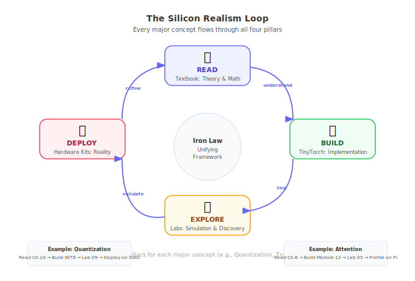
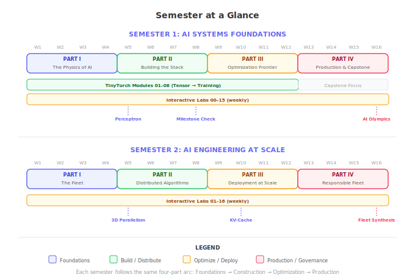

The ML Systems curriculum has four pillars. This page shows how they integrate across both semesters — so you can see, at a glance, what students do each week.

---

## The Four Pillars

| Pillar | Resource | What Students Do | Link |
|:---|:---|:---|:---|
| **Read** | Textbook (Vol I or II) | Study principles, equations, and case studies | [mlsysbook.ai](https://mlsysbook.ai) |
| **Build** | TinyTorch | Implement framework internals from scratch | [mlsysbook.ai/tinytorch](https://mlsysbook.ai/tinytorch/) |
| **Explore** | Interactive Labs | Manipulate simulated hardware, discover tradeoffs | [mlsysbook.ai/labs](https://mlsysbook.ai/labs/) |
| **Deploy** | Hardware Kits | Run models on real edge devices | [mlsysbook.ai/kits](https://mlsysbook.ai/kits/) |

The **Theory → Build → Simulation → Reality** loop is the core pedagogical cycle. For every major concept (Convolutions, Quantization, Distributed Training), students read the theory, implement it in TinyTorch, explore it in a simulation lab, and (optionally) deploy it on real hardware.

---

## Semester at a Glance

---

## Semester 1: Foundations — Week-by-Week Integration

| Week | Part | Read | Build (TinyTorch) | Explore (Lab) |
|:---|:---|:---|:---|:---|
| 1 | I | [Introduction](https://mlsysbook.ai/vol1/introduction.html) | [Module 01: Tensor](https://mlsysbook.ai/tinytorch/modules/01_tensor_ABOUT.html) | [Lab 00](https://mlsysbook.ai/labs/vol1/lab_00_introduction.html) |
| 2 | I | [ML Systems](https://mlsysbook.ai/vol1/ml_systems.html) | Module 01 (cont.) | [Lab 01](https://mlsysbook.ai/labs/vol1/lab_01_ml_intro.html) |
| 3 | I | [ML Workflow](https://mlsysbook.ai/vol1/ml_workflow.html) | [Module 02: Activations](https://mlsysbook.ai/tinytorch/modules/02_activations_ABOUT.html) | [Lab 02](https://mlsysbook.ai/labs/vol1/lab_02_ml_systems.html) |
| 4 | I | [Data Engineering](https://mlsysbook.ai/vol1/data_engineering.html) | Module 02 (cont.) | [Lab 03](https://mlsysbook.ai/labs/vol1/lab_03_ml_workflow.html) |
| 5 | II | [Neural Computation](https://mlsysbook.ai/vol1/dl_primer.html) | [Module 03: Layers](https://mlsysbook.ai/tinytorch/modules/03_layers_ABOUT.html) | [Lab 04](https://mlsysbook.ai/labs/vol1/lab_04_data_engr.html) |
| 6 | II | [NN Architectures](https://mlsysbook.ai/vol1/nn_architectures.html) | [Module 04: Losses](https://mlsysbook.ai/tinytorch/modules/04_losses_ABOUT.html) | [Lab 05](https://mlsysbook.ai/labs/vol1/lab_05_nn_compute.html) |
| 7 | II | [ML Frameworks](https://mlsysbook.ai/vol1/frameworks.html) | [Module 05: DataLoader](https://mlsysbook.ai/tinytorch/modules/05_dataloader_ABOUT.html) | [Lab 06](https://mlsysbook.ai/labs/vol1/lab_06_nn_arch.html) |
| 8 | II | [Training](https://mlsysbook.ai/vol1/training.html) | [Module 06: Autograd](https://mlsysbook.ai/tinytorch/modules/06_autograd_ABOUT.html) | [Lab 07](https://mlsysbook.ai/labs/vol1/lab_07_ml_frameworks.html) |
| 9 | III | [Data Selection](https://mlsysbook.ai/vol1/data_selection.html) | [Module 07: Optimizers](https://mlsysbook.ai/tinytorch/modules/07_optimizers_ABOUT.html) | [Lab 08](https://mlsysbook.ai/labs/vol1/lab_08_model_train.html) |
| 10 | III | [Model Compression](https://mlsysbook.ai/vol1/model_compression.html) | [Module 08: Training](https://mlsysbook.ai/tinytorch/modules/08_training_ABOUT.html) | [Lab 09](https://mlsysbook.ai/labs/vol1/lab_09_data_selection.html) |
| 11 | III | [HW Acceleration](https://mlsysbook.ai/vol1/hw_acceleration.html) | Module 08 (cont.) | [Lab 10](https://mlsysbook.ai/labs/vol1/lab_10_model_compress.html) |
| 12 | III | [Benchmarking](https://mlsysbook.ai/vol1/benchmarking.html) | *Catch-up* | [Lab 11](https://mlsysbook.ai/labs/vol1/lab_11_hw_accel.html) |
| 13 | IV | [Model Serving](https://mlsysbook.ai/vol1/serving.html) | *Capstone prep* | [Lab 12](https://mlsysbook.ai/labs/vol1/lab_12_perf_bench.html) |
| 14 | IV | [ML Operations](https://mlsysbook.ai/vol1/ops.html) | *Capstone prep* | [Lab 13](https://mlsysbook.ai/labs/vol1/lab_13_model_serving.html) |
| 15 | IV | [Responsible Engr.](https://mlsysbook.ai/vol1/responsible_engr.html) | *Capstone work* | [Lab 14](https://mlsysbook.ai/labs/vol1/lab_14_ml_ops.html) |
| 16 | IV | [Conclusion](https://mlsysbook.ai/vol1/conclusion.html) | *AI Olympics* | [Lab 15](https://mlsysbook.ai/labs/vol1/lab_15_responsible_engr.html) |

---

## Semester 2: Scale — Week-by-Week Integration

| Week | Part | Read | Explore (Lab) |
|:---|:---|:---|:---|
| 1 | I | [Introduction to Scale](https://mlsysbook.ai/vol2/introduction.html) | [Lab 01](https://mlsysbook.ai/labs/vol2/lab_01_introduction.html) |
| 2 | I | [Compute Infrastructure](https://mlsysbook.ai/vol2/compute_infrastructure.html) | [Lab 02](https://mlsysbook.ai/labs/vol2/lab_02_compute_infra.html) |
| 3 | I | [Network Fabrics](https://mlsysbook.ai/vol2/network_fabrics.html) | [Lab 03](https://mlsysbook.ai/labs/vol2/lab_03_communication.html) |
| 4 | I | [Data Storage](https://mlsysbook.ai/vol2/data_storage.html) | [Lab 04](https://mlsysbook.ai/labs/vol2/lab_04_data_storage.html) |
| 5 | II | [Distributed Training](https://mlsysbook.ai/vol2/distributed_training.html) | [Lab 05](https://mlsysbook.ai/labs/vol2/lab_05_dist_train.html) |
| 6 | II | [Collective Communication](https://mlsysbook.ai/vol2/collective_communication.html) | [Lab 06](https://mlsysbook.ai/labs/vol2/lab_06_fault_tolerance.html) |
| 7 | II | [Fault Tolerance](https://mlsysbook.ai/vol2/fault_tolerance.html) | [Lab 07](https://mlsysbook.ai/labs/vol2/lab_07_fleet_orch.html) |
| 8 | II | [Fleet Orchestration](https://mlsysbook.ai/vol2/fleet_orchestration.html) | [Lab 08](https://mlsysbook.ai/labs/vol2/lab_08_inference.html) |
| 9 | III | [Performance Engineering](https://mlsysbook.ai/vol2/performance_engineering.html) | [Lab 09](https://mlsysbook.ai/labs/vol2/lab_09_perf_engineering.html) |
| 10 | III | [Inference at Scale](https://mlsysbook.ai/vol2/inference.html) | [Lab 10](https://mlsysbook.ai/labs/vol2/lab_10_edge_intelligence.html) |
| 11 | III | [Edge Intelligence](https://mlsysbook.ai/vol2/edge_intelligence.html) | [Lab 11](https://mlsysbook.ai/labs/vol2/lab_11_ops_scale.html) |
| 12 | III | [Ops at Scale](https://mlsysbook.ai/vol2/ops_scale.html) | [Lab 12](https://mlsysbook.ai/labs/vol2/lab_12_security_privacy.html) |
| 13 | IV | [Security & Privacy](https://mlsysbook.ai/vol2/security_privacy.html) | [Lab 13](https://mlsysbook.ai/labs/vol2/lab_13_robust_ai.html) |
| 14 | IV | [Robust AI](https://mlsysbook.ai/vol2/robust_ai.html) | [Lab 14](https://mlsysbook.ai/labs/vol2/lab_14_sustainable_ai.html) |
| 15 | IV | [Sustainable AI](https://mlsysbook.ai/vol2/sustainable_ai.html) + [Responsible AI](https://mlsysbook.ai/vol2/responsible_ai.html) | [Lab 15](https://mlsysbook.ai/labs/vol2/lab_15_responsible_ai.html) |
| 16 | IV | [Conclusion](https://mlsysbook.ai/vol2/conclusion.html) | [Lab 16](https://mlsysbook.ai/labs/vol2/lab_16_fleet_synthesis.html) |

---

## Hardware Kit Integration Points

Hardware kits are optional but provide powerful "reality checks" at specific moments:

| Week (Sem 1) | Chapter | Hardware Activity | Device |
|:---|:---|:---|:---|
| 4 | Data Engineering | Sensor data collection | Arduino Nano 33 BLE |
| 10 | Model Compression | Deploy quantized model | Seeed XIAO ESP32S3 |
| 11 | HW Acceleration | Profile inference | Raspberry Pi + Coral |
| 16 | Capstone | AI Olympics deployment | All three devices |

::: {.callout-tip}
## No Hardware? No Problem.
All hardware experiences are replicated in the interactive labs via [`mlsysim`](https://mlsysbook.ai/mlsysim/). Labs simulate the exact memory constraints, thermal limits, and latency profiles of real devices.
:::

---

## The Unifying Thread: The Iron Law

Every optimization in both semesters maps to a specific term in the Iron Law:

$$T \approx \frac{D_{vol}}{BW} + \frac{O}{R_{peak} \cdot \eta} + L_{lat}$$

| Term | Represents | Sem 1 Examples | Sem 2 Examples |
|:---|:---|:---|:---|
| $D_{vol}$ | Data volume | Quantization, pruning | Gradient compression |
| $BW$ | Bandwidth | Memory hierarchy | InfiniBand, all-reduce |
| $O$ | Operations | FLOPs, batch size | 3D parallelism |
| $R_{peak}$ | Peak compute | Tensor Cores | Multi-node scaling |
| $\eta$ | Efficiency | GPU starvation | Pipeline bubbles |
| $L_{lat}$ | Latency overhead | Kernel launch | Network latency |

---

Ready to dive into the details? Choose your syllabus: [**Foundations (Semester 1)**](foundations-syllabus.qmd) | [**Scale (Semester 2)**](scale-syllabus.qmd)
