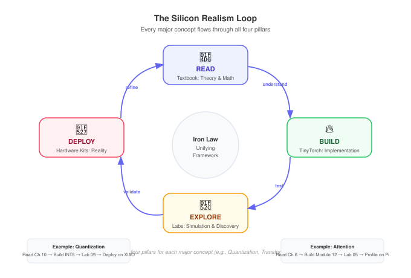
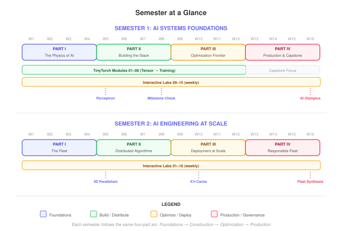

The ML Systems curriculum has four pillars. This page shows how they integrate across both semesters — so you can see, at a glance, what students do each week.

---

## The Four Pillars

| Pillar | Resource | What Students Do | Link |
|:---|:---|:---|:---|
| **Read** | Textbook (Vol I or II) | Study principles, equations, and case studies | [mlsysbook.ai](https://mlsysbook.ai) |
| **Build** | TinyTorch | Implement framework internals from scratch | [mlsysbook.ai/tinytorch](https://mlsysbook.ai/tinytorch/) |
| **Explore** | Interactive Labs | Manipulate simulated hardware, discover tradeoffs | [mlsysbook.ai/labs](https://mlsysbook.ai/labs/) |
| **Deploy** | Hardware Kits | Run models on real edge devices | [mlsysbook.ai/kits](https://mlsysbook.ai/kits/) |

The **Theory → Build → Simulation → Reality** loop is the core pedagogical cycle. For every major concept (Convolutions, Quantization, Distributed Training), students read the theory, implement it in TinyTorch, explore it in a simulation lab, and (optionally) deploy it on real hardware.

---

## Semester at a Glance

---

## Semester 1: Foundations — Week-by-Week Integration

| Week | Part | Read | Build (TinyTorch) | Explore (Lab) |
|:---|:---|:---|:---|:---|
| 1 | I | [Introduction](https://mlsysbook.ai/vol1/01_introduction/01_introduction.html) | [Module 01: Tensor](https://mlsysbook.ai/tinytorch/modules/01_tensor.html) | [Lab 00](https://mlsysbook.ai/labs/vol1/lab_00_introduction/) |
| 2 | I | [ML Systems](https://mlsysbook.ai/vol1/02_ml_systems/02_ml_systems.html) | Module 01 (cont.) | [Lab 01](https://mlsysbook.ai/labs/vol1/lab_01_ml_intro/) |
| 3 | I | [ML Workflow](https://mlsysbook.ai/vol1/03_ml_workflow/03_ml_workflow.html) | [Module 02: Activations](https://mlsysbook.ai/tinytorch/modules/02_activations.html) | [Lab 02](https://mlsysbook.ai/labs/vol1/lab_02_ml_systems/) |
| 4 | I | [Data Engineering](https://mlsysbook.ai/vol1/04_data_engineering/04_data_engineering.html) | Module 02 (cont.) | [Lab 03](https://mlsysbook.ai/labs/vol1/lab_03_ml_workflow/) |
| 5 | II | [Neural Computation](https://mlsysbook.ai/vol1/05_nn_computation/05_nn_computation.html) | [Module 03: Layers](https://mlsysbook.ai/tinytorch/modules/03_layers.html) | [Lab 04](https://mlsysbook.ai/labs/vol1/lab_04_data_engr/) |
| 6 | II | [NN Architectures](https://mlsysbook.ai/vol1/06_nn_architectures/06_nn_architectures.html) | [Module 04: Losses](https://mlsysbook.ai/tinytorch/modules/04_losses.html) | [Lab 05](https://mlsysbook.ai/labs/vol1/lab_05_nn_compute/) |
| 7 | II | [ML Frameworks](https://mlsysbook.ai/vol1/07_frameworks/07_frameworks.html) | [Module 05: DataLoader](https://mlsysbook.ai/tinytorch/modules/05_dataloader.html) | [Lab 06](https://mlsysbook.ai/labs/vol1/lab_06_nn_arch/) |
| 8 | II | [Training](https://mlsysbook.ai/vol1/08_training/08_training.html) | [Module 06: Autograd](https://mlsysbook.ai/tinytorch/modules/06_autograd.html) | [Lab 07](https://mlsysbook.ai/labs/vol1/lab_07_ml_frameworks/) |
| 9 | III | [Data Selection](https://mlsysbook.ai/vol1/09_data_selection/09_data_selection.html) | [Module 07: Optimizers](https://mlsysbook.ai/tinytorch/modules/07_optimizers.html) | [Lab 08](https://mlsysbook.ai/labs/vol1/lab_08_model_train/) |
| 10 | III | [Model Compression](https://mlsysbook.ai/vol1/10_model_compression/10_model_compression.html) | [Module 08: Training](https://mlsysbook.ai/tinytorch/modules/08_training.html) | [Lab 09](https://mlsysbook.ai/labs/vol1/lab_09_data_selection/) |
| 11 | III | [HW Acceleration](https://mlsysbook.ai/vol1/11_hw_acceleration/11_hw_acceleration.html) | Module 08 (cont.) | [Lab 10](https://mlsysbook.ai/labs/vol1/lab_10_model_compress/) |
| 12 | III | [Benchmarking](https://mlsysbook.ai/vol1/12_benchmarking/12_benchmarking.html) | *Catch-up* | [Lab 11](https://mlsysbook.ai/labs/vol1/lab_11_hw_accel/) |
| 13 | IV | [Model Serving](https://mlsysbook.ai/vol1/13_model_serving/13_model_serving.html) | *Capstone prep* | [Lab 12](https://mlsysbook.ai/labs/vol1/lab_12_perf_bench/) |
| 14 | IV | [ML Operations](https://mlsysbook.ai/vol1/14_ml_ops/14_ml_ops.html) | *Capstone prep* | [Lab 13](https://mlsysbook.ai/labs/vol1/lab_13_model_serving/) |
| 15 | IV | [Responsible Engr.](https://mlsysbook.ai/vol1/15_responsible_engr/15_responsible_engr.html) | *Capstone work* | [Lab 14](https://mlsysbook.ai/labs/vol1/lab_14_ml_ops/) |
| 16 | IV | [Conclusion](https://mlsysbook.ai/vol1/16_conclusion/16_conclusion.html) | *AI Olympics* | [Lab 15](https://mlsysbook.ai/labs/vol1/lab_15_responsible_engr/) |

---

## Semester 2: Scale — Week-by-Week Integration

| Week | Part | Read | Explore (Lab) |
|:---|:---|:---|:---|
| 1 | I | [Introduction to Scale](https://mlsysbook.ai/vol2/01_introduction/01_introduction.html) | [Lab 01](https://mlsysbook.ai/labs/vol2/lab_01_introduction.html) |
| 2 | I | [Compute Infrastructure](https://mlsysbook.ai/vol2/02_compute_infrastructure/02_compute_infrastructure.html) | [Lab 02](https://mlsysbook.ai/labs/vol2/lab_02_compute_infra.html) |
| 3 | I | [Network Fabrics](https://mlsysbook.ai/vol2/03_network_fabrics/03_network_fabrics.html) | [Lab 03](https://mlsysbook.ai/labs/vol2/lab_03_communication.html) |
| 4 | I | [Data Storage](https://mlsysbook.ai/vol2/04_data_storage/04_data_storage.html) | [Lab 04](https://mlsysbook.ai/labs/vol2/lab_04_data_storage.html) |
| 5 | II | [Distributed Training](https://mlsysbook.ai/vol2/05_distributed_training/05_distributed_training.html) | [Lab 05](https://mlsysbook.ai/labs/vol2/lab_05_dist_train.html) |
| 6 | II | [Collective Communication](https://mlsysbook.ai/vol2/06_collective_communication/06_collective_communication.html) | [Lab 06](https://mlsysbook.ai/labs/vol2/lab_06_collective_communication.html) |
| 7 | II | [Fault Tolerance](https://mlsysbook.ai/vol2/07_fault_tolerance/07_fault_tolerance.html) | [Lab 07](https://mlsysbook.ai/labs/vol2/lab_07_fault_tolerance.html) |
| 8 | II | [Fleet Orchestration](https://mlsysbook.ai/vol2/08_fleet_orchestration/08_fleet_orchestration.html) | [Lab 08](https://mlsysbook.ai/labs/vol2/lab_08_fleet_orch.html) |
| 9 | III | [Performance Engineering](https://mlsysbook.ai/vol2/09_performance_engineering/09_performance_engineering.html) | [Lab 09](https://mlsysbook.ai/labs/vol2/lab_09_perf_engineering.html) |
| 10 | III | [Inference at Scale](https://mlsysbook.ai/vol2/10_inference/10_inference.html) | [Lab 10](https://mlsysbook.ai/labs/vol2/lab_10_inference.html) |
| 11 | III | [Edge Intelligence](https://mlsysbook.ai/vol2/11_edge_intelligence/11_edge_intelligence.html) | [Lab 11](https://mlsysbook.ai/labs/vol2/lab_11_edge_intelligence.html) |
| 12 | III | [Ops at Scale](https://mlsysbook.ai/vol2/12_ops_scale/12_ops_scale.html) | [Lab 12](https://mlsysbook.ai/labs/vol2/lab_12_ops_scale.html) |
| 13 | IV | [Security & Privacy](https://mlsysbook.ai/vol2/13_security_privacy/13_security_privacy.html) | [Lab 13](https://mlsysbook.ai/labs/vol2/lab_13_security_privacy.html) |
| 14 | IV | [Robust AI](https://mlsysbook.ai/vol2/14_robust_ai/14_robust_ai.html) | [Lab 14](https://mlsysbook.ai/labs/vol2/lab_14_robust_ai.html) |
| 15 | IV | [Sustainable AI](https://mlsysbook.ai/vol2/15_sustainable_ai/15_sustainable_ai.html) + [Responsible AI](https://mlsysbook.ai/vol2/16_responsible_ai/16_responsible_ai.html) | [Lab 15](https://mlsysbook.ai/labs/vol2/lab_15_sustainable_ai.html) · [Lab 16](https://mlsysbook.ai/labs/vol2/lab_16_responsible_ai.html) |
| 16 | IV | [Conclusion](https://mlsysbook.ai/vol2/17_conclusion/17_conclusion.html) | [Lab 17](https://mlsysbook.ai/labs/vol2/lab_17_fleet_synthesis.html) |

---

## Hardware Kit Integration Points

Hardware kits are optional but provide powerful "reality checks" at specific moments:

| Week (Sem 1) | Chapter | Hardware Activity | Device |
|:---|:---|:---|:---|
| 4 | Data Engineering | Sensor data collection | Arduino Nano 33 BLE |
| 10 | Model Compression | Deploy quantized model | Seeed XIAO ESP32S3 |
| 11 | HW Acceleration | Profile inference | Raspberry Pi + Coral |
| 16 | Capstone | AI Olympics deployment | All three devices |

::: {.callout-tip}
## No Hardware? No Problem.
All hardware experiences are grounded in the interactive labs via [`mlsysim`](https://mlsysbook.ai/mlsysim/). Labs use datasheet-based analytical models for memory constraints, power/thermal envelopes, and latency bounds.
:::

---

## Assessment and Practice Layer

Use this layer to connect weekly work to evidence of mastery. The goal is not another assignment stream; it is a consistent way to ask whether students can explain the system they just built or explored.

| Course Moment | Evidence of Mastery | Recommended Artifact | StaffML / Quiz Connection |
|:---|:---|:---|:---|
| Weekly reading | Can recall and apply the core principle | In-book quizzes or short reading checks | Chapter-aligned quizzes for vocabulary and first-order reasoning |
| Weekly labs | Can predict, measure, and explain a tradeoff | Decision Log with quantitative evidence | StaffML L2-L3 drills for the same concept area |
| TinyTorch modules | Can implement the mechanism and reason about its systems consequences | Auto-graded tests plus systems-thinking questions | StaffML L3-L4 implementation and debugging prompts |
| Hardware or simulated deployment | Can choose a design under latency, memory, power, or cost constraints | Design Challenge or deployment report | StaffML track-specific drills: Cloud, Edge, Mobile, or TinyML |
| Capstone | Can synthesize across data, algorithm, machine, and operations | AI Olympics or Fleet Synthesis report | StaffML L5-L6+ architecture chains and mock interview prompts |

For grading details, use [Assessment & Grading](assessment.qmd). For interview-style practice and question chains, use [StaffML](https://mlsysbook.ai/staffml/).

---

## The Unifying Thread: The Iron Law

Every optimization in both semesters maps to a specific term in the Iron Law:

$$T \approx \frac{D_{vol}}{BW} + \frac{O}{R_{peak} \cdot \eta} + L_{lat}$$

| Term | Represents | Sem 1 Examples | Sem 2 Examples |
|:---|:---|:---|:---|
| $D_{vol}$ | Data volume | Quantization, pruning | Gradient compression |
| $BW$ | Bandwidth | Memory hierarchy | InfiniBand, all-reduce |
| $O$ | Operations | FLOPs, batch size | 3D parallelism |
| $R_{peak}$ | Peak compute | Tensor Cores | Multi-node scaling |
| $\eta$ | Efficiency | GPU starvation | Pipeline bubbles |
| $L_{lat}$ | Latency overhead | Kernel launch | Network latency |

---

Ready to dive into the details? Choose your syllabus: [**Foundations (Semester 1)**](foundations-syllabus.qmd) | [**Scale (Semester 2)**](scale-syllabus.qmd)
