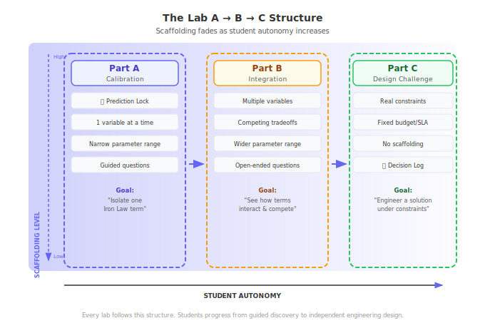

This guide explains the learning science behind the ML Systems labs and provides concrete facilitation strategies for each technique. Understanding *why* certain design choices were made helps you facilitate more effectively.

---

## 1. Predictive Processing (The Prediction Lock)

The brain learns most efficiently when its internal models fail. Each lab part begins with a **Prediction Lock** — students commit to a specific numeric answer before they can interact with instruments.

- **The Mechanism:** This is not a quiz. It is a deliberate mechanism to create **cognitive dissonance** — the gap between what students expect and what the system actually does.
- **The Science:** When a student predicts "10x GPU upgrade = 10x speedup" and the instruments reveal only 3.5x, that prediction error signal primes the brain to update its mental model of Amdahl's Law.
- **The Result:** Vague predictions lead to vague learning. Structured predictions lead to precise insights.

::: {.callout-tip}
## In-Class Activity
**"Prediction Wall" (5 min):** Before opening any lab, have students write their prediction on a sticky note and post it on the board. After the lab, revisit the wall. The visual distribution of predictions — and how wrong most of them are — is a powerful teaching moment.
:::

::: {.callout-tip}
## Discussion Prompt
After Lab 09 (Quantization): "Your prediction was that INT8 quantization would lose 5% accuracy. The actual loss was 0.3%. Why was your mental model so wrong? What does this tell you about the relationship between precision and information content?"
:::

---

## 2. Constructivism (Instruments + Failure States)

Learning is the active construction of knowledge through experience, not passive reception. The interactive instruments allow students to *build* mental models by manipulating variables and observing physical consequences.

- **The Mechanism:** High-fidelity simulation via [`mlsysim`](https://mlsysbook.ai/mlsysim/) ensures that student discoveries are grounded in real silicon physics — not toy approximations.
- **The Tactic — Engineering Failure States:** We encourage instructors to ask students to find the exact parameter value where the system **fails** (e.g., an Out-of-Memory error, a thermal throttle, or an SLA violation).
- **The Result:** The "boundary" or "wall" is often more memorable than the success state. Triggering an OOM error on a simulated Jetson device makes the memory capacity constraint visceral rather than abstract.

::: {.callout-tip}
## In-Class Activity
**"Find the Wall" (10 min):** In Lab 10 (Roofline), challenge students: "Find the exact batch size where this model transitions from memory-bound to compute-bound on an A100. You have 5 minutes." Then discuss: "What changed at that boundary? Which Iron Law term dominated before and after?"
:::

::: {.callout-tip}
## In-Class Activity
**"Break It on Purpose" (5 min):** In Lab 05 (Architecture Tradeoffs), ask: "Set the sequence length as high as possible until the Transformer runs out of memory. Now do the same for the CNN. Why does the Transformer die first?" This teaches $O(n^2)$ attention cost through experience.
:::

---

## 3. Scaffolding and Fading (A → B → C Structure)

Each lab follows a consistent three-part structure designed to transition students from guided exploration to independent engineering:

- **Part A (Calibration):** Single-variable interactions. Students learn to isolate one physical concept (e.g., just the $D_{vol}$ term of the Iron Law). Heavy scaffolding, narrow parameter ranges.
- **Part B (Integration):** Multi-variable interactions. Students see how variables compete (e.g., how batch size affects both throughput and memory). Less scaffolding, wider parameter ranges.
- **Part C (Design Challenge):** Open-ended scenario. Students are given a fixed budget or performance target and must find the optimal configuration across the full stack. No scaffolding — students must transfer what they learned in A and B.

::: {.callout-tip}
## Facilitation Strategy
**Part A → B Transition:** When students finish Part A, ask: "You just learned that increasing X improves metric Y. But what happens to metric Z?" This bridges to Part B's multi-variable interactions.

**Part B → C Transition:** When students finish Part B, say: "Now you know the tradeoffs. Here's a real constraint: $50ms latency SLA, $256KB memory budget. Design the best system you can."
:::

---

## 4. Metacognitive Reflection (The Decision Log)

Moving sliders is a lower-order cognitive task. To ensure deep learning, students must articulate *why* they made certain engineering decisions.

- **The Mechanism:** The **Decision Log** requires students to write a formal engineering justification for their recommended configuration in Part C.
- **The Standard:** Instead of "I made it smaller," students must write: "I reduced the $D_{vol}$ term via INT4 quantization to fit within the 256KB SRAM constraint, accepting a 1.2% accuracy reduction."
- **The Result:** This process of "thinking about their thinking" (metacognition) is what transfers knowledge from the lab session to real-world engineering projects.

::: {.callout-tip}
## Grading Shortcut
When grading Decision Logs, use a simple 3-question rubric: (1) Did they cite **specific numbers** from instruments? (2) Did they use **Iron Law terminology**? (3) Did they acknowledge a **tradeoff**? If yes to all three → full marks. See [Assessment](assessment.qmd) for the detailed rubric.
:::

---

## 5. The Iron Law Audit

The **Iron Law of ML Systems** ($T \approx \frac{D_{vol}}{BW} + \frac{O}{R_{peak} \cdot \eta} + L_{lat}$) is the analytical backbone of the entire curriculum.

- **The Tactic:** Train students to "audit" every performance change. If a model got faster, *which term did they manipulate?* If a system hit a wall, *which term is the bottleneck?*
- **The Goal:** By the end of the course, students should look at *any* system optimization — pruning, kernel fusion, quantization, batching, parallelism — and instantly map it to the Iron Law variable it affects.

::: {.callout-tip}
## Discussion Prompt
Use this prompt after any optimization lab: "We just saw a 3.5x speedup from [technique]. Which Iron Law term changed? Did any other term get worse? Would this technique work on a different hardware platform? Why or why not?"
:::

::: {.callout-tip}
## Running Exercise
**"Iron Law Journal" (semester-long):** Have students maintain a running table that maps every technique they encounter to its Iron Law term. By Week 16, this becomes a personal reference card for their engineering career.
:::

---

## 6. Facilitation Cheat Sheet

Quick reference for common lab facilitation patterns:

| Situation | What to Say |
|:---|:---|
| Student says "it's faster" | "How much faster? Which Iron Law term changed? Show me the number." |
| Student gets OOM error | "Good. Now find the exact value where it breaks. What constraint did you hit?" |
| Student doesn't know what to try | "Start with Part A defaults. Change one variable. What happened? Now change a different one." |
| Student's prediction was right | "Interesting — why? What mental model did you use? Does it generalize to a different hardware target?" |
| Student's prediction was wrong | "Even better. What did you assume that turned out to be false? Update your model." |
| Student finishes early | "Can you find a configuration that is 2x better than your current best? What's the theoretical limit?" |
| Lab discussion goes silent | "Who had the most wrong prediction? Let's talk about why." |
