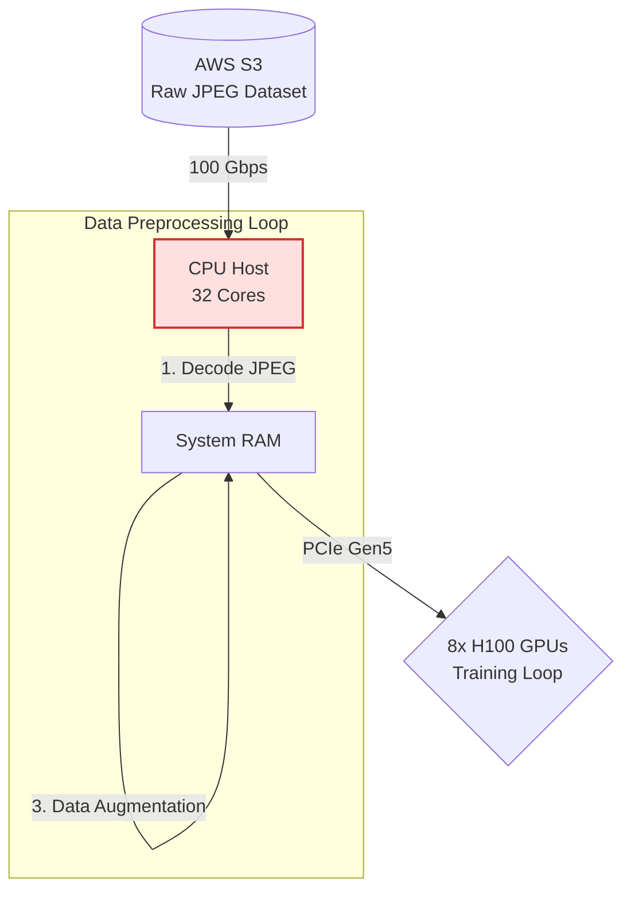
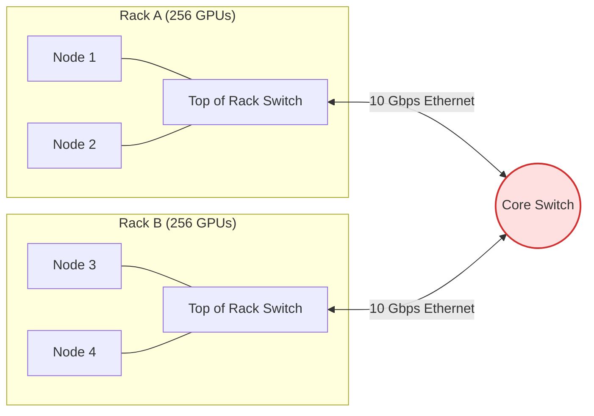

# Round 5: Visual Architecture Debugging 🖼️

The ultimate test of an AI Systems Engineer is not just reciting formulas, but spotting the bottlenecks in a proposed architecture diagram *before* it gets built. 

In this round, you are presented with systems designs that look plausible on paper but violate the fundamental physics of AI computation. Can you spot the hidden walls?

> **[➕ Add a Visual Challenge](https://github.com/harvard-edge/cs249r_book/edit/dev/interviews/05_Visual_Architecture_Debugging.md)** (Edit in Browser)

---

## 🛑 Challenge 1: The "Infinite Scale" Dataloader

**The Scenario:** The team is training a ResNet-50 model on a cluster of 8x H100s. To ensure the GPUs are never starved for data, the junior engineer designed this high-throughput ingestion pipeline.

<b>🚨 Reveal the Bottleneck</b>

### The Transformation Wall (CPU Starvation)
The bottleneck is the **CPU Host**. While the 100 Gbps network link and PCIe Gen5 bus are extremely fast, decoding and augmenting JPEGs on 32 CPU cores is painfully slow compared to the consumption rate of 8x H100s. 

The GPUs will finish their matrix multiplication in 5ms, and then sit completely idle (0% utilization) while waiting for the CPU to finish processing the next batch. 

**The Fix:** You must bypass the CPU. Use GPU-accelerated libraries (like NVIDIA DALI) to move the JPEG decoding and augmentation directly onto the GPUs, utilizing their spare ALU capacity during the data loading phase.
**📖 Deep Dive:** [Volume I: Data Engineering](https://mlsysbook.ai/vol1/data_engineering.html)

---

## 🛑 Challenge 2: The "Cost-Optimized" Training Cluster

**The Scenario:** A startup is trying to pre-train a 70B parameter LLM. To save money, the CTO purchased 512 cheaper GPUs without high-speed interconnects and wired them together using standard enterprise networking. 

<b>🚨 Reveal the Bottleneck</b>

### The Communication Wall (Amdahl's Law)
This cluster will experience **near-zero scaling efficiency**. To train a 70B model using Data Parallelism, all 512 GPUs must synchronize their gradients via an AllReduce operation at the end of *every single training step*. 

This requires moving hundreds of gigabytes of data across the network simultaneously. The 10 Gbps Ethernet uplinks to the Core Switch will instantly choke, turning a matrix-multiplication workload into a pure network-wait workload.

**The Fix:** Training large models requires specialized topologies. You need a non-blocking Fat-Tree (Clos) topology with InfiniBand (200-400 Gbps) between racks, and NVLink (900 GB/s) within the nodes. Without high **Bisection Bandwidth**, adding more GPUs actively degrades throughput.
**📖 Deep Dive:** [Volume II: Network Fabrics](https://mlsysbook.ai/vol2/network_fabrics.html)

