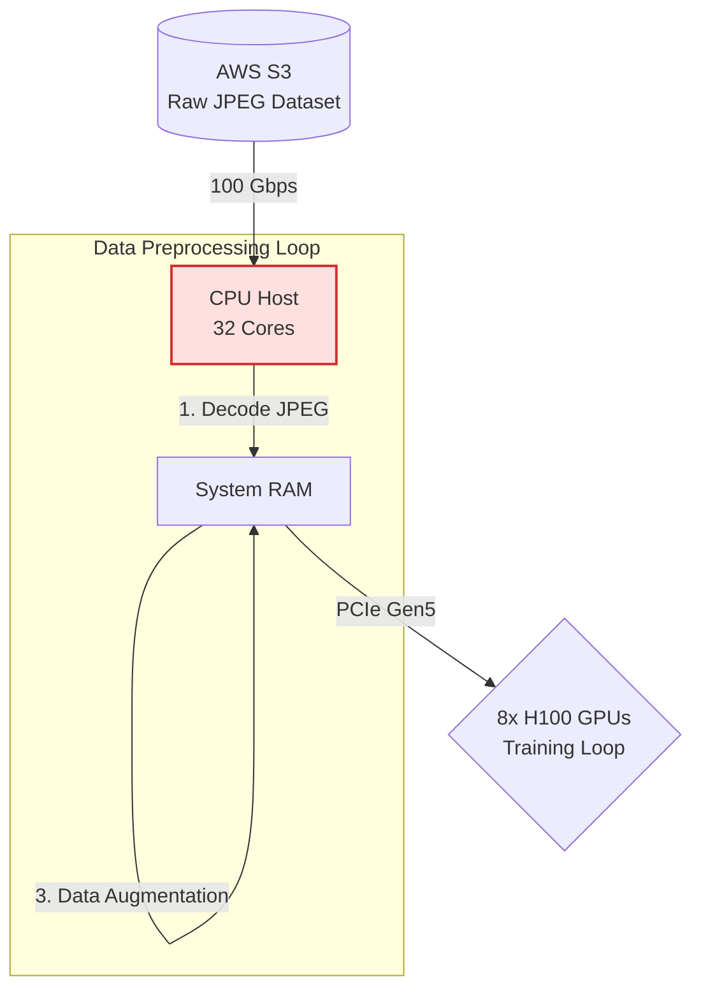
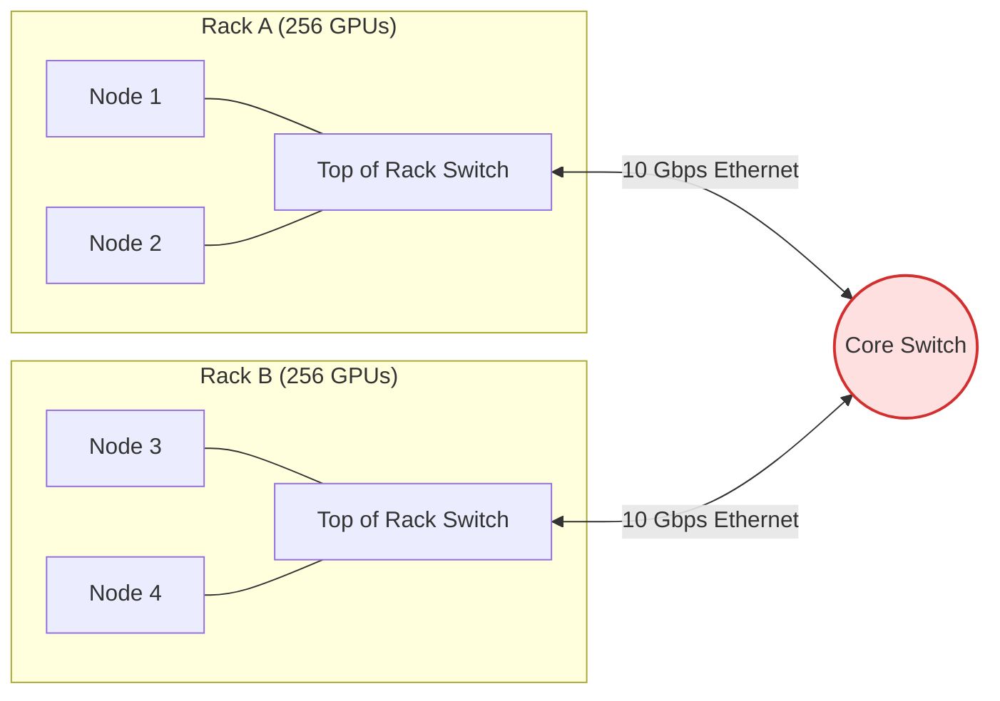
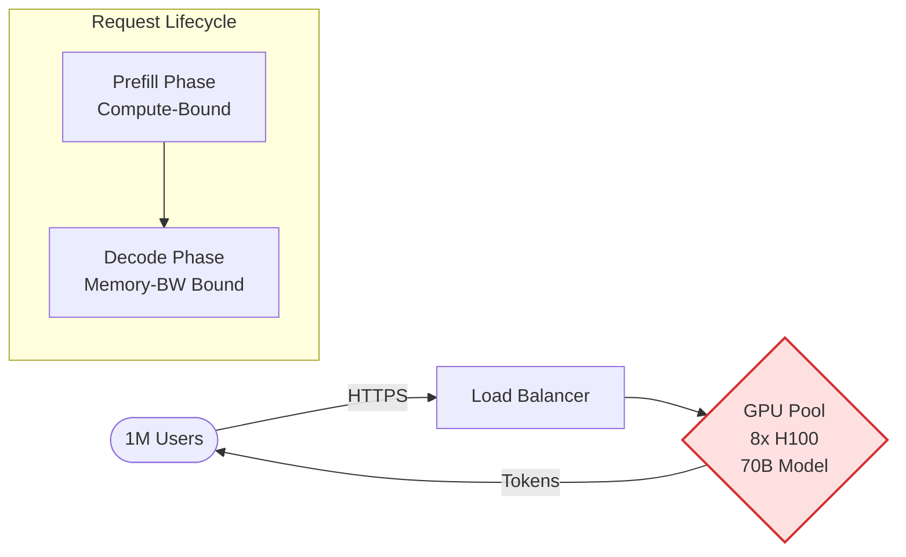
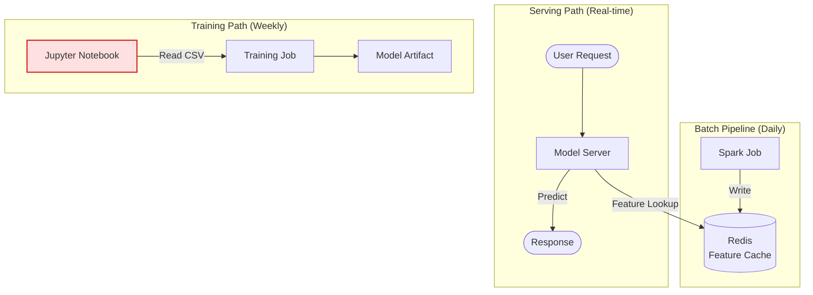
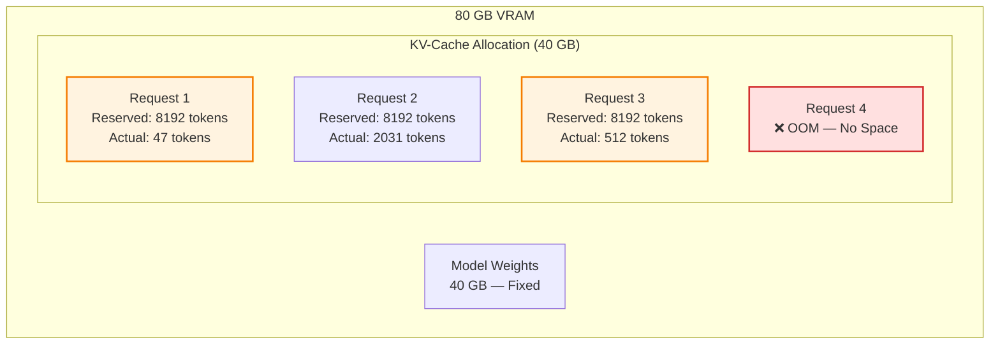
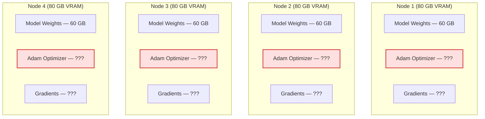

# Round 5: Visual Architecture Debugging 🖼️

  <a href="README.md">🏠 Home</a> ·
  <a href="00_The_Architects_Rubric.md">📋 Rubric</a> ·
  <a href="01_Single_Node_Physics.md">🧱 Round 1</a> ·
  <a href="02_Distributed_Infrastructure.md">🚀 Round 2</a> ·
  <a href="03_Production_Serving.md">⚡ Round 3</a> ·
  <a href="04_Operations_and_Economics.md">💼 Round 4</a> ·
  <a href="05_Visual_Architecture_Debugging.md">🖼️ Round 5</a>

---

The ultimate test of an AI Systems Engineer is not reciting formulas, but spotting the bottlenecks in a proposed architecture diagram *before* it gets built.

In this round, you are presented with systems designs that look plausible on paper but violate the fundamental physics of AI computation. **Can you spot the hidden walls?**

> **[➕ Add a Visual Challenge](https://github.com/harvard-edge/cs249r_book/edit/dev/interviews/05_Visual_Architecture_Debugging.md)** (Edit in Browser) — see [README](README.md#question-format) for the template.

---

## 🛑 Challenge 1: The "Infinite Scale" Dataloader · `data-pipeline`

**The Scenario:** The team is training a ResNet-50 model on a cluster of 8x H100s. To ensure the GPUs are never starved for data, the junior engineer designed this high-throughput ingestion pipeline.

<b>🚨 Reveal the Bottleneck</b>

### The Transformation Wall (CPU Starvation)
The bottleneck is the **CPU Host**. While the 100 Gbps network link and PCIe Gen5 bus are extremely fast, decoding and augmenting JPEGs on 32 CPU cores is painfully slow compared to the consumption rate of 8x H100s.

The GPUs will finish their matrix multiplication in 5ms, and then sit completely idle (0% utilization) while waiting for the CPU to finish processing the next batch.

**The Fix:** You must bypass the CPU. Use GPU-accelerated libraries (like NVIDIA DALI) to move the JPEG decoding and augmentation directly onto the GPUs, utilizing their spare ALU capacity during the data loading phase.

**📖 Deep Dive:** [Volume I: Data Engineering](https://mlsysbook.ai/vol1/data_engineering.html)

---

## 🛑 Challenge 2: The "Cost-Optimized" Training Cluster · `network`

**The Scenario:** A startup is trying to pre-train a 70B parameter LLM. To save money, the CTO purchased 512 cheaper GPUs without high-speed interconnects and wired them together using standard enterprise networking.

<b>🚨 Reveal the Bottleneck</b>

### The Communication Wall (Amdahl's Law)
This cluster will experience **near-zero scaling efficiency**. To train a 70B model using Data Parallelism, all 512 GPUs must synchronize their gradients via an AllReduce operation at the end of *every single training step*.

This requires moving hundreds of gigabytes of data across the network simultaneously. The 10 Gbps Ethernet uplinks to the Core Switch will instantly choke, turning a matrix-multiplication workload into a pure network-wait workload.

**The Fix:** Training large models requires specialized topologies. You need a non-blocking Fat-Tree (Clos) topology with InfiniBand (200-400 Gbps) between racks, and NVLink (900 GB/s) within the nodes. Without high **Bisection Bandwidth**, adding more GPUs actively degrades throughput.

**📖 Deep Dive:** [Volume II: Network Fabrics](https://mlsysbook.ai/vol2/network_fabrics.html)

---

## 🛑 Challenge 3: The "Simple" LLM Serving Stack · `serving` `kv-cache`

**The Scenario:** The team is deploying a 70B LLM chatbot. The architect proposes a clean, straightforward serving pipeline where all requests flow through a single model pool.

<b>🚨 Reveal the Bottleneck</b>

### The Prefill-Decode Interference
The single GPU pool is the problem. **Prefill** (processing the user's prompt) is compute-bound and monopolizes the ALUs. **Decode** (generating tokens one at a time) is memory-bandwidth bound and needs the HBM bus.

When a user sends a long prompt, the prefill phase seizes the GPU's compute units, causing all concurrent decode requests to stall. Users mid-conversation see their token stream freeze every time someone else sends a long prompt.

**The Fix:** Disaggregated Serving. Split Prefill and Decode onto separate GPU clusters. Prefill nodes compute the KV-Cache and transmit it over the network to dedicated Decode nodes. This isolates the two fundamentally different workload profiles.

**📖 Deep Dive:** [Volume II: Inference at Scale](https://mlsysbook.ai/vol2/inference.html)

---

## 🛑 Challenge 4: The "Efficient" Pipeline Parallelism · `parallelism`

**The Scenario:** The team partitions a 96-layer Transformer across 8 GPUs using Pipeline Parallelism. They assign 12 layers per GPU and send one batch at a time through the pipeline.

<b>🚨 Reveal the Bottleneck</b>

### The Pipeline Bubble
With a single batch flowing through 8 stages, **only 1 GPU is active at any given time**. The other 7 sit completely idle, waiting for activations from the previous stage. This means your utilization is $1/P = 1/8 = 12.5\%$. You paid for 8 GPUs but are using 1.

The pipeline bubble fraction is $(P-1)/M$ where $P$ is the number of stages and $M$ is the number of microbatches. With $M=1$, the bubble is $(8-1)/1 = 87.5\%$ wasted compute.

**The Fix:** Split the global batch into many microbatches ($M \gg P$). With $M=32$ microbatches, GPU 0 processes microbatch 2 while GPU 1 processes microbatch 1. The bubble shrinks to $(8-1)/32 = 21.9\%$. Techniques like 1F1B (one forward, one backward) scheduling further reduce peak memory.

**📖 Deep Dive:** [Volume II: Distributed Training](https://mlsysbook.ai/vol2/distributed_training.html)

---

## 🛑 Challenge 5: The "Scalable" Feature Store · `mlops`

**The Scenario:** The ML platform team built a feature store for their real-time recommendation system. Features are computed in a batch Spark job and served from Redis. The architecture looks clean — until Black Friday.

<b>🚨 Reveal the Bottleneck</b>

### Training-Serving Skew
The diagram hides a silent killer: the **Jupyter Notebook** computes features using different Python code than the Spark batch job that writes to Redis. The training pipeline reads CSVs with pandas transformations; the serving pipeline reads pre-computed features from Redis written by Spark.

The model achieves 95% accuracy offline but drops to 70% in production — not because the model is bad, but because it sees different feature distributions at serving time than it saw during training. This is Training-Serving Skew, and it's one of the most common production ML failures.

**The Fix:** A unified Feature Store (like Feast or Tecton) that guarantees identical feature computation logic for both training and serving. Features are defined once, computed once, and served consistently.

**📖 Deep Dive:** [Volume I: ML Operations](https://mlsysbook.ai/vol1/ml_ops.html)

---

## 🛑 Challenge 6: The "Lossless" KV-Cache · `kv-cache` `memory`

**The Scenario:** The serving team allocates VRAM for the KV-cache by reserving the maximum sequence length (8192 tokens) for every concurrent request. They have 80 GB of VRAM and the model weights take 40 GB, leaving 40 GB for the cache.

<b>🚨 Reveal the Bottleneck</b>

### KV-Cache Memory Fragmentation
The system reserves 8192 tokens worth of VRAM per request regardless of actual usage. Request 1 uses only 47 tokens but holds memory for 8192 — **wasting 99.4% of its allocation**. After just 3 requests, the system reports OOM despite having enough physical memory for dozens of short conversations.

This is the same problem that plagued early operating systems before virtual memory: contiguous allocation with massive internal fragmentation.

**The Fix:** PagedAttention (as implemented in vLLM). Instead of contiguous pre-allocation, map virtual KV-cache blocks to non-contiguous physical blocks on demand — exactly like OS virtual memory paging. This eliminates fragmentation, enabling 2-4x more concurrent requests with the same hardware.

**📖 Deep Dive:** [Volume I: Frameworks](https://mlsysbook.ai/vol1/frameworks.html)

---

## 🛑 Challenge 7: The "Redundant" Data Parallelism · `parallelism` `memory`

**The Scenario:** The team is training a 30B parameter model using standard Data Parallelism (DDP) across 4 nodes, each with 80 GB VRAM. The model weights in FP16 are 60 GB, which fits in each GPU's memory.

<b>🚨 Reveal the Bottleneck</b>

### The Optimizer State Explosion
The diagram shows 60 GB of weights fitting in 80 GB — looks fine, right? But it hides the **Optimizer State**. Adam stores two additional tensors per parameter (first and second moments), each in FP32. The full memory per GPU is:

- Weights (FP16): 60 GB
- Gradients (FP16): 60 GB
- Adam moments (FP32): 120 GB (2 × 60 GB in FP32)
- FP32 master weights: 120 GB

**Total: ~360 GB per GPU.** The system OOMs instantly on step 1 — and every GPU holds an identical redundant copy of the optimizer state.

**The Fix:** ZeRO (Zero Redundancy Optimizer) or FSDP. Instead of replicating the full optimizer state on every GPU, shard it across all workers. ZeRO Stage 3 shards weights, gradients, and optimizer states, reducing per-GPU memory from 360 GB to ~90 GB across 4 nodes.

**📖 Deep Dive:** [Volume II: Distributed Training](https://mlsysbook.ai/vol2/distributed_training.html)

