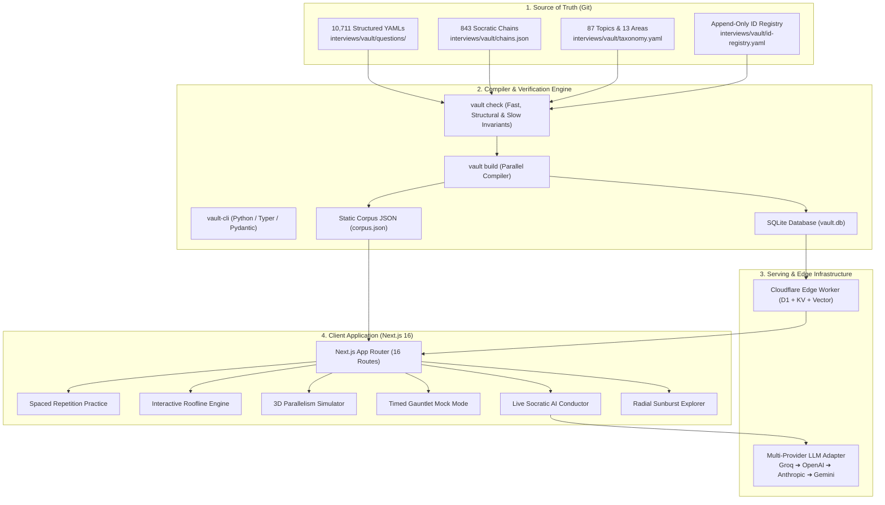
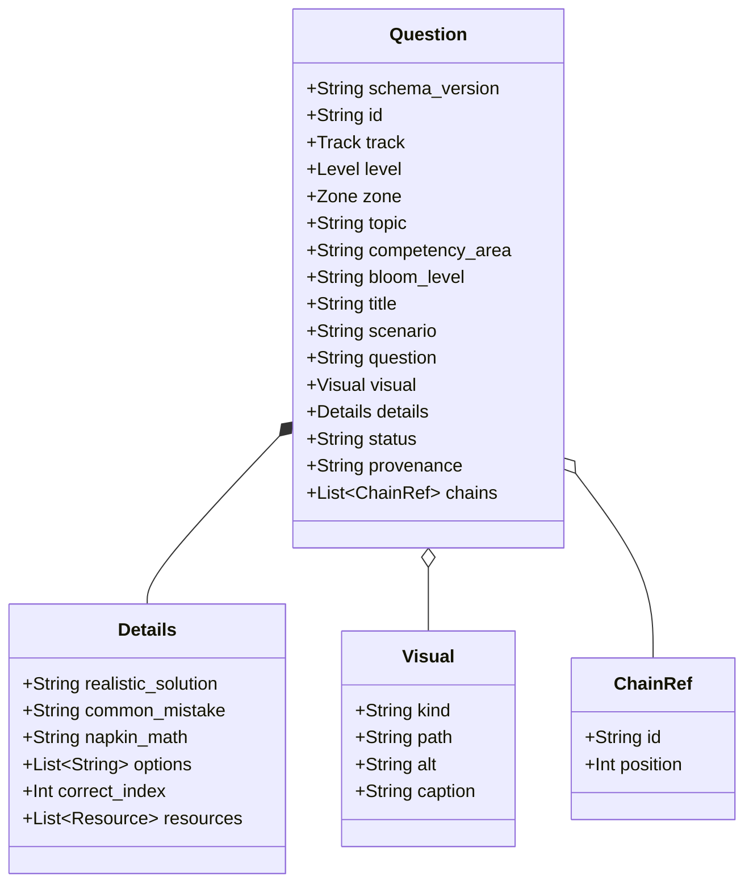
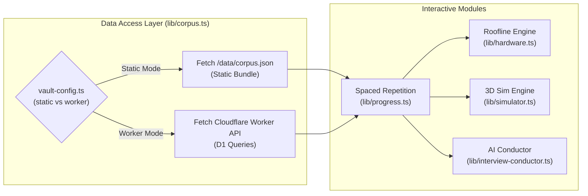
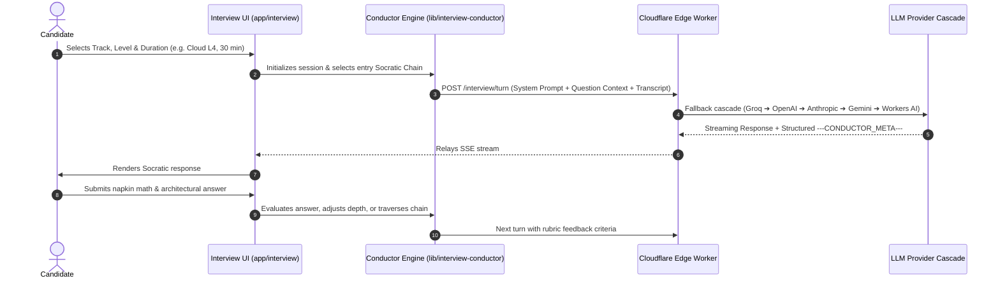

# StaffML Software Architecture

> **High-Level System Architecture & Design Blueprint**
> **Repository:** `MLSysBook` (`interviews/`)
> **Platform:** [StaffML (https://mlsysbook.ai/staffml/)](https://mlsysbook.ai/staffml/)
> **Audience:** Engineers, contributors, and systems researchers inspecting or extending the platform.

---

## 1. System Overview & Philosophy

**StaffML** is an open-source, physics-grounded preparation and evaluation platform for machine learning systems engineers. Unlike conventional software engineering interview prep (which centers on algorithmic complexity and data structures), ML systems interviews require reasoning about physical hardware constraints: memory bandwidth limits, compute rooflines, interconnect bisections, numerical precision, and thermal/power budgets.

The central design principle of StaffML is:
> *You can generate the code, but you cannot prompt your way out of a silicon bottleneck.*



The system is decoupled into four modular pillars:
1. **The Question Vault**: A human-first, git-tracked corpus of 10,711 validated YAML files conforming to LinkML/Pydantic schemas.
2. **The Build & Tooling Layer (`vault-cli`)**: A high-performance compiler that validates invariants, tracks content hashes, and compiles SQLite (`vault.db`) and static bundles.
3. **The Web Application (`staffml/`)**: A Next.js 16 App Router application supporting dual runtime modes (local static fallback vs edge-connected D1).
4. **The Edge & LLM Conductor (`staffml-vault-worker` & `staffml/worker`)**: A Cloudflare Edge Worker providing low-latency Socratic mock interviewing via a resilient multi-provider fallback cascade.

---

## 2. Pillar 1: The Question Vault & Data Model

### 2.1 Four-Axis Classification Schema

Every question in the vault is classified along four orthogonal axes enforced by LinkML schema v1.0 and Pydantic models:



- **Track (`track`)**: Deployment domain — `cloud`, `edge`, `mobile`, `tinyml`, or `global`.
- **Level (`level`)**: Bloom's Taxonomy depth — `L1` (Recall), `L2` (Understand), `L3` (Apply), `L4` (Analyze), `L5` (Evaluate), `L6+` (Create/Architect).
- **Zone (`zone`)**: 11 Ikigai problem zones — `recall`, `fluency`, `implement`, `analyze`, `diagnosis`, `specification`, `evaluation`, `mastery`, `optimization`, `design`, `realization`.
- **Competency Area (`competency_area`)**: 13 technical disciplines — `architecture`, `compute`, `memory`, `networking`, `optimization`, `deployment`, `latency`, `power`, `precision`, `reliability`, `data`, `parallelism`, `cross-cutting`.

### 2.2 Socratic Chains

Questions do not exist in isolation; they are linked into **Socratic Chains** (`interviews/vault/chains.json`). A chain represents a pedagogical progression through an ML systems problem:
1. **Entry Point (L1/L2)**: Establishes baseline facts (e.g. GPU memory bandwidth or FlashAttention tile size).
2. **Application & Math (L3)**: Requires arithmetic derivation (e.g. arithmetic intensity or KV cache sizing).
3. **System Breakdown & Analysis (L4/L5)**: Diagnoses bottlenecks under scale (e.g. pipeline bubbles, NCCL ring contention, thermal throttling).
4. **Architecture & Synthesis (L6+)**: Evaluates holistic trade-offs under competing constraints.

Chains support two progression tiers:
- **Primary Tier**: Strict Bloom monotonic progression ($\Delta \in \{1, 2\}$).
- **Secondary Tier**: Lenient coverage sweeps ($\Delta \in \{0, 1, 2, 3\}$).

### 2.3 Cryptographic Integrity & Merkle Release Hashes

Every question receives a deterministic `content_hash` (SHA-256 over normalized canonical JSON of semantic fields). Releases compute a **Merkle root** (`release_hash`) over all published question hashes, taxonomy, chains, zones, and release policy. This provides cryptographic verification for academic citation and drift detection across deployments.

---

## 3. Pillar 2: The CLI & Compiler (`vault-cli`)

`vault-cli` is a typed Python package built with Typer and Rich.

```
vault-cli/
├── src/vault_cli/
│   ├── main.py             # CLI entry point
│   ├── loader.py           # Parallel YAML filesystem loader + sidecar chain joiner
│   ├── validator.py        # Multi-tier invariant validation
│   ├── compiler.py         # SQLite / D1 compiler (compiles vault.db)
│   ├── models.py           # Pydantic schema models
│   ├── hashing.py          # Deterministic SHA-256 & Merkle tree calculation
│   ├── legacy_export.py    # Generates public/data/corpus.json
│   └── commands/           # check, doctor, build, publish, ship, new, promote
└── tests/                  # Pytest test suite (97 tests)
```

### 3.1 Invariant Validation Tiers

`vault check` executes three validation tiers:
- **Fast Tier (<1s)**: Schema validation, unique ID registry check, path lowercase conventions, required fields.
- **Structural Tier (<10s)**: Cross-references between taxonomy, topics, chains, 3-part `common_mistake` markers (`**The Pitfall:**`, `**The Rationale:**`, `**The Consequence:**`), `napkin_math` structure, and visual asset existence.
- **Slow Tier**: Link-rot checks across external documentation URLs and LLM math verification.

---

## 4. Pillar 3: Web Application Architecture (`staffml/`)

The frontend is built with **Next.js 16 (App Router)**, TypeScript, Tailwind CSS, KaTeX, and Framer Motion.



### 4.1 Dual-Mode Runtime Architecture

The web application supports two runtime modes via `src/lib/vault-config.ts`:
1. **Worker Mode (`worker`)**: Light initial page load. Fetches catalog metadata initially and retrieves heavy fields (`scenario`, `details.*`) lazily from the Cloudflare Worker API.
2. **Static Mode (`static`)**: Fully offline-capable and zero-dependency. Bundles the compiled `corpus.json` in `public/data/` for standalone local deployment or static hosting.

### 4.2 Spaced Repetition Engine (`lib/progress.ts`)

StaffML implements an adapted SuperMemo SM-2 spaced repetition algorithm stored locally in browser `localStorage`:
- **Interval Progression**: Successful recalls advance review intervals (1 day $\rightarrow$ 3 days $\rightarrow$ 7 days $\rightarrow$ 14 days $\rightarrow$ 30 days).
- **Mistake Recycling**: Incorrect ratings reset the repetition interval to 1 day, surfacing the question in tomorrow's review queue.
- **Privacy First**: All candidate progress, ratings, and custom study plans remain 100% browser-local without mandatory user accounts or telemetry tracking.

### 4.3 Interactive Calculators & Simulators

1. **Roofline Model Engine (`app/roofline/page.tsx`, `lib/hardware.ts`)**:
   - Calculates arithmetic intensity $\text{AI} = \frac{\text{FLOPs}}{\text{Bytes}}$ against hardware peak compute ($T_{\text{peak}}$) and memory bandwidth ($B_{\text{mem}}$).
   - Computes the hardware ridge point $I_{\text{ridge}} = \frac{T_{\text{peak}}}{B_{\text{mem}}}$.
   - Plots operational points for standard workloads (BERT, ResNet, GPT-2, LLaMA-70B FP16/INT8).

2. **Distributed Training Cluster Simulator (`app/simulator/page.tsx`, `lib/simulator.ts`)**:
   - Models 3D parallelism: Tensor Parallelism (TP), Pipeline Parallelism (PP), Data Parallelism (DP), and ZeRO-1/2/3.
   - Calculates per-GPU memory breakdown (Weights, Gradients, Optimizer States, Activation Memory).
   - Computes Ring AllReduce communication latency across hierarchical networks (NVLink intra-node vs InfiniBand NDR inter-node).
   - Computes Model FLOPs Utilization (MFU), cluster Mean Time Between Failures (MTBF), and end-to-end training durations.

3. **Radial Sunburst Explorer (`app/explore/page.tsx`)**:
   - Interactive SVG sunburst visualizer enabling drill-down across Track $\rightarrow$ Competency Area $\rightarrow$ Topic $\rightarrow$ Question Level with search filtering.

---

## 5. Pillar 4: Socratic AI Conductor & Multi-Provider Relay

The live interview experience (`/interview`) pairs candidates with an AI Socratic interviewer powered by `staffml-vault-worker` and `lib/interview-conductor.ts`.



### 5.1 Multi-Provider Fallback Cascade

To ensure 99.99% uptime and low latency for live mock interviews, the Cloudflare Worker relays requests through a prioritized multi-provider cascade:
1. **Groq** (`llama-3.3-70b-versatile` / `mixtral-8x7b`): Ultra-low time-to-first-token (<200ms).
2. **OpenAI** (`gpt-4o` / `gpt-4o-mini`): High-accuracy reasoning fallback.
3. **Anthropic** (`claude-3-5-sonnet` / `claude-3-5-haiku`): Deep architectural critique.
4. **Google Gemini** (`gemini-2.0-flash` / `gemini-1.5-pro`): Large context window fallback.
5. **OpenRouter**: Global dynamic routing fallback.
6. **Cloudflare Workers AI**: Edge-native, zero-external-dependency final fallback.

### 5.2 Conductor Metadata Protocol

At each Socratic turn, the AI interviewer appends structured metadata:
```
---CONDUCTOR_META---
{
  "intent": "probe",
  "score": 75,
  "napkin_math_correct": true,
  "concept_tested": "PagedAttention KV cache allocation",
  "advance_chain": false
}
```
`interview-conductor.ts` parses this block to dynamically decide whether to probe deeper, provide hints, retreat to foundational concepts, or advance to the next question in the chain.

---

## 6. Directory Map

| Path | Purpose |
| :--- | :--- |
| **`interviews/vault/`** | The question corpus source of truth: 10,711 YAML files, `chains.json`, `taxonomy.yaml`, `id-registry.yaml`. |
| **`interviews/vault/schema/`** | LinkML v1.0 schema definitions (`question_schema.yaml`, `enums.py`). |
| **`interviews/vault/visuals/`** | 144 source SVG architectural and memory diagrams. |
| **`interviews/vault-cli/`** | Python CLI toolchain (`vault` command) for authoring, invariant checking, building, and publishing. |
| **`interviews/staffml/`** | Next.js 16 App Router web application (`src/app/`, `src/components/`, `src/lib/`). |
| **`interviews/staffml/worker/`** | Next.js serverless worker relay for LLM conductor streaming. |
| **`interviews/staffml-vault-worker/`** | Cloudflare Edge Worker serving D1 database endpoints and search. |
| **`interviews/paper/`** | Academic publication macros and LaTeX build scripts synchronized with `vault.db`. |

---

## 7. Verification & Build Contract

To verify the entire software stack locally:

```bash
# 1. Verify Vault corpus invariants & health
cd interviews/vault-cli
python3 -m pytest -o addopts="" tests/
python3 -m vault_cli.main check
python3 -m vault_cli.main doctor

# 2. Compile local corpus and database
python3 -m vault_cli.main build --local

# 3. Test & build Next.js application
cd ../staffml
npm test
NEXT_PUBLIC_VAULT_FALLBACK=static npm run build

# 4. Test Cloudflare Edge Worker
cd ../staffml-vault-worker
npm test
```
