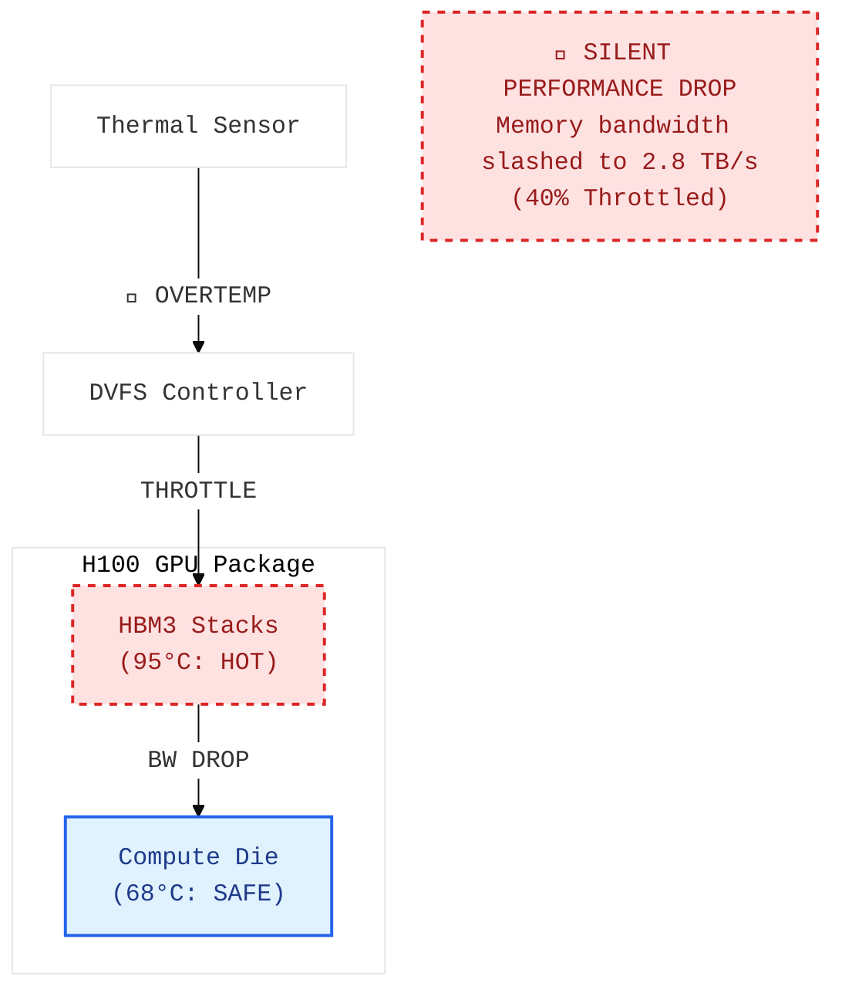
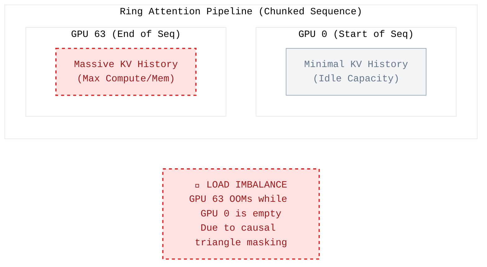
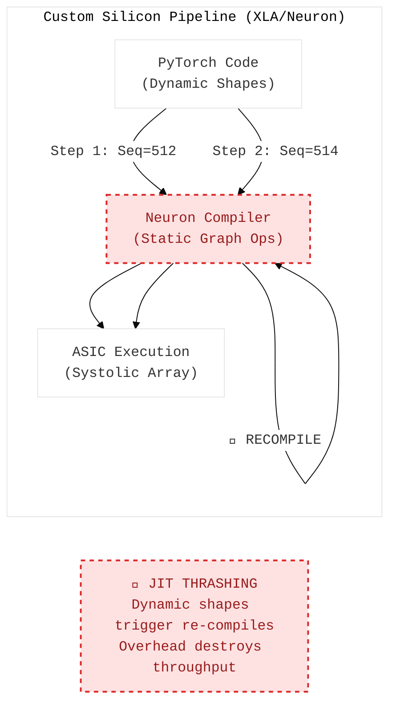
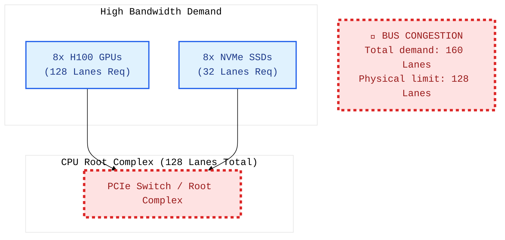
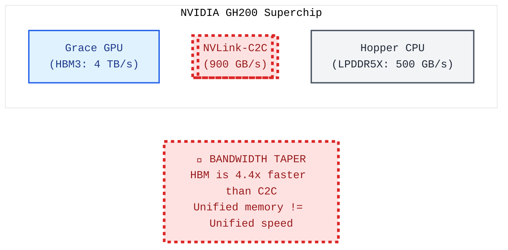

# The Production System

  <a href="../README.md">🏠 Home</a> ·
  <a href="../00_The_Architects_Rubric.md">📋 Rubric</a> ·
  <b>☁️ Cloud</b> · <a href="../edge/README.md">🤖 Edge</a> · <a href="../mobile/README.md">📱 Mobile</a> · <a href="../tinyml/README.md">🔬 TinyML</a>

---

*How you keep it running and healthy*

Monitoring, drift detection, deployment strategies, security, power management, and economics — the operational reality of ML in production.

> **[➕ Add a Flashcard](https://github.com/harvard-edge/cs249r_book/edit/dev/interviews/cloud/04_production_ops.md)** (Edit in Browser) — see [README](../README.md#question-format) for the template.

---

### 📉 Monitoring & Observability

#### 🟢 L3 — Recall & Define

<b> The GPU Power Budget</b> · <code>power-thermal</code> <code>economics</code>

- **Interviewer:** "You're running a 72-hour training job on 8× H100 GPUs (700W TDP each). Your data center charges \$0.12/kWh for electricity. Estimate the energy cost of this single training run. How does this compare to the cloud compute cost at \$3.50/GPU-hour?"

  

  
<b>🔍 Reveal Answer</b>

  **Common Mistake:** "8 × 700W × 72 hours × $0.12 = $48.38. Electricity is negligible." This forgets PUE and that GPUs don't run at exactly TDP.

  **Realistic Solution:** GPUs under sustained training load typically draw 80–90% of TDP. Data centers have PUE overhead (cooling, networking, power conversion) that multiplies the IT power draw. The electricity cost is a small fraction of cloud pricing — the rest is amortized hardware, networking, staff, and profit margin.

  > **Napkin Math:** GPU power: 8 × 700W × 85% utilization = 4,760W. PUE of 1.2: total facility power = 4,760 × 1.2 = 5,712W = 5.71 kW. Energy: 5.71 kW × 72 hrs = **411 kWh**. Electricity cost: 411 × \$0.12 = **\$49.34**. Cloud compute cost: 8 GPUs × 72 hrs × \$3.50 = **\$2,016**. Electricity is only **2.4%** of the cloud bill. The other 97.6% covers: GPU depreciation (~40%), networking/storage (~15%), data center lease (~10%), staff (~10%), and profit margin (~22%). This is why on-premise makes financial sense at scale: if you own the GPUs, your marginal cost per training run is ~\$50 instead of ~\$2,000.

  📖 **Deep Dive:** [Sustainable AI](https://harvard-edge.github.io/cs249r_book_dev/contents/sustainable_ai/sustainable_ai.html)

  

<b> The Container Bloat</b> · <code>containerization</code>

- **Interviewer:** "Our team is deploying a new image classification model as a microservice. The initial container image size is 5GB, and we're seeing unacceptable cold start latencies, especially when scaling up. What are the primary culprits for such a large image and how would you systematically reduce it?"

  

  
<b>🔍 Reveal Answer</b>

  **Common Mistake:** "We need faster internet for image pulls." While network speed affects pull time, it doesn't address the underlying issue of bloated images or the impact on container runtime startup.

  **Realistic Solution:** A large container image typically stems from including unnecessary dependencies, development tools, or a large base image. To systematically reduce it:
    1.  **Multi-stage Builds:** Use a build stage with compilers and dev dependencies, and a leaner runtime stage that only copies the compiled artifacts and necessary runtime libraries.
    2.  **Smaller Base Images:** Switch from large distributions (e.g., `ubuntu`) to minimal images like `alpine` or `distroless`.
    3.  **Dependency Pruning:** Only install production dependencies. Remove development headers, testing frameworks, and unused packages (e.g., `apt-get clean`, `pip cache purge`).
    4.  **Model Artifact Management:** Ensure the model weights are compressed or downloaded at runtime, rather than being baked into the initial image, if cold start latency is acceptable for the first request.
    5.  **Layer Optimization:** Order Dockerfile instructions to leverage caching, placing less frequently changing layers (base image, system dependencies) earlier.

  > **Napkin Math:** Reducing a 5GB image to 500MB on a 100Mbps network:
  > Initial download time: `5 GB * 8 bits/byte / 100 Mbps = 40 seconds`
  > Optimized download time: `0.5 GB * 8 bits/byte / 100 Mbps = 4 seconds`
  > This significantly reduces cold start time from image pull alone, not accounting for container initialization and model loading.

  > **Key Equation:** `ContainerSize = BaseImageSize + DependenciesSize + ModelArtifactSize`

  📖 **Deep Dive:** [Volume I: Containerization for ML Services](https://mlsysbook.ai/vol1/mlops/deployment/containerization)

  

<b> The Unresponsive Replica</b> · <code>health-checks</code>

- **Interviewer:** "Our auto-scaling group for an inference service is occasionally failing to replace unhealthy instances. We've confirmed the infrastructure is fine, but the service becomes unresponsive even though the instance itself is still running. What's likely going wrong with our health check strategy and how would you fix it?"

  

  
<b>🔍 Reveal Answer</b>

  **Common Mistake:** "The auto-scaling group isn't configured correctly to terminate instances." While true for a misconfigured ASG, the problem describes an instance *running* but *unresponsive*, implying the health check isn't detecting the application-level failure.

  **Realistic Solution:** The issue points to a health check that is too shallow, likely only verifying the OS or basic network connectivity (e.g., TCP port open), but not the application's readiness to serve requests.
    1.  **Application-Level Health Checks (Readiness Probes):** Implement an HTTP endpoint (e.g., `/healthz` or `/ready`) that verifies the ML model is loaded into memory, all necessary pre-processing components are initialized, and the service can actually process a dummy request.
    2.  **Liveness Probes:** A separate endpoint (e.g., `/livez`) to confirm the application process is still running and not deadlocked. This typically involves less intensive checks than a readiness probe.
    3.  **Graceful Shutdown:** Ensure the application can gracefully shut down by stopping new requests and finishing in-flight ones before exiting. This prevents the load balancer from sending requests to a terminating instance.
    4.  **Health Check Configuration:** Configure the load balancer and auto-scaling group to use these application-level HTTP health checks with appropriate thresholds (e.g., 3 consecutive failures over 30 seconds).

  > **Napkin Math:** If an instance takes 60 seconds to replace, and your health check period is 10 seconds with an unhealthy threshold of 3, it would take `3 * 10 = 30` seconds to detect and mark as unhealthy. If the replacement process is slower than this, you'll have a gap.
  > `TimeToDetectFailure = UnhealthyThreshold * PeriodSeconds`
  > `TotalDowntime = TimeToDetectFailure + InstanceReplacementTime`

  > **Key Equation:** `HealthCheckSuccessCondition = ModelLoaded AND PreprocessingReady AND ServiceResponsive`

  📖 **Deep Dive:** [Volume I: Robust Health Checks for ML Services](https://mlsysbook.ai/vol1/mlops/deployment/health-checks)

  

<b> The Silent Model Decay</b> · <code>model-monitoring</code> <code>data-drift</code> <code>concept-drift</code>

- **Interviewer:** "Your ML team maintains a critical production model that predicts user engagement. For the past two months, the model's business impact has been steadily declining, but no alarms have fired from your standard model monitoring dashboards (e.g., accuracy, precision, recall). What are the common reasons for this 'silent decay,' and what additional monitoring would you implement to detect it proactively?"

  

  
<b>🔍 Reveal Answer</b>

  **Common Mistake:** "The model needs retraining." While often true, the question focuses on *detection* when standard metrics don't alert. The problem is that standard metrics often compare predictions to *ground truth*, which might be delayed or unavailable, or they don't capture shifts in the *input data* or *underlying relationships*.

  **Realistic Solution:** The 'silent decay' is typically due to **data drift or concept drift** that isn't immediately reflected in traditional performance metrics.
  1.  **Data Drift:** The statistical properties of the input features to the model change over time.
    *   **Reason:** New user behaviors, changes in data collection systems, seasonality, external events (e.g., a pandemic, a new competitor).
    *   **Example:** A feature like `user_device_type` suddenly sees a spike in a new device category not present during training.
  2.  **Concept Drift:** The relationship between the input features and the target variable changes over time. The "concept" the model is trying to learn has shifted.
    *   **Reason:** Fundamental shifts in user preferences, market conditions, product changes, or evolving definitions of "engagement."
    *   **Example:** Users who previously engaged with short videos now prefer long-form content, but the model still weights short video interaction highly.

  **Additional Monitoring to Implement:**
  1.  **Input Data Distribution Monitoring (Data Drift):**
    *   Monitor univariate statistics (mean, median, std dev, min, max, null count) for all numerical features.
    *   Monitor unique counts and frequency distributions for categorical features.
    *   Use statistical tests (e.g., KS-test, Chi-squared test) to compare the distribution of incoming production data against the training data distribution or a recent baseline.
    *   Set alerts for significant deviations (e.g., p-value below 0.01, or a >10% change in mean).
  2.  **Output Prediction Distribution Monitoring (Prediction Drift):**
    *   Monitor the distribution of the model's predictions (e.g., average predicted engagement score, distribution of positive/negative predictions).
    *   A shift here can indicate either data drift or concept drift.
  3.  **Feature Importance Monitoring:** If using explainable AI (XAI) techniques, monitor how feature importances change over time. A shift in which features are most influential might signal concept drift.
  4.  **Proxy Metrics / Business KPIs:** Monitor business metrics that are highly correlated with the model's true objective but might be available sooner than ground truth (e.g., click-through rate, time spent on page, conversion rate).
  5.  **Shadow Deployment / A/B Testing:** Continuously run a shadow deployment of an older model version or a simpler baseline model to compare its predictions against the production model. Significant divergence can indicate issues.

  > **Napkin Math:** If monitoring 100 features, and each statistical test takes 50ms, then running checks for all features takes 5 seconds per hour. Over a month, this is 5s * 24 * 30 = 3600 seconds = 1 hour of compute. This is negligible compared to the cost of model decay.

  > **Key Equation:** $D(P_{prod}(X) || P_{train}(X))$ where $D$ is a statistical divergence metric (e.g., KL-divergence, JS-divergence, KS-statistic) and $P(X)$ is the probability distribution of input features.

  📖 **Deep Dive:** [Volume I: Model Monitoring & Drift Detection](https://mlsysbook.ai/vol1/05-mlops.md#model-monitoring-and-drift-detection)

  

<b> The Thermal Memory Wall</b> · <code>hardware</code> <code>reliability</code>

### HBM Junction Overheating

- **Interviewer:** "Your H200 cluster is processing a massive batch inference job. `nvidia-smi` shows the GPU core temperature is a very safe 68°C. However, your memory bandwidth benchmark shows you are only achieving 2.8 TB/s instead of the rated 4.8 TB/s. What thermal component are you failing to monitor?"

  

  
<b>🔍 Reveal Answer</b>

  **Common Mistake:** "The memory bandwidth must be bottlenecked by the PCIe bus." PCIe is irrelevant for internal HBM bandwidth.

  **Realistic Solution:** You are monitoring the GPU Core temperature, but ignoring the **HBM Junction Temperature**. HBM3e is stacked 8 to 12 layers high directly adjacent to the GPU die. Because it is a dense 3D stack, it is incredibly difficult to cool. HBM modules have a strict maximum operating temperature (~95°C). While the GPU die is at 68°C, a heavy memory-bound workload generates massive heat within the memory stacks. If the HBM hits its limit, the memory controller downclocks the frequency, silently tanking your bandwidth.

  > **Napkin Math:** Theoretical HBM3e bandwidth = 4.8 TB/s. If the HBM hits 95°C, the controller may drop the clock from 6 GHz to 3.5 GHz. Effective bandwidth = $4.8 \times (3.5/6.0) = \sim 2.8 \text{ TB/s}$. You lose 40% of performance with no error message.

  📖 **Deep Dive:** [Sustainable AI](https://harvard-edge.github.io/cs249r_book_dev/contents/sustainable_ai/sustainable_ai.html)

  

#### 🔵 L4 — Apply & Identify

<b> The Attention Skew</b> · <code>parallelism</code> <code>memory</code>

### The Causal Mask Asymmetry

- **Interviewer:** "You are using Ring Attention to train a model with a 1-million token context window across 64 GPUs. The sequence is chunked evenly. Yet, profiling shows GPU 63 runs out of memory, while GPU 0 has 40 GB of free VRAM. Why does an evenly chunked sequence cause an asymmetric memory footprint?"

  

  
<b>🔍 Reveal Answer</b>

  **Common Mistake:** "Ring Attention shouldn't have an imbalance; the communication is a perfect ring." The communication is symmetrical, but the *causal mask* of the attention mechanism is not.

  **Realistic Solution:** In autoregressive LLMs, tokens can only attend to prior tokens (causal masking). GPU 0 holds the start of the sequence and attends to almost nothing outside its chunk. GPU 63 holds the end of the sequence and must attend to the full KV-cache of all 63 preceding GPUs as they flow through the ring. This creates a massive imbalance in activation memory during the backward pass. The fix is **Zig-Zag Ring Attention** or **Striped Attention**, which interleaves sequence chunks to balance the causal computation load.

  > **Napkin Math:** For a 1M sequence, GPU 0 processes 1/64th of the causal triangle. GPU 63 processes its own chunk plus checks against all 63 previous chunks. GPU 63 stores nearly 64x more block-level statistics for the backward pass than GPU 0.

  📖 **Deep Dive:** [Frameworks](https://harvard-edge.github.io/cs249r_book_dev/contents/frameworks/frameworks.html)

  

<b> The Compilation Wall</b> · <code>frameworks</code> <code>compiler</code>

### The Graph Compilation Wall

- **Interviewer:** "You migrate a PyTorch model to a custom AI accelerator (e.g. AWS Trainium). The hardware is cheaper per TFLOPS than an A100, but the first epoch takes 48 hours to start, and training is 3x slower. Your sequence lengths vary slightly per batch. What is 'killing' your performance?"

  

  
<b>🔍 Reveal Answer</b>

  **Common Mistake:** "Custom silicon just has slower interconnects than NVIDIA." The interconnect isn't the issue; the execution paradigm is.

  **Realistic Solution:** You hit the **Graph Compilation Wall**. Unlike NVIDIA GPUs which execute eagerly, accelerators like Trainium/TPU rely on compilers (XLA/Neuron) to map code into static graphs for systolic arrays. The "48 hours" was the initial compilation. Because your sequence lengths vary, the compiler triggers a **Re-compile (JIT Thrashing)** on every batch, destroying throughput. The fix is to use **Static Padding**: pad all sequences to a fixed power-of-two length to reuse the same compiled graph.

  > **Napkin Math:** If an XLA compile takes 30s and a training step takes 0.5s, a single re-compile adds 60x overhead to that step. Even a 5% re-compile rate will cut your overall tokens/sec by half.

  📖 **Deep Dive:** [Frameworks](https://harvard-edge.github.io/cs249r_book_dev/contents/frameworks/frameworks.html)

  

#### 🟡 L5 — Analyze & Predict

<b> The Root Complex Choke</b> · <code>hardware</code> <code>storage</code>

### The PCIe Root Complex Saturation

- **Interviewer:** "You use DeepSpeed ZeRO-Infinity to offload optimizer states to NVMe SSDs during 1-Trillion parameter model training. You have 8x H100s and 8x top-tier Gen5 NVMe drives. During the backward pass, GPU utilization drops to 12%. Based on the PCIe diagram, why didn't adding more drives fix the IO bottleneck?"

  

  
<b>🔍 Reveal Answer</b>

  **Common Mistake:** "14 GB/s is too slow, we need more NVMe drives." Adding drives won't help if you hit the root bottleneck: the PCIe switch topology and CPU root complex.

  **Realistic Solution:** You have **Root Complex Saturation**. A dual-socket server has a fixed number of PCIe lanes (e.g. 128 lanes). 8x H100s already consume the entire 128-lane budget. When you add NVMe drives, they must share these lanes via a PCIe switch or compete for the same CPU-to-Switch bandwidth. The root complex becomes a bottleneck, and the GPUs stall waiting for DMA transfers. The fix is to use **GPUDirect Storage** to bypass the CPU or move to a multi-node setup where the IO load is sharded.

  > **Napkin Math:** 8 GPUs @ 16 lanes each = 128 lanes. 8 NVMe @ 4 lanes each = 32 lanes. Total demand = 160 lanes. You are 25% oversubscribed at the physical layer before any software overhead.

  📖 **Deep Dive:** [Hardware Acceleration](https://harvard-edge.github.io/cs249r_book_dev/contents/hw_acceleration/hw_acceleration.html)

  

<b> The Memory Illusion</b> · <code>hardware</code> <code>memory-hierarchy</code>

### The C2C Bandwidth Choke

- **Interviewer:** "We are deploying a 200B parameter model on an NVIDIA GH200 Grace Hopper Superchip. It has 72 GB of HBM3 and 480 GB of LPDDR5X CPU RAM, sharing a unified memory space. The weights are 400 GB in FP16. Your colleague says we can serve this on a single chip without tensor parallelism since it 'fits' in memory. What is the throughput reality of this design?"

  

  
<b>🔍 Reveal Answer</b>

  **Common Mistake:** "Unified memory means the GPU can read all 480 GB at HBM speeds." Unified memory means addressing is shared, but physical bandwidth limits still apply.

  **Realistic Solution:** You will hit the **C2C Bandwidth Wall**. While the model "fits," the GPU must fetch weights from the CPU's LPDDR5X memory over the 900 GB/s C2C link for every token during the decode phase. This is ~4.4x slower than fetching from local HBM3 (4,000 GB/s). Your token-per-second throughput will be limited by the C2C link, not the GPU's compute. For high-throughput serving, you still need Tensor Parallelism to keep weights in HBM.

  > **Napkin Math:** In Decode, latency is roughly $\text{Weights} / \text{Bandwidth}$. HBM3 (4 TB/s) → ~0.1s per token. C2C (0.9 TB/s) → ~0.44s per token. Your "fits on one chip" design is 4x slower than a standard multi-GPU HBM design.

  📖 **Deep Dive:** [Hardware Acceleration](https://harvard-edge.github.io/cs249r_book_dev/contents/hw_acceleration/hw_acceleration.html)

  

---

### 🚀 Deployment & MLOps

#### 🔵 L4 — Apply & Identify

<b> The Ephemeral Storage I/O Cliff</b> · <code>mlops</code> <code>storage</code>

- **Interviewer:** "You are training a model on a massive cloud VM with 8x GPUs. You download your 1 TB dataset from S3 to the VM's attached local NVMe drive (ephemeral storage). Training speeds are phenomenal. However, 12 hours into the 48-hour training run, the VM is preempted (Spot Instance). When the orchestration system brings the VM back up and resumes from the checkpoint, training crashes because the dataset file is missing. Why?"

  

  
<b>🔍 Reveal Answer</b>

  **Common Mistake:** "The orchestration system didn't mount the drive." It's mounted, but it's empty.

  **Realistic Solution:** You forgot that **Ephemeral Storage is physically tied to the Host hardware**.

  When you provision a cloud VM with "local NVMe" (like AWS instance store), that SSD is physically bolted into the server rack hosting your VM. It offers incredible bandwidth (e.g., 10 GB/s) because it bypasses the network.

  However, when a Spot Instance is preempted, the cloud provider tears down your VM and gives the hardware to someone else. When your job is rescheduled 5 minutes later, it is assigned to a *completely different physical server* in the datacenter. The new server's local NVMe drive is completely blank. Your 1 TB dataset was destroyed when the previous VM died.

  **The Fix:** For preemptible/Spot instances, you cannot rely on ephemeral local storage for persistent state.
  1. You must stream the data from a persistent network file system (like Amazon FSx for Lustre or EFS).
  2. Or, your startup script must include logic to completely re-download the 1 TB dataset from S3 to the new local NVMe drive every single time the instance respawns (which costs time and money).

  > **Napkin Math:** Re-downloading 1 TB at 10 Gbps (1.25 GB/s) takes roughly 15 minutes. Every time you get preempted, you lose 15 minutes of compute time just waiting for the dataset to arrive on the new hardware.

  📖 **Deep Dive:** [Volume II: Fault Tolerance](https://harvard-edge.github.io/cs249r_book_dev/contents/fault_tolerance/fault_tolerance.html)

  

<b> The Silent Regression</b> · <code>canary-deployment</code>

- **Interviewer:** "We've deployed a new version of our recommendation model using a rolling update, and while all technical metrics (latency, error rate) look good, our key business metrics (e.g., click-through rate, user engagement) have silently dropped by 5%. How would you have prevented this 'silent regression' and what deployment strategy would you advocate for future model updates?"

  

  
<b>🔍 Reveal Answer</b>

  **Common Mistake:** "We need more comprehensive monitoring for system metrics." While important, system metrics (CPU, memory, network) wouldn't catch a subtle degradation in model quality that impacts user behavior without increasing technical errors.

  **Realistic Solution:** A silent regression indicates a failure to validate model quality in a production environment before full rollout. The key is to use a **canary deployment** strategy combined with robust A/B testing and comprehensive business metric monitoring.
    1.  **Canary Deployment:** Instead of a full rolling update, gradually shift a small percentage of live traffic (e.g., 1-5%) to the new model version.
    2.  **Shadow Mode (Dark Launch):** For critical services, run the new model in parallel with the old one, processing real-time requests but not returning its predictions to users. This allows for comparing predictions and logging potential issues without impacting users.
    3.  **A/B Testing Framework:** Integrate the canary deployment with an A/B testing framework to statistically compare the performance of the new model (treatment group) against the old model (control group) on key business metrics (CTR, conversion, engagement, revenue).
    4.  **Automated Rollback:** Define clear thresholds for business metric degradation. If the new model's performance falls below these thresholds, automatically roll back to the previous stable version.
    5.  **Observability:** Ensure dashboards and alerts are configured to monitor both technical and business-level metrics in real-time for the canary group.

  > **Napkin Math:** If 5% of traffic is routed to the canary, and the business metric drops by 5% for that group, the overall impact on the entire user base would be `0.05 * 0.05 = 0.0025` (0.25% overall drop). This makes the regression detectable without a massive impact on the entire user base.
  > `OverallMetricDrop = CanaryTrafficShare * CanaryMetricDrop`

  > **Key Equation:** `(Metric_Canary - Metric_Control) / Metric_Control < Threshold`

  📖 **Deep Dive:** [Volume I: Canary Releases and A/B Testing for ML](https://mlsysbook.ai/vol1/mlops/deployment/canary-ab-testing)

  

<b> The Silent Failure</b> · <code>mlops</code> <code>monitoring</code>

- **Interviewer:** "Our DevOps dashboard shows 99.99% uptime, 50ms latency, and 95% GPU utilization on our recommendation cluster. The HTTP error rate is zero. But the business team is furious because our recommendations are completely wrong. Why does the high GPU utilization mask the failure, and how can the hardware be perfectly healthy while the ML output is perfectly wrong?"

  

  
<b>🔍 Reveal Answer</b>

  **Common Mistake:** "There must be a bug in the model code" or "The A/B test is misconfigured." Both assume a software failure — this is a data failure masked by hardware metrics.

  **Realistic Solution:** The Operational Mismatch. Traditional software fails loudly (crashes). ML systems fail *silently*. A model experiencing Data Drift (e.g., user behavior changed due to a holiday) will continue serving predictions with full confidence. The GPU doesn't know the data is stale; it just sees matrices to multiply. A 95% GPU utilization metric just means the hardware is efficiently doing the wrong math. You must engineer statistical telemetry (e.g., KL Divergence, PSI) to monitor input distributions, because hardware metrics (utilization, latency, throughput) are completely decoupled from ML correctness.

  > **Napkin Math:** A recommendation model trained on summer shopping data sees winter holiday traffic. Input feature distributions shift by 2-3 standard deviations. The GPU continues executing 100 TFLOPS of embedding lookups and MLP layers in exactly 50ms per batch. The model's confidence scores remain 0.95+ (it doesn't know what it doesn't know), but click-through rate drops from 12% to 2%. Traditional monitoring sees: 95% GPU util, green across the board. Business sees: 83% revenue drop.

  📖 **Deep Dive:** [ML Operations](https://harvard-edge.github.io/cs249r_book_dev/contents/ml_ops/ml_ops.html)

  

<b> The Training-Serving Skew</b> · <code>mlops</code>

- **Interviewer:** "Our model achieves 95% accuracy when evaluated offline on an A100 cluster, but drops to 70% when deployed to production on T4 GPUs. The model weights and the Python feature code are identical. How do the different hardware paths cause this numerical divergence?"

  

  
<b>🔍 Reveal Answer</b>

  **Common Mistake:** "The test set isn't representative of production data." Distribution shift is possible, but hardware-induced numerical divergence is a silent killer when weights and code are identical.

  **Realistic Solution:** Hardware-induced Training-Serving Skew. Even with identical Python code, the underlying hardware and runtime execute the math differently. The A100 offline evaluation likely used PyTorch with TF32 (TensorFloat-32) enabled by default, which truncates the mantissa to 10 bits. The production T4 (which doesn't support TF32) might be running a TensorRT compiled engine in FP16, or falling back to FP32. Furthermore, different CUDA versions or cuDNN libraries between the clusters can select different convolution algorithms (e.g., Winograd vs. GEMM) which accumulate floating-point rounding errors differently. Over a 50-layer network, these micro-differences compound into completely different activation distributions at the final classification layer.

  > **Napkin Math:** A single FP32 vs FP16 addition can have a relative error of $\sim 10^{-4}$. In a ResNet-50, an input image undergoes $\sim 10^9$ MAC operations. If the A100 uses TF32 (10-bit mantissa) and the T4 uses FP16 (10-bit mantissa) but with different rounding modes or accumulation orders in the Tensor Core, the final logit values can drift by 5-10%. For edge-case inputs where the model is uncertain (logits: [0.51, 0.49]), this hardware-level numerical drift is enough to flip the argmax classification, dropping overall accuracy from 95% to 70%.

  📖 **Deep Dive:** [ML Operations](https://harvard-edge.github.io/cs249r_book_dev/contents/ml_ops/ml_ops.html)

  

<b> The Model Deprecation Cliff</b> · <code>model-lifecycle</code> <code>mlops</code>

- **Interviewer:** "Your platform has 23 models in production, some dating back 3 years. You discover that 8 older models collectively serve only 2% of total traffic but consume 30% of your GPU fleet. Your PM asks why these old models can't just be co-located on the same GPUs as the newer models to save money. Why does maintaining multiple model generations simultaneously fragment your serving cluster and destroy GPU utilization?"

  

  
<b>🔍 Reveal Answer</b>

  **Common Mistake:** "Just put them all in the same Docker container." This ignores how GPUs allocate memory and schedule execution for heterogeneous ML workloads.

  **Realistic Solution:** Co-locating multiple model generations on a single GPU creates severe memory fragmentation and scheduling bottlenecks. Old models often use different precision formats (e.g., FP32 vs FP16), different CUDA graph compilations, and different batch sizes. When you load multiple distinct models onto one GPU, each model statically reserves its own CUDA context, workspace memory, and KV-cache blocks. Because the models don't share weights or attention architectures, the serving framework (like vLLM or Triton) cannot easily batch requests across them. The GPU ends up context-switching between different kernels, destroying arithmetic intensity, while the VRAM is partitioned into small, inflexible silos that prevent any single model from achieving a large enough batch size to be compute-bound.

  > **Napkin Math:** An 80GB H100 running one 13B model (26GB weights) has 54GB available for a massive, unified KV-cache, allowing continuous batching of 100+ concurrent requests (high utilization). If you co-locate three different 7B models (14GB weights each = 42GB total), you only have 38GB left. Worse, that 38GB is fragmented across three separate KV-cache pools (12.6GB each). Each model can now only batch ~20 requests. The GPU spends its time context-switching between the three models' kernels, operating at low batch sizes, dropping effective throughput by 3-4× compared to serving a single model.

  📖 **Deep Dive:** [ML Operations](https://harvard-edge.github.io/cs249r_book_dev/contents/ml_ops/ml_ops.html)

  

<b> The LLM Evaluation Trap</b> · <code>mlops</code> <code>monitoring</code>

- **Interviewer:** "You're responsible for evaluating a new LLM before production deployment. Your team proposes running it on 5 standard benchmarks (MMLU, HumanEval, etc.). The new model scores 5% higher than your current production model. Why might this evaluation be dangerously misleading from an infrastructure perspective, and how could deploying the 'better' model actually destroy your serving economics?"

  

  
<b>🔍 Reveal Answer</b>

  **Common Mistake:** "If it scores well on benchmarks, it's ready for production." This conflates academic evaluation with production readiness and ignores the hardware cost of intelligence.

  **Realistic Solution:** Standard benchmarks measure intelligence in a vacuum, ignoring the physical constraints of the serving cluster. A model might score 5% higher on MMLU but require a different architectural trade-off that wrecks your infrastructure. For example, the new model might achieve its score by using a larger vocabulary (increasing embedding table memory), removing Grouped Query Attention (GQA) in favor of Multi-Head Attention (MHA) which inflates the KV-cache by 8×, or simply being more verbose (generating 3× more tokens per response). A production evaluation framework must use latency-aware and memory-aware scoring: measuring not just accuracy, but TTFT, TPOT, and peak VRAM per request.

  > **Napkin Math:** Current model (Llama-2-13B with GQA): KV-cache for 2K tokens = ~300MB. New model (13B with MHA for "better reasoning"): KV-cache for 2K tokens = ~2.4GB. On an A100 (40GB) with 26GB weights, the current model can batch ~40 concurrent requests. The new "better" model can only batch ~5 requests before OOMing. To maintain the same QPS, you must scale your GPU cluster by 8×. That 5% MMLU bump just increased your monthly AWS bill from $50k to $400k. The evaluation was misleading because it didn't measure the hardware cost of the new architecture.

  📖 **Deep Dive:** [ML Operations](https://harvard-edge.github.io/cs249r_book_dev/contents/ml_ops/ml_ops.html)

  

#### 🔴 L6+ — Synthesize & Derive

<b> The Retraining Math</b> · <code>mlops</code> <code>economics</code>

- **Interviewer:** "Our model degrades by 1% accuracy every week. Retraining the model costs us $50,000 in GPU time. A 1% accuracy drop costs the business $100,000 a week. Exactly how often should we trigger a retraining pipeline?"

  

  
<b>🔍 Reveal Answer</b>

  **Common Mistake:** "Retrain weekly since the cost of degradation ($100k) exceeds the cost of retraining ($50k)." This is directionally right but not optimal.

  **Realistic Solution:** Cost-aware automation. You do not retrain based on a calendar; you retrain when the cumulative cost of performance degradation intersects with the fixed cost of retraining. This is the Retraining Staleness Model. You must formulate the threshold mathematically so the MLOps pipeline triggers training autonomously when the financial math dictates it.

  > **Napkin Math:** Degradation cost accumulates: week 1 = $100k, week 2 = $200k cumulative, week 3 = $300k. Retraining costs $50k. Optimal retrain point: when cumulative degradation cost = retraining cost. $\sum_{i=1}^{n} 100k \times i\% > 50k$ → retrain roughly every $\sqrt{2 \times 50k / 100k} \approx 1$ week. But if retraining cost were $500k, optimal interval stretches to ~3 weeks.

  📖 **Deep Dive:** [ML Operations](https://harvard-edge.github.io/cs249r_book_dev/contents/ml_ops/ml_ops.html)

  

---

### 📊 Data Quality & Pipelines

#### 🔵 L4 — Apply & Identify

<b> The Stale Feature Store</b> · <code>feature-store</code> <code>data-consistency</code> <code>real-time-ml</code>

- **Interviewer:** "Your company operates a critical real-time fraud detection model. Features are sourced from an online feature store (e.g., Redis, DynamoDB) and an offline batch feature store (e.g., Hive, BigQuery). Recently, you've observed that the online model's performance degrades significantly shortly after a new batch of features is pushed to the offline store, even though the model itself hasn't changed. Describe the likely architectural flaw and propose a solution that ensures consistency and freshness without introducing excessive latency."

  

  
<b>🔍 Reveal Answer</b>

  **Common Mistake:** "The online model is buggy" or "The offline features are bad." The issue is not necessarily bad data or a bad model, but an inconsistency in the *timing* or *method* of feature updates between online and offline stores, leading to a train-serve skew.

  **Realistic Solution:** The likely flaw is a **train-serve skew due to asynchronous or inconsistent updates between the online and offline feature stores**. When new features are generated offline (e.g., daily aggregations), they are used to retrain the model. However, if these new features are not immediately or consistently propagated to the *online* store, the online model will be served with *stale* features while being trained on *fresh* ones. This creates a mismatch.

  A robust solution involves ensuring the online and offline feature stores are synchronized and consistent:
  1.  **Dual-Write/Change Data Capture (CDC):** For real-time features, implement a dual-write mechanism where updates to the source system are written to both the online feature store (e.g., Redis) and a durable message queue (e.g., Kafka). The queue then feeds the offline feature store (e.g., S3/BigQuery) for batch processing and model training.
  2.  **Batch-to-Online Synchronization:** For batch-computed features, after they are generated and stored offline, use a dedicated job to push these *newly computed batch features* to the online feature store. This push should ideally be atomic for a given feature set to avoid partial updates.
  3.  **Feature Versioning & Timestamping:** Each feature record in both stores should have a timestamp indicating when it was computed/last updated. The online model can then be configured to only use features up to a certain age or version, or to log the feature timestamp for post-hoc analysis.
  4.  **Monitoring:** Implement strict monitoring for feature freshness and consistency metrics (e.g., divergence between online and offline feature values for a sample set).

  > **Napkin Math:** If an offline feature computation takes 4 hours and runs daily, and the online store is updated only *after* the model is retrained and deployed (which might take another 2 hours), there's a potential 6-hour window of inconsistency. If an online feature update takes 50ms to propagate to Redis and 200ms to Kafka, total latency for dual-write is dominated by the slower path, but for consistency, both must succeed. Aim for sub-second synchronization for critical features.

  > **Key Equation:** $F_{online}(t) \approx F_{offline}(t - \Delta t_{sync})$ where $\Delta t_{sync}$ should be minimized.

  📖 **Deep Dive:** [Volume I: Feature Stores](https://mlsysbook.ai/vol1/04-data-management.md#feature-stores)

  

#### 🟡 L5 — Analyze & Predict

<b> The Deduplication Economics</b> · <code>data-quality</code> <code>economics</code>

- **Interviewer:** "Your team has assembled a 10TB pre-training dataset by crawling the web. A data quality audit reveals approximately 30% near-duplicate content. Your ML lead says 'duplicates don't matter — more data is always better.' Your infrastructure lead says 'dedup everything — it'll save 30% on training compute.' Who is right, and what is the economically optimal deduplication strategy?"

  

  
<b>🔍 Reveal Answer</b>

  **Common Mistake:** "Deduplicate everything to save compute" or "Keep all duplicates because more data helps." Both are wrong — the relationship between duplication and model quality is non-linear.

  **Realistic Solution:** Neither is right. Research (Lee et al., 2022; Penedo et al., 2023) shows that moderate deduplication *improves* model quality (reduces memorization, improves generalization), but aggressive deduplication *hurts* it (removes legitimate repeated patterns like common phrases, code idioms). The optimal strategy is **fuzzy deduplication with a similarity threshold**: use MinHash LSH to identify near-duplicate clusters (Jaccard similarity >0.8), keep one representative from each cluster, but preserve exact duplicates below the threshold. The economics: deduplication itself is not free — running MinHash on 10TB requires significant compute. The decision framework is: compare the cost of deduplication compute against the savings in training compute, weighted by the quality impact.

  > **Napkin Math:** 10TB dataset, 30% near-duplicates. Training a 7B model on 10TB: ~3,000 A100-hours at $2/hr = $6,000. Training on 7TB (after dedup): ~2,100 A100-hours = $4,200. Savings: $1,800 per training run. Deduplication cost: MinHash LSH on 10TB ≈ 200 CPU-hours at $0.05/hr = $10 (one-time). But the quality impact matters more: deduped models show 2-5% lower perplexity, which compounds across downstream tasks. If you retrain monthly, annual savings = $1,800 × 12 + quality gains = $21,600 + downstream value. The dedup ROI is ~2,160:1 on pure compute savings alone.

  📖 **Deep Dive:** [Data Engineering](https://harvard-edge.github.io/cs249r_book_dev/contents/data_engineering/data_engineering.html)

  

<b> The Silent Schema Shift</b> · <code>data-quality</code> <code>data-contracts</code> <code>pipeline-robustness</code>

- **Interviewer:** "You oversee a critical ML pipeline processing petabytes of data daily, feeding hundreds of downstream models across your organization. Last quarter, an upstream team made a seemingly minor schema change in their raw data source (e.g., changed an integer column to a float, or made a non-nullable column nullable). This change wasn't communicated, and it silently propagated through your pipeline, causing subtle but widespread model degradation and hard-to-debug issues for weeks before detection. Design a robust, scalable system to prevent such 'silent schema shifts' from impacting downstream ML models."

  

  
<b>🔍 Reveal Answer</b>

  **Common Mistake:** "Just add more unit tests to the data processing code." While good, unit tests often only catch issues within the transformation logic, not changes to the *source* data's inherent properties. Relying on manual communication is also error-prone.

  **Realistic Solution:** The core problem is a lack of **data contracts and automated schema validation with lineage awareness**. A robust system would involve:
  1.  **Data Contracts:** Establish formal, machine-readable data contracts (e.g., using Avro, Protobuf, JSON Schema, or specific data quality frameworks) for all critical data assets. These contracts define expected schema, data types, nullability, ranges, and potentially semantic invariants. Upstream teams commit to these contracts.
  2.  **Schema Validation at Ingress:** Implement automated schema validation checks at every major data ingress point into your ML pipeline. This means comparing the actual schema of incoming data against its declared data contract. Tools like Great Expectations, Deequ, or custom Spark/Pandas validation libraries can be used.
  3.  **Schema Evolution Strategy:** Define explicit strategies for schema evolution (e.g., backward compatibility, forward compatibility). If an upstream change is contract-breaking, it should trigger an alert *before* it enters the pipeline. If it's compatible (e.g., adding a nullable column), it should still be logged and potentially trigger downstream model retraining.
  4.  **Data Lineage & Impact Analysis:** Integrate with a data lineage system (e.g., Apache Atlas, Amundsen). When a schema change is detected, the lineage system can automatically identify all downstream ML models and pipelines that might be affected, allowing for proactive communication and remediation.
  5.  **Automated Alerting & Rollback:** If a schema validation fails, trigger immediate alerts (Slack, PagerDuty). For critical pipelines, consider automated rollback mechanisms to use the last known good schema or halt processing until the issue is resolved.
  6.  **Data Type Coercion/Transformation Rules:** For minor, compatible changes (e.g., `INT` to `FLOAT`), define clear, automated coercion rules within the pipeline to prevent downstream errors, while still logging the change.

  > **Napkin Math:** Validating the schema of a 1TB Parquet file might involve reading its metadata (header) which is fast (milliseconds), and then sampling data to check actual values against data quality rules. If a sample of 10,000 rows (e.g., 10MB) is validated, this takes seconds. For petabytes of data, this scales by processing partitions independently. On a cluster with 100 nodes, validating 100,000 partitions (100GB each) could be done in minutes.

  > **Key Equation:** $S_{actual}(D) \stackrel{?}{=} S_{contract}(D)$ where $S$ is the schema and $D$ is the dataset.

  📖 **Deep Dive:** [Volume I: Data Quality & Contracts](https://mlsysbook.ai/vol1/04-data-management.md#data-quality-and-contracts)

  

<b> The PII-Sensitive Training Dilemma</b> · <code>data-privacy</code> <code>synthetic-data</code> <code>federated-learning</code>

- **Interviewer:** "Your company operates in a highly regulated industry (e.g., healthcare, finance) and needs to train a powerful new ML model using customer data that contains sensitive Personally Identifiable Information (PII). Direct use of this PII for training is prohibited due to privacy regulations (GDPR, CCPA, HIPAA) and corporate policy. Propose and compare at least three distinct, highly technical approaches to enable model training while strictly preserving user privacy and complying with regulations. Discuss their trade-offs in terms of model utility, implementation complexity, and computational cost."

  

  
<b>🔍 Reveal Answer</b>

  **Common Mistake:** "Just anonymize the data." Simple anonymization (e.g., hashing, pseudonymization) is often insufficient as re-identification attacks are sophisticated, and it can significantly reduce model utility.

  **Realistic Solution:** This problem requires advanced privacy-preserving ML (PPML) techniques.
  1.  **Federated Learning (FL):**
    *   **Approach:** Instead of bringing data to the model, bring the model to the data. Train local models on distributed client devices or secure data silos (e.g., hospitals, banks) using their private data. Only model updates (gradients or weights) are sent back to a central server, which aggregates them to create a global model. Data never leaves its source.
    *   **Trade-offs:**
        *   **Utility:** Can achieve high utility, especially with large numbers of clients.
        *   **Complexity:** Very high implementation complexity (client-server communication, aggregation algorithms, robustness to stragglers).
        *   **Cost:** High communication cost, potentially high client-side compute.
        *   **Privacy Guarantees:** Strong, especially when combined with Differential Privacy.
  2.  **Synthetic Data Generation:**
    *   **Approach:** Train a generative model (e.g., GANs, VAEs, diffusion models, or statistical models like Copulas) on the real, sensitive PII data. This generative model learns the statistical properties and correlations of the real data. Then, use the generative model to create a completely new, synthetic dataset that mimics the real data's characteristics but contains no actual PII. The ML model is then trained on this synthetic data.
    *   **Trade-offs:**
        *   **Utility:** Varies widely. Can be good if the generative model captures complex relationships, but often struggles with rare events or subtle patterns, potentially leading to reduced utility.
        *   **Complexity:** High (training and validating the generative model is a research-level problem).
        *   **Cost:** High compute cost for training the generative model.
        *   **Privacy Guarantees:** Strong, if the synthetic data truly doesn't leak PII. Can be formally strengthened with Differential Privacy.
  3.  **Differential Privacy (DP):**
    *   **Approach:** Add carefully calibrated noise to either the training data *before* model training (input DP) or, more commonly, to the model's gradients or parameters *during* training (output DP). This noise makes it statistically impossible to infer whether any single individual's data was included in the training set, even with auxiliary information. Often combined with other methods like FL.
    *   **Trade-offs:**
        *   **Utility:** Always introduces some utility loss due to noise. The more privacy, the more noise, the less utility.
        *   **Complexity:** Moderate to high (requires careful parameter tuning for the privacy budget $\epsilon$ and $\delta$).
        *   **Cost:** Moderate (slight overhead for noise addition).
        *   **Privacy Guarantees:** Mathematically provable and the strongest form of privacy guarantee.

  **Other Considerations (less distinct but complementary):**
  *   **Homomorphic Encryption (HE):** Perform computations directly on encrypted data. Very high complexity and computational cost, often impractical for large-scale ML training currently.
  *   **Secure Multi-Party Computation (MPC):** Multiple parties jointly compute a function on their private inputs without revealing the inputs to each other. High complexity and cost.

  > **Napkin Math:**
  > - **FL:** Training a model on 100M users, each with a small local dataset, could involve 100M gradient updates. If each update is 1MB, total communication is 100TB per epoch. With DP, each client might add small noise.
  > - **Synthetic Data:** Training a GAN on a 1TB PII dataset might require 100s of GPU hours (e.g., 50 A100-hours).
  > - **DP:** Adding noise to gradients in a typical neural network might increase training time by 5-10% due to specialized optimizers (e.g., Opacus for PyTorch).

  > **Key Equation:** $\epsilon$-Differential Privacy: $\forall x, x' \text{ differing on one individual, and } \forall S \subseteq Range(A)$, $\Pr[A(x) \in S] \le e^\epsilon \Pr[A(x') \in S] + \delta$.

  📖 **Deep Dive:** [Volume I: Privacy-Preserving ML](https://mlsysbook.ai/vol1/05-mlops.md#privacy-preserving-ml)

  

#### 🔴 L6+ — Synthesize & Derive

<b> The Exploding Data Lake Bill</b> · <code>cost-optimization</code> <code>data-tiering</code> <code>data-lifecycle</code>

- **Interviewer:** "Your organization's data lake, primarily on S3, has grown to 500 PB of raw and processed data. The monthly storage bill is astronomical and constantly increasing. Much of this data is historical, accessed infrequently (e.g., for compliance audits, long-tail research, or rare model re-trainings). As a Principal ML Systems Engineer, you're tasked with drastically reducing this cost without compromising data availability for critical ML workloads or compliance. Detail your strategy, including specific AWS services and architectural considerations."

  

  
<b>🔍 Reveal Answer</b>

  **Common Mistake:** "Just delete old data" or "Move everything to Glacier." Deleting data can violate compliance or hinder future research. Moving everything to Glacier without careful analysis can lead to high retrieval costs and latency for necessary access.

  **Realistic Solution:** The strategy revolves around **intelligent data tiering, lifecycle management, and optimizing storage formats**, recognizing that not all data has the same access patterns or value over time.
  1.  **Data Classification & Tagging:** First, classify data based on its access frequency, retention requirements (compliance, legal), and business value. Tag S3 objects with metadata like `access_frequency` (hot, warm, cold), `retention_policy`, `data_domain`, `owner`.
  2.  **S3 Intelligent-Tiering:** This is the first line of defense. Apply S3 Intelligent-Tiering to data that has unpredictable or changing access patterns. It automatically moves objects between S3 Standard, Standard-IA, and One Zone-IA based on access, optimizing costs without performance impact. This is ideal for most active-but-not-hot ML datasets.
  3.  **S3 Lifecycle Policies:** For data with clearly defined access patterns and retention periods:
    *   **Transition to Infrequent Access (IA):** Data frequently accessed initially but rarely after 30-60 days (e.g., raw logs, intermediate features) can be transitioned to S3 Standard-IA or One Zone-IA.
    *   **Transition to Glacier/Deep Archive:** Data rarely accessed after 90-180 days (e.g., very old raw logs, archived model artifacts, audit trails) should be transitioned to S3 Glacier Flexible Retrieval (for retrievals in minutes to hours) or S3 Glacier Deep Archive (for retrievals in hours, lowest cost).
    *   **Expiration:** Implement expiration policies for data that has no long-term value or legal retention requirements (e.g., temporary processing outputs, old experiment logs).
  4.  **Optimize Storage Formats:**
    *   **Compression:** Ensure data is compressed (e.g., Snappy, Gzip, Zstd) before storing in S3.
    *   **Columnar Formats:** Use columnar formats like Parquet or ORC for analytical data. These formats offer better compression and allow for predicate pushdown, reducing data scanned and stored.
    *   **Compaction:** For small files, compact them into larger files (e.g., 128MB-1GB) to reduce S3 object overhead and improve query performance.
  5.  **Cost Monitoring & Governance:** Implement detailed cost monitoring (AWS Cost Explorer, custom dashboards) broken down by S3 storage class, bucket, and tags. Regularly review and enforce data retention policies across teams. Use S3 Storage Lens for insights.
  6.  **Data Archiving Strategy:** For data moved to Glacier/Deep Archive, ensure there's a clear process for retrieval, considering the time and cost implications. For critical ML retraining, data might need to be rehydrated to S3 Standard for faster access.

  > **Napkin Math:**
  > - S3 Standard: ~$0.023/GB/month
  > - S3 Standard-IA: ~$0.0125/GB/month (plus retrieval fees)
  > - S3 Glacier Deep Archive: ~$0.00099/GB/month (plus retrieval fees)
  > If 70% of 500 PB (350 PB) can move from S3 Standard to Deep Archive:
  > Current cost (Standard): $0.023 * 500 PB = $11.5M/month
  > Optimized cost: (0.023 * 150 PB) + (0.00099 * 350 PB) = $3.45M + $0.3465M = ~$3.8M/month.
  > This is a potential savings of ~$7.7M/month.
  > Retrieval costs for Glacier Deep Archive can be high (e.g., $0.0025/GB for bulk retrieval, taking 12+ hours). Retrieving 100TB would cost $250, but take significant time.

  > **Key Equation:** $TotalCost = \sum_{i=1}^{N} (StorageCost_i \times DataVolume_i) + \sum_{j=1}^{M} (RetrievalCost_j \times DataRetrieved_j)$

  📖 **Deep Dive:** [Volume I: Cloud Storage & Cost Optimization](https://mlsysbook.ai/vol1/04-data-management.md#cloud-storage-and-cost-optimization)

  

---

### ⚡ Power, Thermal & Sustainability

#### 🟢 L3 — Recall & Define

<b> The Rack Power Budget</b> · <code>power</code>

- **Interviewer:** "Facilities just told us our new rack has a 40 kW power budget. The H100 SXM has a 700W TDP. How many GPUs can we fit in this rack?"

  

  
<b>🔍 Reveal Answer</b>

  **Common Mistake:** "40,000 W / 700 W = 57 GPUs." This treats the GPU as the only power consumer in the rack.

  **Realistic Solution:** A GPU doesn't run in a vacuum. Each GPU sits in a server node that also draws power for CPUs, DRAM, NVLink switches, NVMe storage, cooling fans, and network interface cards. A typical DGX H100 node (8 GPUs) draws ~10.2 kW total: 5.6 kW for GPUs + 4.6 kW for everything else — roughly 575W overhead per GPU. Add top-of-rack networking switches (~2 kW per rack). The real calculation must account for the full system power, not just the accelerator TDP.

  > **Napkin Math:** Per-GPU system power = 700W (GPU) + ~275W (CPU/RAM/NIC/fan share) = **~975W**. Rack networking overhead = ~2 kW. Usable rack power = 40 - 2 = 38 kW. GPUs per rack = $38000 / 975$ ≈ **39 GPUs** (4 DGX nodes × 8 GPUs + room for 7 more, but DGX nodes come in 8-GPU units, so realistically **32 GPUs** = 4 nodes). Naive estimate of 57 was off by **44%**. For next-gen B200 at 1000W TDP, the gap widens further.

  > **Key Equation:** $N_{\text{GPU}} = \frac{P_{\text{rack}} - P_{\text{network}}}{\text{TDP}_{\text{GPU}} + P_{\text{host-per-GPU}}}$

  📖 **Deep Dive:** [Volume II: Compute Infrastructure](https://harvard-edge.github.io/cs249r_book_dev/contents/compute_infrastructure/compute_infrastructure.html)

  

#### 🔵 L4 — Apply & Identify

<b> The PUE Dollar Cost</b> · <code>power</code>

- **Interviewer:** "Our CFO asks: 'We're spending $86M a year on electricity for our 10,000-GPU training cluster. The facilities team says they can reduce PUE from 1.4 to 1.1 by switching to liquid cooling, but the retrofit costs $5M. Is it worth it?'"

  

  
<b>🔍 Reveal Answer</b>

  **Common Mistake:** "PUE is a facilities metric — it doesn't affect ML engineering decisions." In reality, PUE directly determines your electricity bill and can make or break the ROI of a training cluster.

  **Realistic Solution:** PUE (Power Usage Effectiveness) is the ratio of total facility power to IT equipment power. A PUE of 1.4 means for every 1W of compute, you pay for 1.4W total — the extra 0.4W goes to cooling, lighting, and power distribution. For a 10,000-GPU cluster, that 0.4W multiplier translates to millions of dollars per year. The CFO's question is a straightforward ROI calculation: compute the annual savings from the PUE reduction and compare to the retrofit cost.

  > **Napkin Math:** 10,000 H100s × 700W = **7 MW** IT load. At PUE 1.4: total = 7 × 1.4 = **9.8 MW**. At PUE 1.1: total = 7 × 1.1 = **7.7 MW**. Savings = 2.1 MW. Annual electricity savings = 2.1 MW × 8,760 hrs × $0.10/kWh = **$1.84M/year**. $5M retrofit payback period = $5M / $1.84M ≈ **2.7 years**. For a cluster with a 5-year lifespan, total savings = $1.84M × 5 - $5M = **$4.2M net**. Tell the CFO: "Yes, the retrofit pays for itself in under 3 years."

  > **Key Equation:** $\text{Annual cost} = P_{\text{IT}} \times \text{PUE} \times 8760 \times C_{\text{kWh}}$ and $\Delta\text{Cost} = P_{\text{IT}} \times (\text{PUE}_{\text{old}} - \text{PUE}_{\text{new}}) \times 8760 \times C_{\text{kWh}}$

  📖 **Deep Dive:** [Volume II: Compute Infrastructure](https://harvard-edge.github.io/cs249r_book_dev/contents/compute_infrastructure/compute_infrastructure.html)

  

<b> The Summer Slowdown</b> · <code>power</code> <code>incident-response</code>

- **Interviewer:** "Every June through August, your 512-GPU H100 training cluster in Dallas, Texas runs 25% slower than in winter. The ops team has verified: same code, same model, same batch size. `nvidia-smi` shows GPU clocks dropping from 1980 MHz to 1410 MHz during afternoon hours. What's the physical root cause, and what's the cheapest fix?"

  

  
<b>🔍 Reveal Answer</b>

  **Common Mistake:** "The GPUs must be defective — RMA them" or "Upgrade the air conditioning." The GPUs are working exactly as designed, and upgrading HVAC for peak summer may be cost-prohibitive.

  **Realistic Solution:** This is thermal throttling driven by ambient temperature. Dallas summer afternoons hit 40°C+ (104°F+). The data center's air-cooled CRAC units reject heat to outdoor air via condenser coils. When outdoor temperature rises, the temperature delta between the coolant loop and ambient shrinks, reducing cooling capacity. The server inlet air temperature rises from the design point of 20°C to 30–35°C. H100 GPUs throttle when junction temperature exceeds 83°C: the firmware reduces clock speed and power draw to stay within thermal limits. At 1410 MHz vs 1980 MHz, the GPU delivers $1410/1980 = 71\%$ of peak performance — matching the 25% slowdown. The cheapest fix isn't more cooling — it's **time-shifting workloads**. Schedule heavy training jobs from 8 PM to 10 AM when ambient drops to 25°C. During peak afternoon hours, run lighter workloads (evaluation, data preprocessing, checkpoint management). This costs $0 in hardware and recovers most of the lost throughput.

  > **Napkin Math:** H100 TDP = 700W at 1980 MHz. Throttled to 1410 MHz: power ≈ $700 \times (1410/1980)^2 \approx $ **356W** (power scales roughly with $V^2 f$, and voltage drops with frequency). Heat rejection needed: 512 GPUs × 700W = **358 kW** at full speed. CRAC capacity at 20°C ambient: ~400 kW. CRAC capacity at 40°C ambient: ~280 kW (30% reduction from halved temperature delta). At 280 kW cooling capacity, GPUs must throttle to $280/512 = $ **547W** average — but 547W still exceeds the 356W throttle point, so the actual throttle is set by per-GPU junction temperature, not aggregate cooling. Time-shifting: Dallas drops below 27°C by 9 PM (May–Sep). Training at night: 12 hours × full speed = 12 effective hours. Training during day: 12 hours × 75% speed = 9 effective hours. Total = **21 effective hours/day** vs 18 hours/day (all-day throttled). Alternatively, rear-door liquid cooling retrofit at ~$500/GPU = **$256K** eliminates ambient dependency entirely — payback in ~2 months of recovered GPU-hours at $3.50/GPU-hr.

  📖 **Deep Dive:** [Volume II: Compute Infrastructure](https://harvard-edge.github.io/cs249r_book_dev/contents/compute_infrastructure/compute_infrastructure.html)

  

#### 🟡 L5 — Analyze & Predict

<b> The Thermal Throttling Mystery</b> · <code>power</code>

- **Interviewer:** "We have two identical 1,000-GPU H100 clusters — same hardware, same software, same model. Cluster A in Phoenix, Arizona consistently trains 30% slower than Cluster B in The Dalles, Oregon. The ops team has checked everything: drivers, firmware, network config — all identical. What's going on?"

  

  
<b>🔍 Reveal Answer</b>

  **Common Mistake:** "There must be a software misconfiguration or a bad batch of GPUs" or "Network latency between racks is higher in Phoenix." Both ignore the physical environment the hardware sits in.

  **Realistic Solution:** Thermal throttling. Phoenix ambient temperature in summer reaches 45°C (113°F). The Dalles averages 20°C (68°F). Data center cooling systems have finite capacity — they can only reject a certain number of watts of heat to the outside air. When ambient temperature rises, the temperature delta between the coolant and the outside air shrinks, reducing cooling effectiveness. When GPU junction temperatures exceed ~83°C, the hardware automatically reduces clock speeds and power draw (from 700W to ~500W) to prevent damage. This is thermal throttling, and it directly reduces training throughput. The 30% slowdown maps almost exactly to the power reduction: $500/700 = 71\%$ of peak performance.

  > **Napkin Math:** H100 TDP = 700W, throttle point = ~83°C junction. Phoenix data center: 45°C ambient → cooling struggles → GPU junction hits 83°C → throttles to 500W → **71% of peak throughput**. Oregon: 20°C ambient → GPU junction stays at ~65°C → full 700W → **100% throughput**. The 29% gap matches the reported 30% slowdown. Fix options: (1) liquid cooling (removes ambient dependency), (2) schedule heavy training jobs at night (Phoenix drops to 25°C), (3) over-provision cooling capacity (expensive). This is why hyperscalers build in Oregon, Iowa, and the Nordics — not Phoenix.

  > **Key Equation:** $P_{\text{cooling}} = \dot{m} \times c_p \times (T_{\text{coolant}} - T_{\text{ambient}})$ — as $T_{\text{ambient}} \uparrow$, cooling capacity $\downarrow$ at fixed infrastructure

  📖 **Deep Dive:** [Volume II: Compute Infrastructure](https://harvard-edge.github.io/cs249r_book_dev/contents/compute_infrastructure/compute_infrastructure.html)

  

---

### 💰 Economics & Infrastructure

#### 🔵 L4 — Apply & Identify

<b> The Spot Instance Gamble</b> · <code>spot-instances</code> <code>economics</code>

- **Interviewer:** "Your team trains a 7B parameter model that takes 72 hours on 8 A100 GPUs. On-demand pricing is $2.00/GPU-hour. Spot instances are $0.60/GPU-hour — a 70% discount. Your manager says 'use spot instances and save $806.' Midway through a 72-hour run, your spot instances get preempted. What is the true expected cost of spot training, and when does on-demand actually become cheaper?"

  

  
<b>🔍 Reveal Answer</b>

  **Common Mistake:** "Spot is always cheaper because the hourly rate is 70% less." This ignores the cost of preemption: lost compute, checkpoint overhead, and extended wall-clock time.

  **Realistic Solution:** Spot instance economics depend on three factors: (1) **preemption probability** — A100 spot instances in popular regions have ~15-25% chance of preemption per hour, (2) **checkpoint overhead** — you must checkpoint frequently enough that preemption doesn't lose too much work, but checkpointing itself costs time and storage, (3) **restart overhead** — after preemption, you wait for new instances (5-30 min), reload the checkpoint, and warm up the data pipeline. The expected cost model: if preemption probability per hour is p=0.20, expected number of preemptions in 72 hours ≈ 72 × 0.20 = 14.4 preemptions. Each preemption wastes the work since the last checkpoint plus restart time. With checkpoints every 30 minutes and 15-minute restart overhead, each preemption wastes ~45 minutes of 8-GPU time. Expected wasted compute: 14.4 × 0.75 hrs × 8 GPUs = 86.4 GPU-hours. Total spot cost: (72 + 86.4 × 72/576) × 8 × $0.60 + storage = ~$403. On-demand: 72 × 8 × $2.00 = $1,152. Spot still wins here, but the breakeven is when preemption rate exceeds ~40%/hr or checkpoint frequency is too low.

  > **Napkin Math:** On-demand: 72 hrs × 8 GPUs × $2.00 = $1,152. Spot (optimistic, 10% preemption/hr): ~5 preemptions × 45 min wasted = 3.75 hrs extra → 75.75 hrs × 8 × $0.60 = $364. Spot (pessimistic, 30% preemption/hr): ~22 preemptions × 45 min = 16.5 hrs extra → 88.5 hrs × 8 × $0.60 = $425, plus checkpoint storage: 22 checkpoints × 14 GB × $0.023/GB = $7. Breakeven: spot becomes more expensive than on-demand when effective hours exceed 1,152 / (8 × $0.60) = 240 hours — meaning preemptions add >168 hours of overhead (unlikely but possible with very high preemption rates and no checkpointing).

  📖 **Deep Dive:** [Sustainable AI](https://harvard-edge.github.io/cs249r_book_dev/contents/sustainable_ai/sustainable_ai.html)

  

<b> The Energy Bill</b> · <code>economics</code> <code>power-thermal</code>

- **Interviewer:** "Your team just completed a 30-day training run on 256 H100 GPUs. The cloud bill shows \$650,000 in compute charges. Your sustainability team asks: 'What was the energy consumption and carbon footprint of this training run?' Calculate it for a US data center."

  

  
<b>🔍 Reveal Answer</b>

  **Common Mistake:** "Just multiply GPU TDP by hours." This ignores Power Usage Effectiveness (PUE) — the overhead of cooling, networking, storage, and facility infrastructure.

  **Realistic Solution:** GPU power is only part of the picture. Data centers have a PUE (Power Usage Effectiveness) that captures total facility power divided by IT equipment power. A modern hyperscaler PUE is 1.1–1.2; an older facility might be 1.4–1.6. You must also account for the fact that GPUs don't always run at TDP — average utilization-weighted power is typically 60–80% of TDP.

  > **Napkin Math:** 256 H100s × 700W TDP = 179.2 kW IT load. Average utilization-weighted power: ~80% → 143 kW. PUE of 1.2: total facility power = 143 × 1.2 = 171.6 kW. Duration: 30 days × 24 hours = 720 hours. Energy consumed: 171.6 kW × 720 h = **123,552 kWh ≈ 124 MWh**. US average grid carbon intensity: 0.39 kg CO₂/kWh. Carbon footprint: 124 MWh × 390 kg/MWh = **48.3 metric tons CO₂**. That's equivalent to ~10 passenger cars driven for a year. In a renewable-powered data center (0.05 kg/kWh): 6.2 tons CO₂ — an 87% reduction. Energy cost at \$0.08/kWh: 124 MWh × \$80/MWh = **\$9,900** — only 1.5% of the \$650k cloud bill (the rest is margin, depreciation, and overhead).

  📖 **Deep Dive:** [Sustainable AI](https://harvard-edge.github.io/cs249r_book_dev/contents/sustainable_ai/sustainable_ai.html)

  

#### 🔴 L6+ — Synthesize & Derive

<b> The Energy Economics</b> · <code>economics</code> <code>sustainability</code>

- **Interviewer:** "We are purchasing a $100M cluster of H100 GPUs. The CFO wants to know the Total Cost of Ownership (TCO) over a 3-year lifecycle. Why is the $100M figure severely underestimating the budget?"

  

  
<b>🔍 Reveal Answer</b>

  **Common Mistake:** "Add 20% for networking and storage." Infrastructure costs matter, but the biggest hidden cost is ongoing.

  **Realistic Solution:** You forgot the OpEx (Operating Expenses), specifically power and cooling. Over a 3-year lifespan, the electricity required to run a massive cluster at high utilization — plus the power to cool it — frequently matches or exceeds the initial CapEx (hardware cost). System efficiency ($\eta$) isn't just about training speed; it's the primary lever for financial viability.

  > **Napkin Math:** 10,000 H100s × 700W TDP = 7 MW compute. With PUE of 1.3 (cooling overhead): 9.1 MW total. At $0.10/kWh: $9,100/hour = $79.7M/year = **$239M over 3 years** in electricity alone. That's 2.4× the hardware cost. True TCO ≈ $100M (CapEx) + $239M (power) + networking/staff = **$350M+**.

  > **Key Equation:** $\text{TCO} = \text{CapEx} + (\text{Power} \times \text{PUE} \times \text{Rate} \times \text{Hours}) + \text{Staff} + \text{Network}$

  📖 **Deep Dive:** [Sustainable AI](https://harvard-edge.github.io/cs249r_book_dev/contents/sustainable_ai/sustainable_ai.html)

  

<b> The Carbon-Aware Scheduler</b> · <code>carbon-aware</code> <code>sustainability</code>

- **Interviewer:** "Your company pledges net-zero AI training by 2027. You operate GPU clusters in three regions: Virginia (avg 380 gCO₂/kWh, coal-heavy grid), Oregon (avg 80 gCO₂/kWh, hydro-heavy), and Iceland (avg 28 gCO₂/kWh, geothermal). A 70B model training run requires 1,000 A100-hours regardless of location. Your CFO says 'just buy carbon offsets — it's cheaper than moving workloads.' Design a carbon-aware training scheduler and prove the CFO wrong (or right) with numbers."

  

  
<b>🔍 Reveal Answer</b>

  **Common Mistake:** "Run everything in Iceland — lowest carbon." This ignores that carbon intensity varies by time of day (solar/wind availability), that data gravity makes cross-region training expensive, and that Iceland has limited GPU capacity.

  **Realistic Solution:** A carbon-aware scheduler must optimize across three dimensions: (1) **spatial shifting** — route jobs to the lowest-carbon region with available capacity, (2) **temporal shifting** — delay non-urgent jobs to times when the grid is cleanest (midday solar peaks, windy nights), (3) **workload shaping** — run compute-intensive phases (forward/backward pass) during clean periods and I/O-intensive phases (checkpointing, data loading) during dirty periods. The scheduler ingests real-time grid carbon intensity from APIs (WattTime, ElectricityMaps), maintains a job priority queue, and makes placement decisions every 15 minutes. For the 70B training run: use Oregon as primary (80 gCO₂/kWh), with temporal shifting to avoid the 6-9 PM peak (when gas peakers fire up, pushing intensity to 200 gCO₂/kWh). Cross-region data transfer for training is expensive (100TB dataset over 10 Gbps = 22 hours), so the scheduler must factor in the carbon cost of data movement.

  > **Napkin Math:** 1,000 A100-hours × 700W = 700 kWh. Virginia: 700 × 380 = 266 kgCO₂. Oregon: 700 × 80 = 56 kgCO₂. Iceland: 700 × 28 = 19.6 kgCO₂. Carbon offset cost: $50-100/tonne → Virginia offset = 0.266t × $75 = $20. Oregon compute premium over Virginia: ~$0.30/GPU-hr × 1,000 = $300. Iceland premium: ~$0.80/GPU-hr × 1,000 = $800. The CFO is right that offsets ($20) are cheaper than relocation ($300-800) — *if you trust offsets*. But regulatory trend (EU CSRD, SEC climate rules) is toward Scope 2 *market-based* accounting where offsets don't count. Under those rules, Virginia training is a 266 kgCO₂ liability regardless of offsets. Temporal shifting in Oregon (avoiding peak hours) reduces effective intensity from 80 to ~50 gCO₂/kWh at zero additional cost — 700 × 50 = 35 kgCO₂, a 37% reduction for free.

  📖 **Deep Dive:** [Sustainable AI](https://harvard-edge.github.io/cs249r_book_dev/contents/sustainable_ai/sustainable_ai.html)

  

<b> The Carbon-Neutral Training Scheduler</b> · <code>economics</code> <code>sustainable-ai</code>

- **Interviewer:** "Your company has committed to carbon-neutral AI training by 2027. You run 500 training jobs per week across 3 data center regions (Virginia, Oregon, Ireland). Each region has different carbon intensity, electricity cost, and GPU availability. Design a carbon-aware job scheduler that minimizes carbon emissions while keeping total training cost within 15% of the carbon-unaware baseline."

  

  
<b>🔍 Reveal Answer</b>

  **Common Mistake:** "Just run everything in the greenest region." This ignores capacity constraints (the green region may not have enough GPUs), latency to data sources, and temporal variation in grid carbon intensity.

  **Realistic Solution:** Carbon-aware scheduling is a multi-objective optimization problem with three dimensions: (1) **Spatial shifting** — route jobs to the region with the lowest current carbon intensity. (2) **Temporal shifting** — delay non-urgent jobs to hours when the grid is cleanest (solar peak, wind events). (3) **Workload shaping** — adjust GPU allocation to match renewable availability (scale up during clean hours, scale down during dirty hours). The scheduler needs a carbon intensity forecast API (e.g., WattTime, ElectricityMap) and a job priority system (urgent jobs run anywhere; batch jobs wait for clean windows).

  > **Napkin Math:** Regional carbon intensity: Virginia = 0.35 kg CO₂/kWh (coal-heavy grid), Oregon = 0.08 kg/kWh (hydro), Ireland = 0.25 kg/kWh (mixed). Average job: 64 GPUs × 24 hrs × 700W × PUE 1.2 = 1,290 kWh. Carbon per job: Virginia = 451 kg, Oregon = 103 kg, Ireland = 323 kg. **Carbon-unaware** (uniform distribution): 500 jobs × (451+103+323)/3 = 146,200 kg CO₂/week. **Spatial-only** (all to Oregon): 500 × 103 = 51,500 kg (−65%). But Oregon has capacity for only 200 jobs/week. **Spatial + temporal:** 200 jobs in Oregon, 150 in Ireland (shifted to wind hours, effective 0.15 kg/kWh), 150 in Virginia (shifted to solar hours, effective 0.20 kg/kWh). Carbon: 200×103 + 150×194 + 150×258 = 88,400 kg (−40%). Cost premium: Oregon GPUs cost 10% more, temporal shifting adds 8-hour average delay → 12% cost increase. **Within the 15% budget, achieves 40% carbon reduction.** Full carbon neutrality requires purchasing renewable energy certificates (RECs) for the remaining 88,400 kg at ~\$15/ton = \$1,326/week.

  📖 **Deep Dive:** [Sustainable AI](https://harvard-edge.github.io/cs249r_book_dev/contents/sustainable_ai/sustainable_ai.html)

  

---

### 📎 Additional Topics

#### 🟢 L3 — Recall & Define

<b> The Floating Point 32 Checkpoint Tax</b> · <code>storage</code> <code>mlops</code>

- **Interviewer:** "Your model weights are loaded and served in FP16 (2 bytes per parameter). The model is 70 billion parameters, so you allocate 140 GB of disk space for the checkpoint file. But the training team sends over a `.pt` file that is 420 GB. What is taking up the extra 280 GB, and can you delete it before deploying?"

  

  
<b>🔍 Reveal Answer</b>

  **Common Mistake:** "The file contains the training data or gradients." Training data isn't saved in model checkpoints, and gradients are ephemeral.

  **Realistic Solution:** The extra space is consumed by the **Optimizer States**.

  When training a model with an optimizer like Adam, the system must maintain moving averages of the gradients (momentum and variance) for every single parameter. Furthermore, for numerical stability, these states—and often a master copy of the weights themselves—are typically stored in FP32 (4 bytes per parameter).

  70B Parameters * 4 bytes (Momentum) = 280 GB.
  70B Parameters * 4 bytes (Variance) = 280 GB.

  A full training checkpoint for a 70B model is actually pushing 700+ GB. The 420 GB file means they likely discarded the FP32 master weights but kept the FP16 weights + FP32 optimizer states (140GB + 280GB).

  **The Fix:** Yes, for serving/deployment, the optimizer states are entirely useless. You should extract only the FP16 `model.state_dict()` and save it to a clean 140 GB file, discarding the optimizer states to save storage and drastically speed up model load times.

  > **Napkin Math:** 1 parameter = 2 bytes (FP16 weight) + 4 bytes (Adam m) + 4 bytes (Adam v). The optimizer state is exactly 4x larger than the FP16 inference weights.

  📖 **Deep Dive:** [Volume I: ML Frameworks](https://harvard-edge.github.io/cs249r_book_dev/contents/frameworks/frameworks.html)

  

#### 🟡 L5 — Analyze & Predict

<b> The Model Distillation Economics</b> · <code>model-compression</code> <code>economics</code>

- **Interviewer:** "We're spending $180,000/month serving a 70B model on 8× H100 GPUs. An engineer proposes distilling it into a 7B student model that can run on a single A10G ($0.75/hr). The distillation job itself will require 2 weeks on 32× A100 GPUs. Should we do it? Show me the math."

  

  
<b>🔍 Reveal Answer</b>

  **Common Mistake:** "Distillation is obviously worth it — 10× smaller model means 10× cheaper serving." This ignores the upfront distillation cost, the quality regression requiring human evaluation, and the ongoing retraining cost as the teacher model is updated.

  **Realistic Solution:** Distillation is a capital investment with a payback period. You must compute: (1) the one-time distillation cost, (2) the monthly serving cost delta, (3) the quality gap and its business impact, and (4) the maintenance cost of re-distilling when the teacher is updated. The math usually works for stable, high-volume workloads but fails for rapidly iterating models.

  > **Napkin Math:**
  > - **Distillation cost:** 32× A100 × $2.20/hr × 24 hr × 14 days = **$23,654** one-time.
  > - **Current serving (70B on 8× H100):** 8 × $3.50/hr × 730 hr/month = **$20,440/month** (the $180K includes multi-region redundancy; let's use single-region for comparison).
  > - **Student serving (7B on 1× A10G):** Need ~4 A10Gs for equivalent throughput (7B is 10× smaller but A10G is 5× slower than H100). 4 × $0.75/hr × 730 = **$2,190/month**.
  > - **Monthly savings:** $20,440 − $2,190 = **$18,250/month**.
  > - **Payback period:** $23,654 / $18,250 = **1.3 months**.
  > - **But:** If the teacher model is updated quarterly, you re-distill 4×/year = $94,616/year in distillation costs. Still saves $94,616 vs $218,880 annually = **$124,264/year net savings** — if the quality gap is acceptable. A 5% drop in task accuracy on a revenue-critical endpoint could cost more than the savings.

  📖 **Deep Dive:** [Model Optimizations](https://harvard-edge.github.io/cs249r_book_dev/contents/optimizations/model_compression.html)

  

<b> The S3 Data Wall</b> · <code>storage-io</code>

- **Interviewer:** "You rent an 8x A100 node on AWS to train a ResNet on a 50TB dataset of high-resolution medical images. To save money, you leave the dataset in a standard S3 bucket and use PyTorch's `IterableDataset` to stream the images directly to the GPUs during training. Your GPUs sit at 5% utilization. Why did streaming from object storage starve your compute?"

  

  
<b>🔍 Reveal Answer</b>

  **Common Mistake:** "Thinking of S3 as just another hard drive, ignoring the massive per-request latency and limited network bandwidth compared to local NVMe."

  **Realistic Solution:** You hit the Data Wall. A GPU is a math engine that must be fed. An 8x A100 node can process thousands of images per second. However, pulling individual images from S3 introduces massive HTTP network latency (Time To First Byte is ~50-100ms per request). Furthermore, the total inbound network bandwidth of the EC2 instance (e.g., 25 Gbps) is physically incapable of keeping up with the VRAM consumption rate of 8 A100s. The GPUs are spending 95% of their time waiting for the network card.

  > **Napkin Math:** 8x A100s training ResNet-50 can process ~20,000 images/sec. If each medical image is 2MB, the GPUs demand `20,000 * 2MB = 40 GB/s` (320 Gbps) of constant data flow. A standard cloud instance might only have a 25 Gbps (~3 GB/s) network link to S3. Even with perfect pipelining, the network pipe is physically 10x too small to feed the GPUs. You must copy the dataset to local RAID-0 NVMe drives first.

  📖 **Deep Dive:** [Data Engineering](https://harvard-edge.github.io/cs249r_book_dev/contents/data_engineering/data_engineering.html)

  

<b> The Parquet Row Group Chunking</b> · <code>storage</code> <code>mlops</code>

- **Interviewer:** "Your data engineering team provides a 5 TB dataset stored in Parquet format in AWS S3. Your PyTorch dataloader only needs to read a single column (the text feature) to train an NLP model. Because Parquet is columnar, this should be incredibly fast and save bandwidth. However, your dataloader is downloading data at 10 GB/s, saturating the network, and reading almost the entire 5 TB. Why didn't the columnar format save you bandwidth?"

  

  
<b>🔍 Reveal Answer</b>

  **Common Mistake:** "S3 doesn't support columnar reads." S3 supports byte-range requests perfectly. The issue is how the Parquet file was internally structured.

  **Realistic Solution:** The dataset was written with massive **Row Groups**.

  While Parquet is a columnar format, it actually partitions data horizontally into "Row Groups" first, and *then* stores the columns sequentially within those row groups.

  If the data engineering team wrote the file using a single, massive Row Group (or very few, large ones), the physical layout on disk looks like this: `[Col1_Chunk1, Col2_Chunk1, ..., ColN_Chunk1]`.

  To read just Column 2, your dataloader must issue an HTTP Byte-Range request to S3. If the Row Group is massive, the byte range for `Col2_Chunk1` might be gigabytes long. Worse, many naive dataloaders or Parquet readers will simply download the entire Row Group into memory just to extract the single column they need.

  **The Fix:** You must optimize the Parquet writing process. Write the data using smaller, highly tuned Row Group sizes (e.g., 100 MB). This allows the PyTorch dataloader to issue highly precise, small byte-range requests to S3, fetching exactly the column chunks it needs and skipping the 90% of the file containing the unused columns.

  > **Napkin Math:** 5 TB file with 10 columns. If correctly chunked, reading 1 column pulls ~500 GB over the network. If written as a single Row Group, naive readers will download the entire 5,000 GB, wasting 4.5 TB of AWS egress and bandwidth.

  📖 **Deep Dive:** [Volume I: Data Engineering](https://harvard-edge.github.io/cs249r_book_dev/contents/data_engineering/data_engineering.html)
  

#### 🔴 L6+ — Synthesize & Derive

<b> The Data Gravity Gravity Well</b> · <code>storage</code> <code>economics</code>

- **Interviewer:** "Your company has 10 Petabytes of multimodal training data sitting in AWS S3 in `us-east-1`. Due to a massive GPU shortage, you secured 2,000 H100s in a specialized cloud provider (like CoreWeave or Lambda Labs) located in Texas. How do you engineer the training pipeline to connect the data to the GPUs, and what is the hidden economic catastrophe?"

  

  
<b>🔍 Reveal Answer</b>

  **Common Mistake:** "Just stream the data directly from S3 to the GPUs in Texas using PyTorch IterableDataset."

  **Realistic Solution:** You fell victim to **Data Gravity and Egress Fees**.

  Streaming 10 PB of data across the public internet has two fatal flaws:
  1. **Latency/Throughput Mismatch:** The packet loss and latency of the public internet over 1,500 miles will throttle your data loaders. The 2,000 H100s will sit idle waiting for TCP retransmissions, destroying your Model FLOP Utilization (MFU).
  2. **Egress Bankruptcy:** AWS charges roughly $0.05 per GB to move data *out* of their network to the internet.

  **The Fix:** You cannot stream. You must physically or logically migrate the data *once* to a high-performance parallel file system (like Lustre or Weka) sitting physically adjacent to the GPUs in the Texas datacenter before training begins.

  > **Napkin Math:** 10 Petabytes = 10,000,000 Gigabytes. At $0.05 per GB, AWS will charge you **$500,000** in a single egress fee just to read your dataset once. If your data loader streams multiple epochs without local caching, you pay that $500,000 penalty *every single epoch*.

  📖 **Deep Dive:** [Volume I: Data Engineering](https://harvard-edge.github.io/cs249r_book_dev/contents/data_engineering/data_engineering.html)

  

