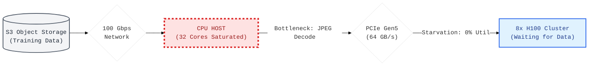
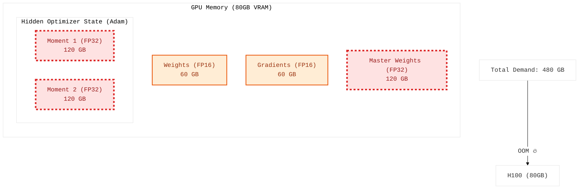
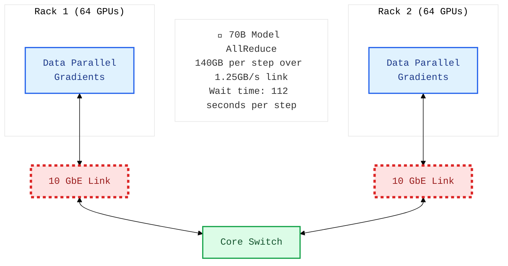
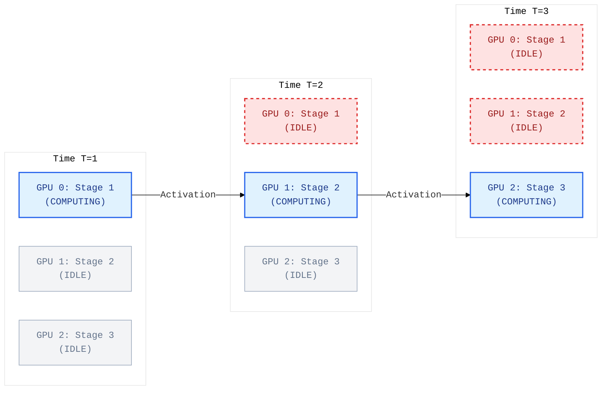
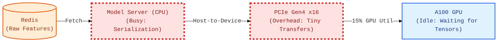
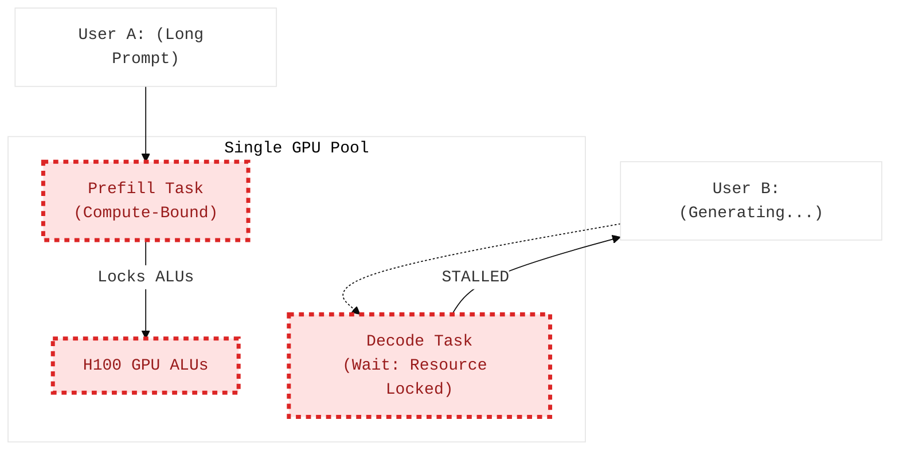
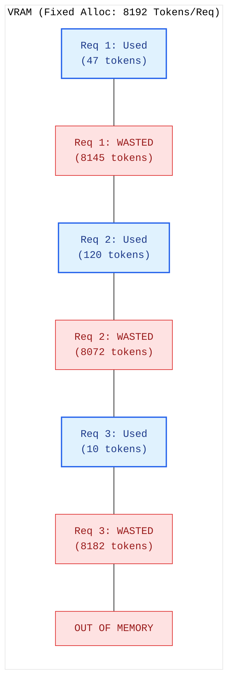
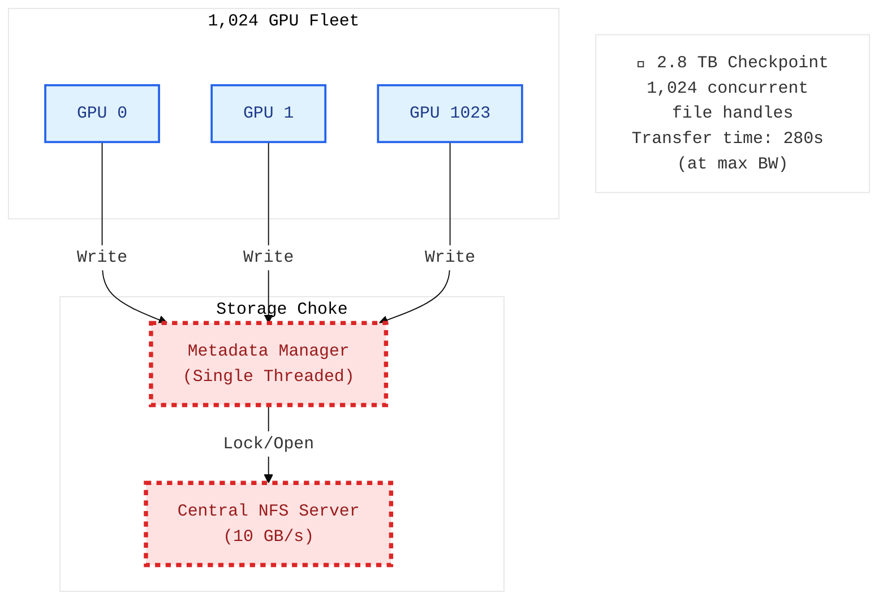
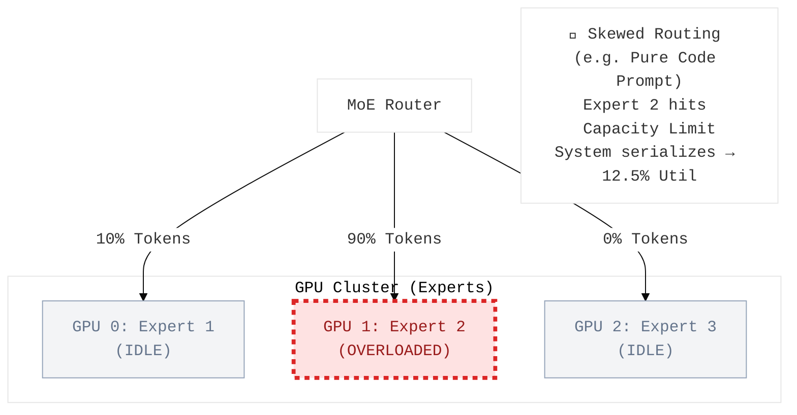
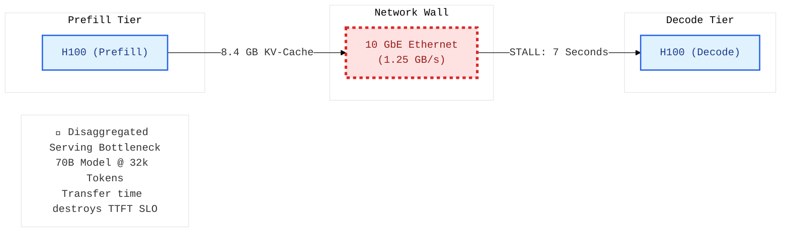

# Visual Architecture Debugging

  <a href="../README.md">🏠 Home</a> ·
  <a href="../00_The_Architects_Rubric.md">📋 Rubric</a> ·
  <b>☁️ Cloud</b> · <a href="../edge/README.md">🤖 Edge</a> · <a href="../mobile/README.md">📱 Mobile</a> · <a href="../tinyml/README.md">🔬 TinyML</a>

---

*Can you spot the bottleneck in a diagram?*

System architecture diagrams with hidden bottlenecks. Read the diagram, find the constraint, and explain the fix.

> **[➕ Add a Flashcard](https://github.com/harvard-edge/cs249r_book/edit/dev/interviews/cloud/05_visual_debugging.md)** (Edit in Browser) — see [README](../README.md#question-format) for the template.

---

<b> The Transformation Wall</b> · <code>data-pipeline</code>

### The Transformation Wall (CPU Starvation)

- **Interviewer:** "You are training a vision model on high-resolution medical images. `nvidia-smi` shows GPU utilization fluctuating violently between 0% and 100%. Based on the diagram above, what is the most likely bottleneck?"

  

  
<b>🔍 Reveal Answer</b>

  **Common Mistake:** "The 100 Gbps network link to S3 is the bottleneck" or "PCIe is too slow." Both links are fast enough — the chokepoint is compute, not bandwidth.

  **Realistic Solution:** The bottleneck is the **CPU Host**. While the 100 Gbps network link and PCIe Gen5 bus are extremely fast, decoding and augmenting JPEGs on 32 CPU cores is painfully slow compared to the consumption rate of 8x H100s. The GPUs will finish their matrix multiplication in 5ms, and then sit completely idle (0% utilization) while waiting for the CPU to finish processing the next batch. You must bypass the CPU. Use GPU-accelerated libraries (like NVIDIA DALI) to move the JPEG decoding and augmentation directly onto the GPUs, utilizing their spare ALU capacity during the data loading phase.

  > **Napkin Math:** An H100 processes a ResNet-50 forward pass in ~2ms. JPEG decoding + augmentation on CPU takes ~30ms per image. With a batch of 64 images and 8 CPU workers, preprocessing takes (64 * 30ms) / 8 = 240ms. The GPU finishes in 2ms and waits 238ms (99% idle time).

  📖 **Deep Dive:** [Data Engineering](https://harvard-edge.github.io/cs249r_book_dev/contents/data_engineering/data_engineering.html)

  

<b> The Optimizer Explosion</b> · <code>training</code> <code>memory</code>

### The Optimizer State Explosion

- **Interviewer:** "You are training a 30B parameter model. You calculate that the weights only take up 60 GB, which fits easily into an 80 GB H100. However, the system OOMs (Out-of-Memory) instantly on the first step. Based on the diagram, what is the hidden memory tax you missed?"

  

  
<b>🔍 Reveal Answer</b>

  **Common Mistake:** "60 GB fits in 80 GB, so the batch size must be too large." Batch size matters, but even with batch size 1, this system OOMs — the hidden cost is the optimizer, not the data.

  **Realistic Solution:** The system OOMs because of the **Optimizer State**. Adam stores two additional tensors per parameter (first and second moments), plus master weights, all in FP32. ZeRO (Zero Redundancy Optimizer) or FSDP is the fix. Instead of replicating the full optimizer state on every GPU, shard it across all workers. ZeRO Stage 3 shards weights, gradients, and optimizer states, reducing per-GPU memory from 480 GB to ~120 GB across 4 nodes.

  > **Napkin Math:** For a 30B parameter model: Weights (FP16) = 60 GB. Gradients (FP16) = 60 GB. Adam moments (FP32) = 240 GB (2 × 120 GB). Master weights (FP32) = 120 GB. Total: 480 GB per GPU.

  📖 **Deep Dive:** [Training](https://harvard-edge.github.io/cs249r_book_dev/contents/training/training.html)

  

<b> The Communication Wall</b> · <code>network</code> <code>training</code>

### The Communication Wall (Amdahl's Law)

- **Interviewer:** "We have a 512-GPU cluster connected via 10 Gbps Ethernet. We are training a 70B parameter model using standard Data Parallelism. Despite having 512 GPUs, our training speed is barely faster than a single machine. Based on the network diagram, why has our scaling efficiency collapsed?"

  

  
<b>🔍 Reveal Answer</b>

  **Common Mistake:** "512 GPUs should give ~512× speedup with Data Parallelism" or "10 Gbps is plenty for gradient sync." Both underestimate the volume of data that must cross the network every training step.

  **Realistic Solution:** This cluster will experience **near-zero scaling efficiency**. To train a 70B model using Data Parallelism, all 512 GPUs must synchronize their gradients via an AllReduce operation at the end of *every single training step*. This requires moving hundreds of gigabytes of data across the network simultaneously. The 10 Gbps Ethernet uplinks to the Core Switch will instantly choke, turning a matrix-multiplication workload into a pure network-wait workload. Training large models requires specialized topologies like a non-blocking Fat-Tree (Clos) with InfiniBand (200-400 Gbps) and NVLink (900 GB/s) within nodes.

  > **Napkin Math:** A 70B model has ~140 GB of gradients (FP16). Over a 10 Gbps (1.25 GB/s) link, a single AllReduce sync would take ~112 seconds. If your forward/backward pass takes 2 seconds, you spend 98% of your time waiting for the network.

  📖 **Deep Dive:** [Network Architectures](https://harvard-edge.github.io/cs249r_book_dev/contents/network_architectures/network_architectures.html)

  

<b> The Pipeline Bubble</b> · <code>training</code> <code>parallelism</code>

### The Pipeline Bubble

- **Interviewer:** "You are using Pipeline Parallelism across 8 GPUs to train a large model. However, you notice your total TFLOPS utilization is only ~12%. Based on the timing diagram, what is the architectural flaw causing this low occupancy?"

  

  
<b>🔍 Reveal Answer</b>

  **Common Mistake:** "Switch to Data Parallelism." DP won't work if the model doesn't fit on a single GPU — that's why they used Pipeline Parallelism in the first place.

  **Realistic Solution:** With a single batch flowing through 8 stages, **only 1 GPU is active at any given time**. The other 7 sit completely idle, waiting for activations from the previous stage. The fix is to split the global batch into many microbatches ($M \gg P$). With $M=32$ microbatches, GPU 0 processes microbatch 2 while GPU 1 processes microbatch 1, filling the bubbles.

  > **Napkin Math:** The pipeline bubble fraction is $(P-1)/M$ where $P$ is stages and $M$ is microbatches. With $M=1$, the bubble is $(8-1)/1 = 87.5\%$ wasted compute. With $M=32$, the bubble shrinks to $(8-1)/32 = 21.9\%$.

  📖 **Deep Dive:** [Training](https://harvard-edge.github.io/cs249r_book_dev/contents/training/training.html)

  

<b> The Memory Copy Wall</b> · <code>data-pipeline</code> <code>serving</code>

### The CPU-GPU Data Transfer Bottleneck

- **Interviewer:** "You are deploying a recommendation model. Your A100 GPU utilization is stuck at 15% during peak traffic. You check your code and find that the CPU is busy serializing features from Redis before sending them to the GPU. Based on the diagram, what is the 'silent killer' limiting your throughput?"

  

  
<b>🔍 Reveal Answer</b>

  **Common Mistake:** "The GPU is too slow, we need to upgrade to an A10G." The GPU is only at 15% utilization — it's starving for data, not compute.

  **Realistic Solution:** The bottleneck is **PCIe transfer overhead and CPU-bound preprocessing**. During traffic spikes, the CPU becomes 100% saturated doing data serialization and tensor formatting. The PCIe bus is flooded with small, unbatched memory transfers. You must move feature preprocessing (embedding lookups, formatting) directly onto the GPU using NVIDIA Triton or DALI, and batch requests on the CPU *before* the PCIe transfer to send large contiguous blocks.

  > **Napkin Math:** PCIe Gen4 x16 provides ~31.5 GB/s. A 1080p frame is ~6 MB. At 30 FPS, that's only 180 MB/s. The 'Wall' isn't bandwidth; it's the latency of thousands of small `cudaMemcpy` calls.

  📖 **Deep Dive:** [ML Operations](https://harvard-edge.github.io/cs249r_book_dev/contents/ml_ops/ml_ops.html)

  

<b> The Resource Contention Stutter</b> · <code>serving</code> <code>latency</code>

### The Prefill-Decode Interference

- **Interviewer:** "Users of your LLM service complain that generation intermittently freezes for several seconds. You notice this happens whenever a new user submits a very long prompt. Based on the diagram, why can't your GPUs handle both tasks simultaneously?"

  

  
<b>🔍 Reveal Answer</b>

  **Common Mistake:** "Add more GPUs to the pool" or "Rate-limit long prompts." More hardware doesn't fix resource contention, and rate-limiting punishes users instead of fixing the architecture.

  **Realistic Solution:** The single GPU pool is the problem. **Prefill** is compute-bound and monopolizes the ALUs, while **Decode** is memory-bandwidth bound. When a long prompt arrives, prefill seizes the compute units, causing concurrent decode requests to stall. The fix is **Disaggregated Serving**: split Prefill and Decode onto separate GPU clusters to isolate these different workload profiles.

  > **Napkin Math:** Prefill compute scales with $O(N^2)$, Decode with $O(N)$. A 4k token prefill can take 200ms, during which 10 decode tokens *should* have been generated. The freeze is the cost of compute-lock.

  📖 **Deep Dive:** [Model Serving](https://harvard-edge.github.io/cs249r_book_dev/contents/model_serving/model_serving.html)

  

<b> The Memory Swiss Cheese</b> · <code>serving</code> <code>memory</code>

### KV-Cache Memory Fragmentation

- **Interviewer:** "Your LLM serving system reports 'Out of Memory' after serving only 3 concurrent users, even though each user has only generated a few dozen tokens. Based on the memory map, why is your VRAM already exhausted?"

  

  
<b>🔍 Reveal Answer</b>

  **Common Mistake:** "There must be a memory leak in the serving framework." It's not a leak — the allocation is working exactly as designed. The design itself is the problem.

  **Realistic Solution:** The system uses contiguous pre-allocation, reserving 8192 tokens worth of VRAM per request regardless of usage. Request 1 uses only 47 tokens but holds memory for 8192, **wasting 99.4% of its allocation**. This is internal fragmentation. The fix is **PagedAttention**: map virtual KV-cache blocks to non-contiguous physical blocks on demand, exactly like OS virtual memory paging.

  > **Napkin Math:** With FP16 and GQA, 8192 tokens take ~2GB. If you have 80GB VRAM, you *should* fit 40 users. But if you pre-allocate contiguous blocks and users only use 50 tokens, you still hit OOM at user 40 despite only using 0.5% of the capacity.

  📖 **Deep Dive:** [Frameworks](https://harvard-edge.github.io/cs249r_book_dev/contents/frameworks/frameworks.html)

  

<b> The Checkpoint Traffic Jam</b> · <code>storage</code> <code>training</code>

### The Metadata and Bandwidth Choke

- **Interviewer:** "Every time your 1,024-GPU cluster attempts to save a checkpoint to the central NFS, the system hangs for 10 minutes and often triggers 'File Timeout' errors. Based on the storage diagram, what two physical bottlenecks are you hitting?"

  

  
<b>🔍 Reveal Answer</b>

  **Common Mistake:** "The NFS server just needs a 100 GB/s link." Bandwidth is a problem, but upgrading the link won't solve the metadata storm of thousands of concurrent file handles.

  **Realistic Solution:** You are hitting both a **Bandwidth Wall** and a **Metadata Storm**. 2.8 TB over 10 GB/s takes ~280s just for data transfer. Simultaneously, 1,024 GPUs requesting inode locks overwhelms the single-threaded metadata manager. The fix is **Asynchronous, Two-Tier Checkpointing**: write shards to *local* NVMe SSDs first (taking <10s), then have a background process trickle them to central storage.

  > **Napkin Math:** 1,024 nodes × 3 GB/s (local NVMe) = 3,072 GB/s aggregate bandwidth. A 2.8 TB checkpoint writes locally in ~1 second. Compare this to the 280 seconds over the shared NFS.

  📖 **Deep Dive:** [Volume II: Fault Tolerance](https://harvard-edge.github.io/cs249r_book_dev/contents/fault_tolerance/fault_tolerance.html)

  

<b> The Expert Bottleneck</b> · <code>training</code> <code>parallelism</code>

### The Expert Capacity Drop

- **Interviewer:** "You are training a Mixture-of-Experts (MoE) model. During a fine-tuning run on Python code, you notice your training throughput drops by 8x. Based on the router diagram, what is causing the massive compute starvation on the other GPUs?"

  

  
<b>🔍 Reveal Answer</b>

  **Common Mistake:** "Just add more GPUs for Expert 2." You can't dynamically clone model weights to new GPUs at the microsecond timescale of a forward pass without massive overhead.

  **Realistic Solution:** Expert 2 has hit its **Capacity Limit**. In MoE, frameworks pre-allocate a fixed capacity per expert. When a prompt is domain-specific (like code), the router sends nearly all tokens to one expert. That expert becomes a bottleneck, forcing the system to either drop tokens or serialize execution, leaving the other expert GPUs idle. The fix is **Expert Replication** (cloning hot experts) or using an **Auxiliary Load-Balancing Loss** during training.

  > **Napkin Math:** If 8 experts each have a capacity of $C$ tokens, but one expert receives $8C$ tokens, that expert takes 8x longer to compute while the other 7 GPUs sit at 0% utilization for 87.5% of the step time.

  📖 **Deep Dive:** [Volume II: Distributed Training](https://harvard-edge.github.io/cs249r_book_dev/contents/distributed_training/distributed_training.html)

  

<b> The KV-Cache Network Wall</b> · <code>network</code> <code>serving</code>

### The KV-Cache Network Transfer Wall

- **Interviewer:** "You implement Disaggregated Serving to separate Prefill and Decode tasks for a 70B LLM. However, for users with long prompts (32k tokens), the Time-to-First-Token (TTFT) increases by 7 seconds. Based on the diagram, what physical link is destroying your latency gain?"

  

  
<b>🔍 Reveal Answer</b>

  **Common Mistake:** "Disaggregated serving is always faster because it isolates compute from memory bandwidth." This assumes the transfer of the intermediate state (the KV-cache) is free.

  **Realistic Solution:** The bottleneck is the **10 GbE Network**. For a 70B model with a 32k token prompt, the KV-cache is massive (~8.4 GB). Over a 1.25 GB/s link, transferring this state takes ~7 seconds. Disaggregated serving requires **InfiniBand/RoCE (200-400 Gbps)** and **GPUDirect RDMA** to move the KV-cache directly between GPU HBMs, bypassing the slow CPU RAM and standard Ethernet.

  > **Napkin Math:** 32,000 tokens × 8 KV heads × 128 dim × 2 layers × 2 bytes (FP16) ≈ 8.4 GB. Time = $8.4 \text{ GB} / 1.25 \text{ GB/s} \approx 6.7 \text{ seconds}$.

  📖 **Deep Dive:** [Volume II: Model Serving](https://harvard-edge.github.io/cs249r_book_dev/contents/model_serving/model_serving.html)

  

