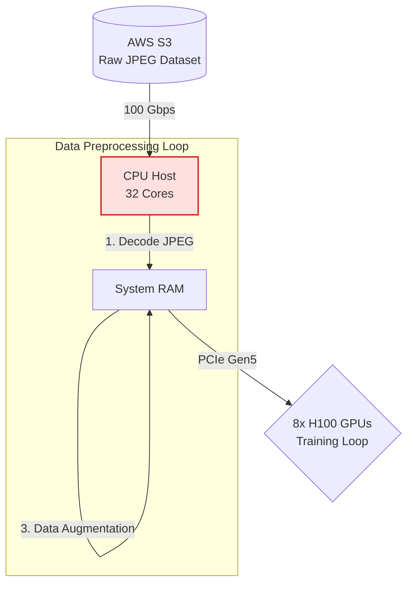
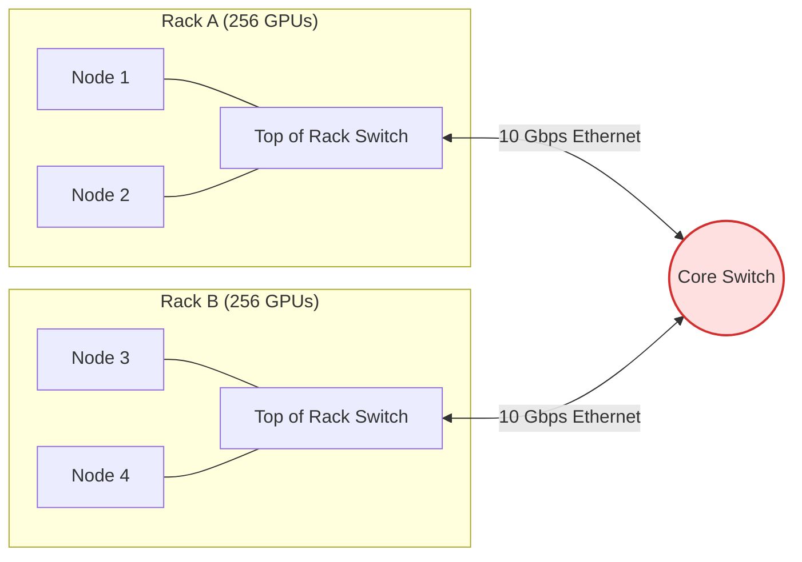
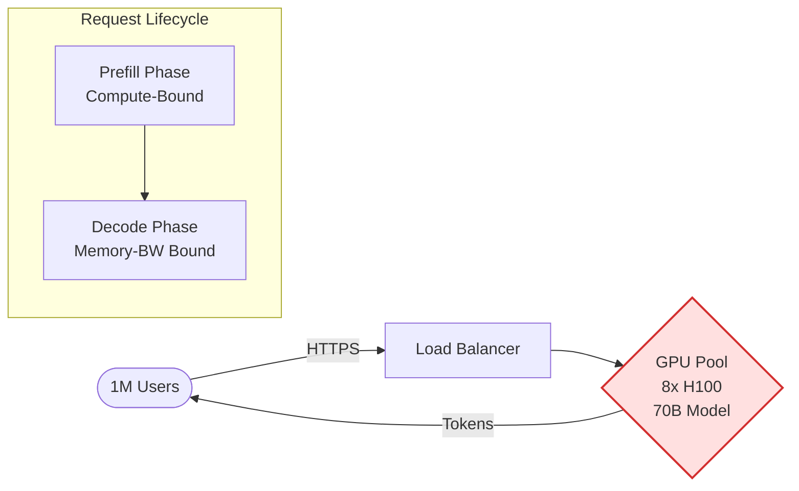
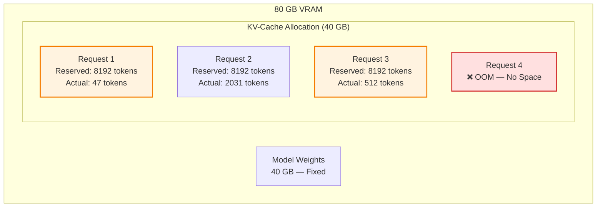
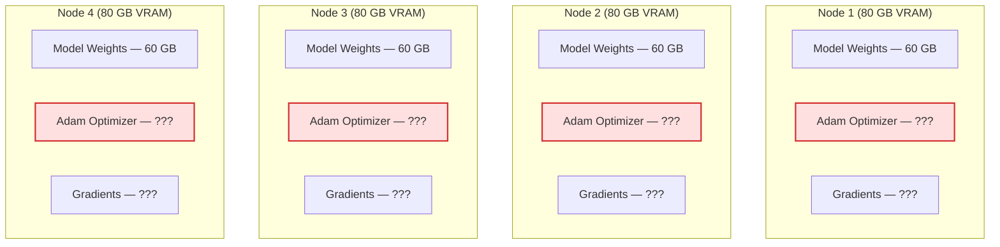
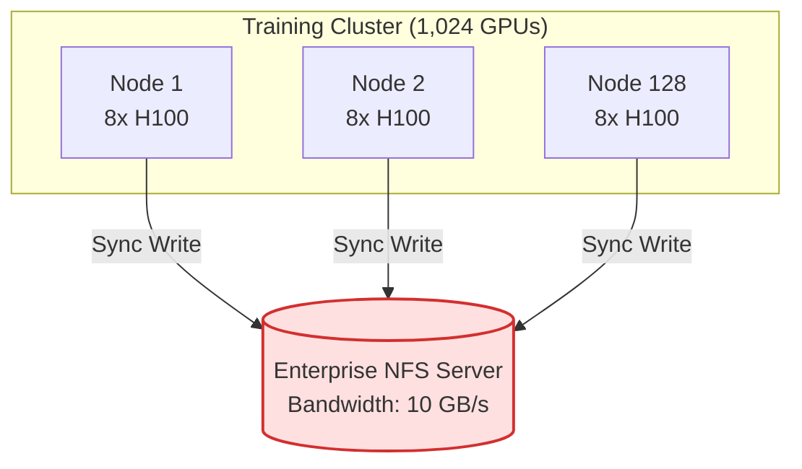
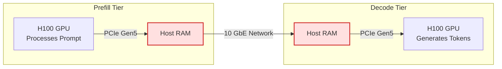
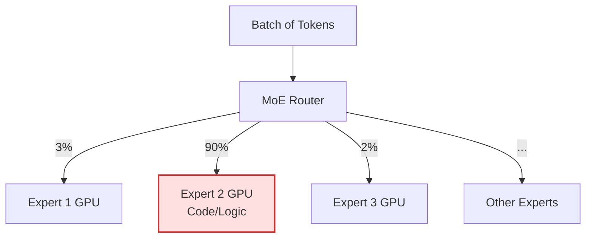

# Round 5: Visual Architecture Debugging 🖼️

<div align="center">
  <a href="../README.md">🏠 Home</a> ·
  <a href="../00_The_Architects_Rubric.md">📋 Rubric</a> ·
  <a href="01_compute_and_memory.md">🧱 1. Compute & Memory</a> ·
  <a href="02_network_and_distributed.md">🚀 2. Network & Distributed</a> ·
  <a href="03_inference_and_serving.md">⚡ 3. Inference & Serving</a> ·
  <a href="04_data_and_mlops.md">💼 4. Data & MLOps</a> ·
  <a href="05_visual_debugging.md">🖼️ 5. Visual Debugging</a> ·
  <a href="06_advanced_systems.md">⚙️ 6. Advanced Systems</a>
</div>

---

The ultimate test of an AI Systems Engineer is not reciting formulas, but spotting the bottlenecks in a proposed architecture diagram *before* it gets built.

In this round, you are presented with systems designs that look plausible on paper but violate the fundamental physics of AI computation. Each challenge follows the same structure: **The Scenario** sets the context, a **diagram** shows the proposed architecture, and **The Question** asks you to find the flaw. Try to answer before clicking "Reveal the Bottleneck."

> **[➕ Add a Visual Challenge](https://github.com/harvard-edge/cs249r_book/edit/dev/interviews/cloud/05_visual_debugging.md)** (Edit in Browser) — see [README](../README.md#question-format) for the template.

---

## 🛑 Challenge 1: The "Infinite Scale" Dataloader · `data-pipeline`

**The Scenario:** The team is training a ResNet-50 model on a cluster of 8x H100s. To ensure the GPUs are never starved for data, the junior engineer designed this high-throughput ingestion pipeline.



**The Question:** This pipeline looks like it has plenty of bandwidth at every stage. But the GPUs are sitting at 0% utilization most of the time. One component in this diagram is the bottleneck — which one, and why?

<details>
<summary><b> 🚨 Reveal the Bottleneck</b></summary>

### The Transformation Wall (CPU Starvation)

**Common Mistake:** "The 100 Gbps network link to S3 is the bottleneck" or "PCIe is too slow." Both links are fast enough — the chokepoint is compute, not bandwidth.

The bottleneck is the **CPU Host**. While the 100 Gbps network link and PCIe Gen5 bus are extremely fast, decoding and augmenting JPEGs on 32 CPU cores is painfully slow compared to the consumption rate of 8x H100s.

The GPUs will finish their matrix multiplication in 5ms, and then sit completely idle (0% utilization) while waiting for the CPU to finish processing the next batch.

**The Fix:** You must bypass the CPU. Use GPU-accelerated libraries (like NVIDIA DALI) to move the JPEG decoding and augmentation directly onto the GPUs, utilizing their spare ALU capacity during the data loading phase.

**📖 Deep Dive:** [Data Engineering](https://harvard-edge.github.io/cs249r_book_dev/contents/data_engineering/data_engineering.html)
</details>

---

## 🛑 Challenge 2: The "Cost-Optimized" Training Cluster · `network`

**The Scenario:** A startup is trying to pre-train a 70B parameter LLM. To save money, the CTO purchased 512 cheaper GPUs without high-speed interconnects and wired them together using standard enterprise networking.



**The Question:** The CTO claims this cluster will train the 70B model at 512× the speed of a single GPU. What fundamental networking constraint makes this architecture dead on arrival?

<details>
<summary><b> 🚨 Reveal the Bottleneck</b></summary>

### The Communication Wall (Amdahl's Law)

**Common Mistake:** "512 GPUs should give ~512× speedup with Data Parallelism" or "10 Gbps is plenty for gradient sync." Both underestimate the volume of data that must cross the network every training step.

This cluster will experience **near-zero scaling efficiency**. To train a 70B model using Data Parallelism, all 512 GPUs must synchronize their gradients via an AllReduce operation at the end of *every single training step*.

This requires moving hundreds of gigabytes of data across the network simultaneously. The 10 Gbps Ethernet uplinks to the Core Switch will instantly choke, turning a matrix-multiplication workload into a pure network-wait workload.

**The Fix:** Training large models requires specialized topologies. You need a non-blocking Fat-Tree (Clos) topology with InfiniBand (200-400 Gbps) between racks, and NVLink (900 GB/s) within the nodes. Without high **Bisection Bandwidth**, adding more GPUs actively degrades throughput.

**📖 Deep Dive:** [Network Architectures](https://harvard-edge.github.io/cs249r_book_dev/contents/network_architectures/network_architectures.html)
</details>

---

## 🛑 Challenge 3: The "Simple" LLM Serving Stack · `serving` `kv-cache`

**The Scenario:** The team is deploying a 70B LLM chatbot. The architect proposes a clean, straightforward serving pipeline where all requests flow through a single model pool.



**The Question:** Users report that their token stream randomly freezes mid-conversation, even though the cluster isn't at full capacity. The diagram shows two phases with fundamentally different resource profiles sharing the same hardware. What is causing the interference, and how do you isolate it?

<details>
<summary><b> 🚨 Reveal the Bottleneck</b></summary>

### The Prefill-Decode Interference

**Common Mistake:** "Add more GPUs to the pool" or "Rate-limit long prompts." More hardware doesn't fix resource contention, and rate-limiting punishes users instead of fixing the architecture.

The single GPU pool is the problem. **Prefill** (processing the user's prompt) is compute-bound and monopolizes the ALUs. **Decode** (generating tokens one at a time) is memory-bandwidth bound and needs the HBM bus.

When a user sends a long prompt, the prefill phase seizes the GPU's compute units, causing all concurrent decode requests to stall. Users mid-conversation see their token stream freeze every time someone else sends a long prompt.

**The Fix:** Disaggregated Serving. Split Prefill and Decode onto separate GPU clusters. Prefill nodes compute the KV-Cache and transmit it over the network to dedicated Decode nodes. This isolates the two fundamentally different workload profiles.

**📖 Deep Dive:** [Model Serving](https://harvard-edge.github.io/cs249r_book_dev/contents/model_serving/model_serving.html)
</details>

---

## 🛑 Challenge 4: The "Efficient" Pipeline Parallelism · `parallelism`

**The Scenario:** The team partitions a 96-layer Transformer across 8 GPUs using Pipeline Parallelism. They assign 12 layers per GPU and send one batch at a time through the pipeline.


**The Question:** The profiler shows GPUs 0–6 are idle most of the time while GPU 7 does all the work. The team is paying for 8 GPUs but getting the throughput of 1. What is the utilization of this pipeline, and how do you fix it without changing the model or the hardware?

<details>
<summary><b> 🚨 Reveal the Bottleneck</b></summary>

### The Pipeline Bubble

**Common Mistake:** "Switch to Data Parallelism." DP won't work if the model doesn't fit on a single GPU — that's why they used Pipeline Parallelism in the first place.

With a single batch flowing through 8 stages, **only 1 GPU is active at any given time**. The other 7 sit completely idle, waiting for activations from the previous stage. This means your utilization is $1/P = 1/8 = 12.5\%$. You paid for 8 GPUs but are using 1.

The pipeline bubble fraction is $(P-1)/M$ where $P$ is the number of stages and $M$ is the number of microbatches. With $M=1$, the bubble is $(8-1)/1 = 87.5\%$ wasted compute.

**The Fix:** Split the global batch into many microbatches ($M \gg P$). With $M=32$ microbatches, GPU 0 processes microbatch 2 while GPU 1 processes microbatch 1. The bubble shrinks to $(8-1)/32 = 21.9\%$. Techniques like 1F1B (one forward, one backward) scheduling further reduce peak memory.

**📖 Deep Dive:** [Training](https://harvard-edge.github.io/cs249r_book_dev/contents/training/training.html)
</details>

---

## 🛑 Challenge 5: The "Scalable" Feature Store · `mlops` `hardware-bottleneck`

**The Scenario:** The ML platform team built a feature store for their real-time recommendation system. Features are computed in a batch Spark job (CPU) and served from Redis. The model runs on an NVIDIA T4 GPU. The architecture looks clean — until Black Friday.

```mermaid
flowchart TD
    subgraph "Batch Pipeline (Daily)"
        Spark[Spark Job (CPU)] -->|Write| Redis[(Redis
Feature Cache)]
    end

    subgraph "Serving Path (Real-time)"
        Request([User Request]) --> API[Model Server (CPU)]
        API -->|Feature Lookup| Redis
        API -->|Preprocess to Tensor| CPU_RAM[CPU RAM]
        CPU_RAM -->|PCIe Transfer| GPU_VRAM[GPU VRAM]
        GPU_VRAM -->|Predict| Response([Response])
    end

    classDef error fill:#ffe0e0,stroke:#d32f2f,stroke-width:2px;
    class CPU_RAM,GPU_VRAM error;
```

**The Question:** During the traffic spike, the model's latency jumps from 20ms to 500ms, but the GPU utilization is only 15%. Where in this diagram is the silent killer hiding, and why does the hardware architecture cause this latency spike?

<details>
<summary><b> 🚨 Reveal the Bottleneck</b></summary>

### The CPU-GPU Data Transfer Bottleneck

**Common Mistake:** "The GPU is too slow, we need to upgrade to an A10G." The GPU is only at 15% utilization — it's starving for data, not compute.

The diagram hides a hardware-level silent killer: **PCIe transfer overhead and CPU-bound preprocessing**. The Spark job computes raw features, but the Model Server (running on CPU) must deserialize them from Redis, convert them into PyTorch tensors, and send them over the PCIe bus to the GPU for every single request.

During a traffic spike, the CPU becomes 100% saturated doing data serialization and tensor formatting. The PCIe bus is flooded with small, unbatched memory transfers (host-to-device). The GPU spends 85% of its time waiting for the CPU to hand it the next tensor.

**The Fix:** Move the final feature preprocessing steps (like embedding lookups or tensor formatting) directly onto the GPU using NVIDIA Triton or DALI, and batch the requests on the CPU *before* the PCIe transfer so you send one large contiguous block of memory rather than thousands of tiny ones.

**📖 Deep Dive:** [ML Operations](https://harvard-edge.github.io/cs249r_book_dev/contents/ml_ops/ml_ops.html)
</details>

---

## 🛑 Challenge 6: The "Lossless" KV-Cache · `kv-cache` `memory`

**The Scenario:** The serving team allocates VRAM for the KV-cache by reserving the maximum sequence length (8192 tokens) for every concurrent request. They have 80 GB of VRAM and the model weights take 40 GB, leaving 40 GB for the cache.



**The Question:** The system has 40 GB of free VRAM but can only serve 3 concurrent requests before hitting OOM. Request 1 is using only 47 tokens. Look at the allocation pattern — what percentage of memory is being wasted, and what OS concept from the 1960s solves this?

<details>
<summary><b> 🚨 Reveal the Bottleneck</b></summary>

### KV-Cache Memory Fragmentation

**Common Mistake:** "There must be a memory leak in the serving framework." It's not a leak — the allocation is working exactly as designed. The design itself is the problem.

The system reserves 8192 tokens worth of VRAM per request regardless of actual usage. Request 1 uses only 47 tokens but holds memory for 8192 — **wasting 99.4% of its allocation**. After just 3 requests, the system reports OOM despite having enough physical memory for dozens of short conversations.

This is the same problem that plagued early operating systems before virtual memory: contiguous allocation with massive internal fragmentation.

**The Fix:** PagedAttention (as implemented in vLLM). Instead of contiguous pre-allocation, map virtual KV-cache blocks to non-contiguous physical blocks on demand — exactly like OS virtual memory paging. This eliminates fragmentation, enabling 2-4x more concurrent requests with the same hardware.

**📖 Deep Dive:** [Frameworks](https://harvard-edge.github.io/cs249r_book_dev/contents/frameworks/frameworks.html)
</details>

---

## 🛑 Challenge 7: The "Redundant" Data Parallelism · `parallelism` `memory`

**The Scenario:** The team is training a 30B parameter model using standard Data Parallelism (DDP) across 4 nodes, each with 80 GB VRAM. The model weights in FP16 are 60 GB, which fits in each GPU's memory.



**The Question:** The diagram shows 60 GB of weights fitting comfortably in 80 GB of VRAM. But the system OOMs on the very first training step. The boxes marked "???" are the clue. Calculate the actual memory required per GPU, and explain why every node holds a redundant copy of the problem.

<details>
<summary><b> 🚨 Reveal the Bottleneck</b></summary>

### The Optimizer State Explosion

**Common Mistake:** "60 GB fits in 80 GB, so the batch size must be too large." Batch size matters, but even with batch size 1, this system OOMs — the hidden cost is the optimizer, not the data.

The diagram shows 60 GB of weights fitting in 80 GB — looks fine, right? But it hides the **Optimizer State**. Adam stores two additional tensors per parameter (first and second moments), each in FP32. The full memory per GPU is:

- Weights (FP16): 60 GB
- Gradients (FP16): 60 GB
- Adam moments (FP32): 120 GB (2 × 60 GB in FP32)
- FP32 master weights: 120 GB

**Total: ~360 GB per GPU.** The system OOMs instantly on step 1 — and every GPU holds an identical redundant copy of the optimizer state.

**The Fix:** ZeRO (Zero Redundancy Optimizer) or FSDP. Instead of replicating the full optimizer state on every GPU, shard it across all workers. ZeRO Stage 3 shards weights, gradients, and optimizer states, reducing per-GPU memory from 360 GB to ~90 GB across 4 nodes.

**📖 Deep Dive:** [Training](https://harvard-edge.github.io/cs249r_book_dev/contents/training/training.html)
</details>


---

## 🛑 Challenge 8: The "Centralized" Checkpoint Storm · `fault-tolerance` `storage`

**The Scenario:** You are training a 175B parameter model using 3D parallelism across 1,024 GPUs. To ensure no data is lost during preemptions, the infrastructure team configures synchronous checkpointing every 500 steps directly to a central enterprise NFS server.



**The Question:** The GPUs are spending 30% of their total time idle, waiting for checkpoints to finish. Looking at the diagram, why is the checkpointing taking so long, and how do you redesign this architecture to keep the GPUs computing?

<details>
<summary><b> 🚨 Reveal the Bottleneck</b></summary>

### The Metadata and Bandwidth Choke

**Common Mistake:** "The NFS server just needs a 100 GB/s link." Bandwidth is a problem, but upgrading the link won't solve the metadata storm of thousands of concurrent file handles.

A 175B model requires saving roughly 2.8 TB of state (weights, gradients, optimizer moments in FP32). When 128 nodes simultaneously open files and push data to a single NFS server, two things happen:
1. **Bandwidth limitation:** 2.8 TB / 10 GB/s = 280 seconds (nearly 5 minutes) of pure transfer time per checkpoint.
2. **The Metadata Storm:** 1,024 GPUs simultaneously requesting file handles and inode locks overwhelms the NFS master node's single-threaded metadata manager, causing severe timeouts and stragglers.

**The Fix:** Implement **Asynchronous, Two-Tier Checkpointing**.
1. Have each node write its checkpoint shard synchronously to its *local* NVMe SSD (typically 3-7 GB/s per node). 128 nodes × 3 GB/s = 384 GB/s aggregate bandwidth. The 2.8 TB checkpoint writes locally in under **10 seconds**.
2. Once written to local NVMe, the GPUs immediately resume training.
3. A background CPU process slowly uploads the local SSD checkpoints to the central object storage without blocking the GPUs.

**📖 Deep Dive:** [Volume II: Fault Tolerance](https://harvard-edge.github.io/cs249r_book_dev/contents/fault_tolerance/fault_tolerance.html)
</details>

---

## 🛑 Challenge 9: The "Disaggregated" Bottleneck · `serving` `network`

**The Scenario:** To solve prefill-decode interference, the team implements Disaggregated Serving for their 70B model. Prefill nodes process the prompts and send the computed KV-cache over the network to Decode nodes for token generation.



**The Question:** The prefill nodes are processing 32k-token prompts perfectly, but the decode nodes are stalling for seconds before they can start generating the first token. What is the physical bottleneck in this transfer architecture?

<details>
<summary><b> 🚨 Reveal the Bottleneck</b></summary>

### The KV-Cache Network Transfer Wall

**Common Mistake:** "Disaggregated serving is always faster because it isolates compute from memory bandwidth." This assumes the transfer of the intermediate state (the KV-cache) is free.

The bottleneck is the **10 GbE (Gigabit Ethernet) Network** and the **Host RAM bounce**.
For a 70B model with a 32,000 token prompt, the KV-cache is massive.
At 128 head dimension, 64 layers, and FP16, the KV-cache for 32k tokens is roughly **8.4 GB per request**.

A 10 GbE network provides a theoretical maximum of 1.25 GB/s. Transferring an 8.4 GB KV-cache for a single user takes **~7 seconds** of pure network transmission time. The user experiences a 7-second Time-To-First-Token (TTFT) stall entirely due to network transfer. Furthermore, copying data through Host RAM adds PCIe contention and CPU overhead.

**The Fix:** Disaggregated serving requires data-center scale networking. You must upgrade the inter-tier links to 200 Gbps or 400 Gbps InfiniBand/RoCE (giving 25-50 GB/s), which reduces the transfer time from 7 seconds to under 200 milliseconds. Additionally, you must bypass the CPU RAM entirely by using **GPUDirect RDMA** to transfer the KV-cache directly from the Prefill GPU's HBM to the Decode GPU's HBM.

**📖 Deep Dive:** [Volume II: Model Serving](https://harvard-edge.github.io/cs249r_book_dev/contents/model_serving/model_serving.html)
</details>

---

## 🛑 Challenge 10: The "Unbalanced" MoE Router · `architecture` `parallelism`

**The Scenario:** You deploy a Mixture-of-Experts (MoE) model with 8 experts distributed across 8 GPUs. A router network assigns each token to the single best expert. During a highly specialized coding task, the pipeline grinds to a halt.



**The Question:** The diagram shows the token distribution during this specific task. Why does this distribution cause the entire 8-GPU cluster to run at 12.5% utilization?

<details>
<summary><b> 🚨 Reveal the Bottleneck</b></summary>

### The Expert Capacity Drop

**Common Mistake:** "Just add more GPUs for Expert 2." You can't dynamically clone model weights to new GPUs at the microsecond timescale of a forward pass without massive overhead.

MoE models rely on the assumption that tokens will be roughly evenly distributed across experts. Because standard neural networks operate on fixed-size tensors, the framework pre-allocates a fixed **Expert Capacity** (e.g., maximum N tokens per expert per batch).

When 90% of the tokens are routed to Expert 2 (which often happens when prompts are highly domain-specific, like pure code or math):
1. Expert 2 hits its capacity limit and either **drops tokens** (destroying generation quality) or forces the system to serialize execution (destroying throughput).
2. The other 7 GPUs sit completely idle, waiting for Expert 2 to finish its massive workload before the pipeline can proceed to the next layer.

**The Fix:** Implement **Capacity Routing with Token Dropping / Auxiliary Loss**, and **Expert Replication**. Train the model with a load-balancing auxiliary loss to penalize the router for sending too many tokens to one expert. In deployment, if certain experts are known to be consistently "hot" (like a coding expert), replicate that specific expert's weights across multiple GPUs, or use **Expert Parallelism** paired with Tensor Parallelism to distribute the hot expert's compute.

**📖 Deep Dive:** [Volume II: Distributed Training](https://harvard-edge.github.io/cs249r_book_dev/contents/distributed_training/distributed_training.html)
</details>
