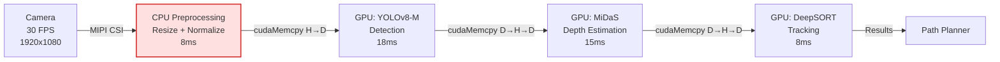
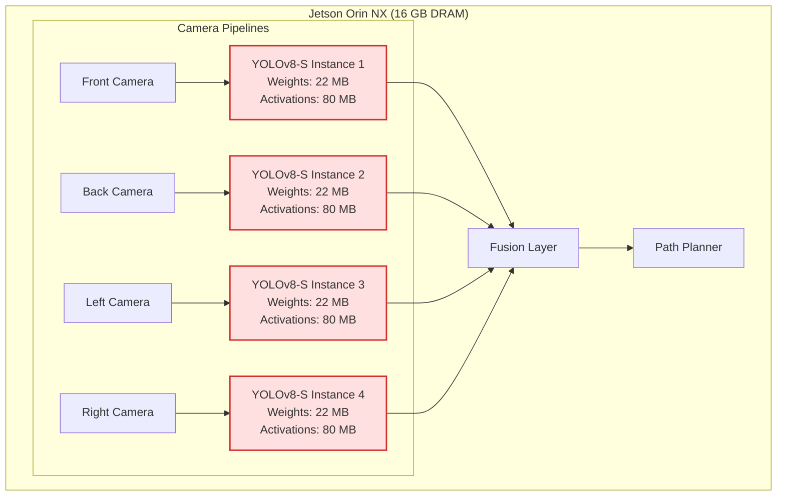
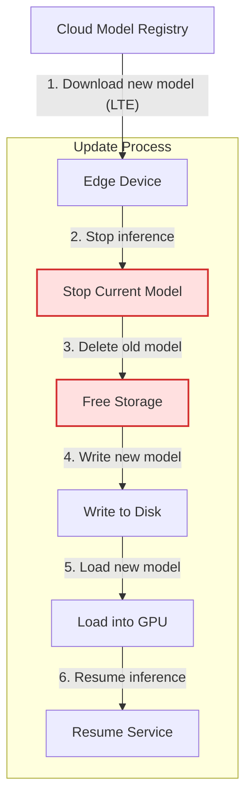
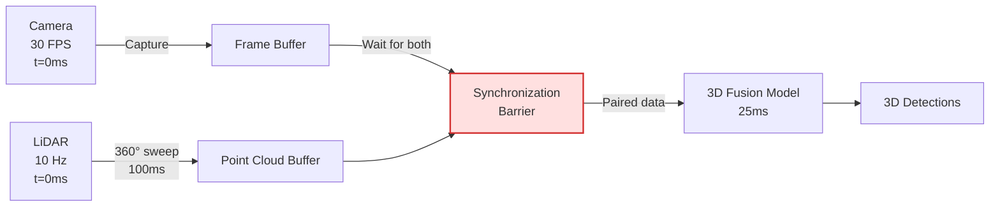
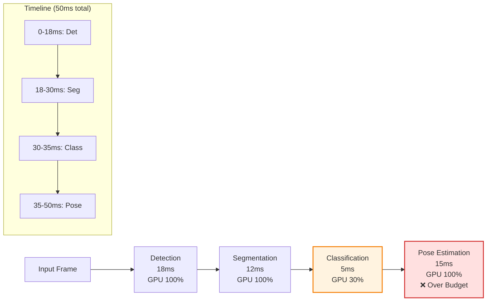
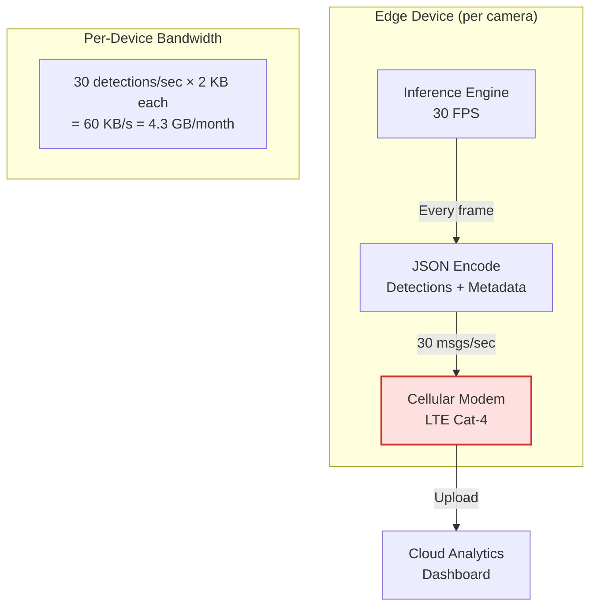
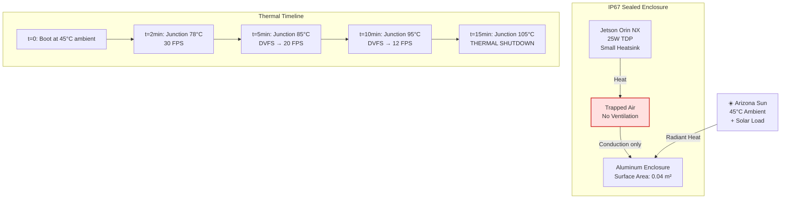
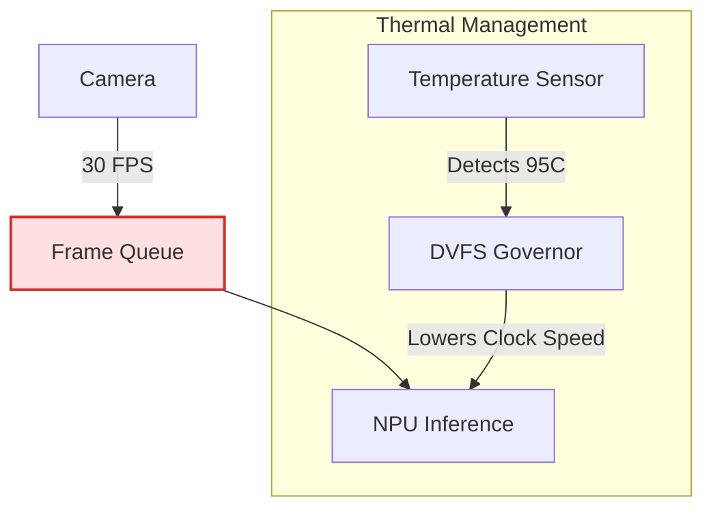
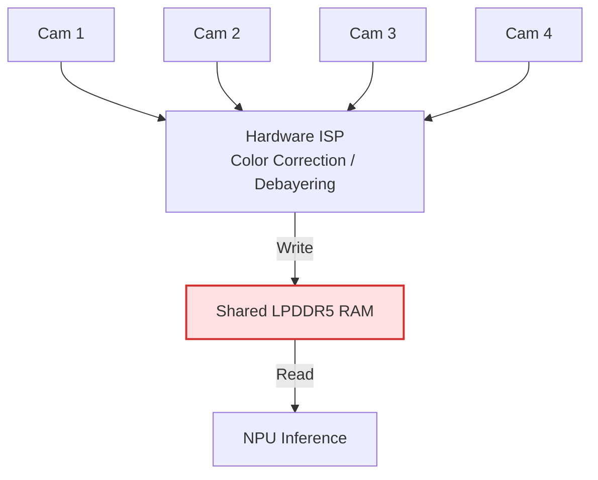

# Round 4: Visual Architecture Debugging 🖼️

  <a href="../README.md">🏠 Home</a> ·
  <a href="../00_The_Architects_Rubric.md">📋 Rubric</a> ·
  <a href="01_systems_and_real_time.md">🤖 1. Systems & Real-Time</a> ·
  <a href="02_compute_and_memory.md">⚖️ 2. Compute & Memory</a> ·
  <a href="03_data_and_deployment.md">🚀 3. Data & Deployment</a> ·
  <a href="04_visual_debugging.md">🖼️ 4. Visual Debugging</a> ·
  <a href="05_heterogeneous_and_advanced.md">🔬 5. Heterogeneous & Advanced</a>

---

The ultimate test of an edge ML systems engineer is spotting the bottleneck in a proposed architecture *before* it ships to 10,000 devices that can't be easily recalled. Each challenge presents a plausible edge system design with a hidden flaw. Try to find it before clicking "Reveal the Bottleneck."

> **[➕ Add a Visual Challenge](https://github.com/harvard-edge/cs249r_book/edit/dev/interviews/edge/04_visual_debugging.md)** (Edit in Browser) — see [README](../README.md#question-format) for the template.

---

## 🛑 Challenge 1: The "High-Performance" Perception Pipeline · `latency` `memory`

**The Scenario:** An autonomous delivery robot team designed their perception pipeline on a Jetson AGX Orin. The pipeline processes camera frames through three sequential models.

**The Question:** The team measures 55ms end-to-end latency (8+18+15+8+6ms overhead) and gets 18 FPS — well below the 30 FPS target. The GPU utilization is only 40%. The profiler shows the GPU is idle for 30% of each frame. Where is the time going?

<b> 🚨 Reveal the Bottleneck</b>

### The Host-Device Memory Bounce

**Common Mistake:** "The models are too slow — use smaller models." The models themselves only take 41ms of compute. The missing time is in data movement.

The pipeline copies data from GPU → CPU → GPU between every model (`cudaMemcpy D→H→D`). Each round-trip takes 2-4ms for a 1080p tensor, and there are 3 such copies. Worse, `cudaMemcpy` is synchronous by default — the GPU sits completely idle during each transfer, creating bubbles.

**The Fix:** Keep all tensors on the GPU. Use CUDA unified memory or explicit device-to-device transfers. Detection's output tensor becomes Depth's input tensor *without ever touching the CPU*. Preprocessing should also move to the GPU (NVIDIA DALI or custom CUDA kernels). This eliminates ~12ms of memory copies and GPU idle time, bringing the pipeline to ~43ms → 23 FPS. Add frame pipelining (overlap frame N's depth with frame N+1's detection) to reach 30+ FPS.

**📖 Deep Dive:** [Volume I: ML Frameworks](https://harvard-edge.github.io/cs249r_book_dev/contents/frameworks/frameworks.html)

---

## 🛑 Challenge 2: The "Redundant" Multi-Camera System · `memory` `architecture`

**The Scenario:** A warehouse robot has 4 cameras (front, back, left, right) for 360° perception. The team runs a separate YOLOv8-S instance for each camera on a Jetson Orin NX.

**The Question:** The system uses 4 × (22 + 80) = 408 MB for ML alone, and each camera gets only 25% of the GPU's compute time, running at 12 FPS per camera. The team says "we need a bigger GPU." Do they?

<b> 🚨 Reveal the Bottleneck</b>

### Quadruplicated Weights

**Common Mistake:** "4 cameras need 4 model instances." The cameras need 4 inference passes, but NOT 4 copies of the weights.

All four instances load identical YOLOv8-S weights — 22 MB × 4 = 88 MB of duplicated weights in GPU memory. Since the weights are read-only during inference, a single copy serves all four cameras. Load the weights once (22 MB) and run 4 inference passes with different input tensors. Memory drops from 408 MB to 22 + (4 × 80) = 342 MB — a 16% reduction. More importantly, **batch the 4 camera inputs** into a single inference call: batch size 4 with shared weights. On the Orin NX, batched inference is 2-3× more efficient than 4 sequential calls because it amortizes kernel launch overhead and improves GPU occupancy. Expected FPS per camera: 25-30 (up from 12).

**The Fix:** Single model instance, batch size 4. If the cameras have different resolutions or FOVs, use dynamic batching with padding. Memory: 22 MB weights + 320 MB activations (batched) = 342 MB. Throughput: ~28 FPS per camera.

**📖 Deep Dive:** [Volume I: Model Serving](https://harvard-edge.github.io/cs249r_book_dev/contents/model_serving/model_serving.html)

---

## 🛑 Challenge 3: The "Safe" OTA Update Pipeline · `deployment` `reliability`

**The Scenario:** The fleet management team designed an OTA model update system for 10,000 edge cameras. The system downloads the new model, validates it, and swaps it in.

**The Question:** The team says "the update takes 45 seconds — the camera is blind for less than a minute." The security team rejects this design. What are the two critical flaws?

<b> 🚨 Reveal the Bottleneck</b>

### Blind Spot + No Rollback

**Common Mistake:** "45 seconds of downtime is acceptable for a software update." For a security camera, 45 seconds of blindness is an exploitable window. For a safety system, it's unacceptable.

**Flaw 1: Inference gap.** Steps 2-6 create a 45-second window where the camera produces no detections. An intruder who knows the update schedule has a guaranteed blind spot. For safety-critical systems (autonomous vehicles, industrial monitoring), any inference gap violates the safety contract.

**Flaw 2: No rollback path.** Step 3 deletes the old model *before* the new model is validated. If the download was corrupted, or the new model fails validation, or power is lost during step 4, the device has *no model at all* — it's bricked.

**The Fix:** A/B partitioning with hot-swap. Keep two model slots. Download the new model to the inactive slot *while the active model continues serving*. Validate the new model by running test inference on a reference image. Only then atomically swap the active pointer. Zero downtime, instant rollback.

**📖 Deep Dive:** [Volume I: ML Operations](https://harvard-edge.github.io/cs249r_book_dev/contents/ml_ops/ml_ops.html)

---

## 🛑 Challenge 4: The "Efficient" Sensor Fusion Pipeline · `sensor-fusion` `latency`

**The Scenario:** An autonomous vehicle fuses camera and LiDAR data for 3D object detection. The team designed a straightforward pipeline.

**The Question:** The system produces 3D detections at only 10 Hz (limited by LiDAR rate), even though the camera runs at 30 FPS. At highway speed, a 100ms gap between detections means the vehicle travels 3 meters blind. The team says "we need a faster LiDAR." Is that the only option?

<b> 🚨 Reveal the Bottleneck</b>

### The Synchronization Barrier Stalls the Fast Sensor

**Common Mistake:** "The LiDAR is the bottleneck — buy a 30 Hz LiDAR." A faster LiDAR helps but costs $5,000+ more and doesn't solve the fundamental architecture issue.

The synchronization barrier forces the camera to wait for the LiDAR. 20 out of every 30 camera frames are discarded — 67% of the visual information is thrown away. The pipeline's output rate is locked to the slowest sensor.

**The Fix:** Asynchronous fusion with temporal interpolation. Run camera-only 2D detection at 30 FPS (no waiting). Run LiDAR 3D processing at 10 Hz independently. Between LiDAR sweeps, project the 2D camera detections into 3D using the *most recent* LiDAR depth map + ego-motion compensation from the IMU. This gives 30 Hz 3D detections: 10 Hz are "full fusion" (camera + fresh LiDAR), and 20 Hz are "interpolated fusion" (camera + stale LiDAR + IMU correction). At highway speed, the gap between detections drops from 100ms (3m) to 33ms (1m).

**📖 Deep Dive:** [Volume I: Data Engineering](https://harvard-edge.github.io/cs249r_book_dev/contents/data_engineering/data_engineering.html)

---

## 🛑 Challenge 5: The "Optimized" Multi-Model Scheduler · `latency` `thermal`

**The Scenario:** An edge device runs three models sequentially on a single GPU: detection (18ms), segmentation (12ms), and classification (5ms). Total: 35ms per frame. The team wants to add a fourth model (pose estimation, 15ms) but that would push the total to 50ms — well over the 33ms budget.

**The Question:** Look at the GPU utilization numbers. One model is only using 30% of the GPU. The team treats all four models as a flat sequential pipeline. What scheduling optimization can bring the total under 33ms without changing any model?

<b> 🚨 Reveal the Bottleneck</b>

### Wasted GPU Parallelism

**Common Mistake:** "Run all models sequentially — the GPU can only do one thing at a time." Modern GPUs support concurrent kernel execution via CUDA streams.

Classification uses only 30% of the GPU — it's a small model that doesn't saturate the compute units. The remaining 70% of the GPU is idle during those 5ms. Using CUDA Multi-Process Service (MPS) or multiple CUDA streams, you can overlap classification with the beginning of pose estimation. Better yet, overlap classification with segmentation (both together use ~130% of a single GPU's resources, but with proper stream scheduling, they share the SMs efficiently).

**The Fix:** Use CUDA streams to overlap small models with large ones. Run classification concurrently with segmentation (12ms for both, since classification finishes in 5ms within the 12ms segmentation window). Then run pose estimation. New timeline: Detection (18ms) → Segmentation + Classification (12ms) → Pose (15ms) = **45ms**. Still over budget. Next: overlap detection's NMS (CPU, 2ms) with segmentation's first layers (GPU). And run pose estimation at half rate (every other frame, using temporal interpolation). Effective: 18ms + 12ms + 7.5ms (amortized pose) = **37.5ms**. With the stream overlaps: ~33ms. Meets budget.

**📖 Deep Dive:** [Volume I: ML Frameworks](https://harvard-edge.github.io/cs249r_book_dev/contents/frameworks/frameworks.html)

---

## 🛑 Challenge 6: The "Complete" Edge Monitoring Stack · `monitoring` `economics`

**The Scenario:** The operations team designed a monitoring system for their edge camera fleet. Every camera streams its inference results to the cloud for analysis.

**The Question:** With 10,000 cameras, the monthly cellular bill arrives: $430,000. The CFO says "shut it down." What went wrong with this monitoring architecture, and how do you get the same operational visibility for 1/100th the cost?

<b> 🚨 Reveal the Bottleneck</b>

### Streaming Raw Results Over Cellular

**Common Mistake:** "We need all the data for proper monitoring." You need operational *visibility*, not raw data. 99% of the frames contain nothing interesting.

10,000 cameras × 4.3 GB/month × $1/GB cellular = $43,000/month (the $430K figure assumes higher per-GB rates or includes the data plan). Either way, streaming every detection result is economically insane.

**The Fix:** Edge-side aggregation. On each device, compute hourly statistics: detection counts by class, confidence histograms, latency percentiles, thermal state. Upload only the aggregates (~50 KB/day) plus a small sample of anomalous frames (~500 KB/day). Total: ~550 KB/day × 30 days = 16.5 MB/month per device. At $0.01/MB: $0.165/device/month × 10,000 = **$1,650/month** — a 260× reduction. You lose per-frame granularity but gain the same operational insights (drift detection, anomaly alerts, fleet health) at sustainable cost.

**📖 Deep Dive:** [Volume I: ML Operations](https://harvard-edge.github.io/cs249r_book_dev/contents/ml_ops/ml_ops.html)

---

## 🛑 Challenge 7: The "Thermal-Safe" Outdoor Deployment · `thermal` `power`

**The Scenario:** An edge AI box is deployed in a sealed IP67 enclosure on a rooftop in Phoenix, Arizona. The team tested it in the lab at 22°C and it ran perfectly at 30 FPS.

**The Question:** The device works in the lab but shuts down within 15 minutes in the field. The team's thermal design assumed 25°C ambient. What three design changes would you make to survive 45°C ambient with sustained 30 FPS?

<b> 🚨 Reveal the Bottleneck</b>

### Thermal Design for Lab, Not Field

**Common Mistake:** "Add a bigger fan." The enclosure is sealed (IP67) — there's no airflow path for a fan.

Three design changes:

**(1) Reduce power mode from the start.** Run at 15W instead of 25W. At 15W with a 2°C/W heatsink: ΔT = 30°C. Junction = 45 + 30 = 75°C — below the 80°C throttle threshold. Sustained 20 FPS instead of 30→12→shutdown. Predictable is better than fast-then-dead.

**(2) Thermal path to enclosure.** Replace the small heatsink + trapped air gap with a direct thermal path: copper heat pipe from SoC to the aluminum enclosure wall, with thermal interface material (TIM) at both junctions. The enclosure becomes the heatsink. Thermal resistance: ~1°C/W (vs 5°C/W with air gap). At 25W: ΔT = 25°C. Junction = 45 + 25 = 70°C — safe at full power.

**(3) Solar shield.** A white-painted sun shade above the enclosure reduces solar load by 60%. Effective ambient drops from 45°C + 15°C solar load = 60°C to 45°C + 6°C = 51°C. Combined with the thermal path: junction = 51 + 25 = 76°C — sustainable at full power.

**📖 Deep Dive:** [Volume I: HW Acceleration](https://harvard-edge.github.io/cs249r_book_dev/contents/hw_acceleration/hw_acceleration.html)

### 🖼️ Real-Time Vision Processing

<b> The Rolling Shutter Tear</b> · <code>sensor-physics</code>

- **Interviewer:** "You deploy a high-speed robotics perception model that runs at 120 FPS. The object detection model's accuracy drops from 95% on a stationary dataset to 40% when the robot is spinning quickly, even though motion blur is minimal and the frame rate is maintained. What physical sensor phenomenon is destroying your feature maps?"

  

  
<b>🔍 Reveal Answer</b>

  **Common Mistake:** "Blaming the neural network's generalization ability, or assuming the frames just need standard 'motion blur' augmentation during training."

  **Realistic Solution:** You are suffering from the 'Rolling Shutter' effect. CMOS sensors do not capture the entire image instantly like a global shutter. They expose and read the sensor line-by-line from top to bottom. If the robot spins rapidly, by the time the sensor reads the bottom row of pixels, the physical world has moved significantly compared to when it read the top row. The resulting image is physically sheared and distorted (straight vertical lines become diagonal). Your convolutions, trained on orthogonal data, completely fail to recognize these geometrically sheared objects.

  > **Napkin Math:** If a 1080p CMOS sensor takes `8 milliseconds` to read out all 1080 lines, and your robot is spinning at `90 degrees per second` (0.09 deg/ms). During that single frame readout, the camera has rotated `8ms * 0.09 deg/ms = 0.72 degrees`. That is enough physical shear to distort bounding box features beyond recognition, regardless of your inference speed.

  📖 **Deep Dive:** [Volume I: Data Engineering](https://harvard-edge.github.io/cs249r_book_dev/contents/data_engineering/data_engineering.html)

  

---

## 🛑 Challenge 8: The "Thermal Runaway" Loop · `thermal` `latency`

**The Scenario:** You deploy a 30 FPS defect detection model on an edge device in a hot factory. When the system boots, inference takes 25ms (under the 33ms budget). However, after 10 minutes, the latency spirals to 150ms, the queue overflows, and the system crashes.

**The Question:** The device is successfully protecting itself from melting by lowering the clock speed via DVFS. But why does this protection mechanism ultimately cause the software to crash, and what logic is missing?

<b> 🚨 Reveal the Bottleneck</b>

### The Unbounded Producer-Consumer Queue

**Common Mistake:** "The heatsink isn't big enough." A bigger heatsink delays the throttling, but the software architecture is still fundamentally flawed and will crash in extreme environments.

The system crashes because the **Producer (Camera)** and **Consumer (NPU)** are decoupled, and the Consumer's speed is physically changing while the Producer's speed is constant.
1. The camera generates frames at a rigid 30 FPS (one every 33ms).
2. As the device heats up, DVFS (Dynamic Voltage and Frequency Scaling) lowers the NPU clock speed to reduce heat. Inference time lengthens from 25ms to 50ms, then 100ms.
3. Because 100ms > 33ms, the NPU cannot process frames as fast as the camera generates them.
4. The frames pile up in the Queue. Memory runs out, triggering an OOM crash.

**The Fix:** You must implement **Backpressure or Frame Dropping**. If the queue size exceeds a threshold (e.g., 2 frames), the system must actively drop new incoming frames. Alternatively, the application must monitor the NPU's operating frequency and dynamically step down the camera's framerate (to 15 FPS) or switch to a lighter model (adaptive quality) when thermal throttling engages.

**📖 Deep Dive:** [Volume I: Benchmarking](https://harvard-edge.github.io/cs249r_book_dev/contents/benchmarking/benchmarking.html)

---

## 🛑 Challenge 9: The "Zero-Copy" Illusion · `memory` `sensor-pipeline`

**The Scenario:** A robotics team connects a 4K USB 3.0 camera to a Jetson Orin Nano. The USB link provides 5 Gbps, easily handling the uncompressed video stream. The NPU can process a 4K frame in 15ms. But the CPU is pegged at 100%, and the system only achieves 12 FPS.

**The Question:** The USB bus and the NPU are both extremely fast. Look at the data path. What is pegging the CPU, and how do you achieve true 30 FPS?

<b> 🚨 Reveal the Bottleneck</b>

### The CPU Memory Copy Wall

**Common Mistake:** "The NPU must be struggling with 4K resolution." The NPU is fine; it's waiting for the CPU to hand it the data.

The bottleneck is the **CPU memcpy** between memory spaces. A 4K uncompressed frame is roughly 24 MB. The standard Linux USB video class (UVC) driver writes the frame into a kernel-space USB buffer. The application then uses the CPU to explicitly copy that 24 MB frame into an application-space buffer, and potentially a third time into an NPU-aligned tensor buffer.

At 30 FPS, the CPU is forced to copy 720 MB/s to 1.4 GB/s of data across RAM boundaries. ARM CPUs on edge devices lack the memory bandwidth to do this efficiently while managing the OS, resulting in 100% CPU utilization and starved accelerators.

**The Fix:** Implement a true **Zero-Copy DMA Pipeline**. Use frameworks like V4L2 with `USERPTR` or `DMABUF` sharing, combined with NVIDIA's Argus or GStreamer hardware pipelines. The USB controller's DMA engine should write the incoming pixels directly into a physically contiguous memory block that the NPU can read instantly, bypassing the CPU entirely.

**📖 Deep Dive:** [Volume I: Data Engineering](https://harvard-edge.github.io/cs249r_book_dev/contents/data_engineering/data_engineering.html)

---

## 🛑 Challenge 10: The Multi-Camera ISP Saturation · `memory-hierarchy`

**The Scenario:** A delivery robot uses four 1080p cameras for 360-degree obstacle avoidance. The NPU is rated for 100 TOPS, and the model only needs 5 TOPS per camera. However, inference latency is wildly unpredictable, swinging from 10ms to 45ms.

**The Question:** The NPU is barely utilized (20 TOPS total out of 100). Why is the inference latency so unstable when the 4 cameras are active?

<b> 🚨 Reveal the Bottleneck</b>

### Shared Memory Bus Contention

**Common Mistake:** "The NPU is context switching between 4 camera streams." While batching helps, the primary issue is resource contention underneath the accelerators.

The hidden bottleneck is the **Shared LPDDR5 RAM Bus**. In a System-on-Chip (SoC), the ISP (Image Signal Processor) and the NPU do not have independent paths to memory; they share the same physical memory controller and bus.

Processing four 1080p streams simultaneously places a massive, continuous write burden on the RAM. When the NPU attempts to read its weights and activations for inference, its memory requests are queued behind the ISP's aggressive, high-priority DMA writes. The NPU's compute units starve while waiting for data. The latency variance (10ms to 45ms) depends entirely on whether the NPU's memory fetches collide with the ISP's burst writes.

**The Fix:**
1. **Temporal staggering:** Do not trigger all 4 cameras simultaneously. Fire them sequentially (e.g., 8ms apart) to smooth out the ISP's memory bandwidth spikes.
2. **Quality reduction:** Reduce the input resolution or switch from 16-bit RGB to 8-bit YUV formats if the model can tolerate it, halving the ISP's bandwidth footprint.

**📖 Deep Dive:** [Volume I: HW Acceleration](https://harvard-edge.github.io/cs249r_book_dev/contents/hw_acceleration/hw_acceleration.html)

