# Visual Architecture Debugging

  <a href="../README.md">🏠 Home</a> ·
  <a href="../00_The_Architects_Rubric.md">📋 Rubric</a> ·
  <a href="../cloud/README.md">☁️ Cloud</a> · <b>🤖 Edge</b> · <a href="../mobile/README.md">📱 Mobile</a> · <a href="../tinyml/README.md">🔬 TinyML</a>

---

*Can you spot the bottleneck in an edge system diagram?*

Edge system architecture diagrams with hidden bottlenecks.

> **[➕ Add a Flashcard](https://github.com/harvard-edge/cs249r_book/edit/dev/interviews/edge/04_visual_debugging.md)** (Edit in Browser) — see [README](../README.md#question-format) for the template.

---

<b> The Update Blind Spot</b> · <code>deployment</code> <code>fault-tolerance</code>

### Blind Spot + No Rollback

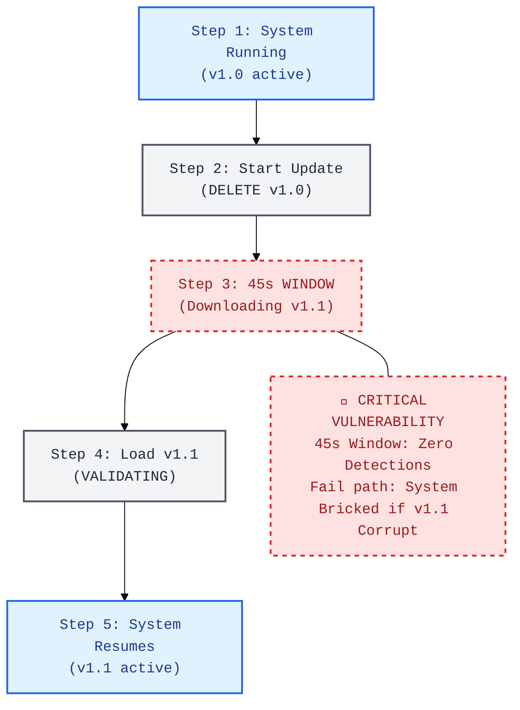

- **Interviewer:** "A security camera system performs firmware updates by deleting the old model, downloading the new one, and then loading it. This process takes 45 seconds. Based on the timeline diagram, what is the primary security flaw in this design?"

  

  
<b>🔍 Reveal Answer</b>

  **Common Mistake:** "45 seconds of downtime is acceptable for a software update." For a security camera, 45 seconds of blindness is an exploitable window. For a safety system, it's unacceptable.

  **Realistic Solution:** You have an **Inference Gap** and **No Rollback Path**. Step 3 creates a 45-second blind spot where no detections occur. Deleting the old model before validating the new one risks bricking the device if the download is corrupted. The fix is **A/B Partitioning with Hot-Swap**: download to an inactive slot while the active model continues serving, then atomically swap pointers after validation.

  > **Napkin Math:** In a 45-second blind spot, a person walking at 1.5 m/s can travel nearly 70 meters—plenty of time to cross a secure area undetected.

  📖 **Deep Dive:** [ML Operations](https://harvard-edge.github.io/cs249r_book_dev/contents/ml_ops/ml_ops.html)

  

<b> The Memory Copy Ceiling</b> · <code>compilation</code> <code>latency</code>

### The Host-Device Memory Bounce

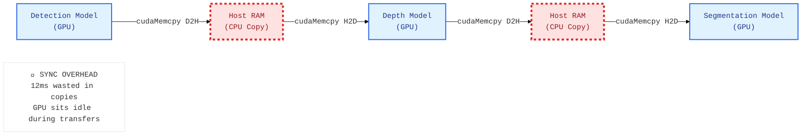

- **Interviewer:** "Your multi-model vision pipeline is missing its 33ms frame deadline (30 FPS). You check the compute time for each model and it only adds up to 41ms total. Based on the memory flow diagram, where are the 'missing' milliseconds being spent?"

  

  
<b>🔍 Reveal Answer</b>

  **Common Mistake:** "The models are too slow — use smaller models." The models themselves only take 41ms of compute. The missing time is in data movement.

  **Realistic Solution:** You are suffering from **Sync Overruns via Memory Bouncing**. The pipeline copies data from GPU to CPU and back between every model. Each round-trip takes 2-4ms, and worse, `cudaMemcpy` is synchronous, meaning the GPU sits idle during the transfer. The fix is to keep all tensors on the GPU using **Unified Memory** or explicit device-to-device transfers, and moving preprocessing to the GPU (e.g., NVIDIA DALI).

  > **Napkin Math:** 3 transfers × 4ms/transfer = 12ms of pure overhead. Total time = 41ms (compute) + 12ms (overhead) = 53ms. Eliminating the bounce saves 12ms, bringing you to 41ms (still needs pipelining to hit 33ms).

  📖 **Deep Dive:** [ML Frameworks](https://harvard-edge.github.io/cs249r_book_dev/contents/frameworks/frameworks.html)

  

<b> The Model Cloning Waste</b> · <code>serving</code> <code>memory-hierarchy</code>

### Quadruplicated Weights

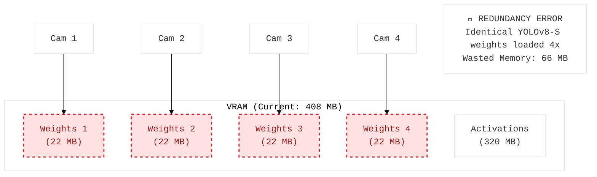

- **Interviewer:** "You are deploying a 4-camera monitoring system on a Jetson Orin. Each camera uses the same YOLOv8-S model. Based on the VRAM allocation diagram, why is your system using 16% more memory than it needs to?"

  

  
<b>🔍 Reveal Answer</b>

  **Common Mistake:** "4 cameras need 4 model instances." The cameras need 4 inference passes, but NOT 4 copies of the weights.

  **Realistic Solution:** You have **Redundant Weight Loading**. Since model weights are read-only, a single 22 MB copy can serve all 4 cameras. Load the weights once and run 4 inference passes with different input tensors. More importantly, **batch the 4 camera inputs** into a single call (batch size 4) to improve GPU occupancy and amortize kernel launch overhead.

  > **Napkin Math:** Current: 4 × 22 MB = 88 MB. Optimized: 1 × 22 MB = 22 MB. Savings = 66 MB. On an 8GB Jetson, 66MB seems small, but it represents the difference between fitting a background OS and hitting a swap-file crash.

  📖 **Deep Dive:** [Model Serving](https://harvard-edge.github.io/cs249r_book_dev/contents/model_serving/model_serving.html)

  

<b> The Bandwidth Bankruptcy</b> · <code>deployment</code> <code>economics</code>

### Streaming Raw Results Over Cellular

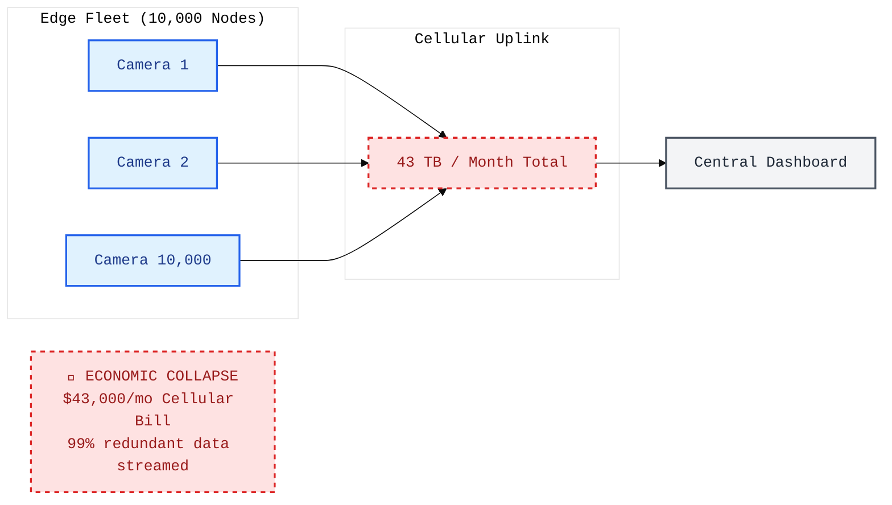

- **Interviewer:** "You have a fleet of 10,000 edge cameras streaming all detection results back to a central cloud dashboard over 4G/5G. Your first monthly bill arrives and it is $43,000. Based on the data flow diagram, what is the 'economic bottleneck' in your architecture?"

  

  
<b>🔍 Reveal Answer</b>

  **Common Mistake:** "We need all the data for proper monitoring." You need operational *visibility*, not raw data. 99% of the frames contain nothing interesting.

  **Realistic Solution:** You are suffering from **Raw Data Incontinence**. Streaming every frame result over cellular is economically non-viable. The fix is **Edge-Side Aggregation**: compute hourly statistics (counts, confidence, latency) locally and upload only the aggregates (~50 KB/day) plus small anomalous samples. This reduces the bill by >250× while maintaining the same operational insights.

  > **Napkin Math:** 10,000 cameras × 4.3 GB/month = 43 TB. At $1/GB cellular, that's $43,000. Aggregated data: 10,000 cameras × 16 MB/month = 160 GB. Total cost: ~$1,650.

  📖 **Deep Dive:** [ML Operations](https://harvard-edge.github.io/cs249r_book_dev/contents/ml_ops/ml_ops.html)

  

<b> The Sealed Oven Trap</b> · <code>model-cost</code> <code>power</code>

### Thermal Design for Lab, Not Field

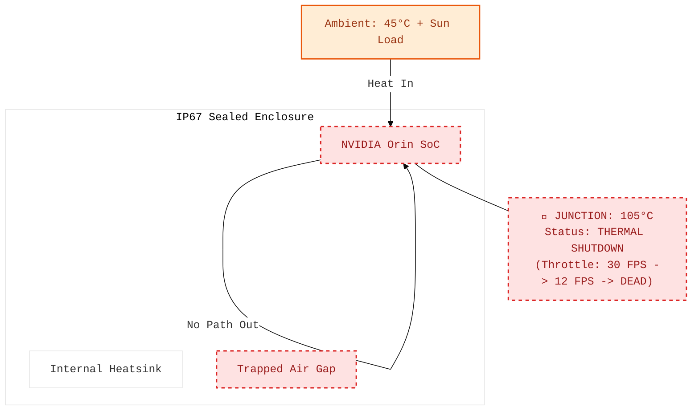

- **Interviewer:** "Your outdoor perception system works perfectly in the lab but shuts down after 10 minutes of operation in the field during a summer day. You added a fan inside the case, but it didn't help. Based on the thermal diagram, what is the physical flaw in your cooling strategy?"

  

  
<b>🔍 Reveal Answer</b>

  **Common Mistake:** "Add a bigger fan." The enclosure is sealed (IP67) — there's no airflow path, so a fan just stirs hot air.

  **Realistic Solution:** You have a **Thermal Discontinuity**. The trapped air gap between the SoC and the enclosure wall acts as an insulator. The fix is a **Direct Thermal Path**: use a copper heat pipe or a thick thermal block to connect the SoC heatsink directly to the aluminum enclosure wall. The enclosure becomes the heatsink. Combined with a white solar shield to reduce solar load, the junction temperature can be kept below the throttle threshold.

  > **Napkin Math:** At 25W with a 5°C/W air-gap resistance, $\Delta T = 125^\circ\text{C}$. With a direct path (1°C/W), $\Delta T = 25^\circ\text{C}$. That 100-degree difference is the gap between a running system and a melted one.

  📖 **Deep Dive:** [Hardware Acceleration](https://harvard-edge.github.io/cs249r_book_dev/contents/hw_acceleration/hw_acceleration.html)

  

<b> The Rolling Shutter Tear</b> · <code>sensor-pipeline</code>

### The Rolling Shutter Effect

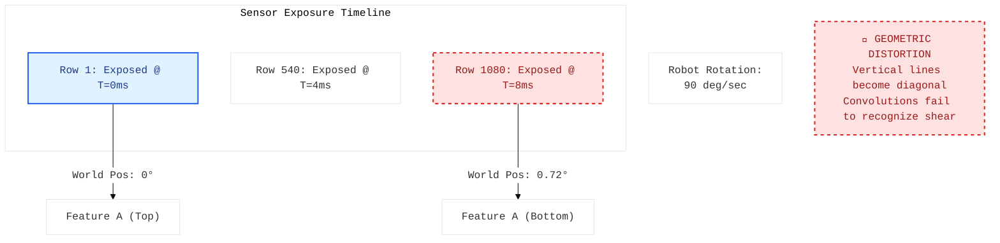

- **Interviewer:** "You deploy a high-speed robotics perception model that runs at 120 FPS. The object detection model's accuracy drops from 95% on a stationary dataset to 40% when the robot is spinning quickly, even though motion blur is minimal. Based on the exposure diagram, what physical phenomenon is destroying your accuracy?"

  

  
<b>🔍 Reveal Answer</b>

  **Common Mistake:** "Blaming the neural network's generalization ability, or assuming the frames just need standard 'motion blur' augmentation."

  **Realistic Solution:** You are suffering from the **Rolling Shutter Effect**. CMOS sensors read line-by-line. If the robot spins rapidly, the bottom of the frame captures the world at a different point in time (and space) than the top. The resulting image is physically sheared. Your convolutions, trained on orthogonal data, fail to recognize these distorted features. The fix is using a **Global Shutter** sensor or augmenting the training set with explicit geometric shear transforms.

  > **Napkin Math:** If a 1080p sensor takes 8ms to read out, and your robot spins at 90 deg/sec (0.09 deg/ms), the camera rotates 0.72 degrees during a single frame. This is enough shear to shift features by dozens of pixels.

  📖 **Deep Dive:** [Data Engineering](https://harvard-edge.github.io/cs249r_book_dev/contents/data_engineering/data_engineering.html)

  

<b> The Memory Pressure Leak</b> · <code>latency</code> <code>roofline</code>

### The Unbounded Producer-Consumer Queue

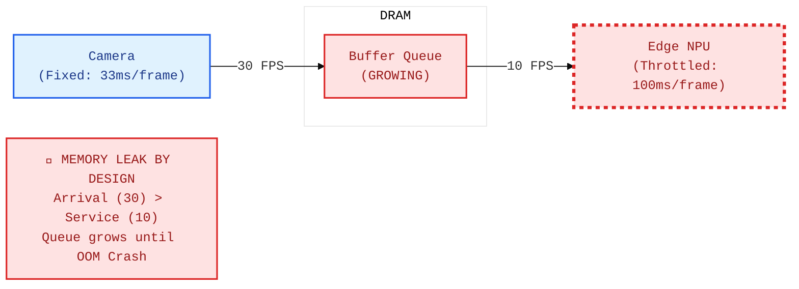

- **Interviewer:** "Your autonomous monitoring system crashes with an 'Out of Memory' error after 30 minutes of operation in a hot environment. You check your code and find no traditional memory leaks. Based on the producer-consumer diagram, why is your memory usage increasing over time?"

  

  
<b>🔍 Reveal Answer</b>

  **Common Mistake:** "The heatsink isn't big enough." A bigger heatsink delays the throttling, but the software architecture is still fundamentally flawed.

  **Realistic Solution:** The system crashes because the **Producer (Camera)** and **Consumer (NPU)** are decoupled without backpressure. As the device heats up, thermal throttling slows the NPU (from 25ms to 100ms per frame). Since the camera stays at a rigid 30 FPS, frames pile up in the queue until the device hits an OOM. The fix is **Backpressure or Frame Dropping**: actively drop new frames or step down the camera framerate when thermal throttling engages.

  > **Napkin Math:** At 30 FPS arrival and 10 FPS service, you leak 20 frames/sec. At 24 MB per 4K frame, you are 'leaking' 480 MB of RAM every second. An 8GB Jetson will OOM in under 20 seconds once throttling hits.

  📖 **Deep Dive:** [Benchmarking](https://harvard-edge.github.io/cs249r_book_dev/contents/benchmarking/benchmarking.html)

  

<b> The Memory Copy Choke</b> · <code>data-pipeline</code>

### The CPU Memory Copy Wall

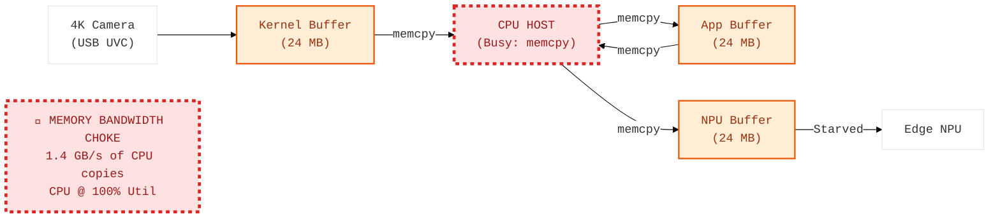

- **Interviewer:** "You are processing 4K video on an ARM-based edge device. You notice that the CPU utilization is at 100%, and the NPU is mostly idle, even though the model is highly optimized. Based on the data path diagram, what is the 'silent' task consuming all your CPU cycles?"

  

  
<b>🔍 Reveal Answer</b>

  **Common Mistake:** "The NPU must be struggling with 4K resolution." The NPU is fine; it's waiting for the CPU to hand it the data.

  **Realistic Solution:** The bottleneck is the **CPU memcpy** between memory spaces. A 4K frame is ~24 MB. Standard Linux drivers often force multiple copies between kernel-space, application-space, and NPU-space. At 30 FPS, the CPU is forced to move ~1.4 GB/s across RAM boundaries, saturating the bus. The fix is a **Zero-Copy DMA Pipeline** (e.g., using `dmabuf`), allowing the NPU to read directly from the camera buffer.

  > **Napkin Math:** 30 FPS × 24 MB/frame × 2 copies = 1.44 GB/s. For a low-power ARM CPU, this can consume 100% of available memory bandwidth and compute cycles.

  📖 **Deep Dive:** [Data Engineering](https://harvard-edge.github.io/cs249r_book_dev/contents/data_engineering/data_engineering.html)

  

<b> The Slow Sensor Stall</b> · <code>data-pipeline</code> <code>sensor-pipeline</code>

### The Synchronization Barrier Stalls the Fast Sensor

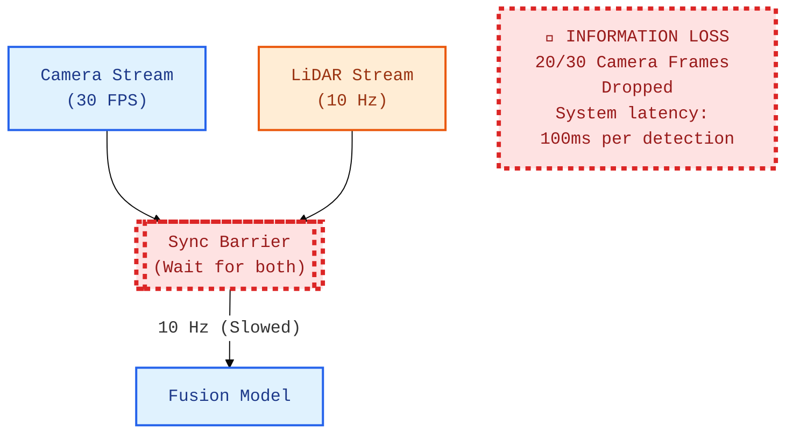

- **Interviewer:** "You have a 30 FPS camera and a 10 Hz LiDAR. After fusing the sensors, your autonomous vehicle's detection rate drops to 10 FPS, causing jerky braking. Based on the synchronization diagram, why is your high-speed camera being throttled?"

  

  
<b>🔍 Reveal Answer</b>

  **Common Mistake:** "The LiDAR is the bottleneck — buy a 30 Hz LiDAR." A faster LiDAR helps but doesn't solve the fundamental architecture issue.

  **Realistic Solution:** You have a **Synchronous Fusion Barrier**. Naively waiting for both sensors forces the entire pipeline to the rate of the slowest component, discarding 67% of visual information. The fix is **Asynchronous Fusion**: run camera detections at 30 FPS and LiDAR at 10 Hz independently, then project the 2D detections into 3D using the most recent LiDAR depth map + temporal interpolation.

  > **Napkin Math:** At 60 mph (27 m/s), a 10 Hz rate means the car travels 2.7 meters between detections. At 30 Hz, the gap drops to 0.9 meters. In an emergency, that 1.8-meter difference is life or death.

  📖 **Deep Dive:** [Data Engineering](https://harvard-edge.github.io/cs249r_book_dev/contents/data_engineering/data_engineering.html)

  

<b> The Sequential Serializer</b> · <code>compilation</code> <code>data-parallelism</code>

### Wasted GPU Parallelism

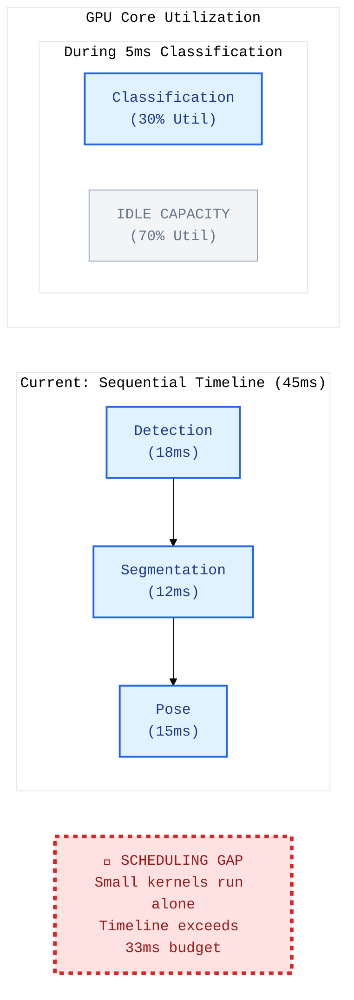

- **Interviewer:** "Your vision pipeline runs three models sequentially, taking 45ms total and missing your 30 FPS target. You notice that during the classification phase, the GPU is only at 30% utilization. Based on the utilization diagram, how would you 'collapse' this timeline to fit the 33ms budget?"

  

  
<b>🔍 Reveal Answer</b>

  **Common Mistake:** "Run all models sequentially — the GPU can only do one thing at a time." Modern GPUs support concurrent kernel execution via CUDA streams.

  **Realistic Solution:** You have **Under-utilized Kernel Concurrency**. Small models like classification don't saturate the GPU's compute units (SMs). The fix is to use **CUDA Streams** or **MPS** to overlap the execution of smaller kernels with larger ones (e.g., running classification concurrently with segmentation). By overlapping these tasks, the total timeline can be compressed from 45ms to ~33ms.

  > **Napkin Math:** If Classification (5ms) uses 30% of the GPU and Segmentation (12ms) uses 60%, running them concurrently takes only 12ms instead of 17ms, saving 5ms of idle pipeline time.

  📖 **Deep Dive:** [ML Frameworks](https://harvard-edge.github.io/cs249r_book_dev/contents/frameworks/frameworks.html)

  

<b> The Bus Priority Trap</b> · <code>model-cost</code> <code>memory-hierarchy</code>

### Shared Memory Bus Contention

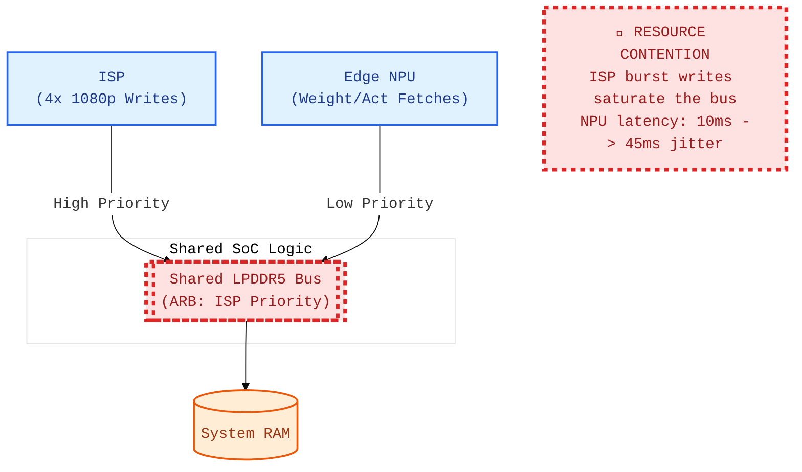

- **Interviewer:** "On your SoC, the NPU inference latency fluctuates wildly between 10ms and 45ms, even though no other ML models are running. You notice the jitter increases when more cameras are active. Based on the SoC architecture diagram, what physical component is causing the NPU to stall?"

  

  
<b>🔍 Reveal Answer</b>

  **Common Mistake:** "The NPU is context switching between 4 camera streams." While batching helps, the primary issue is resource contention underneath the accelerators.

  **Realistic Solution:** The bottleneck is the **Shared LPDDR5 Memory Bus**. In an SoC, the ISP and NPU share the same physical memory controller. ISP writes (from cameras) are typically higher priority to prevent frame drops. The NPU's memory fetches for weights and activations get queued behind the ISP's burst writes, causing massive latency jitter. The fix is **Temporal Staggering** (sequentializing camera triggers) or reducing input precision/resolution to lower the bandwidth footprint.

  > **Napkin Math:** 4x 1080p streams at 60 FPS = 497 million pixels/sec. At 16-bit YUV, that's nearly 1 GB/s of continuous, high-priority write traffic saturating the shared bus arbitration logic.

  📖 **Deep Dive:** [Hardware Acceleration](https://harvard-edge.github.io/cs249r_book_dev/contents/hw_acceleration/hw_acceleration.html)

  

