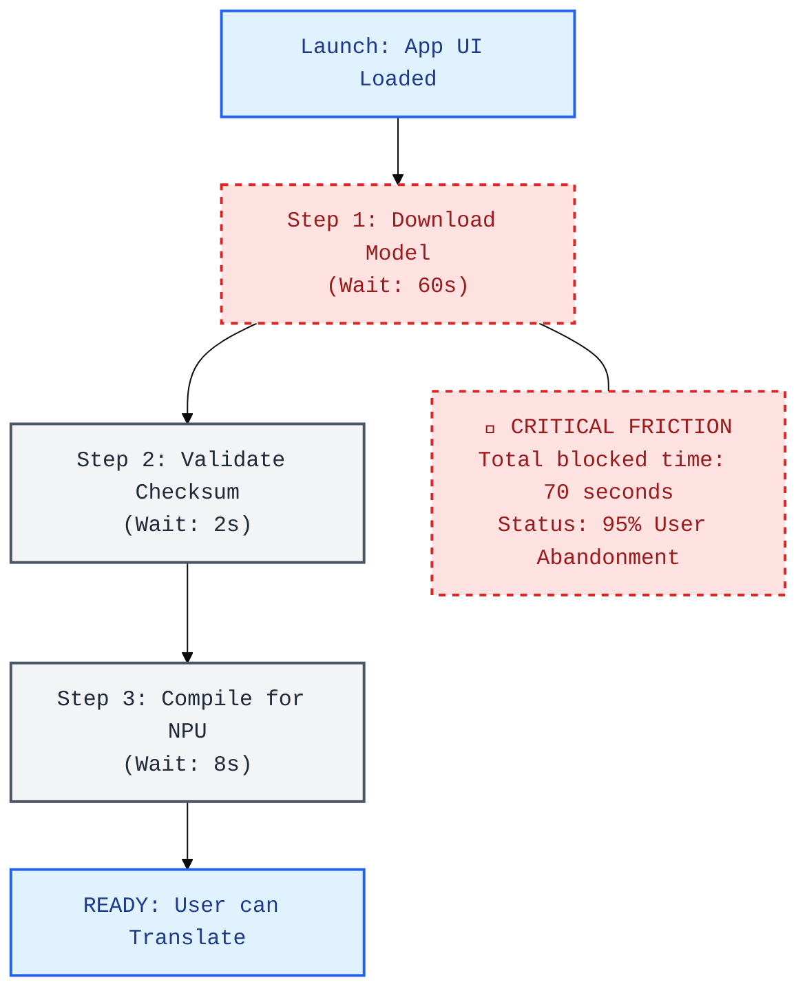
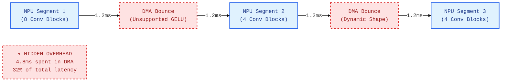
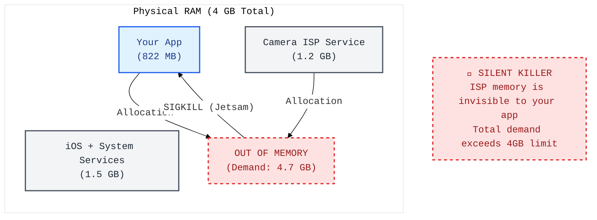
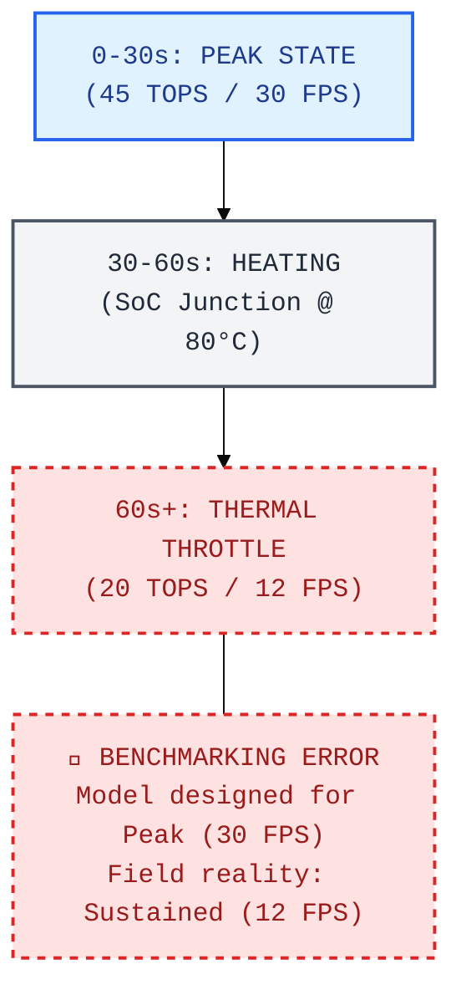
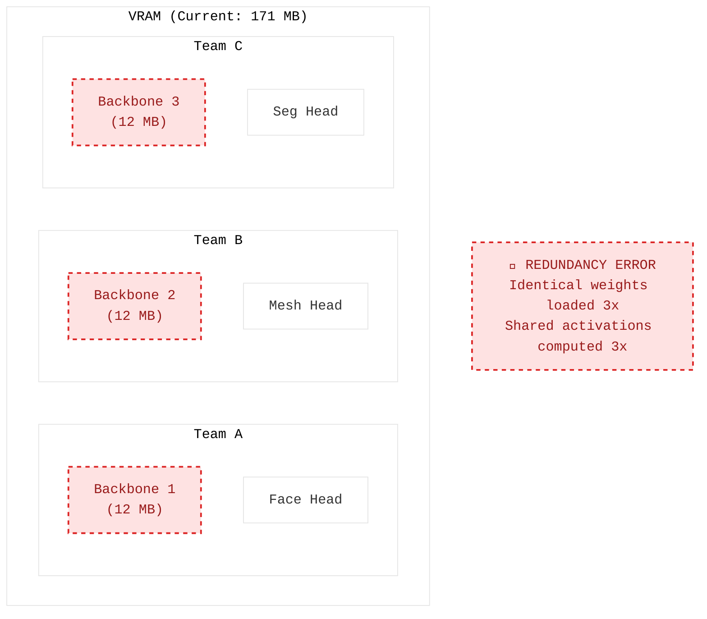
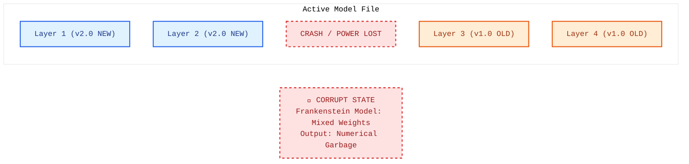
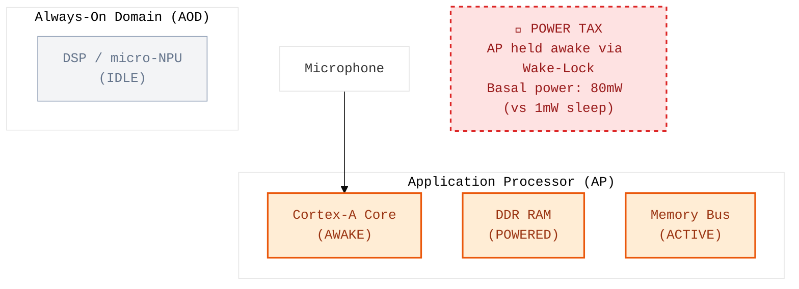
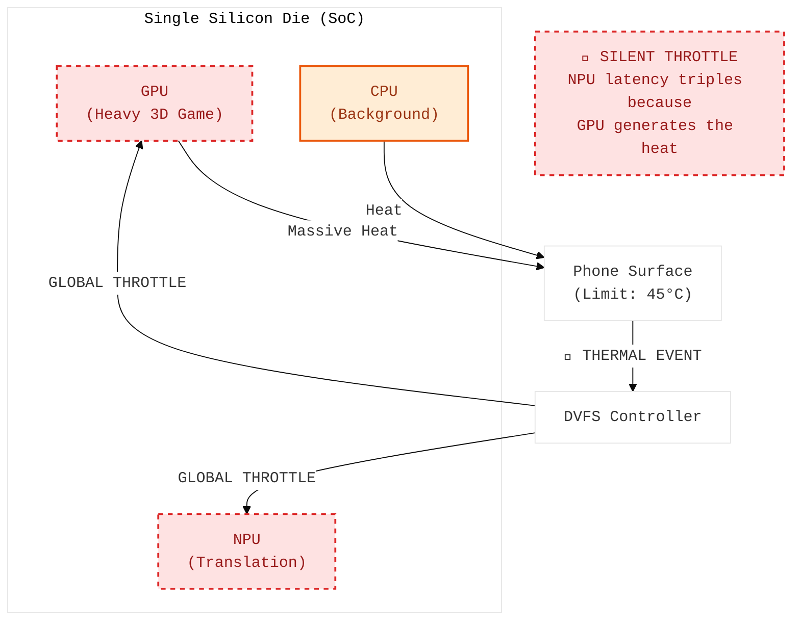
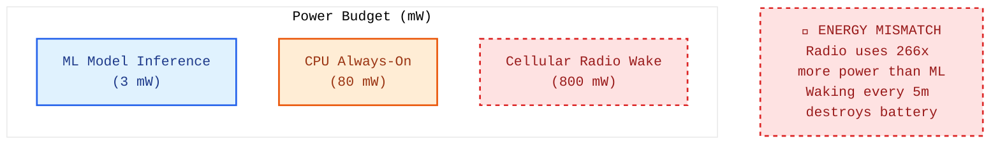
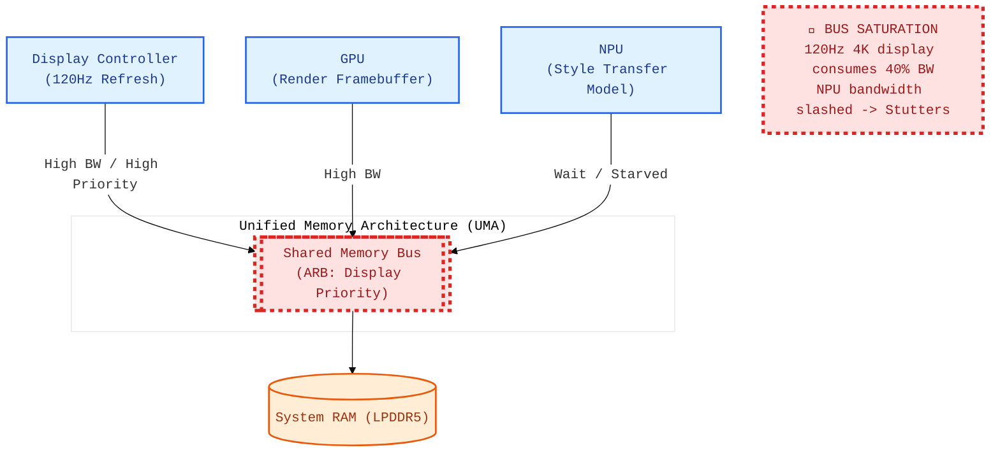

# Visual Architecture Debugging

  <a href="../README.md">🏠 Home</a> ·
  <a href="../00_The_Architects_Rubric.md">📋 Rubric</a> ·
  <a href="../cloud/README.md">☁️ Cloud</a> · <a href="../edge/README.md">🤖 Edge</a> · <b>📱 Mobile</b> · <a href="../tinyml/README.md">🔬 TinyML</a>

---

*Can you spot the bottleneck in a mobile system diagram?*

Mobile system architecture diagrams with hidden bottlenecks.

> **[➕ Add a Flashcard](https://github.com/harvard-edge/cs249r_book/edit/dev/interviews/mobile/04_visual_debugging.md)** (Edit in Browser) — see [README](../README.md#question-format) for the template.

---

<b> The Launch Blocker</b> · <code>serving</code> <code>ux</code>

### Synchronous Download Blocks the Critical Path

- **Interviewer:** "A user downloads your new LLM-powered translation app. Upon first launch, the app shows a spinner for 70 seconds while it prepares the model. Based on the launch timeline, why are you seeing a 95% abandonment rate?"

  

  
<b>🔍 Reveal Answer</b>

  **Common Mistake:** "Show a progress bar instead of a spinner." A progress bar is better UX, but 70 seconds is too long regardless of visual feedback.

  **Realistic Solution:** The architecture has a **Synchronous Dependency on the Critical Path**. The app forces users to wait for sequential download, validation, and compilation before any functionality is available. The fix is a **Progressive Launch Architecture**: ship a tiny fallback model (~3 MB) in the app bundle for instant value, while downloading and compiling the high-quality model in the background.

  > **Napkin Math:** User attention span for a new app launch is ~2-5 seconds. A 70-second block is 14-35x longer than the tolerance threshold of a typical mobile user.

  📖 **Deep Dive:** [Model Serving](https://harvard-edge.github.io/cs249r_book_dev/contents/model_serving/model_serving.html)

  

<b> The Operator Gap</b> · <code>frameworks</code> <code>latency</code>

### NPU-CPU Ping-Pong Creates Pipeline Bubbles

- **Interviewer:** "You are deploying a model to a mobile NPU. The math should only take 10ms, but the actual inference latency is 15ms. You find two unsupported operators in your graph. Based on the DMA flow, why are these two ops causing a 50% latency penalty?"

  

  
<b>🔍 Reveal Answer</b>

  **Common Mistake:** "The NPU is slow — use a bigger model." The NPU compute is fine. The overhead is in the data movement.

  **Realistic Solution:** You are hitting **Graph Partitioning Overhead**. Each unsupported operator forces the graph to 'ping-pong' data from the NPU to the CPU and back via DMA. This incurs a latency tax for the transfer and leaves the NPU idle while the CPU processes the single op. The fix is to eliminate partition boundaries by replacing unsupported ops with approximations (e.g., Sigmoid approximation for GELU) or static-shape equivalents.

  > **Napkin Math:** Each NPU-CPU-NPU round-trip costs ~2.4ms in DMA overhead. With 2 such bounces, you spend 4.8ms just moving data—roughly 32% of your 15ms total budget—without doing any significant math.

  📖 **Deep Dive:** [ML Frameworks](https://harvard-edge.github.io/cs249r_book_dev/contents/frameworks/frameworks.html)

  

<b> The Jetsam Guillotine</b> · <code>memory</code> <code>reliability</code>

### ML Model + Camera ISP Compete for the Same RAM Pool

- **Interviewer:** "Your AR app crashes with a 'SIGKILL' (Jetsam kill) when users take a high-resolution photo, even though your app is only using 822 MB of its 2 GB memory limit. Based on the RAM diagram, what is the 'invisible' resource consumer causing the OS to kill your process?"

  

  
<b>🔍 Reveal Answer</b>

  **Common Mistake:** "The model is too big — quantize it." Quantization helps, but the real issue is that the camera ISP's memory allocation is invisible to your app and uncontrollable.

  **Realistic Solution:** You are hitting a **Shared Resource RAM Collision**. The camera ISP service runs in a separate process but shares the same physical RAM pool. During photo capture, the ISP HDR pipeline can consume >1.2 GB. When combined with the OS and your app, total demand exceeds 4 GB, and the OS kills the app to protect the camera. The fix is to use **mmap** for weights (allowing OS eviction), reduce camera resolution during inference, or sequentialize the capture and ML phases.

  > **Napkin Math:** Total Memory = 1.5 GB (OS) + 1.2 GB (ISP) + 0.82 GB (App) = 3.52 GB. This is dangerously close to the 4 GB limit. Any background task (like a notification or a message) will push the system over the edge.

  📖 **Deep Dive:** [Model Serving](https://harvard-edge.github.io/cs249r_book_dev/contents/model_serving/model_serving.html)

  

<b> The Burst Benchmarking Illusion</b> · <code>benchmarking</code> <code>power-thermal</code>

### Benchmarking Peak Performance, Not Sustained Performance

- **Interviewer:** "Your mobile model runs at 30 FPS during internal demos, but users complain that it slows down to 12 FPS after a minute of use. Based on the performance timeline, what physical protection mechanism is engaging inside the smartphone?"

  

  
<b>🔍 Reveal Answer</b>

  **Common Mistake:** "The phone is defective" or "Add a cooling fan." You can't attach a fan to a user's phone. The phone is working exactly as designed — DVFS (Dynamic Voltage and Frequency Scaling) protects the SoC from thermal damage.

  **Realistic Solution:** You are hitting the **Sustained Thermal Envelope**. Mobile SoCs support high TOPS only for short "bursts." For continuous inference, the device throttles to its sustained thermal design power (sTDP), often 40-60% of peak. The fix is to target sustained performance (e.g., design for 20 TOPS, not 45 TOPS peak), implement adaptive frame rates based on `ThermalState`, or use the NPU instead of the GPU to halve heat generation.

  > **Napkin Math:** Sustained TOPS is typically ~50% of Peak. If your model requires 100% of peak TOPS to hit 30 FPS, you are guaranteed to drop to 15 FPS once the thermal envelope is saturated (~60 seconds).

  📖 **Deep Dive:** [Hardware Acceleration](https://harvard-edge.github.io/cs249r_book_dev/contents/hw_acceleration/hw_acceleration.html)

  

<b> The Backbone Bloat</b> · <code>architecture</code> <code>memory</code>

### Three Copies of the Same Backbone

- **Interviewer:** "Your mobile app has three different computer vision features (Face Detection, Face Mesh, and Segmentation). All three use the same MobileNetV3 backbone. Based on the VRAM diagram, what is the 'efficiency gap' in your model loading strategy?"

  

  
<b>🔍 Reveal Answer</b>

  **Common Mistake:** "Run the models in parallel on different cores." The phone has one NPU — parallel execution doesn't help. And you'd still waste 171 MB of memory.

  **Realistic Solution:** You have **Backbone Redundancy**. The app loads three identical copies of the backbone weights and computes the same features three times per frame. The fix is a **Multi-Task Architecture with Shared Backbone**: load the backbone once (12 MB), run it once (6ms), and branch into three lightweight task heads. This reduces memory by 64% and latency by 40%.

  > **Napkin Math:** Current: 3 backbones × 12 MB = 36 MB weights. Shared: 1 backbone × 12 MB = 12 MB. Latency: 3 × 6ms = 18ms (sequential backbone runs) vs 1 × 6ms = 6ms.

  📖 **Deep Dive:** [Network Architectures](https://harvard-edge.github.io/cs249r_book_dev/contents/network_architectures/network_architectures.html)

  

<b> The Frankenstein Model</b> · <code>ml-ops</code> <code>reliability</code>

### No Atomicity Guarantee for Model Updates

- **Interviewer:** "During a background model update on a user's phone, the device suddenly reboots. Upon next launch, the app doesn't crash, but the ML model produces nonsensical 'garbage' outputs. Based on the file-write diagram, what state is the model file in?"

  

  
<b>🔍 Reveal Answer</b>

  **Common Mistake:** "Check battery level before training." Battery checks don't prevent interruptions like OS kills or reboots.

  **Realistic Solution:** You have a **Frankenstein Model** caused by non-atomic updates. The pipeline wrote the updated model directly to the active file. If interrupted, the file contains a mix of new and old layers, which is numerically invalid. The fix is **Atomic Promotion (Shadow Copy)**: download/train the model in a temporary directory, and only after validation is complete, use an atomic `rename()` call to replace the active model file.

  > **Napkin Math:** If 60% of layers are v2.0 and 40% are v1.0, the feature map distribution from Layer 2 will not match the weights expected by Layer 3, leading to catastrophic error propagation.

  📖 **Deep Dive:** [ML Operations](https://harvard-edge.github.io/cs249r_book_dev/contents/ml_ops/ml_ops.html)

  

<b> The CPU Wake-Lock Tax</b> · <code>sustainable-ai</code> <code>power-thermal</code>

### The CPU Wake-Lock Tax

- **Interviewer:** "You deploy a simple wake-word detection model. Even though the model uses very little CPU, users report that the app is the top battery consumer on their device. Based on the power domain diagram, where is the energy going?"

  

  
<b>🔍 Reveal Answer</b>

  **Common Mistake:** "The model needs to be quantized to INT8 so it uses less power." The model's compute cost is negligible; the power is being burned by the hardware state required to execute it.

  **Realistic Solution:** You are suffering from **Application Processor Wake-Lock Tax**. To run the model on the main CPU, the OS must hold a wake-lock, powering up the high-power CPU rails and DDR RAM. This prevents the phone from entering Deep Sleep. The fix is to push always-on models down to the **Always-On Domain (AOD) / DSP**, which reads the microphone directly into tiny SRAM and only wakes the main AP if the wake-word is detected.

  > **Napkin Math:** Basal AP power is ~80 mW. DSP power is ~1 mW. By failing to delegate to the AOD, you are using 80x more power than necessary just to keep the lights on for a simple task.

  📖 **Deep Dive:** [Sustainable AI](https://harvard-edge.github.io/cs249r_book_dev/contents/sustainable_ai/sustainable_ai.html)

  

<b> The Silicon Shared Oven</b> · <code>sustainable-ai</code> <code>power-thermal</code>

### The Shared Silicon Thermal Envelope

- **Interviewer:** "Your real-time translation app works perfectly until the user starts a 3D game in picture-in-picture mode. Suddenly, your NPU translation latency triples. Based on the SoC diagram, why is the game affecting the NPU speed?"

  

  
<b>🔍 Reveal Answer</b>

  **Common Mistake:** "The game is stealing NPU cycles." The game uses the GPU, not the NPU. They are separate physical cores.

  **Realistic Solution:** You are hitting **Global Thermal Throttling**. In a mobile SoC, all cores share the same silicon die and thermal envelope. When the GPU generates massive heat from a game, the system's DVFS controller downclocks *the entire SoC*—including the NPU—to stay within safe skin-temperature limits. The fix is to use hyper-optimized, low-power models that can still meet deadlines even when the SoC is forced into its lowest frequency state.

  > **Napkin Math:** A phone can only dissipate ~3-5 Watts sustained. If a 3D game pulls 4 Watts, the NPU is left with <1 Watt of thermal margin, triggering immediate frequency capping.

  📖 **Deep Dive:** [Sustainable AI](https://harvard-edge.github.io/cs249r_book_dev/contents/sustainable_ai/sustainable_ai.html)

  

<b> The Radio Energy Wall</b> · <code>sustainable-ai</code> <code>power-thermal</code>

### The Cellular Radio Wake Dominates Power, Not the Model

- **Interviewer:** "You optimize your activity-tracking model down to 3 mW. However, the app still drains the battery by 10% per hour because it uploads labels to your server every 5 minutes. Based on the power breakdown, where is your optimization effort being wasted?"

  

  
<b>🔍 Reveal Answer</b>

  **Common Mistake:** "Retrain the model to be even smaller." The model's 3 mW is already negligible compared to the system overhead.

  **Realistic Solution:** You are hitting the **Radio Wake Overhead**. The cellular radio consumes ~800 mW every time it wakes from idle. Waking it every 5 minutes for a tiny payload prevents the radio from staying in its low-power state. The fix is **Batching and Delegation**: buffer results locally and upload once per hour, and use the OS's low-power activity co-processor (like Apple's M-series) instead of a custom always-on CPU loop.

  > **Napkin Math:** Radio: 800 mW × 10s (wake + tail) × 12 times/hr = 26.7 mWh. Model: 3 mW × 1 hr = 3 mWh. The radio wake is ~9x more expensive than the actual ML work.

  📖 **Deep Dive:** [Sustainable AI](https://harvard-edge.github.io/cs249r_book_dev/contents/sustainable_ai/sustainable_ai.html)

  

<b> The UMA Bandwidth Wall</b> · <code>hardware</code> <code>memory</code>

### UMA Bandwidth Contention

- **Interviewer:** "Your AR app runs a real-time style transfer model. When the user upgrades to a Pro phone with a 120Hz 'ProMotion' display, the NPU inference suddenly starts stuttering and missing deadlines. Based on the UMA diagram, why is a faster screen slowing down your AI?"

  

  
<b>🔍 Reveal Answer</b>

  **Common Mistake:** "The phone is thermal throttling." While heat is a factor, the immediate drop is due to memory bus physics.

  **Realistic Solution:** You are suffering from **Memory Bus Contention**. In a Unified Memory Architecture (UMA), the Display Controller, GPU, and NPU all share the same LPDDR5 bus. A 120Hz display must refresh the framebuffer twice as often as a 60Hz one, consuming a massive slice of the total bandwidth. The memory controller prioritizes the display to prevent tearing, starving the bandwidth-hungry NPU. The fix is to drop the refresh rate to 60Hz during heavy AR features or reduce NPU precision to INT8 to halve its bandwidth needs.

  > **Napkin Math:** A 4K 120Hz display requires moving ~4.5 GB/s just for frame refresh. On a phone with 50 GB/s peak bandwidth, the display system (plus GPU rendering) can easily consume 40-50% of the practical bus capacity.

  📖 **Deep Dive:** [Hardware Acceleration](https://harvard-edge.github.io/cs249r_book_dev/contents/hw_acceleration/hw_acceleration.html)

  

