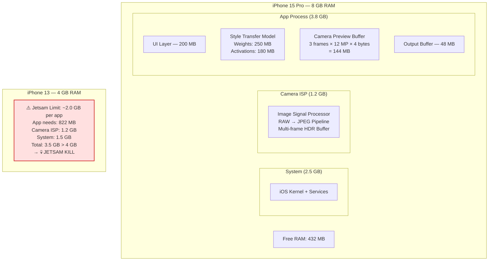
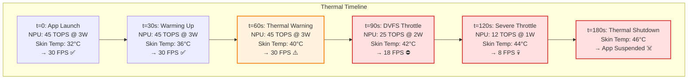
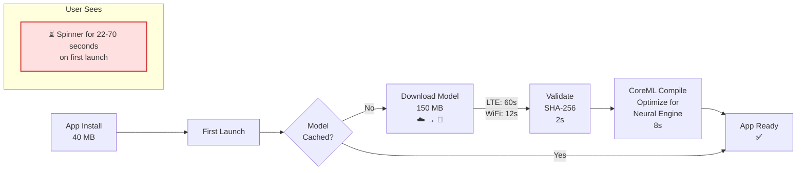
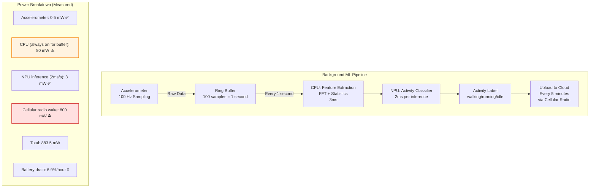
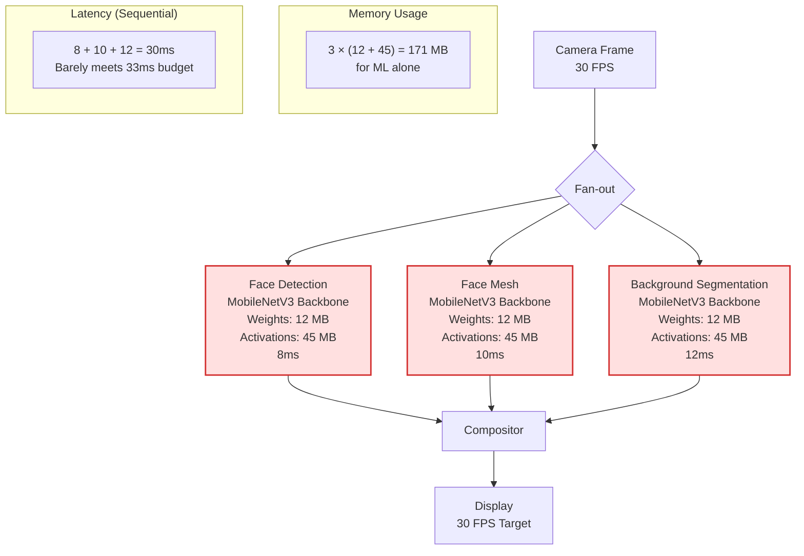
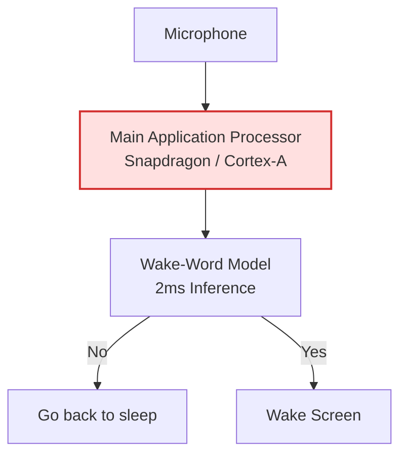
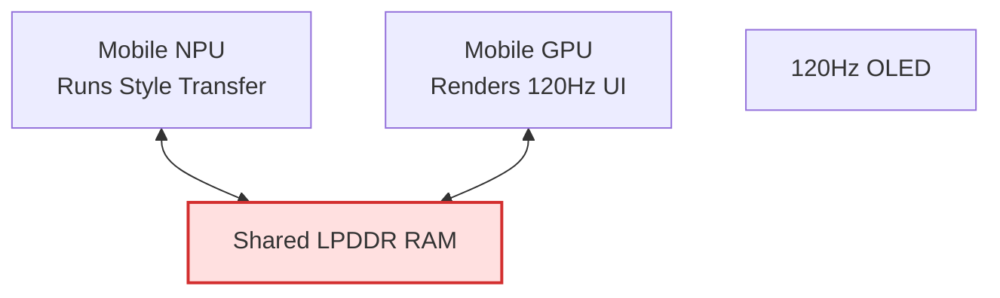

# Round 4: Visual Architecture Debugging 🖼️

<div align="center">
  <a href="../README.md">🏠 Home</a> ·
  <a href="../00_The_Architects_Rubric.md">📋 Rubric</a> ·
  <a href="01_systems_and_soc.md">📱 1. Systems & SoC</a> ·
  <a href="02_compute_and_memory.md">⚖️ 2. Compute & Memory</a> ·
  <a href="03_data_and_deployment.md">🚀 3. Data & Deployment</a> ·
  <a href="04_visual_debugging.md">🖼️ 4. Visual Debugging</a> ·
  <a href="05_advanced_systems.md">🔬 5. Advanced Systems</a>
</div>

---

The ultimate test of a mobile ML engineer is spotting the bottleneck in a proposed architecture *before* it ships to a billion phones that you can't recall. Each challenge presents a plausible mobile ML system design with a hidden flaw. Try to find it before clicking "Reveal the Bottleneck."

> **[➕ Add a Visual Challenge](https://github.com/harvard-edge/cs249r_book/edit/dev/interviews/mobile/04_visual_debugging.md)** (Edit in Browser) — see [README](../README.md#question-format) for the template.

---

## 🛑 Challenge 1: The "Optimized" NPU Pipeline · `delegation` `latency`

**The Scenario:** A team deploys a segmentation model on a Snapdragon 8 Gen 3. They partitioned the model so the NPU handles convolutions and the CPU handles unsupported ops. The pipeline looks efficient on paper.


**The Question:** The team calculated: 6 + 0.1 + 2 + 0.3 + 2 = 10.4ms. But measured latency is 15.2ms. GPU utilization shows the NPU is idle 32% of the time. Where is the missing 4.8ms?

<details>
<summary><b> 🚨 Reveal the Bottleneck</b></summary>

### NPU-CPU Ping-Pong Creates Pipeline Bubbles

**Common Mistake:** "The NPU is slow — use a bigger model." The NPU compute is fine. The 4.8ms is hiding in the DMA transfers between NPU and CPU memory.

Each NPU→CPU→NPU round-trip costs ~2.4ms (1.2ms each way) for the intermediate tensor transfer across the on-chip NoC. With two unsupported ops splitting the graph into three NPU segments, there are 4 DMA transfers: 4 × 1.2ms = 4.8ms. That's 32% of total latency spent moving data, not computing. Worse, the NPU sits completely idle during each transfer — it can't start the next segment until the CPU finishes and the data returns.

**The Fix:** Eliminate the partition boundaries. Replace GELU with the NPU-supported sigmoid approximation: GELU(x) ≈ x × σ(1.702x). Replace the dynamic shape op with a static-shape equivalent (pad to max size, mask the output). Now all 16 conv blocks run as a single NPU graph: 10ms compute, 0ms DMA overhead. Total: **10ms** — a 34% speedup from changing two ops.

**📖 Deep Dive:** [Volume I: ML Frameworks](https://harvard-edge.github.io/cs249r_book_dev/contents/frameworks/frameworks.html)
</details>

---

## 🛑 Challenge 2: The Camera App That Kills Itself · `memory` `lifecycle`

**The Scenario:** A photo editing app runs a 250 MB style transfer model alongside the camera pipeline. The team tested on an iPhone 15 Pro (8 GB RAM) and it worked perfectly.



**The Question:** Users on iPhone 13 (4 GB RAM) report the app crashes every time they try to apply a style filter while the camera is active. Crashlytics shows `EXC_RESOURCE` — the iOS jetsam daemon killed the app. The team says "we need to require iPhone 14 or newer." Is there a better solution?

<details>
<summary><b> 🚨 Reveal the Bottleneck</b></summary>

### ML Model + Camera ISP Compete for the Same RAM Pool

**Common Mistake:** "The model is too big — quantize it." Quantization helps, but the real issue is that the camera ISP's memory allocation is invisible to your app and uncontrollable.

On iPhone 13, the jetsam limit per app is ~2.0 GB. Your app uses 822 MB. That fits. But the camera ISP (which runs in a separate process but shares the same physical RAM) consumes 1.2 GB for its multi-frame HDR pipeline. iOS + system services take 1.5 GB. Total: 1.5 + 1.2 + 2.0 = 4.7 GB > 4 GB. iOS kills your app to protect the camera.

**The Fix:** (1) **Use `mmap` for model weights** — memory-mapped weights can be evicted by the OS without killing your process. When the camera ISP needs RAM, iOS evicts your weight pages. When inference needs them, they're faulted back in from flash. Your process survives. (2) **Reduce camera resolution during ML inference** — drop from 12 MP to 3 MP preview while the style transfer runs. ISP memory drops from 1.2 GB to ~400 MB. (3) **Sequential, not concurrent** — capture the photo first (camera ISP active, model not loaded), then dismiss the camera session (ISP memory freed), then load and run the model. Total peak: max(ISP, model), not ISP + model. (4) **Quantize to INT8** — 250 MB → 62.5 MB weights. Activations drop proportionally. Total app memory: ~300 MB.

**📖 Deep Dive:** [Volume I: Model Serving](https://harvard-edge.github.io/cs249r_book_dev/contents/model_serving/model_serving.html)
</details>

---

## 🛑 Challenge 3: The Thermal Throttling Cascade · `thermal` `latency`

**The Scenario:** A video analytics app runs a pose estimation model at 30 FPS on a Snapdragon 8 Gen 3. It works great for the first 2 minutes. Then performance degrades catastrophically.



**The Question:** The app delivers 30 FPS for 60 seconds, then drops to 8 FPS by 2 minutes, and the OS suspends it at 3 minutes. The team benchmarked the model at 30 FPS and shipped it. What went wrong with their benchmarking methodology, and how do you design for sustained performance?

<details>
<summary><b> 🚨 Reveal the Bottleneck</b></summary>

### Benchmarking Peak Performance, Not Sustained Performance

**Common Mistake:** "The phone is defective" or "Add a cooling fan." You can't attach a fan to a user's phone. The phone is working exactly as designed — DVFS (Dynamic Voltage and Frequency Scaling) protects the SoC from thermal damage.

The team benchmarked for 10 seconds at peak performance. Mobile SoCs are designed for burst workloads (camera shutter, app launch) — they can sustain peak TOPS for 30-60 seconds before the thermal envelope fills. Sustained workloads (continuous video inference) must target the **sustained thermal design power (sTDP)**, which is typically 40-60% of peak.

**The Fix:** (1) **Target sustained performance from day one** — benchmark for 10 minutes, not 10 seconds. Use the 5-minute mark as your design point. On Snapdragon 8 Gen 3, sustained NPU throughput is ~20 TOPS (not 45 TOPS peak). Design your model for 20 FPS at 20 TOPS. (2) **Adaptive frame rate** — monitor the thermal state via `ThermalService` (Android) or `ProcessInfo.thermalState` (iOS). At `.nominal`: run at 30 FPS. At `.fair`: drop to 20 FPS. At `.serious`: drop to 10 FPS and reduce model resolution. At `.critical`: pause inference entirely. (3) **Duty cycling** — instead of running every frame, run every 2nd frame (15 FPS effective) and interpolate the missing frames. NPU duty cycle drops to 50%, halving heat generation. Sustained performance: 15 FPS indefinitely. (4) **Use the NPU, not the GPU** — the NPU at 20 TOPS draws ~1.5W sustained. The GPU at equivalent throughput draws ~3W. Same FPS, half the heat.

**📖 Deep Dive:** [Volume I: HW Acceleration](https://harvard-edge.github.io/cs249r_book_dev/contents/hw_acceleration/hw_acceleration.html)
</details>

---

## 🛑 Challenge 4: The Blocking Model Download · `deployment` `ux`

**The Scenario:** An app requires a 150 MB ML model for its core feature (real-time translation). The team downloads the model on first launch before showing the main UI.



**The Question:** Analytics show 45% of users kill the app during the first-launch spinner and never return. The team says "the model download is unavoidable." How do you eliminate the blocking wait without removing the model requirement?

<details>
<summary><b> 🚨 Reveal the Bottleneck</b></summary>

### Synchronous Download Blocks the Critical Path

**Common Mistake:** "Show a progress bar instead of a spinner." A progress bar is better UX, but users still abandon — 70 seconds is too long regardless of visual feedback.

The architecture forces users to wait for three sequential operations (download + validate + compile) before they can use the app. Each step blocks the next, and the user sees nothing useful during the entire sequence.

**The Fix:** Decouple model availability from app usability with a **progressive launch architecture**: (1) **Instant value** — ship a tiny fallback model (~3 MB, INT4 quantized) in the app bundle. It's less accurate but provides immediate functionality. Users can translate text within 2 seconds of first launch. (2) **Background pipeline** — download, validate, and compile the full model entirely in the background using `BGProcessingTask` (iOS) or `WorkManager` (Android). The user is using the app the entire time. (3) **Pre-compilation** — use Apple's Core ML Model Deployment to push pre-compiled `.mlmodelc` bundles (compiled for each chip family). This eliminates the 8-second on-device compilation step. (4) **Seamless upgrade** — when the full model is ready, hot-swap it on the next inference call. The user notices improved quality but experiences no interruption. (5) **Pre-download** — if your app is advertised, use App Store pre-order or Background Assets (iOS 16+) to download the model before the user even opens the app.

**📖 Deep Dive:** [Volume I: Model Serving](https://harvard-edge.github.io/cs249r_book_dev/contents/model_serving/model_serving.html)
</details>

---

## 🛑 Challenge 5: The Battery Vampire · `power` `background`

**The Scenario:** A health app runs continuous activity recognition in the background using the accelerometer + a small ML model. The team optimized the model to run in 2ms per inference.



**The Question:** The team optimized the ML model to 2ms (3 mW average power). But the app drains 6.9% battery per hour in the background — users will uninstall within a day. The model isn't the problem. What is?

<details>
<summary><b> 🚨 Reveal the Bottleneck</b></summary>

### The Cellular Radio Wake Dominates Power, Not the Model

**Common Mistake:** "Optimize the model further" or "Reduce inference frequency." The model uses 3 mW — it's already negligible. The two real power hogs are the cellular radio (800 mW) and the always-on CPU (80 mW).

The cellular radio consumes 800 mW every time it wakes from idle to transmit data. Waking it every 5 minutes means ~12 wake cycles per hour, each lasting ~10 seconds (including tail energy for the radio to return to idle). That's 120 seconds of 800 mW = 26.7 mWh per hour. The CPU staying awake at 80 mW for continuous buffering adds another 80 mWh per hour.

**The Fix:** (1) **Batch uploads** — instead of uploading every 5 minutes, buffer activity labels locally and upload once per hour (or piggyback on other app network activity). Radio wakes drop from 12/hour to 1/hour. Power: 800 mW × 10s × 1 = 2.2 mWh (down from 26.7 mWh). (2) **Use CoreMotion/Activity Recognition API** — iOS and Android have built-in activity classifiers that run on a dedicated low-power coprocessor (Apple M-series motion coprocessor, ~1 mW). Use the OS API instead of your own model + accelerometer pipeline. CPU power drops from 80 mW to ~0 mW. (3) **If custom ML is required** — use the accelerometer's hardware FIFO buffer (most modern IMUs buffer 1000+ samples internally). The CPU sleeps while the FIFO fills, wakes only to process a batch. CPU duty cycle drops from 100% to ~5%. Power: 80 mW × 0.05 = 4 mW. (4) **Total after fixes:** 0.5 mW (accel) + 4 mW (CPU, batched) + 3 mW (NPU) + 2.2 mWh/hr (radio, hourly) = ~10 mW sustained. Battery drain: **0.08%/hour** — 86× improvement.

**📖 Deep Dive:** [Volume II: Sustainable AI](https://harvard-edge.github.io/cs249r_book_dev/contents/sustainable_ai/sustainable_ai.html)
</details>

---

## 🛑 Challenge 6: The Redundant Backbone Loading · `memory` `architecture`

**The Scenario:** A social media app runs three ML models for its camera feature: face detection, face mesh (for AR filters), and background segmentation. Each model was developed by a separate team.



**The Question:** The three models use 171 MB of RAM and take 30ms sequentially — barely meeting the 33ms frame budget with no headroom. Adding any new feature will break the pipeline. All three models use the same MobileNetV3 backbone. What's the obvious optimization that the siloed team structure prevented?

<details>
<summary><b> 🚨 Reveal the Bottleneck</b></summary>

### Three Copies of the Same Backbone

**Common Mistake:** "Run the models in parallel on different cores." The phone has one NPU — parallel execution doesn't help. And you'd still waste 171 MB of memory.

All three models share an identical MobileNetV3 backbone (12 MB weights, 45 MB activations). Because each team trained independently, the app loads three copies of the same backbone weights and computes the same backbone features three times per frame.

**The Fix:** **Multi-task architecture with shared backbone.** Load the MobileNetV3 backbone once (12 MB weights). Run it once per frame (6ms). Branch into three lightweight task heads: face detection head (1 MB, 2ms), face mesh head (1.5 MB, 4ms), segmentation head (2 MB, 6ms). The heads run sequentially after the shared backbone.

New memory: 12 MB (backbone) + 45 MB (shared activations) + 4.5 MB (3 heads) = **61.5 MB** (64% reduction). New latency: 6ms (backbone) + 2 + 4 + 6ms (heads) = **18ms** (40% reduction). Headroom for two more features before hitting the 33ms budget.

The organizational fix matters as much as the technical one: create a shared "ML backbone" team that owns the backbone, and feature teams only own their task heads.

**📖 Deep Dive:** [Volume I: Network Architectures](https://harvard-edge.github.io/cs249r_book_dev/contents/network_architectures/network_architectures.html)
</details>

---

## 🛑 Challenge 7: The Corrupted On-Device Training · `training` `reliability`

**The Scenario:** An app personalizes a recommendation model by fine-tuning on-device using the user's interaction history. Training runs nightly during charging.

```mermaid
flowchart TD
    subgraph "Nightly Training Pipeline"
        Trigger["Trigger: Phone Charging
+ WiFi Connected
+ 2 AM Local Time"]

        Trigger --> Load[Load Base Model
25 MB]

        Load --> Train["Fine-tune on User Data
50 gradient steps
~3 minutes"]

        Train --> Save[Save Updated Model
to App Storage]

        Save --> Done["✅ Model Ready
for Tomorrow"]
    end

    subgraph "Failure Scenario"
        F1["Step 1: Training starts at 2 AM
Battery: 15%"] --> F2["Step 2: 30/50 steps complete
Battery: 12%"]

        F2 --> F3["Step 3: User unplugs phone
iOS suspends background task"]

        F3 --> F4["Step 4: Partial model saved
30/50 steps — weights are
in an inconsistent state"]

        F4 --> F5["Step 5: Morning — app loads
corrupted model
Predictions are garbage 💀"]
    end

    classDef error fill:#ffe0e0,stroke:#d32f2f,stroke-width:2px;
    class F3,F4,F5 error;
```



**The Question:** Users report that the app's recommendations "went crazy overnight." Investigation reveals the on-device training was interrupted mid-update, leaving the model in a half-trained state. The team says "we check for charging state before training." Why isn't that sufficient, and how do you make on-device training crash-safe?

<details>
<summary><b> 🚨 Reveal the Bottleneck</b></summary>

### No Atomicity Guarantee for Model Updates

**Common Mistake:** "Check battery level before training — only train above 50%." Battery checks don't prevent interruption — the user can unplug at any time, iOS can kill background tasks for memory pressure, or the phone can reboot for a system update.

The training pipeline writes the updated model directly to the active model file. If interrupted at step 30 of 50, the file contains a model where the first 60% of layers have new weights and the last 40% have old weights. This Frankenstein model produces unpredictable outputs.

**The Fix:** Apply database-style atomicity to model updates: (1) **Write-ahead logging** — save each gradient step's weight delta to a separate journal file. If training completes, apply all deltas atomically. If interrupted, discard the journal on next launch — the original model is untouched. (2) **Shadow copy** — train on a copy of the model in a temporary directory. Only after all 50 steps complete AND validation passes (run inference on 10 known test inputs, verify outputs match expected ranges), atomically rename the temp file to replace the active model. `rename()` is atomic on both iOS and Android filesystems. (3) **Checkpoint + resume** — save a checkpoint every 10 steps. If interrupted, resume from the last checkpoint on the next training session. After all 50 steps, validate and promote. (4) **Rollback** — keep the previous model version for 7 days. If the new model's confidence distribution diverges >20% from baseline (measured over 100 inferences the next morning), automatically rollback.

**📖 Deep Dive:** [Volume I: ML Operations](https://harvard-edge.github.io/cs249r_book_dev/contents/ml_ops/ml_ops.html)
</details>


### ⏱️ Latency & Throughput

<details>
<summary><b> The Asynchronous Pipeline Stall</b> · <code>cpu-npu-handoff</code></summary>

- **Interviewer:** "You have a live video segmentation app. You meticulously put the camera fetch on Thread 1, the NPU inference on Thread 2, and the UI rendering on Thread 3, connected by queues. You expect a smooth 30 FPS. Instead, the UI stutters wildly, alternating between 60 FPS and 15 FPS. What pipeline synchronization error did you make?"

  <details>
  <summary><b>🔍 Reveal Answer</b></summary>

  **Common Mistake:** "Assuming that slapping threads and queues between components automatically creates a balanced, real-time pipeline."

  **Realistic Solution:** You created a queue-bloat (bufferbloat) problem leading to backpressure. If the camera produces frames exactly every 33ms, but the NPU takes 40ms to process a complex frame, the queue between them starts filling up. Because Thread 1 (Camera) never drops frames, it keeps pushing. Thread 3 (UI) renders whatever is available. The UI gets smooth bursts when the NPU catches up on simple frames, and severe lag when the NPU struggles. The latency between physical reality and the screen grows infinitely until the app crashes from OOM.

  > **Napkin Math:** Camera = 30 FPS (33ms). NPU = 25 FPS (40ms). Every second, the camera produces 30 frames, but the NPU only consumes 25. The queue grows by 5 frames per second. After 10 seconds of runtime, the queue has 50 frames in it. `50 frames * 33ms = 1.65 seconds`. The user is now seeing what happened 1.65 seconds ago in the real world, rendering the app completely unusable. You must implement a ring buffer that aggressively drops the oldest unread frame.

  📖 **Deep Dive:** [Volume I: Model Serving](https://harvard-edge.github.io/cs249r_book_dev/contents/model_serving/model_serving.html)

  </details>

</details>


---

## 🛑 Challenge 8: The Application Processor Wake-Lock · `power` `audio`

**The Scenario:** You deploy an always-on wake-word model ("Hey Assistant") on a flagship Android smartphone. The model is highly optimized, running in just 2ms. Yet, QA reports that the phone's battery dies completely in 8 hours when the screen is off.



**The Question:** The model itself uses virtually no compute energy (2ms). Why is the battery draining so fast, and where should this model physically run?

<details>
<summary><b> 🚨 Reveal the Bottleneck</b></summary>

### The CPU Wake-Lock Tax

**Common Mistake:** "The model needs to be quantized to INT8 so it uses less power." The model's compute cost is practically zero; the power is being burned by *what is executing the model*.

The battery is dying because you are keeping the **Main Application Processor (AP)** awake. Modern smartphones have aggressive power states. To run the model on the main CPU (the Cortex-A cores), the OS must acquire a "wake-lock," powering up the DDR RAM, the memory controllers, and the high-power CPU rails.

Even if the math takes 2ms, waking the AP up to listen to audio every few milliseconds prevents the phone from ever entering Deep Sleep. The system burns watts of power just keeping the lights on.

**The Fix:** Always-on models must be pushed down to the **Always-On Domain (AOD) / DSP**. Mobile SoCs feature an ultra-low-power DSP (like Qualcomm's Hexagon) or a dedicated micro-NPU that sits in an isolated power island. It reads the microphone directly into its own tiny SRAM, runs the wake-word model, and only issues a hardware interrupt to wake the main AP *if* the wake-word is detected.

**📖 Deep Dive:** [Volume II: Sustainable AI](https://harvard-edge.github.io/cs249r_book_dev/contents/sustainable_ai/sustainable_ai.html)
</details>

---

## 🛑 Challenge 9: The Display Refresh Starvation · `memory-hierarchy`

**The Scenario:** Your team builds an Augmented Reality (AR) app. It runs a style-transfer neural network on the camera feed. In testing, the NPU runs the model at a solid 60 FPS. But when the app's UI is updated to support 120Hz display refresh rates, the NPU's inference speed inexplicably drops to 35 FPS.



**The Question:** The GPU and NPU are completely separate silicon blocks. Why does doubling the display framerate slash the NPU's performance?

<details>
<summary><b> 🚨 Reveal the Bottleneck</b></summary>

### UMA Bandwidth Contention

**Common Mistake:** "The phone is overheating and thermal throttling." While thermals are a factor, the immediate drop occurs because of physics on the memory bus.

Mobile SoCs use **Unified Memory Architecture (UMA)**. The CPU, GPU, NPU, and Display Controller all share the exact same physical LPDDR memory chips and memory bus.

When you upgrade the display from 60Hz to 120Hz, the GPU and Display Controller must read and write framebuffers twice as fast. A 120Hz 4K display consumes a massive percentage of the phone's total memory bandwidth just shuffling pixels to the screen.

Because the NPU's style-transfer model is typically memory-bandwidth bound (reading large image tensors in and out of RAM), the NPU suddenly finds itself starved. The memory controller prioritizes the display (otherwise the screen tears or stutters), forcing the NPU to stall.

**The Fix:**
1. **Reduce Precision/Resolution:** Run the NPU model on lower-resolution crops or INT8 to halve its bandwidth needs.
2. **Variable Refresh Rate (VRR):** Drop the display refresh rate back to 60Hz when heavy AR features are active, as users cannot perceive 120Hz fluidity underneath heavy style-transfer effects anyway.

**📖 Deep Dive:** [Volume I: HW Acceleration](https://harvard-edge.github.io/cs249r_book_dev/contents/hw_acceleration/hw_acceleration.html)
</details>

---

## 🛑 Challenge 10: The Thermal Coupling Cliff · `power-thermal`

**The Scenario:** You deploy a real-time translation model for a mobile video game chat. The model runs on the NPU and works perfectly in the menus. But after 15 minutes of actual gameplay, the translation latency triples, making the feature unusable.

```mermaid
flowchart LR
    subgraph "Mobile SoC Die"
        CPU[CPU]
        GPU[GPU<br>High Load (Gaming)]
        NPU[NPU<br>Translation Model]
    end

    CPU --- Heat[Shared Thermal Envelope]
    GPU --- Heat
    NPU --- Heat

    classDef error fill:#ffe0e0,stroke:#d32f2f,stroke-width:2px;
    class Heat error;
```

**The Question:** The NPU is lightly loaded, and the game only stresses the GPU. Why does the NPU's performance collapse after 15 minutes of gameplay?

<details>
<summary><b> 🚨 Reveal the Bottleneck</b></summary>

### The Shared Silicon Thermal Envelope

**Common Mistake:** "The game is stealing NPU cycles." The game is using the GPU, not the NPU. They are separate cores.

The bottleneck is the **Shared Thermal Envelope**. In a mobile System-on-Chip (SoC), the CPU, GPU, and NPU all reside on the exact same piece of silicon (die).

A mobile phone has no active cooling (no fans). It can typically dissipate about 3-5 Watts of sustained heat. When the user plays a heavy 3D game, the GPU generates massive amounts of heat, soaking the entire silicon die.

To prevent the phone from literally burning the user's hand (skin temperature limits), the SoC's thermal management system engages. Because it cannot easily determine which component is "most important," it aggressively downclocks (DVFS) *the entire SoC*—including the NPU—to shed heat. The NPU's clock speed is slashed, tripling your translation latency, even though the NPU wasn't the component causing the heat.

**The Fix:**
For heavy gaming scenarios, translation models must be hyper-optimized (e.g., heavily quantized) so they can meet their deadlines even when the NPU is forced into its lowest power state.

**📖 Deep Dive:** [Volume II: Sustainable AI](https://harvard-edge.github.io/cs249r_book_dev/contents/sustainable_ai/sustainable_ai.html)
</details>
