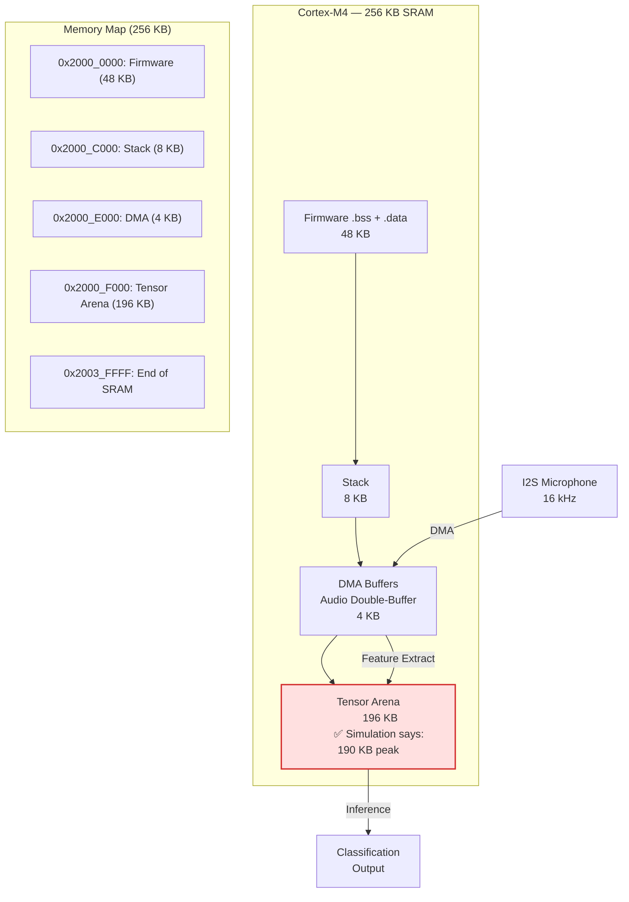
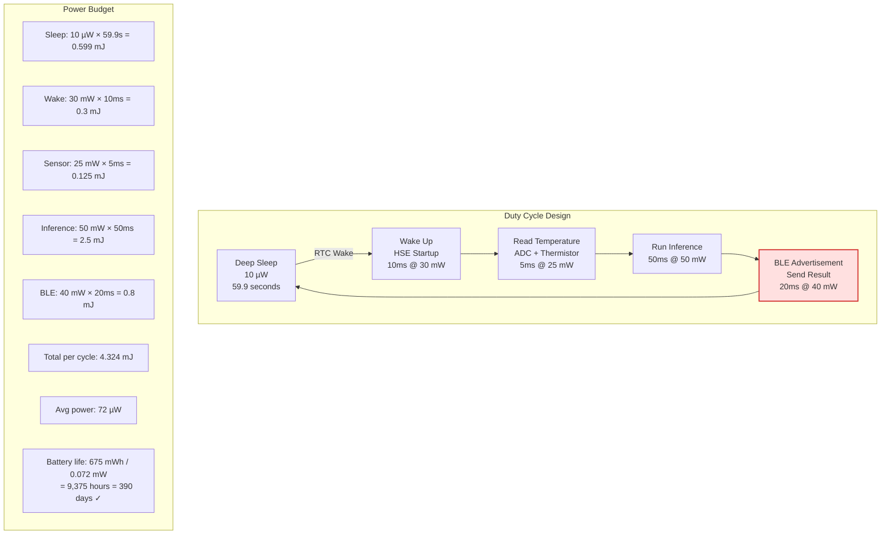
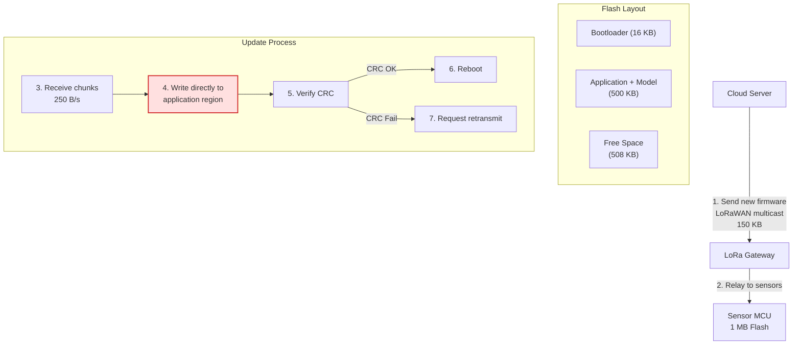
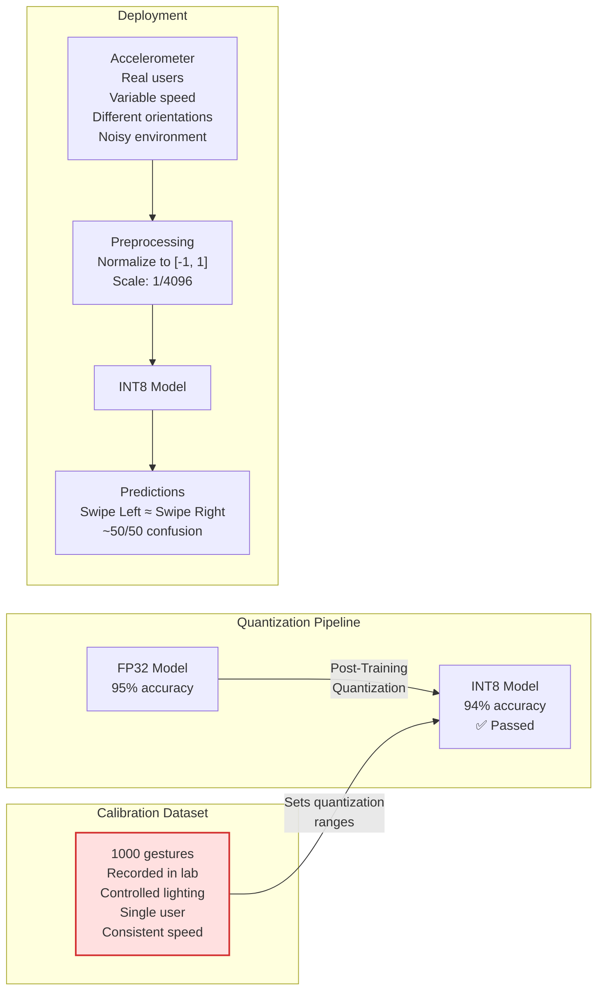
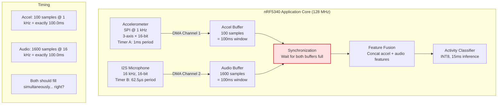
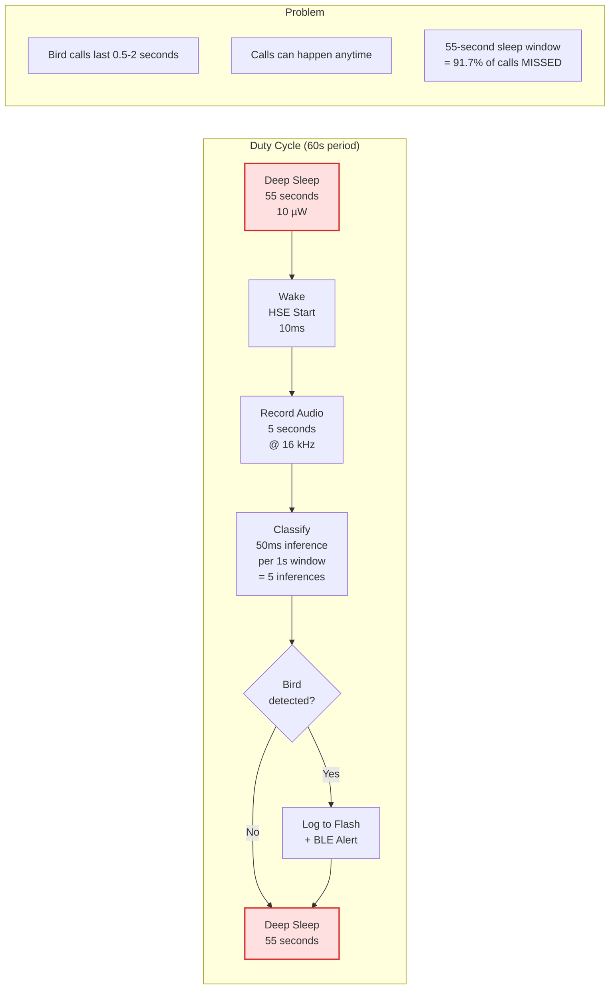

# Round 4: Visual Architecture Debugging 🖼️

<div align="center">
  <a href="../README.md">🏠 Home</a> ·
  <a href="../00_The_Architects_Rubric.md">📋 Rubric</a> ·
  <a href="01_TinyML_Systems.md">🔬 Round 1</a> ·
  <a href="02_TinyML_Constraints.md">⚖️ Round 2</a> ·
  <a href="03_TinyML_Ops_and_Deployment.md">🚀 Round 3</a> ·
  <a href="04_TinyML_Visual_Debugging.md">🖼️ Round 4</a> ·
  <a href="05_TinyML_Advanced.md">🔬 Round 5</a>
</div>

---

The ultimate test of a TinyML systems engineer is spotting the flaw in a proposed architecture *before* it ships to 10,000 devices soldered onto PCBs that can't be recalled. Each challenge presents a plausible microcontroller system design with a hidden flaw. Try to find it before clicking "Reveal the Bottleneck."

> **[➕ Add a Visual Challenge](https://github.com/harvard-edge/cs249r_book/edit/dev/interviews/tinyml/04_TinyML_Visual_Debugging.md)** (Edit in Browser) — see [README](../README.md#question-format) for the template.

---

## 🛑 Challenge 1: The Overflowing Tensor Arena · `memory`

**The Scenario:** A team designs a keyword spotting pipeline on a Cortex-M4 (256 KB SRAM, 1 MB flash). The model was validated in simulation and the tensor arena was sized to the reported peak activation memory.



**The Question:** The simulation reports 190 KB peak activation memory. The arena is sized to 196 KB — 6 KB of headroom. The device boots fine but crashes randomly during inference after 10-30 minutes of operation. Memory corruption is suspected. What's wrong?

<details>
<summary><b>🚨 Reveal the Bottleneck</b></summary>

### Stack Overflow into the Tensor Arena

**Common Mistake:** "The tensor arena is too small — increase it." The arena has 6 KB of headroom beyond the simulation's reported peak. The problem is not the arena size.

The stack grows downward on ARM Cortex-M. The 8 KB stack sits directly above the tensor arena in the memory map. During inference, nested function calls (convolution kernels calling CMSIS-NN helpers calling SIMD intrinsics) plus interrupt handlers (DMA half-transfer, DMA complete, SysTick) can push the stack well beyond 8 KB. A deep interrupt nesting scenario: SysTick fires during a DMA interrupt during a convolution kernel — 3 levels of context saving at ~100 bytes each, plus local variables. The stack overflows downward into the top of the tensor arena, silently corrupting activation data. The model produces garbage outputs or hard-faults — but only when the interrupt timing aligns with deep call stacks, hence the randomness.

**The Fix:** (1) Place a stack canary (known pattern, e.g., 0xDEADBEEF) at the bottom of the stack region. Check it periodically — if corrupted, the stack overflowed. (2) Use the MPU (Memory Protection Unit) to mark the boundary between stack and arena as no-access — a stack overflow triggers a MemManage fault instead of silent corruption. (3) Increase the stack to 16 KB and reduce the arena to 188 KB (still fits the 190 KB peak? No — now you need to optimize the model too). (4) Move the stack to the top of SRAM and the arena to the bottom, so stack overflow hits the end of SRAM and faults immediately instead of corrupting data.

**📖 Deep Dive:** [Volume I: TinyML](https://mlsysbook.ai/vol1/tinyml.html)
</details>

---

## 🛑 Challenge 2: The Missed Real-Time Deadline · `latency` `sensor-pipeline`

**The Scenario:** A team builds an interrupt-driven vibration monitoring system on a Cortex-M4 (168 MHz). The ADC samples at 10 kHz, and inference must complete within 25.6ms (one buffer window) to avoid dropping samples.

```mermaid
flowchart LR
    ADC["ADC
    10 kHz
    12-bit"] -->|"DMA"| BufA["Buffer A
    256 samples"]

    ADC -->|"DMA"| BufB["Buffer B
    256 samples"]

    BufA -->|"DMA Complete IRQ
    Priority 0 (Highest)"| Inference["Inference ISR
    Feature Extract: 5ms
    Model: 18ms
    Total: 23ms"]

    BufB -->|"DMA Complete IRQ"| Inference

    UART["UART TX
    Debug Logging
    Priority 0 (Highest)"] -->|"Every 100ms
    ~2ms per log"| Log["Serial Output"]

    BLE["BLE Stack
    Connection Event
    Priority 1"| -->|"Every 50ms
    ~8ms per event"| Radio["nRF Radio"]

    Inference -->|"Result"| Output["Anomaly
    Alert"]

    classDef error fill:#ffe0e0,stroke:#d32f2f,stroke-width:2px;
    class UART error;
```

**The Question:** The inference pipeline (23ms) fits within the 25.6ms buffer window with 2.6ms of margin. But the system drops samples every few seconds, and occasionally the watchdog fires. The team says "the model is too slow — we need to optimize it." Is the model the problem?

<details>
<summary><b>🚨 Reveal the Bottleneck</b></summary>

### Interrupt Priority Inversion

**Common Mistake:** "23ms is too close to the 25.6ms deadline — reduce the model size." The model has 2.6ms of margin, which should be sufficient on a deterministic bare-metal system. The problem is that the margin is being stolen.

The UART debug logging interrupt and the DMA complete interrupt are both at Priority 0 (highest). On Cortex-M, interrupts at the same priority level cannot preempt each other — they execute in arrival order. When UART TX fires during inference (every 100ms, taking 2ms), it doesn't preempt the inference ISR. But the BLE stack at Priority 1 fires every 50ms and takes 8ms. If a BLE event fires just before the DMA complete interrupt, the BLE handler runs for 8ms before the inference ISR can start. Now inference starts 8ms late: 8ms + 23ms = 31ms > 25.6ms deadline. Samples are dropped.

Worse: the UART logging at Priority 0 means that if a UART interrupt fires during inference, it queues and runs immediately after — but if inference is running *as* an ISR at the same priority, the UART blocks until inference completes. The UART TX buffer overflows, triggering an error interrupt that the system doesn't handle, causing a hard fault.

**The Fix:** (1) Never run inference inside an ISR. Use a flag-based approach: DMA ISR sets a flag, main loop polls the flag and runs inference at base level. (2) Set interrupt priorities correctly: DMA complete = Priority 0, BLE = Priority 2, UART = Priority 3. DMA can preempt everything. (3) Remove debug UART logging from production firmware — it's the most common source of timing bugs in embedded systems. (4) Use a deferred processing pattern: ISR copies buffer pointer to a queue, main loop processes the queue.

**📖 Deep Dive:** [Volume I: TinyML](https://mlsysbook.ai/vol1/tinyml.html)
</details>

---

## 🛑 Challenge 3: The Battery-Killing Duty Cycle · `power`

**The Scenario:** A team deploys a temperature anomaly detector on a CR2032 coin cell (225 mAh, 3V). The device should last 2 years. They calculated the power budget carefully.



**The Question:** The power budget says 390 days — close to the 2-year target but not quite. The team says "we'll optimize the model to use less power." But when they deploy, the batteries die in 3 months — 4× faster than predicted. The model isn't the problem. What is?

<details>
<summary><b>🚨 Reveal the Bottleneck</b></summary>

### BLE Advertisement Power is Massively Underestimated

**Common Mistake:** "The model inference (2.5 mJ) dominates the power budget — optimize the model." Inference is only 58% of the per-cycle energy. The real killer is hiding in the BLE advertisement.

The 20ms × 40 mW = 0.8 mJ estimate for BLE assumes a single advertisement packet sent and acknowledged immediately. In reality, BLE advertising involves:

(1) **Three advertisement channels** — BLE advertises on channels 37, 38, and 39 sequentially. Each transmission: ~1ms TX + 1ms RX window = 2ms × 3 channels = 6ms minimum.

(2) **No guaranteed reception** — the gateway may not be listening on the right channel at the right time. The device must advertise repeatedly. Typical BLE advertising interval: 100ms. If the gateway scans every 1 second, the device advertises ~10 times before being heard. Energy: 10 × 6ms × 40 mW = 2.4 mJ — 3× the estimate.

(3) **Connection overhead** — if the device establishes a BLE connection (not just advertising), the connection setup takes 50-200ms at 15-30 mW. Add data exchange: 5-10ms. Total: 200ms × 20 mW = 4 mJ.

(4) **Retransmissions** — in a noisy RF environment (factory floor with WiFi, other BLE devices), packet loss rate can be 10-30%. Each retry adds another advertising cycle.

Realistic BLE energy per wake cycle: **5-10 mJ** — not 0.8 mJ. This makes BLE the dominant power consumer (50-70% of total), not inference. Revised total: 0.6 + 0.3 + 0.125 + 2.5 + 8 = 11.5 mJ per cycle. Average power: 192 µW. Battery life: 675 mWh / 0.192 mW = 3,516 hours = **146 days ≈ 5 months**. With RF retransmissions in a noisy factory: ~3 months. Mystery solved.

**The Fix:** (1) Don't transmit every cycle. Buffer results locally and transmit every 10th cycle (every 10 minutes). BLE energy amortized: 8 mJ / 10 = 0.8 mJ per cycle. (2) Use BLE advertising-only mode (no connection) with encoded data in the advertisement payload — eliminates connection overhead. (3) Use a lower TX power (-20 dBm instead of 0 dBm) if the gateway is nearby — 4× less TX energy. (4) Only transmit when an anomaly is detected — most cycles produce "normal" results that don't need reporting.

**📖 Deep Dive:** [Volume I: TinyML](https://mlsysbook.ai/vol1/tinyml.html)
</details>

---

## 🛑 Challenge 4: The Bricking FOTA Update · `deployment` `reliability`

**The Scenario:** A team designs a FOTA update system for 5,000 soil moisture sensors deployed across farms. The sensors use a Cortex-M4 with 1 MB flash and communicate via LoRaWAN.



**The Question:** The team says "we verify the CRC after writing, so corrupted updates are caught." During a thunderstorm, 200 sensors lose power mid-update. What happens to those 200 sensors?

<details>
<summary><b>🚨 Reveal the Bottleneck</b></summary>

### In-Place Update with No Rollback

**Common Mistake:** "The CRC check catches corruption." The CRC check runs *after* the write completes. If power is lost during step 4 (writing to the application region), the old firmware is partially overwritten with the new firmware. The device now has neither a valid old firmware nor a valid new firmware. It's bricked.

The fundamental flaw: **writing directly to the active application region**. The 508 KB of free space is wasted — it should be the update staging area.

**The Fix:** A/B partitioning:

(1) **Flash layout:** Bootloader (16 KB) + Boot config (4 KB) + Slot A: application + model (490 KB) + Slot B: staging area (490 KB) + Persistent data (24 KB).

(2) **Update process:** Download new firmware to Slot B (the inactive slot). The active Slot A continues running throughout. After download completes: verify CRC of Slot B. If valid: update boot config to point to Slot B, reboot. If invalid: discard Slot B, request retransmit. Slot A is untouched.

(3) **Power loss scenarios:** Power lost during download → Slot B is partially written, Slot A is untouched → device reboots into Slot A, re-requests update. Power lost during boot config write → boot config has a sequence number; the bootloader picks the slot with the highest valid sequence number. Power lost after reboot into Slot B → if Slot B fails self-test, watchdog fires, bootloader reverts to Slot A.

(4) **Cost:** You lose 490 KB of flash for the staging area. But 490 KB per slot is still enough for most TinyML applications (model + app < 400 KB). The alternative — sending a technician to 200 farms to reflash bricked sensors — costs $50 × 200 = $10,000 per incident.

**📖 Deep Dive:** [Volume I: ML Operations](https://mlsysbook.ai/vol1/ml_ops.html)
</details>

---

## 🛑 Challenge 5: The Garbage Quantized Model · `quantization`

**The Scenario:** A team quantizes their gesture recognition model from FP32 to INT8 for deployment on a Cortex-M4. The model achieves 95% accuracy in the quantization tool's evaluation. On-device, it reports 94% accuracy on the test set loaded into flash. But users complain that it misclassifies "swipe left" as "swipe right" 40% of the time.



**The Question:** The model passes all automated tests. The overall accuracy looks fine. But one specific class pair is catastrophically confused. The team says "we need a better model architecture." Is the architecture the problem?

<details>
<summary><b>🚨 Reveal the Bottleneck</b></summary>

### Quantization Range Collapse on Discriminative Features

**Common Mistake:** "The model isn't expressive enough to distinguish left from right swipes." The FP32 model achieves 95% accuracy — it can clearly distinguish them. The problem is introduced by quantization.

The calibration dataset was recorded by a single user in controlled conditions. This user's "swipe left" and "swipe right" gestures have large, distinct accelerometer signatures — peak acceleration of ±8g. The quantization tool sets the activation range to [-8, 8] for the relevant layers.

Real users perform gestures with much more variation. Some users swipe gently (±2g), some swipe at angles (distributing energy across axes). The discriminative features between left and right swipes are subtle differences in the acceleration *profile* — the shape of the curve, not just the peak magnitude. These subtle differences live in the range [-0.5, 0.5] within the activation space.

With per-tensor quantization calibrated on the lab data: step size = 16 / 255 = 0.063. The discriminative features spanning [-0.5, 0.5] are quantized to only 1.0 / 0.063 = **16 bins**. In FP32, these features had thousands of distinct values. In INT8 with this calibration, left and right swipes map to nearly identical quantized activations — the model literally cannot tell them apart.

**The Fix:** (1) **Diverse calibration data** — include gestures from 20+ users with varying speeds, orientations, and strengths. This widens the activation distribution and sets more representative quantization ranges. (2) **Per-channel quantization** — different channels capture different features. The channel that discriminates left/right may have a narrow range [-0.5, 0.5] while other channels span [-8, 8]. Per-channel quantization gives each channel its own range. (3) **Quantization-aware training (QAT)** — the model learns to make discriminative features robust to quantization noise during training. (4) **Confusion matrix testing** — never rely on aggregate accuracy. Test per-class and per-class-pair metrics after quantization.

**📖 Deep Dive:** [Volume I: Model Compression](https://mlsysbook.ai/vol1/model_compression.html)
</details>

---

## 🛑 Challenge 6: The Clock Domain Crossing Error · `sensor-pipeline` `latency`

**The Scenario:** A multi-sensor pipeline on an nRF5340 (128 MHz application core + 64 MHz network core) fuses accelerometer and microphone data for activity recognition. The accelerometer runs on SPI at 1 kHz, the microphone on I2S at 16 kHz.



**The Question:** Both buffers should fill in exactly 100ms and arrive at the synchronization point simultaneously. In practice, after 10 minutes of operation, the accelerometer buffer consistently arrives 2-3ms before the audio buffer. After an hour, the drift reaches 15ms. The team says "the clocks are both derived from the same 32 MHz crystal — they can't drift." What's happening?

<details>
<summary><b>🚨 Reveal the Bottleneck</b></summary>

### Independent Clock Dividers with Rounding Error

**Common Mistake:** "Both peripherals use the same crystal, so they're perfectly synchronized." They use the same crystal as a *reference*, but the SPI and I2S peripherals derive their clocks through independent divider chains with different rounding errors.

The 32 MHz crystal is divided differently for each peripheral:

**SPI clock for accelerometer:** The accelerometer expects a 1 MHz SPI clock. 32 MHz / 32 = 1.000 MHz exactly. The accelerometer's internal ODR (Output Data Rate) is set to 1 kHz, derived from its own internal oscillator — not the SPI clock. The accelerometer's internal oscillator has ±1% tolerance. Actual ODR: 1000 ± 10 Hz.

**I2S clock for microphone:** 16 kHz sample rate requires a bit clock of 16 kHz × 16 bits × 2 channels = 512 kHz. 32 MHz / 62.5 = 512 kHz — but the divider is integer-only. Nearest: 32 MHz / 62 = 516.13 kHz, or 32 MHz / 63 = 507.94 kHz. With divider = 63: actual sample rate = 507.94 / 32 = 15.873 kHz. 1600 samples at 15.873 kHz = 100.8ms — not 100.0ms.

**Combined drift:** Accel buffer fills in 100ms ± 1% = 99-101ms. Audio buffer fills in 100.8ms consistently. After 10 minutes (6,000 cycles): accel is ahead by 6000 × 0.8ms = 4.8 seconds of cumulative drift. The synchronization barrier hides this — it just waits for both — but the *data* is misaligned. The accel window and audio window no longer overlap in time. The model receives accelerometer data from time [0, 100ms] fused with audio from time [0.8ms, 101.6ms]. After an hour, the misalignment grows to seconds.

**The Fix:** (1) **Timestamp each sample** using a single monotonic timer (e.g., the RTC or a dedicated hardware timer). Align data by timestamp, not by buffer-full events. (2) **Resample one stream** to match the other's actual rate. Use linear interpolation to resample the 15.873 kHz audio to exactly 16× the accelerometer's actual rate. (3) **Use a PLL-based I2S clock** (available on nRF5340) to generate an exact 512 kHz bit clock, eliminating the divider rounding error. (4) **Periodic resynchronization** — every N cycles, discard partial buffers and restart both DMA channels simultaneously.

**📖 Deep Dive:** [Volume I: Data Engineering](https://mlsysbook.ai/vol1/data_engineering.html)
</details>

---

## 🛑 Challenge 7: The Event-Missing Sleep Cycle · `power` `latency`

**The Scenario:** A wildlife acoustic monitor on a Cortex-M4 detects bird calls. To save power, it uses a duty cycle: wake for 5 seconds, record and classify audio, then sleep for 55 seconds. The team calculated that this 8.3% duty cycle extends battery life from 2 weeks (always-on) to 6 months.



**The Question:** The team deploys 100 monitors and detects far fewer bird calls than expected — only ~8% of what a continuously-recording reference microphone captures. The team says "the model accuracy is too low." Is it?

<details>
<summary><b>🚨 Reveal the Bottleneck</b></summary>

### The Duty Cycle Misses 92% of Events

**Common Mistake:** "The model needs retraining — it's missing detections." The model works fine during the 5-second active window. The problem is that the device is asleep for 55 out of every 60 seconds. A bird call that happens during the 55-second sleep window is never recorded, never classified, and never detected. The ~8% detection rate matches the 8.3% duty cycle almost exactly — the model isn't missing calls, the microphone is.

This is a fundamental design flaw: **uniform duty cycling is wrong for event-driven detection**. The device doesn't know when a bird will call, so sleeping for fixed intervals guarantees missing most events.

**The Fix:** A two-tier wake architecture:

**(1) Always-on analog wake detector:** Use a low-power analog comparator (available on most Cortex-M4 MCUs, ~1-5 µW) connected to the microphone's analog output. Set a threshold just above the ambient noise floor. When a sound exceeds the threshold, the comparator triggers an interrupt that wakes the MCU from deep sleep. The MCU then records and classifies the sound. If it's a bird call: log it. If it's noise (wind, rain): go back to sleep.

**(2) Always-on digital wake detector:** Use a dedicated ultra-low-power audio processor (e.g., Syntiant NDP101, ~140 µW) that runs a tiny neural network (~10 KB) to detect "bird-like" sounds. When triggered, it wakes the main MCU for full classification. False wake rate: ~5% (acceptable — the main MCU goes back to sleep in 100ms on false wakes).

**Power comparison:**
- Fixed duty cycle (8.3%): average power = 0.083 × 50 mW + 0.917 × 0.01 mW = 4.16 mW. Detection rate: 8.3%.
- Analog comparator wake: comparator always on at 5 µW. Assume 20 wake events/hour (5 real + 15 false). Each wake: 2 seconds active at 50 mW = 100 mJ. Average: 20 × 100 mJ / 3600s = 0.56 mW + 0.005 mW = 0.56 mW. Detection rate: ~95% (misses only calls below the comparator threshold).
- Digital wake (NDP101): 0.14 mW always-on. 10 wakes/hour (5 real + 5 false). Average: 10 × 100 mJ / 3600s = 0.28 mW + 0.14 mW = 0.42 mW. Detection rate: ~98%.

The event-driven approach uses **7-10× less power** than fixed duty cycling AND detects **12× more events**.

**📖 Deep Dive:** [Volume I: TinyML](https://mlsysbook.ai/vol1/tinyml.html)
</details>
