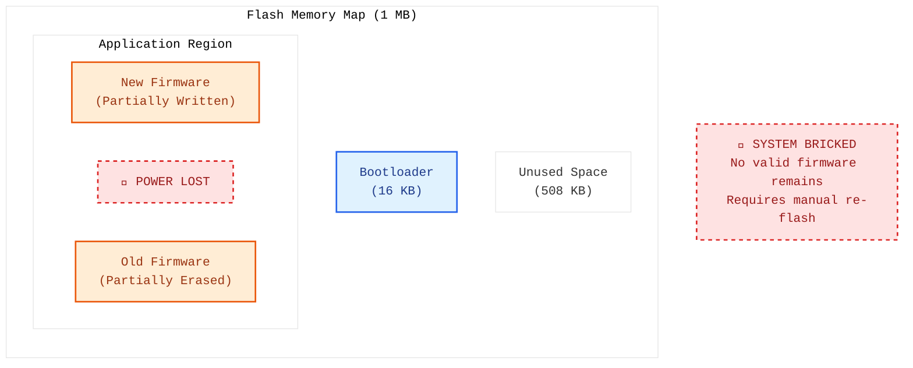
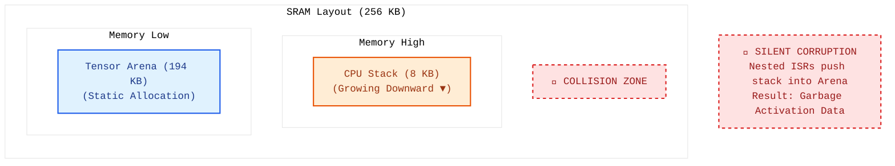
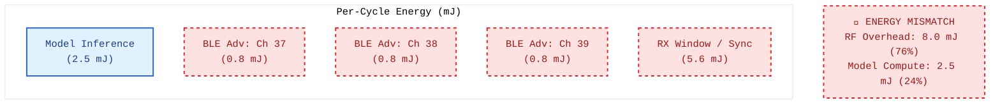
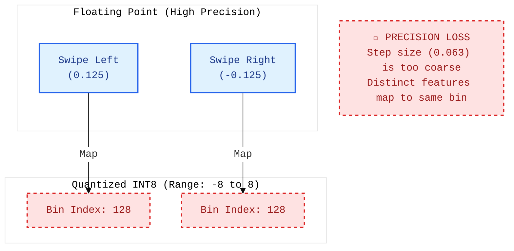
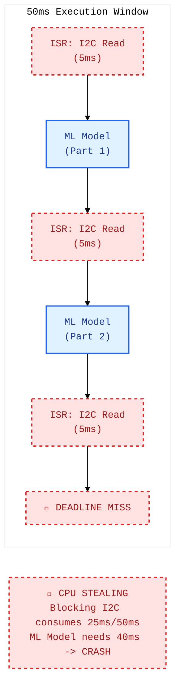
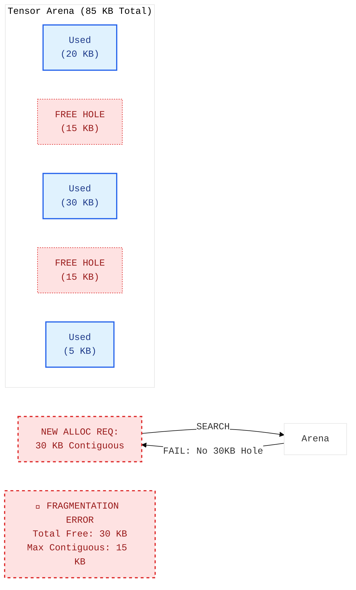
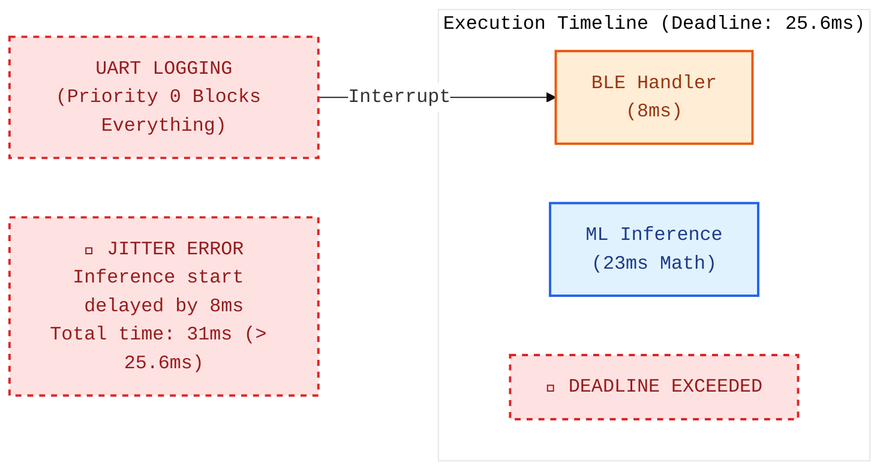
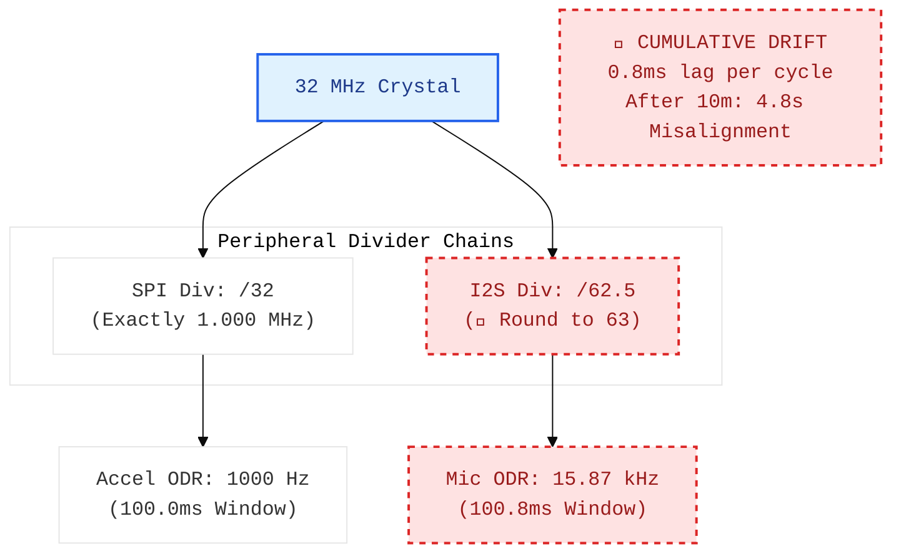
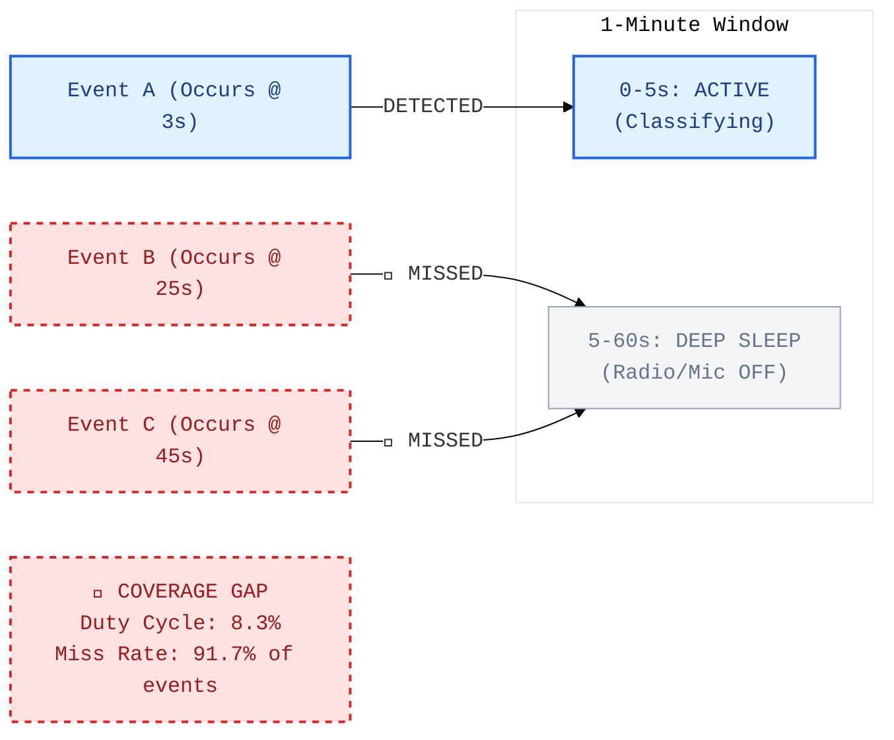
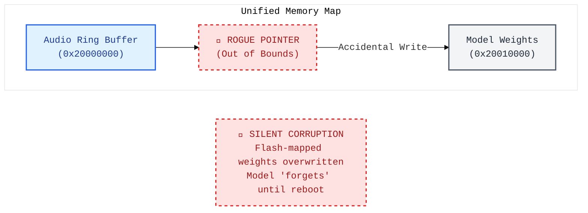

# Visual Architecture Debugging

<div align="center">
  <a href="../README.md">🏠 Home</a> ·
  <a href="../00_The_Architects_Rubric.md">📋 Rubric</a> ·
  <a href="../cloud/README.md">☁️ Cloud</a> · <a href="../edge/README.md">🤖 Edge</a> · <a href="../mobile/README.md">📱 Mobile</a> · <b>🔬 TinyML</b>
</div>

---

*Can you spot the physical constraint in a microcontroller system?*

TinyML architecture diagrams with hidden bottlenecks.

> **[➕ Add a Flashcard](https://github.com/harvard-edge/cs249r_book/edit/dev/interviews/tinyml/04_visual_debugging.md)** (Edit in Browser) — see [README](../README.md#question-format) for the template.

---

<details>
<summary><b> The Firmware Brick</b> · <code>ml-ops</code> <code>reliability</code></summary>

### In-Place Update with No Rollback



- **Interviewer:** "Your TinyML device is performing a field update. The power is accidentally disconnected halfway through the write. Upon reboot, the device is completely 'bricked' and won't даже start the bootloader. Based on the memory map, why did your update process fail so catastrophically?"

  <details>
  <summary><b>🔍 Reveal Answer</b></summary>

  **Common Mistake:** "The CRC check catches corruption." The CRC check runs *after* the write completes. If power is lost during the write, the check never runs.

  **Realistic Solution:** The flaw is **writing directly to the active application region**. By erasing the old firmware to make room for the new one, you leave the device with no valid executable if interrupted. The fix is **A/B Partitioning (Dual-Bank)**: use the 508 KB of free space as a staging area. Download the update there, validate the checksum, and only then tell the bootloader to swap the active partition.

  > **Napkin Math:** In-place updates have a 0% recovery rate from mid-write power loss. A/B partitioning has a 100% recovery rate, as the 'old' valid firmware is never touched until the 'new' one is proven safe.

  📖 **Deep Dive:** [ML Operations](https://harvard-edge.github.io/cs249r_book_dev/contents/ml_ops/ml_ops.html)

  </details>

</details>

<details>
<summary><b> The Memory Collision</b> · <code>hardware</code> <code>memory</code></summary>

### Stack Overflow into the Tensor Arena



- **Interviewer:** "Your model occasionally produces random garbage results, but only when the device is under heavy interrupt load (e.g., fast UART logging + high-speed sensor polling). Based on the SRAM layout, how is your 'stable' tensor arena being corrupted?"

  <details>
  <summary><b>🔍 Reveal Answer</b></summary>

  **Common Mistake:** "The tensor arena is too small — increase it." The arena size is fine; the problem is its location relative to the stack.

  **Realistic Solution:** You have a **Stack-Arena Collision**. On Cortex-M, the stack grows downward. Deep function calls or nested interrupts can push the stack into the memory space of the tensor arena, overwriting model activations. The fix is to place a **Stack Canary** at the boundary, use the **MPU (Memory Protection Unit)** to forbid stack access to the arena region, or move the stack to the very top of SRAM so it faults at the limit rather than corrupting data.

  > **Napkin Math:** If your stack is 8 KB and your arena starts at the 8 KB mark, a single nested interrupt that pushes an extra 256 bytes of context can overwrite the first several rows of your input tensor.

  📖 **Deep Dive:** [Neural Computation](https://harvard-edge.github.io/cs249r_book_dev/contents/neural_computation/neural_computation.html)

  </details>

</details>

<details>
<summary><b> The RF Energy Sink</b> · <code>sustainable-ai</code> <code>power-thermal</code></summary>

### BLE Advertisement Power is Massively Underestimated



- **Interviewer:** "You spend weeks optimizing your model math to save 1 mJ of energy per inference. However, when you enable BLE to report results, the total energy per cycle jumps by 8 mJ. Based on the RF breakdown, why is BLE consuming so much more than a simple packet transmission?"

  <details>
  <summary><b>🔍 Reveal Answer</b></summary>

  **Common Mistake:** "The model inference dominates the power budget." In many TinyML apps, the radio is the actual power hog.

  **Realistic Solution:** You are hitting the **BLE Handshake Overhead**. BLE doesn't just 'send a packet'; it advertises on 3 separate channels and opens a receive window to listen for connection requests. This handshake consumes 3-4x more energy than the actual data transmission. The fix is to **Amortize Radio Costs**: don't report every inference. Buffer 100 results locally and send them in a single connection event to minimize radio uptime.

  > **Napkin Math:** Inference = 2.5 mJ. BLE Transmission = 0.8 mJ. BLE Sync/Handshake = 7.2 mJ. Total = 10.5 mJ. By reporting every 100 samples, the amortized cost drops to 2.5 + (8.0/100) = 2.58 mJ—a nearly 4x reduction.

  📖 **Deep Dive:** [Sustainable AI](https://harvard-edge.github.io/cs249r_book_dev/contents/sustainable_ai/sustainable_ai.html)

  </details>

</details>

<details>
<summary><b> The Quantization Blur</b> · <code>compression</code></summary>

### Quantization Range Collapse on Discriminative Features



- **Interviewer:** "Your gesture-recognition model has 95% accuracy in Python (FP32), but drops to 50% (random chance) after you quantize it to INT8 for a microcontroller. Based on the binning diagram, why did the model 'lose' the ability to tell Left from Right?"

  <details>
  <summary><b>🔍 Reveal Answer</b></summary>

  **Common Mistake:** "The model isn't expressive enough." The FP32 model proves it *is* expressive enough. The problem is the calibration.

  **Realistic Solution:** You have **Quantization Range Collapse**. If you calibrate the model using a dataset with high-magnitude outliers (e.g. ±8g), the INT8 step size becomes too large (0.063). Subtle discriminative features (like ±0.1g) all get rounded to the same integer bin (128). The fix is **Per-Channel Quantization** or **Outlier Clipping**: cap the activation range at a lower value (e.g. ±1g) during calibration to regain resolution for the important small signals.

  > **Napkin Math:** In INT8, you have 256 bins. If your range is ±8 (width 16), each bin is 0.0625 wide. If your signal is ±0.03, it rounds to zero. If you clip the range to ±0.5, each bin is 0.004 wide—regaining 15x more resolution.

  📖 **Deep Dive:** [Model Compression](https://harvard-edge.github.io/cs249r_book_dev/contents/model_compression/model_compression.html)

  </details>

</details>

<details>
<summary><b> The CPU Cycle Thief</b> · <code>hardware</code> <code>latency</code></summary>

### The Blocking ISR Tax



- **Interviewer:** "Your keyword spotting model needs 40ms to run, and your frame deadline is 50ms. On paper, this fits. But in practice, the system crashes every few seconds. Based on the timeline, what is 'stealing' your CPU cycles?"

  <details>
  <summary><b>🔍 Reveal Answer</b></summary>

  **Common Mistake:** "The processor isn't fast enough, increase the clock speed."

  **Realistic Solution:** You are suffering from **Blocking ISR Overruns**. The system executes slow, blocking I2C sensor reads inside an Interrupt Service Routine (ISR). While the ISR runs, the main ML loop is completely halted. If I2C takes 5ms and fires frequently, it consumes the 10ms of margin you thought you had. The fix is to use **DMA (Direct Memory Access)** for sensor reads so the CPU can keep doing ML math while the hardware handles the data transfer.

  > **Napkin Math:** At a 100 kHz I2C clock, reading a 64-byte FIFO takes ~6ms. If you do this every 10ms, your CPU is 60% busy just waiting for I2C, leaving only 4ms for ML math.

  📖 **Deep Dive:** [Hardware Acceleration](https://harvard-edge.github.io/cs249r_book_dev/contents/hw_acceleration/hw_acceleration.html)

  </details>

</details>

<details>
<summary><b> The Arena Swiss Cheese</b> · <code>hardware</code> <code>memory</code></summary>

### Memory Fragmentation



- **Interviewer:** "Your TFLite Micro model requires 85 KB of SRAM. Your device has 100 KB free. However, the allocator throws an 'Allocation Failed' error during initialization. Based on the arena map, why can't the system satisfy a 30 KB request?"

  <details>
  <summary><b>🔍 Reveal Answer</b></summary>

  **Common Mistake:** "TFLite Micro has a memory leak." TFLite Micro uses a static allocator; it cannot leak at runtime.

  **Realistic Solution:** You have **Internal Memory Fragmentation**. Even though you have 30 KB of total free space, it is split into two non-contiguous 15 KB "holes." The allocator cannot satisfy a 30 KB request because tensors must be contiguous in memory. The fix is to use a **Linear Memory Planner** that sorts tensors by lifetime to minimize holes, or manually reorder operators in the graph to reduce the "peak" lifetime overlap.

  > **Napkin Math:** Fragmentation efficiency = $\frac{\text{Max Contiguous}}{\text{Total Free}}$. In this diagram, efficiency is $15/30 = 50\%$. You need a contiguous block of 30 KB, but your largest "room" is only 15 KB.

  📖 **Deep Dive:** [Neural Computation](https://harvard-edge.github.io/cs249r_book_dev/contents/neural_computation/neural_computation.html)

  </details>

</details>

<details>
<summary><b> The Jitter Storm</b> · <code>hardware</code> <code>latency</code></summary>

### Interrupt Priority Inversion



- **Interviewer:** "Your real-time gesture model has a 25.6ms hard deadline. The math takes exactly 23ms. However, you are seeing intermittent 'Frame Dropped' errors. You find that whenever a BLE event occurs, the error rate spikes. Based on the timeline, why is a background task breaking your ML math?"

  <details>
  <summary><b>🔍 Reveal Answer</b></summary>

  **Common Mistake:** "23ms is too close to the deadline — reduce the model size." The model has 2.6ms of margin. The problem is that the margin is being stolen.

  **Realistic Solution:** You have **Interrupt Latency Jitter**. Because the BLE handler and UART logging have the same or higher priority than the ML inference interrupt, they can block the inference from starting. If a BLE event fires, it steals 8ms, pushing the 23ms task to finish at 31ms—well past the 25.6ms deadline. The fix is to **Reprioritize Interrupts**: set the ML DMA complete interrupt to Priority 0 and move logging/BLE to lower priorities.

  > **Napkin Math:** Total latency = Latency(Wait) + Latency(Compute). If Wait jumps from 0ms to 8ms due to an interrupt, your total latency exceeds the 25.6ms budget even though compute is constant at 23ms.

  📖 **Deep Dive:** [Hardware Acceleration](https://harvard-edge.github.io/cs249r_book_dev/contents/hw_acceleration/hw_acceleration.html)

  </details>

</details>

<details>
<summary><b> The Ghost Drift</b> · <code>data-engineering</code> <code>sensor-fusion</code></summary>

### Independent Clock Dividers with Rounding Error



- **Interviewer:** "You are building a multimodal model that fuses Audio and Accelerometer data. Both sensors are connected to the same microcontroller. In long recordings, you notice that the audio and motion events slowly drift apart until they are seconds out of sync. Based on the clock diagram, why is a single crystal failing to keep them aligned?"

  <details>
  <summary><b>🔍 Reveal Answer</b></summary>

  **Common Mistake:** "The sensors use different crystals." They actually use the same crystal as a reference, but the math used to divide that clock is the problem.

  **Realistic Solution:** You have **Clock Divider Rounding Error**. Microcontrollers use integer dividers. If a peripheral requires a 62.5 divider to hit a target frequency, but the hardware can only use 62 or 63, the sensor will run slightly too fast or too slow. Over time, these sub-millisecond errors accumulate into seconds of drift. The fix is to use a **Shared PPS (Pulse Per Second)** signal to hardware-timestamp every buffer, allowing the ML model to realign the data in software.

  > **Napkin Math:** A 0.8ms error per 100ms window is a 0.8% drift. After 10 minutes (600 seconds), the misalignment is $600 \times 0.008 = 4.8 \text{ seconds}$.

  📖 **Deep Dive:** [Data Engineering](https://harvard-edge.github.io/cs249r_book_dev/contents/data_engineering/data_engineering.html)

  </details>

</details>

<details>
<summary><b> The Observation Gap</b> · <code>sustainable-ai</code> <code>power-thermal</code></summary>

### The Duty Cycle Misses 92% of Events



- **Interviewer:** "To save power, your forest-monitoring device wakes up for 5 seconds every minute to listen for bird calls. Your model has 99% accuracy in the lab, but in the field, it misses over 90% of the bird calls. Based on the duty-cycle diagram, why is your accuracy 'failing' in production?"

  <details>
  <summary><b>🔍 Reveal Answer</b></summary>

  **Common Mistake:** "The model needs retraining — it's missing detections." The model is fine; the microphone is simply turned off when the birds are calling.

  **Realistic Solution:** You have a **Duty Cycle Coverage Gap**. Uniform duty cycling is fundamentally wrong for event-driven detection. If a bird calls during the 55-second sleep window, it is never recorded. The fix is a **Two-Tier Wake Architecture**: use a low-power analog comparator (~5 µW) to listen for *any* sound above a threshold. This comparator triggers an interrupt to wake the MCU only when an actual event is occurring.

  > **Napkin Math:** With a 5s/60s cycle, your probability of missing a random 1-second event is $1 - (5/60) = 91.7\%$. No amount of model optimization can recover data that was never captured.

  📖 **Deep Dive:** [Sustainable AI](https://harvard-edge.github.io/cs249r_book_dev/contents/sustainable_ai/sustainable_ai.html)

  </details>

</details>

<details>
<summary><b> The Memory-Mapped Weight Corruption</b> · <code>flash-memory</code></summary>

### The Memory-Mapped Weight Corruption



- **Interviewer:** "You deploy a keyword spotting model where weights are stored in Flash. A bug in your audio code causes a buffer overflow. The device doesn't crash, but the neural network permanently 'forgets' the wake word until a reboot. Based on the memory map, how did a data bug destroy your model?"

  <details>
  <summary><b>🔍 Reveal Answer</b></summary>

  **Common Mistake:** "Assuming `const` variables in Flash are fundamentally un-writable by the CPU."

  **Realistic Solution:** You have **Memory-Mapped Corruption**. Microcontrollers often use a unified address space. While Flash is 'read-only' for code, rogue pointer writes can trigger Flash erase/write cycles if they hit memory-mapped control registers or MMU regions. The overflow marched a pointer into the weight region, corrupting the NPU's 'brain.' The fix is to use the **MPU (Memory Protection Unit)** to set the weight region as strictly Read-Only at the hardware level.

  > **Napkin Math:** If your audio buffer starts at `0x20000000` and weights start at `0x20010000`, a rogue loop that writes 64 KB of data will silently overwrite the first several layers of your model weights.

  📖 **Deep Dive:** [Neural Computation](https://harvard-edge.github.io/cs249r_book_dev/contents/neural_computation/neural_computation.html)

  </details>

</details>

<details>
<summary><b> The SPI Bus Latency Choke</b> · <code>hardware</code> <code>latency</code></summary>

### The SPI Bus Latency Choke

```mermaid
%%{init: {'theme': 'base', 'themeVariables': { 'fontFamily': 'monospace', 'primaryColor': '#ffffff', 'edgeLabelBackground':'#ffffff'}}}%%
graph LR
    classDef cpu fill:#e0f2fe,stroke:#2563eb,stroke-width:2px,color:#1e3a8a
    classDef flash fill:#f3f4f6,stroke:#4b5563,stroke-width:2px,color:#1f2937
    classDef bottleneck fill:#fee2e2,stroke:#dc2626,stroke-width:4px,color:#991b1b,stroke-dasharray: 5 5

    subgraph "On-Chip"
        CPU["Cortex-M CPU<br/>(240 MHz)"]:::cpu
    end

    subgraph "External"
        Flash["Serial Flash<br/>(40 MHz)"]:::flash
    </end

    Bus[["SPI Bus<br/>(1-bit Serial)"]]:::bottleneck

    CPU -- "Fetch Weight" --> Bus
    Bus --> Flash
    Flash -- "Data Return" --> Bus
    Bus --|"STALL: 60 Cycles"| CPU

    Note["🚨 BUS PHYSICS CHOKE<br/>CPU stalls for 95% of Conv layer<br/>Starved for data, not compute"]:::bottleneck
```

- **Interviewer:** "You are running a large model using Execute-In-Place (XIP) from an external Serial Flash. Your CPU is at 240 MHz, but inference takes 10x longer than your simulator predicted. Based on the chip diagram, what physical link is starving your CPU?"

  <details>
  <summary><b>🔍 Reveal Answer</b></summary>

  **Common Mistake:** "The model is too big for the CPU." The CPU can handle the math; it's starving for data.

  **Realistic Solution:** The bottleneck is the **SPI Bus Latency**. Serial Flash operates at a much lower frequency (40-80 MHz) than the CPU (240 MHz) and over a narrow 1-bit or 4-bit bus. Every weight fetch triggers a CPU stall of 50-100 cycles. The fix is **SRAM Pinning**: copy the most frequently used layers (or the current layer's weights) into fast internal SRAM at boot time to avoid the SPI bus during inference.

  > **Napkin Math:** 240 MHz CPU vs 40 MHz SPI = 6x clock ratio. 1-bit SPI vs 32-bit CPU internal bus = 32x width ratio. Total bottleneck = $6 \times 32 = 192\text{x}$ theoretical bandwidth gap.

  📖 **Deep Dive:** [Hardware Acceleration](https://harvard-edge.github.io/cs249r_book_dev/contents/hw_acceleration/hw_acceleration.html)

  </details>

</details>
