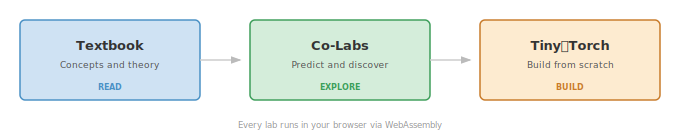

<!-- DEV-BANNER-START -->
<div align="center">
<table>
<tr><td>
<h3>🚧 Under Active Development</h3>
<p>This component is being built on the <code>dev</code> branch and is <b>not yet available</b> on the live site.<br>
Content may be incomplete or change without notice. The published curriculum lives at <a href="https://mlsysbook.ai"><b>mlsysbook.ai</b></a>.</p>
<p>
<a href="https://github.com/harvard-edge/cs249r_book/tree/dev"></a>
<a href="https://mlsysbook.ai"></a>
</p>
</td></tr>
</table>
</div>
<!-- DEV-BANNER-END -->

<div align="center">
  <h1>Co-Labs</h1>
  <blockquote>
    <b>33 Interactive Labs Powered by MLSys·IM</b><br>
    <i>Predict → Discover → Explain</i>
  </blockquote>
</div>

---

## What Are Co-Labs?

Co-Labs are interactive [Marimo](https://marimo.io) notebooks that bridge the gap between **reading about ML systems** (the textbook) and **building them from scratch** (TinyTorch). Every lab runs in your browser via WebAssembly — no installation required.

<p align="center">
  
</p>

## How Labs Work

Each lab follows a consistent structure:

1. **Briefing** — Learning objectives, prerequisites, and the core question
2. **Parts A–E** — Tabbed explorations, each with a prediction lock, interactive instruments, and a reveal
3. **Synthesis** — Key takeaways, textbook connections, and a pointer to the next lab

Every prediction is structured (radio buttons or numeric entry, never free text). You predict first, then explore the instruments to discover whether you were right. The gap between prediction and reality is the learning moment.

## Lab Inventory

### Volume I: Foundations (17 labs · Single-machine ML systems)

<table>
  <thead>
    <tr>
      <th width="5%">#</th>
      <th width="25%">Slug</th>
      <th width="70%">Title</th>
    </tr>
  </thead>
  <tbody>
    <tr>
      <td>00</td>
      <td><code>lab_00_introduction</code></td>
      <td>The Architect's Portal (orientation)</td>
    </tr>
    <tr>
      <td>01</td>
      <td><code>lab_01_ml_intro</code></td>
      <td>The Magnitude Awakening</td>
    </tr>
    <tr>
      <td>02</td>
      <td><code>lab_02_ml_systems</code></td>
      <td>The Iron Law</td>
    </tr>
    <tr>
      <td>03</td>
      <td><code>lab_03_ml_workflow</code></td>
      <td>The Silent Degradation Loop</td>
    </tr>
    <tr>
      <td>04</td>
      <td><code>lab_04_data_engr</code></td>
      <td>The Data Gravity Trap</td>
    </tr>
    <tr>
      <td>05</td>
      <td><code>lab_05_nn_compute</code></td>
      <td>The Activation Tax</td>
    </tr>
    <tr>
      <td>06</td>
      <td><code>lab_06_nn_arch</code></td>
      <td>The Quadratic Wall</td>
    </tr>
    <tr>
      <td>07</td>
      <td><code>lab_07_ml_frameworks</code></td>
      <td>The Kernel Fusion Dividend</td>
    </tr>
    <tr>
      <td>08</td>
      <td><code>lab_08_model_train</code></td>
      <td>The Training Memory Budget</td>
    </tr>
    <tr>
      <td>09</td>
      <td><code>lab_09_data_selection</code></td>
      <td>The Data Selection Tradeoff</td>
    </tr>
    <tr>
      <td>10</td>
      <td><code>lab_10_model_compress</code></td>
      <td>The Compression Frontier</td>
    </tr>
    <tr>
      <td>11</td>
      <td><code>lab_11_hw_accel</code></td>
      <td>The Roofline</td>
    </tr>
    <tr>
      <td>12</td>
      <td><code>lab_12_perf_bench</code></td>
      <td>The Speedup Ceiling</td>
    </tr>
    <tr>
      <td>13</td>
      <td><code>lab_13_model_serving</code></td>
      <td>The Tail Latency Trap</td>
    </tr>
    <tr>
      <td>14</td>
      <td><code>lab_14_ml_ops</code></td>
      <td>The Silent Degradation Problem</td>
    </tr>
    <tr>
      <td>15</td>
      <td><code>lab_15_responsible_engr</code></td>
      <td>There Is No Free Fairness</td>
    </tr>
    <tr>
      <td>16</td>
      <td><code>lab_16_ml_conclusion</code></td>
      <td>The Architect's Audit (capstone)</td>
    </tr>
  </tbody>
</table>

### Volume II: At Scale (16 labs · Distributed ML systems)

<table>
  <thead>
    <tr>
      <th width="5%">#</th>
      <th width="25%">Slug</th>
      <th width="70%">Title</th>
    </tr>
  </thead>
  <tbody>
    <tr>
      <td>01</td>
      <td><code>lab_01_introduction</code></td>
      <td>The Scale Illusion</td>
    </tr>
    <tr>
      <td>02</td>
      <td><code>lab_02_compute_infra</code></td>
      <td>The Compute Infrastructure Wall</td>
    </tr>
    <tr>
      <td>03</td>
      <td><code>lab_03_communication</code></td>
      <td>Communication at Scale</td>
    </tr>
    <tr>
      <td>04</td>
      <td><code>lab_04_data_storage</code></td>
      <td>The Data Pipeline Wall</td>
    </tr>
    <tr>
      <td>05</td>
      <td><code>lab_05_dist_train</code></td>
      <td>The Parallelism Puzzle</td>
    </tr>
    <tr>
      <td>06</td>
      <td><code>lab_06_fault_tolerance</code></td>
      <td>When Failure Is Routine</td>
    </tr>
    <tr>
      <td>07</td>
      <td><code>lab_07_fleet_orch</code></td>
      <td>The Scheduling Trap</td>
    </tr>
    <tr>
      <td>08</td>
      <td><code>lab_08_inference</code></td>
      <td>The Inference Economy</td>
    </tr>
    <tr>
      <td>09</td>
      <td><code>lab_09_perf_engineering</code></td>
      <td>The Optimization Trap</td>
    </tr>
    <tr>
      <td>10</td>
      <td><code>lab_10_edge_intelligence</code></td>
      <td>The Edge Thermodynamics Lab</td>
    </tr>
    <tr>
      <td>11</td>
      <td><code>lab_11_ops_scale</code></td>
      <td>The Silent Fleet</td>
    </tr>
    <tr>
      <td>12</td>
      <td><code>lab_12_security_privacy</code></td>
      <td>The Price of Privacy</td>
    </tr>
    <tr>
      <td>13</td>
      <td><code>lab_13_robust_ai</code></td>
      <td>The Robustness Budget</td>
    </tr>
    <tr>
      <td>14</td>
      <td><code>lab_14_sustainable_ai</code></td>
      <td>The Carbon Budget</td>
    </tr>
    <tr>
      <td>15</td>
      <td><code>lab_15_responsible_ai</code></td>
      <td>The Fairness Budget</td>
    </tr>
    <tr>
      <td>16</td>
      <td><code>lab_16_fleet_synthesis</code></td>
      <td>The Fleet Synthesis (capstone)</td>
    </tr>
  </tbody>
</table>

## The Design Ledger

Every lab saves your predictions and design decisions to the **Design Ledger** — a persistence layer in your browser's localStorage. Later labs read earlier decisions: Lab 08's training memory budget builds on Lab 05's activation analysis, which builds on Lab 01's magnitude calibration. The capstone labs synthesize your full Design Ledger into a portfolio.

## Running Labs

### In the Browser (Recommended)

Visit the [Co-Labs site](https://mlsysbook.ai/labs/) and click any lab. They run via Marimo + WebAssembly with zero setup.

### Locally

```bash
pip install mlsysim[labs]
git clone https://github.com/harvard-edge/cs249r_book.git
cd cs249r_book/labs
marimo run vol1/lab_01_ml_intro.py
```

## Development

See [PROTOCOL.md](PROTOCOL.md) for the lab development specification and [TEMPLATE.md](TEMPLATE.md) for the cell architecture and quality checklist.

### Running Tests

```bash
pytest tests/test_static.py -v
```

---

## Related Resources

<table>
  <thead>
    <tr>
      <th width="30%">Resource</th>
      <th width="70%">Description</th>
    </tr>
  </thead>
  <tbody>
    <tr>
      <td><b><a href="https://mlsysbook.ai">Textbook</a></b></td>
      <td>ML Systems principles and practices</td>
    </tr>
    <tr>
      <td><b><a href="https://mlsysbook.ai/tinytorch">TinyTorch</a></b></td>
      <td>Build your own ML framework from scratch</td>
    </tr>
    <tr>
      <td><b><a href="https://github.com/harvard-edge/cs249r_book/discussions">Discussions</a></b></td>
      <td>Ask questions, share feedback</td>
    </tr>
  </tbody>
</table>

---

## Contributors

Thanks to these wonderful people who helped build the labs!

<!-- ALL-CONTRIBUTORS-LIST:START - Do not remove or modify this section -->
<!-- prettier-ignore-start -->
<!-- markdownlint-disable -->
<table>
  <tbody>
    <tr>
      <td align="center" valign="top" width="14.28%"><a href="https://github.com/profvjreddi"><br /><sub><b>Vijay Janapa Reddi</b></sub></a><br />🧑‍💻 🎨 ✍️</td>
      <td align="center" valign="top" width="14.28%"><a href="https://github.com/salmanmkc"><br /><sub><b>Salman Chishti</b></sub></a><br />🧑‍💻</td>
      <td align="center" valign="top" width="14.28%"><a href="https://github.com/Pratham-ja"><br /><sub><b>Pratham Chaudhary</b></sub></a><br />🧑‍💻</td>
      <td align="center" valign="top" width="14.28%"><a href="https://github.com/asgalon"><br /><sub><b>Peter Koellner</b></sub></a><br />🪲</td>
      <td align="center" valign="top" width="14.28%"><a href="https://github.com/Shashank-Tripathi-07"><br /><sub><b>Rocky</b></sub></a><br />🧑‍💻</td>
    </tr>
  </tbody>
</table>

<!-- markdownlint-restore -->
<!-- prettier-ignore-end -->

<!-- ALL-CONTRIBUTORS-LIST:END -->

**Recognize a contributor:** Comment on any issue or PR:
```
@all-contributors please add @username for code, tutorial, test, or doc
```

---

<div align="center">

<b>Predict. Discover. Explain.</b>

</div>
