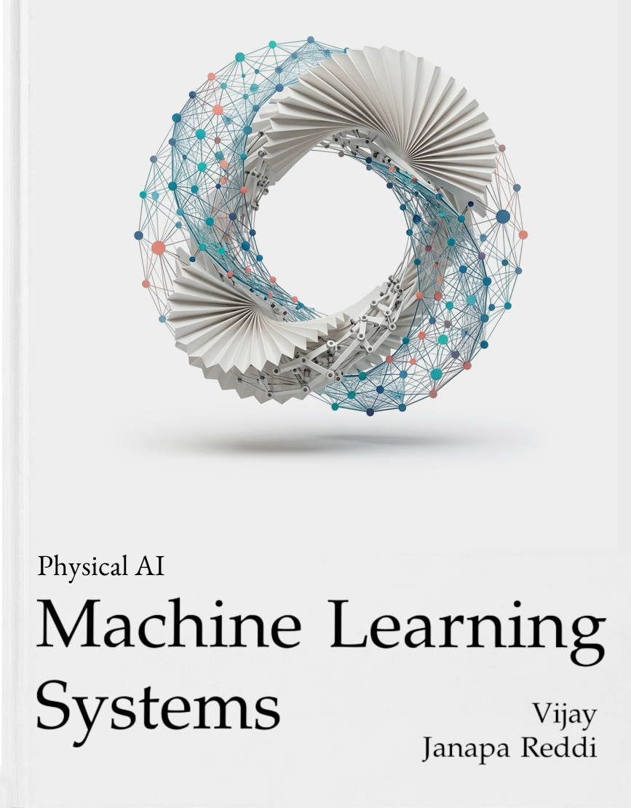

# Volume IV: Physical AI Studio & Hardware Kit (iKit)

**Status:** Official curriculum, hardware architecture, and laboratory studio guide for the [Volume IV Physical AI Seminar](https://mlsysbook.ai/vol4/). Companion to the [MLSysBook Hardware Kits](../../kits/index.qmd) and [Master Course Syllabus](syllabus.md).

---

## 1. What This Course Is About

> **"Physical AI begins where computation stops being symbolic and becomes physical force."**

In digital software AI, an algorithm outputs text, tokens, or pixels on a screen. Errors are symbolic, harmless, and can be undone with a keystroke. In **Physical AI**, an algorithm commands real electrical currents to motors possessing mass, velocity, inertia, and momentum. If the model makes a mistake, physical things collide, tear, or break. **You cannot `Ctrl+Z` physics.**

This studio teaches the science and systems engineering of machines that sense and act in the physical world:
1. **The Brain:** Deploying high-capacity Vision-Language-Action (VLA) neural policies (**Hugging Face SmolVLA and ACT**) on an edge Linux processor (**Arduino UNO Q Qualcomm MPU**).
2. **The Body:** Actuating a 6-DoF robotic follower arm (**Seeed Studio SO-101**) with smart serial bus servos and an overhead workspace webcam.
3. **The Governor:** Enforcing deterministic, real-time safety constraints, velocity limits, and emergency cutoffs through an independent microcontroller (**STM32U585 MCU**).

---

## 2. The Three Foundational Pillars

```{=html}
<table style="width: 100%; border: none; border-collapse: separate; border-spacing: 16px;">
  <tr style="border: none;">
    <td style="width: 33%; vertical-align: top; text-align: center; padding: 16px; border: 1px solid #e2e8f0; border-radius: 10px; background: #fafafa;">
      <div style="height: 180px; display: flex; align-items: center; justify-content: center; gap: 8px;">
        
        
      </div>
      <h3 style="margin-top: 12px; margin-bottom: 6px;">1. The Board & Body</h3>
      <p style="font-size: 0.88rem; color: #475569; text-align: left; line-height: 1.4;">
        <strong>Arduino UNO Q + Seeed SO-101 Arm</strong><br>
        A dual-brain architecture combining a Qualcomm QRB2210 Linux MPU for vision and VLA inference with an STM32U585 MCU acting as the hard real-time safety governor over 6× Feetech STS3215 bus smart servos.
      </p>
    </td>
    <td style="width: 33%; vertical-align: top; text-align: center; padding: 16px; border: 1px solid #e2e8f0; border-radius: 10px; background: #fafafa;">
      <div style="height: 180px; display: flex; align-items: center; justify-content: center;">
        
      </div>
      <h3 style="margin-top: 12px; margin-bottom: 6px;">2. The Software Spine</h3>
      <p style="font-size: 0.88rem; color: #475569; text-align: left; line-height: 1.4;">
        <strong>Hugging Face LeRobot & SmolVLA</strong><br>
        The open-source physical AI foundation providing teleoperation capture, LeRobot Dataset v3 format with 4-action-tap logging, language conditioning, and action-chunk policies (SmolVLA and ACT).
      </p>
    </td>
    <td style="width: 33%; vertical-align: top; text-align: center; padding: 16px; border: 1px solid #e2e8f0; border-radius: 10px; background: #fafafa;">
      <div style="height: 180px; display: flex; align-items: center; justify-content: center;">
        
      </div>
      <h3 style="margin-top: 12px; margin-bottom: 6px;">3. The Curriculum</h3>
      <p style="font-size: 0.88rem; color: #475569; text-align: left; line-height: 1.4;">
        <strong>MLSysBook Volume IV (17 Chapters)</strong><br>
        Four thematic parts: Anatomy (Chapters 1–4), Teaching (Chapters 5–7), Running (Chapters 8–13), and Governing (Chapters 14–17). Establishing the S·P·A causal loop and authority boundaries under fault.
      </p>
    </td>
  </tr>
</table>
```

---

## 3. The Physical AI Unit of Work: The S·P·A Loop

The unit of work across every studio experiment is a single **physical episode**:

$$\text{Physical State } (s_t) \longrightarrow \text{Observation } (I_t, q_t) \longrightarrow \text{Learned Proposal } (a_{\text{req}}) \longrightarrow \text{MCU Permission } (a_{\text{enf}}) \longrightarrow \text{Actuation } (a_{\text{meas}}) \longrightarrow \text{New Observation } (I_{t+1}, q_{t+1}) \longrightarrow \text{Revised Decision}$$


> **The Three-Part Scope Test:** A lab submission that merely classifies camera frames without driving actuators, or a model output wired to a hardcoded robotic script, does not satisfy the Physical AI requirement. Students must demonstrate learned decision-making whose next proposal responds directly to measured physical change under an independent MCU permission boundary.

---

## 4. The 2×2 Competency Architecture (The 12 Skills)

Engineering mastery is tracked using the [Physical AI Station Competency Card](student-competencies.md) across four balanced quadrants (**3 competencies per quadrant = 12 total**):

```
                        ┌──────────────────────────┬──────────────────────────┐
                        │   Characterize & Model   │     Control & Govern     │
                        │  (Observe, Profile, Data)│   (Act, Enforce, Defend) │
┌───────────────────────┼──────────────────────────┼──────────────────────────┤
│ PHYSICAL EMBODIMENT   │  QUADRANT A:             │  QUADRANT C:             │
│ (Actuators, Plant,    │  Kinematics & Sensing    │  Edge Loops & Planning   │
│  Dynamics, Noise)     │  (A1, A2, A3)            │  (C1, C2, C3)            │
├───────────────────────┼──────────────────────────┼──────────────────────────┤
│ LOGICAL COGNITION     │  QUADRANT B:             │  QUADRANT D:             │
│ (Neural Policies,     │  Data & Learning         │  Authority & Safety      │
│  Compute, Safety)     │  (B1, B2, B3)            │  (D1, D2, D3)            │
└───────────────────────┴──────────────────────────┴──────────────────────────┘
```

---

## 5. The 14-Week Semester Schedule

Formal classroom instruction and new textbook readings run through **Week 11**, covering the four parts of the textbook across **8 focused labs**. The final three weeks (**Weeks 12–14**) are preserved as an open **Capstone Project Studio**:


---

## 6. Studio Lab Directory & Reading Guide

| Studio Module & Link | Schedule | Required Textbook Reading | Primary Physical AI Focus | Competency Check-Off |
|:---|:---:|:---|:---|:---:|
| **[Module 1: The Machine Anatomy](module-1-machine-anatomy.md)**<br>• [Lab 1: Causal Boundary & Bus Bring-Up](lab-01-boundary.md)<br>• [Lab 2: Sensing & Inter-Core Bridge](lab-02-body-and-sensors.md) | Weeks 1–3 | **Ch 1:** Causal Boundary<br>**Ch 2:** Physical Body<br>**Ch 3:** Cognitive Brain<br>**Ch 4:** Nervous System | Enumerate STS3215 servos on STM32; zero-calibrate offsets; measure travel limits and power-off drop trace. Calibrate USB webcam ($T_{\text{cam}}^{\text{base}}$) and measure inter-core RPC latency. | `[ ] A1`<br>`[ ] A2`<br>`[ ] A3`<br>`[ ] D1` |
| **[Module 2: Teaching the Machine](module-2-teaching-the-machine.md)**<br>• [Lab 3: Teleoperation & Datasets](lab-03-physical-episodes.md)<br>• [Lab 4: Baseline & Policy Export](lab-04-baseline-and-learning.md) | Weeks 4–6 | **Ch 5:** Physical Data<br>**Ch 6:** Policy Training<br>**Ch 7:** Closed-Loop Evaluation | Teleoperate SO-101; record 30 episodes in LeRobot Dataset v3 format with 4 action taps. Build scripted reach baseline. Train ACT / fine-tune SmolVLA; export ONNX to Qualcomm Linux (<100ms). | `[ ] B1`<br>`[ ] B2`<br>`[ ] B3` |
| **[Module 3: Running the Machine](module-3-running-the-machine.md)**<br>• [Lab 5: Closed-Loop Autonomous Reach](lab-05-local-feedback-loop.md)<br>• [Lab 6: Action Horizons & Disturbances](lab-06-action-chunks.md) | Weeks 7–9 | **Ch 8:** Sensor Perception<br>**Ch 10:** Grounded Intent<br>**Ch 11:** Trajectory Planning<br>**Ch 13:** Silicon Placement | Deploy live inference on UNO Q without host tethering. Benchmark action chunk horizons ($K=1$ vs $16$). Test SmolVLA language conditioning. Shift target mid-reach to evaluate replanning vs. drift. | `[ ] C1`<br>`[ ] C2`<br>`[ ] C3` |
| **[Module 4: Governing the Machine](module-4-governing-the-machine.md)**<br>• [Lab 7: Microcontroller Safety Governor](lab-07-authority-under-fault.md)<br>• [Lab 8: Fault Injection & Safe Cutoff](lab-08-verification-and-release.md) | Weeks 10–11 | **Ch 12:** Safety Enforcement<br>**Ch 14:** Supervisory Intervention<br>**Ch 15:** Adversarial Verification<br>**Ch 16:** Safe Release | Implement real-time velocity clamps and table geofences on STM32. Inject synthetic faults (frozen Linux, dropped frames, stale packets); verify communication watchdog cutoff with zero backlog. | `[ ] D1`<br>`[ ] D2` |
| **[Capstone Project Studio](lab-capstone-studio.md)**<br>*(Synthesis & Physical Release)* | Weeks 12–14 | **Chapters 1–17**<br>*(Complete Book Synthesis)* | 3 full weeks: independent task design, peer adversarial fault exchange, 20 held-out physical disturbance trials, and oral defense of the **Physical Release Dossier**. | `[ ] D3`<br>*(Full Card Mastery)* |

---

## 7. Key Operational Documents

* 📋 **[Master Course Syllabus](syllabus.md):** Full academic policy, grading weights (15% M1, 25% M2, 20% M3, 15% M4, 25% M5), team roles, and safety contract.
* 🏷️ **[Physical AI Competency Card](student-competencies.md):** The 12-item platform-independent rubric signed off at the bench.
* 📦 **[Kit Bill of Materials (BOM)](kit-bom.md):** Parts list, pricing, and supplier links for the UNO Q, SO-101 arm, USB webcam, and power accessories.
* 🧪 **[Teaching Staff Bench Pilot](feasibility-plan.md):** Hardware pre-flight qualification protocol (Tests A–D) before releasing kits to students.
