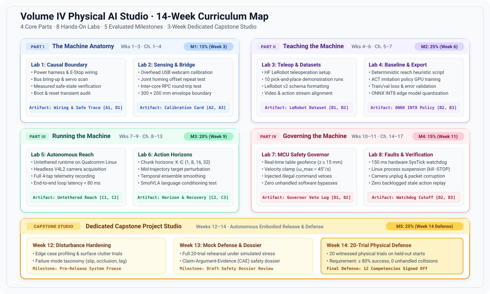

# Volume IV: Physical AI Studio & Hardware Kit (iKit)

**Status:** Official curriculum, hardware architecture, and laboratory studio guide for the [Volume IV Physical AI Seminar](https://mlsysbook.ai/vol4/). Companion to the [MLSysBook Hardware Kits](../../kits/index.qmd) and [Master Course Syllabus](curriculum/syllabus.md).

---

## 1. What This Course Is About

> **"Physical AI begins where computation stops being symbolic and becomes physical force."**

In digital software AI, an algorithm outputs text, tokens, or pixels on a screen. Errors are symbolic, harmless, and can be undone with a keystroke. In **Physical AI**, an algorithm commands real electrical currents to motors possessing mass, velocity, inertia, and momentum. If the model makes a mistake, physical things collide, tear, or break. **You cannot `Ctrl+Z` physics.**

This studio teaches the science and systems engineering of machines that sense and act in the physical world:
1. **The Cognitive Brain:** Deploying high-capacity Vision-Language-Action (VLA) neural policies (**Hugging Face SmolVLA and ACT**) on an edge Linux processor (**Arduino UNO Q Qualcomm MPU**).
2. **The Physical Body:** Actuating a 6-DoF robotic follower arm (**Seeed Studio SO-101**) with smart serial bus servos and an overhead workspace webcam.
3. **The Safety Governor:** Enforcing deterministic, real-time safety constraints, velocity limits, and watchdog cutoffs through an independent microcontroller (**STM32U585 MCU**).


---

## 2. The Three Foundational Pillars

| 1. The Board & Body | 2. The Software Spine | 3. The Curriculum |
| :---: | :---: | :---: |
| <br> |  |  |
| **Arduino UNO Q + Seeed SO-101 Arm**<br>Dual-brain architecture combining Qualcomm QRB2210 Linux MPU (vision & VLA inference) with STM32U585 MCU safety governor over 6× Feetech STS3215 bus smart servos. | **Hugging Face LeRobot & SmolVLA**<br>Open-source physical AI foundation providing teleoperation capture, LeRobot Dataset v3 format with 4-action-tap logging, language conditioning, and action-chunk policies (SmolVLA and ACT). | **MLSysBook Volume IV (17 Chapters)**<br>Four thematic parts: Anatomy (Chapters 1–4), Teaching (Chapters 5–7), Running (Chapters 8–13), and Governing (Chapters 14–17). Establishing S·P·A causal loops under fault. |

---

## 3. The Physical AI Unit of Work: The S·P·A Loop

The unit of work across every studio experiment is a single **physical episode**:

$$\text{Physical State } (s_t) \longrightarrow \text{Observation } (I_t, q_t) \longrightarrow \text{Learned Proposal } (a_{\text{req}}) \longrightarrow \text{MCU Permission } (a_{\text{enf}}) \longrightarrow \text{Actuation } (a_{\text{meas}}) \longrightarrow \text{New Observation } (I_{t+1}, q_{t+1}) \longrightarrow \text{Revised Decision}$$


> **The Three-Part Scope Test:** A lab submission that merely classifies camera frames without driving actuators, or a model output wired to a hardcoded robotic script, does not satisfy the Physical AI requirement. Students must demonstrate learned decision-making whose next proposal responds directly to measured physical change under an independent MCU permission boundary.

---

## 4. The 2×2 Competency Architecture (The 12 Skills)

Engineering mastery is tracked using the [Physical AI Station Competency Card](curriculum/student-competencies.md) across four balanced quadrants (**3 competencies per quadrant = 12 total**):

```
                        ┌──────────────────────────┬──────────────────────────┐
                        │   Characterize & Model   │     Control & Govern     │
                        │  (Observe, Profile, Data)│   (Act, Enforce, Defend) │
┌───────────────────────┼──────────────────────────┼──────────────────────────┤
│ PHYSICAL EMBODIMENT   │  QUADRANT A:             │  QUADRANT C:             │
│ (Actuators, Plant,    │  Kinematics & Sensing    │  Edge Loops & Planning   │
│  Dynamics, Noise)     │  (A1, A2, A3)            │  (C1, C2, C3)            │
├───────────────────────┼──────────────────────────┼──────────────────────────┤
│ LOGICAL COGNITION     │  QUADRANT B:             │  QUADRANT D:             │
│ (Neural Policies,     │  Data & Learning         │  Authority & Safety      │
│  Compute, Safety)     │  (B1, B2, B3)            │  (D1, D2, D3)            │
└───────────────────────┴──────────────────────────┴──────────────────────────┘
```

---

## 5. The 14-Week Semester Schedule

Formal classroom instruction and new textbook readings run through **Week 11**, covering the four parts of the textbook across **6 focused labs**. The final three weeks (**Weeks 12–14**) are preserved as an open **Capstone Project Studio**:



---

## 6. Studio Lab Directory & Reading Guide

| Lab & Link | Schedule | Required Textbook Reading | Primary Physical AI Focus | Competency Check-Off |
|:---|:---:|:---|:---|:---:|
| **[Lab 1: Kinematics & Simulation](labs/lab-01-machine-anatomy.md)** | Weeks 1–2 | **Ch 1:** Causal Boundary · **Ch 2:** Physical Body | Derive DH parameters and inverse kinematics by hand. Build a digital twin in simulation. Command the simulated robot with your own IK equations. Map the workspace and identify singularities. | `A1` |
| **[Lab 2: Hardware Bring-Up & Real-World Control](labs/lab-02-teleoperation-and-datasets.md)** | Weeks 3–4 | **Ch 3:** Cognitive Brain · **Ch 4:** Nervous System | Wire the bench; port IK to the STM32 MCU; control the real robot via CLI; calibrate webcam ($T_{\text{cam}}^{\text{base}}$); measure RPC latency; quantify sim2real discrepancies; verify safe-state behavior. | `A2` · `A3` · `D1` |
| **[Lab 3: VLAs — From Simulation to Hardware](labs/lab-03-baseline-and-training.md)** | Weeks 5–6 | **Ch 5:** Physical Data · **Ch 6:** Policy Training | Evaluate a pre-trained VLA in simulation. Deploy the sim-trained VLA to the UNO Q Dragonwing via RPC. Run it on real hardware. Measure and analyze the sim2real gap. | `B1` · `B2` |
| **[Lab 4: Closing the Gap — Real Data & Fine-Tuning](labs/lab-04-autonomous-reach.md)** | Weeks 7–8 | **Ch 7:** Closed-Loop Evaluation · **Ch 8:** Sensor Perception | Teleoperate to collect 30 real-world episodes. Fine-tune the sim-trained VLA on real data. Deploy untethered. Run the full S·P·A loop autonomously. Quantify sim2real gap closure. | `B3` · `C1` |
| **[Lab 5: Action Horizons, Language & Disturbances](labs/lab-05-horizons-and-disturbances.md)** | Week 9 | **Ch 10:** Grounded Intent · **Ch 12:** Safety Enforcement | Benchmark action chunk horizons ($K=1$ vs $16$). Test SmolVLA language conditioning. Shift target 50 mm mid-reach to evaluate replanning vs. drift. | `C2` · `C3` |
| **[Lab 6: Safety Governor — Build It, Then Break It](labs/lab-06-safety-governor.md)** | Weeks 10–11 | **Ch 12:** Safety Enforcement · **Ch 14:** Supervisory Intervention · **Ch 15:** Adversarial Verification · **Ch 16:** Safe Release | Implement real-time velocity clamps and table geofences on STM32. Inject synthetic faults (frozen Linux, dropped frames, stale packets). Configure hardware watchdog. Verify zero command backlog on resume. | `D1` · `D2` |
| **[Capstone Project Studio](labs/lab-capstone-studio.md)** *(Synthesis & Physical Release)* | Weeks 12–14 | **Chapters 1–17** *(Complete Book Synthesis)* | 3 full weeks: independent task design, peer adversarial fault exchange, 20 held-out physical disturbance trials, and oral defense of the **Physical Release Dossier**. Generalize the pipeline to a different robot architecture. | `D3` *(Full Card Mastery)* |

---

## 7. Reference & Governance Documents

| Domain | Document | Primary Focus & Target Audience |
|:---|:---|:---|
| **Academic Policy** | 📋 **[Master Course Syllabus](curriculum/syllabus.md)** | Full academic grading weights (15% M1, 25% M2, 20% M3, 15% M4, 25% M5), team roles, and safety contract. |
| **Student Rubric** | 🏷️ **[Physical AI Competency Card](curriculum/student-competencies.md)** | The 12-item platform-independent rubric signed off at the bench across 4 quadrants. |
| **Station Setup** | 🔧 **[Station Reference Card](labs/station-reference.md)** | Standard bench hardware, wiring diagram, three engineering rules, and four-tap telemetry schema. |
| **Hardware Kit** | 📦 **[Kit Bill of Materials (BOM)](staff/kit-bom.md)** | Complete component list, pricing, power rails, and supplier links for the UNO Q and SO-101 arm. |
| **Bench Bring-Up** | 🧪 **[Postdoc Pre-Flight Qualification Guide](staff/feasibility-plan.md)** | Engineering bring-up protocol and the four hardware validation steps (Steps 1–4). |
| **Staff Roadmap** | 🗓️ **[Staff Implementation Master Plan](staff/staff-implementation-plan.md)** | Comprehensive 13-week execution schedule (Sep 21 – Dec 18, 2026) for hardware bring-up, "Student Zero" runs, and class-set replication. |
