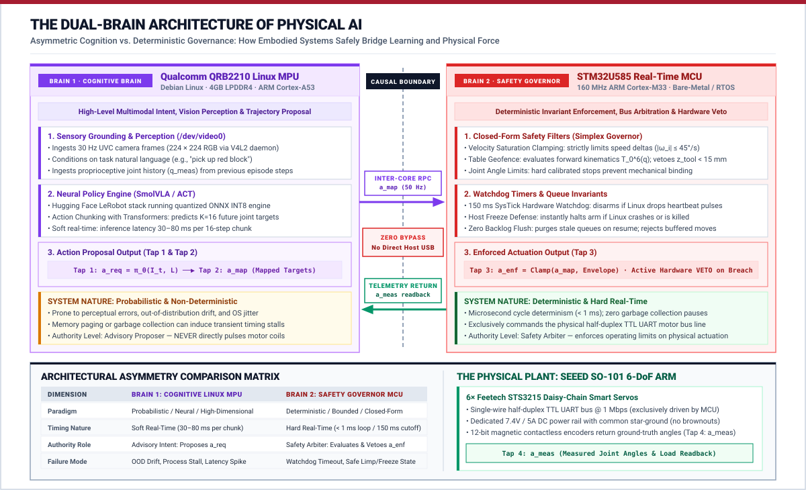
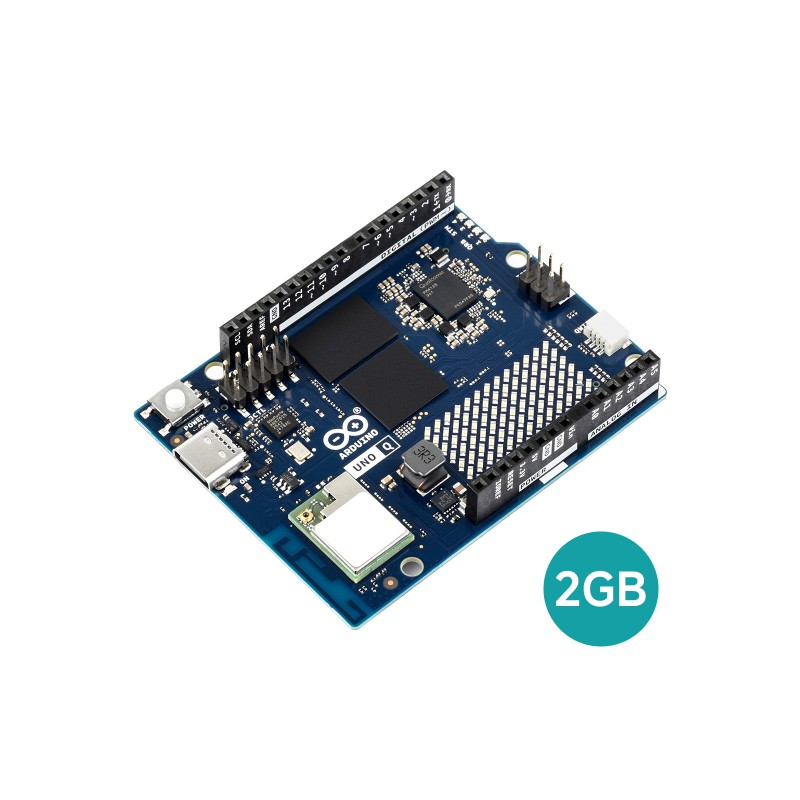
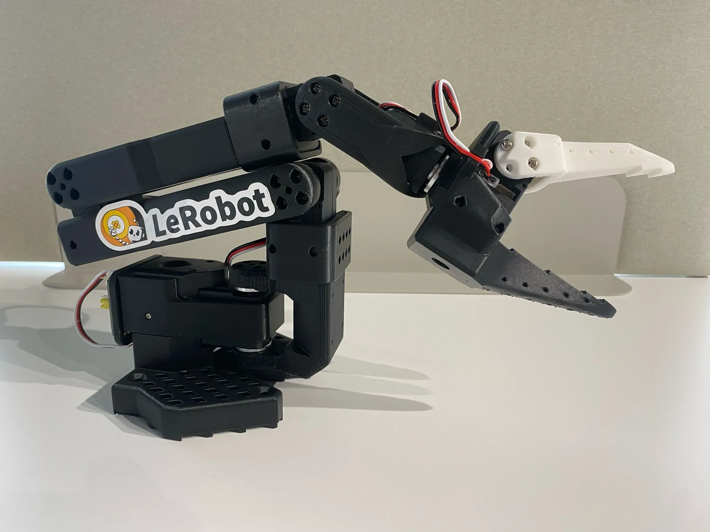
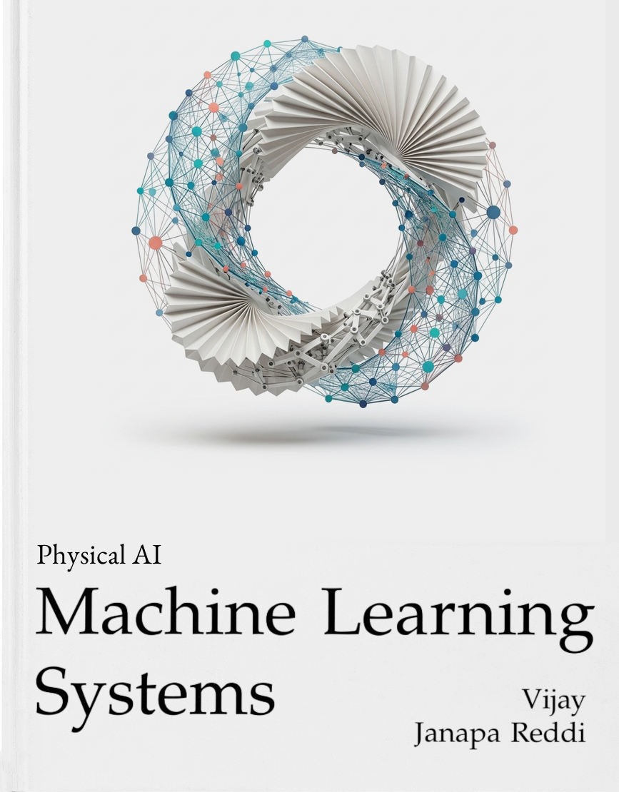
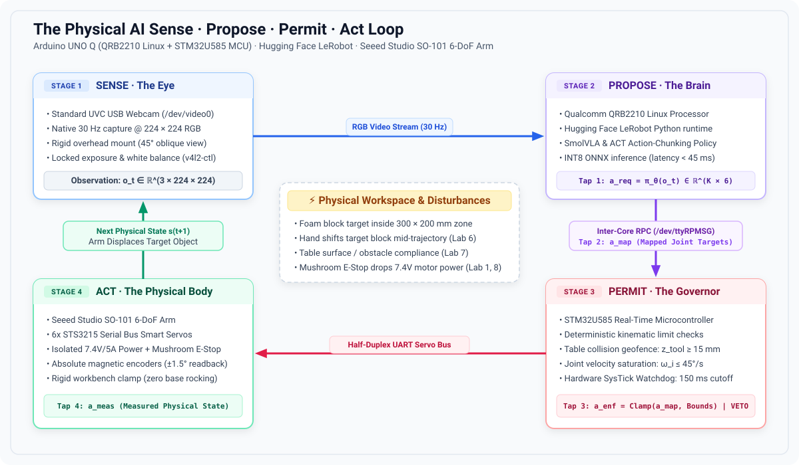

# Volume IV: Physical AI Studio & Hardware Kit (iKit)

**Status:** Official curriculum, hardware architecture, and laboratory studio guide for the [Volume IV Physical AI Seminar](https://mlsysbook.ai/vol4/). Companion to the [MLSysBook Hardware Kits](../../kits/index.qmd) and [Master Course Syllabus](curriculum/syllabus.md).

---

## 1. What This Course Is About

> **"Physical AI begins where computation stops being symbolic and becomes physical force."**

In digital software AI, an algorithm outputs text, tokens, or pixels on a screen. Errors are symbolic, harmless, and can be undone with a keystroke. In **Physical AI**, an algorithm commands real electrical currents to motors possessing mass, velocity, inertia, and momentum. If the model makes a mistake, physical things collide, tear, or break. **You cannot `Ctrl+Z` physics.**

This studio teaches the science and systems engineering of machines that sense and act in the physical world:
1. **The Cognitive Brain:** Deploying high-capacity Vision-Language-Action (VLA) neural policies (**Hugging Face SmolVLA and ACT**) on an edge Linux processor (**Arduino UNO Q Qualcomm MPU**).
2. **The Physical Body:** Actuating a 6-DoF robotic follower arm (**Seeed Studio SO-101**) with smart serial bus servos and an overhead workspace webcam.
3. **The Safety Governor:** Enforcing deterministic, real-time safety constraints, velocity limits, and watchdog cutoffs through an independent microcontroller (**STM32U585 MCU**).



---

## 2. The Three Foundational Pillars

| 1. The Board & Body | 2. The Software Spine | 3. The Curriculum |
| :---: | :---: | :---: |
| <br> |  |  |
| **Arduino UNO Q + Seeed SO-101 Arm**<br>Dual-brain architecture combining Qualcomm QRB2210 Linux MPU (vision & VLA inference) with STM32U585 MCU safety governor over 6× Feetech STS3215 bus smart servos. | **Hugging Face LeRobot & SmolVLA**<br>Open-source physical AI foundation providing teleoperation capture, LeRobot Dataset v3 format with 4-action-tap logging, language conditioning, and action-chunk policies (SmolVLA and ACT). | **MLSysBook Volume IV (17 Chapters)**<br>Four thematic parts: Anatomy (Chapters 1–4), Teaching (Chapters 5–7), Running (Chapters 8–13), and Governing (Chapters 14–17). Establishing S·P·A causal loops under fault. |

---

## 3. The Physical AI Unit of Work: The S·P·A Loop

The unit of work across every studio experiment is a single **physical episode**:

$$\text{Physical State } (s_t) \longrightarrow \text{Observation } (I_t, q_t) \longrightarrow \text{Learned Proposal } (a_{\text{req}}) \longrightarrow \text{MCU Permission } (a_{\text{enf}}) \longrightarrow \text{Actuation } (a_{\text{meas}}) \longrightarrow \text{New Observation } (I_{t+1}, q_{t+1}) \longrightarrow \text{Revised Decision}$$



> **The Three-Part Scope Test:** A lab submission that merely classifies camera frames without driving actuators, or a model output wired to a hardcoded robotic script, does not satisfy the Physical AI requirement. Students must demonstrate learned decision-making whose next proposal responds directly to measured physical change under an independent MCU permission boundary.

---

## 4. The 2×2 Competency Architecture (The 12 Skills)

Engineering mastery is tracked using the [Physical AI Station Competency Card](curriculum/student-competencies.md) across four balanced quadrants (**3 competencies per quadrant = 12 total**):

```
                        ┌──────────────────────────┬──────────────────────────┐
                        │   Characterize & Model   │     Control & Govern     │
                        │  (Observe, Profile, Data)│   (Act, Enforce, Defend) │
┌───────────────────────┼──────────────────────────┼──────────────────────────┤
│ PHYSICAL EMBODIMENT   │  QUADRANT A:             │  QUADRANT C:             │
│ (Actuators, Plant,    │  Kinematics & Sensing    │  Edge Loops & Planning   │
│  Dynamics, Noise)     │  (A1, A2, A3)            │  (C1, C2, C3)            │
├───────────────────────┼──────────────────────────┼──────────────────────────┤
│ LOGICAL COGNITION     │  QUADRANT B:             │  QUADRANT D:             │
│ (Neural Policies,     │  Data & Learning         │  Authority & Safety      │
│  Compute, Safety)     │  (B1, B2, B3)            │  (D1, D2, D3)            │
└───────────────────────┴──────────────────────────┴──────────────────────────┘
```

---

## 5. The 14-Week Lab Schedule

Six labs follow the textbook's four parts in order, building from pen-and-paper math through simulation, real hardware, learned control, and finally safety governance. The final three weeks are an open capstone.


| | Lab | Weeks | Book Part & Chapters | What You Will Do |
|:---:|:---|:---:|:---|:---|
| 1 | **[Robot Kinematics & Digital Twin](labs/lab-01-machine-anatomy.md)** | 1–2 | Part I — Ch 1 *Causal Boundary*, Ch 2 *Physical Body* | Understand the math that makes a robot move. Derive inverse kinematics by hand, then build a simulated digital twin and command it with your own equations. |
| 2 | **[From Simulation to Real Hardware](labs/lab-02-teleoperation-and-datasets.md)** | 3–4 | Part I — Ch 3 *Cognitive Brain*, Ch 4 *Nervous System* | Discover what simulation gets wrong. Wire the physical bench, port your IK to the microcontroller, control the real robot via CLI, and measure the gap between sim and reality. |
| 3 | **[Learned Control with Vision-Language-Action Models](labs/lab-03-baseline-and-training.md)** | 5–6 | Part II — Ch 5 *Physical Data*, Ch 6 *Policy Training* | Replace hand-coded equations with a neural policy that learns from data. Run a pre-trained VLA in simulation, then deploy it to the real robot and measure the sim2real performance drop. |
| 4 | **[Real-World Data Collection & Fine-Tuning](labs/lab-04-autonomous-reach.md)** | 7–8 | Part II–III — Ch 7 *Evaluation*, Ch 8 *Perception*, Ch 9 *Spatial Memory* | Bridge the sim2real gap with real data. Teleoperate the robot to collect demonstrations, fine-tune the sim-trained model, and deploy it untethered for fully autonomous operation. |
| 5 | **[Stress-Testing: Prediction, Language & Recovery](labs/lab-05-horizons-and-disturbances.md)** | 9 | Part III — Ch 10 *Grounded Intent*, Ch 11 *Trajectory Planning* | Push the system until it breaks. Test how far ahead the model can predict, whether language changes its behavior, and what happens when you move the target mid-reach. |
| 6 | **[Safety Governor — Build It, Then Break It](labs/lab-06-safety-governor.md)** | 10–11 | Part III–IV — Ch 12 *Safety Enforcement*, Ch 13 *Silicon Placement*, Ch 14 *Intervention*, Ch 15 *Verification*, Ch 16 *Release* | Prove the robot is trustworthy. Program safety barriers on the microcontroller, then try to defeat them by freezing the brain, corrupting packets, and cutting power. |
| | **[Capstone: Physical Release Defense](labs/lab-capstone-studio.md)** | 12–14 | Synthesis — Ch 17 *Epistemic Frontier* | Put it all together. Design your own task, survive a peer team's adversarial attacks, defend your Physical Release Dossier, and generalize the pipeline to a new robot. |

---

## 6. Reference Documents

| Document | Description |
|:---|:---|
| 📋 **[Master Course Syllabus](curriculum/syllabus.md)** | Grading weights, milestones, team roles, and safety contract. |
| 🏷️ **[Physical AI Competency Card](curriculum/student-competencies.md)** | The 12-skill rubric signed off at the bench across 4 quadrants. |
| 🔧 **[Station Reference Card](labs/station-reference.md)** | Standard bench hardware, wiring, engineering rules, and telemetry schema. |
