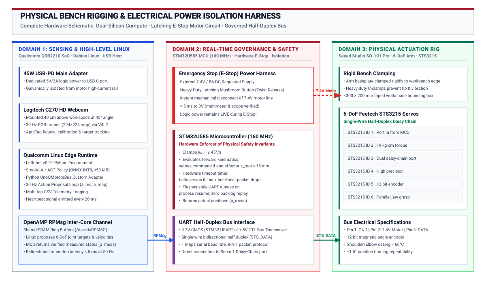

# Postdoc Pre-Flight Implementation & Qualification Guide

**Audience:** Postdoctoral Researcher (Andrea, ETH Zurich) & Lab Staff
**Status:** Canonical Engineering Implementation Checklist & Qualification Plan
**Target Platform:** Arduino UNO Q ("Unikue" QRB2210 Linux + STM32U585 MCU) · Seeed Studio SO-101 6-DoF Arm · Hugging Face LeRobot · SmolVLA & ACT Models
**Reference Curriculum:** [Master Landing Page](README.md) · [Course Syllabus](syllabus.md) · [Staff Master Plan (Sep–Dec 2026)](staff-implementation-plan.md) · [12-Competency Matrix](student-competencies.md) · [Capstone Studio](lab-capstone-studio.md)

---

## 1. Executive Mandate: Prove the Bench Before Teaching It

Andrea, your primary mission before the semester begins is to **build, verify, and qualify one "Golden Reference Station"** from raw hardware to untethered physical AI execution. You must act as **"Student Zero"** across all 8 labs, verifying that every exercise functions deterministically, producing the gold-standard artifacts, and isolating hardware failure modes before students arrive.

Students should finish this course with an autonomous embodied system that **senses physical reality via vision, uses a learned model to propose multi-joint action chunks, delegates safety authority to an on-board microcontroller to permit or clamp motion, measures true kinematic outcomes, and revises its next decision from closed-loop feedback**.

Do not attempt to write sixteen different handouts or build custom motor shields. The hardware kit is fixed:
1. **The Board:** Arduino UNO Q (Qualcomm QRB2210 Linux MPU + STM32U585 real-time MCU).
2. **The Body:** Seeed Studio SO-101 6-DoF arm (STS3215 smart serial bus servos) + $20 standard UVC USB webcam.
3. **The Software/Model Spine:** Hugging Face LeRobot (Python API) + SmolVLA / ACT action-chunking policies.

---

## 2. Phase 0: Physical Bench Assembly & Hardware Bring-Up

Complete these physical build steps and verify electrical safety before powering on digital electronics:

- [ ] **SO-101 Arm Mechanical Assembly:**
  - Assemble the 6-DoF follower arm using the Seeed Studio SO-101 Pro kit.
  - Verify mechanical backlash and free range of motion on all 6 joints ($J_1$ base yaw to $J_6$ gripper).
  - Securely clamp the arm baseplate to the lab workbench using heavy-duty C-clamps. The arm must not tip or rock under maximum payload and full acceleration.
- [ ] **Camera & Workspace Rigging:**
  - Mount the standard UVC USB webcam (Logitech C270 or equivalent) on a rigid, vibration-isolated gooseneck arm overlooking the manipulation stage at an oblique angle ($45^\circ$, $40\text{ cm}$ distance).
  - Define a marked physical workspace boundary ($300\text{ mm} \times 200\text{ mm}$) on the bench surface using high-contrast tape.
  - Set up diffused, flicker-free LED task lighting to prevent exposure fluctuations.
- [ ] **Electrical Power Harness & Dedicated Rail:**
  - Connect a regulated external DC bench power supply ($7.4\text{V}$, $5\text{A}$ rating) dedicated exclusively to the STS3215 servo rail.
  - Verify that the motor power supply delivers stable $7.4\text{V}$ without voltage sag under multi-joint motion.
  - **CRITICAL:** Tie the DC motor power ground and Arduino UNO Q ground together into a solid star-ground. **NEVER** draw motor current through the UNO Q headers.
- [ ] **Dual-Core Board & Bus Communication:**
  - Power the Arduino UNO Q via its USB-C port using an official 45W USB-PD adapter through the powered USB-C hub.
  - Plug the UVC webcam into a USB-A port on the hub; verify Linux recognizes the device at `/dev/video0`.
  - Connect the single-wire half-duplex UART communication line from the STS3215 servo bus to the STM32U585 USART pins via the level-shifter circuit.

{#fig-dual-arch width=100%}

{#fig-bench-harness width=100%}

---

## 3. Phase 1: The Four Go/No-Go Hardware Gate Tests

Before publishing student labs or ordering additional stations, you must successfully pass and log these four sequential technical gates:

```
[ Gate A: Native LeRobot Teleop ]
       │ (Pass: Arm moves via standard HF LeRobot scripts)
       ▼
[ Gate B: 1-Joint MCU Interceptor ]
       │ (Pass: STM32 intercepts UART, rejects invalid commands)
       ▼
[ Gate C: 6-DoF Governed Arm ]
       │ (Pass: UnoQMotorsBus adapter runs full arm under MCU bounds)
       ▼
[ Gate D: Untethered Closed-Loop Reach ]
         (Pass: Qualcomm Linux runs INT8 policy at < 100 ms latency)
```

### Gate A: Native LeRobot USB Teleoperation
- [ ] Connect the SO-101 arm to a development workstation using the standard USB BusLinker adapter.
- [ ] Install Hugging Face LeRobot (`pip install lerobot`).
- [ ] Run the official LeRobot joint calibration utility:
  ```bash
  python -m lerobot.scripts.control_robot calibrate --robot.type=so101
  ```
- [ ] Record a 60-second teleoperation sequence (leader arm or keyboard teleop) and execute episode replay (`lerobot-replay`).
- **Success Criteria:** Arm smoothly mirrors teleoperated commands with zero servo jitter or dropped packets.

### Gate B: Single-Joint STM32 Safety Interceptor
- [ ] Disconnect joint 1 (base yaw) from the host USB BusLinker. Connect its serial data line to the STM32U585 USART header.
- [ ] Flash baseline interceptor firmware to the STM32 via Arduino App Lab.
- [ ] Write a 40-line Python test script on Qualcomm Linux that sends velocity requests across the inter-core Bridge (`/dev/ttyRPMSG` or Arduino RPC).
- [ ] Transmit three test requests:
  1. A valid $10^\circ$ rotation at $20^\circ/\text{s}$ $\to$ **STM32 must permit and forward to motor**.
  2. An unsafe $90^\circ$ step requesting $300^\circ/\text{s}$ velocity $\to$ **STM32 must clamp velocity to $45^\circ/\text{s}$ max**.
  3. An out-of-bounds target position ($220^\circ$) $\to$ **STM32 must refuse motion and enter safe hold**.
- **Success Criteria:** The STM32 deterministically filters commands; no software bypass can cause unpermitted physical motion.

### Gate C: Full 6-DoF Governed Arm Integration
- [ ] Connect all 6 SO-101 joints to the governed STM32 bus line.
- [ ] Implement the minimal LeRobot custom motor bus adapter (`UnoQMotorsBus`) in Python:
  - Methods: `connect()`, `disconnect()`, `write("Goal_Position", targets)`, `read("Present_Position")`.
  - The adapter packages joint targets into a lightweight binary struct (`a_req`) and sends it over inter-core RPC.
  - The STM32 evaluates joint limit tables and a simple Cartesian table-collision geofence ($z_{\text{tool}} \ge 15\text{ mm}$), writes permitted targets (`a_enf`) to the STS3215 bus, reads measured positions (`a_meas`), and returns them over RPC.
- [ ] Execute standard LeRobot control commands through the governed adapter:
  ```bash
  python -m lerobot.scripts.control_robot teleoperate --robot.type=so101_unoq
  ```
- **Success Criteria:** All 6 joints operate smoothly through LeRobot while the STM32 intercepts and vetoes any command that would collide with the table surface.

### Gate D: Untethered Closed-Loop Reach on Qualcomm Linux
- [ ] Export a trained ACT or SmolVLA policy checkpoint to ONNX INT8 format.
- [ ] Transfer the model file (`policy_int8.onnx`) and Python inference runtime (`pai_edge_runtime.py`) to the Qualcomm Linux storage.
- [ ] Unplug the USB cable connecting the UNO Q to the host PC. The board must run completely untethered on its USB-PD power supply.
- [ ] Place a soft foam block inside the marked workspace.
- [ ] Launch the autonomous edge runtime on Qualcomm Linux via SSH over Wi-Fi:
  ```bash
  python pai_edge_runtime.py --model policy_int8.onnx --rate 30
  ```
- [ ] Measure end-to-end loop timing across 50 consecutive frames:
  - $t_{\text{capture}} \le 25\text{ ms}$
  - $t_{\text{infer}} \le 45\text{ ms}$ (INT8 quantized policy on QRB2210 CPU/NPU)
  - $t_{\text{bridge}} \le 5\text{ ms}$
  - $t_{\text{mcu}} \le 2\text{ ms}$
  - **Total Loop Latency:** $T_{\text{total}} \le 80\text{ ms}$ ($> 12.5\text{ Hz}$ closed-loop bandwidth).
- **Success Criteria:** The physical arm autonomously reaches and touches the target block without tethered host assistance; total latency stays strictly below $100\text{ ms}$.

---

## 4. Phase 2: "Student Zero" Lab Qualification Runs (Labs 1–8)

For each lab in the 14-week curriculum, Andrea must execute the student protocol end-to-end, identify potential pitfalls, and prepare the "Gold Standard" starter assets:


| Lab & Title | Pre-Flight Tasks for Andrea ("Student Zero") | Required Staff Deliverables for Students |
|:---|:---|:---|
| **[Lab 1: Causal Boundary](lab-01-boundary.md)** | • Wire dual power rails, common ground, and UART bus.<br>• Verify independent power rail isolation.<br>• Clock cold boot and reset settling times. | • `wiring_diagram_golden.pdf`<br>• `board_pinout_reference.md`<br>• `lab01_boundary_check.py` |
| **[Lab 2: Sensing & Bridge](lab-02-body-and-sensors.md)** | • Calibrate camera intrinsic/extrinsics using AprilTag.<br>• Test STM32 joint angle readback accuracy ($\pm 1.5^\circ$).<br>• Benchmark inter-core RPC throughput ($> 50\text{ Hz}$). | • `calibrate_camera.py`<br>• `test_bridge_latency.py`<br>• `camera_v4l2_config.sh` |
| **[Lab 3: Teleop & Datasets](lab-03-physical-episodes.md)** | • Record 10 pick-and-place episodes into LeRobot v2 format.<br>• Validate synchronized storage of RGB frames and joint taps.<br>• Verify HDF5/parquet schema compatibility. | • `teleop_record.py`<br>• `dataset_golden_10ep/`<br>• `inspect_dataset.py` |
| **[Lab 4: Baseline & Policy Export](lab-04-baseline-and-learning.md)** | • Train baseline ACT policy on workstation (Colab/cluster).<br>• Quantize trained PyTorch checkpoint to ONNX INT8.<br>• Build deterministic heuristic reach baseline. | • `train_act_baseline.py`<br>• `export_onnx_quantized.py`<br>• `pretrained_act_int8.onnx` |
| **[Lab 5: Autonomous Reach](lab-05-local-feedback-loop.md)** | • Deploy ONNX model natively to Qualcomm Linux.<br>• Execute untethered autonomous reach to randomized targets.<br>• Record 4-tap telemetry trace (`a_req`, `a_map`, `a_enf`, `a_meas`). | • `pai_edge_runtime.py`<br>• `telemetry_logger.py`<br>• `sample_reach_trace.csv` |
| **[Lab 6: Action Horizons](lab-06-action-chunks.md)** | • Benchmark chunk horizons $K \in \{1, 8, 16, 32\}$.<br>• Test physical obstacle disturbance mid-reach.<br>• Run language conditioning prompt comparison on SmolVLA. | • `benchmark_chunking.py`<br>• `disturbance_eval.py`<br>• `smolvla_eval_harness.py` |
| **[Lab 7: MCU Safety Governor](lab-07-authority-under-fault.md)** | • Program STM32 velocity clamp and table collision geofence.<br>• Inject table-crash and over-speed commands via Python.<br>• Measure real-time veto reaction latency ($< 5\text{ ms}$). | • `stm32_governor_firmware/`<br>• `inject_table_crash.py`<br>• `veto_audit_golden.csv` |
| **[Lab 8: Fault Injection](lab-08-verification-and-release.md)** | • Program $150\text{ ms}$ hardware SysTick watchdog on MCU.<br>• Inject Linux process freezes (`kill -STOP`) and camera dropouts.<br>• Prove zero stale command backlog execution upon restart. | • `stm32_watchdog_firmware/`<br>• `fault_injection_suite.py`<br>• `recovery_verification.py` |

---

## 5. Phase 3: Golden System Image & Bench Duplication

Once the single station passes all Gate Tests and Lab Qualifications, prepare the infrastructure for the full student cohort:

- [ ] **Qualcomm Linux Golden SD Card Image:**
  - Build a clean Ubuntu/Debian rootfs image for the UNO Q QRB2210.
  - Pre-install dependencies: Python 3.10+, PyTorch ARM64, ONNX Runtime, Hugging Face LeRobot (pinned release), OpenCV, NumPy, V4L2-utils, Git.
  - Pre-clone student course repository and baseline model checkpoints into `/home/arduino/course/`.
  - Configure automatic Wi-Fi joining for the university lab network and fixed static hostname (`unoq-station-XX.local`).
  - Compress and store the golden `.img` file on the lab server for quick flashing.
- [ ] **STM32 Pre-Flashed Baseline Binary:**
  - Create the standard Arduino App Lab sketch containing the inter-core RPC listener, STS3215 bus driver, and hardware watchdog timer.
  - Verify that freshly unboxed UNO Q boards can be flashed with this baseline in $< 2\text{ minutes}$.
- [ ] **Spare Parts Buffer & Tooling Kit:**
  - 4x spare STS3215 smart servos (pre-addressed IDs 1 through 6).
  - 2x backup Logitech C270 USB webcams.
  - 3x spare 7.4V/5A DC motor power supplies.
  - Set of 3D-printed spare brackets, gripper jaws, and base clamps.
  - 2x digital multimeters and logic analyzers (for UART bus debugging).

---

## 6. Phase 4: Risk Mitigation & Fallback Matrix {#sec-fallbacks}

If specific technical blockers arise during bench bring-up, apply these pre-authorized fallbacks:

| Failure / Risk Event | Primary Diagnostic | Pre-Approved Fallback Action |
|:---|:---|:---|
| **SmolVLA inference latency is too slow on QRB2210 CPU ($> 200\text{ ms}$)** | Profile ONNX execution breakdown (vision encoder vs LLM backbone). | **Fallback to ACT (Action Chunking with Transformers):** ACT uses a lightweight ResNet/MobileNet visual backbone + small transformer decoder, executing in $< 35\text{ ms}$ on ARM64 INT8. Reserve SmolVLA for workstation analysis in Lab 6. |
| **Camera frame drops or V4L2 buffer overflow** | Check whether OpenCV capture is running synchronously in the inference thread. | **Separate Capture Thread:** Run frame acquisition in a dedicated background daemon with double-buffering, locking camera exposure via `v4l2-ctl -c exposure_auto=1`. |
| **Inter-core Bridge latency jitter ($> 15\text{ ms}$)** | High serialization overhead from JSON-RPC. | **Raw Binary RPC:** Switch inter-core messaging to a fixed 24-byte C struct (`float a_req[6]`) transmitted over raw UART shared memory (`/dev/ttyRPMSG`). |
| **STS3215 servo thermal shutdown during teleop** | Measure servo casing temperature after 20 minutes continuous teleoperation. | **Duty Cycle Clamping:** Add software current limit in STM32 firmware and adhere passive aluminum heatsinks to shoulder ($J_2$) and elbow ($J_3$) servos. |

---

## 7. Weekly Reporting Protocol for Andrea

At the conclusion of each lab qualification pass, send a structured report to the teaching team containing:

1. **Status:** `[WORKS]` / `[WORKS WITH CHANGES]` / `[BLOCKED]`
2. **Artifact Evidence:** Link to the generated telemetry CSV, LeRobot dataset slice, or video recording.
3. **Starter Pack Adjustments:** List of starter scripts, configuration defaults, or fixtures that must be supplied.
4. **Next Milestone:** Target completion date for the next phase.
