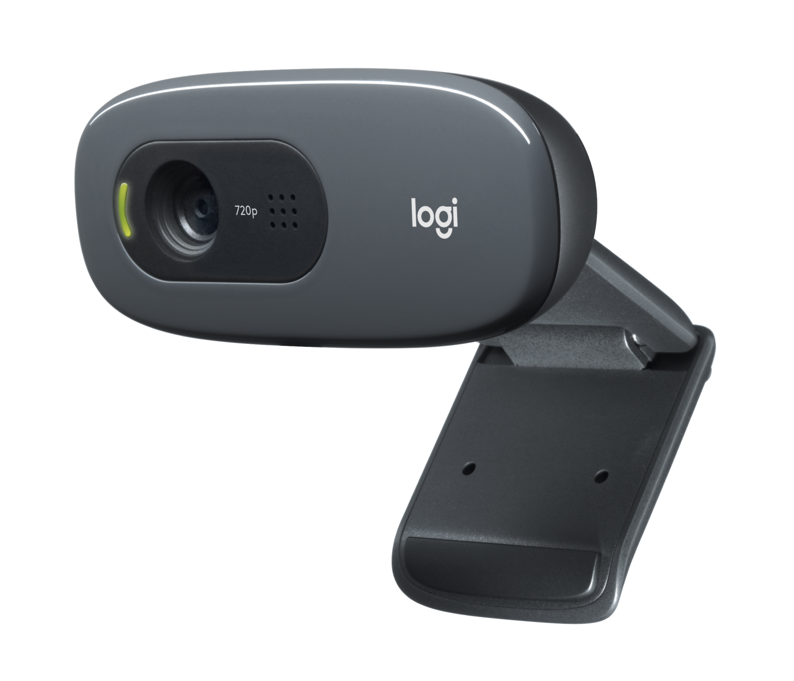

# Lab 3: Teleoperation, LeRobot Dataset & Action Taps

**Schedule:** Weeks 4–5 | **Part:** [Part II: Teaching the Machine](module-2-teaching-the-machine.md)
**Required Textbook Reading:** [Chapter 5: Physical Data](../../books/vol4/05_data/05_data.qmd) & [Chapter 7: Closed-Loop Evaluation](../../books/vol4/07_evaluation/07_evaluation.qmd)
**Target Competencies:** `[ ] B1 Physical Dataset Engineering & Multi-Tap Logging`
**Milestone Alignment:** Contributes to [Milestone 2](syllabus.md#sec-milestones) (End of Week 6)

---

### 1. The Physical Question
How do we collect demonstration data from human teleoperation that accurately captures the physical causality of the task without introducing distribution shift, missing action taps, or temporal leakage?

---

### 2. Hardware Setup

| Component | Station Function | Technical Details | Visual Reference |
|:---|:---|:---|:---:|
| **Seeed SO-101 Arm** | Follower arm under teleoperation | 6-DoF, STS3215 serial servos, resting pose return |  |
| **Logitech C270 Webcam** | Tabletop manipulation arena video capture | Overhead mount, 30 FPS RGB, synchronized with joint states |  |
| **Arduino UNO Q Board** | Multi-tap telemetry logger & bus interface | Logs `a_req`, `a_map`, `a_enf`, `a_meas` across inter-core RPC |  |

1. **Follower Arm:** Seeed SO-101 6-DoF arm connected to the Arduino UNO Q.
2. **Teleoperation Input:** Leader arm, USB gamepad (Xbox / Logitech), or keyboard teleoperator connected to the workstation or UNO Q.
3. **Overhead Webcam:** Calibrated USB camera streaming 30 FPS RGB frames of the tabletop manipulation arena.
4. **Task Objects:** Colored foam blocks (red, blue, yellow) placed in designated starting zones.

---

### 3. Step-by-Step Protocol

#### Step 1: LeRobot Teleoperation Configuration
1. Initialize the LeRobot environment on Qualcomm Linux or the host workstation.
2. Configure the robot device mapping in `lerobot/configs/robot/so101_uno_q.yaml`:
   ```yaml
   robot:
     type: manipulator
     motors:
       bus: uno_q_bridge
       port: /dev/ttyACM0
       baudrate: 1000000
     cameras:
       overhead:
         type: opencv
         index_or_path: /dev/video0
         fps: 30
         width: 640
         height: 480
   ```
3. Test smooth teleoperation: drive the SO-101 arm using the gamepad sticks or leader arm. Confirm zero lag and proportional joint response.

#### Step 2: Protocol Definition & Task Framing
1. Define the manipulation task: reach toward a target block placed randomly within a $150 \times 150\text{ mm}$ workspace zone and touch or grasp it.
2. Define explicit task boundaries:
   * Episode start: Arm in standard resting pose.
   * Episode termination: Finger contacts the block within $\pm 5\text{ mm}$.
   * Time limit: 10 seconds (300 timesteps @ 30 Hz).

#### Step 3: Dataset v3 Recording & Action Taps
1. Collect 30 successful demonstration episodes using LeRobot CLI:
   ```bash
   python lerobot/scripts/control_robot.py record \
     --robot-path lerobot/configs/robot/so101_uno_q.yaml \
     --repo-id local/so101_reach_dataset_v3 \
     --num-episodes 30 \
     --warmup-time-s 2 \
     --episode-time-s 10
   ```
2. Ensure the recording script logs the continuous 4-tap telemetry stream alongside video:
   * `observation.images.overhead` ($224 \times 224 \times 3$)
   * `observation.state` ($q_t \in \mathbb{R}^6$)
   * `action` ($a_{\text{req}} \in \mathbb{R}^6$)
   * `action_enforced` ($a_{\text{enf}} \in \mathbb{R}^6$)
   * `action_measured` ($a_{\text{meas}} \in \mathbb{R}^6$)

---

### 4. The Disturbance & Failure Test
1. **Teleoperator Jitter / Abrupt Motion:** Deliberately command a violent joystick flick during episode recording.
   * *Observation:* Verify that the STM32 MCU safety governor clamps the velocity delta ($a_{\text{enf}} \ne a_{\text{req}}$), and observe that the dataset records the difference between what was requested and what was physically enforced.
2. **Dropped Frame Injection:** Drop 3 camera frames during an active demonstration. Confirm that the LeRobot dataset reader flags missing timestamps rather than silently duplicating frames.

---

### 5. Multi-Tap Telemetry Trace
Inspect a recorded episode using LeRobot visualizer tools:
```bash
python lerobot/scripts/visualize_dataset.py --repo-id local/so101_reach_dataset_v3 --episode-index 0
```
Verify that the plots display:
* Commanded velocity ($a_{\text{req}}$) vs. MCU-limited velocity ($a_{\text{enf}}$).
* Encoder response tracking ($a_{\text{meas}}$) following $a_{\text{enf}}$ with minimal phase lag.
* Verify that the train/val/test split partitions whole episodes by session ID (never randomly shuffling frames from within the same episode).

---

### 6. Common Pitfalls & Debugging
* ⚠️ **Deadzone and Drift:** Cheap gamepads have stick drift. Calibrate an intentional 5% deadzone in software so the arm does not creep when the controller is idle.
* ⚠️ **Teleoperator Inconsistency:** Ensure the human operator moves at consistent, moderate speeds. Demonstrations with wild speed variations confuse imitation learning policies.

---

### 7. Sign-Off Criteria (The Exit Check)
To receive credit for Lab 3:
1. [ ] **Clean Dataset Artifact:** Present a valid LeRobot Dataset v3 containing 30 demonstration episodes with zero corrupted frames.
2. [ ] **4-Action-Tap Logging Proof:** Open one Parquet file and prove that `action`, `action_enforced`, and `action_measured` are logged as distinct, synchronized columns.
3. [ ] **Dataset Card Documentation:** Submit a completed Dataset Card detailing recording conditions, camera resolution, lighting lux, and train/val/test split rationale.
*Staff signs off `[ ] B1` on the team's [Competency Card](student-competencies.md).*
