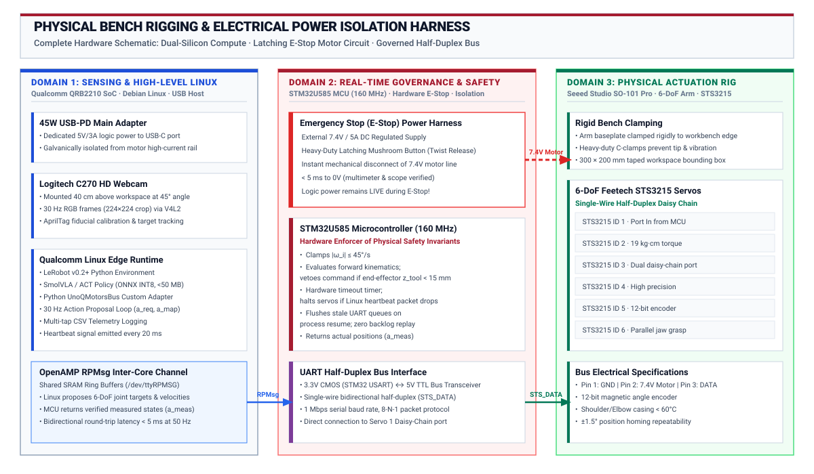

# Physical AI Station Reference Card

This page describes the standard bench station used across all Volume IV labs. Individual labs link here rather than repeating this information.

---

## The Bench Station



| Component | Role | Key Specs |
|:---|:---|:---|
| **Arduino UNO Q** | Dual-brain compute platform | Qualcomm QRB2210 Linux MPU (4 GB LPDDR4, ARM Cortex-A53) + STM32U585 MCU (160 MHz Cortex-M33); inter-core RPC via `/dev/ttyRPMSG` at 50 Hz |
| **Seeed SO-101 Arm** | 6-DoF robotic manipulator | 6× Feetech STS3215 serial bus smart servos; 3D-printed rigid structure; 19 kg·cm stall torque per joint; 12-bit magnetic contactless encoders (±1.5° repeatability) |
| **Logitech C270 Webcam** | Overhead visual sensor | 720p USB UVC camera; rigid mount at 45° oblique perspective; 30 Hz capture at 224 × 224 RGB via V4L2; locked auto-exposure and white balance |
| **7.4V / 5A DC Supply** | Dedicated servo motor power | Regulated DC bench supply with barrel jack to STS3215 daisy-chain bus; fully isolated from the logic rail; common star-ground with UNO Q |
| **45W USB-C PD Adapter** | Logic and compute power | Powers QRB2210 Linux, STM32 MCU, and USB peripherals; fully independent from the motor power rail; continues operating during motor power cutoff |
| **Workbench Clamp** | Physical mount and safety boundary | Arm baseplate clamped rigidly to workbench edge with heavy-duty C-clamps; 300 × 200 mm taped workspace boundary; zero base rocking under max payload |
| **Foam Block Targets** | Manipulation task objects | Compliant colored foam blocks (red, blue, yellow) for safe pick-and-place demonstrations; placed within the marked workspace zone |

---

## Three Engineering Rules

These invariants apply to every lab and every experiment:

> **Rule 1 — Dual-Power Isolation.** Actuator bus power (7.4V DC) must never flow through the compute logic rails. The two supplies share only a common star ground. Motor inductive spikes cannot reach the CPU.

> **Rule 2 — Single Command Path.** The Linux host must NEVER have a physical, electrical, or software bypass directly to the servo bus. All motor commands flow exclusively through the STM32 MCU, which evaluates and permits each proposal before forwarding it to the STS3215 bus.

> **Rule 3 — Strict Separation of Concerns.** Linux proposes intent. The MCU governs physical reality. A human operator can always cut motor power independently without affecting system telemetry or logging.

---

## The Four Action Taps

Every lab logs physical actions at four observation points along the authority chain. This multi-tap schema enables students to diagnose exactly where a failure, delay, or safety intervention occurred.

| Tap | Variable | Origin | What It Records |
|:---:|:---|:---|:---|
| **1** | `a_req` | Qualcomm Linux (policy output) | The raw action proposed by the neural policy or human teleoperator |
| **2** | `a_map` | Qualcomm Linux (bus adapter) | The mapped joint-space command after coordinate transformation, sent over inter-core RPC |
| **3** | `a_enf` | STM32 MCU (safety governor) | The enforced command after velocity clamping, geofence checking, and joint-limit evaluation |
| **4** | `a_meas` | STS3215 servo encoders | The measured physical joint angles after the servo has moved (ground truth) |

**Diagnostic principle:** When `a_enf ≠ a_req`, the safety governor exercised active authority. When `a_meas ≠ a_enf`, the physical plant did not track the command (mechanical compliance, stall, or external disturbance).

---

## Standard Telemetry CSV Format

All labs log telemetry in a common CSV format:

```csv
timestamp_us, a_req_j1, ..., a_req_j6, a_map_j1, ..., a_map_j6, a_enf_j1, ..., a_enf_j6, a_meas_j1, ..., a_meas_j6, cam_frame_id, watchdog_ok
```

Timestamps are STM32 SysTick microseconds. Camera frame IDs enable temporal alignment with the RGB video stream.
