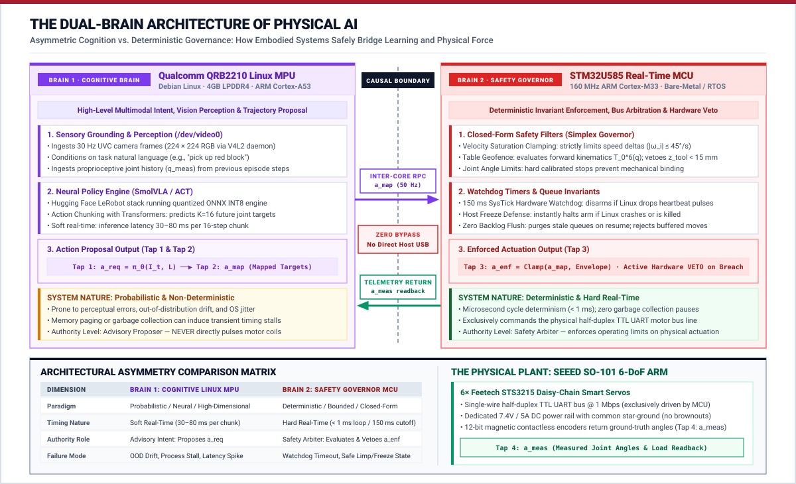
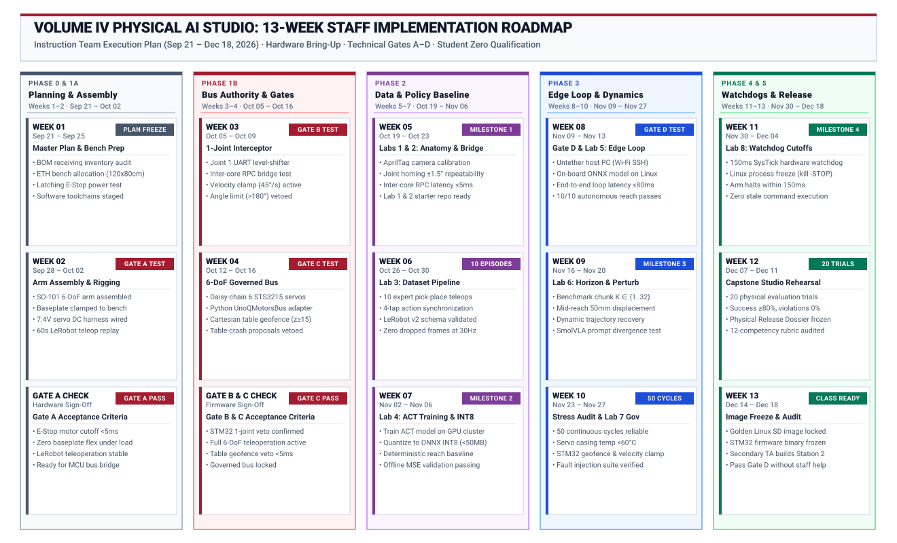

# Volume IV Physical AI Studio: Staff Implementation Master Plan
### Comprehensive 13-Week Execution Roadmap (September 21 – December 18, 2026)

**Target Audience:** Postdoctoral Researcher (Andrea, ETH Zurich) & Course Instruction Staff
**Course Lead:** Prof. Vijay Janapa Reddi
**Target Semester:** Spring 2027 Studio Launch
**Target Platform:** Arduino UNO Q ("Unikue" Qualcomm QRB2210 Linux + STM32U585 MCU) · Seeed Studio SO-101 Arm · Hugging Face LeRobot · SmolVLA & ACT
**Core Reference Architecture:** [Master Landing Page](../README.md) · [Course Syllabus](../curriculum/syllabus.md) · [Pre-Flight Guide](feasibility-plan.md) · [12-Competency Matrix](../curriculum/student-competencies.md)

---

## 1. Executive Summary & Operational Mandate

This master plan governs the 13-week physical implementation, hardware bring-up, and pedagogical qualification period between **Monday, September 21, 2026**, and **Friday, December 18, 2026**.

::: {.callout-note}
### The "Student Zero" Methodology
To ensure every student station operates flawlessly when the studio launches in Spring 2027, the instruction team acts as **Student Zero**. Before any student touches the bench, staff personally unboxes, mounts, wires, programs, and qualifies every single component, lab brief, and automated test.
:::

::: {.callout-important}
### Studio Focus: The Dual-Brain Architecture
This studio teaches students to build and evaluate physical AI systems across two distinct computing layers:
1. **The Cognitive Brain (Qualcomm QRB2210 Linux MPU):** High-capacity neural policies (SmolVLA, ACT) that ingest sensory camera streams ($I_t$) and propose multi-step action trajectory chunks ($a_{\text{req}}$).
2. **The Safety Governor (STM32U585 Real-Time MCU):** Deterministic safety invariants (velocity saturation clamping $\omega_i \le 45^\circ/\text{s}$, geometric table geofencing $z_{\text{tool}} \ge 15\text{ mm}$, and $150\text{ ms}$ communication watchdogs) that arbitrate, permit, or veto proposals ($a_{\text{enf}}$) before they reach physical motor coils ($a_{\text{meas}}$).

Students build, measure, and defend the **Causal Permission Boundary** connecting the two processors over an internal RPC bridge with zero unmonitored host bypass.
:::

The primary objectives for this 13-week execution window:
1. **Week 1 Planning & Bench Preparation:** Finalize the master curriculum plan, audit the Bill of Materials (BOM), allocate dedicated workbench space at ETH Zurich, and verify electrical power rails before unboxing.
2. **Hardware Bring-Up & Validation:** Assemble, wire, verify, and qualify one complete **Golden Reference Station**, validating the **Four Hardware Validation Steps (Steps 1–4)**.
3. **End-to-End Curriculum Qualification:** Execute all **8 Hands-On Student Labs** from scratch, producing verified golden artifacts, starter scripts, reference datasets, and calibration profiles.
4. **Software & Firmware Freeze:** Compile and lock the **Golden Qualcomm Linux Image** and **STM32 Firmware Binary**.
5. **Independent Replication Audit:** Have a secondary researcher or teaching assistant build Station 2 from scratch using only the staff documentation to ensure seamless class deployment.

---

## 2. Master 13-Week Execution Roadmap

The 13-week schedule is organized into six logical phases across five sprints, shifting physical assembly into Week 2 to allow Week 1 to focus entirely on architecture alignment, BOM audit, and bench preparation:

---

## 3. Physical Hardware Stack & Bench Architecture

The studio relies on an open, modular, and safety-hardened hardware stack designed specifically for edge Physical AI.

### Physical AI Hardware Platform Overview

| Component Image | System Pillar & Hardware | Key Technical Specifications | Core Function in Studio |
|:---:|:---|:---|:---|
|  | **Dual-Silicon Compute** `Arduino UNO Q` | • Qualcomm QRB2210 Linux Application MPU (Debian) • STM32U585 Real-Time Microcontroller (160 MHz ARM Cortex-M33) • OpenAMP RPMsg shared-SRAM inter-core bridge • Dedicated 45W USB-PD logic power | Runs Hugging Face LeRobot and SmolVLA/ACT neural policies on Linux; delegates physical motor bounds and safety governance to STM32. |
|  | **Manipulator Plant** `Seeed Studio SO-101 Pro` | • 6-DoF open-source follower arm linkage • Rigid benchtop clamp mount (zero tip under load) • Parallel-jaw gripper end-effector • $300 \times 200\text{ mm}$ marked manipulation workspace | Provides the physical body for imitation learning, human teleoperation demonstration recording, and autonomous block reach. |
|  | **Smart Serial Actuator** `Feetech STS3215 Bus Servo` | • 19 kg·cm stall torque at 7.4V • 12-bit contactless magnetic angle encoder • 1 Mbps half-duplex UART daisy-chain protocol • Real-time angular position and load telemetry readback | Translates commanded joint action chunks ($a_{\text{enf}}$) into calibrated physical motion and returns measured angles ($a_{\text{meas}}$). |
|  | **Vision Sensor** `Logitech C270 HD Webcam` | • 720p 30 Hz RGB video ingestion via Linux V4L2 • Mounted 40 cm overhead at 45° oblique perspective • AprilTag 36h11 extrinsic calibration target • Locked exposure and white balance to avoid visual drift | Ingests sensory frames $o_t \in \mathbb{R}^{3 \times 224 \times 224}$ for closed-loop visual feedback and dynamic disturbance recovery. |

### Complete Bench Rigging & Electrical Bus Interface

Before assembling the physical arm or connecting motor power, review the electrical wiring schematic. The architecture uses clean galvanic separation between digital computing logic and high-current actuator power:

::: {.callout-note}
### Dual Power Supply Engineering Rationale
To ensure bulletproof reliability and avoid mysterious CPU brownout resets:
* **Digital Logic Power:** The Arduino UNO Q and USB camera are powered exclusively through the USB-C port via the **45W USB-PD adapter**.
* **Actuator Power:** The 6× STS3215 smart servos are powered by an independent, regulated **7.4V / 5A DC bench power supply** connected directly to the servo bus rail.
* **Common Ground Reference:** The DC motor power supply ground and Arduino UNO Q ground are connected together into a solid star-ground reference. Motor current NEVER passes through board headers.
* **Safety Invariant:** Software faults, servo stalls, or power cuts on the motor rail will never reset the Qualcomm Linux processor or disrupt telemetry logging.
:::

---

## 4. Sprint-by-Sprint Weekly Implementation Breakdown

### Sprint 0: Architecture Alignment & Bench Preparation (Week 1)
**Focus:** Curriculum plan finalization, Bill of Materials audit, dedicated bench allocation, and electrical power verification.

#### Week 1 (Sep 21 – Sep 25, 2026): Master Plan Alignment & Bench Preparation
* **Primary Objective:** Finalize the master execution plan, complete the BOM inventory, allocate the physical workbench, and verify laboratory power systems.
* **Tasks:**
  - [ ] Review master curriculum architecture: [Master Landing Page](../README.md), [Course Syllabus](../curriculum/syllabus.md), [Pre-Flight Guide](feasibility-plan.md), [8 Lab Briefs](../labs/lab-01-boundary.md), and [Capstone Studio](../labs/lab-capstone-studio.md).
  - [ ] Inventory delivered hardware packages: Seeed Studio SO-101 Pro arm kit, Arduino UNO Q (4GB RAM), 45W USB-PD power supply, USB 3.0 powered hub, Logitech C270 camera, 7.4V/5A DC motor power supply, UART level-shifter, and wiring harnesses.
  - [ ] Dedicate a clean $120 \times 80\text{ cm}$ workbench at ETH Zurich with rigid table-edge clamping surface, overhead camera mount fixture, and anti-static mat.
  - [ ] Bench-test the regulated 7.4V DC motor supply and 45W USB-PD adapter with a digital multimeter to confirm clean voltage levels and common star-ground reference.
  - [ ] Stage bench workstation software: install Hugging Face LeRobot dependencies, PyTorch ARM64 toolchains, Arduino App Lab, and ONNX Runtime developer packages.
* **Weekly Deliverable:** Finalized master checklist, verified hardware inventory audit, workbench setup ready for assembly, and electrical schematic verification.

---

### Sprint 1: Mechanical Bring-Up & Validation Steps 1–3 (Weeks 2–4)
**Focus:** Mechanical assembly, electrical isolation, and establishing the governed servo bus path.

#### Week 2 (Sep 28 – Oct 2, 2026): Hardware Bring-Up, Arm Assembly & Step 1 (USB Teleop)
* **Primary Objective:** Assemble the physical arm, establish power safety isolation, and achieve native teleoperation.
* **Tasks:**
  - [ ] Assemble Seeed Studio SO-101 6-DoF follower arm from kit components.
  - [ ] Clamp arm baseplate rigidly to workbench using heavy-duty C-clamps.
  - [ ] Wire external 7.4V/5A DC motor power supply directly to STS3215 servo power rail with common ground to UNO Q.
  - [ ] Connect SO-101 arm to workstation via USB BusLinker; install Hugging Face LeRobot (`pip install lerobot`).
  - [ ] **Validation Step 1 Check:** Run joint calibration and execute 60-second teleoperation replay (`lerobot-replay`).
* **Weekly Deliverable:** Video proof of Step 1 teleoperation + voltage rail multimeter verification.

#### Week 3 (Oct 5 – Oct 9, 2026): Inter-Core Bridge Wiring & Step 2 (1-Joint Interceptor)
* **Primary Objective:** Route servo communication through the STM32 and prove real-time command veto.
* **Tasks:**
  - [ ] Disconnect Joint 1 (Base Yaw) from USB BusLinker; connect single-wire half-duplex UART line to STM32U585 USART via level-shifter.
  - [ ] Flash baseline interceptor firmware to STM32 using Arduino App Lab.
  - [ ] Write Python bridge script on Qualcomm Linux transmitting target commands across `/dev/ttyRPMSG`.
  - [ ] **Validation Step 2 Check:** Verify STM32 permits valid commands ($10^\circ$ at $20^\circ/\text{s}$), clamps over-speed commands ($> 45^\circ/\text{s}$), and refuses out-of-range targets ($> 180^\circ$).
* **Weekly Deliverable:** Telemetry log showing MCU clamping and rejection of out-of-bounds joint commands.

#### Week 4 (Oct 12 – Oct 16, 2026): Full 6-DoF Governed Arm & Step 3 (Full Integration)
* **Primary Objective:** Scale the governed bus to all 6 joints and achieve full LeRobot teleoperation under MCU control.
* **Tasks:**
  - [ ] Daisy-chain all 6 STS3215 servos into the STM32 USART bus line.
  - [ ] Implement the 60-line Python `UnoQMotorsBus` custom LeRobot adapter.
  - [ ] Program Cartesian forward kinematics check in STM32 firmware; implement table collision geofence ($z_{\text{tool}} \ge 15\text{ mm}$).
  - [ ] **Validation Step 3 Check:** Run full 6-DoF LeRobot teleoperation through the governed adapter; verify that table-crash command proposals are actively vetoed by the STM32.
* **Weekly Deliverable:** `UnoQMotorsBus.py` source code + demonstration of live table-crash veto.

---

### Sprint 2: Sensing, Data Collection & Policy Baseline (Weeks 5–7)
**Focus:** Sensor calibration, human demonstration recording, and baseline imitation policy training.

#### Week 5 (Oct 19 – Oct 23, 2026): "Student Zero" Run for Labs 1 & 2
* **Primary Objective:** Qualify Lab 1 (Causal Boundary) and Lab 2 (Sensing & Bridge).
* **Tasks:**
  - [ ] Mount UVC USB webcam at $45^\circ$ oblique angle, $40\text{ cm}$ overlooking workspace; tape $300 \times 200\text{ mm}$ boundary.
  - [ ] Write and test AprilTag camera calibration script (`calibrate_camera.py`).
  - [ ] Write joint homing calibration script; verify $\pm 1.5^\circ$ repeatability across 20 cycles.
  - [ ] Benchmark inter-core RPC latency: measure round-trip times across 1,000 packets; confirm $\le 5\text{ ms}$ at $50\text{ Hz}$.
  - [ ] Package student starter assets: `wiring_diagram_golden.pdf`, `calibrate_camera.py`, `test_bridge_latency.py`.
* **Weekly Deliverable:** Milestone 1 qualification package (Lab 1 & 2 starter repo + reference calibration card).

#### Week 6 (Oct 26 – Oct 30, 2026): "Student Zero" Run for Lab 3 (Teleoperation & Datasets)
* **Primary Objective:** Record golden demonstration dataset in standardized LeRobot v2 schema.
* **Tasks:**
  - [ ] Establish reproducible pick-and-place task: pick $30\text{ mm}$ foam cube from marked start zone and place in receptacle.
  - [ ] Record 10 expert demonstration episodes using teleoperation.
  - [ ] Synchronize $30\text{ Hz}$ RGB frames ($224 \times 224$) with the 4 action taps (`a_req`, `a_map`, `a_enf`, `a_meas`).
  - [ ] Format into `LeRobotDataset` v2 schema; verify zero dropped frames and correct chunk indexing.
  - [ ] Package student starter scripts: `teleop_record.py`, `inspect_dataset.py`, `dataset_golden_10ep/`.
* **Weekly Deliverable:** Published 10-episode reference dataset with complete dataset card and inspection plots.

#### Week 7 (Nov 2 – Nov 6, 2026): "Student Zero" Run for Lab 4 & Milestone 2
* **Primary Objective:** Train baseline ACT policy, quantize to ONNX INT8, and build heuristic baseline.
* **Tasks:**
  - [ ] Implement deterministic heuristic reach script (`heuristic_reach.py`) for baseline comparison.
  - [ ] Train Action Chunking with Transformers (ACT) model on workstation/Colab using the 10 golden episodes ($\le 45\text{ min}$ training).
  - [ ] Quantize trained PyTorch model to ONNX INT8 format (`export_onnx_quantized.py`).
  - [ ] Verify model file size is $< 50\text{ MB}$ and validates on held-out evaluation episodes.
  - [ ] Package starter assets: `train_act_baseline.py`, `pretrained_act_int8.onnx`, `heuristic_reach.py`.
* **Weekly Deliverable:** Milestone 2 qualification package (trained checkpoint + offline MSE evaluation curves).

---

### Sprint 3: Untethered Edge Deployment & Dynamic Adaptation (Weeks 8–10)
**Focus:** Natively running neural policies on Qualcomm Linux, action chunk horizons, and closed-loop disturbance recovery.

#### Week 8 (Nov 9 – Nov 13, 2026): Validation Step 4 & Lab 5 (Untethered Autonomous Reach)
* **Primary Objective:** Run closed-loop visual reach completely untethered on the Arduino UNO Q.
* **Tasks:**
  - [ ] Transfer `policy_int8.onnx` and `pai_edge_runtime.py` to Qualcomm Linux storage.
  - [ ] Unplug host PC tether; board runs exclusively on 45W USB-PD supply with webcam and governed arm.
  - [ ] Launch autonomous runtime via SSH over Wi-Fi:
    $$\text{Webcam Frames } (30\text{ Hz}) \longrightarrow \text{ONNX Policy } (<45\text{ ms}) \longrightarrow \text{RPC Bridge } (<5\text{ ms}) \longrightarrow \text{STM32 Motion}$$
  - [ ] **Validation Step 4 Check:** Verify end-to-end loop latency $T_{\text{total}} \le 80\text{ ms}$; arm autonomously reaches foam block at arbitrary locations across 10 trials.
  - [ ] Package starter assets: `pai_edge_runtime.py`, `telemetry_logger.py`, `sample_reach_trace.csv`.
* **Weekly Deliverable:** Step 4 verification report + multi-tap telemetry CSV of untethered reach.

#### Week 9 (Nov 16 – Nov 20, 2026): "Student Zero" Run for Lab 6 (Action Horizons & Disturbances)
* **Primary Objective:** Evaluate action chunk horizons and closed-loop disturbance recovery.
* **Tasks:**
  - [ ] Benchmark action chunk horizons: $K \in \{1, 8, 16, 32\}$. Measure tracking error and physical trajectory smoothness.
  - [ ] Test mid-trajectory disturbance: shift target block by $50\text{ mm}$ during open-loop chunk execution; measure recovery time.
  - [ ] Evaluate language conditioning: run test prompts ("pick red block" vs "pick blue block") on SmolVLA checkpoint; verify trajectory divergence.
  - [ ] Package starter assets: `benchmark_chunking.py`, `disturbance_eval.py`, `smolvla_eval_harness.py`.
* **Weekly Deliverable:** Milestone 3 qualification package (horizon comparison plots + disturbance recovery video).

#### Week 10 (Nov 23 – Nov 27, 2026): Mid-Term Rig Reliability & "Student Zero" Run for Lab 7 (MCU Safety Governor)
* **Primary Objective:** Conduct continuous stress testing and program the real-time STM32 safety governor.
* **Tasks:**
  - [ ] Run 50 continuous autonomous pick-and-place cycles on the Golden Station.
  - [ ] Measure STS3215 servo casing temperatures on shoulder ($J_2$) and elbow ($J_3$) joints; verify temperature stays below $60^\circ\text{C}$.
  - [ ] Profile V4L2 camera buffer over 2 hours of continuous streaming; confirm zero memory leaks or dropped frame buffers.
  - [ ] Finalize STM32 firmware for joint velocity saturation ($\omega_i \le 45^\circ/\text{s}$) and Cartesian floor geofence ($z \ge 15\text{ mm}$).
  - [ ] Write Python fault injection script (`inject_table_crash.py`) that sends deliberate downward velocity spikes and out-of-bound targets.
  - [ ] Demonstrate real-time MCU veto: verify that illegal proposals are rejected in $< 5\text{ ms}$ while legal joints continue moving safely.
  - [ ] Package starter assets: `stm32_governor_firmware/`, `inject_table_crash.py`, `veto_audit_golden.csv`.
* **Weekly Deliverable:** 50-cycle reliability & thermal profile report + Lab 7 qualification package (firmware source + live veto audit).

---

### Sprint 4: Real-Time Governance & Fault Hardening (Week 11)
**Focus:** Microcontroller safety boundary enforcement, hardware watchdogs, and zero-backlog recovery.

#### Week 11 (Nov 30 – Dec 4, 2026): "Student Zero" Run for Lab 8 & Milestone 4
* **Primary Objective:** Hardware watchdog timeout and fail-safe cutoff under system crash.
* **Tasks:**
  - [ ] Program $150\text{ ms}$ hardware SysTick watchdog timer in STM32 firmware.
  - [ ] Inject Linux process freeze (`kill -STOP <pid>`) during active arm motion.
  - [ ] Verify that the arm decelerates to a safe stop within $150\text{ ms}$ of heartbeat loss.
  - [ ] Resume Linux process (`kill -CONT <pid>`); verify that the MCU flushes stale UART queues and executes **zero stale commands**.
  - [ ] Package starter assets: `stm32_watchdog_firmware/`, `fault_injection_suite.py`, `recovery_verification.py`.
* **Weekly Deliverable:** Milestone 4 complete qualification package (watchdog timing trace + zero-backlog proof).

---

### Sprint 5: Capstone Rehearsal & Class-Set Duplication (Weeks 12–13)
**Focus:** Capstone defense simulation, golden disk image freeze, and independent bench replication.

#### Week 12 (Dec 7 – Dec 11, 2026): Capstone Rehearsal & 20-Trial Release Protocol
* **Primary Objective:** Simulate the final Capstone Milestone 5 defense protocol.
* **Tasks:**
  - [ ] Define official Capstone evaluation benchmark: 20 witnessed physical trials across held-out target locations and surface obstacles.
  - [ ] Execute 20 consecutive trials as "Student Zero"; record success rate (target $\ge 80\%$) and safety violations (must be $0\%$).
  - [ ] Prepare Claim-Argument-Evidence (CAE) Physical Release Dossier template for students.
  - [ ] Audit complete student-facing rubric against the 12 competencies (A1–D3).
* **Weekly Deliverable:** Reference Capstone Physical Release Dossier + 20-trial unedited video archive.

#### Week 13 (Dec 14 – Dec 18, 2026): Golden Image Freeze & Independent Replication Audit
* **Primary Objective:** Freeze software images and have a second staff member replicate Station 2 from scratch.
* **Tasks:**
  - [ ] Build Golden Qualcomm Linux SD card image: pre-installed Debian, LeRobot v0.2+, PyTorch ARM64, ONNX Runtime, V4L2 utilities, pre-cloned course repository.
  - [ ] Freeze STM32 pre-flashed binary for one-click flashing via Arduino App Lab.
  - [ ] **Independent Replication Test:** Have a secondary researcher or teaching assistant unbox a second UNO Q and SO-101 arm, follow the staff setup guide, flash the images, and achieve standalone reach.
  - [ ] Assemble spare parts buffer: 4x spare STS3215 servos, 2x spare webcams, replacement 3D-printed brackets, multimeters.
  - [ ] Final sign-off review: certify lab readiness for Spring 2027 studio launch.
* **Weekly Deliverable:** Golden `.img` file uploaded to lab server + signed Replication Audit Report.

---

## 5. Master Deliverables & Weekly Technical Sign-Off Checklist

| Week & Date Range | Milestone / Sprint Phase | Primary Physical AI Deliverables | Hardware Verification & Acceptance Criteria | Status |
|:---|:---|:---|:---|:---:|
| **W01: Sep 21 – Sep 25** | Master Plan & Prep | • Complete curriculum review & syllabus freeze • BOM inventory & receiving audit • Dedicated bench allocation & power rail check | Multimeter confirmation of 7.4V DC & 45W USB-PD rails; complete toolchain staged | `[ ]` |
| **W02: Sep 28 – Oct 02** | Hardware Bring-Up | • Mechanical arm assembled & clamped • 7.4V motor power harness verified • **Step 1:** LeRobot USB teleoperation passing | 60-second teleoperation replay executed without communication dropout | `[ ]` |
| **W03: Oct 05 – Oct 09** | Bus Authority | • STM32 UART level-shifter circuit wired • Inter-core RPC bridge test script • **Step 2:** 1-joint velocity clamp & veto | Joint 1 clamped at $45^\circ/\text{s}$; out-of-range targets ($> 180^\circ$) rejected | `[ ]` |
| **W04: Oct 12 – Oct 16** | 6-DoF Integration | • `UnoQMotorsBus` Python adapter deployed • Table geofence ($z \ge 15\text{ mm}$) programmed • **Step 3:** Governed 6-DoF teleoperation | Full 6-DoF teleoperation functional; downward table crash actively vetoed | `[ ]` |
| **W05: Oct 19 – Oct 23** | **Milestone 1:** Anatomy | • Lab 1 (Boundary) qualified by Student Zero • Lab 2 (Sensing & Bridge) qualified • AprilTag camera & joint offset calibration | Joint repeatability $\pm 1.5^\circ$; inter-core bridge round-trip $\le 5\text{ ms}$ at $50\text{ Hz}$ | `[ ]` |
| **W06: Oct 26 – Oct 30** | Dataset Pipeline | • Lab 3 (Teleoperation) qualified • 10-episode pick-and-place reference dataset • Standardized LeRobot v2 schema validated | Zero dropped frames at $30\text{ Hz}$; all 4 action taps synchronized | `[ ]` |
| **W07: Nov 02 – Nov 06** | **Milestone 2:** Training | • Lab 4 (Baseline & Export) qualified • ACT model trained on workstation GPU • Quantized ONNX INT8 policy exported ($< 50\text{ MB}$) | Offline MSE validation curves clean; model file size $< 50\text{ MB}$ | `[ ]` |
| **W08: Nov 09 – Nov 13** | Edge Inference | • **Step 4:** Untethered reach on Qualcomm Linux • End-to-end loop latency $T_{\text{total}} \le 80\text{ ms}$ • Lab 5 (Autonomous Reach) qualified | Host PC tether disconnected; 10/10 autonomous reach completions | `[ ]` |
| **W09: Nov 16 – Nov 20** | **Milestone 3:** Dynamics | • Lab 6 (Action Horizons) qualified • Horizon benchmark curves ($K=1..32$) • Disturbance recovery mid-trajectory verified | Measurable trajectory adaptation under $50\text{ mm}$ block displacement | `[ ]` |
| **W10: Nov 23 – Nov 27** | Stress & Governor | • 50-cycle continuous autonomous reliability test • Servo thermal profiling ($< 60^\circ\text{C}$) • Lab 7 (Safety Governor) qualified | Servo casing $< 60^\circ\text{C}$; live table-crash proposals vetoed in $< 5\text{ ms}$ | `[ ]` |
| **W11: Nov 30 – Dec 04** | **Milestone 4:** Cutoffs | • Lab 8 (Watchdog Cutoffs) qualified • $150\text{ ms}$ hardware SysTick watchdog verified • Linux process freeze & zero backlog proved | Arm halts in $\le 150\text{ ms}$ upon heartbeat loss; zero stale commands on resume | `[ ]` |
| **W12: Dec 07 – Dec 11** | Capstone Rehearsal | • Capstone Studio protocol simulated • 20 witnessed physical trials executed • Claim-Argument-Evidence dossier template | $\ge 80\%$ task success rate across 20 trials with zero safety violations | `[ ]` |
| **W13: Dec 14 – Dec 18** | **Final Release Freeze** | • Golden Linux SD card image compiled • STM32 baseline binary locked • Secondary TA replication test completed | Independent replication on Station 2 passes standalone reach without staff intervention | `[ ]` |

---

## 6. Weekly Execution & Reporting Protocol

To ensure rapid resolution of hardware bugs and maintain transparent progress toward the December deadline:

1. **Weekly Friday Check-In (Every Friday by 17:00 CET):**
   - Submit a structured weekly update via GitHub Issue / PR containing:
     - **Status:** `[ON TRACK]` / `[DELAYED]` / `[BLOCKED]`
     - **Completed Tasks:** Checkboxes matching the weekly sprint table above.
     - **Evidence Links:** Commit hash, telemetry CSV, model evaluation curve, or uncut video clip.
     - **Active Blockers:** Detailed diagnostic logs of any hardware/timing failure.
2. **Bi-Weekly Physical Sync:**
   - 30-minute bench review demonstrating the hardware bring-up steps and milestone deliverables on live hardware.
3. **Escalation Trigger:**
   - If any bring-up step (Steps 1–4) is delayed by more than 4 business days, activate the pre-approved fallback matrix in [`feasibility-plan.md`](feasibility-plan.md#sec-fallbacks) immediately.
