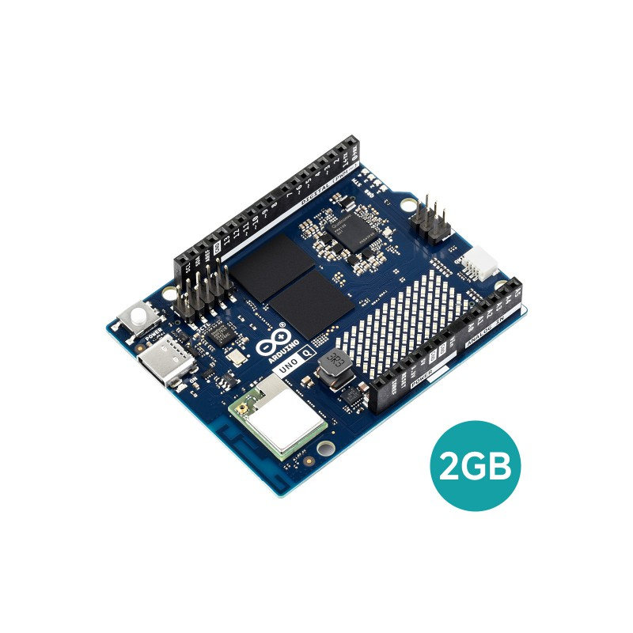
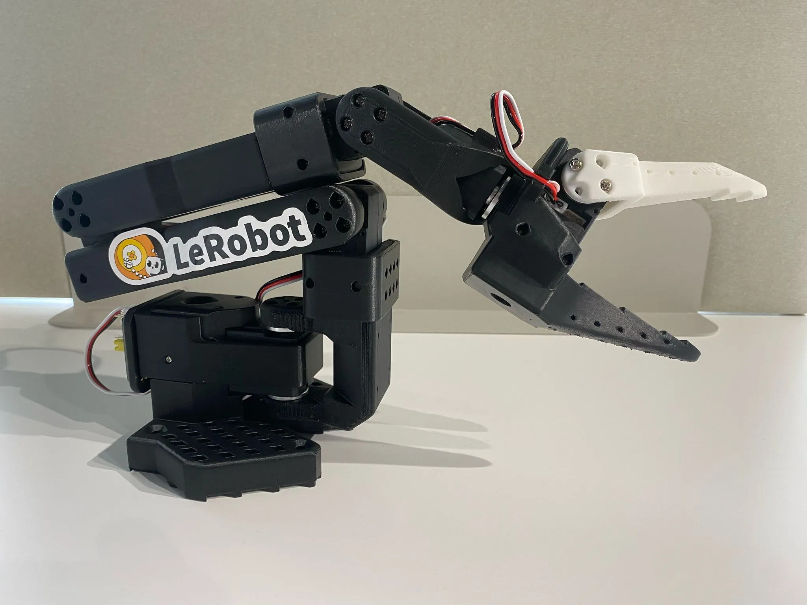
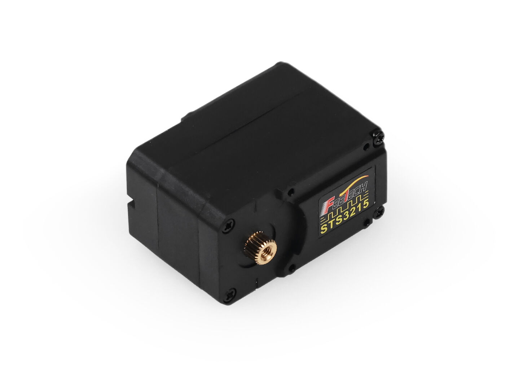
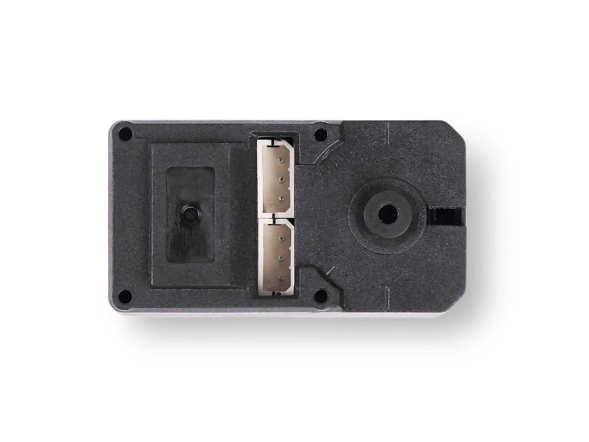
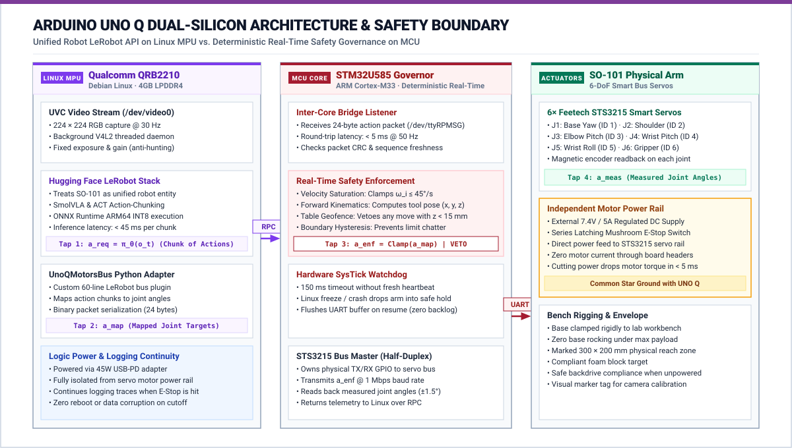
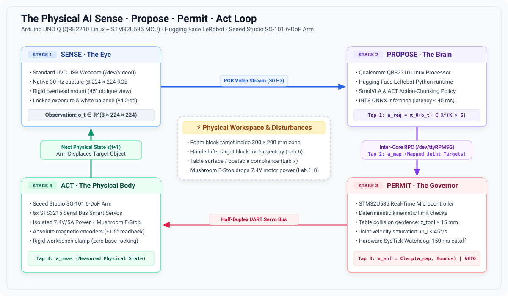
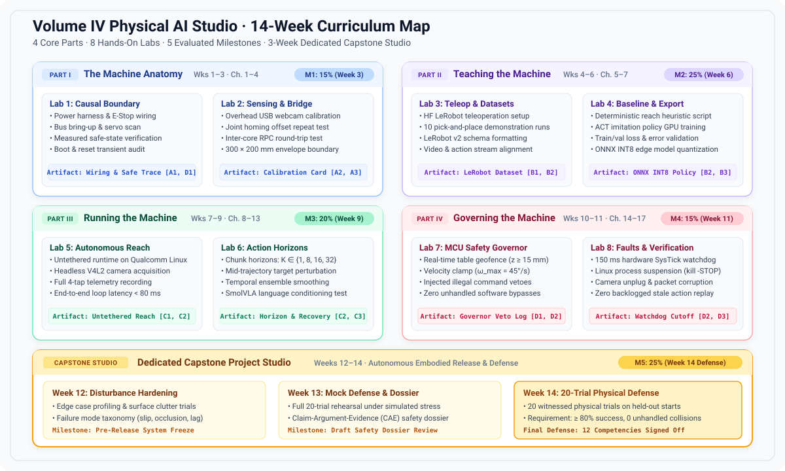

# Master Course Syllabus: Physical AI Systems Studio

**Course Title:** Physical AI Systems: Machine Learning Systems That Sense and Act
**Course Code:** MLSYS-401 / ETH-PAI / SEAS-CS249r
**Term:** 14-Week Laboratory Seminar & Project Studio
**Instructors:** Prof. Vijay Janapa Reddi (Harvard University) & Dr. Andrea (ETH Zurich / Lab Director)
**Primary Textbook:** [MLSysBook Volume IV: Physical AI Systems](https://mlsysbook.ai/vol4/)
**Studio Repository:** [github.com/harvard-edge/MLSysBook-vol4-labs](https://github.com/harvard-edge/MLSysBook-vol4-labs)

---

## 1. Course Overview & The Core Premise

> **"Physical AI begins where computation stops being symbolic and becomes physical force."**

In traditional digital AI, an algorithm processes tokens or pixels. Mistakes are harmless, symbolic, and easily undone with a software reset. In **Physical AI**, an algorithm commands real electrical currents to actuators possessing mass, velocity, inertia, and momentum. If the model makes a mistake, physical things collide, tear, or break. **You cannot `Ctrl+Z` physics.**

This course teaches how to build, deploy, evaluate, and govern an embodied machine. Students learn to take high-capacity neural policies (Vision-Language-Action models like **Hugging Face SmolVLA and ACT**), deploy them onto an edge processor (**Arduino UNO Q Qualcomm Linux MPU**), and safely delegate physical actuation authority to a 6-DoF robotic arm (**Seeed Studio SO-101**) within an independent, deterministic microcontroller safety governor (**STM32U585 MCU**).

---

## 2. Hardware & Software Components

Each bench station provides an integrated physical and computational workstation:

### The Hardware Platform

| Component | Role in Lab Bench Station | Technical Specification | Visual Reference |
|:---|:---|:---|:---:|
| **Arduino UNO Q ("Unikue")** | Dual-silicon brain: Linux MPU + Real-time MCU | Qualcomm QRB2210 (Debian Linux) + STM32U585 MCU, inter-core RPC, hardware watchdog |  |
| **Seeed Studio SO-101 Arm** | 6-DoF physical robot manipulator | 6 revolute joints, 3D-printed rigid structure, calibrated workspace boundary |  |
| **Feetech STS3215 Smart Servos** | Daisy-chained serial bus actuators | 12-bit magnetic encoder ($0.088^\circ$), 19 kg·cm stall torque @ 7.4V, 1 Mbps TTL UART |  |
| **Dual Power Infrastructure** | Decoupled logic and motor power rails | 45W USB-C PD (Logic) + Dedicated 7.4V/5A DC (Servos) with common star ground |  |

1. **The Dual-Brain Compute Board (Arduino UNO Q "Unikue"):**
   * *Qualcomm Dragonwing QRB2210 MPU:* Quad-core 64-bit ARM Cortex-A53 running Debian Linux. Ingests USB video frames, runs quantized ONNX policy inference, and packages action chunk proposals ($a_{\text{req}}$).
   * *STM32U585 Real-Time Microcontroller (MCU):* Dedicated ARM Cortex-M33 running bare-metal/RTOS firmware. Mediates the half-duplex TTL motor bus, enforces hard real-time safety limits ($a_{\text{enf}}$), and manages watchdog timers.
   * *Inter-Core Bridge:* High-speed internal RPC communication port connecting Linux to the MCU with sub-millisecond latency.
2. **The Robot Body (Seeed Studio SO-101 6-DoF Follower Arm):**
   * 6× Feetech STS3215 serial bus smart servos in a daisy-chained TTL half-duplex configuration at 1 Mbps.
   * Bidirectional telemetry reporting measured joint angles ($q$), angular velocity ($\dot{q}$), motor temperature, and mechanical load/torque.
3. **The Visual Sensor:**
   * Standard 720p/1080p UVC USB webcam mounted on a rigid overhead/oblique clamp observing the workspace.
4. **Electrical & Safety Infrastructure:**
   * Regulated 7.4V/5A DC motor power supply separate from logic power (45W USB-C PD).
   * Switched motor power toggle sharing a common star ground with the Arduino UNO Q.

### The Software Spine
1. **Hugging Face LeRobot:** Open-source robot learning framework handling teleoperation capture, data formatting, and deployment loops.
2. **LeRobot Dataset v3 Format:** Standardized Parquet + MP4 multi-modal episode storage logging all four action taps (`a_req`, `a_map`, `a_enf`, `a_meas`).
3. **Target Neural Policy Architectures:**
   * *SmolVLA:* Compact Vision-Language-Action policy conditioned on camera pixels, joint states, and natural language prompts.
   * *ACT (Action Chunking with Transformers):* Multi-step joint trajectory prediction policy.
4. **Edge Runtime:** ONNX Runtime / INT8 quantization optimized for Qualcomm ARM Cortex-A53 execution providers.



---

## 3. Pedagogy & Studio Philosophy

1. **Bench-First Studio Learning:** There are no passive lecture halls. Conceptual systems principles are grounded immediately in physical experiments at the bench.
2. **The S·P·A Causal Feedback Loop:** Every physical episode connects:
   $$\text{Sense (Camera/Telemetry)} \longrightarrow \text{Propose (Linux VLA)} \longrightarrow \text{Permit (STM32 MCU)} \longrightarrow \text{Act (SO-101 Servos)}$$



3. **The Three-Part Scope Test:** A lab submission is rejected if it merely runs a classifier on a screen or wires a model to an unmonitored hardcoded script. Action must be learned, consequential, and permitted by an independent safety boundary.
4. **Adversarial Verification:** You do not prove a physical AI system works by recording a cherry-picked 5-second video. You prove it by allowing instructors and peer teams to introduce physical disturbances (lighting drops, target displacements, obstacle obstacles) and measuring whether the system recovers or safely abstains.

---

## 4. Learning Objectives (The 12 Transferable Competencies)

Students are evaluated against the [Physical AI Station Competency Card](student-competencies.md) across four balanced quadrants (**3 competencies per quadrant = 12 total**):

### Quadrant A: Measure the Plant (Physical × Characterize)
* **A1 — Plant Mechanics, Load & Safe Envelope:** Quantify kinematic degrees of freedom, mechanical travel limits, actuator load/torque saturation, power distribution, homing calibration, and de-energized safe rest state under power loss.
* **A2 — Multi-Modal Sensing, Calibration & Contact:** Calibrate multi-modal feedback streams ($T_{\text{cam}}^{\text{base}}$ and joint telemetry $q$); quantify measurement noise, mechanical backlash, contact detection, and sensor dropout failure modes.
* **A3 — Feedback Timing, Synchronization & Latency:** Establish synchronized timestamping across perception and actuation; measure physical sensor-to-torque loop latency; identify and reject stale physical feedback.

### Quadrant B: Characterize the Brain (Computing × Characterize)
* **B1 — Physical Dataset Engineering & Multi-Tap Logging:** Capture repeatable physical demonstration episodes with synchronized multi-modal streams; continuously record the four action taps ($a_{\text{req}}, a_{\text{map}}, a_{\text{enf}}, a_{\text{meas}}$); construct leak-free train/val/test splits.
* **B2 — Deterministic Baseline Benchmarking:** Implement an unlearned, deterministic controller (rule-based or scripted) to establish the objective boundary where classical methods fail and learned approaches become necessary.
* **B3 — Edge Model Profiling & Resource Budgets:** Train and compress a learned policy (SmolVLA or ACT); quantize/export for edge execution; profile memory footprint and inference latency against real-time control deadlines on Qualcomm Linux.

### Quadrant C: Act in the World (Physical × Control)
* **C1 — Closed-Loop Autonomous Action:** Close the autonomous loop on physical hardware; deploy learned policy proposals to drive actuators, producing verified, consequential state changes in the physical workspace without host intervention.
* **C2 — Temporal Horizons & Action Dynamics:** Characterize the trade-off between multi-step trajectory/chunk horizons ($K$) and single-step reactive control; quantify open-loop drift, tracking error accumulation, and re-observation frequency.
* **C3 — Disturbance Detection, Adaptation & Abstention:** Detect physical discrepancies (e.g., target displacement, slip, partial obstruction) through fresh sensory observations; demonstrate that the learned policy alters its plan to adapt, recover, or safely abstain.

### Quadrant D: Govern the System (Computing × Control)
* **D1 — Hardware Authority Routing & Boundary Enforcement:** Enforce an asymmetric architecture where neural proposals flow exclusively through an independent real-time microcontroller permission boundary ($a_{\text{req}} \to a_{\text{map}} \to a_{\text{enf}}$); mathematically and physically prove zero unmonitored host bypass.
* **D2 — Real-Time Safety Governor & Fault Isolation:** Implement hard real-time velocity clamps, acceleration limits, collision geofences, communication watchdogs, and motor power cutoffs; demonstrate safe state transition under injected faults with zero command backlog.
* **D3 — Physical Release Defense & Evidence Dossier:** Conduct a statistically frozen 20-trial physical evaluation across held-out starting poses and adversarial disturbances; evaluate failure modes against the baseline; defend a formal Physical Release Dossier.

---

## 5. Assessment, Milestones & Grading Scheme {#sec-milestones}

Physical engineering cannot be judged by paper exams. Grades are earned through witnessed bench demonstrations, milestone packets, and the Capstone oral defense:

| Milestone | Schedule | Weight | Deliverable & Witnessed Physical Evidence | Target Competencies |
|:---|:---:|:---:|:---|:---:|
| **Milestone 1: Station Charter & Envelope** | End of Week 3 | **15%** | Measured joint envelope, zero-calibration, power-off drop trace, camera extrinsics, and proof of single live MCU path (zero host USB bypass). | A1, A2, A3, D1 |
| **Milestone 2: Edge-Ready Policy** | End of Week 6 | **25%** | 30-episode LeRobot dataset (4 action taps logged), scripted baseline benchmark, and quantized ONNX policy running <100ms on Qualcomm Linux. | B1, B2, B3 |
| **Milestone 3: Autonomous Closed-Loop Reach** | End of Week 9 | **20%** | Live visual reach completed autonomously on hardware, chunk horizon benchmark ($K=1$ vs $16$), and successful recovery from target displacement. | C1, C2, C3 |
| **Milestone 4: Certified Governed Station** | End of Week 11 | **15%** | Injected fault trial: MCU refuses velocity breaches, communication watchdog halts arm upon Linux freeze with zero backlog. | D1, D2 |
| **Milestone 5: Capstone Release & Defense** | End of Week 14 | **25%** | 20 live held-out physical disturbance trials, baseline comparison, oral defense, and formal **Physical Release Dossier**. | Full 12-Card Mastery (D3) |

---

## 6. Team Station Dynamics (Rotating Roles)

Students work in teams of 2 or 3 per bench station. To ensure individual accountability and comprehensive skill mastery, roles rotate on a weekly basis:

1. **The Operator:**
   * Controls hardware power, physical target positioning, teleoperation input devices, and oversees bench motor power cutoffs.
   * Responsible for mechanical calibration, homing checks, and fixture safety.
2. **The Systems Lead:**
   * Operates the Qualcomm Linux terminal, executes LeRobot scripts, manages ONNX model quantization, and monitors inter-core RPC bridge logs.
   * Responsible for runtime latency profiling and software version control.
3. **The Evidence Reviewer / Auditor:**
   * Logs run IDs, verifies timestamp synchronization, records the 4 action taps, captures error plots, and maintains the team's physical lab notebook.
   * Tracks weekly sign-offs on the team's **Competency Card**.

*Individual Accountability:* At the final Capstone defense, each team member is randomly assigned one raw trace or fault recovery to explain and defend individually.

---

## 7. The Physical Safety Contract & Lab Policy

Because actuators impart physical momentum and electrical current:
1. **The Power Separation Mandate:** Motor DC power may only be energized after the STM32 firmware has initialized and the operator confirms the workspace is clear.
2. **The Table Geofence:** Actuator trajectories must remain within the marked table boundaries. Driving the gripper into the tabletop or mounting bracket triggers an immediate hardware disarm.
3. **Hardware Incident Protocol:** If a servo chatters, buzzes, stalls, or overheats, switch off motor power within 2 seconds. A post-incident inspection is mandatory before rearming.
4. **Zero Live Bypass Rule:** Plugging a host USB cable directly into the servo bus to bypass the STM32 MCU permission boundary results in an immediate milestone failure.

---

## 8. Station Logistics, Bench Booking & Spares

* **Supervised Studio Sessions:** Each team receives 3 hours of supervised lab bench time weekly with instructor support.
* **Open Studio Booking:** Stations are available outside class hours via an online reservation portal. Teams may book up to 6 hours of additional bench time weekly.
* **Offline Preparation Requirement:** Students must write code, test preprocessing pipelines, and validate model architectures offline using recorded replay datasets before arriving at the bench. Bench time is reserved for physical trials.
* **Spare Parts Depot:** Teaching staff maintains spare STS3215 servos, gears, cables, and webcams. Damaged components are swapped immediately during office hours.

---

## 9. Master Lab Sequence & Textbook Reading Mapping

Formal instruction spans **Weeks 1–11 (8 focused labs)**, followed by the **3-week Capstone Project Studio (Weeks 12–14)**:



### Detailed Lab Directory:
* **[Lab 1: The Causal Boundary & Servo Bus Bring-Up](lab-01-boundary.md) (Weeks 1–2):** Chapters 1 & 2 $\to$ Checks A1, D1.
* **[Lab 2: Multi-Modal Sensing & The Inter-Core Bridge](lab-02-body-and-sensors.md) (Week 3):** Chapters 3 & 4 $\to$ Checks A2, A3.
* **[Lab 3: Teleoperation, LeRobot Dataset & Action Taps](lab-03-physical-episodes.md) (Weeks 4–5):** Chapters 5 & 7 $\to$ Checks B1.
* **[Lab 4: Deterministic Baseline & SmolVLA/ACT Export](lab-04-baseline-and-learning.md) (Week 6):** Chapter 6 $\to$ Checks B2, B3.
* **[Lab 5: Autonomous Closed-Loop Reach on UNO Q](lab-05-local-feedback-loop.md) (Weeks 7–8):** Chapters 8, 11, 13 $\to$ Checks C1.
* **[Lab 6: Action Horizons, Language & Disturbances](lab-06-action-chunks.md) (Week 9):** Chapters 10 & 12 $\to$ Checks C2, C3.
* **[Lab 7: The Microcontroller Safety Governor](lab-07-authority-under-fault.md) (Week 10):** Chapters 12 & 14 $\to$ Checks D1.
* **[Lab 8: Fault Injection & Fail-Safe Cutoffs](lab-08-verification-and-release.md) (Week 11):** Chapters 15 & 16 $\to$ Checks D2.
* **[Capstone Project Studio & Release Defense](lab-capstone-studio.md) (Weeks 12–14):** Chapters 1–17 $\to$ Checks D3.

---

## 10. The Capstone Project Studio Specification (Weeks 12–14)

The Capstone is an intensive, 3-week physical integration project where student teams demonstrate full systems autonomy:
* **Week 12 (Task Definition & Data Engine):** Teams formulate an independent manipulation challenge (e.g., color-conditioned bin sorting, compliant peg insertion, or obstacle-cluttered pick-and-place). Teams record 50 clean demonstration episodes and fine-tune their target policy (SmolVLA or ACT).
* **Week 13 (Adversarial Peer Testing):** Teams exchange "fault challenges" with peer groups. A peer team introduces safe, unannounced physical disturbances (e.g., unexpected object displacements, illumination changes, soft compliant obstacles). Teams harden their STM32 safety governors and recovery routines.
* **Week 14 (The Graduation Trial & Defense):**
  * **20 Live Physical Trials:** 10 baseline trials across varied object poses + 10 disturbance trials.
  * **The Physical Release Dossier:** A formal, auditable Claim-Argument-Evidence document specifying the tested operating envelope, latency tails, baseline performance comparisons, and failure mode taxonomy.
  * **Live Oral Defense:** Every student traces an end-to-end physical episode from raw camera pixels to motor torque.

---

## 11. Standardized Lab Document Blueprint

Every lab handout (`lab-01` through `lab-08`) adheres to a strict, 7-section operational template:

```markdown
# Lab X: [Title]
**Schedule:** Week X | **Part:** [Part I–IV] | **Textbook Reading:** Chapters [X, Y]
**Target Competencies:** [ ] C_id | **Milestone Alignment:** Milestone X

### 1. The Physical Question
What fundamental systems relationship are we measuring or proving on hardware today?

### 2. Hardware Setup
Required wiring, power supply verification, camera framing, and initial arm rest pose.

### 3. Step-by-Step Protocol
Executable terminal commands, LeRobot CLI invocations, and calibration scripts.

### 4. The Disturbance & Failure Test
The specific physical perturbation or injected software fault required for this experiment.

### 5. Multi-Tap Telemetry Trace
Logging requirements for a_req, a_map, a_enf, and a_meas.

### 6. Common Pitfalls & Debugging
Known timing traps, baud rate mismatches, lighting pitfalls, and motor stall warnings.

### 7. Sign-Off Criteria (The Exit Check)
The exact observable physical proof required for the instructor to sign the Competency Card.
```
