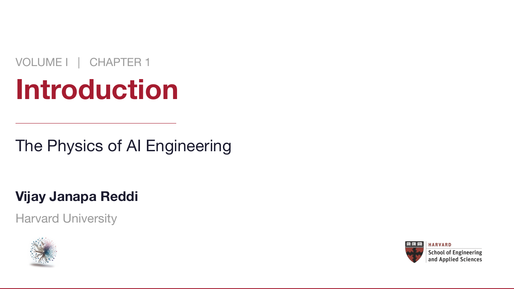
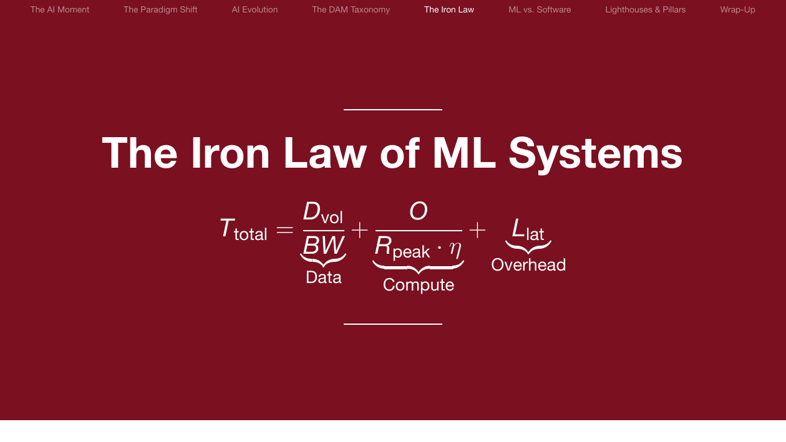
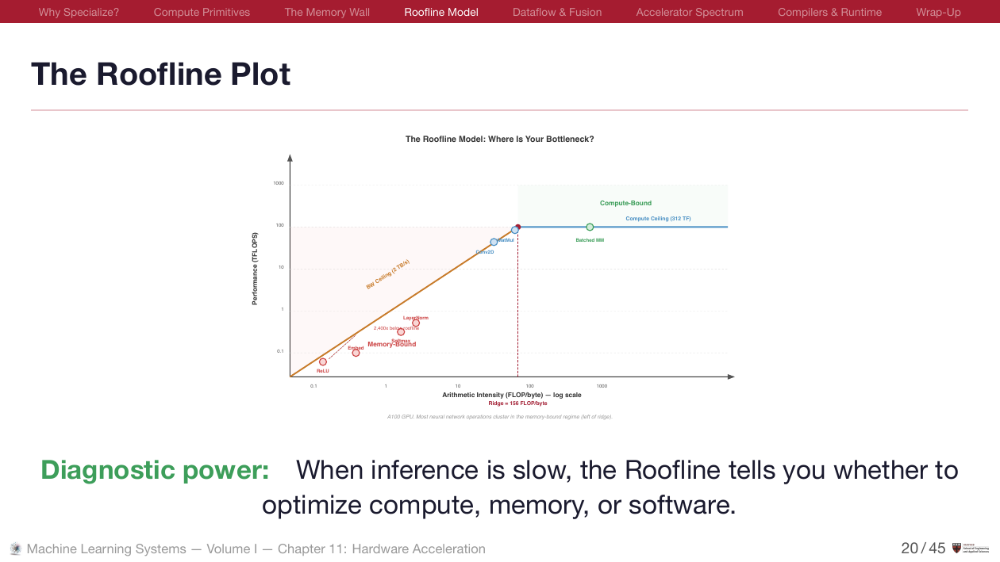
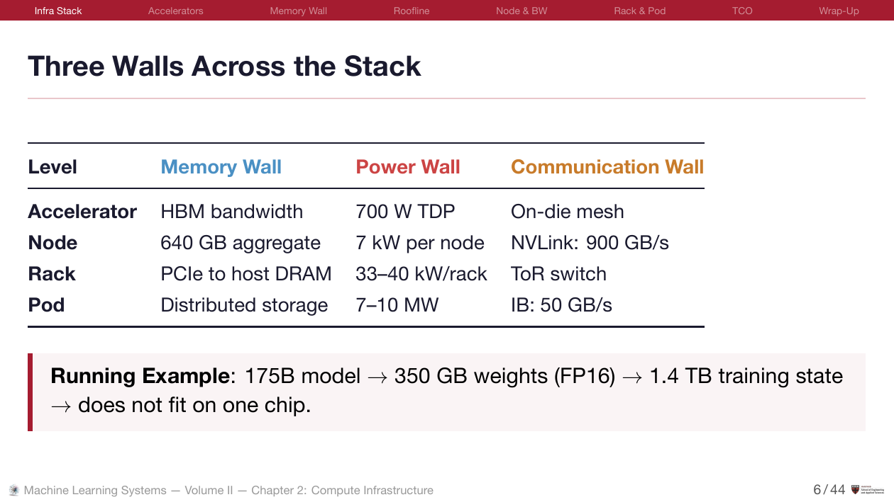
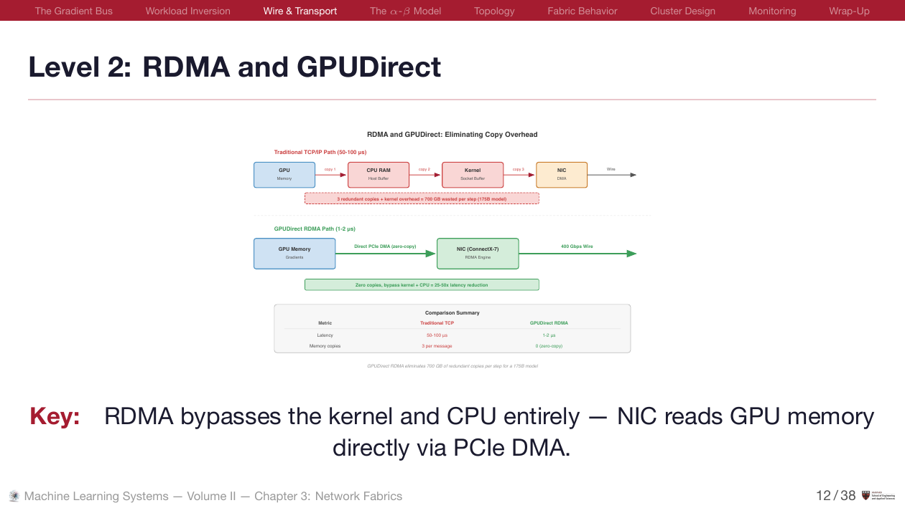
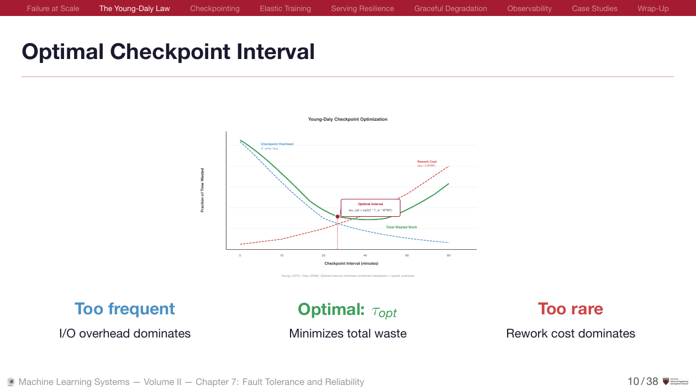
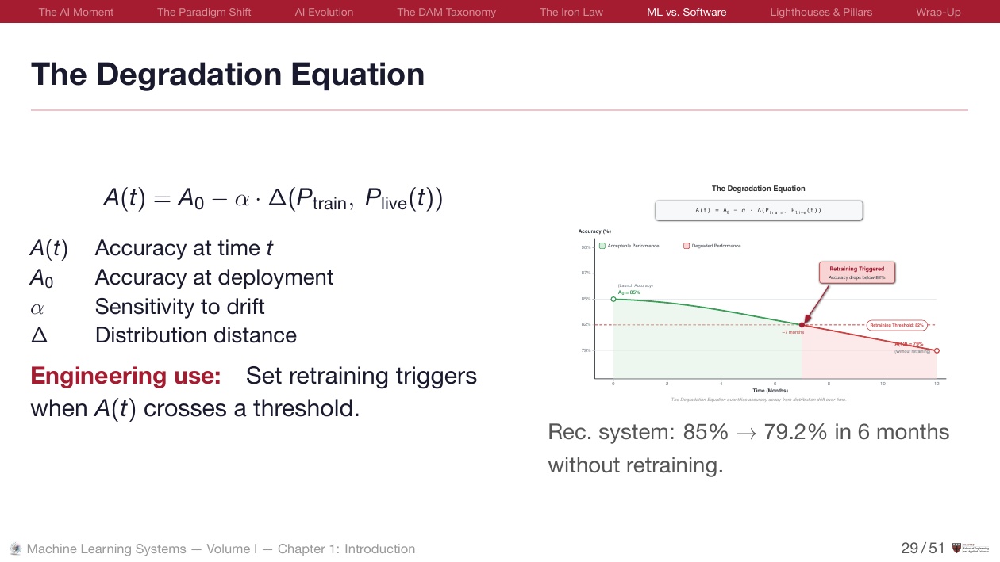

```{=html}
<style>
/* Page-local layout only. Shared components (.section-header, .vol-card,
   .inv-table, .btn-*) live in styles.css - do not redefine them here. */

/* ---------- Action Row ---------- */
.action-row {
  display: flex;
  gap: 0.75rem;
  flex-wrap: wrap;
  margin-bottom: 2.5rem;
}
.action-row .btn-accent,
.action-row .btn-outline { margin: 0; }

/* ---------- Footer CTA ---------- */
.footer-box {
  border-top: 2px solid var(--mls-text);
  padding: 1.75rem 0 0;
  margin-top: 3.5rem;
}
.footer-box h3 {
  font-size: 1.15rem;
  margin: 0 0 0.3rem;
  border: none !important;
  padding: 0 !important;
}
.footer-box p {
  color: var(--mls-text-muted);
  font-size: 0.9rem;
  margin: 0 0 1.1rem;
}
.footer-box .btn-accent,
.footer-box .btn-outline { margin: 0 0.5rem 0 0; }


/* ── Carousel Controls ───────────────────────────────────────────── */
#slideCarousel {
  position: relative;
  margin-top: 1.75rem;
}
#slideCarousel .carousel-control-prev,
#slideCarousel .carousel-control-next {
  width: 40px; height: 40px;
  top: 50%; transform: translateY(-50%);
  background: rgba(0,0,0,0.5);
  border-radius: 50%;
  opacity: 0.7;
  transition: opacity 0.2s;
}
#slideCarousel .carousel-control-prev { left: 8px; }
#slideCarousel .carousel-control-next { right: 8px; }
#slideCarousel .carousel-control-prev:hover,
#slideCarousel .carousel-control-next:hover { opacity: 1; }
#slideCarousel .carousel-control-prev-icon,
#slideCarousel .carousel-control-next-icon {
  width: 16px; height: 16px;
}
#slideCarousel .carousel-indicators {
  bottom: -8px;
}
#slideCarousel .carousel-indicators button {
  width: 8px; height: 8px;
  border-radius: 50%;
  background: #94a3b8;
  border: none;
  opacity: 0.5;
  margin: 0 4px;
}
#slideCarousel .carousel-indicators button.active {
  background: #BE185D;
  opacity: 1;
}
</style>

<!-- Slide Preview Carousel -->
<div id="slideCarousel" class="carousel slide mb-4" data-bs-ride="carousel" data-bs-interval="4000">
  <div class="carousel-inner" style="background: #1a1a2e; border: 1px solid #2a2a3e; border-radius: 10px; padding: 0.5rem;">
    <div class="carousel-item active">
      
      <p style="text-align:center; font-size: 0.8rem; color: #64748b; margin-top: 0.5rem;">Vol I · Ch 1: Title Slide — Custom Beamer Theme</p>
    </div>
    <div class="carousel-item">
      
      <p style="text-align:center; font-size: 0.8rem; color: #64748b; margin-top: 0.5rem;">Vol I · Ch 1: The Iron Law — Focus Slides for Key Equations</p>
    </div>
    <div class="carousel-item">
      
      <p style="text-align:center; font-size: 0.8rem; color: #64748b; margin-top: 0.5rem;">Vol I · Ch 11: The Roofline Model — Original SVG Diagrams</p>
    </div>
    <div class="carousel-item">
      
      <p style="text-align:center; font-size: 0.8rem; color: #64748b; margin-top: 0.5rem;">Vol II · Ch 2: Three Walls — Quantitative Systems Tables</p>
    </div>
    <div class="carousel-item">
      
      <p style="text-align:center; font-size: 0.8rem; color: #64748b; margin-top: 0.5rem;">Vol II · Ch 3: RDMA &amp; GPUDirect — Semantic Color Diagrams</p>
    </div>
    <div class="carousel-item">
      
      <p style="text-align:center; font-size: 0.8rem; color: #64748b; margin-top: 0.5rem;">Vol II · Ch 7: Optimal Checkpointing — Math + Visualization</p>
    </div>
    <div class="carousel-item">
      
      <p style="text-align:center; font-size: 0.8rem; color: #64748b; margin-top: 0.5rem;">Vol I · Ch 1: The Degradation Equation — Every Slide Has Speaker Notes</p>
    </div>
  </div>
  <button class="carousel-control-prev" type="button" data-bs-target="#slideCarousel" data-bs-slide="prev">
    <span class="carousel-control-prev-icon"></span>
  </button>
  <button class="carousel-control-next" type="button" data-bs-target="#slideCarousel" data-bs-slide="next">
    <span class="carousel-control-next-icon"></span>
  </button>
  <div class="carousel-indicators">
    <button type="button" data-bs-target="#slideCarousel" data-bs-slide-to="0" class="active"></button>
    <button type="button" data-bs-target="#slideCarousel" data-bs-slide-to="1"></button>
    <button type="button" data-bs-target="#slideCarousel" data-bs-slide-to="2"></button>
    <button type="button" data-bs-target="#slideCarousel" data-bs-slide-to="3"></button>
    <button type="button" data-bs-target="#slideCarousel" data-bs-slide-to="4"></button>
    <button type="button" data-bs-target="#slideCarousel" data-bs-slide-to="5"></button>
    <button type="button" data-bs-target="#slideCarousel" data-bs-slide-to="6"></button>
  </div>
</div>
<p style="text-align: center; font-size: 0.82rem; color: #64748b; margin-top: -0.5rem; margin-bottom: 1.5rem;">What a lecture actually looks like. Samples from Volume I and Volume II.</p>

<!-- Actions -->
<div class="action-row">
  <a href="https://github.com/harvard-edge/cs249r_book/releases/tag/slides-latest" class="btn-accent" target="_blank">Download All (PDF + PPTX)</a>
  <a href="teaching.html" class="btn-outline">Teaching Guide</a>
  <a href="https://github.com/harvard-edge/cs249r_book/tree/dev/slides" class="btn-outline" target="_blank">View Source</a>
</div>

<!-- Volume Cards -->
<div class="section-header">Slide Decks</div>
<div class="vol-grid">
  <a href="vol1.html" class="vol-card">
    <span class="tag">Volume I</span>
    <h3>Introduction to Machine Learning Systems</h3>
    <p>The full single-machine ML stack: data engineering, neural computation, architectures, frameworks, training, compression, hardware, serving, and operations.</p>
    <div class="card-meta">17 lectures</div>
  </a>
  <a href="vol2.html" class="vol-card">
    <span class="tag">Volume II</span>
    <h3>Machine Learning Systems at Scale</h3>
    <p>Distributed infrastructure: compute clusters, network fabrics, distributed training, fault tolerance, fleet orchestration, inference at scale, and governance.</p>
    <div class="card-meta">18 lectures</div>
  </a>
  <a href="tinyml.html" class="vol-card">
    <span class="tag">TinyML</span>
    <h3>Tiny Machine Learning</h3>
    <p>The edX courseware: ML fundamentals, keyword spotting, visual wake words, anomaly detection, embedded deployment on Arduino, and MLOps at scale.</p>
    <div class="card-meta">4 courses</div>
  </a>
</div>

<!-- What's Included -->
<div class="section-header">What You Get</div>
<table class="inv-table">
  <tr>
    <td>Semester plans</td>
    <td>16-week schedules for Volume I and Volume II, a combined 32-week sequence, and a 10 to 12 week TinyML syllabus.</td>
    <td><a href="teaching.html#suggested-semester-plans">Plans &rarr;</a></td>
  </tr>
  <tr>
    <td>Speaker notes</td>
    <td>Every slide carries timing, teaching guidance, the errors students actually make, and discussion prompts.</td>
    <td><a href="teaching.html">Guide &rarr;</a></td>
  </tr>
  <tr>
    <td>In-class exercises</td>
    <td>At least five per lecture, with worked answers. Prediction, calculation, peer instruction, and retrieval practice.</td>
    <td><a href="teaching.html#active-learning-1">Details &rarr;</a></td>
  </tr>
  <tr>
    <td>Ready to present</td>
    <td>PDF for projection and PPTX for presenter mode and annotation. Nothing to install.</td>
    <td><a href="https://github.com/harvard-edge/cs249r_book/releases/tag/slides-latest" target="_blank">Download &rarr;</a></td>
  </tr>
  <tr>
    <td>Yours to edit</td>
    <td>Full Beamer source with the theme, and every diagram as editable vector art rather than a flattened image.</td>
    <td><a href="teaching.html#customizing-the-slides">Customize &rarr;</a></td>
  </tr>
  <tr>
    <td>License</td>
    <td>CC BY-NC-SA 4.0. Teach from it, adapt it, and share your version, with attribution.</td>
    <td><a href="https://creativecommons.org/licenses/by-nc-sa/4.0/" target="_blank">Terms &rarr;</a></td>
  </tr>
</table>

<!-- Related Resources -->
<div class="section-header">Related Resources</div>
<table class="inv-table">
  <tr>
    <td>Textbook</td>
    <td>The slides are derived from this two-volume open textbook. Read online or download PDF.</td>
    <td><a href="https://mlsysbook.ai/vol1/">Vol I</a> · <a href="https://mlsysbook.ai/vol2/">Vol II</a></td>
  </tr>
  <tr>
    <td>Instructor Blueprint</td>
    <td>Syllabi, assessment rubrics, TA guide, and course customization — the full teaching toolkit.</td>
    <td><a href="https://mlsysbook.ai/instructors/">Blueprint &rarr;</a></td>
  </tr>
  <tr>
    <td>Interactive Labs</td>
    <td>34 browser-based labs powered by MLSys·im. Pair with slides for hands-on learning.</td>
    <td><a href="https://mlsysbook.ai/labs/">Labs &rarr;</a></td>
  </tr>
  <tr>
    <td>Hardware Kits</td>
    <td>Arduino, Raspberry Pi, and Seeed deployment labs for TinyML and edge AI.</td>
    <td><a href="https://mlsysbook.ai/kits/">Kits &rarr;</a></td>
  </tr>
</table>

<!-- Teaching CTA -->
<div class="footer-box">
  <h3>Teach from the decks</h3>
  <p>Use the teaching guide for semester plans, customization notes, active-learning prompts, and source-level rebuild instructions.</p>
  <a href="teaching.html" class="btn-accent">Teaching Guide</a>
  <a href="https://github.com/harvard-edge/cs249r_book" class="btn-outline" target="_blank">GitHub</a>
</div>
```


