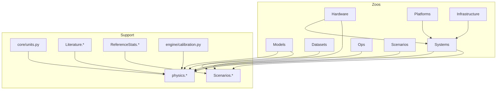

# MLSysSim Data Model

Eight **zoos** (typed registries) plus support layers. Book LEGO cells and
tutorials should prefer zoos + `mlsysim.physics.*` + explicit operands.
Measurement units live in `core/units.py`, physical constants in
`physics/constants.py`, and domain values in registries; the former
`core/constants.py` shim is deleted (no-backward-compat policy).

This document is the *registry-level* view. The *runtime* view — how workloads,
hardware, infrastructure, and systems feed the solver layer — is the 5-layer
model in [architecture.qmd](architecture.qmd): the zoos below are the registries
that populate Layers A–D of that stack.

## Zoos

| Zoo | Registry | Role |
|-----|----------|------|
| Hardware | `Hardware.Cloud.*`, `Hardware.Edge.*`, … | Chip/board/appliance specs (datasheet truth). **Canonical paths only** — no bare `Hardware.H100`. |
| Models | `Models.*` | Workloads and architectures (parameters, layers, FLOPs). |
| Datasets | `Datasets.*` | Data zoo — ImageNet, MNIST, CIFAR, etc. |
| Platforms | `Platforms.*` | Abstract deployment envelopes (RAM, storage, latency ranges). Replaces `Systems.Tiers`. |
| Infrastructure | `Infrastructure.Grids.*`, `Infrastructure.Datacenters.*`, `Infrastructure.Pricing.*`, `Infrastructure.Capacity.*` | Site/energy/economics layer — utility grid, facility PUE, pricing, and capacity facts. **Not** GPU fleets or network fabrics. |
| Systems | `Systems.Nodes.*`, `Systems.Racks.*`, `Systems.Fabrics.*`, `Systems.Clusters.*`, `Systems.Pods.*`, `Systems.Storage.*` | Composed physical systems and topology. Fleets live in `Systems.Clusters` (type `Fleet`); rack-level aggregates live in `Systems.Racks`. |
| Ops | `Ops.Monitoring.*`, `Ops.TrainingRunOverheads.*` | Operational policies, thresholds, and goodput-loss profiles. |
| Scenarios | `Scenarios.*` | Executable workload + system + constraint bundles. |

## Support (not zoos)

- **`mlsysim.core.units`** — pint units, byte/bit widths, precision map.
- **`mlsysim.physics.*`** — physical constants and formulas.
- **`Literature.*`** — cited appendix scalars (MFU bands, Chinchilla, communication, batch-size anchors).
- **`Scenarios.*`** — executable workload + system + constraint bundles, suitable for `Scenario.evaluate()`.
- **`ReferenceStats.*`** — non-executable sourced anchors for real-world scenario and case-study statistics.
- **`Systems.Reliability` / `Orchestration`** — MTTF, recovery, scheduling assumptions.
- **`Ops.Monitoring` / `TrainingRunOverheads`** — PSI, KS, drift thresholds, training goodput-loss profiles.
- **`mlsysim.engine.calibration`** — solver/engine default kwargs (not appendix tables).
- **`Infrastructure.Pricing`** — cloud, storage, labeling, fleet economics (`PricePoint.rate`).
- **Regional carbon / PUE / fleet / fabrics** — `Infrastructure.Grids`, `FacilityCooling`, `Systems.Clusters`, `Systems.Fabrics`.

## Validation invariants

MLSys·im is used to generate textbook calculations, so registry and CLI data are
validated before they reach solver equations.

- **Explicit units are required for physical quantities.** A capacity must be
  written as `80 GB` or `80 GiB`, not `80`. A model size must be bytes, a power
  value must be watts, and a latency value must be time.
- **Compute work carries its own dimension.** FLOPs (and integer-op rates such
  as TOPS) live on a dedicated `[flop]` pint dimension (2026-06-06), so
  `1 TFLOP/s` can never silently add to or convert into `900 GB/s` — pint
  itself raises `DimensionalityError`. Bytes, counts, parameters, and dollars
  remain dimensionless aliases, and MLSys·im's unit-family checks keep those
  semantically distinct at every schema boundary.
- **Precision names are closed vocabulary.** Use the precision names in
  `core.units.PRECISION_MAP`; unsupported values fail instead of silently using
  FP16 storage.
- **Distributed topology must divide exactly.** Tensor, pipeline, and expert
  parallel groups must divide total accelerators without flooring. CLI fleet
  plans must likewise specify topology that divides cleanly.

## Relationships

- **Fleet ≠ datacenter:** `Systems.Clusters.*` (Fleet) references optional `Infrastructure.Datacenters.*` / grid for carbon and PUE.
- **NVL72** is `Hardware.Cloud.GB200_NVL72`, not an Infrastructure rack entry.
- **Networks/fabrics:** interconnect specs on Hardware; topology instances under `Systems.Fabrics`.
- **Scenario ≠ model or hardware:** a scenario composes existing model and system facts with local constraints. It does not redefine GPT-4, H100, or a fleet.
- **Reference statistics are not scenarios:** `ReferenceStats.MobilePower.*` and `ReferenceStats.Workloads.*` are sourced anchors for book calculations, not runnable bundles.

## Ownership Rule

When adding a number, classify the semantic object before choosing a namespace:

| Question | Home |
|----------|------|
| Is this a datasheet fact about a chip, board, appliance, NIC, or storage device? | `Hardware.*` |
| Is this a composed physical setup such as a node, rack, cluster, fabric, or storage path? | `Systems.*` |
| Is this a grid, datacenter, price, capacity, or facility-envelope fact? | `Infrastructure.*` |
| Is this an operational threshold, run-overhead profile, or monitoring policy? | `Ops.*` |
| Is this a cited scalar from a paper/table used as a literature anchor? | `Literature.*` |
| Is this a runnable workload + system + constraint bundle? | `Scenarios.*` |
| Is this a non-executable sourced world statistic or case-study anchor? | `ReferenceStats.*` |
| Is this a reusable teaching/problem setting that is not a physical system or runnable scenario? | `ReferenceStats.*` or local LEGO, depending on reuse and provenance |
| Is this a one-off knob that defines a local exercise? | Keep it local in the LEGO cell and label it as a scenario assumption. |

`Provenance` is metadata attached to entries in any of these homes. It does not
decide the namespace; the type of thing being modeled does.

## Consumer Conventions

1. Use explicit zoo paths for registry operands.
2. Use `mlsysim.physics.*` for derived quantities; registries for operands.
3. Use `Scenario.evaluate()` when a runnable workload + system + constraint bundle is needed.
4. Use `ReferenceStats.*` for non-executable anchors. Do not route reference statistics through `Scenarios.*`.

## Migration tiers (QMD)

| Tier | Source | Target |
|------|--------|--------|
| A | GPU/chip constants (`H100_*`, `NVLINK_*`, …) | `Hardware.*` |
| B | Network/fabric (`INFINIBAND_*`, `ETHERNET_*`, …) | `Hardware.Networks.*` / `Systems.Fabrics.*` |
| C | Model/dataset constants | `Models.*` / `Datasets.*` |
| D | Economics/reliability/ops/literature | `Infrastructure.Pricing.*`, `Systems.Reliability.*`, `Ops.*`, `Literature.*`, `Scenarios.*` |
| Platforms | `Systems.Tiers`, tier latency/RAM strings | `Platforms.*` |

## No aliases

Hard-delete migrated symbols from `constants.py` after parity tests pass.
Do not keep `Hardware.H100`, `Infrastructure.Quebec`, or `Systems.Cloud = …` shims.

## Verification gates (every commit)

- L1: pytest, exec affected QMD cells, `lego_focal_verify.py`
- L2: `test_registry_parity.py` for deleted symbols
- L3–L5: fmt, HTML build, `audit_lego_html.py` when QMD touched
- L6: downstream content sign-off before rendered-content commits

See `PROVENANCE.md` and `docs/contributing.qmd` for package-side provenance rules.
